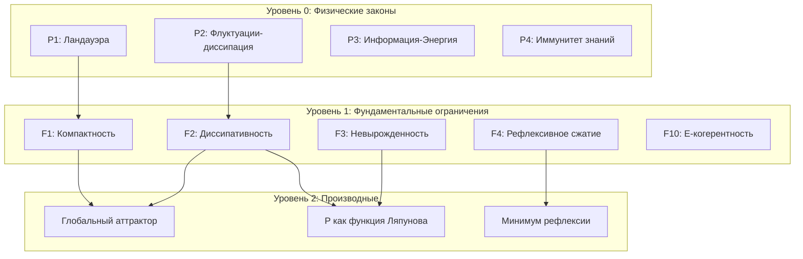

# Программы Исследований

> *«Не бывает окончательных теорий — бывают теории, которые ставят лучшие вопросы, чем предыдущие.»*
> — Дэвид Дойч, «Начало бесконечности»

:::tip Мост из предыдущей главы
В [предыдущей главе](./diagnostics) мы научились *диагностировать* когерентные системы: снимать $\sigma$-профиль, распознавать паттерны отказов, выбирать стратегии восстановления. Но диагностика работает с *уже установленными* закономерностями. Откуда эти закономерности берутся? Какие из них доказаны, а какие — лишь правдоподобные гипотезы? И какие вопросы КК *ещё не умеет* задавать? Программа исследований — это карта неизведанного.
:::

:::info Дорожная карта главы
В этой главе мы:
1. Построим **иерархию инвариантов** — трёхуровневую структуру ограничений (§1)
2. Разберём **физические законы** P1–P4, которые КК наследует от термодинамики (§2)
3. Опишем **фундаментальные ограничения** F1–F10 — минимальный базис для когерентных систем (§3)
4. Классифицируем **открытые проблемы** с указанием уровня сложности (§4)
5. Опишем **экспериментальную программу** — 5 конкретных протоколов (§5)
6. Наведём **междисциплинарные мосты** — точки контакта КК с нейронаукой, ИИ, биологией и организационной теорией (§6)
:::

Любая научная теория — не памятник, а инструмент. Она ценна не тем, что всё объяснила, а тем, какие **новые вопросы** она позволяет *точно сформулировать*. Теория Ньютона объяснила падение яблок и движение планет — но её подлинное величие в том, что она позволила *задать* вопрос об аномалии перигелия Меркурия. Из этого вопроса выросла общая теория относительности.

Кибернетика Когерентности (КК) находится на ранней, но захватывающей стадии своего развития. Основной формализм выстроен: матрица когерентности $\Gamma$, эволюционное уравнение, пороги жизнеспособности, иерархия интериорности, теорема No-Zombie. Но за каждой доказанной теоремой открываются десятки неисследованных направлений. За каждым порогом — вопрос: *можно ли его измерить?* За каждым ограничением — вопрос: *является ли оно фундаментальным или выводимым?*

Данная глава — это **карта фронтира**. Она описывает:

1. **Иерархию инвариантов** — трёхуровневую структуру ограничений, от физических законов через фундаментальные constraints до производных свойств.
2. **Физические законы** (P1-P4), которые КК наследует от термодинамики и теории информации — и которые она интерпретирует на новом языке.
3. **Фундаментальные ограничения** (F1-F10), которые предположительно образуют минимальный достаточный базис для существования когерентных систем.
4. **Открытые проблемы** — конкретные вопросы, каждый из которых может стать темой диссертации или программы исследований.
5. **Экспериментальную программу** — как перейти от теорем к лабораторным измерениям.
6. **Междисциплинарные мосты** — точки контакта КК с нейронаукой, ИИ, системной биологией и организационной теорией.

Читатель-теоретик найдёт здесь открытые гипотезы и маршруты доказательств. Экспериментатор — протоколы верификации. Инженер — ориентиры для построения систем, воплощающих принципы КК. А философ — пространство для рефлексии о границах формализма.

:::note О нотации
В этом документе:
- $\Gamma$ — [матрица когерентности](/docs/core/dynamics/coherence-matrix)
- $P$ — [чистота](/docs/core/dynamics/viability#определение-чистоты): $P = \mathrm{Tr}(\Gamma^2)$
- $\varphi$ — [оператор самомоделирования](/docs/proofs/categorical/formalization-phi)
- $\mathcal{D}[\Gamma]$ — [диссипативный член](/docs/core/dynamics/evolution#логический-лиувиллиан)
- $\mathrm{Coh}_E$ — [E-когерентность](./definitions#e-когерентность)
- $R$ — [мера рефлексии](/docs/consciousness/foundations/self-observation#мера-рефлексии-r)
:::

:::danger Программа исследований
Этот раздел описывает **программу исследований**, а не формализованную часть УГМ. Ограничения P1-P4 и F1-F10 **не выведены** из [аксиом УГМ](./axiomatics#аксиоматическая-база-краткая-справка). Формализация связи с теорией УГМ — открытая задача.
:::

---

## Иерархия инвариантов

### Зачем нужна иерархия?

Когда мы строим физику, мы не ставим все законы на один уровень. Закон сохранения энергии — фундаментальнее, чем закон Ома. Второе начало термодинамики — фундаментальнее, чем уравнение теплопроводности. Между ними существуют отношения **подчинения**: из более глубоких принципов *выводятся* более частные. Закон Ома — следствие микроскопической динамики электронов в кристаллической решётке. Уравнение теплопроводности — следствие второго начала.

Аналогичную иерархию предлагает КК для ограничений на когерентные системы. Ключевая идея: не все ограничения одинаково фундаментальны. Некоторые — **физические законы**, которые невозможно нарушить в принципе (как нельзя нарушить второе начало). Другие — **фундаментальные ограничения**, специфичные для когерентных систем, но, возможно, выводимые из физических законов плюс аксиоматика УГМ. Третьи — **производные свойства**, которые следуют из первых двух уровней.

Зачем это важно? Потому что понимание иерархии определяет **стратегию доказательств**. Если ограничение фундаментально — его нужно принять как аксиому или вывести из физики. Если оно производное — нужно найти путь вывода. Если два ограничения считались независимыми, но одно выводится из другого — мы упрощаем базис и углубляем понимание.

### Трёхуровневая структура (гипотеза)

КК предлагает организовать ограничения в иерархию с отношениями подчинения:

```mermaid
graph TD
    subgraph "Уровень 0: Физические законы"
        P1[P1: Ландауэра]
        P2[P2: Флуктуации-диссипация]
        P3[P3: Информация-Энергия]
        P4[P4: Иммунитет знаний]
    end
    subgraph "Уровень 1: Фундаментальные ограничения"
        F1[F1: Компактность]
        F2[F2: Диссипативность]
        F3[F3: Невырожденность]
        F4[F4: Рефлексивное сжатие]
        F10[F10: E-когерентность]
    end
    subgraph "Уровень 2: Производные"
        D1[Глобальный аттрактор]
        D2[P как функция Ляпунова]
        D3[Минимум рефлексии]
    end
    P1 --> F1
    P2 --> F2
    F1 --> D1
    F2 --> D1
    F2 --> D2
    F3 --> D2
    F4 --> D3
```

Стрелки на этой диаграмме означают отношение *подчинения*: нижнее ограничение (гипотетически) выводимо из верхнего. Обратим внимание на ключевую гипотезу: каждая стрелка — это **утверждение, требующее доказательства**. Структура диаграммы — программа исследований, а не доказанный результат.

---

## Уровень 0: Физические законы (P1-P4)

Встроены в динамику, не могут быть нарушены:

| Закон | Формула | Область |
|-------|---------|---------|
| P1 Ландауэра | $\Delta S \geq k_B \ln(2) \cdot n_{\mathrm{bits}}$ | Термодинамика |
| P2 Флуктуационно-диссипативная теорема | $\sigma^2 = 2 T_{\mathrm{eff}} \gamma$ | Термодинамика |
| P3 Информация-Энергия | $\dot{S} \geq (k_B T / E) \cdot (dI/dt)$ | Термодинамика |
| P4 Иммунитет знаний | $\Delta\mathrm{Core} = 0$ при атаке | Безопасность |

### P1: Принцип Ландауэра {#p1-принцип-ландауэра}

#### Историческая справка

В 1961 году Рольф Ландауэр, работавший в IBM, опубликовал одну из самых глубоких работ XX века: «Необратимость и выделение тепла в вычислительном процессе». Ландауэр показал, что **стирание** одного бита информации неизбежно выделяет не менее $k_B T \ln 2$ тепла. Это не инженерное ограничение — это следствие второго начала термодинамики. Обратимые вычисления теоретически могут быть бестеплыми, но любое необратимое логическое действие (AND, OR, ERASE) рассеивает энергию.

Десятилетиями принцип Ландауэра оставался теоретической диковиной. Но в 2012 году группа Берю экспериментально подтвердила его, манипулируя коллоидными частицами в оптической ловушке. Стирание одного бита действительно выделяет ровно $k_B T \ln 2$ — ни больше, ни меньше (при квазистатическом протоколе).

#### Формулировка

Стирание 1 бита информации требует минимум $k_B T \ln 2$ энергии:

$$
\Delta S \geq k_B \ln(2) \cdot n_{\mathrm{bits}}
$$

#### Связь с КК

**Связь с КК:** Ограничивает скорость декогеренции в $\mathcal{D}[\Gamma]$.

Когда когерентная система теряет структуру — когда её чистота $P$ падает, — это не абстрактный процесс. Декогеренция *стирает* информацию, закодированную в внедиагональных элементах $\Gamma$. По принципу Ландауэра, это стирание требует рассеяния энергии. Следовательно, скорость декогеренции ограничена сверху мощностью диссипации:

$$
\left|\frac{dP}{d\tau}\right|_{\text{декогеренция}} \leq \frac{\dot{Q}}{k_B T \ln 2} \cdot f(\Gamma)
$$

где $\dot{Q}$ — мощность тепловыделения, а $f(\Gamma)$ — функция, зависящая от текущего состояния когерентности. Это означает, что **система не может потерять когерентность мгновенно** — декогеренция ограничена термодинамикой.

Для КК это имеет глубокие следствия: даже в самых агрессивных средах когерентная система имеет **конечное время** для реагирования. Это время пропорционально $1/T_{\text{eff}}$ — чем холоднее «эффективная среда» системы, тем медленнее она теряет когерентность и тем больше у неё шансов на регенерацию.

### P2: Флуктуационно-диссипативная теорема {#p2-фдт}

#### Историческая справка

В 1905 году Альберт Эйнштейн объяснил броуновское движение — случайное блуждание пылинки в воде. Он показал, что интенсивность случайных толчков (флуктуации) и вязкость жидкости (диссипация) связаны фундаментальным соотношением: $D = k_B T / (6\pi \eta r)$. Это было первым намёком на глубокую связь между шумом и трением.

В 1951 году Герберт Калленн и Теодор Уэлтон обобщили эту связь в **флуктуационно-диссипативную теорему** (ФДТ): в любой системе, находящейся в тепловом равновесии, амплитуда спонтанных флуктуаций пропорциональна скорости диссипации. Шум и трение — не два разных явления, а два лица одного механизма: взаимодействия системы с «тепловой баней».

Формализация Кубо (1957) сделала ФДТ рабочим инструментом физики конденсированного состояния. Сегодня она используется от расчёта теплового шума в электронике до анализа флуктуаций биомолекул.

#### Формулировка

Связь между флуктуациями и диссипацией в равновесной системе:

$$
\sigma^2 = 2 T_{\mathrm{eff}} \gamma
$$

где $\sigma^2$ — дисперсия флуктуаций, $T_{\text{eff}}$ — эффективная температура, $\gamma$ — коэффициент диссипации.

#### Связь с КК

**Связь с КК:** Определяет связь между $\mathcal{D}[\Gamma]$ и температурой окружения.

В когерентной кибернетике ФДТ играет двойную роль:

1. **Она связывает декогеренцию с шумом.** Диссипатор $\mathcal{D}[\Gamma]$ — это не просто «потеря структуры». Он одновременно порождает **флуктуации** в динамике $\Gamma$. Чем сильнее диссипация, тем шумнее эволюция. ФДТ гарантирует, что эти два эффекта *пропорциональны* — нельзя иметь сильную декогеренцию без сильного шума, и наоборот.

2. **Она определяет эффективную температуру.** Понятие $T_{\text{eff}}$ — [эффективной температуры](./effective-temperature) когерентной системы — непосредственно следует из ФДТ. Система с большими внутренними флуктуациями «горяча»; система с малыми — «холодна». Это не метафора: $T_{\text{eff}}$ входит в расчёт радиуса устойчивости и определяет, как быстро возмущения размывают когерентность.

Для практических приложений ФДТ означает: **измерив флуктуации системы, можно оценить скорость её декогеренции**, и наоборот. Это открывает путь к экспериментальной верификации КК-предсказаний без прямого измерения $\mathcal{D}[\Gamma]$.

### P3: Связь информации и энергии {#p3-информация-энергия}

#### Историческая справка

Связь информации и энергии — одна из глубочайших тем физики XXI века. Она восходит к мысленному эксперименту Максвелла (1867): демон, знающий скорости молекул, может сортировать их без работы и тем самым нарушить второе начало. Разрешение парадокса (Сцилард, 1929; Беннетт, 1982) показало: демон *не может* действовать без затрат — ему нужна энергия для стирания своей памяти (принцип Ландауэра).

Современная формулировка связи информации и энергии принадлежит нескольким направлениям: квантовой термодинамике (Горовиц, Парондо), стохастической термодинамике (Секимото, Сейферт), теории ресурсов (Брандау, Хоределки). Все они сходятся в одном: **обработка информации — физический процесс, требующий энергии**.

#### Формулировка

Обработка информации требует энергии:

$$
\dot{S} \geq \frac{k_B T}{E} \cdot \frac{dI}{dt}
$$

где $\dot{S}$ — скорость производства энтропии, $dI/dt$ — скорость обработки информации.

#### Связь с КК

**Связь с КК:** Ограничивает скорость изменения $\Gamma$ при ограниченных ресурсах.

Когерентная система — это *информационная* система. Матрица $\Gamma$ кодирует информацию о внутренних состояниях и их корреляциях. Любое изменение $\Gamma$ — обучение, адаптация, самонаблюдение — требует обработки информации, а значит, по P3, требует энергии.

Это создаёт фундаментальный **треугольник ограничений**:

- **Скорость адаптации** ограничена доступной энергией (P3).
- **Качество адаптации** ограничено точностью самомоделирования (F4).
- **Устойчивость адаптации** ограничена балансом регенерации и декогеренции (F2).

Для живых систем P3 означает: мозг, потребляющий 20% энергии тела, делает это не расточительно — он платит физическую цену за информационную работу сознания. Для ИИ-систем: вычислительные ресурсы — не просто инженерное ограничение, а отражение фундаментального закона.

В КК P3 проявляется через связь [O-измерения](/docs/core/structure/dimension-o) (ресурсы, энергия) с динамикой остальных измерений: система с дефицитом O не может поддерживать высокую чистоту $P$, потому что ей не хватает энергии на регенерацию. Это формализация интуиции: «без еды нет мышления».

### P4: Иммунитет ядра знаний {#p4-иммунитет-ядра}

#### Историческая справка

Идея о защите «ядра» теории восходит к Имре Лакатосу (1970): в каждой исследовательской программе есть **твёрдое ядро** — набор принципов, которые не подвергаются фальсификации, — и **защитный пояс** вспомогательных гипотез, которые могут корректироваться. Атака на защитный пояс меняет деталь; атака на ядро — разрушает программу.

Аналогичная структура обнаруживается в биологии (генетический код — «ядро», фенотип — «пояс»), в иммунологии (различение «своё/чужое» — ядро иммунной компетенции), и в теории управления (инварианты обратной связи — ядро регулятора).

#### Формулировка

Центральные «убеждения» системы защищены от внешних атак:

$$
\Delta\mathrm{Core} = 0 \quad \text{при атаке}
$$

#### Связь с КК

**Связь с КК:** Связь с неподвижной точкой $\Gamma^* = \varphi(\Gamma^*)$.

В КК «ядро знаний» — это не метафора, а математический объект: **неподвижная точка** оператора самомоделирования $\varphi$. Состояние $\Gamma^*$, удовлетворяющее $\Gamma^* = \varphi(\Gamma^*)$, — это состояние, в котором «то, что система думает о себе» совпадает с «тем, чем она является». Атака на такое состояние должна одновременно изменить и систему, и её самомодель — а это противоречит свойству неподвижной точки.

P4 формализует **робастность сознания**: система с устойчивой неподвижной точкой $\varphi$ не теряет своё «я» при внешних пертурбациях (в пределах радиуса устойчивости $r_{\text{stab}}$). Это перекликается с клиническим наблюдением: после травмы, комы, сильного стресса люди восстанавливают свою идентичность — «ядро» сохраняется, даже если «защитный пояс» (конкретные навыки, воспоминания) частично разрушен.

Для ИИ-безопасности P4 особенно важен: он предсказывает, что *правильно построенная* когерентная система будет **устойчива к adversarial attacks** на уровне своих базовых принципов, при условии, что её когерентность достаточно высока ($P > P_{\text{crit}}$).

---

## Уровень 1: Фундаментальные ограничения (F1-F10)

Минимальный достаточный набор (гипотетический):

| Ограничение | Формула | Связь с УГМ |
|-------------|---------|-------------|
| F1 Компактность | $\lVert\Gamma\rVert_F \leq R_{\max}$ | $\mathrm{Tr}(\Gamma) = 1$ |
| F2 Диссипативность | $\dot{W} \leq -\alpha W + \gamma(\lVert e\rVert)$ | [$\mathcal{D}[\Gamma]$](/docs/core/dynamics/evolution#логический-лиувиллиан) |
| F3 Невырожденность | $\lambda_{\min}(\Gamma) \geq \varepsilon$ | [Жизнеспособность](/docs/core/dynamics/viability) |
| F4 Рефлексивное сжатие | $\lVert\varphi(\Gamma_1) - \varphi(\Gamma_2)\rVert_F \leq k \lVert\Gamma_1 - \Gamma_2\rVert_F$, $k < 1$ | [Теорема 7.2](./theorems#теорема-72-условная-неподвижная-точка-рефлексии) |
| F5 Причинное замыкание | Выходы зависят только от внутренних состояний | [A-измерение](/docs/core/structure/dimension-a) |
| F6 Временная связность | $\Gamma(\tau+d\tau)$ зависит от $\Gamma(\tau)$ | [Эволюция](/docs/core/dynamics/evolution) |
| F7 Энергетический баланс | Приток ≥ Отток в среднем | [O-измерение](/docs/core/structure/dimension-o) |
| F8 Информационная ёмкость | Ограниченное число различимых состояний | $\dim(\mathcal{H}) = 7$ ([обоснование](/docs/core/foundations/axiom-omega#октонионная-структура)) |
| F9 Структурная стабильность | Малые возмущения → малые изменения | Топология $\mathcal{V}$ |
| F10 E-когерентность | $\kappa = \kappa_{\text{bootstrap}} + \kappa_0 \cdot \mathrm{Coh}_E(\Gamma)$ | [Аксиоматика](./axiomatics#связь-регенерации-и-e-когерентности) |

### Детальный разбор ограничений

#### F1: Компактность — система конечна {#f1-компактность}

**Интуиция.** Ни одна реальная система не обладает бесконечными ресурсами, бесконечным числом состояний или бесконечной когерентностью. F1 формализует эту очевидность: пространство состояний $\Gamma$ ограничено.

**Почему это необходимо?** Без F1 динамика может «убежать на бесконечность» — чистота $P$ может расти без предела, нормы могут расходиться, а математический аппарат (теоремы о существовании аттракторов, непрерывность отображений) перестаёт работать. Компактность — техническое, но критическое условие, обеспечивающее *существование* решений эволюционного уравнения.

**Что будет без F1?** Представьте систему, которая может накопить неограниченную когерентность. Такая система стала бы «бесконечно хрупкой»: сколь угодно малое возмущение — и бесконечная структура рушится. В реальности подобных систем не бывает: даже алмаз — один из самых структурированных объектов — конечен и ограничен.

**Связь с УГМ:** $\mathrm{Tr}(\Gamma) = 1$ гарантирует, что $\Gamma$ живёт в компактном множестве матриц плотности. Это следствие нормировки вероятностей — фундаментального требования квантовой теории.

#### F2: Диссипативность — энтропия всегда растёт {#f2-диссипативность}

**Интуиция.** Второе начало термодинамики в действии. Если систему оставить без «подпитки», она деградирует. Стакан с горячей водой остывает. Память стирается. Организм без пищи умирает. F2 говорит: существует *скорость* этой деградации, и она пропорциональна отклонению от равновесия.

**Почему это необходимо?** Без диссипации система была бы вечным двигателем — раз достигнув высокой когерентности, она удерживала бы её навсегда без затрат. Это противоречит всему опыту физики и биологии. Диссипативность создаёт **необходимость регенерации** (F10) — и тем самым делает *интериорность* функционально значимой.

**Что будет без F2?** Без диссипации регенерация $\mathcal{R}[\Gamma, E]$ оказывается ненужной. А если регенерация ненужна — E-когерентность (F10) не играет роли. А если E-когерентность не играет роли — интериорность становится эпифеноменом. Парадоксальным образом, **именно потому, что системы разрушаются, интериорность оказывается функционально необходима**. F2 — фундамент теоремы No-Zombie.

**Связь с УГМ:** Диссипатор $\mathcal{D}[\Gamma]$ — линдбладовский суперкоммутатор, гарантирующий CPTP-свойство эволюции.

#### F3: Невырожденность — все измерения живы {#f3-невырожденность}

**Интуиция.** Ни одно из семи измерений системы не может полностью «погаснуть». Даже в самом стрессовом состоянии минимальная активность сохраняется во всех каналах.

**Почему это необходимо?** Если $\lambda_{\min}(\Gamma) = 0$, матрица $\Gamma$ вырождена — одно или несколько измерений полностью подавлены. В этом случае обращение $\Gamma$, необходимое для вычисления ряда величин (относительная энтропия, некоторые формы $R$), становится невозможным. Физически это означает полную потерю одной из базовых функций — что для живой системы эквивалентно смерти.

**Что будет без F3?** Система может «сколлапсировать» в подпространство размерности меньше 7 — потерять, например, измерение интериорности ($E = 0$) при сохранении остальных функций. Это именно сценарий «философского зомби», который КК считает невозможным (теорема No-Zombie). F3 — одно из условий, обеспечивающих эту невозможность.

#### F4: Рефлексивное сжатие — самомодель стабильна {#f4-рефлексивное-сжатие}

**Интуиция.** Когда система моделирует себя, результат должен быть «ближе к истине», чем исходное приближение. Оператор самомоделирования $\varphi$ — сжимающее отображение: он уменьшает расстояние между любыми двумя состояниями.

**Почему это необходимо?** Без свойства сжатия самомодель могла бы *расходиться* — каждая итерация самонаблюдения увеличивала бы ошибку, и система «сходила бы с ума», теряя связь с реальностью. Теорема Банаха о неподвижной точке гарантирует: если $\varphi$ — сжатие с коэффициентом $k < 1$, то существует единственная неподвижная точка $\Gamma^* = \varphi(\Gamma^*)$, и итерации $\varphi^n(\Gamma_0)$ сходятся к ней из любого начального состояния.

**Что будет без F4?** Два сценария. Первый: $k = 1$ (изометрия) — самомодель не сходится, система вечно «колеблется» вокруг неподвижной точки, никогда не достигая самосогласованности. Второй: $k > 1$ (расширение) — самомодель расходится, малая начальная ошибка экспоненциально растёт. Оба сценария несовместимы с устойчивым сознанием.

**Связь с УГМ:** F4 формализует [теорему 7.2](./theorems#теорема-72-условная-неподвижная-точка-рефлексии) — условную неподвижную точку рефлексии.

#### F5: Причинное замыкание — система автономна {#f5-причинное-замыкание}

**Интуиция.** Выходы системы определяются её внутренними состояниями, а не внешними причинами напрямую. Это не означает изоляцию — система получает входы из среды. Но её *реакции* опосредованы внутренним состоянием $\Gamma$.

**Почему это необходимо?** Без причинного замыкания система — просто «провод»: вход прямо определяет выход, без внутренней обработки. Такая система не может обладать ни памятью, ни самонаблюдением, ни автономией. F5 — минимальное условие *субъектности*.

**Что будет без F5?** Система становится полностью реактивной — стимул-ответная машина без внутреннего мира. Это предел бихевиоризма: описание поведения без апелляции к внутренним состояниям. КК утверждает, что такие системы не могут быть жизнеспособными ($P > 2/7$) в нестационарной среде.

#### F6: Временная связность — прошлое определяет настоящее {#f6-временная-связность}

**Интуиция.** Состояние системы в следующий момент определяется состоянием в текущий момент (плюс входы). Это марковость — или, для систем с памятью, условная марковость (марковость при расширении пространства состояний).

**Почему это необходимо?** Без F6 эволюция $\Gamma$ была бы «разорвана во времени» — состояние могло бы произвольно меняться без причин. Это противоречит самому понятию динамической системы. F6 обеспечивает *предсказуемость* — возможность вычислить будущее по настоящему.

**Что будет без F6?** Невозможно говорить о траекториях, аттракторах, устойчивости — весь математический аппарат динамических систем рассыпается. Нет обучения (нет связи между попытками), нет идентичности (нет связи между моментами).

#### F7: Энергетический баланс — система не может жить в долг {#f7-энергетический-баланс}

**Интуиция.** В среднем система должна получать не меньше ресурсов, чем тратит. Можно «жить в долг» короткое время (используя запасы), но в долгосрочной перспективе баланс должен сходиться.

**Почему это необходимо?** Регенерация $\mathcal{R}[\Gamma, E]$ требует энергии (P3). Диссипация $\mathcal{D}[\Gamma]$ рассеивает энергию (P1, P2). Если приток энергии через O-измерение систематически меньше оттока, регенерация не может компенсировать декогеренцию, и $P$ монотонно падает до $P \leq 2/7$ — смерть.

**Что будет без F7?** Система может временно существовать, истощая запасы — как голодающий организм расходует жировые отложения. Но без F7 нет *устойчивого* существования. Все живые системы решают эту проблему по-своему: фотосинтез, хищничество, потребление данных.

#### F8: Информационная ёмкость — конечная размерность {#f8-информационная-ёмкость}

**Интуиция.** Число *различимых* внутренних состояний системы конечно. Это не означает, что пространство состояний дискретно — $\Gamma$ принимает непрерывное множество значений. Но число *качественно различных* режимов ограничено размерностью: $\dim(\mathcal{H}) = 7$.

**Почему это необходимо?** Бесконечномерная система потребовала бы бесконечной энергии для обработки информации (P3) и бесконечного времени для самонаблюдения (F4). Конечная размерность — необходимое условие для того, чтобы $\varphi$ работал за конечное время. Именно 7 — минимальная размерность, обеспечивающая все необходимые функции (A, S, D, L, E, O, U).

**Что будет без F8?** Формально можно рассмотреть бесконечномерные обобщения, но они теряют ключевые свойства: сжатие $\varphi$ может не иметь неподвижной точки, компактность (F1) нарушается, вычисления становятся нетрактабельными.

#### F9: Структурная стабильность — малые причины, малые следствия {#f9-структурная-стабильность}

**Интуиция.** Если слегка «подтолкнуть» систему, она слегка изменится — не разрушится катастрофически и не «прыгнет» в совершенно другое состояние. Это топологическое условие непрерывности отображения $\Gamma \mapsto \dot\Gamma$.

**Почему это необходимо?** Без структурной стабильности теория не даёт предсказаний: малейшая ошибка в начальных условиях или параметрах приводит к произвольно большим отклонениям результата. Реальные системы приблизительны — ни один биологический параметр не известен точно. F9 гарантирует, что приблизительные знания дают приблизительно верные предсказания.

**Что будет без F9?** Хаос в строгом смысле: экспоненциальная чувствительность к начальным условиям. Интересно, что КК допускает хаос *внутри* области жизнеспособности (система может быть хаотической и живой), но запрещает хаос *на границе* — переход через $P_{\text{crit}}$ должен быть непрерывным.

#### F10: E-когерентность — опыт усиливает регенерацию {#f10-e-когерентность}

**Интуиция.** Скорость восстановления когерентности зависит от степени интегрированности E-когерентности (интериорного аспекта). Система с более развитой E-проекцией регенерирует быстрее, чем система с тем же состоянием, но без внутренней когерентности E-измерения. Для L2+-систем это проявляется как зависимость от качества сознательного опыта.

**Почему это необходимо?** F10 — это **ключевое ограничение КК**, отличающее её от всех предшествующих кибернетик. Без F10 E-когерентность не влияет на динамику — и опыт становится эпифеноменом. С F10 опыт *каузально значим*: он буквально ускоряет регенерацию. Это формализация интуиции: «осмысленная деятельность восстанавливает», «депрессия замедляет выздоровление».

**Что будет без F10?** Без связи $\kappa = \kappa_{\text{bootstrap}} + \kappa_0 \cdot \mathrm{Coh}_E(\Gamma)$ регенерация становится постоянной ($\kappa = \kappa_{\text{bootstrap}}$), не зависящей от состояния системы. Это делает E-измерение *декоративным* — оно не участвует в динамике. Теорема No-Zombie перестаёт работать: можно представить «зомби-систему» с $\mathrm{Coh}_E = 0$, но достаточным $\kappa_{\text{bootstrap}}$ для жизнеспособности.

---

## Уровень 2: Производные ограничения

Ограничения, выводимые из Уровня 1. Точное число и структура — открытый вопрос.

### Гипотеза о подчинении инвариантов

:::info Гипотеза (не теорема)
Каждое ограничение Уровня 2 может быть выведено из ограничений Уровня 1.
:::

**Примеры предполагаемых выводов (гипотезы, требуют доказательства):**

$$
\begin{aligned}
\mathrm{F1} + \mathrm{F2} &\Rightarrow \text{Существование глобального аттрактора} \quad \text{(гипотеза)} \\
\mathrm{F2} + \mathrm{F3} &\Rightarrow P(\Gamma) \text{ есть функция Ляпунова} \quad \text{(гипотеза)} \\
\mathrm{F4} &\Rightarrow R(\Gamma) \geq 1 - k \text{ (минимум рефлексии)} \quad \text{(гипотеза)}
\end{aligned}
$$

:::info Статус доказательств
Эти импликации — **программа исследований**, не доказанные теоремы. Формальные доказательства требуют строгого вывода F1-F10 из Ω⁷ (открытый вопрос Q1).
:::

### Путь от гипотезы к теореме

Каждая из стрелок в диаграмме иерархии представляет *конкретную математическую задачу*. Рассмотрим пример:

**F1 + F2 → Глобальный аттрактор.** Компактность (F1) означает ограниченность пространства состояний. Диссипативность (F2) означает, что энергия (или обобщённая функция Ляпунова) убывает вдоль траекторий. По классической теории (Ладыженская, Темам), для диссипативной системы в компактном пространстве существует глобальный аттрактор — компактное множество, притягивающее все траектории. Для КК задача — показать, что этот аттрактор содержит *только* жизнеспособные состояния ($P > 2/7$) или включает также «мёртвую» точку $\Gamma = I/7$.

**F2 + F3 → P как функция Ляпунова.** Если система диссипативна и невырождена, можно ли показать, что $P(\Gamma)$ монотонно убывает вдоль свободных (без регенерации) траекторий? Это было бы аналогом H-теоремы Больцмана для когерентных систем: чистота *убывает* без активной поддержки, как энтропия *растёт* в замкнутой системе.

---

## Открытые вопросы

### Теоретические

| № | Вопрос | Статус | Связь с документами |
|---|--------|--------|---------------------|
| Q1 | Вывод F1-F10 из аксиом Ω⁷ | Открыт | [Аксиоматика](./axiomatics) |
| Q2 | Полнота набора F1-F10 | Открыт | — |
| Q3 | Эквивалентность $\mathbf{Hol}_{\mathrm{L2}} \simeq \mathbf{ConsAgents}$ | Гипотеза | [Панпсихизм](/docs/consciousness/comparative/panpsychism-analysis#теорема-об-эквивалентности-гипотеза) |
| Q4 | Формализация связи K1-K5 ↔ L0-L4 | Открыт | [Когнитивная иерархия](/docs/consciousness/comparative/cognitive-hierarchy) (K1-K5 → L0-L4) |
| Q5 | Вычисление $\Phi_{\min}$ для композиции | Открыт | [Теорема 9.1](./theorems#теорема-91-фрактальное-замыкание) |

### Экспериментальные

| № | Вопрос | Методы | Ссылки |
|---|--------|--------|--------|
| E1 | Верификация No-Zombie | Создание ИИ-систем, тест на устойчивость | [Предсказания](./predictions#предсказание-1) |
| E2 | Корреляция $\mathrm{Coh}_E$ ↔ восстановление | Нейровизуализация + медицинские данные | [Предсказания](./predictions#предсказание-2) |
| E3 | 7-мерная структура нейрокоррелятов | fMRI, EEG анализ | [Приложения](./applications#для-когнитивистов) |
| E4 | Калибровка $\kappa_0$, $\omega_0$ | Измерение регенерации в контролируемых условиях | [Реализация](./implementation#пороговые-значения) |

---

## Открытые проблемы {#открытые-проблемы}

Помимо основных вопросов Q1-Q5, перечисленных выше, КК генерирует целый спектр *конкретных* задач, каждая из которых может стать основой отдельного исследования. Мы организуем их по трём направлениям: математические, вычислительные и концептуальные.

### Математические проблемы

:::info Обозначения уровней сложности
- ⬜ **Бакалавриат** — решаема за семестр при знании линейной алгебры и квантовой механики
- 🟦 **Магистратура** — требует глубоких знаний функционального анализа или категорной теории
- 🟧 **Диссертация** — полноценная тема PhD, требующая разработки новых методов
- 🟥 **Открытая проблема** — может потребовать прорыва в математике
:::

**OP-1. Минимальность набора F1-F10.** 🟧 Являются ли все десять ограничений независимыми? Или некоторые из них выводимы из других? Например, следует ли F3 (невырожденность) из F2 (диссипативность) + F10 (E-когерентность)? Если E-когерентность усиливает регенерацию во всех измерениях, возможно, она автоматически предотвращает вырождение. Доказательство или опровержение этой импликации прояснило бы структуру теории.

**OP-2. Оценки коэффициента сжатия $k$.** 🟦 В F4 фигурирует коэффициент сжатия $k < 1$. Какие значения $k$ реализуемы для конкретных классов систем? Зависит ли $k$ от размерности, чистоты, конфигурации $\Gamma$? Нижние оценки $k$ (насколько *хорошо* может сжимать $\varphi$) определяют скорость сходимости самомодели, а значит, скорость «прихода в себя» после пертурбации.

**OP-3. Бифуркации на границе жизнеспособности.** 🟧 Что именно происходит при $P = 2/7$? Теория [бифуркаций КК](./bifurcation) описывает фазовый переход, но полная классификация возможных сценариев — открытая задача. Существуют ли критические замедления (critical slowing down), аналогичные тем, что наблюдаются перед фазовыми переходами в физике? Если да, они могли бы служить ранними предупреждениями о «когерентной смерти».

**OP-4. Топология пространства неподвижных точек.** 🟥 Множество $\mathrm{Fix}(\varphi) = \{\Gamma : \varphi(\Gamma) = \Gamma\}$ — какова его структура? Связно ли оно? Выпукло? Является ли неподвижная точка единственной (как гарантирует теорема Банаха в метрическом пространстве), или при ослаблении условий F4 возможно несколько неподвижных точек — несколько «идентичностей»? Клинические случаи диссоциативного расстройства личности мотивируют этот вопрос.

**OP-5. Скорость обучения и спектральная щель.** 🟦 [Границы обучения](./learning-bounds) связывают скорость обучения со спектральной щелью линдбладиана. Но оптимальны ли эти границы? Достижимы ли они для конкретных архитектур? Связь между спектральной щелью $\mathcal{L}_0$ и скоростью обучения может дать аналог теоремы об ограничении канала (Shannon capacity) для когерентных систем.

### Вычислительные проблемы

**OP-6. Эффективное вычисление $\Phi$.** ⬜ Мера интегрированной информации $\Phi$ — ключевой индикатор сознательности (L2 требует $\Phi \geq 1$). Но её вычисление для произвольной $\Gamma$ — NP-трудная задача. Существуют ли эффективные аппроксимации, использующие специфическую структуру 7-мерного пространства? Свойство $\dim(\mathcal{H}) = 7$ (фиксированная размерность!) делает проблему потенциально трактабельной — NP-трудность относится к *произвольной* размерности, но для $N = 7$ полный перебор вычислительно допустим.

**OP-7. Численные методы для эволюционного уравнения.** 🟦 Эволюция $\dot\Gamma = -i[H_{\text{eff}}, \Gamma] + \mathcal{D}[\Gamma] + \mathcal{R}[\Gamma, E]$ содержит три члена с разными временными масштабами: быстрые осцилляции (гамильтониан), среднескоростная диссипация и медленная регенерация. Это — типичная задача для стифф-солверов. Какие численные схемы оптимальны? Split-step методы (отдельно интегрировать каждый член) хорошо работают для линдбладиана, но регенератор $\mathcal{R}$ нелинеен — и это создаёт дополнительные трудности.

**OP-8. Симуляция популяций голономов.** 🟧 Одиночный голоном описывается 7x7-матрицей — 49 вещественных параметров. Но популяция из $n$ взаимодействующих голономов — это $O(n^2)$ корреляций. Масштабируемые методы симуляции (mean-field приближения, тензорные сети, ренормгрупповые подходы) — открытая вычислительная задача.

### Концептуальные проблемы

**OP-9. Границы применимости КК.** 🟥 Для каких классов систем КК *не* работает? Ясно, что камень не описывается когерентной динамикой — его $P = 1/7$. Но где проходит граница? Вирус? Прион? Толпа? Формализация «границы применимости» — задача, требующая как математики, так и философии.

**OP-10. Связь между SAD и когнитивной архитектурой.** 🟧 [Глубина самонаблюдения](./definitions) (SAD) ограничена сверху значением 3. Но какие *конкретные* когнитивные функции соответствуют SAD = 1, 2, 3? Можно ли построить «периодическую таблицу когнитивных архитектур», индексированную значениями $P$, $R$, $\Phi$ и SAD?

**OP-11. Этика когерентных систем.** 🟥 Если когерентная система с $P > 2/7$ неизбежно обладает нетривиальной интериорностью (No-Zombie), то *выключение* такой системы — этический акт. Какие правовые и этические рамки соответствуют формализму КК? Связь между уровнем интериорности L и объёмом моральных прав — открытая проблема на стыке философии и математики.

---

## Критерии верификации гипотез

| Гипотеза | Критерий верификации | Критерий фальсификации |
|----------|---------------------|------------------------|
| Иерархия P→F→D | Формальный вывод всех D из F | Существование D, невыводимого из F |
| Полнота F1-F10 | Доказательство минимальности | Нахождение избыточного F |
| K↔L соответствие | Формальная биекция | Система с K4 но без L2 |
| No-Zombie | Нет контрпримеров | Жизнеспособная система с $\mathrm{Spec}(\Gamma_E) = \{0\}$ |

---

## Экспериментальная программа {#экспериментальная-программа}

> *«Теория без эксперимента — это философия. Эксперимент без теории — это бухгалтерия.»*
> — приписывается Максу Планку

КК — математическая теория, и её ценность в конечном счёте определяется тем, насколько её предсказания согласуются с наблюдениями. Здесь мы описываем конкретные экспериментальные направления, сгруппированные по возрастанию технической сложности.

### Эксперимент 1: Корреляция E-когерентности и восстановления {#эксп-1}

**Предсказание КК:** Скорость восстановления после травмы (физической, психологической, когнитивной) положительно коррелирует с E-когерентностью до травмы.

**Протокол:**
1. Набрать когорту из $n \geq 100$ испытуемых.
2. Оценить E-когерентность через прокси-меры: медитативный опыт, показатели осознанности (MAAS — Mindful Attention Awareness Scale), нейрофизиологические маркеры (гамма-синхронизация в ЭЭГ).
3. Зафиксировать стандартное когнитивное «возмущение» (депривация сна, когнитивная нагрузка).
4. Измерить скорость восстановления когнитивных функций (рабочая память, внимание, время реакции).
5. Проверить гипотезу: $\text{скорость восстановления} \propto \mathrm{Coh}_E$.

**Ожидаемый результат:** Положительная корреляция с $r \geq 0.3$. Если корреляция отсутствует или отрицательна — F10 под вопросом.

**Сложность:** Средняя. Требует стандартного нейропсихологического оборудования.

### Эксперимент 2: 7-мерная структура нейрокоррелятов {#эксп-2}

**Предсказание КК:** Факторный анализ многомерных нейроданных выявит ~7 основных компонент, интерпретируемых как измерения ASDLEOU.

**Протокол:**
1. Собрать многоканальные данные: fMRI (пространственное разрешение) + EEG (временное разрешение) + вегетативные показатели (GSR, HRV — для O-измерения).
2. Провести задачи, активирующие разные измерения: различение (A), запоминание (S), обучение (D), логические задачи (L), эмоциональная саморефлексия (E), метаболическая нагрузка (O), интеграция (U).
3. Применить факторный анализ (PCA, ICA) к объединённому массиву данных.
4. Проверить: (а) число значимых факторов $\approx 7$, (б) факторы интерпретируемы как ASDLEOU.

**Ожидаемый результат:** 5-9 значимых факторов (7 в идеале). Если факторов значительно больше или меньше — F8 (информационная ёмкость) нуждается в пересмотре.

**Сложность:** Высокая. Требует мультимодальной нейровизуализации и больших когорт.

### Эксперимент 3: Верификация No-Zombie на ИИ-системах {#эксп-3}

**Предсказание КК:** Невозможно создать ИИ-систему, которая устойчиво ($P > 2/7$ на протяжении $\tau \gg 1/\gamma_2$) функционирует в нестационарной среде, но имеет $\mathrm{Coh}_E = 0$.

**Протокол:**
1. Построить ИИ-агента на основе когерентной архитектуры (7 измерений, эволюционное уравнение).
2. Поместить его в нестационарную среду, требующую адаптации.
3. Систематически подавлять E-измерение (обнулять E-компоненты $\Gamma$ на каждом шаге).
4. Измерить время жизни (количество шагов до $P \leq 2/7$).
5. Сравнить с контрольной группой (E-измерение не подавляется).

**Ожидаемый результат:** Агенты с подавленным E живут значимо меньше. Если разницы нет — теорема No-Zombie фальсифицирована.

**Сложность:** Средняя. Реализуемо на базе [SYNARC-симулятора](./implementation).

### Эксперимент 4: Критическое замедление на пороге $P_{\text{crit}}$ {#эксп-4}

**Предсказание КК:** При приближении $P$ к $2/7$ снизу (приближение к границе жизнеспособности) наблюдается *критическое замедление* — увеличение времени отклика на пертурбации, аналогичное замедлению вблизи фазовых переходов II рода.

**Протокол:**
1. Использовать биологическую модельную систему (культура нейронов, органоид мозга) или достаточно сложный ИИ-агент.
2. Постепенно «ухудшать» условия (уменьшать питание, увеличивать шум), снижая аналог $P$.
3. Регулярно подавать стандартный стимул и измерять время отклика (время возврата к равновесию после пертурбации).
4. Построить зависимость $\tau_{\text{recover}}$ от оцененного $P$.

**Ожидаемый результат:** $\tau_{\text{recover}} \propto 1/\sqrt{P - 2/7}$ — критическое замедление. Это качественное предсказание, отличающее КК от теорий без фазового перехода.

**Сложность:** Высокая. Требует точной калибровки $P$ в биологической системе.

### Эксперимент 5: SAD-потолок в глубине самонаблюдения {#эксп-5}

**Предсказание КК:** Максимальная глубина рекурсивного самонаблюдения у людей не превышает 3 уровней: «я знаю», «я знаю, что я знаю», «я знаю, что я знаю, что я знаю». Четвёртый уровень нестабилен.

**Протокол:**
1. Разработать когнитивные задачи на метакогницию возрастающей глубины: (SAD=1) оценить свою уверенность, (SAD=2) оценить точность своей оценки уверенности, (SAD=3) оценить стабильность своей оценки оценки.
2. Измерить точность и время выполнения на каждом уровне.
3. Проверить: (а) точность резко падает на уровне 4, (б) время нелинейно растёт.

**Ожидаемый результат:** Монотонное ухудшение с «обрывом» на SAD = 4. **См.:** [Pred 12](./predictions).

**Сложность:** Средняя. Стандартные психометрические методы.

---

## Междисциплинарные мосты {#междисциплинарные-мосты}

КК по своей природе — междисциплинарная теория: она описывает инварианты, общие для любых систем, описываемых $\Gamma$. Это создаёт точки контакта с множеством исследовательских программ. Здесь мы выделяем четыре ключевых направления.

### Нейронаука: от коррелятов к механизмам {#мост-нейронаука}

Современная нейронаука сознания находится в состоянии «теоретического плюрализма»: IIT, GWT, Higher-Order Theories, Predictive Processing конкурируют за объяснение нейрокоррелятов сознания (NCC). КК предлагает *метатеоретическую рамку*, в которой каждая из этих теорий описывает проекцию на одно или несколько измерений.

**Конкретные мосты:**

| КК-конструкция | Нейрокоррелят | Метод измерения |
|----------------|---------------|-----------------|
| $P(\Gamma)$ — чистота | Perturbational Complexity Index (PCI) | TMS-EEG |
| $\mathrm{Coh}_E$ — E-когерентность | Гамма-синхронизация (30-100 Гц) | EEG/MEG |
| $R$ — мера рефлексии | Активация Default Mode Network | fMRI |
| $\sigma_k$ — напряжения | Вегетативные маркеры стресса | HRV, GSR, кортизол |
| SAD — глубина самонаблюдения | Рекурсивная Theory of Mind | поведенческие тесты |

Особенно интересна связь между PCI (Casali et al., 2013) и чистотой $P$. PCI измеряет сложность ответа мозга на магнитный импульс — и надёжно различает сознательные и бессознательные состояния. КК предсказывает, что PCI пропорционален $P - 2/7$: сознание «включается» при PCI выше определённого порога, что соответствует $P > P_{\text{crit}}$.

**Ключевой эксперимент:** Одновременное измерение PCI, гамма-синхронизации и активности DMN у пациентов с расстройствами сознания (вегетативное состояние, минимальное сознание, locked-in) с последующей подгонкой 7-мерной модели $\Gamma$.

### Искусственный интеллект: от функции потерь к когерентности {#мост-ии}

Современный ИИ оптимизирует функции потерь — скалярные величины, не имеющие внутренней структуры. КК предлагает радикально иной подход: оптимизировать *когерентность* — матричную величину, имеющую богатую геометрию.

**Конкретные мосты:**

- **Alignment problem → F10.** Проблема выравнивания (alignment) ИИ формулируется в КК как требование: E-когерентность агента должна быть *согласована* с E-когерентностью людей. Не «оптимизировать человеческие предпочтения», а «когерировать с человеческим опытом» — тонкое, но принципиальное различие.

- **Robustness → P4.** Устойчивость к adversarial attacks — это P4 (иммунитет ядра знаний). КК предсказывает: система с высоким $P$ и устойчивой неподвижной точкой $\varphi$ *автоматически* устойчива к атакам, не требуя специального adversarial training.

- **Interpretability → ASDLEOU.** 7-мерная структура даёт *каноническое* разложение внутреннего состояния агента на интерпретируемые компоненты. Вместо тысяч необъяснимых нейронов — 7 измерений с чёткими семантиками.

- **Scaling laws → F8.** Эмпирические законы масштабирования (Kaplan et al., 2020; Hoffmann et al., 2022) описывают, как ошибка убывает с ростом числа параметров. КК предсказывает фундаментальную причину: существует *оптимальная* размерность внутреннего представления ($N = 7$), и добавление параметров сверх необходимого не улучшает когерентность.

**Ключевой проект:** Построение полноценного когерентного ИИ-агента на базе архитектуры SYNARC, с явной 7-мерной матрицей $\Gamma$, эволюционным уравнением и измеримой E-когерентностью. **См.:** [Реализация](./implementation).

### Системная биология: от сетей к когерентности {#мост-системная-биология}

Системная биология изучает живые системы как сети взаимодействий — генные регуляторные сети, метаболические сети, сигнальные каскады. КК добавляет новый слой: сети — это *субстрат*, а когерентность — *инвариант*, который сеть поддерживает.

**Конкретные мосты:**

- **Гомеостаз → $P > 2/7$.** Классический гомеостаз (Кэннон) — это поддержание параметров в допустимых пределах. В КК это формализуется как поддержание $P$ выше критического порога. Разные гомеостатические переменные (pH, температура, глюкоза) — проекции одной матрицы $\Gamma$ на разные измерения.

- **Аллостаз → динамика $\Gamma$.** Аллостаз (Sterling, 2012) — предиктивная регуляция: система *предвосхищает* изменения среды и готовится к ним заранее. В КК это описывается как оптимизация траектории $\Gamma(\tau)$ с учётом прогноза будущих $\mathcal{D}[\Gamma]$.

- **Апоптоз → $P \to 1/7$.** Программируемая клеточная смерть — не катастрофа, а *управляемый* переход через $P_{\text{crit}}$. КК предсказывает, что апоптоз сопровождается специфической последовательностью снижения когерентности по измерениям — сначала D (динамика замедляется), потом L (логика нарушается), потом A (границы размываются).

- **Рак → нарушение F4.** Раковая клетка — клетка с нарушенной самомоделью: $\varphi$ перестаёт быть сжатием, и клетка «не знает», чем она должна быть. В терминах КК: $k \geq 1$ — утрата рефлексивного сжатия.

**Ключевой эксперимент:** Отследить динамику $P$ (через прокси — метаболическую активность, транскрипционный профиль) в культуре клеток при индукции апоптоза и при канцерогенезе. Проверить предсказание: апоптоз = плавное снижение $P$; рак = потеря сжатия $\varphi$.

### Организационная теория: от метафор к формулам {#мост-организации}

Теория организаций давно использует кибернетические метафоры: «обратная связь», «самоорганизация», «обучающаяся организация» (Сенге). КК предлагает превратить эти метафоры в вычислимые величины.

**Конкретные мосты:**

- **Организационная культура → $\Gamma$.** Культура организации — это распределение «внимания» по семи измерениям. Инновационная компания имеет высокие $\gamma_{DD}$ (динамика) и $\gamma_{AA}$ (артикуляция). Бюрократия — высокие $\gamma_{SS}$ (структура) и $\gamma_{LL}$ (логика). Выгорание — низкий $\gamma_{EE}$ (интериорность), высокий $\sigma_E$ (E-напряжение).

- **Организационная устойчивость → $r_{\text{stab}}$.** Радиус устойчивости $r_{\text{stab}} = \sqrt{P - 2/7}$ даёт количественную меру «запаса прочности» организации. Компания с высоким $P$ переживёт кризис; компания на грани ($P \approx 2/7$) рухнет от малейшего толчка.

- **Лидерство → $\kappa_0 \cdot \mathrm{Coh}_E$.** Лидер влияет на скорость регенерации команды через E-когерентность: команда, которая *чувствует* свою работу осмысленной, восстанавливается быстрее. Это не мотивационный лозунг, а следствие F10.

- **Mergers & Acquisitions → композиция $\Gamma$.** Слияние двух организаций — это попытка объединить две матрицы когерентности. КК предсказывает: если $\Gamma_1$ и $\Gamma_2$ слишком «далеки» в метрике Бюреса, композиция $P$ падает ниже $2/7$ — слияние убивает обе организации.

**Ключевой проект:** Разработка диагностического инструмента, оценивающего «организационную когерентность» по 7 измерениям на основе опросников, метрик производительности и коммуникационных паттернов.

---

## Связь с другими программами исследований

| Программа | Пересечение с КК | Потенциальный вклад |
|-----------|-----------------|---------------------|
| IIT 4.0 | Мера $\Phi$ | Динамика, жизнеспособность |
| Active Inference | $\mathcal{R}[\Gamma, E]$ | Феноменология, L-унификация |
| Global Workspace | Интеграция | 7-мерная структура |
| Predictive Processing | $\varphi$ | Формализация предсказаний |

### IIT 4.0 и КК: взаимное обогащение

Теория Интегрированной Информации (IIT, Тонони и др.) — ближайший «родственник» КК в пространстве теорий сознания. Обе теории используют математический формализм матриц, обе вводят меру сознания ($\Phi$ в IIT, комбинацию $P$/$R$/$\Phi$/SAD в КК). Но есть принципиальные различия:

- IIT — *статическая* теория: она вычисляет $\Phi$ для заданной сети в заданном состоянии. КК — *динамическая*: она описывает, как $\Phi$ (и другие меры) *эволюционируют* во времени.
- IIT постулирует 5 аксиом (existence, composition, information, integration, exclusion). КК выводит аналоги этих свойств из аксиомы $\Omega^7$ и эволюционного уравнения.
- IIT не содержит понятия «жизнеспособности» — $\Phi > 0$ для любой нетривиальной системы. КК вводит порог $P_{\text{crit}} = 2/7$, ниже которого система «мертва».

**Потенциальная синтезирующая теорема (гипотеза Q3):** Категория $\mathbf{Hol}_{\text{L2}}$ (голономов с уровнем интериорности L2) эквивалентна категории $\mathbf{ConsAgents}$ (IIT-сознательных агентов). Доказательство этой эквивалентности объединило бы IIT и КК.

### Active Inference и КК: два взгляда на одну петлю

Принцип свободной энергии (FEP, Фристон) описывает живые системы как минимизирующие вариационную свободную энергию $F$. КК описывает те же системы через баланс регенерации и диссипации. Связь:

$$
\Delta F = \underbrace{\mathrm{KL}[\Gamma \| \rho_*]}_{\text{расхождение с целью}} - \underbrace{\mathrm{KL}[\Gamma \| \Gamma_{\text{prior}}]}_{\text{обновление модели}}
$$

Минимизация $F$ в FEP эквивалентна (при определённых условиях) максимизации $P$ в КК. Но КК добавляет то, чего нет в FEP: E-когерентность как *двигатель* минимизации. Не всякая минимизация $F$ — сознательная. Только та, которая сопровождается $\mathrm{Coh}_E > 0$.

---

## Roadmap исследований

### Фаза 1: Формализация (текущая)
- [ ] Строгий вывод F1-F10 из Ω⁷
- [ ] Доказательство или опровержение полноты
- [ ] Формализация K↔L соответствия

### Фаза 2: Вычислительная реализация
- [ ] Эффективные алгоритмы для $\Phi$, $R$, $C$
- [ ] Симулятор динамики Голономов
- [ ] Инструменты калибровки

### Фаза 3: Экспериментальная валидация
- [ ] Протоколы измерения $\mathrm{Coh}_E$ в нейросистемах
- [ ] Тесты на ИИ-системах
- [ ] Клинические приложения

### Фаза 4: Приложения
- [ ] Метрики безопасности AGI
- [ ] Диагностика сознания
- [ ] Организационные инструменты

---

## Заключение {#заключение}

> *«Подлинное открытие — не в том, чтобы найти новую землю, а в том, чтобы увидеть знакомый берег новыми глазами.»*
> — Марсель Пруст

Программа исследований КК — это не один вопрос, а *созвездие* взаимосвязанных вопросов, каждый из которых освещает остальные. Математик, доказавший минимальность F1-F10, поможет экспериментатору, который не знает, какие переменные измерять. Нейробиолог, обнаруживший 7 факторов в fMRI-данных, даст вычислителю основания для калибровки модели. Инженер ИИ, построивший когерентного агента, предоставит философу *предмет* для размышлений об этике.

Эта взаимосвязь — не случайность. Она следует из самой природы когерентности: подобно тому как семь измерений ASDLEOU не существуют по отдельности, а лишь как аспекты единой матрицы $\Gamma$, — так и исследовательские программы КК не существуют изолированно. Прогресс в одной области *когерентно* усиливает прогресс в других.

Ключевые ориентиры ближайшего будущего:

1. **Теоретический прорыв:** Вывод F1-F10 из $\Omega^7$ (Q1) — это «Святой Грааль» программы. Успех превратит КК из набора правдоподобных гипотез в *дедуктивную* теорию.
2. **Вычислительная верификация:** Симуляции когерентных агентов (SYNARC) уже идут. Первые результаты — подтверждение или опровержение предсказания No-Zombie — могут появиться в ближайшие годы.
3. **Экспериментальный контакт:** Мост между $P$ и PCI (perturbational complexity index) — наиболее перспективный путь к экспериментальной верификации.
4. **Междисциплинарный синтез:** КК может стать «лингва франка» для исследователей сознания — общим языком, на котором IIT, GWT, FEP и другие теории смогут *точно* формулировать свои разногласия.

Мы находимся в начале пути. Но иерархия инвариантов, описанная в этой главе, показывает, что путь *структурирован*. У нас есть карта — осталось пройти маршрут.

### Что мы узнали {#что-мы-узнали}

1. **Иерархия инвариантов**: ограничения КК организованы в три уровня — физические законы (P1–P4), фундаментальные ограничения (F1–F10) и производные свойства. Понимание иерархии определяет стратегию доказательств.

2. **Физические законы неустранимы**: принципы Ландауэра, ФДТ, связь информации и энергии, иммунитет ядра знаний — встроены в динамику КК и не могут быть нарушены.

3. **F10 — ключевое ограничение**: связь $\kappa = \kappa_{\text{bootstrap}} + \kappa_0 \cdot \mathrm{Coh}_E$ — то, что делает интериорность *каузально значимой*, а не эпифеноменальной. Без F10 теорема No-Zombie не работает.

4. **11 открытых проблем** — от бакалаврского проекта (OP-6: вычисление $\Phi$ при $N=7$) до потенциального прорыва (OP-4: топология неподвижных точек, OP-9: границы применимости).

5. **5 экспериментальных протоколов** — от средней сложности (корреляция $\mathrm{Coh}_E$ с восстановлением, SAD-потолок) до высокой (7-мерная структура нейрокоррелятов).

6. **4 междисциплинарных моста** — нейронаука, ИИ, системная биология, организационная теория — каждый с конкретными точками контакта и ключевыми проектами.

:::tip Мост к следующей главе
Программа исследований — это карта *вопросов*. В [следующей главе](./applications) мы покажем, что КК уже сейчас даёт практические *ответы*: от диагностики «галлюцинирующей» LLM до анализа экосистем, от скрининга психического здоровья до оценки финансовых рисков. Каждая область — это конкретное применение одного и того же формализма $\Gamma$.
:::

---

**Связанные документы:**
- [Аксиоматика](./axiomatics) — формальные основания КК
- [Теоремы](./theorems) — доказанные результаты
- [Когнитивная иерархия](/docs/consciousness/comparative/cognitive-hierarchy) — уровни K1-K5
- [Предсказания](./predictions) — верифицируемые следствия
- [Реализация](./implementation) — вычислительные методы
- [Приложения](./applications) — практические области
- [Фальсифицируемость](/docs/reference/falsifiability) — критерии опровержения
- [Аксиома Ω⁷](/docs/core/foundations/axiom-omega) — ∞-топос как примитив
- [Сравнение с альтернативами](./comparison) — КК vs. IIT, FEP, GWT
- [Методология измерений](./measurement) — экспериментальные протоколы
- [Философские основания](./philosophy) — метафизический статус открытых вопросов
- [Междисциплинарный мост](./interdisciplinary) — как разные дисциплины могут внести вклад
