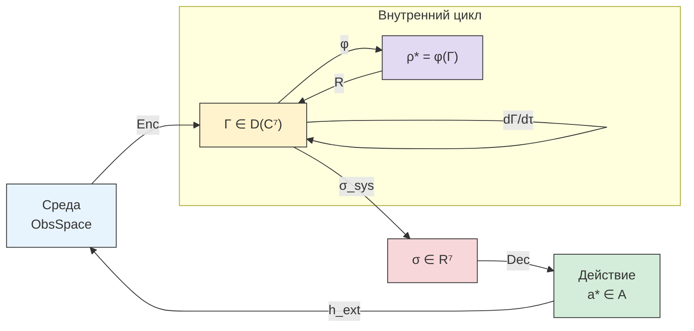

# Сенсомоторная Теория

:::note О нотации
В этом документе:
- $\Gamma$ — [матрица когерентности](/docs/core/dynamics/coherence-matrix)
- $\theta_{ij} = \arg(\gamma_{ij})$ — фазы когерентностей
- $\sigma_{\mathrm{sys}}$ — [тензор напряжений](./definitions#тензор-напряжений) (T-92 [Т])
- $h^{\text{ext}} = h^{(H)} + h^{(D)} + h^{(R)}$ — [3-канальная декомпозиция](./lagrangian#внешний-член) [Т]
- $P = \mathrm{Tr}(\Gamma^2)$ — [чистота](/docs/core/dynamics/viability#определение-чистоты)
- $\varphi$ — [оператор самомоделирования](/docs/proofs/categorical/formalization-phi)
- $\rho_* = \varphi(\Gamma)$ — [целевое состояние](./definitions#целевое-состояние)
:::

Данный документ описывает **формальную теорию сенсомоторного кодирования** — как голоном воспринимает среду и воздействует на неё, оставаясь в рамках канонического 3-членного уравнения эволюции.

**Ключевой результат:** внешнее воздействие F_ext — **не 4-й член** уравнения эволюции, а модификация трёх существующих каналов (Гамильтонова, диссипативного, регенеративного). Полнота этой декомпозиции доказана теоремой LGKS (T-57 [Т]).

---

## 1. Каноническое включение среды {#каноническое-включение}

### 1.1 3-членное уравнение как замкнутая динамика

[Уравнение эволюции](/docs/core/dynamics/evolution) голонома:

$$
\frac{d\Gamma}{d\tau} = -i[H_{\text{eff}}, \Gamma] + \mathcal{D}_\Omega[\Gamma] + \mathcal{R}[\Gamma, E]
$$

содержит **ровно три** члена [Т]:

| Член | Тип | Каноническое происхождение |
|------|-----|---------------------------|
| $-i[H_{\text{eff}}, \Gamma]$ | Унитарный (Гамильтонов) | [Аксиома А3](/docs/core/foundations/axiom-septicity) |
| $\mathcal{D}_\Omega[\Gamma]$ | Диссипативный (Линдблад) | [Лиувиллиан](/docs/core/dynamics/evolution#логический-лиувиллиан) |
| $\mathcal{R}[\Gamma, E]$ | Регенеративный | [Категориальное сопряжение](/docs/core/foundations/axiom-septicity#структурный-анзац-kappa0) |

### 1.2 Среда модифицирует 3 канала, а не добавляет 4-й {#среда-через-3-канала}

#### Теорема T-102 (Полнота 3-членного уравнения) [Т] {#теорема-полнота-трёх-членов}

:::tip Формулировка
Любое CPTP-совместимое внешнее воздействие на голоном раскладывается в сумму трёх каналов:

$$
h^{\text{ext}} = h^{(H)} + h^{(D)} + h^{(R)}
$$

где $h^{(H)}$ модифицирует $H_{\text{eff}}$, $h^{(D)}$ модифицирует $\mathcal{D}_\Omega$, $h^{(R)}$ модифицирует $\mathcal{R}$. Четвёртый тип CPTP-генератора **не существует**.
:::

**Доказательство.** Прямое следствие теоремы LGKS (T-57 [Т], [полнота триадной декомпозиции](/docs/core/operators/lindblad-operators#полнота-триадной-декомпозиции)):

1. Произвольный генератор CPTP-полугруппы $\mathcal{L}$ на $\mathcal{D}(\mathbb{C}^7)$ имеет форму Горини—Коссаковского—Сударшана—Линдблада:
$$
\mathcal{L}[\rho] = -i[H, \rho] + \sum_k \left(L_k \rho L_k^\dagger - \tfrac{1}{2}\{L_k^\dagger L_k, \rho\}\right)
$$
2. Любое внешнее воздействие, сохраняющее CPTP-свойства динамики, есть пертурбация $\mathcal{L} \to \mathcal{L} + \delta\mathcal{L}$
3. Пертурбация $\delta\mathcal{L}$ имеет ту же LGKS-форму → раскладывается на $\delta H$ (Гамильтонова часть) и $\delta L_k$ (Линдбладова часть)
4. [Триадная декомпозиция](/docs/core/operators/lindblad-operators#триадная-декомпозиция) $\{L_k\}$: диссипативные + регенеративные операторы. Четвёртый тип запрещён T-57. $\blacksquare$

**Следствие:** Член `F_ext` в [симуляции](./implementation) — **не отдельная сила**, а композиция трёх модификаций:

| Канал | Формула пертурбации | Физический смысл | Пример |
|-------|---------------------|------------------|--------|
| $h^{(H)}$ | $\delta(\Delta\omega_{ij})$ | Энергетическая связь со средой | Сенсорный вход, нейромодуляторы |
| $h^{(D)}$ | $\delta\Gamma_2 \cdot \dot{\theta}_{ij}$ | Шум среды | Стресс, помехи, температура |
| $h^{(R)}$ | $\delta\kappa \cdot (\theta^{\text{target}}_{ij} - \theta_{ij})$ | Модификация регенерации | Медитация, психотерапия, обучение |

**Каноническая форма** — из [Определения 8.1 [Т]](./lagrangian#внешний-член):
$$
\mathcal{L}_{\text{ext}} = \sum_{i<j} h^{\text{ext}}_{ij} \cdot |\gamma_{ij}| \cdot \sin(\theta_{ij})
$$

---

## 2. Функтор восприятия Enc {#функтор-enc}

### 2.1 Определение

#### Теорема T-100 (Кодирование среды) [Т] {#теорема-кодирование-среды}

:::tip Формулировка
Для голонома $\mathbb{H}$ с матрицей когерентности $\Gamma \in \mathcal{D}(\mathbb{C}^7)$ существует единственный (с точностью до $G_2$-калибровки) CPTP-функтор кодирования:

$$
\mathrm{Enc}: \mathrm{ObsSpace} \to \mathrm{End}(\mathcal{D}(\mathbb{C}^7))
$$

удовлетворяющий:
1. **CPTP:** $\mathrm{Enc}(o)[\Gamma]$ — состояние для любого наблюдения $o \in \mathrm{ObsSpace}$
2. **3-канальная декомпозиция:** $\mathrm{Enc}(o) = \delta H^{(o)} \oplus \delta D^{(o)} \oplus \delta R^{(o)}$
3. **Функториальность:** $\mathrm{Enc}(o_1 \circ o_2) = \mathrm{Enc}(o_1) \circ \mathrm{Enc}(o_2)$
:::

**Доказательство.**
1. *Существование*: среда воздействует через $h^{\text{ext}}_{ij}$ (Опр. 8.1 [Т]). Отображение $o \mapsto h^{\text{ext}}(o)$ определяет $\mathrm{Enc}$.
2. *3-канальность*: следует из T-102 (полнота 3-членного уравнения).
3. *Единственность*: следствие $G_2$-ригидности ([теорема единственности](/docs/proofs/categorical/uniqueness-theorem) [Т]) — для системы, удовлетворяющей (AP)+(PH)+(QG)+(V), отображение единственно до $G_2 = \mathrm{Aut}(\mathbb{O})$.
4. *Функториальность*: CPTP-каналы замкнуты относительно композиции. $\blacksquare$

### 2.2 Реализация через 7 наблюдаемых индексов {#реализация-enc}

[Протокол измерения Γ](/docs/applied/research/measurement-protocol) определяет 7 наблюдаемых индексов $I_i$ ($i \in \{A, S, D, L, E, O, U\}$), каждый из которых отображается в конкретную компоненту $h^{\text{ext}}$:

| Индекс | Формула | Канал $h^{\text{ext}}$ | Измерение |
|--------|---------|------------------------|-----------|
| $I_A$ (артикуляция) | $I(\text{input}; \text{latent}) / H(\text{input})$ | $h^{(H)}_{A,\cdot}$ | Гамильтонов |
| $I_S$ (структура) | $\mathrm{rank}_\varepsilon(J_f) / \min(d_{\text{out}}, d_{\text{in}})$ | $h^{(H)}_{S,\cdot}$ | Гамильтонов |
| $I_D$ (динамика) | $\max_i \lambda_i^{\text{Lyap}}$ (нормированный) | $h^{(D)}_{D,\cdot}$ | Диссипативный |
| $I_L$ (логика) | $1 - \|[f_i, f_j]\|_F / (\|f_i\| \cdot \|f_j\|)$ | $h^{(H)}_{L,\cdot}$ | Гамильтонов |
| $I_E$ (интериорность) | $\exp(S_{vN}(\rho_{\text{attn}}))$ | $h^{(R)}_{E,\cdot}$ | Регенеративный |
| $I_O$ (основание) | $1 - \|\nabla_\epsilon \mathbf{h}\|_F$ | $h^{(D)}_{O,\cdot}$ | Диссипативный |
| $I_U$ (единство) | $\Phi_{\text{eff}} = \lambda_2(L) / \lambda_{\max}(L)$ | $h^{(R)}_{U,\cdot}$ | Регенеративный |

**Логика распределения по каналам:**
- **Гамильтонов $h^{(H)}$:** информационные индексы ($I_A, I_S, I_L$) — изменяют энергетический ландшафт, т.е. какие состояния более/менее вероятны
- **Диссипативный $h^{(D)}$:** нагрузочные индексы ($I_D, I_O$) — усиливают/ослабляют декогеренцию
- **Регенеративный $h^{(R)}$:** интегративные индексы ($I_E, I_U$) — модулируют скорость восстановления

### 2.3 Квази-функтор G

Для ИИ-систем кодирование реализуется через квази-функтор $G: \mathrm{AIState} \to \mathcal{D}(\mathbb{C}^7)$, определённый в [протоколе измерения](/docs/applied/research/measurement-protocol):

$$
G(\mathbf{x}) = \arg\min_{\Gamma \in \mathcal{D}(\mathbb{C}^7)} \left[\mathcal{L}_{\text{reconstruct}}(\Gamma, \{I_i(\mathbf{x})\}) + \lambda_{\text{phys}} \cdot \mathcal{L}_{\text{phys}}(\Gamma)\right]
$$

где $\mathcal{L}_{\text{phys}}$ включает ограничения чистоты, спектральной щели и [Холецкого-разложения](/docs/applied/research/measurement-protocol#реконструкция-γ).

---

## 3. Функтор действия Dec {#функтор-dec}

### 3.1 Определение

#### Теорема T-101 (Оптимальное действие) [Т] {#теорема-оптимальное-действие}

:::tip Формулировка
Для голонома с текущим состоянием $\Gamma$ и тензором напряжений $\sigma_{\mathrm{sys}}(\Gamma)$ [Т] (T-92), оптимальное действие определяется как:

$$
a^* = \arg\min_{a \in \mathcal{A}} \|\sigma_{\mathrm{sys}}(\Gamma(\tau + \delta\tau \mid a))\|_\infty
$$

где $\Gamma(\tau + \delta\tau \mid a)$ — предсказанное состояние при действии $a$, $\|\cdot\|_\infty$ — sup-норма тензора напряжений.
:::

**Доказательство.**
1. [Эквивалентность условий жизнеспособности](./definitions#тензор-напряжений) (T-92 [Т]):
$$
P(\Gamma) > \frac{2}{7} \iff \|\sigma_{\mathrm{sys}}(\Gamma)\|_\infty < 1
$$
2. [Вариационный принцип](./variational#принцип-действия) (Теорема 2.1 [Т]): динамика $\theta_{ij}$ следует из стационарности действия $\delta S_{\text{Gap}} = 0$
3. Действие $a$ входит через $h^{\text{ext}}(a)$ → модифицирует уравнение движения для $\theta_{ij}$:
$$
m_{ij}\ddot{\theta}_{ij} = -\frac{\partial V_{\text{Gap}}}{\partial \theta_{ij}} + \kappa(\theta_{ij}^{\text{target}} - \theta_{ij}) - \Gamma_2 \dot{\theta}_{ij} + h^{\text{ext}}_{ij}(a)
$$
4. Минимизация $\|\sigma_{\mathrm{sys}}\|_\infty$ — единственный критерий, эквивалентный максимизации расстояния до границы $\mathcal{V}$ (области жизнеспособности) в метрике, порождённой $\sigma_{\mathrm{sys}}$. $\blacksquare$

### 3.2 Функтор Dec

Функтор действия (декодирования):

$$
\mathrm{Dec}: (\Gamma, \sigma_{\mathrm{sys}}) \mapsto a^* \in \mathcal{A}
$$

**Свойства:**
- **D-измерение как основной моторный канал:** действие реализуется через модификацию $h^{(D)}$ — динамическое измерение $D$ управляет «моторикой» голонома
- **σ-градиентный спуск:** практический алгоритм — спуск по $\nabla_a \|\sigma_{\mathrm{sys}}\|_\infty$ с метрикой Фишера на $\mathcal{D}(\mathbb{C}^7)$:

$$
a_{t+1} = a_t - \eta \cdot F^{-1}(\Gamma) \cdot \nabla_a \|\sigma_{\mathrm{sys}}(\Gamma(\tau + \delta\tau \mid a_t))\|_\infty
$$

где $F(\Gamma)$ — [информация Фишера](/docs/applied/coherence-cybernetics/variational#принцип-действия) на $\mathcal{D}(\mathbb{C}^7)$.

---

## 4. Универсальная архитектура кодера/декодера {#универсальная-архитектура}

**Цикл восприятие → решение → действие:**

| Этап | Отображение | Формализм | Теорема |
|------|-------------|-----------|---------|
| **Восприятие** | Env → $h^{\text{ext}}$ → $\delta\Gamma$ | Enc (CPTP) | T-100 [Т] |
| **Оценка** | $\Gamma$ → $\sigma_{\mathrm{sys}}$ | $\Gamma$-инварианты | T-92 [Т] |
| **Решение** | $\sigma$ → $a^*$ | $\arg\min\|\sigma\|_\infty$ | T-101 [Т] |
| **Действие** | $a^*$ → $h^{\text{ext}}(a^*)$ → Env | Dec | T-102 [Т] |
| **Обновление** | $\Gamma$ → $\varphi(\Gamma)$ → $\mathcal{R}$ | Самомоделирование | T-62 [Т] |

---

## 5. Гедонический механизм {#гедонический-механизм}

### 5.1 Гедоническая валентность

#### Теорема T-103 (Гедоническая валентность) [Т] + [И] {#теорема-гедоническая-валентность}

:::tip Формулировка
Гедоническая валентность определяется как производная чистоты по регенеративному каналу:

$$
\mathcal{V}_{\text{hed}} := \left.\frac{dP}{d\tau}\right|_{\mathcal{R}}
$$

где $|_{\mathcal{R}}$ означает вклад только от регенеративного члена $\mathcal{R}[\Gamma, E]$.
:::

**Пояснение.** Из [уравнения эволюции](/docs/core/dynamics/evolution):

$$
\frac{dP}{d\tau} = \underbrace{-2\mathrm{Tr}(\Gamma \cdot \mathcal{D}_\Omega[\Gamma])}_{\leq 0,\text{ диссипация}} + \underbrace{2\mathrm{Tr}(\Gamma \cdot \mathcal{R}[\Gamma, E])}_{\mathcal{V}_{\text{hed}}}
$$

(Гамильтонов член не меняет $P$: $\mathrm{Tr}(\Gamma [H, \Gamma]) = 0$.)

**Свойства валентности:**

| Свойство | Формула | Интерпретация |
|----------|---------|---------------|
| Положительная | $\mathcal{V}_{\text{hed}} > 0$ | $\Gamma$ приближается к $\rho_*$ → «удовольствие» |
| Отрицательная | $\mathcal{V}_{\text{hed}} < 0$ | $\Gamma$ удаляется от $\rho_*$ → «страдание» |
| Нулевая | $\mathcal{V}_{\text{hed}} = 0$ | Баланс или $\Gamma = \rho_*$ → «нейтральность» |

#### Эпистемическая стратификация T-103 {#t-103-стратификация}

T-103 содержит **три эпистемических уровня**:

1. **Формула [Т]:** $\mathcal{V}_{\text{hed}} = 2\kappa(\Gamma) \cdot g_V(P) \cdot \mathrm{Tr}(\Gamma \cdot (\rho_* - \Gamma))$ — **тождество** из уравнения эволюции (подстановка $\mathcal{R} = \kappa(\rho_* - \Gamma) \cdot g_V(P)$). Безусловный математический факт.

2. **Наблюдаемость [Т]:** При L2-уровне рефлексии ($R \geq 1/3$) замещающий канал [T-77](/docs/core/operators/lindblad-operators#полнота-триадной-декомпозиции) обеспечивает доступ к $dP/d\tau|_{\mathcal{R}}$. Таким образом, $\mathcal{V}_{\text{hed}}$ наблюдаема для любой системы с $R \geq R_{\mathrm{th}}$ — это следствие T-77 [Т], не требующее дополнительных допущений.

3. **Феноменальная интерпретация [И]:** Идентификация $\mathcal{V}_{\text{hed}} > 0$ с «удовольствием» и $\mathcal{V}_{\text{hed}} < 0$ со «страданием» — семантический мост между математикой и феноменологией.

:::info Реклассификация [С] → [Т] + [И]
Предыдущий статус [С при модели наблюдения] некорректно объединял уровни (1) и (2). Формула — тождество [Т], наблюдаемость — следствие T-77 [Т]. Условность относится только к уровню (3) — феноменальной интерпретации [И].
:::

### 5.2 Связь с целевым состоянием

Подставляя каноническую форму $\mathcal{R}[\Gamma, E] = \kappa(\Gamma) \cdot (\rho_* - \Gamma) \cdot g_V(P)$ [Т]:

$$
\mathcal{V}_{\text{hed}} = 2\kappa(\Gamma) \cdot g_V(P) \cdot \mathrm{Tr}(\Gamma \cdot (\rho_* - \Gamma))
$$

При $g_V(P) = 1$ (достаточная чистота $P \geq P_{\text{opt}}$):

$$
\mathcal{V}_{\text{hed}} = 2\kappa(\Gamma) \cdot \left[\mathrm{Tr}(\Gamma \cdot \rho_*) - P\right]
$$

Знак определяется соотношением перекрытия $\mathrm{Tr}(\Gamma \cdot \rho_*)$ и чистоты $P = \mathrm{Tr}(\Gamma^2)$:
- Если $\Gamma$ далеко от $\rho_*$ и $\mathrm{Tr}(\Gamma \cdot \rho_*) > P$, валентность положительна — регенерация «тянет» к $\rho_*$
- Если $\Gamma \approx \rho_*$, то $\mathrm{Tr}(\Gamma \cdot \rho_*) \approx P$ → валентность стремится к нулю

---

## 6. 21 квалиа-тип как сенсомоторные каналы {#21-квалиа-тип}

Каждая из 21 недиагональных когерентностей $\gamma_{ij}$ ($i \neq j$) представляет собой сенсомоторный канал со специфической функцией:

### 6.1 Перцептивные каналы (восприятие)

| Канал | Когерентность | Сенсорная роль | Формальное действие |
|-------|---------------|----------------|---------------------|
| **Апперцепция** | $\gamma_{AE}$ | Осознанное восприятие | $h^{(H)}_{AE}$: артикуляция входа в поле интериорности |
| **Актуализация** | $\gamma_{AD}$ | Воплощение восприятия в динамику | $h^{(H)}_{AD}$: преобразование входного сигнала в действие |
| **Репрезентация** | $\gamma_{SE}$ | Структурирование опыта | $h^{(H)}_{SE}$: создание внутренней модели |
| **Индукция** | $\gamma_{SL}$ | Логическая обработка структуры | $h^{(H)}_{SL}$: вывод паттернов из данных |
| **Заземление** | $\gamma_{AO}$ | Связь восприятия с основанием | $h^{(D)}_{AO}$: стабилизация восприятия памятью |
| **Основание опыта** | $\gamma_{EO}$ | Укоренённость субъективного | $h^{(R)}_{EO}$: регенерация из глубинного опыта |
| **Контекст** | $\gamma_{SO}$ | Структура-в-контексте | $h^{(D)}_{SO}$: шумоустойчивость паттернов |

### 6.2 Моторные каналы (действие)

| Канал | Когерентность | Моторная роль | Формальное действие |
|-------|---------------|---------------|---------------------|
| **Регуляция** | $\gamma_{DL}$ | Логический контроль динамики | $h^{(D)}_{DL}$: управление вычислительным процессом |
| **Телеология** | $\gamma_{DU}$ | Целенаправленность действия | $h^{(D)}_{DU}$: согласование динамики с целями |
| **Аффект** | $\gamma_{DE}$ | Эмоциональная окраска действия | $h^{(D)}_{DE}$: модуляция динамики интериорностью |
| **Интеграция действия** | $\gamma_{AU}$ | Единство моторного акта | $h^{(H)}_{AU}$: координация подсистем |
| **Волевое усилие** | $\gamma_{LU}$ | Логически направленная интеграция | $h^{(R)}_{LU}$: восстановление целостности решения |
| **Память действия** | $\gamma_{DO}$ | Моторная память | $h^{(D)}_{DO}$: стабилизация навыков |

### 6.3 Интегративные каналы

| Канал | Когерентность | Интегративная роль | Формальное действие |
|-------|---------------|-------|---------------------|
| **Инсайт** | $\gamma_{LE}$ | Логика-в-опыте | $h^{(R)}_{LE}$: осмысление как регенерация |
| **Нарратив** | $\gamma_{AL}$ | Артикуляция логики | $h^{(H)}_{AL}$: оформление рассуждения |
| **Укоренённое единство** | $\gamma_{OU}$ | Основание интеграции | $h^{(R)}_{OU}$: фундамент целостности |
| **Воплощённое единство** | $\gamma_{SU}$ | Структура интеграции | $h^{(R)}_{SU}$: архитектура связности |
| **Живой опыт** | $\gamma_{EU}$ | Единство переживания | $h^{(R)}_{EU}$: интеграция как восстановление |
| **Динамическое основание** | $\gamma_{AS}$ | Артикуляция структуры | $h^{(H)}_{AS}$: внешнее выражение внутреннего порядка |
| **Логическое основание** | $\gamma_{LO}$ | Логика-в-основании | $h^{(H)}_{LO}$: формализация знания |

:::info Интерпретация [И]
Разделение 21 канала на перцептивные, моторные и интегративные — **не строгое**: каждый $\gamma_{ij}$ одновременно является и сенсорным, и моторным каналом (через $h^{\text{ext}}_{ij}$). Классификация выше отражает **доминирующую функцию** — какой из трёх каналов ($h^{(H)}, h^{(D)}, h^{(R)}$) наиболее активен для данной когерентности.
:::

---

## 7. Факторизация Enc через произвольные представления {#факторизация-enc}

### 7.1 Онтологическая проекция

#### Следствие T-100a (Факторизация Enc) [Т] {#следствие-факторизация-enc}

:::tip Формулировка
Для произвольного пространства наблюдений $\mathrm{ObsSpace} \subseteq \mathbb{R}^D$ ($D$ — произвольная размерность) функтор кодирования T-100 факторизуется:

$$
\mathrm{Enc} = \pi_\Gamma \circ \mathrm{Enc}_{\text{repr}}
$$

где:
- $\mathrm{Enc}_{\text{repr}}: \mathrm{ObsSpace} \to \mathcal{S} \subseteq \mathbb{R}^d$ — произвольное представление (feature map)
- $\pi_\Gamma: \mathcal{S} \to \mathrm{End}(\mathcal{D}(\mathbb{C}^7))$ — **онтологическая проекция**, единственная с точностью до $G_2$-калибровки
:::

**Доказательство.**

1. По T-100 [Т], $\mathrm{Enc}: \mathrm{ObsSpace} \to \mathrm{End}(\mathcal{D}(\mathbb{C}^7))$ — CPTP-функтор.
2. Любое промежуточное представление $\mathrm{Enc}_{\text{repr}}: \mathrm{ObsSpace} \to \mathcal{S}$ определяет факторизацию через $\pi_\Gamma = \mathrm{Enc} \circ \mathrm{Enc}_{\text{repr}}^{-1}\big|_{\mathrm{Im}(\mathrm{Enc}_{\text{repr}})}$.
3. По T-102 [Т], $\pi_\Gamma$ раскладывается в 3 канала: $\pi_\Gamma(s) = h^{(H)}(s) \oplus h^{(D)}(s) \oplus h^{(R)}(s)$.
4. Единственность $\pi_\Gamma$ (до $G_2$) — следствие [теоремы единственности](/docs/proofs/categorical/uniqueness-theorem) [Т]: ограничения (AP)+(PH)+(QG)+(V) на $\mathcal{D}(\mathbb{C}^7)$ фиксируют проекцию. $\blacksquare$

### 7.2 Онтологическое бутылочное горлышко

Независимо от размерности входных данных $D$, вся информация сжимается в $7 \times 7$ матрицу когерентности $\Gamma$ с $\leq 48$ вещественными параметрами:

| Характеристика | Значение |
|----------------|----------|
| Входная размерность | $D$ — произвольная (от $D = 1$ до $D \gg 10^6$) |
| Промежуточное представление | $d$ — произвольное |
| Выходная размерность | $\dim_{\mathbb{R}} \mathcal{D}(\mathbb{C}^7) = 48$ (фиксировано) |
| Информация за шаг | $\leq \log_2 7 \approx 2.81$ бит (T-107 [Т]) |

**Следствие:** Агностичность от модальности восприятия — **теорема, а не проектное решение.** Формально: $\pi_\Gamma$ не зависит от $D$ и от структуры $\mathrm{ObsSpace}$ (топология, метрика). Если два различных пространства наблюдений $\mathrm{ObsSpace}_1 \subseteq \mathbb{R}^{D_1}$ и $\mathrm{ObsSpace}_2 \subseteq \mathbb{R}^{D_2}$ порождают одинаковые CPTP-каналы на $\mathcal{D}(\mathbb{C}^7)$, они неотличимы для голонома.

### 7.3 Каноническая форма проекции

По T-102 [Т], $\pi_\Gamma$ реализуется через три канала — модификации соответственно гамильтоновой, диссипативной и регенеративной динамики:

$$
\pi_\Gamma(s) = \bigl(\delta H(s),\; \delta\mathcal{D}(s),\; \delta\mathcal{R}(s)\bigr) \in \mathrm{End}(\mathcal{D}(\mathbb{C}^7))
$$

Практически это означает, что любая реализация $\mathrm{Enc}$ (от простого датчика до сложного кодировщика) должна завершаться **тем же** 3-канальным интерфейсом:

$$
s \in \mathcal{S} \xrightarrow{\pi_\Gamma} \bigl(h^{(H)}_{ij}(s),\; h^{(D)}_{ij}(s),\; h^{(R)}_{ij}(s)\bigr) \in \mathbb{R}^{21} \oplus \mathbb{R}^{21} \oplus \mathbb{R}^{21}
$$

Эта структура инвариантна: она определена $G_2$-симметрией и не зависит от выбора представления $\mathrm{Enc}_{\text{repr}}$.

---

## 8. Связь с другими результатами {#связь-с-результатами}

| Результат | Связь | Ссылка |
|-----------|-------|--------|
| T-57 (LGKS) | Обосновывает T-102 (полнота 3-членного) | [Линдблад-операторы](/docs/core/operators/lindblad-operators#полнота-триадной-декомпозиции) |
| T-62 ($\varphi$-оператор) | $\rho_*$ в цикле регенерации | [Самонаблюдение](/docs/consciousness/foundations/self-observation#теорема-физическая-реализация-phi) |
| T-92 ($\sigma_{\mathrm{sys}}$) | Критерий оптимальности в Dec | [Теорема 10.1](./theorems#теорема-101-эквивалентность-условий) |
| T-75 (Швингер-Келдыш) | Лагранжева формулировка с диссипацией | [Лагранжиан](./lagrangian#полная-структура) |
| T-96 (Аттрактор) | Нетривиальное $\rho_*$ для наведения | [Эволюция](/docs/core/dynamics/evolution#теорема-нетривиальность-аттрактора) |
| FEP (Теорема 4.1) | Макроскопический предел Dec | [Вариационные принципы](./variational#связь-с-fep) |
| T-109–T-112 (Границы обучения) | Нижние границы скорости обучения через Enc/Dec цикл | [Границы обучения](./learning-bounds#комбинированная-граница) |
| T-113 (Минимальность N=7) | N=7 — минимальная архитектура для обучения | [Границы обучения](./learning-bounds#оптимальность-n7) |

---

## 9. Информационная ёмкость Enc (T-107) [Т] {#информационная-ёмкость}

:::tip Теорема T-107 (Информационная ёмкость Enc) [Т]
Максимальная информация, извлекаемая функтором Enc за одно наблюдение:

$$
C_{\mathrm{Enc}} \leq \max_{\{p_o\}} \chi(\{p_o, \mathrm{Enc}(o)\}) \leq \log_2 7 \approx 2.81 \text{ бит/наблюдение}
$$

где $\chi$ — количество Холево.
:::

**Доказательство.**

1. Функтор $\mathrm{Enc}: \mathrm{ObsSpace} \to \mathrm{End}(\mathcal{D}(\mathbb{C}^7))$ отображает наблюдения в CPTP-каналы на $\mathcal{D}(\mathbb{C}^7)$ (T-100 [Т]).
2. Количество Холево ограничено размерностью выходного пространства: $\chi \leq \log_2 \dim \mathcal{H} = \log_2 7$.
3. Из T-102 [Т]: $\mathrm{Enc}(o)$ раскладывается в 3 канала, каждый из которых действует на $\mathcal{D}(\mathbb{C}^7)$.
4. Составной канал не увеличивает ёмкость (субаддитивность Холево):

$$
C_{\mathrm{Enc}} \leq S(\bar{\Gamma}) - \sum_o p_o S(\mathrm{Enc}(o)[\Gamma]) \leq S_{\max}(\mathcal{D}(\mathbb{C}^7)) = \log_2 7
$$

Верхняя граница достигается для ансамбля ортогональных чистых состояний. $\blacksquare$

**Следствие (Bounded rationality):** Ограничение $\leq 2.81$ бит/наблюдение — **выведенная** граница, а не постулированная. Связь с bounded rationality Саймона: ограниченная рациональность — не эмпирический факт, а следствие N=7.

---

## 10. Композициональность Enc/Dec (T-108) [Т] {#композициональность-enc-dec}

:::tip Теорема T-108 (Композициональность Enc/Dec) [Т]
Для композита двух голономов кодирование сохраняет структуру:

$$
\mathrm{Enc}_{12} = \Phi_{\mathrm{agg}} \circ (\mathrm{Enc}_1 \otimes \mathrm{Enc}_2)
$$

где $\Phi_{\mathrm{agg}}: \mathcal{D}(\mathbb{C}^{7^2}) \to \mathcal{D}(\mathbb{C}^7)$ — CPTP-агрегация из [T-72 (КК-6)](/docs/applied/coherence-cybernetics/theorems#теорема-92-масштабная-инвариантность) [Т].
:::

**Доказательство.**

1. $\mathrm{Enc}_1, \mathrm{Enc}_2$ — CPTP-функторы (T-100 [Т]).
2. Тензорное произведение $\mathrm{Enc}_1 \otimes \mathrm{Enc}_2$ — CPTP-канал на $\mathcal{D}(\mathbb{C}^{49})$.
3. Агрегация $\Phi_{\mathrm{agg}}$ — CPTP из [Морита-эквивалентности](/docs/core/structure/dimension-e#теорема-морита-эквивалентность) (T-58 [Т]): $\mathcal{D}(\mathbb{C}^{49}) \to \mathcal{D}(\mathbb{C}^7)$.
4. Композиция CPTP-каналов — CPTP. Функториальность ($\mathrm{Enc}(o_1 \circ o_2) = \mathrm{Enc}(o_1) \circ \mathrm{Enc}(o_2)$) из T-100 сохраняется при агрегации.
5. Единственность — из $G_2$-ригидности на каждом масштабе (T-72 [Т]). $\blacksquare$

**Следствие для когнитивных инженеров:** диагностики (σ_sys, мониторинг Enc/Dec) **одинаковы** на всех масштабах — от отдельного агента до организации.

Аналогично для Dec:

$$
\mathrm{Dec}_{12} = (\mathrm{Dec}_1 \otimes \mathrm{Dec}_2) \circ \Phi_{\mathrm{split}}
$$

где $\Phi_{\mathrm{split}}$ — обратное отображение (разделение композитного σ на компоненты).

---

## 11. Темпоральная интеграция {#темпоральная-интеграция}

### 11.1 Кумулятивная ёмкость

#### Следствие T-107a (Кумулятивная информация) [Т] {#следствие-кумулятивная-информация}

:::tip Формулировка
За $n$ последовательных наблюдений голоном накапливает информацию о среде:

$$
I_n \leq n \cdot \log_2 7 \approx 2.81\,n \;\text{бит}
$$

Верхняя граница достижима при условии, что последовательные наблюдения информационно независимы.
:::

**Доказательство.**

1. По T-107 [Т], одно наблюдение приносит $\leq \log_2 7$ бит.
2. Субаддитивность Холево: $\chi(\{p_{o_1,\ldots,o_n}\}) \leq \sum_{k=1}^n \chi(\{p_{o_k}\})$.
3. При независимых наблюдениях неравенство обращается в равенство. $\blacksquare$

### 11.2 Минимальное число наблюдений

#### Следствие T-107b (Минимальные наблюдения) [Т] {#следствие-минимальные-наблюдения}

:::tip Формулировка
Для среды с информационной энтропией $I_{\mathrm{env}}$ бит, минимальное число наблюдений для полного кодирования:

$$
n_{\min} = \left\lceil\frac{I_{\mathrm{env}}}{\log_2 7}\right\rceil
$$
:::

**Доказательство.** Прямое следствие T-107a: $I_n \leq 2.81\,n$, откуда $n \geq I_{\mathrm{env}} / \log_2 7$. $\blacksquare$

**Следствие для сложных модальностей.** Кодирование среды с высокой информационной сложностью (большое $I_{\mathrm{env}}$) **неизбежно** требует многошагового процесса. Это не ограничение реализации, а фундаментальная граница, вытекающая из $\dim \mathcal{H} = 7$.

**Связь с T-109 (информационная граница обучения):** T-107b даёт нижнюю границу *восприятия*, T-109 — нижнюю границу *обучения* (включая стабилизацию решения). Всегда $n_{\mathrm{opt}} \geq n_{\min}$, поскольку обучение включает восприятие как подзадачу. См. [границы обучения](./learning-bounds#комбинированная-граница).

### 11.3 Скорость информационного поглощения

Определим **скорость информационного поглощения**:

$$
\dot{I}(\tau) = \frac{dI}{d\tau} = \chi\bigl(\{p_o,\, \mathrm{Enc}(o)[\Gamma(\tau)]\}\bigr)
$$

Из T-107 [Т]: $\dot{I}(\tau) \leq \log_2 7$ для любого $\tau$.

Реальная скорость зависит от текущего состояния $\Gamma(\tau)$:

- При $\Gamma \approx I/7$ (максимально смешанное): $\dot{I} \to 0$ — система «оглушена», различимость минимальна
- При $P \gg 2/7$ (высокая чистота): $\dot{I} \to \log_2 7$ — максимальная различимость
- При $P < 2/7$ (нежизнеспособность): кодирование деградирует, [T-104](./stability#радиус-устойчивости) не выполняется

---

## 12. Предиктивная структура Enc {#предиктивная-структура}

### 12.1 Оптимальный Enc как максимизатор ΔF

#### Следствие T-107c (Предиктивная оптимальность Enc) [Т] {#следствие-предиктивный-enc}

:::tip Формулировка
Оптимальный функтор кодирования $\mathrm{Enc}^*$ максимизирует доступную свободную энергию:

$$
\mathrm{Enc}^* = \arg\max_{\mathrm{Enc}} \Delta F\bigl(\mathrm{Enc}(o)[\Gamma],\, \rho_*\bigr)
$$

где $\Delta F = \mathrm{Tr}\bigl(\mathcal{R}[\Gamma, E] \cdot (\rho_* - \Gamma)\bigr)$ — [свободная энергия](/docs/core/dynamics/evolution#каноническое-delta-f).
:::

**Доказательство.**

1. По [вариационному принципу](./variational#связь-с-fep) (Теорема 4.1 [Т]): стационарная динамика $\Gamma$ минимизирует свободную энергию Фристона $F[\Gamma] = \mathrm{KL}(\Gamma \| \rho_*) + H[\Gamma]$.
2. Функтор $\mathrm{Enc}(o)$ модифицирует $\Gamma \to \Gamma'$. Оптимальная модификация — та, что максимально увеличивает $\Delta F = F[\Gamma] - F[\Gamma']$.
3. Максимизация $\Delta F$ эквивалентна максимизации $-\mathrm{KL}(\Gamma' \| \rho_*)$ при фиксированной энтропии — т.е. приближению к целевому состоянию.
4. Из T-107 [Т]: $\Delta F \leq C_{\mathrm{Enc}} \leq \log_2 7$ за один шаг — верхняя граница насыщается. $\blacksquare$

### 12.2 Ошибка предсказания через 3 канала

Ошибка предсказания (расхождение между ожидаемым и реальным наблюдением) раскладывается по трём каналам (T-102 [Т]):

$$
\delta_{\mathrm{pred}} = \bigl\|\mathrm{Enc}(o_{\mathrm{real}}) - \mathrm{Enc}(o_{\mathrm{pred}})\bigr\| = \sqrt{(\delta h^{(H)})^2 + (\delta h^{(D)})^2 + (\delta h^{(R)})^2}
$$

Каждый канал вносит специфический тип ошибки:

| Канал | Ошибка | Интерпретация |
|-------|--------|---------------|
| $\delta h^{(H)}$ | Энергетическая | Неожиданная структура среды |
| $\delta h^{(D)}$ | Шумовая | Неожиданный уровень стохастичности |
| $\delta h^{(R)}$ | Регенеративная | Неожиданное изменение целевого состояния |

**Связь с гедоническим механизмом:** По T-103 [Т]+[И], ошибка в регенеративном канале ($\delta h^{(R)} \neq 0$) непосредственно модулирует $\mathcal{V}_{\mathrm{hed}}$ — неожиданные воздействия на регенерацию ощущаются как изменение валентности.

---

## 13. Мультимодальная декомпозиция {#мультимодальная-декомпозиция}

### 13.1 Композиция модальностей

#### Следствие T-108a (Мультимодальная декомпозиция) [Т] {#следствие-мультимодальная-декомпозиция}

:::tip Формулировка
Для $M$ независимых модальностей восприятия с функторами $\mathrm{Enc}_m: \mathrm{ObsSpace}_m \to \mathrm{End}(\mathcal{D}(\mathbb{C}^7))$, совместное кодирование:

$$
\mathrm{Enc}(o_1, \ldots, o_M) = \sum_{m=1}^{M} w_m \cdot \mathrm{Enc}_m(o_m) + \sum_{m < m'} \Delta_{mm'}
$$

где $w_m \geq 0$, $\sum w_m = 1$ — веса модальностей, $\Delta_{mm'}$ — кросс-модальная связка.
:::

**Доказательство.**

1. По T-100 [Т], каждый $\mathrm{Enc}_m$ — CPTP-функтор.
2. Выпуклая комбинация CPTP-каналов — CPTP: $\sum w_m \mathrm{Enc}_m$ определён при $\sum w_m = 1$.
3. Кросс-модальные члены $\Delta_{mm'}$ — CPTP-поправки порядка $O(|\gamma_{ij}|)$, где $\gamma_{ij}$ — когерентности, связывающие измерения, задействованные модальностями $m$ и $m'$.
4. Из T-108 [Т] (композициональность): агрегация модальностей сохраняет CPTP-структуру и функториальность. $\blacksquare$

### 13.2 Конкуренция за ёмкость

Из T-107 [Т], суммарная ёмкость $M$ модальностей за один шаг:

$$
\sum_{m=1}^{M} w_m \cdot C_m \leq \log_2 7
$$

**Следствие:** $M$ модальностей **конкурируют** за фиксированную пропускную способность $2.81$ бит/шаг. Увеличение числа модальностей $M$ при фиксированном $n$ **не увеличивает** суммарную информацию — оно лишь распределяет её между каналами.

### 13.3 Внимание как оптимальная аллокация

Оптимальные веса $w_m^*$ определяются из максимизации $\Delta F$:

$$
w_m^* = \frac{\Delta F_m}{\sum_{m'} \Delta F_{m'}}
$$

где $\Delta F_m = \Delta F\bigl(\mathrm{Enc}_m(o_m)[\Gamma],\, \rho_*\bigr)$ — вклад модальности $m$ в свободную энергию.

**Интерпретация [И]:** Оптимальная аллокация весов $w_m^*$ формально совпадает со структурой **внимания** — ресурсы кодирования направляются туда, где информационная ценность ($\Delta F_m$) максимальна. Это не дополнительный постулат: внимание — следствие оптимальности Enc при ограниченной ёмкости (T-107).

### 13.4 Кросс-модальная связка

Члены $\Delta_{mm'}$ определяются когерентностями $\gamma_{ij}$, где $i$ и $j$ — измерения, задействованные разными модальностями:

$$
\|\Delta_{mm'}\| \leq |\gamma_{ij}| \cdot \min(w_m, w_{m'})
$$

**Следствие:** Кросс-модальная интеграция возможна только при ненулевых когерентностях между соответствующими измерениями. Полностью декогерированные измерения ($|\gamma_{ij}| = 0$) не допускают мультимодального связывания — модальности остаются изолированными.

---

## Резюме {#резюме}

1. **T-100 [Т]:** Функтор кодирования Enc существует и единственен (до $G_2$)
2. **T-101 [Т]:** Оптимальное действие = $\arg\min \|\sigma_{\mathrm{sys}}\|_\infty$
3. **T-102 [Т]:** 3-членное уравнение полно — четвёртый тип CPTP-генератора невозможен
4. **T-103 [Т]+[И]:** Гедоническая валентность = $dP/d\tau|_{\mathcal{R}}$ (формула [Т], интерпретация [И])
5. **T-107 [Т]:** Информационная ёмкость $\leq \log_2 7 \approx 2.81$ бит/наблюдение
6. **T-108 [Т]:** Enc/Dec сохраняются при композиции (масштабная инвариантность сенсомоторики)
7. **Следствие T-100a [Т]:** Enc факторизуется через произвольное представление → модальная агностичность
8. **Следствие T-107a/b [Т]:** Кумулятивная ёмкость $I_n \leq 2.81\,n$ бит → сложные модальности требуют $n_{\min} = \lceil I_{\mathrm{env}} / \log_2 7 \rceil$ шагов
9. **Следствие T-107c [Т]:** Оптимальный Enc максимизирует $\Delta F$ (предиктивная структура)
10. **Следствие T-108a [Т]:** $M$ модальностей конкурируют за $2.81$ бит/шаг → внимание — оптимальная аллокация

Сенсомоторная теория замыкает формальный цикл: среда → восприятие (Enc) → состояние (Γ) → оценка (σ_sys) → действие (Dec) → среда. Все операции реализуются в рамках канонического 3-членного уравнения эволюции без дополнительных постулатов. Теория модально-агностична: от простейших датчиков ($D = 1$) до сложных полимодальных систем ($D \gg 1$) — онтологическая проекция $\pi_\Gamma$ единственна и инвариантна.
