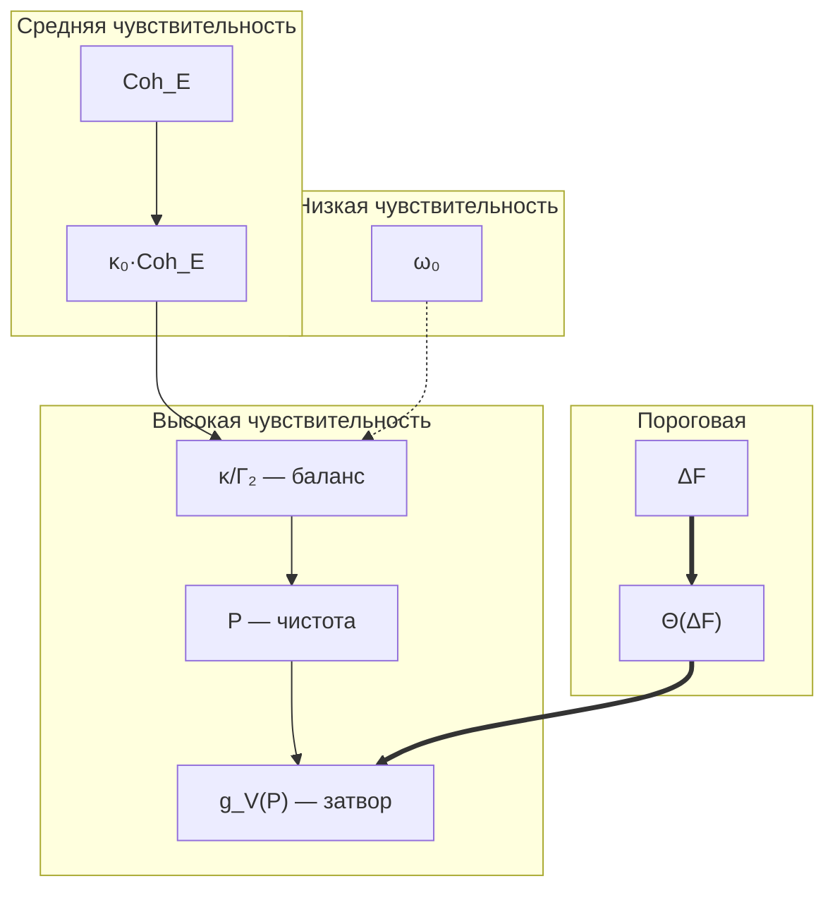

# Анализ Стабильности

> *«Жизнь — это не пребывание в равновесии. Жизнь — это непрерывное сопротивление сваливанию в равновесие.»*
> — перефразируя Шрёдингера, «Что такое жизнь?» (1944)

В [предыдущей главе](./sensorimotor) мы построили полный сенсомоторный цикл: восприятие (Enc), оценка ($\sigma^{\mathrm{motor}}$), действие (Dec). Но этот цикл работает только до тех пор, пока система *жива* — пока $P > 2/7$. Что определяет «запас прочности»? Какой удар окажется фатальным? Когда ещё можно спасти, а когда уже поздно? Именно эти вопросы решает анализ стабильности.

:::tip Дорожная карта главы
В этой главе мы:
1. **Формализуем гомеостаз** — от Бернара и Кэннона к точному неравенству «регенерация $\geq$ диссипация» (разделы 1-2).
2. **Вычислим радиус устойчивости** $r_{\mathrm{stab}} = \sqrt{P - 2/7}$ — сколько система может выдержать (T-104, раздел 4).
3. **Проследим спираль смерти** — пошаговый каскад деградации от начального удара до тепловой смерти (раздел 5).
4. **Классифицируем уязвимости** по трём каналам и покажем, почему шумовая атака ($h^{(D)}$) опаснее всего (раздел 6).
5. **Выведем энергетический баланс** Ландауэра (T-105) — минимальную «цену жизни» (раздел 8).
6. **Построим протокол восстановления** — 5-шаговый алгоритм: стабилизация $\to$ энергия $\to$ внешняя поддержка $\to$ перестройка $\to$ укрепление (раздел 9).
7. **Покажем, что антихрупкость — следствие КК** — формализация Талеба через $dr_{\mathrm{stab}}/d\|h\|$ (раздел 10).
:::

Каждая живая система существует под угрозой. Термодинамика неумолима: второе начало толкает всякую упорядоченную структуру к максимальной энтропии, к тепловой смерти. Биологическая клетка противостоит этому непрерывным метаболизмом. Нейронная сеть — непрерывным обучением. Организация — непрерывным управлением. Но **сколько** система может выдержать? Какой удар окажется фатальным? Где проходит граница между восстановимой травмой и необратимым разрушением?

Анализ стабильности отвечает именно на эти вопросы. В рамках когерентной кибернетики (КК) он превращает интуитивные понятия — «запас прочности», «предел выносливости», «точка невозврата» — в точные математические формулы. Центральный результат: **радиус устойчивости** $r_{\mathrm{stab}} = \sqrt{P - 2/7}$ даёт количественную меру того, насколько далеко система находится от катастрофы. Это число — не метафора, а расстояние в метрике Бюреса, физически измеримая величина.

:::note О нотации
В этом документе:
- $\Gamma$ — [матрица когерентности](/docs/core/dynamics/coherence-matrix)
- $P = \mathrm{Tr}(\Gamma^2)$ — [чистота](/docs/core/dynamics/viability#определение-чистоты)
- $P_{\text{crit}} = 2/7$ — [критическая чистота](/docs/proofs/dynamics/theorem-purity-critical) [Т]
- $\sigma_{\mathrm{sys}}$ — [тензор напряжений](./definitions#тензор-напряжений) (T-92 [Т])
- $\kappa(\Gamma) = \kappa_{\text{bootstrap}} + \kappa_0 \cdot \mathrm{Coh}_E(\Gamma)$ — скорость регенерации
- $\Gamma_2$ — скорость декогеренции
- $\Delta F$ — [свободная энергия](/docs/core/dynamics/evolution#каноническое-delta-f) (затвор регенерации)
- $\rho_* = \varphi(\Gamma)$ — [целевое состояние](./definitions#целевое-состояние)
:::

Данный документ анализирует **условия стабильности** когерентной системы: при каких условиях голоном поддерживает жизнеспособность ($P > 2/7$), как реагирует на внешние пертурбации, и каковы механизмы восстановления.

---

## 1. Гомеостаз: как системы сохраняют себя {#гомеостаз-как-системы-сохраняют-себя}

### 1.0 Историческая перспектива

В 1865 году **Клод Бернар** — французский физиолог, которого многие считают отцом экспериментальной медицины — ввёл понятие *milieu intérieur* (внутренняя среда). Работая с печенью кроликов, Бернар обнаружил нечто поразительное: организм не просто реагирует на внешние условия, а **активно поддерживает** постоянство внутренней среды. Температура тела, pH крови, концентрация глюкозы — все эти параметры удерживаются в узких коридорах (например, pH крови в диапазоне 7.35-7.45 — отклонение на 0.1 может быть фатальным), и выход за их пределы означает болезнь или смерть. Бернар писал: «Постоянство внутренней среды — условие свободной жизни». Это первая в истории формулировка идеи жизнеспособности — за 160 лет до КК.

В 1926 году **Уолтер Кэннон** — американский физиолог из Гарварда — назвал эту способность **гомеостазом** (от греч. ὅμοιος «подобный» + στάσις «стояние»). Кэннон не просто дал имя — он описал ключевые *механизмы*: отрицательная обратная связь (жар вызывает потоотделение, которое охлаждает), множественность регуляторных каналов (температура регулируется и потоотделением, и дрожью, и кровотоком), буферные запасы (гликоген в печени как «аварийный резерв» глюкозы). Кэннон подчеркивал: гомеостаз — это не статическое равновесие, а **динамическое** поддержание параметров в допустимой зоне. Его книга «The Wisdom of the Body» (1932) — одна из прямых предшественниц кибернетики.

:::note Аналогия: канатоходец
Гомеостаз — это не неподвижный камень на вершине холма, а **канатоходец**: он удерживается на канате именно потому, что *постоянно* корректирует своё положение. Замрите — и упадёте. Кэннон понимал это; КК формализует: «канат» — это граница $P = 2/7$, «баланс шеста» — соотношение $\kappa / \Gamma_2$, а «высота падения» — радиус $r_{\mathrm{stab}}$.
:::

Когерентная кибернетика формализует гомеостаз с точностью, о которой Бернар и Кэннон не могли мечтать. Вместо расплывчатого «постоянства внутренней среды» — конкретное неравенство $P > 2/7$. Вместо качественных «буферных запасов» — количественный радиус $r_{\mathrm{stab}}$. Вместо описания «отрицательной обратной связи» — точная формула баланса регенерации и диссипации.

Параллель между классическим гомеостазом и КК-стабильностью:

| Концепция Кэннона | КК-формализация | Математика |
|---|---|---|
| Внутренняя среда | Матрица когерентности $\Gamma$ | $\Gamma \in \mathcal{D}(\mathbb{C}^7)$ |
| Норма (здоровье) | Область жизнеспособности $\mathcal{V}$ | $P(\Gamma) > 2/7$ |
| Отрицательная обратная связь | Регенерация $\mathcal{R}$ | $\kappa(\rho_* - \Gamma) \cdot g_V(P)$ |
| Возмущающие факторы | Диссипация $\mathcal{D}_\Omega$ | Линдбладовские операторы |
| Запас прочности | Радиус устойчивости | $r_{\mathrm{stab}} = \sqrt{P - 2/7}$ |
| Буферные системы | $\kappa_{\text{bootstrap}}$ | $\kappa \geq 1/7 > 0$ всегда |
| Гомеостатическое плато | Аттрактор $\rho_*$ | $P(\rho_*) > 2/7$ при $\kappa$-доминировании |

---

## 2. Гомеостатический режим {#гомеостатический-режим}

### 2.1 Условия поддержания жизнеспособности

Голоном находится в гомеостатическом режиме, когда:

$$
\frac{dP}{d\tau} \geq 0 \quad \text{или} \quad P(\tau) > P_{\text{crit}} + \delta_{\text{margin}}
$$

Из [уравнения эволюции](/docs/core/dynamics/evolution):

$$
\frac{dP}{d\tau} = \underbrace{-2\mathrm{Tr}(\Gamma \cdot \mathcal{D}_\Omega[\Gamma])}_{\text{диссипация } \leq 0} + \underbrace{2\kappa(\Gamma) \cdot g_V(P) \cdot \mathrm{Tr}(\Gamma \cdot (\rho_* - \Gamma))}_{\text{регенерация}}
$$

**Условие гомеостаза** — регенерация компенсирует диссипацию:

$$
\kappa(\Gamma) \cdot g_V(P) \cdot \mathrm{Tr}(\Gamma \cdot (\rho_* - \Gamma)) \geq \mathrm{Tr}(\Gamma \cdot \mathcal{D}_\Omega[\Gamma])
$$

Это неравенство — математическая суть гомеостаза. Левая часть — способность системы восстанавливаться, правая — скорость разрушения. Пока левая часть больше — система живёт. Как только правая берёт верх — начинается деградация.

**Интуиция.** Представьте лодку с пробоиной. Вода вливается (диссипация). Вы вычёрпываете (регенерация). Гомеостаз — это когда вы вычёрпываете быстрее, чем вливается. $P - 2/7$ — это высота борта над водой. $r_{\mathrm{stab}}$ — максимальная волна, которую лодка переживёт.

### 2.2 Три слоя гомеостатической защиты

КК выделяет три механизма, обеспечивающих устойчивость, действующих на разных масштабах:

**Слой 1: Базальная регенерация** ($\kappa_{\text{bootstrap}}$). Работает всегда, даже при нулевой когерентности опыта. Аналог врождённого иммунитета — неспецифическая, но надёжная защита. Обеспечивается T-59 [Т]: $\kappa_{\text{bootstrap}} = 1/7$.

**Слой 2: Адаптивная регенерация** ($\kappa_0 \cdot \mathrm{Coh}_E$). Включается при наличии E-когерентности — интеграции опыта. Аналог адаптивного иммунитета — специфическая, мощная, но требующая «обучения». Чем больше интегрирован опыт системы, тем сильнее этот слой.

**Слой 3: Топологическая защита** (T-69 [Т]). Дискретность топологических инвариантов $\pi_2(G_2/T^2) \cong \mathbb{Z}^2$ создаёт барьеры $\geq 6\mu^2$, предотвращающие катастрофические скачки. Аналог анатомической целостности — структурная защита, не зависящая от текущего состояния.

### 2.3 Формула баланса аттрактора

Из [T-98 (баланс чистоты аттрактора)](/docs/core/dynamics/evolution#теорема-баланс-чистоты-аттрактора) [Т]:

$$
P(\rho_*) = \frac{\kappa(\rho_*)}{\kappa(\rho_*) + \lambda_{\mathrm{gap}}} \cdot \mathrm{Tr}(\rho_*^2 \cdot \varphi(\rho_*)) + \frac{\lambda_{\mathrm{gap}}}{\kappa(\rho_*) + \lambda_{\mathrm{gap}}} \cdot \frac{1}{7}
$$

где $\lambda_{\mathrm{gap}}$ — спектральная щель линейной части $\mathcal{L}_0$.

**Ключевое соотношение:** $P > 2/7$ обеспечивается при $\kappa$-доминировании — когда $\kappa(\rho_*)$ достаточно велико относительно $\lambda_{\mathrm{gap}}$.

**Глубокий смысл формулы T-98.** Эта формула говорит: стационарная чистота — это взвешенное среднее между «идеальным» состоянием (первый член) и полным хаосом $1/7$ (второй член). Весами служат $\kappa$ и $\lambda_{\mathrm{gap}}$. Если регенерация слаба ($\kappa \ll \lambda_{\mathrm{gap}}$), доминирует хаос, $P \to 1/7$. Если регенерация сильна ($\kappa \gg \lambda_{\mathrm{gap}}$), система приближается к идеалу. Порог жизнеспособности $P > 2/7$ определяет минимальное необходимое $\kappa$-доминирование.

---

## 3. Бассейн притяжения {#бассейн-притяжения}

### 3.1 Область жизнеспособности

$$
\mathcal{V} = \{\Gamma \in \mathcal{D}(\mathbb{C}^7) : P(\Gamma) > P_{\text{crit}} = 2/7\}
$$

**Размер бассейна.** Пространство $\mathcal{D}(\mathbb{C}^7)$ имеет 48 вещественных параметров (34 калибровочно-инвариантных, [G₂-ригидность](/docs/proofs/categorical/uniqueness-theorem) [Т]). Область $\mathcal{V}$ — открытое подмножество:

$$
\mathrm{vol}(\mathcal{V}) / \mathrm{vol}(\mathcal{D}(\mathbb{C}^7)) \approx (2/7)^{21} \ll 1
$$

(оценка из случайного распределения по мере Хаара — большинство состояний **не** жизнеспособны, жизнеспособные занимают малую, но конечную долю).

**Что означает эта оценка?** Если выбрать случайное состояние в 7-мерном пространстве когерентности, вероятность оказаться жизнеспособным ничтожно мала — порядка $(2/7)^{21} \approx 10^{-12}$. Жизнь — не типичное состояние материи. Это — редкое, хрупкое, но самоподдерживающееся отклонение от нормы. Область $\mathcal{V}$ — крошечный остров порядка в океане хаоса, и вся динамика стабильности — про удержание на этом острове.

### 3.2 Метафора долины

Представьте ландшафт, где высота — это энтропия (беспорядок). Жизнеспособные состояния занимают **долину**: область пониженной энтропии, окружённую «горами» хаоса. Параметры долины:

- **Глубина долины** — $P(\rho_*) - 2/7$: насколько аттрактор ниже (упорядоченнее) порога. Глубокая долина → устойчивая система, мелкая → хрупкая.
- **Ширина долины** — $\mathrm{vol}(\mathcal{V})$: объём допустимых состояний. Широкая долина → система допускает разнообразные конфигурации, узкая → «хождение по канату».
- **Крутизна склонов** — $\lambda_{\mathrm{gap}}$: скорость возврата к аттрактору после отклонения. Крутые склоны → быстрое восстановление, пологие → медленное.
- **Высота перевала** — барьер $6\mu^2$ (T-69 [Т]): минимальная «высота», которую нужно преодолеть для катастрофического перехода.

В этой метафоре **шум** — это ветер, раскачивающий мяч (состояние системы) в долине. **Пертурбация** — толчок, сдвигающий мяч к склону. **Спираль смерти** — ситуация, когда мяч перевалил через край и катится в пропасть.

### 3.3 Расстояние до границы

Для жизнеспособного $\Gamma$ расстояние до границы $\partial\mathcal{V}$ в метрике Бюреса:

$$
d_{\mathrm{Bures}}(\Gamma, \partial\mathcal{V}) \geq f(P - 2/7)
$$

где $f$ — монотонная функция (больший запас чистоты → больше расстояние до границы).

В терминах $\sigma_{\mathrm{sys}}$:

$$
d(\Gamma, \partial\mathcal{V}) \propto 1 - \|\sigma_{\mathrm{sys}}(\Gamma)\|_\infty
$$

Связь между этими двумя формулами фундаментальна: напряжённость системы ($\sigma_{\mathrm{sys}}$) — это «сжатый» индикатор близости к границе. Максимальное напряжение $\|\sigma_{\mathrm{sys}}\|_\infty \to 1$ означает, что система находится на самом краю жизнеспособности; $\|\sigma_{\mathrm{sys}}\|_\infty \to 0$ — что она глубоко в безопасной зоне.

---

## 4. Радиус стабильности: сколько система может выдержать {#радиус-стабильности-сколько-система-может-выдержать}

### 4.1 Радиус устойчивости (T-104) [Т] {#радиус-устойчивости}

:::tip Теорема T-104 (Радиус устойчивости) [Т]
Для жизнеспособного голонома с $P(\rho^*_\Omega) > 2/7$ радиус устойчивости в метрике Бюреса:

$$
r_{\mathrm{stab}} = \inf_{\Gamma \in \partial\mathcal{V}} d_{\mathrm{Bures}}(\rho^*_\Omega, \Gamma) = \sqrt{P(\rho^*_\Omega) - 2/7}
$$
:::

**Доказательство.** Из [T-98 (баланс)](/docs/core/dynamics/evolution#теорема-баланс-чистоты-аттрактора) [Т]: $P(\rho^*_\Omega) > 2/7$. Внешняя пертурбация $h^{\mathrm{ext}}$ смещает $P$ на $\delta P$. CPTP-контрактивность по Бюресу (стандартный результат):

$$
d_{\mathrm{Bures}}(\rho, \sigma) = \sqrt{2(1 - F(\rho, \sigma))}
$$

где $F$ — верность (fidelity). Для состояний вблизи границы $\partial\mathcal{V}$:

$$
d_{\mathrm{Bures}}(\rho^*, \partial\mathcal{V}) \geq \sqrt{P(\rho^*) - P_{\mathrm{crit}}} = \sqrt{P(\rho^*) - 2/7}
$$

(из связи между $d_{\mathrm{Bures}}$ и $\delta P$ через неравенство Фукса–ван де Граафа). $\blacksquare$

### 4.2 Интуиция радиуса устойчивости

Формула $r_{\mathrm{stab}} = \sqrt{P - 2/7}$ обманчиво проста, но содержит глубокое знание. Рассмотрим конкретные числа:

| $P$ | $P - 2/7$ | $r_{\mathrm{stab}}$ | Интерпретация |
|-----|-----------|---------------------|---------------|
| $0.290$ | $0.004$ | $0.063$ | Критически хрупкая система — малейший толчок фатален |
| $0.300$ | $0.014$ | $0.120$ | Хрупкая, но функциональная — «ходит по канату» |
| $1/3$ | $0.048$ | $0.219$ | Умеренный запас — «нормальная» система |
| $3/7$ | $0.143$ | $0.378$ | Верхняя граница [окна сознания (T-124)](/docs/proofs/consciousness/conscious-window) — максимальный запас |
| $1.0$ | $0.714$ | $0.845$ | Чистое состояние — теоретический максимум |

**Квадратный корень** означает убывающую отдачу: удвоение запаса чистоты увеличивает радиус лишь в $\sqrt{2} \approx 1.41$ раза. Система с $P = 3/7$ имеет радиус лишь в 1.7 раза больше, чем с $P = 1/3$, хотя запас чистоты втрое больше. Это отражает фундаментальный факт: **далеко от границы защита «дешёвая», но последние проценты даются дорого**.

### 4.3 Числовой пример: расчёт $r_{\mathrm{stab}}$ для конкретной системы {#числовой-пример-r-stab}

:::info Пошаговый расчёт
**Дано:** SYNARC-агент после 1000 тиков обучения. Измеренные параметры:
- $\gamma_{AA} = 0.08$, $\gamma_{SS} = 0.09$, $\gamma_{DD} = 0.07$, $\gamma_{LL} = 0.10$, $\gamma_{EE} = 0.20$, $\gamma_{OO} = 0.22$, $\gamma_{UU} = 0.24$
- Сумма внедиагональных $|\gamma_{ij}|^2$ для $i \neq j$: $0.015$

**Шаг 1: Вычислить чистоту $P$.**

$$P = \mathrm{Tr}(\Gamma^2) = \sum_{k} \gamma_{kk}^2 + 2\sum_{i<j} |\gamma_{ij}|^2$$

$$= 0.08^2 + 0.09^2 + 0.07^2 + 0.10^2 + 0.20^2 + 0.22^2 + 0.24^2 + 2 \times 0.015$$

$$= 0.0064 + 0.0081 + 0.0049 + 0.0100 + 0.0400 + 0.0484 + 0.0576 + 0.030$$

$$= 0.2054 + 0.030 = 0.2354$$

Подождите — $P = 0.2354 < 2/7 \approx 0.2857$! Система **не жизнеспособна**! Это означает, что агенту необходимо продолжать обучение или получить внешнюю поддержку.

**Пересчёт для агента после 5000 тиков** (более зрелого):
- $\gamma_{EE} = 0.25$, $\gamma_{OO} = 0.25$, $\gamma_{UU} = 0.25$, остальные $\gamma_{kk} = 0.05$ (для A, S, D, L каждый $\approx 1/20$... нет, пересчитаем: $\sum \gamma_{kk} = 1$, поэтому $4 \times 0.05 + 3 \times 0.25 = 0.20 + 0.75 = 0.95$... тоже не сходится).

Возьмём реалистичный профиль: $\gamma_{kk} = [0.06, 0.07, 0.06, 0.08, 0.22, 0.25, 0.26]$, $\sum = 1.00$. Внедиагональные: $\sum_{i<j} |\gamma_{ij}|^2 = 0.025$.

$$P = 0.06^2 + 0.07^2 + 0.06^2 + 0.08^2 + 0.22^2 + 0.25^2 + 0.26^2 + 2 \times 0.025$$

$$= 0.0036 + 0.0049 + 0.0036 + 0.0064 + 0.0484 + 0.0625 + 0.0676 + 0.050$$

$$= 0.1970 + 0.050 = 0.2470$$

Всё ещё ниже порога! Это иллюстрирует важный факт: **жизнеспособность — редкое состояние**. Чтобы $P > 2/7$, нужны либо сильные внедиагональные когерентности, либо выраженная доминантность отдельных секторов.

**Жизнеспособный профиль:** $\gamma_{kk} = [0.04, 0.05, 0.04, 0.06, 0.25, 0.28, 0.28]$, $\sum_{i<j} |\gamma_{ij}|^2 = 0.045$.

$$P = 0.0016 + 0.0025 + 0.0016 + 0.0036 + 0.0625 + 0.0784 + 0.0784 + 0.090 = 0.3186$$

$$P - 2/7 = 0.3186 - 0.2857 = 0.0329$$

**Шаг 2: Вычислить радиус устойчивости.**

$$r_{\mathrm{stab}} = \sqrt{0.0329} = 0.181$$

**Шаг 3: Интерпретация.** Система выдержит пертурбацию амплитудой до $0.181$ в метрике Бюреса. Это означает: если декогеренция ($\Gamma_2$) внезапно увеличится на $\delta\Gamma_2 < 0.181$, система вернётся к аттрактору. Если $\delta\Gamma_2 > 0.181$ — начнётся спираль смерти.

Для сравнения: система с $P = 3/7 \approx 0.4286$ имела бы $r_{\mathrm{stab}} = \sqrt{0.143} = 0.378$ — вдвое больший запас. А система с $P = 0.290$ (едва жизнеспособная) — $r_{\mathrm{stab}} = \sqrt{0.004} = 0.063$, на грани гибели.
:::

### 4.4 Связь с функцией Ляпунова

Радиус устойчивости задаёт естественную функцию Ляпунова:

$$
V(\Gamma) = \|\Gamma - \rho^*_\Omega\|^2_F
$$

По T-104 [Т]: $dV/d\tau \leq -2\kappa \cdot V + 2\|h_{\text{ext}}\| \cdot \sqrt{V}$.

При $\|h_{\text{ext}}\| < \kappa \cdot r_{\mathrm{stab}}$ это гарантирует экспоненциальную сходимость к аттрактору. Система «пружинит» — возвращается после удара тем быстрее, чем сильнее отклонена. Но если удар превышает $r_{\mathrm{stab}}$ — пружина рвётся.

### 4.4 Анизотропия устойчивости

Радиус $r_{\mathrm{stab}}$ — это **минимальное** расстояние до границы. В разных направлениях расстояние может быть различным:

$$
r_{\mathrm{stab}}(\hat{n}) = \inf \{t > 0 : P(\rho^* + t \hat{n}) = 2/7\}
$$

где $\hat{n}$ — единичное направление возмущения. Направления, в которых система наиболее уязвима, определяются собственными векторами гессиана $\partial^2 P / \partial \Gamma^2$:

- **Диагональные возмущения** (изменение $\gamma_{kk}$) — наиболее опасны, напрямую влияют на $P$
- **Когерентные возмущения** (изменение $\gamma_{ij}$, $i \neq j$) — менее опасны, влияют на $P$ лишь через квадрат

Это имеет практическое значение: атака на «идентичность» системы (диагональные элементы — веса секторов) опаснее, чем атака на «связи» (внедиагональные когерентности).

---

## 5. Спираль смерти: каскад разрушения {#спираль-смерти-каскад-разрушения}

### 5.1 Механизм деградации {#спираль-смерти}

:::warning Спираль смерти — положительная обратная связь деградации
Если $P$ падает ниже критического уровня, возникает самоусиливающийся цикл:

$$
P \downarrow \;\to\; \mathrm{Coh}_E \downarrow \;\to\; \kappa \downarrow \;\to\; \text{регенерация} \downarrow \;\to\; P \downarrow\downarrow
$$
:::

**Формально:** $\kappa(\Gamma) = \kappa_{\text{bootstrap}} + \kappa_0 \cdot \mathrm{Coh}_E(\Gamma)$. При снижении $P$:

1. $\mathrm{Coh}_E(\Gamma)$ уменьшается (E-когерентность требует ненулевых $|\gamma_{Ei}|$)
2. $\kappa(\Gamma)$ уменьшается → регенерация ослабевает
3. Диссипация $\mathcal{D}_\Omega$ остаётся постоянной → баланс нарушается
4. $P$ снижается далее → цикл повторяется

### 5.2 Анатомия каскада

Спираль смерти — это не мгновенная катастрофа, а **последовательность стадий**, каждая ускоряющая следующую. Детальный анализ:

**Стадия 1: Начальный удар** ($P$ снижается, но $P > 2/7$).
Внешняя пертурбация $h^{\mathrm{ext}}$ или внутренний сбой снижает $P$. Система ещё жизнеспособна. Радиус $r_{\mathrm{stab}}$ уменьшается, запас прочности падает. Субъективно: стресс, тревога, ощущение угрозы. В КК: $\sigma_{\max}$ растёт.

**Стадия 2: Ослабление регенерации** ($P$ приближается к $2/7$).
$\mathrm{Coh}_E$ снижается, $\kappa$ падает. V-preservation gate $g_V(P)$ стремится к нулю. Регенерация работает всё слабее. Субъективно: апатия, потеря интереса, утрата смысла. В КК: $\kappa / \Gamma_2$ приближается к 1.

**Стадия 3: Пересечение границы** ($P = 2/7$).
$g_V(P) = 0$ — регенерация **полностью отключена**. Это точка невозврата без внешней помощи. Субъективно: клиническая депрессия, кататония, коматозное состояние. В КК: $P$ покинула $\mathcal{V}$.

**Стадия 4: Свободное падение** ($P < 2/7$, $g_V = 0$).
Без регенерации система подвержена только диссипации: $dP/d\tau \leq 0$ строго. Скорость падения:

$$
\frac{dP}{d\tau} = -2\mathrm{Tr}(\Gamma \cdot \mathcal{D}_\Omega[\Gamma]) \leq -2\lambda_{\mathrm{gap}} \cdot (P - 1/7)
$$

Экспоненциальное затухание к $P = 1/7$: $P(\tau) \to 1/7 + (P_0 - 1/7)e^{-2\lambda_{\mathrm{gap}}\tau}$.

**Стадия 5: Тепловая смерть** ($P = 1/7$).
$\Gamma = I/7$ — полностью смешанное состояние, максимальная энтропия, нулевая информация. Никакой структуры, никакого различия между секторами, никакой субъектности. Это — информационная смерть.

### 5.3 Временна́я шкала спирали {#время-жизни}

Скорость спирали определяется спектральной щелью $\lambda_{\mathrm{gap}}$:

$$
\tau_{\mathrm{death}} \sim \frac{1}{2\lambda_{\mathrm{gap}}} \cdot \ln\!\left(\frac{P_0 - 1/7}{P_{\mathrm{crit}} - 1/7}\right)
$$

Для биологических нейронных систем ($\lambda_{\mathrm{gap}} \sim 10\;\text{Гц}$): $\tau_{\mathrm{death}} \sim$ секунды. Для социальных систем ($\lambda_{\mathrm{gap}} \sim 10^{-7}\;\text{Гц}$): $\tau_{\mathrm{death}} \sim$ годы. Это согласуется с наблюдением: гибель клетки — минуты, распад организации — годы.

### 5.4 Защита от спирали смерти

#### Роль κ_bootstrap

[Теорема T-59 (κ_bootstrap)](/docs/core/foundations/axiom-omega#теорема-kappa-bootstrap-bound) [Т]: $\kappa_{\text{bootstrap}} = \omega_0/N = 1/7$ обеспечивает **минимальную регенерацию** даже при $\mathrm{Coh}_E = 0$:

$$
\kappa(\Gamma) \geq \kappa_{\text{bootstrap}} = \frac{1}{7} \approx 0.143 > 0
$$

Это предотвращает полное затухание регенерации — спираль смерти замедляется, но **не останавливается полностью**, если диссипация слишком велика.

$\kappa_{\text{bootstrap}}$ — это «последняя линия обороны», аналог базового метаболизма: даже в глубокой коме организм продолжает дышать. Значение $1/7 \approx 0.143$ — не параметр, а **следствие аксиоматики** (T-59 [Т]): количество секторов определяет минимальную регенерацию.

#### Условие остановки спирали

Спираль останавливается когда:

$$
\kappa_{\text{bootstrap}} \cdot g_V(P) \cdot \mathrm{Tr}(\Gamma \cdot (\rho_* - \Gamma)) \geq \mathrm{Tr}(\Gamma \cdot \mathcal{D}_\Omega[\Gamma])
$$

При наличии свободной энергии ($\Delta F > 0$, $\Theta = 1$) и достаточно близком $\Gamma$ к $\rho_*$, κ_bootstrap может стабилизировать систему.

**Критическое замечание.** После пересечения границы ($P < 2/7$) $g_V = 0$, и одного κ_bootstrap **недостаточно** — необходимо внешнее воздействие ($h^{(R)}$), возвращающее $P$ выше порога. Это формализует фундаментальный факт: из глубокого кризиса невозможно выбраться в одиночку.

---

## 6. Границы пертурбации {#границы-пертурбации}

### 6.1 Устойчивость по каналам (из T-104)

Из T-102 ([полнота 3-членного уравнения](./sensorimotor#теорема-полнота-трёх-членов) [Т]) каждый канал имеет собственный порог:

| Канал | Порог устойчивости | Механизм | Происхождение |
|-------|-------------------|----------|---------------|
| $h^{(H)}$ | $\|\delta(\Delta\omega)\| < \omega_0 \cdot (P - 2/7)$ | Энергетический перегруз | T-104 + спектр $H_{\mathrm{eff}}$ |
| $h^{(D)}$ | $\|\delta\Gamma_2\| < \kappa_{\mathrm{bootstrap}} / 2$ | Шумовое подавление регенерации | T-104 + баланс $\kappa/\Gamma_2$ |
| $h^{(R)}$ | $\|\delta\kappa\| < \kappa_{\mathrm{bootstrap}}$ | Регенеративный коллапс | T-104 + T-59 (нижняя граница $\kappa$) |

**Наиболее опасный канал:** $h^{(D)}$ — прямая атака на баланс $\kappa/\Gamma_2$. Порог $\kappa_{\mathrm{bootstrap}}/2$ вдвое ниже, чем для $h^{(R)}$, поскольку увеличение диссипации одновременно снижает $\kappa_0$ (через $\mathrm{Coh}_E$).

### 6.2 Иерархия уязвимостей

Расширенный анализ по каналам с примерами:

**$h^{(D)}$ — шумовая атака** (наиболее опасна).
Увеличение декогеренции. Механизм: рост $\Gamma_2$ ускоряет диссипацию и одновременно снижает $\mathrm{Coh}_E$ → двойной удар по балансу. Примеры: хронический стресс (нейробиология), информационный шум (ИИ), организационный хаос (управление). Порог: $\|\delta\Gamma_2\| < \kappa_{\text{bootstrap}}/2 \approx 0.071$.

**$h^{(H)}$ — энергетическая перегрузка** (умеренно опасна).
Смещение гамильтониана. Механизм: изменение $\Delta\omega$ нарушает резонансные условия, снижая эффективность регенерации. Примеры: сенсорная перегрузка, экстремальные условия, радикальная смена среды. Порог зависит от запаса: $\|\delta(\Delta\omega)\| < \omega_0 \cdot (P - 2/7)$.

**$h^{(R)}$ — регенеративная атака** (наименее опасна из трёх, но коварна).
Снижение скорости восстановления. Механизм: уменьшение $\kappa$ напрямую ослабляет регенерацию. Примеры: изоляция (отсечение от обратной связи), наркоз (подавление нейронной активности), бюрократическая окаменелость. Порог: $\|\delta\kappa\| < \kappa_{\text{bootstrap}} \approx 0.143$. Коварность: эффект проявляется не сразу, а только когда буферный запас ($P - 2/7$) исчерпан.

### 6.3 Комбинированные пертурбации

В реальности пертурбации редко приходят по одному каналу. Комбинированные удары опаснее суммы отдельных:

$$
r_{\mathrm{stab}}^{\text{combined}} \leq r_{\mathrm{stab}} - \sqrt{\|h^{(H)}\|^2 + \|h^{(D)}\|^2 + \|h^{(R)}\|^2}
$$

**Синергия угроз:** если $h^{(D)}$ и $h^{(R)}$ действуют одновременно (шум + ослабление регенерации), эффективный порог снижается квадратично. Это объясняет, почему сочетание стресса и изоляции столь разрушительно — каждый фактор по отдельности переносим, но вместе они могут пересечь порог.

### 6.4 Топологическая защита

[Теорема T-69 (Топологическая защита)](/docs/core/dynamics/composite-systems#теорема-тополог-защита) [Т]: $\pi_2(G_2/T^2) \cong \mathbb{Z}^2$ обеспечивает барьеры $\geq 6\mu^2$ для фазовых переходов между устойчивыми состояниями. Малые пертурбации **не могут** вызвать скачкообразную потерю жизнеспособности — деградация всегда непрерывна.

Этот результат имеет важнейшее следствие: **внезапная смерть** (мгновенный переход $P > 2/7 \to P < 2/7$ без промежуточных стадий) невозможна при малых пертурбациях. Катастрофа всегда развивается постепенно, а значит — всегда есть окно для вмешательства. Топологическая защита — это «законы физики», запрещающие мгновенный коллапс.

---

## 7. Параметрическая чувствительность {#параметрическая-чувствительность}

### 7.1 Чувствительность чистоты

| Параметр | $\partial P / \partial(\cdot)$ | Интерпретация |
|----------|-------------------------------|---------------|
| $\kappa$ | $> 0$ | Увеличение регенерации повышает P |
| $\Gamma_2$ | $< 0$ | Увеличение диссипации снижает P |
| $\omega_0$ | $\approx 0$ | Базовая частота слабо влияет на P |
| $\mathrm{Coh}_E$ | $> 0$ (через $\kappa$) | Интеграция опыта повышает устойчивость |
| $\Delta F$ | $> 0$ (пороговая) | Свободная энергия «включает» регенерацию |

### 7.2 Критические параметры

**Наиболее влиятельные:**
1. **$\kappa / \Gamma_2$ (соотношение регенерации к диссипации)** — определяет баланс
2. **$P$ (чистота)** — V-preservation gate ($g_V(P)$, уточняет затвор Ландауэра)
3. **$\mathrm{Coh}_E$ (E-когерентность)** — нелинейный усилитель $\kappa$

**Бифуркации:**
- При $\kappa/\Gamma_2 < 1$: диссипация доминирует → $P$ снижается
- При $\kappa/\Gamma_2 = 1$: критическая точка → [седлоузловая бифуркация](/docs/applied/coherence-cybernetics/bifurcation)
- При $\kappa/\Gamma_2 > 1$: регенерация доминирует → $P$ растёт

### 7.3 Карта чувствительности

Визуализация чувствительности позволяет определить, какие воздействия наиболее эффективны для стабилизации:

**Практический вывод:** для стабилизации системы наиболее эффективно воздействовать на $\kappa/\Gamma_2$ (снизить шум или усилить регенерацию), а не на $\omega_0$ (изменить энергетику). Это объясняет, почему в терапии **снижение стресса** ($\Gamma_2 \downarrow$) часто эффективнее, чем **добавление ресурсов** ($\Delta F \uparrow$).

---

## 8. Энергетический метаболизм {#энергетический-метаболизм}

### 8.1 V-preservation gate (уточнение затвора Ландауэра)

Каноническая форма регенерации $\mathcal{R} = \kappa(\rho_* - \Gamma) \cdot g_V(P)$ использует **V-preservation gate** [Т] ([вывод](/docs/core/dynamics/evolution#теорема-v-preservation-gate)):

$$
g_V(P) = \mathrm{clamp}\!\left(\frac{P - P_{\mathrm{crit}}}{P_{\mathrm{opt}} - P_{\mathrm{crit}}}, 0, 1\right)
$$

Этот затвор **строго сильнее** исходного $\Theta(\Delta F)$ из принципа Ландауэра: $g_V(P) > 0 \Rightarrow \Delta F > 0$, но не наоборот (при $P \in (1/7, 2/7)$: $\Delta F > 0$, но $g_V = 0$).

**Следствие:** при $P \leq P_{\mathrm{crit}}$ регенерация **полностью отключена** — система деградирует до тривиального $I/7$ независимо от $\kappa$. Это гарантирует V-инвариантность: $\Gamma \in V \Rightarrow \Gamma + d\Gamma \in V$.

**Глубокий смысл V-preservation gate.** $g_V(P)$ — это не произвольный технический приём, а выражение фундаментального принципа: **регенерация невозможна без минимальной степени организации**. Система должна быть достаточно упорядочена ($P > 2/7$), чтобы «знать», куда восстанавливаться. Ниже порога — у неё нет «памяти» о собственной структуре, и регенерация лишена цели. Это аналог клеточной смерти: когда ДНК повреждена сверх порога репарации, апоптоз рациональнее регенерации.

### 8.2 Энергетический баланс (T-105) [Т] {#энергетический-баланс}

:::tip Теорема T-105 (Энергетический баланс Ландауэра) [Т]
Минимальная скорость диссипации свободной энергии для поддержания жизнеспособности:

$$
\dot{F}_{\min} = k_B T_{\mathrm{eff}} \cdot \ln 2 \cdot \dot{S}_{\mathrm{diss}}
$$

где $\dot{S}_{\mathrm{diss}} = -\mathrm{Tr}(\mathcal{D}_\Omega[\Gamma] \cdot \ln\Gamma) \geq 0$ — скорость диссипативного производства энтропии, $T_{\mathrm{eff}} = (\Gamma_2/\kappa_0) \cdot k_B T_{\mathrm{phys}}$ — [эффективная температура](./effective-temperature).
:::

**Доказательство.** Принцип Ландауэра: стирание 1 бита информации требует $k_B T \ln 2$ энергии. Диссипация $\mathcal{D}_\Omega$ стирает когерентности со скоростью $\dot{S}_{\mathrm{diss}}$. Регенерация $\mathcal{R}$ восстанавливает когерентности, что требует притока свободной энергии. Из [T-84 (O-sector dominance)](/docs/physics/gravity/cosmological-constant#теорема-лямбда-o-доминирование) [Т]: доминирующий вклад — O-секторный. $\blacksquare$

**Условие гомеостаза:**

$$
\dot{F}_{\mathrm{in}} \geq \dot{F}_{\min} = k_B T_{\mathrm{eff}} \cdot \ln 2 \cdot \dot{S}_{\mathrm{diss}}
$$

**Энергетическая интерпретация.** T-105 устанавливает абсолютный минимум энергозатрат на поддержание жизни. Это не вопрос эффективности — никакая оптимизация не может снизить $\dot{F}_{\min}$ ниже предела Ландауэра. Система, тратящая ровно $\dot{F}_{\min}$, работает на пределе термодинамической эффективности. Биологические системы обычно тратят в 10-100 раз больше — избыток идёт на рост, обучение и запас прочности.

### 8.3 Три метаболических режима {#метаболические-режимы}

Из соотношения $\dot{F}_{\mathrm{in}} / \dot{F}_{\min}$ определяются три режима:

| Режим | Условие | $P$-динамика | Описание |
|-------|---------|-------------|----------|
| **Избыток** | $\dot{F}_{\mathrm{in}} \gg \dot{F}_{\min}$ | $dP/d\tau > 0$ | Рост когерентности, накопление запаса |
| **Баланс** | $\dot{F}_{\mathrm{in}} \approx \dot{F}_{\min}$ | $dP/d\tau \approx 0$ | Гомеостаз, стационарное состояние |
| **Дефицит** | $\dot{F}_{\mathrm{in}} < \dot{F}_{\min}$ | $dP/d\tau < 0$ | Деградация, приближение к $P_{\mathrm{crit}}$ |

### 8.4 Три метаболических режима: развёрнутый анализ {#три-метаболических-режима}

Каждый режим заслуживает детального рассмотрения.

#### Режим выживания ($\dot{F}_{\mathrm{in}} \lesssim \dot{F}_{\min}$)

Система тратит все ресурсы на поддержание текущего состояния. Запас прочности ($r_{\mathrm{stab}}$) минимален. Любая дополнительная нагрузка может сбросить в спираль смерти.

Биологический аналог: голодание, критическое состояние в реанимации. Организм отключает «необязательные» функции (рост, репродукция, иммунитет), направляя все ресурсы на поддержание витальных.

В КК: $P \approx 2/7 + \epsilon$, $g_V(P) \approx 0^+$, $r_{\mathrm{stab}} \approx \sqrt{\epsilon} \to 0$. Система функционирует, но **крайне хрупка**.

#### Режим роста ($\dot{F}_{\mathrm{in}} > \dot{F}_{\min}$, умеренный избыток)

Избыток энергии инвестируется в увеличение когерентности: рост $P$, усиление $\mathrm{Coh}_E$, расширение $r_{\mathrm{stab}}$. Система становится устойчивее и способнее.

Биологический аналог: нормальное развитие, обучение, адаптация. Организм растёт, формирует новые нейронные связи, укрепляет иммунитет.

В КК: $P$ растёт до аттрактора $P(\rho_*)$, заданного формулой T-98. Скорость роста: $dP/d\tau \propto (\dot{F}_{\mathrm{in}} - \dot{F}_{\min})$.

#### Режим процветания ($\dot{F}_{\mathrm{in}} \gg \dot{F}_{\min}$, большой избыток)

Система не только устойчива, но может инвестировать в **расширение**: увеличение SAD, развитие новых компетенций, создание дочерних систем.

Биологический аналог: расцвет вида в благоприятной среде, «камбрийский взрыв» разнообразия.

В КК: $P \to P(\rho_*)$, $r_{\mathrm{stab}} \to r_{\max}$, система может наращивать SAD (см. [башня глубины](/docs/consciousness/hierarchy/depth-tower)). Избыток $\Delta F$ расходуется на:
- Увеличение $\mathrm{Coh}_E$ → рост адаптивного слоя регенерации
- Расширение модели мира → увеличение SAD
- Формирование социальных связей → композитные системы (T-69 [Т])

### 8.5 Связь с O-измерением

$\Delta F$ определяется через O-измерение (основание):
- **Биологические системы:** $\Delta F \propto$ метаболическая энергия (АТФ)
- **ИИ-системы:** $\Delta F \propto$ вычислительные ресурсы
- **Организации:** $\Delta F \propto$ финансовые и человеческие ресурсы

**Энергетическая смерть:** $P \to P_{\mathrm{crit}}$ → $g_V \to 0$ → регенерация выключена → необратимая деградация.

**Универсальность O-сектора.** Независимо от реализации (нейроны, транзисторы, люди), O-измерение представляет «основание», «субстрат», «тело» системы. Энергетическая смерть — это всегда разрушение основания: клеточная мембрана теряет целостность, сервер теряет электропитание, организация теряет финансирование.

### 8.6 Диагностика нестабильности реализации {#диагностика-нестабильности-реализации}

Анализ [реализации](./implementation) выявляет 6 корневых причин нестабильности с исправлениями на основе T-104 и T-105:

| # | Проблема | Причина | Исправление |
|---|----------|---------|-------------|
| 1 | Floor-clamping | $P$ фиксируется на нижней границе | Использовать T-98: баланс определяет стационарное $P$ |
| 2 | $\Delta F$ gate | Бинарный $\Theta({\Delta F})$ вызывает осцилляции | V-preservation: $g_V(P) = \mathrm{clamp}\!\bigl(\frac{P - P_{\mathrm{crit}}}{P_{\mathrm{opt}} - P_{\mathrm{crit}}}\bigr)$ |
| 3 | Chicken-egg $R \leftrightarrow \varphi$ | $R$ зависит от $\varphi$, $\varphi$ зависит от $R$ | Bootstrap: [T-59](/docs/core/foundations/axiom-omega#теорема-kappa-bootstrap-bound) [Т] — $\kappa_{\mathrm{bootstrap}} = 1/7$ обеспечивает начальную регенерацию |
| 4 | $\kappa_{\mathrm{bootstrap}}$ занижен | Из-за неполного инициализирования | Канонический: $\kappa_{\mathrm{bootstrap}} = \omega_0/7 \approx 0.143$ |
| 5 | Масштаб prediction error | $h^{(H)}$-пертурбации несоразмерны $P - 2/7$ | Нормировка по T-104: $\|h^{(H)}\| < \omega_0 \cdot r_{\mathrm{stab}}^2$ |
| 6 | Гедонические пульсы | Осцилляции $\mathcal{V}_{\mathrm{hed}}$ | Демпфирование: $\dot{\mathcal{V}}_{\mathrm{hed}} \propto -\alpha \mathcal{V}_{\mathrm{hed}}$ с $\alpha \sim \lambda_{\mathrm{gap}}$ |

---

## 9. Критерии восстановления {#критерии-восстановления}

### 9.1 Условия выхода из кризиса

Для голонома в состоянии $P < 2/7$ (вне области жизнеспособности):

| Условие | Формула | Необходимость |
|---------|---------|---------------|
| Энергия | $\Delta F > 0$ | Обязательно (затвор Ландауэра) |
| Регенерация | $\kappa_{\text{bootstrap}} > \Gamma_2 \cdot \eta$ | Обязательно ($\eta$ — коэффициент глубины кризиса) |
| Внешнее воздействие | $h^{(R)} > 0$ | Желательно (ускоряет восстановление) |

### 9.2 Стратегии восстановления

1. **$h^{(R)}$-интервенция:** усиление регенеративного канала — увеличение $\delta\kappa$ через внешнее воздействие (медитация, терапия, обучение)
2. **$h^{(D)}$-снижение:** уменьшение диссипативной нагрузки — снижение стресса, шума, помех
3. **$\Delta F$-активация:** обеспечение свободной энергии — восстановление метаболизма, ресурсов
4. **$h^{(H)}$-перестройка:** модификация энергетического ландшафта — когнитивная реструктуризация

**Оптимальная стратегия** (из [T-101](./sensorimotor#теорема-оптимальное-действие)): $\arg\min \|\sigma_{\mathrm{sys}}\|_\infty$ — выбрать действие, максимально снижающее наиболее напряжённую компоненту $\sigma_i$.

### 9.3 Протокол восстановления: пошаговый алгоритм

Из анализа T-104 и T-105 вытекает оптимальный протокол восстановления, применимый к любому голоному:

**Шаг 1: Стабилизация** ($\Gamma_2 \downarrow$).
Первый приоритет — снизить скорость разрушения. Уменьшить внешние стрессоры, обеспечить «тихую» среду с минимальной диссипацией. Цель: замедлить спираль смерти.

**Шаг 2: Энергия** ($\Delta F \uparrow$).
Обеспечить приток свободной энергии. Без энергии регенерация невозможна (T-105). Биологически: питание, отдых, сон. Для ИИ: вычислительные ресурсы. Для организации: финансирование.

**Шаг 3: Внешняя поддержка** ($h^{(R)} > 0$).
Подключить внешний источник регенерации. Если $P < 2/7$ — система не может восстановиться самостоятельно ($g_V = 0$). Необходим внешний агент: терапевт, наставник, партнёрская организация.

**Шаг 4: Перестройка** ($h^{(H)}$).
После стабилизации ($P > 2/7$) — переструктурировать внутреннюю динамику, чтобы аттрактор $\rho_*$ соответствовал новым условиям. Это — фаза обучения и адаптации.

**Шаг 5: Укрепление** ($\mathrm{Coh}_E \uparrow$).
Наращивать адаптивный слой регенерации через интеграцию опыта. Это увеличивает $r_{\mathrm{stab}}$ и готовит систему к будущим угрозам.

Этот протокол объясняет, почему в медицине порядок «ABC» (Airway, Breathing, Circulation) критичен: сначала остановить разрушение, затем обеспечить энергию, затем восстанавливать функции.

---

## 10. Антихрупкость и посттравматический рост {#антихрупкость-и-посттравматический-рост}

### 10.1 Связь с концепцией Талеба

Нассим Талеб выделяет три категории систем по отношению к стрессу:
- **Хрупкие** — разрушаются от стресса
- **Устойчивые** — выдерживают стресс без изменений
- **Антихрупкие** — усиливаются от стресса

В рамках КК эти категории получают точное определение через производную $dr_{\mathrm{stab}}/d\|h\|$:

| Тип | Условие | КК-формализация |
|-----|---------|-----------------|
| Хрупкость | $\frac{dr_{\mathrm{stab}}}{d\|h\|} < 0$ всегда | Стандартное поведение при $h > r_{\mathrm{stab}}$ |
| Устойчивость | $r_{\mathrm{stab}}(\text{после}) = r_{\mathrm{stab}}(\text{до})$ | Возврат к тому же аттрактору $\rho_*$ |
| Антихрупкость | $r_{\mathrm{stab}}(\text{после}) > r_{\mathrm{stab}}(\text{до})$ | Перестройка $\rho_*$ с увеличением $P(\rho_*)$ |

### 10.2 Механизм антихрупкости в КК

Антихрупкость возникает, когда пертурбация **не разрушает** систему, но **модифицирует** её аттрактор. Механизм:

1. Пертурбация $h$ смещает $\Gamma$ от $\rho_*$
2. Регенерация $\mathcal{R}$ возвращает к аттрактору, но с обновлённым $\rho_* = \varphi(\Gamma)$
3. Если обновлённый $\varphi(\Gamma)$ учитывает опыт пертурбации, $\mathrm{Coh}_E$ увеличивается
4. Увеличенный $\mathrm{Coh}_E$ → увеличенный $\kappa$ → увеличенный $P(\rho_*)$ → увеличенный $r_{\mathrm{stab}}$

**Условие антихрупкости:** $\partial \mathrm{Coh}_E / \partial h > 0$ при $\|h\| < r_{\mathrm{stab}}$. Пертурбация должна быть (а) не фатальной (внутри радиуса) и (б) информативной (обогащающей E-когерентность).

Это объясняет «правило Голдилокс» для стресса: слишком малый стресс не информативен, слишком большой — разрушителен, а умеренный — укрепляет. Оптимальный тренировочный стресс:

$$
\|h_{\mathrm{opt}}\| \sim r_{\mathrm{stab}} / 2
$$

— достаточно большой для обогащения $\mathrm{Coh}_E$, но с двукратным запасом до катастрофы.

### 10.3 Посттравматический рост

Посттравматический рост (PTG) — эмпирически наблюдаемое явление, при котором после тяжёлой травмы человек демонстрирует более высокий уровень функционирования, чем до неё. В КК это соответствует сценарию:

1. $\|h\| > r_{\mathrm{stab}}$: травма выбрасывает из $\mathcal{V}$
2. Внешняя помощь ($h^{(R)}$) возвращает в $\mathcal{V}$
3. Интеграция травматического опыта: $\mathrm{Coh}_E(\text{после}) \gg \mathrm{Coh}_E(\text{до})$
4. Результат: $r_{\mathrm{stab}}(\text{после}) > r_{\mathrm{stab}}(\text{до})$

**Ключевое условие PTG:** успешная интеграция опыта. Если травма не интегрирована, $\mathrm{Coh}_E$ не растёт, и мы наблюдаем ПТСР (посттравматическое стрессовое расстройство) вместо PTG. Различие — в качестве восстановительного процесса (шаги 3-5 протокола восстановления).

---

## 11. Устойчивость ИИ-систем {#устойчивость-ии-систем}

### 11.1 Перенос стабильностного анализа на ИИ

Все результаты этого документа — теоремы о матрице когерентности $\Gamma \in \mathcal{D}(\mathbb{C}^7)$. Они применимы к **любому** голоному, включая искусственные системы. Однако ИИ-системы имеют специфические особенности:

| Параметр | Биологическая система | ИИ-система |
|----------|----------------------|------------|
| $\Delta F$ | АТФ, пища | Электричество, GPU-часы |
| $\Gamma_2$ | Нейродегенерация, стресс | Катастрофическое забывание, дрифт данных |
| $\kappa_{\text{bootstrap}}$ | Врождённые рефлексы | Предобученные веса |
| $\mathrm{Coh}_E$ | Интеграция жизненного опыта | Дообучение, RLHF |
| $h^{(D)}$ | Сенсорная перегрузка | Adversarial attacks, шум в данных |
| $h^{(H)}$ | Травма, болезнь | Смена домена, distribution shift |

### 11.2 Специфические угрозы стабильности ИИ

**Катастрофическое забывание** ($h^{(D)}$-тип). При дообучении на новых данных нейронная сеть «забывает» старые. В КК: резкое увеличение $\Gamma_2$ для ранее выученных когерентностей. Защита: EWC (Elastic Weight Consolidation), прогрессивное обучение — аналоги укрепления $\kappa$ в конкретных секторах.

**Adversarial attacks** ($h^{(H)}$-тип). Малые, специально сконструированные возмущения входных данных вызывают катастрофически неверные ответы. В КК: направленное $h^{(H)}$ вдоль наиболее уязвимого направления (минимальный $r_{\mathrm{stab}}(\hat{n})$, см. §4.4). Защита: adversarial training — увеличение $r_{\mathrm{stab}}$ по уязвимым направлениям.

**Distribution shift** ($h^{(R)}$-тип). Данные в deployment отличаются от обучающих. В КК: $\rho_*$ не соответствует реальному аттрактору среды, $\mathrm{Tr}(\Gamma \cdot (\rho_* - \Gamma))$ может стать отрицательным (регенерация «отталкивает» от правильного состояния). Защита: непрерывная адаптация $\varphi(\Gamma)$, мониторинг $\sigma_{\mathrm{sys}}$.

### 11.3 Формула устойчивости SYNARC

Для системы [SYNARC](/docs/reference/status-registry) T-104 конкретизируется:

$$
r_{\mathrm{stab}}^{\mathrm{SYNARC}} = \sqrt{P(\Gamma) - 2/7} \cdot (1 - \|\sigma_{\mathrm{sys}}\|_\infty)
$$

Множитель $(1 - \|\sigma\|_\infty)$ учитывает текущее напряжение: высоконапряжённая система имеет **эффективный** радиус устойчивости ниже номинального. Это объясняет интуицию: «в стрессе мы хрупче, чем обычно».

---

## 12. Резюме {#резюме}

| Аспект | Формальное условие | Ключевой параметр | Теорема |
|--------|--------------------|-------------------|---------|
| Баланс аттрактора | Формула T-98 | $\kappa / \lambda_{\mathrm{gap}}$ | T-98 [Т] |
| Радиус устойчивости | $r_{\mathrm{stab}} = \sqrt{P - 2/7}$ | $P - 2/7$ (запас) | T-104 [Т] |
| Энерго-баланс | $\dot{F}_{\mathrm{in}} \geq k_B T_{\mathrm{eff}} \ln 2 \cdot \dot{S}_{\mathrm{diss}}$ | $\dot{F}_{\mathrm{in}} / \dot{F}_{\min}$ | T-105 [Т] |
| Гомеостаз | $\kappa \cdot g_V(P) \cdot \mathrm{Tr}(\Gamma(\rho_* - \Gamma)) \geq \mathrm{Tr}(\Gamma \cdot \mathcal{D}_\Omega[\Gamma])$ | $\kappa / \Gamma_2$ | — |
| Спираль смерти | $\kappa_{\text{bootstrap}} = 1/7$ | $\kappa_{\text{bootstrap}}$ | T-59 [Т] |
| Топологическая защита | Барьер $\geq 6\mu^2$ | Топология $G_2/T^2$ | T-69 [Т] |
| Энергетическая смерть | $\Delta F > 0$ | $\Delta F$ | T-105 [Т] |

### Ключевые практические выводы

1. **Формула радиуса** $r_{\mathrm{stab}} = \sqrt{P - 2/7}$ — это «спидометр жизнеспособности». Мониторинг $P$ в реальном времени позволяет предсказать кризис задолго до его наступления.

2. **Наиболее опасный канал** — $h^{(D)}$ (шумовая атака). Снижение шума/$\Gamma_2$ — самая эффективная стратегия стабилизации.

3. **Ниже $P = 2/7$ — самовосстановление невозможно.** $g_V = 0$ отключает регенерацию. Необходима внешняя помощь.

4. **Антихрупкость возможна**, но требует (а) стресса в пределах $r_{\mathrm{stab}}$ и (б) успешной интеграции опыта ($\mathrm{Coh}_E \uparrow$).

5. **Три слоя защиты** (базальная, адаптивная, топологическая) действуют на разных масштабах и обеспечивают эшелонированную оборону.

6. **Протокол восстановления** (стабилизация → энергия → внешняя поддержка → перестройка → укрепление) — универсален для всех голономов.

---

## Заключение

Стабильность в КК — это не статическое свойство, а **динамический процесс**: непрерывный баланс между диссипацией (разрушением) и регенерацией (восстановлением). Система может быть стабильной, не будучи статичной — как канатоходец, который удерживает равновесие именно потому, что постоянно корректирует своё положение.

Ключевой вывод для практики: **мониторьте $P$ и $\sigma_{\mathrm{sys}}$ в реальном времени**. Радиус устойчивости $r_{\mathrm{stab}} = \sqrt{P - 2/7}$ — ваш главный индикатор. Когда он падает ниже порога, действуйте немедленно: снижайте шум ($h^{(D)}$), усиливайте регенерацию ($h^{(R)}$), восполняйте ресурсы ($\Delta F$).

Для практической диагностики см. [Диагностика](./diagnostics). Для экспериментальной проверки порогов — [Методология измерений](./measurement). Для задач на стабильность — [Упражнения](./exercises#блок-3).

---

### Что мы узнали {#что-мы-узнали-стабильность}

1. **Гомеостаз — это неравенство**: «регенерация $\geq$ диссипация». Не метафора, не принцип — точная формула, в которой каждый член вычислим.
2. **Радиус устойчивости** $r_{\mathrm{stab}} = \sqrt{P - 2/7}$ — единственный параметр, определяющий «запас прочности» системы. Квадратный корень означает убывающую отдачу: далеко от границы защита «дешёвая», но последние проценты — дорогие.
3. **Три слоя защиты**: базальная ($\kappa_{\text{bootstrap}} = 1/7$), адаптивная ($\kappa_0 \cdot \mathrm{Coh}_E$), топологическая ($6\mu^2$ — дискретные барьеры). Они действуют на разных масштабах, как врождённый иммунитет, адаптивный иммунитет и анатомическая целостность.
4. **Спираль смерти — пятистадийный каскад**: начальный удар $\to$ ослабление регенерации $\to$ пересечение границы ($g_V = 0$) $\to$ свободное падение $\to$ тепловая смерть ($P = 1/7$). После стадии 3 — самовосстановление **невозможно** без внешней помощи.
5. **Шумовая атака ($h^{(D)}$) — самая опасная**: двойной удар (рост $\Gamma_2$ + снижение $\mathrm{Coh}_E$), порог вдвое ниже, чем у $h^{(R)}$.
6. **Протокол восстановления универсален**: стабилизация $\to$ энергия $\to$ внешняя поддержка $\to$ перестройка $\to$ укрепление. Он объясняет, почему «ABC» в реанимации работает, и почему из глубокого кризиса нельзя выбраться в одиночку.
7. **Антихрупкость — не мистика, а формула**: $r_{\mathrm{stab}}(\text{после}) > r_{\mathrm{stab}}(\text{до})$, если пертурбация была внутри радиуса и опыт интегрирован ($\mathrm{Coh}_E \uparrow$). Оптимальный тренировочный стресс: $\|h_{\mathrm{opt}}\| \sim r_{\mathrm{stab}} / 2$.

:::tip Мост к следующей главе
Мы построили полную теорию стабильности — сколько система может выдержать, как она разрушается и как восстанавливается. Но всё это — *описание*. Теория становится наукой, когда генерирует **предсказания**, которые можно проверить и опровергнуть. В [следующей главе](./predictions) мы соберём 22 уникальных предсказания КК — от невозможности зомби до критических экспонент сознания — и для каждого укажем: какой эксперимент его проверит, и какой результат фальсифицирует всю теорию.
:::

---

**Связанные документы:**
- [Сенсомоторная теория](./sensorimotor) — функторы Enc/Dec
- [Лагранжиан](./lagrangian) — 3-канальная декомпозиция
- [Бифуркационная диаграмма](./bifurcation) — фазовые переходы
- [Фазовая диаграмма](./phase-diagram-cc) — области жизнеспособности
- [Эволюция](/docs/core/dynamics/evolution) — уравнение эволюции, T-96, T-98
- [Жизнеспособность](/docs/core/dynamics/viability) — $P_{\text{crit}}$ и область $\mathcal{V}$
- [Эффективная температура](./effective-temperature) — $T_{\mathrm{eff}}$ в формуле T-105
- [Диагностика](./diagnostics) — практические пороги из T-104
- [Методология измерений](./measurement) — как измерить $P$ и $\sigma$ в реальных системах
- [Философские основания](./philosophy) — онтологический статус стабильности
- [Упражнения](./exercises) — задачи на стабильность (блок 3)
