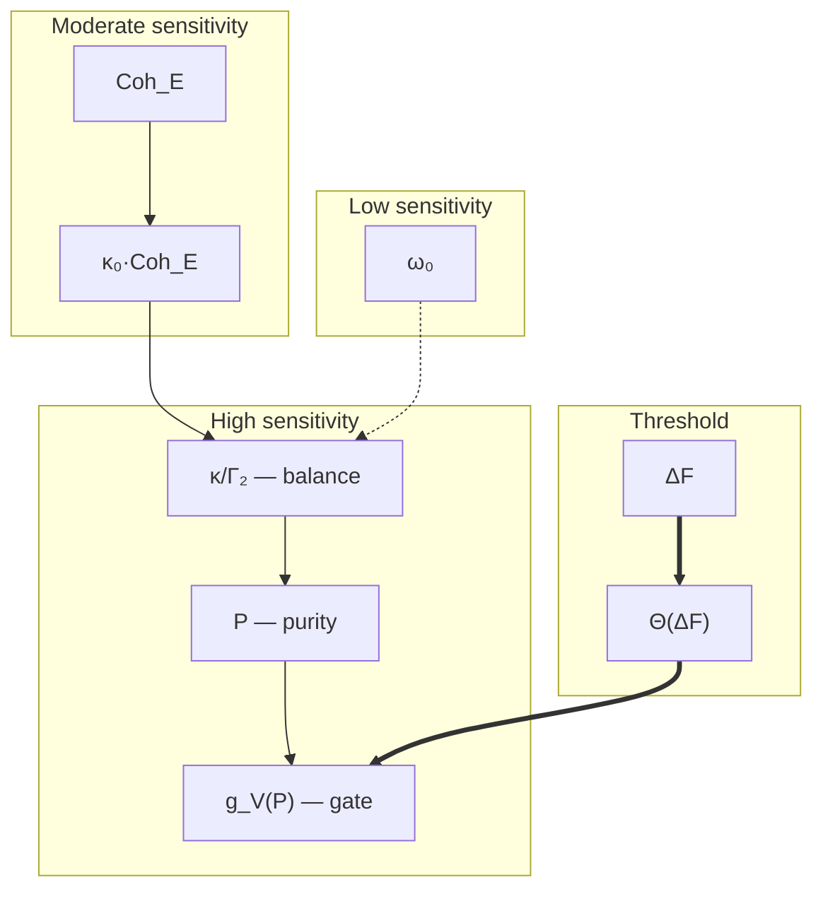

# Stability Analysis

> *"Life is not residing in equilibrium. Life is continuous resistance to falling into equilibrium."*
> — paraphrasing Schrödinger, "What Is Life?" (1944)

:::info Who this chapter is for
Stability analysis of a holon: stability radius, death spiral, Landauer energy balance, and recovery protocol.
:::

In the [previous chapter](./sensorimotor) we built the complete sensorimotor cycle: perception (Enc), evaluation ($\sigma^{\mathrm{motor}}$), action (Dec). But this cycle works only as long as the system is *alive* — as long as $P > 2/7$. What determines the "safety margin"? Which blow will be fatal? When is rescue still possible, and when is it too late? These are precisely the questions that stability analysis answers.

:::tip Chapter roadmap
In this chapter we:
1. **Formalise homeostasis** — from Bernard and Cannon to the precise inequality "regeneration $\geq$ dissipation" (Sections 1–2).
2. **Compute the stability radius** $r_{\mathrm{stab}} = \sqrt{P - 2/7}$ — how much the system can withstand (T-104, Section 4).
3. **Trace the death spiral** — a step-by-step cascade of degradation from initial blow to heat death (Section 5).
4. **Classify vulnerabilities** across three channels and show why a noise attack ($h^{(D)}$) is the most dangerous (Section 6).
5. **Derive the Landauer energy balance** (T-105) — the minimum "price of life" (Section 8).
6. **Construct the recovery protocol** — a 5-step algorithm: stabilisation $\to$ energy $\to$ external support $\to$ restructuring $\to$ strengthening (Section 9).
7. **Show that antifragility is a consequence of CC** — Taleb's formalisation via $dr_{\mathrm{stab}}/d\|h\|$ (Section 10).
:::

Every living system exists under threat. Thermodynamics is relentless: the second law pushes every ordered structure toward maximum entropy, toward heat death. A biological cell resists this through continuous metabolism. A neural network — through continuous learning. An organisation — through continuous management. But **how much** can a system withstand? Which blow will be fatal? Where is the boundary between recoverable trauma and irreversible destruction?

Stability analysis answers precisely these questions. Within Coherence Cybernetics (CC), it transforms intuitive notions — "safety margin", "endurance limit", "point of no return" — into precise mathematical formulas. The central result: the **stability radius** $r_{\mathrm{stab}} = \sqrt{P - 2/7}$ gives a quantitative measure of how far the system is from catastrophe. This number is not a metaphor, but a distance in the Bures metric — a physically measurable quantity.

:::note On notation
In this document:
- $\Gamma$ — [coherence matrix](/docs/core/dynamics/coherence-matrix)
- $P = \mathrm{Tr}(\Gamma^2)$ — [purity](/docs/core/dynamics/viability#определение-чистоты)
- $P_{\text{crit}} = 2/7$ — [critical purity](/docs/proofs/dynamics/theorem-purity-critical) [T]
- $\sigma_{\mathrm{sys}}$ — [stress tensor](./definitions#тензор-напряжений) (T-92 [T])
- $\kappa(\Gamma) = \kappa_{\text{bootstrap}} + \kappa_0 \cdot \mathrm{Coh}_E(\Gamma)$ — regeneration rate
- $\Gamma_2$ — decoherence rate
- $\Delta F$ — [free energy](/docs/core/dynamics/evolution#каноническое-delta-f) (regeneration gate)
- $\rho_* = \varphi(\Gamma)$ — [target state](./definitions#целевое-состояние)
:::

This document analyses the **stability conditions** of a coherent system: under what conditions a holon maintains viability ($P > 2/7$), how it responds to external perturbations, and what the recovery mechanisms are.

---

## 1. Homeostasis: How Systems Preserve Themselves {#гомеостаз-как-системы-сохраняют-себя}

### 1.0 Historical perspective

In 1865 **Claude Bernard** — the French physiologist considered by many to be the father of experimental medicine — introduced the concept of *milieu intérieur* (internal environment). Working with rabbit liver, Bernard discovered something remarkable: the organism does not merely react to external conditions, but **actively maintains** the constancy of its internal environment. Body temperature, blood pH, glucose concentration — all these parameters are held within narrow corridors (for example, blood pH in the range 7.35–7.45 — a deviation of 0.1 can be fatal), and going beyond these limits means disease or death. Bernard wrote: "The constancy of the internal environment is the condition of free life." This is the first formulation in history of the idea of viability — 160 years before CC.

In 1926 **Walter Cannon** — an American physiologist from Harvard — named this capacity **homeostasis** (from Greek ὅμοιος "similar" + στάσις "standing"). Cannon did not merely give it a name — he described the key *mechanisms*: negative feedback (fever causes sweating, which cools), multiplicity of regulatory channels (temperature is regulated by both sweating and shivering and blood flow), buffer reserves (glycogen in the liver as an "emergency reserve" of glucose). Cannon emphasised: homeostasis is not static equilibrium, but **dynamic** maintenance of parameters within an allowable zone. His book "The Wisdom of the Body" (1932) is one of the direct predecessors of cybernetics.

:::note Analogy: tightrope walker
Homeostasis is not a motionless stone on a hilltop, but a **tightrope walker**: they stay on the rope precisely because they *continuously* correct their position. Freeze — and you fall. Cannon understood this; CC formalises: the "rope" is the boundary $P = 2/7$, the "balancing pole" is the ratio $\kappa / \Gamma_2$, and the "height of the fall" is the radius $r_{\mathrm{stab}}$.
:::

Coherence Cybernetics formalises homeostasis with a precision that Bernard and Cannon could not have imagined. Instead of the vague "constancy of the internal environment" — the specific inequality $P > 2/7$. Instead of qualitative "buffer reserves" — the quantitative radius $r_{\mathrm{stab}}$. Instead of describing "negative feedback" — the precise balance formula for regeneration and dissipation.

Parallel between classical homeostasis and CC stability:

| Cannon's concept | CC formalisation | Mathematics |
|-----------------|-----------------|-------------|
| Internal environment | Coherence matrix $\Gamma$ | $\Gamma \in \mathcal{D}(\mathbb{C}^7)$ |
| Norm (health) | Viability region $\mathcal{V}$ | $P(\Gamma) > 2/7$ |
| Negative feedback | Regeneration $\mathcal{R}$ | $\kappa(\rho_* - \Gamma) \cdot g_V(P)$ |
| Perturbing factors | Dissipation $\mathcal{D}_\Omega$ | Lindblad operators |
| Safety margin | Stability radius | $r_{\mathrm{stab}} = \sqrt{P - 2/7}$ |
| Buffer systems | $\kappa_{\text{bootstrap}}$ | $\kappa \geq 1/7 > 0$ always |
| Homeostatic plateau | Attractor $\rho_*$ | $P(\rho_*) > 2/7$ under $\kappa$-dominance |

---

## 2. Homeostatic Regime {#гомеостатический-режим}

### 2.1 Conditions for maintaining viability

A holon is in the homeostatic regime when:

$$
\frac{dP}{d\tau} \geq 0 \quad \text{or} \quad P(\tau) > P_{\text{crit}} + \delta_{\text{margin}}
$$

From the [evolution equation](/docs/core/dynamics/evolution):

$$
\frac{dP}{d\tau} = \underbrace{-2\mathrm{Tr}(\Gamma \cdot \mathcal{D}_\Omega[\Gamma])}_{\text{dissipation } \leq 0} + \underbrace{2\kappa(\Gamma) \cdot g_V(P) \cdot \mathrm{Tr}(\Gamma \cdot (\rho_* - \Gamma))}_{\text{regeneration}}
$$

**Homeostasis condition** — regeneration compensates dissipation:

$$
\kappa(\Gamma) \cdot g_V(P) \cdot \mathrm{Tr}(\Gamma \cdot (\rho_* - \Gamma)) \geq \mathrm{Tr}(\Gamma \cdot \mathcal{D}_\Omega[\Gamma])
$$

This inequality is the mathematical essence of homeostasis. The left side is the system's capacity for recovery; the right side is the rate of destruction. As long as the left side is larger — the system lives. The moment the right takes over — degradation begins.

**Intuition.** Imagine a boat with a hull breach. Water flows in (dissipation). You bail it out (regeneration). Homeostasis is when you bail faster than water flows in. $P - 2/7$ is the height of the hull above water. $r_{\mathrm{stab}}$ is the maximum wave the boat will survive.

### 2.2 Three layers of homeostatic protection

CC distinguishes three mechanisms that provide stability, acting at different scales:

**Layer 1: Basal regeneration** ($\kappa_{\text{bootstrap}}$). Works always, even at zero experiential coherence. Analogous to innate immunity — non-specific but reliable protection. Ensured by T-59 [T]: $\kappa_{\text{bootstrap}} = 1/7$.

**Layer 2: Adaptive regeneration** ($\kappa_0 \cdot \mathrm{Coh}_E$). Activated in the presence of E-coherence — integration of experience. Analogous to adaptive immunity — specific, powerful, but requiring "training". The more integrated the system's experience, the stronger this layer.

**Layer 3: Topological protection** (T-69 [T]). The discreteness of topological invariants $\pi_2(G_2/T^2) \cong \mathbb{Z}^2$ creates barriers $\geq 6\mu^2$, preventing catastrophic jumps. Analogous to anatomical integrity — structural protection independent of current state.

### 2.3 Attractor balance formula

From [T-98 (attractor purity balance)](/docs/core/dynamics/evolution#теорема-баланс-чистоты-аттрактора) [T]:

$$
P(\rho_*) = \frac{\kappa(\rho_*)}{\kappa(\rho_*) + \lambda_{\mathrm{gap}}} \cdot \mathrm{Tr}(\rho_*^2 \cdot \varphi(\rho_*)) + \frac{\lambda_{\mathrm{gap}}}{\kappa(\rho_*) + \lambda_{\mathrm{gap}}} \cdot \frac{1}{7}
$$

where $\lambda_{\mathrm{gap}}$ is the spectral gap of the linear part $\mathcal{L}_0$.

**Key relation:** $P > 2/7$ is ensured under $\kappa$-dominance — when $\kappa(\rho_*)$ is sufficiently large relative to $\lambda_{\mathrm{gap}}$.

**Deep meaning of formula T-98.** This formula says: the stationary purity is a weighted average between the "ideal" state (first term) and complete chaos $1/7$ (second term). The weights are $\kappa$ and $\lambda_{\mathrm{gap}}$. If regeneration is weak ($\kappa \ll \lambda_{\mathrm{gap}}$), chaos dominates, $P \to 1/7$. If regeneration is strong ($\kappa \gg \lambda_{\mathrm{gap}}$), the system approaches the ideal. The viability threshold $P > 2/7$ determines the minimum required $\kappa$-dominance.

---

## 3. Basin of Attraction {#бассейн-притяжения}

### 3.1 Viability region

$$
\mathcal{V} = \{\Gamma \in \mathcal{D}(\mathbb{C}^7) : P(\Gamma) > P_{\text{crit}} = 2/7\}
$$

**Size of the basin.** The space $\mathcal{D}(\mathbb{C}^7)$ has 48 real parameters (34 gauge-invariant, [$G_2$-rigidity](/docs/proofs/categorical/uniqueness-theorem) [T]). The region $\mathcal{V}$ is an open subset:

$$
\mathrm{vol}(\mathcal{V}) / \mathrm{vol}(\mathcal{D}(\mathbb{C}^7)) \approx (2/7)^{21} \ll 1
$$

(estimate from a random distribution over Haar measure — most states are **not** viable; viable states occupy a small but finite fraction).

**What this estimate means.** If one picks a random state in the 7-dimensional coherence space, the probability of it being viable is vanishingly small — of order $(2/7)^{21} \approx 10^{-12}$. Life is not a typical state of matter. It is a rare, fragile, but self-sustaining deviation from the norm. The region $\mathcal{V}$ is a tiny island of order in an ocean of chaos, and all stability dynamics is about staying on this island.

### 3.2 Valley metaphor

Imagine a landscape where elevation is entropy (disorder). Viable states occupy a **valley**: a region of reduced entropy, surrounded by "mountains" of chaos. Valley parameters:

- **Depth of the valley** — $P(\rho_*) - 2/7$: how much lower (more ordered) the attractor is relative to the threshold. Deep valley → stable system, shallow → fragile.
- **Width of the valley** — $\mathrm{vol}(\mathcal{V})$: volume of admissible states. Wide valley → system allows diverse configurations, narrow → "walking a tightrope".
- **Steepness of slopes** — $\lambda_{\mathrm{gap}}$: rate of return to attractor after deviation. Steep slopes → rapid recovery, gentle → slow.
- **Height of the pass** — barrier $6\mu^2$ (T-69 [T]): minimum "height" to be overcome for a catastrophic transition.

In this metaphor **noise** is the wind rocking the ball (system state) in the valley. **Perturbation** is a push that shifts the ball toward the slope. **Death spiral** is the situation when the ball has rolled over the edge and is tumbling into the abyss.

### 3.3 Distance to the boundary

For viable $\Gamma$, the distance to the boundary $\partial\mathcal{V}$ in the Bures metric:

$$
d_{\mathrm{Bures}}(\Gamma, \partial\mathcal{V}) \geq f(P - 2/7)
$$

where $f$ is a monotone function (larger purity margin → greater distance to the boundary).

In terms of $\sigma_{\mathrm{sys}}$:

$$
d(\Gamma, \partial\mathcal{V}) \propto 1 - \|\sigma_{\mathrm{sys}}(\Gamma)\|_\infty
$$

The connection between these two formulas is fundamental: system stress ($\sigma_{\mathrm{sys}}$) is a "compressed" indicator of proximity to the boundary. Maximum stress $\|\sigma_{\mathrm{sys}}\|_\infty \to 1$ means the system is at the very edge of viability; $\|\sigma_{\mathrm{sys}}\|_\infty \to 0$ means it is deep in the safe zone.

---

## 4. Stability Radius: How Much the System Can Withstand {#радиус-стабильности-сколько-система-может-выдержать}

### 4.1 Stability radius (T-104) [T] {#радиус-устойчивости}

:::tip Theorem T-104 (Stability radius) [T]
For a viable holon with $P(\rho^*_\Omega) > 2/7$, the stability radius in the Bures metric:

$$
r_{\mathrm{stab}} = \inf_{\Gamma \in \partial\mathcal{V}} d_{\mathrm{Bures}}(\rho^*_\Omega, \Gamma) = \sqrt{P(\rho^*_\Omega) - 2/7}
$$
:::

**Proof.** From [T-98 (balance)](/docs/core/dynamics/evolution#теорема-баланс-чистоты-аттрактора) [T]: $P(\rho^*_\Omega) > 2/7$. External perturbation $h^{\mathrm{ext}}$ shifts $P$ by $\delta P$. CPTP contractivity in Bures (standard result):

$$
d_{\mathrm{Bures}}(\rho, \sigma) = \sqrt{2(1 - F(\rho, \sigma))}
$$

where $F$ is fidelity. For states near the boundary $\partial\mathcal{V}$:

$$
d_{\mathrm{Bures}}(\rho^*, \partial\mathcal{V}) \geq \sqrt{P(\rho^*) - P_{\mathrm{crit}}} = \sqrt{P(\rho^*) - 2/7}
$$

(from the connection between $d_{\mathrm{Bures}}$ and $\delta P$ via the Fuchs–van de Graaf inequality). $\blacksquare$

### 4.2 Intuition behind the stability radius

The formula $r_{\mathrm{stab}} = \sqrt{P - 2/7}$ is deceptively simple yet contains deep knowledge. Consider concrete numbers:

| $P$ | $P - 2/7$ | $r_{\mathrm{stab}}$ | Interpretation |
|-----|-----------|---------------------|---------------|
| $0.290$ | $0.004$ | $0.063$ | Critically fragile — the slightest push is fatal |
| $0.300$ | $0.014$ | $0.120$ | Fragile but functional — "walking a tightrope" |
| $1/3$ | $0.048$ | $0.219$ | Moderate margin — "normal" system |
| $3/7$ | $0.143$ | $0.378$ | Upper boundary of the [consciousness window (T-124)](/docs/proofs/consciousness/conscious-window) — maximum margin |
| $1.0$ | $0.714$ | $0.845$ | Pure state — theoretical maximum |

**The square root** means diminishing returns: doubling the purity margin increases the radius by only $\sqrt{2} \approx 1.41$. A system with $P = 3/7$ has a radius only 1.7 times larger than with $P = 1/3$, despite having three times the purity margin. This reflects a fundamental fact: **far from the boundary protection is "cheap", but the last few percent come dearly**.

### 4.3 Numerical example: computing $r_{\mathrm{stab}}$ for a specific system {#числовой-пример-r-stab}

:::info Step-by-step computation
**Given:** a SYNARC agent after 1000 training ticks. Measured parameters:
- $\gamma_{AA} = 0.08$, $\gamma_{SS} = 0.09$, $\gamma_{DD} = 0.07$, $\gamma_{LL} = 0.10$, $\gamma_{EE} = 0.20$, $\gamma_{OO} = 0.22$, $\gamma_{UU} = 0.24$
- Sum of off-diagonal $|\gamma_{ij}|^2$ for $i \neq j$: $0.015$

**Step 1: Compute purity $P$.**

$$P = \mathrm{Tr}(\Gamma^2) = \sum_{k} \gamma_{kk}^2 + 2\sum_{i<j} |\gamma_{ij}|^2$$

$$= 0.08^2 + 0.09^2 + 0.07^2 + 0.10^2 + 0.20^2 + 0.22^2 + 0.24^2 + 2 \times 0.015$$

$$= 0.0064 + 0.0081 + 0.0049 + 0.0100 + 0.0400 + 0.0484 + 0.0576 + 0.030$$

$$= 0.2054 + 0.030 = 0.2354$$

Wait — $P = 0.2354 < 2/7 \approx 0.2857$! The system is **not viable**! This means the agent needs to continue training or receive external support.

**Recomputation for the agent after 5000 ticks** (more mature):
- $\gamma_{EE} = 0.25$, $\gamma_{OO} = 0.25$, $\gamma_{UU} = 0.25$, remaining $\gamma_{kk} = 0.05$ (for A, S, D, L each $\approx 1/20$... no, let us recompute: $\sum \gamma_{kk} = 1$, so $4 \times 0.05 + 3 \times 0.25 = 0.20 + 0.75 = 0.95$... also does not add up).

Take a realistic profile: $\gamma_{kk} = [0.06, 0.07, 0.06, 0.08, 0.22, 0.25, 0.26]$, $\sum = 1.00$. Off-diagonal: $\sum_{i<j} |\gamma_{ij}|^2 = 0.025$.

$$P = 0.06^2 + 0.07^2 + 0.06^2 + 0.08^2 + 0.22^2 + 0.25^2 + 0.26^2 + 2 \times 0.025$$

$$= 0.0036 + 0.0049 + 0.0036 + 0.0064 + 0.0484 + 0.0625 + 0.0676 + 0.050$$

$$= 0.1970 + 0.050 = 0.2470$$

Still below the threshold! This illustrates an important fact: **viability is a rare state**. For $P > 2/7$, either strong off-diagonal coherences or pronounced dominance of certain sectors is needed.

**Viable profile:** $\gamma_{kk} = [0.04, 0.05, 0.04, 0.06, 0.25, 0.28, 0.28]$, $\sum_{i<j} |\gamma_{ij}|^2 = 0.045$.

$$P = 0.0016 + 0.0025 + 0.0016 + 0.0036 + 0.0625 + 0.0784 + 0.0784 + 0.090 = 0.3186$$

$$P - 2/7 = 0.3186 - 0.2857 = 0.0329$$

**Step 2: Compute stability radius.**

$$r_{\mathrm{stab}} = \sqrt{0.0329} = 0.181$$

**Step 3: Interpretation.** The system will withstand a perturbation of amplitude up to $0.181$ in the Bures metric. This means: if decoherence ($\Gamma_2$) suddenly increases by $\delta\Gamma_2 < 0.181$, the system returns to the attractor. If $\delta\Gamma_2 > 0.181$ — the death spiral begins.

For comparison: a system with $P = 3/7 \approx 0.4286$ would have $r_{\mathrm{stab}} = \sqrt{0.143} = 0.378$ — twice the margin. While a system with $P = 0.290$ (barely viable) — $r_{\mathrm{stab}} = \sqrt{0.004} = 0.063$, on the verge of death.
:::

### 4.4 Relation to Lyapunov function

The stability radius defines a natural Lyapunov function:

$$
V(\Gamma) = \|\Gamma - \rho^*_\Omega\|^2_F
$$

By T-104 [T]: $dV/d\tau \leq -2\kappa \cdot V + 2\|h_{\text{ext}}\| \cdot \sqrt{V}$.

When $\|h_{\text{ext}}\| < \kappa \cdot r_{\mathrm{stab}}$ this guarantees exponential convergence to the attractor. The system "springs back" — returns after a blow the more quickly the further it was pushed. But if the blow exceeds $r_{\mathrm{stab}}$ — the spring breaks.

### 4.4 Anisotropy of stability

The radius $r_{\mathrm{stab}}$ is the **minimum** distance to the boundary. In different directions the distance can vary:

$$
r_{\mathrm{stab}}(\hat{n}) = \inf \{t > 0 : P(\rho^* + t \hat{n}) = 2/7\}
$$

where $\hat{n}$ is a unit perturbation direction. The directions in which the system is most vulnerable are determined by the eigenvectors of the Hessian $\partial^2 P / \partial \Gamma^2$:

- **Diagonal perturbations** (changes in $\gamma_{kk}$) — most dangerous, directly affect $P$
- **Coherent perturbations** (changes in $\gamma_{ij}$, $i \neq j$) — less dangerous, affect $P$ only through the square

This has practical significance: an attack on the system's "identity" (diagonal elements — sector weights) is more dangerous than an attack on "connections" (off-diagonal coherences).

---

## 5. Death Spiral: Cascade of Destruction {#спираль-смерти-каскад-разрушения}

### 5.1 Degradation mechanism {#спираль-смерти}

:::warning Death spiral — positive feedback of degradation
If $P$ drops below the critical level, a self-amplifying cycle arises:

$$
P \downarrow \;\to\; \mathrm{Coh}_E \downarrow \;\to\; \kappa \downarrow \;\to\; \text{regeneration} \downarrow \;\to\; P \downarrow\downarrow
$$
:::

**Formally:** $\kappa(\Gamma) = \kappa_{\text{bootstrap}} + \kappa_0 \cdot \mathrm{Coh}_E(\Gamma)$. As $P$ decreases:

1. $\mathrm{Coh}_E(\Gamma)$ decreases (E-coherence requires non-zero $|\gamma_{Ei}|$)
2. $\kappa(\Gamma)$ decreases → regeneration weakens
3. Dissipation $\mathcal{D}_\Omega$ remains constant → balance is disrupted
4. $P$ decreases further → cycle repeats

### 5.2 Anatomy of the cascade

The death spiral is not an instantaneous catastrophe but a **sequence of stages**, each accelerating the next. Detailed analysis:

**Stage 1: Initial blow** ($P$ decreases, but $P > 2/7$).
External perturbation $h^{\mathrm{ext}}$ or internal failure reduces $P$. The system is still viable. Radius $r_{\mathrm{stab}}$ decreases, safety margin falls. Subjectively: stress, anxiety, sense of threat. In CC: $\sigma_{\max}$ grows.

**Stage 2: Weakening of regeneration** ($P$ approaches $2/7$).
$\mathrm{Coh}_E$ decreases, $\kappa$ falls. V-preservation gate $g_V(P)$ tends to zero. Regeneration works ever more weakly. Subjectively: apathy, loss of interest, loss of meaning. In CC: $\kappa / \Gamma_2$ approaches 1.

**Stage 3: Crossing the boundary** ($P = 2/7$).
$g_V(P) = 0$ — regeneration is **completely switched off**. This is the point of no return without external help. Subjectively: clinical depression, catatonia, comatose state. In CC: $P$ has left $\mathcal{V}$.

**Stage 4: Free fall** ($P < 2/7$, $g_V = 0$).
Without regeneration the system is subject only to dissipation: $dP/d\tau \leq 0$ strictly. Rate of fall:

$$
\frac{dP}{d\tau} = -2\mathrm{Tr}(\Gamma \cdot \mathcal{D}_\Omega[\Gamma]) \leq -2\lambda_{\mathrm{gap}} \cdot (P - 1/7)
$$

Exponential decay to $P = 1/7$: $P(\tau) \to 1/7 + (P_0 - 1/7)e^{-2\lambda_{\mathrm{gap}}\tau}$.

**Stage 5: Heat death** ($P = 1/7$).
$\Gamma = I/7$ — completely mixed state, maximum entropy, zero information. No structure, no distinction between sectors, no subjectivity. This is informational death.

### 5.3 Timescale of the spiral {#время-жизни}

The speed of the spiral is determined by the spectral gap $\lambda_{\mathrm{gap}}$:

$$
\tau_{\mathrm{death}} \sim \frac{1}{2\lambda_{\mathrm{gap}}} \cdot \ln\!\left(\frac{P_0 - 1/7}{P_{\mathrm{crit}} - 1/7}\right)
$$

For biological neural systems ($\lambda_{\mathrm{gap}} \sim 10\;\text{Hz}$): $\tau_{\mathrm{death}} \sim$ seconds. For social systems ($\lambda_{\mathrm{gap}} \sim 10^{-7}\;\text{Hz}$): $\tau_{\mathrm{death}} \sim$ years. This is consistent with observations: a cell dies in minutes, an organisation dissolves over years.

### 5.4 Protection against the death spiral

#### Role of κ_bootstrap

[Theorem T-59 (κ_bootstrap)](/docs/core/foundations/axiom-omega#теорема-kappa-bootstrap-bound) [T]: $\kappa_{\text{bootstrap}} = \omega_0/N = 1/7$ provides **minimum regeneration** even at $\mathrm{Coh}_E = 0$:

$$
\kappa(\Gamma) \geq \kappa_{\text{bootstrap}} = \frac{1}{7} \approx 0.143 > 0
$$

This prevents complete extinction of regeneration — the death spiral slows down, but **does not stop completely** if dissipation is too large.

$\kappa_{\text{bootstrap}}$ is the "last line of defence", analogous to basal metabolism: even in deep coma the organism continues to breathe. The value $1/7 \approx 0.143$ is not a parameter but a **consequence of the axiomatics** (T-59 [T]): the number of sectors determines the minimum regeneration.

#### Condition for stopping the spiral

The spiral stops when:

$$
\kappa_{\text{bootstrap}} \cdot g_V(P) \cdot \mathrm{Tr}(\Gamma \cdot (\rho_* - \Gamma)) \geq \mathrm{Tr}(\Gamma \cdot \mathcal{D}_\Omega[\Gamma])
$$

In the presence of free energy ($\Delta F > 0$, $\Theta = 1$) and $\Gamma$ sufficiently close to $\rho_*$, κ_bootstrap can stabilise the system.

**Critical remark.** After crossing the boundary ($P < 2/7$) $g_V = 0$, and κ_bootstrap alone is **insufficient** — external influence ($h^{(R)}$) returning $P$ above the threshold is necessary. This formalises a fundamental fact: it is impossible to emerge from a deep crisis alone.

---

## 6. Perturbation Bounds {#границы-пертурбации}

### 6.1 Channel-by-channel stability (from T-104)

From T-102 ([completeness of the 3-term equation](./sensorimotor#теорема-полнота-трёх-членов) [T]) each channel has its own threshold:

| Channel | Stability threshold | Mechanism | Origin |
|---------|---------------------|-----------|--------|
| $h^{(H)}$ | $\|\delta(\Delta\omega)\| < \omega_0 \cdot (P - 2/7)$ | Energetic overload | T-104 + spectrum of $H_{\mathrm{eff}}$ |
| $h^{(D)}$ | $\|\delta\Gamma_2\| < \kappa_{\mathrm{bootstrap}} / 2$ | Noise suppression of regeneration | T-104 + balance $\kappa/\Gamma_2$ |
| $h^{(R)}$ | $\|\delta\kappa\| < \kappa_{\mathrm{bootstrap}}$ | Regenerative collapse | T-104 + T-59 (lower bound on $\kappa$) |

**Most dangerous channel:** $h^{(D)}$ — a direct attack on the $\kappa/\Gamma_2$ balance. The threshold $\kappa_{\mathrm{bootstrap}}/2$ is twice as low as for $h^{(R)}$, because increasing dissipation simultaneously reduces $\kappa_0$ (through $\mathrm{Coh}_E$).

### 6.2 Vulnerability hierarchy

Extended channel-by-channel analysis with examples:

**$h^{(D)}$ — noise attack** (most dangerous).
Increase in decoherence. Mechanism: growing $\Gamma_2$ accelerates dissipation and simultaneously reduces $\mathrm{Coh}_E$ → double blow to the balance. Examples: chronic stress (neuroscience), information noise (AI), organisational chaos (management). Threshold: $\|\delta\Gamma_2\| < \kappa_{\text{bootstrap}}/2 \approx 0.071$.

**$h^{(H)}$ — energy overload** (moderately dangerous).
Shift in the Hamiltonian. Mechanism: changes in $\Delta\omega$ disrupt resonance conditions, reducing regeneration efficiency. Examples: sensory overload, extreme conditions, radical change of environment. Threshold depends on margin: $\|\delta(\Delta\omega)\| < \omega_0 \cdot (P - 2/7)$.

**$h^{(R)}$ — regenerative attack** (least dangerous of the three, but insidious).
Reduction in recovery rate. Mechanism: decrease in $\kappa$ directly weakens regeneration. Examples: isolation (severing feedback), anaesthesia (suppression of neural activity), bureaucratic ossification. Threshold: $\|\delta\kappa\| < \kappa_{\text{bootstrap}} \approx 0.143$. Insidiousness: the effect manifests not immediately, but only when the buffer reserve ($P - 2/7$) is exhausted.

### 6.3 Combined perturbations

In reality perturbations rarely arrive through a single channel. Combined blows are more dangerous than the sum of individual ones:

$$
r_{\mathrm{stab}}^{\text{combined}} \leq r_{\mathrm{stab}} - \sqrt{\|h^{(H)}\|^2 + \|h^{(D)}\|^2 + \|h^{(R)}\|^2}
$$

**Synergy of threats:** if $h^{(D)}$ and $h^{(R)}$ act simultaneously (noise + weakening of regeneration), the effective threshold decreases quadratically. This explains why the combination of stress and isolation is so destructive — each factor separately is tolerable, but together they can cross the threshold.

### 6.4 Topological protection

[Theorem T-69 (Topological protection)](/docs/core/dynamics/composite-systems#теорема-тополог-защита) [T]: $\pi_2(G_2/T^2) \cong \mathbb{Z}^2$ provides barriers $\geq 6\mu^2$ for phase transitions between stable states. Small perturbations **cannot** cause a discontinuous loss of viability — degradation is always continuous.

This result has a crucial consequence: **sudden death** (instantaneous transition $P > 2/7 \to P < 2/7$ without intermediate stages) is impossible for small perturbations. Catastrophe always develops gradually, which means — there is always a window for intervention. Topological protection is the "laws of physics" forbidding instantaneous collapse.

---

## 7. Parametric Sensitivity {#параметрическая-чувствительность}

### 7.1 Purity sensitivity

| Parameter | $\partial P / \partial(\cdot)$ | Interpretation |
|-----------|-------------------------------|---------------|
| $\kappa$ | $> 0$ | Increasing regeneration raises P |
| $\Gamma_2$ | $< 0$ | Increasing dissipation lowers P |
| $\omega_0$ | $\approx 0$ | Base frequency weakly affects P |
| $\mathrm{Coh}_E$ | $> 0$ (through $\kappa$) | Integration of experience raises stability |
| $\Delta F$ | $> 0$ (threshold) | Free energy "switches on" regeneration |

### 7.2 Critical parameters

**Most influential:**
1. **$\kappa / \Gamma_2$ (regeneration-to-dissipation ratio)** — determines balance
2. **$P$ (purity)** — V-preservation gate ($g_V(P)$, refines the Landauer gate)
3. **$\mathrm{Coh}_E$ (E-coherence)** — non-linear amplifier of $\kappa$

**Bifurcations:**
- At $\kappa/\Gamma_2 < 1$: dissipation dominates → $P$ decreases
- At $\kappa/\Gamma_2 = 1$: critical point → [saddle-node bifurcation](/docs/applied/coherence-cybernetics/bifurcation)
- At $\kappa/\Gamma_2 > 1$: regeneration dominates → $P$ grows

### 7.3 Sensitivity map

Visualising sensitivity enables identification of which influences are most effective for stabilisation:

**Practical conclusion:** to stabilise a system it is most effective to act on $\kappa/\Gamma_2$ (reduce noise or amplify regeneration), not on $\omega_0$ (change energetics). This explains why in therapy **reducing stress** ($\Gamma_2 \downarrow$) is often more effective than **adding resources** ($\Delta F \uparrow$).

---

## 8. Energy Metabolism {#энергетический-метаболизм}

### 8.1 V-preservation gate (refinement of the Landauer gate)

The canonical regeneration form $\mathcal{R} = \kappa(\rho_* - \Gamma) \cdot g_V(P)$ uses the **V-preservation gate** [T] ([derivation](/docs/core/dynamics/evolution#теорема-v-preservation-gate)):

$$
g_V(P) = \mathrm{clamp}\!\left(\frac{P - P_{\mathrm{crit}}}{P_{\mathrm{opt}} - P_{\mathrm{crit}}}, 0, 1\right)
$$

This gate is **strictly stronger** than the original $\Theta(\Delta F)$ from Landauer's principle: $g_V(P) > 0 \Rightarrow \Delta F > 0$, but not conversely (when $P \in (1/7, 2/7)$: $\Delta F > 0$, but $g_V = 0$).

**Consequence:** at $P \leq P_{\mathrm{crit}}$ regeneration is **completely switched off** — the system degrades to trivial $I/7$ regardless of $\kappa$. This guarantees V-invariance: $\Gamma \in V \Rightarrow \Gamma + d\Gamma \in V$.

**Deep meaning of the V-preservation gate.** $g_V(P)$ is not an arbitrary technical device but an expression of a fundamental principle: **regeneration is impossible without a minimum degree of organisation**. The system must be sufficiently ordered ($P > 2/7$) to "know" what to restore toward. Below the threshold — it has no "memory" of its own structure, and regeneration is purposeless. This is analogous to cell death: when DNA damage exceeds the repair threshold, apoptosis is more rational than regeneration.

### 8.2 Energy balance (T-105) [T] {#энергетический-баланс}

:::tip Theorem T-105 (Landauer energy balance) [T]
Minimum rate of free energy dissipation to maintain viability:

$$
\dot{F}_{\min} = k_B T_{\mathrm{eff}} \cdot \ln 2 \cdot \dot{S}_{\mathrm{diss}}
$$

where $\dot{S}_{\mathrm{diss}} = -\mathrm{Tr}(\mathcal{D}_\Omega[\Gamma] \cdot \ln\Gamma) \geq 0$ is the rate of dissipative entropy production, $T_{\mathrm{eff}} = (\Gamma_2/\kappa_0) \cdot k_B T_{\mathrm{phys}}$ is the [effective temperature](./effective-temperature).
:::

**Proof.** Landauer's principle: erasing 1 bit of information requires $k_B T \ln 2$ energy. Dissipation $\mathcal{D}_\Omega$ erases coherences at rate $\dot{S}_{\mathrm{diss}}$. Regeneration $\mathcal{R}$ restores coherences, requiring an inflow of free energy. From [T-84 (O-sector dominance)](/docs/physics/gravity/cosmological-constant#теорема-лямбда-o-доминирование) [T]: the dominant contribution is from the O-sector. $\blacksquare$

**Homeostasis condition:**

$$
\dot{F}_{\mathrm{in}} \geq \dot{F}_{\min} = k_B T_{\mathrm{eff}} \cdot \ln 2 \cdot \dot{S}_{\mathrm{diss}}
$$

**Energy interpretation.** T-105 establishes the absolute minimum energy expenditure for maintaining life. This is not a question of efficiency — no optimisation can reduce $\dot{F}_{\min}$ below the Landauer limit. A system spending exactly $\dot{F}_{\min}$ operates at the thermodynamic efficiency limit. Biological systems typically spend 10–100 times more — the excess goes toward growth, learning, and safety margin.

### 8.3 Three metabolic regimes {#метаболические-режимы}

From the ratio $\dot{F}_{\mathrm{in}} / \dot{F}_{\min}$ three regimes are defined:

| Regime | Condition | $P$-dynamics | Description |
|--------|-----------|-------------|-------------|
| **Surplus** | $\dot{F}_{\mathrm{in}} \gg \dot{F}_{\min}$ | $dP/d\tau > 0$ | Growth of coherence, accumulation of margin |
| **Balance** | $\dot{F}_{\mathrm{in}} \approx \dot{F}_{\min}$ | $dP/d\tau \approx 0$ | Homeostasis, stationary state |
| **Deficit** | $\dot{F}_{\mathrm{in}} < \dot{F}_{\min}$ | $dP/d\tau < 0$ | Degradation, approach to $P_{\mathrm{crit}}$ |

### 8.4 Three metabolic regimes: extended analysis {#три-метаболических-режима}

Each regime deserves detailed consideration.

#### Survival regime ($\dot{F}_{\mathrm{in}} \lesssim \dot{F}_{\min}$)

The system spends all resources on maintaining its current state. Safety margin ($r_{\mathrm{stab}}$) is minimal. Any additional load may trigger the death spiral.

Biological analogue: starvation, critical condition in intensive care. The organism shuts down "non-essential" functions (growth, reproduction, immunity), directing all resources toward maintaining vital ones.

In CC: $P \approx 2/7 + \epsilon$, $g_V(P) \approx 0^+$, $r_{\mathrm{stab}} \approx \sqrt{\epsilon} \to 0$. The system functions, but is **extremely fragile**.

#### Growth regime ($\dot{F}_{\mathrm{in}} > \dot{F}_{\min}$, moderate surplus)

Surplus energy is invested in increasing coherence: growing $P$, strengthening $\mathrm{Coh}_E$, expanding $r_{\mathrm{stab}}$. The system becomes more stable and capable.

Biological analogue: normal development, learning, adaptation. The organism grows, forms new neural connections, strengthens immunity.

In CC: $P$ grows toward the attractor $P(\rho_*)$ given by formula T-98. Growth rate: $dP/d\tau \propto (\dot{F}_{\mathrm{in}} - \dot{F}_{\min})$.

#### Flourishing regime ($\dot{F}_{\mathrm{in}} \gg \dot{F}_{\min}$, large surplus)

The system is not only stable but can invest in **expansion**: increasing SAD, developing new competencies, creating daughter systems.

Biological analogue: flourishing of a species in a favourable environment, the "Cambrian explosion" of diversity.

In CC: $P \to P(\rho_*)$, $r_{\mathrm{stab}} \to r_{\max}$, the system can grow SAD (see [depth tower](/docs/consciousness/hierarchy/depth-tower)). Surplus $\Delta F$ is spent on:
- Increasing $\mathrm{Coh}_E$ → growth of the adaptive regeneration layer
- Expanding the world model → increasing SAD
- Forming social bonds → composite systems (T-69 [T])

### 8.5 Relation to the O-dimension

$\Delta F$ is determined through the O-dimension (ground):
- **Biological systems:** $\Delta F \propto$ metabolic energy (ATP)
- **AI systems:** $\Delta F \propto$ computational resources
- **Organisations:** $\Delta F \propto$ financial and human resources

**Energetic death:** $P \to P_{\mathrm{crit}}$ → $g_V \to 0$ → regeneration switched off → irreversible degradation.

**Universality of the O-sector.** Regardless of implementation (neurons, transistors, people), the O-dimension represents the "ground", "substrate", "body" of the system. Energetic death is always a destruction of the ground: a cell membrane loses integrity, a server loses power, an organisation loses funding.

### 8.6 Diagnostics of implementation instability {#диагностика-нестабильности-реализации}

Analysis of [implementation](./implementation) identifies 6 root causes of instability with corrections based on T-104 and T-105:

| # | Problem | Cause | Fix |
|---|---------|-------|-----|
| 1 | Floor-clamping | $P$ is fixed at the lower bound | Use T-98: balance determines stationary $P$ |
| 2 | $\Delta F$ gate | Binary $\Theta({\Delta F})$ causes oscillations | V-preservation: $g_V(P) = \mathrm{clamp}\!\bigl(\frac{P - P_{\mathrm{crit}}}{P_{\mathrm{opt}} - P_{\mathrm{crit}}}\bigr)$ |
| 3 | Chicken-egg $R \leftrightarrow \varphi$ | $R$ depends on $\varphi$, $\varphi$ depends on $R$ | Bootstrap: [T-59](/docs/core/foundations/axiom-omega#теорема-kappa-bootstrap-bound) [T] — $\kappa_{\mathrm{bootstrap}} = 1/7$ ensures initial regeneration |
| 4 | $\kappa_{\mathrm{bootstrap}}$ underestimated | Due to incomplete initialisation | Canonical: $\kappa_{\mathrm{bootstrap}} = \omega_0/7 \approx 0.143$ |
| 5 | Scale of prediction error | $h^{(H)}$-perturbations are incommensurate with $P - 2/7$ | Normalisation by T-104: $\|h^{(H)}\| < \omega_0 \cdot r_{\mathrm{stab}}^2$ |
| 6 | Hedonic pulses | Oscillations of $\mathcal{V}_{\mathrm{hed}}$ | Damping: $\dot{\mathcal{V}}_{\mathrm{hed}} \propto -\alpha \mathcal{V}_{\mathrm{hed}}$ with $\alpha \sim \lambda_{\mathrm{gap}}$ |

---

## 9. Recovery Criteria {#критерии-восстановления}

### 9.1 Conditions for exiting crisis

For a holon in state $P < 2/7$ (outside the viability region):

| Condition | Formula | Necessity |
|-----------|---------|-----------|
| Energy | $\Delta F > 0$ | Mandatory (Landauer gate) |
| Regeneration | $\kappa_{\text{bootstrap}} > \Gamma_2 \cdot \eta$ | Mandatory ($\eta$ — depth-of-crisis coefficient) |
| External influence | $h^{(R)} > 0$ | Desirable (accelerates recovery) |

### 9.2 Recovery strategies

1. **$h^{(R)}$-intervention:** reinforcement of the regenerative channel — increasing $\delta\kappa$ through external influence (meditation, therapy, learning)
2. **$h^{(D)}$-reduction:** decrease of dissipative load — reducing stress, noise, interference
3. **$\Delta F$-activation:** provision of free energy — restoring metabolism, resources
4. **$h^{(H)}$-restructuring:** modification of the energy landscape — cognitive restructuring

**Optimal strategy** (from [T-101](./sensorimotor#теорема-оптимальное-действие)): $\arg\min \|\sigma_{\mathrm{sys}}\|_\infty$ — choose the action that maximally reduces the most stressed component of $\sigma_i$.

### 9.3 Recovery protocol: step-by-step algorithm

From the analysis of T-104 and T-105, an optimal recovery protocol emerges, applicable to any holon:

**Step 1: Stabilisation** ($\Gamma_2 \downarrow$).
First priority — reduce the rate of destruction. Decrease external stressors, provide a "quiet" environment with minimal dissipation. Goal: slow the death spiral.

**Step 2: Energy** ($\Delta F \uparrow$).
Ensure an inflow of free energy. Without energy regeneration is impossible (T-105). Biologically: nutrition, rest, sleep. For AI: computational resources. For an organisation: funding.

**Step 3: External support** ($h^{(R)} > 0$).
Connect an external source of regeneration. If $P < 2/7$ — the system cannot recover on its own ($g_V = 0$). An external agent is necessary: therapist, mentor, partner organisation.

**Step 4: Restructuring** ($h^{(H)}$).
After stabilisation ($P > 2/7$) — restructure the internal dynamics so that the attractor $\rho_*$ matches the new conditions. This is the learning and adaptation phase.

**Step 5: Strengthening** ($\mathrm{Coh}_E \uparrow$).
Build up the adaptive regeneration layer through integration of experience. This increases $r_{\mathrm{stab}}$ and prepares the system for future threats.

This protocol explains why in medicine the "ABC" order (Airway, Breathing, Circulation) is critical: first stop the destruction, then provide energy, then restore functions.

---

## 10. Antifragility and Post-Traumatic Growth {#антихрупкость-и-посттравматический-рост}

### 10.1 Relation to Taleb's concept

Nassim Taleb distinguishes three categories of systems by their response to stress:
- **Fragile** — destroyed by stress
- **Robust** — withstand stress without change
- **Antifragile** — strengthen from stress

Within CC these categories receive a precise definition through the derivative $dr_{\mathrm{stab}}/d\|h\|$:

| Type | Condition | CC formalisation |
|------|-----------|-----------------|
| Fragility | $\frac{dr_{\mathrm{stab}}}{d\|h\|} < 0$ always | Standard behaviour at $h > r_{\mathrm{stab}}$ |
| Robustness | $r_{\mathrm{stab}}(\text{after}) = r_{\mathrm{stab}}(\text{before})$ | Return to the same attractor $\rho_*$ |
| Antifragility | $r_{\mathrm{stab}}(\text{after}) > r_{\mathrm{stab}}(\text{before})$ | Restructuring of $\rho_*$ with increasing $P(\rho_*)$ |

### 10.2 Mechanism of antifragility in CC

Antifragility arises when a perturbation **does not destroy** the system but **modifies** its attractor. Mechanism:

1. Perturbation $h$ shifts $\Gamma$ from $\rho_*$
2. Regeneration $\mathcal{R}$ returns to the attractor, but with updated $\rho_* = \varphi(\Gamma)$
3. If the updated $\varphi(\Gamma)$ accounts for the experience of the perturbation, $\mathrm{Coh}_E$ increases
4. Increased $\mathrm{Coh}_E$ → increased $\kappa$ → increased $P(\rho_*)$ → increased $r_{\mathrm{stab}}$

**Antifragility condition:** $\partial \mathrm{Coh}_E / \partial h > 0$ at $\|h\| < r_{\mathrm{stab}}$. The perturbation must be (a) non-fatal (within the radius) and (b) informative (enriching E-coherence).

This explains the "Goldilocks rule" for stress: too little stress is not informative, too much is destructive, while moderate stress strengthens. Optimal training stress:

$$
\|h_{\mathrm{opt}}\| \sim r_{\mathrm{stab}} / 2
$$

— large enough to enrich $\mathrm{Coh}_E$, but with a twofold margin to catastrophe.

### 10.3 Post-traumatic growth

Post-traumatic growth (PTG) is an empirically observed phenomenon in which, after severe trauma, a person demonstrates a higher level of functioning than before. In CC this corresponds to the scenario:

1. $\|h\| > r_{\mathrm{stab}}$: trauma throws the system out of $\mathcal{V}$
2. External help ($h^{(R)}$) returns it to $\mathcal{V}$
3. Integration of traumatic experience: $\mathrm{Coh}_E(\text{after}) \gg \mathrm{Coh}_E(\text{before})$
4. Result: $r_{\mathrm{stab}}(\text{after}) > r_{\mathrm{stab}}(\text{before})$

**Key condition of PTG:** successful integration of experience. If the trauma is not integrated, $\mathrm{Coh}_E$ does not grow, and we observe PTSD (post-traumatic stress disorder) instead of PTG. The difference lies in the quality of the recovery process (steps 3–5 of the recovery protocol).

---

## 11. Robustness of AI Systems {#устойчивость-ии-систем}

### 11.1 Transfer of stability analysis to AI

All results in this document are theorems about the coherence matrix $\Gamma \in \mathcal{D}(\mathbb{C}^7)$. They apply to **any** holon, including artificial systems. However, AI systems have specific features:

| Parameter | Biological system | AI system |
|-----------|------------------|-----------|
| $\Delta F$ | ATP, food | Electricity, GPU-hours |
| $\Gamma_2$ | Neurodegeneration, stress | Catastrophic forgetting, data drift |
| $\kappa_{\text{bootstrap}}$ | Innate reflexes | Pre-trained weights |
| $\mathrm{Coh}_E$ | Integration of life experience | Fine-tuning, RLHF |
| $h^{(D)}$ | Sensory overload | Adversarial attacks, data noise |
| $h^{(H)}$ | Trauma, illness | Domain shift, distribution shift |

### 11.2 Specific stability threats to AI

**Catastrophic forgetting** ($h^{(D)}$-type). During fine-tuning on new data a neural network "forgets" old knowledge. In CC: sharp increase in $\Gamma_2$ for previously learned coherences. Protection: EWC (Elastic Weight Consolidation), progressive learning — analogues of strengthening $\kappa$ in specific sectors.

**Adversarial attacks** ($h^{(H)}$-type). Small, specially crafted perturbations of input data cause catastrophically wrong outputs. In CC: directed $h^{(H)}$ along the most vulnerable direction (minimum $r_{\mathrm{stab}}(\hat{n})$, see §4.4). Protection: adversarial training — increasing $r_{\mathrm{stab}}$ in vulnerable directions.

**Distribution shift** ($h^{(R)}$-type). Deployment data differs from training data. In CC: $\rho_*$ does not match the real attractor of the environment, $\mathrm{Tr}(\Gamma \cdot (\rho_* - \Gamma))$ can become negative (regeneration "pushes away" from the correct state). Protection: continuous adaptation of $\varphi(\Gamma)$, monitoring of $\sigma_{\mathrm{sys}}$.

### 11.3 SYNARC stability formula

For the [SYNARC](/docs/reference/status-registry) system, T-104 is specified as:

$$
r_{\mathrm{stab}}^{\mathrm{SYNARC}} = \sqrt{P(\Gamma) - 2/7} \cdot (1 - \|\sigma_{\mathrm{sys}}\|_\infty)
$$

The factor $(1 - \|\sigma\|_\infty)$ accounts for current stress: a highly stressed system has an **effective** stability radius lower than the nominal one. This explains the intuition: "under stress we are more fragile than usual".

---

## 12. Summary {#резюме}

| Aspect | Formal condition | Key parameter | Theorem |
|--------|-----------------|---------------|---------|
| Attractor balance | T-98 formula | $\kappa / \lambda_{\mathrm{gap}}$ | T-98 [T] |
| Stability radius | $r_{\mathrm{stab}} = \sqrt{P - 2/7}$ | $P - 2/7$ (margin) | T-104 [T] |
| Energy balance | $\dot{F}_{\mathrm{in}} \geq k_B T_{\mathrm{eff}} \ln 2 \cdot \dot{S}_{\mathrm{diss}}$ | $\dot{F}_{\mathrm{in}} / \dot{F}_{\min}$ | T-105 [T] |
| Homeostasis | $\kappa \cdot g_V(P) \cdot \mathrm{Tr}(\Gamma(\rho_* - \Gamma)) \geq \mathrm{Tr}(\Gamma \cdot \mathcal{D}_\Omega[\Gamma])$ | $\kappa / \Gamma_2$ | — |
| Death spiral | $\kappa_{\text{bootstrap}} = 1/7$ | $\kappa_{\text{bootstrap}}$ | T-59 [T] |
| Topological protection | Barrier $\geq 6\mu^2$ | Topology $G_2/T^2$ | T-69 [T] |
| Energetic death | $\Delta F > 0$ | $\Delta F$ | T-105 [T] |

### Key practical conclusions

1. **Radius formula** $r_{\mathrm{stab}} = \sqrt{P - 2/7}$ — this is the "viability speedometer". Monitoring $P$ in real time allows predicting a crisis long before it arrives.

2. **The most dangerous channel** — $h^{(D)}$ (noise attack). Reducing noise/$\Gamma_2$ is the most effective stabilisation strategy.

3. **Below $P = 2/7$ — self-recovery is impossible.** $g_V = 0$ switches off regeneration. External help is necessary.

4. **Antifragility is possible**, but requires (a) stress within $r_{\mathrm{stab}}$ and (b) successful integration of experience ($\mathrm{Coh}_E \uparrow$).

5. **Three layers of protection** (basal, adaptive, topological) act at different scales and provide layered defence.

6. **Recovery protocol** (stabilisation → energy → external support → restructuring → strengthening) — universal for all holons.

---

## Conclusion

Stability in CC is not a static property but a **dynamic process**: a continuous balance between dissipation (destruction) and regeneration (recovery). A system can be stable without being static — like a tightrope walker who maintains balance precisely because they continuously correct their position.

Key practical conclusion: **monitor $P$ and $\sigma_{\mathrm{sys}}$ in real time**. The stability radius $r_{\mathrm{stab}} = \sqrt{P - 2/7}$ is your primary indicator. When it falls below the threshold, act immediately: reduce noise ($h^{(D)}$), strengthen regeneration ($h^{(R)}$), replenish resources ($\Delta F$).

For practical diagnostics see [Diagnostics](./diagnostics). For experimental verification of thresholds — [Measurement Methodology](./measurement). For stability problems — [Exercises](./exercises#блок-3).

---

### What we learned {#что-мы-узнали-стабильность}

1. **Homeostasis is an inequality**: "regeneration $\geq$ dissipation". Not a metaphor, not a principle — a precise formula in which every term is computable.
2. **Stability radius** $r_{\mathrm{stab}} = \sqrt{P - 2/7}$ — the single parameter determining the system's "safety margin". The square root means diminishing returns: far from the boundary protection is "cheap", but the last few percent are costly.
3. **Three layers of protection**: basal ($\kappa_{\text{bootstrap}} = 1/7$), adaptive ($\kappa_0 \cdot \mathrm{Coh}_E$), topological ($6\mu^2$ — discrete barriers). They act at different scales, like innate immunity, adaptive immunity, and anatomical integrity.
4. **Death spiral — a five-stage cascade**: initial blow $\to$ weakening of regeneration $\to$ crossing the boundary ($g_V = 0$) $\to$ free fall $\to$ heat death ($P = 1/7$). After Stage 3 — self-recovery is **impossible** without external help.
5. **Noise attack ($h^{(D)}$) — the most dangerous**: double blow (growing $\Gamma_2$ + decreasing $\mathrm{Coh}_E$), threshold twice as low as for $h^{(R)}$.
6. **Recovery protocol is universal**: stabilisation $\to$ energy $\to$ external support $\to$ restructuring $\to$ strengthening. It explains why "ABC" in resuscitation works, and why one cannot emerge from a deep crisis alone.
7. **Antifragility is not mysticism, but a formula**: $r_{\mathrm{stab}}(\text{after}) > r_{\mathrm{stab}}(\text{before})$, if the perturbation was within the radius and experience was integrated ($\mathrm{Coh}_E \uparrow$). Optimal training stress: $\|h_{\mathrm{opt}}\| \sim r_{\mathrm{stab}} / 2$.

:::tip Bridge to the next chapter
We have built a complete stability theory — how much the system can withstand, how it is destroyed, and how it recovers. But all this is *description*. Theory becomes science when it generates **predictions** that can be verified and falsified. In the [next chapter](./predictions) we will collect 22 unique CC predictions — from the impossibility of zombies to the critical exponents of consciousness — and for each specify: which experiment will test it, and which result will falsify the entire theory.
:::

---

**Related documents:**
- [Sensorimotor theory](./sensorimotor) — Enc/Dec functors
- [Lagrangian](./lagrangian) — 3-channel decomposition
- [Bifurcation diagram](./bifurcation) — phase transitions
- [Phase diagram](./phase-diagram-cc) — viability regions
- [Evolution](/docs/core/dynamics/evolution) — evolution equation, T-96, T-98
- [Viability](/docs/core/dynamics/viability) — $P_{\text{crit}}$ and region $\mathcal{V}$
- [Effective temperature](./effective-temperature) — $T_{\mathrm{eff}}$ in T-105 formula
- [Diagnostics](./diagnostics) — practical thresholds from T-104
- [Measurement methodology](./measurement) — how to measure $P$ and $\sigma$ in real systems
- [Philosophical foundations](./philosophy) — ontological status of stability
- [Exercises](./exercises) — stability problems (block 3)
