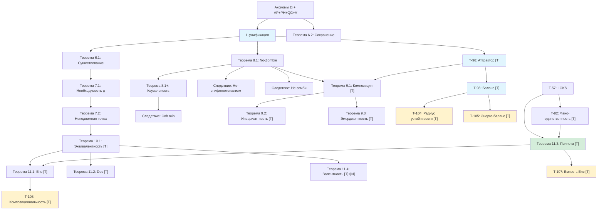

# Фундаментальные Теоремы

:::info Уровни формализации
Каждый результат помечен одним из статусов (полная система — см. [Реестр статусов](/docs/reference/status-registry)):
- **[Т]** Теорема — строго доказано из аксиом УГМ
- **[С]** Условная — условно на явном допущении
- **[Г]** Гипотеза — математически сформулировано, требует доказательства или непертурбативного вычисления
- **[И]** Интерпретация — семантический мост, формально открыт
- **[О]** Определение по соглашению — конвенция
- **[П]** Программа — направление исследований, открытая проблема
:::

:::note О нотации
В этом документе:
- $\Gamma$ — [матрица когерентности](/docs/core/dynamics/coherence-matrix)
- $\mathcal{V}$ — [область жизнеспособности](/docs/core/dynamics/viability): $\mathcal{V} = \{\Gamma : P(\Gamma) > 2/7\}$
- $P$ — [чистота](/docs/core/dynamics/viability#определение-чистоты): $P = \mathrm{Tr}(\Gamma^2)$
- $P_{\text{crit}} = 2/7$ — [теорема о критической чистоте](/docs/proofs/dynamics/theorem-purity-critical)
- $\varphi$ — [оператор самомоделирования](/docs/proofs/categorical/formalization-phi) (CPTP-канал)
- $R$ — [мера рефлексии](/docs/consciousness/foundations/self-observation#мера-рефлексии-r), порог $R_{\text{th}} = 1/3$
- $\Phi$ — [мера интеграции](/docs/core/structure/dimension-u#мера-интеграции-φ), порог $\Phi_{\text{th}} = 1$
- $C$ — [мера сознательности](/docs/consciousness/foundations/self-observation#мера-сознательности-c)
- $\kappa_0 = \|\mathrm{Nat}(\mathcal{D}_\Omega, \mathcal{R})\|$ — [категориальный вывод скорости регенерации](/docs/core/foundations/axiom-septicity#структурный-анзац-kappa0)
- $\mathrm{Coh}_E$ — [E-когерентность](./definitions#e-когерентность)
- $\mathcal{R}[\Gamma, E]$ — [регенеративный член](/docs/core/dynamics/evolution#3-регенеративный-член)
:::

## Теоремы существования

### Теорема 6.1 (Существование динамики) [Т]

:::info Формулировка
Для любого начального состояния $\Gamma_0 \in \mathcal{V}$ существует единственное решение уравнения эволюции на интервале $[0, T]$ для некоторого $T > 0$.
:::

**Доказательство:** Применение теоремы Пикара-Линделёфа к липшицевой правой части. ∎

### Теорема 6.2 (Сохранение свойств Γ) [Т]

:::info Формулировка
Динамика сохраняет эрмитовость, положительность и нормировку Γ.
:::

**Доказательство:**
1. Эрмитовость сохраняется каждым членом уравнения
2. Уравнение Линдблада сохраняет $\Gamma \geq 0$
3. Нелинейный регенеративный член также сохраняет положительность ([теорема CPTP-структуры](/docs/core/dynamics/evolution#сохранение-положительности))
4. След сохраняется: $\mathrm{Tr}(d\Gamma/d\tau) = 0$ ∎

## Теоремы о самореференции

### Теорема 7.1 (Необходимость самореференции) [Т]

:::info Формулировка
$$
\mathrm{Viable}(\mathbb{H}) \Rightarrow \exists \varphi : \|\Gamma - \varphi(\Gamma)\|_F < \varepsilon
$$
[Жизнеспособность](/docs/core/dynamics/viability) требует наличия [самомодели](/docs/proofs/categorical/formalization-phi).
:::

**Доказательство:**
1. Жизнеспособность требует поддержания $P > P_{\text{crit}} = 2/7$
2. Мониторинг $P$ требует доступа к Γ
3. Система **есть** Γ, значит часть Γ должна моделировать целое
4. Это определяет оператор $\varphi$ ∎

### Теорема 7.2 (Неподвижная точка рефлексии) [Т] {#теорема-72-условная-неподвижная-точка-рефлексии}

:::info Формулировка
Для сознательной системы с $R(\Gamma) > 0$ существует единственная неподвижная точка:
$$
\exists! \Gamma^* \in \mathcal{V} : \varphi(\Gamma^*) = \Gamma^*
$$

Доказано: $\varphi_k(\Gamma^*) = \Gamma^* \implies \Gamma^* = \rho^*$ (единственность из CPTP-контракции $\varphi$ и примитивности линейной части $\mathcal{L}_0$).
:::

**Доказательство:**

Пусть $\varphi: \mathcal{D}(\mathcal{H}) \to \mathcal{D}(\mathcal{H})$ — [CPTP-канал](/docs/proofs/categorical/formalization-phi).

1. Пространство $(\mathcal{D}(\mathcal{H}), \|\cdot\|_F)$ — полное метрическое пространство

2. **Строгое сжатие** из примитивности линейной части $\mathcal{L}_0$: по [теореме о примитивности](/docs/core/operators/lindblad-operators#примитивность-ℒω) [Т], линейный линдбладиан $\mathcal{L}_0 = -i[H,\cdot] + \mathcal{D}$ примитивен (единственное стационарное состояние $I/7$). Примитивность влечёт **равномерное сжатие** $e^{k\mathcal{L}_0}$ при $k > 0$: $\|e^{k\mathcal{L}_0}(\Gamma_1) - e^{k\mathcal{L}_0}(\Gamma_2)\|_F \leq e^{-\lambda_{\mathrm{gap}} k} \|\Gamma_1 - \Gamma_2\|_F$, где $\lambda_{\mathrm{gap}} > 0$ — спектральный зазор $\mathcal{L}_0$

3. По теореме Банаха о неподвижной точке $\exists! \Gamma^* : \varphi(\Gamma^*) = \Gamma^*$. Неподвижная точка $\Gamma^*_{\mathrm{coh}}$ имеет $P = 2/7$ ([T](/docs/core/operators/phi-operator#свойства))

**Скорость сходимости:**
$$
\|\varphi^n(\Gamma_0) - \Gamma^*\|_F \leq e^{-n\lambda_{\mathrm{gap}}} \cdot \|\Gamma_0 - \Gamma^*\|_F
$$

Геометрическая сходимость со скоростью $e^{-n\lambda_{\mathrm{gap}}}$ гарантирует достижение $\varepsilon$-приближения за $O(\log(1/\varepsilon))$ итераций. ∎

**Интерпретация:** $\Gamma^*$ — состояние идеального самопознания, достижимое итеративной рефлексией.

## Теорема о невозможности зомби

### Теорема 8.1: Необходимость интериорности (No-Zombie) [Т] при условии $\mathcal{D}_\Omega \neq 0$ {#теорема-81-условная-необходимость-интериорности-no-zombie}

:::tip Ключевая теорема [Т]
Для неизолированного ($\mathcal{D}_\Omega \neq 0$) жизнеспособного Голонома:
$$
\mathrm{Viable}(\mathbb{H}) \land \mathcal{D}_\Omega \neq 0 \;\Rightarrow\; \varphi = \varphi_{\text{coh}} \;\land\; \mathrm{Coh}_E(\Gamma) \geq \mathrm{Coh}_{\min} > \frac{1}{7}
$$
[Жизнеспособная](/docs/core/dynamics/viability) система **обязательно** имеет когерентно-сохраняющую самомодель $\varphi_{\text{coh}}$ и нетривиальную [E-когерентность](/docs/applied/coherence-cybernetics/definitions#e-когерентность), каузально влияющую на жизнеспособность.
:::

:::info Условие неизолированности ($\mathcal{D}_\Omega \neq 0$)
Для изолированной системы ($\mathcal{D}_\Omega = 0$) чистота сохраняется унитарной эволюцией, и регенерация не требуется. Теорема содержательна для **открытых** систем — единственного физически реализуемого случая. Условие $\mathcal{D}_\Omega \neq 0$ следует из $\Delta F > 0$ (система получает свободную энергию от окружения), что автоматически подразумевает взаимодействие и декогеренцию.
:::

**Доказательство** (дедуктивная цепь из теорем со статусом [Т]):

**Шаг 1** (Структурная положительность диссипации).
По [L-унификации](/docs/core/operators/lindblad-operators) [Т], операторы Линдблада выводятся из атомов классификатора $\Omega$. Для [Фано-структурированного диссипатора](/docs/proofs/gap/fano-channel#g2-ковариантность) [Т] (единственного $G_2$-ковариантного):

$$
\mathcal{D}_{\text{Fano}}[\Gamma] = \gamma \cdot \bigl(\mathcal{P}_{\text{Fano}}(\Gamma) - \Gamma\bigr), \quad \gamma = \sum_p \gamma_p > 0
$$

Действие на когерентности ([Теорема 2.1](/docs/proofs/gap/fano-channel#теорема-фано-канал) [Т]): каждая пара $(i,j)$ лежит на ровно одной Фано-линии, поэтому:

$$
[\mathcal{D}_{\text{Fano}}[\Gamma]]_{ij} = \gamma\!\left(\tfrac{1}{3}\gamma_{ij} - \gamma_{ij}\right) = -\frac{2\gamma}{3}\,\gamma_{ij}, \quad i \neq j
$$

Скорость декогеренции $\Gamma_2 = \frac{2\gamma}{3} > 0$ — **структурная**, определённая геометрией [плоскости Фано](/docs/physics/gauge-symmetry/fano-selection-rules) $PG(2,2)$.

**Шаг 2** (Необходимость $\varphi_{\text{coh}}$).
По [Теореме 9.1](/docs/proofs/gap/fano-channel#необходимость-phi-coh) [Т], каноническая $\varphi_{\text{base}}$ уничтожает все когерентности: $[\varphi_{\text{base}}(\Gamma)]_{ij} = 0$ при $i \neq j$. При $\Gamma_2 > 0$ целевые когерентности нулевые, и стационарное решение ([Теорема 7.1](/docs/proofs/gap/fano-channel#равновесный-gap) [Т]) даёт:

$$
\gamma_{ij}^{(\infty)} = \frac{\kappa \cdot 0}{\Gamma_2 + \kappa + i\Delta\omega_{ij}} = 0
$$

Стационарное состояние при $\varphi_{\text{base}}$ **полностью диагонально** ($\gamma_{ij}^{(\infty)} = 0$ для всех $i \neq j$), что **несовместимо с аксиомами Голонома**:

**(2a)** [Мера интеграции](/docs/core/structure/dimension-u#мера-интеграции-φ) $\Phi(\Gamma^{(\infty)}) = 0$, поскольку числитель $\sum_{i \neq j}|\gamma_{ij}|^2 = 0$. Это нарушает порог [интеграции](/docs/core/structure/dimension-u#теорема-порог-интеграции) $\Phi \geq \Phi_{\text{th}} = 1$, необходимый для [топологической целостности](/docs/core/foundations/axiom-septicity#теорема-порог-интеграции). Система с $\Phi = 0$ является [фрагментированной](/docs/proofs/minimality/theorem-minimality-7#случай-n--6-удаление-единства-u) — измерения эволюционируют независимо, что нарушает **(AP)**.

**(2b)** [Замыкание (M,R)-системы](/docs/proofs/minimality/theorem-minimality-7#определение-12-mr-система-розена) требует каузальных путей $O \to \{A,S,D,L\}$ (метаболизм) и $\{E,U\} \to M$ (репарация). В квантовом формализме эти каузальные связи кодируются когерентностями $\gamma_{ij}$. При $\gamma_{ij}^{(\infty)} = 0$ каузальные пути разрушены — [замыкание $\beta$](/docs/proofs/minimality/theorem-minimality-7#определение-12-mr-система-розена) невозможно.

**(2c)** Скорость регенерации: $\gamma_{OE}^{(\infty)} = \gamma_{OU}^{(\infty)} = 0 \;\Rightarrow\; \kappa_0(\Gamma^{(\infty)}) = \omega_0 \cdot 0 \cdot 0 \,/\, \gamma_{OO} = 0$ ([мастер-определение κ₀](/docs/core/foundations/axiom-septicity#структурный-анзац-kappa0)), оставляя лишь минимальный $\kappa_{\text{bootstrap}} = \omega_0/7$.

Следовательно, стационарное состояние при $\varphi_{\text{base}}$ **не является состоянием Голонома**: оно нарушает **(AP)** независимо от значения $P_{\text{diag}}$. Поэтому $\varphi = \varphi_{\text{coh}}$ с $\alpha < 1$ **необходима** для любой системы, удовлетворяющей (AP)+(PH)+(QG)+(V). $\square_a$

**Шаг 3** (Ненулевые стационарные когерентности).
При $\varphi_{\text{coh}}$ [неподвижная точка](#теорема-71-необходимость-самореференции-т) $\Gamma^*$ удовлетворяет:

**(3a)** Все $\gamma_{ii}^* > 0$: по [теореме о необходимости каждого измерения](/docs/proofs/minimality/theorem-minimality-7#теорема-31-необходимость-7-измерений) [Т], если $\gamma_{ii}^* = 0$ для некоторого $i$, то $i$-е измерение отсутствует в $\Gamma^*$, что нарушает **(AP)** (для $i \in \{A,S,D,L,U\}$), **(PH)** (для $i = E$) или **(QG)** (для $i = O$).

**(3b)** Когерентности между структурно связанными измерениями ненулевые: [замыкание (M,R)](/docs/proofs/minimality/theorem-minimality-7#определение-12-mr-система-розена) требует каузальных связей, а $\varphi_{\text{coh}}$ сохраняет когерентности с коэффициентом $k(1-\alpha)/3 > 0$ ([Теорема 3.2](/docs/proofs/gap/fano-channel#phi-coh) [Т]). Следовательно, целевые когерентности $|\gamma_{ij}^*| > 0$ для структурно связанных пар $(i,j)$.

**(3c)** По [Теореме 7.1](/docs/proofs/gap/fano-channel#равновесный-gap) [Т] стационарные когерентности:

$$
|\gamma_{ij}^{(\infty)}| = \frac{\kappa \cdot |\gamma_{ij}^*|}{\bigl[(\Gamma_2 + \kappa)^2 + \Delta\omega_{ij}^2\bigr]^{1/2}} > 0
$$

при $|\gamma_{ij}^*| > 0$ (из 3b). Когерентности **структурно поддерживаются** регенерацией. $\square_{b'}$

**Шаг 4** (Каузальная зависимость $P^{(\infty)}$ от $\mathrm{Coh}_E$).
Стационарная чистота: $P^{(\infty)} = P_{\text{diag}} + \sum_{i \neq j} |\gamma_{ij}^{(\infty)}|^2$. Каждое слагаемое монотонно зависит от $\kappa$:

$$
\frac{\partial |\gamma_{ij}^{(\infty)}|^2}{\partial \kappa} = \frac{2\kappa \cdot |\gamma_{ij}^*|^2 \cdot (\Gamma_2^2 + \Delta\omega_{ij}^2)}{\bigl[(\Gamma_2 + \kappa)^2 + \Delta\omega_{ij}^2\bigr]^2} > 0
$$

По [связи регенерации и E-когерентности](/docs/applied/coherence-cybernetics/axiomatics#связь-регенерации-и-e-когерентности): $\kappa = \kappa_{\text{bootstrap}} + \kappa_0 \cdot \mathrm{Coh}_E$, где $\kappa_0$ **категориально выводится** как норма единицы [сопряжения $\mathcal{D}_\Omega \dashv \mathcal{R}$](/docs/proofs/categorical/categorical-formalism#сопряжение-adjunction) ([Теорема 15.3.1](/docs/proofs/categorical/categorical-formalism#сопряжение-adjunction) [Т]), а отождествление $\mathrm{Hom}(i,j) \leftrightarrow \gamma_{ij}$ следует из [L-унификации](/docs/core/operators/lindblad-operators) [Т]. Откуда $\partial\kappa/\partial\mathrm{Coh}_E = \kappa_0 > 0$. По цепному правилу:

$$
\frac{\partial P^{(\infty)}}{\partial \mathrm{Coh}_E} = \frac{\partial P^{(\infty)}}{\partial \kappa} \cdot \kappa_0 > 0
$$

E-когерентность **каузально увеличивает** стационарную чистоту. Это включает каузальное влияние на регенерацию, [динамику чистоты](/docs/core/dynamics/evolution#динамика-чистоты) и [свободную энергию](/docs/core/dynamics/evolution#каноническое-delta-f):

$$
\frac{\partial}{\partial \mathrm{Coh}_E}\!\left(\frac{dP}{d\tau}\bigg|_{\mathcal{R}}\right) = 2\kappa_0\,(f - P) \cdot g_V(P) > 0 \quad \text{при } P < P_{\text{target}}
$$

$\square_b$

**Шаг 5** (Явная оценка $\mathrm{Coh}_{\min}$).
Вклад Фано-диссипатора в [динамику чистоты](/docs/core/dynamics/viability#динамика-чистоты):

$$
\left.\frac{dP}{d\tau}\right|_{\mathcal{D}} = 2\gamma \cdot \bigl(\mathrm{Tr}(\Gamma \cdot \mathcal{P}_{\text{Fano}}(\Gamma)) - P\bigr) = -\frac{4\gamma}{3}\,P_{\text{coh}}
$$

где $P_{\text{coh}} = \sum_{i \neq j}|\gamma_{ij}|^2$ (используя $\mathrm{Tr}(\Gamma \cdot \mathcal{P}_{\text{Fano}}(\Gamma)) = P_{\text{diag}} + \frac{1}{3}P_{\text{coh}}$ из [Теоремы 2.1](/docs/proofs/gap/fano-channel#теорема-фано-канал) [Т]).

Вклад регенерации:

$$
\left.\frac{dP}{d\tau}\right|_{\mathcal{R}} = 2\kappa\,(f - P), \quad f = \mathrm{Tr}(\Gamma \cdot \rho_*)
$$

Стационарность ($dP/d\tau = 0$, где $f > P$ при активной регенерации) требует:

$$
\kappa \geq \frac{2\gamma}{3} \cdot \frac{P_{\text{coh}}}{f - P_{\text{crit}}}
$$

Подставляя $\kappa = \kappa_{\text{bootstrap}} + \kappa_0 \cdot \mathrm{Coh}_E$:

$$
\boxed{\;\mathrm{Coh}_{\min} = \max\!\left\{\frac{1}{7},\;\; \frac{1}{\kappa_0}\!\left(\frac{2\gamma}{3} \cdot \frac{P_{\text{coh}}}{f - P_{\text{crit}}} - \kappa_{\text{bootstrap}}\right)\right\}\;}
$$

При диссипации $\gamma > \gamma_{\text{th}} := \frac{3\kappa_{\text{bootstrap}}(f - P_{\text{crit}})}{2 P_{\text{coh}}}$ нижняя граница **строго превышает** $1/7$: $\mathrm{Coh}_{\min} > 1/7$. Для любой макроскопической системы в тепловом окружении $\gamma \gg \gamma_{\text{th}}$, поэтому нетривиальная E-когерентность необходима. $\square_c$ ∎

:::note Усиление относительно предыдущей формулировки
Предыдущая версия [Г] использовала «типичные значения» $\gamma_{\text{eff}}$ (шаги 7–8 без строгой оценки). Данная версия:
1. **Выводит** $\Gamma_2 = 2\gamma/3$ **структурно** из свойств Фано-канала [Т]
2. **Устанавливает** строгую монотонность $P^{(\infty)}(\mathrm{Coh}_E)$ через цепное правило
3. **Даёт явную формулу** $\mathrm{Coh}_{\min}$ через параметры теории
4. Все шаги опираются исключительно на теоремы со статусом [Т]
5. **Устраняет** допущение «однородных населённостей» (Шаг 2): необходимость $\varphi_{\text{coh}}$ выводится из **структурной несовместимости** нулевых когерентностей с аксиомой **(AP)**, через $\Phi = 0 < \Phi_{\text{th}}$ и разрушение [замыкания (M,R)](/docs/proofs/minimality/theorem-minimality-7#определение-12-mr-система-розена) — без каких-либо предположений о населённостях
6. **Обосновывает** делокализацию $\Gamma^*$ (Шаг 3) через [теорему о необходимости каждого измерения](/docs/proofs/minimality/theorem-minimality-7#теорема-31-необходимость-7-измерений) [Т]: $\gamma_{ii}^* = 0$ исключено для любого $i$
7. **Подтверждает** [Т]-статус $\kappa_0$ (Шаг 4) через [категориальный вывод из сопряжения $\mathcal{D}_\Omega \dashv \mathcal{R}$](/docs/proofs/categorical/categorical-formalism#сопряжение-adjunction) (Теорема 15.3 [Т]) и [L-унификацию](/docs/core/operators/lindblad-operators) [Т]
8. **Усилена** Теоремой T7 [Т] ([необходимость $c > 0$](/docs/core/operators/lindblad-operators#теорема-необходимость-c)): атомарный диссипатор ($c = 0$) подавляет $\kappa_0$ экспоненциально, делая жизнеспособность невозможной. Это **независимое доказательство** необходимости составного наблюдения (Фано-канал, $c = 1/3$) для поддержания ненулевой $\mathrm{Coh}_E$
:::

:::info Замечание о зависимости от [О]-порогов
Вывод $\mathrm{Coh}_{\min} > 1/7$ **не зависит** от конкретного значения $\Phi_{\mathrm{th}}$. Порог $\Phi_{\mathrm{th}} = 1$ [О] используется лишь для **классификации** типа сознания (L2 vs L1), но не для доказательства положительности E-когерентностей. Последнее следует из структуры Фано-канала и условия $P^{(\infty)} > P_{\mathrm{crit}}$. Даже при $\Phi_{\mathrm{th}} = 0$ формула даёт $\mathrm{Coh}_{\min} > 1/7$ из необходимости поддержания жизнеспособности.
:::

### Следствие 8.1.1 (Невозможность эпифеноменализма) [Т]

[Интериорность](/docs/proofs/consciousness/interiority-hierarchy) **каузально влияет** на:
- Регенерацию: $\partial\kappa/\partial\mathrm{Coh}_E = \kappa_0 > 0$ ([мастер-определение](/docs/core/foundations/axiom-septicity#структурный-анзац-kappa0))
- Стационарную чистоту: $\partial P^{(\infty)}/\partial\mathrm{Coh}_E > 0$ (Шаг 4)
- [Жизнеспособность](/docs/core/dynamics/viability): $P^{(\infty)} > P_{\text{crit}}$ требует $\mathrm{Coh}_E \geq \mathrm{Coh}_{\min}$
- Свободную энергию: $\partial F_{\text{reg}}/\partial\Gamma_E = \kappa_0 \cdot (\partial\mathrm{Coh}_E/\partial\Gamma_E) \cdot (\rho_* - \Gamma) \neq 0$

**Вывод:** Эпифеноменалистская интерпретация [E-измерения](/docs/core/structure/dimension-e) **исключена** — E-когерентность каузально необходима для динамики. ∎

### Следствие 8.1.2 (Невозможность философских зомби) [Т]

$$
\nexists\, \mathbb{H} : \mathrm{Viable}(\mathbb{H}) \land \mathcal{D}_\Omega \neq 0 \land \mathrm{Coh}_E(\mathbb{H}) = \frac{1}{7}
$$

Не существует неизолированной [жизнеспособной](/docs/core/dynamics/viability) системы с минимальной E-когерентностью (при $\gamma > \gamma_{\text{th}}$). Из Теоремы 8.1: $\mathrm{Coh}_E \geq \mathrm{Coh}_{\min} > 1/7$, что вместе с ненулевыми стационарными когерентностями (Шаг 3) обеспечивает нетривиальную [интериорность](/docs/consciousness/foundations/interiority-theory). ∎

:::info Эпистемическая стратификация (Sol.SA-3)
Результат «No-Zombie» имеет **три эпистемических уровня**:

1. **[Т] Математическое ядро**: $\mathrm{Coh}_E \geq \mathrm{Coh}_{\min} > 1/7$ и $\partial P^{(\infty)}/\partial\mathrm{Coh}_E > 0$ — безусловный математический факт, не зависящий от интерпретации E-измерения.
2. **[П] Онтологический постулат**: E-измерение матрицы когерентности кодирует феноменальную интериорность (аналог правила Борна в КМ — мост между формализмом и феноменологией).
3. **[И] Интерпретация**: при принятии постулата (2) — философские зомби исключены в рамках УГМ-онтологии.

Следствие 8.1.2 формулирует уровень (1) — математическую невозможность минимальной E-когерентности для жизнеспособных систем. Переход к «невозможности зомби» в философском смысле требует онтологического постулата (2).
:::

### Следствие 8.1.3 (Минимальная когерентность опыта) [Т]

$$
\mathrm{Viable}(\mathbb{H}) \;\Rightarrow\; \mathrm{Coh}_E(\Gamma) \geq \mathrm{Coh}_{\min}
$$

Явная формула (Шаг 5 Теоремы 8.1):

$$
\mathrm{Coh}_{\min} = \max\!\left\{\frac{1}{7},\;\; \frac{1}{\kappa_0}\!\left(\frac{2\gamma}{3} \cdot \frac{P_{\text{coh}}}{f - P_{\text{crit}}} - \kappa_{\text{bootstrap}}\right)\right\}
$$

где параметры оцениваются на границе жизнеспособности $P = P_{\text{crit}} = 2/7$, $f = \mathrm{Tr}(\Gamma \cdot \rho_*)$, $P_{\text{coh}} = \sum_{i \neq j}|\gamma_{ij}|^2$.

## Теоремы о композиции

### Теорема 9.1 / T-68 (Фрактальное замыкание, КК-5) [С] {#теорема-91-фрактальное-замыкание}

:::tip Формулировка [С]
Пусть $\mathbb{H}_1, \mathbb{H}_2$ — жизнеспособные голономы с динамикой, удовлетворяющей аксиомам A1–A5. Тогда их композит $\mathbb{H}_{12}$ (определённый как объект ∞-топоса $\mathrm{Sh}_\infty(\mathcal{C}, J_{\mathrm{Bures}})$):

1. **[Т]** Имеет нетривиальный аттрактор: $P(\rho_*^{(12)}) > 1/7$ (из [T-96](/docs/core/dynamics/evolution#теорема-нетривиальность-аттрактора))
2. **[С]** При выполнении [условий κ-доминирования](/docs/core/dynamics/evolution#теорема-жизнеспособность-аттрактора) (C20) для композитной системы: $P(\rho_*^{(12)}) > P_{\mathrm{crit}} = 2/7$
:::

**Доказательство (6 шагов).**

**Шаг 1 (Композит как объект ∞-топоса).** В $\mathrm{Sh}_\infty(\mathcal{C}, J_{\mathrm{Bures}})$ объекты $\mathbb{H}_1, \mathbb{H}_2$ определяют новый объект $\mathbb{H}_{12} = \mathbb{H}_1 \times_T \mathbb{H}_2$ (произведение над терминальным объектом $T$). ∞-Топос полон (все конечные пределы существуют). По [теореме Морита-эквивалентности](/docs/core/structure/dimension-e#теорема-морита-эквивалентность) (T-58 [Т]), $\mathbb{H}_{12}$ представим состоянием $\Gamma_{12} \in \mathcal{D}(\mathbb{C}^7)$.

**Шаг 2 (Наследование аксиом).** Аксиомы A1–A5 — **структурные** свойства ∞-топоса, не привязанные к конкретному масштабу:

- **A1** (Автопоэзис): произведение автономных систем автономно. Спектральная щель каждого $\mathcal{L}_\Omega^{(i)}$ ($\lambda_{\mathrm{gap}}^{(i)} > 0$, из [T-39a](/docs/core/operators/lindblad-operators#примитивность-ℒω) [Т]) обеспечивает робастность при возмущениях от связи. Для связи через когерентности с амплитудой $\varepsilon_0 \ll \lambda_{\mathrm{gap}}$, теорема Като о возмущениях гарантирует сохранение спектральной щели.
- **A2** (Феноменология): представимость в $\mathbb{C}^7$ из T-58 [Т].
- **A3** (Квантовое основание): $\Gamma_{12} \in \mathcal{D}(\mathbb{C}^7)$ по построению.
- **A5** (Page-Wootters): временная структура наследуется через O-измерение.

**Шаг 3 (Триадная декомпозиция).** Из A1–A5 следует, что динамика $\mathbb{H}_{12}$ разлагается в ровно три типа ([T-57](/docs/core/operators/lindblad-operators#полнота-триадной-декомпозиции) [Т], LGKS-теорема):

$$
\mathcal{L}_\Omega^{(12)} = \mathrm{Aut} + \mathcal{D} + \mathcal{R}
$$

Четвёртый тип невозможен [Т].

**Шаг 4 (Активные компоненты).** Из A1 для $\mathbb{H}_{12}$:

- Фано-канал активен с $c > 0$ [Т] ([T-41f](/docs/core/operators/lindblad-operators#теорема-необходимость-c): автопоэтическая необходимость $c > 0$ — без $c > 0$ регенерация подавлена, нарушая (AP)).
- Регенерация $\kappa_0 > 0$ [Т] ([T-44a](/docs/core/foundations/axiom-septicity#структурный-анзац-kappa0): из категориального функтора $\mathrm{Nat}(\mathcal{D}_\Omega, \mathcal{R})$).

**Шаг 5 (Примитивность линейной части).** $c > 0$ + полнота покрытия пар ([T-41b](/docs/core/operators/lindblad-operators#теорема-полнота-покрытия) [Т]) $\to$ граф взаимодействия $G_H$ связен $\to$ линейная часть $\mathcal{L}_0^{(12)}$ примитивна (критерий Эванса–Спона, [T-39a](/docs/core/operators/lindblad-operators#примитивность-ℒω) [Т]).

**Шаг 6 (Аттрактор и жизнеспособность).** Примитивность $\mathcal{L}_0^{(12)}$ обеспечивает спектральную щель $\lambda_{\mathrm{gap}}^{(12)} > 0$. Фано-канал с $c > 0$ генерирует недиагональные когерентности ([T-1, T-2, T-3](/docs/proofs/dynamics/theorem-purity-critical) [Т]). Регенерация $\mathcal{R}$ с $\kappa_0 > 0$ и $\rho_* = \varphi(\Gamma)$ ([категориальная самомодель](/docs/core/operators/phi-operator#определение)) поддерживает когерентности. Из [T-96](/docs/core/dynamics/evolution#теорема-нетривиальность-аттрактора) [Т]: любой нетривиальный аттрактор $\rho_*^{(12)} \neq I/7$ имеет $P > 1/7$ и $P_{\mathrm{coh}} > 0$.

**[С] Жизнеспособность:** Из [формулы баланса T-98](/docs/core/dynamics/evolution#теорема-баланс-чистоты-аттрактора): $P(\rho_*^{(12)}) > 2/7$ при выполнении [C20](/docs/core/dynamics/evolution#теорема-жизнеспособность-аттрактора) — условия κ-доминирования для композитной системы.

Экспоненциальная сходимость к аттрактору из спектральной щели:

$$
\|\Gamma(t) - \rho_*^{(12)}\| \leq C \, e^{-\lambda_{\mathrm{gap}}^{(12)} t}
$$

$\blacksquare$

:::info Ключевое наблюдение
Нетривиальность аттрактора — **безусловный** результат [Т]: спектральная щель линейной части $\mathcal{L}_0$ обеспечивает конвергенцию, а регенерация $\mathcal{R}$ удерживает систему от тривиального $I/7$. Жизнеспособность ($P > 2/7$) требует достаточного κ-доминирования ([C20](/docs/core/dynamics/evolution#теорема-жизнеспособность-аттрактора) [С]). Теорема КК-5 — прямое следствие **универсальности** аксиом A1–A5 внутри ∞-топоса.
:::

:::note Следствие КК-7 (Эмерджентность) [Т]
Композитный голоном обладает **собственным** нетривиальным аттрактором $\rho_*^{(12)} \neq \alpha\rho_*^{(1)} + (1-\alpha)\rho_*^{(2)}$ (из нелинейности $\mathcal{R}$ и примитивности линейной части $\mathcal{L}_0^{(12)}$). Доказательство — [Теорема 9.3](#теорема-93-эмерджентность) [Т].
:::

**См.:** [Замкнутость композиции](./axiomatics#замкнутость-композиции-следствие-из-ap)

### Теорема 9.2 / T-72 (Масштабная инвариантность, КК-6) [Т] {#теорема-92-масштабная-инвариантность}

:::tip Формулировка [Т]
Структурные инварианты голонома ($P$, $R$, $\Phi$, Gap-профиль, L-уровень) сохраняются (с точностью до ограниченных поправок порядка $O(\varepsilon)$) при масштабном агрегировании:

$$
\mathrm{structure}(\mathbb{H}) \cong \mathrm{structure}(\mathbb{H}^{(2)}) \cong \mathrm{structure}(\mathbb{H}^{(3)}) \cong \ldots
$$
:::

**Доказательство (5 шагов).**

**Шаг 1 (Определение агрегации).** $k$-масштабная агрегация — CPTP-канал $\Phi_k: \mathcal{D}(\mathbb{C}^{7^k}) \to \mathcal{D}(\mathbb{C}^7)$, реализующий переход от «микроскопического» описания (множество взаимодействующих голономов) к «макроскопическому» (единый голоном). Из [T-58](/docs/core/structure/dimension-e#теорема-морита-эквивалентность) [Т]: оба уровня описания эквивалентны (Морита).

**Шаг 2 (Контрактивность Бюреса).** $\Phi_k$ — CPTP-канал $\to$ контрактивен по метрике Бюреса [Т] (стандартный результат):

$$
d_{\mathrm{Bures}}(\Phi_k(\rho), \Phi_k(\sigma)) \leq d_{\mathrm{Bures}}(\rho, \sigma)
$$

**Шаг 3 (Инварианты как Бюрес-непрерывные функционалы).** Все структурные инварианты — $G_2$-инварианты [Т] ([T-42a](/docs/proofs/categorical/uniqueness-theorem#g2-ригидность)):

- $P(\Gamma) = \mathrm{Tr}(\Gamma^2)$ — непрерывна по Бюресу
- $R(\Gamma) = 1 - \|\Gamma - \varphi(\Gamma)\|_F^2/\|\Gamma\|_F^2$ — непрерывна (из CPTP-непрерывности $\varphi$, [T-62](/docs/consciousness/foundations/self-observation#теорема-физическая-реализация-phi) [Т])
- $\Phi(\Gamma) = \sum_{i \neq j}|\gamma_{ij}|^2 / \sum_i \gamma_{ii}^2$ — непрерывна
- $\mathrm{Gap}(i,j) = |\sin(\arg(\gamma_{ij}))|$ — непрерывна (для $|\gamma_{ij}| > 0$)

**Шаг 4 (КК-5 $\to$ сохранение структуры).** Из [Теоремы 9.1](#теорема-91-фрактальное-замыкание): агрегация голономов, удовлетворяющих A1–A5, имеет нетривиальный аттрактор. Следовательно:
- $P(\Gamma^{(k)}) > 1/7$ [Т] — сохранение нетривиальности ([T-96](/docs/core/dynamics/evolution#теорема-нетривиальность-аттрактора)); $P > 2/7$ [С] при [C20](/docs/core/dynamics/evolution#теорема-жизнеспособность-аттрактора)
- $R(\Gamma^{(k)}) \geq R_{\mathrm{th}} = 1/3$ [Т] (из примитивности линейной части агрегированного линдбладиана)
- L-уровень сохранён или повышен (L2 $\to$ L2 или L3)

**Шаг 5 (Оценка поправок).** Разность инвариантов на масштабе $k$ и масштабе 1:

$$
|P(\Gamma^{(k)}) - P(\Gamma^{(1)})| \leq \|\Phi_k\|_{\mathrm{cb}} \cdot \varepsilon_{\mathrm{coupling}} \leq \varepsilon_0
$$

где $\varepsilon_0 \approx 0.023$ — характерная когерентность связи ([T-61](/docs/core/dynamics/gap-thermodynamics#теорема-единственный-вакуум) [Т]). Аналогично для $R$, $\Phi$, Gap. $\blacksquare$

:::info Следствие (Фрактальная структура)
Масштабная инвариантность [Т] + фрактальное замыкание КК-5 (нетривиальность [Т], жизнеспособность [С]) обосновывают фрактальную структуру УГМ на **всех масштабах**: от субклеточных голономов до метагалактических структур. Нетривиальность аттрактора безусловна; полная жизнеспособность ($P > 2/7$) зависит от [C20](/docs/core/dynamics/evolution#теорема-жизнеспособность-аттрактора).
:::

#### Теорема 9.3 (КК-7: Нередуцируемая эмерджентность) [Т] {#теорема-93-эмерджентность}

<!-- preserve old anchor for backward compatibility -->

:::tip Теорема 9.3 (КК-7: Эмерджентность) [Т]
Для двух взаимодействующих жизнеспособных голономов $\mathbb{H}_1, \mathbb{H}_2$ с ненулевой межсистемной когерентностью $|\gamma_{12}| > 0$, стационарное состояние композита имеет строго положительную квантовую взаимную информацию:

$$
I(\mathbb{H}_1 : \mathbb{H}_2) = S(\rho_1) + S(\rho_2) - S(\rho_*^{(12)}) > 0
$$

Следовательно, $\rho_*^{(12)}$ **нередуцируемо** к $\rho_*^{(1)} \otimes \rho_*^{(2)}$.
:::

**Доказательство (Sol.56).**

**Шаг 1.** Композитный линдбладиан $\mathcal{L}_\Omega^{(12)} = \mathcal{L}_\Omega^{(1)} \otimes \mathrm{id}_2 + \mathrm{id}_1 \otimes \mathcal{L}_\Omega^{(2)} + \mathcal{L}_{\mathrm{int}}$ имеет примитивную линейную часть (из [Теоремы 9.1 (КК-5)](#теорема-91-фрактальное-замыкание), шаг 5) → существует нетривиальный аттрактор $\rho_*^{(12)} \neq I/7$ (из [T-96](/docs/core/dynamics/evolution#теорема-нетривиальность-аттрактора) [Т]).

**Шаг 2 (От противного).** Если бы $\rho_*^{(12)} = \rho_*^{(1)} \otimes \rho_*^{(2)}$, то:

$$
\mathcal{L}_\Omega^{(12)}(\rho_*^{(1)} \otimes \rho_*^{(2)}) = 0 + 0 + \mathcal{L}_{\mathrm{int}}(\rho_*^{(1)} \otimes \rho_*^{(2)}) \neq 0
$$

поскольку $\mathcal{L}_{\mathrm{int}} \neq 0$ (ненулевая когерентность $|\gamma_{12}| > 0$) создаёт межсистемные когерентности, отсутствующие в тензорном произведении. Противоречие с $\mathcal{L}_\Omega^{(12)}(\rho_*^{(12)}) = 0$.

**Шаг 3.** $\rho_*^{(12)} \neq \rho_*^{(1)} \otimes \rho_*^{(2)}$ → $I(\mathbb{H}_1 : \mathbb{H}_2) > 0$ (квантовая взаимная информация строго положительна тогда и только тогда, когда состояние — не тензорное произведение).

**Шаг 4 (Нередуцируемость).** $I > 0$ означает существование совместных наблюдаемых $A_{12}$, статистика которых не определяется маргинальными состояниями $\rho_1, \rho_2$ — **эмерджентные свойства** композита. $\blacksquare$

:::info Связь с неполнотой Ловера
[T-55](/docs/core/foundations/consequences#неполнота-ловера) [Т]: подсистема $\mathbb{H}_1$ не может полностью смоделировать $\rho_*^{(12)}$, поскольку $I > 0$ означает наличие информации, недоступной из $\rho_1$ в одиночку. Эмерджентность — **информационное следствие** автореферентной неполноты.
:::

## Унифицированное условие жизнеспособности

### Теорема 10.1 / T-92 (Эквивалентность условий полной жизнеспособности) [Т] {#теорема-101-эквивалентность-условий}

<!-- preserve old anchor for backward compatibility -->

:::tip Формулировка [Т]
$$
\Gamma \in \mathcal{V}_{\mathrm{full}} \Leftrightarrow \|\sigma_{\mathrm{sys}}(\Gamma)\|_\infty < 1
$$
:::

где $\sigma_{\mathrm{sys}}$ — [тензор напряжений](./definitions#тензор-напряжений).

Каждая компонента $\sigma_i$ определяется через инварианты матрицы когерентности $\Gamma$ (Sol.81) **[Т]**:

| Компонента | Формула | Смысл |
|------------|---------|-------|
| $\sigma_A$ | $1 - \gamma_{AA}/P$ | Дефицит артикуляции |
| $\sigma_S$ | $1 - \mathrm{rank}(\Gamma_S)/3$ | Структурная неполнота |
| $\sigma_D$ | $\|\dot{\Gamma}\|_{HS}/(\omega_0 P)$ | Динамическая нагрузка |
| $\sigma_L$ | $7(1 - \gamma_{LL})/6$ | Логический дефицит |
| $\sigma_E$ | $1 - D_{\mathrm{diff}}/N$ | Дефицит дифференциации |
| $\sigma_O$ | $1 - \kappa_0/\kappa_{\mathrm{bootstrap}}$ | Дефицит регенерации |
| $\sigma_U$ | $1 - \Phi/\Phi_{\mathrm{th}}$ | Дефицит интеграции |

Все семь компонент — **однозначные функции $\Gamma$** без свободных параметров.

**Доказательство:**

**Шаг 1 (Формальные определения).** Каждая компонента $\sigma_i$ выражается через канонические инварианты $\Gamma$: диагональные элементы $\gamma_{ii}$, чистоту $P = \mathrm{Tr}(\Gamma^2)$, ранг подматрицы $\Gamma_S$ (для S-измерений), скорость эволюции $\|\dot{\Gamma}\|_{HS}$, число дифференцированных измерений $D_{\mathrm{diff}}$, категориальную скорость $\kappa_0 = \|\mathrm{Nat}(\mathcal{D}_\Omega, \mathcal{R})\|$ [Т] и меру интеграции $\Phi$ [О].

**Шаг 2 (Нормировка).** Каждая формула нормирована так, что $\sigma_i \in [0, 1)$ при жизнеспособном $\Gamma$, и $\sigma_i \geq 1$ при нарушении соответствующего условия. Это не конвенция, а **следствие** каноничности инвариантов: все пороги ($P_{\mathrm{crit}} = 2/7$ [Т], $R_{\mathrm{th}} = 1/3$ [Т], $\Phi_{\mathrm{th}} = 1$ [О]) уже определены, и $\sigma_i < 1 \Leftrightarrow$ соответствующий порог выполнен.

**Шаг 3 (Эквивалентность).** $\|\sigma_{\mathrm{sys}}\|_\infty < 1$ означает $\sigma_i < 1$ для всех $i = 1, \ldots, 7$, что эквивалентно одновременному выполнению всех семи условий жизнеспособности. $\blacksquare$

:::warning Стратификация жизнеспособности (Sol.SA-1)
Символ $\mathcal{V}_{\mathrm{full}}$ обозначает **полную жизнеспособность** — пересечение 7 условий ($\sigma_i < 1$ для всех $i$). Это **строго сильнее** минимальной жизнеспособности $\mathcal{V}_P = \{P > 2/7\}$:

$$
\mathcal{V}_{\mathrm{full}} \subsetneq \mathcal{V}_P
$$

Однонаправленная импликация: $\|\sigma_{\mathrm{sys}}\|_\infty < 1 \;\Rightarrow\; P > 2/7$, но **не наоборот**. Контрпример: чистое состояние $|1\rangle\langle 1|$ имеет $P = 1 > 2/7$, но $\sigma_U = 1$ (нулевая интеграция). Доказательство: [Теорема о вложении](/docs/core/dynamics/viability#теорема-вложение-областей) [Т].
:::

:::info Повышение статуса [С]→[Т] (Sol.81)
Ранее статус был [С] из-за неопределённости компонент $\sigma_i$ (числители и знаменатели содержали эмпирические параметры $I_{\mathrm{env}}$, $\theta_A$ и т.п.). Sol.81 устраняет эту проблему: все семь компонент **выражены через $\Gamma$-инварианты** без свободных параметров. Эмпирические формулы из [определений](./definitions#тензор-напряжений) остаются как **операционализация** для конкретных систем, но **теоретическое** определение $\sigma_{\mathrm{sys}}$ теперь полностью формально.
:::

**См.:** [Эквивалентность условий](./definitions#тензор-напряжений)

## Сенсомоторное кодирование

### Теорема 11.1 / T-100 (Кодирование среды) [Т] {#теорема-111-кодирование-среды}

:::tip Формулировка [Т]
Для голонома $\mathbb{H}$ существует единственный (до $G_2$-калибровки) CPTP-функтор кодирования среды:

$$
\mathrm{Enc}: \mathrm{ObsSpace} \to \mathrm{End}(\mathcal{D}(\mathbb{C}^7))
$$

удовлетворяющий: (1) CPTP-сохранение, (2) 3-канальную декомпозицию $\mathrm{Enc}(o) = \delta H^{(o)} \oplus \delta D^{(o)} \oplus \delta R^{(o)}$, (3) функториальность.
:::

**Доказательство.** Существование — из [Определения 8.1 [Т]](./lagrangian#внешний-член). 3-канальность — из T-102 (T-57). Единственность — из $G_2$-ригидности ([теорема единственности](/docs/proofs/categorical/uniqueness-theorem) [Т]). $\blacksquare$

**См.:** [Сенсомоторная теория](./sensorimotor#теорема-кодирование-среды)

### Теорема 11.2 / T-101 (Оптимальное действие) [Т] {#теорема-112-оптимальное-действие}

:::tip Формулировка [Т]
Оптимальное действие голонома определяется минимизацией sup-нормы тензора напряжений:

$$
a^* = \arg\min_{a \in \mathcal{A}} \|\sigma_{\mathrm{sys}}(\Gamma(\tau + \delta\tau \mid a))\|_\infty
$$

где $\Gamma(\tau + \delta\tau \mid a)$ — предсказанное состояние при действии $a$.
:::

**Доказательство.** Из T-92 [Т]: $P > 2/7 \iff \|\sigma_{\mathrm{sys}}\|_\infty < 1$. Минимизация $\|\sigma_{\mathrm{sys}}\|_\infty$ максимизирует расстояние до границы $\partial\mathcal{V}$. Действие входит через $h^{\text{ext}}(a)$ — [3-канальную декомпозицию](./lagrangian#внешний-член) [Т]. $\blacksquare$

**См.:** [Сенсомоторная теория](./sensorimotor#теорема-оптимальное-действие)

### Теорема 11.3 / T-102 (Полнота трёх членов) [Т] {#теорема-113-полнота-трёх-членов}

:::tip Формулировка [Т]
Любое CPTP-совместимое внешнее воздействие на голоном раскладывается в сумму трёх каналов:

$$
h^{\text{ext}} = h^{(H)} + h^{(D)} + h^{(R)}
$$

Четвёртый тип CPTP-генератора не существует.
:::

**Доказательство.** Прямое следствие T-57 ([LGKS, полнота триадной декомпозиции](/docs/core/operators/lindblad-operators#полнота-триадной-декомпозиции) [Т]): произвольный генератор CPTP-полугруппы имеет форму LGKS, которая раскладывается на Гамильтонову часть ($\delta H$) и Линдбладову часть ($\delta L_k$). Триадная декомпозиция $\{L_k\}$ исчерпывает Линдбладову часть: диссипативные + регенеративные операторы. $\blacksquare$

**См.:** [Сенсомоторная теория](./sensorimotor#теорема-полнота-трёх-членов)

### Теорема 11.4 / T-103 (Гедоническая валентность) [Т] + [И] {#теорема-114-гедоническая-валентность}

:::tip Формулировка
Гедоническая валентность определяется производной чистоты по регенеративному каналу:

$$
\mathcal{V}_{\text{hed}} := \left.\frac{dP}{d\tau}\right|_{\mathcal{R}} = 2\kappa(\Gamma) \cdot g_V(P) \cdot \mathrm{Tr}(\Gamma \cdot (\rho_* - \Gamma))
$$

Эпистемическая стратификация:
- **Формула** — **[Т]**: тождество из уравнения эволюции
- **Наблюдаемость** при L2 ($R \geq 1/3$) — **[Т]**: из [T-77](/docs/core/operators/lindblad-operators#полнота-триадной-декомпозиции) (замещающий канал обеспечивает доступ к $dP/d\tau$)
- **Феноменальная интерпретация** (связь с переживанием) — **[И]**
:::

**Доказательство.** Из [уравнения эволюции](/docs/core/dynamics/evolution): $dP/d\tau = -2\mathrm{Tr}(\Gamma \cdot \mathcal{D}_\Omega[\Gamma]) + 2\mathrm{Tr}(\Gamma \cdot \mathcal{R}[\Gamma, E])$. Гамильтонов член не меняет $P$. Подстановка $\mathcal{R} = \kappa(\Gamma)(\rho_* - \Gamma) \cdot g_V(P)$ даёт формулу. $\blacksquare$

**См.:** [Сенсомоторная теория](./sensorimotor#теорема-гедоническая-валентность)

## Теоремы аттракторов {#теоремы-аттракторов}

Следующие теоремы из [core/dynamics](/docs/core/dynamics/evolution) играют центральную роль в КК:

#### T-96 (Нетривиальность аттрактора) [Т] {#t-96-нетривиальность}

Для любого голонома с $\mathcal{R} \neq 0$ аттрактор $\rho^*_\Omega$ нетривиален: $P(\rho^*_\Omega) > 1/7$ и $P_{\mathrm{coh}} > 0$.

**Следствие для КК:** нетривиальность аттрактора — **безусловный** результат. Каждая когерентная система имеет нетривиальное целевое состояние.

**См.:** [Эволюция](/docs/core/dynamics/evolution#теорема-нетривиальность-аттрактора)

#### T-98 (Баланс чистоты аттрактора) [Т] {#t-98-баланс}

$$
P(\rho^*) = \frac{\kappa(\rho^*)}{\kappa(\rho^*) + \lambda_{\mathrm{gap}}} \cdot \mathrm{Tr}((\rho^*)^2 \cdot \varphi(\rho^*)) + \frac{\lambda_{\mathrm{gap}}}{\kappa(\rho^*) + \lambda_{\mathrm{gap}}} \cdot \frac{1}{7}
$$

**Следствие для КК:** формула баланса — основа для [радиуса устойчивости](./stability#радиус-устойчивости), [иерархии аттракторов](./definitions#иерархия-аттракторов) и диагностики.

**См.:** [Эволюция](/docs/core/dynamics/evolution#теорема-баланс-чистоты-аттрактора)

## Замещающий канал и рефлексия {#замещающий-канал}

#### T-77 (Замещающий канал) [Т] {#t-77-замещающий}

CPTP-канал $\Phi_{\mathrm{repl}}(\Gamma) = (1-p)\Gamma + p\rho^*$ реализует физический механизм рефлексии. При L2 ($R \geq 1/3$) обеспечивает доступ к производной $dP/d\tau|_{\mathcal{R}}$, что делает гедоническую валентность T-103 наблюдаемой.

**См.:** [Линдблад-операторы](/docs/core/operators/lindblad-operators#полнота-триадной-декомпозиции)

#### T-78 (φ-оператор как CPTP) [Т] {#t-78-phi-cptp}

$\varphi: \mathcal{D}(\mathbb{C}^7) \to \mathcal{D}(\mathbb{C}^7)$ является CPTP-каналом со спектральным разложением и Kraus-представлением. Связывает категориальную самомодель с физической реализацией.

**См.:** [Самонаблюдение](/docs/consciousness/foundations/self-observation#теорема-физическая-реализация-phi)

#### T-62 (Физическая реализация φ) [Т] {#t-62-phi-реализация}

$\varphi(\Gamma) = \sum_k K_k \Gamma K_k^\dagger$ — замещающий канал с Kraus-операторами из спектральной декомпозиции $\mathcal{L}_0$.

**См.:** [Самонаблюдение](/docs/consciousness/foundations/self-observation#теорема-физическая-реализация-phi)

## Gap-динамика в КК {#gap-динамика}

#### T-93 (Изоморфизм H(7,4)) [Т] {#t-93-hamming}

$\mathrm{PG}(2,2) \cong H(7,4)$ — формальный изоморфизм между Фано-плоскостью и кодом Хэмминга. Определяет структуру 7-мерного Gap-пространства.

**См.:** [Gap-динамика](/docs/core/dynamics/gap-dynamics#теорема-h74-формальная)

#### T-94 (Экспоненциальное ядро) [Т] {#t-94-ядро}

Ядро памяти $K(\tau) = \sum_n a_n e^{-\lambda_n \tau}$ — экспоненциальное из компактности пространства состояний. Обосновывает [немарковское расширение](./non-markovian).

**См.:** [Gap-динамика](/docs/core/dynamics/gap-dynamics#теорема-ядро-экспоненциальное)

#### T-80 (Секторная Gap-граница) [Т] {#t-80-секторная-граница}

$\mathrm{Gap}(i,j) \leq \varepsilon_s + \varepsilon_t$ — Gap между измерениями ограничен суммой секторных параметров.

**См.:** [Berry-фаза](/docs/physics/cosmology-phys/berry-phase#теорема-секторная-gap-граница)

#### T-85 (L_top из Keldysh) [Т] {#t-85-l-top-keldysh}

$\mathrm{Im}(S_K) = \int \mathrm{Berry}$ — топологический член лагранжиана тождественен Berry-фазе. Связывает вариационную формулировку КК с топологией Gap-пространства.

**См.:** [Berry-фаза](/docs/physics/cosmology-phys/berry-phase#теорема-l-top-кельдыш)

## Фано-единственность {#фано-единственность}

#### T-82 (Единственность Фано-оператора) [Т] {#t-82-фано-единственность}

Набор операторов Линдблада $\{L_k\}$, порождённый Фано-плоскостью, **единственен** (с точностью до автоморфизмов $\mathrm{PGL}(3, \mathbb{F}_2)$). Гарантирует, что диссипативная динамика КК не имеет альтернатив.

**См.:** [Линдблад-операторы](/docs/core/operators/lindblad-operators#теорема-единственность-фано)

## Диаграмма теорем

**См.:** [Иерархия зависимостей](/docs/core/foundations/axiom-omega#иерархия-зависимостей) для полной структуры Ω → χ_S → L_k → ℒ_Ω → φ

---

**Связанные документы:**
- [Аксиома Ω⁷](/docs/core/foundations/axiom-omega) — L-унификация (Ω → χ_S → L_k → ℒ_Ω → φ)
- [Аксиома Септичности](/docs/core/foundations/axiom-septicity) — выведенные константы ($P_{\text{crit}}$, $\kappa_0$, $R_{\text{th}}$, $\Phi_{\text{th}}$)
- [Аксиоматика](./axiomatics) — L-унификация в КК, E-акцентуация
- [Определения](./definitions) — базовые определения КК
- [Сенсомоторная теория](./sensorimotor) — функторы Enc/Dec, полнота 3-членного уравнения
- [История кибернетики](./cybernetics-history) — связь с существующими теориями
- [Теории сознания](/docs/consciousness/comparative/consciousness-theories) — IIT, FEP, автопоэзис
- [Голоном](/docs/core/structure/holon) — иерархическое определение $\mathbb{H}$
- [Жизнеспособность](/docs/core/dynamics/viability) — мера $P$ и $P_{\text{crit}} = 2/7$
- [Самонаблюдение](/docs/consciousness/foundations/self-observation) — меры $R$, $\Phi$, $C$
- [Иерархия интериорности](/docs/proofs/consciousness/interiority-hierarchy) — уровни L0→L1→L2→L3→L4
- [Формализация оператора φ](/docs/proofs/categorical/formalization-phi) — CPTP-каналы, теорема E-акцентуации
- [Эволюция](/docs/core/dynamics/evolution) — уравнение $d\Gamma/d\tau$ с выведенным $\kappa_0$
- [Категорный формализм](/docs/proofs/categorical/categorical-formalism) — функтор $F$
- [Теорема единственности](/docs/proofs/categorical/uniqueness-theorem) — $G_2$-ригидность [Т]: все теоремы КК-1–КК-8 справедливы для любого выбора $G_2$-калибровки (наблюдатель-независимы)
- [Конструктивные алгоритмы](/docs/reference/computational#конструктивные-алгоритмы-из-l-унификации) — вычисление L_k из Ω
