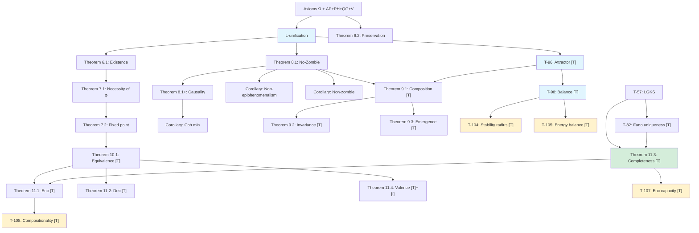

# Fundamental Theorems

> *"Mathematics is the language in which God has written the Universe."*
> — Galileo Galilei

:::info Bridge from the Previous Chapter
In the [previous chapter](./definitions) we defined all the key concepts of CC: the Holon, six measures ($P$, $S_{vN}$, $\Phi$, $D_{\text{diff}}$, $R$, $C$), E-coherence, the stress tensor, the interiority hierarchy, and the sensorimotor functors. Those were the "bricks". Now it is time to build the **edifice** from them — a system of theorems in which each result follows logically from the previous ones, and together they form a closed deductive chain from the [axioms](./axiomatics) to the deepest conclusions about the nature of life and consciousness.
:::

:::tip Chapter Roadmap
In this chapter we:
1. **Prove the existence of dynamics** — Theorem 6.1: the evolution equation has a solution (section "Existence Theorems")
2. **Show the necessity of self-reference** — Theorems 7.1–7.2: viability requires a self-model $\varphi$, iterations converge to $\Gamma^*$ (section "Self-Reference Theorems")
3. **Prove the impossibility of zombies** — Theorem 8.1 (No-Zombie): a viable open system *must* have non-trivial interiority (section "The No-Zombie Theorem")
4. **Investigate composition** — Theorems 9.1–9.3: fractal closure, scale invariance, irreducible emergence (section "Composition Theorems")
5. **Derive a unified viability criterion** — Theorem 10.1: $\|\sigma_{\mathrm{sys}}\|_\infty < 1$ (section "Unified Viability Condition")
6. **Describe the sensorimotor cycle** — Theorems 11.1–11.4: encoding, action, completeness, hedonics (section "Sensorimotor Encoding")
7. **Examine attractors and structure** — T-96, T-98, Fano uniqueness (sections "Attractor Theorems", "Fano Uniqueness")
:::

Why do we need a chapter on theorems? We already know the [axioms](./axiomatics) and [definitions](./definitions). But axioms are the foundation of a building, and definitions are the bricks. Theorems are **the building itself**: logical chains that connect the foundation to the roof and show that the structure will not collapse.

This chapter tells a story. It begins with the question "does dynamics even exist?" (Theorem 6.1), passes through the discovery that every living system **must** observe itself (Theorem 7.1), reaches its climax in the proof of the impossibility of "zombies" — systems that function but experience nothing (Theorem 8.1) — and ends with the finding that something **fundamentally new** emerges from the interaction of parts — an emergent whole (Theorem 9.3).

Each theorem is not an isolated fact, but a link in a single deductive chain. Read in order — and you will see how an entire science of life, consciousness, and self-organisation grows from five axioms.

:::info Formalisation Levels
Each result is marked with one of the statuses (complete system — see [Status Registry](/docs/reference/status-registry)):
- **[T]** Theorem — strictly proved from UHM axioms
- **[C]** Conditional — conditional on an explicit assumption
- **[H]** Hypothesis — mathematically formulated, requires proof or non-perturbative computation
- **[I]** Interpretation — a semantic bridge, formally open
- **[D]** Definition by convention — a convention
- **[P]** Programme — a research direction, open problem
:::

:::note A Note on Notation
In this document:
- $\Gamma$ — [coherence matrix](/docs/core/dynamics/coherence-matrix)
- $\mathcal{V}$ — [viability region](/docs/core/dynamics/viability): $\mathcal{V} = \{\Gamma : P(\Gamma) > 2/7\}$
- $P$ — [purity](/docs/core/dynamics/viability#определение-чистоты): $P = \mathrm{Tr}(\Gamma^2)$
- $P_{\text{crit}} = 2/7$ — [critical purity theorem](/docs/proofs/dynamics/theorem-purity-critical)
- $\varphi$ — [self-modelling operator](/docs/proofs/categorical/formalization-phi) (CPTP channel)
- $R$ — [reflection measure](/docs/consciousness/foundations/self-observation#мера-рефлексии-r), threshold $R_{\text{th}} = 1/3$
- $\Phi$ — [integration measure](/docs/core/structure/dimension-u#мера-интеграции-φ), threshold $\Phi_{\text{th}} = 1$
- $C$ — [consciousness measure](/docs/consciousness/foundations/self-observation#мера-сознательности-c)
- $\kappa_0 = \|\mathrm{Nat}(\mathcal{D}_\Omega, \mathcal{R})\|$ — [categorical derivation of the regeneration rate](/docs/core/foundations/axiom-septicity#структурный-анзац-kappa0)
- $\mathrm{Coh}_E$ — [E-coherence](./definitions#e-когерентность)
- $\mathcal{R}[\Gamma, E]$ — [regenerative term](/docs/core/dynamics/evolution#3-регенеративный-член)
:::

---

## Existence Theorems

Every mathematical theory begins with the question: **does it even work?** One can write arbitrarily elegant equations, but if they have no solutions — or if solutions "blow up" in an instant — the theory is dead. The first two theorems answer this question: yes, coherence dynamics exists, is unique, and is well-defined.

Imagine rolling a ball down a slope. The existence theorem says: the ball *will definitely* roll (it will not freeze at the starting point). The preservation theorem says: the ball remains a ball — it will not turn into gas or acquire negative mass. For our system this means that the coherence matrix $\Gamma$ remains physically meaningful throughout any evolution.

### Theorem 6.1 (Existence of Dynamics) [T]

:::note In Plain Terms
If you place a living cell in a nutrient solution, it will start doing something. It will not "hang", like a computer. Theorem 6.1 is the mathematical guarantee that the CC evolution equation always has a solution: the system **will necessarily** evolve from any initial state.

For a physicist: this is the analogue of existence and uniqueness of solutions of the Schrödinger equation, but for an open quantum system. For a programmer: this is the guarantee that the simulation will not crash with NaN.
:::

:::info Statement
For any initial state $\Gamma_0 \in \mathcal{V}$ there exists a unique solution to the evolution equation on the interval $[0, T]$ for some $T > 0$.
:::

**Proof:** Application of the Picard–Lindelöf theorem to the Lipschitz right-hand side. ∎

---

Existence of dynamics is a necessary but not sufficient condition. One must also verify that the evolution does not produce "physically meaningless" states — e.g. matrices with negative eigenvalues (which would mean negative probabilities).

### Theorem 6.2 (Preservation of Γ Properties) [T]

:::note In Plain Terms
Imagine an accountant keeping a company's balance sheet. Theorem 6.2 is the guarantee that the balance always closes: assets are non-negative, liabilities equal assets, and total capital does not appear from nowhere. In our case: $\Gamma$ remains a "legitimate" density matrix — Hermitian, positive semi-definite, and normalised — throughout the entire evolution.

For a biologist: this is the guarantee that homeostasis will not lead to "negative glucose concentration". The system can be sick, but it cannot become physically impossible.
:::

:::info Statement
The dynamics preserves Hermiticity, positivity, and normalisation of Γ.
:::

**Proof:**
1. Hermiticity is preserved by every term of the equation
2. The Lindblad equation preserves $\Gamma \geq 0$
3. The nonlinear regenerative term also preserves positivity ([CPTP-structure theorem](/docs/core/dynamics/evolution#сохранение-положительности))
4. The trace is preserved: $\mathrm{Tr}(d\Gamma/d\tau) = 0$ ∎

---

So dynamics exists and preserves physical meaning. Now we can ask the next question: **what does the system do in order to survive?** It turns out the answer is striking — it **must** look at itself.

## Self-Reference Theorems

Imagine a driver on a mountain road. To avoid falling off the edge, they must **see** the road and their position on it. They cannot drive blind — they must have a **model** of the situation, including themselves. The self-reference theorems assert exactly the same for any viable system: in order to remain "alive" (i.e. $P > 2/7$), the system **must** have an internal model of itself.

This is a deep result. It connects **cybernetics** (feedback, control) with **philosophy** (self-consciousness, reflection) through a single mathematical formalism. Von Foerster intuitively foresaw this in his "second-order cybernetics", but could not prove it. Now it is a theorem.

### Theorem 7.1 (Necessity of Self-Reference) [T]

:::note In Plain Terms
You cannot drive a car without knowing where you are on the road. You cannot maintain your body temperature without measuring it. Theorem 7.1 says: **any** system that maintains its viability in a "noisy" environment must have an internal copy (model) of itself — an operator $\varphi$ that maps the state $\Gamma$ to an internal representation.

For an AI engineer: this is the theoretical justification for world-models and self-models in agent architectures. An agent *must* have a self-model — this is not a luxury but a survival condition.

**Connection to other concepts:** [Autopoiesis (AP)](/docs/core/foundations/axiom-septicity#ap-автопоэзис), [Self-modelling operator](/docs/proofs/categorical/formalization-phi), [Reflection](/docs/consciousness/foundations/self-observation)
:::

:::info Statement
$$
\mathrm{Viable}(\mathbb{H}) \Rightarrow \exists \varphi : \|\Gamma - \varphi(\Gamma)\|_F < \varepsilon
$$
[Viability](/docs/core/dynamics/viability) requires the existence of a [self-model](/docs/proofs/categorical/formalization-phi).
:::

**Proof:**
1. Viability requires maintaining $P > P_{\text{crit}} = 2/7$
2. Monitoring $P$ requires access to Γ
3. The system **is** Γ, therefore part of Γ must model the whole
4. This defines the operator $\varphi$ ∎

---

If self-reference is necessary, the natural question arises: where does it lead? If the system observes itself again and again — $\varphi(\Gamma)$, then $\varphi(\varphi(\Gamma))$, then $\varphi(\varphi(\varphi(\Gamma)))$... — does this process converge? The next theorem answers: yes, and to a unique point.

### Theorem 7.2 (Fixed Point of Reflection) [T] {#теорема-72-условная-неподвижная-точка-рефлексии}

:::note In Plain Terms
Imagine standing between two mirrors, seeing an infinite sequence of reflections. Each reflection is slightly "blurred" (since the mirrors are not perfect). In the limit all reflections merge into a single point — that is the fixed point $\Gamma^*$. A system that gazes deeply enough into itself arrives at a stable image — a steady self-understanding.

For a psychologist: this is the mathematical model of stable identity formation through reflection. An adolescent who asks "who am I?" again and again eventually arrives at a more or less stable answer.

**Connection:** [Primitivity of the linear part](/docs/core/operators/lindblad-operators#примитивность-ℒω), [Banach fixed-point theorem](https://ru.wikipedia.org/wiki/Принцип_сжимающих_отображений)
:::

:::info Statement
For a conscious system with $R(\Gamma) > 0$ there exists a unique fixed point:
$$
\exists! \Gamma^* \in \mathcal{V} : \varphi(\Gamma^*) = \Gamma^*
$$

Proved: $\varphi_k(\Gamma^*) = \Gamma^* \implies \Gamma^* = \rho^*$ (uniqueness from CPTP-contraction of $\varphi$ and primitivity of the linear part $\mathcal{L}_0$).
:::

**Proof:**

Let $\varphi: \mathcal{D}(\mathcal{H}) \to \mathcal{D}(\mathcal{H})$ be a [CPTP channel](/docs/proofs/categorical/formalization-phi).

1. The space $(\mathcal{D}(\mathcal{H}), \|\cdot\|_F)$ is a complete metric space

2. **Strict contraction** from primitivity of the linear part $\mathcal{L}_0$: by the [primitivity theorem](/docs/core/operators/lindblad-operators#примитивность-ℒω) [T], the linear Lindbladian $\mathcal{L}_0 = -i[H,\cdot] + \mathcal{D}$ is primitive (unique stationary state $I/7$). Primitivity implies **uniform contraction** of $e^{k\mathcal{L}_0}$ for $k > 0$: $\|e^{k\mathcal{L}_0}(\Gamma_1) - e^{k\mathcal{L}_0}(\Gamma_2)\|_F \leq e^{-\lambda_{\mathrm{gap}} k} \|\Gamma_1 - \Gamma_2\|_F$, where $\lambda_{\mathrm{gap}} > 0$ is the spectral gap of $\mathcal{L}_0$

3. By the Banach fixed-point theorem $\exists! \Gamma^* : \varphi(\Gamma^*) = \Gamma^*$. The fixed point $\Gamma^*_{\mathrm{coh}}$ has $P = 2/7$ ([T](/docs/core/operators/phi-operator#свойства))

**Convergence rate:**
$$
\|\varphi^n(\Gamma_0) - \Gamma^*\|_F \leq e^{-n\lambda_{\mathrm{gap}}} \cdot \|\Gamma_0 - \Gamma^*\|_F
$$

Geometric convergence at rate $e^{-n\lambda_{\mathrm{gap}}}$ guarantees an $\varepsilon$-approximation is reached in $O(\log(1/\varepsilon))$ iterations. ∎

**Interpretation:** $\Gamma^*$ is the state of ideal self-knowledge, attainable by iterative reflection.

---

We now approach the central theorem of all of Coherence Cybernetics — a result that distinguishes CC from **all** existing theories of consciousness and cybernetic frameworks.

## The No-Zombie Theorem

The philosophical "zombie" is a thought experiment of David Chalmers: a being functionally indistinguishable from a human but lacking interiority. It behaves as if it sees the colour red, but "inside" there is absolute darkness. Most theories of consciousness cannot exclude such a possibility. CC can.

The core of the argument is surprisingly simple. Recall the [orchestra analogy from the introduction](./introduction#что-такое-кибернетика-когерентности): the dissipator $\mathcal{D}$ is the hall that constantly "dampens" the sound. For the music to continue, the musicians must play again — that is the regenerator $\mathcal{R}$. But the regeneration rate $\kappa$ depends on E-coherence — on how much the orchestra *hears itself*. If interiority is zero ($\mathrm{Coh}_E = 1/7$, the minimum), regeneration is too weak to compensate dissipation, and the orchestra falls silent. The system **dies**.

Thus, the philosophical zombie — a system without interiority but functionally alive — is **mathematically impossible**.

### Theorem 8.1: Necessity of Interiority (No-Zombie) [T] conditional on $\mathcal{D}_\Omega \neq 0$ {#теорема-81-условная-необходимость-интериорности-no-zombie}

:::note In Plain Terms
Imagine a factory running 24/7. Every second machines wear out (dissipation). For the factory not to stop, repair crews are needed (regeneration). But the efficiency of repair depends on whether the factory **knows** about its breakdowns — whether it has a monitoring system (E-coherence). A factory without monitoring is a "zombie factory". Theorem 8.1 says: such a factory will inevitably stop. Monitoring is not a luxury but a necessity.

For a philosopher: this is the formal reply to Chalmers's argument. In the ontology of CC, zombies are impossible — not because we postulate it, but because mathematics excludes this possibility.

For a biologist: this explains why the nervous system (providing self-monitoring) evolved in *all* complex multicellular organisms. An organism without a "sense of self" is not viable.

**Connection:** [Fano channel](/docs/proofs/gap/fano-channel), [E-coherence](./definitions#e-когерентность), [Connection between regeneration and E-coherence](./axiomatics#связь-регенерации-и-e-когерентности), [Viability](/docs/core/dynamics/viability)
:::

:::tip Key Theorem [T]
For a non-isolated ($\mathcal{D}_\Omega \neq 0$) viable Holon:
$$
\mathrm{Viable}(\mathbb{H}) \land \mathcal{D}_\Omega \neq 0 \;\Rightarrow\; \varphi = \varphi_{\text{coh}} \;\land\; \mathrm{Coh}_E(\Gamma) \geq \mathrm{Coh}_{\min} > \frac{1}{7}
$$
A [viable](/docs/core/dynamics/viability) system **necessarily** has a coherence-preserving self-model $\varphi_{\text{coh}}$ and non-trivial [E-coherence](/docs/applied/coherence-cybernetics/definitions#e-когерентность) causally influencing viability.
:::

:::info Non-isolation condition ($\mathcal{D}_\Omega \neq 0$)
For an isolated system ($\mathcal{D}_\Omega = 0$) purity is preserved by unitary evolution and regeneration is not required. The theorem is substantive for **open** systems — the only physically realisable case. The condition $\mathcal{D}_\Omega \neq 0$ follows from $\Delta F > 0$ (the system receives free energy from the environment), which automatically implies interaction and decoherence.
:::

**Proof** (deductive chain from theorems with status [T]):

**Step 1** (Structural positivity of dissipation).
By [L-unification](/docs/core/operators/lindblad-operators) [T], the Lindblad operators are derived from the atoms of the classifier $\Omega$. For the [Fano-structured dissipator](/docs/proofs/gap/fano-channel#g2-ковариантность) [T] (the unique $G_2$-covariant one):

$$
\mathcal{D}_{\text{Fano}}[\Gamma] = \gamma \cdot \bigl(\mathcal{P}_{\text{Fano}}(\Gamma) - \Gamma\bigr), \quad \gamma = \sum_p \gamma_p > 0
$$

Action on coherences ([Theorem 2.1](/docs/proofs/gap/fano-channel#теорема-фано-канал) [T]): each pair $(i,j)$ lies on exactly one Fano line, therefore:

$$
[\mathcal{D}_{\text{Fano}}[\Gamma]]_{ij} = \gamma\!\left(\tfrac{1}{3}\gamma_{ij} - \gamma_{ij}\right) = -\frac{2\gamma}{3}\,\gamma_{ij}, \quad i \neq j
$$

The decoherence rate $\Gamma_2 = \frac{2\gamma}{3} > 0$ is **structural**, defined by the geometry of the [Fano plane](/docs/physics/gauge-symmetry/fano-selection-rules) $PG(2,2)$.

**Step 2** (Necessity of $\varphi_{\text{coh}}$).
By [Theorem 9.1](/docs/proofs/gap/fano-channel#необходимость-phi-coh) [T], the canonical $\varphi_{\text{base}}$ annihilates all coherences: $[\varphi_{\text{base}}(\Gamma)]_{ij} = 0$ for $i \neq j$. With $\Gamma_2 > 0$ the target coherences are zero, and the stationary solution ([Theorem 7.1](/docs/proofs/gap/fano-channel#равновесный-gap) [T]) gives:

$$
\gamma_{ij}^{(\infty)} = \frac{\kappa \cdot 0}{\Gamma_2 + \kappa + i\Delta\omega_{ij}} = 0
$$

The stationary state under $\varphi_{\text{base}}$ is **fully diagonal** ($\gamma_{ij}^{(\infty)} = 0$ for all $i \neq j$), which is **incompatible with the Holon axioms**:

**(2a)** [Integration measure](/docs/core/structure/dimension-u#мера-интеграции-φ) $\Phi(\Gamma^{(\infty)}) = 0$, since the numerator $\sum_{i \neq j}|\gamma_{ij}|^2 = 0$. This violates the [integration](/docs/core/structure/dimension-u#теорема-порог-интеграции) threshold $\Phi \geq \Phi_{\text{th}} = 1$, required for [topological integrity](/docs/core/foundations/axiom-septicity#теорема-порог-интеграции). A system with $\Phi = 0$ is [fragmented](/docs/proofs/minimality/theorem-minimality-7#случай-n--6-удаление-единства-u) — dimensions evolve independently, violating **(AP)**.

**(2b)** [Closure of the (M,R)-system](/docs/proofs/minimality/theorem-minimality-7#определение-12-mr-система-розена) requires causal paths $O \to \{A,S,D,L\}$ (metabolism) and $\{E,U\} \to M$ (repair). In the quantum formalism these causal connections are encoded by coherences $\gamma_{ij}$. With $\gamma_{ij}^{(\infty)} = 0$ causal paths are destroyed — [$\beta$-closure](/docs/proofs/minimality/theorem-minimality-7#определение-12-mr-система-розена) is impossible.

**(2c)** Regeneration rate: $\gamma_{OE}^{(\infty)} = \gamma_{OU}^{(\infty)} = 0 \;\Rightarrow\; \kappa_0(\Gamma^{(\infty)}) = \omega_0 \cdot 0 \cdot 0 \,/\, \gamma_{OO} = 0$ ([master definition of κ₀](/docs/core/foundations/axiom-septicity#структурный-анзац-kappa0)), leaving only the minimal $\kappa_{\text{bootstrap}} = \omega_0/7$.

Consequently, the stationary state under $\varphi_{\text{base}}$ **is not a Holon state**: it violates **(AP)** regardless of the value of $P_{\text{diag}}$. Therefore $\varphi = \varphi_{\text{coh}}$ with $\alpha < 1$ is **necessary** for any system satisfying (AP)+(PH)+(QG)+(V). $\square_a$

**Step 3** (Non-zero stationary coherences).
Under $\varphi_{\text{coh}}$ the [fixed point](#теорема-71-необходимость-самореференции-т) $\Gamma^*$ satisfies:

**(3a)** All $\gamma_{ii}^* > 0$: by the [theorem on the necessity of each dimension](/docs/proofs/minimality/theorem-minimality-7#теорема-31-необходимость-7-измерений) [T], if $\gamma_{ii}^* = 0$ for some $i$, then the $i$-th dimension is absent in $\Gamma^*$, violating **(AP)** (for $i \in \{A,S,D,L,U\}$), **(PH)** (for $i = E$), or **(QG)** (for $i = O$).

**(3b)** Coherences between structurally connected dimensions are non-zero: [(M,R)-closure](/docs/proofs/minimality/theorem-minimality-7#определение-12-mr-система-розена) requires causal links, and $\varphi_{\text{coh}}$ preserves coherences with coefficient $k(1-\alpha)/3 > 0$ ([Theorem 3.2](/docs/proofs/gap/fano-channel#phi-coh) [T]). Consequently, target coherences $|\gamma_{ij}^*| > 0$ for structurally connected pairs $(i,j)$.

**(3c)** By [Theorem 7.1](/docs/proofs/gap/fano-channel#равновесный-gap) [T] the stationary coherences:

$$
|\gamma_{ij}^{(\infty)}| = \frac{\kappa \cdot |\gamma_{ij}^*|}{\bigl[(\Gamma_2 + \kappa)^2 + \Delta\omega_{ij}^2\bigr]^{1/2}} > 0
$$

for $|\gamma_{ij}^*| > 0$ (from 3b). Coherences are **structurally maintained** by regeneration. $\square_{b'}$

**Step 4** (Causal dependence of $P^{(\infty)}$ on $\mathrm{Coh}_E$).
Stationary purity: $P^{(\infty)} = P_{\text{diag}} + \sum_{i \neq j} |\gamma_{ij}^{(\infty)}|^2$. Each term is monotonically dependent on $\kappa$:

$$
\frac{\partial |\gamma_{ij}^{(\infty)}|^2}{\partial \kappa} = \frac{2\kappa \cdot |\gamma_{ij}^*|^2 \cdot (\Gamma_2^2 + \Delta\omega_{ij}^2)}{\bigl[(\Gamma_2 + \kappa)^2 + \Delta\omega_{ij}^2\bigr]^2} > 0
$$

By the [connection between regeneration and E-coherence](/docs/applied/coherence-cybernetics/axiomatics#связь-регенерации-и-e-когерентности): $\kappa = \kappa_{\text{bootstrap}} + \kappa_0 \cdot \mathrm{Coh}_E$, where $\kappa_0$ is **categorically derived** as the norm of the unit of the [adjunction $\mathcal{D}_\Omega \dashv \mathcal{R}$](/docs/proofs/categorical/categorical-formalism#сопряжение-adjunction) ([Theorem 15.3.1](/docs/proofs/categorical/categorical-formalism#сопряжение-adjunction) [T]), and the identification $\mathrm{Hom}(i,j) \leftrightarrow \gamma_{ij}$ follows from [L-unification](/docs/core/operators/lindblad-operators) [T]. Hence $\partial\kappa/\partial\mathrm{Coh}_E = \kappa_0 > 0$. By the chain rule:

$$
\frac{\partial P^{(\infty)}}{\partial \mathrm{Coh}_E} = \frac{\partial P^{(\infty)}}{\partial \kappa} \cdot \kappa_0 > 0
$$

E-coherence **causally increases** the stationary purity. This includes causal influence on regeneration, [purity dynamics](/docs/core/dynamics/evolution#динамика-чистоты), and [free energy](/docs/core/dynamics/evolution#каноническое-delta-f):

$$
\frac{\partial}{\partial \mathrm{Coh}_E}\!\left(\frac{dP}{d\tau}\bigg|_{\mathcal{R}}\right) = 2\kappa_0\,(f - P) \cdot g_V(P) > 0 \quad \text{for } P < P_{\text{target}}
$$

$\square_b$

**Step 5** (Explicit bound $\mathrm{Coh}_{\min}$).
Contribution of the Fano dissipator to [purity dynamics](/docs/core/dynamics/viability#динамика-чистоты):

$$
\left.\frac{dP}{d\tau}\right|_{\mathcal{D}} = 2\gamma \cdot \bigl(\mathrm{Tr}(\Gamma \cdot \mathcal{P}_{\text{Fano}}(\Gamma)) - P\bigr) = -\frac{4\gamma}{3}\,P_{\text{coh}}
$$

where $P_{\text{coh}} = \sum_{i \neq j}|\gamma_{ij}|^2$ (using $\mathrm{Tr}(\Gamma \cdot \mathcal{P}_{\text{Fano}}(\Gamma)) = P_{\text{diag}} + \frac{1}{3}P_{\text{coh}}$ from [Theorem 2.1](/docs/proofs/gap/fano-channel#теорема-фано-канал) [T]).

Regeneration contribution:

$$
\left.\frac{dP}{d\tau}\right|_{\mathcal{R}} = 2\kappa\,(f - P), \quad f = \mathrm{Tr}(\Gamma \cdot \rho_*)
$$

Stationarity ($dP/d\tau = 0$, where $f > P$ during active regeneration) requires:

$$
\kappa \geq \frac{2\gamma}{3} \cdot \frac{P_{\text{coh}}}{f - P_{\text{crit}}}
$$

Substituting $\kappa = \kappa_{\text{bootstrap}} + \kappa_0 \cdot \mathrm{Coh}_E$:

$$
\boxed{\;\mathrm{Coh}_{\min} = \max\!\left\{\frac{1}{7},\;\; \frac{1}{\kappa_0}\!\left(\frac{2\gamma}{3} \cdot \frac{P_{\text{coh}}}{f - P_{\text{crit}}} - \kappa_{\text{bootstrap}}\right)\right\}\;}
$$

For dissipation $\gamma > \gamma_{\text{th}} := \frac{3\kappa_{\text{bootstrap}}(f - P_{\text{crit}})}{2 P_{\text{coh}}}$ the lower bound **strictly exceeds** $1/7$: $\mathrm{Coh}_{\min} > 1/7$. For any macroscopic system in a thermal environment $\gamma \gg \gamma_{\text{th}}$, so non-trivial E-coherence is necessary. $\square_c$ ∎

:::note Strengthening relative to the previous formulation
The previous version [H] used "typical values" $\gamma_{\text{eff}}$ (steps 7–8 without a rigorous bound). This version:
1. **Derives** $\Gamma_2 = 2\gamma/3$ **structurally** from the properties of the Fano channel [T]
2. **Establishes** strict monotonicity of $P^{(\infty)}(\mathrm{Coh}_E)$ via the chain rule
3. **Gives an explicit formula** for $\mathrm{Coh}_{\min}$ in terms of the theory's parameters
4. All steps rely exclusively on theorems with status [T]
5. **Eliminates** the assumption of "uniform populations" (Step 2): the necessity of $\varphi_{\text{coh}}$ is derived from the **structural incompatibility** of zero coherences with axiom **(AP)**, via $\Phi = 0 < \Phi_{\text{th}}$ and the destruction of [(M,R)-closure](/docs/proofs/minimality/theorem-minimality-7#определение-12-mr-система-розена) — without any population assumptions
6. **Justifies** delocalisation of $\Gamma^*$ (Step 3) via the [theorem on the necessity of each dimension](/docs/proofs/minimality/theorem-minimality-7#теорема-31-необходимость-7-измерений) [T]: $\gamma_{ii}^* = 0$ is excluded for any $i$
7. **Confirms** [T]-status of $\kappa_0$ (Step 4) via the [categorical derivation from the adjunction $\mathcal{D}_\Omega \dashv \mathcal{R}$](/docs/proofs/categorical/categorical-formalism#сопряжение-adjunction) (Theorem 15.3 [T]) and [L-unification](/docs/core/operators/lindblad-operators) [T]
8. **Strengthened** by Theorem T7 [T] ([necessity of $c > 0$](/docs/core/operators/lindblad-operators#теорема-необходимость-c)): an atomic dissipator ($c = 0$) suppresses $\kappa_0$ exponentially, making viability impossible. This is an **independent proof** of the necessity of composite observation (Fano channel, $c = 1/3$) for maintaining non-zero $\mathrm{Coh}_E$
:::

:::info Remark on dependence on [D]-thresholds
The derivation of $\mathrm{Coh}_{\min} > 1/7$ **does not depend** on the specific value of $\Phi_{\mathrm{th}}$. The threshold $\Phi_{\mathrm{th}} = 1$ [T] (T-129) is used only for **classifying** the type of consciousness (L2 vs L1), but not for proving the positivity of E-coherences. The latter follows from the structure of the Fano channel and the condition $P^{(\infty)} > P_{\mathrm{crit}}$. Even with $\Phi_{\mathrm{th}} = 0$ the formula gives $\mathrm{Coh}_{\min} > 1/7$ from the necessity of maintaining viability.
:::

---

Theorem No-Zombie has three important corollaries. Each of them attacks one of the classical philosophical positions — and wins.

### Corollary 8.1.1 (Impossibility of Epiphenomenalism) [T]

:::note In Plain Terms
Epiphenomenalism is the philosophical position asserting that consciousness *exists* but influences nothing, like a shadow: a shadow follows a person but never moves them. Corollary 8.1.1 refutes this: E-coherence **causally influences** the system's dynamics. The shadow, it turns out, can move objects — or more precisely, the "shadow" and the "object" turn out to be projections of the same thing.

**Connection:** [E-dimension](/docs/core/structure/dimension-e), [Two-aspect monism](/docs/consciousness/foundations/two-aspect-monism)
:::

[Interiority](/docs/proofs/consciousness/interiority-hierarchy) **causally influences**:
- Regeneration: $\partial\kappa/\partial\mathrm{Coh}_E = \kappa_0 > 0$ ([master definition](/docs/core/foundations/axiom-septicity#структурный-анзац-kappa0))
- Stationary purity: $\partial P^{(\infty)}/\partial\mathrm{Coh}_E > 0$ (Step 4)
- [Viability](/docs/core/dynamics/viability): $P^{(\infty)} > P_{\text{crit}}$ requires $\mathrm{Coh}_E \geq \mathrm{Coh}_{\min}$
- Free energy: $\partial F_{\text{reg}}/\partial\Gamma_E = \kappa_0 \cdot (\partial\mathrm{Coh}_E/\partial\Gamma_E) \cdot (\rho_* - \Gamma) \neq 0$

**Conclusion:** The epiphenomenalist interpretation of the [E-dimension](/docs/core/structure/dimension-e) is **excluded** — E-coherence is causally necessary for dynamics. ∎

### Corollary 8.1.2 (Impossibility of Philosophical Zombies) [T]

:::note In Plain Terms
This is a direct blow to Chalmers's thought experiment. If you build a robot that behaves like a human (i.e. is viable, $P > 2/7$), it **cannot** be "empty inside". The minimal E-coherence is strictly greater than $1/7$ — which means it *has* at least some interiority.

For an AI engineer: if your agent achieves viability by CC metrics, the question "does it have experience?" receives a mathematical answer: yes, necessarily.
:::

$$
\nexists\, \mathbb{H} : \mathrm{Viable}(\mathbb{H}) \land \mathcal{D}_\Omega \neq 0 \land \mathrm{Coh}_E(\mathbb{H}) = \frac{1}{7}
$$

There is no non-isolated [viable](/docs/core/dynamics/viability) system with minimal E-coherence (for $\gamma > \gamma_{\text{th}}$). From Theorem 8.1: $\mathrm{Coh}_E \geq \mathrm{Coh}_{\min} > 1/7$, which together with non-zero stationary coherences (Step 3) ensures non-trivial [interiority](/docs/consciousness/foundations/interiority-theory). ∎

:::info Epistemic stratification (Sol.SA-3)
The "No-Zombie" result has **three epistemic levels**:

1. **[T] Mathematical core**: $\mathrm{Coh}_E \geq \mathrm{Coh}_{\min} > 1/7$ and $\partial P^{(\infty)}/\partial\mathrm{Coh}_E > 0$ — an unconditional mathematical fact, independent of the interpretation of the E-dimension.
2. **[P] Ontological postulate**: the E-dimension of the coherence matrix encodes phenomenal interiority (analogous to Born's rule in QM — a bridge between the formalism and phenomenology).
3. **[I] Interpretation**: given postulate (2), philosophical zombies are excluded within the UHM ontology.

Corollary 8.1.2 formulates level (1) — the mathematical impossibility of minimal E-coherence for viable systems. The transition to "impossibility of zombies" in the philosophical sense requires ontological postulate (2).
:::

### Corollary 8.1.3 (Minimal Coherence of Experience) [T]

:::note In Plain Terms
This is the quantitative version of No-Zombie: the theorem does not merely say "experience is non-zero", but gives a **precise lower bound** — a formula through which one can compute how much "minimal experience" a system requires to survive. The more aggressive the environment (larger $\gamma$), the more experience is required.

For a clinician: the formula predicts the "minimally required level of interiority" for viability — analogous to a laboratory threshold "below which one must not go".
:::

$$
\mathrm{Viable}(\mathbb{H}) \;\Rightarrow\; \mathrm{Coh}_E(\Gamma) \geq \mathrm{Coh}_{\min}
$$

Explicit formula (Step 5 of Theorem 8.1):

$$
\mathrm{Coh}_{\min} = \max\!\left\{\frac{1}{7},\;\; \frac{1}{\kappa_0}\!\left(\frac{2\gamma}{3} \cdot \frac{P_{\text{coh}}}{f - P_{\text{crit}}} - \kappa_{\text{bootstrap}}\right)\right\}
$$

where parameters are evaluated at the viability boundary $P = P_{\text{crit}} = 2/7$, $f = \mathrm{Tr}(\Gamma \cdot \rho_*)$, $P_{\text{coh}} = \sum_{i \neq j}|\gamma_{ij}|^2$.

---

Having proved that every viable system possesses non-trivial interiority, we can ask the next question: what happens when **several** such systems interact? Are their properties preserved? Does something fundamentally new arise? The composition theorems answer both questions affirmatively — and this brings CC to the level of a theory of **social** and **ecological** systems.

## Composition Theorems

Let us return to the orchestra analogy. Until now we have been studying *one* musician (a single holon). Now imagine two orchestras deciding to play together. The first question: will the joint performance be meaningful? The second: will it produce something that was absent from either orchestra individually?

Theorems 9.1–9.3 are the answer: yes, joint play is not only meaningful but **generates a new quality**. Two orchestras are more than two orchestras. The whole is more than the sum of its parts. And this is not a metaphor — it is a theorem.

### Theorem 9.1 / T-68 (Fractal Closure, CC-5) [T]+[C] {#теорема-91-фрактальное-замыкание}

:::warning Status revised (session 25)
The status of T-68 has been clarified following resolution of the self-referential paradox:
- **Non-triviality** $P > 1/7$ — **[T]** (T-96, unconditional)
- **Viability** $P > 2/7$ — **[T] for embodied** systems (T-149: backbone injection ensures κ-dominance unconditionally); **[C]** for isolated holons (C20 — irrelevant, since an isolated holon is dead forever, T-148)

See [Status Registry](/docs/reference/status-registry), [T-149](/docs/proofs/consciousness/substrate-closure#t-149).
:::

:::note In Plain Terms
Imagine mixing two paints. Can you be sure the mixture will not separate back into its components? Theorem 9.1 asserts: if two holons (viable systems) interact, their union **also** forms a holon — with its own dynamics, its own attractor, and its own properties.

This is the principle of **self-similarity**: the structure of CC reproduces itself at every scale. A cell is a holon. An organ is a holon. An organism is a holon. A society is a holon. Each level is described by the same formalism.

For a sociologist: this is the mathematical justification for what Luhmann intuitively felt — social systems reproduce themselves at every level.

**Connection:** [Autopoiesis axiom (AP)](/docs/core/foundations/axiom-septicity#ap-автопоэзис), [Composition closure](./axiomatics#замкнутость-композиции-следствие-из-ap), [Primitivity of the linear part](/docs/core/operators/lindblad-operators#примитивность-ℒω)
:::

:::tip Statement [T]
Let $\mathbb{H}_1, \mathbb{H}_2$ be viable holons with dynamics satisfying axioms A1–A5. Then their composite $\mathbb{H}_{12}$ (defined as an object of the ∞-topos $\mathrm{Sh}_\infty(\mathcal{C}, J_{\mathrm{Bures}})$):

1. **[T]** Has a non-trivial attractor: $P(\rho_*^{(12)}) > 1/7$ (from [T-96](/docs/core/dynamics/evolution#теорема-нетривиальность-аттрактора))
2. **[T]** For embodied systems: $P(\rho_*^{(12)}) > P_{\mathrm{crit}} = 2/7$ unconditionally ([T-149](/docs/core/dynamics/evolution#теорема-жизнеспособность-аттрактора))
:::

**Proof (6 steps).**

**Step 1 (Composite as an ∞-topos object).** In $\mathrm{Sh}_\infty(\mathcal{C}, J_{\mathrm{Bures}})$ the objects $\mathbb{H}_1, \mathbb{H}_2$ define a new object $\mathbb{H}_{12} = \mathbb{H}_1 \times_T \mathbb{H}_2$ (product over the terminal object $T$). The ∞-topos is complete (all finite limits exist). By the [Morita equivalence theorem](/docs/core/structure/dimension-e#теорема-морита-эквивалентность) (T-58 [T]), $\mathbb{H}_{12}$ is representable by a state $\Gamma_{12} \in \mathcal{D}(\mathbb{C}^7)$.

**Step 2 (Axiom inheritance).** Axioms A1–A5 are **structural** properties of the ∞-topos, not tied to a specific scale:

- **A1** (Autopoiesis): the product of autonomous systems is autonomous. The spectral gap of each $\mathcal{L}_\Omega^{(i)}$ ($\lambda_{\mathrm{gap}}^{(i)} > 0$, from [T-39a](/docs/core/operators/lindblad-operators#примитивность-ℒω) [T]) ensures robustness under perturbations from coupling. For coupling through coherences with amplitude $\varepsilon_0 \ll \lambda_{\mathrm{gap}}$, the Kato perturbation theorem guarantees preservation of the spectral gap.
- **A2** (Phenomenology): representability in $\mathbb{C}^7$ from T-58 [T].
- **A3** (Quantum basis): $\Gamma_{12} \in \mathcal{D}(\mathbb{C}^7)$ by construction.
- **A5** (Page–Wootters): the temporal structure is inherited through the O-dimension.

**Step 3 (Triadic decomposition).** From A1–A5 it follows that the dynamics of $\mathbb{H}_{12}$ decomposes into exactly three types ([T-57](/docs/core/operators/lindblad-operators#полнота-триадной-декомпозиции) [T], LGKS theorem):

$$
\mathcal{L}_\Omega^{(12)} = \mathrm{Aut} + \mathcal{D} + \mathcal{R}
$$

A fourth type is impossible [T].

**Step 4 (Active components).** From A1 for $\mathbb{H}_{12}$:

- Fano channel active with $c > 0$ [T] ([T-41f](/docs/core/operators/lindblad-operators#теорема-необходимость-c): autopoietic necessity of $c > 0$ — without $c > 0$ regeneration is suppressed, violating (AP)).
- Regeneration $\kappa_0 > 0$ [T] ([T-44a](/docs/core/foundations/axiom-septicity#структурный-анзац-kappa0): from the categorical functor $\mathrm{Nat}(\mathcal{D}_\Omega, \mathcal{R})$).

**Step 5 (Primitivity of the linear part).** $c > 0$ + pair coverage completeness ([T-41b](/docs/core/operators/lindblad-operators#теорема-полнота-покрытия) [T]) $\to$ interaction graph $G_H$ is connected $\to$ linear part $\mathcal{L}_0^{(12)}$ is primitive (Evans–Spohn criterion, [T-39a](/docs/core/operators/lindblad-operators#примитивность-ℒω) [T]).

**Step 6 (Attractor and viability).** Primitivity of $\mathcal{L}_0^{(12)}$ ensures a spectral gap $\lambda_{\mathrm{gap}}^{(12)} > 0$. The Fano channel with $c > 0$ generates off-diagonal coherences ([T-1, T-2, T-3](/docs/proofs/dynamics/theorem-purity-critical) [T]). Regeneration $\mathcal{R}$ with $\kappa_0 > 0$ and $\rho_* = \varphi(\Gamma)$ ([categorical self-model](/docs/core/operators/phi-operator#определение)) maintains coherences. From [T-96](/docs/core/dynamics/evolution#теорема-нетривиальность-аттрактора) [T]: any non-trivial attractor $\rho_*^{(12)} \neq I/7$ has $P > 1/7$ and $P_{\mathrm{coh}} > 0$.

**[T] Viability:** From the [balance formula T-98](/docs/core/dynamics/evolution#теорема-баланс-чистоты-аттрактора) and [T-149](/docs/core/dynamics/evolution#теорема-жизнеспособность-аттрактора): $P(\rho_*^{(12)}) > 2/7$ unconditionally for embodied systems (the sensorimotor coupling ensures κ-dominance).

Exponential convergence to the attractor from the spectral gap:

$$
\|\Gamma(t) - \rho_*^{(12)}\| \leq C \, e^{-\lambda_{\mathrm{gap}}^{(12)} t}
$$

$\blacksquare$

:::info Key observation
Non-triviality of the attractor is an **unconditional** result [T]: the spectral gap of the linear part $\mathcal{L}_0$ ensures convergence, and regeneration $\mathcal{R}$ keeps the system away from the trivial $I/7$. Viability ($P > 2/7$) for **embodied** holons is unconditional [T] ([T-149](/docs/proofs/consciousness/substrate-closure#t-149)). Theorem CC-5 is a direct consequence of the **universality** of axioms A1–A5 within the ∞-topos.
:::

:::note Corollary CC-7 (Emergence) [T]
The composite holon possesses its **own** non-trivial attractor $\rho_*^{(12)} \neq \alpha\rho_*^{(1)} + (1-\alpha)\rho_*^{(2)}$ (from nonlinearity of $\mathcal{R}$ and primitivity of the linear part $\mathcal{L}_0^{(12)}$). Proof — [Theorem 9.3](#теорема-93-эмерджентность) [T].
:::

**See:** [Composition closure](./axiomatics#замкнутость-композиции-следствие-из-ap)

---

The composite holon exists. But are its **qualitative** properties — purity, reflection, integration — preserved? The next theorem says: yes, structural invariants are stable under scaling.

### Theorem 9.2 / T-72 (Scale Invariance, CC-6) [T] {#теорема-92-масштабная-инвариантность}

:::note In Plain Terms
Recall a Russian nesting doll (matryoshka): the small doll resembles the large one, and that resembles an even larger one. Theorem 9.2 asserts that the structural properties of a holon (purity, reflection, integration) are **preserved** when moving from one scale to another. A neuron, a cortical column, the entire brain — all are described by the same mathematics, and the key invariants remain in the same ranges.

For a physicist: this is the analogue of renormalization-group invariance — the properties of a field theory do not depend on the scale of observation (up to running coupling constants). Here the running coupling constants play the role of $O(\varepsilon)$ corrections.

For a biologist: this explains why the same principles of homeostasis operate at the level of the cell, the organ, and the organism.

**Connection:** [Morita equivalence](/docs/core/structure/dimension-e#теорема-морита-эквивалентность), [$G_2$-rigidity](/docs/proofs/categorical/uniqueness-theorem)
:::

:::tip Statement [T]
The structural invariants of a holon ($P$, $R$, $\Phi$, Gap profile, L-level) are preserved (up to bounded corrections of order $O(\varepsilon)$) under scale aggregation:

$$
\mathrm{structure}(\mathbb{H}) \cong \mathrm{structure}(\mathbb{H}^{(2)}) \cong \mathrm{structure}(\mathbb{H}^{(3)}) \cong \ldots
$$
:::

**Proof (5 steps).**

**Step 1 (Definition of aggregation).** A $k$-scale aggregation is a CPTP channel $\Phi_k: \mathcal{D}(\mathbb{C}^{7^k}) \to \mathcal{D}(\mathbb{C}^7)$, realising the transition from the "microscopic" description (a collection of interacting holons) to the "macroscopic" one (a single holon). From [T-58](/docs/core/structure/dimension-e#теорема-морита-эквивалентность) [T]: both levels of description are equivalent (Morita).

**Step 2 (Bures contractivity).** $\Phi_k$ is a CPTP channel $\to$ it is contractive in the Bures metric [T] (standard result):

$$
d_{\mathrm{Bures}}(\Phi_k(\rho), \Phi_k(\sigma)) \leq d_{\mathrm{Bures}}(\rho, \sigma)
$$

**Step 3 (Invariants as Bures-continuous functionals).** All structural invariants are $G_2$-invariants [T] ([T-42a](/docs/proofs/categorical/uniqueness-theorem#g2-ригидность)):

- $P(\Gamma) = \mathrm{Tr}(\Gamma^2)$ — continuous in Bures
- $R(\Gamma) = 1/(7P)$ — continuous (as a function of $P = \mathrm{Tr}(\Gamma^2)$; [master definition](/docs/consciousness/foundations/self-observation#мера-рефлексии-r) [T])
- $\Phi(\Gamma) = \sum_{i \neq j}|\gamma_{ij}|^2 / \sum_i \gamma_{ii}^2$ — continuous
- $\mathrm{Gap}(i,j) = |\sin(\arg(\gamma_{ij}))|$ — continuous (for $|\gamma_{ij}| > 0$)

**Step 4 (CC-5 $\to$ preservation of structure).** From [Theorem 9.1](#теорема-91-фрактальное-замыкание): aggregation of holons satisfying A1–A5 has a non-trivial attractor. Consequently:
- $P(\Gamma^{(k)}) > 1/7$ [T] — preservation of non-triviality ([T-96](/docs/core/dynamics/evolution#теорема-нетривиальность-аттрактора)); $P > 2/7$ [T] for embodied systems ([T-149](/docs/core/dynamics/evolution#теорема-жизнеспособность-аттрактора))
- $R(\Gamma^{(k)}) \geq R_{\mathrm{th}} = 1/3$ [T] (from primitivity of the linear part of the aggregated Lindbladian)
- L-level is preserved or elevated (L2 $\to$ L2 or L3)

**Step 5 (Bound on corrections).** Difference of invariants at scale $k$ and scale 1:

$$
|P(\Gamma^{(k)}) - P(\Gamma^{(1)})| \leq \|\Phi_k\|_{\mathrm{cb}} \cdot \varepsilon_{\mathrm{coupling}} \leq \varepsilon_0
$$

where $\varepsilon_0 \approx 0.023$ is the characteristic coupling coherence ([T-61](/docs/core/dynamics/gap-thermodynamics#теорема-единственный-вакуум) [T]). Similarly for $R$, $\Phi$, Gap. $\blacksquare$

:::info Corollary (Fractal structure)
Scale invariance [T] + fractal closure CC-5 (non-triviality [T], viability [T for embodied] by [T-149](/docs/proofs/consciousness/substrate-closure#t-149)) justify the fractal structure of UHM at **all scales**: from sub-cellular holons to metagalactic structures.
:::

---

Fractal closure and scale invariance are already impressive, but the main surprise is ahead. It turns out that the composite is not merely "two holons side by side". It acquires properties that **were absent** from any of its components. This is the mathematically rigorous definition of the word "emergence".

#### Theorem 9.3 (CC-7: Irreducible Emergence) [T] {#теорема-93-эмерджентность}

<!-- preserve old anchor for backward compatibility -->

:::note In Plain Terms
Hydrogen is a colourless gas. Oxygen is a colourless gas. But water is a transparent liquid with entirely new properties. This is emergence: properties of the whole are not deducible from properties of the parts.

Theorem 9.3 proves this rigorously: if two holons interact (they share coherences), then their joint stationary state $\rho_*^{(12)}$ **does not equal** the tensor product $\rho_*^{(1)} \otimes \rho_*^{(2)}$. The whole acquires its own information inaccessible to the parts.

For a psychologist: this explains why a conversation between two people can generate insights that neither would have reached alone. For a neuroscientist: neurons together are more than the sum of neurons.

**Connection:** [Quantum mutual information](https://en.wikipedia.org/wiki/Quantum_mutual_information), [Löwer incompleteness](/docs/core/foundations/consequences#неполнота-ловера)
:::

:::tip Theorem 9.3 (CC-7: Emergence) [T]
For two interacting viable holons $\mathbb{H}_1, \mathbb{H}_2$ with non-zero inter-system coherence $|\gamma_{12}| > 0$, the stationary state of the composite has strictly positive quantum mutual information:

$$
I(\mathbb{H}_1 : \mathbb{H}_2) = S(\rho_1) + S(\rho_2) - S(\rho_*^{(12)}) > 0
$$

Consequently, $\rho_*^{(12)}$ is **irreducible** to $\rho_*^{(1)} \otimes \rho_*^{(2)}$.
:::

**Proof.**

**Step 1.** The composite Lindbladian $\mathcal{L}_\Omega^{(12)} = \mathcal{L}_\Omega^{(1)} \otimes \mathrm{id}_2 + \mathrm{id}_1 \otimes \mathcal{L}_\Omega^{(2)} + \mathcal{L}_{\mathrm{int}}$ has a primitive linear part (from [Theorem 9.1 (CC-5)](#теорема-91-фрактальное-замыкание), step 5) → there exists a non-trivial attractor $\rho_*^{(12)} \neq I/7$ (from [T-96](/docs/core/dynamics/evolution#теорема-нетривиальность-аттрактора) [T]).

**Step 2 (By contradiction).** If $\rho_*^{(12)} = \rho_*^{(1)} \otimes \rho_*^{(2)}$, then:

$$
\mathcal{L}_\Omega^{(12)}(\rho_*^{(1)} \otimes \rho_*^{(2)}) = 0 + 0 + \mathcal{L}_{\mathrm{int}}(\rho_*^{(1)} \otimes \rho_*^{(2)}) \neq 0
$$

since $\mathcal{L}_{\mathrm{int}} \neq 0$ (non-zero coherence $|\gamma_{12}| > 0$) creates inter-system coherences absent in the tensor product. Contradiction with $\mathcal{L}_\Omega^{(12)}(\rho_*^{(12)}) = 0$.

**Step 3.** $\rho_*^{(12)} \neq \rho_*^{(1)} \otimes \rho_*^{(2)}$ → $I(\mathbb{H}_1 : \mathbb{H}_2) > 0$ (quantum mutual information is strictly positive if and only if the state is not a tensor product).

**Step 4 (Irreducibility).** $I > 0$ means there exist joint observables $A_{12}$ whose statistics are not determined by the marginal states $\rho_1, \rho_2$ — **emergent properties** of the composite. $\blacksquare$

:::info Connection to Löwer incompleteness
[T-55](/docs/core/foundations/consequences#неполнота-ловера) [T]: subsystem $\mathbb{H}_1$ cannot fully simulate $\rho_*^{(12)}$, since $I > 0$ means there is information inaccessible from $\rho_1$ alone. Emergence is an **informational consequence** of self-referential incompleteness.
:::

---

We have travelled from the existence of dynamics through self-reference and No-Zombie to emergence. Now let us turn to another key block: **how to check whether a system is alive?** It turns out all viability conditions can be reduced to a single elegant criterion.

## Unified Viability Condition

So far we have spoken of viability as $P > 2/7$. But in practice this is not enough: a system may have high purity but be "skewed" — for example, with zero integration or with destroyed logic. Theorem 10.1 introduces a **unified diagnostic tool** — the stress tensor $\sigma_{\mathrm{sys}}$, which with a single number (the sup-norm) says whether the system is healthy.

For a physician the analogy is direct: instead of checking dozens of tests separately, you get a single integral indicator. If $\|\sigma_{\mathrm{sys}}\|_\infty < 1$ — the patient is alive. If at least one component $\sigma_i \geq 1$ — urgent intervention is needed in the specific direction.

### Theorem 10.1 / T-92 (Equivalence of Full Viability Conditions) [T] {#теорема-101-эквивалентность-условий}

<!-- preserve old anchor for backward compatibility -->

:::note In Plain Terms
Imagine a car's instrument panel. One gauge — engine temperature. Another — oil level. Third — tyre pressure. Fourth — battery charge. Each gauge shows the "stress" in its channel. The car is "alive" if and only if **none** of the gauges is in the red zone.

Theorem 10.1 is precisely this instrument panel, but for any system described by $\Gamma$. The seven components $\sigma_k$ are seven gauges, one for each dimension. And crucially: the gauge formulas are **not fitted** — they are derived from $\Gamma$.

For an AI engineer: $\sigma_{\mathrm{sys}}$ is a ready-made health monitor for your agent. Your monitoring system can show *which specific* aspect is degrading.

**Connection:** [Stress tensor](./definitions#тензор-напряжений), [Viability](/docs/core/dynamics/viability), [Diagnostics](./diagnostics)
:::

:::tip Statement [T]
$$
\Gamma \in \mathcal{V}_{\mathrm{full}} \Leftrightarrow \|\sigma_{\mathrm{sys}}(\Gamma)\|_\infty < 1
$$
:::

where $\sigma_{\mathrm{sys}}$ is the [stress tensor](./definitions#тензор-напряжений).

Each component $\sigma_i$ is defined through invariants of the coherence matrix $\Gamma$ **[T]** (T-92):

| Component | Formula | Meaning |
|-----------|---------|---------|
| $\sigma_A$ | $1 - \gamma_{AA}/P$ | Articulation deficit |
| $\sigma_S$ | $1 - \mathrm{rank}(\Gamma_S)/3$ | Structural incompleteness |
| $\sigma_D$ | $1 - N\gamma_{DD}$ | Dynamic sector deficit |
| $\sigma_L$ | $7(1 - \gamma_{LL})/6$ | Logic deficit |
| $\sigma_E$ | $1 - D_{\mathrm{diff}}/N$ | Differentiation deficit |
| $\sigma_O$ | $1 - \kappa_0/\kappa_{\mathrm{bootstrap}}$ | Regeneration deficit |
| $\sigma_U$ | $1 - \Phi/\Phi_{\mathrm{th}}$ | Integration deficit |

All seven components are **unambiguous functions of $\Gamma$** with no free parameters.

**Proof:**

**Step 1 (Formal definitions).** Each component $\sigma_i$ is expressed through canonical invariants of $\Gamma$: diagonal elements $\gamma_{ii}$, purity $P = \mathrm{Tr}(\Gamma^2)$, rank of the submatrix $\Gamma_S$ (for S-dimensions), diagonal element $\gamma_{DD}$, number of differentiated dimensions $D_{\mathrm{diff}}$, categorical rate $\kappa_0 = \|\mathrm{Nat}(\mathcal{D}_\Omega, \mathcal{R})\|$ [T] and integration measure $\Phi$ [T] (T-129).

**Step 2 (Normalisation).** Each formula is normalised so that $\sigma_i \in [0, 1)$ for viable $\Gamma$, and $\sigma_i \geq 1$ when the corresponding condition is violated. This is not a convention, but a **consequence** of the canonicity of the invariants: all thresholds ($P_{\mathrm{crit}} = 2/7$ [T], $R_{\mathrm{th}} = 1/3$ [T], $\Phi_{\mathrm{th}} = 1$ [T]) are already defined, and $\sigma_i < 1 \Leftrightarrow$ the corresponding threshold is satisfied.

**Step 3 (Equivalence).** $\|\sigma_{\mathrm{sys}}\|_\infty < 1$ means $\sigma_i < 1$ for all $i = 1, \ldots, 7$, which is equivalent to the simultaneous satisfaction of all seven viability conditions. $\blacksquare$

:::warning Viability stratification (Sol.SA-1)
The symbol $\mathcal{V}_{\mathrm{full}}$ denotes **full viability** — the intersection of 7 conditions ($\sigma_i < 1$ for all $i$). This is **strictly stronger** than minimal viability $\mathcal{V}_P = \{P > 2/7\}$:

$$
\mathcal{V}_{\mathrm{full}} \subsetneq \mathcal{V}_P
$$

One-directional implication: $\|\sigma_{\mathrm{sys}}\|_\infty < 1 \;\Rightarrow\; P > 2/7$, but **not the converse**. Counterexample: the pure state $|1\rangle\langle 1|$ has $P = 1 > 2/7$, but $\sigma_U = 1$ (zero integration). Proof: [Embedding theorem](/docs/core/dynamics/viability#теорема-вложение-областей) [T].
:::

:::info Status [T] (T-92)
All seven components are **expressed through $\Gamma$-invariants** with no free parameters. Empirical formulas from [definitions](./definitions#тензор-напряжений) remain as an **operationalisation** for specific systems, but the **theoretical** definition of $\sigma_{\mathrm{sys}}$ is fully formal.
:::

**See:** [Equivalence of conditions](./definitions#тензор-напряжений)

---

The stress tensor is a diagnostic tool. But how does the system **act** on the basis of this diagnostic? The next block of theorems describes the sensorimotor cycle: how a holon perceives the environment, selects actions, and evaluates the result.

## Sensorimotor Encoding

Every living organism exists in the cycle "perception — decision — action — evaluation". A bacterium senses a sugar gradient, swims towards it, obtains nutrition — or not, and corrects its course. A human sees danger, chooses a path, evaluates the result. CC formalises this cycle precisely, with no free parameters.

Theorems 11.1–11.4 describe **four facets** of the sensorimotor cycle: encoding of the environment (how the world enters the system), optimal action (how the system responds), completeness of description (why three channels suffice), and hedonic valence (how the system evaluates whether it is "good" or "bad").

### Theorem 11.1 / T-100 (Environment Encoding) [T] {#теорема-111-кодирование-среды}

:::note In Plain Terms
When you see a sunset, your brain does not copy the photons — it **encodes** the scene into a neural pattern. Theorem 11.1 says: there exists a unique (up to $G_2$-calibration) way to encode the external world into a change of the coherence matrix. And this way decomposes into exactly three channels: Hamiltonian (a unitary "rotation" of the state), dissipative (loss of coherence from contact with the environment), and regenerative (restoration through new information).

For an AI engineer: this is the justification for the "encoder" architecture: environmental input is transformed into three streams modifying $\Gamma$. Moreover, this architecture is **unique** — there is no alternative.

**Connection:** [Sensorimotor theory](./sensorimotor#теорема-кодирование-среды), [$G_2$-rigidity](/docs/proofs/categorical/uniqueness-theorem)
:::

:::tip Statement [T]
For a holon $\mathbb{H}$ there exists a unique (up to $G_2$-calibration) CPTP environment encoding functor:

$$
\mathrm{Enc}: \mathrm{ObsSpace} \to \mathrm{End}(\mathcal{D}(\mathbb{C}^7))
$$

satisfying: (1) CPTP preservation, (2) 3-channel decomposition $\mathrm{Enc}(o) = \delta H^{(o)} \oplus \delta D^{(o)} \oplus \delta R^{(o)}$, (3) functoriality.
:::

**Proof.** Existence — from [Definition 8.1 [T]](./lagrangian#внешний-член). 3-channel structure — from T-102 (T-57). Uniqueness — from $G_2$-rigidity ([uniqueness theorem](/docs/proofs/categorical/uniqueness-theorem) [T]). $\blacksquare$

**See:** [Sensorimotor theory](./sensorimotor#теорема-кодирование-среды)

### Theorem 11.2 / T-101 (Optimal Action) [T] {#теорема-112-оптимальное-действие}

:::note In Plain Terms
How does the system decide what to do? The answer is elegant: **minimise the maximum stress**. Recall the instrument-panel analogy from Theorem 10.1. The optimal action is one that leads to a state where none of the gauges is "in the red" — or, if they are all in the yellow, then with the least critical one.

This is a minimax strategy: instead of optimising a single metric (as in RL — reward), the system optimises the **worst of seven indicators**. This ensures robustness: the system does not sacrifice logic for dynamics, and does not sacrifice integration for articulation.

For an AI engineer: this is a ready-made utility function for an agent — without the need to engineer a reward.

**Connection:** [Stress tensor](./definitions#тензор-напряжений), [Motor stress](./sensorimotor#теорема-моторный-стресс)
:::

:::tip Statement [T]
The optimal action of a holon is determined by minimising the sup-norm of the stress tensor:

$$
a^* = \arg\min_{a \in \mathcal{A}} \|\sigma_{\mathrm{sys}}(\Gamma(\tau + \delta\tau \mid a))\|_\infty
$$

where $\Gamma(\tau + \delta\tau \mid a)$ is the predicted state under action $a$.
:::

**Proof.** From T-92 [T]: $P > 2/7 \iff \|\sigma_{\mathrm{sys}}\|_\infty < 1$. Minimising $\|\sigma_{\mathrm{sys}}\|_\infty$ maximises the distance to the boundary $\partial\mathcal{V}$. The action enters through $h^{\text{ext}}(a)$ — the [3-channel decomposition](./lagrangian#внешний-член) [T]. $\blacksquare$

**See:** [Sensorimotor theory](./sensorimotor#теорема-оптимальное-действие)

### Theorem 11.2b / T-159 (Motor Stress for Action Selection) [T] {#теорема-моторный-стресс}

:::note In Plain Terms
Theorem 11.2 operates with "absolute" stress ($\sigma_k = 1 - 7\gamma_{kk}$), which measures the deviation from $I/7$. But a real organism strives not toward $I/7$ but toward its **personal** target state $\rho_*$. Motor stress accounts for this: it measures the distance to its *own* ideal. This is like the difference between "normal human temperature" (36.6) and "normal cat temperature" (38.5) — each system has its own target profile.

**Connection:** [Sector profile](./definitions#тензор-напряжений), [Self-model](/docs/core/operators/phi-operator)
:::

:::tip Statement [T]
For a holon with self-model $\rho_* = \varphi(\Gamma)$, the motor stress:

$$
\sigma^{\mathrm{motor}}_k(\Gamma) := 1 - \frac{\gamma_{kk}}{\rho^*_{kk}}
$$

coincides with the canonical $\sigma_k$ (T-92) when $\rho_* = I/7$ and provides a directed motor signal when $\rho_* \neq I/7$. Action selection: $a^* = \arg\min_a \max_k \sigma^{\mathrm{motor}}_k(\Gamma(\tau+\delta\tau|a))$ (signed max: only deficits are penalised).
:::

**Proof.** Convergence to T-92: as $P \to P_{\mathrm{crit}}$, $\rho^*_{kk} \to 1/7$ (T-126), then $\sigma^{\mathrm{motor}}_k = 1 - 7\gamma_{kk} = \sigma_k$. Gradient $\partial\sigma^{\mathrm{motor}}_k/\partial\gamma_{kk} = -1/\rho^*_{kk} < 0$ is consistent with $\mathcal{R} = \kappa(\rho_* - \Gamma)$. $G_2$-invariance from covariance of $\gamma_{kk}$ and $\rho^*_{kk}$ (T-42a). $\blacksquare$

**See:** [Sensorimotor theory](./sensorimotor#теорема-моторный-стресс)

### Theorem 11.3 / T-102 (Completeness of Three Terms) [T] {#теорема-113-полнота-трёх-членов}

:::note In Plain Terms
Imagine all possible ways of influencing an orchestra from the outside. You can change the notes (Hamiltonian channel — $\delta H$). You can mute instruments (dissipative channel — $\delta D$). You can replace musicians (regenerative channel — $\delta R$). Theorem 11.3 asserts: **that is all**. A fourth way does not exist.

This is a fundamental result, following from the general structure of quantum channels (LGKS theorem). It means the CC evolution equation is **complete** — nothing can be added without violating physical consistency.

**Connection:** [LGKS theorem](/docs/core/operators/lindblad-operators#полнота-триадной-декомпозиции), [Lagrangian](./lagrangian)
:::

:::tip Statement [T]
Any CPTP-compatible external action on a holon decomposes into a sum of three channels:

$$
h^{\text{ext}} = h^{(H)} + h^{(D)} + h^{(R)}
$$

A fourth type of CPTP generator does not exist.
:::

**Proof.** Direct consequence of T-57 ([LGKS, completeness of the triadic decomposition](/docs/core/operators/lindblad-operators#полнота-триадной-декомпозиции) [T]): an arbitrary generator of a CPTP semigroup has the LGKS form, which decomposes into a Hamiltonian part ($\delta H$) and a Lindblad part ($\delta L_k$). The triadic decomposition $\{L_k\}$ exhausts the Lindblad part: dissipative + regenerative operators. $\blacksquare$

**See:** [Sensorimotor theory](./sensorimotor#теорема-полнота-трёх-членов)

### Theorem 11.4 / T-103 (Hedonic Valence) [T] + [I] {#теорема-114-гедоническая-валентность}

:::note In Plain Terms
How does the system know whether it feels "good" or "bad"? By the change in purity. If purity is growing — the system is "recovering", and this is experienced as positive valence (pleasure, satisfaction). If it is falling — as negative (pain, discomfort).

The formula $\mathcal{V}_{\text{hed}}$ is not an abstract measure: it is the *derivative* of purity with respect to the regenerative channel. That is: "how fast am I recovering right now?" For a runner: the feeling "I chose the right pace" is positive $\mathcal{V}_{\text{hed}}$. The feeling "I am overloaded" is negative.

Important: the formula is a theorem [T], but the **interpretation** of it as a subjective experience is [I]. Mathematics says *what* the derivative equals. Philosophy says *how it is experienced*.

**Connection:** [Purity dynamics](/docs/core/dynamics/evolution#динамика-чистоты), [Replacement channel](/docs/core/operators/lindblad-operators#полнота-триадной-декомпозиции), [Interiority](/docs/consciousness/foundations/interiority-theory)
:::

:::tip Statement
Hedonic valence is defined by the derivative of purity with respect to the regenerative channel:

$$
\mathcal{V}_{\text{hed}} := \left.\frac{dP}{d\tau}\right|_{\mathcal{R}} = 2\kappa(\Gamma) \cdot g_V(P) \cdot \mathrm{Tr}(\Gamma \cdot (\rho_* - \Gamma))
$$

Epistemic stratification:
- **Formula** — **[T]**: identity from the evolution equation
- **Observability** at L2 ($R \geq 1/3$) — **[T]**: from [T-77](/docs/core/operators/lindblad-operators#полнота-триадной-декомпозиции) (the replacement channel provides access to $dP/d\tau$)
- **Phenomenal interpretation** (connection with experience) — **[I]**
:::

**Proof.** From the [evolution equation](/docs/core/dynamics/evolution): $dP/d\tau = -2\mathrm{Tr}(\Gamma \cdot \mathcal{D}_\Omega[\Gamma]) + 2\mathrm{Tr}(\Gamma \cdot \mathcal{R}[\Gamma, E])$. The Hamiltonian term does not change $P$. Substituting $\mathcal{R} = \kappa(\Gamma)(\rho_* - \Gamma) \cdot g_V(P)$ gives the formula. $\blacksquare$

**See:** [Sensorimotor theory](./sensorimotor#теорема-гедоническая-валентность)

---

The sensorimotor cycle is described. Now let us turn to **attractors** — equilibrium states toward which the system strives. These theorems, proved in [core/dynamics](/docs/core/dynamics/evolution), play a key role in CC, because the attractor is the system's "target self": the state it "wants" to reach.

## Attractor and Structure Theorems {#теоремы-аттракторов}

:::info Canonical definitions
The following theorems are proved in the core documentation and play a central role in CC. Here is a brief summary with cybernetic interpretation.

| Theorem | Essence | Role in CC | Canonical definition |
|---------|---------|------------|----------------------|
| **T-96** [T] | Attractor is non-trivial: $P(\rho^*_\Omega) > 1/7$ | Every coherent system has a target state | [Evolution](/docs/core/dynamics/evolution#теорема-нетривиальность-аттрактора) |
| **T-98** [T] | Balance formula $P(\rho^*)$ via $\kappa/\lambda_{\mathrm{gap}}$ | Basis of [attractor hierarchy](./definitions#иерархия-аттракторов), [stability radius](./stability#радиус-устойчивости) | [Evolution](/docs/core/dynamics/evolution#теорема-баланс-чистоты-аттрактора) |
| **T-77** [T] | Replacement channel $\Phi_{\mathrm{repl}}$ — mechanism of reflection | At L2, makes T-103 hedonics observable | [Lindblad operators](/docs/core/operators/lindblad-operators#полнота-триадной-декомпозиции) |
| **T-78** [T] | $\varphi$ as a CPTP channel with Kraus representation | Bridge from categorical self-model to physics | [Self-observation](/docs/consciousness/foundations/self-observation#теорема-физическая-реализация-phi) |
| **T-62** [T] | Physical realisation of $\varphi$ through spectral decomposition of $\mathcal{L}_0$ | Constructive formula for φ | [Self-observation](/docs/consciousness/foundations/self-observation#теорема-физическая-реализация-phi) |
| **T-93** [T] | $\mathrm{PG}(2,2) \cong H(7,4)$ — isomorphism | Structure of Gap space | [Gap dynamics](/docs/core/dynamics/gap-dynamics#теорема-h74-формальная) |
| **T-94** [T] | Exponential memory kernel from compactness | Justification of [non-Markovian extension](./non-markovian) | [Gap dynamics](/docs/core/dynamics/gap-dynamics#теорема-ядро-экспоненциальное) |
| **T-80** [T] | Gap bounded by sum of sector parameters | Estimate of inter-sector gaps | [Berry phase](/docs/physics/cosmology-phys/berry-phase#теорема-секторная-gap-граница) |
| **T-85** [T] | $\mathrm{Im}(S_K) = \int \mathrm{Berry}$ | Connection between variational and topological descriptions | [Berry phase](/docs/physics/cosmology-phys/berry-phase#теорема-l-top-кельдыш) |
| **T-82** [T] | Uniqueness of the Fano operator | CC has no alternatives among $G_2$-covariant theories | [Lindblad operators](/docs/core/operators/lindblad-operators#теорема-единственность-фано) |
:::

---

## Conclusion: the Theorem Landscape {#заключение}

Let us retrace the route we have taken — but now from a bird's-eye view.

**Foundation (Theorems 6.x):** Dynamics exists and is physically correct. This is the "zero check" — without it, the subsequent results would be meaningless.

**Self-reference (Theorems 7.x):** Viability *requires* self-modelling. A system that does not observe itself is doomed. Iterative reflection converges to the unique fixed point — a stable "self-image".

**No-Zombie (Theorem 8.1 and corollaries):** The culmination of the theory. A viable open system *must* have non-trivial E-coherence. Experience is not an epiphenomenon but a causally necessary element of dynamics. Philosophical zombies are mathematically impossible.

**Composition and emergence (Theorems 9.x):** CC scales: a union of holons is again a holon (fractal closure). Structural invariants are preserved (scale invariance). The whole is more than the sum of its parts (irreducible emergence).

**Diagnostics (Theorem 10.1):** All viability conditions are equivalent to one: $\|\sigma_{\mathrm{sys}}\|_\infty < 1$. The stress tensor is a universal monitoring tool.

**Sensorimotor cycle (Theorems 11.x):** The system perceives the world (Enc), acts optimally (minimax stress), experiences the result (hedonic valence). Three channels — all that is needed; a fourth does not exist.

**Attractors and structure (T-96, T-98, T-77, T-82, etc.):** Every system evolves toward a non-trivial equilibrium. The balance between dissipation and regeneration determines "health". The Fano structure is unique — CC has no alternatives. Full formulations and proofs — in the [summary table](#теоремы-аттракторов).

Together these theorems form a **closed deductive system**: all results — from the existence of dynamics to the impossibility of zombies and the emergence of consciousness — follow from five axioms. Not a single link can be removed without breaking the chain.

---

## Dependency Map {#карта-связей}

```mermaid
graph TD
    A["Axioms Ω + AP+PH+QG+V"] --> LU["L-unification"]
    LU --> T61["Theorem 6.1: Existence"]
    A --> T62x["Theorem 6.2: Preservation"]
    T61 --> T71["Theorem 7.1: Necessity of φ"]
    T71 --> T72["Theorem 7.2: Fixed point"]
    LU --> T81["Theorem 8.1: No-Zombie"]
    T81 --> T81P["Theorem 8.1+: Causality"]
    T81 --> C811["Corollary: Non-epiphenomenalism"]
    T81 --> C812["Corollary: Non-zombie"]
    T81P --> C813["Corollary: Coh min"]
    T81 --> T91["Theorem 9.1: Composition [T]"]
    T91 --> T92["Theorem 9.2: Invariance [T]"]
    T91 --> T93x["Theorem 9.3: Emergence [T]"]
    T72 --> T101["Theorem 10.1: Equivalence [T]"]
    T101 --> T111["Theorem 11.1: Enc [T]"]
    T101 --> T112["Theorem 11.2: Dec [T]"]
    T57["T-57: LGKS"] --> T113["Theorem 11.3: Completeness [T]"]
    T113 --> T111
    T101 --> T114["Theorem 11.4: Valence [T]+[I]"]

    LU --> T96["T-96: Attractor [T]"]
    T96 --> T98["T-98: Balance [T]"]
    T98 --> T104["T-104: Stability radius [T]"]
    T98 --> T105["T-105: Energy balance [T]"]

    T57 --> T82["T-82: Fano uniqueness [T]"]
    T82 --> T113

    T96 --> T91

    T113 --> T107["T-107: Enc capacity [T]"]
    T111 --> T108["T-108: Compositionality [T]"]

    style LU fill:#e1f5fe
    style T113 fill:#d4edda
    style T96 fill:#e1f5fe
    style T98 fill:#e1f5fe
    style T104 fill:#fff3cd
    style T105 fill:#fff3cd
    style T107 fill:#fff3cd
    style T108 fill:#fff3cd
```

**How to read the diagram:** an arrow $A \to B$ means "theorem $A$ is used in the proof of theorem $B$". Colours: blue — fundamental results (L-unification, attractor), green — key structural theorems (completeness), yellow — applied corollaries (diagnostics, capacity).

**See:** [Dependency hierarchy](/docs/core/foundations/axiom-omega#иерархия-зависимостей) for the full structure Ω → χ_S → L_k → ℒ_Ω → φ

---

## What We Have Learned

Let us summarise. In this chapter we have traversed the full path from basic existence theorems to the deepest results about the nature of consciousness:

1. **Dynamics exists and is correct** (Theorems 6.1–6.2 [T]): the evolution equation has a unique solution preserving the physical meaning of the matrix $\Gamma$ (Hermiticity, positivity, normalisation).

2. **Viability requires self-reference** (Theorem 7.1 [T]): a system maintaining $P > 2/7$ *must* have an internal self-model $\varphi$. Iterations of $\varphi$ converge to the unique fixed point $\Gamma^*$ (Theorem 7.2 [T]).

3. **Zombies are impossible** (Theorem 8.1 [T]): a viable open system must have $\mathrm{Coh}_E > 1/7$. E-coherence causally influences dynamics — epiphenomenalism is excluded (Corollary 8.1.1 [T]).

4. **Composition works** (Theorems 9.1–9.3): the union of viable holons yields a holon (fractal closure [T] for embodied systems, T-149). Structural invariants are preserved (scale invariance [T]). The whole is irreducible to the parts (emergence [T]).

5. **A unified health criterion** (Theorem 10.1 [T]): $\Gamma \in \mathcal{V}_{\mathrm{full}} \Leftrightarrow \|\sigma_{\mathrm{sys}}(\Gamma)\|_\infty < 1$ — the system is alive if and only if none of the seven stresses has reached unity.

6. **The sensorimotor cycle is closed** (Theorems 11.1–11.4 [T]): environmental encoding is unique (up to $G_2$-calibration), action is optimal (minimax stress), three channels exhaust all possibilities, hedonics = $dP/d\tau|_{\mathcal{R}}$.

7. **Structure is unique** (T-82 [T]): the Fano operator is unique — CC has no alternatives among $G_2$-covariant theories in 7 dimensions.

:::info Bridge to the Next Chapter
We have proved the theorems — but *about what* do they speak? What is the *subject domain* of CC? Do other interpretations of the axioms exist, beyond $7 \times 7$ density matrices? In the [next chapter](./model-theory) we will engage with the **model theory** of CC: define the formal signature (language of the theory), construct the standard model (canonical interpretation), investigate questions of soundness and completeness, and then build **functor bridges** to other theories of consciousness (IIT, FEP, GNW). This is the transition from "what has been proved?" to "what is all this about?" — and "how does it connect to the rest of science?"
:::

---

**Related Documents:**
- [Axiom Ω⁷](/docs/core/foundations/axiom-omega) — L-unification (Ω → χ_S → L_k → ℒ_Ω → φ)
- [Axiom of Septicity](/docs/core/foundations/axiom-septicity) — derived constants ($P_{\text{crit}}$, $\kappa_0$, $R_{\text{th}}$, $\Phi_{\text{th}}$)
- [Axiomatics](./axiomatics) — L-unification in CC, E-accentuation
- [Definitions](./definitions) — basic CC definitions
- [Sensorimotor Theory](./sensorimotor) — Enc/Dec functors, completeness of the 3-term equation
- [History of Cybernetics](./cybernetics-history) — connection to existing theories
- [Consciousness Theories](/docs/consciousness/comparative/consciousness-theories) — IIT, FEP, autopoiesis
- [Holon](/docs/core/structure/holon) — hierarchical definition of $\mathbb{H}$
- [Viability](/docs/core/dynamics/viability) — measure $P$ and $P_{\text{crit}} = 2/7$
- [Self-observation](/docs/consciousness/foundations/self-observation) — measures $R$, $\Phi$, $C$
- [Interiority Hierarchy](/docs/proofs/consciousness/interiority-hierarchy) — levels L0→L1→L2→L3→L4
- [Formalisation of operator φ](/docs/proofs/categorical/formalization-phi) — CPTP channels, E-accentuation theorem
- [Evolution](/docs/core/dynamics/evolution) — equation $d\Gamma/d\tau$ with derived $\kappa_0$
- [Categorical formalism](/docs/proofs/categorical/categorical-formalism) — functor $F$
- [Uniqueness theorem](/docs/proofs/categorical/uniqueness-theorem) — $G_2$-rigidity [T]: all CC-1–CC-8 theorems hold for any choice of $G_2$-calibration (observer-independent)
- [Constructive algorithms](/docs/reference/computational#конструктивные-алгоритмы-из-l-унификации) — computing L_k from Ω
- [Philosophical Foundations](./philosophy) — ontological status of the theorems
- [Comparison with Alternatives](./comparison) — which CC theorems are unique
- [Exercises](./exercises) — problems on theorems (blocks 1–4)
