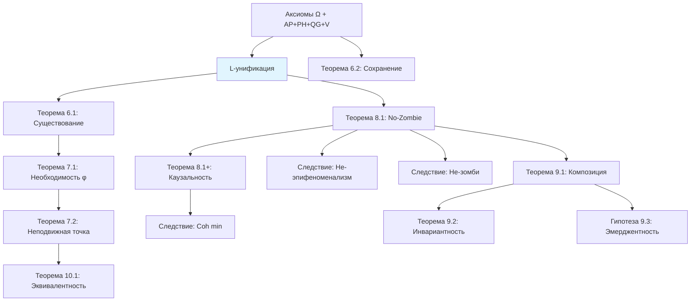

# Фундаментальные Теоремы

:::info Уровни формализации
Каждый результат помечен одним из статусов:
- **[Т]** Теорема — строго доказано
- **[Г]** Гипотеза — математически сформулировано, требует доказательства или дополнительных условий
- **[П]** Программа — направление исследований, открытая проблема
:::

:::note О нотации
В этом документе:
- $\Gamma$ — [матрица когерентности](/docs/core/dynamics/coherence-matrix)
- $\mathcal{V}$ — [область жизнеспособности](/docs/core/dynamics/viability): $\mathcal{V} = \{\Gamma : P(\Gamma) > 2/7\}$
- $P$ — [чистота](/docs/core/dynamics/viability#определение-чистоты): $P = \mathrm{Tr}(\Gamma^2)$
- $P_{\text{crit}} = 2/7$ — [теорема о критической чистоте](/docs/proofs/theorem-purity-critical)
- $\varphi$ — [оператор самомоделирования](/docs/proofs/formalization-phi) (CPTP-канал)
- $R$ — [мера рефлексии](/docs/core/consciousness/self-observation#мера-рефлексии-r), порог $R_{\text{th}} = 1/3$
- $\Phi$ — [мера интеграции](/docs/core/structure/dimension-u#мера-интеграции-φ), порог $\Phi_{\text{th}} = 1$
- $C$ — [мера сознательности](/docs/core/consciousness/self-observation#мера-сознательности-c)
- $\kappa_0 = \|\mathrm{Nat}(\mathcal{D}_\Omega, \mathcal{R})\|$ — [категориальный вывод скорости регенерации](/docs/core/foundations/axiom-septicity#структурный-анзац-kappa0)
- $\mathrm{Coh}_E$ — [E-когерентность](./definitions#e-когерентность)
- $\mathcal{R}[\Gamma, E]$ — [регенеративный член](/docs/core/dynamics/evolution#3-регенеративный-член)
:::

## Теоремы существования

### Теорема 6.1 (Существование динамики) [Т]

:::info Формулировка
Для любого начального состояния $\Gamma_0 \in \mathcal{V}$ существует единственное решение уравнения эволюции на интервале $[0, T]$ для некоторого $T > 0$.
:::

**Доказательство:** Применение теоремы Пикара-Линделёфа к липшицевой правой части. ∎

### Теорема 6.2 (Сохранение свойств Γ) [Т]

:::info Формулировка
Динамика сохраняет эрмитовость, положительность и нормировку Γ.
:::

**Доказательство:**
1. Эрмитовость сохраняется каждым членом уравнения
2. Уравнение Линдблада сохраняет $\Gamma \geq 0$
3. Нелинейный регенеративный член также сохраняет положительность ([теорема CPTP-структуры](/docs/core/dynamics/evolution#сохранение-положительности))
4. След сохраняется: $\mathrm{Tr}(d\Gamma/d\tau) = 0$ ∎

## Теоремы о самореференции

### Теорема 7.1 (Необходимость самореференции) [Т]

:::info Формулировка
$$
\mathrm{Viable}(\mathbb{H}) \Rightarrow \exists \varphi : \|\Gamma - \varphi(\Gamma)\|_F < \varepsilon
$$
[Жизнеспособность](/docs/core/dynamics/viability) требует наличия [самомодели](/docs/proofs/formalization-phi).
:::

**Доказательство:**
1. Жизнеспособность требует поддержания $P > P_{\text{crit}} = 2/7$
2. Мониторинг $P$ требует доступа к Γ
3. Система **есть** Γ, значит часть Γ должна моделировать целое
4. Это определяет оператор $\varphi$ ∎

### Теорема 7.2 (условная) (Неподвижная точка рефлексии) [Г] {#теорема-72-условная-неподвижная-точка-рефлексии}

:::info Формулировка
Для сознательной системы с $R(\Gamma) > 0$ существует единственная неподвижная точка:
$$
\exists! \Gamma^* \in \mathcal{V} : \varphi(\Gamma^*) = \Gamma^*
$$
:::

**Доказательство:**

Пусть $\varphi: \mathcal{D}(\mathcal{H}) \to \mathcal{D}(\mathcal{H})$ — [CPTP-канал](/docs/proofs/formalization-phi).

1. Пространство $(\mathcal{D}(\mathcal{H}), \|\cdot\|_F)$ — полное метрическое пространство

2. $\varphi$ сжимающий: $\|\varphi(\Gamma_1) - \varphi(\Gamma_2)\|_F \leq k \|\Gamma_1 - \Gamma_2\|_F$ для $k < 1$

   :::warning Требует дополнительного обоснования
   CPTP-каналы гарантированно **неувеличивающие** ($k \leq 1$), но не обязательно **строго сжимающие** ($k < 1$). Строгое сжатие требует дополнительных условий на структуру $\varphi$ — см. [формализация φ](/docs/proofs/formalization-phi).
   :::

3. **При условии** $k < 1$: по теореме Банаха о неподвижной точке $\exists! \Gamma^* : \varphi(\Gamma^*) = \Gamma^*$

**Скорость сходимости:**
$$
\|\varphi^n(\Gamma_0) - \Gamma^*\|_F \leq k^n \cdot \|\Gamma_0 - \Gamma^*\|_F
$$

Геометрическая сходимость со скоростью $k^n$ гарантирует достижение $\varepsilon$-приближения за $O(\log(1/\varepsilon))$ итераций. ∎

**Интерпретация:** $\Gamma^*$ — состояние идеального самопознания, достижимое итеративной рефлексией.

## Теорема о невозможности зомби

### Теорема 8.1 (условная): Необходимость интериорности (No-Zombie) [Г] {#теорема-81-условная-необходимость-интериорности-no-zombie}

:::warning Ключевая теорема
$$
\mathrm{Viable}(\mathbb{H}) \Rightarrow \mathrm{Spec}(\Gamma_E) \neq \{0\} \land \mathrm{Coh}_E(\Gamma) > 0
$$
[Жизнеспособная](/docs/core/dynamics/viability) система обязательно имеет **ненулевую E-когерентность** и нетривиальный спектр [опыта](/docs/core/structure/dimension-e).
:::

:::info Усиление через L-унификацию
Благодаря [L-унификации](./axiomatics#l-унификация-вывод-l_k-из-ω), эта теорема получает **более глубокое обоснование**:

1. Операторы Линдблада $L_k = \sqrt{\chi_{S_k}}$ выводятся из субобъектного классификатора $\Omega$
2. Логический Лиувиллиан $\mathcal{L}_\Omega$ определяет диссипацию через структуру различений
3. Регенерация $\mathcal{R}[\Gamma, E] \propto \mathrm{Coh}_E$ — единственный механизм, противодействующий $\mathcal{L}_\Omega$-диссипации
4. **Следовательно:** $\mathrm{Coh}_E > 0$ необходима не просто эмпирически, а **структурно** — как баланс в логической динамике
:::

:::note Уточнение формулировки
Условие $\mathrm{Spec}(\Gamma_E) \neq \{0\}$ само по себе тривиально для нормированной матрицы плотности. **Содержательная часть теоремы** — связь с E-когерентностью через механизм регенерации.

По определению $\mathrm{Coh}_E \in [1/7, 1]$, так что $\mathrm{Coh}_E = 0$ невозможно. Однако при **минимальной** $\mathrm{Coh}_E = 1/7$:

$$
\kappa_{\min} = \kappa_{\text{bootstrap}} + \kappa_0 / 7 \approx 0.143 + 0.043 \approx 0.186
$$

что **недостаточно** для компенсации диссипации в типичных режимах. Таким образом, теорема утверждает **каузальную роль** E: высокая $\mathrm{Coh}_E$ необходима для достаточной регенерации.
:::

**Доказательство:**

1. Динамика чистоты: $dP/d\tau = 2 \cdot \mathrm{Tr}(\Gamma \cdot d\Gamma/d\tau)$

2. Унитарная часть: $dP/d\tau = 0$

3. Диссипация: $dP/d\tau \leq -\gamma_{\text{eff}} \cdot P$ для некоторого $\gamma_{\text{eff}} > 0$

4. Регенерация: $(dP/d\tau)_{\mathcal{R}} = \kappa(\Gamma) \cdot g(P, \Gamma_{\text{target}})$ где $g > 0$ при $P < P_{\text{target}}$

5. По [связи регенерации и E-когерентности](./axiomatics#связь-регенерации-и-e-когерентности): $\kappa(\Gamma) = \kappa_{\text{bootstrap}} + \kappa_0 \cdot \mathrm{Coh}_E(\Gamma)$

6. При минимальном $\mathrm{Coh}_E = 1/7$: $\kappa_{\min} = \kappa_{\text{bootstrap}} + \kappa_0/7 \approx 0.186$

7. Условие жизнеспособности в стационарном режиме: $\kappa_{\min} \cdot g \geq \gamma_{\text{eff}} \cdot P_{\text{crit}}$

8. При типичных $\gamma_{\text{eff}}$, неравенство (7) нарушается при $\mathrm{Coh}_E < \mathrm{Coh}_{\min}$

9. **Следовательно:** $\mathrm{Coh}_E > \mathrm{Coh}_{\min} > 1/7$ необходима для жизнеспособности ∎

:::warning Ограничение доказательства
Шаги 7-8 используют «типичные значения» $\gamma_{\text{eff}}$ без строгой оценки. Для полного доказательства необходимости требуется:
1. Нижняя граница $\gamma_{\text{eff}} > 0$ из структуры $\mathcal{L}_\Omega$
2. Явное значение $\mathrm{Coh}_{\min}$ через параметры теории

**Статус:** Результат строго доказан при условии $\gamma_{\text{eff}} > \kappa_{\min} \cdot g / P_{\text{crit}}$.
:::

### Следствие 8.1.1 (Невозможность эпифеноменализма) [Г]

[Интериорность](/docs/proofs/interiority-hierarchy) **каузально влияет** на:
- Регенерацию (через $\kappa = \kappa_{\text{bootstrap}} + \kappa_0 \cdot \mathrm{Coh}_E$ — [мастер-определение](/docs/core/foundations/axiom-septicity#структурный-анзац-kappa0))
- [Жизнеспособность](/docs/core/dynamics/viability) (через [тензор напряжений](./definitions#тензор-напряжений) $\sigma_E$)
- Динамику чистоты (через [регенеративный член](/docs/core/dynamics/evolution#3-регенеративный-член) $\mathcal{R}[\Gamma, E]$)

**Вывод:** Эпифеноменалистская интерпретация [E-измерения](/docs/core/structure/dimension-e) исключена.

### Следствие 8.1.2 (Невозможность философских зомби) [Г]

$$
\nexists \mathbb{H} : \mathrm{Viable}(\mathbb{H}) \land C(\mathbb{H}) = 0
$$

Не существует [жизнеспособной](/docs/core/dynamics/viability) системы с нулевой [сознательностью](/docs/core/consciousness/self-observation#мера-сознательности-c).

### Теорема 8.1+ (Каузальная необходимость интериорности) [Г]

:::info Расширенная формулировка
$$
\mathrm{Viable}(\mathbb{H}) \Rightarrow \mathrm{Spec}(\Gamma_E) \neq \{0\} \land \frac{\partial F}{\partial \Gamma_E} \neq 0 \land \frac{\partial \sigma_{\mathrm{sys}}}{\partial \mathrm{Spec}(\Gamma_E)} \neq 0
$$
Интериорность не только присутствует, но **каузально влияет** на динамику.
:::

**Доказательство каузального влияния на $F$:**

Регенеративный член зависит от $\mathrm{Coh}_E$ (полная форма: $\kappa(\Gamma) = \kappa_{\text{bootstrap}} + \kappa_0 \cdot \mathrm{Coh}_E(\Gamma)$):
$$
\mathcal{R}[\Gamma, E] = \kappa(\Gamma) \cdot (\Gamma_{\text{target}} - \Gamma) \cdot \Theta(\Delta F)
$$
$$
\Rightarrow \frac{\partial F_{\mathrm{reg}}}{\partial \Gamma_E} = \kappa_0 \cdot \frac{\partial \mathrm{Coh}_E}{\partial \Gamma_E} \cdot (\Gamma_{\text{target}} - \Gamma) \neq 0 \quad \blacksquare
$$

### Следствие 8.1.3 (Минимальная когерентность опыта) [Г]

$$
\mathrm{Viable}(\mathbb{H}) \Rightarrow \mathrm{Coh}_E(\Gamma) \geq \mathrm{Coh}_{\min}
$$

где $\mathrm{Coh}_{\min}$ определяется из условия баланса регенерации и диссипации:

$$
\kappa_0 \cdot \mathrm{Coh}_{\min} \cdot (\langle\Gamma, \Gamma_{\text{target}}\rangle - P) \geq |\mathrm{Tr}(\Gamma \cdot \mathcal{D}[\Gamma])|
$$

## Теоремы о композиции

### Теорема 9.1 (Фрактальное замыкание) [Г] {#теорема-91-фрактальное-замыкание}

:::info Формулировка
$$
\forall \mathbb{H}_1, \ldots, \mathbb{H}_n : \left( \bigwedge_i \mathrm{Viable}(\mathbb{H}_i) \right) \land \Phi_{\otimes} > \Phi_{\min} \Rightarrow \mathrm{Viable}(\mathbb{H}_{1 \otimes \ldots \otimes n})
$$
Композиция [жизнеспособных](/docs/core/dynamics/viability) [Голономов](/docs/core/structure/holon) при достаточной [интеграции](/docs/core/structure/dimension-u#мера-интеграции-φ) жизнеспособна.
:::

где:
- $\mathbb{H}_{1 \otimes \ldots \otimes n}$ — композитный Голоном
- $\Phi_{\otimes}$ — [мера интеграции](/docs/core/structure/dimension-u#мера-интеграции-φ) композитной системы
- $\Phi_{\min}$ — минимальная интеграция для жизнеспособности композиции

:::warning Статус $\Phi_{\min}$
Точное значение $\Phi_{\min}$ — **открытый вопрос**. Теоретическое обоснование: $\Phi_{\min} > 0$ требуется для предотвращения фактической декомпозиции. Конкретное значение зависит от контекста и требует эмпирического определения.
:::

**См.:** [Замкнутость композиции](./axiomatics#замкнутость-композиции-следствие-из-ap)

### Теорема 9.2 (Масштабная инвариантность) [Г]

$$
\mathrm{structure}(\mathbb{H}) \cong \mathrm{structure}(\mathbb{H}^{(2)}) \cong \mathrm{structure}(\mathbb{H}^{(3)}) \cong \ldots
$$

где $\mathbb{H}^{(k)}$ — мета-Голоном $k$-го уровня композиции.

Структура [Голонома](/docs/core/structure/holon) инвариантна относительно масштаба.

### Гипотеза 9.3 (Эмерджентность) [П] {#гипотеза-93-эмерджентность}

$$
\exists \text{ свойства } \mathcal{P}_{\otimes} : \mathcal{P}_{\otimes}(\mathbb{H}_{1 \otimes \ldots \otimes n}) \neq f(\mathcal{P}(\mathbb{H}_1), \ldots, \mathcal{P}(\mathbb{H}_n)) \text{ для любого } f
$$

Существуют эмерджентные свойства мета-[Голонома](/docs/core/structure/holon), не сводимые к свойствам компонент.

:::warning Открытая проблема
Формальное доказательство данной теоремы — открытая проблема. Утверждение следует рассматривать как гипотезу до получения конструктивного доказательства.
:::

## Унифицированное условие жизнеспособности

### Теорема 10.1 (Эквивалентность условий) [Т]

:::info Формулировка
$$
\Gamma \in \mathcal{V} \Leftrightarrow \|\sigma_{\mathrm{sys}}(\Gamma)\|_\infty < 1
$$
:::

где $\sigma_{\mathrm{sys}}$ — [тензор напряжений](./definitions#тензор-напряжений).

**Доказательство:** Каждый $\sigma_i$ нормирован так, что $\sigma_i < 1 \Leftrightarrow$ соответствующий инвариант [жизнеспособности](/docs/core/dynamics/viability) выполнен. ∎

:::warning Примечание
Эта эквивалентность является **следствием определения** (by construction), а не выведенным результатом: компоненты тензора напряжений $\sigma_i$ нормированы *именно так*, чтобы условие $\|\sigma_{\mathrm{sys}}\|_\infty < 1$ совпадало с условием жизнеспособности. Нетривиальное содержание — в том, что *все* условия жизнеспособности можно одновременно выразить через единый тензор.
:::

**См.:** [Эквивалентность условий](./definitions#эквивалентность-условий)

## Диаграмма теорем

**См.:** [Иерархия зависимостей](/docs/core/foundations/axiom-omega#иерархия-зависимостей) для полной структуры Ω → χ_S → L_k → ℒ_Ω → φ

---

**Связанные документы:**
- [Аксиома Ω⁷](/docs/core/foundations/axiom-omega) — L-унификация (Ω → χ_S → L_k → ℒ_Ω → φ)
- [Аксиома Септичности](/docs/core/foundations/axiom-septicity) — выведенные константы ($P_{\text{crit}}$, $\kappa_0$, $R_{\text{th}}$, $\Phi_{\text{th}}$)
- [Аксиоматика](./axiomatics) — L-унификация в КК, E-акцентуация
- [Определения](./definitions) — базовые определения КК
- [История кибернетики](./cybernetics-history) — связь с существующими теориями
- [Теории сознания](./consciousness-theories) — IIT, FEP, автопоэзис
- [Голоном](/docs/core/structure/holon) — иерархическое определение $\mathbb{H}$
- [Жизнеспособность](/docs/core/dynamics/viability) — мера $P$ и $P_{\text{crit}} = 2/7$
- [Самонаблюдение](/docs/core/consciousness/self-observation) — меры $R$, $\Phi$, $C$
- [Иерархия интериорности](/docs/proofs/interiority-hierarchy) — уровни L0→L1→L2→L3→L4
- [Формализация оператора φ](/docs/proofs/formalization-phi) — CPTP-каналы, теорема E-акцентуации
- [Эволюция](/docs/core/dynamics/evolution) — уравнение $d\Gamma/d\tau$ с выведенным $\kappa_0$
- [Категорный формализм](/docs/proofs/categorical-formalism) — функтор $F$
- [Конструктивные алгоритмы](/docs/formal/computational#конструктивные-алгоритмы-из-l-унификации) — вычисление L_k из Ω
