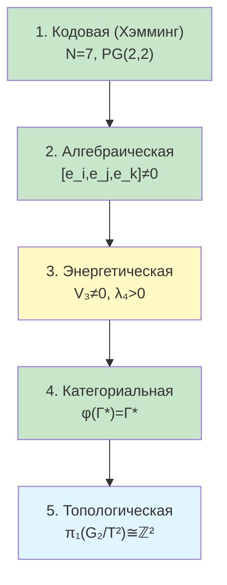

# Топологическая защита когерентности

:::note О нотации
В этом документе:
- $\Gamma$ — [матрица когерентности](/docs/core/dynamics/coherence-matrix)
- $\hat{\mathcal{G}}$ — [Gap-оператор](/docs/core/dynamics/gap-operator)
- $\mathrm{Gap}(i,j) = |\sin(\theta_{ij})|$ — мера зазора между измерениями
- $G_2 = \mathrm{Aut}(\mathbb{O})$ — [группа автоморфизмов октонионов](/docs/physics/gauge-symmetry/g2-structure)
- $T^2$ — максимальный тор $G_2$
- $V_{\text{Gap}}$ — [потенциал Gap](/docs/core/dynamics/gap-thermodynamics)
- $\varphi$ — [оператор самомоделирования](/docs/proofs/categorical/formalization-phi)
- PG(2,2) — [плоскость Фано](/docs/physics/gauge-symmetry/fano-selection-rules)
:::

Когерентность голонома защищена от разрушения **пятью независимыми механизмами**. Каждый механизм действует в своей области (теория кодирования, алгебра, энергетика, теория категорий, топология), что делает полное разрушение когерентности экспоненциально маловероятным.

---

## 1. Кодовая защита (Хэмминг) [Т] {#код-хэмминга}

:::tip Теорема 1.1 (Граница Хэмминга для Gap) [Т]
Из 21 пары измерений $(i,j)$, $1 \leq i < j \leq 7$, **не менее 3** должны иметь ненулевой Gap:

$$
|\{(i,j) : \mathrm{Gap}(i,j) > 0\}| \geq 3
$$

Это следует из свойств кода Хэмминга $H(7,4)$ с минимальным расстоянием $d = 3$.
:::

**Механизм.** [Плоскость Фано](/docs/physics/gauge-symmetry/fano-selection-rules) PG(2,2) определяет проверочную матрицу $H$ кода Хэмминга $H(7,4)$:

| Параметр кода | Значение | Интерпретация в УГМ |
|---------------|----------|---------------------|
| $n$ (длина) | 7 | Число измерений голонома |
| $k$ (информационных) | 4 | «Информационные» измерения $\{A, S, D, L\}$ |
| $r$ (проверочных) | 3 | «Проверочные» измерения $\{E, U, O\}$ |
| $d_{\min}$ | 3 | Минимальное расстояние Хэмминга |

**Следствие.** Код $H(7,4)$ **корректирует одиночные ошибки**: если одна когерентность повреждена (Gap-значение искажено), Фано-структура позволяет восстановить корректное значение из оставшихся. Для полного разрушения Gap-профиля необходимо одновременное повреждение **не менее 3** когерентностей.

**Граница:**

$$
\text{Число неисправимых ошибок} \geq \left\lfloor \frac{d_{\min} - 1}{2} \right\rfloor + 1 = 2
$$

Одиночная ошибка всегда обнаруживается и корректируется; двойная — обнаруживается, но не корректируется; тройная — минимально необходимая для незаметного разрушения.

**См.:** [Код Хэмминга в Gap-динамике](/docs/core/dynamics/gap-dynamics#код-хэмминга)

---

## 2. Алгебраическая защита (октонионный ассоциатор) [Т] {#ассоциатор}

:::tip Теорема 2.1 (Ненулевой ассоциатор создаёт потенциальный барьер) [Т]
Для троек $(i,j,k)$ **вне** Фано-линий октонионный ассоциатор ненулевой:

$$
[e_i, e_j, e_k] := (e_i \cdot e_j) \cdot e_k - e_i \cdot (e_j \cdot e_k) \neq 0
$$

Это порождает кубический член $V_3$ в потенциале Gap, создающий потенциальный барьер вокруг минимума Gap-конфигурации.
:::

**Механизм.** Октонионы — единственная нормированная алгебра деления, которая **неассоциативна**. Ассоциатор $[e_i, e_j, e_k]$ ненулевой для 28 из 35 троек (не лежащих на Фано-линиях). Этот алгебраический факт имеет динамические последствия:

1. Кубический потенциал $V_3(\theta) = \frac{\lambda_3}{3!} \sum_{(i,j,k) \notin \text{Fano}} [e_i, e_j, e_k] \cdot \theta_{ij}\theta_{jk}\theta_{ki}$ нарушает PT-симметрию
2. $V_3 \neq 0$ гарантирует, что минимум $V_{\text{Gap}}$ **не расположен** в точке $\theta_{ij} = 0$ (полная прозрачность)
3. Потенциальный барьер между минимумом Gap и тривиальной конфигурацией $\hat{\mathcal{G}} = 0$ пропорционален $\|[e_i, e_j, e_k]\|$

:::info Связь с неассоциативностью [Т]
Алгебраическая защита **специфична** для октонионов. В ассоциативных алгебрах ($\mathbb{R}$, $\mathbb{C}$, $\mathbb{H}$) ассоциатор тождественно нулевой, и кубический потенциал отсутствует. Неассоциативность — **необходимое условие** алгебраической защиты Gap.
:::

**См.:** [G₂-разложение Gap-оператора](/docs/core/dynamics/gap-operator#g2-разложение), [Октонионное крестное произведение](/docs/core/dynamics/gap-operator#коммутаторная-алгебра)

---

## 3. Энергетическая защита (спонтанный минимум $V_{\text{Gap}}$) [Т] {#энергетическая}

:::tip Теорема 3.1 (Ненулевой минимум Gap-потенциала) [Т]
Полный Gap-потенциал $V_{\text{Gap}}(\theta)$ имеет глобальный минимум $V_{\text{Gap}}^* > 0$ при нетривиальной конфигурации $\theta^* \neq 0$:

$$
\mathcal{G}_{\text{total}}^* = \|\hat{\mathcal{G}}_*\|_F^2 > 0
$$

Энергетический зазор до тривиальной конфигурации:

$$
\Delta V := V_{\text{Gap}}(\theta = 0) - V_{\text{Gap}}(\theta^*) > 0
$$
:::

**Механизм.** Полный потенциал Gap включает три вклада:

$$
V_{\text{Gap}}(\theta) = V_2(\theta) + V_3(\theta) + V_4(\theta)
$$

| Член | Структура | Роль |
|------|-----------|------|
| $V_2 = \frac{\mu^2}{2}\sum_{i<j} \theta_{ij}^2$ | Квадратичный (масса) | Стягивает к $\theta = 0$ |
| $V_3 = \frac{\lambda_3}{3!}\sum_{\text{не-Фано}} [e_i,e_j,e_k]\,\theta_{ij}\theta_{jk}\theta_{ki}$ | Кубический (ассоциатор) | Сдвигает минимум от $\theta = 0$ |
| $V_4 = \frac{\lambda_4}{4!}\sum \theta^4$ | Квартичный (стабилизация) | Предотвращает убегание |

Кубический член $V_3$ (из октонионного ассоциатора) **сдвигает** минимум потенциала от точки $\theta = 0$ в нетривиальное положение $\theta^*$. Квартичный член $V_4$ гарантирует **ограниченность снизу**, обеспечивая существование стабильного минимума.

:::warning Оценка энергетического барьера [Т]
Высота барьера между минимумом $\theta^*$ и тривиальной конфигурацией $\theta = 0$:

$$
\Delta V \geq \frac{\lambda_3^2}{6\lambda_4} \cdot \|\text{Assoc}\|^2
$$

где $\|\text{Assoc}\|^2 = \sum_{\text{не-Фано}} |[e_i, e_j, e_k]|^2$ — суммарная «неассоциативность». Для стандартных октонионов $\|\text{Assoc}\|^2 = 28$.
:::

**См.:** [Термодинамика Gap](/docs/core/dynamics/gap-thermodynamics), [Фазовая диаграмма Gap](/docs/core/dynamics/gap-phase-diagram)

---

## 4. Категориальная защита (теорема Лавёра) [Т] {#категориальная}

:::tip Теорема 4.1 (Нетривиальность неподвижной точки) [Т]
Для жизнеспособного голонома с [самомоделированием](/docs/proofs/categorical/formalization-phi) $\varphi$:

$$
\varphi(\Gamma^*) = \Gamma^* \quad \Rightarrow \quad \hat{\mathcal{G}}_* \neq 0
$$

Неподвижная точка самомоделирования **не может быть полностью прозрачной**.
:::

**Механизм.** Аргумент основан на категориальной структуре самореференции:

**Шаг 1.** По [теореме Лавёра](/docs/consciousness/foundations/self-observation) о неподвижных точках, эндофунктор категории $\mathbf{Hol}$ обладает неподвижной точкой, если выполнены условия [жизнеспособности](/docs/core/dynamics/viability).

**Шаг 2.** По [теореме L4 $\neq$ Gap = 0](/docs/proofs/gap/fano-channel#l4-не-gap-0) [Т], неподвижная точка $\varphi(\Gamma^*) = \Gamma^*$ означает $\mathrm{Gap}_{\text{perceived}} = \mathrm{Gap}_{\text{actual}}$, но **не** $\mathrm{Gap}_{\text{actual}} = 0$.

**Шаг 3.** Если бы $\hat{\mathcal{G}}_* = 0$ (полная прозрачность), то все когерентности были бы вещественными ($\mathrm{Im}(\gamma_{ij}) = 0$), что при наложении условия $P > P_{\text{crit}} = 2/7$ и структуры [замыкания (M,R)](/docs/proofs/minimality/theorem-minimality-7#определение-12-mr-система-розена) приводит к противоречию: система должна одновременно быть полностью прозрачной (знать всё о себе) и поддерживать каузальные связи, требующие ненулевых фаз.

:::info Аналогия с теоремой Гёделя [И]
Категориальная защита — аналог теоремы о неполноте: **достаточно сложная** самореферентная система не может быть одновременно полностью «прозрачной» (все Gap = 0) и «замкнутой» (самовоспроизводящей). Существование ненулевого Gap — структурная необходимость, а не дефект.
:::

**См.:** [Самонаблюдение](/docs/consciousness/foundations/self-observation), [Формализация оператора φ](/docs/proofs/categorical/formalization-phi)

---

## 5. Топологическая защита [Т] {#топологическая}

:::tip Теорема 5.1 (Топологическая неустранимость Gap ранга 3) [Т]
При ранге непрозрачности $r = 3$ (общий спектр $\lambda_1 \neq \lambda_2 \neq \lambda_3 \neq 0$):

$$
\pi_1(G_2/T^2) \cong \mathbb{Z}^2 \neq 0
$$

Существуют нестягиваемые петли в пространстве Gap-конфигураций. Невырожденные Gap-конфигурации **не могут быть непрерывно деформированы** к тривиальным.
:::

**Механизм.** Стабилизатор Gap-конфигурации зависит от ранга непрозрачности:

| Ранг | Спектр $\hat{\mathcal{G}}$ | Стабилизатор $H$ | $\pi_1(G_2/H)$ | Защита |
|------|---------------------------|-----------------|-----------------|--------|
| 0 | $(0,0,0)$ | $G_2$ | 0 | Нет |
| 1 | $(\lambda,0,0)$ | $\mathrm{SU}(3)$ | 0 | Нет |
| 2 | $(\lambda_1,\lambda_2,0)$ | $\mathrm{SU}(2) \times \mathrm{U}(1)$ | 0 | Нет |
| **3 (общий)** | $(\lambda_1,\lambda_2,\lambda_3)$ | $T^2$ | $\mathbb{Z}^2$ | **Да** |
| 3 (вырожд.) | $(\lambda,\lambda,\lambda)$ | $\mathrm{SU}(2)$ | 0 | Нет |

### 5.1 Топологический заряд {#топологический-заряд}

Для замкнутого контура $C$ в фазовом пространстве Gap-профилей определяется целочисленный заряд:

$$
Q_{\text{top}}[C] := \frac{1}{2\pi} \oint_C \sum_{\text{Fano}} \epsilon_{ijk}^{\text{Fano}} \, \theta_{ij} \, d\theta_{jk} \in \mathbb{Z}
$$

:::info Теорема 5.2 (Сохранение топологического заряда) [Т]
**(a)** При гладкой эволюции: $dQ_{\text{top}}/d\tau = 0$.

**(b)** $Q_{\text{top}}$ может измениться **только** при фазовом переходе (разрыв $\theta_{ij}$) или бифуркации.

**(c)** Конфигурации с разными $Q_{\text{top}}$ не могут быть непрерывно деформированы друг в друга.
:::

### 5.2 Два числа намотки {#числа-намотки}

Фундаментальная группа $\pi_1(G_2/T^2) \cong \mathbb{Z}^2$ задаётся двумя целыми числами $(n_1, n_2)$, соответствующими двум простым корням алгебры $\mathfrak{g}_2$:

- $\alpha_1$ (короткий корень): число намотки $n_1 \in \mathbb{Z}$
- $\alpha_2$ (длинный корень): число намотки $n_2 \in \mathbb{Z}$

Энергия «развязывания» топологически защищённой конфигурации:

$$
\Delta E_{\text{top}} \geq (|n_1| + |n_2|) \cdot \frac{\pi \mu^2}{\lambda_4}
$$

### 5.3 Клиническая интерпретация [И]

Топологическая защита объясняет **устойчивость** определённых паттернов непрозрачности:

| Паттерн | $Q_{\text{top}}$ | Клиника |
|---------|-------------------|---------|
| $(0, 0)$ | Тривиальный | Нет топологической защиты — Gap легко устраняется |
| $(1, 0)$ или $(0, 1)$ | Простая петля | Устойчивый моноканальный паттерн — «привычная защита» |
| $(1, 1)$ | Двойная петля | Устойчивый мультиканальный паттерн — «структурный характер» |
| $(n_1, n_2)$ при $\lvert n_1\rvert + \lvert n_2\rvert > 2$ | Многократная | Глубоко укоренённый паттерн — высокий энергетический барьер |

**См.:** [Стабилизаторы Gap-оператора](/docs/core/dynamics/gap-operator#стабилизаторы), [Фано-канал](/docs/proofs/gap/fano-channel)

---

## 6. Независимость механизмов [Т] {#независимость}

:::tip Теорема 6.1 (Независимость пяти механизмов защиты) [Т]
Пять механизмов защиты Gap действуют **независимо друг от друга**:

| № | Тип защиты | Область | Условие активации |
|---|-----------|---------|-------------------|
| 1 | Кодовая (Хэмминг) | Теория кодирования | $N = 7$, структура PG(2,2) |
| 2 | Алгебраическая (ассоциатор) | Алгебра октонионов | $[e_i,e_j,e_k] \neq 0$ |
| 3 | Энергетическая (минимум $V_{\text{Gap}}$) | Вариационное исчисление | $V_3 \neq 0$, $\lambda_4 > 0$ |
| 4 | Категориальная (Лавёр) | Теория категорий | $\varphi(\Gamma^*) = \Gamma^*$ |
| 5 | Топологическая ($\pi_1$) | Алгебраическая топология | Ранг $\hat{\mathcal{G}} = 3$, общий спектр |

Каждый механизм может быть «отключён» (например, топологическая защита исчезает при ранге < 3), но **не все одновременно**: механизмы 1, 2, 4 структурно неустранимы для 7-мерной октонионной системы.
:::

### 6.1 Совместное действие

Совместное действие механизмов усиливает защиту. Если $p_i$ — вероятность преодоления $i$-го механизма, то вероятность полного разрушения Gap:

$$
P_{\text{fail}} = \prod_{i=1}^{5} p_i
$$

При независимых $p_i \sim 0.1$:

$$
P_{\text{fail}} \sim 10^{-5}
$$

:::warning Замечание о корреляциях [С]
Точная оценка $P_{\text{fail}}$ зависит от корреляций между механизмами. В худшем случае (полная корреляция) $P_{\text{fail}} = \max(p_i) \sim 0.1$. Формула произведения — верхняя граница при полной независимости. Реальное значение лежит между этими пределами.
:::

### 6.2 Иерархия робастности

Механизмы упорядочиваются по «глубине» — насколько фундаментально условие их существования:

- **Зелёные** (1, 2, 4): неустранимые для любой 7-мерной октонионной системы
- **Жёлтая** (3): требует $V_3 \neq 0$ (следует из неассоциативности, т.е. из зелёных)
- **Голубая** (5): требует ранга 3 — активна только для достаточно сложных конфигураций

---

## 7. Сводка статусов {#статусы}

| Результат | Статус |
|-----------|--------|
| Граница Хэмминга: $\geq 3$ ненулевых Gap | [Т] |
| Октонионный ассоциатор $\neq 0$ для не-Фано троек | [Т] |
| Ненулевой минимум $V_{\text{Gap}}^* > 0$ из $V_3$ | [Т] |
| Нетривиальность неподвижной точки $\hat{\mathcal{G}}_* \neq 0$ | [Т] |
| $\pi_1(G_2/T^2) \cong \mathbb{Z}^2$ при ранге 3 | [Т] |
| Топологический заряд $Q_{\text{top}} \in \mathbb{Z}$ сохраняется | [Т] |
| Независимость пяти механизмов | [Т] |
| Совместная вероятность $P_{\text{fail}} = \prod p_i$ | [С] (при условии независимости) |
| Клиническая интерпретация топологических зарядов | [И] |

---

## Связанные документы

- [Gap-оператор](/docs/core/dynamics/gap-operator) — определение $\hat{\mathcal{G}}$, спектр, стабилизаторы
- [Динамика Gap](/docs/core/dynamics/gap-dynamics) — код Хэмминга, бифуркации
- [Термодинамика Gap](/docs/core/dynamics/gap-thermodynamics) — потенциал $V_{\text{Gap}}$, лагранжиан
- [Фазовая диаграмма Gap](/docs/core/dynamics/gap-phase-diagram) — пять типов защиты Gap
- [Фано-канал и Gap-теоремы](/docs/proofs/gap/fano-channel) — G₂-ковариантность, L4 $\neq$ Gap = 0
- [G₂-структура](/docs/physics/gauge-symmetry/g2-structure) — $G_2 = \mathrm{Aut}(\mathbb{O})$, плоскость Фано
- [G₂-заряды Нётер](/docs/physics/gauge-symmetry/noether-charges) — топологические заряды и защита
- [Теоремы КК](./theorems) — No-Zombie, композиция, эквивалентность
- [Самонаблюдение](/docs/consciousness/foundations/self-observation) — неподвижные точки $\varphi$
- [Формализация оператора φ](/docs/proofs/categorical/formalization-phi) — CPTP-каналы
