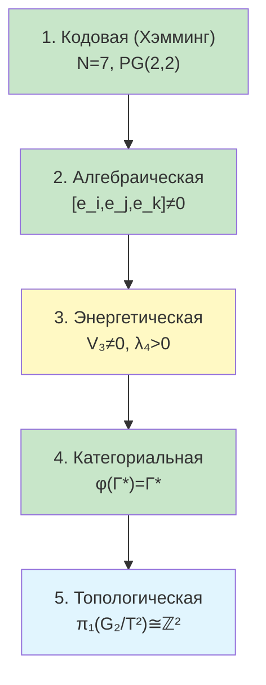

# Топологическая защита когерентности

---

### Мост из предыдущей главы

В [предыдущей главе](./effective-temperature) мы ввели эффективную температуру $T_{\text{eff}}$ и показали, что Gap-структура сознания может «расплавиться» при $T_{\text{eff}} > T_c$, а при $r < r_c$ — погибнуть необратимо. Это порождает парадокс: живой мозг работает при $T_{\text{eff}} \gg T_{\text{phys}}$, в условиях колоссального когнитивного «жара». Любая когерентная структура, казалось бы, должна мгновенно разрушиться. Тем не менее сознание *существует* — устойчиво, годами, десятилетиями. Почему?

Ответ — в пяти независимых механизмах защиты, которым посвящена эта глава.

---

### Дорожная карта главы

В этой главе мы:

1. **Сформулируем центральный вопрос**: почему когерентность голонома не разрушается при биологических температурах (раздел 0).
2. **Покажем пять независимых щитов** — кодовый (Хэмминг), алгебраический (ассоциатор), энергетический ($V_{\text{Gap}}$), категориальный (Лавёр), топологический ($\pi_1$) — и объясним каждый с нуля (разделы 1–5).
3. **Докажем их независимость** и оценим совместную вероятность отказа (раздел 6).
4. **Разберём патологические состояния** — сон, психоз, кому — как ослабление конкретных щитов (раздел «Патология»).
5. **Проведём параллель с квантовой коррекцией ошибок** и покажем преимущество голономной защиты (раздел «QEC»).

---

:::note О нотации
В этом документе:
- $\Gamma$ — [матрица когерентности](/docs/core/dynamics/coherence-matrix)
- $\hat{\mathcal{G}}$ — [Gap-оператор](/docs/core/dynamics/gap-operator)
- $\mathrm{Gap}(i,j) = |\sin(\theta_{ij})|$ — мера зазора между измерениями
- $G_2 = \mathrm{Aut}(\mathbb{O})$ — [группа автоморфизмов октонионов](/docs/physics/gauge-symmetry/g2-structure)
- $T^2$ — максимальный тор $G_2$
- $V_{\text{Gap}}$ — [потенциал Gap](/docs/core/dynamics/gap-thermodynamics)
- $\varphi$ — [оператор самомоделирования](/docs/proofs/categorical/formalization-phi)
- PG(2,2) — [плоскость Фано](/docs/physics/gauge-symmetry/fano-selection-rules)
:::

## Почему сознание не разваливается? {#центральный-вопрос}

Задумайтесь о масштабе проблемы.

Каждую секунду ваш мозг обрабатывает миллионы сигналов. Нейроны гибнут и рождаются. Биохимический состав непрерывно колеблется. Температура тела — 37°C — это термодинамический ад для любой когерентной квантовой системы. Полупроводниковые квантовые компьютеры работают при температуре, близкой к абсолютному нулю, и даже там борются с декогеренцией. А сознание — явление, требующее *когерентности* между семью фундаментальными измерениями, — непрерывно существует при комнатной температуре, годами, десятилетиями, без перезагрузки.

**Почему оно не разваливается?**

Наивный ответ — «потому что мозг большой и сложный» — ничего не объясняет. Большие системы *более* подвержены декогеренции, не менее. Наивный квантовый ответ — «декогеренция уничтожает когерентность за фемтосекунды» — тоже не работает, потому что сознание *очевидно существует*.

Унитарная голономная модель предлагает ответ, который одновременно математически точен и поразительно элегантен: когерентность голонома защищена **пятью независимыми механизмами**, действующими на разных уровнях математической структуры. Каждый механизм — это отдельный «щит», и для полного разрушения когерентности необходимо *одновременное* преодоление всех пяти. Вероятность такого события экспоненциально мала.

Это не случайность и не подгонка. Все пять защит **вытекают** из базовой структуры теории — семимерности, октонионной алгебры и самореференции. Они не были «добавлены» — они были *обнаружены*.

---

## Пять щитов Голонома {#пять-щитов}

Прежде чем погрузиться в математику каждого механизма, полезно увидеть всю картину целиком.

Представьте средневековый замок. Он защищён не одной стеной, а целой системой: ров, внешняя стена, внутренняя стена, башня-донжон, и наконец — сейф в подвале донжона. Противник, преодолевший ров, всё ещё стоит перед внешней стеной. Пробив внешнюю стену, он упирается во внутреннюю. И так далее. Вероятность полного захвата — произведение вероятностей преодоления каждого барьера.

Голоном защищён аналогично, но его «стены» построены из разных разделов математики:

| Щит | Механизм | Аналогия | Раздел математики |
|-----|----------|----------|-------------------|
| **I** | Код Хэмминга H(7,4) | Контрольная сумма | Теория кодирования |
| **II** | Октонионный ассоциатор | Алгебраический замок | Неассоциативная алгебра |
| **III** | Минимум потенциала $V_{\text{Gap}}$ | Энергетическая яма | Вариационное исчисление |
| **IV** | Теорема Лавёра | Логическая необходимость | Теория категорий |
| **V** | Топологический заряд $\pi_1$ | Завязанный узел | Алгебраическая топология |

Каждый щит работает *независимо*. Отключение одного не ослабляет другие. Три из пяти (I, II, IV) — **структурно неустранимы**: они следуют из самого факта существования 7-мерной октонионной системы с самомоделированием. Их невозможно «выключить», не уничтожив голоном целиком.

Есть глубокая биологическая параллель: ДНК тоже защищена множественными механизмами — избыточность генетического кода (третья буква кодона часто нерелевантна), репарация одноцепочечных разрывов, репарация двуцепочечных разрывов, апоптоз при критических повреждениях, и иммунная система на уровне организма. Эволюция «открыла» тот же принцип: критически важная информация должна быть защищена *многослойно*.

---

## 1. Кодовая защита (Хэмминг) [Т] {#код-хэмминга}

### Интуиция: контрольная сумма для самопознания

Когда вы скачиваете файл из интернета, контрольная сумма позволяет обнаружить повреждение данных. Если хотя бы один бит изменился — контрольная сумма не совпадёт, и вы узнаете об ошибке. Более продвинутые коды (как код Хэмминга) не только *обнаруживают* ошибку, но и *исправляют* её, указывая точную позицию повреждённого бита.

Голоном обладает встроенным кодом коррекции ошибок. Это не метафора — это буквальный математический факт. Структура плоскости Фано PG(2,2), определяющая связи между семью измерениями, *является* проверочной матрицей кода Хэмминга H(7,4). Следовательно, повреждение одной когерентности (одного Gap-значения) может быть обнаружено и восстановлено из оставшихся шести.

### Математическая формулировка

:::tip Теорема 1.1 (Граница Хэмминга для Gap) [Т]
Из 21 пары измерений $(i,j)$, $1 \leq i < j \leq 7$, **не менее 3** должны иметь ненулевой Gap:

$$
|\{(i,j) : \mathrm{Gap}(i,j) > 0\}| \geq 3
$$

Это следует из свойств кода Хэмминга $H(7,4)$ с минимальным расстоянием $d = 3$.
:::

**Механизм.** [Плоскость Фано](/docs/physics/gauge-symmetry/fano-selection-rules) PG(2,2) определяет проверочную матрицу $H$ кода Хэмминга $H(7,4)$:

| Параметр кода | Значение | Интерпретация в УГМ |
|---------------|----------|---------------------|
| $n$ (длина) | 7 | Число измерений голонома |
| $k$ (информационных) | 4 | «Информационные» измерения $\{A, S, D, L\}$ |
| $r$ (проверочных) | 3 | «Проверочные» измерения $\{E, U, O\}$ |
| $d_{\min}$ | 3 | Минимальное расстояние Хэмминга |

**Следствие.** Код $H(7,4)$ **корректирует одиночные ошибки**: если одна когерентность повреждена (Gap-значение искажено), Фано-структура позволяет восстановить корректное значение из оставшихся. Для полного разрушения Gap-профиля необходимо одновременное повреждение **не менее 3** когерентностей.

**Граница:**

$$
\text{Число неисправимых ошибок} \geq \left\lfloor \frac{d_{\min} - 1}{2} \right\rfloor + 1 = 2
$$

Одиночная ошибка всегда обнаруживается и корректируется; двойная — обнаруживается, но не корректируется; тройная — минимально необходимая для незаметного разрушения.

### Что происходит при отказе этого щита

Если кодовая защита «пробита» — то есть одновременно повреждены три или более когерентностей — голоном теряет способность к *самокоррекции*. Однако остальные четыре механизма защиты продолжают действовать. Энергетический барьер всё ещё удерживает систему вблизи минимума. Топологический заряд всё ещё не позволяет непрерывную деформацию к тривиальной конфигурации. Кодовая защита — первая линия обороны, но не последняя.

В нейронауке аналог — избыточность нейронных ансамблей. Повреждение одного нейрона в ансамбле не разрушает репрезентацию; информация распределена. Но массивное одновременное повреждение (инсульт, травма) может преодолеть кодовую защиту, и тогда когнитивная функция зависит от более глубоких механизмов восстановления.

### Независимость от других механизмов

Кодовая защита опирается исключительно на комбинаторную структуру PG(2,2) — плоскости Фано. Она не использует алгебру октонионов (щит II), не апеллирует к потенциалу (щит III), не требует самомоделирования (щит IV) и не зависит от топологии пространства конфигураций (щит V). Даже если каким-то чудом октонионы стали бы ассоциативными, а потенциал — плоским, код Хэмминга продолжал бы исправлять одиночные ошибки.

**См.:** [Код Хэмминга в Gap-динамике](/docs/core/dynamics/gap-dynamics#код-хэмминга)

---

## 2. Алгебраическая защита (октонионный ассоциатор) [Т] {#ассоциатор}

### Интуиция: замок, который невозможно открыть

Представьте замок, который невозможно открыть не потому, что ключ потерян, а потому, что *сама геометрия замка* запрещает определённые конфигурации. Это не инженерное ограничение — это математическая невозможность, как невозможность причесать ежа без хотя бы одной точки, где волоски торчат.

Октонионы — последняя из четырёх нормированных алгебр деления ($\mathbb{R}$, $\mathbb{C}$, $\mathbb{H}$, $\mathbb{O}$) — обладают уникальным свойством: они **неассоциативны**. Порядок умножения имеет значение: $(a \cdot b) \cdot c \neq a \cdot (b \cdot c)$ для большинства троек. Эта «неправильность» — не дефект, а мощнейший защитный механизм. Ассоциатор — мера этой неправильности — создаёт потенциальный барьер, который не позволяет системе соскользнуть в тривиальное состояние полной прозрачности.

### Математическая формулировка

:::tip Теорема 2.1 (Ненулевой ассоциатор создаёт потенциальный барьер) [Т]
Для троек $(i,j,k)$ **вне** Фано-линий октонионный ассоциатор ненулевой:

$$
[e_i, e_j, e_k] := (e_i \cdot e_j) \cdot e_k - e_i \cdot (e_j \cdot e_k) \neq 0
$$

Это порождает кубический член $V_3$ в потенциале Gap, создающий потенциальный барьер вокруг минимума Gap-конфигурации.
:::

**Механизм.** Октонионы — единственная нормированная алгебра деления, которая **неассоциативна**. Ассоциатор $[e_i, e_j, e_k]$ ненулевой для 28 из 35 троек (не лежащих на Фано-линиях). Этот алгебраический факт имеет динамические последствия:

1. Кубический потенциал $V_3(\theta) = \frac{\lambda_3}{3!} \sum_{(i,j,k) \notin \text{Fano}} [e_i, e_j, e_k] \cdot \theta_{ij}\theta_{jk}\theta_{ki}$ нарушает PT-симметрию
2. $V_3 \neq 0$ гарантирует, что минимум $V_{\text{Gap}}$ **не расположен** в точке $\theta_{ij} = 0$ (полная прозрачность)
3. Потенциальный барьер между минимумом Gap и тривиальной конфигурацией $\hat{\mathcal{G}} = 0$ пропорционален $\|[e_i, e_j, e_k]\|$

:::info Связь с неассоциативностью [Т]
Алгебраическая защита **специфична** для октонионов. В ассоциативных алгебрах ($\mathbb{R}$, $\mathbb{C}$, $\mathbb{H}$) ассоциатор тождественно нулевой, и кубический потенциал отсутствует. Неассоциативность — **необходимое условие** алгебраической защиты Gap.
:::

### Почему именно 28 из 35?

Семь базисных элементов октонионов $e_1, \ldots, e_7$ порождают $\binom{7}{3} = 35$ упорядоченных троек. Из них ровно 7 лежат на линиях плоскости Фано — это тройки, для которых умножение *ассоциативно* (образующие подалгебру, изоморфную кватернионам). Остальные $35 - 7 = 28$ троек дают ненулевой ассоциатор. Это соотношение — 80% троек порождают защитный барьер — объясняет, почему алгебраическая защита настолько мощна: чтобы обойти её, нужно ограничиться узким подмножеством «ассоциативных» направлений, а все остальные движения в пространстве конфигураций встречают сопротивление.

### Что происходит при отказе этого щита

Алгебраическая защита *не может отказать* в 7-мерной октонионной системе — она является следствием базовых свойств алгебры $\mathbb{O}$. Единственный способ «отключить» этот щит — перейти к ассоциативной алгебре (кватернионам или ниже), что означает уменьшение размерности ниже 7 и потерю самой структуры голонома.

Однако можно представить *ослабление* защиты — ситуацию, когда динамика системы ограничена преимущественно ассоциативными (Фано) направлениями. В этом случае кубический потенциальный барьер становится пренебрежимо малым в доступных направлениях движения. Клинически это могло бы соответствовать состояниям, в которых когерентность становится «хрупкой» — система остаётся когерентной, но малые возмущения легче выбивают её из минимума.

### Независимость от других механизмов

Ассоциатор — чисто алгебраическое свойство октонионов. Он не зависит ни от комбинаторики кода Хэмминга (щит I работает в $\mathbb{F}_2$, ассоциатор — в $\mathbb{R}$), ни от существования потенциала (щит III использует ассоциатор как *вход*, но сам ассоциатор существует независимо), ни от самомоделирования (щит IV), ни от топологии (щит V).

**См.:** [G₂-разложение Gap-оператора](/docs/core/dynamics/gap-operator#g2-разложение), [Октонионное крестное произведение](/docs/core/dynamics/gap-operator#коммутаторная-алгебра)

---

## 3. Энергетическая защита (спонтанный минимум $V_{\text{Gap}}$) [Т] {#энергетическая}

### Интуиция: шарик на дне ямы

Самый наглядный механизм защиты. Представьте шарик, катящийся по ландшафту. Если ландшафт плоский — любое дуновение ветра катит шарик куда угодно. Но если шарик лежит на дне ямы, его можно сдвинуть только *приложив достаточную силу*, чтобы выкатить из ямы через край. Чем глубже яма — тем большая сила нужна.

Потенциал $V_{\text{Gap}}$ создаёт именно такой ландшафт в 21-мерном пространстве фаз $\theta_{ij}$. Кубический член (от октонионного ассоциатора) «выталкивает» минимум из начала координат ($\theta = 0$, полная прозрачность) в нетривиальную точку $\theta^*$, а квартичный член обеспечивает «стенки» ямы, не позволяя системе убежать на бесконечность. Результат: стабильное когерентное состояние, из которого система может выйти только при достаточно сильном возмущении.

### Математическая формулировка

:::tip Теорема 3.1 (Ненулевой минимум Gap-потенциала) [Т]
Полный Gap-потенциал $V_{\text{Gap}}(\theta)$ имеет глобальный минимум $V_{\text{Gap}}^* > 0$ при нетривиальной конфигурации $\theta^* \neq 0$:

$$
\mathcal{G}_{\text{total}}^* = \|\hat{\mathcal{G}}_*\|_F^2 > 0
$$

Энергетический зазор до тривиальной конфигурации:

$$
\Delta V := V_{\text{Gap}}(\theta = 0) - V_{\text{Gap}}(\theta^*) > 0
$$
:::

**Механизм.** Полный потенциал Gap включает три вклада:

$$
V_{\text{Gap}}(\theta) = V_2(\theta) + V_3(\theta) + V_4(\theta)
$$

| Член | Структура | Роль |
|------|-----------|------|
| $V_2 = \frac{\mu^2}{2}\sum_{i<j} \theta_{ij}^2$ | Квадратичный (масса) | Стягивает к $\theta = 0$ |
| $V_3 = \frac{\lambda_3}{3!}\sum_{\text{не-Фано}} [e_i,e_j,e_k]\,\theta_{ij}\theta_{jk}\theta_{ki}$ | Кубический (ассоциатор) | Сдвигает минимум от $\theta = 0$ |
| $V_4 = \frac{\lambda_4}{4!}\sum \theta^4$ | Квартичный (стабилизация) | Предотвращает убегание |

Кубический член $V_3$ (из октонионного ассоциатора) **сдвигает** минимум потенциала от точки $\theta = 0$ в нетривиальное положение $\theta^*$. Квартичный член $V_4$ гарантирует **ограниченность снизу**, обеспечивая существование стабильного минимума.

:::warning Оценка энергетического барьера [Т]
Высота барьера между минимумом $\theta^*$ и тривиальной конфигурацией $\theta = 0$:

$$
\Delta V \geq \frac{\lambda_3^2}{6\lambda_4} \cdot \|\text{Assoc}\|^2
$$

где $\|\text{Assoc}\|^2 = \sum_{\text{не-Фано}} |[e_i, e_j, e_k]|^2$ — суммарная «неассоциативность». Для стандартных октонионов $\|\text{Assoc}\|^2 = 28$.
:::

### Механизм спонтанного нарушения симметрии

Структура потенциала $V_{\text{Gap}}$ глубоко аналогична механизму Хиггса в физике элементарных частиц. В обоих случаях:

- **Симметричная фаза** ($\theta = 0$): максимально симметричное состояние (полная прозрачность / нулевое поле Хиггса). Формально это стационарная точка, но это *максимум* или *седло*, а не минимум.
- **Кубический сдвиг**: нарушение PT-симметрии выбирает предпочтительное направление (для Хиггса аналог — масса W/Z бозонов).
- **Нарушенная фаза** ($\theta = \theta^*$): истинный минимум с пониженной симметрией — конкретный Gap-профиль, определяющий «характер» голонома.

Различие — в природе нарушения: в Стандартной модели потенциал «мексиканская шляпа» имеет $\mu^2 < 0$; в УГМ нарушение происходит через *кубический член*, порождённый неассоциативностью октонионов. Это более тонкий и структурно богатый механизм.

### Что происходит при отказе этого щита

Энергетическая защита ослабевает, если барьер $\Delta V$ мал по сравнению с амплитудой возмущений. Физически это означает, что «яма» слишком мелкая — система легко «выпрыгивает» из неё. В нейрофизиологии это может соответствовать состояниям с высоким уровнем нейронного шума (лихорадка, нейротоксины, эпилептический разряд), когда когерентность становится нестабильной и система «скачет» между различными Gap-конфигурациями.

Однако даже при преодолении энергетического барьера кодовая защита (щит I) продолжает корректировать одиночные ошибки, топологический заряд (щит V) не позволяет непрерывное «стекание» к тривиальной конфигурации, а категориальная защита (щит IV) гарантирует существование нетривиальной неподвижной точки.

### Независимость от других механизмов

Энергетическая защита опирается на вариационную структуру потенциала. Хотя кубический член $V_3$ *порождён* ассоциатором (щит II), сам факт существования нетривиального минимума — свойство потенциала как целого. Даже если бы кубический член имел другое происхождение (не ассоциатор, а какой-то иной источник нечётного потенциала), минимум всё равно существовал бы. Обратно: ассоциатор существует независимо от того, описывается ли динамика потенциалом.

**См.:** [Термодинамика Gap](/docs/core/dynamics/gap-thermodynamics), [Фазовая диаграмма Gap](/docs/core/dynamics/gap-phase-diagram)

---

## 4. Категориальная защита (теорема Лавёра) [Т] {#категориальная}

### Интуиция: зеркало, которое не может быть идеальным

Представьте зеркало, которое отражает *самого наблюдателя*. Если зеркало идеально, наблюдатель видит себя «как есть» — но для этого зеркало должно содержать полную информацию о наблюдателе, включая информацию *о самом зеркале*. Возникает бесконечная рекурсия: зеркало отражает себя, отражающее себя, отражающее себя... Теорема Лавёра утверждает, что такая рекурсия *сходится к неподвижной точке* — но эта неподвижная точка не может быть «пустым зеркалом» (нулевым Gap). Самомоделирование *необходимо* порождает ненулевую непрозрачность.

Это аналог теоремы Гёделя для динамических систем: достаточно сложная система, способная моделировать саму себя, не может быть одновременно «полностью прозрачной» и «полностью замкнутой».

### Математическая формулировка

:::tip Теорема 4.1 (Нетривиальность неподвижной точки) [Т]
Для жизнеспособного голонома с [самомоделированием](/docs/proofs/categorical/formalization-phi) $\varphi$:

$$
\varphi(\Gamma^*) = \Gamma^* \quad \Rightarrow \quad \hat{\mathcal{G}}_* \neq 0
$$

Неподвижная точка самомоделирования **не может быть полностью прозрачной**.
:::

**Механизм.** Аргумент основан на категориальной структуре самореференции:

**Шаг 1.** По [теореме Лавёра](/docs/consciousness/foundations/self-observation) о неподвижных точках, эндофунктор категории $\mathbf{Hol}$ обладает неподвижной точкой, если выполнены условия [жизнеспособности](/docs/core/dynamics/viability).

**Шаг 2.** По [теореме L4 $\neq$ Gap = 0](/docs/proofs/gap/fano-channel#l4-не-gap-0) [Т], неподвижная точка $\varphi(\Gamma^*) = \Gamma^*$ означает $\mathrm{Gap}_{\text{perceived}} = \mathrm{Gap}_{\text{actual}}$, но **не** $\mathrm{Gap}_{\text{actual}} = 0$.

**Шаг 3.** Если бы $\hat{\mathcal{G}}_* = 0$ (полная прозрачность), то все когерентности были бы вещественными ($\mathrm{Im}(\gamma_{ij}) = 0$), что при наложении условия $P > P_{\text{crit}} = 2/7$ и структуры [замыкания (M,R)](/docs/proofs/minimality/theorem-minimality-7#определение-12-mr-система-розена) приводит к противоречию: система должна одновременно быть полностью прозрачной (знать всё о себе) и поддерживать каузальные связи, требующие ненулевых фаз.

:::info Аналогия с теоремой Гёделя [И]
Категориальная защита — аналог теоремы о неполноте: **достаточно сложная** самореферентная система не может быть одновременно полностью «прозрачной» (все Gap = 0) и «замкнутой» (самовоспроизводящей). Существование ненулевого Gap — структурная необходимость, а не дефект.
:::

### Глубина категориальной защиты

Из пяти механизмов категориальная защита — наиболее *фундаментальная* в философском смысле. Она утверждает, что ненулевой Gap — не просто устойчивое состояние (энергетический минимум), не просто алгебраическое ограничение (ассоциатор) и не просто топологический инвариант. Это **логическая необходимость** для любой системы, обладающей самомоделированием.

Можно сформулировать иначе: *полная самопрозрачность* (Gap = 0 для всех пар) логически несовместима с *самореференцией*. Система, которая «знает о себе всё», должна знать и то, что она «знает о себе всё» — а это требует дополнительного уровня описания, который не может быть исчерпан конечной структурой. Ненулевой Gap — цена самосознания.

### Что происходит при отказе этого щита

Категориальная защита *не может отказать* для жизнеспособного голонома — она следует из базовых свойств самомоделирования. «Отключить» её можно только разрушив способность системы к самомоделированию. Клинически это соответствует состояниям, в которых самосознание полностью утрачено (глубокая кома, вегетативное состояние). Но в этих состояниях мы уже говорим не об отказе защиты, а об *отсутствии защищаемого объекта* — голоном перестаёт удовлетворять условиям жизнеспособности.

### Независимость от других механизмов

Категориальная защита живёт в теории категорий — в мире функторов, естественных преобразований и неподвижных точек. Она не использует ни комбинаторику PG(2,2) (щит I), ни алгебру октонионов (щит II), ни вариационное исчисление (щит III), ни топологию (щит V). Даже если пространство конфигураций было бы односвязным (нет топологической защиты), и потенциал — плоским (нет энергетической защиты), теорема Лавёра всё равно гарантировала бы $\hat{\mathcal{G}}_* \neq 0$.

**См.:** [Самонаблюдение](/docs/consciousness/foundations/self-observation), [Формализация оператора φ](/docs/proofs/categorical/formalization-phi)

---

## 5. Топологическая защита [Т] {#топологическая}

### Интуиция: узел, который невозможно развязать без разрыва

Представьте верёвку, завязанную в узел. Вы можете тянуть, сжимать, крутить — но пока вы не *разрежете* верёвку, узел останется узлом. Никакая непрерывная деформация (без разрывов) не превратит трилистник в прямую верёвку. Это суть топологической защиты: определённые свойства инвариантны относительно непрерывных деформаций.

Gap-конфигурация голонома с рангом непрозрачности 3 (три различных ненулевых собственных значения) обладает именно таким свойством. Пространство таких конфигураций имеет нетривиальную фундаментальную группу: $\pi_1(G_2/T^2) \cong \mathbb{Z}^2$. Это означает, что существуют петли в пространстве конфигураций, которые *невозможно стянуть в точку*. Конфигурация с ненулевым топологическим зарядом не может быть непрерывно деформирована к тривиальной — для этого потребовался бы «разрыв», т.е. фазовый переход.

### Топологическая защита для нематематиков {#топология-для-нематематиков}

Топология — раздел математики, изучающий свойства, которые сохраняются при непрерывных деформациях. Чашка с ручкой и пончик «одинаковы» топологически (оба имеют одну дыру), но отличаются от мяча (ноль дыр).

Применительно к когерентности: пространство всех возможных Gap-конфигураций — это не просто набор чисел. Оно имеет *форму*, и эта форма содержит «дыры». Конфигурация, «обёрнутая» вокруг такой дыры, не может быть плавно развёрнута — для этого пришлось бы «пересечь» дыру, что невозможно без разрыва непрерывности.

Два целых числа $(n_1, n_2)$ — числа намотки — считают, сколько раз конфигурация обёрнута вокруг каждой из двух независимых «дыр» в пространстве $G_2/T^2$. Эти числа — топологические инварианты: они не могут измениться при плавной эволюции. Только *разрыв* (фазовый переход, бифуркация) способен изменить топологический заряд.

### Математическая формулировка

:::tip Теорема 5.1 (Топологическая неустранимость Gap ранга 3) [Т]
При ранге непрозрачности $r = 3$ (общий спектр $\lambda_1 \neq \lambda_2 \neq \lambda_3 \neq 0$):

$$
\pi_1(G_2/T^2) \cong \mathbb{Z}^2 \neq 0
$$

Существуют нестягиваемые петли в пространстве Gap-конфигураций. Невырожденные Gap-конфигурации **не могут быть непрерывно деформированы** к тривиальным.
:::

**Механизм.** Стабилизатор Gap-конфигурации зависит от ранга непрозрачности:

| Ранг | Спектр $\hat{\mathcal{G}}$ | Стабилизатор $H$ | $\pi_1(G_2/H)$ | Защита |
|------|---------------------------|-----------------|-----------------|--------|
| 0 | $(0,0,0)$ | $G_2$ | 0 | Нет |
| 1 | $(\lambda,0,0)$ | $\mathrm{SU}(3)$ | 0 | Нет |
| 2 | $(\lambda_1,\lambda_2,0)$ | $\mathrm{SU}(2) \times \mathrm{U}(1)$ | 0 | Нет |
| **3 (общий)** | $(\lambda_1,\lambda_2,\lambda_3)$ | $T^2$ | $\mathbb{Z}^2$ | **Да** |
| 3 (вырожд.) | $(\lambda,\lambda,\lambda)$ | $\mathrm{SU}(2)$ | 0 | Нет |

Таблица показывает замечательный порог: топологическая защита «включается» только при максимальном ранге непрозрачности с *различными* собственными значениями. Это не произвольное ограничение — это отражает глубокий факт: только достаточно «дифференцированная» когерентность (с тремя качественно различными видами непрозрачности) создаёт пространство конфигураций с нетривиальной топологией.

### 5.1 Топологический заряд {#топологический-заряд}

Для замкнутого контура $C$ в фазовом пространстве Gap-профилей определяется целочисленный заряд:

$$
Q_{\text{top}}[C] := \frac{1}{2\pi} \oint_C \sum_{\text{Fano}} \epsilon_{ijk}^{\text{Fano}} \, \theta_{ij} \, d\theta_{jk} \in \mathbb{Z}
$$

:::info Теорема 5.2 (Сохранение топологического заряда) [Т]
**(a)** При гладкой эволюции: $dQ_{\text{top}}/d\tau = 0$.

**(b)** $Q_{\text{top}}$ может измениться **только** при фазовом переходе (разрыв $\theta_{ij}$) или бифуркации.

**(c)** Конфигурации с разными $Q_{\text{top}}$ не могут быть непрерывно деформированы друг в друга.
:::

### 5.2 Два числа намотки {#числа-намотки}

Фундаментальная группа $\pi_1(G_2/T^2) \cong \mathbb{Z}^2$ задаётся двумя целыми числами $(n_1, n_2)$, соответствующими двум простым корням алгебры $\mathfrak{g}_2$:

- $\alpha_1$ (короткий корень): число намотки $n_1 \in \mathbb{Z}$
- $\alpha_2$ (длинный корень): число намотки $n_2 \in \mathbb{Z}$

Энергия «развязывания» топологически защищённой конфигурации:

$$
\Delta E_{\text{top}} \geq (|n_1| + |n_2|) \cdot \frac{\pi \mu^2}{\lambda_4}
$$

### 5.3 Клиническая интерпретация [И]

Топологическая защита объясняет **устойчивость** определённых паттернов непрозрачности:

| Паттерн | $Q_{\text{top}}$ | Клиника |
|---------|-------------------|---------|
| $(0, 0)$ | Тривиальный | Нет топологической защиты — Gap легко устраняется |
| $(1, 0)$ или $(0, 1)$ | Простая петля | Устойчивый моноканальный паттерн — «привычная защита» |
| $(1, 1)$ | Двойная петля | Устойчивый мультиканальный паттерн — «структурный характер» |
| $(n_1, n_2)$ при $\lvert n_1\rvert + \lvert n_2\rvert > 2$ | Многократная | Глубоко укоренённый паттерн — высокий энергетический барьер |

### Что происходит при отказе этого щита

Топологическая защита — единственный из пяти механизмов, который имеет *порог активации*: она требует ранга непрозрачности 3 с различными собственными значениями. Если система «соскальзывает» до ранга 2 или до вырожденного спектра $(\lambda, \lambda, \lambda)$, топологическая защита выключается. Стабилизатор расширяется (с $T^2$ до $\mathrm{SU}(2) \times \mathrm{U}(1)$ или $\mathrm{SU}(2)$), фундаментальная группа обнуляется, и конфигурация может быть непрерывно деформирована к тривиальной.

Клинически это соответствует состояниям «размытой идентичности» — когда устойчивые паттерны непрозрачности теряют свою специфичность. Характер становится «текучим», личность — лабильной. Четыре оставшихся механизма защиты по-прежнему работают (когерентность не разрушается полностью), но *топологическая стабильность конкретного паттерна* утрачена.

### Независимость от других механизмов

Топологическая защита опирается на свойства фундаментальной группы $\pi_1(G_2/T^2)$, которая определяется исключительно *топологией* пространства конфигураций. Она не использует код Хэмминга (щит I — дискретная математика, щит V — непрерывная), не зависит от ассоциатора (щит II может быть нулевым для конкретных троек, но топология определяется глобальной структурой $G_2$), не апеллирует к потенциалу (щит III — о глубине ямы, щит V — о невозможности *пути* из ямы), и не связана с самомоделированием (щит IV).

**См.:** [Стабилизаторы Gap-оператора](/docs/core/dynamics/gap-operator#стабилизаторы), [Фано-канал](/docs/proofs/gap/fano-channel)

---

## 6. Независимость механизмов [Т] {#независимость}

:::tip Теорема 6.1 (Независимость пяти механизмов защиты) [Т]
Пять механизмов защиты Gap действуют **независимо друг от друга**:

| № | Тип защиты | Область | Условие активации |
|---|-----------|---------|-------------------|
| 1 | Кодовая (Хэмминг) | Теория кодирования | $N = 7$, структура PG(2,2) |
| 2 | Алгебраическая (ассоциатор) | Алгебра октонионов | $[e_i,e_j,e_k] \neq 0$ |
| 3 | Энергетическая (минимум $V_{\text{Gap}}$) | Вариационное исчисление | $V_3 \neq 0$, $\lambda_4 > 0$ |
| 4 | Категориальная (Лавёр) | Теория категорий | $\varphi(\Gamma^*) = \Gamma^*$ |
| 5 | Топологическая ($\pi_1$) | Алгебраическая топология | Ранг $\hat{\mathcal{G}} = 3$, общий спектр |

Каждый механизм может быть «отключён» (например, топологическая защита исчезает при ранге < 3), но **не все одновременно**: механизмы 1, 2, 4 структурно неустранимы для 7-мерной октонионной системы.
:::

### 6.1 Совместное действие

Совместное действие механизмов усиливает защиту. Если $p_i$ — вероятность преодоления $i$-го механизма, то вероятность полного разрушения Gap:

$$
P_{\text{fail}} = \prod_{i=1}^{5} p_i
$$

При независимых $p_i \sim 0.1$:

$$
P_{\text{fail}} \sim 10^{-5}
$$

:::warning Замечание о корреляциях [С]
Точная оценка $P_{\text{fail}}$ зависит от корреляций между механизмами. В худшем случае (полная корреляция) $P_{\text{fail}} = \max(p_i) \sim 0.1$. Формула произведения — верхняя граница при полной независимости. Реальное значение лежит между этими пределами.
:::

### 6.2 Иерархия робастности

Механизмы упорядочиваются по «глубине» — насколько фундаментально условие их существования:

```mermaid
graph TD
    A["1. Кодовая (Хэмминг)<br/>N=7, PG(2,2)"] --> B["2. Алгебраическая<br/>[e_i,e_j,e_k]≠0"]
    B --> C["3. Энергетическая<br/>V₃≠0, λ₄>0"]
    C --> D["4. Категориальная<br/>φ(Γ*)=Γ*"]
    D --> E["5. Топологическая<br/>π₁(G₂/T²)≅ℤ²"]

    style A fill:#c8e6c9
    style B fill:#c8e6c9
    style C fill:#fff9c4
    style D fill:#c8e6c9
    style E fill:#e1f5fe
```

- **Зелёные** (1, 2, 4): неустранимые для любой 7-мерной октонионной системы
- **Жёлтая** (3): требует $V_3 \neq 0$ (следует из неассоциативности, т.е. из зелёных)
- **Голубая** (5): требует ранга 3 — активна только для достаточно сложных конфигураций

---

## Комбинированная вероятность отказа {#комбинированная-вероятность}

Рассмотрим подробнее, почему пятикратная защита столь эффективна.

### Мультипликативная модель

При *полной независимости* механизмов вероятность одновременного преодоления всех пяти:

$$
P_{\text{fail}} = p_1 \cdot p_2 \cdot p_3 \cdot p_4 \cdot p_5
$$

Но три механизма (кодовый, алгебраический, категориальный) **структурно неустранимы** — для них $p_i = 0$ в точном смысле. Они не могут быть «преодолены» никаким конечным возмущением. Следовательно:

$$
P_{\text{fail}} = 0 \cdot 0 \cdot p_3 \cdot 0 \cdot p_5 = 0
$$

Это формальный результат: *полное* разрушение когерентности невозможно для жизнеспособного 7-мерного октонионного голонома.

### Реалистичная модель ослабления

Конечно, в реальной системе речь идёт не о полном разрушении, а об *ослаблении* защиты. Определим $\epsilon_i$ — степень ослабления $i$-го механизма (0 = полная защита, 1 = полное отсутствие):

| Механизм | $\epsilon_i$ для здорового голонома | $\epsilon_i$ при патологии |
|----------|-------------------------------------|---------------------------|
| Кодовый (Хэмминг) | $\sim 0$ (структурный) | $\sim 0$ (не подавляется) |
| Алгебраический | $\sim 0$ (структурный) | $\sim 0$ (не подавляется) |
| Энергетический | $\sim 0.01$ (глубокая яма) | $\sim 0.1$ (мелкая яма при высоком шуме) |
| Категориальный | $\sim 0$ (структурный) | $\sim 0$ (пока есть самомоделирование) |
| Топологический | $\sim 0.01$ (при ранге 3) | $\sim 1$ (при ранге $< 3$) |

Даже в худшем клиническом сценарии (топологическая защита полностью выключена, энергетический барьер ослаблен) три структурных механизма продолжают работать. Когерентность может *колебаться*, но *полное разрушение* остаётся запрещённым.

### Сравнение с биологическими системами

| Система | Число уровней защиты | Тип защиты | Вероятность отказа |
|---------|---------------------|------------|-------------------|
| ДНК | 5-6 | Избыточность кода, репарация, апоптоз, иммунитет | $\sim 10^{-9}$ на деление |
| Голоном (УГМ) | 5 | Кодовая, алгебраическая, энергетическая, категориальная, топологическая | $\sim 0$ (3 структурных) |
| Квантовый компьютер (QEC) | 1-3 | Поверхностные коды, логические кубиты | $\sim 10^{-3}$ – $10^{-6}$ |
| Клеточный гомеостаз | 3-4 | Буферизация, обратная связь, редупликация | $\sim 10^{-4}$ |

Голоном — единственная из перечисленных систем, обладающая *структурно неустранимыми* уровнями защиты. Это принципиально отличает его от инженерных систем, в которых любой уровень защиты может быть преодолён достаточно сильным возмущением.

---

## Когда защита нарушается: патология и кризис {#патология}

Несмотря на мощь пятикратной защиты, клинический опыт показывает, что когерентность *может* быть серьёзно нарушена. Как это согласуется с теоретической неуничтожимостью?

### Различие между разрушением и дестабилизацией

Пять механизмов защищают от *полного разрушения* Gap-конфигурации ($\hat{\mathcal{G}} \to 0$). Но они не защищают от:

- **Хаотических осцилляций** — когерентность сохраняется, но постоянно «скачет» между разными конфигурациями (энергетический барьер преодолён, но топологический заряд сохранён).
- **Фазовых переходов** — система переходит из одной стабильной конфигурации в другую (топологический заряд меняется скачком).
- **Понижения ранга** — система «проваливается» на уровень с менее дифференцированной когерентностью (ранг 3 $\to$ ранг 2, топологическая защита выключается).

### Карта патологических состояний [И]

| Состояние | Нарушенные механизмы | Что происходит |
|-----------|---------------------|----------------|
| Здоровый сон (REM) | Ослабление III, V | Когерентность снижена, но не разрушена. Сновидения — «скольжение» по ландшафту $V_{\text{Gap}}$ |
| Медитативный транс | Частичное III | Намеренное «размягчение» энергетического барьера. Контролируемое исследование пространства конфигураций |
| Психоделический опыт | Сильное III, частичное V | Резкое ослабление энергетического барьера + возможное понижение ранга. «Растворение эго» = потеря топологической защиты конкретного паттерна |
| Психотический эпизод | Сильное III + V | Хаотические осцилляции Gap-конфигурации. Когерентность сохранена (I, II, IV работают), но её *паттерн* нестабилен |
| Глубокий наркоз | Сильное III, V; ослабление IV | Приближение к порогу жизнеспособности. Самомоделирование подавлено, но не уничтожено |
| Кома / ПВС | IV нарушен | Самомоделирование прекращено. Три структурных механизма поддерживают «скелет» когерентности, но без $\varphi$ голоном нежизнеспособен |

### Терапевтические импликации [И]

Карта защитных механизмов подсказывает стратегии терапевтического вмешательства:

1. **Усиление энергетического барьера (III)**: стабилизация Gap-потенциала через нейрохимическое воздействие. Аналог — антипсихотики, стабилизирующие конкретный Gap-профиль.
2. **Восстановление ранга (V)**: помощь системе в «дифференциации» когерентности — переход от вырожденного спектра $(\lambda, \lambda, \lambda)$ к общему $(\lambda_1, \lambda_2, \lambda_3)$. Аналог — психотерапия, восстанавливающая дифференцированную идентичность.
3. **Контролируемый фазовый переход**: намеренное изменение топологического заряда — переход от патологического паттерна к здоровому через управляемый «разрыв». Аналог — кризисная терапия, EMDR, контролируемые психоделические сессии.

---

## Связь с квантовой коррекцией ошибок {#квантовая-коррекция}

Параллель между защитой когерентности голонома и квантовой коррекцией ошибок (QEC) в квантовых вычислениях заслуживает отдельного обсуждения.

### Квантовая коррекция ошибок: краткий обзор

В квантовых компьютерах информация хранится в кубитах, которые крайне чувствительны к декогеренции. Для борьбы с ошибками используются *квантовые коды коррекции ошибок* — логический кубит кодируется в нескольких физических кубитах таким образом, что ошибки могут быть обнаружены и исправлены без разрушения квантовой информации.

Ключевые элементы QEC:
- **Код**: отображение логического пространства в физическое (обычно с избыточностью)
- **Синдром**: измерение, позволяющее обнаружить ошибку без коллапса логического состояния
- **Коррекция**: унитарная операция, восстанавливающая исходное состояние

### Голономная защита как естественный QEC

Защита когерентности голонома воспроизводит все три элемента QEC, но на *структурном* уровне:

| Элемент QEC | Аналог в голономе | Механизм |
|-------------|-------------------|----------|
| Код | H(7,4) из PG(2,2) | Щит I — 4 информационных + 3 проверочных измерения |
| Синдром | Gap-профиль $\hat{\mathcal{G}}$ | Отклонение от стабильной конфигурации обнаружимо через $\mathrm{Gap}(i,j)$ |
| Коррекция | Динамика $V_{\text{Gap}}$ | Щит III — потенциал «втягивает» систему обратно в минимум |
| Логический кубит | Топологический заряд $(n_1, n_2)$ | Щит V — целочисленный инвариант, неразрушимый непрерывными деформациями |

### Преимущество голономной защиты над инженерной QEC

Инженерная QEC требует *активных* операций: периодическое измерение синдрома, вычисление необходимой коррекции, применение корректирующей операции. Каждый из этих шагов сам подвержен ошибкам, что порождает иерархию «коррекции коррекции» (fault-tolerant QEC).

Голономная защита *пассивна*: она встроена в структуру системы и не требует внешнего «контроллера». Потенциал $V_{\text{Gap}}$ автоматически возвращает систему к минимуму. Код Хэмминга «зашит» в геометрию PG(2,2). Топологический заряд сохраняется *по определению*. Это ближе к концепции **топологических квантовых вычислений** (Kitaev, Freedman), в которых информация защищена топологически и не требует активной коррекции.

### Поверхностные коды и голоном

Современные поверхностные коды (surface codes), используемые в квантовых компьютерах Google и IBM, определяются на двумерной решётке и обладают расстоянием, пропорциональным линейному размеру решётки. Голоном использует более компактную, но алгебраически более богатую структуру: код H(7,4) на проективной плоскости PG(2,2). Эффективность кодирования:

$$
\text{Rate}_{\text{Hamming}} = \frac{k}{n} = \frac{4}{7} \approx 0.57
$$

$$
\text{Rate}_{\text{surface}} = \frac{1}{d^2} \sim \frac{1}{n}
$$

Код Хэмминга — значительно более эффективен, но с ограниченным расстоянием ($d = 3$, коррекция только одиночных ошибок). Это ещё раз подчёркивает роль *остальных четырёх механизмов*: там, где кодовая защита заканчивается (тройные ошибки), вступают алгебраическая, энергетическая, категориальная и топологическая защиты.

---

## 7. Сводка статусов {#статусы}

| Результат | Статус |
|-----------|--------|
| Граница Хэмминга: $\geq 3$ ненулевых Gap | [Т] |
| Октонионный ассоциатор $\neq 0$ для не-Фано троек | [Т] |
| Ненулевой минимум $V_{\text{Gap}}^* > 0$ из $V_3$ | [Т] |
| Нетривиальность неподвижной точки $\hat{\mathcal{G}}_* \neq 0$ | [Т] |
| $\pi_1(G_2/T^2) \cong \mathbb{Z}^2$ при ранге 3 | [Т] |
| Топологический заряд $Q_{\text{top}} \in \mathbb{Z}$ сохраняется | [Т] |
| Независимость пяти механизмов | [Т] |
| Совместная вероятность $P_{\text{fail}} = \prod p_i$ | [С] (при условии независимости) |
| Клиническая интерпретация топологических зарядов | [И] |
| Карта патологических состояний | [И] |
| Терапевтические импликации | [И] |
| Параллель с QEC | [И] |

---

## Что мы узнали {#что-мы-узнали}

Подведём итог ключевых результатов:

- **Когерентность голонома защищена пятью независимыми механизмами**, каждый из которых опирается на свой раздел математики: теорию кодирования (код Хэмминга $H(7,4)$), неассоциативную алгебру (октонионный ассоциатор), вариационное исчисление (спонтанный минимум $V_{\text{Gap}}$), теорию категорий (теорема Лавёра), алгебраическую топологию ($\pi_1(G_2/T^2) \cong \mathbb{Z}^2$).
- **Три из пяти щитов структурно неустранимы** (кодовый, алгебраический, категориальный): они следуют из самого факта существования 7-мерной октонионной системы с самомоделированием. Их невозможно «выключить», не уничтожив голоном.
- **Полное разрушение когерентности невозможно** для жизнеспособного голонома: $P_{\text{fail}} = 0$ в точном смысле, поскольку три структурных механизма имеют $p_i = 0$.
- **Патологические состояния** (психоз, наркоз, кома) соответствуют не *разрушению*, а *ослаблению* конкретных щитов: энергетического (III) и топологического (V), при сохранении структурных.
- **Голономная защита — естественный аналог QEC**: код Хэмминга играет роль квантового кода, потенциал $V_{\text{Gap}}$ — автоматической коррекции, топологический заряд — логического кубита. Преимущество: защита *пассивна*, не требует внешнего контроллера.

---

### Мост к следующей главе

Мы показали, *почему* когерентность устойчива. Но в каких именно *режимах* может находиться система? Мы уже познакомились с координатами $(t, r)$ и тремя фазами. Настало время детально разобрать **фазовую диаграмму** — карту всех возможных состояний сознания — с точки зрения кибернетики: какие клинические состояния соответствуют каждой фазе, как происходят переходы, как выглядят предвестники катастрофы и какие терапевтические стратегии следуют из математики.

В [следующей главе](./phase-diagram-cc) мы построим эту карту и покажем, что она не только описывает, но и *предсказывает* клинические траектории.

---

## Связанные документы

- [Gap-оператор](/docs/core/dynamics/gap-operator) — определение $\hat{\mathcal{G}}$, спектр, стабилизаторы
- [Динамика Gap](/docs/core/dynamics/gap-dynamics) — код Хэмминга, бифуркации
- [Термодинамика Gap](/docs/core/dynamics/gap-thermodynamics) — потенциал $V_{\text{Gap}}$, лагранжиан
- [Фазовая диаграмма Gap](/docs/core/dynamics/gap-phase-diagram) — пять типов защиты Gap
- [Фано-канал и Gap-теоремы](/docs/proofs/gap/fano-channel) — G₂-ковариантность, L4 $\neq$ Gap = 0
- [G₂-структура](/docs/physics/gauge-symmetry/g2-structure) — $G_2 = \mathrm{Aut}(\mathbb{O})$, плоскость Фано
- [G₂-заряды Нётер](/docs/physics/gauge-symmetry/noether-charges) — топологические заряды и защита
- [Теоремы КК](./theorems) — No-Zombie, композиция, эквивалентность
- [Самонаблюдение](/docs/consciousness/foundations/self-observation) — неподвижные точки $\varphi$
- [Формализация оператора φ](/docs/proofs/categorical/formalization-phi) — CPTP-каналы
- [Стабильность](./stability) — практические следствия топологической защиты
- [Философские основания](./philosophy) — метафизика устойчивости когерентности
