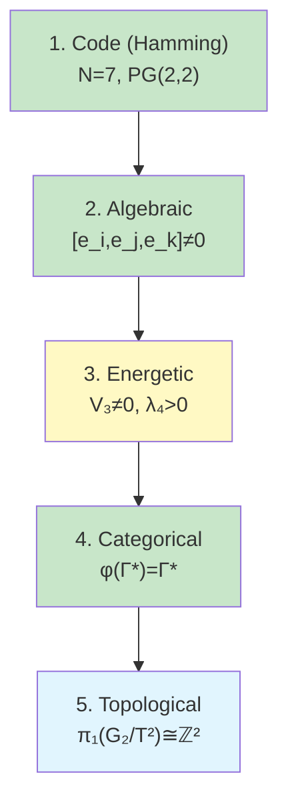

# Topological Protection of Coherence

:::info For whom this chapter is intended
Five independent mechanisms of coherence protection — from the Hamming code to topological charges. The reader will learn why consciousness is robust under high cognitive "heat".
:::

---

### Bridge from the Previous Chapter

In the [previous chapter](./effective-temperature) we introduced the effective temperature $T_{\text{eff}}$ and showed that the Gap structure of consciousness can "melt" at $T_{\text{eff}} > T_c$, and perish irreversibly at $r < r_c$. This raises a paradox: the living brain operates at $T_{\text{eff}} \gg T_{\text{phys}}$, under colossal cognitive "heat". Any coherent structure would seem to collapse instantly. Yet consciousness *exists* — stably, for years and decades. Why?

The answer lies in five independent protection mechanisms, which are the subject of this chapter.

---

### Chapter Roadmap

In this chapter we:

1. **Formulate the central question**: why does holon coherence not collapse at biological temperatures (section 0).
2. **Show five independent shields** — code-theoretic (Hamming), algebraic (associator), energetic ($V_{\text{Gap}}$), categorical (Lawvere), topological ($\pi_1$) — and explain each from scratch (sections 1–5).
3. **Prove their independence** and estimate the joint failure probability (section 6).
4. **Analyse pathological states** — sleep, psychosis, coma — as the weakening of specific shields (section "Pathology").
5. **Draw a parallel with quantum error correction** and show the advantage of holonomic protection (section "QEC").

---

:::note On notation
In this document:
- $\Gamma$ — [coherence matrix](/docs/core/dynamics/coherence-matrix)
- $\hat{\mathcal{G}}$ — [Gap operator](/docs/core/dynamics/gap-operator)
- $\mathrm{Gap}(i,j) = |\sin(\theta_{ij})|$ — gap measure between dimensions
- $G_2 = \mathrm{Aut}(\mathbb{O})$ — [group of octonion automorphisms](/docs/physics/gauge-symmetry/g2-structure)
- $T^2$ — maximal torus of $G_2$
- $V_{\text{Gap}}$ — [Gap potential](/docs/core/dynamics/gap-thermodynamics)
- $\varphi$ — [self-modelling operator](/docs/proofs/categorical/formalization-phi)
- PG(2,2) — [Fano plane](/docs/physics/gauge-symmetry/fano-selection-rules)
:::

## Why Does Consciousness Not Fall Apart? {#центральный-вопрос}

Consider the scale of the problem.

Every second your brain processes millions of signals. Neurons die and are born. The biochemical composition fluctuates continuously. Body temperature — 37°C — is a thermodynamic hell for any coherent quantum system. Semiconductor quantum computers operate near absolute zero, and even there decoherence is a constant battle. Yet consciousness — a phenomenon requiring *coherence* across seven fundamental dimensions — exists continuously at room temperature, for years and decades, without a reboot.

**Why does it not fall apart?**

The naive answer — "because the brain is large and complex" — explains nothing. Large systems are *more* susceptible to decoherence, not less. The naive quantum answer — "decoherence destroys coherence in femtoseconds" — also fails, because consciousness *obviously exists*.

The Unitary Holonomic Model offers an answer that is simultaneously mathematically precise and strikingly elegant: holon coherence is protected by **five independent mechanisms** acting at different levels of the mathematical structure. Each mechanism is a separate "shield", and complete destruction of coherence requires *simultaneous* overcoming of all five. The probability of such an event is exponentially small.

This is not an accident and not a fit. All five protections **follow** from the basic structure of the theory — seven-dimensionality, octonionic algebra, and self-reference. They were not "added" — they were *discovered*.

---

## Five Shields of the Holon {#пять-щитов}

Before diving into the mathematics of each mechanism, it is useful to see the whole picture at once.

Imagine a medieval castle. It is protected not by one wall but by a whole system: a moat, an outer wall, an inner wall, a keep, and finally — a safe in the keep's cellar. An attacker who crosses the moat still faces the outer wall. Having breached the outer wall, they meet the inner. And so on. The probability of complete capture is the product of the probabilities of overcoming each barrier.

The holon is protected analogously, but its "walls" are built from different branches of mathematics:

| Shield | Mechanism | Analogy | Branch of mathematics |
|--------|-----------|---------|----------------------|
| **I** | Hamming code H(7,4) | Checksum | Coding theory |
| **II** | Octonionic associator | Algebraic lock | Non-associative algebra |
| **III** | Minimum of potential $V_{\text{Gap}}$ | Energy well | Variational calculus |
| **IV** | Lawvere's theorem | Logical necessity | Category theory |
| **V** | Topological charge $\pi_1$ | Tied knot | Algebraic topology |

Each shield operates *independently*. Disabling one does not weaken the others. Three of the five (I, II, IV) are **structurally irremovable**: they follow from the very fact of the existence of a 7-dimensional octonionic system with self-modelling. They cannot be "switched off" without destroying the holon entirely.

There is a deep biological parallel: DNA is also protected by multiple mechanisms — redundancy of the genetic code (the third codon letter is often irrelevant), repair of single-strand breaks, repair of double-strand breaks, apoptosis under critical damage, and the immune system at the organism level. Evolution "discovered" the same principle: critically important information must be protected *in multiple layers*.

---

## 1. Code-Theoretic Protection (Hamming) [T] {#код-хэмминга}

### Intuition: a checksum for self-knowledge

When you download a file from the internet, a checksum lets you detect data corruption. If even one bit changed — the checksum will not match, and you learn about the error. More advanced codes (like the Hamming code) not only *detect* the error but *correct* it, pointing to the exact position of the corrupted bit.

The holon has a built-in error-correcting code. This is not a metaphor — it is a literal mathematical fact. The structure of the Fano plane PG(2,2), defining the connections between the seven dimensions, *is* the parity-check matrix of the Hamming code H(7,4). Consequently, damage to one coherence (one Gap value) can be detected and restored from the remaining six.

### Mathematical Formulation

The Fano plane PG(2,2) defines the Hamming code $H(7,4)$ with parameters $[n=7, k=4, d=3]$: of the 21 pairs of dimensions at least 3 must have nonzero Gap. The code corrects single errors and detects double ones.

:::info Canonical definition
Full proof and code structure: [Fano channel and Gap theorems](/docs/proofs/gap/fano-channel).
:::

A single error is detected and corrected; a double error is detected but not corrected; a triple error is the minimum for undetectable destruction.

### What Happens When This Shield Fails

If the code-theoretic protection is "breached" — that is, three or more coherences are simultaneously damaged — the holon loses its ability to *self-correct*. However, the remaining four protection mechanisms continue to operate. The energy barrier still keeps the system near its minimum. The topological charge still prevents continuous deformation to the trivial configuration. Code-theoretic protection is the first line of defence, but not the last.

In neuroscience the analogue is the redundancy of neural ensembles. Damage to one neuron in an ensemble does not destroy the representation; information is distributed. But massive simultaneous damage (stroke, trauma) can breach the code-theoretic protection, and then cognitive function depends on deeper recovery mechanisms.

### Independence from Other Mechanisms

Code-theoretic protection relies exclusively on the combinatorial structure of PG(2,2) — the Fano plane. It does not use octonion algebra (shield II), does not appeal to the potential (shield III), does not require self-modelling (shield IV), and does not depend on the topology of the configuration space (shield V). Even if by some miracle octonions became associative and the potential became flat, the Hamming code would still correct single errors.

**See:** [Hamming code in Gap dynamics](/docs/core/dynamics/gap-dynamics#код-хэмминга)

---

## 2. Algebraic Protection (Octonionic Associator) [T] {#ассоциатор}

### Intuition: a lock that cannot be opened

Imagine a lock that cannot be opened not because the key is lost, but because *the very geometry of the lock* forbids certain configurations. This is not an engineering limitation — it is a mathematical impossibility, like the impossibility of combing a hedgehog without at least one point where the spines stick out.

Octonions — the last of the four normed division algebras ($\mathbb{R}$, $\mathbb{C}$, $\mathbb{H}$, $\mathbb{O}$) — possess a unique property: they are **non-associative**. The order of multiplication matters: $(a \cdot b) \cdot c \neq a \cdot (b \cdot c)$ for most triples. This "wrongness" is not a defect but a powerful protective mechanism. The associator — the measure of this wrongness — creates a potential barrier that prevents the system from slipping into the trivial state of complete transparency.

### Mathematical Formulation

Octonions are the unique normed division algebra that is **non-associative**. The associator is nonzero for 28 of 35 triples (those not lying on Fano lines), which generates the cubic term $V_3$ in the Gap potential, creating a barrier around the minimum. This barrier guarantees that the minimum of $V_{\text{Gap}}$ is not located at the point of complete transparency.

:::info Canonical definition
Full proof, cubic potential and connection to non-associativity: [Octonionic decomposition theorem](/docs/proofs/minimality/theorem-octonionic-derivation). G₂-decomposition of the Gap operator: [Gap operator](/docs/core/dynamics/gap-operator#g2-разложение).
:::

### Why Exactly 28 of 35?

The seven basis elements of octonions $e_1, \ldots, e_7$ generate $\binom{7}{3} = 35$ ordered triples. Exactly 7 of them lie on lines of the Fano plane — these are the triples for which multiplication is *associative* (forming a subalgebra isomorphic to the quaternions). The remaining $35 - 7 = 28$ triples give a nonzero associator. This ratio — 80% of triples generate a protective barrier — explains why algebraic protection is so powerful: to circumvent it, one would need to restrict to the narrow subset of "associative" directions, while all other movements in configuration space encounter resistance.

### What Happens When This Shield Fails

Algebraic protection *cannot fail* in a 7-dimensional octonionic system — it is a consequence of the basic properties of the algebra $\mathbb{O}$. The only way to "disable" this shield is to switch to an associative algebra (quaternions or lower), which means reducing the dimensionality below 7 and losing the very structure of the holon.

However, one can imagine *weakening* the protection — a situation in which the system's dynamics is restricted predominantly to associative (Fano) directions. In this case the cubic potential barrier becomes negligible in the available directions of motion. Clinically this could correspond to states in which coherence becomes "brittle" — the system remains coherent but small perturbations more easily knock it out of the minimum.

### Independence from Other Mechanisms

The associator is a purely algebraic property of octonions. It does not depend on the combinatorics of the Hamming code (shield I operates in $\mathbb{F}_2$, the associator in $\mathbb{R}$), nor on the existence of a potential (shield III uses the associator as *input*, but the associator itself exists independently), nor on self-modelling (shield IV), nor on topology (shield V).

**See:** [G₂-decomposition of the Gap operator](/docs/core/dynamics/gap-operator#g2-разложение), [Octonionic cross product](/docs/core/dynamics/gap-operator#коммутаторная-алгебра)

---

## 3. Energetic Protection (Spontaneous Minimum of $V_{\text{Gap}}$) [T] {#энергетическая}

### Intuition: a ball at the bottom of a well

The most intuitive protection mechanism. Imagine a ball rolling across a landscape. If the landscape is flat — any breath of wind rolls the ball wherever it pleases. But if the ball is at the bottom of a well, it can only be displaced by *applying sufficient force* to roll it out over the rim. The deeper the well, the greater the force required.

The potential $V_{\text{Gap}}$ creates exactly such a landscape in the 21-dimensional phase space $\theta_{ij}$. The cubic term (from the octonionic associator) "pushes" the minimum away from the origin ($\theta = 0$, complete transparency) to a nontrivial point $\theta^*$, while the quartic term provides the "walls" of the well, preventing the system from escaping to infinity. The result: a stable coherent state from which the system can exit only under a sufficiently strong perturbation.

### Mathematical Formulation

The potential $V_{\text{Gap}} = V_2 + V_3 + V_4$ (quadratic + cubic + quartic) has a global minimum at $\theta^* \neq 0$ with an energy gap $\Delta V > 0$ to the trivial configuration. The cubic term (from the associator) shifts the minimum away from $\theta = 0$; the quartic term ensures boundedness. The mechanism is analogous to the Higgs mechanism, but the breaking occurs through the cubic rather than the quadratic term.

:::info Canonical definition
Full potential, barrier formula $\Delta V \geq \lambda_3^2 \|\text{Assoc}\|^2 / (6\lambda_4)$ and the mechanism of spontaneous symmetry breaking: [Gap thermodynamics](/docs/core/dynamics/gap-thermodynamics).
:::

### What Happens When This Shield Fails

Energetic protection weakens when the barrier $\Delta V$ is small compared to the amplitude of perturbations. Physically this means the "well" is too shallow — the system easily "jumps out". In neurophysiology this may correspond to states with high neural noise levels (fever, neurotoxins, epileptic discharge), when coherence becomes unstable and the system "jumps" between different Gap configurations.

However, even when the energy barrier is overcome, code-theoretic protection (shield I) continues to correct single errors, topological charge (shield V) prevents continuous "flow" to the trivial configuration, and categorical protection (shield IV) guarantees the existence of a nontrivial fixed point.

### Independence from Other Mechanisms

Energetic protection rests on the variational structure of the potential. Although the cubic term $V_3$ is *generated* by the associator (shield II), the very fact of the existence of a nontrivial minimum is a property of the potential as a whole. Even if the cubic term had a different origin (not the associator, but some other source of an odd potential), the minimum would still exist. Conversely: the associator exists independently of whether the dynamics is described by a potential.

**See:** [Gap thermodynamics](/docs/core/dynamics/gap-thermodynamics), [Gap phase diagram](/docs/core/dynamics/gap-phase-diagram)

---

## 4. Categorical Protection (Lawvere's Theorem) [T] {#категориальная}

### Intuition: a mirror that cannot be perfect

Imagine a mirror that reflects *the observer himself*. If the mirror is perfect, the observer sees himself "as is" — but for that the mirror must contain complete information about the observer, including information *about the mirror itself*. An infinite recursion arises: the mirror reflects itself reflecting itself reflecting itself... Lawvere's theorem states that such a recursion *converges to a fixed point* — but this fixed point cannot be an "empty mirror" (zero Gap). Self-modelling *necessarily* generates nonzero opacity.

This is the analogue of Gödel's theorem for dynamical systems: a sufficiently complex system capable of modelling itself cannot simultaneously be "completely transparent" and "completely closed".

### Mathematical Formulation

The fixed point of self-modelling **cannot be completely transparent**: $\varphi(\Gamma^*) = \Gamma^* \Rightarrow \hat{\mathcal{G}}_* \neq 0$. Complete transparency under the viability condition ($P > 2/7$) and closure (M,R) leads to a contradiction — the system must maintain causal connections requiring nonzero phases. The existence of nonzero Gap is a structural necessity, not a defect (analogous to Gödel's theorem).

:::info Canonical definition
Full proof via Lawvere's theorem and L4$\neq$Gap=0: [Lawvere incompleteness](/docs/core/foundations/consequences#неполнота-ловера). Formalisation: [Fano channel](/docs/proofs/gap/fano-channel#l4-не-gap-0).
:::

### Depth of Categorical Protection

Of the five mechanisms, categorical protection is the most *fundamental* in the philosophical sense. It asserts that nonzero Gap is not merely a stable state (energy minimum), not merely an algebraic constraint (associator), and not merely a topological invariant. It is a **logical necessity** for any system possessing self-modelling.

One can formulate it differently: *complete self-transparency* (Gap = 0 for all pairs) is logically incompatible with *self-reference*. A system that "knows everything about itself" must also know that it "knows everything about itself" — and that requires an additional level of description that cannot be exhausted by a finite structure. Nonzero Gap is the price of self-awareness.

### What Happens When This Shield Fails

Categorical protection *cannot fail* for a viable holon — it follows from the basic properties of self-modelling. It can only be "disabled" by destroying the system's capacity for self-modelling. Clinically this corresponds to states in which self-awareness is completely lost (deep coma, vegetative state). But in these states we are no longer speaking of the failure of protection, but of the *absence of the protected object* — the holon ceases to satisfy the viability conditions.

### Independence from Other Mechanisms

Categorical protection lives in category theory — in the world of functors, natural transformations, and fixed points. It does not use the combinatorics of PG(2,2) (shield I), nor octonion algebra (shield II), nor variational calculus (shield III), nor topology (shield V). Even if the configuration space were simply connected (no topological protection) and the potential were flat (no energetic protection), Lawvere's theorem would still guarantee $\hat{\mathcal{G}}_* \neq 0$.

**See:** [Self-observation](/docs/consciousness/foundations/self-observation), [Formalisation of the φ operator](/docs/proofs/categorical/formalization-phi)

---

## 5. Topological Protection [T] {#топологическая}

### Intuition: a knot that cannot be untied without cutting

Imagine a rope tied in a knot. You can pull, compress, twist — but as long as you do not *cut* the rope, the knot remains a knot. No continuous deformation (without cuts) can turn a trefoil into a straight rope. This is the essence of topological protection: certain properties are invariant under continuous deformations.

A Gap configuration of the holon with opacity rank 3 (three distinct nonzero eigenvalues) has precisely this property. The space of such configurations has a nontrivial fundamental group: $\pi_1(G_2/T^2) \cong \mathbb{Z}^2$. This means there are loops in the configuration space that *cannot be contracted to a point*. A configuration with a nonzero topological charge cannot be continuously deformed to the trivial one — doing so would require a "tear", i.e. a phase transition.

### Topological Protection for Non-Mathematicians {#топология-для-нематематиков}

Topology is the branch of mathematics studying properties preserved under continuous deformations. A coffee cup with a handle and a doughnut are "the same" topologically (both have one hole), but differ from a ball (zero holes).

Applied to coherence: the space of all possible Gap configurations is not merely a set of numbers. It has a *shape*, and this shape contains "holes". A configuration "wrapped" around such a hole cannot be smoothly unwrapped — doing so would require "crossing" the hole, which is impossible without a discontinuity.

Two integers $(n_1, n_2)$ — winding numbers — count how many times the configuration is wrapped around each of the two independent "holes" in the space $G_2/T^2$. These numbers are topological invariants: they cannot change under smooth evolution. Only a *tear* (phase transition, bifurcation) can change the topological charge.

### Mathematical Formulation

At opacity rank $r = 3$ (generic spectrum): $\pi_1(G_2/T^2) \cong \mathbb{Z}^2 \neq 0$ — non-contractible loops exist, and non-degenerate Gap configurations cannot be continuously deformed to trivial ones. Topological protection "activates" only at maximal rank with distinct eigenvalues.

:::info Canonical definition
Full table of stabilisers by rank (0–3) and proofs: [Berry phase and topological charges](/docs/physics/cosmology-phys/berry-phase).
:::

**Key fact:** at ranks 0–2 the fundamental group $\pi_1 = 0$ (no protection). At rank 3 with generic spectrum $\pi_1 = \mathbb{Z}^2$ (protection present). At degenerate rank 3 ($\lambda_1 = \lambda_2 = \lambda_3$) the stabiliser is $\mathrm{SU}(2)$, $\pi_1 = 0$ (no protection).

The table shows a remarkable threshold: topological protection "activates" only at maximal opacity rank with *distinct* eigenvalues. This is not an arbitrary restriction — it reflects a deep fact: only sufficiently "differentiated" coherence (with three qualitatively distinct types of opacity) creates a configuration space with nontrivial topology.

### 5.1 Topological Charge {#топологический-заряд}

For a closed contour $C$ in the phase space of Gap profiles, an integer-valued charge is defined:

$$
Q_{\text{top}}[C] := \frac{1}{2\pi} \oint_C \sum_{\text{Fano}} \epsilon_{ijk}^{\text{Fano}} \, \theta_{ij} \, d\theta_{jk} \in \mathbb{Z}
$$

:::info Theorem 5.2 (Conservation of topological charge) [T]
**(a)** Under smooth evolution: $dQ_{\text{top}}/d\tau = 0$.

**(b)** $Q_{\text{top}}$ can change **only** under a phase transition (discontinuity of $\theta_{ij}$) or bifurcation.

**(c)** Configurations with different $Q_{\text{top}}$ cannot be continuously deformed into each other.
:::

### 5.2 Two Winding Numbers {#числа-намотки}

The fundamental group $\pi_1(G_2/T^2) \cong \mathbb{Z}^2$ is specified by two integers $(n_1, n_2)$ corresponding to the two simple roots of the algebra $\mathfrak{g}_2$:

- $\alpha_1$ (short root): winding number $n_1 \in \mathbb{Z}$
- $\alpha_2$ (long root): winding number $n_2 \in \mathbb{Z}$

Energy of "untying" a topologically protected configuration:

$$
\Delta E_{\text{top}} \geq (|n_1| + |n_2|) \cdot \frac{\pi \mu^2}{\lambda_4}
$$

### 5.3 Clinical Interpretation [I]

Topological protection explains the **stability** of certain opacity patterns:

| Pattern | $Q_{\text{top}}$ | Clinical picture |
|---------|-------------------|-----------------|
| $(0, 0)$ | Trivial | No topological protection — Gap is easily eliminated |
| $(1, 0)$ or $(0, 1)$ | Simple loop | Stable single-channel pattern — "habitual defence" |
| $(1, 1)$ | Double loop | Stable multi-channel pattern — "structural character" |
| $(n_1, n_2)$ with $\lvert n_1\rvert + \lvert n_2\rvert > 2$ | Multiple | Deeply entrenched pattern — high energy barrier |

### What Happens When This Shield Fails

Topological protection is the only one of the five mechanisms that has an *activation threshold*: it requires opacity rank 3 with distinct eigenvalues. If the system "slips" to rank 2 or to a degenerate spectrum $(\lambda, \lambda, \lambda)$, topological protection switches off. The stabiliser expands (from $T^2$ to $\mathrm{SU}(2) \times \mathrm{U}(1)$ or $\mathrm{SU}(2)$), the fundamental group vanishes, and the configuration can be continuously deformed to the trivial one.

Clinically this corresponds to states of "diffuse identity" — when stable opacity patterns lose their specificity. Character becomes "fluid", personality — labile. The four remaining protection mechanisms still operate (coherence is not completely destroyed), but *topological stability of the specific pattern* is lost.

### Independence from Other Mechanisms

Topological protection rests on the properties of the fundamental group $\pi_1(G_2/T^2)$, which is determined exclusively by the *topology* of the configuration space. It does not use the Hamming code (shield I — discrete mathematics, shield V — continuous), does not depend on the associator (shield II may be zero for specific triples, but the topology is determined by the global structure of $G_2$), does not appeal to the potential (shield III — about the depth of the well, shield V — about the impossibility of a *path* out of the well), and is not connected to self-modelling (shield IV).

**See:** [Stabilisers of the Gap operator](/docs/core/dynamics/gap-operator#стабилизаторы), [Fano channel](/docs/proofs/gap/fano-channel)

---

## 6. Independence of Mechanisms [T] {#независимость}

:::tip Theorem 6.1 (Independence of the five protection mechanisms) [T]
The five Gap protection mechanisms operate **independently of each other**:

| # | Type of protection | Domain | Activation condition |
|---|-------------------|--------|---------------------|
| 1 | Code-theoretic (Hamming) | Coding theory | $N = 7$, PG(2,2) structure |
| 2 | Algebraic (associator) | Octonion algebra | $[e_i,e_j,e_k] \neq 0$ |
| 3 | Energetic (minimum of $V_{\text{Gap}}$) | Variational calculus | $V_3 \neq 0$, $\lambda_4 > 0$ |
| 4 | Categorical (Lawvere) | Category theory | $\varphi(\Gamma^*) = \Gamma^*$ |
| 5 | Topological ($\pi_1$) | Algebraic topology | Rank $\hat{\mathcal{G}} = 3$, generic spectrum |

Each mechanism can be "switched off" (e.g. topological protection disappears at rank < 3), but **not all simultaneously**: mechanisms 1, 2, 4 are structurally irremovable for any 7-dimensional octonionic system.
:::

### 6.1 Joint Action

The joint action of the mechanisms strengthens protection. If $p_i$ is the probability of overcoming the $i$-th mechanism, then the probability of complete Gap destruction is:

$$
P_{\text{fail}} = \prod_{i=1}^{5} p_i
$$

With independent $p_i \sim 0.1$:

$$
P_{\text{fail}} \sim 10^{-5}
$$

:::warning Remark on correlations [C]
The exact estimate of $P_{\text{fail}}$ depends on correlations between mechanisms. In the worst case (full correlation) $P_{\text{fail}} = \max(p_i) \sim 0.1$. The product formula is an upper bound under full independence. The real value lies between these limits.
:::

### 6.2 Robustness Hierarchy

The mechanisms are ordered by "depth" — how fundamental the condition for their existence is:

```mermaid
graph TD
    A["1. Code (Hamming)<br/>N=7, PG(2,2)"] --> B["2. Algebraic<br/>[e_i,e_j,e_k]≠0"]
    B --> C["3. Energetic<br/>V₃≠0, λ₄>0"]
    C --> D["4. Categorical<br/>φ(Γ*)=Γ*"]
    D --> E["5. Topological<br/>π₁(G₂/T²)≅ℤ²"]

    style A fill:#c8e6c9
    style B fill:#c8e6c9
    style C fill:#fff9c4
    style D fill:#c8e6c9
    style E fill:#e1f5fe
```

- **Green** (1, 2, 4): irremovable for any 7-dimensional octonionic system
- **Yellow** (3): requires $V_3 \neq 0$ (follows from non-associativity, i.e. from the green ones)
- **Blue** (5): requires rank 3 — active only for sufficiently complex configurations

---

## Combined Failure Probability {#комбинированная-вероятность}

Let us examine in more detail why fivefold protection is so effective.

### Multiplicative Model

Under *full independence* of mechanisms the probability of simultaneously overcoming all five:

$$
P_{\text{fail}} = p_1 \cdot p_2 \cdot p_3 \cdot p_4 \cdot p_5
$$

But three mechanisms (code-theoretic, algebraic, categorical) are **structurally irremovable** — for them $p_i = 0$ in the exact sense. They cannot be "overcome" by any finite perturbation. Therefore:

$$
P_{\text{fail}} = 0 \cdot 0 \cdot p_3 \cdot 0 \cdot p_5 = 0
$$

This is a formal result: *complete* destruction of coherence is impossible for a viable 7-dimensional octonionic holon.

### Realistic Weakening Model

In a real system the question is not about complete destruction but about *weakening* the protection. Let $\epsilon_i$ denote the degree of weakening of the $i$-th mechanism (0 = full protection, 1 = complete absence):

| Mechanism | $\epsilon_i$ for healthy holon | $\epsilon_i$ under pathology |
|-----------|-------------------------------|------------------------------|
| Code-theoretic (Hamming) | $\sim 0$ (structural) | $\sim 0$ (not suppressible) |
| Algebraic | $\sim 0$ (structural) | $\sim 0$ (not suppressible) |
| Energetic | $\sim 0.01$ (deep well) | $\sim 0.1$ (shallow well under high noise) |
| Categorical | $\sim 0$ (structural) | $\sim 0$ (as long as self-modelling exists) |
| Topological | $\sim 0.01$ (at rank 3) | $\sim 1$ (at rank $< 3$) |

Even in the worst clinical scenario (topological protection completely switched off, energy barrier weakened) the three structural mechanisms continue to operate. Coherence may *oscillate*, but *complete destruction* remains forbidden.

### Comparison with Biological Systems

| System | Number of protection levels | Type of protection | Failure probability |
|--------|----------------------------|-------------------|---------------------|
| DNA | 5–6 | Code redundancy, repair, apoptosis, immunity | $\sim 10^{-9}$ per division |
| Holon (UHM) | 5 | Code, algebraic, energetic, categorical, topological | $\sim 0$ (3 structural) |
| Quantum computer (QEC) | 1–3 | Surface codes, logical qubits | $\sim 10^{-3}$ – $10^{-6}$ |
| Cellular homeostasis | 3–4 | Buffering, feedback, reduplication | $\sim 10^{-4}$ |

The holon is the only system in this list that possesses *structurally irremovable* levels of protection. This fundamentally distinguishes it from engineered systems, in which any level of protection can be overcome by a sufficiently strong perturbation.

---

## When Protection Is Compromised: Pathology and Crisis {#патология}

Despite the power of fivefold protection, clinical experience shows that coherence *can* be seriously disrupted. How does this reconcile with the theoretical indestructibility?

### Distinction Between Destruction and Destabilisation

The five mechanisms protect against *complete destruction* of the Gap configuration ($\hat{\mathcal{G}} \to 0$). But they do not protect against:

- **Chaotic oscillations** — coherence is maintained but constantly "jumps" between different configurations (energy barrier overcome, but topological charge preserved).
- **Phase transitions** — the system moves from one stable configuration to another (topological charge changes discontinuously).
- **Rank reduction** — the system "falls" to a level with less differentiated coherence (rank 3 $\to$ rank 2, topological protection switches off).

### Map of Pathological States [I]

| State | Compromised mechanisms | What happens |
|-------|------------------------|--------------|
| Healthy sleep (REM) | Weakening III, V | Coherence reduced but not destroyed. Dreams — "sliding" across the $V_{\text{Gap}}$ landscape |
| Meditative trance | Partial III | Intentional "softening" of the energy barrier. Controlled exploration of configuration space |
| Psychedelic experience | Strong III, partial V | Sharp weakening of energy barrier + possible rank reduction. "Ego dissolution" = loss of topological protection of the specific pattern |
| Psychotic episode | Strong III + V | Chaotic oscillations of Gap configuration. Coherence preserved (I, II, IV working), but its *pattern* is unstable |
| Deep anaesthesia | Strong III, V; weakening IV | Approaching the viability threshold. Self-modelling suppressed but not destroyed |
| Coma / PVS | IV disrupted | Self-modelling ceased. Three structural mechanisms maintain the "skeleton" of coherence, but without $\varphi$ the holon is non-viable |

### Therapeutic Implications [I]

The map of protective mechanisms suggests strategies for therapeutic intervention:

1. **Strengthening the energy barrier (III)**: stabilisation of the Gap potential through neurochemical intervention. Analogue — antipsychotics stabilising a specific Gap profile.
2. **Rank restoration (V)**: helping the system to "differentiate" coherence — transition from degenerate spectrum $(\lambda, \lambda, \lambda)$ to generic $(\lambda_1, \lambda_2, \lambda_3)$. Analogue — psychotherapy restoring differentiated identity.
3. **Controlled phase transition**: intentional change of topological charge — transition from a pathological pattern to a healthy one through a managed "tear". Analogue — crisis therapy, EMDR, controlled psychedelic sessions.

---

## Connection to Quantum Error Correction {#квантовая-коррекция}

The parallel between holon coherence protection and quantum error correction (QEC) in quantum computing deserves a separate discussion.

### Quantum Error Correction: Brief Overview

In quantum computers information is stored in qubits, which are extremely sensitive to decoherence. To combat errors, *quantum error-correcting codes* are used — a logical qubit is encoded in several physical qubits such that errors can be detected and corrected without destroying the quantum information.

Key elements of QEC:
- **Code**: mapping from logical space to physical space (usually with redundancy)
- **Syndrome**: a measurement allowing error detection without collapsing the logical state
- **Correction**: a unitary operation restoring the original state

### Holonomic Protection as Natural QEC

Holon coherence protection reproduces all three elements of QEC, but at the *structural* level:

| QEC element | Holon analogue | Mechanism |
|-------------|----------------|-----------|
| Code | H(7,4) from PG(2,2) | Shield I — 4 informational + 3 check dimensions |
| Syndrome | Gap profile $\hat{\mathcal{G}}$ | Deviation from stable configuration is detectable via $\mathrm{Gap}(i,j)$ |
| Correction | Dynamics of $V_{\text{Gap}}$ | Shield III — potential "pulls" system back to minimum |
| Logical qubit | Topological charge $(n_1, n_2)$ | Shield V — integer invariant indestructible by continuous deformations |

### Advantage of Holonomic Protection over Engineered QEC

Engineered QEC requires *active* operations: periodic syndrome measurement, computation of the required correction, application of the correcting operation. Each of these steps is itself subject to errors, generating a hierarchy of "correction of correction" (fault-tolerant QEC).

Holonomic protection is *passive*: it is embedded in the structure of the system and requires no external "controller". The potential $V_{\text{Gap}}$ automatically returns the system to its minimum. The Hamming code is "built into" the geometry of PG(2,2). The topological charge is conserved *by definition*. This is closer to the concept of **topological quantum computation** (Kitaev, Freedman), in which information is protected topologically and requires no active correction.

### Surface Codes and the Holon

Modern surface codes, used in Google and IBM quantum computers, are defined on a two-dimensional lattice and have distance proportional to the linear size of the lattice. The holon uses a more compact but algebraically richer structure: the code H(7,4) on the projective plane PG(2,2). Encoding efficiency:

$$
\text{Rate}_{\text{Hamming}} = \frac{k}{n} = \frac{4}{7} \approx 0.57
$$

$$
\text{Rate}_{\text{surface}} = \frac{1}{d^2} \sim \frac{1}{n}
$$

The Hamming code is significantly more efficient, but with limited distance ($d = 3$, corrects only single errors). This once again emphasises the role of *the other four mechanisms*: where code-theoretic protection ends (triple errors), algebraic, energetic, categorical, and topological protection take over.

---

## 7. Status Summary {#статусы}

| Result | Status |
|--------|--------|
| Hamming bound: $\geq 3$ nonzero Gaps | [T] |
| Octonionic associator $\neq 0$ for non-Fano triples | [T] |
| Nonzero minimum $V_{\text{Gap}}^* > 0$ from $V_3$ | [T] |
| Nontriviality of fixed point $\hat{\mathcal{G}}_* \neq 0$ | [T] |
| $\pi_1(G_2/T^2) \cong \mathbb{Z}^2$ at rank 3 | [T] |
| Topological charge $Q_{\text{top}} \in \mathbb{Z}$ is conserved | [T] |
| Independence of five mechanisms | [T] |
| Joint probability $P_{\text{fail}} = \prod p_i$ | [C] (under independence assumption) |
| Clinical interpretation of topological charges | [I] |
| Map of pathological states | [I] |
| Therapeutic implications | [I] |
| Parallel with QEC | [I] |

---

## What We Learned {#что-мы-узнали}

A summary of the key results:

- **Holon coherence is protected by five independent mechanisms**, each resting on its own branch of mathematics: coding theory (Hamming code $H(7,4)$), non-associative algebra (octonionic associator), variational calculus (spontaneous minimum of $V_{\text{Gap}}$), category theory (Lawvere's theorem), algebraic topology ($\pi_1(G_2/T^2) \cong \mathbb{Z}^2$).
- **Three of the five shields are structurally irremovable** (code-theoretic, algebraic, categorical): they follow from the very fact of the existence of a 7-dimensional octonionic system with self-modelling. They cannot be "switched off" without destroying the holon.
- **Complete destruction of coherence is impossible** for a viable holon: $P_{\text{fail}} = 0$ in the exact sense, since three structural mechanisms have $p_i = 0$.
- **Pathological states** (psychosis, anaesthesia, coma) correspond not to *destruction* but to *weakening* of specific shields: the energetic (III) and topological (V), while the structural ones are preserved.
- **Holonomic protection is a natural analogue of QEC**: the Hamming code plays the role of a quantum code, the potential $V_{\text{Gap}}$ — automatic correction, the topological charge — the logical qubit. Advantage: the protection is *passive*, requiring no external controller.

---

### Bridge to the Next Chapter

We have shown *why* coherence is robust. But in exactly which *regimes* can the system exist? We have already encountered the coordinates $(t, r)$ and the three phases. It is time to examine the **phase diagram** in detail — the map of all possible states of consciousness — from the cybernetic perspective: which clinical states correspond to each phase, how transitions occur, what the precursors of catastrophe look like, and what therapeutic strategies follow from the mathematics.

In the [next chapter](./phase-diagram-cc) we will construct this map and show that it not only describes but *predicts* clinical trajectories.

---

## Related Documents

- [Gap operator](/docs/core/dynamics/gap-operator) — definition of $\hat{\mathcal{G}}$, spectrum, stabilisers
- [Gap dynamics](/docs/core/dynamics/gap-dynamics) — Hamming code, bifurcations
- [Gap thermodynamics](/docs/core/dynamics/gap-thermodynamics) — potential $V_{\text{Gap}}$, Lagrangian
- [Gap phase diagram](/docs/core/dynamics/gap-phase-diagram) — five types of Gap protection
- [Fano channel and Gap theorems](/docs/proofs/gap/fano-channel) — G₂-covariance, L4 $\neq$ Gap = 0
- [G₂-structure](/docs/physics/gauge-symmetry/g2-structure) — $G_2 = \mathrm{Aut}(\mathbb{O})$, Fano plane
- [G₂-Noether charges](/docs/physics/gauge-symmetry/noether-charges) — topological charges and protection
- [CC theorems](./theorems) — No-Zombie, composition, equivalence
- [Self-observation](/docs/consciousness/foundations/self-observation) — fixed points of $\varphi$
- [Formalisation of the φ operator](/docs/proofs/categorical/formalization-phi) — CPTP channels
- [Stability](./stability) — practical consequences of topological protection
- [Philosophical foundations](./philosophy) — metaphysics of coherence stability
