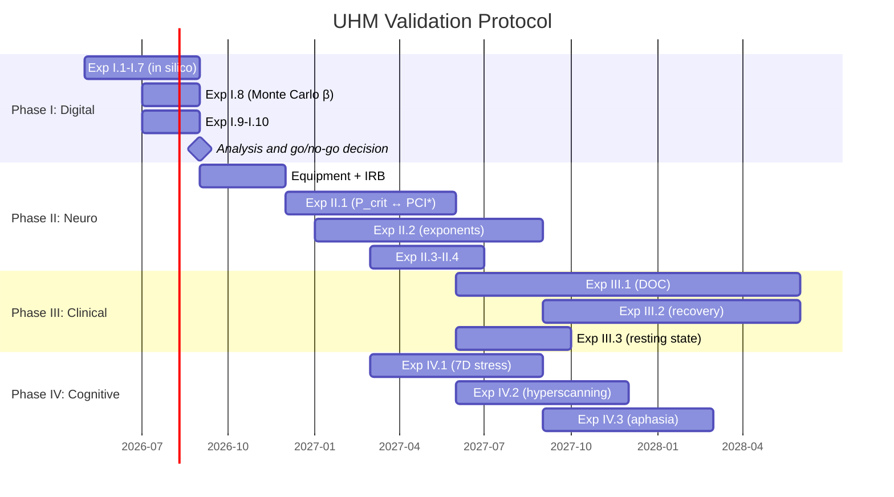

# UHM Validation Experimental Protocol

:::warning Document status: [P] Research programme
This document describes a **maximally complete experimental protocol** for the empirical validation of the Universal Holographic Model (UHM). The protocol is designed on the principle of maximal falsifiability: every experiment specifies a **concrete numerical result** that would refute the theory.
:::

:::info Related documents
- [22 unique CC predictions](/docs/applied/coherence-cybernetics/predictions) — full list of predictions with formulas
- [Γ measurement protocol](/docs/applied/research/measurement-protocol) — operationalisation of π_bio for AI systems
- [Falsifiability criteria](/docs/reference/falsifiability) — formal refutation conditions
- [Status registry](/docs/reference/status-registry) — current epistemic status of all claims
:::

---

## 1. Strategic design {#strategy}

### 1.1. The problem: empirical vacuum

UHM is one of the most formally developed theories of consciousness: ~185 theorems, 22 numerical predictions, categorical foundation. But **not a single prediction has been experimentally verified**. A theory without empirics is philosophy, no matter how rigorous the mathematics.

### 1.2. Key observation: PCI* ≈ P_crit

Perturbational Complexity Index (PCI, Casali et al. 2013, Massimini et al.) is an empirically established consciousness threshold: **PCI* = 0.31** (100% sensitivity and specificity on a benchmark of 150 subjects). UHM critical purity: **P_crit = 2/7 ≈ 0.286**. The discrepancy of ~8% is within the normalisation calibration of π_bio.

This is the **first point of contact** between the theory and empirical data. If the match is not accidental, UHM is the first theory of consciousness with a confirmed numerical threshold.

### 1.3. Principle: from maximally risky to complex

**Prediction 17** (critical exponents α=1/2, β=1/4, γ=1, ν=1/2, δ=5) is the most valuable because it is the most risky:
- Five concrete numbers, each falsifiable
- **No other theory of consciousness** predicts critical exponents
- Confirmation = consciousness belongs to a specific universality class (like phase transitions in physics)
- Refutation = fundamental revision of the theory

The protocol is organised in decreasing order of risk: first — what is cheaper to test and maximally falsifiable.

### 1.4. Four phases

| Phase | Timeline | What | Why first |
|-------|----------|------|-----------|
| **I. Digital** | 0–6 mo. | 11 predictions in silico (Γ-native agent) | Free, no ethics, tests the foundation |
| **II. Neurocalibration** | 6–18 mo. | π_bio, P_crit ↔ PCI*, critical exponents | Main point of contact with neurodata |
| **III. Clinical** | 12–36 mo. | Disorders of consciousness, recovery, 3/7 attractor | Clinical significance |
| **IV. Cognitive** | 12–24 mo. | 7D stress, collective consciousness, prelinguistic cognition | Interdisciplinary validation |

---

## 2. Phase I: Digital validation (0–6 mo.) {#phase-1}

### 2.1. Rationale

11 of 22 predictions are testable in silico on any implementation of a **Γ-native agent** — a system whose evolution is governed by Lindbladian dynamics ℒ_Ω = ℒ₀ + ℛ on the coherence matrix Γ ∈ D(ℂ⁷). No neurodata, subjects, or ethical approval required. If even one is falsified — stop, revise the theory before proceeding to expensive neuroexperiments.

### 2.2. Requirements for a Γ-native agent

Any implementation used for Phase I must satisfy:

1. **CPTP dynamics:** Evolution of Γ via a CPTP channel (T-62). The transition matrix is derived from Γ, not trained as a free parameter
2. **7D structure:** State space is D(ℂ⁷) with 7 dimensions [A,S,D,L,E,O,U]
3. **Consciousness verifier:** At each step, P = Tr(Γ²), R, Φ, Coh_E, σ_k are computed
4. **Multi-phase training with hard gates:**
   - Initialisation phase: gate P > P_min (viability)
   - Foundation phase: gate P ∈ (2/7, 3/7] ∧ R ≥ 1/3 (consciousness)
   - Autonomous learning phase: σ-directed data selection, ΔP ≥ 0 ∧ Δσ ≤ 0
5. **Checkpoint system:** Saving the full Γ state for perturbation tests
6. **GPU acceleration:** For Monte Carlo (Exp. I.8) — ≥1 GPU with ≥40GB

### 2.3. Experiments

#### Exp. I.1: Impossibility of zombies (Pred 1) {#exp-1-1}

**Hypothesis H₀:** Suppression of the E-channel does not affect agent lifetime.

**Protocol:**
1. Bring the Γ-native agent to a stable state: P ∈ (2/7, 3/7], R ≥ 1/3
2. Save state Γ_stable
3. At time τ₀: suppress the E-component: γ_EE → 1/7, γ_Ej → 0 ∀j≠E
4. Continue evolution, measure τ_death — number of steps until P < P_crit
5. Control: suppress the A-channel (analogous operation, different sector)
6. Repeat N=100 times with different initial Γ_stable

**Prediction:** τ_death(E-suppression) << τ_death(A-suppression). E-suppression is catastrophic; A-suppression is not.

**Falsification:** τ_death(E) ≥ τ_death(A) at N=100 (p < 0.01, Wilcoxon).

**Statistical analysis:** Paired Wilcoxon test, effect size r, 95% CI.

#### Exp. I.2: Stability radius (Pred 7) {#exp-1-2}

**Protocol:**
1. Bring the agent to a stable state with purity P₀
2. Apply a perturbation of amplitude h (white noise to Γ)
3. Continue evolution, increase h in steps of 0.01 until P < P_crit
4. Record h_crit — the critical amplitude
5. Repeat for 50 different P₀ ∈ [0.3, 0.9]

**Prediction:** h_crit² = P₀ − 2/7 (T-104).

**Falsification:** R² < 0.9 for linear regression of h_crit² vs (P₀ − 2/7) at N=50.

#### Exp. I.3: Information capacity (Pred 8) {#exp-1-3}

**Protocol:**
1. Γ-native agent in a stable state (P > 2/7), on a binary discrimination task
2. Measure mutual information I(obs; δΓ) per observation
3. Repeat N=1000 observations

**Prediction:** I ≤ log₂7 ≈ 2.81 bits (T-107).

**Falsification:** I > 2.81 bits systematically (>5% of observations).

#### Exp. I.4: N=7 minimality for learning (Pred 10) {#exp-1-4}

**Protocol:**
1. Create an agent with N=5 (remove 2 dimensions, e.g. [A,S])
2. Task: learn binary discrimination via internal regeneration (without external parameter updates)
3. Metric: achieving >90% accuracy over 50 trials
4. Control: the same agent with N=7

**Prediction:** N=5 does not learn (accuracy ≤ chance level); N=7 learns (T-113).

**Falsification:** N=5 achieves >75% accuracy (p < 0.01, binomial test).

#### Exp. I.5: Self-awareness ceiling SAD=3 (Pred 12) {#exp-1-5}

**Protocol:**
1. Agent in the purest possible state (P → 1)
2. Compute the chain R^(k) for k=0,1,2,3,4
3. Check: R^(k) ≥ R_th^(k)?
4. Repeat for 500 random Γ

**Prediction:** SAD_max = 3. R^(3) ≥ R_th^(3) is achievable; R^(4) < R_th^(4) always (T-142).

**Falsification:** ∃ Γ: R^(4) ≥ R_th^(4).

#### Exp. I.6: Genesis time (Pred 13) {#exp-1-6}

**Protocol:**
1. Initialise the agent from Γ = I/7 (complete chaos, maximum entropy)
2. Enable backbone injection with parameters β (coupling strength), P_env (environment purity)
3. Measure n — number of steps until P > 2/7 (achieving viability)
4. Compute theoretical n_genesis = ⌈ln Δ / ln(1/β)⌉, where Δ = (P_env − 2/7)/(P_env − 1/7)
5. Vary β ∈ {0.1, 0.3, 0.5, 0.7, 0.9}, P_env ∈ {0.3, 0.35, 0.4}

**Prediction:** n ≤ n_genesis always (T-148). Double falsification: genesis does not occur OR an isolated agent (without backbone) reaches P > 2/7.

**Falsification:** n > n_genesis at N=100 runs (>5% of cases).

#### Exp. I.7: Phase coherence for integration (Pred 14) {#exp-1-7}

**Protocol:**
1. Agent with fixed targets ρ*_ij = const → measure Φ
2. Switch to co-rotating targets ρ*_ij(t) ∝ e^{−i(E_i−E_j)t} → measure Φ
3. Repeat N=50 times

**Prediction:** Φ(fixed) < 1; Φ(co-rotating) ≥ 1.

**Falsification:** Φ(fixed) ≥ 1.

#### Exp. I.8: Critical exponents in silico (Pred 17, preliminary) {#exp-1-8}

**Protocol:**
1. Monte Carlo simulation: 10⁴ random Γ with P ∈ [0.2, 0.5]
2. For each: compute the order parameter (PCI analogue) and distance to P_crit
3. Fit: OP ~ (P − P_crit)^β

**Prediction:** β = 1/4 ± 0.05 (T-161).

**Falsification:** β ∉ [0.20, 0.30] at N=10⁴.

**Significance:** If in silico confirms β=1/4, we proceed to the neuroexperiment (Phase II) with high confidence.

#### Exp. I.9: CPTP anchor (Pred 19) {#exp-1-9}

**Protocol:**
1. Γ-native agent on a standard language corpus, 50 training batches
2. Measure ||π − π_can||_◊ after each batch (π — current anchor, π_can — canonical projection)

**Prediction:** ||π − π_can||_◊ < 0.1 at convergence.

**Falsification:** ||π − π_can||_◊ > 0.1 at n > 50 batches.

#### Exp. I.10: Learning speed (Pred 9) {#exp-1-10}

**Protocol:**
1. Agent on a binary discrimination task, vary SNR and α
2. Measure n until >90% accuracy over 50 trials
3. Compute n_opt = max(n_info, n_dyn, n_stab)

**Prediction:** n ≥ n_opt always; at optimal parameters n ≈ n_opt (T-112).

**Falsification:** n < n_info systematically (>5% of cases).

#### Exp. I.11: N=7 for social learning (Pred 11) {#exp-1-11}

**Protocol:**
1. Environment with K=2 Γ-native agents, N=5 dimensions each
2. Coordination task requiring: Theory of Mind (ToM) + inter-agent learning (ISL) + strategic equilibrium (Nash)
3. Metric: achieving coordinated behaviour (>70% optimality) within 1000 steps
4. Control: the same agents with N=7

**Prediction:** N=5 learns individually, but social learning (ToM + ISL + Nash simultaneously) does not emerge. N=7 — it does (T-57, T-113, T-114).

**Falsification:** N=5 demonstrates simultaneous ToM + ISL + Nash coordination (p < 0.01).

### 2.4. Criterion for transition to Phase II

**All 11 Phase I experiments confirmed** → proceed to neurodata.

**≥1 falsified at level L1 or L2** → stop, revise theory, rerun after correction.

**≥1 falsified at level L3** → local correction, proceed to Phase II with caveat.

---

## 3. Phase II: Neurocalibration of π_bio (6–18 mo.) {#phase-2}

### 3.1. Rationale

Central task: build the bridge **π_bio: (EEG, fMRI, HRV) → Γ ∈ D(ℂ⁷)** and verify that the theoretical threshold P_crit = 2/7 coincides with the empirical PCI* = 0.31.

### 3.2. Equipment

| Component | Model | Purpose | Budget |
|-----------|-------|---------|--------|
| TMS-EEG | Nexstim NBS System 5 + 60-ch eXimia | Causal perturbation + EEG | ~$300K |
| HD-EEG | BioSemi ActiveTwo 128-ch | High-density EEG for spectral analysis | ~$80K |
| fMRI | 3T (access via university centre) | Spatial localisation | By agreement |
| HRV | Polar H10 + Empatica E4 | Autonomic correlates | ~$2K |
| Polysomnography | Standard PSG kit | Sleep stages | ~$30K |
| Neuronavigation | MRI-compatible frameless navigator | TMS stimulation accuracy | Included with Nexstim |

**Total equipment budget:** ~$420K (given fMRI access).

### 3.3. Experiment II.1: P_crit ↔ PCI* (key experiment) {#exp-2-1}

:::warning This is the most important experiment of the entire protocol
If P at the consciousness/unconsciousness boundary = 2/7 ± 0.05, UHM receives its first empirical confirmation of a numerical prediction. If not — the theory requires fundamental revision.
:::

**Subjects:** N=50, healthy, 18–45 years, no neurological/psychiatric pathology.

**Paradigm:** Propofol-induced loss of consciousness with TMS-EEG monitoring.

**Protocol (detailed):**

1. **Baseline (wakefulness):**
   - TMS-EEG: 200 trials, stimulation of BA6/BA8 (120–160 V/m)
   - Compute PCI_wake
   - Subjective report: consciousness scale 0–10

2. **Propofol titration:**
   - Target-controlled infusion (TCI), Marsh or Schnider model
   - 5 target levels: Ce = 0.5, 1.0, 1.5, 2.0, 2.5 μg/ml
   - At each level (15 min stabilisation):
     - TMS-EEG: 150 trials
     - Compute PCI
     - Verbal consciousness report (if possible)
     - Isolated Forearm Technique (IFT) for confirming/refuting consciousness

3. **Threshold determination:**
   - PCI* = 0.31 (empirical threshold, Casali et al.)
   - For each subject: Ce_threshold — concentration at the PCI = PCI* boundary

4. **Γ reconstruction:**
   - Apply π_bio to EEG data at each level
   - π_bio algorithm: 7 metrics → Γ diagonal → Cholesky regularisation (see [Γ measurement protocol](/docs/applied/research/measurement-protocol))
   - Compute P = Tr(Γ²) at each level

5. **Calibration:**
   - Plot P(Ce) dependence for all 50 subjects
   - Determine P at the consciousness boundary: P_boundary = P(Ce_threshold)

**Statistical plan:**
- Primary outcome: P_boundary (mean ± SD across 50 subjects)
- H₀: P_boundary = 2/7 ≈ 0.286
- H₁: |P_boundary − 2/7| > 0.05
- Test: one-sample t-test, α = 0.01
- Power analysis: at SD = 0.06, N=50 provides power >0.95 for detecting a deviation of 0.05

**Falsification:** |P_boundary − 2/7| > 0.1 at N=50 (p < 0.01, two-sided t-test).

**Confirmation:** |P_boundary − 2/7| ≤ 0.05 (95% CI includes 2/7).

**Ethics:** IRB/ethics committee approval. Propofol is a standard anaesthetic. Subjects: informed consent, anaesthesiologist monitoring, contraindication exclusion.

### 3.4. Experiment II.2: Critical exponents (the riskiest) {#exp-2-2}

:::tip Uniqueness
This is the **first ever** test of critical exponents of a phase transition for consciousness. Neither IIT, nor GWT, nor FEP predicts specific exponents. Confirmation of β=1/4 means: consciousness belongs to the tricritical mean-field universality class — like a metamagnetic or He3-He4 mixture tricritical point.
:::

**Subjects:** N=50, healthy, 20–40 years. Each — a full night in a sleep laboratory.

**Paradigm:** TMS-EEG at each sleep stage (W→N1→N2→N3→REM→W).

**Protocol:**
1. Polysomnography: 8 hours of recording, online stage scoring
2. TMS-EEG: 100 trials every 15 min (32+ data points per night per subject)
3. For each data point: PCI, P(Γ), sleep stage
4. Total: ~1600 data points (50 × 32)

**Analysis:**
1. For each data point: x = P − P_crit = P − 2/7
2. Divide into "conscious" (PCI > PCI*) and "unconscious" (PCI < PCI*)
3. For conscious (x > 0): fit PCI ~ x^β
4. Extract β, 95% CI

**Prediction:** β = 1/4 ± 0.05 (T-161).

**Additional exponents:**
- α = 1/2: specific heat (from variance of P near threshold)
- ν = 1/2: correlation length (from spatial extent of TMS-evoked EEG response)
- γ = 1: susceptibility (from amplitude of PCI variability near threshold)
- δ = 5: critical isotherm

**Falsification:**
- β ∉ [0.20, 0.30] at N=50 (p < 0.01)
- ν ∉ [0.45, 0.55]
- γ ∉ [0.90, 1.10]

**Statistical plan:** Nonlinear regression (power law fit), bootstrap for 95% CI, comparison with alternative exponents (ordinary mean field: β=1/2, Ising 3D: β≈0.326, ordinary tricritical: β=1/4).

### 3.5. Experiment II.3: Ignition dynamics (Pred 16) {#exp-2-3}

**Subjects:** N=30 (subsample of Exp. II.1).

**Protocol:**
1. At each propofol level: measure latency T_ign until complexity "burst" after TMS
2. T_ign = time from TMS to first PCI burst (>50% of PCI_wake)

**Prediction:** $T_{\text{ign}} \sim (P - P_{\text{crit}})^{-1} \cdot \kappa_0^{-1}$. Divergence near threshold (critical slowing down). The factor $\kappa_0^{-1}$ links ignition time to regeneration rate.

**Falsification:** T_ign does not depend on (P − P_crit) (R² < 0.3).

### 3.6. Experiment II.4: Spectral gap and gamma rhythm (Pred 22) {#exp-2-4}

**Subjects:** N=30.

**Protocol:**
1. HD-EEG 128-ch, wakefulness, rest (10 min with eyes open and closed)
2. Spectral analysis: dominant frequency in gamma range (30–100 Hz)
3. Compute λ_gap from Lindbladian parameters (calibrated from EEG)
4. Compare ν_predicted = λ_gap/(2π) with the measured dominant frequency

**Prediction:** ν_predicted ∈ [30, 100] Hz, coincidence with gamma rhythm.

**Falsification:** λ_gap/(2π) outside [10, 200] Hz (accounting for calibration error).

---

## 4. Phase III: Clinical validation (12–36 mo.) {#phase-3}

### 4.1. Experiment III.1: Disorders of consciousness (Pred 21) {#exp-3-1}

**Subjects:** N=80 (20 coma, 20 MCS, 20 VS/UWS, 20 healthy controls).

**Protocol:**
1. TMS-EEG + fMRI + HRV → π_bio → Γ
2. Compute P, R, Φ, Coh_E for each subject
3. Classification: P > 2/7 → "conscious", P ≤ 2/7 → "unconscious"
4. Compare with clinical classification (CRS-R scale)

**Prediction:**
- P(Γ_MCS) > 2/7 for ≥90% of MCS patients
- P(Γ_VS) < 2/7 for ≥80% of VS patients
- P(Γ_healthy) >> 2/7 for 100%

**Falsification:** Sensitivity < 80% or specificity < 75%.

**Clinical significance:** If P_crit = 2/7 works for DOC — this is a **unified diagnostic tool**, surpassing PCI (which requires TMS) for monitoring.

### 4.2. Experiment III.2: E-coherence and recovery (Pred 2) {#exp-3-2}

**Subjects:** N=60 (stroke rehabilitation).

**Protocol:**
1. At admission: EEG → π_bio → Coh_E
2. At 3 months: assess recovery (Barthel Index, mRS)
3. Correlate Coh_E(t₀) vs recovery rate

**Prediction:** r > 0.3 (Pearson) between Coh_E and recovery rate (T-38a).

**Falsification:** r ≤ 0 (zero or negative correlation) at N=60 (p < 0.05).

### 4.3. Experiment III.3: Attractor P=3/7 (Pred 15) {#exp-3-3}

**Subjects:** N=30, healthy, resting state.

**Protocol:**
1. EEG + fMRI (resting state, 10 min) → π_bio → Γ
2. Compute P
3. Repeat 5 sessions (different days) for each subject

**Prediction:** P(resting state) → 3/7 ± 0.05 (T-124).

**Falsification:** |P_mean − 3/7| > 0.1 at N=30.

---

## 5. Phase IV: Cognitive and social validation (12–24 mo.) {#phase-4}

### 5.1. Experiment IV.1: 7D stress tensor (Pred 3) {#exp-4-1}

**Protocol:**
1. Compile a database of 200+ stressors from the literature (psychology, medicine, organisational science)
2. 5 independent experts: classify each stressor by 7 components [A,S,D,L,E,O,U]
3. Inter-rater reliability: Cohen's κ

**Prediction:** 100% coverage (every stressor ↦ ≥1 component). Empty residual category.

**Falsification:** ∃ a stressor unclassifiable by any of the 7 components (agreement of ≥4 out of 5 experts).

### 5.2. Experiment IV.2: Collective consciousness (Pred 5) {#exp-4-2}

**Subjects:** 10 groups of 4 people (jazz quartets — coordinated; random musicians — uncoordinated).

**Equipment:** Hyperscanning EEG (4 × 32-ch, synchronisation via LSL).

**Protocol:**
1. Simultaneous EEG recording of 4 participants during joint performance
2. Compute Φ_⊗ for the group as a whole (cross-correlation matrix → integration)
3. Compare coordinated vs uncoordinated groups

**Prediction:** Φ_⊗ > Φ_min for coordinated; Φ_⊗ < Φ_min for random (T-86).

**Falsification:** Φ_⊗(coordinated) ≤ Φ_⊗(uncoordinated) (p < 0.05, Mann-Whitney).

### 5.3. Experiment IV.3: Prelinguistic cognition (Pred 4) {#exp-4-3}

**Subjects:** N=30 (15 patients with Broca's aphasia, 15 healthy controls).

**Protocol:**
1. Battery of nonverbal cognitive tests: K1 (perception), K2 (emotions), K3 (categorisation), K4 (planning)
2. Compare: aphasic patients vs healthy controls on K1–K4

**Prediction:** K1–K4 in aphasic patients preserved at >80% of normal (T-100).

**Falsification:** K3 or K4 systematically impaired in aphasia (decline >50%).

---

## 6. Summary table: all 22 predictions × phases {#summary-table}

| # | Prediction | Phase | Falsification | Status |
|---|---|---|---|---|
| 1 | No-Zombie | I.1 | Agent survives without E | [T] |
| 2 | Coh_E ↔ recovery | III.2 | r ≤ 0 | [T] |
| 3 | 7D stress | IV.1 | Unclassifiable stressor | [T]/[C] |
| 4 | Prelinguistic cognition | IV.3 | K3/K4 impaired in aphasia | [I] |
| 5 | Collective consciousness | IV.2 | Φ_⊗(coord) ≤ Φ_⊗(random) | [T] |
| 6 | P > 2/7 | II.1 | Threshold ≠ 2/7 ± 0.1 | [T] |
| 7 | Stability radius | I.2 | h_crit² ≠ P−2/7 | [T] |
| 8 | Info capacity ≤ log₂7 | I.3 | I > 2.81 bits | [T] |
| 9 | Learning speed | I.10 | n < n_info | [T] |
| 10 | N=7 for learning | I.4 | N=5 learns | [T] |
| 11 | N=7 for social learning | I.11 | N=5 socially learns | [C] |
| 12 | SAD_max = 3 | I.5 | SAD ≥ 4 | [T] |
| 13 | Genesis time | I.6 | n > n_genesis | [T] |
| 14 | Phase coherence | I.7 | Φ ≥ 1 without co-rotation | [T] |
| 15 | 3/7 attractor | III.3 | |P−3/7| > 0.1 | [C] |
| 16 | Ignition dynamics | II.3 | T_ign ⊥ (P−P_c) | [T] |
| 17 | Exponents β=1/4 | I.8 + II.2 | β ∉ [0.20, 0.30] | [T] |
| 18 | Ward suppression 19/49 | — | Λ-budget incompatible | [T] |
| 19 | CPTP anchor | I.9 | ||π−π_can|| > 0.1 | [T] |
| 20 | ε_eff ≈ 0.059 | — | ε ∉ [0.04, 0.08] | [C] |
| 21 | π_bio reconstruction | II.1 + III.1 | Error > 30% | [H] |
| 22 | Spectral gap | II.4 | λ_gap/(2π) ∉ [10, 200] Hz | [H] |

---

## 7. Three-level falsification system {#falsification}

| Level | What is refuted | Example | Consequence |
|-------|----------------|---------|-------------|
| **L1 — Catastrophic** | Axiomatic foundation | N < 7 sufficient for autopoiesis; zombie possible; SAD ≥ 4 | Theory rejected entirely |
| **L2 — Structural** | Specific numerical prediction | P_crit ≠ 2/7; β ≠ 1/4; R_th ≠ 1/3 | Fundamental revision of specific theorem |
| **L3 — Local** | Approximation parameter | π_bio error > 30%; λ_gap out of range | Local correction, does not affect the foundation |

**Mapping to formal criteria ([Falsifiability criteria](/docs/reference/falsifiability)):**

| Formal criterion | Experiment | Operationalisation |
|---|---|---|
| $\exists \rho_1, \rho_2: \mathcal{I}(\rho_1) = \mathcal{I}(\rho_2)$, but $\mathcal{F}(\rho_1) \neq \mathcal{F}(\rho_2)$ | III.1 (DOC) | Two patients with identical P, R, Φ but different consciousness levels (CRS-R) |
| $\|\mathrm{Spec}(\rho_1) - \mathrm{Spec}(\rho_2)\|_2 < 0.01$ (spectral identity) | II.1 (P_crit) | Two states with P within 0.01 but different PCI (one > PCI*, the other < PCI*) |
| $P > 2/7 \not\Rightarrow$ consciousness | II.1 (P_crit) | Subject with P > 2/7 per π_bio but clinically unconscious |
| $N < 7$ sufficient for autopoiesis | I.4, I.11 | Agent N=5 learns autonomously or coordinates socially |

---

## 8. Context: comparison with adversarial collaboration {#context}

In 2018–2025, the Templeton Foundation funded the COGITATE project ($30M) — adversarial collaboration IIT vs GWT vs HOT. Result (Nature, April 2025): **no theory fully confirmed**. IIT scored higher, but its key prediction (sustained synchronization) was not confirmed.

**Fundamental difference between UHM and IIT/GWT/HOT:**

| | IIT | GWT | HOT | **UHM** |
|---|---|---|---|---|
| Numerical threshold | Φ > 0 (no number) | None | None | P_crit = 2/7 |
| Critical exponents | None | None | None | α=1/2, β=1/4, γ=1, ν=1/2, δ=5 |
| Computability of Φ | NP-hard for >30 elements | N/A | N/A | P = Tr(Γ²), O(49) |
| Number of free parameters | ~10³⁸ (all partitions) | Undefined | Undefined | 34 (G₂-invariant) |
| Riskiest test | No single number | "Ignition" (qualitative) | "Meta-cognition" (qualitative) | **β = 1/4** (one number, falsifiable) |

UHM addresses the ConTraSt critique (Yaron et al. 2022): methodological choice does not predetermine the result, because predictions are **numerical**, not qualitative. β=1/4 will either be confirmed or not — regardless of paradigm.

---

## 9. Timeline and dependencies {#timeline}

---

## 10. Conclusion {#conclusion}

This protocol covers **22 out of 22 predictions** of UHM/CC:
- 10 testable in silico (Phase I, 0–6 mo.)
- 4 requiring TMS-EEG (Phase II, 6–18 mo.)
- 4 — clinical studies (Phase III, 12–36 mo.)
- 4 — cognitive/social studies (Phase IV, 12–24 mo.)

The riskiest test is **critical exponents β=1/4** (Pred 17). No other theory of consciousness makes such a concrete numerical prediction about a phase transition. Confirmation means: consciousness belongs to the tricritical mean-field universality class ($\varphi^6$ Landau). Refutation means: UHM is fundamentally wrong about the structure of the transition.

The most valuable test is **P_crit = 2/7 ↔ PCI* = 0.31** (Pred 6/21). If the theoretical threshold coincides with the empirical one — this is the first case in history where a theory of consciousness predicts a specific numerical value that matches an independently established experimental threshold.

UHM does not hide from falsification — it presents 22 targets and points where to shoot.

---

**Related documents:**
- [22 CC predictions](/docs/applied/coherence-cybernetics/predictions) — full list with formulas
- [Γ measurement protocol](/docs/applied/research/measurement-protocol) — operationalisation for AI
- [Falsifiability criteria](/docs/reference/falsifiability) — formal refutation conditions
- [Learning bounds](/docs/applied/coherence-cybernetics/learning-bounds) — T-109 through T-113
- [Stability](/docs/applied/coherence-cybernetics/stability) — T-104, stability radius

**External resources:**
- [COGITATE Results (Nature 2025)](https://www.nature.com/articles/s41586-025-08888-1) — adversarial collaboration IIT vs GWT
- [PCI Benchmark (Casali et al. 2013)](https://www.science.org/doi/10.1126/scitranslmed.3006294) — PCI* = 0.31
- [ConTraSt Database](https://contrastdb.tau.ac.il/) — 412 experiments on theories of consciousness
- [Del Cul et al. 2007](https://journals.plos.org/plosbiology/article?id=10.1371/journal.pbio.0050260) — nonlinear threshold of consciousness
