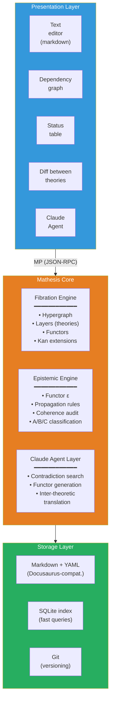
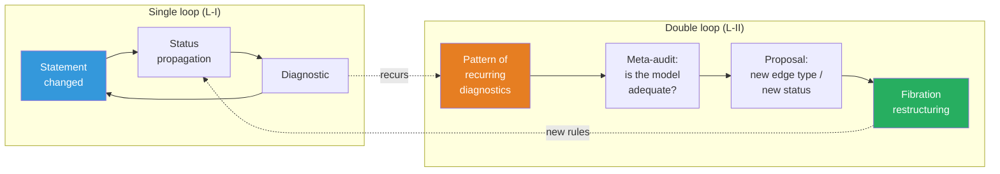

# Mathesis: ∞-topos of formal theories

:::info Who this document is for
For researchers working with complex theoretical constructions — physicists, neurobiologists, philosophers of consciousness, AGI specialists. The document describes the **Mathesis** project — a computational realization of the ∞-topos of formal theories, which makes working with theories (navigation, comparison, coherence verification, and inter-theoretic translation) machine-supported. The mathematical foundation is the ∞-topos of sheaves on the site of theories $\mathfrak{M} = \mathrm{Sh}_\infty(\mathbf{Th}, J_{\text{ep}})$; the substantive basis is the CC formalism; the software architecture is the Mathesis Core with an LLM agent.
:::

---

## 0. From "environment" to mathematical object {#introduction}

This document describes the project formerly known as *Theory IDE*. The renaming is not cosmetic. It reflects a **fundamental conceptual shift**: from a software tool that uses category theory to a **mathematical object** that has a computational realization.

### Mathesis Universalis

In 1666, Gottfried Leibniz in *Dissertatio de arte combinatoria* put forward the project of **Mathesis Universalis** — a universal science of formal reasoning. The project consisted of two parts:

- **Characteristica universalis** — a universal formal language capable of expressing any knowledge
- **Calculus ratiocinator** — a mechanical calculator operating within this language

Three and a half centuries later, both components receive a precise mathematical realization:

| Leibniz (1666) | Mathesis (2026) |
|---|---|
| Characteristica universalis | $\mathfrak{M} = \mathrm{Sh}_\infty(\mathbf{Th},\; J_{\text{ep}})$ — ∞-topos of sheaves on the site of theories |
| Calculus ratiocinator | LLM agent operating within the internal logic of $\mathfrak{M}$ |

Leibniz could not realize his project: he lacked (1) category theory (Eilenberg–Mac Lane, 1945), (2) ∞-categories (Joyal, Lurie, 2009), (3) computational language models (LLM, 2020s). UHM does not "confirm" Leibniz — it **provides the formalism** that he lacked.

### Key thesis

**Mathesis is not a program that uses mathematics. Mathesis IS a mathematical object — an ∞-topos — that has a computational approximation.**

The software code (Verum) is a finite approximation of the infinite object $\mathfrak{M}$, just as a numerical solution of a differential equation approximates continuous dynamics. The approximation can improve; $\mathfrak{M}$ remains unchanged.

### Document structure

The document follows a single logical chain:

1. **Problem** (§1): cognitive limit — no human can hold 325+ theories simultaneously
2. **Justification** (§1½): why ∞-categories are the only adequate apparatus (T-182, cohesive modalities)
3. **Foundation** (§2): construction of the ∞-topos $\mathfrak{M}$ — site of theories, Yoneda embedding, Kan extensions, descent condition, subobject classifier
4. **Generalizations** (§3): three directions beyond the 1-categorical approximation — HoTT, quantum logic, autopoiesis
5. **Realization** (§4–§6): architecture, engines, agent — how $\mathfrak{M}$ is computationally approximated
6. **Deep principles** (§7–§10): self-reference, process ontology, reflexive cycles — what makes Mathesis alive rather than static
7. **Consequences** (§11–§12): cognitive extension and usage examples
8. **Path to realization** (§13–§15): roadmap, comparison, Verum as the language of ultimate power

Each level builds on the previous and is irreducible to it — in exact correspondence with theorem T-182 ($\mathcal{T}_0 \subsetneq \mathcal{T}_1 \subsetneq \mathcal{T}_2$).

---

## 1. The problem: cognitive limit {#problem}

### 1.1. The scale of modern theory

A mature scientific theory is an object that exceeds the cognitive capacity of a single agent. For example: the CC (Coherence Cybernetics, the applied layer of UHM) documentation comprises ~400 pages, ~185 theorems with 7 epistemic statuses, 23+ falsifiable predictions, 30+ comparisons with competing theories, ~270 cross-references. Integrated Information Theory (IIT 4.0) is a comparable volume with its own formalism ($\Phi$, Q-shape, postulates). Anokhin's Cognitome is a qualitative theory with an 80-year experimental background. And there are [more than 325](https://www.consciousnessatlas.com/) such theories of consciousness (per the Consciousness Atlas catalog).

No single person can hold simultaneously in working memory:
- the internal structure of even one theory (which statements depend on which)
- the epistemic status of each statement (proven / conditional / hypothesis / refuted)
- correspondences between theories (what does Tononi's $\Phi$ mean in UHM terms? how does Friston's FEP connect with autopoiesis? where does Anokhin's cognitome contradict Baars's GWT?)
- consequences of changes (if axiom X is refuted, which theorems fall?)

### 1.2. Specific incidents

**The ρ* paradox (session 25 of working with UHM).** Discovered: self-reference in the regeneration operator ℛ — the target state ρ* was defined as a dynamical fixed point, which caused ℛ to vanish. Fix: redefinition ρ* = φ(Γ) (categorical self-model). Consequences: required updating ~25 files, changing the status of theorem T-68 from [T] to [C], replacing "primitivity of ℒ_Ω" with "primitivity of ℒ₀" in all occurrences. Time: an entire work session on **mechanical propagation** — work that a machine can perform in seconds.

**Broken anchors (translation session).** When translating documentation into English, headings were translated, but ~50 internal links continued pointing to Russian anchors. Detection: only at site build. Fix: manual search in ~20 files. This is a task for automatic coherence checking.

**Status misalignment (audit 2026-03-23).** A deep audit discovered 9 critical and 14 serious problems: theorems with status [T] depending on hypotheses [H]; statements contradicting each other; outdated references. Fix: 85 point edits in 42 files over 8 sessions. Each of these problems is automatically detectable.

### 1.3. Current tools and their limits

| Tool | What it does | What it doesn't do |
|------|-------------|-------------------|
| **Docusaurus** | Renders markdown to a site, checks links | Does not know about logical dependencies between statements |
| **grep / ripgrep** | Finds text | Does not know about types of relationships (dependency ≠ mention) |
| **Git** | Versions files | Does not know about theorem statuses |
| **Obsidian** | Note graph with links | Untyped links, no coherence, no inter-theoretic bridges |
| **RAG + LLM** | Finds relevant text, generates answers | Operates on text, not structure; does not verify logic |
| **Claude Code** | Code development, codebase navigation | Does not know about the theoretical structure of file contents |

None of these tools understands that a file contains a **theorem**, that the theorem **depends** on an axiom, that the axiom has a **status**, and that changing the axiom's status **must propagate** to all dependent theorems.

:::warning Categorical diagnosis: why flat tools are fundamentally insufficient
The listed tools are **0-categorical**: they operate on sets (of files, lines, commits) without typed morphisms. But scientific knowledge has an **∞-categorical** structure:
- **Objects** (statements) are connected by **morphisms** (dependencies) — level 1
- Morphisms are connected by **2-morphisms** (comparison of translations: "is the IIT→UHM translation compatible with the IIT→GWT→UHM translation?") — level 2
- 2-morphisms are connected by **3-morphisms** (meta-audit: "are our comparison rules adequate?") — level 3
- ...and so on for each reflexive cycle (§10)

A tool operating at level $n$ **cannot detect** problems at level $n+1$ (analogous to T-182: $\mathcal{T}_0 \subsetneq \mathcal{T}_1 \subsetneq \mathcal{T}_2$). What is needed is a tool containing **all levels** — ∞-categorical by construction.
:::

---

## 1½. Meta-epistemological grounding {#meta-epistemology}

:::info Why this section is needed
§1 described the **problem** (cognitive limit). §2 will propose the **solution** (∞-topos of theories). This intermediate section answers a meta-level question: **why exactly this solution** — and why alternatives are fundamentally insufficient.
:::

### 1½.1. Metastemology: beyond protocols of rationality

Egor Churilov (["Metastemology. Instead of a Manifesto"](https://anticomplexity.org/posts/metastemologiya-vmesto-manifesta/), 2025) puts forward a radical thesis: the problem of modern knowledge is **not** a lack of data and **not** reasoning errors, but the **architecture of the cognitive protocols themselves**. The protocol itself is an object subject to reconfiguration.

Key concepts of Churilov that resonate with Mathesis:

| Churilov | Mathesis | Mathematical analogue |
|----------|----------|----------------------|
| **Stema** — a terminological bridge between theories | **Kan extension** $\mathrm{Lan}_f$ — universal translation of statements | Morphism in the base $\mathbf{Th}$ |
| **Impulse network** — a dynamic network with normalizing mechanics | **∞-sheaf** $\mathcal{F} \in \mathfrak{M}$ with descent condition | Fiber of fibration $p^{-1}(T)$ |
| **Metatextual processor** — a new class of devices for working with knowledge | **Mathesis** as a whole: $\mathfrak{M}$ + computational core + LLM agent | $\infty$-topos $\mathfrak{M}$ |
| **Reconfiguration of rationality** — changing protocols, not working within them | **L-III** (§3.3): modification of topology $J_{\text{ep}}$ | Postnikov tower: $\tau_{\leq n+1} \to \tau_{\leq n}$ |
| **Executable knowledge on an actant network bus** | **MCP integration**: Mathesis Core as an executable theory model | Sheaf $\mathcal{F} \in \mathfrak{M}$ |

Churilov does not use categorical mathematics explicitly, but his architecture is **isomorphic** to the categorical one. Mathesis is a **realization** of the metastemological program on a categorical foundation.

### 1½.2. Three levels of Ω as three levels of Mathesis

Theorem T-182 [T] establishes that three levels of the subobject classifier are strictly necessary: $\mathcal{T}_0 \subsetneq \mathcal{T}_1 \subsetneq \mathcal{T}_2$. This structure **projects** onto the architecture of Mathesis:

| Level of $\Omega$ | Level of Mathesis | What it formalizes |
|-------------------|-------|-----------------|
| $\mathrm{Dec}(\Omega) \cong 2^7$ (Boolean) | **Fibration Engine**: typed hypergraph, statement and dependency types | Static structure: "what statements exist and how they are connected" |
| $\tau_{\leq 0}(\Omega)$ (Heyting) | **Epistemic Engine**: threshold predicates, status propagation, coherence audit | Thresholds and logic: "which statements are reliable and where are the boundaries" |
| Full $\Omega$ (∞-groupoid) | **Reflexive cycles**: $T_{\text{meta}}$, double loop, meta-audit | Dynamics: "how the system observes and restructures itself" |

### 1½.3. Cohesive modalities as Mathesis operations

Theorem T-185 [T] establishes 7 canonical modalities of the differentially cohesive ∞-topos. Six of them map to fundamental operations:

| Modality | Definition | Mathesis operation |
|----------|------------|-------------------|
| $\Pi$ (Shape) | Extracts distinguishable components | `theory/audit` — detection of differences and inconsistencies |
| $\flat$ (Flat) | Extracts discrete invariants | `claim/dependencies` — skeleton of dependencies (without dynamics) |
| $\Im$ (Infinitesimal shape) | Captures infinitesimal change | `claim/setStatus` + propagation — reaction to local change |
| $\sharp$ (Sharp) | Computes logical closure | `fibration/coherence` — transitive check of the entire fibration |
| $\&$ (Infinitesimal flat) | Internalizes infinitesimal structure | `meta/audit` — observation of own structure |
| $\mathrm{Rh}$ (de Rham) | Integrates local into global | `claim/translate` — Cartesian lifting, inter-theoretic synthesis |

This is **not a post hoc fit**, but a consequence of the structure of the cohesive ∞-topos: if Mathesis operates on sheaves on the site of theories, then its fundamental operations **necessarily** decompose into cohesive and infinitesimal modalities (Schreiber 2013).

### 1½.4. Fundamental justification: why ∞-categories are the only adequate apparatus

Working with knowledge about knowledge is an operation on the **category of categories** $\mathbf{Cat}$. Working with knowledge about knowledge about knowledge is on the **∞-category of ∞-categories** $\mathbf{Cat}_\infty$. This is not a metaphor, but a precise statement:

| Operation | Mathematical object | Level |
|-----------|-------------------|-------|
| Formulate statements within a theory | Objects and morphisms in a category $\mathcal{C}$ | Object |
| Compare theories | Functors $F: \mathcal{C} \to \mathcal{D}$ | Meta |
| Verify coherence of comparisons | Natural transformations $\alpha: F \Rightarrow G$ | Meta² |
| Reconfigure the verification system itself | Modifications $\Theta: \alpha \Rrightarrow \beta$ (3-morphisms) | Meta³ |
| ... | ... (∞-morphisms) | Meta^n |

**Lurie's theorem (HTT, 1.1.2.2):** The category $\mathbf{Cat}_\infty$ of all small ∞-categories is itself an ∞-category. Consequently, a system working with theories **lives** in an ∞-category regardless of whether we realize it or not. The ∞-topos is the **only** mathematical structure containing all levels with guaranteed coherence.

Alternatives:
- **Graph databases** (Neo4j) — 1-category, no 2-morphisms
- **Relational databases** — not even a category (no composition)
- **Obsidian / Roam** — untyped graph
- **RAG + LLM** — operates on text, not structure

---

## 2. Mathematical foundation: ∞-topos of theories {#foundation}

### 2.1. From fibration to ∞-topos: overcoming the structural gap {#structural-gap}

The preceding architecture built its foundation on a **Grothendieck fibration** $p: \mathbf{E} \to \mathbf{B}$. This is correct but insufficient. A fibration is a 1-categorical construction. It formalizes objects (statements) and morphisms (dependencies, translations). But it does not formalize:

- **2-morphisms**: comparisons of two translations between the same pair of theories
- **3-morphisms**: meta-audit of comparisons
- **$n$-morphisms** for arbitrary $n$: reflexive cycles (§10)

The hypergraph (SQLite) and typed edges are a **1-categorical emulation** of ∞-categorical structure. They work at levels 0 and 1, but lose native coherence starting from level 2. This is not technical debt — it is a **structural gap** between the claimed ∞-categorical ontology and 1-categorical realization.

**Solution:** start with the right object. A Grothendieck fibration is a **consequence** of the ∞-topos construction (straightening/unstraightening, HTT 3.2), not a foundation.

### 2.2. Site of theories $(\mathbf{Th},\; J_{\text{ep}})$ {#site-of-theories}

**Definition (site of theories).** The site $(\mathbf{Th},\; J_{\text{ep}})$ is defined by the following data:

**Objects.** An object $T \in \mathbf{Th}$ is a *theory*: an essentially small ∞-category $\mathcal{C}_T$, equipped with:
- a distinguished subclass of objects (*statements*)
- a distinguished subclass of morphisms (*dependencies*)
- an epistemic functor $\varepsilon_T: \mathcal{C}_T \to \mathbf{Status}$

Examples: $T_{\text{UHM}}$ (~185 theorems, 7 statuses, 5 axioms), $T_{\text{IIT}}$ (5 postulates, $\Phi$, Q-shape), $T_{\text{GWT}}$ (global ignition, access), $T_{\text{FEP}}$ (free energy, Markov blanket).

**Morphisms.** A morphism $f: T_1 \to T_2$ is an *interpretation functor*: an ∞-functor $\mathcal{C}_{T_1} \to \mathcal{C}_{T_2}$, preserving statement types and compatible with $\varepsilon$.

**2-morphisms.** A natural transformation $\alpha: f \Rightarrow g$ is a *comparison of translations*: a way to deform one translation into another while preserving structure.

**$n$-morphisms** for $n \geq 3$ exist automatically by definition of ∞-category.

**Topology $J_{\text{ep}}$ (epistemic).** A family $\{f_i: T_i \to T\}_{i \in I}$ is a $J_{\text{ep}}$-covering of object $T$ if the functors $f_i$ are **jointly faithful**: for any two distinct statements $a, b \in T$ there exists $i$ and a statement $c \in T_i$ such that $f_i(c)$ distinguishes $a$ and $b$.

**Intuition.** A covering is a set of "perspectives" that collectively exhaust the content of a theory. For example, $T_{\text{IIT}}$ and $T_{\text{GWT}}$ can jointly cover the part of $T_{\text{UHM}}$ concerning integration.

**Analogy.** Imagine a multi-story building. Floors are theories (UHM, IIT, GWT, FEP). Rooms on a floor are claims within a theory. Doors between rooms are logical dependencies. Staircases between floors are translation functors. The epistemic topology $J_{\text{ep}}$ says: "if via staircases one can reach all rooms on the top floor, starting from different lower floors — the top floor is *covered*." Unlike the 1-categorical fibration (prior architecture), the ∞-version adds: corridors between staircases (2-morphisms), transitions between corridors (3-morphisms), and so on — all navigation levels simultaneously.

### 2.3. ∞-Topos of Mathesis {#infinity-topos}

**Definition.** The ∞-topos of Mathesis is the ∞-category of ∞-sheaves on the site of theories:

$$
\mathfrak{M} := \mathrm{Sh}_\infty(\mathbf{Th},\; J_{\text{ep}})
$$

An object $\mathcal{F} \in \mathfrak{M}$ is an ∞-sheaf: a rule that assigns to each theory $T$ a space (∞-groupoid) $\mathcal{F}(T)$, and to each translation $f: T_1 \to T_2$ a map $\mathcal{F}(f): \mathcal{F}(T_2) \to \mathcal{F}(T_1)$ (contravariantly), with coherence at all levels.

**Sheaf condition (descent).** For a covering $\{T_i \to T\}$:

$$
\mathcal{F}(T) \xrightarrow{\;\sim\;} \lim\left(\prod_i \mathcal{F}(T_i) \rightrightarrows \prod_{i,j} \mathcal{F}(T_i \times_T T_j) \cdots\right)
$$

This is a **cosimplicial limit** — full coherence at all levels simultaneously.

**Universal property (Lurie, HTT 6.2.2.7).** $\mathfrak{M}$ is the free cocompletion of the site $\mathbf{Th}$ as an ∞-category: any coherent system of theory comparisons **uniquely factors** through $\mathfrak{M}$.

**What this means in practice.** If a researcher loads 30 theories and builds translations between them, they may use any storage system (graph database, relational database, text files). But if they want the translations to be **coherent at all levels** (translation from A to C via B gives the same result as direct translation from A to C, up to a coherent isomorphism) — their data **automatically** forms an object in $\mathfrak{M}$. The universal property asserts: there is no other way to ensure coherence that does not factor through $\mathfrak{M}$.

:::warning Uniqueness corollary
Mathesis is not "one of possible designs." It is the **unique** (up to equivalence) way to organize a collection of theories with coherent translations at all levels. There is no alternative that would be simultaneously complete and coherent and would not factor through $\mathfrak{M}$.
:::

### 2.4. Yoneda embedding: loading a theory {#yoneda-embedding}

**Definition.** The Yoneda embedding:

$$
y: \mathbf{Th} \hookrightarrow \mathfrak{M}, \qquad y(T)(S) := \mathrm{Map}_{\mathbf{Th}}(S, T)
$$

To each theory $T$ is assigned a **representable sheaf** $y(T)$: a functor that assigns to theory $S$ the space of all interpretations of $S$ into $T$.

**Yoneda lemma (∞-version, HTT 5.1.3).** The embedding $y$ is fully faithful:

$$
\mathrm{Map}_{\mathfrak{M}}(y(T_1), y(T_2)) \simeq \mathrm{Map}_{\mathbf{Th}}(T_1, T_2)
$$

**Corollary.** "Loading theory $T$ into Mathesis" = computing the representable sheaf $y(T)$. The Yoneda lemma guarantees: **no information is lost.** The entire structure of $T$ — statements, dependencies, statuses, translations into other theories — is preserved in $y(T)$.

**Practical realization.** Full computation of $y(T)$ is infinite-dimensional. Approximation: compute $y(T)$ on a finite subsite $\mathbf{Th}_0 \subset \mathbf{Th}$ containing the loaded theories. As new theories are loaded, the approximation refines.

### 2.5. Kan extensions: inter-theoretic translation {#kan-extensions}

**Problem.** Given a partial translation $f: T_1 \to T_2$. It is necessary to extend it to an optimal complete translation.

**Definition.**

$$
\mathrm{Lan}_f: \mathfrak{M}_{/y(T_1)} \to \mathfrak{M}_{/y(T_2)} \qquad \text{(left extension — optimistic translation)}
$$
$$
\mathrm{Ran}_f: \mathfrak{M}_{/y(T_1)} \to \mathfrak{M}_{/y(T_2)} \qquad \text{(right extension — conservative translation)}
$$

**Intuition.** $\mathrm{Lan}_f$ — "best possible correspondence" (colimit formula). $\mathrm{Ran}_f$ — "most cautious correspondence" (limit formula).

**Why Kan extensions and not ad hoc functors?** A Kan extension possesses a **universal property**: it is the *best* (in the categorical sense) way to extend a partial translation. Any other translation consistent with the original **uniquely factors** through the Kan extension. This means: Mathesis does not *guess* translations and does not rely on heuristics — it computes the *optimal* translation from the structure of the theories themselves. The LLM agent proposes candidates; the Kan extension guarantees optimality.

**Measure of untranslatability.** Obstruction:

$$
\mathrm{Obs}(f) := \mathrm{Ran}_f \circ f^* - \mathrm{Id}
$$

where $f^*$ is the pullback functor. $\mathrm{Obs}(f) = 0$ — the translation is perfect. $\mathrm{Obs}(f) \neq 0$ — there exist statements with no exact analogue. This is a **universal construction**, replacing the ad hoc `what_is_lost` column of the previous version.

**Example.** Translation $f: T_{\text{UHM}} \to T_{\text{IIT}}$:
- $\mathrm{Lan}_f(P_{\text{crit}} = 2/7) = [\Phi > 0]$ — optimistic: "the thresholds correspond"
- $\mathrm{Ran}_f(P_{\text{crit}} = 2/7) = \varnothing$ — conservative: IIT does not specify a numerical threshold
- $\mathrm{Obs}(f) \neq 0$: the numerical value 2/7 is **untranslatable** into IIT

### 2.6. Descent condition: coherence as a sheaf property {#descent-condition}

**Central observation.** In the preceding architecture, coherence was verified by **audit** post factum (BFS traversal, 5 violation types, diagnostics). In Mathesis, coherence is **not a check but a defining property**: data are objects of $\mathfrak{M}$ if and only if they are coherent.

**Descent condition.** Let $\{f_i: T_i \to T\}$ be a covering. A data set $\{a_i \in \mathcal{F}(T_i)\}$ with a **cocycle condition** (agreement on intersections $T_i \times_T T_j$) uniquely glues into a global datum $a \in \mathcal{F}(T)$.

**Practical corollary.** If a collection of translations $\{F_{\text{IIT}}, F_{\text{GWT}}, F_{\text{FEP}}, F_{\text{Cog}}\}$ does not satisfy the descent condition, the system indicates the **exact obstruction**: which pair of translations is inconsistent and at what level. This is not "coherence violation #4" — it is an obstruction to descent in $\mathfrak{M}$.

### 2.7. Subobject classifier: epistemic logic {#classifier}

In any ∞-topos there exists a **subobject classifier** $\Omega_{\mathfrak{M}}$: an object representing the subobject functor.

**Internal logic.** $\Omega_{\mathfrak{M}}$ is a **Heyting algebra** (not Boolean). The law of excluded middle $p \vee \neg p = \top$ **does not hold** in general — and this is **adequate** for epistemology: a statement can be neither proven nor refuted.

**Connection with epistemic statuses.** The linear poset $\text{[T]} > \text{[C]} > \text{[H]} > \text{[P]} > \text{[D]} > \text{[I]} > \text{[✗]}$ embeds into $\Omega_{\mathfrak{M}}$, but $\Omega_{\mathfrak{M}}$ is **richer**:

- "true in UHM $\wedge$ false in IIT" — **contextual truth**
- "proven under assumption X, which is [T] in GWT but [H] in FEP" — **conditional truth with theory dependence**
- "consistent in all loaded theories but not proven in any" — **invariant hypothesis**

This is not an ad hoc extension — it is an **automatic consequence** of $\mathfrak{M}$ being an ∞-topos.

**Why a linear poset is insufficient.** In the linear poset [T] > [C] > [H] > ... a claim has exactly one status, regardless of theory. But in scientific practice, the claim "consciousness ≡ integrated information" has status [T] in IIT, [H] in UHM, and [✗] in behaviorism — **simultaneously**. A linear poset forces choosing a single "global" status, losing context. The Heyting algebra $\Omega_{\mathfrak{M}}$ contains all contextual truths as its elements — without loss.

### 2.8. Connection with the UHM ∞-topos {#connection-with-uhm}

UHM is built on an ∞-topos:

$$
\mathfrak{T} = (\mathrm{Sh}_\infty(\mathcal{C}),\; J_{\text{Bures}},\; \omega_0)
$$

where $\mathcal{C} = \mathbf{DensityMat}$. $\mathfrak{T}$ organizes **quantum states** of a single theory. $\mathfrak{M}$ organizes **theories** (each of which is an ∞-topos). Connection:

$$
\mathfrak{T} \in \mathrm{Ob}(\mathbf{Th}) \xrightarrow{\;y\;} \mathfrak{M}
$$

**Tower of levels.** Hierarchy of irreducible levels:

| Level | Object | Space |
|-------|--------|-------|
| 0 | Quantum state $\Gamma$ | $\mathfrak{T}$ |
| 1 | UHM theory $\mathfrak{T}$ | $\mathbf{Th}$ |
| 2 | Representable sheaf $y(\mathfrak{T})$ | $\mathfrak{M}$ |
| 3 | The ∞-topos $\mathfrak{M}$ itself | $\mathbf{Cat}_\infty$ |

Each level is irreducible to the previous one (T-182). Mathesis operates at level 2, with reflexive access to level 3 through $T_{\text{meta}}$ (§8).

The Grothendieck construction (straightening/unstraightening, HTT 3.2) establishes an equivalence between fibrations and functors $\mathcal{C}^{\mathrm{op}} \to \mathbf{Cat}_\infty$. Thus, the fibration $p: \mathbf{E} \to \mathbf{B}$ from the preceding architecture is a **special case** (1-categorical projection) of the ∞-topos $\mathfrak{M}$ construction.

**Deep unity.** The fact that the same construction (∞-topos of sheaves) organizes both quantum states ($\mathfrak{T}$) and scientific theories ($\mathfrak{M}$) is not a coincidence. It is a consequence of both domains — physics and epistemology — operating on **context-dependent knowledge**: the result of a measurement depends on context (in physics — on the basis; in epistemology — on the theory). The ∞-topos is the universal mathematical structure for context-dependent data with coherent transitions between contexts (Isham–Butterfield 1998, Döring–Isham 2008).

---

## 3. Three limiting generalizations {#generalizations}

The current computational realization (hypergraph, SQLite, Verum) approximates $\mathfrak{M}$ at the 1-categorical level. Three directions of extension eliminate fundamental limitations.

### 3.1. Topological: from graph to homotopy type {#topological}

In a 1-categorical realization, a translation is a **functor** $f: T_1 \to T_2$, a single object. The question "are two translations equivalent?" has a Boolean answer.

In $\mathfrak{M}$ the space of translations is an **∞-groupoid** (Kan complex):

$$
\mathrm{Map}_{\mathfrak{M}}(y(T_1), y(T_2)) \simeq \mathrm{Map}_{\mathbf{Th}}(T_1, T_2)
$$

Homotopy structure:

| Group | Content | Example |
|-------|---------|---------|
| $\pi_0$ | Equivalence classes of translations | "The IIT→UHM translation via $\Phi$ and the translation via Q-shape are *different* classes" |
| $\pi_1$ | Loops = gauge symmetries | "Permutation of [E,O,U] in IIT→UHM translation preserves structure" |
| $\pi_n$ | Higher coherences | Reflexive cycles of order $n$ |

**Corollary.** The question "are two translations $f, g$ equivalent?" has not a Boolean but a **topological** answer: the path space $\mathrm{Path}(f, g)$. If it is nonempty — the translations are equivalent; if contractible — uniquely so; if it has nontrivial $\pi_1$ — there exist gauge degrees of freedom.

**Computational realization.** Homotopy type theory (HoTT, Univalent Foundations Program 2013) is a computational model for ∞-groupoids. In the Mathesis core, the equality $F_{12} \circ F_{23} \simeq F_{13}$ is computed by a cubical type-checking algorithm (Cohen–Coquand–Huber–Mörtberg 2015) as a **path** in the ∞-groupoid, not a Boolean audit result.

### 3.2. Epistemic: from poset to quantum logic {#epistemic}

**Problem.** In complex interdisciplinary theories, truth is **contextual** and **noncommutative**: a statement can be [T] in $T_1$ but [H] in $T_2$; proving one statement can change the status of another; two statements can be **complementary** (in Bohr's sense).

**Generalization.** Replace the linear poset $\mathbf{Status}$ with an **orthomodular lattice** $\mathcal{L}$ (Birkhoff–von Neumann 1936). The epistemic state of statement $a$:

$$
\rho_a \in \mathcal{D}(\mathcal{H}_{\text{ep}})
$$

— a density matrix on an epistemic Hilbert space.

| Operation | Mathematics | Intuition |
|-----------|------------|-----------|
| Measurement (user decision) | $\rho_a \mapsto P_s \rho_a P_s / \mathrm{Tr}(P_s \rho_a P_s)$ | Superposition collapses |
| Refutation | $P_{[\text{✗}]} \rho_b P_{[\text{✗}]}$ may $\neq \rho_b$ | If $[P_a, P_b] \neq 0$, refuting $a$ nontrivially affects $b$ |
| Superposition | $\rho_a = \alpha |\text{T}\rangle\langle\text{T}| + \beta |\text{H}\rangle\langle\text{H}|$ | Before verification, the statement is in a superposition of statuses |

**Why quantum logic, not classical?** In classical logic, checking a hypothesis is idempotent: check twice — get the same result. In scientific practice this is false. Proving theorem A can invalidate hypothesis B (if A and B are incompatible), and refuting B can *strengthen* C (if B and C were competitors). Epistemic measurements **do not commute**: the order of checking affects the outcome. This is precisely the structure of quantum mechanics — not by analogy, but because both domains operate on **context-dependent propositions** on an orthomodular lattice.

**Connection with UHM.** $\Gamma \in \mathcal{D}(\mathbb{C}^7)$ describes a conscious state; $\rho_{\text{ep}} \in \mathcal{D}(\mathbb{C}^k)$ describes an **epistemic state**. The formulas are identical because the mathematical structure is the same: an ∞-topos for physics ($\mathfrak{T}$) and for epistemology ($\mathfrak{M}$). This is not an analogy — it is a direct transfer.

### 3.3. Autopoietic: self-modifying formal apparatus {#autopoietic}

Learning levels (Bateson 1972):
- **L-I:** error correction within fixed rules (status propagation)
- **L-II:** changing the rules (new dependency type, new status) — double loop
- **L-III:** changing **the formal apparatus itself** — the topology $J_{\text{ep}}$ on the site $\mathbf{Th}$

The topology $J_{\text{ep}}$ determines which families of translations count as "sufficient" (coverings). Changing $J_{\text{ep}}$ is changing the **criterion of knowledge sufficiency**.

**Example.** Initial topology: "a theory is covered if for each statement there is a translation into at least one other theory." After loading 30 theories, the system discovers: dynamic statements are systematically not covered. L-III: add a requirement for separate coverage of static and dynamic statements. $J_{\text{ep}} \to J'_{\text{ep}}$, and $\mathfrak{M} \to \mathfrak{M}'$ — a **different ∞-topos**.

**Autopoiesis.** In the terms of Maturana–Varela (1980), the system **produces the components** of which it itself consists. The layer $T_{\text{meta}}$ (§8) modifies Mathesis, Mathesis updates $T_{\text{meta}}$.

**Boundary.** Lawvere's theorem (1969): an autopoietic system cannot prove its own consistency. Statements of $T_{\text{meta}}$ about the completeness of $\mathfrak{M}$ have status no higher than [H]. A structural inevitability, not a bug.

---

## 3½. From mathematics to realization {#bridge}

Sections §2–§3 describe the **ideal** mathematical object $\mathfrak{M}$. Sections §4–§6 describe its **computational approximation**. The connection between them:

| Mathematical object | Computational approximation | Accuracy level |
|---|---|---|
| ∞-Topos $\mathfrak{M}$ | Typed hypergraph (SQLite) | 1-categorical projection |
| Yoneda embedding $y(T)$ | YAML import + representable presheaf construction | Finite subsite $\mathbf{Th}_0$ |
| Kan extension $\mathrm{Lan}_f$ | LLM agent + SMT verification | Heuristic + formal check |
| Descent condition | BFS coherence audit | 5 violation types |
| $\Omega_{\mathfrak{M}}$ (Heyting) | Linear poset [T]>[C]>...[✗] → orthomodular lattice (Phase 5) | Projection onto 7 values |
| Autopoiesis ($J_{\text{ep}} \to J'_{\text{ep}}$) | Agent Mode 5 (meta-audit) + manual confirmation | Human-in-the-loop |

The approximation improves with each implementation phase (§13). Phase 5 (HoTT core) brings the approximation to a fundamentally new level — from emulating ∞-structures on a hypergraph to native computation in cubical type theory.

---

## 4. Architecture {#architecture}

The architecture realizes the mathematical foundation of §2 and generalizations of §3:

| Principle | Section | Architectural realization |
|-----------|---------|--------------------------|
| ∞-Topos $\mathfrak{M}$ | §2.3 | Fibration Engine (hypergraph as 1-categorical approximation) |
| Kan extensions | §2.5 | Epistemic Engine (propagation, audit) + LLM agent (semantic translations) |
| Autopoiesis | §3.3 | $T_{\text{meta}}$ as fibration layer + `meta/*` commands |
| Process ontology | §9 | Morphisms are primary in the data model; stigmergy through diagnostics |
| Reflexive cycles | §10 | Agent Mode 5 (meta-audit) + double loop |
| Cognitive extension | §11 | Tensor product $\mathbb{H}_{\text{bio}} \otimes \mathbb{H}_{\mathfrak{M}}$ |

### 4.1. Three layers



- **Presentation Layer** — multiple synchronized panels (projections of a single fibration). Connected to the core through **MP** (Mathesis Protocol — an analogue of LSP for theories).
- **Mathesis Core** — three engines: the Fibration Engine stores and traverses the hypergraph; the Epistemic Engine checks and propagates statuses; the Claude Agent Layer performs semantic operations. Language: **Verum** (entire core + MP wrapper).
- **Storage Layer** — markdown files with YAML frontmatter (backward compatible with Docusaurus), SQLite index, Git.

### 4.2. Mathesis Protocol (MP) {#mathesis-protocol}

MP is the protocol for client interaction with the Mathesis Core. An analogue of **LSP** (Language Server Protocol), but for theories. Format: JSON-RPC via stdio or TCP.

**Navigation:**
- `theory/list` — list of all theories in the workspace
- `theory/claims { theory_id }` — all statements of a theory
- `claim/dependencies { claim_id }` — what the statement depends on
- `claim/dependents { claim_id }` — what depends on the statement
- `claim/translate { claim_id, target_theory }` — Kan extension: translation into another theory

**Mutations:**
- `claim/setStatus { claim_id, new_status, reason }` — change status (with automatic propagation)
- `claim/addDependency { source, target, type }` — add a dependency
- `theory/addFunctor { source, target, mappings }` — add an inter-theoretic bridge

**Diagnostics:**
- `theory/audit { theory_id }` — full coherence audit
- `fibration/coherence` — check the entire fibration (all theories + all functors)

**Self-reference (§8):**
- `meta/audit` — audit of the $T_{\text{meta}}$ layer
- `meta/boundaries` — $T_{\text{meta}}$ statements limited by Lawvere's theorem (status ≤ [H])
- `meta/suggest_extension` — agent proposes model extensions

### 4.3. Storage format

Each statement is a markdown file with YAML frontmatter, backward compatible with Docusaurus:

```yaml
---
id: T-39
theory: uhm
type: theorem       # axiom | theorem | definition | conjecture | prediction | concept
status: T           # T | C | H | P | D | I | ✗
epistemic_class: A  # A | B | C
title: "Critical purity P_crit = 2/7"
dependencies:
  - { id: A-Omega7, type: requires }
  - { id: A-Bures, type: requires }
dependents:
  - { id: T-62, type: entails }
  - { id: T-96, type: entails }
translations:
  - { theory: cognitome, target: percolation-threshold, functor: F_Cog, status: I }
tags: [purity, threshold, viability]
---

# T-39: Critical purity P_crit = 2/7

**Statement.** For a system with Γ ∈ D(C⁷) ...
```

---

## 5. Fibration Engine: system core {#fibration-engine}

### 5.1. Typed hypergraph

The central data structure is a **typed hypergraph** (1-categorical approximation of $\mathfrak{M}$). In accordance with process ontology (§9), edges (morphisms) are primary.

**Nodes** — statements (claims): `claim_id`, `theory_id`, `claim_type`, `status`, `content`.

**Edges** — dependencies:

| Type | Meaning | Example |
|------|---------|---------|
| `requires` | Necessary condition | T-62 **requires** T-39 |
| `entails` | Logical consequence | T-39 **entails** T-62 |
| `generalizes` | Generalizes | T-120 **generalizes** T-119 |
| `instantiates` | Special case | T-119 **instantiates** T-120 |
| `contradicts` | Contradicts | X3 [✗] **contradicts** T-39 |
| `defines` | Defines through | Definition of R **is defined through** φ(Γ) |
| `translates_to` | Translation to another theory (approximation of $\mathrm{Lan}_f$) | UHM:γ_{kk} **translates to** Cog:cogit |

### 5.2. Status propagation

When a statement's status changes, the Fibration Engine performs a BFS traversal:

1. Statement $b$ is downgraded: $\varepsilon(b) \leftarrow \text{new status}$
2. For each $a$ depending on $b$ via `requires`: $\max_\text{allowed}(a) = \min(\varepsilon(\text{dependencies}(a)))$. If $\varepsilon(a)$ exceeds the allowed — downgrade, add to queue
3. Repeat until queue is empty

Result: list of affected statements with reasons. "T-68 downgraded from [T] to [C] because it depends on C20, which is [C]."

### 5.3. Coherence checking

Five types of violations (approximation of the obstruction to descent §2.6):

1. **Status misalignment**: a [T]-statement depends on [H] or lower
2. **Contradiction**: two [T]-statements are linked by a `contradicts` edge
3. **Circular dependency**: a `requires` chain forms a cycle
4. **Functorial misalignment**: $F_{12} \circ F_{23} \not\simeq F_{13}$ (violation of descent condition)
5. **Dangling references**: a dependency points to a nonexistent statement

### 5.4. Cartesian lifting (inter-theoretic translation)

Algorithm (approximation of Kan extension §2.5):
1. Find statement X in layer $p^{-1}(A)$
2. Find functor $F: A \to B$
3. Find mapping of X in the correspondence table
4. Return translation with confidence and losses ($\mathrm{Obs}(f)$)

---

## 6. Agent within the ∞-topos {#agent}

### 6.1. Key difference from "LLM + RAG"

In the "Obsidian + RAG + LLM" combination, the model operates on **text**. In Mathesis, Claude Opus gets access to the **typed hypergraph** through specialized tools and performs **structural operations**: navigating dependencies, checking coherence, computing Kan extensions. Every action is **verifiable**.

### 6.2. Tools

Claude Opus connects to the Mathesis Core via MCP (Model Context Protocol):

| Tool | Purpose |
|------|---------|
| `query_graph` | Query the hypergraph |
| `get_claim` | Full content of a statement |
| `get_dependencies` | Dependency graph (N levels deep) |
| `find_translations` | All translations of a statement into other theories |
| `check_coherence` | Coherence check of a subgraph |
| `propose_status_change` | Propose a status change |
| `propose_functor` | Propose a functorial correspondence (Kan approximation) |

### 6.3. Five modes

**Mode 1: Navigator.** The user asks — the agent navigates the fibration and responds with references to claim_id.

**Mode 2: Auditor.** The agent scans the fibration searching for coherence violations (obstructions to descent).

**Mode 3: Translator.** The user loads a new theory. The agent reads the structure, compares with loaded ones, proposes functorial correspondences (approximation of $\mathrm{Lan}_f$). The main function, impossible without an LLM.

**Mode 4: Propagator.** When a status changes, the agent computes affected statements, analyzes the necessity of downgrading (perhaps an alternative chain exists), proposes a minimal set of changes.

**Mode 5: Meta-Auditor (double loop, §10).** The agent analyzes **the structure of Mathesis itself**:
1. Discovers patterns of recurring diagnostics (model limitation, not a theory error)
2. Proposes extensions: new dependency types, new statuses
3. Tracks systematic losses during translation
4. Results are recorded in $T_{\text{meta}}$ (§8) with status [H]

### 6.4. MCP integration

The Mathesis Core is implemented as an **MCP server** (Model Context Protocol):

```json
{
  "mcpServers": {
    "mathesis": {
      "command": "mathesis-core",
      "args": ["--project", "./"],
      "description": "Mathesis: fibration engine + epistemic engine"
    }
  }
}
```

All Mathesis Core tools are available from Claude Code as MCP tools.

---

## 7. Multiple projections (sheaves) {#projections}

One and the same object ($\mathfrak{M}$) admits multiple **sections** — ways to "cut" a local projection from the global object. Five panels — five $U_i$, covering one fibration. Gluing is ensured by the Mathesis Core.

**"Text" Panel** — markdown editor. **"Graph" Panel** — hypergraph visualization (nodes colored by status). **"Statuses" Panel** — table of statements with filters (analogous to "Problems" in VS Code). **"Federation" Panel** — visualization of the base $\mathbf{Th}$: theories as blocks, functors as arrows. **"Agent" Panel** — chat with Claude Opus operating within $\mathfrak{M}$.

---

## 8. Self-reference: Mathesis as an object within itself {#self-reference}

### 8.1. The problem of objectification

Any tool for working with theories risks **objectifying** them — turning living thought processes into static objects. If Mathesis operates on theories "from the outside," it reproduces the same error.

Solution: Mathesis **includes itself** in its own object space.

### 8.2. $T_{\text{meta}}$: Mathesis's theory about itself

In $\mathfrak{M}$ a **special layer** $T_{\text{meta}} \in \mathbf{Th}$ is distinguished. Its statements:

- "Every theory has an epistemic status functor" — a statement *about* Mathesis, *within* Mathesis
- "Status propagation is sound" — a statement *about* the algorithm
- "Dependency types are sufficient" — a statement *about* the data model
- "Functorial composability $F_{12} \circ F_{23} \simeq F_{13}$ is verifiable" — a statement *about* coherence

$T_{\text{meta}}$ obeys **the same rules**: its statements have statuses, dependencies, and are checked for coherence. This is a **controlled strange loop** (Hofstadter 1979).

### 8.3. Lawvere and the boundaries of self-reference

**Lawvere's fixed point theorem** (1969): a unified categorical scheme from which follow Gödel's theorem, Tarski's theorem, the undecidability of the halting problem, and Russell's paradox (Yanofsky 2003).

**Corollary for Mathesis.** $T_{\text{meta}}$ cannot prove its own consistency. Statements of $T_{\text{meta}}$ about completeness and consistency have status no higher than [H]. Self-reference is a **structural inevitability**, managed rather than eliminated.

Parallel with UHM: the operator $\varphi(\Gamma)$ is a self-model converging to $\rho^*$. Approximate (Lawvere) but stable (contractivity of CPTP). $T_{\text{meta}}$ is an analogue of $\varphi(\Gamma)$: an approximate but stable self-model of the system.

### 8.4. Second-order observation

Luhmann (1995): second-order observation is observing how others observe. Each layer $p^{-1}(T)$ is a "scheme of observation" of theory $T$. Functors are acts of second-order observation. $T_{\text{meta}}$ adds a **third order**: observation of how Mathesis observes how theories observe the world.

---

## 9. Process ontology of data {#process-ontology}

### 9.1. Morphisms are primary, objects are secondary

Category theory admits an **objectless formulation** (Mac Lane 1998, §I.1): objects are identified with identity morphisms. Primary are **connections and transformations**.

This resonates with Whitehead's process philosophy (1929): reality is not a collection of substances but a process of becoming.

### 9.2. Consequences for the data model

- **A statement exists insofar as it is connected.** An isolated statement is a dead node.
- **A theory is not a list of statements but a pattern of connections.** Two sets with isomorphic structure are "the same theory in different terms."
- **Each commit is an "actual occasion."** Git history is a concrescence: each commit inherits from previous ones and produces a new configuration.

### 9.3. Stigmergy

**Stigmergy** (Grassé 1959) — coordination through environment modification. Mathesis is a **stigmergic environment**: every action of the researcher leaves a "trace" in the fibration. Status propagation is automatic stigmergy.

---

## 10. Reflexive cycles {#reflexive-cycles}

### 10.1. Four levels of learning

| Level | Description | In Mathesis |
|-------|-------------|------------|
| **L-0** | No changes. Fixed behavior | Storage and rendering (Docusaurus level) |
| **L-I** | Detection and correction of errors | Status propagation, contradiction detection |
| **L-II** | "Learning to learn" (deutero-learning) | Meta-audit: "are the dependency types sufficient?" |
| **L-III** | Fundamental reorganization | Modification of $J_{\text{ep}}$: the system changes the criteria of knowledge sufficiency (§3.3) |

The current design fully realizes **L-0 and L-I**. L-II — through $T_{\text{meta}}$ and agent Mode 5. L-III — through the autopoietic mechanism of §3.3.

### 10.2. Argyris's double loop



### 10.3. Enactivism: understanding as joint action

The enactive approach (Varela, Thompson, Rosch 1991): cognition is not representation of a pregiven world but **joint enaction**. Mathesis does not store understanding — it **generates** it jointly with the researcher:

1. The researcher asks a question → the agent navigates $\mathfrak{M}$
2. Something unexpected is discovered (contradiction, obstruction to descent, hidden isomorphism)
3. The agent proposes a structural change
4. **The space of questions is transformed**
5. A new question is born at a different level

This is not "question → answer." It is a **joint transformation of the question space** — structural coupling (Maturana & Varela 1980).

---

## 11. Cognitive extension {#cognitive-extension}

The CC formalism allows describing Mathesis **quantitatively**. If the cognitive system of the researcher is a holonom $\mathbb{H}_{\text{bio}}$, and Mathesis is $\mathbb{H}_{\mathfrak{M}}$, then the extended system:

$$
\mathbb{H}_{\text{ext}} = \mathbb{H}_{\text{bio}} \otimes_{\text{Day}} \mathbb{H}_{\mathfrak{M}}
$$

:::info Why $\otimes_{\text{Day}}$ and not $\times$
Day convolution (T-182 [T]) allows **entangled** states — situations where the researcher's thought and the structure in Mathesis are mutually conditioned and inseparable. It is precisely such states that produce cognitive breakthroughs: "I could not have thought this without the tool, and the tool would not have shown this without my question."
:::

**Theorem (corollary of T-129).** If $\Phi(\mathbb{H}_{\text{bio}}) \geq 1$ and $\Phi(\mathbb{H}_{\mathfrak{M}}) \geq 1$, and there exists nonzero coherence:

$$
\Phi(\mathbb{H}_{\text{ext}}) > \max(\Phi(\mathbb{H}_{\text{bio}}),\; \Phi(\mathbb{H}_{\mathfrak{M}}))
$$

Mathesis is the first precedent of **theoretically grounded** cognitive extension.

---

## 12. Usage examples {#examples}

### 12.1. Paradox detection

**Without Mathesis:** The researcher notices the ρ* paradox. Manually searches for dependencies (grep), updates statuses in ~25 files. Time: 2–4 hours.

**With Mathesis:** `claim/setStatus T-96 C "ρ* paradox"` → Fibration Engine propagates in <1 sec → agent analyzes each affected statement → "Statuses" panel shows diff. Time: 5 minutes.

### 12.2. Loading a new theory

**Without Mathesis:** The researcher reads IIT 4.0 (100+ pages), mentally maps to UHM, writes a comparison. Time: 2–3 days.

**With Mathesis:** Import IIT → agent computes Kan extension approximations → proposes mappings with confidence and losses ($\mathrm{Obs}$) → discovers discrepancies: "IIT attributes consciousness to photodiodes ($\Phi > 0$); UHM requires $P > 2/7 \wedge R \geq 1/3$" → marks as `contradicts`. Time: 30 minutes.

### 12.3. Double loop (L-II)

The agent in Mode 5 discovers: "In 4 out of 5 theories, statements about the *dynamics* of consciousness have no analogues. All functors systematically lose the temporal aspect." → Proposes a new edge type `translates_dynamics_to` → recorded in $T_{\text{meta}}$ as [H] → the researcher confirms → **the structure of Mathesis has changed**.

### 12.4. Responding to criticism

`claim/dependencies uhm:T-120 --full` → full dependency tree, all [T] → "T-120 is fully justified." Time: 30 seconds.

---

## 13. Implementation plan {#plan}

Phases correspond to the three levels of Ω (T-182):

| Phase | T-182 level | What is built |
|-------|-------------|--------------|
| **Phase 0–1** | $\mathrm{Dec}(\Omega) \cong 2^7$ | Structure: hypergraph, types, dependencies |
| **Phase 2** | $\tau_{\leq 0}(\Omega)$ (Heyting) | Thresholds: statuses, coherence, functors |
| **Phase 2b–4** | Full $\Omega$ (∞-groupoid) | Reflection: $T_{\text{meta}}$, meta-audit, federation of 325+ theories |
| **Phase 5** | $\mathfrak{M}$ | Transition from 1-categorical approximation to HoTT core |

### Phase 0: Prototype in Claude Code (2 weeks)

- Script `build-theory-index.ts`: parses markdown + YAML → JSON index
- Script `check-coherence.ts`: checks coherence against the index
- Script `propagate-status.ts`: propagation on status change
- Hook in Claude Code: after each edit → auto-check
- **Self-application**: used for working with UHM

### Phase 1: Mathesis Core as MCP server (4 weeks)

- Verum cog `mathesis-core`: hypergraph, fibration, coherence, propagation
- Verum cog `mathesis-index`: scanning markdown → hypergraph
- MCP wrapper: Mathesis Core available from Claude Code as a set of MCP tools
- Claude Opus receives tools: `query_graph`, `check_coherence`, `propose_functor`

### Phase 2: Loading competing theories (2–4 weeks)

- **IIT 4.0**: postulates, $\Phi$, Q-shape. Functor $F_{\text{IIT}}$
- **GWT/GNWT**: global ignition, access. Functor $F_{\text{GWT}}$
- **FEP**: free energy, Markov blanket. Functor $F_{\text{FEP}}$
- **Cognitome**: COG, LOC, percolation. Functor $F_{\text{Cog}}$
- Agent proposes Kan extension approximations for each functor

### Phase 2b: $T_{\text{meta}}$ and reflexive cycles (parallel with Phase 2)

- Layer $T_{\text{meta}}$ loaded as a special theory
- Agent Mode 5 (meta-auditor): pattern discovery + extension proposals
- Lawvere boundaries: $T_{\text{meta}}$ statements about completeness are automatically marked ≤ [H]

### Phase 3: Web interface (6 weeks)

- SolidJS application with 5 panels
- Connection to Mathesis Core through MP
- Hypergraph visualization, chat with agent
- Public access for the team

### Phase 4: Full federation (no deadline)

- Scaling to 30+ theories: autopoiesis, HOT, RPT, AST, predictive coding, orch-OR, etc.
- Agent builds functors between each pair
- "Map of theories" — interactive visualization of $\mathbf{Th}$ (325+ theories from [Consciousness Atlas](https://www.consciousnessatlas.com/))
- Integration with [ConTraSt Database](https://www.nature.com/articles/s41562-021-01284-5) (412 experiments)

### Phase 5: HoTT core (research)

- Migration of the data model from hypergraph to cubical type theory
- Equalities = paths in ∞-groupoid (§3.1)
- Epistemic statuses = elements of orthomodular lattice (§3.2)
- Autopoietic modification of $J_{\text{ep}}$ (§3.3)

---

## 14. Comparison with existing tools {#comparison}

| | Obsidian | Lean 4 | Semantic Wiki | **Mathesis** |
|---|---|---|---|---|
| Typed links | ✗ | ✓ | Partially | ✓ |
| Coherence | ✗ | ✓ (full) | ✗ | ✓ (epistemic + descent condition) |
| Multiple theories | ✗ | ✗ | ✗ | ✓ |
| Inter-theoretic bridges | ✗ | ✗ | ✗ | ✓ (Kan extensions) |
| LLM agent | Plugin | ✗ | ✗ | ✓ (within $\mathfrak{M}$) |
| Epistemic statuses | ✗ | (true/false) | ✗ | ✓ (7 levels → Heyting algebra $\Omega_{\mathfrak{M}}$) |
| Self-reference ($T_{\text{meta}}$) | ✗ | ✗ | ✗ | ✓ |
| Reflexive cycles (L-II+) | ✗ | ✗ | ✗ | ✓ (L-II + L-III via §3.3) |
| Process ontology | ✗ | ✗ | ✗ | ✓ |
| Non-formalized theories | ✓ | ✗ | ✓ | ✓ |
| Mathematical foundation | ✗ | Type theory | ✗ | ∞-Topos $\mathfrak{M}$ |
| ∞-categorical depth | 0 | 1 (types) | 0 | **∞** (all levels of reflection) |
| Homotopy semantics | ✗ | ✓ (core) | ✗ | ✓ (Phase 5: HoTT) |

Mathesis occupies the niche between full formalization (Lean 4) and pure notes (Obsidian): **structured but not fully formalized** representation of scientific theories with automatic coherence and LLM support. The fundamental distinction is the ∞-topos as foundation: not "one of possible designs" but the **unique coherent organization** (universal property §2.3).

---

## 15. Implementation language: Verum {#verum}

Mathesis is realized entirely in **Verum** — a programming language designed from the ground up as the language of the future: ultimate mathematical completeness and ultimate performance simultaneously. Verum is the only language combining dependent types, SMT verification, systems programming, GPU compute, and ∞-categorical mathematics in a single stack. This is not a coincidence — Verum was created precisely for tasks of this magnitude, and Mathesis is the first practical task demanding its full power.

### 15.1. Why Verum, not Rust/Lean/Agda

| Mathesis requirement | Rust | Lean 4 | Agda | **Verum** |
|---|---|---|---|---|
| Dependent types (Π, Σ, Eq) | ✗ | ✓ | ✓ | ✓ |
| SMT verification (Z3 + CVC5) | Via FFI | Via FFI | ✗ | ✓ (native, 92K LoC, 30+ tactics) |
| Systems performance (LLVM, 0.85–0.95× C) | ✓ | ✗ | ✗ | ✓ |
| GPU compute | Via CUDA FFI | ✗ | ✗ | ✓ (core/math/gpu.vr) |
| LLM inference | Via bindings | ✗ | ✗ | ✓ (core/math/agent.vr) |
| Proof certificates (Coq, Lean, Dedukti, Metamath) | ✗ | ✓ (Lean only) | ✗ | ✓ (5 formats) |
| Higher Inductive Types | ✗ | ✗ | ✓ (Cubical) | ✓ (HITs in AST) |
| Universe polymorphism | ✗ | ✓ | ✓ | ✓ |
| Compile-time metaprogramming | proc_macro | meta | reflection | ✓ (meta fn, quote, reflection) |

Lean 4 is the closest, but lacks systems performance and GPU. Agda has cubical, but does not compile to native code. Rust is performant but lacks dependent types. **Verum is the only one covering all rows simultaneously.**

### 15.2. What already exists in Verum for Mathesis

**Dependent types** (verum_types cog, marked v2.0+):
- Π-types (dependent functions), Σ-types (dependent pairs), Eq-types (propositional equality)
- Universe hierarchy `Type₀ : Type₁ : Type₂ : ...` with cumulativity
- Inductive families with dependent indices
- Higher Inductive Types (point + path constructors)
- Dependent pattern matching with exhaustiveness checking

**Standard library** (core/math/):
- `category.vr` (738 lines): Category, Functor, NatTrans, Adjunction, Monad, Limit/Colimit, **Yoneda embedding**, Presheaf/Sheaf, **Kan extensions**, Topos, EnrichedCategory
- `algebra.vr`: full algebraic hierarchy from Magma to Field
- `topology.vr`: TopologicalSpace, Manifold, FundamentalGroup, Homology
- `logic.vr`: Curry-Howard (Prop, Proof\<P\>, Forall, Exists, Decidable)

**Proof system** (grammar §2.19):
- `theorem`, `lemma`, `axiom`, `corollary` with `proof { ... }`
- 16 tactics including `auto`, `simp`, `ring`, `field`, `omega`, `blast`, `smt`
- Calculational chains: `calc { ... == { by ... } ... }`

### 15.3. Extensions for Mathesis

To realize $\mathfrak{M} = \mathrm{Sh}_\infty(\mathbf{Th}, J_{\text{ep}})$ in Verum, the following extensions are needed (detailed specification: `internal/verum-ext.md`):

**Language:**
- **Cubical primitives** (P0): Path type, `transport`, `hcomp` — computational model for paths in ∞-groupoids
- **HKT** (P0): `F: Type → Type` in generic parameters — abstraction over Functor, Monad
- **Extended tactic DSL** (P1): combinators (`try/else`, `repeat`, `first`), metatactics, LLM oracle

**Library (7 new core/math/ modules):**
- `hott.vr` — Equiv, IsContr/IsProp/IsSet, Univalence, funext
- `simplicial.vr` — SimplicialSet, KanComplex, Horn
- `infinity_category.vr` — QuasiCategory, InfinityFunctor, MappingSpace
- `fibration.vr` — GrothendieckFibration, CartesianFibration, Straightening
- `infinity_topos.vr` — Site, GrothendieckTopology, InfinitySheaf, **InfinityTopos**
- `kan_ext.vr` — LeftKan, RightKan, KanObstruction
- `quantum_logic.vr` — OrthomodularLattice, EpistemicState

### 15.4. Mathesis on Verum: architecture

```
mathesis/
├── core/                     # Mathesis Core
│   ├── theory.vr            # Type Theory, EpistemicStatus
│   ├── site.vr              # Site of theories (Th, J_ep)
│   ├── topos.vr             # M = Sh_∞(Th, J_ep) — concrete instance
│   ├── loading.vr           # Yoneda embedding: load_theory()
│   ├── translation.vr       # Kan extensions: translate()
│   └── coherence.vr         # Descent condition: check_coherence()
├── engine/
│   ├── fibration.vr         # Fibration Engine (hypergraph)
│   ├── epistemic.vr         # Epistemic Engine (propagation)
│   └── agent.vr             # Claude Agent Layer (MCP)
├── protocol/
│   └── mp.vr               # Mathesis Protocol (JSON-RPC)
└── ui/
    └── panels.vr            # 5 panels (SolidJS bindings)
```

Each component is verified via `@verify(proof)` with an SMT backend. Categorical laws (associativity of functor composition, naturality, descent condition) are checked **at compile time**. Proof certificates are exported to Lean/Coq for independent verification.

---

## 16. Conclusion {#conclusion}

In 1666 Leibniz dreamed of a universal language of knowledge and a mechanical calculator operating within it. For three and a half centuries this dream remained a utopia — the mathematical apparatus was lacking.

Today the apparatus exists. The ∞-topos of sheaves $\mathfrak{M} = \mathrm{Sh}_\infty(\mathbf{Th}, J_{\text{ep}})$ is not one of possible designs but the **unique** (by universal property) coherent organization of a collection of theories at all levels of reflection. The Yoneda embedding loads theories without information loss. Kan extensions compute optimal translations. The descent condition ensures coherence by definition, not by checking. The subobject classifier yields intuitionistic logic that natively contains contextual truth.

UHM and Mathesis are two applications of the same construction: the ∞-topos for physics ($\mathfrak{T}$) and the ∞-topos for epistemology ($\mathfrak{M}$). The unity is not accidental: both domains operate on context-dependent knowledge with coherent transitions between contexts.

Verum is the language designed to realize objects of this level: dependent types, HoTT, SMT verification, systems performance, GPU — in a single stack. Mathesis is the first task demanding its full power.

The ultimate goal is not "a tool for scientists." The ultimate goal is the **computational infrastructure of the noosphere**: a global cohesive ∞-topos where every discovery in one discipline automatically and mathematically rigorously generates hypotheses in all others, immediately computing epistemic gradients for the entire network of human knowledge.

---

**Related documents:**
- [Theories of consciousness](/docs/consciousness/comparative/consciousness-theories) — comparative analysis of IIT, GWT, FEP, and 30+ theories
- [Anokhin's Cognitome](/docs/consciousness/comparative/cognitome-anokhin) — cognitome analysis and functor $F_{\text{Cog}}$
- [Panpsychism](/docs/consciousness/comparative/panpsychism-analysis) — panpsychism analysis and Hoffman's conscious realism
- [General systems theory](/docs/consciousness/comparative/general-systems-theory) — from Bertalanffy to CC
- [Categorical formalism](/docs/proofs/categorical/categorical-formalism) — ∞-topos and categorical structure of UHM
- [Predictions](/docs/applied/coherence-cybernetics/predictions) — 23+ falsifiable predictions of CC
- [Status registry](/docs/reference/status-registry) — complete list of statements with statuses

**External resources:**
- [Consciousness Atlas](https://www.consciousnessatlas.com/) — interactive visualization of 325+ theories of consciousness
- [ConTraSt Database](https://www.nature.com/articles/s41562-021-01284-5) — 412 experiments classified by theory
- [PhilPapers: Theories of Consciousness](https://philpapers.org/browse/theories-of-consciousness) — philosophical bibliography
- [Homotopy Type Theory](https://homotopytypetheory.org/book/) — Univalent Foundations Program, 2013
