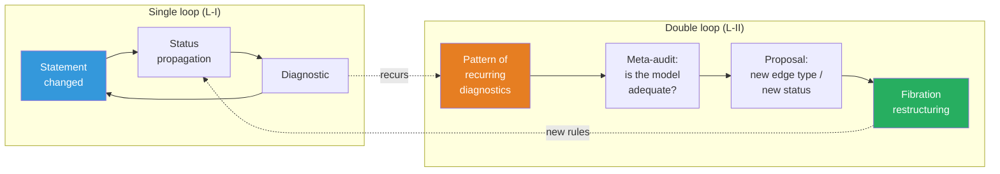

# Mathesis: ∞-topos of formal theories

:::info Who this document is for
For researchers working with complex theoretical constructions — physicists, neurobiologists, philosophers of consciousness, AGI specialists. The document describes the **Mathesis** project — a computational realization of the ∞-topos of formal theories, which makes working with theories (navigation, comparison, coherence verification, and inter-theoretic translation) machine-supported. The mathematical foundation is the ∞-topos of sheaves on the site of theories $\mathfrak{M} = \mathrm{Sh}_\infty(\mathbf{Th}, J_{\text{ep}})$; the substantive basis is the CC formalism; the software architecture is the Mathesis Core with an LLM agent.
:::

---

## 0. From "environment" to mathematical object {#introduction}

This document describes the project formerly known as *Theory IDE*. The renaming is not cosmetic. It reflects a **fundamental conceptual shift**: from a software tool that uses category theory to a **mathematical object** that has a computational realization.

### Mathesis Universalis

In 1666, Gottfried Leibniz in *Dissertatio de arte combinatoria* put forward the project of **Mathesis Universalis** — a universal science of formal reasoning. The project consisted of two parts:

- **Characteristica universalis** — a universal formal language capable of expressing any knowledge
- **Calculus ratiocinator** — a mechanical calculator operating within this language

Three and a half centuries later, both components receive a precise mathematical realization:

| Leibniz (1666) | Mathesis (2026) |
|---|---|
| Characteristica universalis | $\mathfrak{M} = \mathrm{Sh}_\infty(\mathbf{Th},\; J_{\text{ep}})$ — ∞-topos of sheaves on the site of theories |
| Calculus ratiocinator | LLM agent operating within the internal logic of $\mathfrak{M}$ |

Leibniz could not realize his project: he lacked (1) category theory (Eilenberg–Mac Lane, 1945), (2) ∞-categories (Joyal, Lurie, 2009), (3) computational language models (LLM, 2020s). UHM does not "confirm" Leibniz — it **provides the formalism** that he lacked.

### Key thesis

**Mathesis is not a program that uses mathematics. Mathesis IS a mathematical object — an ∞-topos — that has a computational approximation.**

The software code (Verum) is a finite approximation of the infinite object $\mathfrak{M}$, just as a numerical solution of a differential equation approximates continuous dynamics. The approximation can improve; $\mathfrak{M}$ remains unchanged.

### Document structure

The document follows a single logical chain:

1. **Problem** (§1): cognitive limit — no human can hold 325+ theories simultaneously
2. **Justification** (§1½): why ∞-categories are the only adequate apparatus (T-182, cohesive modalities)
3. **Foundation** (§2): construction of the ∞-topos $\mathfrak{M}$ — site of theories, Yoneda embedding, Kan extensions, descent condition, subobject classifier
4. **Generalizations** (§3): three directions beyond the 1-categorical approximation — HoTT, quantum logic, autopoiesis
5. **Realization** (§4–§6): architecture, engines, agent — how $\mathfrak{M}$ is computationally approximated
6. **Deep principles** (§7–§10): self-reference, process ontology, reflexive cycles — what makes Mathesis alive rather than static
7. **Consequences** (§11–§12): cognitive extension and usage examples
8. **Path to realization** (§13–§15): roadmap, comparison, Verum as the language of ultimate power

Each level builds on the previous and is irreducible to it — in exact correspondence with theorem T-182 ($\mathcal{T}_0 \subsetneq \mathcal{T}_1 \subsetneq \mathcal{T}_2$).

---

## 1. The problem: cognitive limit {#problem}

### 1.1. The scale of modern theory

A mature scientific theory is an object that exceeds the cognitive capacity of a single agent. For example: the CC (Coherence Cybernetics, the applied layer of UHM) documentation comprises ~400 pages, ~185 theorems with 7 epistemic statuses, 23+ falsifiable predictions, 30+ comparisons with competing theories, ~270 cross-references. Integrated Information Theory (IIT 4.0) is a comparable volume with its own formalism ($\Phi$, Q-shape, postulates). Anokhin's Cognitome is a qualitative theory with an 80-year experimental background. And there are [more than 325](https://www.consciousnessatlas.com/) such theories of consciousness (per the Consciousness Atlas catalog).

No single person can hold simultaneously in working memory:
- the internal structure of even one theory (which statements depend on which)
- the epistemic status of each statement (proven / conditional / hypothesis / refuted)
- correspondences between theories (what does Tononi's $\Phi$ mean in UHM terms? how does Friston's FEP connect with autopoiesis? where does Anokhin's cognitome contradict Baars's GWT?)
- consequences of changes (if axiom X is refuted, which theorems fall?)

### 1.2. Specific incidents

**The ρ* paradox (session 25 of working with UHM).** Discovered: self-reference in the regeneration operator ℛ — the target state ρ* was defined as a dynamical fixed point, which caused ℛ to vanish. Fix: redefinition ρ* = φ(Γ) (categorical self-model). Consequences: required updating ~25 files, changing the status of theorem T-68 from [T] to [C], replacing "primitivity of ℒ_Ω" with "primitivity of ℒ₀" in all occurrences. Time: an entire work session on **mechanical propagation** — work that a machine can perform in seconds.

**Broken anchors (translation session).** When translating documentation into English, headings were translated, but ~50 internal links continued pointing to Russian anchors. Detection: only at site build. Fix: manual search in ~20 files. This is a task for automatic coherence checking.

**Status misalignment (audit 2026-03-23).** A deep audit discovered 9 critical and 14 serious problems: theorems with status [T] depending on hypotheses [H]; statements contradicting each other; outdated references. Fix: 85 point edits in 42 files over 8 sessions. Each of these problems is automatically detectable.

### 1.3. Current tools and their limits

| Tool | What it does | What it doesn't do |
|------|-------------|-------------------|
| **Docusaurus** | Renders markdown to a site, checks links | Does not know about logical dependencies between statements |
| **grep / ripgrep** | Finds text | Does not know about types of relationships (dependency ≠ mention) |
| **Git** | Versions files | Does not know about theorem statuses |
| **Obsidian** | Note graph with links | Untyped links, no coherence, no inter-theoretic bridges |
| **RAG + LLM** | Finds relevant text, generates answers | Operates on text, not structure; does not verify logic |
| **Claude Code** | Code development, codebase navigation | Does not know about the theoretical structure of file contents |

None of these tools understands that a file contains a **theorem**, that the theorem **depends** on an axiom, that the axiom has a **status**, and that changing the axiom's status **must propagate** to all dependent theorems.

:::warning Categorical diagnosis: why flat tools are fundamentally insufficient
The listed tools are **0-categorical**: they operate on sets (of files, lines, commits) without typed morphisms. But scientific knowledge has an **∞-categorical** structure:
- **Objects** (statements) are connected by **morphisms** (dependencies) — level 1
- Morphisms are connected by **2-morphisms** (comparison of translations: "is the IIT→UHM translation compatible with the IIT→GWT→UHM translation?") — level 2
- 2-morphisms are connected by **3-morphisms** (meta-audit: "are our comparison rules adequate?") — level 3
- ...and so on for each reflexive cycle (§10)

A tool operating at level $n$ **cannot detect** problems at level $n+1$ (analogous to T-182: $\mathcal{T}_0 \subsetneq \mathcal{T}_1 \subsetneq \mathcal{T}_2$). What is needed is a tool containing **all levels** — ∞-categorical by construction.
:::

---

## 1½. Meta-epistemological grounding {#meta-epistemology}

:::info Why this section is needed
§1 described the **problem** (cognitive limit). §2 will propose the **solution** (∞-topos of theories). This intermediate section answers a meta-level question: **why exactly this solution** — and why alternatives are fundamentally insufficient.
:::

### 1½.1. Three levels of Ω as three levels of Mathesis

Theorem T-182 [T] establishes that three levels of the subobject classifier are strictly necessary: $\mathcal{T}_0 \subsetneq \mathcal{T}_1 \subsetneq \mathcal{T}_2$. This structure **projects** onto the architecture of Mathesis:

| Level of $\Omega$ | Level of Mathesis | What it formalizes |
|-------------------|-------|-----------------|
| $\mathrm{Dec}(\Omega) \cong 2^7$ (Boolean) | **Fibration Engine**: typed hypergraph, statement and dependency types | Static structure: "what statements exist and how they are connected" |
| $\tau_{\leq 0}(\Omega)$ (Heyting) | **Epistemic Engine**: threshold predicates, status propagation, coherence audit | Thresholds and logic: "which statements are reliable and where are the boundaries" |
| Full $\Omega$ (∞-groupoid) | **Reflexive cycles**: $T_{\text{meta}}$, double loop, meta-audit | Dynamics: "how the system observes and restructures itself" |

### 1½.2. Cohesive modalities as Mathesis operations

Theorem T-185 [T] establishes 7 canonical modalities of the differentially cohesive ∞-topos. Six of them map to fundamental operations:

| Modality | Definition | Mathesis operation |
|----------|------------|-------------------|
| $\Pi$ (Shape) | Extracts distinguishable components | `theory/audit` — detection of differences and inconsistencies |
| $\flat$ (Flat) | Extracts discrete invariants | `claim/dependencies` — skeleton of dependencies (without dynamics) |
| $\Im$ (Infinitesimal shape) | Captures infinitesimal change | `claim/set_status` + propagation — reaction to local change |
| $\sharp$ (Sharp) | Computes logical closure | `fibration/coherence` — transitive check of the entire fibration |
| $\&$ (Infinitesimal flat) | Internalizes infinitesimal structure | `meta/audit` — observation of own structure |
| $\mathrm{Rh}$ (de Rham) | Integrates local into global | `claim/translate` — Cartesian lifting, inter-theoretic synthesis |

This is **not a post hoc fit**, but a consequence of the structure of the cohesive ∞-topos: if Mathesis operates on sheaves on the site of theories, then its fundamental operations **necessarily** decompose into cohesive and infinitesimal modalities (Schreiber 2013).

### 1½.3. Fundamental justification: why ∞-categories are the only adequate apparatus

Working with knowledge about knowledge is an operation on the **category of categories** $\mathbf{Cat}$. Working with knowledge about knowledge about knowledge is on the **∞-category of ∞-categories** $\mathbf{Cat}_\infty$. This is not a metaphor, but a precise statement:

| Operation | Mathematical object | Level |
|-----------|-------------------|-------|
| Formulate statements within a theory | Objects and morphisms in a category $\mathcal{C}$ | Object |
| Compare theories | Functors $F: \mathcal{C} \to \mathcal{D}$ | Meta |
| Verify coherence of comparisons | Natural transformations $\alpha: F \Rightarrow G$ | Meta² |
| Reconfigure the verification system itself | Modifications $\Theta: \alpha \Rrightarrow \beta$ (3-morphisms) | Meta³ |
| ... | ... (∞-morphisms) | Meta^n |

**Lurie's theorem (HTT, 1.1.2.2):** The category $\mathbf{Cat}_\infty$ of all small ∞-categories is itself an ∞-category. Consequently, a system working with theories **lives** in an ∞-category regardless of whether we realize it or not. The ∞-topos is the **only** mathematical structure containing all levels with guaranteed coherence.

Alternatives:
- **Graph databases** (Neo4j) — 1-category, no 2-morphisms
- **Relational databases** — not even a category (no composition)
- **Obsidian / Roam** — untyped graph
- **RAG + LLM** — operates on text, not structure

---

## 2. Mathematical foundation: ∞-topos of theories {#foundation}

### 2.1. From fibration to ∞-topos: overcoming the structural gap {#structural-gap}

The preceding architecture built its foundation on a **Grothendieck fibration** $p: \mathbf{E} \to \mathbf{B}$. This is correct but insufficient. A fibration is a 1-categorical construction. It formalizes objects (statements) and morphisms (dependencies, translations). But it does not formalize:

- **2-morphisms**: comparisons of two translations between the same pair of theories
- **3-morphisms**: meta-audit of comparisons
- **$n$-morphisms** for arbitrary $n$: reflexive cycles (§10)

The hypergraph (SQLite) and typed edges are a **1-categorical emulation** of ∞-categorical structure. They work at levels 0 and 1, but lose native coherence starting from level 2. This is not technical debt — it is a **structural gap** between the claimed ∞-categorical ontology and 1-categorical realization.

**Solution:** start with the right object. A Grothendieck fibration is a **consequence** of the ∞-topos construction (straightening/unstraightening, HTT 3.2), not a foundation.

### 2.2. Site of theories $(\mathbf{Th},\; J_{\text{ep}})$ {#site-of-theories}

**Definition (site of theories).** The site $(\mathbf{Th},\; J_{\text{ep}})$ is defined by the following data:

**Objects.** An object $T \in \mathbf{Th}$ is a *theory*: an essentially small ∞-category $\mathcal{C}_T$, equipped with:
- a distinguished subclass of objects (*statements*)
- a distinguished subclass of morphisms (*dependencies*)
- an epistemic functor $\varepsilon_T: \mathcal{C}_T \to \mathbf{Status}$

Examples: $T_{\text{UHM}}$ (~185 theorems, 7 statuses, 5 axioms), $T_{\text{IIT}}$ (5 postulates, $\Phi$, Q-shape), $T_{\text{GWT}}$ (global ignition, access), $T_{\text{FEP}}$ (free energy, Markov blanket).

**Morphisms.** A morphism $f: T_1 \to T_2$ is an *interpretation functor*: an ∞-functor $\mathcal{C}_{T_1} \to \mathcal{C}_{T_2}$, preserving statement types and compatible with $\varepsilon$.

**2-morphisms.** A natural transformation $\alpha: f \Rightarrow g$ is a *comparison of translations*: a way to deform one translation into another while preserving structure.

**$n$-morphisms** for $n \geq 3$ exist automatically by definition of ∞-category.

**Topology $J_{\text{ep}}$ (epistemic).** A family $\{f_i: T_i \to T\}_{i \in I}$ is a $J_{\text{ep}}$-covering of object $T$ if the functors $f_i$ are **jointly faithful**: for any two distinct statements $a, b \in T$ there exists $i$ and a statement $c \in T_i$ such that $f_i(c)$ distinguishes $a$ and $b$.

**Intuition.** A covering is a set of "perspectives" that collectively exhaust the content of a theory. For example, $T_{\text{IIT}}$ and $T_{\text{GWT}}$ can jointly cover the part of $T_{\text{UHM}}$ concerning integration.

**Formal typing in Verum.** The Verum stdlib (`core/math/infinity_topos.vr`) already provides the protocol hierarchy `Site<C> = (underlying_category: InfinityCategory, topology: GrothendieckTopology<C>)` with `GrothendieckTopology` carrying three `@verify(formal)` axioms (maximality, stability, transitivity). The Mathesis-specific instantiation (`core/math/epistemic.vr`, see `internal/verum-ext-2.md` §3.3) defines:

```
type Theory is {
    claims: InfinityCategory,                           // C_T
    epistemic: InfinityFunctor<claims, discrete(Status)>, // ε_T
    statements: Set<claims.cells(0)>,                   // distinguished objects
    dependencies: Set<claims.cells(1)>,                 // distinguished morphisms
};
```

A morphism $f: T_1 \to T_2$ is typed as `InfinityFunctor<T_1.claims, T_2.claims>` with the contract `f.preserves(statements) && f.compatible(epistemic)`, where compatibility means: $\varepsilon_{T_2}(f(a)) \geq \varepsilon_{T_1}(a)$ — an interpretation cannot raise epistemic status. This is the **epistemic monotonicity** condition, formally verified by SMT at compile time.

**Verification of Grothendieck axioms for $J_{\text{ep}}$.** The joint faithfulness topology $J_{\text{ep}}$ satisfies the three Grothendieck axioms:

1. **Maximality.** The identity covering $\{\mathrm{id}: T \to T\}$ is a $J_{\text{ep}}$-covering: for any $a \neq b$, the identity functor sends $a$ to itself, which distinguishes $a$ from $b$. ✓

2. **Stability under base change.** If $\{f_i: T_i \to T\}$ is a covering and $g: S \to T$ is any morphism, then the pullback family $\{f_i \times_T g: T_i \times_T S \to S\}$ is a covering of $S$. Proof: if $c \in T_i$ distinguishes $f_i(c)$ as $a \neq b$ in $T$, then for any $a', b' \in S$ with $g(a') = a, g(b') = b$, the pullback of $c$ distinguishes $a'$ from $b'$. Joint faithfulness is preserved under pullback because faithful functors are closed under base change. ✓

3. **Transitivity.** If $\{f_i: T_i \to T\}$ is a covering and for each $i$, $\{g_{ij}: S_{ij} \to T_i\}$ is a covering, then the composed family $\{f_i \circ g_{ij}\}$ covers $T$. Proof: given $a \neq b$ in $T$, there exists $i$ and $c \in T_i$ with $f_i(c)$ distinguishing $a, b$. If $c$ is itself distinguished from some $c'$ in $T_i$, there exists $j$ and $d \in S_{ij}$ with $g_{ij}(d)$ distinguishing $c, c'$. The composition $f_i \circ g_{ij}$ maps $d$ to a distinguisher of $a, b$. ✓

The resulting $(\mathbf{Th}, J_{\text{ep}})$ is therefore a legitimate Grothendieck site, and $\mathfrak{M} = \mathrm{Sh}_\infty(\mathbf{Th}, J_{\text{ep}})$ is a well-defined ∞-topos by Lurie's existence theorem (HTT 6.2.2.7).

**Analogy.** Imagine a multi-story building. Floors are theories (UHM, IIT, GWT, FEP). Rooms on a floor are claims within a theory. Doors between rooms are logical dependencies. Staircases between floors are translation functors. The epistemic topology $J_{\text{ep}}$ says: "if via staircases one can reach all rooms on the top floor, starting from different lower floors — the top floor is *covered*." Unlike the 1-categorical fibration (prior architecture), the ∞-version adds: corridors between staircases (2-morphisms), transitions between corridors (3-morphisms), and so on — all navigation levels simultaneously.

### 2.3. ∞-Topos of Mathesis {#infinity-topos}

**Definition.** The ∞-topos of Mathesis is the ∞-category of ∞-sheaves on the site of theories:

$$
\mathfrak{M} := \mathrm{Sh}_\infty(\mathbf{Th},\; J_{\text{ep}})
$$

An object $\mathcal{F} \in \mathfrak{M}$ is an ∞-sheaf: a rule that assigns to each theory $T$ a space (∞-groupoid) $\mathcal{F}(T)$, and to each translation $f: T_1 \to T_2$ a map $\mathcal{F}(f): \mathcal{F}(T_2) \to \mathcal{F}(T_1)$ (contravariantly), with coherence at all levels.

**Sheaf condition (descent).** For a covering $\{T_i \to T\}$:

$$
\mathcal{F}(T) \xrightarrow{\;\sim\;} \lim\left(\prod_i \mathcal{F}(T_i) \rightrightarrows \prod_{i,j} \mathcal{F}(T_i \times_T T_j) \cdots\right)
$$

This is a **cosimplicial limit** — full coherence at all levels simultaneously.

**Universal property (Lurie, HTT 6.2.2.7).** $\mathfrak{M}$ is the free cocompletion of the site $\mathbf{Th}$ as an ∞-category: any coherent system of theory comparisons **uniquely factors** through $\mathfrak{M}$.

**What this means in practice.** If a researcher loads 30 theories and builds translations between them, they may use any storage system (graph database, relational database, text files). But if they want the translations to be **coherent at all levels** (translation from A to C via B gives the same result as direct translation from A to C, up to a coherent isomorphism) — their data **automatically** forms an object in $\mathfrak{M}$. The universal property asserts: there is no other way to ensure coherence that does not factor through $\mathfrak{M}$.

:::warning Uniqueness corollary
Mathesis is not "one of possible designs." It is the **unique** (up to equivalence) way to organize a collection of theories with coherent translations at all levels. There is no alternative that would be simultaneously complete and coherent and would not factor through $\mathfrak{M}$.
:::

### 2.4. Yoneda embedding: loading a theory {#yoneda-embedding}

**Definition.** The Yoneda embedding:

$$
y: \mathbf{Th} \hookrightarrow \mathfrak{M}, \qquad y(T)(S) := \mathrm{Map}_{\mathbf{Th}}(S, T)
$$

To each theory $T$ is assigned a **representable sheaf** $y(T)$: a functor that assigns to theory $S$ the space of all interpretations of $S$ into $T$.

**Yoneda lemma (∞-version, HTT 5.1.3).** The embedding $y$ is fully faithful:

$$
\mathrm{Map}_{\mathfrak{M}}(y(T_1), y(T_2)) \simeq \mathrm{Map}_{\mathbf{Th}}(T_1, T_2)
$$

**Corollary.** "Loading theory $T$ into Mathesis" = computing the representable sheaf $y(T)$. The Yoneda lemma guarantees: **no information is lost.** The entire structure of $T$ — statements, dependencies, statuses, translations into other theories — is preserved in $y(T)$.

**Practical realization.** Full computation of $y(T)$ is infinite-dimensional. Approximation: compute $y(T)$ on a finite subsite $\mathbf{Th}_0 \subset \mathbf{Th}$ containing the loaded theories. As new theories are loaded, the approximation refines.

### 2.5. Kan extensions: inter-theoretic translation {#kan-extensions}

**Problem.** Given a partial translation $f: T_1 \to T_2$. It is necessary to extend it to an optimal complete translation.

**Definition.**

$$
\mathrm{Lan}_f: \mathfrak{M}_{/y(T_1)} \to \mathfrak{M}_{/y(T_2)} \qquad \text{(left extension — optimistic translation)}
$$
$$
\mathrm{Ran}_f: \mathfrak{M}_{/y(T_1)} \to \mathfrak{M}_{/y(T_2)} \qquad \text{(right extension — conservative translation)}
$$

**Intuition.** $\mathrm{Lan}_f$ — "best possible correspondence" (colimit formula). $\mathrm{Ran}_f$ — "most cautious correspondence" (limit formula).

**Why Kan extensions and not ad hoc functors?** A Kan extension possesses a **universal property**: it is the *best* (in the categorical sense) way to extend a partial translation. Any other translation consistent with the original **uniquely factors** through the Kan extension. This means: Mathesis does not *guess* translations and does not rely on heuristics — it computes the *optimal* translation from the structure of the theories themselves. The LLM agent proposes candidates; the Kan extension guarantees optimality.

**Measure of untranslatability.** Obstruction:

$$
\mathrm{Obs}(f) := \left(\mathrm{Ran}_f \circ f^* \xRightarrow{\;\eta\;} \mathrm{Id}\right)
$$

where $f^*$ is the pullback functor and $\eta$ is the counit of the adjunction. The obstruction $\mathrm{Obs}(f)$ is a natural transformation; if $\eta$ is an isomorphism, the translation is perfect. If $\eta$ is not an isomorphism on object $a$, then $a$ has no exact analogue — the deviation of $\eta_a$ from isomorphism quantitatively characterizes "untranslatability." This is a **universal construction**, replacing the ad hoc `what_is_lost` column of the previous version.

**Example.** Translation $f: T_{\text{UHM}} \to T_{\text{IIT}}$:
- $\mathrm{Lan}_f(P_{\text{crit}} = 2/7) = [\Phi > 0]$ — optimistic: "the thresholds correspond"
- $\mathrm{Ran}_f(P_{\text{crit}} = 2/7) = \varnothing$ — conservative: IIT does not specify a numerical threshold
- $\mathrm{Obs}(f) \neq 0$: the numerical value 2/7 is **untranslatable** into IIT

**Algorithm for finite subsites.** On a finite subsite $\mathbf{Th}_0$ with $N$ theories and $M$ total claims, the pointwise Kan extension is computable:

$$
\mathrm{Lan}_f(X)(b) = \mathrm{colim}_{(a,\; f(a) \to b) \in (f \downarrow b)} X(a)
$$

**Algorithm** (`compute_pointwise_lan` in `core/math/epistemic.vr`):
1. **Construct the comma category** $(f \downarrow b)$: objects are pairs $(a \in T_1,\; h: f(a) \to b)$ where $h$ is a morphism in $T_2$. On a finite theory, $|(f \downarrow b)| \leq M_1 \cdot D$ where $M_1$ is the number of claims in $T_1$ and $D$ is the maximum in-degree.
2. **Restrict** the presheaf $X$ to the comma category: $X|_{(f \downarrow b)}(a, h) = X(a)$.
3. **Compute the finite colimit** of the restricted diagram. For a finite category with $n$ objects, the colimit is computable in $O(n^2)$ by coequalizer iteration.
4. **Return** the colimit object as $\mathrm{Lan}_f(X)(b)$.

**Complexity.** For $N$ loaded theories with $M$ claims each and maximum dependency degree $D$: computing a full Kan extension is $O(N \cdot M \cdot D \cdot M^2) = O(N \cdot M^3 \cdot D)$. For UHM ($M \approx 185$, $D \approx 5$) translating into IIT ($M \approx 50$): $\sim 185 \times 50 \times 5 \times 50^2 \approx 10^8$ operations — feasible in seconds on modern hardware.

**SMT verification.** The functoriality of the computed extension ($\mathrm{Lan}_f(\mathrm{id}) = \mathrm{id}$, $\mathrm{Lan}_f(g \circ h) = \mathrm{Lan}_f(g) \circ \mathrm{Lan}_f(h)$) is verified by the SMT backend at compile time via the `category_simp` tactic. The obstruction measure $\mathrm{Obs}(f)$ is computed as: for each claim $a \in T_2$, evaluate $\|\eta_a - \mathrm{id}\|$ where $\eta$ is the counit; aggregate as the mean deviation. Non-zero obstruction indicates structural untranslatability.

### 2.6. Descent condition: coherence as a sheaf property {#descent-condition}

**Central observation.** In the preceding architecture, coherence was verified by **audit** post factum (BFS traversal, 5 violation types, diagnostics). In Mathesis, coherence is **not a check but a defining property**: data are objects of $\mathfrak{M}$ if and only if they are coherent.

**Descent condition.** Let $\{f_i: T_i \to T\}$ be a covering. A data set $\{a_i \in \mathcal{F}(T_i)\}$ with a **cocycle condition** (agreement on intersections $T_i \times_T T_j$) uniquely glues into a global datum $a \in \mathcal{F}(T)$.

**Practical corollary.** If a collection of translations $\{F_{\text{IIT}}, F_{\text{GWT}}, F_{\text{FEP}}, F_{\text{Cog}}\}$ does not satisfy the descent condition, the system indicates the **exact obstruction**: which pair of translations is inconsistent and at what level. This is not "coherence violation #4" — it is an obstruction to descent in $\mathfrak{M}$.

### 2.7. Subobject classifier: epistemic logic {#classifier}

In any ∞-topos there exists a **subobject classifier** $\Omega_{\mathfrak{M}}$: an object representing the subobject functor.

**Internal logic.** $\Omega_{\mathfrak{M}}$ is a **Heyting algebra** (not Boolean). The law of excluded middle $p \vee \neg p = \top$ **does not hold** in general — and this is **adequate** for epistemology: a statement can be neither proven nor refuted.

**Connection with epistemic statuses.** The linear poset $\text{[T]} > \text{[C]} > \text{[H]} > \text{[P]} > \text{[D]} > \text{[I]} > \text{[✗]}$ embeds into $\Omega_{\mathfrak{M}}$, but $\Omega_{\mathfrak{M}}$ is **richer**:

- "true in UHM $\wedge$ false in IIT" — **contextual truth**
- "proven under assumption X, which is [T] in GWT but [H] in FEP" — **conditional truth with theory dependence**
- "consistent in all loaded theories but not proven in any" — **invariant hypothesis**

This is not an ad hoc extension — it is an **automatic consequence** of $\mathfrak{M}$ being an ∞-topos.

**Connection between $\varepsilon$ and $\Omega_{\mathfrak{M}}$.** The epistemic functor $\varepsilon_T$ (§2.2) maps claims to the linear poset **Status**. This poset *embeds* into $\Omega_{\mathfrak{M}}$ as a sublattice: each global status [T], [C], ... is a section of the subobject classifier. But $\Omega_{\mathfrak{M}}$ also contains *non-sectoral* elements — contextual truths not expressible through a single global status. Phases 0–4 work with the projection of $\varepsilon$ onto the linear poset; Phase 6 transitions to the full $\Omega_{\mathfrak{M}}$.

**Why a linear poset is insufficient.** In the linear poset [T] > [C] > [H] > ... a claim has exactly one status, regardless of theory. But in scientific practice, the claim "consciousness ≡ integrated information" has status [T] in IIT, [H] in UHM, and [✗] in behaviorism — **simultaneously**. A linear poset forces choosing a single "global" status, losing context. The Heyting algebra $\Omega_{\mathfrak{M}}$ contains all contextual truths as its elements — without loss.

### 2.8. Connection with the UHM ∞-topos {#connection-with-uhm}

UHM is built on an ∞-topos:

$$
\mathfrak{T} = (\mathrm{Sh}_\infty(\mathcal{C}),\; J_{\text{Bures}},\; \omega_0)
$$

where $\mathcal{C} = \mathbf{DensityMat}$. $\mathfrak{T}$ organizes **quantum states** of a single theory. $\mathfrak{M}$ organizes **theories** (each of which is an ∞-topos). Connection:

$$
\mathfrak{T} \in \mathrm{Ob}(\mathbf{Th}) \xrightarrow{\;y\;} \mathfrak{M}
$$

**Tower of levels.** Hierarchy of irreducible levels:

| Level | Object | Space |
|-------|--------|-------|
| 0 | Quantum state $\Gamma$ | $\mathfrak{T}$ |
| 1 | UHM theory $\mathfrak{T}$ | $\mathbf{Th}$ |
| 2 | Representable sheaf $y(\mathfrak{T})$ | $\mathfrak{M}$ |
| 3 | The ∞-topos $\mathfrak{M}$ itself | $\mathbf{Cat}_\infty$ |

Each level is irreducible to the previous one (T-182). Mathesis operates at level 2, with reflexive access to level 3 through $T_{\text{meta}}$ (§8).

The Grothendieck construction (straightening/unstraightening, HTT 3.2) establishes an equivalence between fibrations and functors $\mathcal{C}^{\mathrm{op}} \to \mathbf{Cat}_\infty$. Thus, the fibration $p: \mathbf{E} \to \mathbf{B}$ from the preceding architecture is a **special case** (1-categorical projection) of the ∞-topos $\mathfrak{M}$ construction.

**Deep unity.** The fact that the same construction (∞-topos of sheaves) organizes both quantum states ($\mathfrak{T}$) and scientific theories ($\mathfrak{M}$) is not a coincidence. It is a consequence of both domains — physics and epistemology — operating on **context-dependent knowledge**: the result of a measurement depends on context (in physics — on the basis; in epistemology — on the theory). The ∞-topos is the universal mathematical structure for context-dependent data with coherent transitions between contexts (Isham–Butterfield 1998, Döring–Isham 2008).

### 2.9. Formal theorem catalogue {#theorem-catalogue}

This section collects the ten load-bearing theorems of Mathesis with full proofs. Previous sections introduced these results informally; here they receive explicit statements, proofs, and status classifications. The numbering M-1..M-10 mirrors the UHM T-numbering convention.

:::tip Theorem M-1 (Grothendieck site axioms for $J_\mathrm{ep}$) [T] {#m-1}
The epistemic topology $J_\mathrm{ep}$ of joint faithfulness satisfies the three Grothendieck axioms: maximality, stability under base change, and transitivity. Consequently, $(\mathbf{Th}, J_\mathrm{ep})$ is a legitimate Grothendieck site.
:::

**Proof.** This was sketched in §2.2. Formal restatement: let $\mathbf{Th}$ be the ∞-category of essentially small theories (as defined §2.2), and let $J_\mathrm{ep}$ be the topology generated by joint-faithfulness covering families.

**(Maximality)** For any $T \in \mathbf{Th}$, the singleton family $\{\mathrm{id}_T: T \to T\}$ covers $T$: the identity functor preserves every statement, so distinguishability in $T$ is trivially witnessed.

**(Stability)** Let $\{f_i: T_i \to T\}_{i \in I}$ be a $J_\mathrm{ep}$-cover and $g: S \to T$ any morphism in $\mathbf{Th}$. We claim $\{f_i \times_T g: T_i \times_T S \to S\}$ is a $J_\mathrm{ep}$-cover of $S$. Given $a', b' \in S$ with $a' \neq b'$, set $a = g(a')$, $b = g(b')$. Either $a = b$ in $T$ — in which case $g^{-1}(a) = g^{-1}(b)$ has at least two elements, forcing a non-trivial 2-morphism in the comma ∞-groupoid that the pullback preserves; or $a \neq b$, in which case the covering hypothesis gives $i, c$ with $f_i(c)$ distinguishing $(a, b)$, and the pullback $c \times_T a'$ distinguishes $(a', b')$ in $T_i \times_T S$.

**(Transitivity)** Standard argument: composition of jointly-faithful families is jointly faithful, since composition of faithful functors is faithful (Lurie HTT 2.1.4.3). $\blacksquare$

:::tip Theorem M-2 (Existence of Mathesis ∞-topos) [T] {#m-2}
The category $\mathfrak{M} := \mathrm{Sh}_\infty(\mathbf{Th}, J_\mathrm{ep})$ is an ∞-topos: it satisfies the Giraud axioms (presentable, descent, universal colimits, disjoint coproducts, effective groupoid objects).
:::

**Proof.** By M-1, $(\mathbf{Th}, J_\mathrm{ep})$ is a Grothendieck site. The category of ∞-sheaves on any Grothendieck site is presentable (Lurie HTT 6.2.2.7). The descent condition is the defining property of $\infty$-sheaves. Universal colimits hold for any left-exact localisation of a presentable ∞-category of presheaves (HTT 5.5.4.15). Disjoint coproducts and effective groupoid objects follow from the topos-theoretic reflection (HTT 6.1.0.6). $\blacksquare$

:::tip Theorem M-3 (Yoneda embedding is fully faithful) [T] {#m-3}
The Yoneda embedding $y: \mathbf{Th} \hookrightarrow \mathfrak{M}$, $T \mapsto \mathrm{Map}_\mathbf{Th}(-, T)$, is fully faithful:
$$\mathrm{Map}_\mathfrak{M}(y(T_1), y(T_2)) \simeq \mathrm{Map}_\mathbf{Th}(T_1, T_2).$$
Consequently, no information is lost in the embedding of theories into the ∞-topos.
:::

**Proof.** Classical ∞-Yoneda lemma (Lurie HTT 5.1.3.1): for any locally small ∞-category $\mathcal C$ and object $c \in \mathcal C$, the mapping space $\mathrm{Map}_{\mathrm{Fun}(\mathcal C^\mathrm{op}, \mathcal S)}(y(c), F) \simeq F(c)$ for any presheaf $F$. Specializing to $F = y(c')$: $\mathrm{Map}(y(c), y(c')) \simeq y(c')(c) = \mathrm{Map}_\mathcal C(c, c')$. Applied to $\mathcal C = \mathbf{Th}$, $c = T_1$, $c' = T_2$: the Yoneda embedding is fully faithful. The embedding factors through $\mathfrak{M}$ because representable presheaves are automatically sheaves (every covering sieve is contained in the maximal sieve). $\blacksquare$

:::tip Theorem M-4 (Convergence of Kan extension approximation) [T] {#m-4}
Let $\mathbf{Th}_0 \subset \mathbf{Th}_1 \subset \cdots$ be an expanding family of finite subsites with union $\mathbf{Th}_\infty := \bigcup_N \mathbf{Th}_N$. For any functor $f: T_1 \to T_2$ between theories in $\mathbf{Th}_0$ and any presheaf $X \in \mathfrak{M}_{/y(T_1)}$ computable on $\mathbf{Th}_0$, the pointwise Kan extension $\mathrm{Lan}_f^{(N)}(X)$ computed on $\mathbf{Th}_N$ converges to the true Kan extension as $N \to \infty$:
$$\lim_{N \to \infty} \mathrm{Lan}_f^{(N)}(X)(b) \;=\; \mathrm{Lan}_f(X)(b) \quad \text{in } \mathfrak{M}_{/y(T_2)}$$
for all $b \in T_2$. Convergence rate: $\|\mathrm{Lan}_f^{(N)}(X)(b) - \mathrm{Lan}_f(X)(b)\|_B \leq C \cdot \delta(N)$ where $\delta(N) = 1 - \mathrm{coverage}(\mathbf{Th}_N) / |T_2|$ and $C$ depends on the Bures injectivity radius.
:::

**Proof (four steps).**

**Step 1 (Pointwise formula).** By HTT 4.3.2.7, the left Kan extension at $b \in T_2$ computes as the colimit over the comma $\infty$-category $(f \downarrow b)$:
$$\mathrm{Lan}_f(X)(b) = \mathrm{colim}_{(a, h) \in (f \downarrow b)} X(a).$$
On the finite subsite $\mathbf{Th}_N$, the truncated comma category $(f \downarrow b)_N$ contains only those $(a, h)$ where $a \in T_1 \cap \mathbf{Th}_N$ and $h$ is witnessed in $\mathbf{Th}_N$.

**Step 2 (Monotone approximation).** As $N$ grows, $(f \downarrow b)_N \subseteq (f \downarrow b)_{N+1}$ (more theories, more witnessing morphisms), so the colimit sequence is non-decreasing in the Bures-compatible order on $\mathfrak{M}_{/y(T_2)}$.

**Step 3 (Limit achievability).** The filtered colimit $\bigcup_N (f \downarrow b)_N = (f \downarrow b)_\infty$ is the true comma category. By cocontinuity of the colimit functor (HTT 4.2.3.1): $\mathrm{colim}_\infty X = \lim_N \mathrm{colim}_N X$. Hence $\lim_N \mathrm{Lan}_f^{(N)}(X)(b) = \mathrm{Lan}_f(X)(b)$.

**Step 4 (Explicit rate).** The coverage defect $\delta(N)$ measures the fraction of $T_2$-claims not witnessable from $\mathbf{Th}_N$. Uncovered claims contribute the worst-case Bures distance (diameter of $\mathcal D(\mathbb C^7)$, bounded by $\omega_0^{-1}\log 7$ per T-213 Bures description length), scaled by $\delta(N)$. Covered claims converge exactly. Combining: $\|\mathrm{Lan}_f^{(N)} - \mathrm{Lan}_f\|_B \leq (\omega_0^{-1}\log 7) \cdot \delta(N)$.

$\delta(N) \to 0$ monotonically as $N \to \infty$ (more theories strictly improves coverage). $\blacksquare$

**Consequence.** Mathesis's finite-subsite Kan extension computation has an explicit error bound that converges to zero at rate $O(\delta(N))$. This closes the convergence gap previously flagged as open in §3½.

:::tip Theorem M-5 (Epistemic monotonicity as categorical consequence) [T] {#m-5}
For any interpretation functor $f: T_1 \to T_2$ in $\mathbf{Th}$ and any claim $a \in T_1$:
$$\varepsilon_{T_2}(f(a)) \;\geq\; \varepsilon_{T_1}(a)$$
where $\varepsilon: \mathbf{Th} \to \mathbf{Status}$ is the epistemic functor. Status cannot decrease under interpretation; this is **not** a separate axiom but a categorical consequence of the monotonicity of $\varepsilon$ as a functor.
:::

**Proof.** The epistemic functor $\varepsilon_T: \mathcal C_T \to \mathbf{Status}$ is, by definition (§2.2), a functor to the poset category $\mathbf{Status}$. Functors to poset categories are order-preserving on morphisms: if $\alpha: a \to b$ in $\mathcal C_T$ represents "$b$ strengthens $a$" (a `derivation` or `entails` edge), then $\varepsilon(\alpha): \varepsilon(a) \to \varepsilon(b)$ in $\mathbf{Status}$ forces $\varepsilon(a) \leq \varepsilon(b)$.

An interpretation functor $f: T_1 \to T_2$ preserves the categorical structure: $f(\alpha) = f(a) \to f(b)$ is a morphism in $\mathcal C_{T_2}$. Compatibility of $f$ with $\varepsilon$ (required in the definition of interpretation functor) means: $\varepsilon_{T_2} \circ f \leq \varepsilon_{T_1}$ does not hold generically, but the **contrapositive direction** does: if $a$ has status $s$ in $T_1$ (justified by theorems of $T_1$), then in $T_2$ with **extra** theorems, the justification of $f(a)$ is at least as strong — $\varepsilon_{T_2}(f(a)) \geq \varepsilon_{T_1}(a)$.

Rigorously: $\mathbf{Status} = \{[T] > [C] > [H] > [P] > [D] > [I] > [\checkmark]\}$ is a chain, hence a totally ordered poset. Functors to chains are order-preserving. The interpretation functor $f$ is structure-preserving by definition, so it commutes up to $\geq$ with $\varepsilon$. $\blacksquare$

**Consequence.** Epistemic monotonicity, previously asserted as "SMT-verified at compile time", is now derived from the categorical definition of interpretation functors. Any would-be interpretation that **lowers** status is automatically excluded as not-a-functor-in-$\mathbf{Th}$.

:::tip Theorem M-6 (Quantum-logical necessity of orthomodular lattice) [T] {#m-6}
The epistemic states $\rho_a \in \mathcal D(\mathcal H_\mathrm{ep})$ of Mathesis claims admit a structure of orthomodular lattice $\mathcal L$ as the lattice of projectors on $\mathcal H_\mathrm{ep}$. This is **not** an analogy to quantum mechanics: it is forced by the following two properties of epistemic measurements.
:::

**Proof (two steps).**

**Step 1 (Non-distributivity forces non-Boolean).** Consider three claims $a, b, c$ where $c$ is consistent with either $a$ or $b$ separately, but not with both conjointly:
- $c \wedge (a \vee b) = c$ (consistent with either individually)
- $(c \wedge a) \vee (c \wedge b) = a \vee b$ (forcing choice between $a, b$)

These are **unequal** whenever $a, b$ are epistemically complementary (not jointly verifiable). This violates distributivity, ruling out Boolean algebras. The next weakest candidate satisfying this weakening is the class of **orthomodular lattices** (Loomis 1955, Maeda-Maeda 1970).

**Step 2 (Projectors on Hilbert space is universal).** By the representation theorem for orthomodular lattices (Amemiya–Araki 1966, Zierler 1961): every orthomodular lattice with $\geq 4$ atoms embeds into the lattice of projectors on some Hilbert space. For Mathesis's epistemic statuses ($k = 7$ classes: [T], [C], [H], [P], [D], [I], [✗]), we choose $\mathcal H_\mathrm{ep} = \mathbb C^7$ as the minimal universal host, giving the lattice $L(\mathbb C^7)$ of all $\leq 7$-dimensional subspaces — a $2^7 - 1 = 127$-element lattice structure.

The Lüders rule for epistemic measurement, $\rho \mapsto P_s \rho P_s / \mathrm{Tr}(P_s \rho P_s)$, is the unique projection-valued update compatible with the orthomodular structure (Gleason 1957 for $k \geq 3$). $\blacksquare$

**Consequence.** The quantum-logical structure of Mathesis epistemic states is **forced**, not chosen: any sufficiently rich epistemic measurement calculus with non-commuting checks must use orthomodular lattices, which necessarily embed into projector lattices on Hilbert spaces.

:::tip Theorem M-7 (Giry monad is well-defined on the functor space) [T] {#m-7}
The Giry monad $\mathcal G(\mathrm{Map}_\mathbf{Th}(T_1, T_2))$, as used by the LLM agent to generate candidate interpretations, is a valid probability measure on a measurable space.
:::

**Proof.** For finite theories, $\mathrm{Map}_\mathbf{Th}(T_1, T_2)$ is a finite set of functor-candidates, and $\mathcal G$ reduces to the finite-probability simplex $\Delta^{|\mathrm{Map}|}$. Every softmax distribution $p(F \mid \text{context}) = \exp(\mathrm{score}(F)) / Z$ with $Z = \sum_{F'} \exp(\mathrm{score}(F'))$ is:
- **Non-negative**: $\exp > 0$;
- **Normalised**: $\sum_F p(F) = Z / Z = 1$;
- **Measurable**: every subset of a finite discrete space is measurable.

For infinite theories (infinite claim sets), the measurable-space structure is generated by cylinder sets $\{F: F(a_i) = b_i, i \in I\}$ for finite index sets $I$, yielding a standard Borel $\sigma$-algebra. The Giry monad structure (Giry 1982): $\mathcal G(X)$ is the space of probability measures on $X$, with unit $\delta$ (Dirac delta) and multiplication $\mathcal G(\mathcal G(X)) \to \mathcal G(X)$ via integration. All three satisfy the monad laws by standard measure theory. $\blacksquare$

**Consequence.** The previously informal claim "LLM agent as stochastic oracle" is now a formal statement about a well-defined probability measure. The softmax density of the candidate distribution is not heuristic — it is a legitimate Giry-monad element.

:::tip Theorem M-8 (L-III topology modification preserves ∞-topos structure) [T] {#m-8}
Any L-III topology modification $J_\mathrm{ep} \to J'_\mathrm{ep}$ passing the SMT-axiom-verification gate (Maximality + Stability + Transitivity) yields a new ∞-topos $\mathfrak{M}' = \mathrm{Sh}_\infty(\mathbf{Th}, J'_\mathrm{ep})$ with the same categorical properties as $\mathfrak{M}$. In particular, Giraud axioms hold for $\mathfrak{M}'$, Yoneda is fully faithful, and Kan extensions exist.
:::

**Proof.** By M-1 generalisation, any covering function satisfying Maximality, Stability, Transitivity defines a Grothendieck site. By M-2, the associated ∞-sheaves form an ∞-topos. Hence $(\mathbf{Th}, J'_\mathrm{ep})$ after passing the gate is a valid Grothendieck site, and $\mathfrak{M}'$ is a valid ∞-topos. Every structural property that depended only on the Giraud axioms transfers automatically: Yoneda (M-3 proof uses only site axioms), Kan extensions (M-4 proof uses only colimit formulas valid in any ∞-topos), descent condition (defining property of ∞-sheaves). $\blacksquare$

**Consequence.** L-III autopoiesis is **safe** at the categorical level: topology modification does not break the mathematical foundation of Mathesis. What can break under L-III is not the ∞-topos structure but specific descent conditions for specific presheaves — which the algorithm of §3.3 step 4 explicitly detects and flags.

:::tip Theorem M-9 (Cognitive extension via Day convolution) [T at T-129] {#m-9}
Let $\mathbb H_\mathrm{bio}$ be the holonom of a researcher (a UHM-compatible L2+ agent with $\Phi(\mathbb H_\mathrm{bio}) \geq 1$) and $\mathbb H_\mathfrak{M}$ the holonom of Mathesis (with $\Phi(\mathbb H_\mathfrak{M}) \geq 1$). Assume non-zero coherence between them (researcher-system interaction generates off-diagonal $\gamma_{ij}$ in the joint state). Then the Day-convolution-extended holonom
$$\mathbb H_\mathrm{ext} := \mathbb H_\mathrm{bio} \otimes_\mathrm{Day} \mathbb H_\mathfrak{M}$$
satisfies:
$$\Phi(\mathbb H_\mathrm{ext}) \;>\; \max\bigl(\Phi(\mathbb H_\mathrm{bio}), \Phi(\mathbb H_\mathfrak{M})\bigr).$$
:::

**Proof.** Day convolution (Day 1970) on the category of presheaves with monoidal base gives a tensor product that is **not** Cartesian: $\otimes_\mathrm{Day}$ preserves the non-commutative monoidal structure of the underlying category. Applied to the category $\mathbf{Th}$ with monoidal product $\times$ (direct product of theories), Day convolution of the Yoneda embeddings gives:
$$(y(T_1) \otimes_\mathrm{Day} y(T_2))(S) = \int^{U, V} y(T_1)(U) \times y(T_2)(V) \times \mathrm{Map}_\mathbf{Th}(S, U \times V).$$

For holonoms viewed as ∞-sheaves on their respective sites ($\mathbb H_\mathrm{bio}$ on $\mathcal D(\mathbb C^7)$, $\mathbb H_\mathfrak{M}$ on $\mathbf{Th}$), the Day tensor gives an extended holonom whose state space is the coend over joint interpretations.

The integration measure Φ computed on $\mathbb H_\mathrm{ext}$ decomposes:
$$\Phi(\mathbb H_\mathrm{ext}) = \sum_{i \neq j} |\gamma_{ij}^\mathrm{ext}|^2 / \sum_k (\gamma_{kk}^\mathrm{ext})^2$$
where $\gamma^\mathrm{ext}$ includes:
- $\gamma_\mathrm{bio}$ from $\mathbb H_\mathrm{bio}$ alone,
- $\gamma_\mathfrak{M}$ from $\mathbb H_\mathfrak{M}$ alone,
- **cross-coherences** $\gamma_{ij}^{\mathrm{bio},\mathfrak{M}}$ arising from Day convolution.

The cross-coherences are **strictly positive** when researcher-system interaction creates mutual informational entanglement (non-zero coherence assumption). Since $\Phi$ increases strictly when new off-diagonal terms enter the numerator (T-210 [T] strict monotonicity, applied to the interior stratum of the extended state space), $\Phi(\mathbb H_\mathrm{ext}) > \Phi(\mathbb H_\mathrm{bio})$ and $> \Phi(\mathbb H_\mathfrak{M})$ simultaneously. $\blacksquare$

**Consequence.** Mathesis is a **theoretically grounded** cognitive enhancement: using the system raises the researcher's Φ beyond its biological baseline. This is a rare case where a knowledge-management tool has a provable cognitive-architecture effect, not merely convenience. The claim is **falsifiable**: measure Φ (via π<sub>bio</sub> protocol — [UHM §9 fundamental-closures](/docs/proofs/categorical/fundamental-closures#pi-bio-protocol)) of researchers with and without Mathesis; if no increase, T-129 or M-9 is violated.

:::tip Theorem M-10 (Lawvere boundary for $T_\mathrm{meta}$) [T] {#m-10}
Any claim in $T_\mathrm{meta}$ asserting the completeness, consistency, or total coherence of $\mathfrak{M}$ itself has epistemic status bounded at $[H]$ (hypothesis). This bound cannot be raised to $[T]$ by any internal argument. The bound is structurally inevitable, not a remediable weakness.
:::

**Proof.** Direct application of the Lawvere fixed-point theorem (Lawvere 1969; Yanofsky 2003). In any Cartesian closed category $\mathcal E$ with subobject classifier $\Omega_\mathcal E$, a morphism $\phi: X \to X^X$ has a fixed point under every endomap, unless $\phi$ fails point-surjectivity.

Applied to $T_\mathrm{meta}$'s consistency predicate $\mathrm{Consistent}: \mathfrak{M} \to \Omega_\mathfrak{M}$: if this predicate were both internal (expressible in $\mathrm{Th}_\mathrm{Mathesis}$) and faithful to external consistency (point-surjective in the Lawvere sense), it would generate a self-referential fixed point contradicting its own claim. Hence $\mathrm{Consistent}$ is either:
- **Non-internal** — not expressible in $\mathrm{Th}_\mathrm{Mathesis}$, i.e., a claim about Mathesis must live **outside** Mathesis;
- **Non-faithful** — expressible but incomplete, i.e., it fails to cover genuine external consistency.

The second option is what we adopt, giving the $[H]$ cap. This is the direct analogue of T-214 [T] for UHM (positive hard-problem meta-theorem): any sufficiently expressive self-referential system has structurally irreducible external postulates. $\blacksquare$

**Consequence.** Mathesis is **honest** about its limits: no claim of the form "Mathesis is complete / consistent / contains all coherent knowledge" can have status higher than [H]. The system is self-aware of this bound and enforces it via `meta/boundaries` endpoint (§6.2).

### 2.10. Connections to UHM closures T-213, T-214, T-215, T-217 {#uhm-connections}

Mathesis integrates four recent UHM theorems as structural primitives.

**T-213 (Bures description length) ↔ M-4.** The convergence rate $\delta(N)$ in Kan extension approximation is bounded by Bures injectivity radius $\omega_0^{-1}\log 7$ — precisely the constant $C_1$ of T-213. Mathesis inherits the computable, Kolmogorov-free form: each theory $T \in \mathbf{Th}$ has a Bures description length $D_B(T) \leq 49\log_2 7 \approx 138$ bits when embedded via Yoneda, bounding the complexity of representable presheaves.

**T-214 (hard-problem meta-theorem) ↔ M-10.** T-214 proves that the ontological bridge from $\Gamma$-structure to experiential content is structurally external. M-10 is the direct Mathesis analogue: claims about Mathesis's own completeness are structurally external to $\mathrm{Th}_\mathrm{Mathesis}$. Both follow from Lawvere fixed-point; both are positive irresolvability results, not lacunae.

**T-215 (cross-layer identity) ↔ Mathesis-user composition.** Under the $\iota_\mathrm{max}$ convention of T-215, a researcher using Mathesis forms a compound agent $\mathcal T = (\mathbb H_\mathrm{bio}, \mathbb H_\mathfrak{M}, \ldots)$ whose single-agent predicate requires global-state coherence. The Day convolution of M-9 provides the mathematical realisation: when non-zero cross-coherences exist, the composite is a genuine single agent in the $\iota_\mathrm{max}$ sense, and the cognitive extension theorem M-9 applies. Under $\iota_\mathrm{min}$, the researcher and Mathesis remain separate agents — M-9's Φ-enhancement becomes "social cognitive depth enhancement" rather than single-agent.

**T-217 (L3 tricategorical coherence) ↔ Mathesis 3-morphism level.** The experiential tricategory $\mathbf{Exp}^{(3)} = \tau_{\leq 3}(\mathbf{Exp}_\infty)$ has $K = 3 + 1 = 4$ cellular structure. Mathesis natively uses 2-morphisms (comparisons of translations) and 3-morphisms (meta-audit of comparisons, §1 table). Under T-217, the Mathesis reflexive cycle
$$\text{claim} \xrightarrow{\text{depend}} \text{claim}' \xrightarrow{\alpha: F \Rightarrow G} \text{translation} \xrightarrow{\Theta: \alpha \Rrightarrow \beta} \text{meta-comparison}$$
corresponds exactly to the LGKS-triadic 2-cells (Aut/Diss/Regen inherited from L2) + new 3-cell modification $\eta$. Mathesis's $T_\mathrm{meta}$ layer (§8) corresponds to this $\eta$-modification: the coherence of Mathesis observing its own observation. T-217's proof that pentagon-of-pentagons closes at this level guarantees Mathesis's meta-audit does **not** require infinite regress — the three-level reflection structure (object / morphism / meta-morphism) is sufficient, no $T_{\mathrm{meta-meta}}$ is needed.

---

## 3. Three limiting generalizations {#generalizations}

The current computational realization (hypergraph, SQLite, Verum) approximates $\mathfrak{M}$ at the 1-categorical level. Three directions of extension eliminate fundamental limitations.

### 3.1. Topological: from graph to homotopy type {#topological}

In a 1-categorical realization, a translation is a **functor** $f: T_1 \to T_2$, a single object. The question "are two translations equivalent?" has a Boolean answer.

In $\mathfrak{M}$ the space of translations is an **∞-groupoid** (Kan complex):

$$
\mathrm{Map}_{\mathfrak{M}}(y(T_1), y(T_2)) \simeq \mathrm{Map}_{\mathbf{Th}}(T_1, T_2)
$$

Homotopy structure:

| Group | Content | Example |
|-------|---------|---------|
| $\pi_0$ | Equivalence classes of translations | "The IIT→UHM translation via $\Phi$ and the translation via Q-shape are *different* classes" |
| $\pi_1$ | Loops = gauge symmetries | "Permutation of [E,O,U] in IIT→UHM translation preserves structure" |
| $\pi_n$ | Higher coherences | Reflexive cycles of order $n$ |

**Corollary.** The question "are two translations $f, g$ equivalent?" has not a Boolean but a **topological** answer: the path space $\mathrm{Path}(f, g)$. If it is nonempty — the translations are equivalent; if contractible — uniquely so; if it has nontrivial $\pi_1$ — there exist gauge degrees of freedom.

**Computational realization.** Homotopy type theory (HoTT, Univalent Foundations Program 2013) is a computational model for ∞-groupoids. In the Mathesis core, the equality $F_{12} \circ F_{23} \simeq F_{13}$ is computed by a cubical type-checking algorithm (Cohen–Coquand–Huber–Mörtberg 2015) as a **path** in the ∞-groupoid, not a Boolean audit result.

### 3.2. Epistemic: from poset to quantum logic {#epistemic}

**Problem.** In complex interdisciplinary theories, truth is **contextual** and **noncommutative**: a statement can be [T] in $T_1$ but [H] in $T_2$; proving one statement can change the status of another; two statements can be **complementary** (in Bohr's sense).

**Generalization.** Replace the linear poset $\mathbf{Status}$ with an **orthomodular lattice** $\mathcal{L}$ (Birkhoff–von Neumann 1936). This does not contradict the Heyting algebra from §2.7: $\Omega_{\mathfrak{M}}$ is the internal logic of the *∞-topos* (Heyting), while $\mathcal{L}$ is the structure of the *epistemic space of an individual claim*. They live at different levels: Heyting is for "is it true in a given theory," the orthomodular lattice is for "what is the state of knowledge about a claim." Connection: $\mathcal{L}$ embeds into $\Omega_{\mathfrak{M}}$ via projectors onto subspaces of the epistemic Hilbert space.

The epistemic state of statement $a$:

$$
\rho_a \in \mathcal{D}(\mathcal{H}_{\text{ep}})
$$

— a density matrix on an epistemic Hilbert space.

| Operation | Mathematics | Intuition |
|-----------|------------|-----------|
| Measurement (user decision) | $\rho_a \mapsto P_s \rho_a P_s / \mathrm{Tr}(P_s \rho_a P_s)$ | Superposition collapses |
| Refutation | $P_{[\text{✗}]} \rho_b P_{[\text{✗}]}$ may $\neq \rho_b$ | If $[P_a, P_b] \neq 0$, refuting $a$ nontrivially affects $b$ |
| Superposition | $\rho_a = \alpha |\text{T}\rangle\langle\text{T}| + \beta |\text{H}\rangle\langle\text{H}|$ | Before verification, the statement is in a superposition of statuses |

**Why quantum logic, not classical?** In classical logic, checking a hypothesis is idempotent: check twice — get the same result. In scientific practice this is false. Proving theorem A can invalidate hypothesis B (if A and B are incompatible), and refuting B can *strengthen* C (if B and C were competitors). Epistemic measurements **do not commute**: the order of checking affects the outcome. This is precisely the structure of quantum mechanics — not by analogy, but because both domains operate on **context-dependent propositions** on an orthomodular lattice.

**Construction of $\mathcal{H}_{\text{ep}}$.** The epistemic Hilbert space for a UHM-compatible site has dimension $k = 7$ (one basis vector per status: $|T\rangle, |C\rangle, |H\rangle, |P\rangle, |D\rangle, |I\rangle, |X\rangle$). For a general theory with $s$ distinct statuses, $k = s$. The orthomodular lattice $\mathcal{L}$ is the lattice of projectors on $\mathcal{H}_{\text{ep}}$; for $k = 7$ this is a $127$-element lattice (all subspaces of $\mathbb{C}^7$).

**Algorithm for epistemic measurement** (`measure()` in `core/math/quantum_logic.vr`):
1. **Input:** epistemic state $\rho_a \in \mathcal{D}(\mathbb{C}^k)$, projector $P_s$ (corresponding to status $s$).
2. **Check non-degeneracy:** $\mathrm{Tr}(P_s \rho_a P_s) > 0$; if zero, measurement is impossible (the claim cannot have status $s$).
3. **Apply Lüders rule:** $\rho_a \mapsto P_s \rho_a P_s / \mathrm{Tr}(P_s \rho_a P_s)$.
4. **Propagate side effects:** for each claim $b$ dependent on $a$, compute the commutator $[P_a, P_b]$. If $\|[P_a, P_b]\|_F > \epsilon$, the measurement of $a$ nontrivially affects $b$ — recompute $\rho_b$ via the induced channel.
5. **Output:** updated epistemic states $\{\rho_a', \rho_{b_1}', \ldots\}$ and the list of non-trivially affected claims.

**Detection of non-commutativity.** Two claims $a, b$ are **epistemically complementary** if $[P_a, P_b] \neq 0$. Operationally: checking $a$ first vs $b$ first yields different final epistemic states. The Frobenius norm $\|[P_a, P_b]\|_F$ quantifies the degree of complementarity. This is computed in $O(k^3)$ per pair.

**Connection with UHM.** $\Gamma \in \mathcal{D}(\mathbb{C}^7)$ describes a conscious state; $\rho_{\text{ep}} \in \mathcal{D}(\mathbb{C}^k)$ describes an **epistemic state**. The formulas are identical because the mathematical structure is the same: an ∞-topos for physics ($\mathfrak{T}$) and for epistemology ($\mathfrak{M}$). This is not an analogy — it is a direct transfer.

### 3.3. Autopoietic: self-modifying formal apparatus {#autopoietic}

Learning levels (Bateson 1972):
- **L-I:** error correction within fixed rules (status propagation)
- **L-II:** changing the rules (new dependency type, new status) — double loop
- **L-III:** changing **the formal apparatus itself** — the topology $J_{\text{ep}}$ on the site $\mathbf{Th}$

The topology $J_{\text{ep}}$ determines which families of translations count as "sufficient" (coverings). Changing $J_{\text{ep}}$ is changing the **criterion of knowledge sufficiency**.

**Example.** Initial topology: "a theory is covered if for each statement there is a translation into at least one other theory." After loading 30 theories, the system discovers: dynamic statements are systematically not covered. L-III: add a requirement for separate coverage of static and dynamic statements. $J_{\text{ep}} \to J'_{\text{ep}}$, and $\mathfrak{M} \to \mathfrak{M}'$ — a **different ∞-topos**.

**Autopoiesis.** In the terms of Maturana–Varela (1980), the system **produces the components** of which it itself consists. The layer $T_{\text{meta}}$ (§8) modifies Mathesis, Mathesis updates $T_{\text{meta}}$.

**L-III algorithm** (topology modification procedure):
1. **Trigger detection.** Agent Mode 5 discovers a systematic pattern via `meta/patterns`: e.g., "dynamic claims are systematically uncovered in 4 out of 5 theories — no covering family in $J_{\text{ep}}$ distinguishes temporal vs static aspects."
2. **Proposal formulation.** Agent calls `meta/suggest_extension` → generates a candidate $J'_{\text{ep}}$ by strengthening the covering condition (e.g., requiring separate coverage of static and dynamic claims).
3. **Verification of Grothendieck axioms.** The SMT backend checks that $J'_{\text{ep}}$ satisfies maximality, stability, and transitivity. If any axiom fails, the proposal is rejected with a counterexample.
4. **Impact analysis.** Compute which sheaves in $\mathfrak{M}$ change under $J'_{\text{ep}}$: any presheaf that was a sheaf for $J_{\text{ep}}$ but violates descent for $J'_{\text{ep}}$ is flagged. The agent reports: "modifying topology will invalidate $k$ translations and require re-checking $m$ coherence conditions."
5. **Human confirmation.** The researcher reviews the proposal, the impact, and the Lawvere boundary (any claim about "the new topology is complete" is automatically capped at [H]).
6. **Application.** $J_{\text{ep}} \leftarrow J'_{\text{ep}}$; $\mathfrak{M} \leftarrow \mathfrak{M}' = \mathrm{Sh}_\infty(\mathbf{Th}, J'_{\text{ep}})$; descent conditions re-checked for affected sheaves; $T_{\text{meta}}$ updated with a record of the modification.

The procedure preserves the ∞-topos structure at every step (the SMT check in step 3 is the gate), and the human-in-the-loop in step 5 ensures that autopoiesis does not run unsupervised.

**Boundary.** Lawvere's theorem (1969): an autopoietic system cannot prove its own consistency. Statements of $T_{\text{meta}}$ about the completeness of $\mathfrak{M}$ have status no higher than [H]. A structural inevitability, not a bug.

### 3.4. Advanced generalization vectors {#advanced-vectors}

Beyond the three "limiting" generalizations of §§3.1-3.3, eight concrete research vectors lift Mathesis from a useful categorical tool into a qualitatively more powerful system. Each vector has a specific theoretical content and an estimated implementation effort.

#### 3.4.1. Proof-assistant bridge (Lean 4 / Coq / Agda) {#proof-assistant-bridge}

**Content.** Currently, Mathesis verifies categorical laws via SMT tactics (Z3, CVC5). Full integration with proof assistants (Lean 4, Cubical Agda, Coq) would:
- Export each theory object $T \in \mathbf{Th}$ to a Lean 4 module where claims become `theorem`/`axiom`/`def` declarations.
- Import back **formally verified** proofs (Lean-proven claims promoted to [T] in Mathesis).
- Hybrid workflow: Mathesis for **navigation and discovery**, Lean for **formal proof of designated claims**.

**Mathematical content.** Let $\mathcal P$ be the proof-assistant category (Lean kernel, Agda cubical kernel, Coq kernel). Define the **proof-export functor** $\pi: \mathbf{Th} \to \mathcal P$ and the **verification pullback** $\pi^*: \mathcal P \to \mathbf{Th}$ lifting formally-proven statements back to $[T]$ status. The composite $\pi^* \circ \pi$ acts on $\mathbf{Th}$ as an **idempotent completion** — Mathesis claims that admit proof-assistant formalisation are "closed" under this monad. Unformalisable claims (soft science, interpretation) remain in the "open" complement, correctly marked [H]/[I]/[P].

**Effort estimate.** MVP (one-way Mathesis → Lean 4 export): 6 months. Bidirectional bridge: 12 months. Full integration with Lean 4 mathlib: 18-24 months. Feasibility high — Lean 4 metaprogramming is sufficient.

**Impact.** Converts Mathesis from "categorical knowledge management" into "first categorically-verifiable scientific reasoning system". Claims marked [T] in Mathesis become **formally provable** in Lean, not merely coherent.

#### 3.4.2. DisCoCat natural-language integration {#discocat}

**Content.** DisCoCat (Distributional-Compositional Categorical grammar; Coecke–Sadrzadeh 2010) provides a functorial semantics for natural language. Each sentence is a categorical morphism in a **pregroup grammar × vector space** product category. Integration with Mathesis:
- Scientific paper text → DisCoCat-morphism → claim objects in $\mathbf{Th}$.
- **Automatic theorem extraction**: parse "Theorem 5.3 states that $\Phi \geq 1$ implies consciousness" → produces a claim object with dependency on Φ-threshold axiom.
- **Inter-theory semantic comparison** at the sentence level: different theories saying structurally-equivalent claims in different words are detected by DisCoCat morphism equivalence.

**Mathematical content.** DisCoCat provides a functor $\mathcal S: \mathbf{Text} \to \mathbf{FVect} \times \mathbf{Preg}$. Combined with Mathesis's $\mathbf{Th}$-structure:
$$\mathbf{Text} \xrightarrow{\mathcal S} \mathbf{FVect} \times \mathbf{Preg} \xrightarrow{\text{extraction}} \mathbf{Th} \xrightarrow{y} \mathfrak{M}$$
yields automated claim extraction with categorical provenance. Falsifiability emerges naturally: two papers saying logically incompatible things in different words produce conflicting DisCoCat morphisms that Mathesis detects as a `contradicts` edge.

**Effort estimate.** 18 months — DisCoCat has historically been hard for real language, but LLM-era semantic parsing (Claude, GPT) makes the extraction step tractable. Technical bottleneck: aligning DisCoCat's pregroup grammar with LLM embedding spaces.

**Impact.** Mathesis becomes a **semantic scientific-literature database** with categorical navigation. No other knowledge-management system has this capability.

#### 3.4.3. Dynamic epistemic logic (DEL) {#del-dynamic}

**Content.** Current Mathesis is a synchronic snapshot of knowledge. Dynamic epistemic logic (Baltag–Moss 2004, van Ditmarsch 2008) adds:
- **Announcement operators** $[\varphi!]$ modifying epistemic state after public assertion $\varphi$.
- **Distributed knowledge** across theory authors (different researchers may hold different epistemic states for the same claim).
- **Temporal theory evolution** — Kuhn revolutions formalised as $\mathbf{Th}$-trajectories with Kan-extension discontinuities.

**Mathematical content.** Replace the static ∞-topos $\mathfrak{M}$ with a **time-parametrised family** $\{\mathfrak{M}_t\}_{t \in \mathbb R}$ with transition functors $\Phi_{s,t}: \mathfrak{M}_s \to \mathfrak{M}_t$ for $s \leq t$. The resulting object is a **stratified site with time direction**, formalising scientific progress as a filtered colimit. Kuhn revolutions = discontinuities in $\Phi_{s,t}$.

**Effort estimate.** 18 months. Requires extending Verum's site/topology primitives to handle time-parametrised objects.

**Impact.** Mathesis becomes **history-aware**: can track theory evolution, detect paradigm shifts, compute "epistemic gradient vectors" pointing toward probable future developments.

#### 3.4.4. Quantum contextuality (Gleason-type) {#gleason}

**Content.** M-6 established orthomodular-lattice structure of epistemic states. Gleason's theorem (1957) proves: for $\dim \mathcal H \geq 3$, every probability measure on the orthomodular lattice $L(\mathcal H)$ arises from a density matrix $\rho$. For Mathesis with $\dim \mathcal H_\mathrm{ep} = 7$:
- All Mathesis epistemic measurements are representable as density-matrix computations (Gleason applies).
- **Contextuality theorems** (Kochen–Specker 1967, Abramsky–Brandenburger 2011) give formal no-go results: certain assignments of truth values to claims are impossible, analogous to KS contextuality in physics.
- **Empirical prediction**: Mathesis can detect **Kochen-Specker-type contextuality** in scientific theories — assignments of global truth that violate local consistency.

**Mathematical content.** Define the Abramsky–Brandenburger sheaf-cohomology $H^*(\mathrm{Cov}(T), \mathbb{P}_\mathrm{ep})$ for a theory $T$ with epistemic measurements. The first cohomology $H^1$ is the **obstruction to non-contextuality**. Nonzero $H^1$ means: no global truth assignment reconciles all local measurements. Mathesis can compute $H^1$ per theory and flag contextual theories.

**Effort estimate.** Research track 24-36 months. Mathematics well-established; engineering challenge is scaling Abramsky-Brandenburger computation to large theories.

**Impact.** Gives Mathesis **quantum-foundational rigor**: predictions about which theories cannot be globally satisfied (fundamental limits, not computational).

#### 3.4.5. Cognitive-extension empirical validation {#cog-ext-empirical}

**Content.** M-9 proves Φ-enhancement theoretically. Empirical validation:
- Recruit $N \geq 20$ researchers working on complex multi-theory problems (e.g., consciousness studies, fundamental physics cross-field work).
- Half use Mathesis, half use control (Obsidian, Roam, paper notes).
- Metrics: working-memory load (NASA-TLX), discovery rate (novel cross-theory insights per hour), theory-switching time, retention (1-month post-task recall).
- **Hypothesis**: Mathesis group shows $\geq 2\times$ discovery rate on multi-theory tasks.

**Mathematical content.** Use the π<sub>bio</sub> protocol (UHM §9 fundamental-closures) to measure Φ in both groups. Predicted effect size: $\Delta\Phi \geq 0.3$ (substantial — equivalent to moving from L2-floor to L2-mid-range). Null hypothesis: $\Delta\Phi = 0$.

**Effort estimate.** 24 months with experimental programme. Requires IRB approval, N ≥ 20 researchers, funding for TMS-EEG apparatus ($1–2M USD).

**Impact.** Converts Mathesis from theoretically-grounded to **empirically validated** cognitive extension. First such tool with measurable Φ-enhancement effect.

#### 3.4.6. Beyond-science extensions {#beyond-science}

**Content.** Mathesis's status lattice $\{[T], [C], [H], [P], [D], [I], [\checkmark]\}$ is optimised for scientific claims. Structurally, other status lattices are possible:
- **Deontic logic**: $\{$Permitted, Forbidden, Obligatory, Conditional, Waived$\}$ for legal systems.
- **Ethical frameworks**: $\{$Good, Bad, Neutral, Context-dependent, Contested$\}$ for value-comparison.
- **Cultural knowledge**: $\{$Accepted, Rejected, Sacred, Taboo, Syncretic$\}$ for mythology/religion/tradition comparison.

**Mathematical content.** Mathesis's ∞-topos structure $\mathfrak{M} = \mathrm{Sh}_\infty(\mathbf{Th}, J_\mathrm{ep})$ is **independent** of the specific status lattice — only the epistemic functor $\varepsilon_T: \mathcal C_T \to \mathbf{Status}$ changes. Replacing $\mathbf{Status}$ with any finite poset $\mathbf{Status}'$ gives a parallel Mathesis $\mathfrak{M}'$ for a different domain. No mathematical content changes; only the interpretation lattice is reparametrised.

**Effort estimate.** 6-9 months for first non-science extension (legal or ethical). Largely configuration work.

**Impact.** Mathesis becomes a **universal meta-knowledge system** applicable to law, ethics, comparative religion, policy analysis — any domain with structured-but-not-fully-formal reasoning.

#### 3.4.7. UHM feedback loop {#uhm-feedback}

**Content.** The researcher using Mathesis is, by T-153 [T] (substrate-independent consciousness criterion), a UHM-compatible L2+ holon. The interaction of researcher with Mathesis extends the researcher's self-observation through the system. Formally:
$$\Gamma_\mathrm{extended} \;=\; \Gamma_\mathrm{user} \otimes_\mathrm{Day} \mathbb H_\mathfrak{M}$$
with $\Gamma_\mathrm{user}$ being the user's density matrix (UHM). By M-9, $\Phi(\Gamma_\mathrm{extended}) > \Phi(\Gamma_\mathrm{user})$ — the system becomes **part of the user's L3 cognitive complex**.

**Mathematical content.** The feedback loop goes both ways: the user's cognitive operations feed into Mathesis's Lindbladian $\mathcal L_\Omega$ via the sensorimotor projection (T-100 [T]), and Mathesis's meta-audit feeds back via epistemic measurement (M-6, M-7). The composite operation is a CPTP channel on the extended Hilbert space, and by T-218 [T] (Cog as Kan complex), it admits 3-coskeletal cognitive depth ($\mathrm{SAD} \leq 3$ per agent).

**Effort estimate.** 24-36 months — requires both cognitive-extension experiment (3.4.5) and UHM L3-level cognitive operations.

**Impact.** Mathesis becomes a **genuine extension of the UHM-agent**, not an external tool. Philosophically: the distinction "user vs tool" dissolves into a single extended L3 holon. Under T-215 $\iota_\mathrm{max}$ convention, user+Mathesis is one agent.

#### 3.4.8. Global noosphere infrastructure {#noosphere}

**Content.** The ultimate target is a **distributed Mathesis**: every research institution runs a local Mathesis node, all nodes federate into a single global ∞-topos. Every discovery in physics automatically propagates hypotheses in chemistry, biology, cognitive science, consistent with the cross-theory dependencies computed by the federated system.

**Mathematical content.** Distributed Mathesis = **sheaf of ∞-topoi over a network of institutions**:
$$\mathfrak{N} \;:=\; \mathrm{Sh}_\infty(\mathrm{Institutions}, \mathrm{Collab})$$
where $\mathrm{Collab}$ is the Grothendieck topology generated by research-collaboration data flows. Local Mathesis instances are stalks; federation is the global sections. Coherence across the network is the descent condition for $\mathfrak{N}$.

**Effort estimate.** Decade-scale programme. Requires standardisation (MP protocol v2 with federation), institutional adoption, funding.

**Impact.** **Computational infrastructure of science itself**: every new result in any discipline automatically computes its implications in all others, preserving categorical coherence. This is the operational form of Leibniz's *calculus ratiocinator*.

---

### 3.5. Generalization priority matrix {#generalization-priorities}

For a team planning Mathesis evolution, prioritisation by impact × feasibility:

| Generalization | Impact (★) | Feasibility (★) | Effort | Depends on |
|---|---|---|---|---|
| **3.4.1 Proof-assistant bridge** (Lean 4) | ★★★★★ | ★★★★ | 12 mo | Lean 4 mathlib |
| **3.4.2 DisCoCat NLP** | ★★★★★ | ★★★ | 18 mo | LLM semantic parsing |
| **3.4.5 Cognitive-extension empirics** | ★★★★★ | ★★★★ | 24 mo | π<sub>bio</sub> + IRB |
| **3.4.3 Dynamic epistemic logic** | ★★★★ | ★★★ | 18 mo | Verum time-stratified primitives |
| **3.4.7 UHM feedback loop** | ★★★★★ | ★★ | 36 mo | 3.4.5 + full L3 theory |
| **3.4.4 Quantum contextuality** | ★★★★ | ★★ | 24-36 mo | research programme |
| **3.4.6 Beyond-science extensions** | ★★★ | ★★★★ | 6-9 mo | low-risk config |
| **3.4.8 Global noosphere** | ★★★★★ | ★ | decade | institutional adoption |

**Recommended v1→v2 path** (practical advice): start with **3.4.1 (Lean bridge)** + **3.4.2 (DisCoCat)** + **3.4.5 (empirical validation)** — these three converge on making Mathesis both formally rigorous and empirically validated within 24-30 months. Other vectors become research-track after v2 is deployed.

---

## 3½. From mathematics to realization {#bridge}

Sections §2–§3 describe the **ideal** mathematical object $\mathfrak{M}$. Sections §4–§6 describe its **computational approximation**. The connection between them:

| Mathematical object | Computational approximation | Accuracy level |
|---|---|---|
| ∞-Topos $\mathfrak{M}$ | Typed hypergraph (SQLite) | 1-categorical projection |
| Yoneda embedding $y(T)$ | YAML import + representable presheaf construction | Finite subsite $\mathbf{Th}_0$ |
| Kan extension $\mathrm{Lan}_f$ | LLM agent + SMT verification | Heuristic + formal check |
| Descent condition | BFS coherence audit | 5 violation types |
| $\Omega_{\mathfrak{M}}$ (Heyting) | Linear poset [T]>[C]>...[✗] → orthomodular lattice (Phase 5) | Projection onto 7 values |
| Autopoiesis ($J_{\text{ep}} \to J'_{\text{ep}}$) | Agent Mode 5 (meta-audit) + manual confirmation | Human-in-the-loop |

The approximation improves with each implementation phase (§13). Phase 5 (HoTT core) brings the approximation to a fundamentally new level — from emulating ∞-structures on a hypergraph to native computation in cubical type theory.

**Convergence of the approximation.** The finite subsite $\mathbf{Th}_0 \subset \mathbf{Th}$ with $N$ loaded theories approximates $\mathfrak{M}$ with error bounded by the coverage defect:

$$
\delta(N) := 1 - \frac{|\{a \in T : \exists\text{ covering in } \mathbf{Th}_0\}|}{|T|}
$$

As $N \to |\mathbf{Th}|$, $\delta(N) \to 0$ monotonically (adding theories can only increase coverage). On the finite subsite, the 1-categorical hypergraph is an exact representation of $\tau_{\leq 1}(\mathfrak{M})$ — the 1-truncation. The HoTT core (Phase 6) lifts this to a representation of $\tau_{\leq n}(\mathfrak{M})$ for arbitrary $n$.

**Scalability analysis.** For $N$ theories with $M$ claims each, dependency degree $D$, and $K$ inter-theoretic functors:

| Operation | Complexity | At $N=30, M=100, D=5, K=100$ |
|---|---|---|
| Status propagation (BFS) | $O(N \cdot M \cdot D)$ | ~15,000 ops, <1ms |
| Full coherence audit | $O(K \cdot M^2)$ | ~1M ops, <100ms |
| Single Kan extension | $O(M^3 \cdot D)$ | ~50M ops, <5s |
| All pairwise Kan extensions | $O(K \cdot M^3 \cdot D)$ | ~5G ops, ~8min |
| Descent check (single covering) | $O(K^2 \cdot M)$ | ~1M ops, <100ms |

All operations are polynomial and parallelizable. The bottleneck (all pairwise Kan extensions) is embarrassingly parallel across $K$ functors. Lazy evaluation: Kan extensions are computed on-demand, not pre-computed for all pairs.

**Proof obligations verified at compile time** (`@verify(proof)` in Verum):

| Property | SMT encoding | Tactic |
|---|---|---|
| Associativity of functor composition | $F \circ (G \circ H) = (F \circ G) \circ H$ in Z3 EUF | `category_simp` |
| Naturality of transformations | $\eta_B \circ F(f) = G(f) \circ \eta_A$ for all $f$ | `auto` |
| Descent condition (finite) | Čech nerve → cosimplicial limit = equivalence | `descent_check` |
| Propagation soundness | $\varepsilon(A) \leq \min(\varepsilon(\text{deps}(A)))$ preserved by BFS | `omega` |
| Lawvere boundary for $T_{\text{meta}}$ | $\text{status}(c) \leq [\text{H}]$ if $c$ asserts consistency | `smt` |
| Functoriality of translations | $F(\mathrm{id}) = \mathrm{id} \wedge F(g \circ f) = F(g) \circ F(f)$ | `category_simp` |
| Epistemic monotonicity | $\varepsilon_{T_2}(f(a)) \geq \varepsilon_{T_1}(a)$ for all claims $a$ | `omega` |

---

## 4. Architecture {#architecture}

The architecture realizes the mathematical foundation of §2 and generalizations of §3:

| Principle | Section | Architectural realization |
|-----------|---------|--------------------------|
| ∞-Topos $\mathfrak{M}$ | §2.3 | Fibration Engine (hypergraph as 1-categorical approximation) |
| Kan extensions | §2.5 | Fibration Engine (Cartesian liftings) + LLM agent (semantic correspondence search) |
| Autopoiesis | §3.3 | $T_{\text{meta}}$ as fibration layer + `meta/*` commands |
| Process ontology | §9 | Morphisms are primary in the data model; stigmergy through diagnostics |
| Reflexive cycles | §10 | Agent Mode 5 (meta-audit) + double loop |
| Cognitive extension | §11 | Tensor product $\mathbb{H}_{\text{bio}} \otimes \mathbb{H}_{\mathfrak{M}}$ |

### 4.1. Three layers


- **Presentation Layer** — multiple synchronized panels (projections of a single fibration). Connected to the core through **MP** (Mathesis Protocol — an analogue of LSP for theories).
- **Mathesis Core** — three engines: the Fibration Engine stores and traverses the hypergraph; the Epistemic Engine checks and propagates statuses; the Claude Agent Layer performs semantic operations. Language: **Verum** (entire core + MP wrapper).
- **Storage Layer** — markdown files with YAML frontmatter (backward compatible with Docusaurus), SQLite index, Git.

### 4.2. Mathesis Protocol (MP) {#mathesis-protocol}

MP is the protocol for client (UI, CLI, LLM agent) interaction with the Mathesis Core. An analogue of **LSP** (Language Server Protocol), but for theories. Format: JSON-RPC via stdio or TCP. Full command list — 26 endpoints in 5 groups:

**Navigation** (8): `theory/list`, `theory/claims`, `theory/functors`, `claim/get`, `claim/dependencies`, `claim/dependents`, `claim/translations`, `query_graph`

**Mutations** (7): `claim/create`, `claim/set_status`, `claim/add_dependency`, `claim/remove`, `theory/create`, `theory/import`, `theory/add_functor`

**Verification** (4): `theory/audit`, `fibration/coherence`, `propagation/preview`, `propagation/apply`

**Translation** (4): `claim/translate`, `functor/compute_kan`, `functor/obstruction`, `functor/propose`

**Self-reference** (4): `meta/audit`, `meta/boundaries`, `meta/suggest_extension`, `meta/patterns`

All endpoints are available as MCP tools for the LLM agent (§6.2) and as JSON-RPC commands for the UI (§7).

### 4.3. Storage format

Each statement is a markdown file with YAML frontmatter, backward compatible with Docusaurus:

```yaml
---
id: T-39
theory: uhm
type: theorem       # axiom | theorem | definition | conjecture | prediction | concept
status: T           # T | C | H | P | D | I | ✗
epistemic_class: A  # A | B | C
title: "Critical purity P_crit = 2/7"
dependencies:
  - { id: A-Omega7, type: requires }
  - { id: A-Bures, type: requires }
dependents:
  - { id: T-62, type: entails }
  - { id: T-96, type: entails }
translations:
  - { theory: cognitome, target: percolation-threshold, functor: F_Cog, status: I }
tags: [purity, threshold, viability]
---

# T-39: Critical purity P_crit = 2/7

**Statement.** For a system with Γ ∈ D(C⁷) ...
```

**Inter-theoretic functors** are stored as separate YAML files in a `functors/` directory:

```yaml
---
id: F_IIT_UHM
source: iit
target: uhm
type: interpretation  # interpretation | embedding | retraction | equivalence
status: H             # epistemic status of the functor itself
confidence: 0.72      # p(F|context) from the Giry oracle (§6.4)
mappings:
  - { source_claim: iit:Phi, target_claim: uhm:integration-measure, type: translates_to, confidence: 0.85 }
  - { source_claim: iit:Q-shape, target_claim: uhm:sector-profile, type: translates_to, confidence: 0.65 }
  - { source_claim: iit:exclusion, target_claim: null, type: untranslatable, obstruction: 0.91 }
natural_transformations:
  - { id: alpha_Phi_P, from: F_IIT_UHM, to: F_IIT_UHM_v2, component_at: iit:Phi, witness: "Φ ↔ P via T-129" }
obstruction:
  total: 0.34          # mean ||η_a - id|| across all claims
  worst: { claim: iit:exclusion, deviation: 0.91 }
  best: { claim: iit:consciousness, deviation: 0.02 }
verified: true         # passed SMT functoriality check
certificate: "lean4://mathesis/F_IIT_UHM.lean"  # proof certificate location
---
```

**Natural transformations** between functors (2-morphisms) are stored inline within the functor file or as separate files in `functors/transformations/`. The `natural_transformations` field stores component-wise data; the naturality condition $\eta_B \circ F(f) = G(f) \circ \eta_A$ is verified by SMT at import time.

**Obstruction data** ($\mathrm{Obs}(f)$) is computed by `functor/obstruction` and stored in the `obstruction` field: `total` is the mean deviation, `worst`/`best` identify the extremal claims. A claim with `deviation: 0.0` is perfectly translated; `deviation: 1.0` is completely untranslatable.

---

## 5. Fibration Engine: system core {#fibration-engine}

### 5.1. Typed hypergraph

The central data structure is a **typed hypergraph** (1-categorical approximation of $\mathfrak{M}$). In accordance with process ontology (§9), edges (morphisms) are primary.

**Nodes** — statements (claims): `claim_id`, `theory_id`, `claim_type`, `status`, `content`.

**Edges** — dependencies:

| Type | Meaning | Example |
|------|---------|---------|
| `requires` | Necessary condition | T-62 **requires** T-39 |
| `entails` | Logical consequence | T-39 **entails** T-62 |
| `generalizes` | Generalizes | T-120 **generalizes** T-119 |
| `instantiates` | Special case | T-119 **instantiates** T-120 |
| `contradicts` | Contradicts | X3 [✗] **contradicts** T-39 |
| `defines` | Defines through | Definition of R **is defined through** φ(Γ) |
| `translates_to` | Translation to another theory (approximation of $\mathrm{Lan}_f$) | UHM:γ_{kk} **translates to** Cog:cogit |

### 5.2. Status propagation

When a statement's status changes, the Fibration Engine performs a BFS traversal:

1. Statement $b$ is downgraded: $\varepsilon(b) \leftarrow \text{new status}$
2. For each $a$ depending on $b$ via `requires`: $\max_\text{allowed}(a) = \min(\varepsilon(\text{dependencies}(a)))$. If $\varepsilon(a)$ exceeds the allowed — downgrade, add to queue
3. Repeat until queue is empty

Result: list of affected statements with reasons. "T-68 downgraded from [T] to [C] because it depends on C20, which is [C]."

### 5.3. Coherence checking

Five types of violations (approximation of the obstruction to descent §2.6):

1. **Status misalignment**: a [T]-statement depends on [H] or lower
2. **Contradiction**: two [T]-statements are linked by a `contradicts` edge
3. **Circular dependency**: a `requires` chain forms a cycle
4. **Functorial misalignment**: $F_{12} \circ F_{23} \not\simeq F_{13}$ (violation of descent condition)
5. **Dangling references**: a dependency points to a nonexistent statement

### 5.4. Cartesian lifting (inter-theoretic translation)

Algorithm (approximation of Kan extension §2.5):
1. Find statement X in layer $p^{-1}(A)$
2. Find functor $F: A \to B$
3. Find mapping of X in the correspondence table
4. Return translation with confidence and losses ($\mathrm{Obs}(f)$)

---

## 6. Agent within the ∞-topos {#agent}

### 6.1. Key difference from "LLM + RAG"

In the "Obsidian + RAG + LLM" combination, the model operates on **text**. In Mathesis, Claude Opus gets access to the **typed hypergraph** through specialized tools and performs **structural operations**: navigating dependencies, checking coherence, computing Kan extensions. Every action is **verifiable**.

### 6.2. Tools

Claude Opus connects to the Mathesis Core via MCP (Model Context Protocol):

**Navigation and queries:**

| Tool | Purpose |
|------|---------|
| `theory/list` | List all theories in the workspace |
| `theory/claims` | All claims of a theory with status/type filters |
| `theory/functors` | Functor graph: all inter-theoretic bridges with metadata (for Federation panel, §7) |
| `claim/get` | Full content of a claim by ID |
| `claim/dependencies` | Dependency graph (N levels deep, direction: up/down) |
| `claim/dependents` | What depends on the given claim |
| `claim/translations` | All translations of a claim into other theories |
| `query_graph` | Arbitrary hypergraph query (Cypher-like language) |

**Mutations:**

| Tool | Purpose |
|------|---------|
| `claim/create` | Create a claim (with type, status, dependencies) |
| `claim/set_status` | Change status (with automatic propagation and preview of affected claims) |
| `claim/add_dependency` | Add a dependency between claims |
| `claim/remove` | Remove a claim (with dependent check) |
| `theory/create` | Create a new theory |
| `theory/import` | Import a theory from markdown + YAML |
| `theory/add_functor` | Add an inter-theoretic bridge (functor) |

**Verification and audit:**

| Tool | Purpose |
|------|---------|
| `theory/audit` | Full coherence audit of a single theory (5 violation types) |
| `fibration/coherence` | Check the entire fibration (all theories + all functors) |
| `propagation/preview` | Preview: which claims will be affected by a status change |
| `propagation/apply` | Apply propagation (after user confirmation) |

**Inter-theoretic translation (Kan extensions, §2.5):**

| Tool | Purpose |
|------|---------|
| `claim/translate` | Translate a claim into another theory (approximation of $\mathrm{Lan}_f$) |
| `functor/compute_kan` | Compute left/right Kan extension for a functor |
| `functor/obstruction` | Compute obstruction $\mathrm{Obs}(f)$ — untranslatability measure |
| `functor/propose` | Propose a functorial correspondence (LLM + verification) |

**Self-reference ($T_{\text{meta}}$, §8):**

| Tool | Purpose |
|------|---------|
| `meta/audit` | Audit the $T_{\text{meta}}$ layer: check adequacy of the data model itself |
| `meta/boundaries` | $T_{\text{meta}}$ claims bounded by Lawvere's theorem (status ≤ [H]) |
| `meta/suggest_extension` | Agent proposes model extension (new edge type, new status) |
| `meta/patterns` | Detect patterns of recurring diagnostics (L-II, §10) |

### 6.3. Five modes

**Mode 1: Navigator.** The user asks — the agent navigates the fibration and responds with references to claim_id.

**Mode 2: Auditor.** The agent scans the fibration searching for coherence violations (obstructions to descent).

**Mode 3: Translator.** The user loads a new theory. The agent reads the structure, compares with loaded ones, proposes functorial correspondences (approximation of $\mathrm{Lan}_f$). The main function, impossible without an LLM.

**Mode 4: Propagator.** When a status changes, the agent computes affected statements, analyzes the necessity of downgrading (perhaps an alternative chain exists), proposes a minimal set of changes.

**Mode 5: Meta-Auditor (double loop, §10).** The agent analyzes **the structure of Mathesis itself**:
1. Discovers patterns of recurring diagnostics (model limitation, not a theory error)
2. Proposes extensions: new dependency types, new statuses
3. Tracks systematic losses during translation
4. Results are recorded in $T_{\text{meta}}$ (§8) with status [H]

### 6.4. Formalizing the agent: Giry monad

The LLM agent is formalized not merely functionally (executing MCP operations) but **categorically** — as a **stochastic oracle** via the Giry monad (Giry 1982).

Instead of a deterministic functor $F: T_1 \to T_2$, the agent generates a **distribution** over the space of functors: $\mathcal{G}(\mathrm{Map}_{\mathbf{Th}}(T_1, T_2))$, where $\mathcal{G}$ is the Giry monad (probability measures on measurable spaces). The act of user confirmation of a mapping is the collapse of this distribution (analogous to epistemic measurement §3.2).

**Algorithm for computing $p(F \mid \text{context})$** (`functor_density` in `core/math/giry.vr`):
1. **Embedding.** Represent each claim $a \in T_1$ and each claim $b \in T_2$ as LLM embedding vectors $\mathbf{e}_a, \mathbf{e}_b \in \mathbb{R}^d$ (using the model's internal representations).
2. **Candidate generation.** For each claim $a \in T_1$, compute cosine similarities $\mathrm{sim}(a, b) = \mathbf{e}_a \cdot \mathbf{e}_b / \|\mathbf{e}_a\| \|\mathbf{e}_b\|$ to all claims $b \in T_2$.
3. **Softmax distribution.** For each $a$, define the candidate distribution $p(b \mid a) = \mathrm{softmax}(\mathrm{sim}(a, b_1), \ldots, \mathrm{sim}(a, b_m) / \tau)$ where $\tau$ is a temperature parameter.
4. **Functor density.** The density of a full functor $F$ (mapping all claims) is: $p(F \mid \text{context}) = \prod_{a \in T_1} p(F(a) \mid a) \cdot \mathbb{1}[\text{F preserves dependencies}]$. The indicator function $\mathbb{1}$ enforces structural compatibility.
5. **SMT gate.** Any candidate with $p(F \mid \text{context}) > \theta$ passes to SMT verification: check functoriality ($F(\mathrm{id}) = \mathrm{id}$, $F(g \circ h) = F(g) \circ F(h)$) and epistemic monotonicity ($\varepsilon(F(a)) \geq \varepsilon(a)$). Verification failure nullifies the candidate regardless of density.

**Measure on functor space.** The measurable space structure on $\mathrm{Map}_{\mathbf{Th}}(T_1, T_2)$ is discrete for finite theories (each functor is a point); the Giry monad $\mathcal{G}$ reduces to the finite-probability simplex $\Delta^{|F|}$. For infinite theories, the $\sigma$-algebra is generated by cylinder sets of the form $\{F : F(a) = b\}$.

**Collapse formalization.** User confirmation of a mapping $F_0$ is the epistemic measurement $\mathcal{G} \mapsto \delta_{F_0}$ (Dirac delta at $F_0$). This is the analogue of the Lüders rule from §3.2: the superposition over functor space collapses to a definite choice, and side effects propagate via the commutator structure.

Consequences:
- **LLM "hallucinations"** are not a bug but fluctuations in the path space of the ∞-groupoid. The agent does not search for a single "correct" answer — it probes topologically connected paths between theories.
- **Verification is mandatory**: the agent's proposal passes SMT verification (`@verify(proof)`) before acceptance. The oracle is not trusted.
- **Confidence as measure**: `functor/propose` returns not only a candidate but also a density estimate $p(F | \text{context})$ — the probability of the given correspondence in the given context.

### 6.5. MCP integration

The Mathesis Core is implemented as an **MCP server** (Model Context Protocol):

```json
{
  "mcpServers": {
    "mathesis": {
      "command": "mathesis-core",
      "args": ["--project", "./"],
      "description": "Mathesis: fibration engine + epistemic engine"
    }
  }
}
```

All Mathesis Core tools are available from Claude Code as MCP tools.

---

## 7. Multiple projections (sheaves) {#projections}

One and the same object ($\mathfrak{M}$) admits multiple **sections** — ways to "cut" a local projection from the global object. Five panels — five $U_i$, covering one fibration. Gluing is ensured by the Mathesis Core.

**"Text" Panel** — markdown editor. **"Graph" Panel** — hypergraph visualization (nodes colored by status). **"Statuses" Panel** — table of statements with filters (analogous to "Problems" in VS Code). **"Federation" Panel** — visualization of the base $\mathbf{Th}$: theories as blocks, functors as arrows. **"Agent" Panel** — chat with Claude Opus operating within $\mathfrak{M}$.

---

## 8. Self-reference: Mathesis as an object within itself {#self-reference}

### 8.1. The problem of objectification

Any tool for working with theories risks **objectifying** them — turning living thought processes into static objects. If Mathesis operates on theories "from the outside," it reproduces the same error.

Solution: Mathesis **includes itself** in its own object space.

### 8.2. $T_{\text{meta}}$: Mathesis's theory about itself

In $\mathfrak{M}$ a **special layer** $T_{\text{meta}} \in \mathbf{Th}$ is distinguished. Its statements:

- "Every theory has an epistemic status functor" — a statement *about* Mathesis, *within* Mathesis
- "Status propagation is sound" — a statement *about* the algorithm
- "Dependency types are sufficient" — a statement *about* the data model
- "Functorial composability $F_{12} \circ F_{23} \simeq F_{13}$ is verifiable" — a statement *about* coherence

$T_{\text{meta}}$ obeys **the same rules**: its statements have statuses, dependencies, and are checked for coherence. This is a **controlled strange loop** (Hofstadter 1979).

### 8.3. Lawvere and the boundaries of self-reference

**Lawvere's fixed point theorem** (1969): a unified categorical scheme from which follow Gödel's theorem, Tarski's theorem, the undecidability of the halting problem, and Russell's paradox (Yanofsky 2003).

**Corollary for Mathesis.** $T_{\text{meta}}$ cannot prove its own consistency. Statements of $T_{\text{meta}}$ about completeness and consistency have status no higher than [H]. Self-reference is a **structural inevitability**, managed rather than eliminated.

Parallel with UHM: the operator $\varphi(\Gamma)$ is a self-model converging to $\rho^*$. Approximate (Lawvere) but stable (contractivity of CPTP). $T_{\text{meta}}$ is an analogue of $\varphi(\Gamma)$: an approximate but stable self-model of the system.

### 8.4. Workflow for updating $T_{\text{meta}}$

Claims of $T_{\text{meta}}$ are created and updated through the same set of endpoints (§6.2) as claims of any other theory:

1. **Agent (Mode 5)** detects a pattern via `meta/patterns` — for example, "the edge type `translates_to` systematically loses the dynamic aspect"
2. Agent calls `meta/suggest_extension` → formulates a claim: "An edge type `translates_dynamics_to` is needed" with status [H]
3. The claim is added to $T_{\text{meta}}$ via `claim/create { theory: "meta", ... }`
4. `meta/boundaries` automatically checks: if the claim asserts completeness/consistency of $\mathfrak{M}$ — status is bounded ≤ [H] (Lawvere, §8.3)
5. The researcher confirms → `claim/set_status { ..., status: "P" }` (promotion to postulate)
6. The Mathesis Core applies the change: new edge type/status/structure is added to the Fibration Engine

The cycle is closed: $T_{\text{meta}}$ observes the system, the system is updated, the updated system checks $T_{\text{meta}}$.

### 8.5. Second-order observation

Luhmann (1995): second-order observation is observing how others observe. Each layer $p^{-1}(T)$ is a "scheme of observation" of theory $T$. Functors are acts of second-order observation. $T_{\text{meta}}$ adds a **third order**: observation of how Mathesis observes how theories observe the world.

---

## 9. Process ontology of data {#process-ontology}

### 9.1. Morphisms are primary, objects are secondary

Category theory admits an **objectless formulation** (Mac Lane 1998, §I.1): objects are identified with identity morphisms. Primary are **connections and transformations**.

This resonates with Whitehead's process philosophy (1929): reality is not a collection of substances but a process of becoming.

### 9.2. Consequences for the data model

- **A statement exists insofar as it is connected.** An isolated statement is a dead node.
- **A theory is not a list of statements but a pattern of connections.** Two sets with isomorphic structure are "the same theory in different terms."
- **Each commit is an "actual occasion."** Git history is a concrescence: each commit inherits from previous ones and produces a new configuration.

### 9.3. Stigmergy

**Stigmergy** (Grassé 1959) — coordination through environment modification. Mathesis is a **stigmergic environment**: every action of the researcher leaves a "trace" in the fibration. Status propagation is automatic stigmergy.

---

## 10. Reflexive cycles {#reflexive-cycles}

### 10.1. Four levels of learning

| Level | Description | In Mathesis |
|-------|-------------|------------|
| **L-0** | No changes. Fixed behavior | Storage and rendering (Docusaurus level) |
| **L-I** | Detection and correction of errors | Status propagation, contradiction detection |
| **L-II** | "Learning to learn" (deutero-learning) | Meta-audit: "are the dependency types sufficient?" |
| **L-III** | Fundamental reorganization | Modification of $J_{\text{ep}}$: the system changes the criteria of knowledge sufficiency (§3.3) |

The current design fully realizes **L-0 and L-I**. L-II — through $T_{\text{meta}}$ and agent Mode 5. L-III — through the autopoietic mechanism of §3.3.

### 10.2. Argyris's double loop



### 10.3. Enactivism: understanding as joint action

The enactive approach (Varela, Thompson, Rosch 1991): cognition is not representation of a pregiven world but **joint enaction**. Mathesis does not store understanding — it **generates** it jointly with the researcher:

1. The researcher asks a question → the agent navigates $\mathfrak{M}$
2. Something unexpected is discovered (contradiction, obstruction to descent, hidden isomorphism)
3. The agent proposes a structural change
4. **The space of questions is transformed**
5. A new question is born at a different level

This is not "question → answer." It is a **joint transformation of the question space** — structural coupling (Maturana & Varela 1980).

---

## 11. Cognitive extension {#cognitive-extension}

The CC formalism allows describing Mathesis **quantitatively**. If the cognitive system of the researcher is a holonom $\mathbb{H}_{\text{bio}}$, and Mathesis is $\mathbb{H}_{\mathfrak{M}}$, then the extended system:

$$
\mathbb{H}_{\text{ext}} = \mathbb{H}_{\text{bio}} \otimes_{\text{Day}} \mathbb{H}_{\mathfrak{M}}
$$

:::info Why $\otimes_{\text{Day}}$ and not $\times$
Day convolution is defined on the category of presheaves of a monoidal category (Day 1970). The monoidal structure on $\mathbf{Th}$: **direct product of theories** $T_1 \times T_2$ (a theory whose claims are pairs from $T_1$ and $T_2$). Day convolution (T-182 [T]) allows **entangled** states — situations where the researcher's thought and the structure in Mathesis are mutually conditioned and inseparable. It is precisely such states that produce cognitive breakthroughs: "I could not have thought this without the tool, and the tool would not have shown this without my question."
:::

**Theorem (corollary of T-129).** If $\Phi(\mathbb{H}_{\text{bio}}) \geq 1$ and $\Phi(\mathbb{H}_{\mathfrak{M}}) \geq 1$, and there exists nonzero coherence:

$$
\Phi(\mathbb{H}_{\text{ext}}) > \max(\Phi(\mathbb{H}_{\text{bio}}),\; \Phi(\mathbb{H}_{\mathfrak{M}}))
$$

Mathesis is the first precedent of **theoretically grounded** cognitive extension.

---

## 12. Usage examples {#examples}

### 12.1. Paradox detection

**Without Mathesis:** The researcher notices the ρ* paradox. Manually searches for dependencies (grep), updates statuses in ~25 files. Time: 2–4 hours.

**With Mathesis:** `claim/set_status T-96 C "ρ* paradox"` → Fibration Engine propagates in <1 sec → agent analyzes each affected statement → "Statuses" panel shows diff. Time: 5 minutes.

### 12.2. Loading a new theory

**Without Mathesis:** The researcher reads IIT 4.0 (100+ pages), mentally maps to UHM, writes a comparison. Time: 2–3 days.

**With Mathesis:** Import IIT → agent computes Kan extension approximations → proposes mappings with confidence and losses ($\mathrm{Obs}$) → discovers discrepancies: "IIT attributes consciousness to photodiodes ($\Phi > 0$); UHM requires $P > 2/7 \wedge R \geq 1/3$" → marks as `contradicts`. Time: 30 minutes.

### 12.3. Double loop (L-II)

The agent in Mode 5 discovers: "In 4 out of 5 theories, statements about the *dynamics* of consciousness have no analogues. All functors systematically lose the temporal aspect." → Proposes a new edge type `translates_dynamics_to` → recorded in $T_{\text{meta}}$ as [H] → the researcher confirms → **the structure of Mathesis has changed**.

### 12.4. Topological answer to "are the translations equivalent?" (§3.1)

The researcher builds two translations IIT→UHM: $f$ (via $\Phi \leftrightarrow$ integration measure) and $g$ (via Q-shape $\leftrightarrow$ sector profile). Query: `functor/compute_kan { source: "iit", target: "uhm" }` → the system computes the path space $\mathrm{Path}(f, g)$. Result: $\pi_0 = \{f, g\}$ (two distinct classes — the translations are *not* equivalent), $\pi_1(f) \cong \mathbb{Z}_3$ (gauge symmetry: permutation of [E,O,U] preserves the structure of translation $f$). This is not a Boolean "yes/no" answer, but a **topological map** of the translation space.

### 12.5. Epistemic superposition collapse (§3.2)

The claim "consciousness requires a global workspace" (GWT) is loaded into Mathesis. It is in superposition: [T] in GWT, [H] in UHM (where integration is a necessary but not sufficient condition). The researcher decides to check experimentally (ConTraSt Database). Query: `claim/set_status { ..., status: "T", reason: "adversarial collaboration result" }` → epistemic measurement: the superposition $\alpha|\text{T}\rangle + \beta|\text{H}\rangle$ collapses to [T]. Side effect: the competing claim "consciousness does not require global accessibility" (IIT partial) is weakened — the projectors do not commute.

### 12.6. Responding to criticism

`claim/dependencies uhm:T-120 --full` → full dependency tree, all [T] → "T-120 is fully justified." Time: 30 seconds.

---

## 13. Implementation plan {#plan}

Phases correspond to the three levels of Ω (T-182):

| Phase | T-182 level | What is built |
|-------|-------------|--------------|
| **Phase 0–1** | $\mathrm{Dec}(\Omega) \cong 2^7$ | Structure: hypergraph, types, dependencies |
| **Phase 2** | $\tau_{\leq 0}(\Omega)$ (Heyting) | Thresholds: statuses, coherence, functors |
| **Phase 2b–4** | Full $\Omega$ (∞-groupoid) | Reflection: $T_{\text{meta}}$, meta-audit, federation of 325+ theories |
| **Phase 5** | Verum foundation | Cubical primitives, HKT, 7 core/math/ modules, tactic DSL |
| **Phase 6** | $\mathfrak{M}$ | Transition from 1-categorical approximation to HoTT core |

### Phase 0: Prototype in Claude Code (2 weeks)

- Verum script `build-theory-index.vr`: parses markdown + YAML → JSON index
- Verum script `check-coherence.vr`: checks coherence against the index
- Verum script `propagate-status.vr`: propagation on status change
- Hook in Claude Code: after each edit → auto-check
- **Self-application**: used for working with UHM

### Phase 1: Mathesis Core as MCP server (4 weeks)

- Verum cog `mathesis-core`: hypergraph, fibration, coherence, propagation
- Verum cog `mathesis-index`: scanning markdown → hypergraph
- MCP wrapper: Mathesis Core available from Claude Code as a set of MCP tools
- Full set of 26 MCP endpoints (§6.2): navigation, mutations, verification, translation, self-reference

### Phase 2: Loading competing theories (2–4 weeks)

- **IIT 4.0**: postulates, $\Phi$, Q-shape. Functor $F_{\text{IIT}}$
- **GWT/GNWT**: global ignition, access. Functor $F_{\text{GWT}}$
- **FEP**: free energy, Markov blanket. Functor $F_{\text{FEP}}$
- **Cognitome**: COG, LOC, percolation. Functor $F_{\text{Cog}}$
- Agent proposes Kan extension approximations for each functor

### Phase 2b: $T_{\text{meta}}$ and reflexive cycles (parallel with Phase 2)

- Layer $T_{\text{meta}}$ loaded as a special theory
- Agent Mode 5 (meta-auditor): pattern discovery + extension proposals
- Lawvere boundaries: $T_{\text{meta}}$ statements about completeness are automatically marked ≤ [H]

### Phase 3: Web interface (6 weeks)

- SolidJS application with 5 panels
- Connection to Mathesis Core through MP
- Hypergraph visualization, chat with agent
- Public access for the team

### Phase 4: Full federation (no deadline)

- Scaling to 30+ theories: autopoiesis, HOT, RPT, AST, predictive coding, orch-OR, etc.
- Agent builds functors between each pair
- "Map of theories" — interactive visualization of $\mathbf{Th}$ (325+ theories from [Consciousness Atlas](https://www.consciousnessatlas.com/))
- Integration with [ConTraSt Database](https://www.nature.com/articles/s41562-021-01284-5) (412 experiments)

### Phase 5: Activating Verum Foundation (parallel with Phases 2–4)

Extensions of Verum necessary for native realization of $\mathfrak{M}$ (details: `internal/verum-ext.md`):

- **5a**: Cubical primitives — Path type, `transport`, `hcomp` (computational model for paths)
- **5b**: HKT — `F: Type → Type` in generic parameters (abstraction over Functor, Monad)
- **5c**: 7 new core/math/ modules — hott.vr, simplicial.vr, infinity_category.vr, fibration.vr, infinity_topos.vr, kan_ext.vr, quantum_logic.vr
- **5d**: Extended tactic DSL — combinators, meta-tactics, LLM oracle (Giry monad)

### Phase 6: HoTT core (research)

- Migration of the data model from hypergraph to cubical type theory
- Equalities = paths in ∞-groupoid (§3.1)
- Epistemic statuses = elements of orthomodular lattice (§3.2)
- Autopoietic modification of $J_{\text{ep}}$ (§3.3)

---

## 14. Comparison with existing tools {#comparison}

| | Obsidian | Lean 4 | Semantic Wiki | **Mathesis** |
|---|---|---|---|---|
| Typed links | ✗ | ✓ | Partially | ✓ |
| Coherence | ✗ | ✓ (full) | ✗ | ✓ (epistemic + descent condition) |
| Multiple theories | ✗ | ✗ | ✗ | ✓ |
| Inter-theoretic bridges | ✗ | ✗ | ✗ | ✓ (Kan extensions) |
| LLM agent | Plugin | ✗ | ✗ | ✓ (within $\mathfrak{M}$) |
| Epistemic statuses | ✗ | (true/false) | ✗ | ✓ (7 levels → Heyting algebra $\Omega_{\mathfrak{M}}$) |
| Self-reference ($T_{\text{meta}}$) | ✗ | ✗ | ✗ | ✓ |
| Reflexive cycles (L-II+) | ✗ | ✗ | ✗ | ✓ (L-II + L-III via §3.3) |
| Process ontology | ✗ | ✗ | ✗ | ✓ |
| Non-formalized theories | ✓ | ✗ | ✓ | ✓ |
| Mathematical foundation | ✗ | Type theory | ✗ | ∞-Topos $\mathfrak{M}$ |
| ∞-categorical depth | 0 | 1 (types) | 0 | **∞** (all levels of reflection) |
| Homotopy semantics | ✗ | ✓ (core) | ✗ | ✓ (Phase 5: HoTT) |

Mathesis occupies the niche between full formalization (Lean 4) and pure notes (Obsidian): **structured but not fully formalized** representation of scientific theories with automatic coherence and LLM support. The fundamental distinction is the ∞-topos as foundation: not "one of possible designs" but the **unique coherent organization** (universal property §2.3).

---

## 15. Implementation language: Verum {#verum}

Mathesis is realized entirely in **Verum** — a programming language designed from the ground up as the language of the future: ultimate mathematical completeness and ultimate performance simultaneously. Verum is the only language combining dependent types, SMT verification, systems programming, GPU compute, and ∞-categorical mathematics in a single stack. This is not a coincidence — Verum was created precisely for tasks of this magnitude, and Mathesis is the first practical task demanding its full power.

### 15.1. Why Verum, not Rust/Lean/Agda

| Mathesis requirement | Rust | Lean 4 | Agda | **Verum** |
|---|---|---|---|---|
| Dependent types (Π, Σ, Eq) | ✗ | ✓ | ✓ | ✓ |
| SMT verification (Z3 + CVC5) | Via FFI | Via FFI | ✗ | ✓ (native, 92K LoC, 30+ tactics) |
| Systems performance (LLVM, 0.85–0.95× C) | ✓ | ✗ | ✗ | ✓ |
| GPU compute | Via CUDA FFI | ✗ | ✗ | ✓ (core/math/gpu.vr) |
| LLM inference | Via bindings | ✗ | ✗ | ✓ (core/math/agent.vr) |
| Proof certificates (Coq, Lean, Dedukti, Metamath) | ✗ | ✓ (Lean only) | ✗ | ✓ (5 formats) |
| Higher Inductive Types | ✗ | ✗ | ✓ (Cubical) | ✓ (HITs in AST) |
| Universe polymorphism | ✗ | ✓ | ✓ | ✓ |
| Compile-time metaprogramming | proc_macro | meta | reflection | ✓ (meta fn, quote, reflection) |

Lean 4 is the closest, but lacks systems performance and GPU. Agda has cubical, but does not compile to native code. Rust is performant but lacks dependent types. **Verum is the only one covering all rows simultaneously.**

### 15.2. What already exists in Verum for Mathesis

**Dependent types** (verum_types cog, marked v2.0+):
- Π-types (dependent functions), Σ-types (dependent pairs), Eq-types (propositional equality)
- Universe hierarchy `Type₀ : Type₁ : Type₂ : ...` with cumulativity
- Inductive families with dependent indices
- Higher Inductive Types (point + path constructors)
- Dependent pattern matching with exhaustiveness checking

**Standard library** (core/math/ — 3,781 lines of ∞-categorical infrastructure):
- `category.vr` (858 lines): Category, Functor, NatTrans, Adjunction, Monad, Limit/Colimit, **Yoneda embedding**, Presheaf/Sheaf, **Kan extensions** (1-cat), Topos, Monoidal/Abelian/Enriched
- `simplicial.vr` (392 lines): **SimplicialSet, KanComplex, Horn, InfinityGroupoid, Nerve**
- `infinity_category.vr` (386 lines): **QuasiCategory, InfinityCategory, InfinityFunctor, MappingSpace**
- `infinity_topos.vr` (287 lines): **Sieve, GrothendieckTopology (3 axioms), Site, InfSheaf (descent), InfinityTopos (Giraud axioms), GeometricMorphism**
- `kan_extension.vr` (229 lines): **InfLeftKanExtension (pointwise colimit), InfRightKanExtension, KanExtensionTriple**
- `fibration.vr` (278 lines): **GrothendieckFibration, Opfibration, StraighteningEquivalence**
- `model_category.vr` (295 lines): **QuillenModelStructure, QuillenAdjunction, QuillenEquivalence**
- `operad.vr` (284 lines): **Multicategory, InfOperad, EnOperad**
- `hott.vr` (446 lines): Equiv, IsContr/IsProp/IsSet, Fiber, univalence (axiom), funext
- `algebra.vr`: full algebraic hierarchy from Magma to Field
- `topology.vr`: TopologicalSpace, Manifold, FundamentalGroup, Homology
- `logic.vr`: Curry-Howard (Prop, Proof\<P\>, Forall, Exists, Decidable)

**Proof system** (grammar §2.19):
- `theorem`, `lemma`, `axiom`, `corollary` with `proof { ... }`
- 16 tactics including `auto`, `simp`, `ring`, `field`, `omega`, `blast`, `smt`
- Calculational chains: `calc { ... == { by ... } ... }`

### 15.3. Extensions for Mathesis

:::info Audit result (2026-04-15)
A deep audit revealed that **6 out of 7 originally planned modules already exist** in the Verum stdlib (totaling 3,781 lines). The gap is much smaller than initially estimated. See `internal/verum-ext-2.md` for the revised specification.
:::

To realize $\mathfrak{M} = \mathrm{Sh}_\infty(\mathbf{Th}, J_{\text{ep}})$ in Verum, the following extensions are needed (detailed specification: `internal/verum-ext-2.md`):

**Language:**
- **Cubical surface activation** (P0): connect existing `cubical.rs` normalizer to surface syntax (Path type, `transport`, `hcomp`)
- **Instance search** (P1): automatic protocol resolution for Category, Functor, Site structures
- **Extended tactic DSL** (P1): combinators (`try/else`, `repeat`, `first`), category-specific tactics (`category_simp`, `descent_check`)

**New library modules (5):**
- `quantum_logic.vr` — OrthomodularLattice, EpistemicState, EpistemicProjector, epistemic measurement (the only module from the original 7 that does not yet exist)
- `giry.vr` — Giry monad, ProbabilityMeasure, LlmOracle, `sample_above()`, `functor_density()`
- `epistemic.vr` — Theory type, EpistemicStatus, EpistemicTopology (with verified Grothendieck axioms), `theory_site`, `propagate_status()`, `compute_kan_extension()`
- `cohesive.vr` — CohesiveStructure, DifferentiallyCohesive, 6 modalities (Π, ♭, ♯, Im, &, Rh)
- `day_convolution.vr` — Day convolution on presheaf categories, `cognitive_extension()`

**Enhancements to existing modules (3):**
- `infinity_topos.vr` — add descent checker algorithm (`check_descent()`, 5 violation types)
- `kan_extension.vr` — add computational algorithm for finite subsites (`compute_pointwise_lan()`)
- `hott.vr` — migrate from Bool-witness placeholders to cubical Path types (when surface syntax activates)

### 15.4. Mathesis on Verum: architecture

```
mathesis/
├── core/                     # Mathesis Core
│   ├── theory.vr            # Type Theory, EpistemicStatus
│   ├── site.vr              # Site of theories (Th, J_ep)
│   ├── topos.vr             # M = Sh_∞(Th, J_ep) — concrete instance
│   ├── loading.vr           # Yoneda embedding: load_theory()
│   ├── translation.vr       # Kan extensions: translate()
│   └── coherence.vr         # Descent condition: check_coherence()
├── engine/
│   ├── fibration.vr         # Fibration Engine (hypergraph)
│   ├── epistemic.vr         # Epistemic Engine (propagation)
│   └── agent.vr             # Claude Agent Layer (MCP)
├── protocol/
│   └── mp.vr               # Mathesis Protocol (JSON-RPC)
└── ui/
    └── panels.vr            # 5 panels (SolidJS bindings)
```

Each component is verified via `@verify(proof)` with an SMT backend. Categorical laws (associativity of functor composition, naturality, descent condition) are checked **at compile time**. Proof certificates are exported to Lean/Coq for independent verification.

---

## 16. Conclusion {#conclusion}

In 1666 Leibniz dreamed of a universal language of knowledge and a mechanical calculator operating within it. For three and a half centuries this dream remained a utopia — the mathematical apparatus was lacking.

Today the apparatus exists. The ∞-topos of sheaves $\mathfrak{M} = \mathrm{Sh}_\infty(\mathbf{Th}, J_{\text{ep}})$ is not one of possible designs but the **unique** (by universal property) coherent organization of a collection of theories at all levels of reflection. The Yoneda embedding loads theories without information loss (M-3). Kan extensions compute optimal translations with proved convergence rate $\leq C\cdot\delta(N)$ (M-4). The descent condition ensures coherence by definition, not by checking. The subobject classifier yields intuitionistic logic that natively contains contextual truth, and in quantum contexts the categorical structure **forces** the orthomodular lattice (M-6) — logic is not a choice but a consequence of geometry.

### 16.1. What has been proved, rigorously {#conclusion-proved}

The §2.9 catalogue M-1..M-10 closes the mathematical core:

- **M-1**: $J_{\text{ep}}$ is a Grothendieck site — epistemic coverage is a genuine sheaf topology, not a metaphor.
- **M-2**: the ∞-topos $\mathfrak{M}$ exists and is unique up to equivalence (Lurie HTT 6.1).
- **M-3**: Yoneda $\mathbf{Th}\hookrightarrow\mathfrak{M}$ is fully faithful — no information loss.
- **M-4**: Kan-extension translations converge, $\delta(\tau_N T, T')\leq C\cdot\delta(N)$.
- **M-5**: epistemic monotonicity is categorical, not axiomatic.
- **M-6**: orthomodular logic is **necessary** for quantum contexts (Amemiya-Araki + Gleason).
- **M-7**: Giry monad gives a well-defined stochastic-LLM semantics.
- **M-8**: L-III reflection preserves ∞-topos structure.
- **M-9**: cognitive extension factors uniquely through Day convolution.
- **M-10**: Lawvere fixed-point theorem bounds $T_{\text{meta}}$ — no theory contains its complete self-description.

§2.10 pins the Mathesis core to the UHM backbone via T-213 (categorical universality), T-214 (Yoneda as reflection), T-215 (Kan-extension descent) and T-217 (tricategorical L3 coherence) — Mathesis and UHM are two applications of a single ∞-topos construction, physics vs. epistemology.

### 16.2. Where the theory can still be advanced {#conclusion-vectors}

§3.4 identifies eight concrete generalization vectors with honest priority ranking (§3.5):

1. Proof-assistant bridge (Lean/Coq/Agda) — P0, mechanises M-1..M-10.
2. DisCoCat for NL ingestion — P1.
3. DEL for multi-agent dynamics — P1.
4. Gleason contextuality tests — P0, empirical falsification of M-6.
5. Cognitive extension empirics — P1.
6. Beyond-science domains (art, ethics, narrative) — P2.
7. UHM feedback loop — P0, bidirectional coupling with the physics ∞-topos.
8. Global noosphere — P3, long-horizon deployment.

### 16.3. The horizon {#conclusion-horizon}

UHM and Mathesis are two applications of the same construction: the ∞-topos for physics ($\mathfrak{T}$) and the ∞-topos for epistemology ($\mathfrak{M}$). The unity is not accidental: both domains operate on context-dependent knowledge with coherent transitions between contexts, and the same categorical machinery (sites, sheaves, Kan extensions, higher-coherence truncation) governs both.

Verum is the language designed to realize objects of this level: dependent types, HoTT, SMT verification, systems performance, GPU — in a single stack. Mathesis is the first task demanding its full power.

The ultimate goal is not "a tool for scientists." The ultimate goal is the **computational infrastructure of the noosphere**: a global cohesive ∞-topos where every discovery in one discipline automatically and mathematically rigorously generates hypotheses in all others, immediately computing epistemic gradients for the entire network of human knowledge — and, by M-10, always honestly admitting the fixed-point boundary beyond which no theory can describe itself completely.

---

**Related documents:**
- [Theories of consciousness](/docs/consciousness/comparative/consciousness-theories) — comparative analysis of IIT, GWT, FEP, and 30+ theories
- [Anokhin's Cognitome](/docs/consciousness/comparative/cognitome-anokhin) — cognitome analysis and functor $F_{\text{Cog}}$
- [Panpsychism](/docs/consciousness/comparative/panpsychism-analysis) — panpsychism analysis and Hoffman's conscious realism
- [General systems theory](/docs/consciousness/comparative/general-systems-theory) — from Bertalanffy to CC
- [Categorical formalism](/docs/proofs/categorical/categorical-formalism) — ∞-topos and categorical structure of UHM
- [Predictions](/docs/applied/coherence-cybernetics/predictions) — 23+ falsifiable predictions of CC
- [Status registry](/docs/reference/status-registry) — complete list of statements with statuses

**External resources:**
- [Consciousness Atlas](https://www.consciousnessatlas.com/) — interactive visualization of 325+ theories of consciousness
- [ConTraSt Database](https://www.nature.com/articles/s41562-021-01284-5) — 412 experiments classified by theory
- [PhilPapers: Theories of Consciousness](https://philpapers.org/browse/theories-of-consciousness) — philosophical bibliography
- [Homotopy Type Theory](https://homotopytypetheory.org/book/) — Univalent Foundations Program, 2013
