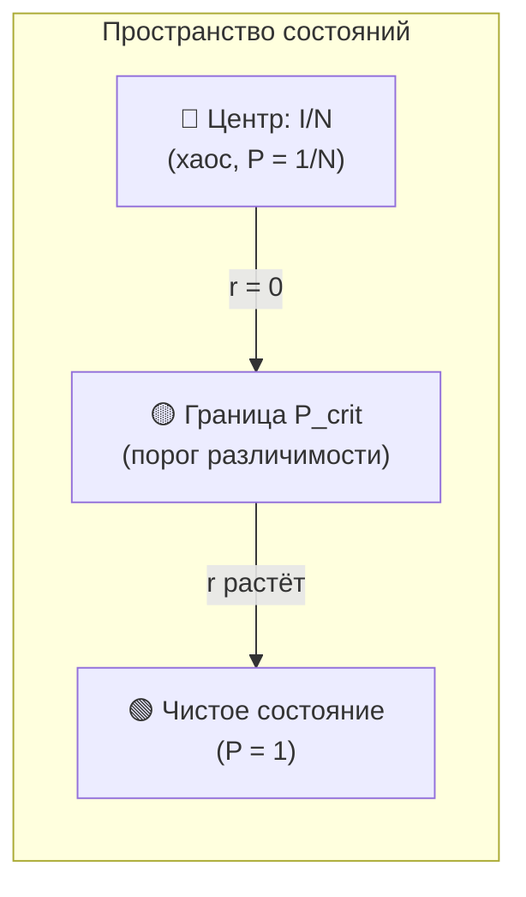
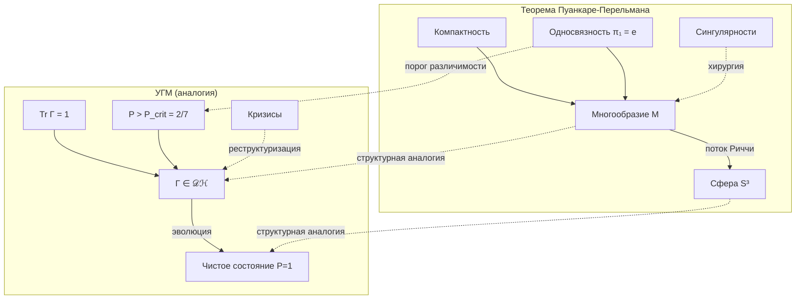

# Теорема Пуанкаре-Перельмана и УГМ

:::warning Статус документа: Структурная аналогия
Этот документ представляет **структурную аналогию** между топологией Пуанкаре-Перельмана и когнитивной эволюцией в УГМ. Соответствия — **эвристические**, не строгие изоморфизмы. Цель — интуитивное понимание, а не доказательства.

**Ключевое ограничение:** Теорема Пуанкаре о 3-многообразиях и $S^3$. Пространство состояний УГМ — $\mathbb{C}^7$, дающее $S^{13}$ для чистых состояний. Аналогия **структурная**, не размерная.
:::

:::note О нотации
- $\Gamma$ — [матрица когерентности](/docs/core/dynamics/coherence-matrix)
- $P$ — [чистота](/docs/core/dynamics/viability#определение-чистоты): $P = \mathrm{Tr}(\Gamma^2)$
- $P_{\text{crit}} = 2/N = 2/7$ — [критическая чистота](/docs/proofs/theorem-purity-critical)
- $\mathcal{D}[\Gamma]$ — [диссипативный член](/docs/core/dynamics/evolution#2-диссипативный-член)
- $\mathcal{R}[\Gamma, E]$ — [регенеративный член](/docs/core/dynamics/evolution#3-регенеративный-член)
- $\sigma_{\mathrm{sys}}$ — [тензор напряжений](/docs/applied/coherence-cybernetics/definitions#тензор-напряжений)
:::

---

## Часть I: Классическая теорема

### Формулировка Пуанкаре

**Гипотеза Пуанкаре** (доказана Перельманом, 2003):

> Всякое односвязное компактное трёхмерное многообразие без края гомеоморфно трёхмерной сфере $S^3$.

**Простыми словами:** Если трёхмерное пространство не имеет «дырок» и конечно, оно обязательно является сферой.

### Метод Перельмана: поток Риччи

Перельман использовал **поток Риччи**:

$$
\frac{\partial g}{\partial t} = -2 \cdot \mathrm{Ric}(g)
$$

где:
- $g$ — риманова метрика (описывает «форму» пространства)
- $\mathrm{Ric}$ — тензор кривизны Риччи (мера «искривлённости»)

**Интуиция:** Этот поток «сглаживает» неровности пространства, как тепло выравнивает температуру. Любая форма без дырок постепенно превращается в идеальную сферу.

---

## Часть II: Структурная аналогия с УГМ

### Таблица соответствий

| Топология (Пуанкаре) | УГМ | Тип соответствия |
|----------------------|-----|------------------|
| Многообразие $M$ | Пространство $\mathcal{D}(\mathcal{H})$ | Структурное |
| Компактность | $\mathrm{Tr}(\Gamma) = 1$, $\Gamma \geq 0$ | Точное |
| Односвязность $\pi_1 = \{e\}$ | Отсутствие логических противоречий | Метафорическое |
| Сфера $S^n$ | Чистое состояние $P = 1$ | Структурное |
| Кривизна $\mathrm{Ric}$ | [Тензор напряжений](/docs/applied/coherence-cybernetics/definitions#тензор-напряжений) $\sigma_{\mathrm{sys}}$ | Функциональное |
| Поток Риччи | [Эволюция](/docs/core/dynamics/evolution) $d\Gamma/dt$ | Функциональное |

### Размерностное соответствие

:::info Топология пространства состояний
Для $\mathcal{H} = \mathbb{C}^N$ (в УГМ $N = 7$):
- Пространство чистых состояний: $\{|\psi\rangle : \langle\psi|\psi\rangle = 1\} \cong S^{2N-1} = S^{13}$
- Проективное пространство: $\mathbb{P}(\mathcal{H}) = \mathbb{CP}^{N-1} = \mathbb{CP}^6$
:::

Аналогия с $S^3$ — **структурная**: как $S^3$ является «целевым состоянием» для односвязных 3-многообразий, так чистое состояние ($P = 1$) является аттрактором для когерентных систем.

---

## Часть III: P_crit как топологический порог

:::tip Ключевой инсайт
Порог $P_{\text{crit}} = 2/N$ в УГМ играет роль, аналогичную условию односвязности в теореме Пуанкаре: это **минимальное условие**, при котором система приобретает структурную идентичность.
:::

### Аналогия: два типа порогов

| Теорема Пуанкаре | Теорема о критической чистоте |
|------------------|-------------------------------|
| **Условие:** $\pi_1(M) = \{e\}$ (нет дырок) | **Условие:** $P > 2/N$ (сигнал > шум) |
| **Следствие:** $M \cong S^3$ (сфера) | **Следствие:** Структура различима |
| **Метод:** Поток Риччи → сглаживание | **Метод:** Регенерация → когерентность |

### Геометрический смысл P_crit

В представлении Блоха матрица когерентности $\Gamma$ параметризуется:

$$
\Gamma = \frac{I_N}{N} + \frac{1}{2} \sum_{i} r_i \lambda_i
$$

где $\mathbf{r}$ — «вектор Блоха» (отклонение от хаоса).

**Критическое условие:**

$$
|\mathbf{r}|^2 = 2\left(P - \frac{1}{N}\right) \geq \frac{2}{N}
$$

**Интерпретация:** При $P = P_{\text{crit}} = 2/N$ длина вектора $|\mathbf{r}|$ равна «радиусу шума». Это **минимальное отклонение**, при котором структура становится различимой.

---

## Часть IV: Фактор 2 — глубокая связь

### В теореме Пуанкаре

Поток Риччи: $\frac{\partial g}{\partial t} = \mathbf{-2} \cdot \mathrm{Ric}(g)$

Фактор 2 обеспечивает **сохранение объёма** при сглаживании кривизны.

### В теореме о критической чистоте

$P_{\text{crit}} = \frac{\mathbf{2}}{N}$

Фактор 2 появляется из принципа **«удвоения структуры»**: чтобы быть различимым от хаоса, нужно иметь структуру **в два раза больше** базового шума.

### Общий принцип

:::info Принцип удвоения
В обоих случаях фактор 2 связан с **балансом**:
- Риччи: баланс между сжатием и расширением
- $P_{\text{crit}}$: баланс между сигналом и шумом

Это НЕ случайное совпадение чисел, а проявление общего принципа: **порог существования требует двукратного превышения**.
:::

**Аналогии в других областях:**

| Область | Порог | Фактор |
|---------|-------|--------|
| Теория сигналов | SNR = 1 | $\text{сигнал}^2 = 2 \times \text{шум}^2$ |
| Статистика | Эффект Коэна | $d = 0.5$ (половина σ) |
| Термодинамика | Свободная энергия | $\Delta F > k_B T$ |
| УГМ | Жизнеспособность | $P > 2/N$ |

---

## Часть V: Спектральная аналогия

### Доминирование моды при P_crit

При $P = P_{\text{crit}} = 2/N$ оптимальный спектр $\Gamma$:

$$
\lambda_{\max} = \frac{1 + \sqrt{N-1}}{N} \approx 0.493 \approx \frac{1}{2}
$$

**Смысл:** Доминирующая мода захватывает **почти половину** когерентности. Это минимальное «большинство», необходимое для идентичности.

### Аналогия с постоянной кривизной

| Поток Риччи | Спектр Γ |
|-------------|----------|
| Сходится к постоянной кривизне | Сходится к спектру с доминантой |
| Все направления эквивалентны | Одно направление доминирует |
| Сфера: максимальная симметрия | Чистое состояние: λ₁ = 1 |

### Правило 49%

:::tip Неочевидный вывод
При пороге жизнеспособности доминирующее собственное значение составляет ≈49% — **почти половина, но не больше**.

Это напоминает:
- Теорию голосования (простое большинство)
- Теорему Перрона-Фробениуса (доминирующий собственный вектор)
- Квантовую декогеренцию (einselection)
:::

---

## Часть VI: Сингулярности и кризисы

### Сингулярности потока Риччи

В процессе потока Риччи многообразие может образовывать **перешейки** (necks), стягивающиеся в точки — **сингулярности**.

Перельман разработал **хирургию**: разрезать перешеек, заклеить «сферическими шапочками» и продолжить поток.

### Аналогия: когнитивные кризисы

| Топологическая сингулярность | Когнитивный аналог |
|------------------------------|-------------------|
| $\mathrm{Ric} \to \infty$ | $\|\sigma_{\mathrm{sys}}\|_\infty \to 1$ |
| Перешеек стягивается | Старая модель несовместима с данными |
| Хирургия | Реструктуризация убеждений |
| Сферическая шапочка | Новая согласованная подсистема |

**Формально:**

$$
\|\sigma_{\mathrm{sys}}\|_\infty \to 1 \Rightarrow P \to P_{\text{crit}}
$$

:::note Связь с теоремами Гёделя
Сингулярности в L-измерении могут соответствовать **гёделевым пределам** — утверждениям, недоказуемым в текущей аксиоматике. «Хирургия» — расширение аксиоматики через O-измерение. См. [Гёдель и полнота УГМ](/docs/core/foundations/consequences#8-теоремы-гёделя-и-полнота-угм).
:::

---

## Часть VII: Интуитивные выводы

### Очевидные выводы

1. **Целостность — это сфера**
   - Как сфера — простейшая замкнутая форма без дефектов
   - Так чистое состояние — простейшее состояние без внутренних противоречий

2. **Эволюция — это сглаживание**
   - Как поток Риччи сглаживает неровности
   - Так регенерация увеличивает когерентность

3. **Противоречия — это дырки**
   - Как нестягиваемые петли препятствуют сферичности
   - Так логические парадоксы препятствуют интеграции

### Неочевидные выводы

:::info 1. Порог существования универсален
$P_{\text{crit}} = 2/N$ — не «подогнанный параметр», а фундаментальная константа, аналогичная топологическим инвариантам. Она определяет **границу между бытием и небытием** структуры.
:::

:::info 2. Кризисы необходимы
Как поток Риччи неизбежно проходит через сингулярности, так когнитивная эволюция неизбежно проходит через кризисы. **Плавное развитие невозможно** — необходима «хирургия» (переструктурирование).
:::

:::info 3. Половина — это минимум
Доминирующая мода при $P_{\text{crit}}$ захватывает ≈49%. Это **минимальное большинство**, необходимое для идентичности. Сознание начинается, когда одна «мысль» становится громче половины всего шума.
:::

:::info 4. Размерность 7 — топологически оптимальна
Минимальная размерность $N = 7$ (см. [Теорему S](/docs/proofs/theorem-minimality-7)) обеспечивает:
- Достаточно места для «хирургии» (реструктуризации)
- Достаточно низкий порог ($P_{\text{crit}} \approx 0.29$) для гибкости
- Достаточно высокий порог для устойчивости к шуму
:::

---

## Часть VIII: Философские интерпретации

:::warning Статус раздела
Следующие утверждения — **философские экстраполяции**, не научные выводы. Они предполагают, что структурная аналогия отражает глубокую связь.
:::

### Целостность как математический аттрактор

**Интерпретация:** Состояние максимальной когерентности ($P = 1$) — не «награда» или «цель», а естественный результат эволюции системы без внутренних противоречий.

**Условие:** Отсутствие «топологических дефектов» (противоречий).

### Противоречия как препятствия

**Интерпретация:** Логические противоречия (самообман, когнитивный диссонанс) создают «дыры» в структуре сознания, препятствующие эволюции.

**Формально:** Если $\pi_1(M_\Gamma) \neq \{e\}$, система может «застрять» в локальном минимуме.

### Кризисы как необходимость

**Интерпретация:** Плавная эволюция может быть невозможна. Сингулярности (кризисы) — точки, где старая структура должна быть «разрезана» для продолжения эволюции.

**Аналогия:** Хирургия Перельмана ↔ Реструктуризация убеждений.

---

## Часть IX: Ограничения аналогии

:::warning Критические различия

| Аспект | Теорема Пуанкаре | УГМ |
|--------|------------------|-----|
| Размерность | $n = 3$ | $N = 7$ (комплексное) |
| Объект | Многообразие $M$ | Матрица плотности $\Gamma$ |
| Эволюция | Поток на метрике $g$ | Линдблад на $\Gamma$ |
| Односвязность | $\pi_1(M) = \{e\}$ | Не определена формально |
| Аттрактор | $S^3$ | Чистое состояние ($S^{13}/S^1 = \mathbb{CP}^6$) |

**Вывод:** Аналогия **структурная и мотивационная**, не математический изоморфизм.
:::

### Открытые вопросы

1. **Изоморфизм** между потоком Риччи и эволюцией $\Gamma$ — НЕ доказан
2. **Односвязность** для $\mathcal{D}(\mathcal{H})$ — НЕ определена формально
3. **Сходимость** к $P = 1$ — НЕ гарантирована теоремой

---

## Диаграмма аналогии

---

## Резюме

### Главные соответствия

| Пуанкаре | УГМ | Вывод |
|----------|-----|-------|
| Односвязность | $P > 2/N$ | **Порог существования** |
| Сфера | Чистое состояние | **Аттрактор** |
| Поток Риччи | Эволюция Линдблада | **Механизм** |
| Хирургия | Реструктуризация | **Преодоление кризисов** |
| Фактор 2 в Ric | Фактор 2 в $P_{\text{crit}}$ | **Принцип удвоения** |

### Практическое значение

Аналогия предоставляет **интуитивную основу** для понимания:

1. Почему когерентные системы **стремятся к интеграции** (как многообразия к сфере)
2. Почему противоречия **препятствуют развитию** (как дыры препятствуют сферичности)
3. Почему кризисы **необходимы** (как хирургия необходима при сингулярностях)
4. Почему существует **чёткий порог** существования (как чёткое условие односвязности)

---

**Связанные документы:**
- [Теорема о критической чистоте](/docs/proofs/theorem-purity-critical) — доказательство $P_{\text{crit}} = 2/N$
- [Эволюция](/docs/core/dynamics/evolution) — уравнение $d\Gamma/dt$
- [Жизнеспособность](/docs/core/dynamics/viability) — мера $P$ и условия существования
- [Теорема о минимальности 7D](/docs/proofs/theorem-minimality-7) — необходимость 7 измерений
- [Тензор напряжений](/docs/applied/coherence-cybernetics/definitions#тензор-напряжений) — $\sigma_{\mathrm{sys}}$
- [Инженерные выводы](/docs/applied/research/engineering-insights) — практические следствия
