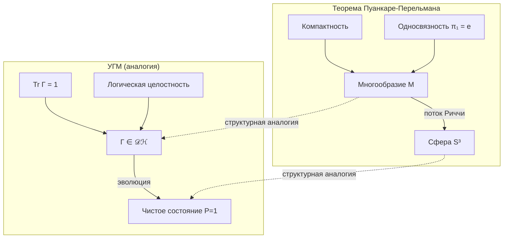

# Теорема Пуанкаре-Перельмана и УГМ

:::warning Статус документа: Аналогия
Этот документ представляет **структурную аналогию** между топологией Пуанкаре-Перельмана и когнитивной эволюцией в УГМ. Соответствия — **эвристические**, не строгие изоморфизмы. Цель — интуитивное понимание, а не доказательства.

**Ключевое ограничение:** Теорема Пуанкаре о 3-многообразиях и $S^3$. Пространство состояний УГМ — $\mathbb{C}^7$, дающее $S^{13}$ для чистых состояний. Аналогия **структурная**, не размерная.
:::

:::note О нотации
В этом документе:
- $\Gamma$ — [матрица когерентности](/docs/core/dynamics/coherence-matrix)
- $P$ — [чистота](/docs/core/dynamics/viability#определение-чистоты): $P = \mathrm{Tr}(\Gamma^2)$
- $\mathcal{D}[\Gamma]$ — [диссипативный член](/docs/core/dynamics/evolution#2-диссипативный-член)
- $\mathcal{R}[\Gamma, E]$ — [регенеративный член](/docs/core/dynamics/evolution#3-регенеративный-член)
- $\sigma_{\mathrm{sys}}$ — [тензор напряжений](/docs/applied/coherence-cybernetics/definitions#тензор-напряжений)
- $d_{\mathrm{FS}}$ — [метрика Фубини-Штуди](/docs/formal/specification#метрика-фубини-штуди)
:::

## Теорема Пуанкаре-Перельмана (классическая)

### Формулировка

**Гипотеза Пуанкаре** (доказана Перельманом, 2003):

> Всякое односвязное компактное трёхмерное многообразие без края гомеоморфно трёхмерной сфере $S^3$.

### Метод доказательства: поток Риччи

Перельман использовал **поток Риччи**:

$$
\frac{\partial g}{\partial t} = -2 \cdot \mathrm{Ric}(g)
$$

где:
- $g$ — риманова метрика
- $\mathrm{Ric}$ — тензор кривизны Риччи

Этот поток «сглаживает» кривизну многообразия, стремясь превратить любую форму в пространство постоянной кривизны.

---

## Структурная аналогия с УГМ

### Таблица соответствий

| Топология (Пуанкаре) | УГМ | Тип соответствия |
|----------------------|-----|------------------|
| Многообразие $M$ | Пространство $\mathcal{D}(\mathcal{H})$ | Структурное |
| Компактность | $\mathrm{Tr}(\Gamma) = 1$, $\Gamma \geq 0$ | Точное |
| Односвязность $\pi_1 = \{e\}$ | Отсутствие логических противоречий | Метафорическое |
| Сфера $S^n$ | Чистое состояние $P = 1$ | Структурное |
| Кривизна $\mathrm{Ric}$ | [Тензор напряжений](/docs/applied/coherence-cybernetics/definitions#тензор-напряжений) $\sigma_{\mathrm{sys}}$ | Функциональное |
| Поток Риччи | [Эволюция](/docs/core/dynamics/evolution) $d\Gamma/dt$ | Функциональное |

### Размерностное соответствие

:::info Топология пространства состояний
Для $\mathcal{H} = \mathbb{C}^N$ (в УГМ $N = 7$):
- Пространство чистых состояний: $\{|\psi\rangle : \langle\psi|\psi\rangle = 1\} \cong S^{2N-1} = S^{13}$
- Проективное пространство: $\mathbb{P}(\mathcal{H}) = \mathbb{CP}^{N-1} = \mathbb{CP}^6$
:::

Аналогия с $S^3$ — **структурная**: как $S^3$ является «целевым состоянием» для односвязных 3-многообразий, так чистое состояние ($P = 1$) является аттрактором для когерентных систем.

---

## Односвязность как целостность

### Топологическое определение

Пространство $M$ **односвязно**, если:

$$
\pi_1(M, x_0) = \{e\}
$$

где $\pi_1$ — фундаментальная группа (группа классов петель).

### Метафорическая интерпретация для УГМ

| Топологическое понятие | Когнитивная интерпретация |
|------------------------|---------------------------|
| Петля $\gamma: [0,1] \to M$ | Цепочка рассуждений $A \to B \to \ldots \to A$ |
| Стягиваемая петля | Непротиворечивое рассуждение |
| Нестягиваемая петля | Логический парадокс, циклическая зависимость |
| $\pi_1 = \{e\}$ | Полная логическая согласованность |

**Гипотеза (метафорическая):**

$$
\text{Логическая целостность} \sim \sigma_L < \sigma_{L,\mathrm{critical}}
$$

где $\sigma_L$ — [L-компонента тензора напряжений](/docs/applied/coherence-cybernetics/definitions#тензор-напряжений).

:::warning Ограничение аналогии
Фундаментальная группа $\pi_1$ определена для топологических пространств. Для $\mathcal{D}(\mathcal{H})$ это понятие требует формализации. Связь между «односвязностью» и «логической непротиворечивостью» — **эвристическая**.
:::

---

## Поток Риччи и эволюция Γ

### Классический поток Риччи

$$
\frac{\partial g}{\partial t} = -2 \cdot \mathrm{Ric}(g)
$$

**Свойства:**
- Сглаживает неоднородности кривизны
- Для односвязных 3-многообразий сходится к сфере $S^3$

### Уравнение эволюции УГМ

$$
\frac{d\Gamma}{dt} = -i[H, \Gamma] + \mathcal{D}[\Gamma] + \mathcal{R}[\Gamma, E]
$$

См. [Эволюция](/docs/core/dynamics/evolution) для полного описания.

### Функциональная аналогия

| Поток Риччи | Эволюция УГМ | Соответствие |
|-------------|--------------|--------------|
| $\partial g/\partial t$ | $d\Gamma/dt$ | Изменение структуры |
| $-2 \cdot \mathrm{Ric}(g)$ | $-i[H, \Gamma] + \mathcal{D}[\Gamma]$ | Релаксация |
| Постоянная кривизна | $P \to 1$ | Аттрактор |
| Сглаживание | Увеличение когерентности | Цель эволюции |

:::note Важное различие
Поток Риччи — уравнение на метрику $g$. Эволюция УГМ — уравнение на матрицу плотности $\Gamma$. Это **разные математические объекты**. Аналогия — в динамике, не в структуре.
:::

---

## Сингулярности и хирургия

### Сингулярности потока Риччи

В процессе потока Риччи многообразие может образовывать **перешейки** (necks), стягивающиеся в точки — **сингулярности**.

Перельман разработал **хирургию**: разрезать перешеек, заклеить «сферическими шапочками» и продолжить поток.

### Аналогия: когнитивные кризисы

| Топологическая сингулярность | Когнитивный аналог |
|------------------------------|-------------------|
| $\mathrm{Ric} \to \infty$ | $\|\sigma_{\mathrm{sys}}\|_\infty \to 1$ |
| Перешеек стягивается | Старая модель несовместима с данными |
| Хирургия | Реструктуризация убеждений |
| Сферическая шапочка | Новая согласованная подсистема |

**Формально:**

$$
\|\sigma_{\mathrm{sys}}\|_\infty \to 1 \Rightarrow P \to P_{\mathrm{critical}}
$$

См. [Жизнеспособность](/docs/core/dynamics/viability) и [условие смерти](/docs/core/dynamics/viability#условие-смерти).

:::note Связь с теоремами Гёделя
Сингулярности в L-измерении могут соответствовать **гёделевым пределам** — утверждениям, недоказуемым в текущей аксиоматике. «Хирургия» — расширение аксиоматики через O-измерение. См. [Гёдель и полнота УГМ](/docs/core/foundations/consequences#8-теоремы-гёделя-и-полнота-угм).
:::

---

## Чистое состояние как аттрактор

### Геометрия чистых состояний

Пространство чистых состояний:

$$
\{|\psi\rangle \in \mathcal{H} : \langle\psi|\psi\rangle = 1\} \cong S^{2N-1}
$$

Для $\mathcal{H} = \mathbb{C}^7$: сфера $S^{13}$ (тринадцатимерная).

Проективизация:

$$
\mathbb{P}(\mathcal{H}) = \mathbb{CP}^{N-1} = \mathbb{CP}^6
$$

с [метрикой Фубини-Штуди](/docs/formal/specification#метрика-фубини-штуди).

### Характеристики чистого состояния

| Параметр | Значение | Ссылка |
|----------|----------|--------|
| $P$ | $1$ | [Чистота](/docs/core/dynamics/viability#определение-чистоты) |
| $S_{vN}$ | $0$ | [Энтропия](/docs/applied/coherence-cybernetics/definitions#энтропия-фон-неймана) |
| $\|\sigma_{\mathrm{sys}}\|_\infty$ | $0$ | [Тензор напряжений](/docs/applied/coherence-cybernetics/definitions#тензор-напряжений) |
| $\mathrm{rank}(\Gamma)$ | $1$ | Проектор |

### Аналогия «сфера — чистое состояние»

| Теорема Пуанкаре | УГМ |
|------------------|-----|
| Односвязное многообразие → $S^3$ | Когерентная система → $P = 1$ |
| Сфера — единственный аттрактор | Чистое состояние — аттрактор |
| Постоянная положительная кривизна | Максимальная когерентность |

---

## Гипотеза о когнитивной эволюции

:::info Гипотеза (аналогическая)
Для [жизнеспособной](/docs/core/dynamics/viability) системы $\mathbb{H}$ без внутренних противоречий (метафорически «односвязной»):

$$
\lim_{t \to \infty} P(\Gamma(t)) = 1
$$

при условии:
1. $\mathcal{R}[\Gamma, E] > 0$ — приток свободной энергии
2. Отсутствие сингулярностей или успешная «хирургия»
:::

**Формальный статус:** Это **гипотеза**, не теорема. Она мотивирована структурной аналогией с теоремой Пуанкаре-Перельмана.

---

## Термодинамические ограничения

### Ограничение на рост чистоты

Увеличение $P$ требует затрат свободной энергии:

$$
\frac{dP}{dt} \propto \mathcal{R}[\Gamma, E]
$$

где [регенеративный член](/docs/core/dynamics/evolution#3-регенеративный-член) $\mathcal{R}$ активен только при $\Delta F > 0$.

### Связь с минимальностью 7D

Для существования [регенерации](/docs/core/dynamics/evolution#3-регенеративный-член) необходимы все 7 измерений. См. [Теорема о минимальности](/docs/proofs/theorem-minimality-7).

---

## Ограничения аналогии

:::warning Критические различия

| Аспект | Теорема Пуанкаре | УГМ |
|--------|------------------|-----|
| Размерность | $n = 3$ | $N = 7$ (комплексное) |
| Объект | Многообразие $M$ | Матрица плотности $\Gamma$ |
| Эволюция | Поток на метрике $g$ | Линдблад на $\Gamma$ |
| Односвязность | $\pi_1(M) = \{e\}$ | Не определена формально |
| Аттрактор | $S^3$ | Чистое состояние ($S^{13}/S^1 = \mathbb{CP}^6$) |

**Вывод:** Аналогия **структурная и мотивационная**, не математический изоморфизм.
:::

---

## Диаграмма аналогии

---

## Резюме

Теорема Пуанкаре-Перельмана предоставляет **структурную метафору** для понимания когнитивной эволюции в УГМ:

1. **Компактность** (ограниченные ресурсы) ↔ $\mathrm{Tr}(\Gamma) = 1$
2. **Односвязность** (целостность) ↔ отсутствие логических противоречий
3. **Поток Риччи** (сглаживание) ↔ эволюция к когерентности
4. **Сфера** (аттрактор) ↔ чистое состояние $P = 1$

Эта аналогия **не является доказательством**, но предоставляет интуитивную основу для понимания, почему когерентные системы стремятся к интеграции.

---

**Связанные документы:**
- [Эволюция](/docs/core/dynamics/evolution) — уравнение $d\Gamma/dt$
- [Жизнеспособность](/docs/core/dynamics/viability) — мера $P$ и $P_{\mathrm{critical}}$
- [Теорема о минимальности 7D](/docs/proofs/theorem-minimality-7) — необходимость 7 измерений
- [Тензор напряжений](/docs/applied/coherence-cybernetics/definitions#тензор-напряжений) — $\sigma_{\mathrm{sys}}$
- [Метрика Фубини-Штуди](/docs/formal/specification#метрика-фубини-штуди) — геометрия $\mathbb{P}(\mathcal{H})$
- [Формализация φ](/docs/proofs/formalization-phi) — оператор самомоделирования
- [Расширенный анализ](./poincare-extended) — дополнительные аспекты
