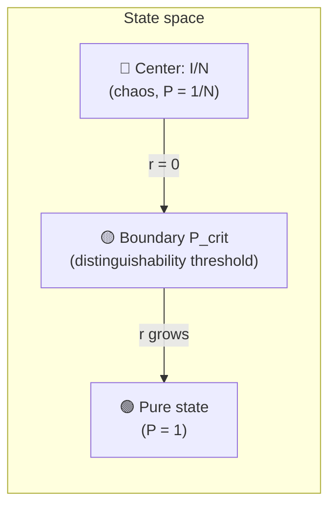
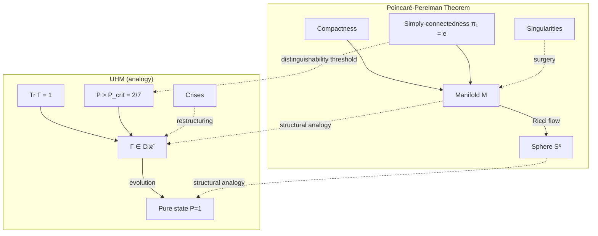

# The Poincaré-Perelman Theorem and UHM

:::warning Document Status: Structural Analogy
This document presents a **structural analogy** between the topology of Poincaré-Perelman and cognitive evolution in UHM. The correspondences are **heuristic**, not strict isomorphisms. The goal is intuitive understanding, not proofs.

**Key limitation:** The Poincaré theorem concerns 3-manifolds and $S^3$. The UHM state space is $\mathbb{C}^7$, giving $S^{13}$ for pure states. The analogy is **structural**, not dimensional.
:::

:::note About Notation
- $\Gamma$ — [coherence matrix](/docs/core/dynamics/coherence-matrix)
- $P$ — [purity](/docs/core/dynamics/viability#определение-чистоты): $P = \mathrm{Tr}(\Gamma^2)$
- $P_{\text{crit}} = 2/N = 2/7$ — [critical purity](/docs/proofs/dynamics/theorem-purity-critical)
- $\mathcal{D}[\Gamma]$ — [dissipative term](/docs/core/dynamics/evolution#логический-лиувиллиан)
- $\mathcal{R}[\Gamma, E]$ — [regenerative term](/docs/core/dynamics/evolution#3-регенеративный-член)
- $\sigma_{\mathrm{sys}}$ — [stress tensor](/docs/applied/coherence-cybernetics/definitions#тензор-напряжений)
:::

---

## Part I: The Classical Theorem

### Poincaré's Formulation

**The Poincaré conjecture** (proved by Perelman, 2003):

> Every simply-connected compact three-dimensional manifold without boundary is homeomorphic to the three-dimensional sphere $S^3$.

**In plain terms:** If a three-dimensional space has no "holes" and is finite, it must be a sphere.

### Perelman's Method: Ricci Flow

Perelman used the **Ricci flow**:

$$
\frac{\partial g}{\partial t} = -2 \cdot \mathrm{Ric}(g)
$$

where:
- $g$ — Riemannian metric (describes the "shape" of space)
- $\mathrm{Ric}$ — Ricci curvature tensor (measure of "curvedness")

**Intuition:** This flow "smooths out" the irregularities of space, the way heat equalizes temperature. Any shape without holes gradually turns into a perfect sphere.

---

## Part II: Structural Analogy with UHM

### Correspondence Table

| Topology (Poincaré) | UHM | Type of correspondence |
|---------------------|-----|------------------------|
| Manifold $M$ | Space $\mathcal{D}(\mathcal{H})$ | Structural |
| Compactness | $\mathrm{Tr}(\Gamma) = 1$, $\Gamma \geq 0$ | Exact |
| Simply-connectedness $\pi_1 = \{e\}$ | Absence of logical contradictions | Metaphorical |
| Sphere $S^n$ | Pure state $P = 1$ | Structural |
| Curvature $\mathrm{Ric}$ | [Stress tensor](/docs/applied/coherence-cybernetics/definitions#тензор-напряжений) $\sigma_{\mathrm{sys}}$ | Analogical |
| Ricci flow | [Evolution](/docs/core/dynamics/evolution) $d\Gamma/d\tau$ | Structural |

:::info Note
The space of density matrices $\mathcal{D}(\mathcal{H})$ is convex and therefore contractible — it is automatically simply-connected ($\pi_1 = \{e\}$) for any system. Therefore, the correspondence "simply-connectedness ↔ absence of contradictions" is metaphorical.
:::

### Dimensional Correspondence

:::info Topology of the State Space
For $\mathcal{H} = \mathbb{C}^N$ (in UHM $N = 7$):
- Space of pure states: $\{|\psi\rangle : \langle\psi|\psi\rangle = 1\} \cong S^{2N-1} = S^{13}$
- Projective space: $\mathbb{P}(\mathcal{H}) = \mathbb{CP}^{N-1} = \mathbb{CP}^6$
:::

The analogy with $S^3$ is **structural**: just as $S^3$ is the "target state" for simply-connected 3-manifolds, the pure state ($P = 1$) is the attractor for coherent systems.

---

## Part II.b: Rigorous Mathematical Foundations

A number of key aspects of the analogy rest on **proven theorems** of modern quantum geometry.

### Stratification of $\mathcal{D}(\mathbb{C}^7)$ by Rank

**Definition** [D]: The state space admits a **rank stratification**:

$$
\mathcal{D}(\mathbb{C}^7) = \bigsqcup_{k=1}^{7} \mathcal{D}_k^\circ, \qquad \mathcal{D}_k^\circ := \{\rho \in \mathcal{D}(\mathbb{C}^7) : \mathrm{rank}\,\rho = k\}
$$

| Stratum | $\dim_\mathbb{R}$ | Topology | Role in UHM |
|---------|-----------|-----------|-------------|
| $\mathcal{D}_7^\circ$ (interior) | 48 | Open convex manifold | Viable states ($P > 1/7$) |
| $\mathcal{D}_6^\circ$ | 40 | Submanifold of codimension 8 | Hübner singularity boundary |
| $\mathcal{D}_1^\circ \cong \mathbb{CP}^6$ | 12 | Compact Kähler manifold | Pure states, $P = 1$ |

**Topological fact [T]:** $\mathcal{D}_+(\mathbb{C}^7) := \mathcal{D}_7^\circ$ is convex and contractible: $\pi_k(\mathcal{D}_+) = 0$ for all $k \geq 1$. This confirms and refines the note from §2 (correspondence table): the simple-connectedness of $\mathcal{D}_+$ holds **trivially**, independent of cognitive content.

### Hübner's Theorem on the Scalar Curvature of the Bures Metric [T]

:::info Theorem (Hübner 1999; arXiv:quant-ph/9810012)
Let $g_{\mathrm{B}}$ be the Bures metric ($\equiv$ SLD quantum Fisher information metric) on $\mathcal{D}_+(\mathbb{C}^N)$. Then:

1. $g_{\mathrm{B}}$ is a smooth Riemannian metric on the open manifold $\mathcal{D}_+(\mathbb{C}^N)$
2. **Lower bound:** $\displaystyle R_{\mathrm{scal}}(\rho) \geq \frac{N(N-1)}{8}$ for all $\rho \in \mathcal{D}_+(\mathbb{C}^N)$
3. **Singularity at the boundary:** $R_{\mathrm{scal}}(\rho) \to +\infty$ as $\mathrm{rank}(\rho) \to N-1$ (i.e., as $\rho \to \partial\mathcal{D}_+$)
:::

**Corollary for $N = 7$ [T]:** In the interior $\mathcal{D}_+(\mathbb{C}^7)$ the scalar curvature $R_{\mathrm{scal}} \geq 21/4 \approx 5.25$. It diverges as $\rho \to \mathcal{D}_6^\circ$. This is the **rigorous mathematical justification** for the necessity of surgery at rank-collapse: the Bures curvature singularity is the quantum analogue of the neck in Ricci flow.

### Carlen–Maas Theorem: Lindblad Dynamics as a Gradient Flow [T]

:::info Theorem (Carlen–Maas 2017; arXiv:1609.01254)
Let $\mathcal{L}_\sigma$ be a primitive GKSL generator (Lindblad operator) with **KMS symmetry** with respect to $\sigma$:

$$
\langle A,\, \mathcal{L}_\sigma(B)\rangle_\sigma = \langle \mathcal{L}_\sigma(A),\, B\rangle_\sigma, \qquad \langle A,B\rangle_\sigma := \mathrm{Tr}\!\left(A^\dagger \sigma^{1/2} B \sigma^{1/2}\right)
$$

The evolution $\partial_t \rho = \mathcal{L}_\sigma(\rho)$ is the **gradient flow of quantum relative entropy**

$$
D(\rho\|\sigma) = \mathrm{Tr}(\rho\log\rho) - \mathrm{Tr}(\rho\log\sigma)
$$

with respect to the quantum 2-Wasserstein metric $\mathcal{W}_\sigma$ on $\mathcal{D}_+(\mathbb{C}^N)$.

**Corollary:** Ricci curvature of $(\mathcal{D}_+, \mathcal{W}_\sigma)$ satisfies $\kappa(\mathcal{L}_\sigma) \geq \lambda_1(\mathcal{L}_\sigma) > 0$.
:::

This result **elevates the status of the analogy**: the Lindblad dynamics of UHM does not merely "resemble" Ricci flow structurally — it itself is a gradient flow in a Riemannian structure (the Wasserstein metric).

**Refined comparison table [T/I]:**

| | Ricci–Perelman Flow | KMS-symmetric Lindblad |
|---|---|---|
| Space | $(M^n, g(t))$ — metrics on a manifold | $(\mathcal{D}_+(\mathbb{C}^7), \mathcal{W}_\sigma)$ |
| Functional | $\mathcal{F}(g) = \int(R + |\nabla f|^2)\mathrm{e}^{-f}\,dV$ | $D(\rho\|\sigma)$ — quantum relative entropy |
| Flow | $\partial_t g = -2\,\mathrm{Ric}(g)$ | $\partial_t\rho = \mathcal{L}_\sigma(\rho)$ |
| Curvature | Can be $< 0$; surgery when $\|\mathrm{Ric}\| \to \infty$ | $\kappa \geq \lambda_1 > 0$ **in the interior** [T] |
| Surgery | At necks | At rank-collapse: $R_{\mathrm{scal}}^\mathrm{B} \to \infty$ [T, Hübner] |
| Attractor | Constant curvature metric / $S^n$ | $\sigma$ (entropy minimum) |

:::warning Key Distinction [T]
**Ricci flow** changes the metric $g(t)$ on a **fixed** manifold $M^n$ and can develop singularities.

**Lindblad flow** changes the state $\rho(t)$ in a **fixed** metric space $(\mathcal{D}_+, \mathcal{W}_\sigma)$ with **positive curvature**.

Consequence: in the interior $\mathcal{D}_+(\mathbb{C}^7)$ there are **no** topological obstacles to convergence. Surgery is needed **only** at rank-collapse $\rho \to \partial\mathcal{D}_+$.
:::

---

## Part III: P_crit as a Topological Threshold

:::tip Key Insight
The threshold [$P_{\text{crit}} = 2/N$](/docs/proofs/dynamics/theorem-purity-critical) in UHM plays a role analogous to the simply-connectedness condition in the Poincaré theorem: it is the **minimal condition** under which a system acquires structural identity.
:::

### Analogy: Two Types of Thresholds

| Poincaré Theorem | Theorem on Critical Purity |
|------------------|----------------------------|
| **Condition:** $\pi_1(M) = \{e\}$ (no holes) | **Condition:** $P > 2/N$ (signal > noise) |
| **Consequence:** $M \cong S^3$ (sphere) | **Consequence:** Structure is distinguishable |
| **Method:** Ricci flow → smoothing | **Method:** Regeneration → coherence |

### Geometric Meaning of P_crit

In the Bloch representation the coherence matrix $\Gamma$ is parametrized:

$$
\Gamma = \frac{I_N}{N} + \frac{1}{2} \sum_{i} r_i \lambda_i
$$

where $\mathbf{r}$ — the "Bloch vector" (deviation from chaos).

**Critical condition:**

$$
|\mathbf{r}|^2 = 2\left(P - \frac{1}{N}\right) \geq \frac{2}{N}
$$

**Interpretation:** At $P = P_{\text{crit}} = 2/N$ the vector length $|\mathbf{r}|$ equals the "noise radius". This is the **minimal deviation** at which structure becomes distinguishable.

```mermaid
graph LR
    subgraph "State space"
        C["🔵 Center: I/N<br/>(chaos, P = 1/N)"]
        R["🟡 Boundary P_crit<br/>(distinguishability threshold)"]
        S["🟢 Pure state<br/>(P = 1)"]
    end
    C -->|"r = 0"| R
    R -->|"r grows"| S
```

---

## Part IV: The Factor of 2 — A Deep Connection

### In the Poincaré Theorem

Ricci flow: $\frac{\partial g}{\partial t} = \mathbf{-2} \cdot \mathrm{Ric}(g)$

The factor of 2 is a conventional choice that simplifies the evolution of scalar curvature.

:::note Mathematical Clarification
The standard Ricci flow **does not preserve volume**. For positive curvature the volume decreases. There exists a *normalized* Ricci flow with an additional term that preserves volume, but that is a different equation.
:::

### In the Theorem on Critical Purity

$P_{\text{crit}} = \frac{\mathbf{2}}{N}$

The factor of 2 arises from the **"structure doubling" principle**: to be distinguishable from chaos, the structure must be **twice** the baseline noise.

### The Factor of 2: Coincidence, Not Connection

:::warning Coincidence, Not a Proven Connection
The factor of 2 in Ricci flow $\partial_t g = -\mathbf{2}\,\mathrm{Ric}$ is **conventional** (Hamilton, 1982). Replacing it with $-c\,\mathrm{Ric}$ gives an equivalent flow with reparametrization $t' = (c/2)t$.

The factor of 2 in $P_{\text{crit}} = \mathbf{2}/N$ is **algebraic** ($\|\Gamma - I/N\|_F^2 > \|I/N\|_F^2$).

These two "2"s are **not mathematically related**. The coincidence is numerical, not structural.
:::

---

## Part V: Spectral Analogy

### Mode Dominance at P_crit

At $P = P_{\text{crit}} = 2/N$ the optimal spectrum of $\Gamma$:

$$
\lambda_{\max} = \frac{1 + \sqrt{N-1}}{N} \approx 0.493 \approx \frac{1}{2}
$$

**Meaning:** The dominant mode captures **almost half** of the coherence. This is the minimal "majority" needed for identity.

### Analogy with Constant Curvature

| Ricci Flow | Spectrum of Γ |
|------------|---------------|
| Converges to constant curvature | Converges to a spectrum with a dominant mode |
| All directions are equivalent | One direction dominates |
| Sphere: maximal symmetry | Pure state: λ₁ = 1 |

:::warning Symmetry Inversion
Ricci flow increases symmetry (convergence to a sphere with maximal $SO(3)$-symmetry). UHM evolution toward a pure state **decreases** symmetry (from $U(7)$ to $U(1) \times U(6)$). This is a fundamental difference: the analogy is structural, but the direction of symmetry is opposite.
:::

### The 49% Rule

:::tip Non-Obvious Conclusion
At the viability threshold the dominant eigenvalue is ≈49% — **almost half, but not more**.

This resembles:
- Voting theory (simple majority)
- The Perron-Frobenius theorem (dominant eigenvector)
- Quantum decoherence (einselection)
:::

---

## Part VI: Singularities and Crises

### Ricci Flow Singularities

During the Ricci flow a manifold can form **necks** that contract to points — **singularities**.

Perelman developed **surgery**: cut the neck, cap both ends with "spherical caps," and continue the flow.

### Analogy: Cognitive Crises

| Topological singularity | Cognitive analogue |
|-------------------------|-------------------|
| $\mathrm{Ric} \to \infty$ | $\|\sigma_{\mathrm{sys}}\|_\infty \to 1$ |
| Neck contracts | Old model is incompatible with data |
| Surgery | Restructuring of beliefs |
| Spherical cap | New consistent subsystem |

**Formally:**

$$
\|\sigma_{\mathrm{sys}}\|_\infty \to 1 \implies P \to P_{\text{crit}}
$$

(consequence of the definition of the stress tensor — see [CC: Definitions](/docs/applied/coherence-cybernetics/definitions#тензор-напряжений))

**Mathematical justification via the Hübner theorem [T]:** The Bures scalar curvature $R_{\mathrm{scal}}(\rho) \to +\infty$ as $\mathrm{rank}(\rho) \to 6$ (Part II.b) — a rigorous analogue of the condition triggering Perelman's surgery. The regularization $\Gamma \mapsto (\Gamma + \varepsilon I/7)/(1+\varepsilon)$ returns $\rho$ to the interior $\mathcal{D}_+(\mathbb{C}^7)$, restoring finite curvature and the guarantees of the Carlen–Maas theorem.

:::note Connection to Gödel's Theorems
Singularities in the L-dimension may correspond to **Gödelian limits** — statements unprovable within the current axiomatics. "Surgery" is the extension of the axiomatics via the O-dimension. See [Gödel and the completeness of UHM](/docs/core/foundations/consequences#10-теоремы-гёделя-и-полнота-угм).
:::

---

## Part VII: Intuitive Conclusions

### Obvious Conclusions

1. **Wholeness is a sphere**
   - As a sphere is the simplest closed form without defects
   - So a pure state is the simplest state without internal contradictions

2. **Evolution is smoothing**
   - As Ricci flow smooths out irregularities
   - So regeneration increases coherence

3. **Contradictions are holes**
   - As non-contractible loops prevent sphericity
   - So logical paradoxes prevent integration

### Non-Obvious Conclusions

:::info 1. The Existence Threshold Is Universal
$P_{\text{crit}} = 2/N$ is not a "fitted parameter" but a fundamental constant, analogous to topological invariants. It defines the **boundary between being and non-being** of structure.
:::

:::info 2. Crises Are Necessary
Just as Ricci flow inevitably passes through singularities, so cognitive evolution inevitably passes through crises. **Smooth development is impossible** — "surgery" (restructuring) is necessary.
:::

:::info 3. Half Is the Minimum
The dominant mode at $P_{\text{crit}}$ captures ≈49%. This is the **minimal majority** needed for identity. Consciousness begins when one "thought" becomes louder than half of all noise.
:::

:::info 4. Dimension 7 Is Topologically Optimal
The minimal dimension $N = 7$ (see [Theorem S](/docs/proofs/minimality/theorem-minimality-7), [octonion justification](/docs/core/foundations/axiom-omega#октонионная-структура)) provides:
- Enough room for "surgery" (restructuring)
- A sufficiently low threshold ($P_{\text{crit}} \approx 0.29$) for flexibility
- A sufficiently high threshold for noise robustness
:::

---

## Part VIII: Philosophical Interpretations

:::warning Section Status
The following statements are **philosophical extrapolations**, not scientific conclusions. They assume that the structural analogy reflects a deep connection.
:::

### Wholeness as a Mathematical Attractor

**Interpretation:** The state of maximal coherence ($P = 1$) is not a "reward" or "goal," but the natural result of a system's evolution without internal contradictions.

**Condition:** Absence of "topological defects" (contradictions).

### Contradictions as Obstacles

**Interpretation:** Logical contradictions (self-deception, cognitive dissonance) create "holes" in the structure of consciousness, impeding evolution.

**Speculatively:** If we *hypothetically* associate a manifold $M_\Gamma$ (not formally defined in UHM) with $\Gamma$, then $\pi_1(M_\Gamma) \neq \{e\}$ would mean that the system can "get stuck" in a local minimum. This is a motivating metaphor, not a strict statement.

### Crises as Necessity

**Interpretation:** Smooth evolution may be impossible. Singularities (crises) are points where the old structure must be "cut" for evolution to continue.

**Analogy:** Perelman's surgery ↔ Restructuring of beliefs.

---

## Part IX: Limitations of the Analogy

:::warning Critical Differences

| Aspect | Poincaré Theorem | UHM | Status |
|--------|------------------|-----|--------|
| Dimension | $n = 3$ | $N = 7$ (complex) | Structural analogy |
| Object | Manifold $M$ | $\Gamma \in \mathcal{D}(\mathbb{C}^7)$ | Different objects |
| Evolution | Flow on metric $g$ | Lindblad on $\Gamma$ — gradient flow in $\mathcal{W}_\sigma$ | Both are gradient flows [T, Carlen–Maas] |
| Simply-connectedness | $\pi_1(M) = \{e\}$ | $\pi_1(\mathcal{D}_+) = \{0\}$ (convexity) | Trivially satisfied [T] |
| Singularities | When $\|\mathrm{Ric}\| \to \infty$ (necks) | At rank-collapse: $R_{\mathrm{scal}}^{\mathrm{B}} \to +\infty$ | Analogy justified [T, Hübner] |
| Attractor | $S^3$ | $\mathbb{CP}^6 \cong \mathcal{D}_1^\circ$ (pure states) | Structural analogy |

**Conclusion:** The analogy is **partially justified mathematically**: both flows are gradient flows of entropic functionals; the singularities of both flows are curvature blow-ups near codimensional strata. There is no isomorphism, but the structural connection is deeper than a metaphor.
:::

### Open Questions

1. **Isomorphism** of Wasserstein curvature and Ricci curvature of the metric $g$ — NOT proven; $\kappa(\mathcal{L}_\sigma) \neq \mathrm{Ric}(g_{\mathrm{B}})$ in general
2. **KMS symmetry** of $\mathcal{L}_\Omega$ in UHM — requires verification; without it the Carlen–Maas theorem does not apply directly
3. **Convergence** to $P = 1$ — NOT guaranteed; the attractor of the KMS-Lindblad is $\sigma$ (possibly mixed), not $\mathbb{CP}^6$
4. **Quantitative connection** $P_{\mathrm{crit}} \leftrightarrow \lambda_1(\mathcal{L}_\sigma)$ — open problem

---

## Part X: Application to AGI Architecture

:::warning Section Status
The claims of this section are **architectural principles and hypotheses** based on proven theorems (Hübner, Carlen–Maas, Floricel). Direct empirical tests have not been conducted.
:::

### Convergence Guarantees from the Carlen–Maas Theorem [T]

Positive curvature $\kappa(\mathcal{L}_\sigma) \geq \lambda_1 > 0$ (consequence of KMS symmetry) gives **exponential convergence** of any trajectory to $\sigma$:

$$
D(\rho(t)\|\sigma) \leq \mathrm{e}^{-2\lambda_1 t}\,D(\rho_0\|\sigma)
$$

For an AGI architecture: under KMS-symmetric dynamics, adaptation from any initial state $\rho_0 \in \mathcal{D}_+(\mathbb{C}^7)$ **is guaranteed to converge** within time $T \leq \frac{1}{2\lambda_1}\ln D(\rho_0\|\sigma)$.

### Stratification of D(ℂ⁷) → Taxonomy of Cognitive Crises [H]

| Collapse stratum | $\mathrm{rank}\,\Gamma$ | Hübner curvature | Cognitive analogue |
|----------------|------------------------|------------------|--------------------|
| $\mathcal{D}_6^\circ$ | 6 | $R_{\mathrm{scal}} \to +\infty$ | Loss of one Holon dimension |
| $\mathcal{D}_5^\circ$ | 5 | $R_{\mathrm{scal}} \to +\infty$ | Severe cognitive collapse |
| $\mathcal{D}_1^\circ \cong \mathbb{CP}^6$ | 1 | Finite (Kähler metric) | Absolute fixation (pure state) |

**Principle [H]:** An AGI system must maintain $\mathrm{rank}(\Gamma) = 7$ to remain in the interior $\mathcal{D}_+(\mathbb{C}^7)$ with Carlen–Maas guarantees. Any rank-collapse requires surgery.

### Noncommutative Ricci Flow as AGI Weight Regularization [H]

By the Floricel–Ghorbanpour–Khalkhali theorem (arXiv:1310.2900): the **NC-Ricci flow** on $M_N(\mathbb{C})$ converges to a flat metric. For the parameter space of an AGI network $W \in M_N(\mathbb{C})$:

$$
\partial_t g_W = -2\,\widetilde{\mathrm{Ric}}(g_W) \quad \Rightarrow \quad g_W(t) \xrightarrow{t\to\infty} g_{\mathrm{flat}}
$$

This provides a uniform distribution of curvature — a mathematically rigorous analogue of "cognitive leveling."

### UHM as a Quantum-Geometric Foundation for AGI

The collection of proven theorems establishes:

1. **$\mathcal{D}_+(\mathbb{C}^7)$ is a canonically justified state space** [T]: it carries dynamics (Lindblad flow), geometry (Bures metric / Wasserstein metric), and topology (rank stratification).

2. **Lindblad = quantum-geometric flow** [T, Carlen–Maas]: AGI evolution in UHM is a gradient flow of quantum relative entropy in a Wasserstein space with positive curvature.

3. **Surgery = geometrically justified operation** [T, Hübner]: elimination of curvature singularities at rank-collapse is a direct analogue of Perelman's surgery.

4. **$\mathbb{CP}^6$ — structural attractor** [D]: $\mathcal{D}_1^\circ \cong \mathbb{CP}^6$ — the lowest stratum of the stratification and the analogue of $S^3$ in the Poincaré theorem (by its role as attractor, not by dimension).

---

## Analogy Diagram

```mermaid
graph TD
    subgraph "Poincaré-Perelman Theorem"
        M[Manifold M] --> |Ricci flow| S3[Sphere S³]
        C1[Compactness] --> M
        SC[Simply-connectedness π₁ = e] --> M
        SG["Singularities"] -.->|surgery| M
    end
    subgraph "UHM (analogy)"
        G[Γ ∈ Dℋ] --> |evolution| PS[Pure state P=1]
        C2[Tr Γ = 1] --> G
        LI[P > P_crit = 2/7] --> G
        CR["Crises"] -.->|restructuring| G
    end
    M -.->|structural analogy| G
    S3 -.->|structural analogy| PS
    SC -.->|"distinguishability threshold"| LI
```

---

## Summary

### Main Correspondences

| Poincaré | UHM | Conclusion |
|----------|-----|------------|
| Simply-connectedness | $P > 2/N$ | **Existence threshold** |
| Sphere | Pure state | **Attractor** |
| Ricci flow | Lindblad evolution | **Mechanism** |
| Surgery | Restructuring | **Overcoming crises** |
| Factor 2 in Ric | Factor 2 in $P_{\text{crit}}$ | **Doubling principle** |

### Practical Significance

The analogy provides an **intuitive basis** for understanding:

1. Why coherent systems **strive toward integration** (as manifolds strive toward a sphere)
2. Why contradictions **impede development** (as holes impede sphericity)
3. Why crises **are necessary** (as surgery is necessary at singularities)
4. Why there exists a **clear threshold** of existence (as there is a clear simply-connectedness condition)

---

**Related documents:**
- [Theorem on critical purity](/docs/proofs/dynamics/theorem-purity-critical) — proof of $P_{\text{crit}} = 2/N$
- [Evolution](/docs/core/dynamics/evolution) — equation $d\Gamma/d\tau$
- [Viability](/docs/core/dynamics/viability) — measure $P$ and conditions of existence
- [Theorem on minimality 7D](/docs/proofs/minimality/theorem-minimality-7) — necessity of 7 dimensions
- [Stress tensor](/docs/applied/coherence-cybernetics/definitions#тензор-напряжений) — $\sigma_{\mathrm{sys}}$
- [Engineering insights](/docs/applied/research/engineering-insights) — practical consequences

**Mathematical sources:**
- M. Hübner (1999). *The Scalar Curvature of the Bures Metric on the Space of Density Matrices.* arXiv:quant-ph/9810012
- E. Carlen, J. Maas (2017). *Gradient Flow and Entropy Inequalities for QMS with Detailed Balance.* arXiv:1609.01254
- R. Floricel, A. Ghorbanpour, M. Khalkhali (2014). *Noncommutative Ricci Flow in a Matrix Geometry.* arXiv:1310.2900
- L. Gao, C. Rouzé (2021). *Ricci Curvature of Quantum Channels.* arXiv:2108.10609
- G. Perelman (2003). *Ricci Flow with Surgery on Three-Manifolds.* arXiv:math/0303109
