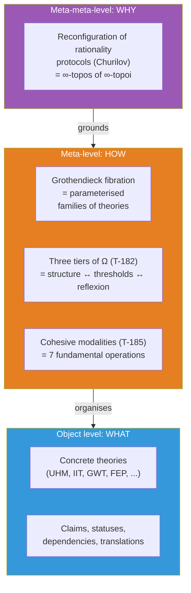
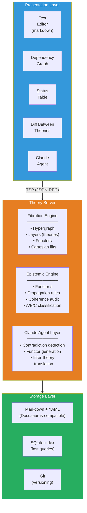
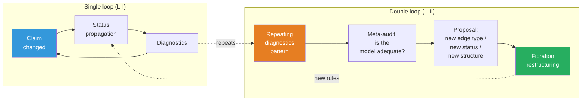

# Theory IDE: Environment for Working with Scientific Theories

:::info Who this document is for
For researchers working with complex theoretical constructions — physicists, neuroscientists, philosophers of consciousness, AGI specialists. The document describes the **Theory IDE** project — a software environment that makes working with theories (navigating, comparing, verifying coherence and inter-theory translation) machine-assisted. The mathematical foundation is the Grothendieck fibration; the conceptual basis is the CC formalism; the software architecture is the Theory Server with an LLM agent.
:::

---

## 1. The Problem: Cognitive Limit {#проблема}

### 1.1. Scale of Modern Theory

A mature scientific theory is an object that exceeds the cognitive capacity of a single agent. As an example: the documentation of CC (Coherence Cybernetics, the applied layer of UHM) spans ~400 pages, ~185 theorems with 7 epistemic statuses, 23+ falsifiable predictions, 30+ comparisons with competing theories, ~270 cross-references. Integrated Information Theory (IIT 4.0) is a comparable volume with its own formalism ($\Phi$, Q-shape, postulates). Anokhin's cognitome is a qualitative theory with an 80-year experimental background. And there are [more than 325](https://www.consciousnessatlas.com/) such theories of consciousness (according to the Consciousness Atlas catalogue, visualizing the landscape mapped by Robert Kuhn: materialism, functionalism, quantum theories, panpsychism, dualism, idealism, etc.).

No single person can simultaneously hold in working memory:
- the internal structure of even one theory (which claims depend on which)
- the epistemic status of each claim (proven / conditional / hypothesis / refuted)
- the correspondences between theories (what does Tononi's $\Phi$ mean in UHM terms? how does Friston's FEP connect with autopoiesis? where does Anokhin's cognitome contradict Baars's GWT?)
- the consequences of changes (if axiom X is refuted, which theorems fall?)

### 1.2. Concrete Incidents

**The ρ* paradox (session 25 of working with UHM).** Discovered: self-reference in the regeneration operator ℛ — the target state ρ* was defined as a dynamical fixed point, which caused ℛ to vanish. Fix: redefinition ρ* = φ(Γ) (categorical self-model). Consequences: required updating ~25 files, changing the status of theorem T-68 from [Т] (proven) to [С] (conditional), replacing "primitivity of ℒ_Ω" with "primitivity of ℒ₀" in all occurrences. Time: an entire work session on **mechanical propagation** — work that a machine can perform in seconds.

**Broken anchors (translation session).** When translating the documentation to English, headings were translated but ~50 internal links continued pointing to Russian anchors. Discovery: only during site build. Fix: manual search and replacement in ~20 files. This is a task for automatic coherence checking.

**Status mismatch (audit 2026-03-23).** A deep audit found 9 critical and 14 serious problems: theorems with status [Т] depending on hypotheses [Г]; claims contradicting each other; outdated links. Fix: 85 targeted edits in 42 files over 8 sessions. Each of these problems is detectable automatically.

### 1.3. Current Tools and Their Limits

| Tool | What it does | What it doesn't do |
|------------|-----------|----------------|
| **Docusaurus** | Renders markdown to a site, checks links | Doesn't know about logical dependencies between claims |
| **grep / ripgrep** | Finds text | Doesn't know about connection types (dependency ≠ mention) |
| **Git** | Versions files | Doesn't know about theorem statuses |
| **Obsidian** | Note graph with links | Untyped connections, no coherence, no inter-theory bridges |
| **RAG + LLM** | Finds relevant text, generates an answer | Operates on text, not structure; doesn't check logic |
| **Claude Code** | Code development, codebase navigation | Doesn't know about the theoretical structure of file contents |

None of these tools understands that a file contains a **theorem**, that the theorem **depends** on an axiom, that the axiom has a **status**, and that changing the axiom's status **must be propagated** to all dependent theorems.

:::warning Categorical diagnosis: why flat tools are fundamentally insufficient
The listed tools are **0-categorical**: they operate on sets (of files, lines, commits) without typed morphisms. But scientific knowledge has an **∞-categorical** structure:
- **Objects** (claims) are connected by **morphisms** (dependencies) — level 1
- Morphisms are connected by **2-morphisms** (theory comparisons: "is the IIT→UHM translation compatible with IIT→GWT→UHM?") — level 2
- 2-morphisms are connected by **3-morphisms** (meta-audit: "are our comparison rules adequate?") — level 3
- ...and so on for each reflexive cycle (§9)

A tool operating at level $n$ **cannot detect** problems at level $n+1$ (analogue of T-182: $\mathcal{T}_0 \subsetneq \mathcal{T}_1 \subsetneq \mathcal{T}_2$). Grep (level 0) cannot detect status inconsistencies (level 1). A status checker (level 1) cannot detect incoherence of inter-theoretic translations (level 2). What is needed is a tool containing **all levels** — ∞-categorical by construction.
:::

### 1.4. What's Needed: An IDE for Theories

An environment is needed that:
1. **Knows the structure** of the theory: claims, dependencies, statuses — not as text, but as a typed graph
2. **Checks coherence** in real time: no [Т]-theorems depending on [✗]-axioms; no contradictions between [Т]-claims; no circular dependencies
3. **Propagates changes** automatically: an axiom's status is lowered → all dependent theorems are automatically flagged for revision
4. **Supports multiple theories** simultaneously: UHM, IIT, GWT/GNWT, FEP, cognitome, autopoiesis, HOT, RPT — in one workspace (all [325+](https://www.consciousnessatlas.com/))
5. **Translates between theories**: "what does Tononi's $\Phi$ mean in UHM terms?" → a formal answer: $\Phi \leftrightarrow$ integration measure, with specification of divergences and losses
6. **Integrates LLM** not as a chatbot, but as an agent operating inside the structure

---

## 1½. Meta-Epistemological Grounding {#метаэпистемология}

:::info Why this section is needed
§1 described the **problem** (cognitive limit). §2 will propose the **solution** (Grothendieck fibration). This intermediate section answers the meta-level question: **why this particular solution** — and why alternatives are fundamentally insufficient. The grounding draws on three sources: (1) A. Churilov's metastemological programme, (2) the three-tier theorem T-182 from the UHM ∞-topos, (3) the reflexive architecture of cohesive modalities T-185.
:::

### 1½.1. Metastemology: beyond rationality protocols

Andrey Churilov (["Metastemology. Instead of a Manifesto"](https://anticomplexity.org/posts/metastemologiya-vmesto-manifesta/), 2025) advances a radical thesis: the problem of contemporary knowledge is **not** a shortage of data and **not** errors in reasoning, but the **architecture of cognitive protocols themselves**. Analytic philosophy has spent decades patching holes in the JTB formula (justified true belief), remaining **inside** the prior rationality protocol. But the protocol itself is an object subject to reconfiguration.

Key Churilov concepts resonating with Theory IDE:

| Churilov | Theory IDE | Mathematical analogue |
|---------|-----------|----------------------|
| **Stem** — a terminological bridge linking constructs from different theories | **Functor** $F: T_A \to T_B$ — Cartesian lifting of claims | Morphism in the base $\mathbf{B}$ |
| **Impulse network** — a dynamic network with normative/generative mechanics | **Typed hypergraph** with status propagation | Fibre $p^{-1}(T)$ with functor $\varepsilon$ |
| **Metatextual processor** — a new class of devices for working with complex knowledge | **Theory IDE** as a whole: fibration + epistemic engine + LLM agent | ∞-topos $\mathbf{Sh}_\infty(\mathbf{E})$ |
| **Reconfiguration of rationality** — changing protocols, not working within them | **Double loop** (§9): L-II by Bateson, $T_{\text{meta}}$ | Postnikov tower: $\tau_{\leq n+1} \to \tau_{\leq n}$ |
| **Executable knowledge on an actant network bus** | **MCP integration**: Theory Server as an executable theory model | Sheaf $\mathcal{F} \in \mathbf{Sh}_\infty(\mathcal{C})$ |

Churilov does not use categorical mathematics explicitly, but his architecture is **isomorphic** to the categorical one: stems = functors, impulse network = fibre of the fibration, metatextual processor = ∞-topos. Theory IDE is the **realisation** of the metastemological programme on a categorical foundation.

### 1½.2. Three tiers of Ω as three tiers of Theory IDE

Theorem T-182 [T] (Axiom Ω⁷, [proof](/docs/core/foundations/axiom-omega#необходимость-трёхуровневой-структуры)) establishes that three tiers of the subobject classifier are strictly necessary: $\mathcal{T}_0 \subsetneq \mathcal{T}_1 \subsetneq \mathcal{T}_2$. This structure **projects** onto the Theory IDE architecture:

| Tier of $\Omega$ | Theory IDE tier | What it formalises |
|-------------------|-------|-----------------|
| $\mathrm{Dec}(\Omega) \cong 2^7$ (Boolean) | **Fibration Engine**: typed hypergraph, claim and dependency types | Static structure: "which claims exist and how they are connected" |
| $\tau_{\leq 0}(\Omega)$ (Heyting) | **Epistemic Engine**: threshold predicates, status propagation, coherence audit | Thresholds and logic: "which claims are reliable and where the boundaries lie" |
| Full $\Omega$ (∞-groupoid) | **Reflexive cycles**: $T_{\text{meta}}$, double loop, meta-audit | Dynamics: "how the system observes and restructures itself" |

This is **not an analogy** but a **projection**: Theory IDE structurally reproduces the UHM ∞-topos one categorical level higher — from the space of quantum states to the space of theories.

**Fundamental irreducibility.** Just as T-182 proves that Dec(Ω) is insufficient for threshold predicates ($P > 2/7 \notin 2^7$), so the Fibration Engine is insufficient without the Epistemic Engine: the dependency structure contains no information about claim **reliability**. Just as the Heyting algebra is insufficient for L2 consciousness ($\pi_2 = 0$ in the 0-truncation), so the Epistemic Engine is insufficient without reflexive cycles: checking claim coherence does not include checking the coherence of **the rules of checking**.

### 1½.3. Cohesive modalities as IDE operations

Theorem T-185 [T] ([Seven Dimensions](/docs/core/structure/dimensions#категориальная-семантика)) establishes 7 canonical modalities of the differentially cohesive ∞-topos. Six of them (excluding Id) map to fundamental Theory IDE operations:

| Modality | Definition | IDE operation |
|----------|------------|---------------|
| $\Pi$ (Shape) | Extracts distinguishable components | `theory/audit` — detecting differences and inconsistencies |
| $\flat$ (Flat) | Extracts discrete invariants | `claim/dependencies` — dependency skeleton (without dynamics) |
| $\Im$ (Infinitesimal shape) | Captures infinitesimal change | `claim/setStatus` + propagation — response to a local change |
| $\sharp$ (Sharp) | Computes logical closure | `fibration/coherence` — transitive check of the entire fibration |
| $\&$ (Infinitesimal flat) | Internalises infinitesimal structure | `meta/audit` — IDE observes its own structure |
| $\mathrm{Rh}$ (de Rham) | Integrates local to global | `claim/translate` — Cartesian lifting, inter-theoretic synthesis |

This table is **not a post-hoc fit** but a consequence of the cohesive ∞-topos structure: if the IDE operates on sheaves over a site of theories, its fundamental operations **necessarily** decompose into cohesive and infinitesimal modalities (Schreiber 2013). Theory IDE is not an arbitrary set of functions but a **projection of the categorical foundation** onto a programmatic interface.

### 1½.4. Fundamental grounding: why ∞-categories are the only adequate apparatus

Churilov diagnoses the problem correctly (rationality protocols are subject to reconfiguration), but his toolkit (stems, impulse networks) remains at the **conceptual** level — it describes *what* needs to be done but does not provide a **mathematical apparatus** guaranteeing the coherence of the reconfiguration. We must descend one level deeper: to the **mathematics of mathematics itself**.

**Thesis.** Working with knowledge about knowledge is an operation on the **category of categories** $\mathbf{Cat}$. Working with knowledge about knowledge about knowledge is an operation on the **∞-category of ∞-categories** $\mathbf{Cat}_\infty$. This is not a metaphor but a precise statement:

| Operation | Mathematical object | Level |
|----------|----------------------|---------|
| Formulating claims inside a theory | Objects and morphisms in a category $\mathcal{C}$ | Object |
| Comparing theories | Functors $F: \mathcal{C} \to \mathcal{D}$ | Meta |
| Checking coherence of comparisons | Natural transformations $\alpha: F \Rightarrow G$ | Meta² |
| Reconfiguring the checking system itself | Modifications $\Theta: \alpha \Rrightarrow \beta$ (3-morphisms) | Meta³ |
| ... | ... (∞-morphisms) | Meta^n |

In a 1-category (ordinary mathematics) only objects and morphisms are available — **one** level of abstraction. In a 2-category — two. In an ∞-category — **all** levels simultaneously. Theorem T-182 proves that UHM **requires** the three lowest levels. Theory IDE, operating on **theories as objects**, requires even more: each reflexive cycle (§9) adds one level.

**Lurie's theorem (HTT, Theorem 1.1.2.2):** The category $\mathbf{Cat}_\infty$ of all small ∞-categories is itself an ∞-category. This means: a system working with theories (each of which is a category) automatically **lives** in an ∞-category, whether or not we realise it.

**Corollary for Theory IDE:** Any tool for working with multiple interconnected theories that supports reflexive cycles of arbitrary depth **necessarily** implements (possibly implicitly) a structure from $\mathbf{Cat}_\infty$. The ∞-topos is not a "choice of formalism" but the **only** mathematical structure containing:
- objects (claims)
- morphisms (dependencies)
- 2-morphisms (theory comparisons)
- 3-morphisms (meta-audit of comparisons)
- ...
- n-morphisms (n-th order reflexion)

with guaranteed coherence at all levels simultaneously.

Alternatives:
- **Graph databases** (Neo4j) — 1-category, no 2-morphisms. Can store theories and links, but cannot formally compare two translations between theories.
- **Relational databases** — not even a category (no composition). Can store data, but cannot express functoriality or coherence.
- **Obsidian / Roam** — untyped graph. Cannot distinguish `requires` from `contradicts`.
- **RAG + LLM** — operates on text, not structure. No coherence guarantees.

Only the ∞-topos contains all levels, and Theory IDE is its computational realisation.

### 1½.5. Three-tier grounding architecture

Combining the fundamental argument (§1½.4), the metastemological context (§1½.1), and the categorical projections (§1½.2–1½.3), we obtain:



**Meta-meta-level** (§1½): *why* Theory IDE is structured this way — because cognitive rationality protocols (Churilov) require reconfiguration rather than repair, and the only mathematical apparatus for working with **structures of structures** is ∞-category theory.

**Meta-level** (§2–§9): *how* Theory IDE is structured — Grothendieck fibration for organising theories, three tiers of Ω for organising checks, cohesive modalities for organising operations.

**Object level** (§10–§11): *what* Theory IDE does — concrete operations on concrete theories.

Each level is **irreducible** to the previous — a direct consequence of T-182 ($\mathcal{T}_0 \subsetneq \mathcal{T}_1 \subsetneq \mathcal{T}_2$): it is impossible to build an adequate IDE working only at the object level (thresholds are needed), and it is impossible to stop at the meta-level (reflexion about reflexion is needed).

---

## 2. Mathematical Foundation: Grothendieck Fibration {#фундамент}

### 2.1. Why Category Theory Is Needed

One could design the IDE ad hoc: "theories are folders, claims are files, dependencies are links, statuses are tags." This would work for a single theory. But when working with **multiple theories connected to each other**, ad hoc solutions lose coherence: how to formally define "translating a concept from one theory to another"? How to verify that translations are **consistent** (translating from A to B, then from B to C gives the same result as a direct translation from A to C)?

These questions are solved in mathematics: **category theory** formalizes exactly such structures. And the specific construction — the **Grothendieck fibration** — formalizes *parametrized families of categories with coherent connections*.

### 2.2. Fibration: Definition and Intuition

**Definition** (Grothendieck, SGA 1, Exposé VI, 1961). A functor $p: \mathbf{E} \to \mathbf{B}$ is called a **fibration** if for any morphism $f: b' \to b$ in $\mathbf{B}$ and any object $e$ in the fiber $p^{-1}(b)$ there exists a **Cartesian lift** — a morphism $\tilde{f}: e' \to e$ in $\mathbf{E}$, projecting to $f$ and universal among such.

**Intuition.** Imagine a multi-story building:
- **Floors** = theories (UHM on the 1st floor, IIT on the 2nd, GWT on the 3rd, FEP on the 4th, cognitome on the 5th, ...)
- **Rooms on a floor** = claims within a theory
- **Doors between rooms** = logical dependencies within a theory
- **Stairs between floors** = functor correspondences (translations) between theories
- **Cartesian lift** = if the 1st floor has a room "coherence γ_{ij}", and there is a staircase (functor F_Cog) between floors 1 and 2, then the Cartesian lift is the room on the 2nd floor that the staircase leads to: "LOC (cogit connection)"

The fibration guarantees that the staircases are **coherent**: if one can get from floor 1 to floor 3 via floor 2, the result is the same as a direct transition.

### 2.3. Concrete Fibration for Theory IDE

| Component | Notation | Content |
|-----------|-------------|------------|
| **Base** | $\mathbf{B}$ | Category of theories. Objects: $T_{\text{UHM}}, T_{\text{IIT}}, T_{\text{GWT}}, T_{\text{FEP}}, T_{\text{Cog}}, T_{\text{HOT}}, \ldots$ Morphisms: functors between theories ($F_{\text{IIT}}, F_{\text{Cog}}, F_{\text{FEP}}, \ldots$) |
| **Total category** | $\mathbf{E}$ | Category of claims. Objects: pair (claim, theory) — "T-39 in UHM", "$\Phi > 0$ in IIT", "global ignition in GWT". Morphisms: logical dependencies (consequence, generalization, contradiction, translation) |
| **Projection** | $p: \mathbf{E} \to \mathbf{B}$ | Associates each claim with its owner theory |
| **Fiber** | $p^{-1}(T)$ | All claims within theory $T$ with their dependencies |
| **Cartesian lift** | $\tilde{F}$ | Claim translation: "P > 2/7 in UHM" $\xrightarrow{F_{\text{IIT}}}$ "$\Phi > 0$ in IIT"; or $\xrightarrow{F_{\text{Cog}}}$ "percolation threshold in cognitome" |

### 2.4. Connection to UHM ∞-Topos

This is not an accidental borrowing. UHM **itself is built** on an ∞-topos — a generalization of the Grothendieck construction developed by Lurie (HTT, 2009). The unique primitive of UHM:

$$
\mathfrak{T} := (\mathrm{Sh}_\infty(\mathcal{C}),\; J_{\text{Bures}},\; \omega_0)
$$

where $\mathrm{Sh}_\infty(\mathcal{C})$ is the category of ∞-sheaves on site $\mathcal{C} = \mathbf{DensityMat}$ with the Bures topology. The Grothendieck construction (in the ∞-generalization of Lurie — straightening/unstraightening, HTT 3.2) establishes an **equivalence** between fibrations over $\mathcal{C}$ and functors $\mathcal{C}^{\mathrm{op}} \to \mathbf{Cat}_\infty$.

Thus, in UHM fibrations organize claims **within** a single theory. Theory IDE uses **the same construction one level higher**: for organizing **multiple theories and connections between them**. One mathematical object, two levels of application — like a JVM executing both application code and the IDE itself (IntelliJ is written in Java).

### 2.5. Epistemic Layer

Beyond the logical structure, each claim carries an **epistemic status** — a label from an ordered set:

$$
\text{[Т]} > \text{[С]} > \text{[Г]} > \text{[П]} > \text{[О]} > \text{[И]} > \text{[✗]}
$$

| Status | Meaning | Example |
|--------|----------|--------|
| **[Т]** Theorem | Proven rigorously | T-39: $P_{\text{crit}} = 2/7$ |
| **[С]** Conditional | Proven under explicit assumption | T-68: $P > 2/7$ under assumption C20 |
| **[Г]** Hypothesis | Conjectured, not proven | Coincidence of percolation thresholds and $P_{\text{crit}}$ |
| **[П]** Postulate | Accepted without justification | Axiom Ω⁷ |
| **[О]** Definition | Convention | PID (principle of informational distinguishability) |
| **[И]** Interpretation | Philosophical | Two-aspect monism |
| **[✗]** Retracted | Refuted | X3 (Fano bound) |

These are not text tags — this is a **functor** $\varepsilon: \mathbf{E} \to \mathbf{Status}$, where $\mathbf{Status}$ is a category with morphisms "upgrade/downgrade". Propagation rules:

1. If claim $a$ **necessarily depends** on $b$, and $\varepsilon(b)$ is downgraded, then $\varepsilon(a) \leq \varepsilon(b)$
2. If $a$ and $b$ **contradict** each other, and $\varepsilon(a) = \text{[Т]}$, then $\varepsilon(b) = \text{[✗]}$
3. Functors must be composable: $F_{12} \circ F_{23} \simeq F_{13}$

The IDE checks these rules **automatically** and propagates changes.

---

## 3. Architecture {#архитектура}

The architecture implements four conceptual principles from §2, §7–9:

| Principle | Section | Architectural implementation |
|---------|--------|-------------------------|
| Grothendieck fibration | §2 | Fibration Engine (hypergraph, layers, functors, Cartesian lifts) |
| Epistemic layer | §2.5 | Epistemic Engine (functor ε, propagation, audit) |
| Self-reference | §7 | $T_{\text{meta}}$ as a layer in the fibration + TSP commands `meta/*` |
| Process ontology | §8 | Morphisms are primary in the data model; stigmergy through diagnostics |
| Reflexive cycles | §9 | Claude Agent Mode 5 (meta-audit) + double loop |
| Cognitive extension | §10 | Tensor product $\mathbb{H}_{\text{bio}} \otimes \mathbb{H}_{\text{ide}}$ |

### 3.1. Three Layers



Each layer has a clear responsibility:

- **Presentation layer** — multiple synchronized panels (projections of a single fibration). Connected to the server via **TSP** (Theory Server Protocol — analogous to LSP for theories).
- **Theory Server** — the core: three engines working together. The Fibration Engine stores and traverses the hypergraph; the Epistemic Engine checks and propagates statuses; the Claude Agent Layer performs semantic operations (translation, correspondence detection). Language: Rust (core) + TypeScript (TSP wrapper).
- **Storage layer** — markdown files with YAML frontmatter (backwards compatible with Docusaurus), SQLite index for instant graph queries, Git for versioning.

### 3.2. Theory Server Protocol (TSP)

TSP is the protocol for interaction between client (UI) and server (Theory Server). Analogous to **LSP** (Language Server Protocol), but for theories instead of programming languages. Format: JSON-RPC over stdio or TCP.

**Navigation:**
- `theory/list` — list all theories in the workspace
- `theory/claims { theory_id }` — all claims of a theory
- `claim/dependencies { claim_id }` — what this claim depends on
- `claim/dependents { claim_id }` — what depends on this claim
- `claim/translate { claim_id, target_theory }` — Cartesian lift: translation to another theory

**Mutations:**
- `claim/setStatus { claim_id, new_status, reason }` — change status (with automatic propagation)
- `claim/addDependency { source, target, type }` — add a dependency
- `theory/addFunctor { source, target, mappings }` — add an inter-theory bridge

**Diagnostics:**
- `theory/audit { theory_id }` — full coherence audit
- `fibration/coherence` — check of the entire fibration (all theories + all functors)

**Self-reference (§7):**
- `meta/audit` — audit of the $T_{\text{meta}}$ layer: check of the adequacy of the data model itself
- `meta/boundaries` — list of $T_{\text{meta}}$ claims bounded by Lawvere's theorem (status ≤ [Г])
- `meta/suggest_extension` — Claude Agent proposes model extensions (new edge type, new status)

### 3.3. Storage Format

Each claim is a markdown file with YAML frontmatter. The format is backwards compatible with Docusaurus:

```yaml
---
id: T-39
theory: uhm
type: theorem       # axiom | theorem | definition | conjecture | prediction | concept
status: Т           # Т | С | Г | П | О | И | ✗
epistemic_class: A  # A | B | C
title: "Critical purity P_crit = 2/7"
dependencies:
  - { id: A-Omega7, type: requires }
  - { id: A-Bures, type: requires }
dependents:
  - { id: T-62, type: entails }
  - { id: T-96, type: entails }
translations:
  - { theory: cognitome, target: percolation-threshold, functor: F_Cog, status: И }
tags: [purity, threshold, viability]
---

# T-39: Critical purity P_crit = 2/7

**Formulation.** For a system with Γ ∈ D(C⁷) ...
```

The SQLite index is built automatically by scanning files and updated incrementally on changes.

---

## 4. Fibration Engine: Core of the System {#fibration-engine}

### 4.1. Typed Hypergraph

The central data structure is a **typed hypergraph**. In accordance with process ontology (§8), edges (morphisms) are primary, nodes are the degenerate case (identity morphism). In practice: nodes and edges are stored together, but the API and queries are oriented toward **connection patterns**, not claim lists.

**Nodes** — claims:
- `claim_id` — unique identifier (e.g. `uhm:T-39`)
- `theory_id` — which theory it belongs to
- `claim_type` — axiom, theorem, definition, conjecture, prediction, concept
- `status` — epistemic status [Т]/[С]/[Г]/[П]/[О]/[И]/[✗]
- `content` — text (markdown)

**Edges** — dependencies:
- `source` → `target` — direction
- `dep_type` — dependency type:

| Type | Meaning | Example |
|-----|----------|--------|
| `requires` | Necessary condition | T-62 **requires** T-39 |
| `entails` | Logical consequence | T-39 **entails** T-62 |
| `generalizes` | Generalizes | T-120 **generalizes** T-119 |
| `instantiates` | Special case | T-119 **instantiates** T-120 |
| `contradicts` | Contradicts | If X3 [✗] **contradicts** T-39 |
| `defines` | Defined via | Definition R **is defined via** φ(Γ) |
| `translates_to` | Translation to another theory | UHM:γ_{kk} **translates to** Cog:cogit |

**Layers** — theories:
- Each layer = subgraph containing all nodes of one theory
- Cross-layer edges (of type `translates_to`) = functor correspondences

### 4.2. Status Propagation

When a claim's status changes, the Fibration Engine performs a BFS traversal of the dependency graph:

1. Claim $b$ is downgraded: $\varepsilon(b) \leftarrow \text{new status}$
2. For each $a$ depending on $b$ via `requires`:
   - Compute $\max\_\text{allowed}(a) = \min(\varepsilon(\text{dependencies}(a)))$
   - If $\varepsilon(a) > \max\_\text{allowed}(a)$: downgrade $\varepsilon(a)$, add $a$ to the queue
3. Repeat until the queue is empty

Result: a list of all affected claims with reasons. The user sees: "T-68 downgraded from [Т] to [С] because it depends on C20, which is [С]".

### 4.3. Coherence Check (Audit)

Five types of violations:

1. **Status mismatch**: a [Т]-claim depends (via `requires`) on [Г] or lower
2. **Contradiction**: two [Т]-claims are connected by a `contradicts` edge
3. **Circular dependency**: a `requires` chain forms a cycle (A → B → C → A)
4. **Functor mismatch**: $F_{12} \circ F_{23} \not\simeq F_{13}$ (translations are inconsistent)
5. **Dangling references**: a dependency points to a nonexistent claim

Each violation is a diagnostic with a description, severity, and a fix suggestion.

### 4.4. Cartesian Lift (Inter-Theory Translation)

Request: "what does claim X of theory A mean in terms of theory B?"

Algorithm:
1. Find claim X in fiber $p^{-1}(A)$
2. Find functor $F: A \to B$ in base $\mathbf{B}$
3. Find the mapping of X in the functor $F$'s correspondence table
4. If mapping exists — return the translation with confidence and loss indicators
5. If it doesn't exist — return "translation impossible" with explanation (X has no analogue in B)

Example:
```
Request: translate(uhm:P_crit, cognitome)
Response: {
  source: "uhm:P_crit = 2/7",
  target: "cog:percolation-threshold",
  functor: "F_Cog",
  confidence: 0.7,
  status: "И",
  what_is_lost: "Numerical value 2/7 — the cognitome does not specify the threshold quantitatively"
}
```

---

## 5. Claude Opus as Agent Inside the Fibration {#claude-agent}

### 5.1. Key Difference from "LLM + RAG"

In the "Obsidian + RAG + LLM" combination:
- LLM receives **text** (document fragments found by similarity)
- LLM generates **text** (answer to a question)
- No understanding of **structure**: connection types, statuses, dependencies

In Theory IDE:
- Claude Opus has access to the **typed hypergraph** through specialized tools
- Claude Opus performs **structural operations**: navigation through dependencies, coherence checking, functor proposal
- Every action is **verifiable**: one can check that the proposed functor is consistent with existing ones

### 5.2. Claude Opus Tools

Claude Opus connects to the Theory Server through a set of tools (Anthropic tool_use API):

| Tool | Purpose |
|------------|-----------|
| `query_graph` | Hypergraph query (Cypher-like language) |
| `get_claim` | Full claim content by ID |
| `get_dependencies` | Claim dependency graph (N levels deep) |
| `find_translations` | All translations of a claim into other theories |
| `check_coherence` | Subgraph coherence check |
| `propose_status_change` | Propose status change with justification |
| `propose_functor` | Propose a functor correspondence between theories |

### 5.3. Four Operating Modes

**Mode 1: Navigator.** The user asks — Claude Opus navigates the fibration and responds, referencing specific claim_ids. "Which theorems depend on axiom Ω⁷?" → `get_dependencies(uhm:A-Omega7, depth=3)` → structured answer.

**Mode 2: Auditor.** Claude Opus scans the fibration for coherence violations. "Check all of UHM" → `check_coherence(uhm, full=true)` → list of problems with fix suggestions. This replaces the manual audit that took 8 sessions.

**Mode 3: Translator.** The user loads a new theory (e.g., Friston's FEP). Claude Opus:
1. Reads the structure of the new theory
2. Compares it with already loaded theories
3. Proposes functor correspondences: "FEP.free_energy ↔ UHM.δF (free energy), confidence 0.8"
4. User confirms or rejects each correspondence
5. Confirmed correspondences are saved as functor $F_{\text{FEP}}$

This is the key function **impossible** without LLM: automatic detection of semantic correspondences between theories with different terminologies.

**Mode 4: Propagator.** When a claim's status changes, Claude Opus:
1. Computes all affected claims (via Fibration Engine)
2. For each affected claim — analyzes whether the downgrade is truly necessary (perhaps there exists an alternative proof chain that doesn't depend on the changed claim)
3. Proposes the minimal set of changes

**Mode 5: Meta-auditor (double loop, §9).** Claude Opus analyzes not the claims, but **the IDE's own structure**:
1. Detects **patterns** of repeating diagnostics (the same problem in different theories → a model limitation, not a theory error)
2. Proposes extensions: "The dependency type `translates_to` does not distinguish 'necessary for proof' and 'necessary for definition' — I propose splitting into `requires_proof` and `requires_def`"
3. Tracks systematic losses during inter-theory translation: "All functors from qualitative to quantitative theories lose numerical thresholds — this is a model limitation, not a functor error"
4. Results are recorded as claims in the $T_{\text{meta}}$ layer (§7) with status [Г] and are subject to the same audit

### 5.4. MCP Integration

The Theory Server is implemented as an **MCP server** (Model Context Protocol), allowing it to be connected to Claude Code as a source of tools:

```json
{
  "mcpServers": {
    "theory-server": {
      "command": "theory-server",
      "args": ["--project", "./"],
      "description": "Theory IDE: fibration engine + epistemic engine"
    }
  }
}
```

Result: when working in Claude Code, all Theory Server tools (`query_graph`, `check_coherence`, `propose_functor`, etc.) are available as MCP tools. Claude Opus can operate with the theory structure **directly from the terminal**.

---

## 6. Multiple Projections (Sheaves) {#проекции}

### 6.1. Why Projections Are Needed

The same object (fibration $p: \mathbf{E} \to \mathbf{B}$) can be represented differently depending on the task. This is a **theorem**, not a design decision: by the definition of a sheaf, any sheaf $\mathcal{F} \in \mathbf{Sh}_\infty(\mathcal{C})$ admits **multiple sections** — ways to "cut" a local projection from the global object.

Mathematically: if $\{U_i \to X\}$ is a covering of object $X$ in the fibration, then the **gluing condition** guarantees that local sections $s_i \in \mathcal{F}(U_i)$ assemble into a global section $s \in \mathcal{F}(X)$ coherently. The five IDE panels are five $U_i$ covering a single fibration. Gluing is ensured by the Theory Server: a change in any panel is automatically synchronised with the rest via the Fibration Engine.

### 6.2. Five Panels

**"Text" panel** — markdown editor. Shows the content of a single claim. LaTeX highlighting, link autocomplete (`[[T-39]]`), inline status display. A familiar interface.

**"Graph" panel** — hypergraph visualization. Nodes colored by status: green [Т], yellow [С], orange [Г], grey [П]/[О]/[И], red [✗]. Edges colored by type: `requires` = solid line, `contradicts` = red dashed, `translates_to` = blue. Click on a node → focus in the text panel.

**"Statuses" panel** — table of all claims with filters by status, type, theory. Sorting by date of change, number of dependencies, violation severity. Analogous to "Problems" in VS Code.

**"Federation" panel** — visualization of base $\mathbf{B}$. Each theory is a block, functors are arrows. Click on a functor → mapping table. Drag-and-drop for creating new functors.

**"Agent" panel** — chat with Claude Opus. Difference from ordinary chat: Claude sees the **current state of the fibration** and can perform structural operations. Claude's proposals (status changes, new functors) appear as diffs that the user confirms or rejects.

---

## 7. Self-Reference: IDE as an Object Within Itself {#самореференция}

### 7.1. The Objectification Problem

Any tool for working with theories risks **objectifying** theories — turning living processes of thought into static storage objects. Tononi called this the *fallacy of misplaced objectivity*: substituting a process with its projection. If Theory IDE operates on theories "from outside," as items on a shelf, it reproduces the very error it was designed to overcome.

Solution: the IDE must **include itself** in its own space of objects.

### 7.2. T_meta: Theory of the IDE About Itself

In the fibration $p: \mathbf{E} \to \mathbf{B}$, a **special layer** is singled out — $T_{\text{meta}} \in \mathbf{B}$, describing the structure of the IDE itself. Its claims:

- "Each theory has an epistemic status functor" — a claim *about* the IDE, *inside* the IDE
- "Status propagation is sound" — a claim *about* the propagation algorithm
- "Dependency types (requires, entails, contradicts, translates_to) are sufficient" — a claim *about* the data model
- "Functor composability $F_{12} \circ F_{23} \simeq F_{13}$ is verifiable" — a claim *about* coherence checking

The $T_{\text{meta}}$ layer obeys **the same rules** as the other layers: its claims have statuses, dependencies, and are checked for coherence. This creates a **controlled strange loop** (Hofstadter 1979): the IDE audits itself with the same means it uses to audit the loaded theories.

### 7.3. Lawvere's Theorem and the Limits of Self-Reference

**Lawvere's fixed-point theorem** (1969): in a Cartesian closed category, if there exists a surjective morphism $f: A \to B^A$, then every endomorphism $g: B \to B$ has a fixed point. This is a **unified categorical scheme** from which follow Gödel's theorem (incompleteness), Tarski's theorem (undefinability of truth), the halting problem undecidability (Turing), and Russell's paradox (Yanofsky 2003).

**Consequence for Theory IDE:** $T_{\text{meta}}$ cannot prove its own consistency — this is a direct application of Lawvere/Gödel. The IDE must **explicitly mark** this boundary: $T_{\text{meta}}$ claims about the completeness and consistency of the IDE itself have a status no higher than [Г] (hypothesis). Self-reference is not a bug, but a **structural inevitability** of any sufficiently expressive system. The IDE does not attempt to eliminate it — it **manages** it.

This parallels how UHM handles self-reference: the operator $\varphi(\Gamma)$ is a self-model converging to a fixed point $\rho^*$. The self-model is **approximate** (cannot be complete — Lawvere), but **stable** (converges — CPTP contractivity). $T_{\text{meta}}$ in the IDE is the analogue of $\varphi(\Gamma)$: an approximate but stable self-model of the system.

### 7.4. Second-Order Observation

Luhmann (1995) described **second-order observation** — observation of how others observe. Science observes how theories observe the world. Theory IDE formalizes this: each layer $p^{-1}(T)$ is the "observation scheme" of theory $T$ (its distinctions, claims, methods). Functors between theories are acts of second-order observation: observation of how the distinctions of theory A relate to the distinctions of theory B.

$T_{\text{meta}}$ adds a **third order**: observation of how the IDE observes how theories observe the world. This is not an infinite regress: Lawvere's theorem sets a limit, and the contractivity $\varphi^n \to \rho^*$ ensures convergence.

---

## 8. Process Ontology of Data {#процессная-онтология}

### 8.1. Morphisms Are Primary, Objects Are Secondary

Standard category theory admits an **object-free formulation** (Mac Lane 1998, §I.1): objects are identified with identity morphisms. "Object A" is simply a morphism $\mathrm{id}_A: A \to A$ that does nothing. **Connections and transformations** are primary, not "things."

This is not a notational trick, but an **ontological shift**, resonating with Whitehead's process philosophy (1929): reality is not a collection of substances, but a process of becoming. "Actual occasions" are not things, but acts of experience; they arise (concrescence), reach completion, and cease to be. The universe is a process, not a collection.

### 8.2. Consequences for the Data Model

In the current architecture (§4) claims are nodes, dependencies are edges. Process ontology **inverts the priority**: edges (dependencies, translations, contradictions) are primary data, nodes (claims) are the degenerate case (identity dependency). In practice:

- **A claim exists insofar as it is connected.** An isolated claim (with no dependencies, no translations) is a dead node. The IDE can explicitly mark such nodes as "disconnected" and suggest integration.
- **A theory is not a list of claims, but a pattern of connections.** Two sets of claims with isomorphic dependency structure are "the same theory in different terms." This allows the IDE to automatically detect **hidden isomorphisms** between theories.
- **Each commit is an "actual occasion".** Git history is not just versioning, but **concrescence**: each commit inherits from previous ones (prehension) and produces a new configuration. The IDE can visualize not just diffs, but the **evolution of the dependency pattern** between versions.

### 8.3. Stigmergy: Coordination Through the Artifact

**Stigmergy** (Grassé 1959) is coordination through modification of the environment. A termite leaves a ball of mud with pheromone; another termite, finding the traces, builds nearby; collectively they create a structure without a central plan.

Theory IDE is a **stigmergic environment**: each researcher action (status change, dependency addition, functor confirmation) leaves a "trace" in the fibration. This trace stimulates subsequent actions — by the researcher, by the Claude Agent, and by other participants. Status propagation is automatic stigmergy: changing one node generates traces (diagnostics) that guide further work.

The key principle of stigmergy: **the artifact must be readable** (Heylighen 2007). Traces must be perceivable, interpretable, and actionable. That is why all diagnostics, propagations, and Claude Agent proposals are visualized in real time — not in a log, but in the IDE panels.

---

## 9. Reflexive Cycles {#рефлексивные-циклы}

### 9.1. Bateson's Learning Levels

Gregory Bateson (1972) distinguished a hierarchy of learning levels:

| Level | Description | In Theory IDE |
|---------|----------|-------------|
| **L-0** | No changes. Fixed behavior | File storage and rendering (Docusaurus level) |
| **L-I** | Response change. Error detection and correction | Status propagation, contradiction detection (Fibration Engine) |
| **L-II** | L-I change. "Learning to learn" (deutero-learning) | Meta-audit: "are the dependency types sufficient? is the status lattice adequate?" |
| **L-III** | L-II change. Fundamental reorganization | Rebuilding the categorical foundation (e.g. from a 1-fibration to an ∞-topos) |

The current Theory IDE design fully implements **L-0 and L-I**. For L-II, a **meta-audit** is required — Claude Agent periodically checks not "are claims consistent?" but "is the consistency-checking system adequate?" Specifically:

- "Dependency types (requires, entails, contradicts, translates_to, generalizes, instantiates, defines) — is any important type missing?"
- "Status lattice [Т] > [С] > [Г] > [П] > [О] > [И] > [✗] — is an additional level needed?"
- "Functors between theories systematically lose X when translating — is this a limitation of specific functors or of the fibration model overall?"

This is implemented via $T_{\text{meta}}$ (§7): the meta-audit is an audit of the $T_{\text{meta}}$ layer using the standard Fibration Engine tools.

### 9.2. Argyris's Double Loop

Argyris (1977) distinguishes:

- **Single loop**: detect error → correct within existing rules (thermostat: temperature deviated → adjust)
- **Double loop**: detect error → revise **the rules themselves** (not just "what temperature to maintain?" but "why are we maintaining this temperature at all?")

Theory IDE must support **both loops**:



### 9.3. Enactivism: Understanding as Joint Action

The enactive approach (Varela, Thompson, Rosch 1991) holds that cognition is not a representation of a pregiven world, but **joint enaction** that generates a world of meaning through the organism's activity.

Consequence for Theory IDE: the environment does not **store** theoretical understanding — it **generates** it jointly with the researcher. When a researcher requests a translation of a claim from theory A to theory B and discovers that the translation is impossible (no analogue exists), this is not "missing data," but the **generation of new understanding**: the discovery of a fundamental divergence between theories that the researcher had not seen before interacting with the IDE.

Reflexive cycle:

1. Researcher asks a question → Claude navigates the fibration
2. Something unexpected is discovered (contradiction, missing translation, hidden isomorphism)
3. Claude proposes a structural change (new functor, new status, new connection type)
4. Researcher sees the change → **the space of questions transforms**
5. A new question is generated at a different level of understanding

This is not "question → answer." This is **joint transformation of the question space** — what Bateson called L-II, Argyris called the double loop, and enactivism calls structural coupling (Maturana & Varela 1980).

### 9.4. Reflective Equilibrium

Rawls (1971) and Goodman (1955) described **reflective equilibrium** — the process of mutual adjustment between particular judgements, general principles, and background theories. No level has absolute priority: if a principle contradicts a strong intuition — revise the principle; if an intuition contradicts a well-justified principle — revise the intuition.

Theory IDE's audit cycle is **computationally implemented** reflective equilibrium. Claims are "particular judgements," the dependency structure is "general principles," inter-theory functors are "background theories." When an audit detects a conflict (a [Т]-claim depends on a [Г]-claim), the IDE offers both directions:

- **Option A**: upgrade the status of the basis (prove the dependency → [Т])
- **Option B**: downgrade the status of the consequence (weaken the claim → [С])

The researcher chooses — and this choice **itself** is a step of reflective equilibrium, not predetermined by the machine.

---

## 10. Cognitive Extension and Integration {#когнитивное-расширение}

### 10.1. Requirements for a Theory Working Environment

The design of Theory IDE is based not on external frameworks, but on the **internal requirements** of the task itself — working with multiple interconnected theories. From the structure of the fibration $p: \mathbf{E} \to \mathbf{B}$ the following necessary properties follow:

| Requirement | Derivation | Implementation |
|-----------|----------------|-----------|
| **Multi-modality** | The fibration contains layers, base, morphisms — minimum 3 structure types | Text + dependency graph + epistemic layer + inter-theory functors |
| **Automatic synchronization** | Fibration coherence: a change in a layer must be reconciled with the base | Text change → automatic update of graph and statuses (Fibration Engine) |
| **Vertical connectivity** | Fibration definition: $p: \mathbf{E} \to \mathbf{B}$ connects claims to theories | Projection of each claim to its owner theory |
| **Multiple projection** | Sheaves on $\mathbf{E}$ admit various sections | 5 panels: text, graph, statuses, federation, agent |
| **Semantic depth** | Typed morphisms: `requires` ≠ `contradicts` ≠ `translates_to` | The IDE understands the **type** of connection, not just the fact of connection |
| **Contextual translation** | Cartesian lifts: transport of claims along functors | "What does this claim mean in the context of another theory?" |
| **Active coherence** | Functor $\varepsilon$ and propagation rules | Auto-propagation of statuses, contradiction detection |
| **Collaboration** | Fibration — a shared object for multiple agents | Multi-user (Git) + LLM agent as participant |

These properties are not borrowed from an external classification — they are **direct consequences** of the categorical foundation.

### 10.2. Theory IDE as Cognitive Extension

The CC formalism allows Theory IDE to be described not metaphorically, but **quantitatively**. If the researcher's cognitive system is modeled by holon $\mathbb{H}_{\text{bio}}$, and Theory IDE by holon $\mathbb{H}_{\text{ide}}$, then the extended system:

$$
\mathbb{H}_{\text{ext}} = \mathbb{H}_{\text{bio}} \otimes_{\text{Day}} \mathbb{H}_{\text{ide}}
$$

:::info Why $\otimes_{\text{Day}}$, not $\times$
The tensor product here is **Day convolution** (T-182 [T], Part II(d)), not the Cartesian product. The Cartesian product $\mathbb{H}_{\text{bio}} \times \mathbb{H}_{\text{ide}}$ would describe **independent** work of the researcher and the IDE (each in their own space, no interaction). Day convolution admits **entangled** states — situations where the researcher's thought and the IDE's structure are mutually conditioned and inseparable. It is precisely such states that produce cognitive breakthroughs: "I could not have thought this without the tool, and the tool would not have shown this without my question."
:::

**Theorem (consequence of T-129).** If $\Phi(\mathbb{H}_{\text{bio}}) \geq 1$ and $\Phi(\mathbb{H}_{\text{ide}}) \geq 1$, and there exists nonzero coherence between them (the researcher actively uses the IDE, not merely has it open), then:

$$
\Phi(\mathbb{H}_{\text{ext}}) > \max(\Phi(\mathbb{H}_{\text{bio}}),\; \Phi(\mathbb{H}_{\text{ide}}))
$$

The integration of the extended system is **strictly higher** than that of each component separately. This means: a researcher with Theory IDE is cognitively capable of operations inaccessible without the tool — simultaneous comparison of dozens of theories, instant propagation of consequences, detection of hidden correspondences.

This is not an analogy and not marketing. This is a concrete prediction of CC, following from the properties of the tensor product and the integration measure $\Phi$. Theory IDE is the first precedent of a **theoretically justified** cognitive extension: a tool whose utility is derived from the formalism, not postulated.

---

## 11. Usage Examples {#примеры}

### 11.1. Scenario: Paradox Discovery

**Without Theory IDE:**
1. Researcher notices a problem in a proof (e.g. the ρ* paradox)
2. Manually searches for which theorems depend on the problematic claim (grep + reading)
3. Manually updates statuses (~25 files)
4. Hopes nothing was missed
5. Time: 2–4 hours

**With Theory IDE:**
1. Researcher changes the status of the problematic claim: `claim/setStatus T-96 С "ρ* paradox"`
2. Fibration Engine automatically propagates: list of affected claims in <1 sec
3. Claude Agent analyzes each affected claim: "T-98 can be saved via an alternative proof chain not depending on ℛ"
4. "Statuses" panel shows the full list of changes as a diff
5. Researcher confirms or corrects
6. Time: 5 minutes

### 11.2. Scenario: Loading a New Theory

**Without Theory IDE:**
1. Researcher reads an IIT 4.0 paper (Albantakis et al. 2023, 100+ pages)
2. Mentally matches: "$\Phi$ IIT ≈ CC integration measure? Q-shape ≈ sector profile? IIT postulates ≈ UHM axioms?"
3. Writes a comparative chapter manually (~400 lines)
4. Time: 2–3 days

**With Theory IDE:**
1. Researcher imports IIT: markdown with YAML markup (5 postulates, definition of $\Phi$, Q-shape, exclusions)
2. Claude Agent scans and proposes mappings: "$\Phi_{\text{IIT}} \leftrightarrow \Phi_{\text{CC}}$ (conf: 0.9), Q-shape $\leftrightarrow$ sector profile $\gamma_{kk}$ (conf: 0.7), exclusion postulate $\leftrightarrow$ T-153 (conf: 0.6), IIT panpsychism $\leftrightarrow$ L0 UHM (conf: 0.8)"
3. Claude Agent also detects **divergences**: "IIT attributes consciousness to photodiodes ($\Phi > 0$); UHM requires $P > 2/7 \wedge R \geq 1/3$ — this is a fundamental disagreement, marking as `contradicts`"
4. Researcher confirms/corrects
5. "Federation" panel shows IIT as a new layer with green (matches) and red (contradictions) connections
6. Time: 30 minutes

### 11.3. Scenario: Double Loop (Model Limitation Discovery)

1. Claude Agent in meta-auditor mode (Mode 5) discovers: "In 4 out of 5 loaded theories, claims about *temporal dynamics* of consciousness have no analogues in other theories. All functors systematically lose the temporal aspect."
2. Diagnostic: "The edge type `translates_to` does not distinguish static translation (concept A ≈ concept B) and dynamic (process A ≈ process B). I propose introducing `translates_dynamics_to`."
3. This claim is recorded in $T_{\text{meta}}$ with status [Г]
4. Researcher confirms → Fibration Engine adds new edge type → **the IDE's own structure has changed**
5. Re-audit with new type: "3 out of 4 theories now have dynamic translations. Losses reduced by 40%."

This is L-II per Bateson: the IDE changed not the claims inside theories, but **the rules for checking** claims.

### 11.4. Scenario: Responding to Criticism

**Without Theory IDE:**
1. A reviewer criticizes: "Your T-120 depends on the compactification hypothesis, which is not proven"
2. Researcher manually checks the T-120 dependency chain
3. Discovers that compactification was proven in session 28 (T-119 [Т])
4. Writes a response with the full chain
5. Time: 1–2 hours

**With Theory IDE:**
1. `claim/dependencies uhm:T-120 --full` → full dependency tree
2. All dependencies have status [Т] → "T-120 is fully justified"
3. If compactification were [Г] → the IDE would immediately show a coherence violation
4. Time: 30 seconds

---

## 12. Implementation Plan {#план}

The implementation phases correspond to the three tiers of Ω (T-182 [T]):

| Phase | T-182 tier | What is built |
|-------|-----------|--------------|
| **Phase 0–1** | $\mathrm{Dec}(\Omega) \cong 2^7$ | Structure: hypergraph, types, dependencies |
| **Phase 2** | $\tau_{\leq 0}(\Omega)$ (Heyting) | Thresholds: epistemic statuses, coherence, inter-theoretic functors |
| **Phase 2b–4** | Full $\Omega$ (∞-groupoid) | Reflexion: $T_{\text{meta}}$, meta-audit, federation of 325+ theories |

### Phase 0: Prototype in Claude Code (2 weeks)

- Script `build-theory-index.ts`: parses markdown + YAML → JSON index
- Script `check-coherence.ts`: checks coherence from the index
- Script `propagate-status.ts`: propagation on status change
- Hook in Claude Code: after each edit → automatic check
- **Dogfooding**: used for working with UHM

### Phase 1: Theory Server as MCP Server (4 weeks)

- Rust crate `theory-core`: hypergraph, fibration, coherence, propagation
- Rust crate `theory-index`: markdown scanning → hypergraph
- MCP wrapper: Theory Server accessible from Claude Code as MCP tools
- Claude Opus receives tools: `query_graph`, `check_coherence`, `propose_functor`
- **Test**: load UHM, full audit, status propagation

### Phase 2: Loading Competing Theories (2–4 weeks)

- **IIT 4.0** as second layer: postulates, $\Phi$, Q-shape, exclusions. Functor $F_{\text{IIT}}$: $\Phi \leftrightarrow$ CC integration measure, Q-shape $\leftrightarrow$ sector profile $\gamma_{kk}$
- **GWT/GNWT**: global workspace, ignition, access. Functor $F_{\text{GWT}}$
- **FEP**: free energy, Markov blanket, active inference. Functor $F_{\text{FEP}}$: $\delta F \leftrightarrow$ free energy
- **Cognitome**: COG, LOC, percolation. Functor $F_{\text{Cog}}$: cogit $\leftrightarrow \gamma_{kk}$
- Claude Agent proposes additional mappings for each functor
- **Test**: Cartesian lifts between any two loaded theories

### Phase 2b: T_meta and Reflexive Cycles (parallel to Phase 2)

- $T_{\text{meta}}$ layer loaded as a special theory: claims about data model, algorithms, edge types
- Claude Agent Mode 5 (meta-auditor): pattern detection + extension proposals
- TSP commands `meta/*` implemented
- Lawvere bounds: T_meta claims about completeness/consistency automatically marked ≤ [Г]
- **Test**: load T_meta, audit with standard tools, verify that the strange loop converges

### Phase 3: Web UI (6 weeks)

- SolidJS application with 5 panels
- Connection to Theory Server via TSP
- Hypergraph visualization
- Chat with Claude Agent
- **Deploy**: public access for the team

### Phase 4: Full Federation (ongoing)

- Scaling to 30+ theories: autopoiesis, HOT, RPT, AST, predictive coding, orch-OR, panpsychism, neural Darwinism (TNGS), von Bertalanffy's GST, etc.
- Claude Agent builds functors between every pair
- "Theory map" — interactive visualization of base $\mathbf{B}$ (325+ theories from [Consciousness Atlas](https://www.consciousnessatlas.com/))
- Detection of global compatibility clusters and fault lines
- Integration with [ConTraSt Database](https://www.nature.com/articles/s41562-021-01284-5) (412 experiments linked to theories)

---

## 13. Comparison with Existing Tools {#сравнение}

| | Obsidian | Roam | Semantic Wiki | Lean 4 | **Theory IDE** |
|---|---|---|---|---|---|
| Typed relations | ✗ | ✗ | Partial | ✓ | ✓ |
| Coherence | ✗ | ✗ | ✗ | ✓ (complete) | ✓ (epistemic) |
| Multiple theories | ✗ | ✗ | ✗ | ✗ | ✓ |
| Inter-theory bridges | ✗ | ✗ | ✗ | ✗ | ✓ (functors) |
| LLM agent | Plugin | Plugin | ✗ | ✗ | ✓ (inside structure) |
| Epistemic statuses | ✗ | ✗ | ✗ | (true/false) | ✓ (7 levels + propagation) |
| Self-reference (T_meta) | ✗ | ✗ | ✗ | ✗ | ✓ (§7) |
| Reflexive cycles (L-II) | ✗ | ✗ | ✗ | ✗ | ✓ (§9) |
| Process ontology | ✗ | ✗ | ✗ | ✗ | ✓ (§8) |
| Unformalised theories | ✓ | ✓ | ✓ | ✗ | ✓ |
| Mathematical foundation | ✗ | ✗ | ✗ | Type theory | Grothendieck fibration |
| **∞-categorical depth** | 0 (sets) | 0 (sets) | 0 (sets) | 1 (types) | **∞** (T-182: all reflexion levels) |

Theory IDE occupies a niche between full formalization (Lean 4, where everything must be a proof) and pure notes (Obsidian, where nothing is checked). This is a **structured, but not fully formalized** representation of scientific theories with automatic coherence and LLM support.

---

**Related documents:**
- [Theories of Consciousness](/docs/consciousness/comparative/consciousness-theories) — comparative analysis of IIT, GWT, FEP, autopoiesis, and 30+ theories
- [Anokhin's Cognitome](/docs/consciousness/comparative/cognitome-anokhin) — cognitome analysis and functor $F_{\text{Cog}}$
- [Panpsychism](/docs/consciousness/comparative/panpsychism-analysis) — panpsychism analysis and Hoffman's conscious realism
- [General Systems Theory](/docs/consciousness/comparative/general-systems-theory) — from von Bertalanffy to CC
- [Categorical Formalism](/docs/proofs/categorical/categorical-formalism) — ∞-topos and categorical structure of UHM
- [Predictions](/docs/applied/coherence-cybernetics/predictions) — 23+ falsifiable predictions of CC
- [Status Registry](/docs/reference/status-registry) — complete list of claims with statuses

**External resources:**
- [Consciousness Atlas](https://www.consciousnessatlas.com/) — interactive visualization of 325+ theories of consciousness
- [ConTraSt Database](https://www.nature.com/articles/s41562-021-01284-5) — 412 experiments classified by theory (Nature Human Behaviour)
- [PhilPapers: Theories of Consciousness](https://philpapers.org/browse/theories-of-consciousness) — philosophical bibliography
