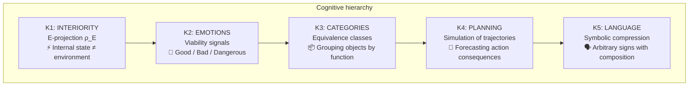
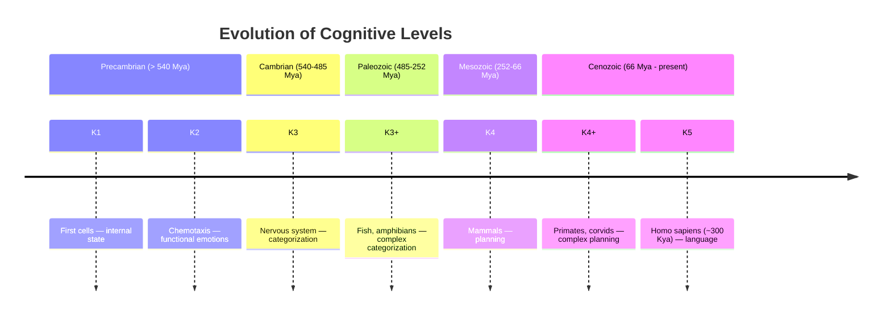

# Cognitive Hierarchy: From Sensation to Language

:::info Who This Chapter Is For
You will learn about five levels of cognitive functions K1–K5 — from bacterial chemotaxis to human language — and how they relate to the formal interiority hierarchy L0–L4. The chapter describes a research program connecting biological cognition to the mathematical formalism $\Gamma$.
:::

:::note About Notation
In this document:
- $\Gamma$ — [coherence matrix](/docs/core/dynamics/coherence-matrix)
- $P$ — [purity](/docs/core/dynamics/viability#определение-чистоты): $P = \mathrm{Tr}(\Gamma^2)$
- $\rho_E$ — reduced density matrix of the [Interiority dimension](/docs/core/structure/dimension-e)
- $\mathcal{E}$ — [evolution](/docs/core/dynamics/evolution) operator
- L0, L1, L2, L3, L4 — [interiority levels](/docs/consciousness/hierarchy/interiority-hierarchy)
- K1–K5 — cognitive levels (defined below)
:::

## Introduction: Why Do We Need a Cognitive Hierarchy?

Imagine you are observing the behavior of a bacterium, a fish, a crow, and a human. All four organisms "do something" — they respond to the environment, avoid danger, seek resources. But there are **qualitative** differences among them. A bacterium swims along a glucose gradient without "understanding" what glucose is. A fish distinguishes predator from prey — it categorizes objects. A crow manufactures a tool to extract a worm from a crevice — it **plans** a sequence of actions. A human explains to another human how to manufacture a tool — uses **language** to transmit abstract knowledge.

How can these differences be described formally? The cognitive hierarchy K1–K5 is an attempt to build a **ladder of cognitive functions**, where each level adds a new ability to the previous ones.

:::danger Research Program
This section describes a **research program**. The cognitive levels (K1–K5) are **not identical** to the [interiority hierarchy](/docs/consciousness/hierarchy/interiority-hierarchy) (L0→L1→L2→L3→L4). The cognitive hierarchy K1–K5 focuses on **biological cognition** — functional abilities observable in the behavior of organisms. The L-hierarchy covers all forms of interiority, including network (L3) and unitary (L4) consciousness, and is formally defined via thresholds ($P$, $R$, $\Phi$, $D$). The connection between them requires formalization.
:::

---

## Connection to the Interiority Hierarchy

Before delving into K-levels, it is important to understand how they relate to the fundamental L-hierarchy.

The **L-hierarchy** is defined via formal thresholds on the [coherence matrix $\Gamma$](/docs/core/dynamics/coherence-matrix). These are **mathematical** levels defined via inequalities on $P$, $R$, $\Phi$, and $D$.

The **K-hierarchy** is defined via **functional abilities** observable in behavior. These are **biological** levels defined via cognitive tests.

| Interiority hierarchy | Cognitive hierarchy | Connection |
|-----------------------|--------------------|------------|
| [L0 — Interiority](/docs/consciousness/hierarchy/interiority-hierarchy#уровень-0-интериорность-interiority) | K1 — Basic interiority | L0 $\supseteq$ K1: any system with $\Gamma \neq I/7$ has L0, but K1 requires a functional manifestation |
| [L1 — Phenomenal geometry](/docs/consciousness/hierarchy/interiority-hierarchy#уровень-1-феноменальная-геометрия-phenomenal-geometry) | K2 — Emotions | L1 $\supseteq$ K2: K2 is the observable aspect of L1 |
| [L2 — Cognitive qualia](/docs/consciousness/hierarchy/interiority-hierarchy#уровень-2-когнитивные-квалиа-cognitive-qualia) | K3–K5 — Categories, Planning, Language | L2 $\supseteq$ K3–K5: all three are functions of a single L-level |

Key observation: **K3, K4, and K5 all belong to L2**. This means that the distinction between "a fish that categorizes" and "a human who speaks" is a distinction in **functional complexity**, not in the level of interiority. Both systems are at L2, but the human realizes more cognitive functions within this level.

### Detailed K ↔ L Correspondence Table

:::warning Hypothetical Correspondence
The K ↔ L table below represents a **hypothetical** correspondence, not an established result. The formalization of the connection between cognitive levels and the interiority hierarchy is an [open question (Q4)](/docs/applied/coherence-cybernetics/research-programs).
:::

| K level | L level | K criteria | L criteria | Organism example | What the organism can do |
|---------|---------|------------|------------|-----------------|--------------------------|
| K1 | L0 | $\rho_E \neq I_E/\dim(\mathcal{H}_E)$ | $\Gamma \neq I/7$ | Thermostat, virus | Have an internal state |
| K2 | L1 | Viability signals ($\nabla P$) | $\Phi > 0$, geometry on $\mathbb{P}(\mathcal{H}_E)$ | Bacterium, insect | Respond to 'good/bad' |
| K3 | L2 | Equivalence classes | $R \geq 1/3$, $\Phi \geq 1$, $D_{\text{diff}} \geq 2$ | Fish, bird | Distinguish categories of objects |
| K4 | L2 | Trajectory simulation | L2 (planning — a function of L2) | Crow, chimpanzee | Build plans for the future |
| K5 | L2 | Symbolic compression | L2 (language — a function of L2) | Human, (AGI?) | Operate with symbols |

:::note Note on K4-K5
K4 and K5 are **functional extensions** of the L2 level (cognitive qualia). Planning and language are **abilities** realizable at level L2, not separate levels of interiority. Why? Because planning and language do not require new **thresholds** on $P$, $R$, $\Phi$ — only sufficient **complexity** within L2 is needed.

Levels L3 (network consciousness) and L4 (unitary consciousness) are qualitatively different states not reflected in the cognitive hierarchy K1–K5, since the K-hierarchy describes **individual** biological cognition. See the [full hierarchy L0→L4](/docs/consciousness/hierarchy/interiority-hierarchy).
:::

---

## Structure of Cognitive Levels

Each level is **cumulative**: K3 includes all abilities of K2 and K1. An organism capable of categorization necessarily possesses emotional reactions and an internal state. The reverse is not true: a bacterium possesses K1 and K2, but not K3.

---

## Formal Definitions of Cognitive Levels

### K1: Interiority — 'the system has an inner state'

**Definition.** A system possesses level K1 if its reduced density matrix over the [E-dimension](/docs/core/structure/dimension-e) differs from the maximally mixed state:

$$
\mathrm{Interior}(\Gamma) := \rho_E = \mathrm{Tr}_{-E}(\Gamma), \quad \text{with spectrum } \{\lambda_k, \vert q_k\rangle\}
$$

where $\mathrm{Tr}_{-E}$ is the partial trace over all dimensions except $E$.

**K1 criterion:** $\rho_E \neq I_E / \dim(\mathcal{H}_E)$

**What this means in plain terms.** K1 is the most minimal level of cognitivity. It means only one thing: the system has its **own** internal state, distinct from "complete chaos." A thermostat possesses K1, because its internal state (current temperature) differs from a uniform distribution over all possible temperatures. A stone also possesses K1: its crystal lattice is a definite, not random, state.

**Examples:** Thermostat, crystal, virus, any system with non-zero "inner" structure.

**What K1 does NOT mean:** The presence of sensations, feelings, goals, or understanding. K1 is a purely structural level.

### K2: Emotions — 'the system can feel good or bad'

**Definition.** A system possesses level K2 if it exhibits a functional response to changes in [purity](/docs/core/dynamics/viability#определение-чистоты) $P$:

$$
\mathrm{Emotion}(\Gamma) := f(P(\Gamma), \nabla P(\Gamma), \partial^2 P/\partial \tau^2)
$$

**K2 criterion:** The presence of a functional response to changes in $P$ — i.e., the system's behavior **depends** on whether it is approaching or moving away from the viability threshold.

**What this means in plain terms.** K2 is the level at which a system "distinguishes" good from bad — not in the sense of conscious experience, but in the sense of a **functional reaction**. A bacterium swims along a glucose gradient: high concentration → movement slows (good!), low concentration → movement speeds up (bad!). This is not a "conscious decision," but a biochemical mechanism. But it is a **functional analogue** of an emotion.

Key emotional signatures via [purity](/docs/core/dynamics/viability#определение-чистоты) $P$:

| Emotion | Signature | What happens | Example |
|---------|-----------|-------------|---------|
| Fear | $P \to P_{\text{crit}}$ | Approach to the viability boundary $\partial \mathcal{V}$ | A gazelle sees a lion |
| Relief | $dP/d\tau > 0$ after threat | Moving away from the dangerous boundary | The gazelle ran away |
| Satisfaction | $P \gg P_{\text{crit}}$, $dP/d\tau \approx 0$ | Far from the boundary, stability | A sated lion rests |
| Frustration | $P$ low, $\nabla_a P \approx 0$ | No actions that improve the situation | A mouse in a maze without an exit |

**Examples:** Bacteria (chemotaxis — movement along a chemical gradient), insects (avoidance patterns under mechanical threat), plants (tropisms — growth toward light, away from gravity).

### K3: Categories — 'the system distinguishes types of objects'

**Definition.** A system possesses level K3 if it forms **equivalence classes** by their effect on viability:

$$
s_1 \sim_P s_2 \Leftrightarrow \sup_{a,t} |P(s_1(t,a)) - P(s_2(t,a))| < \varepsilon_{\text{equiv}}
$$

Two environmental states are equivalent if their effect on viability is indistinguishable for any actions and any time horizons.

**K3 criterion:** Formation of stable equivalence classes $[s]_P$.

**What this means in plain terms.** K3 is the level at which a system "groups" world objects into categories. A fish does not distinguish specific predators — it assigns them to the **class** of "dangerous large object." A bird does not memorize every berry — it categorizes them as "edible" (red) and "inedible" (green). Importantly, categorization is defined not via visual similarity, but via **effect on viability**. A berry and a worm look completely different, but if both raise $P$, they belong to the same class of "food."

**Examples:** Fish (distinguishing predator/prey), birds (categorizing objects by edibility), insects (distinguishing flowers by nectar content — a debatable case on the K2/K3 boundary).

### K4: Planning — 'the system models the future'

**Definition.** A system possesses level K4 if it is capable of **simulating** sequences of actions and evaluating their result **before execution**:

$$
\mathrm{Plan}(s, [a_1,\ldots,a_n]) := [s, \mathcal{E}(s,a_1), \mathcal{E}(\mathcal{E}(s,a_1),a_2), \ldots]
$$

$$
\mathrm{Value}(\mathrm{plan}) := \int_0^T P(s(\tau)) \, d\tau
$$

where $\mathcal{E}$ is the [evolution](/docs/core/dynamics/evolution) operator.

**K4 criterion:** Ability to simulate sequences of actions and select the plan with maximum $\mathrm{Value}$.

**What this means in plain terms.** K4 is the level at which a system "thinks ahead." This is a qualitative leap: instead of reacting to the current situation, the system **builds an internal model** of the future consequences of its actions. A crow that spots a worm in a narrow crevice does not poke randomly with its beak — it finds a twig, processes it, and uses it as a tool. To do this it must **simulate** the chain: "pick up twig → break off branches → insert into crevice → extract worm." Each step is evaluated by its effect on $P$.

**Key distinction from K3:** A K3-system reacts to the **current** category of an object. A K4-system evaluates a **sequence** of future states. K3 — "this is a predator, run!" K4 — "if I run left, there's a river and the predator can't swim across; if I run right — a dead end; so, left."

**Examples:** Corvids (tool manufacture — New Caledonian crows), primates (social planning — tactical alliances in chimpanzees), dolphins (cooperative hunting with role distribution).

### K5: Language — 'the system operates with symbols'

**Definition.** A system possesses level K5 if it uses **symbols** with **compositional semantics**:

$$
\mathrm{Language} := \{\text{symbolic attractors in } \mathcal{H} \text{ with compositional structure}\}
$$

**K5 criterion:** The presence of symbols (arbitrary signs, not physically connected to what they denote) and rules for combining them (grammar) that generate new meanings.

**What this means in plain terms.** K5 is the level of symbolic thinking. A "symbol" is a sign whose connection to what it denotes is **arbitrary**: the word "dog" does not resemble a dog and does not bark. Compositionality means that from known symbols one can construct **new** utterances never before spoken or heard. "The green dog flies to Mars" is a meaningful phrase, even though no one has ever seen the described situation. This is radically different from animal signal systems: monkey alarm calls do not combine into new messages.

**Examples:** Humans (full language with recursive grammar), (hypothetically) AGI with symbolic thinking. In chimpanzees and dolphins, elements of symbolic behavior have been found (trained signs, pointing gestures), but without full compositionality — this is "proto-language" (K5 with caveats).

---

## Practical Tests for Determining the Level

How can the cognitive level of a specific system be determined? For each level there are **operational tests** — observable behavioral indicators:

| Level | Test | What we observe | Threshold indicator |
|-------|------|----------------|---------------------|
| K1 | Presence of internal state | Behavior depends on history, not just the current input | $\rho_E \neq$ const |
| K2 | Response to viability threat | Avoidance pattern when approaching danger | Avoidance at $P \to P_{\text{crit}}$ |
| K3 | Generalization | Transfer of behavior to new stimuli of the same class | Response to an unfamiliar object of the category |
| K4 | Delayed reward | Choosing less now for more later | Marshmallow test and analogues |
| K5 | Symbolic communication | Use of arbitrary signs to convey information | Combining signs into new messages |

Importantly: each subsequent test **presupposes** passing the previous ones. If a system does not pass the K2 test (no response to threat), there is no point in testing K3 (generalization).

---

## Examples of Systems by Level

| System | K1 | K2 | K3 | K4 | K5 | Note |
|--------|----|----|----|----|----|----|
| Stone | ✓ | — | — | — | — | Only $\rho_E$ (crystal structure) |
| Thermostat | ✓ | — | — | — | — | Internal state, but no response to 'threat' |
| Bacterium | ✓ | ✓ | — | — | — | Chemotaxis — functional 'emotion' |
| Plant | ✓ | ✓ | — | — | — | Tropisms, but without categorization |
| Insect | ✓ | ✓ | ✓ | — | — | Categorization (flowers by nectar), but without planning |
| Fish | ✓ | ✓ | ✓ | — | — | Distinguishing predator/prey |
| Bird (sparrow) | ✓ | ✓ | ✓ | $\sim$ | — | Partial planning (food caching — debatable) |
| Crow | ✓ | ✓ | ✓ | ✓ | — | Tool manufacture, planning |
| Octopus | ✓ | ✓ | ✓ | ✓ | — | Problem solving, tool use |
| Chimpanzee | ✓ | ✓ | ✓ | ✓ | $\sim$ | Proto-language (trained gestures, without full composition) |
| Human | ✓ | ✓ | ✓ | ✓ | ✓ | Full language with recursive grammar |
| LLM (GPT-4) | ? | ? | ✓ | $\sim$ | ✓* | *Symbols without $\rho_E$? Language without viability |
| AGI (hypothetical) | ✓ | ✓ | ✓ | ✓ | ✓ | If viable and possesses $\varphi$ |

**Comment on LLM.** The case of language models (GPT-4 and analogues) is the most debatable in the table. LLMs demonstrate K3 (categorization) and K5 (symbolic compression) — these are observable facts. However, K1 and K2 are in question: does an LLM have an "internal state" in the sense of $\rho_E$? Does it possess functional analogues of emotions ($\nabla P$)? K4 (planning) is partially demonstrated (chain-of-thought reasoning), but without autonomous evaluation of $\mathrm{Value}(\mathrm{plan})$. More detail: [AI consciousness](/docs/consciousness/subjects/ai-consciousness).

---

## Operational Criteria K1–K5: Complete List {#операциональные-критерии}

For each K-level, **necessary** and **sufficient** operational criteria are defined — observable behavioral indicators that do not require knowledge of the system's internal organization.

| Level | Necessary criterion | Sufficient criterion | Verification method |
|-------|--------------------|--------------------|---------------------|
| **K1** | Behavior depends on internal state (not only on current input) | Hysteresis: same input → different behavior depending on history | Protocol with repeated stimuli and measurement of response variability |
| **K2** | Distinguishing two valences (approach/avoidance) | Modulated response: reaction strength proportional to $|\nabla P|$ | Graduated viability threats with measurement of response strength |
| **K3** | Transfer of response to an unfamiliar stimulus of the same class | Formation of a new category upon presentation of a new stimulus type | Generalization test with novel exemplars |
| **K4** | Choosing an action with delayed reward | Plan correction when conditions change (re-planning) | Two-step task with sudden environmental change |
| **K5** | Use of arbitrary signs | Generation of a new utterance from known symbols (productivity) | Test for combinatorial productivity (novel recombination) |

:::warning Hierarchical Dependency
Criteria are **cumulative**: testing K(n) presupposes passing K(1)...K(n-1). A system that has not passed the K2 test **cannot** be K3 — even if it demonstrates behavior that externally resembles categorization (it may be reactive template matching without internal classes).
:::

## Taxonomic Correspondence of K-Levels {#таксономическое-соответствие}

Below is the correspondence between K-levels and specific biological taxa. For each level, **measurable markers** are indicated — empirical indicators observable in laboratory or field research.

:::danger Research Program
The taxonomic K ↔ L correspondence is **hypothetical** [I] and represents a research program, not an established fact. The boundaries between levels in specific species may be fuzzy.
:::

| K | L | Typical taxa | Measurable markers | Reference test | Research examples |
|---|---|-------------|-------------------|----------------|-------------------|
| **K1** | L0 | Bacteria, archaea, viruses, crystals | $\rho_E \neq I_E/\dim(\mathcal{H}_E)$; presence of internal state variables | Hysteresis with repeated stimuli | Bi-stability in *E. coli* (lac operon) |
| **K2** | L1 | Protists, plants, fungi, sponges, cnidarians | Chemotaxis, tropisms, graded avoidance; $\partial P / \partial \tau$ detected | Dependence of response strength on $|\nabla[\text{attractant}]|$ | Chemotaxis of *E. coli* (Berg & Brown, 1972); thigmotaxis of *Physarum* |
| **K3** | L2 | Insects, fish, amphibians, reptiles, birds | Generalization to novel exemplars; stable classes $[s]_P$ | Transfer of learned response to an unfamiliar object of the same class | Categorization in bees (Giurfa, 2003); predator discrimination in minnows |
| **K4** | L2 | Mammals (carnivores, cetaceans), corvids, parrots, cephalopods | Delayed reward; simulation of $\mathcal{E}^n(s, a_{1..n})$ | Marshmallow test; two-step task with re-planning | Tool manufacture by New Caledonian crows; cooperative hunting by dolphins |
| **K5** | L2 | Human (*Homo sapiens*); (proto-language: chimpanzees, bonobos, dolphins) | Compositional symbolic communication; recursive grammar | Generation of new utterances from known morphemes | Recursive syntax in humans; trained signs in bonobos (Savage-Rumbaugh) |

### Borderline Cases

Some taxa occupy a **borderline** position between levels:

| Taxon | Observed level | Disputed level | Key question |
|-------|---------------|----------------|--------------|
| Bees | K2–K3 | K3? | "Bee dance" — communication or K3 categorization? |
| Octopuses | K3–K4 | K4 | Problem solving — planning or associative learning? |
| Chimpanzees | K4 | K5 (proto-) | Trained gestures — symbols or conditioned reflexes? |
| LLM (GPT-4) | K3, K5* | K1?, K2?, K4? | Symbols without $\rho_E$? Language without viability? |
| Social insects (colony) | K2 (individual) | K3 (colony?) | Emergent categorization at the superorganism level? |

:::note Criterion for Resolving Borderline Cases
Resolving borderline cases requires **two types of data**: (1) behavioral tests (operational criteria from the table above) and (2) a neurocognitive model allowing estimation of $R$, $\Phi$, and $D_{\text{diff}}$ for a specific organism. The neurocognitive mapping program K ↔ L is described in [Research Programs](/docs/applied/coherence-cybernetics/research-programs).
:::

---

## Hypothesis on Pre-Linguistic Cognition

:::info Hypothesis
$$
\exists \, \mathrm{Cognition}(\mathbb{H}) \text{ with } \mathrm{Language}(\mathbb{H}) = \varnothing
$$
Full-fledged cognition (levels K1–K4) is possible without language (K5).
:::

### Justification

Levels K1–K4 are defined **without reference to symbolic structures**. Each of them is formulated via observable behavior: presence of internal state (K1), response to threat (K2), formation of categories (K3), simulation of the future (K4). None of these definitions requires language.

Empirical data confirm the hypothesis:
- **Corvids** demonstrate planning (K4) without symbolic language
- **All higher animals** demonstrate categorization (K3) without symbols
- **All vertebrates** demonstrate emotional reactions (K2)
- **Infants** before acquiring language demonstrate K1–K4 (including primitive planning)

### Consequences

1. **Language is a superstructure, not the foundation of cognition.** K5 is a "luxury" that extends the capabilities of a K4-system (abstract planning, transmission of experience between generations, cumulative culture), but is not necessary for basic cognition.

2. **AGI can be cognitively complete without human language.** If K1–K4 are realized, the system cognizes the world and plans actions. Adding K5 amplifies capabilities but does not constitute cognition.

3. **Assessment of animal consciousness should not rely on linguistic tests.** The mirror test (Gallup 1970), the delayed reward test, the tool manufacture test — more relevant indicators than language comprehension.

---

## Connection of the K-Hierarchy to CC Measures

Each cognitive level requires certain values of [coherence measures](/docs/consciousness/foundations/self-observation):

| Level | Necessary measures | Sufficient measures | Interpretation |
|-------|-------------------|--------------------|----|
| K1 | $\rho_E \neq$ const | — | Non-zero internal structure |
| K2 | $\partial P / \partial \tau$ detected | Functional response to $\nabla P$ | System "tracks" its viability |
| K3 | $\Phi > 0$ | Stable equivalence classes | Information integration is sufficient for grouping |
| K4 | $R \geq R_{\min}$ | Simulation of $\mathcal{E}^n(s, a_{1..n})$ | Self-model is sufficient for forecasting |
| K5 | $\Phi \geq \Phi_{\text{th}}$, $R \geq R_{\text{th}}$ | Compositional symbols | Full integration + reflection = symbolic thinking |

Note the pattern: as the K-level grows, **stricter** conditions on $\Phi$ and $R$ are required. K1 requires no integration. K3 requires $\Phi > 0$. K5 requires $\Phi \geq 1$ and $R \geq 1/3$. This is consistent with the intuition: language is a cognitively more "expensive" process than categorization.

---

## Why the K-Hierarchy Is a Special Case of the L-Hierarchy

Key claim: **the K-hierarchy is the L-hierarchy projected onto the observable behavior of biological systems.**

The L-hierarchy is defined via formal thresholds on $\Gamma$ and covers **all** systems with interiority — from elementary particles (L0) to hypothetical collective consciousnesses (L4). The K-hierarchy is defined via behavioral tests and covers only **biological** cognitive systems.

Comparison:

| Aspect | K-hierarchy | L-hierarchy |
|--------|------------|------------|
| Defined via | Behavior (functional tests) | Formal thresholds ($P$, $R$, $\Phi$, $D$) |
| Covers | Biological systems | All systems with $\Gamma \neq I/7$ |
| Number of levels | 5 (K1–K5) | 5 (L0–L4) |
| Relation | K1–K5 $\subset$ L0–L2 | L0–L4 $\supset$ K1–K5 |
| Formalization | Partial | Complete (proven theorems) |

Importantly: the K-hierarchy does **not cover** L3 and L4. Network consciousness (L3: collective coherence, $R^2 \geq 1/4$ metastably) and unitary consciousness (L4: $\lim R^{(n)} > 0$, $P > 6/7$) are qualitatively different states that go beyond individual biological cognition.

---

## Evolutionary Perspective

Each level emerged when ecological pressure **rewarded** the corresponding cognitive ability:

- **K1→K2:** When the environment became variable, organisms responding to "good/bad" gained an advantage (bacteria with chemotaxis vs bacteria without)
- **K2→K3:** When predators appeared, organisms distinguishing categories of objects gained an advantage (a fish that distinguishes a predator from a stone)
- **K3→K4:** When the environment became socially complex, organisms planning their actions gained an advantage (primates calculating social alliances)
- **K4→K5:** When groups became large enough, organisms transmitting experience symbolically gained an advantage (Homo sapiens with cumulative culture)

---

**Related documents:**
- [Interiority hierarchy](/docs/consciousness/hierarchy/interiority-hierarchy) — levels L0→L4
- [Predictions](/docs/applied/coherence-cybernetics/predictions) — prediction 4: pre-linguistic cognition
- [Theories of consciousness](./consciousness-theories) — IIT, FEP, autopoiesis and 30+ theories
- [Panpsychism](./panpsychism-analysis) — pan-interiority vs panpsychism
- [Anokhin's cognitome](./cognitome-anokhin) — neural hypernet and the subject problem
- [Research programs](/docs/applied/coherence-cybernetics/research-programs) — open questions
- [Viability](/docs/core/dynamics/viability) — measure $P$ and $P_{\text{crit}}$
- [Self-observation](/docs/consciousness/foundations/self-observation) — measures $R$, $\Phi$, $C$
