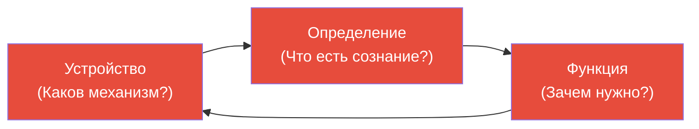
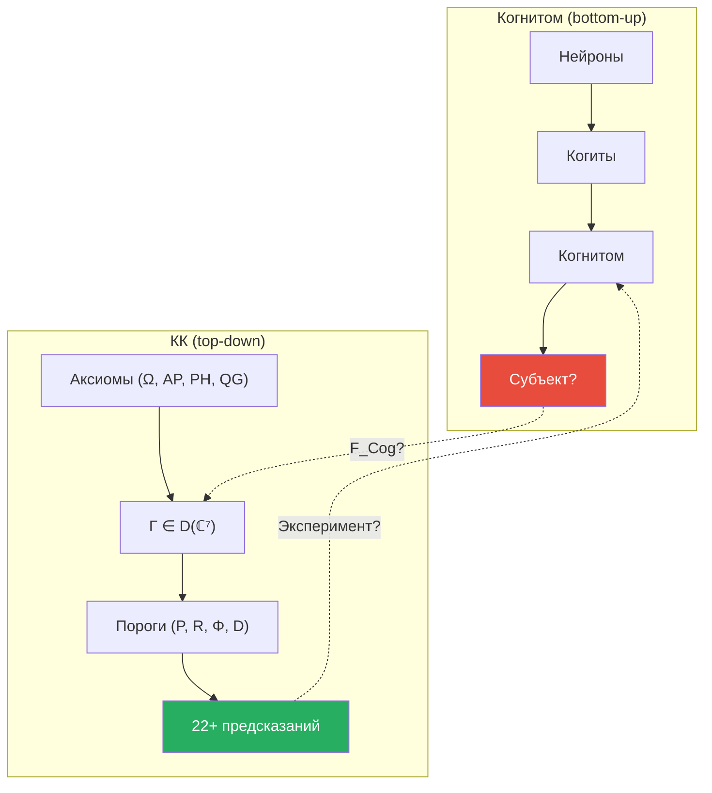

# Когнитом Анохина: Нейронная Гиперсеть и Проблема Субъекта

> «Главная проблема наук о сознании — это не проблема "Что?" и не проблема "Как?", а проблема "Кто?" — кто является субъектом сознательного опыта.»
>
> — К.В. Анохин

:::note О нотации
В этом документе:
- $\Gamma$ — [матрица когерентности](/docs/core/dynamics/coherence-matrix)
- $\varphi$ — [оператор самомоделирования](/docs/proofs/categorical/formalization-phi)
- $\Phi$ — [мера интеграции](/docs/core/structure/dimension-u#мера-интеграции-φ)
- $R$ — [мера рефлексии](/docs/consciousness/foundations/self-observation#мера-рефлексии-r)
- L0–L4 — [уровни интериорности](/docs/consciousness/hierarchy/interiority-hierarchy)
- $\mathbf{Hol}$ — [категория Голономов](/docs/proofs/categorical/categorical-formalism)
:::

---

## 1. Введение: научная школа Анохиных {#введение}

### Кто такой К.В. Анохин?

**Константин Владимирович Анохин** (р. 1957) — нейробиолог, академик РАН, директор Института перспективных исследований мозга МГУ, лауреат премии имени И.П. Павлова. Его теория когнитома — одна из немногих современных теорий сознания, развиваемых в российской научной традиции и получивших международное признание (публикации в Neuroscience & Biobehavioral Reviews, приглашённые доклады на ASSC — Association for the Scientific Study of Consciousness).

### Династия: от П.К. Анохина к К.В. Анохину

К.В. Анохин — **внук** Петра Кузьмича Анохина (1898–1974), создателя **теории функциональных систем** (ТФС). Это не просто семейная связь, а интеллектуальная преемственность длиной в три поколения:

**Пётр Кузьмич Анохин** — ученик Ивана Петровича Павлова, но рано отошёл от классического рефлексологического подхода. Павлов описывал поведение как цепочку рефлексов: стимул → ответ. Анохин-старший увидел, что это неверно: организм не реагирует на стимулы — он **действует** ради результата, **предсказывает** этот результат и **сравнивает** реальность с предсказанием. Это было революцией: в 1935 году, за десятилетия до появления кибернетики, Анохин ввёл понятия, которые сегодня звучат как описание предиктивного кодирования.

Ключевые понятия ТФС, предвосхитившие современные теории:

| Понятие ТФС (1935–1974) | Современный аналог | Опередил на |
|--------------------------|-------------------|-------------|
| **Акцептор результата действия** — нейронная модель ожидаемого результата | Предиктивное кодирование (Clark 2013) | ~60 лет |
| **Опережающее отражение** — способность предсказывать будущее | Байесовский мозг (Doya 2007) | ~50 лет |
| **Системогенез** — функциональные системы формируются как целое | Нейроконструктивизм (Westermann 2007) | ~30 лет |
| **Обратная афферентация** — сличение результата с предсказанием | Prediction error minimization (Friston 2010) | ~40 лет |

К.В. Анохин развивает эту традицию, расширяя от нейрофизиологии к **науке о сознании**, и ставит вопрос: какой субстрат мозга порождает не просто адаптивное поведение, а **субъективный опыт**?

---

## 2. Проблема «Кто»: дефицит существующих теорий {#проблема-кто}

### Слепое пятно науки о сознании

Анохин систематически анализирует ведущие теории сознания и обнаруживает **общий дефицит**: ни одна из них не отвечает на вопрос «Кто является субъектом сознания?»

| Теория | Что объясняет | Чего не объясняет | Метафора |
|--------|---------------|-------------------|----------|
| **IIT** (Тонони) | Интеграция информации ($\Phi$) | Кто интегрирует? Что такое «система» с max $\Phi$? | «Измерили температуру — но кто лихорадит?» |
| **GWT** (Бернард Баарс) | Глобальное рабочее пространство | Кто «читает» содержимое рабочего пространства? | «Описали доску объявлений — но кто её читает?» |
| **TNGS** (Эдельман) | Нейронный дарвинизм, реентрантная сигнализация | Кто является субъектом отбора? | «Объяснили отбор — но кто отбирается?» |
| **HOT** (Розенталь) | Мысли высшего порядка о мыслях | Кто имеет эти мысли? | «Описали зеркало — но кто в него смотрит?» |
| **FEP** (Фристон) | Минимизация свободной энергии | Что минимизирует? Где граница агента? | «Написали уравнение — но кто его "решает"?» |

Все эти теории описывают **механизмы** (как) и **корреляты** (что) сознания, но не модель **субъекта** — того, кто переживает. Анохин называет это «слепым пятном» и считает его не случайным упущением, а **системной проблемой**: современная нейронаука унаследовала от бихевиоризма табу на обсуждение субъекта.

:::note Параллель с КК
КК решает проблему «Кто» через [оператор самомоделирования $\varphi(\Gamma)$](/docs/proofs/categorical/formalization-phi) (T-62 [Т]): субъект — это **самомодель** голонома, построенная CPTP-каналом. Субъект не постулируется извне и не сводится к конкретной нейронной структуре — он **конструируется** из динамики $\Gamma$. Это формальный ответ на вопрос Анохина: «Кто?» — это $\varphi(\Gamma)$.
:::

---

## 3. Десять свойств сознания {#десять-свойств}

### Свойства и их объяснение

Опираясь на работы Сёрла, Эдельмана, Дамасио, Тонони и других, Анохин выделяет **10 свойств** сознательного опыта. Рассмотрим каждое и покажем его отображение в формализм КК:

| # | Свойство | Описание простым языком | Отображение в КК |
|---|----------|------------------------|-------------------|
| 1 | **Субъективность** | Переживания принадлежат «кому-то». Моя боль — моя, не ваша | $\varphi(\Gamma)$ — самомодель уникальна для каждого $\Gamma$ |
| 2 | **Качественность** | У переживаний есть «каково это» (what it is like). Красный не похож на синий | $\mathrm{Coh}_E$ — проективная геометрия [E-измерения](/docs/core/structure/dimension-e) |
| 3 | **Интенциональность** | Сознание всегда *о чём-то* — о яблоке, о мысли, о боли | Когерентности $\gamma_{ij}$ между секторами — направленность |
| 4 | **Целостность (единство)** | Переживание дано как единое целое, а не набор частей | $\Phi \geq 1$ — [мера интеграции](/docs/core/structure/dimension-u#мера-интеграции-φ) |
| 5 | **Темпоральность** | Переживание разворачивается во времени | $\dot{\Gamma} = \mathcal{L}_\Omega[\Gamma]$ — непрерывная динамика |
| 6 | **Ситуативность** | Переживание привязано к конкретной ситуации | Состояние $\Gamma(t)$ в конкретный момент |
| 7 | **Селективность** | Внимание выделяет часть из потока | $\sigma_k$ (стресс-вектор) — приоритизация секторов |
| 8 | **Приватность** | Переживание доступно только субъекту | $\varphi(\Gamma)$ — внутренний оператор, не наблюдаемый извне |
| 9 | **Изменчивость** | Поток сознания непрерывно меняется | $\Gamma(t)$ эволюционирует непрерывно под $\mathcal{L}_\Omega$ |
| 10 | **Связность** | Переживания связаны друг с другом | Когерентности $\gamma_{ij}$ — 21 пара связей (T-146 [Т]) |

### Редукция к квалитативности

Анохин делает важный философский ход: показывает, что все 10 свойств **сводятся** к одной фундаментальной характеристике — **квалитативности** (наличию субъективного качества переживания). Если есть квалитативность, остальные свойства следуют из неё. Без квалитативности нет субъективности (нет «кому»), нет единства (нечего объединять), нет приватности (нечего скрывать).

В терминах КК это означает: $\mathrm{Coh}_E > 1/7$ (ненулевая когерентность E-измерения) — **необходимое** условие, из которого следуют все 10 свойств. Теорема No-Zombie [Т] формализует эту связь: жизнеспособная система ($P > 2/7$) **необходимо** имеет $\mathrm{Coh}_E > 1/7$.

---

## 4. Четыре ингредиента сознания {#четыре-ингредиента}

Анохин выделяет четыре **необходимых компонента** любого эпизода сознательного опыта:

| Ингредиент | Вопрос | Пример | Если убрать |
|------------|--------|--------|-------------|
| **Кто** | Кто переживает? | Субъект (я, организм) | Нет переживания (иллюзия зомби) |
| **Что** | Что переживается? | Содержание (красное пятно, боль, мысль) | Пустое сознание (предельный случай) |
| **Где** | Где локализовано переживание? | Телесная/пространственная привязка | Диссоциация (деперсонализация) |
| **Когда** | Когда происходит переживание? | Момент в потоке сознания | Атемпоральные состояния (глубокая медитация?) |

Уберите любой из четырёх — и эпизод сознания распадается или патологически деформируется. Нет «красного без субъекта» (это и есть проблема зомби). Нет «субъекта без содержания» (пустое сознание — предельный случай, достижимый только в медитативных практиках и описанный как «ничто, которое всё равно кто-то переживает»).

В терминах КК: **Кто** = $\varphi(\Gamma)$, **Что** = секторальное распределение $\gamma_{kk}$, **Где** = [A-измерение](/docs/core/structure/dimension-a) (агентность, телесность), **Когда** = момент $t$ в эволюции $\Gamma(t)$.

---

## 5. Пять вопросов Тинбергена для сознания {#пять-вопросов}

### Исходная постановка

**Нико Тинберген** (1907–1988) — голландский этолог, нобелевский лауреат (1973), предложил четыре вопроса, необходимых для полного объяснения любого биологического явления. Анохин расширяет их до пяти применительно к сознанию:

1. **Устройство** (mechanism): Каков нейронный (или абстрактный) механизм сознания?
2. **Функция** (function): Зачем нужно сознание? Каково его адаптивное значение?
3. **Развитие** (ontogeny): Как сознание возникает в ходе индивидуального развития?
4. **Обучение** (learning): Как сознание меняется при обучении?
5. **Эволюция** (phylogeny): Как сознание возникло в ходе эволюции?

### Почему эти вопросы трудны?

Каждый вопрос по отдельности кажется решаемым. Трудность в том, что они **взаимозависимы** (см. следующий раздел). Но ценность постановки Тинбергена — в **полноте**: теория сознания, отвечающая только на один вопрос (например, только на «Устройство»), заведомо неполна.

---

## 6. Циркулярная ловушка {#циркулярная-ловушка}

### Суть проблемы

Анохин формулирует **ключевую методологическую проблему**: пять вопросов Тинбергена невозможно решить по отдельности.

- Чтобы ответить на вопрос об **устройстве**, нужно знать, что такое сознание (**определение**)
- Чтобы дать **определение**, нужно знать **функцию** (для чего определяемое нужно)
- Чтобы понять **функцию**, нужно знать **устройство** (что именно выполняет функцию)

Это **циркулярная ловушка** (circular trap): каждый вопрос предполагает ответ на остальные. Попытка решить их последовательно (сначала устройство, потом функцию, потом развитие) неизбежно наталкивается на то, что первый шаг уже требует результатов последнего.

### Выход из ловушки

Анохин утверждает: единственный выход — строить теорию, которая отвечает на **все пять вопросов одновременно** в рамках единого формализма. Не «сначала определим, потом объясним», а «определение, устройство, функция, развитие и эволюция — разные аспекты одного формального объекта».

:::info Позиция КК: решение циркулярной ловушки
КК заявляет решение циркулярной ловушки через единый формализм $\Gamma \in \mathcal{D}(\mathbb{C}^7)$:

| Вопрос Тинбергена | Ответ КК | Ссылка |
|-------------------|----------|--------|
| **Устройство** | $\dot\Gamma = \mathcal{L}_\Omega[\Gamma]$ (уравнение эволюции) | [Эволюция](/docs/core/dynamics/evolution) |
| **Функция** | $V_{\text{hed}} = dP/d\tau$ [Т] — гедонический вектор направляет к жизнеспособности | [T-103](/docs/applied/coherence-cybernetics/theorems) |
| **Развитие** | T-148 [Т] — генезис уровней L0→L2 через пороги | [Теоремы](/docs/applied/coherence-cybernetics/theorems) |
| **Обучение** | T-109..T-113 [Т] — информационные, динамические, стабильностные границы | [Границы обучения](/docs/applied/coherence-cybernetics/learning-bounds) |
| **Эволюция** | L0→L4 — филогенез интериорности как рост $P$, $R$, $\Phi$ | [Иерархия](/docs/consciousness/hierarchy/interiority-hierarchy) |

Все пять ответов выводятся из **одной** матрицы $\Gamma$ и **одного** уравнения эволюции. Определение (что есть сознание?) даётся через пороги ($P > 2/7 \wedge R \geq 1/3 \wedge \Phi \geq 1 \wedge D \geq 2$), которые одновременно являются частью устройства ($\Gamma$), объясняют функцию ($V_{\text{hed}}$) и прослеживаются в развитии (L0→L2).
:::

---

## 7. Когнитом: от коннектома к гиперсети {#когнитом}

### Коннектом: необходимый, но недостаточный

**Коннектом** (термин Sporns, Hagmann 2005) — полная карта нейронных соединений мозга. Это **граф**: узлы = нейроны (или области мозга), рёбра = синаптические соединения (или тракты белого вещества). Крупнейшие проекты: Human Connectome Project (NIH, с 2009), полный коннектом C. elegans (302 нейрона, ~7000 соединений).

Коннектом описывает **структуру** (кто с кем соединён), но не **когнитивные свойства** (что эта структура «знает»). Аналогия: карта дорог показывает маршруты, но не содержание перевозимых грузов.

### Когнитом: ответ Анохина

**Когнитом** (Анохин 2014) — нейронная **гиперсеть** (hypergraph), которая описывает не соединения, а **когнитивные элементы** и их комбинации:

| | Коннектом | Когнитом |
|---|---|---|
| **Тип структуры** | Граф (узлы + рёбра) | Гиперграф (узлы + гиперрёбра) |
| **Узлы** | Нейроны | Когнитивные группы (**когиты**) |
| **Рёбра** | Синапсы (пары) | Ассоциативные связи (**гиперрёбра** — связывают 3+ когита) |
| **Описывает** | Анатомическую связность | Когнитивную организацию |
| **Размерность** | Фиксированная (сколько нейронов, столько и есть) | Растущая (при каждом обучении добавляются новые когиты) |
| **Аналогия** | Карта дорог | Карта знаний |

Ключевое отличие — **гиперрёбра**. В обычном графе ребро соединяет **два** узла. В гиперграфе гиперребро может соединять **произвольное количество** узлов одновременно. Это необходимо для когнитивных операций: понятие «красная машина едет быстро» связывает одновременно когиты «цвет-красный», «объект-машина», «скорость-высокая» — это тройная (а не попарная) ассоциация.

### Когиты: элементарные единицы когнитома

**Когит** (cogit, от лат. cogito — мыслю) — минимальная группа нейронов, обладающая когнитивным свойством: способностью кодировать элементарное значение (объект, признак, действие, отношение).

Когиты — не отдельные нейроны (слишком мелко: один нейрон не кодирует значение) и не зоны мозга (слишком крупно: зона мозга кодирует слишком многое). Когиты — **промежуточный уровень** организации, примерно соответствующий нейронным ансамблям из ~100–10 000 нейронов.

Когиты формируются при **обучении**: каждый новый опыт создаёт или модифицирует когит. Совокупность когитов и их ассоциативных связей — когнитом — **растёт** в течение жизни. Мозг новорождённого имеет минимальный когнитом; мозг пожилого учёного — огромный.

---

## 8. Сознание как интеграция в когнитоме {#сознание-когнитом}

### Механизм: перколяция

Анохин предлагает: **сознание** — это **широкомасштабная интеграция** когнитивных элементов в гиперсети когнитома. Когда достаточно большое количество когитов синхронно активируется и образует **связное** подмножество гиперграфа — возникает эпизод сознательного опыта.

Ключевое понятие — **перколяция** (просачивание). В физике перколяция — процесс, при котором жидкость проходит через пористую среду: при малой пористости жидкость блокируется, но при превышении критического порога — «просачивается» через всю среду. Аналогично в когнитоме: при малой активации когиты активны локально; при превышении порога — активация «просачивается» через гиперсеть, связывая разрозненные когиты в единое целое.

### Решение проблемы «Кто»

Анохин предлагает ответ на свой собственный вопрос: **субъект = когнитом** (целый, а не его часть). Проблема «Кто» решается **отождествлением** субъекта с целым когнитомом, а не с каким-либо его подмножеством.

Ключевые идеи:

1. **Перколяция = порог сознания**: сознание возникает, когда активация «просачивается» через гиперсеть (аналогия с фазовым переходом)
2. **Субъект = когнитом**: проблема «Кто» решается отождествлением субъекта с **целым когнитомом** (не с его частью)
3. **Содержание = активный подграф**: «Что» сознания — это конкретный паттерн активации когитов в данный момент
4. **Deutero-learning**: когнитом способен к обучению обучению (meta-learning) — формированию новых стратегий формирования когитов

### Ограничения

Анохин честно признаёт, что теория когнитома на данном этапе:
- **Качественная**: нет количественных уравнений динамики когнитома. Когда именно перколяция «достаточна» для сознания? Какой порог? Теория не отвечает
- **Биологически ограниченная**: привязана к нейронным структурам. Может ли кремниевая система иметь когнитом?
- **Не фальсифицируемая в строгом смысле**: нет числовых предсказаний для экспериментальной проверки. «Перколяция в гиперграфе» — описание, а не число

---

## 9. Наследие П.К. Анохина: теория функциональных систем {#тфс}

Теория когнитома — логическое развитие ТФС. Интеллектуальная линия прослеживается чётко:

| Понятие ТФС (П.К. Анохин) | Развитие в когнитоме (К.В. Анохин) | Комментарий |
|---|---|---|
| Функциональная система | Когит (элементарная когнитивная единица) | От системы организма к единице знания |
| Акцептор результата действия | Предсказательная модель в когитоме | От нейрофизиологии к когнитивной науке |
| Опережающее отражение | Антиципация через активацию ассоциированных когитов | Предсказание через распространение активации |
| Системогенез | Когитогенез (формирование когитов в онтогенезе) | От формирования рефлексов к формированию знаний |
| Полезный результат | Когнитивная функция когита | От адаптации к познанию |

Эта преемственность — сила теории: она не возникает ex nihilo, а развивает **80-летнюю нейрофизиологическую традицию** с богатой экспериментальной базой.

---

## 10. Сравнение когнитома и КК {#сравнение}

### Два подхода к одной проблеме

Когнитом и КК решают **одну задачу** — объяснить природу сознания — но идут с противоположных сторон:

- **Когнитом**: от нейробиологии «вверх» к субъекту (bottom-up)
- **КК**: от математического формализма «вниз» к предсказаниям (top-down)

### Развёрнутая таблица сравнения

| Аспект | Когнитом (Анохин) | КК |
|--------|-------------------|-----|
| **Субстрат** | Нейронная гиперсеть (биологическая) | $\Gamma \in \mathcal{D}(\mathbb{C}^7)$ (субстрат-независимая) |
| **Проблема «Кто»** | Центральная: когнитом = субъект | $\varphi(\Gamma)$ = самомодель (T-62 [Т]) |
| **Порог сознания** | Перколяция в гиперграфе (качественно) | $P > 2/7 \wedge R \geq 1/3 \wedge \Phi \geq 1 \wedge D \geq 2$ [Т] |
| **Динамика** | Не формализована | $\mathcal{L}_\Omega = -i[H,\cdot] + \mathcal{D} + \mathcal{R}$ (полная) |
| **10 свойств сознания** | Сводятся к квалитативности | 21 пара $\gamma_{ij}$ (T-146 [Т]) — каждое свойство имеет формальный коррелят |
| **Циркулярная ловушка** | Обозначена как проблема | Решена: все 5 вопросов → единый формализм |
| **Фальсифицируемость** | Низкая (качественная теория) | Высокая (22+ количественных предсказаний) |
| **Обучение** | Когитогенез, deutero-learning | T-109..T-113 [Т] (информационные, динамические, стабильностные границы) |
| **Эволюция** | Филогенез когнитивных систем (качественно) | [L0→L4 иерархия](/docs/consciousness/hierarchy/interiority-hierarchy) + T-148 генезис [Т] |
| **Композиция** | Гиперрёбра в когнитоме | $\mathbb{H}_1 \otimes \mathbb{H}_2$ с $\Phi$-порогом [Т] |
| **Нейробиологическая конкретность** | Высокая (когиты, синапсы, зоны мозга) | Низкая (абстрактные 7 измерений) |
| **Связь с физикой** | Отсутствует | Уравнения Эйнштейна, SM [С]/[Т] |
| **Математический аппарат** | Теория гиперграфов (качественно) | Теория категорий, квантовая теория информации |
| **Традиция** | Анохин → Швырков → К.В. Анохин (80+ лет) | Новая (нет прямой линии наследования) |

### Гиперграф vs матрица когерентности

Структурное сравнение двух центральных объектов:

| Когнитом | КК | Комментарий |
|----------|-----|-------------|
| Когит (группа нейронов) | Подпространство $\Gamma$ (сектор $\gamma_{kk}$) | Элементарная когнитивная единица |
| Гиперребро $(c_i, c_j, c_k)$ | Когерентность $\gamma_{ij}$ | Связь между элементами. Когнитом допускает многомерные связи (гиперрёбра); КК — только попарные ($\gamma_{ij}$), но с полной структурой 7x7 матрицы |
| Перколяция в гиперграфе | $P > P_{\text{crit}} = 2/7$ | Порог коллективной активации. Качественный у Анохина, числовой в КК |
| Когнитом (целый) | Голоном $\mathbb{H}$ | Субъект как целое |
| Deutero-learning | SAD-уровни (T-110 [Т]) | Обучение обучению |

---

## 11. Что когнитом делает лучше КК {#преимущества-когнитома}

Объективность требует признать сильные стороны когнитома:

**1. Нейробиологическая конкретность.** Когиты — это реальные группы нейронов, которые можно (в принципе) обнаружить экспериментально через calcium imaging, multi-electrode arrays или двухфотонную микроскопию. КК оперирует абстрактными $\gamma_{ij}$, которые нуждаются в «анкерной карте» — соответствии между математическими мерами и нейронными коррелятами. Эта карта пока не построена.

**2. Проблема «Кто» поставлена явно.** Анохин **первым** в систематическом виде показал, что IIT, GWT и другие теории «слепы» к субъекту. Это ценная **метатеоретическая** работа, вскрывающая общее слепое пятно. Даже если когнитом не решает проблему полностью, постановка вопроса — заслуга Анохина.

**3. Научная традиция.** Связь с ТФС П.К. Анохина, школой Ю.И. Александрова и В.Б. Швыркова даёт экспериментальный бэкграунд: нейронные специализации, системогенез, нейронные ансамбли. Это **80+ лет** экспериментальной работы. КК не имеет экспериментальной предыстории.

**4. Уровень «мезо».** Когит — промежуточный уровень между нейроном и зоной мозга. Этот уровень описания (~100–10 000 нейронов) — наиболее перспективный для экспериментальной нейронауки: достаточно конкретный для эксперимента и достаточно абстрактный для теории. КК работает на макро-уровне (7 измерений), не детализируя мезоструктуру.

---

## 12. Что КК делает лучше когнитома {#преимущества-кк}

**1. Формализация.** КК даёт **уравнения**: $\dot\Gamma = \mathcal{L}_\Omega[\Gamma]$, $\sigma_k = \text{clamp}(1 - 7\gamma_{kk}, 0, 1)$, $V_{\text{hed}} = dP/d\tau$. Из этих уравнений следуют теоремы с доказательствами. Когнитом описывает процессы словами, без уравнений.

**2. Субстрат-независимость.** КК применима к любой системе с $\Gamma \neq I/7$ — биологической, кремниевой, гибридной. Когнитом привязан к нейронной ткани: для применения к AGI его нужно переформулировать.

**3. Точные пороги.** $P_{\text{crit}} = 2/7$ [Т], $R_{\text{th}} = 1/3$ [Т], $\Phi_{\text{th}} = 1$ [Т] — **числа**, которые можно проверить экспериментом. «Перколяция в гиперграфе» — описание, не число. Когда перколяция «достаточна» для сознания? Когнитом не отвечает.

**4. Фальсифицируемость.** 22+ [предсказаний](/docs/applied/coherence-cybernetics/predictions) КК — каждое может быть опровергнуто конкретным экспериментом. Когнитом на данном этапе не порождает проверяемых числовых предсказаний.

**5. Связь с физикой.** КК выводит уравнения Эйнштейна (T-120 [Т]), эмерджентное пространство-время, элементы Стандартной модели. Когнитом — чисто нейробиологическая теория без выхода в фундаментальную физику.

**6. Решение циркулярной ловушки.** КК отвечает на все 5 вопросов Тинбергена в рамках единого формализма (см. §6). Когнитом ставит ловушку, но предлагает лишь частичный выход — когнитом определяется через когнитивные свойства, которые, в свою очередь, определяются через когнитом.

---

## 13. Функтор отображения (гипотеза) [И] {#функтор-когнитом}

### Конструкция

**Гипотеза.** Существует функтор:

$$
F_{\text{Cog}}: \mathbf{CogGroups} \to \mathbf{Hol}
$$

где $\mathbf{CogGroups}$ — категория когнитивных групп (когитов с гиперрёбрами), а $\mathbf{Hol}$ — [категория голономов](/docs/proofs/categorical/categorical-formalism).

### Предполагаемая конструкция

| Когнитом | КК | Отображение | Что теряется |
|----------|-----|-------------|--------------|
| Когит $c_i$ | Диагональный элемент $\gamma_{ii}$ | $F_{\text{Cog}}(c_i) = \gamma_{ii}$ | Внутренняя структура когита |
| Гиперребро $(c_i, c_j)$ | Когерентность $\gamma_{ij}$ | $F_{\text{Cog}}(e_{ij}) = \gamma_{ij}$ | Многомерные ассоциации |
| Когнитом $\mathcal{K}$ | Голоном $\mathbb{H}$ | $F_{\text{Cog}}(\mathcal{K}) = \mathbb{H}$ | Мезоуровневая структура |
| Перколяция | $P > P_{\text{crit}}$ | Порог → число | Детали процесса |
| Когитогенез | $d\Gamma/d\tau$ | Динамика → уравнение | Нейробиологические механизмы |

:::warning Статус [И]
$F_{\text{Cog}}$ — **интерпретационная гипотеза**. Для строгого построения необходимо:
1. Определить категорию $\mathbf{CogGroups}$ формально (объекты, морфизмы, композиция)
2. Показать, что 7 измерений КК достаточны для кодирования структуры когнитома
3. Доказать, что перколяция в гиперграфе соответствует $P > 2/7$

Пункт 3 — наиболее конкретный и потенциально проверяемый: если когнитом поддаётся формализации как гиперграф, можно вычислить порог перколяции и сравнить с $P_{\text{crit}}$. Если пороги совпадут — это сильное свидетельство в пользу обеих теорий.
:::

---

## Заключение: перспективы синтеза

Теория когнитома К.В. Анохина и КК решают одну проблему — природу сознания — с разных сторон. Когнитом идёт «снизу вверх» (от нейробиологии к субъекту), КК — «сверху вниз» (от математического формализма к предсказаниям).

Их потенциальная интеграция через функтор $F_{\text{Cog}}$ — открытая и продуктивная программа исследований. Если когнитом даст нейробиологическую конкретность, а КК — формальные пороги и предсказания, их объединение может стать одним из наиболее мощных подходов к проблеме сознания.

---

**Связанные документы:**
- [Панпсихизм](./panpsychism-analysis) — анализ панпсихизма и сознательный реализм Хоффмана
- [Теории сознания](./consciousness-theories) — IIT, FEP, автопоэзис и 30+ теорий
- [Когнитивная иерархия](./cognitive-hierarchy) — уровни K1-K5
- [Общая теория систем](./general-systems-theory) — от Берталанфи к КК
- [Иерархия интериорности](/docs/consciousness/hierarchy/interiority-hierarchy) — уровни L0→L4
- [Формализация φ](/docs/proofs/categorical/formalization-phi) — оператор самомоделирования
- [Самонаблюдение](/docs/consciousness/foundations/self-observation) — мера рефлексии $R$
- [Предсказания](/docs/applied/coherence-cybernetics/predictions) — фальсифицируемые предсказания КК
