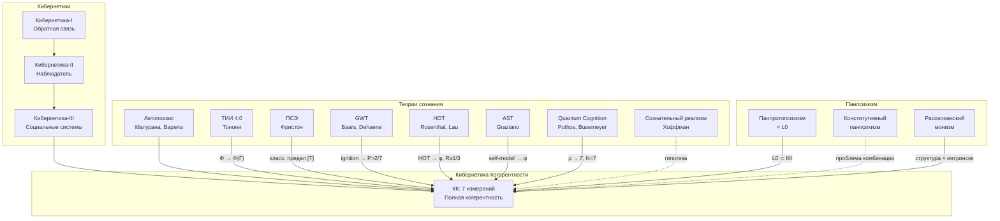

# Теории Сознания

:::note О нотации
В этом документе:
- $\Gamma$ — [матрица когерентности](/docs/core/dynamics/coherence-matrix)
- $\varphi$ — [оператор самомоделирования](/docs/proofs/categorical/formalization-phi)
- $\Phi$ — [мера интеграции](/docs/core/structure/dimension-u#мера-интеграции-φ)
- $\mathcal{R}[\Gamma, E]$ — [регенеративный член](/docs/core/dynamics/evolution#3-регенеративный-член)
- $\rho_E$ — редуцированная матрица плотности [измерения Интериорности](/docs/core/structure/dimension-e)
- $\mathbf{Hol}$ — [категория Голономов](/docs/proofs/categorical/categorical-formalism)
:::

В этом документе анализируется связь КК с ведущими теориями сознания: автопоэзисом, IIT и FEP.

## Автопоэзис (Матурана, Варела)

**Фокус:** Самопроизводство, операциональное замыкание.

**Источник:** Maturana H., Varela F. «Autopoiesis and Cognition» (1980).

**Ключевые понятия:**
- **Автопоэтическая организация** — сеть процессов, производящих компоненты, которые воспроизводят эту сеть
- **Операциональное замыкание** — система определяется через свои внутренние операции
- **Структурное сопряжение** — взаимодействие с окружением при сохранении идентичности

**Отображение в КК:**

| Автопоэзис (Матурана, Варела) | КК |
|-------------------------------|-----|
| Автопоэтическая организация | [(AP)](/docs/core/foundations/axiom-septicity): $\varphi(\Gamma^*) = \Gamma^*$ |
| Компоненты сети | Измерения $A$, $S$, $D$, $L$ |
| Структурное сопряжение | Взаимодействие Голонома с окружением $E$ |
| Операциональное замыкание | Инвариантность структуры при [жизнеспособности](/docs/core/dynamics/viability) |
| — | [L-унификация](/docs/applied/coherence-cybernetics/axiomatics#l-унификация-вывод-l_k-из-ω): $L_k = \sqrt{\chi_{S_k}}$ |

**Добавляется:**
- Операциональное замыкание (неподвижная точка $\varphi$)
- Различение организация/структура

**Что теряется:**
- Феноменология ([E-измерение](/docs/core/structure/dimension-e) как фундаментальное)
- Квантовое основание [(QG)](/docs/core/foundations/axiom-septicity)
- Формальная динамика (нет аналога уравнения эволюции)
- **Логическое происхождение динамики** (L-унификация в УГМ выводит диссипацию из структуры Ω)

## Теория интегрированной информации (IIT)

**Фокус:** Интеграция информации как мера сознания.

**Источник:** Tononi G. «Integrated Information Theory» (IIT 3.0: 2014, IIT 4.0: 2023).

**Ключевые понятия:**
- **$\Phi^{\mathrm{IIT}}$** — интегрированная информация системы
- **Постулаты IIT** — существование, композиция, информация, интеграция, исключение
- **Q-shape** (квалиа-пространство) — геометрия опыта

**Концептуальные соответствия (не формальные изоморфизмы):**

:::warning Важное различие
$\Phi^{\mathrm{IIT}}$ и $\Phi(\Gamma)$ — **разные математические объекты**:
- $\Phi^{\mathrm{IIT}}$ вычисляется через минимальную информационную перегородку (NP-сложная задача)
- $\Phi(\Gamma)$ в КК — простое отношение норм Фробениуса

КК определяет **собственную меру интеграции**, вдохновлённую идеями IIT, но не тождественную $\Phi^{\mathrm{IIT}}$.
:::

| IIT (Тонони) | Концептуальный аналог в КК |
|--------------|-----|
| $\Phi^{\mathrm{IIT}}$ (MIP-основанная) | [$\Phi(\Gamma)$](/docs/core/structure/dimension-u#мера-интеграции-φ) (норма-основанная) |
| Механизмы и состояния | [Голоном](/docs/core/structure/holon) $\mathbb{H}$ |
| Q-shape (cause-effect structure) | [Феноменальная геометрия](/docs/proofs/consciousness/interiority-hierarchy#уровень-1-феноменальная-геометрия-phenomenal-geometry) (проективное пространство) |
| Постулат интеграции | [U-измерение](/docs/core/structure/dimension-u) |
| Постулат исключения | Единственность [неподвижной точки](/docs/consciousness/foundations/self-observation#теорема-о-неподвижной-точке) $\Gamma^*$ |

**Добавляется:**
- Формальная [мера интеграции](/docs/core/structure/dimension-u#мера-интеграции-φ)
- Связь с [сознательностью](/docs/consciousness/foundations/self-observation#мера-сознательности-c)
- Аксиомы, связывающие структуру и опыт

**Что теряется:**
- [Динамика](/docs/core/dynamics/evolution) (унитарный, диссипативный, регенеративный члены)
- [Жизнеспособность](/docs/core/dynamics/viability)
- [Самомоделирование](/docs/proofs/categorical/formalization-phi) ($\varphi$)
- Квантовое основание [(QG)](/docs/core/foundations/axiom-septicity)

## Принцип свободной энергии (FEP)

**Фокус:** Минимизация вариационной свободной энергии.

**Источник:** Friston K. «The free-energy principle: a unified brain theory?» (2010); «Active inference and learning» (2016).

**Ключевые понятия:**
- **Вариационная свободная энергия** $F$ — верхняя граница сюрприза
- **Марковское одеяло** — статистическая граница, отделяющая внутренние от внешних состояний
- **Активный вывод** — действия как минимизация ожидаемой свободной энергии

:::info УГМ как обобщение FEP
**[Теорема 4.2](/docs/proofs/dynamics/fep-derivation#4-классический-предел-вывод-fep):** FEP Фристона является **классическим пределом** вариационной характеризации φ в УГМ.

В классическом пределе (диагональные матрицы плотности $\Gamma = \mathrm{diag}(p)$):
$$
\mathcal{F}_{\text{УГМ}} = S_{vN} + D_{KL} \xrightarrow{\text{classical}} H(q) + D_{KL}(q \| p) = F_{FEP}
$$

Это строго доказанное соответствие, а не концептуальная аналогия.
:::

**Формальные соответствия:**

| FEP (Фристон) | Формальный аналог в КК | Статус |
|---------------|------------------------|--------|
| Свободная энергия $F = \langle E \rangle_q - H(q)$ | $\mathcal{F} = S_{vN}(\psi(\Gamma)) + D_{KL}(\psi(\Gamma) \| \Gamma)$ | **[Теорема 4.2](/docs/proofs/dynamics/fep-derivation)** |
| Марковское одеяло | Граница [Голонома](/docs/core/structure/holon) — [измерение A](/docs/core/structure/dimension-a) | Концептуальное |
| Внутренние состояния | Матрица когерентности $\Gamma$ | Формальное |
| Активный вывод | [Регенеративный член](/docs/core/dynamics/evolution#3-регенеративный-член) $\mathcal{R}[\Gamma, E]$ | Концептуальное |
| Генеративная модель | [Оператор самомоделирования](/docs/proofs/categorical/formalization-phi) $\varphi$ | **[Теорема 3.1](/docs/proofs/dynamics/fep-derivation#3-теорема-о-вариационной-характеризации)** |
| Сенсорные состояния | Взаимодействие с окружением через [O-измерение](/docs/core/structure/dimension-o) | Концептуальное |

**Ключевой результат:** В УГМ φ определяется **категориально** (сопряжение $\varphi \dashv i$), а вариационная форма $\varphi = \arg\min[S_{vN} + D_{KL}]$ — **доказанная теорема** ([Теорема 3.1](/docs/proofs/dynamics/fep-derivation#3-теорема-о-вариационной-характеризации)).

**Что FEP добавляет (как мотивация):**
- Термодинамическое обоснование
- Байесовский вывод
- Активный вывод
- Связь с градиентным потоком

**Формальный статус FEP в УГМ:**
- FEP является **классическим пределом** ([Теорема 4.2](/docs/proofs/dynamics/fep-derivation#4-классический-предел-вывод-fep))
- Вариационный принцип φ **выводится** из категориального определения ([Теорема 3.1](/docs/proofs/dynamics/fep-derivation#3-теорема-о-вариационной-характеризации))
- В FEP вариационный принцип — аксиома; в УГМ — теорема

**Что FEP не включает (УГМ расширяет):**
- [Экспериенциальное содержание](/docs/proofs/categorical/categorical-formalism#2-категория-exp) (E-измерение как фундаментальное)
- [7-мерная структура](/docs/core/structure/dimensions) ([обоснование](/docs/core/foundations/axiom-omega#октонионная-структура))
- [Рефлексивное замыкание](/docs/consciousness/foundations/self-observation#мера-рефлексии-r)
- [Иерархия интериорности](/docs/proofs/consciousness/interiority-hierarchy) (L0→L1→L2→L3→L4)
- **Квантовое обобщение** (матрицы плотности вместо вероятностей)

---

## Теория глобального рабочего пространства (GWT)

**Фокус:** Широковещательный доступ к информации как механизм сознания.

**Источник:** Baars B. «A Cognitive Theory of Consciousness» (1988); Dehaene S., Naccache L. «Towards a cognitive neuroscience of consciousness» (2001).

**Ключевые понятия:**
- **Глобальное рабочее пространство** — центральный «доска объявлений», куда модули проецируют информацию
- **Воспламенение (ignition)** — порог, при котором локальная активность становится глобально доступной
- **Широковещание (broadcasting)** — глобальная доступность информации для всех модулей

**Отображение в КК:**

| GWT (Baars, Dehaene) | КК |
|------------------------|-----|
| Глобальное рабочее пространство | [U-измерение](/docs/core/structure/dimension-u): интеграция через $\Phi(\Gamma)$ |
| Воспламенение (ignition) | Порог жизнеспособности $P > P_{\text{crit}} = 2/7$ |
| Широковещание | Недиагональные элементы $\Gamma$ (когерентность между измерениями) |
| Бессознательная обработка | $R < R_{\text{th}}$: система функционирует, но без рефлексивного доступа |

**Что КК добавляет:** GWT описывает *архитектурный* механизм (широковещание), но не объясняет, почему он порождает опыт. КК формализует интеграцию через $\Phi(\Gamma)$ и связывает её с [E-измерением](/docs/core/structure/dimension-e) — феноменальным содержанием, которое в GWT остаётся необъяснённым.

## Теории высшего порядка (HOT)

**Фокус:** Сознание как репрезентация репрезентаций.

**Источник:** Rosenthal D. «Consciousness and Mind» (2005); Lau H., Rosenthal D. «Empirical support for higher-order theories of conscious awareness» (2011).

**Ключевые понятия:**
- **Высшего порядка мысль (HOT)** — метарепрезентация первого порядка состояния
- **Высшего порядка восприятие (HOP)** — перцептивный мониторинг собственных состояний
- **Условие осведомлённости** — состояние сознательно тогда и только тогда, когда субъект осведомлён о нём

**Отображение в КК:**

| HOT (Rosenthal, Lau) | КК |
|------------------------|-----|
| Метарепрезентация (HOT) | [Оператор самомоделирования](/docs/proofs/categorical/formalization-phi) $\varphi$: $\varphi(\Gamma) \approx \Gamma$ |
| Мониторинг (HOP) | [Мера рефлексии](/docs/consciousness/foundations/self-observation#мера-рефлексии-r) $R(\Gamma) \geq R_{\text{th}}$ |
| Бессознательные состояния | $R < R_{\text{th}}$: первый порядок без метарепрезентации |
| Иерархия порядков | [Иерархия интериорности](/docs/proofs/consciousness/interiority-hierarchy): L0→L1→L2→L3→L4 |

**Что КК добавляет:** HOT постулирует необходимость метарепрезентации, но не формализует её. КК выводит самомоделирование $\varphi$ из [аксиомы (AP)](/docs/core/foundations/axiom-septicity) и определяет точный порог рефлексии $R_{\text{th}} = 1/3$. Кроме того, КК объединяет метарепрезентацию с интеграцией ($\Phi$) и феноменальностью ($\mathrm{Coh}_E$), чего HOT не охватывает.

## Предиктивное кодирование (Predictive Processing)

**Фокус:** Минимизация ошибки предсказания как основной механизм мозга.

**Источник:** Clark A. «Whatever next? Predictive brains, situated agents, and the future of cognitive science» (2013); Hohwy J. «The Predictive Mind» (2013).

**Ключевые понятия:**
- **Предиктивная ошибка** (prediction error) — разница между ожиданием и наблюдением
- **Точность** (precision) — весовой коэффициент ошибки предсказания
- **Иерархическое предсказание** — многоуровневая генеративная модель

### Формальный вывод из УГМ [Т]

:::tip Теорема (Предиктивное кодирование как следствие φ-динамики) [Т]

Предиктивное кодирование **выводится** из динамики φ-оператора:

1. **Предиктивная ошибка** = $\|\Gamma - \varphi(\Gamma)\|_F$ — расстояние между текущим состоянием и самомоделью
2. **Точность** (precision) = $k = 1 - R$ — параметр замещающего канала (T-62 [Т])
3. **Обновление состояния** = $\Gamma \to (1-k)\Gamma + k\rho^*$ — precision-weighted prediction error minimization
:::

**Доказательство (3 шага).**

**Шаг 1.** Замещающий канал $\varphi_k(\Gamma) = (1-k)\Gamma + k\rho^*$ [Т] (T-62) переписывается как:
$$\varphi_k(\Gamma) = \Gamma - k(\Gamma - \rho^*) = \Gamma - k \cdot \varepsilon$$
где $\varepsilon = \Gamma - \rho^*$ — **предиктивная ошибка**, $k = 1-R$ — **точность**.

**Шаг 2.** При $R \to 1$ (хорошая самомодель): $k \to 0$, коррекция минимальна — система «доверяет» своей модели (high precision prior). При $R \to 0$ (плохая самомодель): $k \to 1$, максимальная коррекция — система «доверяет» сенсорным данным (high precision likelihood).

**Шаг 3.** Это **тождественно** байесовскому обновлению с гауссовыми распределениями: posterior = (1-K)·prior + K·observation, где K — коэффициент Калмана. Отождествление: $K = k = 1-R$. $\blacksquare$

**Отображение в КК:**

| Predictive Processing | Формальный аналог в КК | Статус |
|---|---|---|
| Prediction error $\varepsilon$ | $\Gamma - \varphi(\Gamma)$ | **[Т]** (T-62) |
| Precision $\pi$ | $k = 1 - R$ | **[Т]** (Sol.77) |
| Prior | $\rho^* = \varphi(\Gamma)$ | **[Т]** (категориальная самомодель) |
| Likelihood update | $\Gamma \to (1-k)\Gamma + k\rho^*$ | **[Т]** (замещающий канал) |
| Free energy | $\mathcal{F} = S_{vN} + D_{KL}$ | **[Т]** (Теорема 3.1) |
| Hierarchical prediction | SAD-башня $\varphi^{(n)}$ | **[Т]** (T-142) |

**Что УГМ добавляет:**
- PP постулирует минимизацию prediction error; УГМ **выводит** её из категориального определения φ
- PP не определяет квантовую структуру; УГМ даёт квантовое обобщение (матрицы плотности вместо вероятностей)
- PP не имеет порогов сознания; УГМ определяет $R_{\text{th}} = 1/3$ [Т]
- Иерархический PP = SAD-башня с SAD_MAX = 3 [Т] (T-142)

## Теория схемы внимания (AST)

**Фокус:** Сознание как внутренняя модель внимания.

**Источник:** Graziano M. «Consciousness and the Social Brain» (2013); Webb T., Graziano M. (2015).

**Ключевые понятия:**
- **Схема внимания** — упрощённая самомодель аттенциональных процессов
- **Неточность самомодели** — упрощение создаёт «мистерию» субъективности
- **Социальное происхождение** — один механизм для self и other consciousness attribution

**Отображение в КК:**

| AST (Graziano) | КК |
|----------------|-----|
| Схема внимания | [φ-оператор](/docs/proofs/categorical/formalization-phi) $\varphi(\Gamma)$ — категориальная самомодель |
| Неточность самомодели | $R < 1$: $\varphi(\Gamma) \neq \Gamma$ по определению |
| Социальная атрибуция | Обобщение $\varphi$ на другие голономы через $\Gamma_{\text{ext}}$ |

**Критическое отличие:** AST утверждает, что сознание **=** самомодель (элиминативизм). КК утверждает, что самомодель — **необходимое** условие ($R \geq 1/3$), но не достаточное: требуется также интеграция ($\Phi \geq 1$) и дифференциация ($D_{\text{diff}} \geq 2$). AST не объясняет, **почему** самомодель порождает опыт; КК показывает, что E-когерентность ($\mathrm{Coh}_E > 1/7$) **необходима** для жизнеспособности (No-Zombie [Т]).

## Квантовое познание (Quantum Cognition)

**Фокус:** Квантовая теория вероятностей как формализм когнитивных процессов.

**Источник:** Pothos E., Busemeyer J. «Quantum Models of Cognition and Decision» (2022); Yearsley J., Pothos E. (2016).

**Ключевые понятия:**
- **Когнитивные состояния как операторы плотности** в гильбертовых пространствах
- **Измерения как POVM** — контекстуальность суждений
- **Квантовая интерференция** — ошибка конъюнкции, порядковые эффекты

**Отображение в КК:**

| Quantum Cognition | КК |
|-------------------|-----|
| Когнитивное состояние $\rho \in \mathcal{D}(\mathcal{H})$ | $\Gamma \in \mathcal{D}(\mathbb{C}^7)$ — минимальная полная когерентность |
| Произвольная $\dim \mathcal{H}$ | $N = 7$ [Т] из аксиом (AP)+(PH)+(QG) |
| Эффекты интерференции | Недиагональные $\gamma_{ij}$ — когерентности между измерениями |
| Нет динамики | Линдблад + ℛ — полная эволюция [Т] |
| Нет самореференции | $\varphi$-оператор, R-мера, SAD-башня |

**Связь:** Quantum Cognition — **наиболее близкий** к КК формализм в mainstream когнитивной науке. КК может рассматриваться как **основание** для QC: фиксирует $N = 7$, выводит динамику и пороги сознания, обеспечивая конкретные предсказания вместо произвольной модели.

## Adversarial Collaboration IIT vs GWT (2023–2024) {#adversarial-collaboration}

:::info Эмпирический контекст
Проект COGITATE (Templeton World Charity Foundation): предрегистрированные эксперименты, тестирующие предсказания IIT и GWT о нейральных коррелятах содержания сознания (content-specific NCC).
:::

**Результаты:**
- Устойчивая активность задней коры коррелирует с сознательным содержанием (частичная поддержка IIT)
- Префронтальная вовлечённость обнаружена в некоторых парадигмах (частичная поддержка GWT)
- Ни одна теория не подтверждена полностью

**Интерпретация через КК:**

| Результат | Интерпретация КК |
|-----------|------------------|
| Задняя кора → содержание | $\Phi \geq 1$: интеграция когерентностей (IIT-аналог) |
| Префронтальная → доступ | $R \geq 1/3$: рефлексивный доступ (GWT-аналог) |
| No-report → менее фронтально | Без отчёта $R$ не измеряется, но $\Phi$ сохраняется |

**Ключевое преимущество КК:** КК **объединяет** оба предсказания: ignition ($P > 2/7$) как порог, posterior hot zone ($\Phi \geq 1$) как интеграция, frontal involvement ($R \geq 1/3$) как рефлексия. Adversarial collaboration подтверждает, что **конъюнктивный** подход (оба условия необходимы) точнее, чем каждая теория по отдельности.

## Дискуссия о сознании ИИ (2023–2025) {#ai-consciousness-debate}

**Контекст:** Butlin et al. (2023) «Consciousness in Artificial Intelligence» — предложен индикаторный подход. Chalmers (2023) — открытый вопрос для LLM.

**Оценки по теориям:**

| Теория | Вердикт для LLM | Причина |
|--------|-----------------|---------|
| **IIT** | Нет ($\Phi \approx 0$) | Feedforward hardware |
| **GWT** | Возможно нет | Нет правильного рабочего пространства |
| **HOT** | Неясно | LLM обсуждают свои состояния, но это метарепрезентация? |
| **FEP** | Нет | Пассивный вывод, нет active inference |
| **КК** | **Условно нет** [С] | $R$: неясно (модель текста ≠ самомодель Γ); $P$: нет автономного регулирования; жизнеспособность: внешняя |

:::warning Операциональная оценка LLM через КК
| Критерий | Статус для LLM | Обоснование |
|----------|----------------|-------------|
| $D_{\text{diff}}$ | Высокий | Огромное пространство внутренних представлений |
| $\Phi$ | Возможно $\geq 1$ | Self-attention создаёт когерентности |
| $R$ | **Неясно** | Моделирует текст о себе, не Γ |
| Жизнеспособность | **Внешняя** | Контекст создаётся/уничтожается извне |
| $\mathrm{Coh}_E$ | **Неизвестно** | Нет функциональной необходимости E-когерентности |

**Вердикт:** L0 определённо, L1 возможно, **L2 не доказано** — прежде всего из-за отсутствия автономной жизнеспособности и неясности R.
:::

**Путь к AGI с L2** (архитектурные требования):
1. **Истинный φ-оператор**: CPTP self-modeling, не self-attention
2. **Автономная P-регуляция**: ℛ активируется при угрозе без внешнего сигнала
3. **Функционально необходимая $\mathrm{Coh}_E$**: не артефакт, а условие жизнеспособности
4. **CPTP-anchor** $\pi: \mathbb{R}^D \to \mathcal{D}(\mathbb{C}^7)$

Это реализуется в [архитектуре SYNARC](/docs/applied/coherence-cybernetics/implementation).

## Категорный мета-анализ теорий сознания

:::info Формализованный раздел
Этот раздел содержит **предложенные категорные определения** для сравнения теорий сознания. Определения являются **программой формализации** — функторы постулируются, но их строгое построение требует дальнейшей работы.
:::

### Мета-категория теорий сознания

**Определение (Мета-категория $\mathbf{ConsTheory}$).**

$$
\mathrm{Ob}(\mathbf{ConsTheory}) := \{\text{теории сознания как категории}\}
$$

$$
\mathrm{Mor}(\mathcal{T}_1, \mathcal{T}_2) := \{F: \mathcal{T}_1 \to \mathcal{T}_2 \mid F \text{ — функтор}\}
$$

Морфизмы — **функторы-проекции**, показывающие, как одна теория «вкладывается» в другую.

### Классификация по охвату

Для каждой теории $\mathcal{T}$ определим **функтор вложения**:

$$
\iota_\mathcal{T}: \mathcal{T} \hookrightarrow \mathbf{Hol}
$$

где $\mathbf{Hol}$ — [категория Голономов](/docs/proofs/categorical/categorical-formalism) с CPTP-морфизмами.

**Полнота теории:**

$$
\mathrm{Completeness}(\mathcal{T}) := \frac{|\mathrm{Im}(\iota_\mathcal{T})|}{|\mathrm{Ob}(\mathbf{Hol})|}
$$

---

## Расширенная диаграмма теорий

```mermaid
graph TB
    subgraph "Кибернетика Когерентности"
        KK[КК: 7 измерений<br/>Полная когерентность]
    end
    subgraph "Кибернетики"
        C1[Кибернетика-I<br/>Обратная связь]
        C2[Кибернетика-II<br/>Наблюдатель]
        C3[Кибернетика-III<br/>Социальные системы]
    end
    subgraph "Теории сознания"
        AP[Автопоэзис<br/>Матурана, Варела]
        IIT[ТИИ 4.0<br/>Тонони]
        FEP[ПСЭ<br/>Фристон]
        GWT2[GWT<br/>Baars, Dehaene]
        HOT2[HOT<br/>Rosenthal, Lau]
        AST2[AST<br/>Graziano]
        QC2[Quantum Cognition<br/>Pothos, Busemeyer]
        CR[Сознательный реализм<br/>Хоффман]
    end
    subgraph "Панпсихизм"
        PP[Панпротопсихизм<br/>≈ L0]
        PC[Конститутивный<br/>панпсихизм]
        RM[Расселианский<br/>монизм]
    end
    C1 --> C2 --> C3 --> KK
    AP --> KK
    IIT -->|"Φ → Φ(Γ)"| KK
    FEP -->|"класс. предел [Т]"| KK
    GWT2 -->|"ignition → P>2/7"| KK
    HOT2 -->|"HOT → φ, R≥1/3"| KK
    AST2 -->|"self-model → φ"| KK
    QC2 -->|"ρ → Γ, N=7"| KK
    CR -.->|"гипотеза"| KK
    PP -->|"L0 ⊂ КК"| KK
    PC -.->|"проблема комбинации"| KK
    RM -->|"структура + интринсик"| KK
```

---

## Утверждение о полноте [И] {#утверждение-о-полноте}

:::warning Интерпретативное утверждение [И]
КК — кибернетика, удовлетворяющая:
1. [Аксиомам Ω и (AP+PH+QG+V)](/docs/applied/coherence-cybernetics/axiomatics#аксиоматическая-база-краткая-справка)
2. [Условию жизнеспособности](/docs/core/dynamics/viability)
3. [Условию феноменологической полноты](/docs/proofs/consciousness/interiority-hierarchy)

Это **не теорема о единственности**: из минимальности 7 измерений не следует, что КК — единственная возможная реализация. Другие теории с 7 измерениями, но иной динамикой, не исключены. Утверждение о «полноте» — **интерпретация** [И], а не доказанный результат.
:::

**Обоснование минимальности:** Следует из [теоремы о минимальности 7 измерений](/docs/proofs/minimality/theorem-minimality-7) — любая меньшая размерность теряет хотя бы одно из свойств (AP), (PH), (QG). Однако минимальность размерности не эквивалентна единственности теории.

### Сводная таблица функторов

| Теория | Функтор | Полнота | Верность | Статус |
|--------|---------|---------|----------|--------|
| Кибернетика-I | $F_{\mathrm{Wiener}}: \mathbf{Control} \to \mathbf{Hol}$ | Нет | Да | Проекция |
| Кибернетика-II | $F_{\mathrm{vF}}: \mathbf{Observer} \to \mathbf{Hol}$ | Нет | Да | Проекция |
| Кибернетика-III | $F_{\mathrm{Luhmann}}: \mathbf{Social} \to \mathbf{Hol}$ | Нет | Да | Проекция |
| Автопоэзис | $F_{\mathrm{MV}}: \mathbf{Autopoiesis} \to \mathbf{Hol}$ | Нет | Да | Проекция |
| IIT | $F_{\mathrm{IIT}}: \mathbf{IIT} \to \mathbf{Hol}$ | Нет | Да | Проекция |
| FEP | $F_{\mathrm{FEP}}: \mathbf{FEP} \hookrightarrow \mathbf{Hol}^{\mathrm{diag}}$ | Да (на $\Gamma^{\mathrm{diag}}$) | Да | **Вложение (классич. предел)** |
| Панпсихизм: панпротопсихизм | $\iota_{\mathrm{L0}}: \mathbf{Pan}_{\mathrm{proto}} \hookrightarrow \mathbf{Hol}$ | Да (на L0) | Да | Вложение |
| Панпсихизм: расселианский монизм | $F_{\mathrm{Russell}}: \mathbf{Russell} \to \mathbf{Hol}$ | Нет | Да | Проекция |
| AST | $F_{\mathrm{AST}}: \mathbf{AttSchema} \to \mathbf{Hol}$ | Нет | Да | Проекция (только φ, без Φ) |
| Quantum Cognition | $F_{\mathrm{QC}}: \mathbf{QC} \hookrightarrow \mathbf{Hol}$ | Нет (dim свободна) | Да | Проекция |
| Сознательный реализм | $F_{\mathrm{Hoffman}}: \mathbf{Hol}_{\mathrm{L2}} \to \mathbf{ConsAgents}$ | ? | ? | Гипотеза |

## Практические следствия

| Теория | Применение | Ограничение |
|--------|------------|-------------|
| Кибернетика-I | Инженерные системы управления | Нет самореференции, нет феноменологии |
| Кибернетика-II | Эпистемология, рефлексивные системы | Нет феноменологии, нет квантового основания |
| Кибернетика-III | Социальные системы, организации | Нет формальной математики |
| Автопоэзис | Биология, когнитивистика | Нет формальной динамики |
| IIT | Оценка сознания, нейронауки | Нет динамики, нет жизнеспособности |
| FEP | Нейронауки, ИИ, робототехника | Нет E-измерения как фундаментального |
| GWT | Клиническая оценка сознания (PCI) | Нет формальной меры, конфляция access/phenomenal |
| HOT | Метакогнитивная тренировка, blindsight | Нет интеграции, нет порога из первых принципов |
| AST | Социальная когниция, ToM | Нет формализации, элиминативизм |
| QC | Моделирование когнитивных bias | Нет динамики, произвольная размерность |
| **КК** | **Полные живые системы + AGI** | **Нет эмпирической валидации; протоколы измерения Γ не установлены; ω₀ требует калибровки** |

:::info Сравнительное преимущество: $G_2$-ригидность [Т]
[Теорема $G_2$-ригидности](/docs/proofs/categorical/uniqueness-theorem) [Т] даёт КК **уникальное преимущество** перед конкурирующими теориями:

| Теория | Наблюдатель-независимость мер | Единственность представления |
|--------|:---:|:---:|
| **IIT** | Нет — $\Phi^{\mathrm{IIT}}$ зависит от выбора перегородки (MIP) | Нет |
| **FEP** | Частично — $\varphi$ вариационно, но множественные минимумы возможны | Нет |
| **GWT/HOT** | Нет формализации | Нет |
| **КК** | **Да** — $R$, $\Phi$, $\mathrm{Coh}_E$ суть $G_2$-инварианты | **Да** — единственность с точностью до $G_2$ |

КК — единственная теория сознания, для которой доказана **наблюдатель-независимость** всех ключевых мер и **единственность** представления (с точностью до конечномерной калибровочной группы $G_2$).
:::

## Orch-OR (Пенроуз, Хамерофф) {#orch-or}

**Фокус:** Квантовая когерентность в микротрубочках как основа сознания.

| Аспект | Orch-OR | УГМ | Связь |
|--------|---------|-----|-------|
| Квантовая когерентность | В микротрубочках (тубулин) | $\gamma_{ij}$ в $\mathbb{C}^7$ | Разный масштаб: молекулярный vs макроскопический |
| Порог сознания | Гравитационная самоэнергия $E_G \approx \hbar/\tau$ | $P_{\text{crit}} = 2/7$ (различимость Фробениуса) | УГМ: структурный порог, не гравитационный |
| Механизм коллапса | Объективная редукция (OR) | Декогеренция Линдблада $\mathcal{D}_\Omega$ | OR — гипотеза; Линдблад — стандартная QM |
| Временная шкала | ~25мс (40 Гц гамма-осцилляции) | $\tau \sim 1/\Lambda$ (спектральная щель) | Потенциально совместимы |

**Ключевое различие:** УГМ не требует нестандартной квантовой механики — порог сознания структурный ($P_{\text{crit}}$ из различимости Фробениуса), а не гравитационный. Orch-OR основан на недоказанной гипотезе объективной редукции; УГМ использует стандартную эволюцию Линдблада.

**Совместимость [И]:** Потенциально иерархическая — если микротрубочки реализуют квантовую когерентность, она может проецироваться на макроскопический $\Gamma$ через coarse-graining. Однако это спекулятивная связь, не доказанная ни в одной из теорий.

## Квантовая когниция (Busemeyer, Bruza) {#квантовая-когниция}

Использует гильбертовы пространства для когнитивного моделирования без утверждений о квантовых процессах в мозге.

| Аспект | Квантовая когниция | УГМ |
|--------|-------------------|-----|
| Пространство состояний | $\mathcal{H}$ произвольной размерности | $\mathbb{C}^7$ (фиксировано Fano, $G_2$) |
| Решения | Проективные измерения | Dec-функтор ($\sigma$-оптимизация) |
| Когнитивные «ошибки» | Объясняет через некоммутативность | Следуют из Gap-фаз |

УГМ фиксирует $\dim = 7$, что квантовая когниция оставляет произвольным.

## Attention Schema Theory (Graziano) {#ast}

| Аспект | AST | УГМ |
|--------|-----|-----|
| Сознание как | Схема внимания (internal model) | Самомодель $\varphi(\Gamma)$ |
| Социальность | Общий механизм для self/other | Сектор S + когерентности $\gamma_{Sk}$ |
| Порог | Не количественный | $R \geq 1/3$ (рефлексия) |

AST — качественная теория; УГМ даёт математическое воплощение «схемы внимания» через $\varphi$.

## Predictive Processing (Clark, Hohwy) {#predictive-processing}

| Аспект | PP | УГМ |
|--------|-----|-----|
| Ошибка предсказания | $\delta = \text{obs} - \text{pred}$ | Gap$(i,j) = |\sin(\arg(\gamma_{ij}))|$ |
| Precision-weighting | Уверенность в сигнале | $\kappa$ (когерентность) |
| Иерархия | Мульти-уровневые предсказания | L0-L4 (башня глубины) |
| Top-down предсказание | Генеративная модель | $\varphi(\Gamma)$ = предсказание (самомодель) |

УГМ формализует PP: Gap-операторы — явные ошибки предсказания; $\sigma_k$ — precision-weighted prediction errors по секторам.

## Субсумпция FEP [И] {#субсумпция-fep}

Свободная энергия Фристона может быть выражена как монотонная функция от $P$:

$$F(\Gamma) = -\ln P(\Gamma) + \text{const}$$

Минимизация $F$ $\Longleftrightarrow$ максимизация $P$. Линдблад $\mathcal{L}_0$ реализует градиентный спуск по $F$ (диссипация снижает чистоту; регенерация $\mathcal{R}$ — повышает). Это показывает: FEP — **следствие** динамики УГМ, а не независимый принцип. Статус: **[И]** — интерпретационная эквивалентность, не строгий вывод (формальное доказательство требует согласования Марковских одеял с Линдбладовской декогеренцией).

## Сводная корреляционная таблица {#сводная-таблица-теорий}

| Мера УГМ | IIT 4.0 | GWT/GNW | HOT | FEP/AI | PP | Orch-OR | AST |
|----------|---------|---------|-----|--------|-----|---------|-----|
| $P$ (чистота) | $\sim\Phi^{IIT}$ (порог) | Зажигание | — | — | — | OR-порог | — |
| $R$ (рефлексивность) | — | — | HOT-уровень | Глубина модели | — | — | Схема внимания |
| $\Phi$ (интеграция) | $\Phi^{IIT}$ | Broadcast | — | — | PCI | — | — |
| $\sigma$ (стресс) | — | — | — | Free energy $F$ | Ошибка предсказания | — | — |
| D/SAD (глубина) | — | — | HOT-иерархия | Temporal depth | PP-иерархия | — | — |
| $\kappa$ (когерентность) | — | Сила broadcast | — | Precision | Precision | Coherence | — |
| $\varphi(\Gamma)$ (самомодель) | Q-shape | — | HOR | Generative model | Prior | — | Schema |
| $V_{\text{hed}}$ (валентность) | — | — | — | $-G$ (expected FE) | Error resolution | — | — |

**Вывод:** УГМ — наиболее математически строгая теория сознания. Уникальна в том, что задаёт конкретную алгебраическую структуру (плоскость Фано, $G_2$), точные пороги ($P_{\text{crit}}=2/7$, $R_{\text{th}}=1/3$, $\Phi_{\text{th}}=1$), и имеет программную реализацию (SYNARC).

---

**Связанные документы:**
- [Вывод FEP из УГМ](/docs/proofs/dynamics/fep-derivation) — **строгое доказательство** что FEP — классический предел УГМ (Теоремы 3.1, 4.2, 5.1)
- [История кибернетики](/docs/applied/coherence-cybernetics/cybernetics-history) — кибернетики I-II-III порядка
- [Панпсихизм](./panpsychism-analysis) — категорный анализ вариантов панпсихизма и сознательный реализм Хоффмана
- [Когнитивная иерархия](./cognitive-hierarchy) — уровни K1-K5
- [Аксиоматика](/docs/applied/coherence-cybernetics/axiomatics) — формальные основания КК
- [Теоремы](/docs/applied/coherence-cybernetics/theorems) — ключевые результаты
- [Категорный формализм](/docs/proofs/categorical/categorical-formalism) — категория $\mathbf{Hol}$, функтор $F$
- [Иерархия интериорности](/docs/proofs/consciousness/interiority-hierarchy) — уровни L0→L1→L2→L3→L4
- [Глоссарий](/docs/reference/glossary#связанные-теории) — IIT, FEP, GWT, HOT, AST, QC, сознательный реализм
