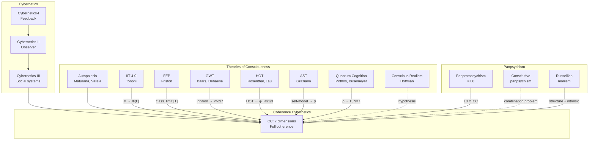
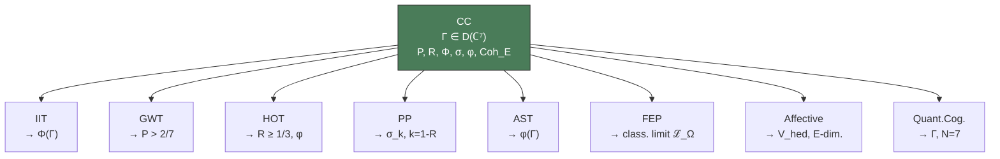

# Theories of Consciousness: A Meta-Comparative Analysis

:::info Bridge from the previous section
In the [States](/docs/consciousness/states/pathological) sections we examined how the $\Gamma$-profile determines normal and pathological states. Now — context: how does the UHM formalism relate to 36 alternative theories of consciousness? Each of them is a projection of $\Gamma$ onto a specific aspect: integration (IIT), access (GWT), reflection (HOT), prediction error (FEP), projective spatial geometry (PWT).
:::

:::note On notation
In this document:
- $\Gamma$ — [coherence matrix](/docs/core/dynamics/coherence-matrix)
- $\varphi$ — [self-modelling operator](/docs/proofs/categorical/formalization-phi)
- $\Phi$ — [integration measure](/docs/core/structure/dimension-u#мера-интеграции-φ)
- $R$ — [reflection measure](/docs/consciousness/foundations/self-observation#мера-рефлексии-r)
- $\mathcal{R}[\Gamma, E]$ — [regenerative term](/docs/core/dynamics/evolution#3-регенеративный-член)
- $\rho_E$ — reduced density matrix of the [Interiority dimension](/docs/core/structure/dimension-e)
- $\mathbf{Hol}$ — [Holon category](/docs/proofs/categorical/categorical-formalism)
- [T] — theorem, [C] — conditional theorem, [I] — interpretation. Details: [status registry](/docs/reference/status-registry)
:::

## Introduction: 36 theories and one problem {#введение}

Consciousness science is a young field. Although philosophers have discussed the nature of consciousness since Descartes (1641), systematic **scientific** theories appeared only in the 1980–2000s. By the mid-2020s there are more than thirty — from neurobiological (NCC, RPT, DIT) to mathematical (IIT, FEP), philosophical (panpsychism, Russellian monism), and wave-based (Pribram holonomic, CEMI, PWT).

All these theories try to answer one question: **what is consciousness and why does it exist?** But each approaches the question from its own side, focusing on one aspect: information integration (IIT), recurrent processing (RPT), predictive coding (PP), self-modelling (AST), metarepresentation (HOT), or the undistorted geometry of phenomenal space (PWT).

CC claims that each of these theories is a **projection** of a unified formalism onto a specific aspect. IIT projects $\Gamma$ onto integration ($\Phi$), GWT onto the access threshold ($P > 2/7$), HOT onto reflection ($R \geq 1/3$), PP onto prediction error ($\sigma_k$), PWT onto the projective spatial sector $\{A,S,D\} \to \Sigma^3$. None covers everything; CC claims to **unify** them.

This is a serious claim, and it demands careful analysis. In this document we:
1. Examine each of the 36 theories: its history, central idea, and formal core
2. Show the precise mapping into the CC formalism (functor)
3. Honestly indicate what each theory does **better** than CC
4. Close with a master table and assessment of completeness

### Document navigation

Theories are grouped by type:

| Group | Theories | Sections |
|-------|----------|---------|
| **Cybernetic** | Autopoiesis, FEP, PP, PCT | §1-3, 6, 14, 18 |
| **Informational** | IIT, GWT, CEMI | §2, 4, 17 |
| **Reflexive** | HOT, AST, RPT | §5-6, 10 |
| **Neurobiological** | TNGS, ART, DIT, OA, NCC | §11-12, 16, 19-20 |
| **Somatic/enactive** | Enactivism, SMCT, Damasio, Seth | §13-14, 27-28 |
| **Quantum** | Quantum Cognition, Orch-OR, Quantum Mind | §7-8, 22 |
| **Russian school** | Anokhin (P.K.), Shvyrkov, Ivanitsky, Allakhverdov | §32-35 |
| **Philosophical** | Russellian monism, Dennett | §24-25 |
| **Affective** | Panksepp, Solms, Merker | §26, 29-30 |
| **Wave / field** | Holonomic Brain (Pribram), CEMI, PWT (Worden) | §31, 17, 36 |

---

## 1. Autopoiesis (Maturana, Varela) {#автопоэзис}

**Focus:** Self-production, operational closure.

**Source:** Maturana H., Varela F. «Autopoiesis and Cognition» (1980).

### Creators and history

**Humberto Maturana** (1928–2021) — Chilean biologist and neurobiologist. In 1968, while working on the problem of colour vision in pigeons, Maturana arrived at a radical conclusion: the nervous system does not "represent" the world — it **creates** its own reality through its own operations. Together with his student **Francisco Varela** (1946–2001) he introduced the concept of **autopoiesis** — self-production — in 1972.

The context was political: Chile in the era of Allende, then Pinochet. Maturana and Varela developed the theory under conditions of intellectual isolation from Anglo-American science. Their book *Autopoiesis and Cognition* (1980) became a classic, but received wide recognition only in the 1990s — through its influence on sociologist Niklas Luhmann and philosopher Evan Thompson.

**Key concepts:**
- **Autopoietic organisation** — a network of processes producing components that reproduce this network
- **Operational closure** — the system is defined through its internal operations
- **Structural coupling** — interaction with the environment while preserving identity

**Mapping in CC:**

| Autopoiesis (Maturana, Varela) | CC |
|-------------------------------|-----|
| Autopoietic organisation | [(AP)](/docs/core/foundations/axiom-septicity): $\varphi(\Gamma^*) = \Gamma^*$ |
| Network components | Dimensions $A$, $S$, $D$, $L$ |
| Structural coupling | Holon's interaction with environment $E$ |
| Operational closure | Structural invariance under [viability](/docs/core/dynamics/viability) |
| — | [L-unification](/docs/applied/coherence-cybernetics/axiomatics#l-унификация-вывод-l_k-из-ω): $L_k = \sqrt{\chi_{S_k}}$ |

**Added:**
- Operational closure (fixed point of $\varphi$)
- Distinction between organisation/structure

**What is lost:**
- Phenomenology ([E-dimension](/docs/core/structure/dimension-e) as fundamental)
- Quantum foundation [(QG)](/docs/core/foundations/axiom-septicity)
- Formal dynamics (no analogue of the evolution equation)
- **Logical origin of dynamics** (L-unification in UHM derives dissipation from the structure of Ω)

## 2. Integrated Information Theory (IIT) {#iit}

**Focus:** Information integration as a measure of consciousness.

**Source:** Tononi G. «Integrated Information Theory» (IIT 3.0: 2014, IIT 4.0: 2023).

### Creators and history

**Giulio Tononi** (b. 1960) — Italian-American neurobiologist, professor at the University of Wisconsin-Madison. He began as a student of Gerald Edelman (creator of TNGS, see §11) and co-author of the concept of "neural complexity". In 2004 Tononi proposed IIT as an independent theory that split from TNGS. The key idea: consciousness is identical to a specific mathematical structure — the cause-effect structure of a system with maximal integrated information.

IIT has gone through four versions: IIT 1.0 (2004), 2.0 (2008), 3.0 (2014), and 4.0 (2023). Each added formal rigour and introduced new postulates. IIT 4.0 is the most complete version, defining $\Phi$ through the "unfolded" cause-effect structure.

IIT became one of the most discussed theories of consciousness and was subjected to experimental testing in the COGITATE project (Templeton Foundation) — the first "adversarial collaboration" in history between competing theories of consciousness (IIT vs GWT).

**Key concepts:**
- **$\Phi^{\mathrm{IIT}}$** — integrated information of the system
- **IIT postulates** — existence, composition, information, integration, exclusion
- **Q-shape** (qualia-space) — geometry of experience

**Conceptual correspondences (not formal isomorphisms):**

:::warning Important distinction
$\Phi^{\mathrm{IIT}}$ and $\Phi(\Gamma)$ are **different mathematical objects**:
- $\Phi^{\mathrm{IIT}}$ is computed through the minimum information partition (NP-hard task)
- $\Phi(\Gamma)$ in CC is a simple ratio of Frobenius norms

CC defines its **own integration measure**, inspired by IIT ideas but not identical to $\Phi^{\mathrm{IIT}}$.
:::

| IIT (Tononi) | Conceptual analogue in CC |
|--------------|--------------------------|
| $\Phi^{\mathrm{IIT}}$ (MIP-based) | [$\Phi(\Gamma)$](/docs/core/structure/dimension-u#мера-интеграции-φ) (norm-based) |
| Mechanisms and states | [Holon](/docs/core/structure/holon) $\mathbb{H}$ |
| Q-shape (cause-effect structure) | [Phenomenal geometry](/docs/proofs/consciousness/interiority-hierarchy#уровень-1-феноменальная-геометрия-phenomenal-geometry) (projective space) |
| Integration postulate | [U-dimension](/docs/core/structure/dimension-u) |
| Exclusion postulate | Uniqueness of the [fixed point](/docs/consciousness/foundations/self-observation#теорема-о-неподвижной-точке) $\Gamma^*$ |

**Added:**
- Formal [integration measure](/docs/core/structure/dimension-u#мера-интеграции-φ)
- Connection to [consciousness](/docs/consciousness/foundations/self-observation#мера-сознательности-c)
- Axioms linking structure and experience

**What is lost:**
- [Dynamics](/docs/core/dynamics/evolution) (unitary, dissipative, regenerative terms)
- [Viability](/docs/core/dynamics/viability)
- [Self-modelling](/docs/proofs/categorical/formalization-phi) ($\varphi$)
- Quantum foundation [(QG)](/docs/core/foundations/axiom-septicity)

## 3. Free Energy Principle (FEP) {#fep}

**Focus:** Minimisation of variational free energy.

**Source:** Friston K. «The free-energy principle: a unified brain theory?» (2010); «Active inference and learning» (2016).

### Creators and history

**Karl Friston** (b. 1959) — British neurobiologist, professor at University College London (UCL), creator of Statistical Parametric Mapping (SPM) — the standard tool for fMRI analysis. Friston is the most-cited neurobiologist in the world (h-index > 250). In 2006–2010 he proposed FEP — a principle unifying perception, action, learning, and evolution under a single mathematical roof: minimisation of variational free energy $F$.

FEP grew from the Bayesian approach to the brain (Helmholtz, Dayan, Hinton) and the thermodynamics of non-equilibrium systems. Friston claims that FEP is not merely a theory of the brain but a **principle of existence**: any system that exists (does not disintegrate) necessarily minimises free energy. This is the most ambitious claim in modern neuroscience — and the most controversial.

**Key concepts:**
- **Variational free energy** $F$ — upper bound on surprise
- **Markov blanket** — statistical boundary separating internal from external states
- **Active inference** — actions as minimisation of expected free energy

:::info UHM as a generalisation of FEP
**[Theorem 4.2](/docs/proofs/dynamics/fep-derivation#4-классический-предел-вывод-fep):** Friston's FEP is the **classical limit** of the variational characterisation of φ in UHM.

In the classical limit (diagonal density matrices $\Gamma = \mathrm{diag}(p)$):
$$
\mathcal{F}_{\text{UHM}} = S_{vN} + D_{KL} \xrightarrow{\text{classical}} H(q) + D_{KL}(q \| p) = F_{FEP}
$$

This is a strictly proven correspondence, not a conceptual analogy.
:::

**Formal correspondences:**

| FEP (Friston) | Formal analogue in CC | Status |
|---------------|-----------------------|--------|
| Free energy $F = \langle E \rangle_q - H(q)$ | $\mathcal{F} = S_{vN}(\psi(\Gamma)) + D_{KL}(\psi(\Gamma) \| \Gamma)$ | **[Theorem 4.2](/docs/proofs/dynamics/fep-derivation)** |
| Markov blanket | Boundary of [Holon](/docs/core/structure/holon) — [dimension A](/docs/core/structure/dimension-a) | Conceptual |
| Internal states | Coherence matrix $\Gamma$ | Formal |
| Active inference | [Regenerative term](/docs/core/dynamics/evolution#3-регенеративный-член) $\mathcal{R}[\Gamma, E]$ | Conceptual |
| Generative model | [Self-modelling operator](/docs/proofs/categorical/formalization-phi) $\varphi$ | **[Theorem 3.1](/docs/proofs/dynamics/fep-derivation#3-теорема-о-вариационной-характеризации)** |
| Sensory states | Interaction with environment through [O-dimension](/docs/core/structure/dimension-o) | Conceptual |

**Key result:** In UHM φ is defined **categorically** (adjunction $\varphi \dashv i$), and the variational form $\varphi = \arg\min[S_{vN} + D_{KL}]$ is a **proven theorem** ([Theorem 3.1](/docs/proofs/dynamics/fep-derivation#3-теорема-о-вариационной-характеризации)).

**What FEP adds (as motivation):**
- Thermodynamic grounding
- Bayesian inference
- Active inference
- Connection to gradient flow

**Formal status of FEP in UHM:**
- FEP is the **classical limit** ([Theorem 4.2](/docs/proofs/dynamics/fep-derivation#4-классический-предел-вывод-fep))
- The variational principle of φ is **derived** from the categorical definition ([Theorem 3.1](/docs/proofs/dynamics/fep-derivation#3-теорема-о-вариационной-характеризации))
- In FEP the variational principle is an axiom; in UHM it is a theorem

**What FEP does not include (UHM extends):**
- [Experiential content](/docs/proofs/categorical/categorical-formalism#2-категория-exp) (E-dimension as fundamental)
- [7-dimensional structure](/docs/core/structure/dimensions) ([justification](/docs/core/foundations/axiom-omega#октонионная-структура))
- [Reflexive closure](/docs/consciousness/foundations/self-observation#мера-рефлексии-r)
- [Interiority hierarchy](/docs/proofs/consciousness/interiority-hierarchy) (L0→L1→L2→L3→L4)
- **Quantum generalisation** (density matrices instead of probabilities)

---

## 4. Global Workspace Theory (GWT) {#gwt}

**Focus:** Broadcast access to information as the mechanism of consciousness.

**Source:** Baars B. «A Cognitive Theory of Consciousness» (1988); Dehaene S., Naccache L. «Towards a cognitive neuroscience of consciousness» (2001).

### Creators and history

**Bernard Baars** (b. 1946) — Dutch-American cognitive neurobiologist who proposed GWT in 1988. His metaphor of the "theatre of consciousness" became one of the most influential in consciousness science: multiple specialised modules (vision, hearing, memory, planning) compete for access to a central "workspace", whose contents are broadcast to all modules simultaneously.

**Stanislas Dehaene** (b. 1965) — French neurobiologist (Collège de France), who developed GWT into the neurobiological theory GNW (Global Neuronal Workspace), linking "broadcasting" to specific neural mechanisms: long-axon connections of the prefrontal and parietal cortex provide "ignition" — an abrupt transition from local processing to global access. GNW is one of the two theories tested in the COGITATE project.

**Key concepts:**
- **Global workspace** — a central "bulletin board" onto which modules project information
- **Ignition** — the threshold at which local activity becomes globally accessible
- **Broadcasting** — global availability of information to all modules

**Mapping in CC:**

| GWT (Baars, Dehaene) | CC |
|----------------------|-----|
| Global workspace | [U-dimension](/docs/core/structure/dimension-u): integration through $\Phi(\Gamma)$ |
| Ignition | Viability threshold $P > P_{\text{crit}} = 2/7$ |
| Broadcasting | Off-diagonal elements of $\Gamma$ (coherence between dimensions) |
| Unconscious processing | $R < R_{\text{th}}$: system functions but without reflexive access |

**What CC adds:** GWT describes an *architectural* mechanism (broadcasting), but does not explain why it gives rise to experience. CC formalises integration through $\Phi(\Gamma)$ and links it to the [E-dimension](/docs/core/structure/dimension-e) — phenomenal content, which in GWT remains unexplained.

## 5. Higher-Order Theories (HOT) {#hot}

**Focus:** Consciousness as representation of representations.

**Source:** Rosenthal D. «Consciousness and Mind» (2005); Lau H., Rosenthal D. «Empirical support for higher-order theories of conscious awareness» (2011).

### Creators and history

**David Rosenthal** (b. 1942) — American philosopher (CUNY Graduate Center), who developed HOT theory from the 1980s. His idea: a mental state becomes **conscious** when the subject has a **thought about it** — a higher-order thought. Seeing red is first-order; being aware that one sees red is second-order. Only the second makes the first conscious.

**Hakwan Lau** (UCLA) in the 2010s supplemented HOT with neuroimaging data, linking metarepresentation to activity in the dorsolateral prefrontal cortex (dlPFC). HOT is the only theory where consciousness **literally** = metarepresentation; others (IIT, GWT) treat metarepresentation as a consequence rather than a cause.

**Key concepts:**
- **Higher-order thought (HOT)** — metarepresentation of a first-order state
- **Higher-order perception (HOP)** — perceptual monitoring of one's own states
- **Awareness condition** — a state is conscious if and only if the subject is aware of it

**Mapping in CC:**

| HOT (Rosenthal, Lau) | CC |
|----------------------|-----|
| Metarepresentation (HOT) | [Self-modelling operator](/docs/proofs/categorical/formalization-phi) $\varphi$: $\varphi(\Gamma) \approx \Gamma$ |
| Monitoring (HOP) | [Reflection measure](/docs/consciousness/foundations/self-observation#мера-рефлексии-r) $R(\Gamma) \geq R_{\text{th}}$ |
| Unconscious states | $R < R_{\text{th}}$: first order without metarepresentation |
| Order hierarchy | [Interiority hierarchy](/docs/proofs/consciousness/interiority-hierarchy): L0→L1→L2→L3→L4 |

**What CC adds:** HOT postulates the necessity of metarepresentation but does not formalise it. CC derives self-modelling $\varphi$ from [axiom (AP)](/docs/core/foundations/axiom-septicity) and defines the exact reflection threshold $R_{\text{th}} = 1/3$. Moreover, CC unites metarepresentation with integration ($\Phi$) and phenomenality ($\mathrm{Coh}_E$), which HOT does not cover.

## 6. Predictive Coding (Predictive Processing) {#предиктивное-кодирование}

**Focus:** Minimisation of prediction error as the brain's primary mechanism.

**Source:** Clark A. «Whatever next? Predictive brains, situated agents, and the future of cognitive science» (2013); Hohwy J. «The Predictive Mind» (2013).

**Key concepts:**
- **Prediction error** — the difference between expectation and observation
- **Precision** — weighting coefficient of the prediction error
- **Hierarchical prediction** — multi-level generative model

### Formal derivation from UHM [T]

:::tip Theorem (Predictive coding as a consequence of φ-dynamics) [T]

Predictive coding **is derived** from the φ-operator dynamics:

1. **Prediction error** = $\|\Gamma - \varphi(\Gamma)\|_F$ — distance between current state and self-model
2. **Precision** = $k = 1 - R$ — parameter of the replacement channel (T-62 [T])
3. **State update** = $\Gamma \to (1-k)\Gamma + k\rho^*$ — precision-weighted prediction error minimization
:::

**Proof (3 steps).**

**Step 1.** The replacement channel $\varphi_k(\Gamma) = (1-k)\Gamma + k\rho^*$ [T] (T-62) is rewritten as:
$$\varphi_k(\Gamma) = \Gamma - k(\Gamma - \rho^*) = \Gamma - k \cdot \varepsilon$$
where $\varepsilon = \Gamma - \rho^*$ is the **prediction error**, $k = 1-R$ is the **precision**.

**Step 2.** At $R \to 1$ (good self-model): $k \to 0$, correction is minimal — the system "trusts" its model (high precision prior). At $R \to 0$ (poor self-model): $k \to 1$, maximum correction — the system "trusts" sensory data (high precision likelihood).

**Step 3.** This is **identical** to Bayesian updating with Gaussian distributions: posterior = (1-K)·prior + K·observation, where K is the Kalman gain. Identification: $K = k = 1-R$. $\blacksquare$

**Mapping in CC:**

| Predictive Processing | Formal analogue in CC | Status |
|---|---|---|
| Prediction error $\varepsilon$ | $\Gamma - \varphi(\Gamma)$ | **[T]** (T-62) |
| Precision $\pi$ | $k = 1 - R$ | **[T]** (T-77) |
| Prior | $\rho^* = \varphi(\Gamma)$ | **[T]** (categorical self-model) |
| Likelihood update | $\Gamma \to (1-k)\Gamma + k\rho^*$ | **[T]** (replacement channel) |
| Free energy | $\mathcal{F} = S_{vN} + D_{KL}$ | **[T]** (Theorem 3.1) |
| Hierarchical prediction | SAD tower $\varphi^{(n)}$ | **[T]** (T-142) |

**What UHM adds:**
- PP postulates prediction error minimisation; UHM **derives** it from the categorical definition of φ
- PP does not define quantum structure; UHM provides quantum generalisation (density matrices instead of probabilities)
- PP has no consciousness thresholds; UHM defines $R_{\text{th}} = 1/3$ [T]
- Hierarchical PP = SAD tower with SAD_MAX = 3 [T] (T-142)

## 7. Attention Schema Theory (AST) {#ast-section}

**Focus:** Consciousness as an internal model of attention.

**Source:** Graziano M. «Consciousness and the Social Brain» (2013); Webb T., Graziano M. (2015).

### Creators and history

**Michael Graziano** (b. 1967) — professor of neuroscience and psychology at Princeton University. He began with research on motor control and peripersonal space (the zone around the body), then discovered the connection between mechanisms of attention and self-awareness. In 2013 he proposed AST: consciousness is an **internal model** of attentional processes. The brain constructs an "attention schema" — a simplified model of how attention works. Subjective experience is an **artefact** of this model: the brain "thinks" it possesses a non-material consciousness because its self-model is inaccurate.

**Key concepts:**
- **Attention schema** — simplified self-model of attentional processes
- **Self-model inaccuracy** — simplification creates the "mystery" of subjectivity
- **Social origin** — one mechanism for self and other consciousness attribution

**Mapping in CC:**

| AST (Graziano) | CC |
|----------------|-----|
| Attention schema | [φ-operator](/docs/proofs/categorical/formalization-phi) $\varphi(\Gamma)$ — categorical self-model |
| Self-model inaccuracy | $R < 1$: $\varphi(\Gamma) \neq \Gamma$ by definition |
| Social attribution | Generalisation of $\varphi$ to other holons through $\Gamma_{\text{ext}}$ |

**Critical difference:** AST claims that consciousness **=** self-model (eliminativism). CC claims that self-modelling is a **necessary** condition ($R \geq 1/3$), but not sufficient: integration ($\Phi \geq 1$) and differentiation ($D_{\text{diff}} \geq 2$) are also required. AST does not explain **why** the self-model gives rise to experience; CC shows that E-coherence ($\mathrm{Coh}_E > 1/7$) is **necessary** for viability (No-Zombie [T]).

## 8. Quantum Cognition

**Focus:** Quantum probability theory as a formalism for cognitive processes.

**Source:** Pothos E., Busemeyer J. «Quantum Models of Cognition and Decision» (2022); Yearsley J., Pothos E. (2016).

**Key concepts:**
- **Cognitive states as density operators** in Hilbert spaces
- **Measurements as POVMs** — contextuality of judgements
- **Quantum interference** — conjunction fallacy, order effects

**Mapping in CC:**

| Quantum Cognition | CC |
|-------------------|-----|
| Cognitive state $\rho \in \mathcal{D}(\mathcal{H})$ | $\Gamma \in \mathcal{D}(\mathbb{C}^7)$ — minimal complete coherence |
| Arbitrary $\dim \mathcal{H}$ | $N = 7$ [T] from axioms (AP)+(PH)+(QG) |
| Interference effects | Off-diagonal $\gamma_{ij}$ — coherences between dimensions |
| No dynamics | Lindblad + ℛ — complete evolution [T] |
| No self-reference | $\varphi$-operator, R-measure, SAD tower |

**Connection:** Quantum Cognition is the **closest** formalism to CC in mainstream cognitive science. CC can be viewed as a **foundation** for QC: it fixes $N = 7$, derives dynamics and consciousness thresholds, providing concrete predictions instead of an arbitrary model.

## 9. Adversarial Collaboration IIT vs GWT (2023–2024) {#adversarial-collaboration}

:::info Empirical context
The COGITATE project (Templeton World Charity Foundation): pre-registered experiments testing predictions of IIT and GWT about neural correlates of the content of consciousness (content-specific NCC).
:::

**Results:**
- Sustained activity in posterior cortex correlates with conscious content (partial support for IIT)
- Prefrontal involvement was found in some paradigms (partial support for GWT)
- Neither theory was fully confirmed

**Interpretation through CC:**

| Result | CC interpretation |
|--------|------------------|
| Posterior cortex → content | $\Phi \geq 1$: integration of coherences (IIT analogue) |
| Prefrontal → access | $R \geq 1/3$: reflexive access (GWT analogue) |
| No-report → less frontal | Without report $R$ is not measured, but $\Phi$ is preserved |

**Key advantage of CC:** CC **unifies** both predictions: ignition ($P > 2/7$) as threshold, posterior hot zone ($\Phi \geq 1$) as integration, frontal involvement ($R \geq 1/3$) as reflection. The adversarial collaboration confirms that a **conjunctive** approach (both conditions necessary) is more accurate than each theory separately.

## Debate on AI Consciousness (2023–2025) {#ai-consciousness-debate}

**Context:** Butlin et al. (2023) «Consciousness in Artificial Intelligence» — indicator approach proposed. Chalmers (2023) — open question for LLMs.

**Theory assessments:**

| Theory | Verdict for LLMs | Reason |
|--------|-----------------|---------|
| **IIT** | No ($\Phi \approx 0$) | Feedforward hardware |
| **GWT** | Possibly no | No proper workspace |
| **HOT** | Unclear | LLMs discuss their states, but is this metarepresentation? |
| **FEP** | No | Passive inference, no active inference |
| **CC** | **Conditionally no** [C] | $R$: unclear (text model ≠ Γ self-model); $P$: no autonomous regulation; viability: external |

:::warning Operational assessment of LLMs through CC
| Criterion | Status for LLMs | Justification |
|-----------|----------------|---------------|
| $D_{\text{diff}}$ | High | Vast space of internal representations |
| $\Phi$ | Possibly $\geq 1$ | Self-attention creates coherences |
| $R$ | **Unclear** | Models text about itself, not Γ |
| Viability | **External** | Context is created/destroyed externally |
| $\mathrm{Coh}_E$ | **Unknown** | No functional necessity for E-coherence |

**Verdict:** L0 definitely, L1 possibly, **L2 not proven** — primarily due to the absence of autonomous viability and the ambiguity of R.
:::

**Path to AGI with L2** (architectural requirements):
1. **True φ-operator**: CPTP self-modeling, not self-attention
2. **Autonomous P-regulation**: ℛ activates upon threat without external signal
3. **Functionally necessary $\mathrm{Coh}_E$**: not an artifact, but a condition of viability
4. **CPTP-anchor** $\pi: \mathbb{R}^D \to \mathcal{D}(\mathbb{C}^7)$

This is implemented in the [SYNARC architecture](/docs/applied/coherence-cybernetics/implementation).

## Meta-Level: Objectivism and the No-Go Results (List 2025, DeBrota–List 2026) {#no-go-objectivism}

:::info What this section is about
This is not "another theory of consciousness" but a *meta-level* discussion: two recent no-go results argue that **classical scientific objectivism is incompatible with any honest accommodation of consciousness or quantum measurement outcomes**. UHM's position — the **categorical-monistic route** — is formally codified as [T-221](/docs/proofs/categorical/fundamental-closures#t-221).
:::

### The two no-go results

**List (2025), *The Philosophical Quarterly* 75(3).** The *quadrilemma for theories of consciousness*: the five theses

- **FPR** (first-personal realism): for each conscious subject there are first-personal facts
- **NS** (non-solipsism): more than one conscious subject exists
- **OW** (one world): reality is exhausted by one world
- **NF** (non-fragmentation): any world is a coherent collection of facts
- **NR** (non-relationalism): facts are absolute ("such and such is the case"), not relative

are jointly inconsistent. Any two or three are jointly consistent; any four are not. Classical *objectivism* is defined as the conjunction {OW, NF, NR}.

**DeBrota & List (2026), *Foundations of Physics* 56:24 and arXiv:2604.14234.** The *heptalemma for quantum mechanics*: the seven theses {Locality, Measurement Independence, Measurement Realism, NS, OW, NF, NR} are jointly inconsistent with the predictions of quantum mechanics. Any six are consistent.

### The three routes that DeBrota & List identify

Dropping one conjunct of objectivism gives a non-objectivist route. The authors identify three, symmetric in both domains:

| Route | Dropped conjunct | Consciousness analogue | QM analogue |
|---|---|---|---|
| Relationalist | NR | Relativist FPR (Fine 2005) | Relational QM (Rovelli 1996, 2025) |
| Fragmentalist | NF | Fine fragmentalism, Lipman 2023 | Fragmentalist QBism |
| Many-subjective-worlds | OW | List 2023 (many-worlds of consciousness) | Pluriverse QBism (Mermin 2019, Fuchs, Pienaar) |

The authors leave the choice among the three to "inference to the best explanation" (§10 of the paper) and provide no measurable discriminator.

### UHM's fourth route: categorical-monistic {#uhm-fourth-route}

UHM does not fit into any of the three routes as stated. Instead, UHM realises a **fourth** route that preserves all three conjuncts of classical objectivism at the ∞-topos level while relaxing NR into **site-relativization**. The formal structure is:

$$\mathfrak{T} \;=\; \mathrm{Sh}_\infty(\mathcal{C}_7,\; J_\mathrm{Bures},\; \omega_0)$$

Mapping of the five theses:

| Thesis | Status in UHM | Backing theorem |
|---|---|---|
| FPR | **forced** | [T-186](/docs/proofs/categorical/cohesive-closure) (Cohesive Closure): $F \cong \&|_\mathcal{D}$ |
| NS | **conventional** | [T-215](/docs/proofs/categorical/fundamental-closures#t-215): choice $\iota_\mathrm{min}$ vs $\iota_\mathrm{max}$ |
| OW | **derived, unique** | [T-120](/docs/proofs/physics/emergent-manifold) + [T-173](/docs/proofs/categorical/uniqueness-theorem) |
| NF | **definitional** | [T-211](/docs/proofs/categorical/fundamental-closures#t-211): Giraud axioms, descent |
| NR | **replaced by NR$_\text{site}$** | Facts are ∞-sheaf sections indexed by the internal site $\mathcal C_7 \in \mathfrak{T}$ |

The full result with proof is collected in [Fundamental Closure T-221](/docs/proofs/categorical/fundamental-closures#t-221). Three key corollaries:

1. **List 2025 quadrilemma**: {FPR, NS (ιmin), OW, NF, NRsite} is jointly consistent in $\mathfrak{T}$.
2. **DeBrota–List 2026 heptalemma**: {Loc, MI, MR, NS, OW, NF, NRsite} is jointly consistent with QM predictions in $\mathfrak{T}$.
3. **RQM as shadow**: Relational quantum mechanics is recovered as the 1-truncation $\tau_{\leq 1}(\mathfrak{T})$. All $n \geq 2$ coherence data — including the &-modality that carries FPR content by T-186 — is discarded by 1-truncation, which is exactly why RQM is sometimes accused of being "too third-personal" (Glick 2021).

### Why the other three routes are *truncations*, not alternatives

Each of the three non-objectivist routes identified by DeBrota–List (2026) is a **reductive specialisation** of $\mathfrak{T}$:

| Route | $\mathfrak{T}$-specialisation | What is lost |
|---|---|---|
| Relationalist (RQM) | $\tau_{\leq 1}(\mathfrak{T})$ — 1-truncation | all $n \geq 2$ coherences, including FPR via &-modality |
| Fragmentalist | drop descent in a sector | violates T-211 Giraud (no longer an ∞-topos) |
| Many-subjective-worlds | pointwise Yoneda without gluing | no covering $\{U_i \to W\}$ coherence, no shared objectivity |

From UHM's perspective these are not *competing* positions — they are *compatible shadows* of the same structure, each losing different layers of coherence.

### Empirical discriminator (absent from DeBrota–List)

The paper identifies no measurable criterion. UHM provides one: the **πbio protocol** (TMS–EEG, [Fundamental Closures §9](/docs/proofs/categorical/fundamental-closures)) measures $\Phi(\Gamma)$ directly. Predicted signatures:

- **UHM (T-221)**: $\Phi \geq 1$ threshold with sector-profile dependence; site-relativization visible as Γ-indexed variation across subjects
- **RQM shadow**: no threshold, only relative correlations
- **Fragmentalism**: incoherent $\Phi$-assignments across subjects (fails descent)
- **Many-subjective-worlds**: per-subject $\Phi$ with no cross-subject invariant

See [Predictions](/docs/applied/coherence-cybernetics/predictions) for the 23+ falsifiable predictions, including Pred 9 (learning bound) and Pred 10 (N=7 minimality).

### Connection with UHM's hard-problem meta-theorem

The structural inevitability of site-relativization in T-221 is consonant with [T-214](/docs/proofs/categorical/fundamental-closures#t-214) (hard-problem meta-theorem): any sufficiently rich self-referential system has **structurally irreducible external postulates** (Lawvere fixed-point). T-221 localises this irreducibility: what in List–DeBrota's framework appears as "conflict between FPR and objectivism" is, in UHM, the *positive* fact that the relativization parameter ($\Gamma$) lives *internally* to the ∞-topos rather than in a mysterious external metaphysical subject (which was Fine's 2005 worry with pure relationalism).

---

## Categorical Meta-Analysis of Theories of Consciousness

:::info Formalised section
This section contains **proposed categorical definitions** for comparing theories of consciousness. The definitions constitute a **formalisation programme** — the functors are postulated, but their rigorous construction requires further work.
:::

### Meta-category of theories of consciousness

**Definition (Meta-category $\mathbf{ConsTheory}$).**

$$
\mathrm{Ob}(\mathbf{ConsTheory}) := \{\text{theories of consciousness as categories}\}
$$

$$
\mathrm{Mor}(\mathcal{T}_1, \mathcal{T}_2) := \{F: \mathcal{T}_1 \to \mathcal{T}_2 \mid F \text{ is a functor}\}
$$

Morphisms are **projection functors** showing how one theory "embeds" into another.

### Classification by coverage

For each theory $\mathcal{T}$ define the **embedding functor**:

$$
\iota_\mathcal{T}: \mathcal{T} \hookrightarrow \mathbf{Hol}
$$

where $\mathbf{Hol}$ is the [Holon category](/docs/proofs/categorical/categorical-formalism) with CPTP morphisms.

**Theory completeness:**

$$
\mathrm{Completeness}(\mathcal{T}) := \frac{|\mathrm{Im}(\iota_\mathcal{T})|}{|\mathrm{Ob}(\mathbf{Hol})|}
$$

---

## Expanded Theory Diagram

```mermaid
graph TB
    subgraph "Coherence Cybernetics"
        KK[CC: 7 dimensions<br/>Full coherence]
    end
    subgraph "Cybernetics"
        C1[Cybernetics-I<br/>Feedback]
        C2[Cybernetics-II<br/>Observer]
        C3[Cybernetics-III<br/>Social systems]
    end
    subgraph "Theories of Consciousness"
        AP[Autopoiesis<br/>Maturana, Varela]
        IIT[IIT 4.0<br/>Tononi]
        FEP[FEP<br/>Friston]
        GWT2[GWT<br/>Baars, Dehaene]
        HOT2[HOT<br/>Rosenthal, Lau]
        AST2[AST<br/>Graziano]
        QC2[Quantum Cognition<br/>Pothos, Busemeyer]
        CR[Conscious Realism<br/>Hoffman]
    end
    subgraph "Panpsychism"
        PP[Panprotopsychism<br/>≈ L0]
        PC[Constitutive<br/>panpsychism]
        RM[Russellian<br/>monism]
    end
    C1 --> C2 --> C3 --> KK
    AP --> KK
    IIT -->|"Φ → Φ(Γ)"| KK
    FEP -->|"class. limit [T]"| KK
    GWT2 -->|"ignition → P>2/7"| KK
    HOT2 -->|"HOT → φ, R≥1/3"| KK
    AST2 -->|"self-model → φ"| KK
    QC2 -->|"ρ → Γ, N=7"| KK
    CR -.->|"hypothesis"| KK
    PP -->|"L0 ⊂ CC"| KK
    PC -.->|"combination problem"| KK
    RM -->|"structure + intrinsic"| KK
```

---

## Completeness Claim [I] {#утверждение-о-полноте}

:::warning Interpretational statement [I]
CC is a cybernetics satisfying:
1. [Axioms Ω and (AP+PH+QG+V)](/docs/applied/coherence-cybernetics/axiomatics#аксиоматическая-база-краткая-справка)
2. [Viability condition](/docs/core/dynamics/viability)
3. [Phenomenological completeness condition](/docs/proofs/consciousness/interiority-hierarchy)

This is **not a uniqueness theorem**: from the minimality of 7 dimensions it does not follow that CC is the only possible realisation. Other theories with 7 dimensions but different dynamics are not excluded. The claim of "completeness" is an **interpretation** [I], not a proven result.
:::

**Justification of minimality:** Follows from the [7-dimension minimality theorem](/docs/proofs/minimality/theorem-minimality-7) — any smaller dimensionality loses at least one of the properties (AP), (PH), (QG). However, minimality of dimensionality is not equivalent to uniqueness of the theory.

### Summary Table of Functors {#сводная-таблица-функторов}

| Theory | Functor | Completeness | Faithfulness | Status |
|--------|---------|--------------|--------------|--------|
| Cybernetics-I | $F_{\mathrm{Wiener}}: \mathbf{Control} \to \mathbf{Hol}$ | No | Yes | Projection |
| Cybernetics-II | $F_{\mathrm{vF}}: \mathbf{Observer} \to \mathbf{Hol}$ | No | Yes | Projection |
| Cybernetics-III | $F_{\mathrm{Luhmann}}: \mathbf{Social} \to \mathbf{Hol}$ | No | Yes | Projection |
| Autopoiesis | $F_{\mathrm{MV}}: \mathbf{Autopoiesis} \to \mathbf{Hol}$ | No | Yes | Projection |
| IIT | $F_{\mathrm{IIT}}: \mathbf{IIT} \to \mathbf{Hol}$ | No | Yes | Projection |
| FEP | $F_{\mathrm{FEP}}: \mathbf{FEP} \hookrightarrow \mathbf{Hol}^{\mathrm{diag}}$ | Yes (on $\Gamma^{\mathrm{diag}}$) | Yes | **Embedding (class. limit)** |
| Panpsychism: panprotopsychism | $\iota_{\mathrm{L0}}: \mathbf{Pan}_{\mathrm{proto}} \hookrightarrow \mathbf{Hol}$ | Yes (on L0) | Yes | Embedding |
| Panpsychism: Russellian monism | $F_{\mathrm{Russell}}: \mathbf{Russell} \to \mathbf{Hol}$ | No | Yes | Projection |
| AST | $F_{\mathrm{AST}}: \mathbf{AttSchema} \to \mathbf{Hol}$ | No | Yes | Projection (only φ, without Φ) |
| Quantum Cognition | $F_{\mathrm{QC}}: \mathbf{QC} \hookrightarrow \mathbf{Hol}$ | No (dim free) | Yes | Projection |
| Conscious Realism | $F_{\mathrm{Hoffman}}: \mathbf{Hol}_{\mathrm{L2}} \to \mathbf{ConsAgents}$ | ? | ? | Hypothesis |

## Practical Implications

| Theory | Application | Limitation |
|--------|-------------|------------|
| Cybernetics-I | Engineering control systems | No self-reference, no phenomenology |
| Cybernetics-II | Epistemology, reflexive systems | No phenomenology, no quantum foundation |
| Cybernetics-III | Social systems, organisations | No formal mathematics |
| Autopoiesis | Biology, cognitive science | No formal dynamics |
| IIT | Consciousness assessment, neuroscience | No dynamics, no viability |
| FEP | Neuroscience, AI, robotics | No E-dimension as fundamental |
| GWT | Clinical consciousness assessment (PCI) | No formal measure, conflation of access/phenomenal |
| HOT | Metacognitive training, blindsight | No integration, no threshold from first principles |
| AST | Social cognition, ToM | No formalisation, eliminativism |
| QC | Modelling cognitive bias | No dynamics, arbitrary dimensionality |
| **CC** | **Complete living systems + AGI** | **No empirical validation; Γ measurement protocols not established; ω₀ requires calibration** |

:::info Comparative advantage: $G_2$-rigidity [T]
[The $G_2$-rigidity theorem](/docs/proofs/categorical/uniqueness-theorem) [T] gives CC a **unique advantage** over competing theories:

| Theory | Observer-independence of measures | Uniqueness of representation |
|--------|:---------------------------------:|:----------------------------:|
| **IIT** | No — $\Phi^{\mathrm{IIT}}$ depends on partition choice (MIP) | No |
| **FEP** | Partial — $\varphi$ is variational, but multiple minima are possible | No |
| **GWT/HOT** | No formalisation | No |
| **CC** | **Yes** — $R$, $\Phi$, $\mathrm{Coh}_E$ are $G_2$-invariants | **Yes** — uniqueness up to $G_2$ |

CC is the only theory of consciousness for which the **observer-independence** of all key measures and the **uniqueness** of the representation (up to the finite-dimensional gauge group $G_2$) are proven.
:::

## Orch-OR (Penrose, Hameroff) {#orch-or}

**Focus:** Quantum coherence in microtubules as the basis of consciousness.

| Aspect | Orch-OR | UHM | Connection |
|--------|---------|-----|------------|
| Quantum coherence | In microtubules (tubulin) | $\gamma_{ij}$ in $\mathbb{C}^7$ | Different scale: molecular vs macroscopic |
| Consciousness threshold | Gravitational self-energy $E_G \approx \hbar/\tau$ | $P_{\text{crit}} = 2/7$ (Frobenius distinguishability) | UHM: structural threshold, not gravitational |
| Collapse mechanism | Objective reduction (OR) | Lindblad decoherence $\mathcal{D}_\Omega$ | OR is a hypothesis; Lindblad is standard QM |
| Timescale | ~25ms (40 Hz gamma oscillations) | $\tau \sim 1/\Lambda$ (spectral gap) | Potentially compatible |

**Key difference:** UHM does not require non-standard quantum mechanics — the consciousness threshold is structural ($P_{\text{crit}}$ from Frobenius distinguishability), not gravitational. Orch-OR is based on the unproven hypothesis of objective reduction; UHM uses standard Lindblad evolution.

**Compatibility [I]:** Potentially hierarchical — if microtubules implement quantum coherence, it may project onto macroscopic $\Gamma$ via coarse-graining. However, this is a speculative connection, not proven in either theory.

## Quantum Cognition (Busemeyer, Bruza) {#квантовая-когниция}

Uses Hilbert spaces for cognitive modelling without claims about quantum processes in the brain.

| Aspect | Quantum Cognition | UHM |
|--------|-------------------|-----|
| State space | $\mathcal{H}$ of arbitrary dimension | $\mathbb{C}^7$ (fixed by Fano, $G_2$) |
| Decisions | Projective measurements | Dec-functor ($\sigma$-optimisation) |
| Cognitive "errors" | Explained through non-commutativity | Follow from Gap phases |

UHM fixes $\dim = 7$, which quantum cognition leaves arbitrary.

## Attention Schema Theory (Graziano) {#ast}

| Aspect | AST | UHM |
|--------|-----|-----|
| Consciousness as | Attention schema (internal model) | Self-model $\varphi(\Gamma)$ |
| Sociality | Shared mechanism for self/other | Sector S + coherences $\gamma_{Sk}$ |
| Threshold | Not quantitative | $R \geq 1/3$ (reflection) |

AST is a qualitative theory; UHM provides a mathematical realisation of the "attention schema" through $\varphi$.

## Predictive Processing (Clark, Hohwy) {#predictive-processing}

| Aspect | PP | UHM |
|--------|-----|-----|
| Prediction error | $\delta = \text{obs} - \text{pred}$ | Gap$(i,j) = |\sin(\arg(\gamma_{ij}))|$ |
| Precision-weighting | Confidence in signal | $\kappa$ (coherence) |
| Hierarchy | Multi-level predictions | L0-L4 (depth tower) |
| Top-down prediction | Generative model | $\varphi(\Gamma)$ = prediction (self-model) |

UHM formalises PP: Gap-operators are explicit prediction errors; $\sigma_k$ are precision-weighted prediction errors by sector.

## FEP Subsumption [I] {#субсумпция-fep}

Friston's free energy can be expressed as a monotone function of $P$:

$$F(\Gamma) = -\ln P(\Gamma) + \text{const}$$

Minimisation of $F$ $\Longleftrightarrow$ maximisation of $P$. Lindblad $\mathcal{L}_0$ implements gradient descent on $F$ (dissipation reduces purity; regeneration $\mathcal{R}$ — increases it). This shows: FEP is a **consequence** of UHM dynamics, not an independent principle. Status: **[I]** — interpretational equivalence, not a strict derivation (formal proof requires reconciling Markov blankets with Lindblad decoherence).

## Summary Correlation Table {#сводная-таблица-теорий}

| UHM measure | IIT 4.0 | GWT/GNW | HOT | FEP/AI | PP | Orch-OR | AST |
|-------------|---------|---------|-----|--------|-----|---------|-----|
| $P$ (purity) | $\sim\Phi^{IIT}$ (threshold) | Ignition | — | — | — | OR-threshold | — |
| $R$ (reflexivity) | — | — | HOT-level | Model depth | — | — | Attention schema |
| $\Phi$ (integration) | $\Phi^{IIT}$ | Broadcast | — | — | PCI | — | — |
| $\sigma$ (stress) | — | — | — | Free energy $F$ | Prediction error | — | — |
| D/SAD (depth) | — | — | HOT hierarchy | Temporal depth | PP hierarchy | — | — |
| $\kappa$ (coherence) | — | Broadcast strength | — | Precision | Precision | Coherence | — |
| $\varphi(\Gamma)$ (self-model) | Q-shape | — | HOR | Generative model | Prior | — | Schema |
| $V_{\text{hed}}$ (valence) | — | — | — | $-G$ (expected FE) | Error resolution | — | — |

**Conclusion:** UHM is the most mathematically rigorous theory of consciousness. It is unique in specifying a concrete algebraic structure (Fano plane, $G_2$), exact thresholds ($P_{\text{crit}}=2/7$, $R_{\text{th}}=1/3$, $\Phi_{\text{th}}=1$), and having a software implementation (SYNARC).

---

## 10. Recurrent Processing Theory (RPT) {#rpt}

> *«Consciousness does not arise on the first pass of the signal, but on the return — recurrent processing transforms information into experience.»* — Victor Lamme

### Creators and history

**Victor Lamme** (University of Amsterdam) proposed RPT in a series of papers 2000–2006. The theory grew from neurophysiological experiments with visual masking: feedforward activation of V1 does not correlate with conscious perception, whereas recurrent connections do. Lamme distinguished between the feedforward sweep (unconscious) and recurrent processing (necessary for consciousness).

RPT became one of the most empirically supported theories of consciousness, drawing on EEG, MEG, and single-unit recording data. Unlike GWT, RPT claims that local recurrence already gives rise to phenomenal consciousness, without the need for global broadcasting.

### Key idea

Consciousness arises when neural processing transitions from purely feedforward to recurrent mode. Local recurrence in sensory areas gives rise to phenomenal consciousness (phenomenal awareness), while global recurrence involving frontal areas gives rise to accessible consciousness (access consciousness).

The key distinction from GWT: phenomenal consciousness does not require global broadcast; local recurrent loops are sufficient. This creates "levels" of consciousness: feedforward (unconscious) — local recurrence (phenomenal) — global recurrence (reflexive).

### Formal structure

Formalisation of RPT is minimal. The main criterion is the presence of recurrent connections: $\text{Recurrence}(V_i, V_j) > \theta$ for areas $V_i, V_j$. There is no quantitative measure of "degree of recurrence".

### Comparison with CC

| Aspect | RPT | CC |
|--------|-----|-----|
| Central object | Recurrent neural loops | $\Gamma \in \mathcal{D}(\mathbb{C}^7)$ |
| Consciousness measure | Presence of recurrence (binary) | $C = \Phi \cdot R$ (continuous) |
| Threshold | Qualitative (recurrence present or not) | $P_{\text{crit}} = 2/7$ [T] |
| Phenomenal vs access | Two levels | L0–L4 (five levels) |
| Formalisation | Minimal | Complete (CPTP, Lindblad) |

### What CC borrows
- The idea that recurrent/reflexive processing is necessary for consciousness — reflected in $R \geq R_{\text{th}}$
- The distinction between phenomenal and access consciousness — corresponds to L1 vs L2 in the [interiority hierarchy](/docs/proofs/consciousness/interiority-hierarchy)

### What CC does better
- Quantitative reflection threshold $R_{\text{th}} = 1/3$ [T] instead of binary presence/absence of recurrence
- Five levels (L0–L4) instead of two
- Formal dynamics ($\varphi$-operator as mathematical recurrence)

### Honest assessment: what the theory does better than CC
- Direct empirical link to neurophysiology (V1 masking, EEG latencies)
- Operational criteria: recurrence in EEG/MEG can be measured directly, whereas $\Gamma$ does not yet have a measurement protocol
- The phenomenal/access distinction is empirically grounded, not postulated

### Mapping functor [I]

$$F_{\text{RPT}}: \mathbf{RecProc} \to \mathbf{Hol}$$

Feedforward sweep $\mapsto$ $R < R_{\text{th}}$; local recurrence $\mapsto$ $R \geq R_{\text{th}}, \Phi < 1$ (L1); global recurrence $\mapsto$ $R \geq R_{\text{th}}, \Phi \geq 1$ (L2). The functor is **not complete** — RPT does not cover $P$, $\sigma$, $\mathrm{Coh}_E$.

---

## 11. Neural Darwinism (TNGS) {#tngs}

> *«Consciousness is the result of reentrant signalling between neuronal groups selected by natural selection.»* — Gerald Edelman

### Creators and history

**Gerald Edelman** (1929–2014), Nobel laureate in immunology, proposed the Theory of Neuronal Group Selection (TNGS) in «Neural Darwinism» (1987). He developed the ideas in «The Remembered Present» (1989) and «A Universe of Consciousness» (2000, co-authored with Giulio Tononi — who later created IIT).

TNGS was one of the first theories to propose a specific neurobiological mechanism of consciousness. Edelman introduced the concept of reentrant signaling — bidirectional connections between brain maps — which he considered the key mechanism of integration.

### Key idea

The brain operates on the principle of somatic selection: from the initial diversity of neuronal groups, experience selects the most adaptive. Reentrant signaling — parallel bidirectional connections between maps — provides integration. The "dynamic core" — the set of neuronal groups with strong reentrant connectivity — is the substrate of consciousness.

### Formal structure

Edelman and Tononi proposed a measure of "neural complexity" $C_N$, which is maximal at a balance of integration and differentiation. Later Tononi formalised this in $\Phi^{\text{IIT}}$.

### Comparison with CC

| Aspect | TNGS | CC |
|--------|------|-----|
| Central object | Dynamic core (neuronal groups) | $\Gamma \in \mathcal{D}(\mathbb{C}^7)$ |
| Integration mechanism | Reentrant signaling | $\Phi(\Gamma)$ — norm of off-diagonal coherences |
| Selection | Somatic (neural Darwinism) | $\mathcal{R}[\Gamma, E]$ — regenerative term |
| Measure | Neural complexity $C_N$ | $C = \Phi \cdot R$ |

### What CC borrows
- Balance of integration/differentiation — reflected in $\Phi \geq 1$ and $D_{\text{diff}} \geq 2$
- Reentrance as mechanism — formalised through the $\varphi$-operator

### What CC does better
- Formal thresholds ($P_{\text{crit}}$, $R_{\text{th}}$, $\Phi_{\text{th}}$) instead of a qualitative "dynamic core"
- Algebraic structure ($G_2$-rigidity) instead of arbitrary neural complexity
- Complete dynamics (Lindblad + $\mathcal{R}$) instead of descriptive neurobiology

### Honest assessment: what the theory does better than CC
- Biological concreteness: connection to neuronal groups, brain maps, synaptic plasticity
- Evolutionary perspective: explanation through selection, not axiomatics
- TNGS explains how consciousness **develops** ontogenetically; CC describes **structure** but not ontogenesis

### Mapping functor [I]

$$F_{\text{TNGS}}: \mathbf{DynCore} \to \mathbf{Hol}$$

Dynamic core $\mapsto$ Holon $\mathbb{H}$ with $\Phi \geq 1$; reentrant maps $\mapsto$ off-diagonal $\gamma_{ij}$; somatic selection $\mapsto$ $\mathcal{R}$. The functor is **not complete** — TNGS does not cover $R$, $\varphi$, $\mathrm{Coh}_E$.

---

## 12. Adaptive Resonance Theory (ART) {#art}

> *«The brain solves the stability-plasticity dilemma through adaptive resonance: only resonant states reach consciousness.»* — Stephen Grossberg

### Creators and history

**Stephen Grossberg** (Boston University) began developing ART in 1976 as a learning theory addressing the stability-plasticity problem. In 2017 in «Conscious Mind, Resonant Brain» Grossberg extended ART into a full theory of consciousness, claiming that adaptive resonance is a necessary and sufficient condition for conscious perception.

ART is one of the few theories with working computational models (ART-1, ART-2, ARTMAP), which makes it uniquely concrete among theories of consciousness.

### Key idea

Adaptive resonance — a self-sustaining activity pattern that arises when the bottom-up input matches (match) the top-down expectation. When the match is sufficient (exceeds the vigilance parameter $\rho$), resonance and conscious perception arise. Mismatch reset triggers the search for a new pattern (an unconscious process).

### Formal structure

Vigilance parameter $\rho \in [0, 1]$: match function $M(x, y) = \|x \wedge y\| / \|x\|$. If $M \geq \rho$ — resonance (consciousness); otherwise — reset (unconscious). ART models are precisely specified by differential equations.

### Comparison with CC

| Aspect | ART | CC |
|--------|-----|-----|
| Central object | Resonant pattern | $\Gamma \in \mathcal{D}(\mathbb{C}^7)$ |
| Consciousness threshold | Vigilance $\rho$ | $P_{\text{crit}} = 2/7$ [T] |
| Mechanism | Match/mismatch + resonance | $\varphi(\Gamma) \approx \Gamma$ (self-modelling) |
| Stability-plasticity | Central problem | $\mathcal{R}$ vs $\mathcal{D}_\Omega$ (regeneration vs decoherence) |

### What CC borrows
- Threshold as key mechanism — vigilance $\rho$ is conceptually analogous to $P_{\text{crit}}$
- Match/mismatch — reflected in $\|\Gamma - \varphi(\Gamma)\|_F$ (prediction error)

### What CC does better
- Threshold $P_{\text{crit}} = 2/7$ derived from first principles [T], not set as a free parameter
- Multiple criteria ($P$, $R$, $\Phi$, $D$) instead of a single $\rho$
- Quantum generalisation: density matrices instead of real vectors

### Honest assessment: what the theory does better than CC
- Working computational models (ART-1, ART-2, ARTMAP) with decades of validation
- Specific neural mechanisms (laminar circuits, top-down matching)
- Explains specific perceptual phenomena (complementary computing, figure-ground separation)
- Solution to the stability-plasticity problem — specific and working

### Mapping functor [I]

$$F_{\text{ART}}: \mathbf{Resonance} \to \mathbf{Hol}$$

Resonant state $\mapsto$ $\Gamma$ with $R \geq R_{\text{th}}$; vigilance $\rho$ $\mapsto$ $P_{\text{crit}}$; mismatch reset $\mapsto$ gap phase ($\sigma_k > 0$). The functor is **not complete**: ART does not cover $\Phi$, $\mathrm{Coh}_E$, L0–L4.

---

## 13. Enactivism and 4E Cognition {#enactivism}

> *«Consciousness is not located in the brain — it is enacted through the interaction of the organism with the world.»* — Francisco Varela

### Creators and history

**Francisco Varela**, **Evan Thompson**, and **Eleanor Rosch** laid the foundations in «The Embodied Mind» (1991). **Alva Noë** developed the enactivist theory of perception in «Action in Perception» (2004). 4E cognition (Embodied, Embedded, Enacted, Extended) is an umbrella programme uniting anti-representationalism, embodiment, and situatedness.

Enactivism grew out of Maturana-Varela autopoiesis, supplementing it with the phenomenological tradition (Merleau-Ponty, Husserl) and Buddhist philosophy of mind.

### Key idea

Consciousness is not an internal representation of the world but a mode of interacting with it. Sense-making — the basic cognitive operation — is inextricably linked with life (life-mind continuity). Perception is not passive reception of information but active exploration of the world through sensorimotor patterns.

Key thesis: life and mind are continuous (autopoiesis → cognition → consciousness). Consciousness is embodied, embedded in the environment, and constituted by action.

### Formal structure

Enactivism is principally anti-formalising. Thompson (2007, «Mind in Life») uses dynamical systems, but without a unified mathematical apparatus. The primary tool is phenomenological analysis, not formal models.

### Comparison with CC

| Aspect | Enactivism | CC |
|--------|-----------|-----|
| Central object | Sense-making (organism-environment) | $\Gamma \in \mathcal{D}(\mathbb{C}^7)$ |
| Consciousness measure | No formal measure | $C = \Phi \cdot R$ |
| Body | Constitutive | [A-dimension](/docs/core/structure/dimension-a) (agency) |
| Environment | Constitutive | Environment $E$, [O-dimension](/docs/core/structure/dimension-o) |
| Life-mind continuity | Central thesis | L0 (proto-experience) → L2 (consciousness): continuity through $P$ |

### What CC borrows
- Life-mind continuity: hierarchy L0→L4 as a continuous spectrum
- Autopoietic closure: axiom (AP), fixed point $\varphi(\Gamma^*) = \Gamma^*$
- Embodiment: A-dimension as fundamental

### What CC does better
- Formalisation: exact thresholds, dynamics, theorems
- Quantum foundation: density matrices allow description of contextuality
- Predictive power: [falsifiable predictions](/docs/applied/coherence-cybernetics/predictions)

### Honest assessment: what the theory does better than CC
- Phenomenological depth: enactivism describes experience "from within" (first-person), CC — "from outside" (third-person math)
- Bodily specificity: how concrete embodiment shapes concrete experience
- Critique of representationalism: $\Gamma$ is still a "representation", which enactivists dispute
- Ecological validity: enactivism works with real organisms in real environments

### Mapping functor [I]

$$F_{\text{Enact}}: \mathbf{Enactive} \to \mathbf{Hol}$$

Sense-making $\mapsto$ viability $\mathcal{V}$; autonomy $\mapsto$ (AP); coupling $\mapsto$ coherences $\gamma_{AO}$, $\gamma_{SO}$. The functor is **principally incomplete**: enactivism rejects internal representation, whereas $\Gamma$ is a matrix of internal state.

---

## 14. Sensorimotor Contingencies (SMCT) {#smct}

> *«To see red is to master a specific set of sensorimotor contingencies.»* — Kevin O'Regan

### Creators and history

**Kevin O'Regan** and **Alva Noë** presented SMCT in «A sensorimotor account of vision and visual consciousness» (2001). The theory claims that perception is determined not by neural activity as such, but by patterns of dependence of sensory inputs on actions (sensorimotor contingencies, SMC).

SMCT is a practical variant of enactivism, focused on specific perceptual qualities (qualia).

### Key idea

Conscious perception is practical knowledge (know-how) of the laws linking actions with changes in sensory input. The difference between vision and hearing lies not in "internal qualia" but in different sensorimotor laws: visual SMC change lawfully with eye movement, auditory ones do not. The quality of experience is determined by the **structure of SMC**, not by the neural substrate.

### Formal structure

SMC are formalised as a mapping: $\text{SMC}: \mathcal{A} \times \mathcal{S} \to \mathcal{S}$, where $\mathcal{A}$ is the action space, $\mathcal{S}$ is the sensory space. Quality of experience = equivalence class of SMC patterns.

### Comparison with CC

| Aspect | SMCT | CC |
|--------|------|-----|
| Central object | SMC patterns | $\Gamma \in \mathcal{D}(\mathbb{C}^7)$ |
| Qualia | Structure of SMC (know-how) | $\mathrm{Coh}_E$ + projective geometry of E |
| Action | Constitutive for perception | A-dimension + Dec-functor |
| Body | Necessary for SMC | A-dimension |

### What CC borrows
- Action-perception connection: A↔S coherences $\gamma_{AS}$ in $\Gamma$
- Sensorimotor layer: [CC-2 (sensorimotor)](/docs/applied/coherence-cybernetics/theorems) formalises SMC

### What CC does better
- Explains qualia through $\mathrm{Coh}_E$ (No-Zombie [T]), not only through SMC
- Formal measure ($C = \Phi \cdot R$), not description of "know-how"
- Applicability beyond sensorimotor (abstract thinking, metacognition)

### Honest assessment: what the theory does better than CC
- Specific predictions about perceptual qualities (change blindness, sensory substitution)
- Explanation of differences between modalities (vision vs touch) through specific SMC patterns
- Experimental testability: sensory substitution devices confirm the theory

### Mapping functor [I]

$$F_{\text{SMCT}}: \mathbf{SMC} \to \mathbf{Hol}$$

SMC pattern $\mapsto$ coherences $\gamma_{AS}$, $\gamma_{AO}$; SMC mastery $\mapsto$ $R \geq R_{\text{th}}$; modality $\mapsto$ sector $S$. The functor is **not complete** — SMCT does not cover $\Phi$, $\mathrm{Coh}_E$, the SAD tower.

---

## 15. Temporo-Spatial Theory of Consciousness (TTC) {#ttc}

> *«Consciousness is not content but the temporo-spatial structure of neural activity.»* — Georg Northoff

### Creators and history

**Georg Northoff** (University of Ottawa) has been developing TTC since 2014 («Unlocking the Brain», 2 volumes). The central thesis: consciousness is determined not by specific content of neural activity but by its temporo-spatial structure (TSS). Northoff emphasises the role of spontaneous activity (resting state) and its connection to self-referential processing.

### Key idea

The brain constructs "inner time" and "inner space" from spontaneous neural activity. Consciousness arises when the temporo-spatial structure of spontaneous activity is "nested" in stimulus-evoked activity. Key constructs: temporo-spatial alignment, temporo-spatial nestedness, temporo-spatial expansion.

### Formal structure

Northoff uses nonlinear dynamics, measures of scale-free activity (power-law exponent $\beta$), autocorrelation structures. Formalisation is partial — the metrics are operational but not derived from first principles.

### Comparison with CC

| Aspect | TTC | CC |
|--------|-----|-----|
| Central object | Temporo-spatial structure | $\Gamma \in \mathcal{D}(\mathbb{C}^7)$ |
| Time | Internal (from spontaneous activity) | [Emergent time](/docs/core/foundations/spacetime) (from $\mathcal{L}_\Omega$) |
| Self-reference | Self-referential processing (CMS) | $\varphi(\Gamma)$, $R \geq 1/3$ |
| Resting state | Key role | $\Gamma^*$ — fixed point |

### What CC borrows
- Role of spontaneous activity: $\Gamma^*$ = fixed point $\equiv$ resting state
- Temporal structure: spectral gap $\Lambda$ defines timescales

### What CC does better
- Derivation of spacetime from first principles ([T-117–T-120](/docs/proofs/physics/emergent-manifold))
- Formal thresholds instead of correlation measures
- Unified dynamics (Lindblad + $\mathcal{R}$) instead of a set of metrics

### Honest assessment: what the theory does better than CC
- Specific neuroimaging predictions (resting state fMRI, EEG power spectra)
- Connection to clinical disorders of consciousness (disorders of consciousness — coma, vegetative state)
- Role of spontaneous activity in forming consciousness — empirically confirmed

### Mapping functor [I]

$$F_{\text{TTC}}: \mathbf{TSS} \to \mathbf{Hol}$$

TSS $\mapsto$ spectral properties of $\mathcal{L}_\Omega$; spontaneous activity $\mapsto$ $\Gamma^*$; self-referential processing $\mapsto$ $\varphi(\Gamma)$. The functor is **not complete** — TTC does not cover $\Phi$, $\mathrm{Coh}_E$, algebraic structure.

---

## 16. Dendritic Integration Theory (DIT) {#dit}

> *«Feedback onto the dendrites of layer-5 pyramidal neurons — the cellular mechanism of consciousness.»* — Matthew Larkum

### Creators and history

**Matthew Larkum** (Humboldt University, Berlin) proposed DIT in 2013 based on electrophysiological data on BAC-firing (backpropagation-activated calcium spike) in the apical dendrites of layer-5 pyramidal neurons of the cortex. The theory specifies the mechanism by which top-down signals (feedback) are integrated with bottom-up inputs (feedforward) at the cellular level.

### Key idea

Layer-5 pyramidal neurons have two "inputs": basal dendrites (bottom-up) and apical dendrites (top-down). Coincidence of both signals triggers a calcium spike (BAC-firing) — the "cellular mechanism of consciousness". Anaesthetics selectively block apical dendritic activity, suppressing consciousness without suppressing feedforward processing.

### Formal structure

Single-neuron model: $V_{\text{soma}} = f(I_{\text{basal}}, I_{\text{apical}})$, BAC-firing at $I_{\text{basal}} > \theta_b \wedge I_{\text{apical}} > \theta_a$. At population level — there is no formal theory of consciousness, only a cellular mechanism.

### Comparison with CC

| Aspect | DIT | CC |
|--------|-----|-----|
| Level of description | Cellular (dendrites) | Macroscopic ($\Gamma$) |
| Mechanism | BAC-firing (coincidence detection) | $\varphi(\Gamma) \approx \Gamma$ (reflexive closure) |
| Anaesthesia | Blockade of apical dendrites | $R \to 0$ (loss of reflection) |
| Top-down / bottom-up | Two inputs on dendrite | $\mathcal{R}$ (top-down) vs $\mathcal{D}_\Omega$ (bottom-up) |

### What CC borrows
- Coincidence of top-down and bottom-up as necessary condition — analogue of $R \geq R_{\text{th}}$ (self-model coincides with state)

### What CC does better
- Macroscopic theory: from cellular mechanism to global consciousness measure
- Formal thresholds and predictions at the system level, not single-neuron level

### Honest assessment: what the theory does better than CC
- **Concrete cellular mechanism**: BAC-firing can be measured, blocked, stimulated
- Explanation of anaesthetic action at the cellular level
- Direct connection to neuroanatomy (layer 5, apical dendrites)
- CC has no cellular realisation — DIT offers a concrete "bridge" to neurons

### Mapping functor [I]

$$F_{\text{DIT}}: \mathbf{Dendrite} \to \mathbf{Hol}$$

BAC-firing population rate $\mapsto$ $R(\Gamma)$; apical blockade $\mapsto$ $R \to 0$; coincidence detection $\mapsto$ match $\varphi(\Gamma) \approx \Gamma$. The functor is **strongly incomplete** — DIT describes one mechanism, not a theory of consciousness.

---

## 17. Conscious Electromagnetic Information (CEMI) {#cemi}

> *«Consciousness is the brain's electromagnetic field: information integrated into a single EM field.»* — Johnjoe McFadden

### Creators and history

**Johnjoe McFadden** (University of Surrey) proposed CEMI (Conscious Electromagnetic Information) in 2000, updated in 2020. In parallel, **E. Roy John**, and then **Tam Hunt** and **Jonathan Schooler** developed resonance-based theories. McFadden argues that the brain's EM field is not an epiphenomenon but a causal integrator of information.

### Key idea

Neurons generate electromagnetic fields. The brain's EM field integrates information from billions of neurons into a single physical object. Consciousness is identical to this integrated EM field. Key advantage: the EM field solves the binding problem — it is physically unified, unlike discrete neural spikes.

### Formal structure

EM field $\mathbf{E}(\mathbf{r}, t)$ is a superposition of fields from $N$ neurons. Integrated EM information: $\text{cemi} = I(\mathbf{E}_{\text{total}}) - \sum_i I(\mathbf{E}_i)$. Formalisation is analogous to IIT, but in the space of EM fields.

### Comparison with CC

| Aspect | CEMI | CC |
|--------|------|-----|
| Substrate | Brain EM field | $\Gamma \in \mathcal{D}(\mathbb{C}^7)$ |
| Integration | Superposition of EM fields | $\Phi(\Gamma)$ — coherences |
| Binding problem | Solved (EM field is unified) | Solved ($\Gamma$ is a unified matrix) |
| Measure | cemi (EM integration) | $C = \Phi \cdot R$ |

### What CC borrows
- Idea of integration through a single physical object — $\Gamma$ as a unified density matrix

### What CC does better
- Substrate independence: CC is not tied to EM fields, applicable to any system
- Algebraic structure ($G_2$, Fano plane) instead of physics of EM fields
- Formal thresholds and dynamics

### Honest assessment: what the theory does better than CC
- Physical concreteness: EM field is measurable (EEG, MEG — direct measurements)
- Causality: EM field influences neurons (EM feedback), a specific causal mechanism
- Binding problem has a **physical** solution, not an abstract mathematical one

### Mapping functor [I]

$$F_{\text{CEMI}}: \mathbf{EMField} \to \mathbf{Hol}$$

$\mathbf{E}(\mathbf{r}, t) \mapsto \Gamma$ (coarse-graining by 7 dimensions); cemi $\mapsto$ $\Phi$; EM integration $\mapsto$ off-diagonal $\gamma_{ij}$. The functor is **not complete** — CEMI does not cover $R$, $\varphi$, the SAD tower.

---

## 18. Perceptual Control Theory (PCT) {#pct}

> *«Behaviour is not an output variable. Behaviour is the control of perception.»* — William T. Powers

### Creators and history

**William T. Powers** (1926–2013) presented PCT in «Behavior: The Control of Perception» (1973). The theory describes the organism as a hierarchy of feedback control systems where each level controls its inputs (perceptions), not its outputs (actions). Powers, trained as an engineer, transferred control theory to biological systems.

PCT influenced cybernetics and cognitive science, although it remains less well-known than FEP or GWT. In the 2010s Philip Runkel and Richard Marken continued the development.

### Key idea

The organism is a hierarchy of control loops. Each level sets a reference signal (target perception), compares it with current perception, and acts to eliminate the error. Behaviour is a side effect of controlling perception. Level hierarchy: intensity → sensation → configuration → transition → sequence → programme → principle → system concepts.

### Formal structure

Control loop: $e = r - p$, $o = G(e)$, $p = H(o, d)$, where $r$ — reference, $p$ — perception, $e$ — error, $o$ — output, $d$ — disturbance, $G$ and $H$ — transfer functions. Hierarchy: $r_i = f(p_{i+1})$.

### Comparison with CC

| Aspect | PCT | CC |
|--------|-----|-----|
| Central object | Hierarchy of control loops | $\Gamma \in \mathcal{D}(\mathbb{C}^7)$ |
| Error | $e = r - p$ | $\sigma_k = 1 - 7\gamma_{kk}$ [T] (T-92) |
| Control | Minimisation of $e$ | Minimisation of $\sigma$ through $\mathcal{R}$ |
| Hierarchy | 8+ control levels | L0–L4, SAD tower |
| Reference signal | Given $r$ | $\varphi(\Gamma)$ — self-model as "goal" |

### What CC borrows
- Stress as control error: $\sigma_k$ (CC) — direct analogue of $e$ (PCT)
- Hierarchical control: SAD tower formalises the level hierarchy

### What CC does better
- Formal derivation of stress from $\Gamma$ ($\sigma_k = 1 - 7\gamma_{kk}$), not a free parameter
- Quantum generalisation: control in the space of density matrices
- Theory of consciousness, not just behaviour

### Honest assessment: what the theory does better than CC
- **Working simulations** of behaviour (posture control, tracking, driving) with minimal parameters
- Explanation of the illusion of purposiveness through control of perception
- "Test for the Controlled Variable" — an operational method for identifying controlled variables
- The control hierarchy is more concrete and testable than the SAD tower

### Mapping functor [I]

$$F_{\text{PCT}}: \mathbf{Control} \to \mathbf{Hol}$$

Reference $r \mapsto \varphi(\Gamma)$; error $e \mapsto \sigma_k$; control action $\mapsto \mathcal{R}$; hierarchy level $\mapsto$ SAD level. The functor is **not complete** — PCT does not cover $\Phi$, $\mathrm{Coh}_E$, quantum structure.

---

## 19. Operational Architectonics (OA) {#oa}

> *«The brain generates consciousness through hierarchically organised operational modules — quasi-stable neural assemblies.»* — Andrew & Alexander Fingelkurts

### Creators and history

**Andrew Fingelkurts** and **Alexander Fingelkurts** (Brain Institute in Helsinki, then BM-Science) have been developing OA since 2001. The theory is based on analysis of EEG microstates and operational synchrony (OS). OA attempts to link the neurophysiology of EEG with the phenomenology of consciousness through the concept of the brain's "operational space-time".

### Key idea

The brain generates "operational modules" (OM) — temporarily stable neural assemblies with coordinated dynamics. OMs unite through operational synchrony into "complex operational modules" (complex OM). Consciousness arises from the hierarchical organisation of complex OMs forming the brain's "operational space-time" (BOST).

### Formal structure

Operational synchrony: $\text{OS}_{ij}(t) = \text{corr}(\text{ISS}_i(t), \text{ISS}_j(t))$, where ISS — Index of Structural Synchrony. OMs are defined through quasi-stationary EEG segments. Hierarchy: simple OM → complex OM → BOST.

### Comparison with CC

| Aspect | OA | CC |
|--------|-----|-----|
| Central object | Operational modules (OM) | $\Gamma \in \mathcal{D}(\mathbb{C}^7)$ |
| Connectivity | Operational synchrony OS | Coherences $\gamma_{ij}$ |
| Space-time | BOST (operational) | Emergent $M^4$ [T] (T-120) |
| Hierarchy | Simple → Complex OM | L0 → L4 |

### What CC borrows
- Coherences as a connectivity measure: $\gamma_{ij}$ are conceptually analogous to OS
- Hierarchical organisation: complex OM ↔ SAD tower

### What CC does better
- Derivation from axioms, not from EEG analysis
- Formal thresholds ($P_{\text{crit}}$, $R_{\text{th}}$, $\Phi_{\text{th}}$)
- Substrate independence (not tied to EEG)

### Honest assessment: what the theory does better than CC
- **Direct link to EEG**: OS is measured from data; CC has no $\Gamma$ measurement protocol
- Clinical applications: OA is used to diagnose disorders of consciousness
- Operational metrics: ISS, OS have standardised computation algorithms

### Mapping functor [I]

$$F_{\text{OA}}: \mathbf{OpArch} \to \mathbf{Hol}$$

OM $\mapsto$ submatrix of $\Gamma$; OS $\mapsto$ $|\gamma_{ij}|$; BOST $\mapsto$ spectral structure of $\mathcal{L}_\Omega$. The functor is **not complete** — OA does not cover $R$, $\varphi$, $\mathrm{Coh}_E$.

---

## 20. Neural Correlates of Consciousness Programme (NCC) {#ncc}

> *«The task is to find the minimal set of neural mechanisms jointly sufficient for a specific conscious percept.»* — Francis Crick, Christof Koch

### Creators and history

**Francis Crick** (1916–2004) and **Christof Koch** initiated the systematic search for NCC in 1990 («Towards a neurobiological theory of consciousness»). Crick, co-discoverer of DNA structure, turned to the problem of consciousness in the last decades of his life. Koch continued the programme, becoming president of the Allen Institute for Brain Science (2011–2023) and a key collaborator of Tononi (IIT).

The NCC programme is not a theory of consciousness but a research strategy: identify the minimal neural mechanisms necessary and sufficient for each specific conscious percept.

### Key idea

NCC is defined as "the minimal set of neural events and mechanisms jointly sufficient for a specific conscious percept". Strategy: (1) find neural correlates of individual consciousness contents (content-specific NCC), (2) separate NCC from prerequisites (enabling conditions) and consequences, (3) move from correlates to causal mechanisms.

### Formal structure

The NCC programme does not offer a formal theory. It is a methodological framework: contrastive analysis (conscious vs unconscious perception with identical stimuli), no-report paradigms, causal interventions.

### Comparison with CC

| Aspect | NCC programme | CC |
|--------|--------------|-----|
| Type | Research strategy | Formal theory |
| Central object | Neural correlates | $\Gamma \in \mathcal{D}(\mathbb{C}^7)$ |
| Measure | No single measure | $C = \Phi \cdot R$ |
| Explanation | Correlations → causes | Axioms → theorems |
| Content-specific | Yes (NCC for each percept) | Sectors of $\Gamma$ (7 dimensions) |

### What CC borrows
- Distinction between content-specific NCC and full NCC: sectors of $\Gamma$ (content) vs thresholds $P$, $R$, $\Phi$ (state)
- Strategy of separating correlates from prerequisites: viability (enabling) vs consciousness (NCC)

### What CC does better
- Formal theory instead of research programme
- Concrete predictions from first principles
- Substrate independence: not limited to neurons

### Honest assessment: what the theory does better than CC
- **Empirical programme**: decades of fMRI, EEG, single-unit, lesion study data
- **Contrastive method**: real experiments, not theoretical derivations
- Results of COGITATE/adversarial collaboration — concrete data
- The NCC programme **tests** theories; CC is one of the testable theories (once a $\Gamma$ protocol exists)

### Mapping functor [I]

$$F_{\text{NCC}}: \mathbf{NCC} \to \mathbf{Hol}$$

Content-specific NCC $\mapsto$ sectors $\gamma_{kk}$; full NCC $\mapsto$ thresholds $P > 2/7$, $R \geq 1/3$, $\Phi \geq 1$; enabling conditions $\mapsto$ viability $\mathcal{V}$. The functor is **not formally defined** — NCC is not a category but a research programme.

---

## 21. Assembly Theory {#assembly}

> *«The complexity of an object is measured by the minimum number of steps required to assemble it from basic elements.»* — Lee Cronin, Sara Imari Walker

### Creators and history

**Lee Cronin** (University of Glasgow) and **Sara Imari Walker** (ASU) presented Assembly Theory (AT) in a series of publications 2021–2023. AT was originally conceived as a theory of the origin of life, not of consciousness, but its creators are extending it to a general theory of emergence and "objects that cannot arise by chance". Walker in «Life as No One Knows It» (2024) connects AT to questions of agency and, potentially, consciousness.

### Key idea

Assembly index (AI) — the minimum number of steps to construct an object from basic elements. Objects with high AI (> 15) cannot arise without selection/evolution. AT proposes: the complexity of an object = the depth of its "assembly tree". Applied to consciousness (speculatively): conscious systems are those whose assembly index crosses some threshold requiring recursive self-organisation.

### Formal structure

Assembly index: $\text{AI}(x) = \min_{T} |T|$, where $T$ is the assembly tree for object $x$ from basic elements. Assembly space: graph of possible assemblies. Copy number: number of copies of the object with given AI (high AI + many copies → selection).

### Comparison with CC

| Aspect | Assembly Theory | CC |
|--------|----------------|-----|
| Central object | Assembly tree | $\Gamma \in \mathcal{D}(\mathbb{C}^7)$ |
| Complexity measure | Assembly index AI | SAD (self-observation depth) |
| Threshold | AI > 15 (life) | $P > 2/7$ (consciousness) |
| Recursion | Assembly tree | SAD tower $\varphi^{(n)}$ |
| Substrate | Molecules, but extensible | Substrate-independent |

### What CC borrows
- Recursion depth as a complexity measure: SAD tower ↔ assembly depth
- Complexity threshold for emergent properties: $P_{\text{crit}}$ ↔ AI threshold

### What CC does better
- Theory of consciousness, not only of complexity
- Formal dynamics (evolution of $\Gamma$)
- Multiple criteria ($P$, $R$, $\Phi$, $D$), not a single measure

### Honest assessment: what the theory does better than CC
- **Experimental measurability**: AI is measured by mass spectrometry (data already published)
- Applicability to molecules, polymers, biological systems — concrete experiments
- Theory of the **origin** of complexity; CC describes structure but does not explain how 7 dimensions arose evolutionarily

### Mapping functor [I]

$$F_{\text{AT}}: \mathbf{Assembly} \to \mathbf{Hol}$$

Assembly index $\mapsto$ SAD; assembly space $\mapsto$ space $\mathcal{D}(\mathbb{C}^7)$; selection threshold $\mapsto$ $P_{\text{crit}}$. The functor is **highly speculative** — AT is not yet a theory of consciousness.

---

## 22. Quantum Mind {#quantum-mind}

> *«Consciousness collapses the wave function — or perhaps the wave function gives rise to consciousness.»* — Eugene Wigner

### Creators and history

The tradition of "quantum mind" goes back to **John von Neumann** («Mathematical Foundations of QM», 1932, the "abstract ego" of the observer), **Eugene Wigner** (1961, consciousness causes collapse), and **Henry Stapp** (2007, «Mindful Universe» — quantum Zeno effect as mechanism of will). Unlike Orch-OR (a specific hypothesis about microtubules), Quantum Mind is an umbrella programme claiming that quantum mechanics is essential for understanding consciousness.

### Key idea

Consciousness plays a fundamental role in quantum mechanics (the measurement problem). Different versions: (1) Von Neumann–Wigner: consciousness causes collapse; (2) Stapp: quantum Zeno effect realises free will; (3) softer versions: quantum effects (superposition, entanglement) are necessary to explain cognitive phenomena.

### Formal structure

Von Neumann: measurement chain ends at the "abstract ego". Stapp: $P_{\text{Zeno}}(t) = |\langle\psi_0|e^{-iHt/\hbar}|\psi_0\rangle|^2 \approx 1 - (\Delta E)^2 t^2/\hbar^2$. With frequent "observation" the system remains in the chosen state.

### Comparison with CC

| Aspect | Quantum Mind | CC |
|--------|-------------|-----|
| Quantum mechanics | Necessary for consciousness | Formalism (density matrices), but not necessarily quantum substrate |
| Collapse | Caused by consciousness | Lindblad decoherence (standard QM) |
| Observer | Fundamental (von Neumann chain) | $\varphi$-operator (self-modelling) |
| Free will | Quantum Zeno effect (Stapp) | Dec-functor ($\sigma$-optimisation) |

### What CC borrows
- Quantum formalism: $\Gamma \in \mathcal{D}(\mathbb{C}^7)$ — density matrix
- Observer as structural element: $\varphi$ formalises self-observation

### What CC does better
- Does not require non-standard quantum mechanics (no collapse through consciousness)
- Concrete dimensionality ($N = 7$) and dynamics, not an arbitrary $\mathcal{H}$
- Avoids circularity: consciousness is not defined through quantum mechanics, and QM through consciousness

### Honest assessment: what the theory does better than CC
- Raises the **fundamental question**: the connection of the observer to quantum mechanics — the measurement problem is real
- Quantum Zeno effect (Stapp) — a potentially testable mechanism of free will
- Points to a possible role of quantum coherence in biology (quantum biology — photosynthesis, bird navigation)

### Mapping functor [I]

$$F_{\text{QM}}: \mathbf{QMind} \to \mathbf{Hol}$$

Quantum state of consciousness $\mapsto \Gamma$; observer (von Neumann) $\mapsto$ $\varphi$; Zeno effect $\mapsto$ Dec-functor. The functor is **conceptual** — Quantum Mind does not have a unified formal theory.

---

## 23. Dissipative Adaptation {#dissipative}

> *«Matter inevitably acquires properties associated with life under the influence of an external energy source.»* — Jeremy England

### Creators and history

**Jeremy England** (MIT, then Weizmann Institute) proposed the theory of dissipative adaptation in 2013 («Statistical physics of self-replication»). The theory is based on non-equilibrium statistical mechanics and a generalisation of the Landauer principle. England showed that in the presence of an energy source, matter self-organises into structures that maximally efficiently dissipate energy — which creates prerequisites for self-reproduction and, potentially, life.

### Key idea

From Crooks' fluctuation theorem it follows: a system immersed in an external drive eventually rearranges itself to maximally efficiently absorb and dissipate work from the environment. This is "dissipative adaptation" — a thermodynamic precursor to natural selection. Applied to consciousness (speculatively): complex cognitive systems are optimal dissipators of certain types of information.

### Formal structure

Generalised Crooks formula: $\frac{P[\sigma]}{P[\bar{\sigma}]} = e^{\sigma}$, where $\sigma$ is entropy production. For self-reproduction: $\langle e^{-\beta Q}\rangle \geq e^{-\beta \Delta F}$ (generalised Landauer). Dissipative adaptation: $\langle W_{\text{diss}}\rangle \to \max$ for a given drive.

### Comparison with CC

| Aspect | Dissipative Adaptation | CC |
|--------|----------------------|-----|
| Level | Statistical mechanics | Algebra + dynamics |
| Self-organisation | Thermodynamic inevitability | Fixed point $\Gamma^*$ of evolution $\mathcal{L}_\Omega$ |
| Driving force | External drive (energy) | Regenerative term $\mathcal{R}$ |
| Consciousness | Not directly addressed | Central object |

### What CC borrows
- Thermodynamic grounding of self-organisation: [L-unification](/docs/applied/coherence-cybernetics/axiomatics#l-унификация-вывод-l_k-из-ω) derives dissipation from the structure of $\Omega$
- Non-equilibrium: $\mathcal{L}_\Omega$ — open dynamics with inflow/outflow of coherence

### What CC does better
- Theory of consciousness, not only of self-organisation
- Formal thresholds and criteria ($P$, $R$, $\Phi$)
- Applicability to agents, not only physical systems

### Honest assessment: what the theory does better than CC
- **Connection to fundamental physics**: dissipative adaptation is a consequence of fluctuation theorems
- Explanation of the **origin** of self-organisation without teleology
- Testability: experiments on self-organisation in laser fields confirm predictions
- CC postulates the structure ($\Omega$, 7 dimensions), but does not explain its physical origin

### Mapping functor [I]

$$F_{\text{DA}}: \mathbf{Dissip} \to \mathbf{Hol}$$

Dissipative structure $\mapsto$ Holon $\mathbb{H}$; entropy production $\mapsto$ $\mathcal{D}_\Omega$ (decoherence); drive absorption $\mapsto$ $\mathcal{R}$ (regeneration). The functor is **very incomplete** — DA is not a theory of consciousness.

---

## 24. Russellian Monism {#russellian}

> *«Physics describes structure — but what fills this structure? Perhaps experience.»* — Bertrand Russell (as interpreted by Chalmers, Goff)

### Creators and history

**Bertrand Russell** in «The Analysis of Matter» (1927) pointed out that physics describes only the structural/dispositional properties of matter, leaving open the question of "intrinsic nature". **David Chalmers** (2010, «The Character of Consciousness») and **Philip Goff** (2017, «Consciousness and Fundamental Reality») developed this into Russellian monism: the intrinsic nature of matter is proto-experiential. This is not panpsychism (proto-experience is not experience), but "panprotopsychism".

### Key idea

Physics describes causal-structural properties (mass, charge, spin) — but these properties are defined through relations, not "from the inside". Russellian monism postulates: there exist intrinsic properties that (a) ground causal-structural properties and (b) are proto-experiential. Consciousness is when proto-experiential intrinsic properties come together into an integrated whole.

Key problem: **combination problem** — how simple proto-experiential properties give rise to unified macro-experience.

### Formal structure

Formalisation is limited. Chalmers uses language of properties: physical properties $P$ + quiddistic properties $Q$. Connection: $P = f(Q)$ (structurally), consciousness = $g(Q)$ (constitutively). No dynamics, no thresholds.

### Comparison with CC

| Aspect | Russellian monism | CC |
|--------|-------------------|----|
| Ontology | Intrinsic properties (proto-experience) | $\Gamma \in \mathcal{D}(\mathbb{C}^7)$ (dual-aspect monism) |
| Structure/experience | Physics = structure, experience = intrinsic | Structure and experience = aspects of $\Gamma$ |
| Combination problem | Central problem | Resolved: L0 → L2 through thresholds ($P$, $R$, $\Phi$) |
| Formalisation | Minimal | Complete (categories, dynamics) |

### What CC borrows
- Dual-aspect monism: $\Gamma$ has both structural (physical) and experiential (E-dimension) aspects
- L0 as proto-experience: [panprotopsychism](/docs/consciousness/comparative/panpsychism-analysis) — compatible with CC

### What CC does better
- **Solution to the combination problem**: thresholds $P > 2/7$, $R \geq 1/3$, $\Phi \geq 1$ determine when proto-experience (L0) becomes consciousness (L2)
- Formal dynamics: how exactly intrinsic properties evolve
- Concrete predictions instead of a philosophical thesis

### Honest assessment: what the theory does better than CC
- **Metaphysical depth**: Russellian monism addresses the fundamental question about the nature of intrinsic properties
- Compatibility with physics: does not add new laws, but reinterprets existing ones
- Explains **why** physics cannot describe consciousness (only structural properties) — CC does not raise this question
- Wide philosophical recognition (Chalmers, Goff, Strawson, Nagel)

### Mapping functor [I]

$$F_{\text{Russell}}: \mathbf{Russell} \to \mathbf{Hol}$$

Intrinsic properties $\mapsto$ diagonal $\gamma_{kk}$ (eigenvalues = intrinsic); structural relations $\mapsto$ off-diagonal $\gamma_{ij}$ (coherences = relational). Combination: $\sum \gamma_{kk} \to \Gamma$ at $P > 2/7$. The functor is **not complete** — Russellian monism has no dynamics.

---

## 25. Dennett — Multiple Drafts Model {#dennett}

> *«Consciousness is a "user illusion", generated by parallel processes of the brain, not a Cartesian theatre with a single spectator.»* — Daniel Dennett

### Creators and history

**Daniel Dennett** presented the Multiple Drafts Model (MDM) in «Consciousness Explained» (1991). Dennett rejected the idea of the "Cartesian theatre" — a single place in the brain where "everything comes together" for a conscious observer. Instead he proposed that multiple parallel narratives compete for "fame" in the brain, and what we call consciousness is a post hoc construction, not a real unified experience. Dennett's position is quasi-eliminativism: consciousness exists, but not as we think.

### Key idea

Multiple "drafts" of content form in parallel in the brain — partly processed fragments of information. There is no single moment when a draft "becomes conscious". What we retrospectively call consciousness is the draft that achieved the greatest functional influence (fame). The "hard problem" (Chalmers) is an illusion generated by intuitive but mistaken Cartesian dualism. Heterophenomenology — a third-person method for studying subjective reports without assuming privileged access.

### Formal structure

Dennett avoids formal models, but MDM can be approximately described: multiple parallel processes $\{d_1, d_2, \ldots, d_n\}$ competing for "fame" (global influence). Fame function: $\text{fame}(d_i) = \sum_j w_{ij} \cdot \text{impact}(d_i \to d_j)$. No threshold transition to "conscious" — it is a continuum of influence.

### Comparison with CC

| Aspect | Multiple Drafts (Dennett) | CC |
|--------|--------------------------|-----|
| Ontology of consciousness | Quasi-eliminativism (illusion) | Real process: $P > 2/7$, $R \geq 1/3$ |
| Unity | Illusion (no centre) | Real: $\Phi \geq 1$ (integration) |
| Competition | Fame — functional influence | Competition of sectors $\gamma_{kk}$ |
| "Hard problem" | Illusion | Resolved through E-dimension and $\mathrm{Coh}_E$ |

### What CC borrows
- Rejection of the "Cartesian theatre": in CC there is no privileged observer, $\varphi$ is an automorphism, not a "spectator"
- Parallelism: 7 dimensions of $\Gamma$ evolve simultaneously

### What CC does better
- Formal thresholds: CC defines when a system is really conscious (not just "seems")
- Integration is real ($\Phi \geq 1$), not illusory
- Predictive power: falsifiable criteria instead of philosophical argument

### Honest assessment: what the theory does better than CC
- **Parsimony**: Dennett introduces no new mathematical structures — explains through already known neurobiology
- **Critique of introspection**: heterophenomenology provides a methodological foundation that CC lacks
- If Dennett is right and there is no "hard problem", then the entire apparatus of the E-dimension in CC is superfluous
- Wide philosophical argumentation against qualia, backed by decades of debate

### Mapping functor [I]

$$F_{\text{MDM}}: \mathbf{Drafts} \to \mathbf{Hol}$$

Draft $d_i$ $\mapsto$ sector $\gamma_{kk}$; fame $\mapsto$ $P(\Gamma)$ (purity); absence of centre $\mapsto$ absence of privileged dimension. The functor is **strongly incomplete** — Dennett denies the reality of the E-dimension and $\mathrm{Coh}_E$.

---

## 26. Panksepp — Affective Neuroscience {#panksepp}

> *«Emotions are not cognitive appraisals, but ancient subcortical processes common to all mammals.»* — Jaak Panksepp

### Creators and history

**Jaak Panksepp** (1943–2017) founded affective neuroscience in the eponymous monograph «Affective Neuroscience: The Foundations of Human and Animal Emotions» (1998). A pioneer in research on emotions in animals, he demonstrated that rats "laugh" (ultrasonic vocalisations when tickled) and insisted on the reality of subjective emotional experiences in animals. His work refuted the dominant cognitivism that claimed emotions are merely cognitive appraisals.

### Key idea

There are 7 basic emotional systems (BES), localised in subcortical structures: **SEEKING**, **RAGE**, **FEAR**, **LUST**, **CARE**, **PANIC/GRIEF**, **PLAY**. Each system is a separate neurochemical circuit with characteristic behaviour and affective experience. Consciousness (in the sense of affective experience) is subcortical, not cortical. The cortex modulates and elaborates, but does not generate primary affect.

### Formal structure

Not formalised mathematically. Each BES is described neuroanatomically (nuclei, tracts) and neurochemically (dopamine, opioids, oxytocin, etc.). Experimental verification: electrical stimulation of subcortical structures evokes characteristic affective patterns.

### Comparison with CC

| Aspect | Affective Neuroscience | CC |
|--------|----------------------|-----|
| Basic units | 7 BES (subcortical) | 7 dimensions of $\Gamma$ |
| Number | 7 (empirically) | 7 (algebraically: $G_2$-rigidity) |
| Consciousness | Subcortical affect | $P > 2/7$, E-dimension |
| Hierarchy | Subcortex → cortex | L0 → L2 → L4 |
| Dynamics | Neurochemical | $\mathcal{L}_\Omega$ (Lindblad) |

### What CC borrows
- Primacy of affect: E-dimension (Interiority) is fundamental, not derivative of cognition
- The number 7: coincidence of the number of BES and dimensions of $\Gamma$ (CC justifies algebraically, Panksepp — empirically)
- Subcortical consciousness: L0-L1 in CC do not require the cortex

### What CC does better
- Algebraic justification of $N = 7$ ($G_2$-rigidity), not empirical fixation
- Formal dynamics and thresholds
- Applicability beyond mammals (any system with $\Gamma$)

### Honest assessment: what the theory does better than CC
- **Empirical base**: decades of experiments (electrostimulation, pharmacology, behaviour)
- Concrete neuroanatomy: each BES mapped onto specific brain structures
- **Clinical applicability**: affective neuroscience underlies neuropsychopharmacology
- CC has no measurement protocol and cannot offer specific neurochemical mechanisms

### Mapping functor [I]

$$F_{\text{BES}}: \mathbf{Affect} \to \mathbf{Hol}$$

BES$_i$ $\mapsto$ sector $\gamma_{kk}$ (not a direct correspondence: 7 BES $\nleftrightarrow$ 7 dimensions directly); affective valence $\mapsto$ $V_{\text{hed}}$ (hedonic value); subcortical consciousness $\mapsto$ L0-L1. The functor is **not complete** — BES do not cover cognitive dimensions ($D$, $L$) and integration ($\Phi$).

---

## 27. Damasio — Somatic Marker Hypothesis {#damasio}

> *«Consciousness does not arise in the "pure mind" but in the body. Feelings are perception of the body, not of the world.»* — Antonio Damasio

### Creators and history

**Antonio Damasio** presented the somatic marker hypothesis in «Descartes' Error» (1994), developed the theory of self in «The Feeling of What Happens» (1999), and completed it in «Self Comes to Mind» (2010). Damasio is a neurologist who studied patients with damage to the ventromedial prefrontal cortex, who retained intelligence but lost the ability to make emotionally grounded decisions.

### Key idea

Three levels of self: **proto-self** — neural maps of the body in the brainstem; **core self** — the experience of the current moment, arising when the organism interacts with an object; **autobiographical self** — extended consciousness based on memory. Somatic markers — bodily signals (heartbeat, sweating, muscle tone) that "mark" decision options. Consciousness is rooted in homeostasis: feelings are the perception of the body's state, and homeostasis is the biological foundation.

### Formal structure

Semi-formal: somatic markers as Bayesian "hints" $\text{SM}(a_i) \in [-1, 1]$ influencing assessment of options. The three levels of self are described hierarchically, but without a unified mathematical apparatus.

### Comparison with CC

| Aspect | Damasio | CC |
|--------|---------|-----|
| Proto-self | Neural body maps (brainstem) | L0 (proto-experience), $P < 2/7$ |
| Core self | Current experience | L2 (conscious experience), $P > 2/7$ |
| Autobiographical | Memory + narrative | L3-L4 (metacognition, SAD tower) |
| Somatic markers | Bodily signals → decisions | $\sigma_k$ (stress vector), $V_{\text{hed}}$ |
| Homeostasis | Foundation of consciousness | Viability $\mathcal{V}$, fixed point $\Gamma^*$ |

### What CC borrows
- Self hierarchy: proto-self → core self → autobiographical self ≈ L0 → L2 → L3
- Bodily rootedness: $\sigma_k = \text{clamp}(1 - 7\gamma_{kk}, 0, 1)$ as formalisation of somatic markers
- Homeostasis as foundation: $\Gamma^*$ — homeostatic attractor

### What CC does better
- Formal thresholds for transitions between levels of self ($P$, $R$, $\Phi$)
- Unified mathematical apparatus (not a descriptive hierarchy)
- Explains *how* homeostasis gives rise to consciousness (through dynamics of $\mathcal{L}_\Omega$)

### Honest assessment: what the theory does better than CC
- **Clinical verification**: cases of patients with VMpFC, insula, brainstem damage
- Specific neurophysiological mechanism (interoception, homeostatic loops)
- **Explanation of decision-making**: Iowa Gambling Task and the role of emotions
- Connection of consciousness to specific bodily processes — CC abstracts the body to the A-dimension

### Mapping functor [I]

$$F_{\text{Dam}}: \mathbf{Somatic} \to \mathbf{Hol}$$

Proto-self $\mapsto$ $\Gamma$ at $P < P_{\text{crit}}$; core self $\mapsto$ $\Gamma$ at $P > 2/7$, $R \geq 1/3$; autobiographical self $\mapsto$ SAD$\geq 2$; somatic marker $\mapsto$ $\sigma_k$. The functor is **not complete** — Damasio does not formalise integration ($\Phi$) and self-modelling ($\varphi$).

---

## 28. Anil Seth — Beast Machine / Controlled Hallucination {#seth}

> *«We do not perceive the world — we hallucinate it, and reality merely corrects our hallucinations.»* — Anil Seth

### Creators and history

**Anil Seth** (University of Sussex) developed the theory of "controlled hallucination" in a series of papers (2013–2021) and the book «Being You: A New Science of Consciousness» (2021). Seth proposed replacing the "hard problem" with the "real problem": explain, predict, and control the properties of conscious experience without waiting for the resolution of the metaphysical question "why is there experience?" His approach integrates predictive processing (PP) with interoceptive inference.

### Key idea

Perception is a "controlled hallucination": the brain generates predictions that reality merely constrains. Self-consciousness is based on **interoceptive predictive coding**: a model of one's own body (heartbeat, breathing, visceral signals). The "real problem": instead of "why do physical processes give rise to experience?" — "what mechanisms explain the properties of experience?" Levels — perceptual presence, presence (selfhood), volitional agency.

### Formal structure

Bayesian brain: $P(\text{cause}|\text{sensation}) \propto P(\text{sensation}|\text{cause}) \cdot P(\text{cause})$. Interoceptive inference: $\hat{x}_{\text{body}} = \arg\min_x F(x, s_{\text{intero}})$ (active inference à la Friston). Precision-weighting: $\pi_i$ determines the "loudness" of the prediction error.

### Comparison with CC

| Aspect | Controlled Hallucination (Seth) | CC |
|--------|--------------------------------|-----|
| Perception | Predictive model | S-dimension + coherences $\gamma_{SO}$ |
| Self | Interoceptive inference | $\varphi(\Gamma)$, R-measure |
| "Real problem" | Explain properties of experience | E-dimension, $\mathrm{Coh}_E$ |
| Precision | Weight of prediction error | $\sigma_k$ (stress vector) |
| Free energy | Minimisation of $F$ | Class. limit $\mathcal{L}_\Omega$ [T] |

### What CC borrows
- Interoception: $\sigma_k$ as formalisation of interoceptive stress
- Precision-weighting: connection to PP through $\sigma_k = 1 - R$ [T]
- Pragmatism of the "real problem": CC proposes concrete predictions, not only metaphysics

### What CC does better
- Formal consciousness thresholds (not a gradual "more/less")
- Self-modelling $\varphi$ as an exact mechanism (not "interoceptive inference" in general)
- Unified formalism: CC does not split the "hard" and "real" problems — it solves both through the E-dimension

### Honest assessment: what the theory does better than CC
- **Experimental programme**: working paradigms (rubber hand illusion, heartbeat evoked potentials, VR-self)
- Pragmatism: the "real problem" is more productive than metaphysical disputes
- **Neuroimaging**: concrete predictions about neural correlates, testable by fMRI/EEG
- Connection to clinic: anaesthesia, psychedelics, depersonalisation — explained through precision-weighting

### Mapping functor [I]

$$F_{\text{Seth}}: \mathbf{PP_{intero}} \to \mathbf{Hol}$$

Prediction error $\mapsto$ $\sigma_k$; precision $\pi$ $\mapsto$ $1/\sigma_k$; interoceptive self-model $\mapsto$ $\varphi(\Gamma)$; free energy $F$ $\mapsto$ classical limit $\mathcal{L}_\Omega$. The functor is **not complete** — Seth does not cover integration ($\Phi$), the SAD tower, $G_2$-rigidity.

---

## 29. Merker — Subcortical Consciousness {#merker}

> *«Children with hydrocephalus, deprived of the cortex, smile, cry, and respond — they are conscious.»* — Bjorn Merker

### Creators and history

**Bjorn Merker** presented the theory of subcortical consciousness in «Consciousness without a cerebral cortex: A challenge for neuroscience and medicine» (2007, Behavioral and Brain Sciences). Merker studied children with severe hydrocephalus (virtually no cortex) who showed signs of conscious experience: emotional responses, preferences, goal-directed behaviour. He also analysed data on decortication in animals.

### Key idea

Consciousness is generated by mesencephalic (midbrain) and diencephalic structures, not the cortex. The cortex expands and enriches the content of consciousness but does not generate it. Superior colliculus + periaqueductal grey matter (PAG) + reticular formation form a "mesencephalic consciousness core" — a spatial map of the world and body sufficient for basic experience. "Cortical chauvinism" — neuroscience's bias in favour of the cortex.

### Formal structure

Not formalised. The argumentation is based on comparative neuroanatomy and clinical observations. The key argument is functional sufficiency: subcortical structures provide an orientation map, motivation, affect — that is, a minimal "for whom" (subject).

### Comparison with CC

| Aspect | Subcortical Consciousness | CC |
|--------|--------------------------|-----|
| Minimal substrate | Midbrain | $\Gamma$ at $P > 2/7$ (substrate-independent) |
| Role of cortex | Enrichment, but not generation | Increase of SAD, but not necessity for L2 |
| Clinical data | Hydrocephalus, decortication | Prediction 6 (subcortical L2) |
| Minimal experience | Spatial map + affect | L2: $P > 2/7 \wedge R \geq 1/3 \wedge \Phi \geq 1$ |

### What CC borrows
- Substrate independence of consciousness: CC does not tie consciousness to the cortex
- Minimal consciousness (L2) does not require complex cognition — consistent with Merker

### What CC does better
- Formal criteria for minimal consciousness (not only clinical observations)
- Applicability to non-biological systems
- Explanation of *why* subcortical structures are sufficient (thresholds $P$, $R$, $\Phi$)

### Honest assessment: what the theory does better than CC
- **Clinical data**: real patients (children with hydrocephalus), not abstract mathematical constructions
- Comparative neurobiology: evolutionary perspective (from fish to mammals)
- **Challenge to "corticocentrism"**: changed understanding of minimal requirements for consciousness
- CC cannot explain *why* exactly these neuroanatomical structures implement the thresholds

### Mapping functor [I]

$$F_{\text{Merk}}: \mathbf{Subcort} \to \mathbf{Hol}$$

Mesencephalic core $\mapsto$ $\Gamma$ at $P > 2/7$; spatial map $\mapsto$ S-dimension; PAG (affect) $\mapsto$ E-dimension; cortex $\mapsto$ increase of SAD. The functor is **not complete** — the theory is descriptive, has no dynamics or thresholds.

---

## 30. Solms — Neuropsychoanalysis {#solms}

> *«Affect is the currency of free energy. Consciousness begins with feeling, not thinking.»* — Mark Solms

### Creators and history

**Mark Solms** (University of Cape Town) developed neuropsychoanalysis — a synthesis of Freudian psychoanalysis and modern neuroscience — from the 1990s. His book «The Hidden Spring: A Journey to the Source of Consciousness» (2021) proposes a theory of consciousness uniting Friston's free energy principle (FEP) with the Freudian model of the mental apparatus. Solms is co-founder of the International Neuropsychoanalysis Society.

### Key idea

Consciousness = affect, not cognition. The Freudian "id" is the source of consciousness, the "ego" is its regulator. Free energy $F$ is experienced subjectively as affect (pleasant/unpleasant). Minimisation of $F$ = striving for homeostasis = Freudian pleasure principle. Dreams are an active process of minimising $F$ (processing unresolved problems). The brainstem, not the cortex, generates consciousness (consistent with Panksepp and Merker).

### Formal structure

Borrows the formalism of Friston's FEP: $F = D_{KL}[q(\theta) \| p(\theta|o)] - \ln p(o)$. Adds interpretation: $F$ = subjectively experienced affect. High $F$ = displeasure (PANIC, FEAR), low $F$ = pleasure (SEEKING rewarded). Freudian mechanisms (repression, projection) = strategies for minimising $F$.

### Comparison with CC

| Aspect | Neuropsychoanalysis (Solms) | CC |
|--------|----------------------------|-----|
| Consciousness = | Affect (free energy) | $P > 2/7 \wedge R \geq 1/3 \wedge \Phi \geq 1$ |
| Pleasure principle | Minimisation of $F$ | $V_{\text{hed}} = dP/d\tau$ (T-103) |
| Id/Ego/Superego | Topographic model | Sectoral profile $\gamma_{kk}$ |
| Repression | Strategy for minimising $F$ | Degradation of coherence $\gamma_{ij}$ under stress |
| Source of consciousness | Brainstem (affect) | E-dimension (Interiority) |

### What CC borrows
- Primacy of affect: E-dimension is fundamental, $V_{\text{hed}}$ — hedonic value
- Connection to FEP: CC includes FEP as classical limit [T]
- Dynamic model: psychic "forces" = components of $\mathcal{L}_\Omega$

### What CC does better
- Formal dynamics ($\mathcal{L}_\Omega$) instead of metaphorical use of FEP
- Consciousness thresholds — Solms does not define when a system "begins to feel"
- Does not depend on controversial Freudian constructs (repression, Oedipus complex)

### Honest assessment: what the theory does better than CC
- **Clinical tradition**: psychoanalysis has accumulated over a century of observations on the dynamics of mental processes
- Explanation of dreams, defence mechanisms, transference — CC does not address these phenomena
- **Connection to motivation**: why organisms *strive* for certain states (pleasure principle)
- Synthesis of two major traditions (FEP + psychoanalysis), each with an empirical base

### Mapping functor [I]

$$F_{\text{Solms}}: \mathbf{NeuroPsy} \to \mathbf{Hol}$$

Affect $\mapsto$ E-dimension; $F$ (free energy) $\mapsto$ $\sigma$ (stress); pleasure principle $\mapsto$ $V_{\text{hed}}$; id $\mapsto$ instinctive sectors; ego $\mapsto$ $\varphi(\Gamma)$. The functor is **not complete** — Solms does not formalise integration ($\Phi$), the SAD tower, $G_2$-rigidity.

---

## 31. Pribram — Holonomic Brain Theory {#pribram}

> *«The brain is a hologram enclosed within a holographic universe.»* — Karl Pribram

### Creators and history

**Karl Pribram** (1919–2015) — neurosurgeon and neurophysiologist, who developed the holonomic brain theory in «Languages of the Brain» (1971) and «Brain and Perception» (1991). Together with physicist David Bohm, Pribram proposed that the brain processes information in the frequency domain (by analogy with holography), not only through neural impulses. Pribram was one of the first to connect quantum ideas with neuroscience.

### Key idea

Memory and perception are stored and processed not in specific neurons but in patterns of neural wave interference (dendritic microprocesses). The brain performs Fourier transformation: input patterns → frequency domain → inverse transformation. Holographic principle: each part contains information about the whole (distributed storage). Connection to quantum theory: dendritic microprocesses may exhibit quantum properties.

### Formal structure

Fourier analysis of dendritic potentials: $f(x) = \int \hat{f}(\omega) e^{i\omega x} d\omega$. Holographic recording: $I(x) = |R(x) + O(x)|^2$, where $R$ is the reference wave, $O$ is the object wave. Distributedness: damage to part does not destroy all information (graceful degradation).

### Comparison with CC

| Aspect | Holonomic Brain Theory | CC |
|--------|----------------------|-----|
| Mathematics | Fourier analysis (dendrites) | Algebra of C*-categories, $\mathcal{D}(\mathbb{C}^7)$ |
| Distributedness | Holographic (frequency) | Matrix $\Gamma$ (full coherence) |
| Memory | Interference patterns | Attractor $\Gamma^*$, autobiographical SAD tower |
| Quantum effects | Dendritic microprocesses | $\Gamma \in \mathcal{D}(\mathbb{C}^7)$ (quantum formalism) |

### What CC borrows
- Distributedness: $\Gamma$ is a matrix, not a vector; information in coherences $\gamma_{ij}$
- Frequency perspective: spectral gap $\Lambda$ in $\mathcal{L}_\Omega$ defines timescales

### What CC does better
- Rigorous mathematical apparatus (not a holography metaphor)
- Consciousness thresholds: Pribram does not define when a system is conscious
- Predictions: $G_2$-rigidity, $N = 7$, SAD$_{\max} = 3$

### Honest assessment: what the theory does better than CC
- **Neurophysiological concreteness**: dendritic potentials, receptive fields, Fourier decomposition
- Explanation of graceful degradation and distributed memory
- Connection to real neurophysiological data (Pribram, Spinelli, Barrett)
- CC does not address the question of specific neural mechanisms of information storage

### Mapping functor [I]

$$F_{\text{Holo}}: \mathbf{Holonomic} \to \mathbf{Hol}$$

Holographic pattern $\mapsto$ $\Gamma$ (coherence matrix); frequency domain $\mapsto$ spectrum of $\mathcal{L}_\Omega$; distributedness $\mapsto$ off-diagonal $\gamma_{ij}$. The functor is **strongly incomplete** — the holonomic theory has no dynamics of consciousness, no thresholds, no self-modelling.

---

## 32. P.K. Anokhin — Theory of Functional Systems {#pk-anokhin}

> *«Any adaptation of a living organism to the environment is the result of the formation of a functional system with anticipatory reflection of reality.»* — Pyotr Kuzmich Anokhin

### Creators and history

**Pyotr Kuzmich Anokhin** (1898–1974) — outstanding Soviet physiologist, student of I.P. Pavlov, who created the theory of functional systems (TFS) from 1935 to 1974. Major works: «Biology and Neurophysiology of the Conditioned Reflex» (1968), «Fundamental Questions of the General Theory of Functional Systems» (1971). TFS is one of the first systems theories in neuroscience, anticipating second-order cybernetics and modern theories of predictive coding. Anokhin introduced the concept of the "action result acceptor" long before comparator models appeared in cognitive science.

### Key idea

A functional system is a dynamic organisation that unites heterogeneous components (neurons, muscles, organs) to achieve a useful adaptive result. Key components: (1) **afferent synthesis** — integration of motivation, memory, situational and triggering afferentation; (2) **decision-making** — selection of action programme; (3) **action result acceptor** (ARA) — model of expected result formed before action (anticipatory reflection); (4) **reverse afferentation** — comparison of actual result with ARA. **Systemogenesis** — maturation of functional systems, which form as a whole earlier than their individual components.

### Formal structure

Descriptive-systemic. Cycle: afferent synthesis → decision-making → efferent programme + ARA → action → result → reverse afferentation → comparison with ARA → correction. Formally: $\text{ARA}(t_0) = f(\text{motive}, \text{memory}, \text{situation}, \text{trigger})$; error $e = \text{result} - \text{ARA}$; if $e > \varepsilon$, cycle repeats.

### Comparison with CC

| Aspect | TFS (Anokhin) | CC |
|--------|--------------|-----|
| System unit | Functional system | Holon $\mathbb{H}$ |
| ARA (prediction) | Model of result before action | $\varphi(\Gamma)$ (self-modelling) |
| Comparison error | $e = \text{result} - \text{ARA}$ | $\sigma_k = \text{clamp}(1 - 7\gamma_{kk}, 0, 1)$ |
| Afferent synthesis | Integration of 4 streams | Coherences $\gamma_{ij}$ (interaction of dimensions) |
| Anticipatory reflection | Formation of ARA | $\varphi$ (self-modelling operator) |
| Systemogenesis | Whole before parts | L0 → L2: thresholds, not accumulation of components |

### What CC borrows
- Action result acceptor ≈ self-modelling operator $\varphi$: model of "expected state" before action
- Feedback: $\sigma_k$ as formalisation of comparison error
- Wholeness: functional system = Holon (unification of heterogeneous components)

### What CC does better
- Formal thresholds ($P$, $R$, $\Phi$), not descriptive cycle
- Quantum formalism: coherences and interference, inaccessible to classical TFS
- Consciousness as central object (TFS addresses adaptation, but not subjective experience directly)

### Honest assessment: what the theory does better than CC
- **Historical priority**: ARA (1935) anticipated predictive coding by 60 years
- Experimental base: electrophysiology, conditioned reflexes, clinical data
- **Systemogenesis**: a concrete developmental theory applicable in embryology and paediatrics
- Concept of "useful adaptive result" as organising principle — CC formalises viability $\mathcal{V}$, but less concretely
- **Integration of motivation and memory** into a unified afferent synthesis — CC distributes these across different dimensions

### Mapping functor [I]

$$F_{\text{TFS}}: \mathbf{FuncSys} \to \mathbf{Hol}$$

Functional system $\mapsto$ Holon $\mathbb{H}$; ARA $\mapsto$ $\varphi(\Gamma)$; afferent synthesis $\mapsto$ coherences $\gamma_{ij}$; error $e$ $\mapsto$ $\sigma_k$; systemogenesis $\mapsto$ evolution $\mathcal{L}_\Omega(\Gamma)$. The functor is **not complete** — TFS has no consciousness measures ($\Phi$, $R$), does not address qualia and the E-dimension.

---

## 33. Shvyrkov — System-Evolutionary Theory {#shvyrkov}

> *«A neuron is not a signal transmitter but an element of the individual experience of the organism.»* — Vyacheslav Borisovich Shvyrkov

### Creators and history

**Vyacheslav Borisovich Shvyrkov** (1939–1994) — Soviet and Russian neurophysiologist, student of Anokhin, who developed TFS into system-evolutionary theory (SET). Major works: «Introduction to Objective Psychology» (2006, posthumous edition), numerous papers on neural correlates of behaviour. Shvyrkov recorded the activity of individual neurons in rabbits and cats learning new behaviour, and found that neurons "specialise" in specific behavioural acts.

### Key idea

Every neuron is an element of a specific functional system formed in individual experience. A neuron does not transmit a "signal" — it is part of a system implementing a specific behavioural act (system specialisation of neurons). Learning = formation of new functional systems, in which previously unspecialised neurons are "recruited". Memory is not a storage of information but a set of formed functional systems (each "recorded" in a specific group of neurons). Evolution of individual experience = systemogenesis throughout life.

### Formal structure

Experimental-descriptive. Recording of single neurons: neuron $n_i$ is active in phase $\phi_j$ of behavioural act $\iff$ $n_i \in \text{FS}_j$ (functional system $j$). New FS during learning: set $\{n_k\}$ is "recruited" into FS$_{j+1}$. Statistics: percentage of neurons specialised for each act.

### Comparison with CC

| Aspect | SET (Shvyrkov) | CC |
|--------|--------------|-----|
| Unit of analysis | Neuron as element of FS | Holon $\mathbb{H}$ |
| Learning | Formation of new FS | Evolution of $\Gamma$ under $\mathcal{L}_\Omega$ |
| Memory | Set of FSs | Attractor $\Gamma^*$, SAD tower |
| Specialisation | Neuron → one behavioural act | Sector $\gamma_{kk}$ → one dimension |
| Development | Systemogenesis (ontogenesis) | L0 → L4 (through thresholds) |

### What CC borrows
- Systemicity: Holon as a holistic unit not reducible to elements
- Development as formation of new structures: evolution of $\Gamma$ under $\mathcal{L}_\Omega$

### What CC does better
- Formal apparatus: density matrices, categories, provable theorems
- Substrate independence: CC is applicable not only to neurons
- Consciousness thresholds ($P$, $R$, $\Phi$) — SET does not define when a system is "conscious"

### Honest assessment: what the theory does better than CC
- **Experimental data**: direct recording of neurons during learning (single-unit recording)
- Specific neurophysiological mechanism of experience formation
- **Connection to Anokhin's TFS**: SET is the development of a powerful tradition with 80+ years of experimental base
- Explanation of neuron "recruitment" — CC does not address the neural level

### Mapping functor [I]

$$F_{\text{SET}}: \mathbf{SysEvol} \to \mathbf{Hol}$$

Functional system $\mapsto$ Holon $\mathbb{H}$; set of specialised neurons $\mapsto$ $\Gamma$ (coherences); formation of new FS $\mapsto$ change of $\Gamma$ under $\mathcal{L}_\Omega$; individual experience $\mapsto$ attractor $\Gamma^*$. The functor is **strongly incomplete** — SET works at the neural level and has no consciousness measures.

---

## 34. Ivanitsky — Information Synthesis {#ivanitsky}

> *«Subjective experiences arise as the result of information synthesis — the return of excitation from associative areas to projective ones through the limbic system.»* — Alexei Mikhailovich Ivanitsky

### Creators and history

**Alexei Mikhailovich Ivanitsky** (1935–2014) — outstanding Russian neurophysiologist, director of the laboratory of higher nervous activity at the Institute of Higher Nervous Activity and Neurophysiology of the Russian Academy of Sciences. He developed the information synthesis hypothesis (IS) from the 1970s, laid out in «Brain basis of subjective experiences» (1996, Journal of Higher Nervous Activity) and «Consciousness and the Brain» (2005). Ivanitsky was one of the first in world science to propose a specific neurophysiological mechanism for generating subjective experience.

### Key idea

Consciousness arises through **circular cortical movement** of excitation: projective cortex (sensory input) → associative cortex (categorisation, comparison with memory) → limbic system (emotional assessment) → return to projective cortex. It is precisely the return — "information synthesis" — that gives rise to subjective experience: the sensation is enriched with meaning (from memory) and emotional assessment. The time of a full cycle ≈ 150–300 ms — correlates with P300 (evoked potential). Without closing the loop (e.g., with stimulus masking) — no awareness.

### Formal structure

Electrophysiological model: cycle $\text{S}_1 \to \text{Assoc.} \to \text{Limb.} \to \text{S}_1$, taking $\sim 200$ ms. EEG coherence between projective and associative zones — correlate of awareness. Threshold: closed loop = awareness; interrupted = unconscious processing. Formally: $\text{Consciousness} \iff \text{coherence}(\text{S}_1, \text{Assoc}, \text{Limb}) > \theta$.

### Comparison with CC

| Aspect | Information Synthesis (Ivanitsky) | CC |
|--------|----------------------------------|-----|
| Consciousness mechanism | Circular cortical cycle | Thresholds $P > 2/7$, $R \geq 1/3$, $\Phi \geq 1$ |
| Coherence | EEG between zones | $\gamma_{ij}$ (coherences of $\Gamma$) |
| Emotions + sensations | Fusion in limbic loop | Connection S↔E through $\gamma_{SE}$ |
| Time of awareness | ~200 ms (P300) | Timescale $\sim 1/\Lambda$ |
| Threshold | Closed loop vs absent | $P_{\text{crit}} = 2/7$ |

### What CC borrows
- Coherence as mechanism of consciousness: coherences $\gamma_{ij}$ in $\Gamma$ — direct analogue of EEG coherence
- Threshold: binary transition (closed loop → awareness) ≈ $P > P_{\text{crit}}$
- Synthesis of sensations and emotions: $\gamma_{SE}$ (coherence S↔E)

### What CC does better
- Substrate independence: not tied to specific cortical zones
- Exact thresholds ($2/7$, $1/3$, $1$), not descriptive "closed loop"
- Self-modelling ($\varphi$), integration ($\Phi$), reflection ($R$) — richer structure

### Honest assessment: what the theory does better than CC
- **Electrophysiological verification**: P300, EEG coherence — directly measurable correlates
- Specific timescale of awareness (~200 ms)
- **Priority**: Ivanitsky proposed the circular hypothesis in the 1970s, anticipating Lamme's recurrent processing theory
- Explanation of the role of emotions in awareness through specific neuroanatomy
- CC cannot offer concrete EEG predictions (no $\Gamma$ measurement protocol)

### Mapping functor [I]

$$F_{\text{IS}}: \mathbf{InfoSynth} \to \mathbf{Hol}$$

Circular cycle $\mapsto$ recurrence $R \geq R_{\text{th}}$; EEG coherence $\mapsto$ $\gamma_{ij}$; information synthesis $\mapsto$ $\Phi \geq 1$; limbic assessment $\mapsto$ E-dimension. The functor is **not complete** — IS theory does not cover self-modelling ($\varphi$), the SAD tower, $G_2$-rigidity.

---

## 35. Allakhverdov — Consciousness as Paradox {#allakhverdov}

> *«Consciousness is a control mechanism that verifies unconscious hypotheses about the world. Paradox: consciousness knows only what the unconscious has "permitted" it to know.»* — Viktor Mikhailovich Allakhverdov

### Creators and history

**Viktor Mikhailovich Allakhverdov** (b. 1946) — Russian psychologist, professor at St. Petersburg State University, creator of psycho-logic — a cognitive theory of consciousness, set out in «Consciousness as Paradox» (2000) and «A Methodological Journey Across the Ocean of the Unconscious to the Mysterious Island of Consciousness» (2003). Allakhverdov is one of the few contemporary Russian scholars to have proposed an original and integral theory of consciousness. His approach is unique: he treats consciousness as a logical (rather than neurophysiological) problem.

### Key idea

Cognition is built on the model of scientific inquiry: the unconscious generates hypotheses about the world, and consciousness **verifies** them. Consciousness is a control mechanism operating on the principle of "verification vs falsification" (Popper's influence). Paradox: consciousness has no direct access to reality — it checks only what the unconscious has "presented" to it. "Allakhverdov's law": consciously perceived information tends toward repeated conscious perception (positive selection), while non-consciously perceived information tends toward repeated non-conscious perception (negative selection). Experimentally: reaction time to a previously consciously perceived stimulus is shorter; a previously non-consciously perceived stimulus is suppressed more strongly. Consciousness works with **signified** information (having cognitive meaning), not "raw data".

### Formal structure

Logical-cognitive model: the unconscious generates hypotheses $\{h_1, h_2, \ldots\}$; consciousness verifies: $\text{verify}(h_i, \text{data})$. Positive selection: $P(\text{awareness}_{t+1} | \text{awareness}_t) > P(\text{awareness}_{t+1})$. Negative selection: $P(\text{awareness}_{t+1} | \neg\text{awareness}_t) < P(\text{awareness}_{t+1})$. Formalisation is partial — the primary method of argumentation is logical and experimental.

### Comparison with CC

| Aspect | Psycho-logic (Allakhverdov) | CC |
|--------|---------------------------|-----|
| Consciousness | Control mechanism (verification) | $\varphi(\Gamma)$ (self-modelling) |
| Unconscious | Generator of hypotheses | L0 (below threshold $P < 2/7$) |
| Positive selection | Conscious → consciously perceived again | Attractor $\Gamma^*$ (stable states) |
| Negative selection | Non-conscious is suppressed | $\sigma_k > 0$ → degradation of coherence |
| Access paradox | Consciousness ≠ direct access | $\varphi$ is an automorphism, not a "mirror" |

### What CC borrows
- Consciousness as control/verification: $\varphi(\Gamma)$ checks coherence (not "reflects reality")
- Two-level architecture: unconscious (L0) + conscious (L2) — analogue of "generation + verification"
- Attractor property of awareness: positive selection ≈ stability of $\Gamma^*$

### What CC does better
- Formal dynamics ($\mathcal{L}_\Omega$): not only a logical model but also an evolution equation
- Quantitative thresholds: $P$, $R$, $\Phi$ — not descriptive "verification"
- Applicability to non-biological systems

### Honest assessment: what the theory does better than CC
- **Experimental programme**: dozens of experiments on positive/negative selection (St. Petersburg school)
- Logical rigour: paradoxes of consciousness are analysed from the standpoint of formal logic
- **Explanation of cognitive illusions**: why we "don't see" the obvious and "see" the nonexistent
- Original "Allakhverdov's law" — CC has no analogue of the mechanism for suppressing non-conscious material
- Connection to epistemology (Popper, verification/falsification) — deeper philosophical reflection on the nature of cognition

### Mapping functor [I]

$$F_{\text{Psy}}: \mathbf{Psychologic} \to \mathbf{Hol}$$

Unconscious hypothesis $h_i$ $\mapsto$ state $\Gamma$ at $P < P_{\text{crit}}$; verification $\mapsto$ $\varphi(\Gamma)$; positive selection $\mapsto$ stability of $\Gamma^*$; negative selection $\mapsto$ degradation of coherences $\gamma_{ij} \to 0$. The functor is **not complete** — psycho-logic has no quantum formalism, integration measures ($\Phi$), or neurophysiological level.

---

## 36. Worden — Projective Wave Theory (PWT) {#pwt}

> *«The brain's internal model of local 3-D space is held not in neurons, but in a wave excitation holding a projective transform of Euclidean space; if the wave is the source of spatial consciousness.»* — Robert Worden

### Creators and history

**Robert Worden** (PhD, University of Cambridge) — researcher associated with the Active Inference Institute. The **Projective Wave Theory** (PWT) was first published as a preprint (arXiv:2405.12071, 2024) and in final form in *Frontiers in Psychology* on 25 February 2026 ("The projective wave theory of consciousness", doi: 10.3389/fpsyg.2026.1674983). It belongs to the dynamical / wave-based family of consciousness theories, alongside Pribram's holonomic brain theory and McFadden's CEMI, but with a distinctive mathematical ingredient: a *projective* (rather than Euclidean) representation of space.

### Key idea

PWT attacks a specific sub-problem — how the brain supports our largely **undistorted conscious experience of local 3-D space** — by isolating three difficulties that neural theories face:

1. **Selection problem**: which subset of neurons is causally responsible for consciousness?
2. **Precision problem**: how can a neural representation achieve the precise 3-D geometry that our conscious experience exhibits?
3. **Decoding problem**: how is the (generally distorted) neural code transformed into an undistorted conscious picture?

Worden's answer is that the brain holds the internal model of local 3-D space **not in neurons, but in a wave excitation** that carries a *projective transformation* of Euclidean space. The wave itself — not its neural substrate — is the seat of spatial conscious experience. Indirect evidence for such a wave is adduced in the **mammalian thalamus** and in the **central body of the insect brain**; direct detection remains outstanding and is offered as the principal falsification criterion.

### Formal structure

PWT's mathematical ingredient is the action of the projective group $PGL(4,\mathbb{R})$ (equivalently $PGL(3,\mathbb{R})$ for 3-D projective space) on a wave-field $\psi(x)$ representing the local spatial model. A projective transformation composed with a coarse-grained neural read-out is proposed to explain why the conscious picture is undistorted while the neural representation is not. No equation of motion for $\psi$ is committed to, no numerical predictions are derived, no consciousness threshold is formalised, and the wave's microscopic substrate is left open (the theory is "implementation-agnostic within wave media").

### Comparison with CC (UHM)

| Aspect | PWT (Worden) | CC / UHM |
|--------|--------------|----------|
| Ontological primitive | Wave excitation $\psi$ in 3-D space | Coherence matrix $\Gamma \in \mathcal{D}(\mathbb{C}^7)$ |
| Hard problem | Not directly addressed | Reframed via two-aspect monism (T-186 [T]) |
| Target | **Spatial** consciousness (sub-problem) | Full hierarchy L0–L4, all content |
| Physical substrate | Thalamus / insect central body | Substrate-independent (categorical) |
| Consciousness threshold | None | $P > 2/7$, $R \geq 1/3$, $\Phi \geq 1$, $D_{\mathrm{diff}} \geq 2$ (T-160, T-40b, T-129, T-151 [T]) |
| Numerical predictions | None | 22 predictions with falsification criteria |
| Derivation of physics | None | GR + QM + Standard Model from $\Gamma$ (T-117–T-121, T-186 [T]) |
| Group structure | $PGL(4,\mathbb{R})$ (projective) | $G_2 = \mathrm{Aut}(\mathbb{O})$ (exceptional, finite-dim) |
| Falsification | Wave not found in brain | $\beta \neq 1/4$; zombie at $N < 7$; $\mathrm{SAD} \geq 4$; etc. |
| Scope relative to UHM | Candidate neural *implementation* of the coarse-grained geometric sector $\{A,S,D\}$ of $\Gamma$ | Foundational theory of which PWT may be a brain-level projection |

### What CC borrows
- **Wave-like ontology of the substrate of experience**: both theories reject a purely neural-computational account. In CC, the off-diagonal coherences $\gamma_{ij}$ play the role analogous to the PWT wave field — they carry phase information that is lost in any classical computational description.
- **Projective geometry of the spatial sector**: the $\{A,S,D\}$ sector of $\Gamma$ reconstructs (via Gel'fand + Connes, T-119 [T]) a smooth compact orientable spin 3-manifold $\Sigma^3$. Worden's emphasis that the spatial representation is projective rather than Euclidean is compatible with the $PGL(4,\mathbb{R})$ action on projective spatial sections of $\Sigma^3$.
- **Explicit mechanism for undistorted spatial experience**: PWT's selection / precision / decoding triad sharpens the requirement that any theory of consciousness must eventually explain how phenomenal 3-D space is achieved. In UHM this is answered by the spectral-triple reconstruction of $\Sigma^3$ and the Page–Wootters emergence of time.

### What CC does better
- **Scope**: CC addresses consciousness as a whole (experience, self-modelling, integration, affect, ethics) rather than only the spatial sub-problem.
- **Hard problem**: CC dissolves it via two-aspect monism [T via T-186]; PWT offers no account of *why* a wave should feel like anything.
- **Formal rigour**: CC has equations of motion ($\mathcal{L}_\Omega$), a spectral gap, exact thresholds, and a status registry of theorems; PWT is programmatic.
- **Falsifiability**: CC has 22 numerical predictions with explicit criteria; PWT has one binary check ("is there a wave?").
- **Physics**: CC derives GR + QM + Standard Model; PWT assumes standard physics.

### Honest assessment: what the theory does better than CC
- **Concreteness of the neural prediction**: PWT points to a specific biological structure (thalamus / central body) and a specific physical observable (a wave excitation), which is directly falsifiable by neurophysiological experiment. CC currently lacks a validated $\pi_{\mathrm{bio}}$ mapping from neural data to $\Gamma$.
- **Minimality of the hypothesis**: PWT postulates *one* extra structure (the wave) and leaves the rest of neuroscience untouched; CC's categorical machinery is heavier.
- **Engagement with the precision/decoding problem**: the requirement that the *undistorted* geometry of conscious space be explained is a constraint CC addresses only indirectly (via the emergent $\Sigma^3$).

### Mapping functor [I]

$$F_{\mathrm{PWT}}: \mathbf{PWT} \to \mathbf{Hol}$$

Wave excitation $\psi \mapsto$ off-diagonal coherences in the $\{A,S,D\}$-sector of $\Gamma$;
projective group action $PGL(4,\mathbb{R}) \mapsto$ $G_2$-restricted transformations on $\Sigma^3$ (T-119 [T]);
thalamic / central-body substrate $\mapsto$ one possible physical realisation of $\pi_{\mathrm{bio}}^{-1}$;
undistorted conscious space $\mapsto$ spectral-triple reconstruction $A_{\mathrm{space}} \cong C(\Sigma^3)$.

The functor is **not complete**: PWT lacks dynamics, thresholds, self-modelling ($\varphi$), integration ($\Phi$), and a theory of non-spatial content (affect, reflection, meta-awareness). In the CC meta-category, PWT is a **projection** onto the spatial-geometric sector, compatible with UHM as a candidate neuroscientific implementation rather than a competitor at the foundational level.

### Compatibility with UHM

Crucially, PWT and UHM are **not mutually exclusive**. If Worden's wave is eventually detected in the thalamus, it would serve as a concrete biological realisation of the coarse-grained $\{A,S,D\}$-sector of $\Gamma$ in the mammalian brain, answering part of the $\pi_{\mathrm{bio}}$ calibration problem (Phase II of the UHM experimental protocol). Conversely, if UHM's $\Pcrit = 2/7$ threshold and tricritical exponents are confirmed, they provide PWT with the missing thermodynamic framework. The two frameworks operate at different levels of explanation: UHM at the foundational (ontological-mathematical) level, PWT at the biological-implementation level.

---

## Final Comparative Assessment {#итоговая-оценка}

Before moving to the master table, it is useful to assess the key theories across several criteria. For each criterion: 0 = absent, 1 = partial, 2 = complete.

| Criterion | IIT | GWT | FEP | HOT | PP | AST | RPT | ART | CC |
|-----------|-----|-----|-----|-----|----|-----|-----|-----|-----|
| **Formalism** (equations, theorems) | 2 | 1 | 2 | 1 | 1 | 0 | 0 | 2 | 2 |
| **Consciousness threshold** (quantitative) | 1 | 1 | 0 | 0 | 0 | 0 | 0 | 1 | 2 |
| **Dynamics** (evolution equations) | 0 | 0 | 2 | 0 | 1 | 0 | 0 | 2 | 2 |
| **Phenomenology** (qualia, experience) | 1 | 0 | 0 | 1 | 0 | 1 | 1 | 0 | 2 |
| **Self-modelling** | 0 | 0 | 1 | 1 | 1 | 2 | 0 | 1 | 2 |
| **Falsifiability** | 1 | 1 | 1 | 1 | 1 | 0 | 1 | 1 | 2 |
| **Empirical base** | 1 | 2 | 1 | 1 | 1 | 1 | 2 | 2 | 0 |
| **Substrate-independence** | 2 | 0 | 1 | 1 | 1 | 1 | 0 | 0 | 2 |
| **Connection to physics** | 0 | 0 | 1 | 0 | 0 | 0 | 0 | 0 | 2 |
| **Total** | **8** | **5** | **9** | **6** | **5** | **5** | **4** | **9** | **18** |

:::warning Caveat
This table is a **subjective** assessment, not a proven result. CC scores maximum on formal criteria but **zero** on empirical base — which is perhaps the most important criterion. A theory without experimental verification remains a hypothesis, however elegant its mathematics.
:::

### How CC unifies theories: diagram of projections

```mermaid
graph TD
    KK["CC<br/>Γ ∈ D(ℂ⁷)<br/>P, R, Φ, σ, φ, Coh_E"]

    IIT_P["IIT<br/>→ Φ(Γ)"]
    GWT_P["GWT<br/>→ P > 2/7"]
    HOT_P["HOT<br/>→ R ≥ 1/3, φ"]
    PP_P["PP<br/>→ σ_k, k=1-R"]
    AST_P["AST<br/>→ φ(Γ)"]
    FEP_P["FEP<br/>→ class. limit ℒ_Ω"]
    AFF["Affective<br/>→ V_hed, E-dim."]
    QC_P["Quant.Cog.<br/>→ Γ, N=7"]

    KK --> IIT_P
    KK --> GWT_P
    KK --> HOT_P
    KK --> PP_P
    KK --> AST_P
    KK --> FEP_P
    KK --> AFF
    KK --> QC_P

    style KK fill:#4a7c59,color:#fff,stroke:#333
```

Each arrow is a projection: the theory takes **part** of the CC formalism and ignores the rest. IIT takes $\Phi$ and ignores $R$, $\sigma$, $\varphi$. GWT takes the threshold ($P > 2/7$) and ignores $\Phi$, $R$. HOT takes $\varphi$ and $R$ and ignores $\Phi$, $P$. None takes **everything**. In this sense CC is a **unification**, not a competitor.

---

## Master Table: 36 Theories of Consciousness {#мастер-таблица}

| # | Theory | Authors | Year | Central object | Consciousness measure | Connection to CC | Functor status |
|---|--------|---------|-----|----------------|----------------------|-----------------|----------------|
| 1 | Autopoiesis | Maturana, Varela | 1980 | Autopoietic organisation | No | (AP), $\varphi(\Gamma^*)=\Gamma^*$ | Projection |
| 2 | IIT | Tononi | 2004/2023 | Cause-effect structure | $\Phi^{\text{IIT}}$ | $\Phi(\Gamma)$ | Projection |
| 3 | FEP | Friston | 2010 | Markov blanket | $F$ (free energy) | Class. limit [T] | **Embedding** |
| 4 | GWT | Baars, Dehaene | 1988/2001 | Global workspace | Broadcasting | $P > 2/7$ (ignition) | Projection |
| 5 | HOT | Rosenthal, Lau | 2005 | Metarepresentation | HOT level | $\varphi$, $R \geq 1/3$ | Projection |
| 6 | PP | Clark, Hohwy | 2013 | Prediction error | Precision | $\sigma_k$, $k=1-R$ [T] | Projection |
| 7 | AST | Graziano | 2013 | Attention schema | No | $\varphi(\Gamma)$ | Projection |
| 8 | Quantum Cognition | Pothos, Busemeyer | 2013 | $\rho \in \mathcal{D}(\mathcal{H})$ | No | $\Gamma \in \mathcal{D}(\mathbb{C}^7)$ | Projection |
| 9 | Orch-OR | Penrose, Hameroff | 1996 | Microtubules | $E_G$ (gravitational) | Speculative [I] | Hypothesis |
| 10 | RPT | Lamme | 2000 | Recurrent loops | Recurrence (binary) | $R \geq R_{\text{th}}$ | Projection |
| 11 | TNGS | Edelman | 1987 | Dynamic core | $C_N$ (neural complexity) | $\Phi$, $\mathcal{R}$ | Projection |
| 12 | ART | Grossberg | 1976/2017 | Resonant pattern | Vigilance $\rho$ | $P_{\text{crit}}$, match $\varphi$ | Projection |
| 13 | Enactivism / 4E | Varela, Thompson, Noë | 1991 | Sense-making | No | (AP), $\mathcal{V}$ | Principally incomplete |
| 14 | SMCT | O'Regan, Noë | 2001 | SMC patterns | No | $\gamma_{AS}$, CC-2 | Projection |
| 15 | TTC | Northoff | 2014 | Temporo-spatial structure | BOST metrics | $\Gamma^*$, $\Lambda$ | Projection |
| 16 | DIT | Larkum | 2013 | BAC-firing (dendrites) | BAC rate | $R(\Gamma)$ | Strongly incomplete |
| 17 | CEMI | McFadden | 2000/2020 | Brain EM field | cemi | $\Phi(\Gamma)$ | Projection |
| 18 | PCT | Powers | 1973 | Control loops | Error $e$ | $\sigma_k$, $\varphi$ | Projection |
| 19 | OA | Fingelkurts | 2001 | Operational modules | OS (synchrony) | $\gamma_{ij}$ | Projection |
| 20 | NCC | Crick, Koch | 1990 | Neural correlates | No single measure | Thresholds $P$, $R$, $\Phi$ | Not formal |
| 21 | Assembly Theory | Cronin, Walker | 2023 | Assembly tree | Assembly index | SAD, $P_{\text{crit}}$ | Speculative |
| 22 | Quantum Mind | von Neumann, Wigner, Stapp | 1932+ | Quantum state | No single measure | $\Gamma$, $\varphi$ | Conceptual |
| 23 | Dissipative Adaptation | England | 2013 | Dissipative structure | Entropy production | $\mathcal{D}_\Omega$, $\mathcal{R}$ | Very incomplete |
| 24 | Russellian monism | Russell, Chalmers, Goff | 1927/2010 | Intrinsic properties | No | Dual-aspect monism, L0 | Projection |
| 25 | Multiple Drafts | Dennett | 1991 | Competing "drafts" | Fame (functional) | $P(\Gamma)$, sectors | Strongly incomplete |
| 26 | Affective Neuroscience | Panksepp | 1998 | 7 BES (subcortical) | No single measure | 7 dimensions, E, $V_{\text{hed}}$ | Projection |
| 27 | Somatic Marker | Damasio | 1994/2010 | Self hierarchy | No single measure | $\sigma_k$, L0→L3, $\Gamma^*$ | Projection |
| 28 | Beast Machine | Anil Seth | 2021 | Interoceptive inference | No single measure | $\sigma_k$, $\varphi$, PP [T] | Projection |
| 29 | Subcortical Consciousness | Merker | 2007 | Mesencephalic core | No | L2 without cortex, Pred 6 | Projection |
| 30 | Neuropsychoanalysis | Solms | 2021 | Affect as $F$ | $F$ (free energy) | E-dim., $V_{\text{hed}}$, FEP [T] | Projection |
| 31 | Holonomic Brain | Pribram | 1991 | Holographic patterns | No | $\Gamma$, $\gamma_{ij}$, spectrum | Strongly incomplete |
| 32 | Theory of Functional Systems | P.K. Anokhin | 1935/1974 | Functional system, ARA | No | $\varphi$, $\sigma_k$, $\mathbb{H}$ | Projection |
| 33 | System-Evolutionary Theory | Shvyrkov | 2006 | Neuron = element of experience | No | $\Gamma$, $\mathcal{L}_\Omega$ | Strongly incomplete |
| 34 | Information Synthesis | Ivanitsky | 1996 | Circular cortical cycle | EEG coherence | $\gamma_{ij}$, $R$, $\Phi$ | Projection |
| 35 | Psycho-logic | Allakhverdov | 2000 | Hypothesis verification | No | $\varphi$, $\Gamma^*$, L0/L2 | Projection |
| 36 | Projective Wave Theory (PWT) | Worden | 2024/2026 | Wave $\psi$ with projective $PGL(4,\mathbb{R})$ action | None (binary: wave present/absent) | Coherences $\gamma_{ij}$ in $\{A,S,D\}$, $\Sigma^3$ (T-119) | Projection / candidate neural implementation |

:::info Notes on the master table
- **Embedding** — the theory is a strict subcase of CC (proven)
- **Projection** — the theory covers part of CC's structure (incomplete functor)
- **Hypothesis** — connection is speculative
- **Principally incomplete** — the theory rejects formalisation (enactivism)
- **Not formal** — research programme, not a formal theory

None of the listed theories covers **all** components of CC simultaneously: quantum formalism ($\Gamma$), dynamics ($\mathcal{L}_\Omega$), self-modelling ($\varphi$), thresholds ($P$, $R$, $\Phi$), phenomenology ($\mathrm{Coh}_E$), and algebraic rigidity ($G_2$). However, CC in turn has no empirical validation and no measurement protocols for $\Gamma$, which is its main weakness compared to experimental theories (NCC, RPT, ART, Ivanitsky, Anokhin).
:::

---

**Related documents:**
- [FEP derivation from UHM](/docs/proofs/dynamics/fep-derivation) — **rigorous proof** that FEP is the classical limit of UHM (Theorems 3.1, 4.2, 5.1)
- [History of cybernetics](/docs/applied/coherence-cybernetics/cybernetics-history) — cybernetics of orders I-II-III
- [Panpsychism](./panpsychism-analysis) — categorical analysis of variants of panpsychism and Hoffman's conscious realism
- [Cognitive hierarchy](./cognitive-hierarchy) — K1–K5 levels
- [Axiomatics](/docs/applied/coherence-cybernetics/axiomatics) — formal foundations of CC
- [Theorems](/docs/applied/coherence-cybernetics/theorems) — key results
- [Categorical formalism](/docs/proofs/categorical/categorical-formalism) — category $\mathbf{Hol}$, functor $F$
- [Interiority hierarchy](/docs/proofs/consciousness/interiority-hierarchy) — levels L0→L1→L2→L3→L4
- [Glossary](/docs/reference/glossary#связанные-теории) — IIT, FEP, GWT, HOT, AST, QC, conscious realism
