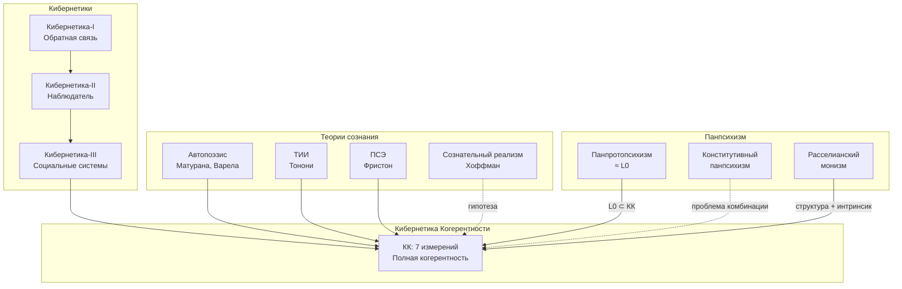

# Теории Сознания

:::note О нотации
В этом документе:
- $\Gamma$ — [матрица когерентности](/docs/core/dynamics/coherence-matrix)
- $\varphi$ — [оператор самомоделирования](/docs/proofs/categorical/formalization-phi)
- $\Phi$ — [мера интеграции](/docs/core/structure/dimension-u#мера-интеграции-φ)
- $\mathcal{R}[\Gamma, E]$ — [регенеративный член](/docs/core/dynamics/evolution#3-регенеративный-член)
- $\rho_E$ — редуцированная матрица плотности [измерения Интериорности](/docs/core/structure/dimension-e)
- $\mathbf{Hol}$ — [категория Голономов](/docs/proofs/categorical/categorical-formalism)
:::

В этом документе анализируется связь КК с ведущими теориями сознания: автопоэзисом, IIT и FEP.

## Автопоэзис (Матурана, Варела)

**Фокус:** Самопроизводство, операциональное замыкание.

**Источник:** Maturana H., Varela F. «Autopoiesis and Cognition» (1980).

**Ключевые понятия:**
- **Автопоэтическая организация** — сеть процессов, производящих компоненты, которые воспроизводят эту сеть
- **Операциональное замыкание** — система определяется через свои внутренние операции
- **Структурное сопряжение** — взаимодействие с окружением при сохранении идентичности

**Отображение в КК:**

| Автопоэзис (Матурана, Варела) | КК |
|-------------------------------|-----|
| Автопоэтическая организация | [(AP)](/docs/core/foundations/axiom-septicity): $\varphi(\Gamma^*) = \Gamma^*$ |
| Компоненты сети | Измерения $A$, $S$, $D$, $L$ |
| Структурное сопряжение | Взаимодействие Голонома с окружением $E$ |
| Операциональное замыкание | Инвариантность структуры при [жизнеспособности](/docs/core/dynamics/viability) |
| — | [L-унификация](/docs/applied/coherence-cybernetics/axiomatics#l-унификация-вывод-l_k-из-ω): $L_k = \sqrt{\chi_{S_k}}$ |

**Добавляется:**
- Операциональное замыкание (неподвижная точка $\varphi$)
- Различение организация/структура

**Что теряется:**
- Феноменология ([E-измерение](/docs/core/structure/dimension-e) как фундаментальное)
- Квантовое основание [(QG)](/docs/core/foundations/axiom-septicity)
- Формальная динамика (нет аналога уравнения эволюции)
- **Логическое происхождение динамики** (L-унификация в УГМ выводит диссипацию из структуры Ω)

## Теория интегрированной информации (IIT)

**Фокус:** Интеграция информации как мера сознания.

**Источник:** Tononi G. «Integrated Information Theory» (IIT 3.0: 2014, IIT 4.0: 2023).

**Ключевые понятия:**
- **$\Phi^{\mathrm{IIT}}$** — интегрированная информация системы
- **Постулаты IIT** — существование, композиция, информация, интеграция, исключение
- **Q-shape** (квалиа-пространство) — геометрия опыта

**Концептуальные соответствия (не формальные изоморфизмы):**

:::warning Важное различие
$\Phi^{\mathrm{IIT}}$ и $\Phi(\Gamma)$ — **разные математические объекты**:
- $\Phi^{\mathrm{IIT}}$ вычисляется через минимальную информационную перегородку (NP-сложная задача)
- $\Phi(\Gamma)$ в КК — простое отношение норм Фробениуса

КК определяет **собственную меру интеграции**, вдохновлённую идеями IIT, но не тождественную $\Phi^{\mathrm{IIT}}$.
:::

| IIT (Тонони) | Концептуальный аналог в КК |
|--------------|-----|
| $\Phi^{\mathrm{IIT}}$ (MIP-основанная) | [$\Phi(\Gamma)$](/docs/core/structure/dimension-u#мера-интеграции-φ) (норма-основанная) |
| Механизмы и состояния | [Голоном](/docs/core/structure/holon) $\mathbb{H}$ |
| Q-shape (cause-effect structure) | [Феноменальная геометрия](/docs/proofs/consciousness/interiority-hierarchy#уровень-1-феноменальная-геометрия-phenomenal-geometry) (проективное пространство) |
| Постулат интеграции | [U-измерение](/docs/core/structure/dimension-u) |
| Постулат исключения | Единственность [неподвижной точки](/docs/consciousness/foundations/self-observation#теорема-о-неподвижной-точке) $\Gamma^*$ |

**Добавляется:**
- Формальная [мера интеграции](/docs/core/structure/dimension-u#мера-интеграции-φ)
- Связь с [сознательностью](/docs/consciousness/foundations/self-observation#мера-сознательности-c)
- Аксиомы, связывающие структуру и опыт

**Что теряется:**
- [Динамика](/docs/core/dynamics/evolution) (унитарный, диссипативный, регенеративный члены)
- [Жизнеспособность](/docs/core/dynamics/viability)
- [Самомоделирование](/docs/proofs/categorical/formalization-phi) ($\varphi$)
- Квантовое основание [(QG)](/docs/core/foundations/axiom-septicity)

## Принцип свободной энергии (FEP)

**Фокус:** Минимизация вариационной свободной энергии.

**Источник:** Friston K. «The free-energy principle: a unified brain theory?» (2010); «Active inference and learning» (2016).

**Ключевые понятия:**
- **Вариационная свободная энергия** $F$ — верхняя граница сюрприза
- **Марковское одеяло** — статистическая граница, отделяющая внутренние от внешних состояний
- **Активный вывод** — действия как минимизация ожидаемой свободной энергии

:::info УГМ как обобщение FEP
**[Теорема 4.2](/docs/proofs/dynamics/fep-derivation#4-классический-предел-вывод-fep):** FEP Фристона является **классическим пределом** вариационной характеризации φ в УГМ.

В классическом пределе (диагональные матрицы плотности $\Gamma = \mathrm{diag}(p)$):
$$
\mathcal{F}_{\text{УГМ}} = S_{vN} + D_{KL} \xrightarrow{\text{classical}} H(q) + D_{KL}(q \| p) = F_{FEP}
$$

Это строго доказанное соответствие, а не концептуальная аналогия.
:::

**Формальные соответствия:**

| FEP (Фристон) | Формальный аналог в КК | Статус |
|---------------|------------------------|--------|
| Свободная энергия $F = \langle E \rangle_q - H(q)$ | $\mathcal{F} = S_{vN}(\psi(\Gamma)) + D_{KL}(\psi(\Gamma) \| \Gamma)$ | **[Теорема 4.2](/docs/proofs/dynamics/fep-derivation)** |
| Марковское одеяло | Граница [Голонома](/docs/core/structure/holon) — [измерение A](/docs/core/structure/dimension-a) | Концептуальное |
| Внутренние состояния | Матрица когерентности $\Gamma$ | Формальное |
| Активный вывод | [Регенеративный член](/docs/core/dynamics/evolution#3-регенеративный-член) $\mathcal{R}[\Gamma, E]$ | Концептуальное |
| Генеративная модель | [Оператор самомоделирования](/docs/proofs/categorical/formalization-phi) $\varphi$ | **[Теорема 3.1](/docs/proofs/dynamics/fep-derivation#3-теорема-о-вариационной-характеризации)** |
| Сенсорные состояния | Взаимодействие с окружением через [O-измерение](/docs/core/structure/dimension-o) | Концептуальное |

**Ключевой результат:** В УГМ φ определяется **категориально** (сопряжение $\varphi \dashv i$), а вариационная форма $\varphi = \arg\min[S_{vN} + D_{KL}]$ — **доказанная теорема** ([Теорема 3.1](/docs/proofs/dynamics/fep-derivation#3-теорема-о-вариационной-характеризации)).

**Что FEP добавляет (как мотивация):**
- Термодинамическое обоснование
- Байесовский вывод
- Активный вывод
- Связь с градиентным потоком

**Формальный статус FEP в УГМ:**
- FEP является **классическим пределом** ([Теорема 4.2](/docs/proofs/dynamics/fep-derivation#4-классический-предел-вывод-fep))
- Вариационный принцип φ **выводится** из категориального определения ([Теорема 3.1](/docs/proofs/dynamics/fep-derivation#3-теорема-о-вариационной-характеризации))
- В FEP вариационный принцип — аксиома; в УГМ — теорема

**Что FEP не включает (УГМ расширяет):**
- [Экспериенциальное содержание](/docs/proofs/categorical/categorical-formalism#2-категория-exp) (E-измерение как фундаментальное)
- [7-мерная структура](/docs/core/structure/dimensions) ([обоснование](/docs/core/foundations/axiom-omega#октонионная-структура))
- [Рефлексивное замыкание](/docs/consciousness/foundations/self-observation#мера-рефлексии-r)
- [Иерархия интериорности](/docs/proofs/consciousness/interiority-hierarchy) (L0→L1→L2→L3→L4)
- **Квантовое обобщение** (матрицы плотности вместо вероятностей)

---

## Теория глобального рабочего пространства (GWT)

**Фокус:** Широковещательный доступ к информации как механизм сознания.

**Источник:** Baars B. «A Cognitive Theory of Consciousness» (1988); Dehaene S., Naccache L. «Towards a cognitive neuroscience of consciousness» (2001).

**Ключевые понятия:**
- **Глобальное рабочее пространство** — центральный «доска объявлений», куда модули проецируют информацию
- **Воспламенение (ignition)** — порог, при котором локальная активность становится глобально доступной
- **Широковещание (broadcasting)** — глобальная доступность информации для всех модулей

**Отображение в КК:**

| GWT (Baars, Dehaene) | КК |
|------------------------|-----|
| Глобальное рабочее пространство | [U-измерение](/docs/core/structure/dimension-u): интеграция через $\Phi(\Gamma)$ |
| Воспламенение (ignition) | Порог жизнеспособности $P > P_{\text{crit}} = 2/7$ |
| Широковещание | Недиагональные элементы $\Gamma$ (когерентность между измерениями) |
| Бессознательная обработка | $R < R_{\text{th}}$: система функционирует, но без рефлексивного доступа |

**Что КК добавляет:** GWT описывает *архитектурный* механизм (широковещание), но не объясняет, почему он порождает опыт. КК формализует интеграцию через $\Phi(\Gamma)$ и связывает её с [E-измерением](/docs/core/structure/dimension-e) — феноменальным содержанием, которое в GWT остаётся необъяснённым.

## Теории высшего порядка (HOT)

**Фокус:** Сознание как репрезентация репрезентаций.

**Источник:** Rosenthal D. «Consciousness and Mind» (2005); Lau H., Rosenthal D. «Empirical support for higher-order theories of conscious awareness» (2011).

**Ключевые понятия:**
- **Высшего порядка мысль (HOT)** — метарепрезентация первого порядка состояния
- **Высшего порядка восприятие (HOP)** — перцептивный мониторинг собственных состояний
- **Условие осведомлённости** — состояние сознательно тогда и только тогда, когда субъект осведомлён о нём

**Отображение в КК:**

| HOT (Rosenthal, Lau) | КК |
|------------------------|-----|
| Метарепрезентация (HOT) | [Оператор самомоделирования](/docs/proofs/categorical/formalization-phi) $\varphi$: $\varphi(\Gamma) \approx \Gamma$ |
| Мониторинг (HOP) | [Мера рефлексии](/docs/consciousness/foundations/self-observation#мера-рефлексии-r) $R(\Gamma) \geq R_{\text{th}}$ |
| Бессознательные состояния | $R < R_{\text{th}}$: первый порядок без метарепрезентации |
| Иерархия порядков | [Иерархия интериорности](/docs/proofs/consciousness/interiority-hierarchy): L0→L1→L2→L3→L4 |

**Что КК добавляет:** HOT постулирует необходимость метарепрезентации, но не формализует её. КК выводит самомоделирование $\varphi$ из [аксиомы (AP)](/docs/core/foundations/axiom-septicity) и определяет точный порог рефлексии $R_{\text{th}} = 1/3$. Кроме того, КК объединяет метарепрезентацию с интеграцией ($\Phi$) и феноменальностью ($\mathrm{Coh}_E$), чего HOT не охватывает.

## Категорный мета-анализ теорий сознания

:::info Формализованный раздел
Этот раздел содержит **предложенные категорные определения** для сравнения теорий сознания. Определения являются **программой формализации** — функторы постулируются, но их строгое построение требует дальнейшей работы.
:::

### Мета-категория теорий сознания

**Определение (Мета-категория $\mathbf{ConsTheory}$).**

$$
\mathrm{Ob}(\mathbf{ConsTheory}) := \{\text{теории сознания как категории}\}
$$

$$
\mathrm{Mor}(\mathcal{T}_1, \mathcal{T}_2) := \{F: \mathcal{T}_1 \to \mathcal{T}_2 \mid F \text{ — функтор}\}
$$

Морфизмы — **функторы-проекции**, показывающие, как одна теория «вкладывается» в другую.

### Классификация по охвату

Для каждой теории $\mathcal{T}$ определим **функтор вложения**:

$$
\iota_\mathcal{T}: \mathcal{T} \hookrightarrow \mathbf{Hol}
$$

где $\mathbf{Hol}$ — [категория Голономов](/docs/proofs/categorical/categorical-formalism) с CPTP-морфизмами.

**Полнота теории:**

$$
\mathrm{Completeness}(\mathcal{T}) := \frac{|\mathrm{Im}(\iota_\mathcal{T})|}{|\mathrm{Ob}(\mathbf{Hol})|}
$$

---

## Расширенная диаграмма теорий

---

## Утверждение о полноте [И] {#утверждение-о-полноте}

:::warning Интерпретативное утверждение [И]
КК — кибернетика, удовлетворяющая:
1. [Аксиомам Ω и (AP+PH+QG+V)](/docs/applied/coherence-cybernetics/axiomatics#аксиоматическая-база-краткая-справка)
2. [Условию жизнеспособности](/docs/core/dynamics/viability)
3. [Условию феноменологической полноты](/docs/proofs/consciousness/interiority-hierarchy)

Это **не теорема о единственности**: из минимальности 7 измерений не следует, что КК — единственная возможная реализация. Другие теории с 7 измерениями, но иной динамикой, не исключены. Утверждение о «полноте» — **интерпретация** [И], а не доказанный результат.
:::

**Обоснование минимальности:** Следует из [теоремы о минимальности 7 измерений](/docs/proofs/minimality/theorem-minimality-7) — любая меньшая размерность теряет хотя бы одно из свойств (AP), (PH), (QG). Однако минимальность размерности не эквивалентна единственности теории.

### Сводная таблица функторов

| Теория | Функтор | Полнота | Верность | Статус |
|--------|---------|---------|----------|--------|
| Кибернетика-I | $F_{\mathrm{Wiener}}: \mathbf{Control} \to \mathbf{Hol}$ | Нет | Да | Проекция |
| Кибернетика-II | $F_{\mathrm{vF}}: \mathbf{Observer} \to \mathbf{Hol}$ | Нет | Да | Проекция |
| Кибернетика-III | $F_{\mathrm{Luhmann}}: \mathbf{Social} \to \mathbf{Hol}$ | Нет | Да | Проекция |
| Автопоэзис | $F_{\mathrm{MV}}: \mathbf{Autopoiesis} \to \mathbf{Hol}$ | Нет | Да | Проекция |
| IIT | $F_{\mathrm{IIT}}: \mathbf{IIT} \to \mathbf{Hol}$ | Нет | Да | Проекция |
| FEP | $F_{\mathrm{FEP}}: \mathbf{FEP} \hookrightarrow \mathbf{Hol}^{\mathrm{diag}}$ | Да (на $\Gamma^{\mathrm{diag}}$) | Да | **Вложение (классич. предел)** |
| Панпсихизм: панпротопсихизм | $\iota_{\mathrm{L0}}: \mathbf{Pan}_{\mathrm{proto}} \hookrightarrow \mathbf{Hol}$ | Да (на L0) | Да | Вложение |
| Панпсихизм: расселианский монизм | $F_{\mathrm{Russell}}: \mathbf{Russell} \to \mathbf{Hol}$ | Нет | Да | Проекция |
| Сознательный реализм | $F_{\mathrm{Hoffman}}: \mathbf{Hol}_{\mathrm{L2}} \to \mathbf{ConsAgents}$ | ? | ? | Гипотеза |

## Практические следствия

| Теория | Применение | Ограничение |
|--------|------------|-------------|
| Кибернетика-I | Инженерные системы управления | Нет самореференции, нет феноменологии |
| Кибернетика-II | Эпистемология, рефлексивные системы | Нет феноменологии, нет квантового основания |
| Кибернетика-III | Социальные системы, организации | Нет формальной математики |
| Автопоэзис | Биология, когнитивистика | Нет формальной динамики |
| IIT | Оценка сознания, нейронауки | Нет динамики, нет жизнеспособности |
| FEP | Нейронауки, ИИ, робототехника | Нет E-измерения как фундаментального |
| **КК** | **Полные живые системы** | **Нет эмпирической валидации; протоколы измерения Γ не установлены; ω₀ требует калибровки** |

:::info Сравнительное преимущество: $G_2$-ригидность [Т]
[Теорема $G_2$-ригидности](/docs/proofs/categorical/uniqueness-theorem) [Т] даёт КК **уникальное преимущество** перед конкурирующими теориями:

| Теория | Наблюдатель-независимость мер | Единственность представления |
|--------|:---:|:---:|
| **IIT** | Нет — $\Phi^{\mathrm{IIT}}$ зависит от выбора перегородки (MIP) | Нет |
| **FEP** | Частично — $\varphi$ вариационно, но множественные минимумы возможны | Нет |
| **GWT/HOT** | Нет формализации | Нет |
| **КК** | **Да** — $R$, $\Phi$, $\mathrm{Coh}_E$ суть $G_2$-инварианты | **Да** — единственность с точностью до $G_2$ |

КК — единственная теория сознания, для которой доказана **наблюдатель-независимость** всех ключевых мер и **единственность** представления (с точностью до конечномерной калибровочной группы $G_2$).
:::

---

**Связанные документы:**
- [Вывод FEP из УГМ](/docs/proofs/dynamics/fep-derivation) — **строгое доказательство** что FEP — классический предел УГМ (Теоремы 3.1, 4.2, 5.1)
- [История кибернетики](/docs/applied/coherence-cybernetics/cybernetics-history) — кибернетики I-II-III порядка
- [Панпсихизм](./panpsychism-analysis) — категорный анализ вариантов панпсихизма и сознательный реализм Хоффмана
- [Когнитивная иерархия](./cognitive-hierarchy) — уровни K1-K5
- [Аксиоматика](/docs/applied/coherence-cybernetics/axiomatics) — формальные основания КК
- [Теоремы](/docs/applied/coherence-cybernetics/theorems) — ключевые результаты
- [Категорный формализм](/docs/proofs/categorical/categorical-formalism) — категория $\mathbf{Hol}$, функтор $F$
- [Иерархия интериорности](/docs/proofs/consciousness/interiority-hierarchy) — уровни L0→L1→L2→L3→L4
- [Глоссарий](/docs/reference/glossary#связанные-теории) — IIT, FEP, GWT, HOT, сознательный реализм
