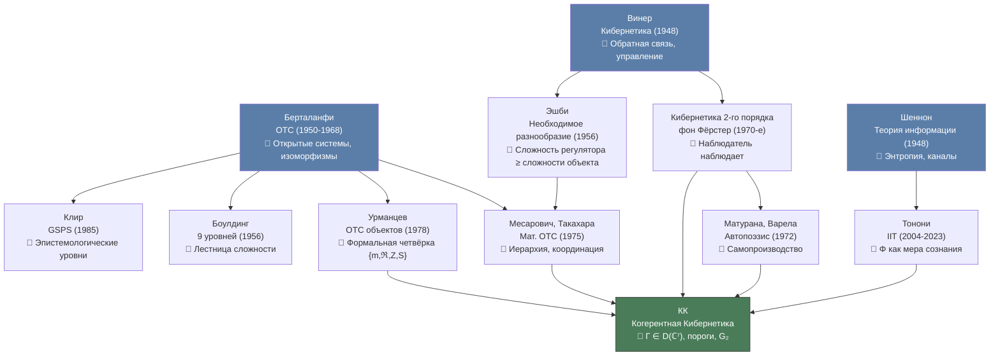
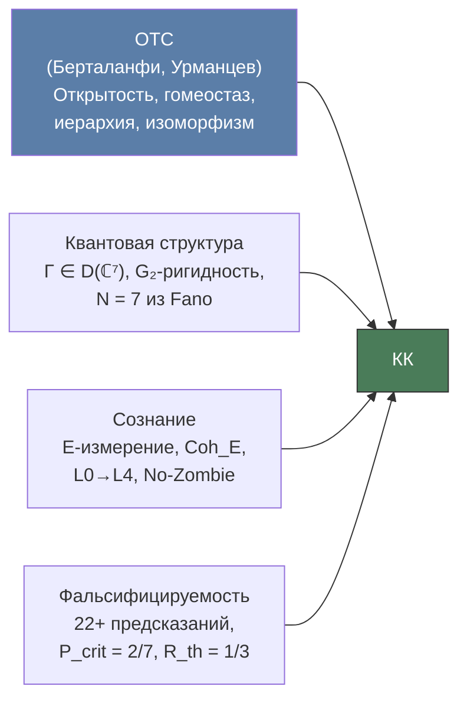

# Общая Теория Систем и Когерентная Кибернетика

:::note О нотации
В этом документе:
- $\Gamma$ — [матрица когерентности](/docs/core/dynamics/coherence-matrix)
- $\mathcal{L}_\Omega = \mathcal{L}_0 + \mathcal{R}$ — [уравнение эволюции](/docs/core/dynamics/evolution)
- $\Phi$ — [мера интеграции](/docs/core/structure/dimension-u#мера-интеграции-φ)
- $R$ — [мера рефлексии](/docs/consciousness/foundations/self-observation#мера-рефлексии-r)
- $P$ — [чистота](/docs/core/dynamics/coherence-matrix) $\mathrm{Tr}(\Gamma^2)$
- $\varphi$ — [оператор самомоделирования](/docs/proofs/categorical/formalization-phi)
- $\mathbb{H}$ — [Голоном](/docs/core/structure/holon)
- $V_{\mathrm{hed}}$ — [гедоническая валентность](/docs/applied/coherence-cybernetics/theorems#теорема-114-гедоническая-валентность) $dP/d\tau$
:::

## Введение: зачем нужна общая теория систем? {#введение}

В середине XX века произошёл интеллектуальный сдвиг, изменивший облик науки: исследователи в совершенно разных областях — от биологии клеток до социологии организаций — обнаружили, что описывают свои объекты **одними и теми же дифференциальными уравнениями**. Рост популяции бактерий подчиняется тем же законам, что и распространение слухов в социальной сети. Теплообмен в здании формально неотличим от потока капитала в экономике. Это наблюдение породило вопрос: существуют ли **универсальные законы**, управляющие системами **любой природы**?

Ответом стала **Общая Теория Систем** (ОТС) — междисциплинарная программа, заложенная Людвигом фон Берталанфи в 1930–1950-х годах и развитая несколькими школами на протяжении семидесяти лет.

Когерентная Кибернетика (КК) претендует не только на мета-статус среди [теорий сознания](/docs/consciousness/comparative/consciousness-theories), но и на математическое обобщение ОТС. Это серьёзное заявление: ОТС — великая интеллектуальная традиция с подтверждённой эвристической ценностью. Заявление об обобщении обязывает показать, что формализм КК **воспроизводит** центральные концепции ОТС как частные случаи, а также **добавляет** то, чего ОТС не может.

В этом разделе мы проследим путь от Берталанфи через Урманцева к КК, покажем точные соответствия и честно укажем на ограничения.

---

## Людвиг фон Берталанфи: рождение ОТС (1950–1968) {#берталанфи}

### Биография и контекст

**Людвиг фон Берталанфи** (Ludwig von Bertalanffy, 1901–1972) — австрийский биолог-теоретик, получивший докторскую степень в Венском университете. В 1930-е годы, работая над проблемами роста организмов, Берталанфи обнаружил, что уравнения роста клеточной массы формально идентичны уравнениям химической кинетики. Это наблюдение стало зерном его главной идеи.

После Второй мировой войны Берталанфи эмигрировал — сначала в Канаду (Университет Альберты), затем в США. В 1954 году совместно с экономистом Кеннетом Боулдингом, физиологом Ральфом Жерар и математиком Анатолем Рапопортом он основал **Society for General Systems Research** (ныне International Society for the Systems Sciences). Главная книга — *General System Theory: Foundations, Development, Applications* (1968) — собрала идеи, развивавшиеся с 1930-х.

### Центральная идея

Берталанфи утверждал: существуют **общие законы систем**, не зависящие от природы составляющих элементов — физических, биологических, социальных. Эти законы описывают **структурные изоморфизмы** между системами разной природы.

Простой пример. Уравнение роста по Берталанфи:

$$
\frac{dW}{dt} = \eta W^{2/3} - \kappa W
$$

описывает рост массы $W$ организма, где $\eta W^{2/3}$ — поступление питательных веществ (пропорционально поверхности), а $\kappa W$ — расход (пропорционально массе). Но **точно такое же** уравнение описывает рост кристалла, накопление капитала фирмой и распространение инфекции в популяции. Берталанфи увидел в этом не совпадение, а **закон**.

### Ключевые понятия

- **Открытая система** — система, которая обменивается веществом, энергией или информацией с окружением. Это противоположность классическим термодинамически замкнутым системам. Живые организмы — открытые системы по определению: они потребляют пищу и выделяют отходы.

- **Эквифинальность** — свойство открытых систем достигать одного и того же конечного состояния из разных начальных условий. Организм достигает взрослого размера независимо от того, получал ли он больше или меньше питания в начале жизни (в пределах жизнеспособности). Замкнутые системы такого свойства не имеют — их конечное состояние однозначно определяется начальными условиями.

- **Изоморфизмы между науками** — одни и те же математические структуры (системы ОДУ, обратная связь, иерархия) проявляются в физике, биологии, экономике и социологии.

### Математический аппарат

Берталанфи предложил предельно общую формализацию:

$$
\frac{dx_i}{dt} = f_i(x_1, \ldots, x_n), \quad i = 1, \ldots, n
$$

Система обыкновенных дифференциальных уравнений (ОДУ) как **универсальный язык** описания динамики. Любая система, динамика которой описывается через взаимодействие переменных, вписывается в этот формат.

**Сила и слабость этого подхода** взаимосвязаны. Формализм предельно общий — он охватывает всё, но именно поэтому не порождает конкретных предсказаний. Утверждение «динамика описывается системой ОДУ» истинно для столь широкого класса объектов, что становится тривиальным. ОТС Берталанфи — скорее **философская программа** и **эвристический принцип**, чем математическая теория с теоремами и опровержимыми предсказаниями.

:::info Ключевой вклад Берталанфи
Берталанфи не открыл законы систем — он открыл **возможность** таких законов. Его главная заслуга — легитимизация междисциплинарного системного мышления как научной программы. До Берталанфи сравнение живого организма с фирмой считалось метафорой; после него — исследовательской стратегией.
:::

---

## Ю.А. Урманцев: ОТС объектов (1978–2009) {#урманцев}

### Биография и контекст

**Юнир Абдинович Урманцев** (1925–2009) — советский и российский философ-системолог, профессор Московского университета. Урманцев поставил перед собой задачу, которую Берталанфи не решил: создать **формальную** общую теорию систем, а не программную декларацию. Результат — «Общая теория систем» (1978) и последующие работы, вплоть до «Начал общей теории систем» (2003).

Урманцев работал в традиции, отличной от англо-американского системного движения. Если Берталанфи, Боулдинг и Эшби были биологами и инженерами, то Урманцев — философ, стремившийся к логической строгости в духе советской философии науки.

### Центральная конструкция

Урманцев определил **систему** как четвёрку:

$$
\mathcal{S} = \{m, \, \mathfrak{R}, \, Z, \, S\}
$$

| Компонент | Обозначение | Описание | Пример (для живой клетки) |
|-----------|-------------|----------|---------------------------|
| Элементы | $m$ | Множество составных частей системы | Органеллы: ядро, митохондрии, рибосомы |
| Отношения | $\mathfrak{R}$ | Связи между элементами | Метаболические пути, сигнальные каскады |
| Законы композиции | $Z$ | Правила, по которым элементы образуют систему | Генетический код, правила сборки белков |
| Свойства | $S$ | Наблюдаемые характеристики системы как целого | Метаболическая активность, способность к делению |

### Ключевые результаты

- **Закон системных преобразований** — Урманцев систематически классифицировал способы изменения системы. Систему можно изменить четырьмя путями: (1) изменив элементы $m$, (2) изменив отношения $\mathfrak{R}$, (3) изменив законы $Z$, (4) изменив всё одновременно. Это даёт полную комбинаторику преобразований.

- **Полиморфизм и изоморфизм систем** — формальные отображения между системами разной природы. Две системы изоморфны, если между ними существует биекция, сохраняющая отношения и законы.

- **Алгебраический подход** — группоиды и полигруппоиды как инструмент описания системных преобразований. Урманцев первым попытался дать ОТС алгебраическую форму.

### Отображение в КК

| Урманцев ($\mathcal{S}$) | КК-формализация | Комментарий |
|--------------------------|-----------------|-------------|
| Элементы $m$ | Измерения $k \in \{A, S, D, L, E, O, U\}$ | 7 семантических ролей |
| Отношения $\mathfrak{R}$ | Когерентности $\gamma_{ij}$ (внедиагональные элементы $\Gamma$) | 21 пара когерентностей |
| Законы композиции $Z$ | [Оператор эволюции](/docs/core/dynamics/evolution) $\mathcal{L}_\Omega$ | Динамика выведена из структуры $\Omega$ |
| Свойства $S$ | Наблюдаемые: $P$, $\Phi$, $R$, $\sigma_k$ | Конкретные функции от $\Gamma$ |

Преимущество Урманцева — явная попытка алгебраической формализации. Но его алгебра остаётся **описательной**: она классифицирует типы систем и преобразований, но не порождает динамику из структуры, как это делает [L-унификация](/docs/applied/coherence-cybernetics/axiomatics#l-унификация-вывод-l_k-из-ω) в КК.

:::note Урманцев и проблема сознания
Урманцев никогда не обращался к проблеме сознания. Его ОТС — теория **объектов** (систем любой природы), не теория **субъектов** (систем, обладающих внутренним опытом). В этом — принципиальное ограничение его подхода и одновременно его честность: он не претендовал на то, чего его формализм не мог дать.
:::

---

## Другие школы ОТС {#другие-школы}

ОТС — не монолитная теория, а семейство подходов. Каждый подчёркивает свой аспект «системности». Рассмотрим ключевые школы и их связь с КК.

### Месарович и Такахара (1975): математическая ОТС

**Михайло Месарович** (Кейсовский университет, США) и **Ясухико Такахара** (Токийский технологический) создали наиболее строгую математическую ОТС. Их определение: система — отображение $S \subseteq X \times Y$ (вход → выход). Центральная тема — иерархические многоуровневые системы с задачей координации слоёв.

Ключевые понятия:
- **Стратифицированное описание** — один объект описывается на нескольких уровнях абстракции (например, завод: уровень деталей, уровень цехов, уровень предприятия)
- **Координация** — согласование решений между слоями иерархии

Это наиболее близкий к КК формализм в классической ОТС: идея стратификации перекликается с тем, как КК различает уровни описания — от $\Gamma$ (микро) через наблюдаемые $P, \Phi, R$ (мезо) до поведения голонома (макро). Однако у Месаровича нет квантовой алгебры и нет понятия сознания.

### Клир (1969, 1985): системная эпистемология

**Джордж Клир** (Binghamton University, США) предложил **General Systems Problem Solver (GSPS)** — эпистемологическую иерархию моделей. Восемь уровней организации знания:

1. Источник (данные)
2. Данные → переменные
3. Порождающие системы (правила)
4. Структурированные системы (композиции)
5. Метасистемы (изменение правил)
6–8. Мета-метауровни

Идея системной эпистемологии перекликается с [SAD-иерархией](/docs/consciousness/hierarchy/interiority-hierarchy) КК (SAD-0: реакция, SAD-1: модель себя, SAD-2: модель модели, SAD-3: рефлексия модели). Однако у Клира нет формальных порогов перехода между уровнями — нет аналога $P_{\mathrm{crit}}$ или $R_{\mathrm{th}}$.

### Боулдинг (1956): девять уровней сложности

**Кеннет Боулдинг** (один из соучредителей общества ОТС) предложил интуитивную «лестницу сложности» — девять уровней систем:

| Уровень | Описание | Аналог в КК | Комментарий |
|---------|----------|--------------|-------------|
| 1 | Статические рамки (кристалл) | Нет (КК описывает динамические системы) | Структура без динамики |
| 2 | Часовые механизмы | $P \ll 2/7$, детерминированная динамика | Предсказуемые, без обратной связи |
| 3 | Кибернетические системы (термостат) | Обратная связь, но без $\varphi$ | Контроль без самомоделирования |
| 4 | Открытые системы (клетка) | $\mathcal{L}_\Omega = \mathcal{L}_0 + \mathcal{R}$ | Обмен с окружением |
| 5 | Растения (генетическое общество) | L0 (протоинтериорность) | Рост, воспроизводство |
| 6 | Животные | L1 (перцептивная интериорность) | Ощущения, движение |
| 7 | Человек | L2–L3 ($P > 2/7$, SAD $\geq 1$) | Самосознание, язык |
| 8 | Социальные системы | Композиция голономов (T-68) | Коллективная когерентность |
| 9 | Трансцендентное | Открытый вопрос | Неформализуемое? |

Лестница Боулдинга интуитивно верна и педагогически ценна, но задана описательно. КК предлагает **формальные критерии** перехода между уровнями: не «достаточная сложность», а конкретные числа ($P_{\mathrm{crit}} = 2/7$, $R_{\mathrm{th}} = 1/3$, $\Phi_{\mathrm{th}} = 1$).

### Акофф и Эмери (1972): целеполагание

**Рассел Акофф** и **Фред Эмери** поставили **целеполагание** в центр системности. Система «целенаправлена» (purposeful), если способна выбирать и цели, и средства. Целеустремлённые системы отличаются от целеуправляемых (goal-directed: выбор средств, но не целей) и реактивных (state-maintaining: поддержание гомеостаза).

В КК аналогом целеполагания служит [гедоническая валентность](/docs/applied/coherence-cybernetics/theorems#теорема-114-гедоническая-валентность) $V_{\mathrm{hed}} = dP/d\tau$ — формально выведенный внутренний «компас» системы, направляющий поведение в сторону увеличения когерентности. При этом $V_{\mathrm{hed}}$ — не постулированная «цель», а **следствие** динамики $\mathcal{L}_\Omega$: система «стремится» к увеличению $P$, потому что это математическое свойство её эволюционного уравнения.

### Лем и Тёрчин: метасистемный переход

**Станислав Лем** в *Сумме технологии* (1964) обсуждал **метасистемный переход** — качественный скачок, когда система управления сама становится объектом управления следующего уровня. Жизнь → сознание → разум — цепочка метасистемных переходов.

**Валентин Тёрчин** (Turchin, 1970) формализовал эту идею в книге *Феномен науки*: метасистемный переход $M \to M'$ создаёт новый уровень контроля. Множество систем $\{S_i\}$ объединяются под управлением метасистемы $S'$, которая контролирует их как целое.

В КК метасистемному переходу соответствует:
- **Индивидуальный уровень**: рост SAD (самонаблюдение наблюдает за самонаблюдением) — каждый уровень SAD есть метасистемный переход в пространстве самомоделирования
- **Групповой уровень**: [композиция голономов](/docs/applied/coherence-cybernetics/theorems) — переход от индивидуальной $\Gamma$ к групповой когерентности

---

## Генеалогия: от ОТС к КК {#генеалогия}

Связь КК с интеллектуальными традициями XX века нагляднее всего выражается диаграммой. КК наследует идеи **трёх основополагающих программ**: общей теории систем, кибернетики и теории информации.

Каждая стрелка на диаграмме — не просто «вдохновение», а конкретное структурное наследование. Берталанфи дал идею открытой системы ($\mathcal{L}_\Omega$ включает обмен с окружением через $\mathcal{R}$). Винер дал обратную связь ($\varphi \to \rho^* \to \mathcal{R}$). Шеннон дал информационные меры ($S_{vN}$, $D_{KL}$). Урманцев дал структурную четвёрку (элементы, отношения, законы, свойства). Фон Фёрстер дал наблюдателя ($\varphi$-оператор). Тонони дал меру интеграции ($\Phi$).

КК отличается тем, что **объединяет** все эти элементы в едином квантово-алгебраическом формализме, где они не просто сосуществуют, а **выводятся** друг из друга.

---

## Как КК обобщает ОТС: формальное обоснование {#кк-обобщает-отс}

Ключевой аргумент: КК не добавляет к ОТС «ещё одну переменную», а **выводит** концепции ОТС как проекции на подмножество измерений.

### Таблица обобщений

| Концепция ОТС | КК-формализация | Статус | Что добавлено |
|---------------|-----------------|--------|---------------|
| Система | [Голоном](/docs/core/structure/holon) $\mathbb{H}$ | [О] | Фиксированная размерность $N=7$ |
| Открытая система | $\mathcal{L}_\Omega = \mathcal{L}_0 + \mathcal{R}$ (диссипация + регенерация) | [Т] | Конкретная динамика, не только «обмен» |
| Гомеостаз | $P > 2/7$ ([область жизнеспособности](/docs/core/dynamics/viability) $\mathcal{V}$) | [Т] | Точный числовой порог |
| Обратная связь | $\varphi(\Gamma) \to \rho^* \to \mathcal{R}$ (самомоделирование → регенерация) | [Т] | Самомоделирование, не просто обратная связь |
| Эквифинальность | [Примитивность](/docs/core/dynamics/evolution) $\mathcal{L}_0$ → единственный аттрактор $I/7$ (T-39a) | [Т] | Доказанная единственность аттрактора |
| Иерархия | [L0→L4](/docs/consciousness/hierarchy/interiority-hierarchy) уровни интериорности | [Т] | Формальные пороги переходов |
| Изоморфизм систем | [Субстрат-независимость](/docs/consciousness/foundations/interiority-theory) (T-153) | [Т] | Доказанная теорема, не только аналогия |
| Элемент системы | Измерение $k \in \{A, S, D, L, E, O, U\}$ | [О] | 7 семантических ролей |
| Связь | Когерентность $\gamma_{ij}$ | [Т] | Квантовая когерентность |
| Целостность | $\Phi \geq 1$ — [порог интеграции](/docs/core/structure/dimension-u#мера-интеграции-φ) для сознания | [Т] | Числовой порог |
| Энтропия | $S_{vN}(\Gamma) = -\mathrm{Tr}(\Gamma \ln \Gamma)$ | [Т] | Квантовая (фон-Неймановская) энтропия |
| Целеполагание | $V_{\mathrm{hed}} = dP/d\tau$ — гедоническая валентность (T-103) | [Т] | Не постулированная цель, а следствие динамики |
| Метасистемный переход | Композиция голономов (T-68) | [С] | Количественный порог ($\Phi_{12} > 1$) |

:::info Условные обозначения статусов
[О] — определение, [Т] — теорема, [С] — условная теорема. Подробнее: [реестр статусов](/docs/reference/status-registry).
:::

### Формальное построение обобщения

**Утверждение.** Для любой классической ОТС-системы $\mathcal{S} = (m, \mathfrak{R}, Z)$ можно построить голоном $\mathbb{H}$, воспроизводящий её структуру.

**Конструкция:**

1. **Элементы → измерения.** Каждому элементу $m_k$ сопоставим измерение $k$ с весом $\gamma_{kk}$. Вес отражает «значимость» элемента в системе: $\gamma_{kk} = 0$ означает, что элемент неактивен, $\gamma_{kk} = 1/7$ — равновесный.

2. **Отношения → когерентности.** Каждому отношению $r_{ij} \in \mathfrak{R}$ сопоставим когерентность $\gamma_{ij}$. Если элементы $m_i$ и $m_j$ сильно связаны, $|\gamma_{ij}|$ велика; если независимы, $\gamma_{ij} \approx 0$.

3. **Законы → оператор эволюции.** Закону $Z$ сопоставим $\mathcal{L}_\Omega$, действующий на $\Gamma$. Конкретная форма $\mathcal{L}_\Omega$ определяется аксиомами КК.

**Два случая по числу элементов:**

- Если число элементов $|m| < 7$, голоном проецируется на подпространство — неиспользованные измерения имеют $\gamma_{kk} = 0$.
- Если $|m| > 7$, элементы группируются по [семантическим ролям](/docs/core/foundations/axiom-septicity). Это неизбежное сжатие: 7 измерений КК — **минимальное** число, покрывающее все фундаментальные аспекты, но не каждый конкретный элемент.

Таким образом, **любая ОТС-система имеет представление как голоном** (с возможной потерей информации при проекции).

:::warning Ограничение аргумента
Отображение $\mathcal{S} \mapsto \mathbb{H}$ сюръективно, но **не инъективно**: разные ОТС-системы могут отображаться в один голоном. Это неизбежная цена 7-мерной проекции. Обратное отображение (из голонома в ОТС-систему) определено однозначно лишь при фиксированной интерпретации измерений. Аналогия: карта проекции трёхмерного объекта на плоскость теряет информацию о глубине; но если известна точка зрения, объект восстанавливается.
:::

### Сводная таблица: Берталанфи — Урманцев — КК

| Аспект | Берталанфи | Урманцев | КК |
|--------|-----------|----------|-----|
| **Определение системы** | Множество элементов во взаимодействии | $\{m, \mathfrak{R}, Z, S\}$ | Голоном $\mathbb{H} = (\Gamma, \varphi, E)$ |
| **Математика** | Система ОДУ | Группоиды | $\Gamma \in \mathcal{D}(\mathbb{C}^7)$, $\mathcal{L}_\Omega$ |
| **Динамика** | $\dot{x}_i = f_i(x_1, \ldots, x_n)$ | Описательная | $\dot{\Gamma} = \mathcal{L}_\Omega[\Gamma]$ |
| **Пороги** | Нет | Нет | $P_{\mathrm{crit}} = 2/7$, $R_{\mathrm{th}} = 1/3$, $\Phi_{\mathrm{th}} = 1$ |
| **Субъективный опыт** | Не рассматривается | Не рассматривается | Центральный объект (E-измерение) |
| **Предсказания** | Нет конкретных | Нет конкретных | 22+ фальсифицируемых |
| **Субстрат** | Абстрактный | Абстрактный | Абстрактный + доказанная независимость (T-153) |
| **Обратная связь** | Постулируется | Классифицируется | Выводится из $\varphi$ |
| **Иерархия** | Описательная | Описательная | L0→L4 с формальными критериями |
| **Классическая/квантовая** | Классическая | Классическая | Квантовая ($\Gamma$ — матрица плотности) |

### Что КК добавляет к ОТС-описанию

Кроме обобщения существующих концепций, КК вносит **принципиально новый слой**, отсутствующий у Берталанфи и Урманцева:

1. **Диссипация** ($\mathcal{L}_0$): линдбладовская динамика с доказанной примитивностью (T-39a [Т]) — единственный аттрактор $I/7$, к которому стремится система без регенерации

2. **Регенерация** ($\mathcal{R}$): нелинейный член, определяемый самомоделью $\varphi(\Gamma)$ — система сопротивляется распаду через самомоделирование

3. **Наблюдаемые**: $P$, $\Phi$, $R$, $\sigma_k$ — конкретные функции от $\Gamma$, а не абстрактные «свойства» системы. Каждая наблюдаемая вычислима по $\Gamma$, и её значение определяет качественное состояние системы

---

## Чего ОТС не может, а КК может {#преимущества-кк}

**1. Точные пороги вместо качественных описаний.**

ОТС говорит о «достаточной сложности» для эмерджентных свойств. Когда система «достаточно сложна»? Берталанфи не отвечает. Урманцев классифицирует типы сложности, но не указывает числовых границ. КК **выводит** конкретные числа:
- $P_{\mathrm{crit}} = 2/7$ — [порог сознания](/docs/core/dynamics/viability)
- $R_{\mathrm{th}} = 1/3$ — [порог рефлексии](/docs/consciousness/foundations/self-observation#мера-рефлексии-r)
- $\Phi_{\mathrm{th}} = 1$ — [порог интеграции](/docs/core/structure/dimension-u#мера-интеграции-φ)

Эти числа следуют из аксиом, а не подобраны ad hoc. Они могут быть **опровергнуты** экспериментом — в этом их сила.

**2. Субъективный опыт.**

ОТС полностью молчит о квалиа и сознании. Даже лестница Боулдинга, включающая «человека» и «трансцендентное», не формализует внутренний опыт. КК формализует [интериорность](/docs/consciousness/foundations/interiority-theory) через $\mathrm{Coh}_E$ и доказывает [теорему No-Zombie](/docs/applied/coherence-cybernetics/theorems#теорема-81-условная-необходимость-интериорности-no-zombie): любая жизнеспособная система необходимо обладает ненулевой интериорностью.

**3. Фальсифицируемые предсказания.**

КК формулирует [22+ предсказания](/docs/applied/coherence-cybernetics/predictions), каждое с конкретным числовым критерием. Если хотя бы одно окажется ложным, теория потребует пересмотра. ОТС не порождает предсказаний, проверяемых экспериментом — она слишком общая для этого.

**4. Субстрат-независимость с доказательством.**

ОТС **постулирует** изоморфизмы между науками — системы разной природы «похожи». КК **доказывает** (T-153 [Т]): любая система с $\Gamma \in \mathcal{D}(\mathbb{C}^7)$, удовлетворяющая порогам, обладает интериорностью — **независимо от физического субстрата**. Это не аналогия, а теорема.

---

## Чего КК не может (что ОТС делает хорошо) {#преимущества-отс}

Объективность требует признать области, где ОТС сохраняет преимущество.

**1. Десятилетия эмпирической проверки.**

ОТС применялась в экологии (модели популяций), биологии (рост организмов), менеджменте (организационная теория), инженерии (системная инженерия, INCOSE) — с подтверждённой эвристической ценностью. Понятия «обратная связь», «открытая система», «гомеостаз» стали рабочими инструментами. КК — молодая теория, эмпирическая верификация которой ещё впереди.

**2. Доступность.**

ОТС не требует квантовой теории, теории категорий или спектральной геометрии. Она доступна биологу, инженеру, менеджеру. Книга Берталанфи читается без специальной подготовки. КК предъявляет высокие требования к математической подготовке — это ограничивает круг потенциальных пользователей и критиков.

**3. Системы без сознания.**

ОТС естественно описывает инженерные, экономические, экологические системы, не претендуя на объяснение их «внутренней жизни». Для водопроводной системы или биржевого рынка ОТС — идеальный язык. КК ориентирована на системы с потенциалом интериорности; для чисто механических систем ($P \ll 2/7$) её аппарат избыточен — зачем привлекать $G_2$-ригидность для описания термостата?

**4. Модульность.**

ОТС легко комбинируется с другими подходами (теория управления, исследование операций, синергетика). Системный инженер берёт от ОТС понятие подсистемы, от теории управления — стабильность, от исследования операций — оптимизацию. КК представляет собой монолитный формализм, интеграция которого с прикладными дисциплинами — открытая задача.

---

## Итоги {#итоги}

Связь КК и ОТС можно выразить формулой:

$$
\text{КК} \;\approx\; \text{ОТС} \;+\; \text{квантовая структура} \;+\; \text{сознание} \;+\; \text{фальсифицируемость}
$$

КК **воспроизводит** центральные концепции ОТС — открытость, гомеостаз, эквифинальность, иерархию, изоморфизм — как следствия своих аксиом. При этом она **добавляет** то, чего ОТС не содержит: точные пороги, квантово-алгебраическую динамику, формализацию субъективного опыта и фальсифицируемые предсказания.

Однако заявление об обобщении остаётся **программным** до тех пор, пока предсказания КК не пройдут эмпирическую проверку. ОТС Берталанфи заслужила свой статус десятилетиями применения; КК должна заслужить свой — экспериментом.

---

**Связанные документы:**
- [Теории сознания](./consciousness-theories) — IIT, FEP, автопоэзис и ещё 30+ теорий
- [Когнитом Анохина](./cognitome-anokhin) — российская теория сознания
- [Панпсихизм](./panpsychism-analysis) — панинтериоризм vs панпсихизм
- [Когнитивная иерархия](./cognitive-hierarchy) — уровни K1-K5
- [Иерархия интериорности](/docs/consciousness/hierarchy/interiority-hierarchy) — уровни L0→L4
- [Аксиоматика](/docs/applied/coherence-cybernetics/axiomatics) — формальные основания КК
- [Предсказания](/docs/applied/coherence-cybernetics/predictions) — 22+ фальсифицируемых предсказаний
- [История кибернетики](/docs/applied/coherence-cybernetics/cybernetics-history) — кибернетики I-II-III порядка
