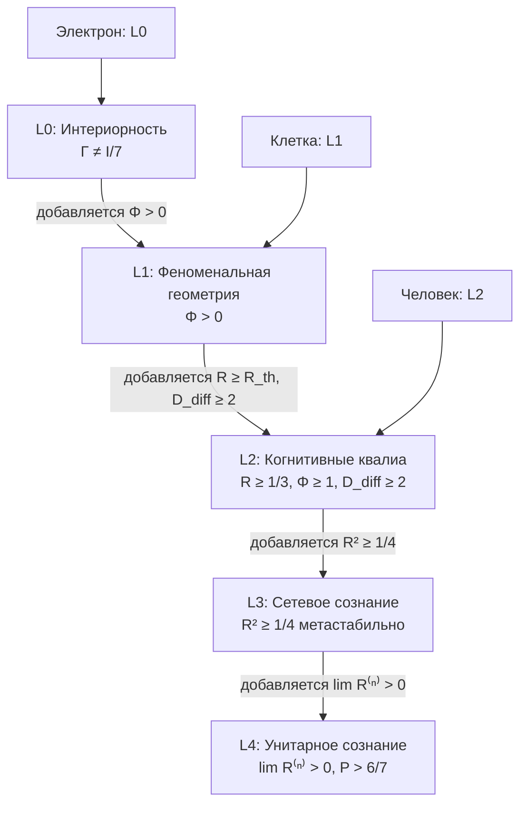

# Панпсихизм: Категорный Анализ

:::note О нотации
В этом документе:
- $\Gamma$ — [матрица когерентности](/docs/core/dynamics/coherence-matrix)
- $\varphi$ — [оператор самомоделирования](/docs/proofs/categorical/formalization-phi)
- $C$ — [мера сознательности](/docs/consciousness/foundations/self-observation#мера-сознательности-c)
- $\Phi$ — [мера интеграции](/docs/core/structure/dimension-u#мера-интеграции-φ)
- $R$ — [мера рефлексии](/docs/consciousness/foundations/self-observation#мера-рефлексии-r)
- $\rho_E$ — редуцированная матрица плотности [измерения Опыта](/docs/core/structure/dimension-e)
- L0, L1, L2, L3, L4 — [уровни интериорности](/docs/proofs/consciousness/interiority-hierarchy)
- $\mathbf{Hol}$ — [категория Голономов](/docs/proofs/categorical/categorical-formalism)
:::

## Определение панпсихизма

**Панпсихизм** — метафизическая позиция:

$$
\forall X \in \mathrm{Ob}(\mathbf{Phys}) : \mathrm{Consciousness}(X) \neq \varnothing
$$

где $\mathbf{Phys}$ — категория физических объектов.

---

## Варианты панпсихизма

### 1. Элиминативный панпсихизм (Strawson)

**Утверждение:** Всё обладает сознанием в полном смысле (L2).

**Категория $\mathbf{Pan}_{\mathrm{elim}}$:**

$$
\mathrm{Ob}(\mathbf{Pan}_{\mathrm{elim}}) := \{X \mid C(X) > 0\}
$$

где $C$ — [мера сознательности](/docs/consciousness/foundations/self-observation#мера-сознательности-c).

**Критика из УГМ:**

$$
\exists X : \Gamma_X = I/7 \Rightarrow C(X) = 0
$$

Максимально смешанное состояние имеет нулевую сознательность. **Противоречие.**

### 2. Конститутивный панпсихизм (Goff, Chalmers)

**Утверждение:** Микро-субъекты комбинируются в макро-сознание.

**Категория $\mathbf{Pan}_{\mathrm{const}}$:**

$$
\mathrm{Ob}(\mathbf{Pan}_{\mathrm{const}}) := \{(\{X_i\}, \oplus) \mid X_i \text{ — микро-субъект}, \oplus \text{ — операция комбинации}\}
$$

**Проблема комбинации (combination problem):**

Нет определения $\oplus$ такого, что:

$$
C(X_1 \oplus X_2) = f(C(X_1), C(X_2))
$$

для какой-либо функции $f$.

**Подход УГМ:**

$$
\mathbb{H}_{1 \otimes 2} := (\Gamma_1 \otimes \Gamma_2, \varphi_{12})
$$

Операция — **тензорное произведение** с условием достаточной [интеграции](/docs/core/structure/dimension-u#мера-интеграции-φ):

$$
\Phi_{12} > \Phi_{\min} \Rightarrow C(\mathbb{H}_{12}) \neq f(C(\mathbb{H}_1), C(\mathbb{H}_2))
$$

[Эмерджентность](/docs/applied/coherence-cybernetics/theorems#гипотеза-93-эмерджентность) — следствие нелинейности.

:::warning Статус: математическая корреляция, не философское решение
УГМ даёт **условие** для эмерджентности ($\Phi_{12} > \Phi_{\min}$), но не объясняет **конституцию** — *как* именно микро-переживания объединяются в единое переживание. Это математическая переформулировка проблемы, не её решение в философском смысле.
:::

### 3. Панпротопсихизм (Chalmers)

**Утверждение:** Всё обладает «прото-ментальными» свойствами, не достигающими сознания.

**Категория $\mathbf{Pan}_{\mathrm{proto}}$:**

$$
\mathrm{Ob}(\mathbf{Pan}_{\mathrm{proto}}) := \{X \mid \mathrm{Int}(X) \neq \varnothing, C(X) = 0\}
$$

**Соответствие в УГМ — уровень L0:**

$$
\mathrm{L0}(\Gamma) := \Gamma \neq I/7 \quad \text{(интериорность)}
$$

$$
\mathbf{Pan}_{\mathrm{proto}} \cong \mathrm{L0} \setminus \mathrm{L2}
$$

### 4. Расселианский монизм (Russell, Strawson)

**Утверждение:** Физика описывает структуру, а внутренняя природа материи — ментальна.

**Категория Рассела ($\mathbf{Russell}$):**

$$
\mathrm{Ob}(\mathbf{Russell}) := \{(S_{\mathrm{ext}}, I_{\mathrm{int}}) \mid S \text{ — структура}, I \text{ — интринсик}\}
$$

**Соответствие в УГМ:**

| Рассел | УГМ |
|--------|-----|
| $S_{\mathrm{ext}}$ | Гамильтониан $H$, операторы Линдблада $\{L_k\}$ |
| $I_{\mathrm{int}}$ | [E-проекция](/docs/core/structure/dimension-e) $\rho_E$ |

**Функтор:**

$$
F_{\mathrm{Russell}}: \mathbf{Russell} \to \mathbf{Hol}, \quad (S, I) \mapsto (\Gamma, \varphi)
$$

где $\Gamma$ конструируется из $S$ и $I$.

---

## Позиция УГМ: Панинтериоризм

:::warning Ключевое различие
УГМ утверждает **панинтериоризм**, а не панпсихизм:

$$
\forall \Gamma \neq I/7 : \mathrm{L0}(\Gamma) = \mathrm{true}
$$

Но **не**:

$$
\forall \Gamma : \mathrm{L2}(\Gamma) = \mathrm{true}
$$
:::

**Теорема (Панинтериоризм ≠ Панпсихизм):**

$$
\mathrm{L0}(\Gamma) \not\Rightarrow \mathrm{L2}(\Gamma)
$$

**Доказательство:**

L2 требует $R \geq R_{\text{th}} = 1/3$ [Т], $\Phi \geq \Phi_{\text{th}} = 1$ [О] и $D_{\text{diff}} \geq 2$ [С] ([пороги L2](/docs/core/foundations/axiom-septicity#пороги-l2-строгий-вывод)).

Для [фундаментальной моды Γ](/docs/reference/glossary#таксономия-конфигураций-γ) (например, электрона):

$$
R(\Gamma_e) \approx 0, \quad \Phi(\Gamma_e) \ll 1
$$

Следовательно, $\mathrm{L0}(\Gamma_e) = \mathrm{true}$, но $\mathrm{L2}(\Gamma_e) = \mathrm{false}$. ∎

### Иерархия уровней интериорности

---

## Сознательный реализм Хоффмана

### Теория сознательных агентов (Хоффман, Пракаш)

**Основная идея:** Сознательные агенты (СА) — фундаментальные сущности. Пространство-время и физические объекты — **интерфейс**, а не реальность.

### Категория сознательных агентов

**Определение (Категория $\mathbf{ConsAgents}$).**

$$
\mathrm{Ob}(\mathbf{ConsAgents}) := \{(X, G, P, D, A, W) \mid \text{структура CA}\}
$$

где согласно Хоффману и Пракашу (2014):
- $X$ — пространство опытов
- $G$ — пространство действий
- $P: W \times X \to X$ — функция восприятия
- $D: X \times G \to G$ — функция решения
- $A: G \times W \to W$ — функция действия
- $W$ — мир

**Композиция агентов:**

$$
\mathrm{CA}_1 \otimes \mathrm{CA}_2 := \text{(новый агент)}
$$

**Морфизмы:**

$$
\mathrm{Mor}(\mathrm{CA}_1, \mathrm{CA}_2) := \{f: X_1 \to X_2 \mid f \text{ сохраняет структуру}\}
$$

### Интерфейсная теория восприятия (ITP)

**Теорема Хоффмана («Приспособленность побеждает истину»):**

Эволюция не оптимизирует восприятие истины, а оптимизирует приспособленность.

**Формализация:**

$$
P: W \to X \quad \text{не изоморфизм}
$$

$$
\mathrm{Fitness}(P) > \mathrm{Fitness}(P_{\text{veridical}})
$$

### Функтор из УГМ в сознательный реализм

**Теорема (соответствие Хоффман-Голоном):**

Существует функтор:

$$
F_{\mathrm{Hoffman}}: \mathbf{Hol}_{\mathrm{L2}} \to \mathbf{ConsAgents}
$$

**Конструкция:**

| Компонент CA | Соответствие в УГМ |
|--------------|-------------------|
| $X$ (опыт) | $\mathrm{Ob}(\mathbf{Exp})$ — [экспериенциальное пространство](/docs/proofs/categorical/categorical-formalism#2-категория-exp) |
| $G$ (действия) | Пространство CPTP-каналов $\{\Psi\}$ |
| $P$ (восприятие) | [Функтор $F$](/docs/proofs/categorical/categorical-formalism#3-функтор-f-на-объектах): $\mathbf{DensityMat} \to \mathbf{Exp}$ |
| $D$ (решение) | [Оператор $\varphi$](/docs/proofs/categorical/formalization-phi) |
| $A$ (действие) | [Регенеративный член](/docs/core/dynamics/evolution#3-регенеративный-член) $\mathcal{R}[\Gamma, E]$ |
| $W$ (мир) | Окружение $E$ в $\mathbb{H}$ |

**Явная формула:**

$$
F_{\mathrm{Hoffman}}(\mathbb{H}) := (F(\rho_E), \mathrm{CPTP}(\mathcal{H}), F, \varphi, \mathcal{R}, E)
$$

### Ключевые отличия

| Аспект | Хоффман | УГМ |
|--------|---------|-----|
| Фундаментальная сущность | CA (абстрактный) | [Голоном](/docs/core/structure/holon) $\mathbb{H}$ (конкретный) |
| Мир $W$ | Строится из CA | [Окружение](/docs/core/dynamics/evolution) $E$ — часть $\mathbb{H}$ |
| Пространство-время | Интерфейс | [Эмерджентно](/docs/core/foundations/spacetime) из $\Gamma$ |
| Композиция | Не полностью формализована | $\mathbb{H}_1 \otimes \mathbb{H}_2$ с [теоремой 9.1](/docs/applied/coherence-cybernetics/theorems#теорема-91-фрактальное-замыкание) |
| Динамика | Цикл P-D-A | [Уравнение эволюции](/docs/core/dynamics/evolution) |

### Теорема об эквивалентности (гипотеза)

:::info Гипотеза (требует доказательства)
$$
\mathbf{Hol}_{\mathrm{L2}} \simeq \mathbf{ConsAgents}
$$
Категория L2-Голономов эквивалентна категории сознательных агентов Хоффмана.
:::

**Необходимые условия для доказательства:**

1. $F_{\mathrm{Hoffman}}$ полон и верен
2. Каждый CA реализуем как L2-Голоном
3. Композиция CA соответствует тензорному произведению Голономов

**Статус:** Программа исследований.

---

## Сравнительная таблица вариантов панпсихизма

| Вариант | Утверждение | Соответствие в УГМ | Проблемы |
|---------|-------------|-------------------|----------|
| Элиминативный | Всё сознательно (L2) | — | Противоречит $\Gamma = I/7 \Rightarrow C = 0$ |
| Конститутивный | Микро-субъекты комбинируются | $\mathbb{H}_1 \otimes \mathbb{H}_2$ | Проблема комбинации (переформулирована, не решена) |
| Панпротопсихизм | Прото-ментальные свойства | L0 — интериорность | Нет механизма перехода L0→L2 |
| Расселианский | Интринсик + структура | $\rho_E$ + $(H, \{L_k\})$ | Нет динамики |
| **Панинтериоризм (УГМ)** | Всё имеет L0, не всё — L2 | $\mathrm{L0} \supsetneq \mathrm{L2}$ | Интериорность — примитив; не объясняет, *почему* она существует |

---

**Связанные документы:**
- [Теории сознания](./consciousness-theories) — IIT, FEP, автопоэзис
- [Когнитивная иерархия](./cognitive-hierarchy) — уровни K1-K5
- [Иерархия интериорности](/docs/proofs/consciousness/interiority-hierarchy) — уровни L0→L4
- [Теоремы](/docs/applied/coherence-cybernetics/theorems) — эмерджентность, композиция
- [Категорный формализм](/docs/proofs/categorical/categorical-formalism) — категория $\mathbf{Hol}$, функтор $F$
- [Формализация φ](/docs/proofs/categorical/formalization-phi) — CPTP-каналы
- [Глоссарий](/docs/reference/glossary#связанные-теории) — сознательный реализм
