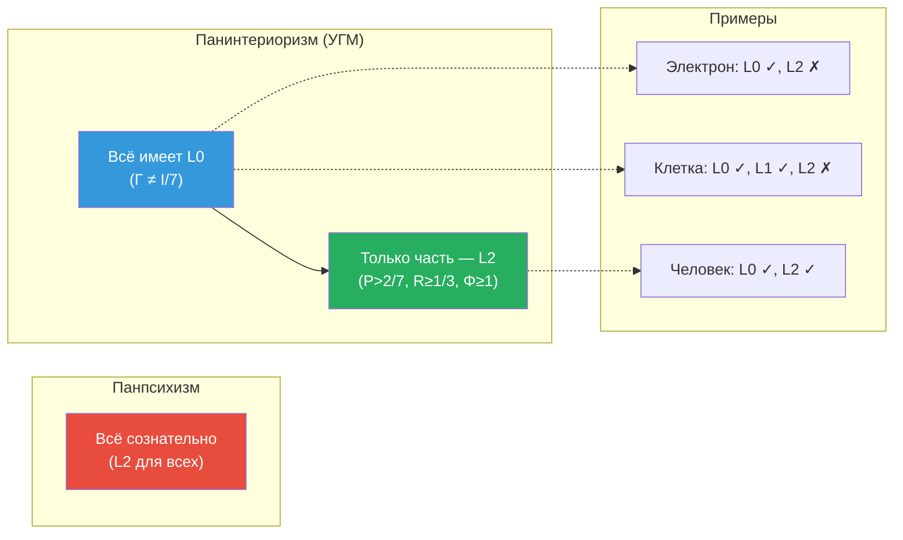
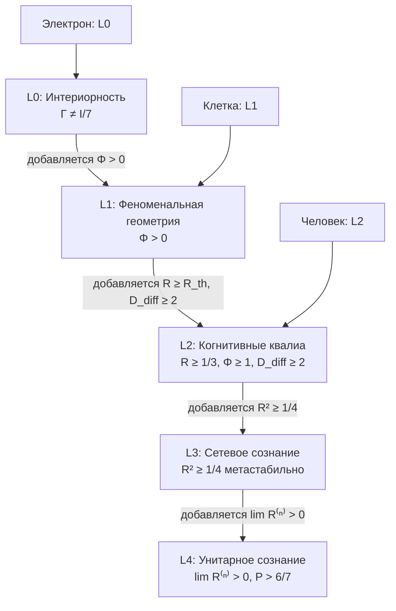

# Панпсихизм: Категорный Анализ

:::note О нотации
В этом документе:
- $\Gamma$ — [матрица когерентности](/docs/core/dynamics/coherence-matrix)
- $\varphi$ — [оператор самомоделирования](/docs/proofs/categorical/formalization-phi)
- $C$ — [мера сознательности](/docs/consciousness/foundations/self-observation#мера-сознательности-c)
- $\Phi$ — [мера интеграции](/docs/core/structure/dimension-u#мера-интеграции-φ)
- $R$ — [мера рефлексии](/docs/consciousness/foundations/self-observation#мера-рефлексии-r)
- $\rho_E$ — редуцированная матрица плотности [измерения Интериорности](/docs/core/structure/dimension-e)
- L0, L1, L2, L3, L4 — [уровни интериорности](/docs/consciousness/hierarchy/interiority-hierarchy)
- $\mathbf{Hol}$ — [категория Голономов](/docs/proofs/categorical/categorical-formalism)
:::

## Страсбургская проблема: откуда берётся сознание? {#страсбургская-проблема}

В 1994 году в Страсбурге, на конференции *Toward a Science of Consciousness*, Дэвид Чалмерс задал вопрос, расколовший науку о сознании на два лагеря: **почему физические процессы сопровождаются субъективным опытом?** Почему не может существовать «зомби» — существо, физически идентичное человеку, но лишённое внутренних переживаний?

Этот вопрос — «трудная проблема сознания» (the hard problem) — породил три стратегии ответа:

1. **Элиминативизм** (Деннет): проблемы нет, субъективный опыт — иллюзия
2. **Эмерджентизм** (IIT, GWT): сознание возникает из сложности
3. **Панпсихизм**: сознание фундаментально — оно **всегда было**

Панпсихизм — самая радикальная и самая древняя из этих стратегий. Его идея предельно проста: если сознание не может возникнуть из несознательной материи (ибо непонятен механизм), значит, сознание — **фундаментальное свойство**, присущее всей материи с самого начала. Электрон обладает массой, зарядом, спином — и, возможно, каким-то элементарным «внутренним опытом».

Привлекательность этой позиции — в обходе трудной проблемы. Если сознание фундаментально, не нужно объяснять, как оно «возникает» из физики. Проблема, однако, смещается: если электрон обладает опытом, как опыт электрона **комбинируется** с опытом других электронов в единый человеческий опыт? Это **проблема комбинации** — главное затруднение панпсихизма.

---

## Определение панпсихизма

**Панпсихизм** (от греч. πᾶν — всё, ψυχή — душа) — метафизическая позиция:

$$
\forall X \in \mathrm{Ob}(\mathbf{Phys}) : \mathrm{Consciousness}(X) \neq \varnothing
$$

где $\mathbf{Phys}$ — категория физических объектов.

На обычном языке: **каждый** физический объект обладает хотя бы минимальной формой сознания или протосознания. Камень, атом, термостат — все «что-то переживают».

Но этот простой тезис распадается на множество несовместимых позиций: что именно означает «сознание»? Полноценный опыт (как у человека) или нечто минимальное? И как минимальное становится полноценным? Далее мы рассмотрим основные варианты.

---

## Варианты панпсихизма

### 1. Элиминативный панпсихизм (Strawson) {#элиминативный}

**Гэлен Строусон** (р. 1952, сын философа П.Ф. Строусона) в статье *Realistic Monism: Why Physicalism Entails Panpsychism* (2006) предложил радикальный аргумент: если физикализм истинен и сознание реально, то сознание должно быть свойством материи на фундаментальном уровне. Строусон отвергает эмерджентизм как «магию» — по его мнению, подлинно новое качество не может возникнуть из того, что этим качеством не обладает.

**Утверждение:** Всё обладает сознанием **в полном смысле** (L2 в терминологии КК).

**Категория $\mathbf{Pan}_{\mathrm{elim}}$:**

$$
\mathrm{Ob}(\mathbf{Pan}_{\mathrm{elim}}) := \{X \mid C(X) > 0\}
$$

где $C$ — [мера сознательности](/docs/consciousness/foundations/self-observation#мера-сознательности-c).

**Критика из УГМ — формальное опровержение:**

$$
\exists X : \Gamma_X = I/7 \Rightarrow C(X) = 0
$$

Максимально смешанное состояние ($\Gamma = I/7$ — равновероятная суперпозиция всех 7 измерений) имеет **нулевую** сознательность. Это не философский аргумент, а **математический факт**: для $\Gamma = I/7$ чистота $P = 1/7$ < $P_{\text{crit}} = 2/7$, рефлексия $R = 0$, интеграция $\Phi = 0$. Все пороги нарушены. Система с $\Gamma = I/7$ — это **максимальный хаос**, в котором невозможна ни когерентность, ни интеграция, ни самомоделирование.

**Вывод:** Элиминативный панпсихизм **противоречит** формализму УГМ. Существуют системы с нулевой сознательностью. Не всё обладает опытом. **[Т]**

### 2. Конститутивный панпсихизм (Goff, Chalmers) {#конститутивный}

**Филип Гофф** (р. 1977, Даремский университет) и **Дэвид Чалмерс** (р. 1966, NYU) представляют более утончённую позицию: микро-субъекты (элементарные носители протоопыта) **комбинируются** в макро-сознание. Гофф изложил это в книге *Galileo's Error: Foundations for a New Science of Consciousness* (2019).

**Утверждение:** Существуют микро-субъекты, и их комбинация порождает макро-сознание.

**Категория $\mathbf{Pan}_{\mathrm{const}}$:**

$$
\mathrm{Ob}(\mathbf{Pan}_{\mathrm{const}}) := \{(\{X_i\}, \oplus) \mid X_i \text{ — микро-субъект}, \oplus \text{ — операция комбинации}\}
$$

**Проблема комбинации (combination problem):**

Центральная трудность конститутивного панпсихизма: нет определения операции $\oplus$ такого, что:

$$
C(X_1 \oplus X_2) = f(C(X_1), C(X_2))
$$

для какой-либо функции $f$. Почему? Потому что опыт целого **не сводится** к функции опытов частей. Вы видите красное яблоко — но ваш опыт «красного яблока» не есть сумма опыта нейрона-1 и опыта нейрона-2. Между индивидуальными протоопытами и единым макроопытом — **провал**, который никто не заполнил.

**Подход УГМ к проблеме комбинации:**

УГМ предлагает конкретный механизм:

$$
\mathbb{H}_{1 \otimes 2} := (\Gamma_1 \otimes \Gamma_2, \varphi_{12})
$$

Операция — **тензорное произведение** с условием достаточной [интеграции](/docs/core/structure/dimension-u#мера-интеграции-φ):

$$
\Phi_{12} > \Phi_{\min} \Rightarrow C(\mathbb{H}_{12}) \neq f(C(\mathbb{H}_1), C(\mathbb{H}_2))
$$

[Эмерджентность](/docs/applied/coherence-cybernetics/theorems#теорема-93-эмерджентность) [Т] — следствие нелинейности и примитивности (Sol.56).

:::warning Статус: математическая корреляция, не философское решение
УГМ даёт **условие** для эмерджентности ($\Phi_{12} > \Phi_{\min}$), но не объясняет **конституцию** — *как* именно микро-переживания объединяются в единое переживание. Это математическая переформулировка проблемы, не её решение в философском смысле.
:::

#### Теорема (Категорная нередуцируемость интегрированного опыта) [Т] {#теорема-нередуцируемость}

:::tip Теорема [Т]
Функтор $F: (\mathbf{Hol}, \otimes) \to (\mathbf{Exp}, \boxtimes)$ является **колакс-моноидальным, но не моноидальным** при $\Phi_{12} > 1$. Конкретно: когерентностная карта $\mu: F(\Gamma_1 \otimes \Gamma_2) \to F(\Gamma_1) \boxtimes F(\Gamma_2)$ **необратима** при $\Phi_{12} > 1$.
:::

**Что это значит простым языком.** Если два голонома достаточно интегрированы ($\Phi_{12} > 1$), то опыт целого **невозможно восстановить** из опытов частей. Информация о целостном переживании **теряется** при разложении на части. Это **математический** аналог интуиции: ваш опыт «красного яблока» — не сумма опытов отдельных нейронов.

**Доказательство.**

**(a)** По определению $F$, опыт композита $F(\Gamma_1 \otimes \Gamma_2) = (s_{12}, q_{12}, c_{12})$ определяется спектром, качествами и контекстом **совместной** матрицы $\Gamma_1 \otimes \Gamma_2$.

**(b)** Произведение опытов $F(\Gamma_1) \boxtimes F(\Gamma_2) = (s_1 \otimes s_2, q_1 \times q_2, (c_1, c_2))$ — покомпонентное произведение.

**(c)** **Несовпадение спектров.** Спектр $\Gamma_1 \otimes \Gamma_2$ при наличии квантовых корреляций ($\Phi_{12} > 1$) **не факторизуется**: $\mathrm{spec}(\Gamma_1 \otimes \Gamma_2) \neq \mathrm{spec}(\Gamma_1) \otimes \mathrm{spec}(\Gamma_2)$. Это стандартное свойство запутанных состояний (Шмидтовское разложение [Т]).

**(d)** **Необратимость.** Проекция $\mu$ (частичный след) теряет информацию о корреляциях. При $\Phi_{12} > 1$ потеря строго положительна: $\Phi_{12} > 1 \Rightarrow P_{\text{coh}}^{(12)} > P_{\text{diag}}^{(12)}$ (T-129 [Т]).

**(e)** **Колакс-моноидальность.** Существование необратимой проекции $\mu$ делает $F$ **колакс-моноидальным функтором**. При $\Phi_{12} < 1$ проекция обратима — $F$ локально моноидален. $\blacksquare$

**Категорная формулировка проблемы комбинации:** Проблема комбинации = вопрос «является ли $F$ строго моноидальным?». УГМ даёт точный ответ: **нет при $\Phi > 1$** [Т]. Интегрированный опыт несводим к произведению опытов частей.

:::info Что решено и что остаётся
- **Решено [Т]:** Эмерджентность как необратимость когерентностной карты $\mu$
- **Решено [Т]:** Порог эмерджентности: $\Phi_{12} = 1$ (T-129a [Т])
- **Открыто [П]:** Конститутивный механизм: *как именно* несводимость спектра **переживается** как единый опыт. Это аналог hard problem — УГМ формализует *условие* эмерджентности, не *содержание* объединённого переживания.
:::

### 3. Панпротопсихизм (Chalmers)

**Чалмерс** (2010, *The Character of Consciousness*) предложил смягчённую версию: всё обладает не «опытом», а «прото-ментальными» свойствами — чем-то, что само по себе не является сознанием, но при правильной комбинации порождает его.

**Аналогия:** H₂O. Ни водород, ни кислород по отдельности не мокрые. Но их комбинация — мокрая. «Протомокрость» водорода + «протомокрость» кислорода → мокрость воды. Аналогично: «протоопыт» электрона + «протоопыт» другого электрона + правильная комбинация → человеческий опыт.

**Категория $\mathbf{Pan}_{\mathrm{proto}}$:**

$$
\mathrm{Ob}(\mathbf{Pan}_{\mathrm{proto}}) := \{X \mid \mathrm{Int}(X) \neq \varnothing, C(X) = 0\}
$$

**Соответствие в УГМ — уровень L0:**

$$
\mathrm{L0}(\Gamma) := \Gamma \neq I/7 \quad \text{(интериорность)}
$$

$$
\mathbf{Pan}_{\mathrm{proto}} \cong \mathrm{L0} \setminus \mathrm{L2}
$$

L0 — **точный** формальный аналог панпротопсихизма. Система на уровне L0 обладает «чем-то внутренним» ($\Gamma \neq I/7$), но не сознанием ($C = 0$, поскольку пороги L2 не выполнены).

### 4. Расселианский монизм (Russell, Strawson) {#расселианский}

**Бертран Рассел** в *The Analysis of Matter* (1927) указал на фундаментальный пробел в физике: она описывает только **структурные** свойства материи (массу, заряд, спин), определённые через отношения с другими объектами. Но что наполняет эту структуру **изнутри**? Физика молчит. Рассел предположил: внутренняя природа материи может быть ментальной.

**Категория Рассела ($\mathbf{Russell}$):**

$$
\mathrm{Ob}(\mathbf{Russell}) := \{(S_{\mathrm{ext}}, I_{\mathrm{int}}) \mid S \text{ — структура}, I \text{ — интринсик}\}
$$

**Соответствие в УГМ:**

| Рассел | УГМ | Комментарий |
|--------|-----|-------------|
| $S_{\mathrm{ext}}$ (структурные свойства) | Гамильтониан $H$, операторы Линдблада $\{L_k\}$ | Физические законы = структура |
| $I_{\mathrm{int}}$ (внутренняя природа) | [E-проекция](/docs/core/structure/dimension-e) $\rho_E$ | Интериорность = intrinsic |

**Функтор:**

$$
F_{\mathrm{Russell}}: \mathbf{Russell} \to \mathbf{Hol}, \quad (S, I) \mapsto (\Gamma, \varphi)
$$

где $\Gamma$ конструируется из $S$ и $I$. Расселианский монизм — **наиболее близкая** к [двуаспектному монизму](/docs/consciousness/foundations/two-aspect-monism) УГМ метафизическая позиция.

---

## Позиция УГМ: Панинтериоризм {#панинтериоризм}

### Определение

УГМ не принимает ни одну из форм панпсихизма. Вместо этого она предлагает **панинтериоризм** — позицию, согласно которой **все** системы с $\Gamma \neq I/7$ обладают интериорностью (L0), но **не все** обладают сознанием (L2).

:::warning Ключевое различие
УГМ утверждает **панинтериоризм**, а не панпсихизм:

$$
\forall \Gamma \neq I/7 : \mathrm{L0}(\Gamma) = \mathrm{true}
$$

Но **не**:

$$
\forall \Gamma : \mathrm{L2}(\Gamma) = \mathrm{true}
$$
:::

```mermaid
graph LR
    subgraph "Панпсихизм"
        direction TB
        ALL_CONS["Всё сознательно<br/>(L2 для всех)"]
    end

    subgraph "Панинтериоризм (УГМ)"
        direction TB
        ALL_L0["Всё имеет L0<br/>(Γ ≠ I/7)"]
        SOME_L2["Только часть — L2<br/>(P>2/7, R≥1/3, Φ≥1)"]
        ALL_L0 --> SOME_L2
    end

    subgraph "Примеры"
        ELEC["Электрон: L0 ✓, L2 ✗"]
        CELL["Клетка: L0 ✓, L1 ✓, L2 ✗"]
        HUMAN["Человек: L0 ✓, L2 ✓"]
    end

    ALL_L0 -.-> ELEC
    ALL_L0 -.-> CELL
    SOME_L2 -.-> HUMAN

    style ALL_CONS fill:#e74c3c,color:#fff
    style ALL_L0 fill:#3498db,color:#fff
    style SOME_L2 fill:#27ae60,color:#fff
```

### Теорема (Панинтериоризм $\neq$ Панпсихизм)

$$
\mathrm{L0}(\Gamma) \not\Rightarrow \mathrm{L2}(\Gamma)
$$

**Доказательство:**

L2 требует $R \geq R_{\text{th}} = 1/3$ [Т], $\Phi \geq \Phi_{\text{th}} = 1$ [Т] (T-129) и $D_{\text{diff}} \geq 2$ [Т] (T-151) ([пороги L2](/docs/core/foundations/axiom-septicity#пороги-l2-строгий-вывод)).

Для [фундаментальной моды Γ](/docs/reference/glossary#таксономия-конфигураций-γ) (например, электрона):

$$
R(\Gamma_e) \approx 0, \quad \Phi(\Gamma_e) \ll 1
$$

Следовательно, $\mathrm{L0}(\Gamma_e) = \mathrm{true}$, но $\mathrm{L2}(\Gamma_e) = \mathrm{false}$. $\blacksquare$

### Иерархия уровней интериорности

```mermaid
graph TD
    L0[L0: Интериорность<br/>Γ ≠ I/7]
    L1[L1: Феноменальная геометрия<br/>Φ > 0]
    L2[L2: Когнитивные квалиа<br/>R ≥ 1/3, Φ ≥ 1, D_diff ≥ 2]
    L3[L3: Сетевое сознание<br/>R² ≥ 1/4 метастабильно]
    L4[L4: Унитарное сознание<br/>lim R⁽ⁿ⁾ > 0, P > 6/7]

    L0 -->|"добавляется Φ > 0"| L1
    L1 -->|"добавляется R ≥ R_th, D_diff ≥ 2"| L2
    L2 -->|"добавляется R² ≥ 1/4"| L3
    L3 -->|"добавляется lim R⁽ⁿ⁾ > 0"| L4

    ELEC[Электрон: L0] --> L0
    CELL[Клетка: L1] --> L1
    HUMAN[Человек: L2] --> L2
```

---

## Сознательный реализм Хоффмана {#хоффман}

### Биография и интеллектуальная траектория

**Дональд Д. Хоффман** (р. 1955) — профессор когнитивных наук, философии и логики Калифорнийского университета в Ирвайне (UC Irvine). Начал карьеру с классической психофизики зрительного восприятия: его ранние работы (1980–2000-е) посвящены вычислительному моделированию восприятия формы, цвета и объектов.

Поворотный момент — осознание парадокса: если эволюция формирует восприятие, почему восприятие должно быть **истинным**? Совместно с Чайтаньей Пракашем и Маникандой Сингхом Хоффман формализовал этот вопрос в **теореме «Fitness Beats Truth»** (2009–2015), показав через эволюционные игровые модели, что организмы, воспринимающие «интерфейс» (сжатое адаптивное представление), систематически побеждают организмов с «истинным» восприятием.

Из этого результата Хоффман пришёл к радикальной онтологической позиции: пространство-время — не объективная реальность, а **пользовательский интерфейс** сознательных агентов.

:::warning Важная классификация
Хоффман **сам** отвергает ярлык «панпсихист». Его позиция — **объективный идеализм** (Conscious Realism): сознательные агенты — единственная фундаментальная реальность, а физический мир — производная их взаимодействий. Это ближе к Лейбницу (монадология) или Беркли, чем к Строусону или Гоффу.
:::

### Теорема «Fitness Beats Truth» (FBT) {#fbt}

**Утверждение** (Hoffman, Singh, Prakash 2015): В эволюционных играх (формализм Мейнарда-Смита) на типичных ландшафтах приспособленности организмы со стратегией «интерфейс» (сжатие: много состояний мира → одна категория восприятия) побеждают организмов с «истинным восприятием» (изоморфизм $W \to X$).

**Простым языком.** Вообразите два организма в лесу. Первый видит мир «как есть» — различает 1000 оттенков зелёного у листвы. Второй сжимает: все съедобные — зелёные, все ядовитые — красные. Второй быстрее принимает решения и тратит меньше ресурсов на вычисление. Эволюция отбирает по **выживанию**, а не по **истинности**. Отсюда: наше восприятие пространства-времени — адаптивный интерфейс, не карта реальности.

:::note Связь с КК
КК допускает аналогичную интерпретацию [И]: восприятие агентом $\mathbb{H}$ своей среды $E$ опосредовано [функтором $F$](/docs/proofs/categorical/categorical-formalism#3-функтор-f-на-объектах), который не обязан быть точным — достаточно функциональной адекватности. Но КК не постулирует иллюзорность пространства-времени: оно [эмерджентно](/docs/core/foundations/spacetime), а не интерфейсно.
:::

### Полный формализм: сознательный агент

**Определение (Hoffman, Prakash 2014).** Сознательный агент (CA) — это шестёрка:

$$
C = (X, G, A, W, D, N)
$$

| Компонент | Описание | Пример |
|-----------|----------|--------|
| $X$ (опыт) | Все возможные переживания агента | Цвета, звуки, эмоции |
| $G$ (действия) | Все доступные действия | Движения, решения |
| $A: G \times W \to W$ | Действие $g$ в мире $w$ → новое состояние мира | Нажатие кнопки меняет экран |
| $W$ (мир) | Состояния мира (может быть другим агентом!) | Окружающая среда |
| $D: X \times G \to G$ | Переживание → решение (выбор действия) | Видишь опасность → бежишь |
| $N: W \times X \to X$ | Состояние мира → переживание | Фотоны → «красное» |

Ключевая идея: $W$ не обязан быть «физическим миром». Для двух агентов $C_1$ и $C_2$ миром каждого является **другой агент**. Физическое пространство-время — **эмерджентный интерфейс** сети взаимодействующих агентов.

### Композиция сознательных агентов {#композиция-ca}

**Теорема замыкания** (Hoffman, Prakash 2014): Для любых двух CA $C_1$ и $C_2$ их взаимодействие образует нового CA: $C_1 \otimes C_2 = C_{12}$.

Это означает, что **ConsAgents** — моноидальная категория. Хоффман интерпретирует это как принцип «сознательные агенты — всё, что есть».

:::note Параллель с КК
В КК [теорема 9.1](/docs/applied/coherence-cybernetics/theorems#теорема-91-фрактальное-замыкание) (фрактальное замыкание) даёт аналогичный результат: $\mathbb{H}_1 \otimes \mathbb{H}_2$ — снова голоном, при условии достаточной интеграции $\Phi_{12} > 1$. Но в КК замыкание **доказано строго** и имеет **количественный порог**, тогда как у Хоффмана замыкание постулируется аксиоматически.
:::

### Позиция КК: панинтериоризм vs объективный идеализм {#панинтериоризм-vs-идеализм}

Хоффман и КК расходятся в ключевом онтологическом вопросе:

| | Хоффман (Conscious Realism) | КК (Панинтериоризм) |
|---|---|---|
| **Что фундаментально?** | Только сознательные агенты | Голономы $\mathbb{H}$ на всех уровнях L0–L4 |
| **Есть ли несознательная реальность?** | Нет — всё сводится к CA | Да — L0 (интериорность) без сознания (L2) |
| **Отношение L0 и L2** | L0 = L2 (всё сознательно) | L0 $\supsetneq$ L2 строго [Т] |
| **Физический мир** | Иллюзия (интерфейс) | Эмерджентен (реален, но производен) |
| **Порог сознания** | Нет порога (всё — CA) | $P > 2/7 \wedge R \geq 1/3 \wedge \Phi \geq 1 \wedge D \geq 2$ [Т] |
| **Динамика** | Цикл $N \to D \to A$ (дискретный) | $\dot\Gamma = \mathcal{L}_\Omega[\Gamma]$ (непрерывное) |
| **Фальсифицируемость** | Низкая (нет количественных предсказаний) | Высокая (22+ предсказаний) |

### Функтор $F_{\text{Hoffman}}$ (гипотеза) [И] {#функтор-хоффман}

**Конструкция функтора** $F_{\text{Hoffman}}: \mathbf{Hol}_{\text{L2}} \to \mathbf{ConsAgents}$:

| Компонент CA | Соответствие в КК |
|--------------|-------------------|
| $X$ (опыт) | [Экспериенциальное пространство](/docs/proofs/categorical/categorical-formalism#2-категория-exp) |
| $G$ (действия) | Пространство CPTP-каналов $\{\Psi\}$ |
| $N$ (восприятие) | [Функтор $F$](/docs/proofs/categorical/categorical-formalism#3-функтор-f-на-объектах) |
| $D$ (решение) | [Оператор $\varphi$](/docs/proofs/categorical/formalization-phi) |
| $A$ (действие) | [Регенеративный член](/docs/core/dynamics/evolution#3-регенеративный-член) $\mathcal{R}[\Gamma, E]$ |
| $W$ (мир) | Окружение $E$ в $\mathbb{H}$ |

:::info Статус [И]
Функтор $F_{\text{Hoffman}}$ — **интерпретационная гипотеза**. Для полного доказательства эквивалентности необходимо показать полноту, верность и совместимость с композицией. Это **программа исследований**.
:::

### Что Хоффман делает лучше КК {#преимущества-хоффмана}

1. **Эволюционная эпистемология.** FBT — строго доказанная теорема, дающая глубокое основание для скептицизма относительно наивного реализма. КК не имеет аналога этого результата.

2. **Доступность изложения.** «The Case Against Reality» (2019) — бестселлер; TED-talk с 3M+ просмотров. КК пока доступна только специалистам.

3. **Радикальность вопроса.** Хоффман ставит вопрос «что, если пространство-время — не реальность?» с максимальной остротой.

4. **Математическая элегантность.** Шестикомпонентная CA — минимальна и удобна для комбинаторики.

---

## Сравнительная таблица вариантов панпсихизма

| Вариант | Автор | Год | Утверждение | Соответствие в УГМ | Главная проблема |
|---------|-------|-----|-------------|-------------------|-----------------|
| Элиминативный | Строусон | 2006 | Всё сознательно (L2) | — | Противоречит $\Gamma = I/7 \Rightarrow C = 0$ [Т] |
| Конститутивный | Гофф, Чалмерс | 2010/2019 | Микро-субъекты комбинируются | $\mathbb{H}_1 \otimes \mathbb{H}_2$ | Проблема комбинации (переформулирована, не решена) |
| Панпротопсихизм | Чалмерс | 2010 | Прото-ментальные свойства | L0 — интериорность | Нет механизма перехода L0→L2 |
| Расселианский | Рассел, Чалмерс, Гофф | 1927/2010 | Интринсик + структура | $\rho_E$ + $(H, \{L_k\})$ | Нет динамики |
| Obj. идеализм | Хоффман | 2014 | Только CA, физика — интерфейс | Функтор [И] | Нет порогов, низкая фальсифицируемость |
| **Панинтериоризм (УГМ)** | — | — | Всё имеет L0, не всё — L2 | $\mathrm{L0} \supsetneq \mathrm{L2}$ | Интериорность — примитив; не объясняет, *почему* она существует |

---

**Связанные документы:**
- [Когнитом Анохина](./cognitome-anokhin) — нейронная гиперсеть и проблема «Кто»
- [Теории сознания](./consciousness-theories) — IIT, FEP, автопоэзис и 30+ теорий
- [Когнитивная иерархия](./cognitive-hierarchy) — уровни K1-K5
- [Общая теория систем](./general-systems-theory) — от Берталанфи к КК
- [Иерархия интериорности](/docs/consciousness/hierarchy/interiority-hierarchy) — уровни L0→L4
- [Двуаспектный монизм](/docs/consciousness/foundations/two-aspect-monism) — онтология УГМ
- [Теоремы](/docs/applied/coherence-cybernetics/theorems) — эмерджентность, композиция
- [Категорный формализм](/docs/proofs/categorical/categorical-formalism) — категория $\mathbf{Hol}$, функтор $F$
- [Формализация φ](/docs/proofs/categorical/formalization-phi) — CPTP-каналы
- [Глоссарий](/docs/reference/glossary#связанные-теории) — сознательный реализм
