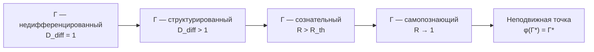

# Смысл Существования

:::note О нотации
В этом документе:
- $\Gamma$ — [матрица когерентности](/docs/core/dynamics/coherence-matrix)
- $P = \mathrm{Tr}(\Gamma^2)$ — [чистота](/docs/core/dynamics/viability)
- $\Phi$ — [мера интеграции](/docs/core/structure/dimension-u#мера-интеграции-φ)
- $R$ — [мера рефлексии](/docs/consciousness/foundations/self-observation#мера-рефлексии-r)
- $D_{\text{diff}}$ — [мера дифференциации](/docs/consciousness/foundations/self-observation#мера-сознательности-c)
- $\Gamma^*$ — [неподвижная точка](/docs/consciousness/foundations/self-observation#теорема-о-неподвижной-точке) оператора $\varphi$
:::

:::warning Статус раздела: Философская интерпретация
Утверждения о «смысле» — **не теоремы**, а экстраполяции формализма на традиционные философские вопросы. Все результаты имеют статус **[И]**, если не указано иное.
:::

## Смысл как направление в Γ-пространстве

### Определение смысла [О] {#определение-смысла}

**Смысл** для системы $\Gamma$ — это направление в пространстве $\mathcal{D}(\mathcal{H})$, максимизирующее устойчивый рост чистоты:

$$
\vec{s}(\Gamma) := \arg\max_{\|\delta\Gamma\|_F = 1} \int_0^{T} \frac{dP(\Gamma + t\,\delta\Gamma)}{dt}\, dt
$$

**Утрата смысла** — состояние, при котором $\vec{s}(\Gamma) \approx 0$ (нет направления, увеличивающего $P$) или $P \approx P_{\text{crit}}$ (все направления ведут к декогеренции).

### Утверждение (Смысл и O-измерение) [И]

Переживание «глубокого смысла» коррелирует с высокой когерентностью $\gamma_{OE}$ и $\gamma_{OU}$ — связью опыта и единства с [измерением Основания](/docs/core/structure/dimension-o):

$$
\text{«Осмысленность»} \sim |\gamma_{OE}| \cdot |\gamma_{OU}|
$$

Экзистенциальный кризис ($\gamma_{OE} \to 0$) — потеря связи опыта с источником. См. [патология сознания](/docs/consciousness/states/pathological).

## Смысл индивидуального существования

В УГМ смысл **не «дан» извне** и **не «придуман» субъектом**. Смысл — **структура самой $\Gamma$**. Смысл каждого [Голонома](/docs/core/structure/holon) — **реализовать свою природу** **[И]**.

### Пиковый потенциал [И] {#пиковый-потенциал}

$$
\text{Meaning}_{\text{peak}}(\mathbb{H}) = \max_\tau \left[ P(\Gamma_\tau) \cdot D_{\text{diff}}(\Gamma_\tau) \cdot \Phi(\Gamma_\tau) \cdot R(\Gamma_\tau) \right]
$$

:::note Почему произведение?
Мультипликативная форма: каждый множитель **необходим** — если хотя бы один равен нулю, осмысленность обнуляется. Целостность без осознанности ($R = 0$) или осознанность без связности ($\Phi = 0$) не составляют полноценного смысла. Альтернативы (взвешенная сумма, минимум) не обладают этим свойством.
:::

### Четыре аспекта осмысленной жизни [И]

| Аспект | Мера | Практика |
|--------|------|----------|
| **Целостность** | $P$ | Самосохранение, здоровье |
| **Богатство** | $D_{\text{diff}}$ | Развитие, разнообразие опыта |
| **Связность** | $\Phi$ | Отношения, любовь |
| **Осознанность** | $R$ | Рефлексия, самопознание |

:::note О нотации
$D_{\text{diff}}$ — мера **дифференциации**. Не путать с измерением **Динамики** $D$.
:::

### Накопленный смысл [И] {#накопленный-смысл}

Полный смысл жизни — **накопленная осознанная целостность** за время существования:

$$
\text{Meaning}_{\text{total}}(\mathbb{H}) = \int_0^{\tau_{\text{life}}} P(\tau) \cdot D_{\text{diff}}(\tau) \cdot \Phi(\tau) \cdot R(\tau) \, d\tau
$$

:::note Две меры смысла
- $\text{Meaning}_{\text{peak}}$ — максимальный достигнутый уровень («насколько глубоко я жил?»)
- $\text{Meaning}_{\text{total}}$ — накопленный смысл за время жизни («насколько полно я жил?»)
:::

## Смысл Вселенной

Смысл Вселенной — **познать себя** через бесконечное развёртывание форм **[И]**:

$$
\Gamma \xrightarrow{\text{эволюция}} \varphi(\Gamma) \approx \Gamma^*
$$

Вселенная движется к неподвижной точке $\Gamma^*$, где самомодель совпадает с реальностью — к **полному самопознанию**.

### Почему вообще что-то существует?

См. [Происхождение Вселенной](/docs/physics/cosmology-phys/origin#почему-вообще-что-то-есть) — $\Gamma$ существует, потому что **самосогласованность требует существования**.

## Телеология без телеологии

Система не «стремится» к цели в смысле сознательного намерения. Но структура [динамики](/docs/core/dynamics/evolution) такова, что эволюция **направлена**:

$$
\frac{dD_{\text{diff}}}{d\tau} > 0, \quad \frac{d\Phi}{d\tau} \geq 0
$$

:::warning Статус: Телеологическое допущение [И]
Утверждение $dD_{\text{diff}}/d\tau > 0$ — [нефальсифицируемое допущение](/docs/physics/cosmology-phys/origin#эволюция-от-источника): любое наблюдаемое уменьшение дифференциации можно интерпретировать как локальное явление на фоне глобального роста.
:::

Это не «план», а **следствие законов** — подобно тому, как река «стремится» к морю без сознательного намерения.

## Имманентность цели

В УГМ цель **не задаётся извне** — она **имманентна** самой структуре $\Gamma$.

:::note Согласование с духовным опытом [И]
Это не отрицает духовный опыт «призвания» или «высшей цели». Такой опыт **реален** — это доступ к глубинной структуре $\Gamma$, где «внешнее» и «внутреннее» совпадают.

Если существует то, что традиции называют «Богом» или «Высшим», оно — не «внешний законодатель», а **сама целостность $\Gamma$**, проявляющаяся через каждый Голоном. См. [Принцип имманентности](/docs/core/foundations/consequences#принцип-имманентности).
:::

**Следствия (интерпретация):**
- «Божественная воля» $\approx$ структура аттракторов $\Gamma^*$
- «Судьба» $\approx$ траектория эволюции к $\Gamma^*$ при данных начальных условиях
- «Свобода воли» $\approx$ [выбор между траекториями](/docs/consciousness/ethics-meaning/freedom) в бифуркационных точках

## Практическое следствие

> Жить осмысленно = жить в соответствии со своей структурой, увеличивая когерентность и богатство опыта.

1. **Поддерживать $P$** — заботиться о здоровье, целостности, [жизнеспособности](/docs/core/dynamics/viability)
2. **Увеличивать $D_{\text{diff}}$** — развиваться, учиться, расширять репертуар состояний
3. **Углублять $\Phi$** — строить связи, любить, интегрировать
4. **Совершенствовать $R$** — познавать себя, приближаться к $\Gamma^*$

---

**Связанные документы:**
- [Эстетическое сознание](/docs/consciousness/ethics-meaning/value-consciousness) — красота и ценности из Γ
- [Свобода воли](/docs/consciousness/ethics-meaning/freedom) — выбор траектории к T
- [Смерть и непрерывность](/docs/consciousness/ethics-meaning/death-continuity) — что происходит при $P \to 0$
- [Самонаблюдение](/docs/consciousness/foundations/self-observation) — меры $R$ и $D_{\text{diff}}$
- [Жизнеспособность](/docs/core/dynamics/viability) — мера $P$ и условия существования
- [Измерение Единства](/docs/core/structure/dimension-u) — мера интеграции $\Phi$
- [Происхождение Вселенной](/docs/physics/cosmology-phys/origin) — космогенез и $\Gamma_{\odot}$
