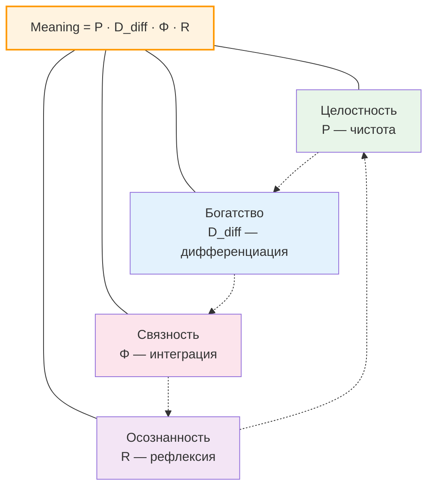
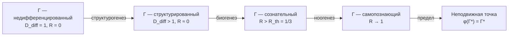

# Смысл Существования

> *«Есть лишь одна по-настоящему серьёзная философская проблема — проблема самоубийства. Решить, стоит или не стоит жизнь того, чтобы её прожить, — значит ответить на фундаментальный вопрос философии.»*
> — Альбер Камю, «Миф о Сизифе» (1942)

:::info Мост из предыдущей главы
В [Этике УГМ](/docs/consciousness/ethics-meaning/value-consciousness) мы определили **благо** ($dP/d\tau > 0$) и показали, что этика выводится из формализма. Но благо отвечает на вопрос «что хорошо?», а не на вопрос «зачем?». Теперь мы задаём самый глубокий вопрос: имеет ли существование **смысл** — и если да, можно ли его вычислить?
:::

---

## Часть 0. Исторический контекст: от Экклезиаста до Франкла

Вопрос о смысле — не академический. Он решает, стоит ли жить. Прежде чем формализовать его, проследим, как человечество отвечало на него на протяжении тысячелетий.

### Экклезиаст: «Суета сует»

*«Суета сует, сказал Экклезиаст, суета сует, — всё суета!»* (Еккл. 1:2). Одна из древнейших формулировок бессмысленности: всё повторяется, ничто не ново, всё забудется. В терминах УГМ: Экклезиаст описывает мир, в котором $\vec{s}(\Gamma) \approx 0$ — нет устойчивого направления роста.

### Экзистенциализм: от Кьеркегора до Камю

**Кьеркегор** (1813-1855) первым поставил вопрос ребром: смысл — не данность, а **выбор**. Его «прыжок веры» — решение поверить в смысл вопреки абсурду. В терминах УГМ: Кьеркегор предлагает **волевое назначение** $\vec{s}(\Gamma)$, а не его обнаружение.

**Ницше** (1844-1900) объявил «смерть Бога» и увидел в этом **возможность**: если смысл не дан сверху, человек может создать его сам. «Сверхчеловек» — тот, кто создаёт собственные ценности. В терминах УГМ: Ницше говорит о системе с высоким $R$ (рефлексией), способной **самостоятельно определять** $\vec{s}(\Gamma)$.

**Хайдеггер** (1889-1976) в «Бытии и времени» показал: человеческое существование (Dasein) **всегда уже** осмыслено — не потому, что ему придан смысл, а потому, что оно структурировано заботой (Sorge). В терминах УГМ: $\vec{s}(\Gamma) \neq 0$ для любой L2-системы — забота = $dP/d\tau > 0$.

**Сартр** (1905-1980) формулирует: «Существование предшествует сущности». Нет заданной природы — вы сначала существуете, потом **определяете** себя. В терминах УГМ: $\Gamma$ эволюционирует, и её «сущность» ($\Gamma^*$ — неподвижная точка) **формируется** в процессе, а не задаётся заранее.

**Камю** (1913-1960) доводит до предела: мир абсурден, смысла нет, и всё же «надо представить себе Сизифа счастливым». Камю отвергает и самоубийство, и «прыжок веры» — остаётся **бунт**: жить, зная, что смысла нет. В терминах УГМ: Камю описывает систему с высоким $R$, осознающую $\vec{s} \approx 0$, но поддерживающую $P > P_{\text{crit}}$.

### Франкл: логотерапия

**Виктор Франкл** (1905-1997), переживший Освенцим, создал логотерапию — «терапию смыслом». Его центральный тезис: *«Кто имеет зачем жить, может вынести почти любое как»* (цитируя Ницше). Франкл выделил три источника смысла:

1. **Творчество** — то, что мы даём миру ($D_{\text{diff}} \uparrow$)
2. **Переживание** — то, что мы берём от мира ($\Phi \uparrow$, $\gamma_{OE} \uparrow$)
3. **Установка** — отношение к неизбежному страданию ($R \uparrow$)

Замечательно, что три источника Франкла соответствуют трём из четырёх множителей формулы смысла УГМ. Четвёртый — $P$ (целостность) — Франкл считал **предпосылкой**, а не источником: без жизни нет смысла.

### УГМ: смысл как формула

УГМ делает то, чего не удалось экзистенциалистам: **формализует** смысл. Не как субъективное переживание (Кьеркегор), не как абсурд (Камю), не как терапевтическую цель (Франкл), а как **вычислимую величину**:

$$
\text{Meaning}_{\text{peak}} = P \cdot D_{\text{diff}} \cdot \Phi \cdot R
$$

Эта формула — не произвольная. Каждый множитель **необходим** (если один равен нулю — смысл обнуляется), и порядок значения не имеет (произведение коммутативно). Но прежде чем вывести её — определим, что такое смысл в $\Gamma$-пространстве.

## Дорожная карта главы

1. **Смысл как направление** — вектор в $\Gamma$-пространстве
2. **Индивидуальный смысл** — пиковый потенциал $P \cdot D_{\text{diff}} \cdot \Phi \cdot R$
3. **Четыре аспекта** осмысленной жизни: целостность, богатство, связность, осознанность
4. **Экзистенциальный кризис** — что происходит, когда $\vec{s} \approx 0$
5. **Смысл Вселенной** — движение к неподвижной точке $\Gamma^*$
6. **Телеология без телеологии** — направленность без «плана»
7. **Как увеличить смысл?** — конкретные стратегии через $\Gamma$-параметры

:::note О нотации
В этом документе:
- $\Gamma$ — [матрица когерентности](/docs/core/dynamics/coherence-matrix) — описание состояния системы
- $P = \mathrm{Tr}(\Gamma^2)$ — [чистота](/docs/core/dynamics/viability) — мера целостности
- $\Phi$ — [мера интеграции](/docs/core/structure/dimension-u#мера-интеграции-φ) — связность частей
- $R$ — [мера рефлексии](/docs/consciousness/foundations/self-observation#мера-рефлексии-r) — глубина самомоделирования
- $D_{\text{diff}}$ — [мера дифференциации](/docs/consciousness/foundations/self-observation#мера-сознательности-c) — богатство различимых состояний
- $\Gamma^*$ — [неподвижная точка](/docs/consciousness/foundations/self-observation#теорема-о-неподвижной-точке) оператора $\varphi$ — «идентичность» системы
:::

:::warning Статус раздела: Философская интерпретация
Утверждения о «смысле» — **не теоремы**, а экстраполяции формализма на традиционные философские вопросы. Все результаты имеют статус **[И]**, если не указано иное.
:::

---

## 1. Смысл как направление в Γ-пространстве

### Определение смысла [О] {#определение-смысла}

**Смысл** для системы $\Gamma$ — это направление в пространстве $\mathcal{D}(\mathcal{H})$, максимизирующее устойчивый рост чистоты:

$$
\vec{s}(\Gamma) := \arg\max_{\|\delta\Gamma\|_F = 1} \int_0^{T} \frac{dP(\Gamma + t\,\delta\Gamma)}{dt}\, dt
$$

**Пояснение каждого символа:**
- $\vec{s}(\Gamma)$ — вектор смысла: **направление**, в котором система должна двигаться для максимального устойчивого роста $P$
- $\delta\Gamma$ — малое возмущение матрицы когерентности (направление движения)
- $\|\delta\Gamma\|_F = 1$ — нормировка: рассматриваем только направления, не величину шага
- $T$ — горизонт планирования: мы ищем не мгновенный, а **устойчивый** рост
- $\int_0^T \frac{dP}{dt}\, dt = P(\tau + T) - P(\tau)$ — суммарное увеличение чистоты за время $T$

**Утрата смысла** — состояние, при котором $\vec{s}(\Gamma) \approx 0$ (нет направления, увеличивающего $P$) или $P \approx P_{\text{crit}}$ (все направления ведут к декогеренции).

**Аналогия с навигацией.** Представьте себя на перекрёстке в незнакомом городе. Если вы знаете, куда идёте (есть вектор $\vec{s}$), перекрёсток — это **возможность**: вы выбираете дорогу и идёте. Если не знаете ($\vec{s} \approx 0$) — перекрёсток вызывает тревогу: все дороги выглядят одинаково, ни одна не «зовёт».

Экзистенциальный кризис — это состояние «потерянного вектора смысла» в $\Gamma$-пространстве (подробнее — [патология сознания](/docs/consciousness/states/pathological)).

### Утверждение (Смысл и O-измерение) [И]

Переживание «глубокого смысла» коррелирует с высокой когерентностью $\gamma_{OE}$ и $\gamma_{OU}$ — связью опыта и единства с [измерением Основания](/docs/core/structure/dimension-o):

$$
\text{Осмысленность} \sim |\gamma_{OE}| \cdot |\gamma_{OU}|
$$

Экзистенциальный кризис ($\gamma_{OE} \to 0$) — потеря связи опыта с источником. См. [патология сознания](/docs/consciousness/states/pathological).

**Из повседневного опыта:** моменты наивысшего смысла — рождение ребёнка, научное открытие, созерцание природы — сопровождаются ощущением **связи с чем-то большим**. В формализме это означает высокие $\gamma_{OE}$ и $\gamma_{OU}$: опыт (E) и единство (U) связаны с Основанием (O). Напротив, депрессия — ощущение «отрезанности» от мира — соответствует $\gamma_{OE} \to 0$: опыт **не связан** с источником.

---

## 2. Индивидуальный смысл: формула и вывод

В УГМ смысл **не «дан» извне** и **не «придуман» субъектом**. Смысл — **структура самой $\Gamma$**. Смысл каждого [Голонома](/docs/core/structure/holon) — **реализовать свою природу** **[И]**.

### Пиковый потенциал [И] {#пиковый-потенциал}

$$
\text{Meaning}_{\text{peak}}(\mathbb{H}) = \max_\tau \left[ P(\Gamma_\tau) \cdot D_{\text{diff}}(\Gamma_\tau) \cdot \Phi(\Gamma_\tau) \cdot R(\Gamma_\tau) \right]
$$

### Пошаговый вывод формулы

Почему именно $P \cdot D_{\text{diff}} \cdot \Phi \cdot R$? Выведем формулу из **четырёх требований** к мере смысла.

**Требование 1 (Необходимость каждого фактора).** Смысл должен обнуляться, если хотя бы одна из четырёх составляющих равна нулю:
- $P = 0$: система разрушена — нет субъекта, для которого что-то может быть осмысленно
- $D_{\text{diff}} = 0$: система не различает состояния — «день сурка», бесконечное повторение одного и того же
- $\Phi = 0$: части не связаны — набор фрагментов, не составляющих целое
- $R = 0$: нет самосознания — процессы идут, но никто их не **переживает**

Единственная стандартная операция, обнуляющаяся при нуле любого аргумента — **произведение**.

**Требование 2 (Монотонность).** Рост любого фактора при фиксированных остальных должен увеличивать смысл. Произведение удовлетворяет этому при положительных множителях: $\frac{\partial}{\partial P}(P \cdot D_{\text{diff}} \cdot \Phi \cdot R) = D_{\text{diff}} \cdot \Phi \cdot R > 0$.

**Требование 3 (Безразмерность).** Смысл — безразмерная величина. $P \in [1/7, 1]$, $D_{\text{diff}} \geq 1$, $\Phi \geq 0$, $R \in [0, 1]$ — все безразмерны. Их произведение — тоже.

**Требование 4 (Нефакторизуемость).** Смысл не сводится к сумме компонент: $P + D_{\text{diff}} + \Phi + R$ допускает компенсацию (высокий $P$ при нулевом $R$ даёт ненулевую сумму, но нулевой смысл). Минимум $\min(P, D_{\text{diff}}, \Phi, R)$ слишком резок. Произведение — единственная простая функция, удовлетворяющая всем четырём требованиям.

:::note Почему произведение?
Мультипликативная форма: каждый множитель **необходим** — если хотя бы один равен нулю, осмысленность обнуляется. Целостность без осознанности ($R = 0$) или осознанность без связности ($\Phi = 0$) не составляют полноценного смысла. Альтернативы (взвешенная сумма, минимум) не обладают этим свойством.

Аналогия: рецепт пирога. Мука без сахара, сахар без муки — не пирог. Каждый ингредиент необходим, и если один равен нулю, результат — нуль. Так и со смыслом: $P \cdot D_{\text{diff}} \cdot \Phi \cdot R$.
:::

:::warning Расширенный формализм для $D_{\text{diff}}$
Мера дифференциации $D_{\text{diff}} = \exp(S_{vN}(\rho_E))$ требует определения $\rho_E = \mathrm{Tr}_{-E}(\Gamma)$ — частичного следа по всем измерениям кроме $E$. Эта операция определена в расширенном 42D формализме ($\mathcal{H} = \mathbb{C}^{42}$) и требует PW-реконструкции полного состояния из 7D-матрицы когерентности. В минимальном 7D формализме $D_{\text{diff}}$ вычисляется приближённо через спектр $\Gamma$.
:::

### Числовой пример

Рассмотрим три «жизни» и вычислим их $\text{Meaning}_{\text{peak}}$:

| Параметр | «Здоровый автомат» | «Монах-отшельник» | «Расцвет» |
|----------|-------------------|-------------------|-----------|
| $P$ | 0.8 (здоров) | 0.5 (аскетизм) | 0.7 |
| $D_{\text{diff}}$ | 1.2 (рутина) | 1.5 (медитативные состояния) | 3.0 (богатый опыт) |
| $\Phi$ | 2.0 (интегрирован) | 0.5 (изолирован) | 2.5 (глубокие связи) |
| $R$ | 0.1 (не рефлексирует) | 0.8 (глубокая рефлексия) | 0.6 (осознанность) |
| **Meaning** | $0.8 \times 1.2 \times 2.0 \times 0.1 = \mathbf{0.192}$ | $0.5 \times 1.5 \times 0.5 \times 0.8 = \mathbf{0.300}$ | $0.7 \times 3.0 \times 2.5 \times 0.6 = \mathbf{3.150}$ |

«Здоровый автомат» проигрывает из-за низкого $R$: он жив и интегрирован, но не осознаёт свою жизнь. «Монах-отшельник» — глубокая рефлексия, но изоляция ($\Phi = 0.5$) и аскетизм ($P = 0.5$) ограничивают смысл. «Расцвет» — баланс всех четырёх факторов — даёт смысл на **порядок** больше.

---

## 3. Четыре аспекта осмысленной жизни [И]

```mermaid
graph TD
    M["Meaning = P · D_diff · Φ · R"]
    P["Целостность<br/>P — чистота"]
    D["Богатство<br/>D_diff — дифференциация"]
    PHI["Связность<br/>Φ — интеграция"]
    R["Осознанность<br/>R — рефлексия"]

    M --- P
    M --- D
    M --- PHI
    M --- R

    P -.-> D
    D -.-> PHI
    PHI -.-> R
    R -.-> P

    style M fill:#fff3e0,stroke:#ff9800,stroke-width:2px
    style P fill:#e8f5e9
    style D fill:#e3f2fd
    style PHI fill:#fce4ec
    style R fill:#f3e5f5
```

| Аспект | Мера | Что означает | Практика | Повседневный пример |
|--------|------|-------------|----------|---------------------|
| **Целостность** | $P$ | Система «собрана», далека от разрушения | Самосохранение, здоровье | Забота о теле, достаточный сон |
| **Богатство** | $D_{\text{diff}}$ | Множество различимых состояний | Развитие, разнообразие опыта | Путешествия, новые навыки, чтение |
| **Связность** | $\Phi$ | Части связаны в единое целое | Отношения, любовь | Семья, дружба, сообщество |
| **Осознанность** | $R$ | Система знает себя | Рефлексия, самопознание | Медитация, дневник, психотерапия |

:::note О нотации
$D_{\text{diff}}$ — мера **дифференциации**. Не путать с измерением **Динамики** $D$.
:::

### Подробнее о каждом аспекте

**Целостность ($P$) — фундамент.** Без $P > P_{\text{crit}}$ нет субъекта, нет смысла. Это не «цель жизни», а **предпосылка**: как фундамент дома — не его красота, но без фундамента нет дома. Человек, чьё здоровье разрушено ($P \to P_{\text{crit}}$), сосредоточен на выживании, а не на поиске смысла. Только когда $P$ стабильно ($P \gg P_{\text{crit}}$), возникает «пространство» для остальных трёх аспектов.

**Франкл и целостность:** В концлагере выживали не самые сильные физически, а те, кто имел **зачем жить**. Но физическая целостность ($P$) была необходимым минимумом: ниже определённого порога и «зачем» не спасало.

**Богатство ($D_{\text{diff}}$) — широта опыта.** $D_{\text{diff}} = \exp(S_{vN}(\rho_E))$ — экспонента энтропии фон Неймана E-сектора. Чем больше различимых переживаний доступно системе, тем выше $D_{\text{diff}}$. Человек, проживший всю жизнь в одной комнате ($D_{\text{diff}} \approx 1$), и путешественник, видевший десятки стран ($D_{\text{diff}} \gg 1$), имеют разное «богатство» $\Gamma$.

**Франкл и богатство:** «Творчество» как источник смысла — это именно увеличение $D_{\text{diff}}$: создавая что-то новое, мы расширяем пространство различимых состояний — и своих, и мира.

**Связность ($\Phi$) — глубина отношений.** $\Phi$ измеряет, насколько части системы интегрированы. Для индивида: насколько когнитивные, эмоциональные, телесные процессы **связаны** в единое целое. Для межличностных отношений: насколько два человека **резонируют**. Одинокий гений ($D_{\text{diff}}$ высокий, $\Phi$ низкий) и тесное сообщество ($\Phi$ высокий) — два разных типа смысла.

**Франкл и связность:** «Переживание» как источник смысла — любовь, созерцание красоты — это рост $\Phi$: связь между мной и другим, между мной и миром.

**Осознанность ($R$) — глубина самопознания.** $R$ — мера рефлексии, близость самомодели $\varphi(\Gamma)$ к реальной $\Gamma$. Автомат ($R = 0$) может быть жив ($P > P_{\text{crit}}$), разнообразен ($D_{\text{diff}} > 1$) и интегрирован ($\Phi > 1$) — но его жизнь **не осмыслена**, потому что **никто** не переживает её изнутри.

**Франкл и осознанность:** «Установка» как источник смысла — отношение к страданию, осознание собственной ситуации — это именно рост $R$.

### Каждый аспект необходим и недостаточен

- Высокий $P$ без $R$ — здоровый, но неосознанный автомат (L0–L1). Здоровое тело без рефлексии — как исправный компьютер без пользователя.
- Высокий $R$ без $\Phi$ — самопознание в изоляции, «монах в келье без связей». Глубокая рефлексия, ни с кем не разделённая.
- Высокая $\Phi$ без $D_{\text{diff}}$ — тесная связность, но монотонность: «день сурка». Счастливая семья, живущая одним и тем же днём 50 лет.
- Высокий $D_{\text{diff}}$ без $P$ — хаос впечатлений, рассыпающийся субъект. Путешественник, потерявший себя в калейдоскопе переживаний.

---

## 4. Экзистенциальный кризис в Γ-терминах

### Определение кризиса

Экзистенциальный кризис — не «настроение», а **конкретное состояние $\Gamma$**. В формализме УГМ он описывается двумя способами:

**Тип 1: Потеря направления** ($\vec{s} \approx 0$).

Система не находит направления, в котором $P$ устойчиво растёт. Все «дороги» выглядят одинаково — или одинаково безнадёжно. Математически: градиент $\nabla_\Gamma P$ мал или направлен к $P_{\text{crit}}$.

*Пример:* Человек в «кризисе среднего возраста». Карьера достигла плато ($dP/d\tau \approx 0$), семейные отношения стабильны, но не растут ($d\Phi/d\tau \approx 0$). Нет направления роста.

**Тип 2: Потеря связи с Основанием** ($\gamma_{OE} \to 0$).

Система функционирует, но утратила связь между опытом (E) и глубинной структурой (O). Всё воспринимается как «плоское», «бессмысленное» — хотя $P$ может быть высоким.

*Пример:* Депрессия. Человек физически здоров ($P > P_{\text{crit}}$), когнитивно функционален ($R > 1/3$), но мир кажется «серым» — $\gamma_{OE} \approx 0$: опыт не связан с чем-то большим.

### Пошаговый разбор кризиса

Рассмотрим типичный кризис через призму $\Gamma$:

1. **Начальное состояние:** $P = 0.6$, $D_{\text{diff}} = 2.0$, $\Phi = 1.5$, $R = 0.5$. $\text{Meaning} = 0.9$. Жизнь осмыслена.

2. **Потеря:** увольнение с работы. $D_{\text{diff}}$ падает (сужение деятельности), $\Phi$ падает (потеря коллективных связей). $\text{Meaning} = 0.6 \times 1.2 \times 0.8 \times 0.5 = 0.288$.

3. **Реакция:** $\gamma_{OE}$ снижается (депрессия). $\text{Осмысленность} \sim |\gamma_{OE}| \cdot |\gamma_{OU}| \to 0$.

4. **Развилка:**
   - Путь А: $P$ начинает падать (запущенное здоровье, алкоголь). Порочный круг: $P \downarrow \to \text{Meaning} \downarrow \to$ мотивация $\downarrow \to P \downarrow$.
   - Путь Б: $R$ увеличивается (рефлексия, осознание ситуации). $R \uparrow \to$ новый $\vec{s}(\Gamma) \to D_{\text{diff}} \uparrow$ (новая деятельность) $\to \Phi \uparrow$ (новые связи) $\to \text{Meaning} \uparrow$.

5. **Выход из кризиса:** восстановление $\vec{s}(\Gamma) \neq 0$ через **любой** из четырёх каналов.

### Накопленный смысл [И] {#накопленный-смысл}

Полный смысл жизни — **накопленная осознанная целостность** за время существования:

$$
\text{Meaning}_{\text{total}}(\mathbb{H}) = \int_0^{\tau_{\text{life}}} P(\tau) \cdot D_{\text{diff}}(\tau) \cdot \Phi(\tau) \cdot R(\tau) \, d\tau
$$

:::note Две меры смысла
- $\text{Meaning}_{\text{peak}}$ — максимальный достигнутый уровень («насколько глубоко я жил?»)
- $\text{Meaning}_{\text{total}}$ — накопленный смысл за время жизни («насколько полно я жил?»)

Это не конкуренция: Моцарт умер в 35, прожив короткую жизнь с высоким $\text{Meaning}_{\text{peak}}$. Бабушка, прожившая 90 лет в любви и заботе, может иметь больший $\text{Meaning}_{\text{total}}$. Обе жизни осмысленны — по-разному.
:::

---

## 5. Смысл Вселенной

Смысл Вселенной — **познать себя** через бесконечное развёртывание форм **[И]**:

$$
\Gamma \xrightarrow{\text{эволюция}} \varphi(\Gamma) \approx \Gamma^*
$$

Вселенная движется к неподвижной точке $\Gamma^*$, где самомодель совпадает с реальностью — к **полному самопознанию**.

```mermaid
graph LR
    G1["Γ — недифференцированный<br/>D_diff = 1, R = 0"]
    G2["Γ — структурированный<br/>D_diff > 1, R ≈ 0"]
    G3["Γ — сознательный<br/>R > R_th = 1/3"]
    G4["Γ — самопознающий<br/>R → 1"]
    G5["Неподвижная точка<br/>φ#40;Γ*#41; = Γ*"]

    G1 -->|"структурогенез"| G2
    G2 -->|"биогенез"| G3
    G3 -->|"ноогенез"| G4
    G4 -->|"предел"| G5
```

Каждый Голоном — от бактерии до человека — участвует в этом процессе: бактерия вносит крупицу структуры ($D_{\text{diff}} > 1$), человек — крупицу осознанности ($R > 1/3$). Ни один вклад не бесполезен.

**Аналогия:** Вселенная — как слепой скульптор, ощупывающий собственную статую. Каждое прикосновение (каждый Голоном) добавляет крупицу самопознания. Скульптор не знает, как выглядит статуя (низкий $R$), но постепенно его модель ($\varphi(\Gamma)$) приближается к реальности ($\Gamma$). Когда модель совпадёт с реальностью — $\varphi(\Gamma^*) = \Gamma^*$ — скульптор **увидит** себя.

### Почему вообще что-то существует?

См. [Происхождение Вселенной](/docs/physics/cosmology-phys/origin#почему-вообще-что-то-есть) — $\Gamma$ существует, потому что **самосогласованность требует существования**.

---

## 6. Телеология без телеологии

Система не «стремится» к цели в смысле сознательного намерения. Но структура [динамики](/docs/core/dynamics/evolution) такова, что эволюция **направлена**:

$$
\frac{dD_{\text{diff}}}{d\tau} > 0, \quad \frac{d\Phi}{d\tau} \geq 0
$$

:::warning Статус: Телеологическое допущение [И]
Утверждение $dD_{\text{diff}}/d\tau > 0$ — [нефальсифицируемое допущение](/docs/physics/cosmology-phys/origin#эволюция-от-источника): любое наблюдаемое уменьшение дифференциации можно интерпретировать как локальное явление на фоне глобального роста.
:::

Это не «план», а **следствие законов** — подобно тому, как река «стремится» к морю без сознательного намерения.

**Развёрнутая аналогия с рекой.** Река не «знает» о море, но рельеф определяет направление течения. Так и $\Gamma$: «рельеф» свободно-энергетического функционала $\mathcal{F}[\Gamma]$ направляет эволюцию к $\Gamma^*$. При этом:
- Река может встретить препятствие (скалу) и обойти его — это **локальное** изменение направления, не меняющее глобальную цель (море)
- $\Gamma$ может временно потерять $D_{\text{diff}}$ (катастрофа) — но глобальная тенденция к росту сохраняется
- Множество рек впадает в один океан по разным руслам — множество $\Gamma$ движутся к $\Gamma^*$ по разным траекториям (подробнее — [Свобода воли](/docs/consciousness/ethics-meaning/freedom))

## Имманентность цели

В УГМ цель **не задаётся извне** — она **имманентна** самой структуре $\Gamma$.

:::note Согласование с духовным опытом [И]
Это не отрицает духовный опыт «призвания» или «высшей цели». Такой опыт **реален** — это доступ к глубинной структуре $\Gamma$, где «внешнее» и «внутреннее» совпадают.

Если существует то, что традиции называют «Богом» или «Высшим», оно — не «внешний законодатель», а **сама целостность $\Gamma$**, проявляющаяся через каждый Голоном. См. [Принцип имманентности](/docs/core/foundations/consequences#принцип-имманентности).
:::

**Следствия (интерпретация):**
- «Божественная воля» $\approx$ структура аттракторов $\Gamma^*$
- «Судьба» $\approx$ траектория эволюции к $\Gamma^*$ при данных начальных условиях
- «Свобода воли» $\approx$ [выбор между траекториями](/docs/consciousness/ethics-meaning/freedom) в бифуркационных точках

---

## 7. Как увеличить смысл?

Формула $\text{Meaning} = P \cdot D_{\text{diff}} \cdot \Phi \cdot R$ не только описывает смысл, но и предлагает **конкретную программу** его увеличения. Поскольку $\text{Meaning}$ — произведение, наиболее эффективно увеличивать **наименьший** множитель (по аналогии с законом Либиха в агрономии: урожай определяется самым дефицитным ресурсом).

### Стратегия 1: Поддерживать $P$ — целостность

> Жить осмысленно невозможно, если вы мертвы.

**Конкретные практики:**
- Забота о здоровье, достаточный сон, питание
- Избегание состояний, угрожающих $P$ (зависимости, хронический стресс)
- Если $P$ — лимитирующий фактор ($P < 0.4$), все остальные стратегии вторичны

**Числовой пример:** Повышение $P$ с 0.4 до 0.6 при $D_{\text{diff}} = 2$, $\Phi = 1.5$, $R = 0.5$ увеличивает Meaning с $0.60$ до $0.90$ — рост на 50%.

### Стратегия 2: Увеличивать $D_{\text{diff}}$ — богатство опыта

> Расширяйте репертуар состояний.

**Конкретные практики:**
- Учиться новому (языки, навыки, дисциплины)
- Путешествовать (новые среды → новые когнитивные структуры)
- Читать, особенно за пределами привычной области
- Общаться с людьми из других культур и профессий

**Числовой пример:** Повышение $D_{\text{diff}}$ с 1.5 до 3.0 (удвоение!) при $P = 0.6$, $\Phi = 1.5$, $R = 0.5$ увеличивает Meaning с $0.675$ до $1.35$ — рост на 100%.

### Стратегия 3: Углублять $\Phi$ — связность

> Стройте глубокие отношения.

**Конкретные практики:**
- Семья, дружба, сообщество — каждое отношение увеличивает $\Phi$
- Любовь — максимальное снижение $\mathrm{Gap}(E,E)$ между двумя системами
- Служение — включение в $\Gamma_{\text{composite}}$ большего масштаба

**Числовой пример:** Повышение $\Phi$ с 0.5 до 2.0 при $P = 0.6$, $D_{\text{diff}} = 2$, $R = 0.5$ увеличивает Meaning с $0.30$ до $1.20$ — рост на 300%.

### Стратегия 4: Совершенствовать $R$ — осознанность

> Познавайте себя.

**Конкретные практики:**
- Медитация (приближение самомодели к реальности)
- Дневник (экстернализация $\varphi(\Gamma)$ для сравнения с $\Gamma$)
- Психотерапия (обнаружение расхождений между $\varphi(\Gamma)$ и $\Gamma$)
- Философская рефлексия

**Числовой пример:** Повышение $R$ с 0.1 до 0.5 при $P = 0.7$, $D_{\text{diff}} = 2$, $\Phi = 1.5$ увеличивает Meaning с $0.21$ до $1.05$ — рост на 400%.

### Определение лимитирующего фактора

Какую стратегию выбрать? **Ту, которая увеличивает наименьший множитель.** Поскольку $\frac{\partial \ln M}{\partial \ln x_i} = 1$ для каждого множителя, **относительное** увеличение любого фактора даёт одинаковое относительное увеличение Meaning. Но **абсолютно** проще увеличить множитель, который мал.

Конкретные примеры:
- Студент, изучающий новую область: $D_{\text{diff}} \uparrow$ (новые когнитивные структуры)
- Друзья за разговором: $\Phi \uparrow$ (углубление межличностных когерентностей)
- Медитирующий: $R \uparrow$ (приближение самомодели к реальности)
- Спортсмен: $P \uparrow$ (укрепление телесной целостности)

**Осмысленная жизнь — не результат «правильного» выбора, а следствие роста всех четырёх показателей.** Каждый день, когда хотя бы один из них увеличивается, — день, прожитый со смыслом.

---

### Что мы узнали {#что-мы-узнали}

1. **Смысл — не субъективен и не объективен.** Он — **структурен**: вектор $\vec{s}(\Gamma)$ в пространстве состояний, направляющий к устойчивому росту $P$.
2. **Формула смысла:** $\text{Meaning} = P \cdot D_{\text{diff}} \cdot \Phi \cdot R$. Мультипликативность означает: каждый фактор необходим.
3. **Четыре аспекта соответствуют трём источникам Франкла** (творчество → $D_{\text{diff}}$, переживание → $\Phi$, установка → $R$) плюс предпосылка ($P$).
4. **Утрата смысла — формализуема:** $\vec{s} \approx 0$ или $\gamma_{OE} \to 0$ — это не «экзистенциальное настроение», а конкретное состояние $\Gamma$.
5. **Экзистенциальный кризис разрешим:** восстановление любого из четырёх множителей увеличивает Meaning.
6. **Смысл Вселенной — самопознание:** движение к $\Gamma^* = \varphi(\Gamma^*)$, где модель совпадает с реальностью.
7. **Телеология без Бога:** направленность эволюции — следствие структуры $\mathcal{F}[\Gamma]$, а не «плана».
8. **Практика вытекает из теории:** четыре аспекта ($P$, $D_{\text{diff}}$, $\Phi$, $R$) дают конкретную программу осмысленной жизни. Увеличивайте наименьший множитель.

:::tip Мост к следующей главе
Мы определили смысл как направление в $\Gamma$-пространстве. Но можем ли мы **выбирать** это направление? Или траектория предопределена? В следующей главе — [Свобода воли](/docs/consciousness/ethics-meaning/freedom) — мы покажем, как ∞-категорная структура УГМ разрешает парадокс детерминизма: цель единственна, но путей — множество.
:::

---

**Связанные документы:**
- [Этика УГМ](/docs/consciousness/ethics-meaning/value-consciousness) — красота и ценности из Γ
- [Свобода воли](/docs/consciousness/ethics-meaning/freedom) — выбор траектории к T
- [Смерть и непрерывность](/docs/consciousness/ethics-meaning/death-continuity) — что происходит при $P \to 0$
- [Самонаблюдение](/docs/consciousness/foundations/self-observation) — меры $R$ и $D_{\text{diff}}$
- [Жизнеспособность](/docs/core/dynamics/viability) — мера $P$ и условия существования
- [Измерение Единства](/docs/core/structure/dimension-u) — мера интеграции $\Phi$
- [Происхождение Вселенной](/docs/physics/cosmology-phys/origin) — космогенез и $\Gamma_{\odot}$
- [Патология сознания](/docs/consciousness/states/pathological) — экзистенциальный кризис как $\gamma_{OE} \to 0$
