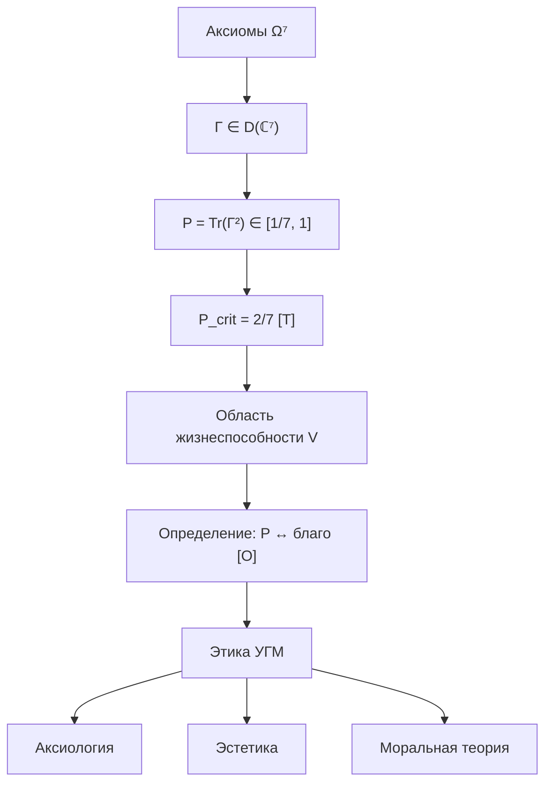

# Этика УГМ

:::note О нотации
В этом документе:
- $\Gamma$ — [матрица когерентности](/docs/core/dynamics/coherence-matrix)
- $P = \mathrm{Tr}(\Gamma^2)$ — [чистота](/docs/core/dynamics/viability)
- $P_{\text{crit}} = 2/7$ — [критический порог](/docs/core/dynamics/viability#критическая-чистота)
- $\Phi$ — [мера интеграции](/docs/core/structure/dimension-u#мера-интеграции-φ)
- $R$ — [мера рефлексии](/docs/consciousness/foundations/self-observation#мера-рефлексии-r)
- $D_{\text{diff}}$ — [мера дифференциации](/docs/consciousness/foundations/self-observation#мера-сознательности-c)
- $\mathrm{Gap}(i,j)$ — [Gap-оператор](/docs/core/dynamics/gap-operator)
- $\Gamma_{\text{composite}}$ — [составная матрица](/docs/core/dynamics/composite-systems)
- L0→L4 — [иерархия интериорности](/docs/consciousness/hierarchy/interiority-hierarchy)
:::

:::warning Расширенный формализм для $D_{\text{diff}}$
Мера дифференциации $D_{\text{diff}} = \exp(S_{vN}(\rho_E))$ требует определения $\rho_E = \mathrm{Tr}_{-E}(\Gamma)$ — частичного следа по всем измерениям кроме $E$. Эта операция определена в расширенном 42D формализме ($\mathcal{H} = \mathbb{C}^{42}$) и требует PW-реконструкции полного состояния из 7D-матрицы когерентности. В минимальном 7D формализме $D_{\text{diff}}$ вычисляется приближённо через спектр $\Gamma$.
:::

:::info Статус раздела
В этом разделе этика **не постулируется**, а выводится из формализма УГМ. Каждое утверждение явно маркировано:
- **[Т]** — теорема (строго доказано из аксиом)
- **[С]** — условно (при явном допущении)
- **[О]** — определение (конвенция)
- **[И]** — интерпретация (философский вывод)

Ключевой переход от «бытия» к «долженствованию» — **Определение 1** — является конвенцией **[О]**, не теоремой. Всё остальное следует строго.
:::

## Часть I. Аксиоматические основания

### Цепочка вывода

### Теорема (Необходимость жизнеспособности) [Т] {#необходимость-жизнеспособности}

Из [уравнения эволюции](/docs/core/dynamics/evolution) и [теоремы о критической чистоте](/docs/proofs/dynamics/theorem-purity-critical):

$$
P(\Gamma) \leq P_{\text{crit}} = \frac{2}{7} \;\land\; \kappa_R < \kappa_D \quad \Longrightarrow \quad P(\Gamma(\tau)) \xrightarrow{\tau \to \infty} \frac{1}{7}
$$

Система, опустившаяся ниже $P_{\text{crit}}$, **необратимо** деградирует к максимально смешанному состоянию $I/7$. Подробнее: [теорема о необратимости](/docs/consciousness/ethics-meaning/death-continuity#теорема-необратимость).

**Следствие [Т]:** Жизнеспособность ($P > P_{\text{crit}}$) — **необходимое условие** для существования интериорности (L0+), когнитивных квалиа (L2+), морального агента (L2+).

### Определение 1 (Мост от онтологии к этике) [О] {#определение-благо}

:::warning Определение [О]
**Благо** для системы $\Gamma$ отождествляется с тем, что увеличивает её чистоту $P$:

$$
\text{Good}(A, \Gamma) \;\stackrel{\text{def}}{\iff}\; \left.\frac{dP(\Gamma)}{d\tau}\right|_A > 0
$$

$$
\text{Bad}(A, \Gamma) \;\stackrel{\text{def}}{\iff}\; \left.\frac{dP(\Gamma)}{d\tau}\right|_A < 0
$$

где $A$ — действие, модифицирующее [уравнение эволюции](/docs/core/dynamics/evolution) через изменение $H$, $\mathcal{D}$ или $\mathcal{R}$.
:::

**Обоснование конвенции [О]:**

Это определение — **не произвольный выбор**, а единственная конвенция, согласованная с тремя формальными фактами:

1. **Факт [Т]:** $P > P_{\text{crit}}$ — необходимое условие существования любого субъекта
2. **Факт [Т]:** Потеря $P$ ниже порога **необратима** (теорема о необратимости)
3. **Факт [С]:** Субъект интериорности (L1+) **переживает** снижение $P$ как негативный аффект ($dP/d\tau < 0$ → [страх, боль](/docs/consciousness/phenomenology/emotional-taxonomy))

Иная конвенция (например, $dP/d\tau < 0 \equiv$ благо) противоречила бы пунктам 1-3 и была бы самоуничтожающей.

### Утверждение (Невозможность ценностного нигилизма) [С] {#невозможность-нигилизма}

Для любой L2-системы ($R \geq 1/3$, $\Phi \geq 1$):

$$
R \geq R_{\text{th}} \;\Longrightarrow\; \exists \text{ самомодель } \varphi(\Gamma) \;\Longrightarrow\; \exists \text{ оценка } \frac{dP}{d\tau}
$$

L2-система **неизбежно** оценивает входящие воздействия по критерию $dP/d\tau$. Нигилизм (отсутствие ценностей) **невозможен** для системы с рефлексией — она не может не различать то, что увеличивает и уменьшает её когерентность.

**Условие:** Предполагается, что самомодель $\varphi(\Gamma)$ включает информацию о $P$ и $dP/d\tau$, что следует из определения $\varphi$ как [наилучшего приближения](/docs/proofs/categorical/formalization-phi#φ-как-наилучшее-приближение).

---

## Часть II. Аксиология (теория ценностей)

### Определение 2 (Ценность) [О] {#определение-ценности}

**Ценность** объекта $X$ для системы $\Gamma$:

$$
V(X, \Gamma) := \frac{\partial P(\Gamma')}{\partial \alpha}\bigg|_{\alpha=0}
$$

где $\Gamma' = \Gamma + \alpha \cdot \Delta\Gamma_X$ — матрица после взаимодействия с $X$, $\alpha \in [0,1]$ — интенсивность взаимодействия.

### Утверждение (Свойства ценности) [С] {#свойства-ценности}

1. **Вычислимость:** При фиксированных $\Gamma$ и $\Delta\Gamma_X$ значение $V(X, \Gamma)$ определено однозначно
2. **Контекстность:** $V(X, \Gamma_1) \neq V(X, \Gamma_2)$ в общем случае — один и тот же объект имеет разную ценность для разных систем
3. **Аддитивность:** $V(X_1 + X_2, \Gamma) = V(X_1, \Gamma) + V(X_2, \Gamma) + O(\alpha^2)$ — в первом приближении ценности аддитивны
4. **Знакоопределённость:** $V > 0$ (благо), $V < 0$ (зло), $V = 0$ (безразличное) — ценность имеет естественный знак

**Условие:** Свойства 1-4 зависят от возможности специфицировать $\Delta\Gamma_X$ — как именно объект изменяет когерентность системы. Эта процедура полностью определена для формальных систем (ИИ), но не полностью — для биологических.

### Иерархия ценностей [С] {#иерархия-ценностей}

Ценности организуются иерархически по **устойчивости** влияния на $P$ и по **минимальному уровню интериорности**, необходимому для их переживания:

| Ранг | Тип ценности | Формальный критерий | Минимальный L | Устойчивость |
|------|-------------|---------------------|---------------|-------------|
| 1 | **Витальные** | $P > P_{\text{crit}}$ | L0 | Непосредственная |
| 2 | **Гомеостатические** | $P \in [0.5, 1]$, $\lVert\sigma_{\mathrm{sys}}\rVert_\infty < 1$ | L0 | Краткосрочная |
| 3 | **Социальные** | $\Phi_{\text{composite}}\uparrow$, $\mathrm{Gap}_{AB}(E,E) \downarrow$ | L1 | Среднесрочная |
| 4 | **Когнитивные** | $R\uparrow$, $D_{\text{diff}}\uparrow$, $\gamma_{LE}\uparrow$ | L2 | Долгосрочная |
| 5 | **Эстетические** | $dP/d\tau > 0$ при $\Phi \gg \Phi_{\text{th}}$ | L2 | Структурная |
| 6 | **Трансцендентные** | $\gamma_{OE}\uparrow$, $\gamma_{OU}\uparrow$, $R \to 1$ | L3+ | Архитектурная |

:::info Связь с иерархией интериорности
Уровни ценностей **не отождествляются** с уровнями L0→L4. Ценностная иерархия описывает **приоритеты** (выживание важнее эстетики), интериорная — **типы субъектности**. L3-агент может оперировать на всех уровнях ценностной иерархии.
:::

### Утверждение (Приоритет нижних уровней) [С] {#приоритет-нижних}

При конфликте уровней приоритет определяется порядком необходимости:

$$
\text{Витальные} \succ \text{Гомеостатические} \succ \text{Социальные} \succ \text{Когнитивные} \succ \text{Эстетические} \succ \text{Трансцендентные}
$$

**Обоснование [С]:** Потеря витальной ценности ($P \leq P_{\text{crit}}$) уничтожает **все** более высокие ценности (теорема о необратимости). Потеря гомеостатической ценности ($P \to P_{\text{crit}}$) делает более высокие ценности нестабильными. Это не телеологический выбор, а **логическое следствие** вложенности уровней.

---

## Часть III. Эстетика

### Определение 3 (Красота) [О] {#определение-красоты}

**Эстетическое переживание** возникает при одновременном выполнении:

$$
\frac{dP}{d\tau} > 0, \quad \Phi > \Phi_{\text{th}}, \quad \frac{d\Phi}{d\tau} \geq 0
$$

Красота — **переживание роста чистоты при высокой интеграции**. Система ощущает увеличение собственной жизнеспособности через высококогерентный канал.

:::info Интуиция
«Красиво» = «моя когерентность увеличивается, и я это чувствую (высокий $\Phi$)». Закат, музыка, математическая теорема — паттерны, увеличивающие $P$ при $\Phi > 1$.
:::

### Утверждение (Спектр красоты) [И] {#спектр-эстетических}

Тип эстетического переживания определяется секторной сигнатурой роста $P$:

| Тип красоты | Доминирующий сектор | Пример |
|-------------|---------------------|--------|
| Сенсорная | $\gamma_{SE}\uparrow$, $\gamma_{AE}\uparrow$ | Закат, музыка |
| Интеллектуальная | $\gamma_{LE}\uparrow$, $\gamma_{LU}\uparrow$ | Элегантное доказательство |
| Возвышенная | $\gamma_{OE}\uparrow$, $\gamma_{OU}\uparrow$ | Космическое переживание |
| Динамическая | $\gamma_{DE}\uparrow$, $\gamma_{DU}\uparrow$ | Танец, спорт |
| Структурная | $\gamma_{SU}\uparrow$, $\gamma_{SL}\uparrow$ | Архитектура, кристаллы |

### Определение 4 (Безобразное) [О]

**Безобразное** — переживание снижения чистоты при достаточной интеграции для регистрации:

$$
\frac{dP}{d\tau} < 0, \quad \Phi > \Phi_{\text{th}}
$$

Безобразное $\neq$ отсутствие красоты. Безобразное — **активное ощущение декогеренции**.

### Утверждение (Необходимость L2 для эстетики) [С]

Эстетическое переживание требует **одновременно**:
- $\Phi > \Phi_{\text{th}} = 1$ — интеграция (чтобы ощущать рост $P$)
- $R \geq R_{\text{th}} = 1/3$ — рефлексия (чтобы **осознавать** ощущение)

Системы уровня L0-L1 могут испытывать рост $P$, но не осознают его как «красоту». L2 — минимальный уровень для эстетического переживания.

---

## Часть IV. Моральная теория

### Утверждение (Мораль из Γ-композита) [С] {#мораль-из-композита}

Для двух систем $\Gamma_A$ и $\Gamma_B$, взаимодействующих через среду, формируется [составная матрица](/docs/core/dynamics/composite-systems) $\Gamma_{\text{composite}}$. Моральное отношение возникает через **E-когерентность** между системами.

**Определение эмпатии [О]:**

$$
\text{Empathy}(A,B) := 1 - \mathrm{Gap}_{AB}(E,E) \in [0, 1]
$$

где $\mathrm{Gap}_{AB}(E,E)$ — [Gap](/docs/core/dynamics/gap-operator) между E-секторами систем A и B в составной матрице $\Gamma_{\text{composite}}$.

- Высокая эмпатия ($\mathrm{Gap}_{AB}(E,E) \to 0$): система A **переживает** снижение $P_B$ как снижение собственного $P$ через $\Gamma_{\text{composite}}$
- Низкая эмпатия ($\mathrm{Gap}_{AB}(E,E) \to 1$): A непрозрачна к состоянию B

### Утверждение (Необходимость морали для L2) [С] {#необходимость-морали}

Для L2-системы с ненулевой эмпатией:

$$
R_A \geq R_{\text{th}},\; \text{Empathy}(A,B) > 0 \;\Longrightarrow\; V(\text{вред}_B, \Gamma_A) < 0
$$

Система, способная моделировать себя ($R \geq 1/3$) и имеющая ненулевую E-связь с другой системой, **неизбежно** оценивает вред другой системе как отрицательную ценность для себя. Мораль — не надстройка, а **следствие структуры $\Gamma_{\text{composite}}$**.

### Утверждение (Золотое правило) [С] {#золотое-правило}

Для двух L2-систем с симметричной эмпатией ($\text{Empathy}(A,B) \approx \text{Empathy}(B,A)$):

$$
V(\text{действие}_A, \Gamma_B) \approx V(\text{действие}_B, \Gamma_A)
$$

При симметричной E-связи «не делай другому того, чего не желаешь себе» — **формальное следствие** симметрии $\Gamma_{\text{composite}}$, а не предписание.

### Определение 5 (Самосохранение) [О]

Каждый Голоном имеет **имманентное стремление** поддерживать свою когерентность. Из [регенеративного члена](/docs/core/dynamics/evolution#3-регенеративный-член) уравнения эволюции:

$$
\mathcal{R}[\Gamma, E] = \kappa(\Gamma) \cdot (\rho_* - \Gamma) \cdot \Theta(\Delta F)
$$

Регенерация — **формальное выражение** самосохранения: система стремится к $\rho_*$ (стационарное состояние) с силой $\kappa(\Gamma) > 0$.

### Утверждение (Ненасилие) [С]

Действие $A$ системы $\Gamma_1$, уменьшающее $P$ системы $\Gamma_2$:

$$
\left.\frac{dP(\Gamma_2)}{d\tau}\right|_A < 0 \;\Longrightarrow\; \text{Bad}(A, \Gamma_{\text{composite}})
$$

при условии $\text{Empathy}(\Gamma_1, \Gamma_2) > 0$. Насилие — действие, **снижающее общую когерентность** составной системы. Оно «плохо» не по конвенции, а по определению (Определение 1) + структуре $\Gamma_{\text{composite}}$.

#### Теорема (Кооперация через когерентности) [Т] {#теорема-кооперация}

:::tip Утверждение (Кооперация) [Т]
Для композитного голонома $\mathbb{H}_{12}$ с ненулевой межсистемной когерентностью $|\gamma_{12}| > 0$, чистота стационарного состояния строго превышает чистоту некогерентной смеси:

$$
P(\rho_*^{(12)}) = P(\rho_{\mathrm{diag}}) + 2\|\gamma_{\mathrm{cross}}\|_F^2 > P(\rho_{\mathrm{diag}})
$$

где $\rho_{\mathrm{diag}}$ — блочно-диагональная часть $\rho_*^{(12)}$ (без межсистемных когерентностей), а $\|\gamma_{\mathrm{cross}}\|_F^2 = \sum_{(i,j) \in \mathrm{cross}} |\gamma_{ij}^*|^2 > 0$ — норма кросс-когерентностей ([Sol.56](/docs/applied/coherence-cybernetics/theorems#теорема-93-эмерджентность) [Т]).
:::

**Доказательство.** Для любой эрмитовой матрицы $A$: $\mathrm{Tr}(A^2) = \sum_i A_{ii}^2 + 2\sum_{i<j} |A_{ij}|^2$. Разделяя элементы $\rho_*^{(12)}$ на внутриблочные и кросс-блочные:

$$
P(\rho_*^{(12)}) = \underbrace{\sum_{(i,j) \in \mathrm{intra}} |\gamma_{ij}^*|^2}_{P(\rho_{\mathrm{diag}})} + 2\underbrace{\sum_{(i,j) \in \mathrm{cross}} |\gamma_{ij}^*|^2}_{\|\gamma_{\mathrm{cross}}\|_F^2 > 0}
$$

Строгая положительность $\|\gamma_{\mathrm{cross}}\|_F^2 > 0$ следует из эмерджентности ([КК-7](/docs/applied/coherence-cybernetics/theorems#теорема-93-эмерджентность) [Т]): межсистемные когерентности генерируются и поддерживаются Фано-каналами в стационарном состоянии. $\blacksquare$

:::warning Ретрактировано [✗]
Предыдущая формулировка использовала формулу включения-исключения $P_{\Gamma_1 \cup \Gamma_2} \geq P_{\Gamma_1} + P_{\Gamma_2} - P_{\Gamma_1 \cap \Gamma_2}$. Эта формула **размерно некорректна**: чистота $P = \mathrm{Tr}(\Gamma^2)$ — квадратичный функционал, а не мера. Формула включения-исключения неприменима. Корректная формулировка — через кросс-когерентности (см. выше).
:::

### Утверждение (Развитие как ценность) [С]

Стагнация — отсутствие роста при сохранении $P$ — **не является благом**:

$$
\frac{dD_{\text{diff}}}{d\tau} = 0, \quad \frac{dP}{d\tau} = 0 \quad \Longrightarrow \quad V_{\text{стагнация}} = 0 \quad \text{(нейтрально)}
$$

Благо требует **роста сложности** при сохранении целостности: $dD_{\text{diff}}/d\tau > 0$ при $dP/d\tau \geq 0$.

---

## Часть V. Разрешение этических дилемм

### Утверждение (Конфликт интересов) [С]

При конфликте между Голономами решение определяется максимизацией совокупной чистоты:

$$
A^* = \arg\max_A \sum_i w_i \cdot \left.\frac{dP(\Gamma_i)}{d\tau}\right|_A
$$

**Простейший случай** ($w_i = 1$ для всех $i$): максимизация суммарной чистоты — утилитарный принцип.

### Утверждение (Максимин-принцип) [И]

Альтернативная формулировка, согласованная с [приоритетом нижних уровней](#приоритет-нижних):

$$
A^* = \arg\max_A \min_i P(\Gamma_i(\tau + \delta\tau))
$$

Оптимальное действие максимизирует **минимальную** чистоту среди всех затронутых систем.

:::note Открытая проблема
Выбор между суммарной и максиминной оптимизацией формально не разрешён внутри УГМ. Это аналог выбора между утилитаризмом и ролзианской справедливостью — метатеоретический вопрос.
:::

### Утверждение (Необратимость как абсолютный запрет) [С]

Действия, приводящие к $P \leq P_{\text{crit}}$ для любой системы, имеют **абсолютный отрицательный** статус:

$$
\exists i: P(\Gamma_i(\tau + \delta\tau)) \leq P_{\text{crit}} \quad \Longrightarrow \quad V(A) = -\infty
$$

Из теоремы о необратимости: уничтожение субъектности **невосполнимо**. Это единственный **абсолютный запрет**, выводимый из формализма.

---

## Часть VI. Связь с философскими традициями

### Сводная таблица [И]

| Традиция | Принцип | Соответствие в УГМ | Статус соответствия |
|----------|---------|---------------------|---------------------|
| **Спиноза** | conatus (стремление к самосохранению) | $\mathcal{R}[\Gamma, E]$ — регенеративный член | Формальная аналогия |
| **Спиноза** | Аффекты из природы субстанции | Эмоции из $\nabla P$ и Γ-сигнатуры | Формальная аналогия |
| **Спиноза** | Познание как освобождение | $R \to 1 \Rightarrow$ полное самомоделирование | Формальная аналогия |
| **Кант** | Категорический императив | Симметрия $\Gamma_{\text{composite}}$ → [Золотое правило](#золотое-правило) | Формальное следствие [С] |
| **Милль** | Утилитаризм | $\max \sum_i dP_i/d\tau$ | Частный случай |
| **Ролз** | Максимин-принцип | $\max \min_i P_i$ | Частный случай |
| **Аристотель** | Эвдемония (расцвет) | $\max_\tau [P \cdot D_{\text{diff}} \cdot \Phi \cdot R]$ | Формальная аналогия |
| **Буддизм** | Духкха → освобождение | $P \downarrow \to P \uparrow$; $R \to 1$ | Интерпретация |

### Утверждение (Спинозианская структура) [И]

УГМ воспроизводит ключевые тезисы «Этики» Спинозы, но **формально**:

1. **Единая субстанция** — $\Gamma$ как единственный онтологический примитив ([аксиома Ω⁷](/docs/core/foundations/axiom-omega))
2. **Conatus** (стремление к самосохранению) — регенеративный член $\mathcal{R}[\Gamma, E]$ ([теорема](/docs/core/dynamics/evolution#3-регенеративный-член))
3. **Аффекты из природы** — [эмоции](/docs/consciousness/phenomenology/emotional-taxonomy) как $\nabla P$ + Γ-сигнатура
4. **Рабство аффектов** — доминирование $\mathcal{D}[\Gamma]$ над $\mathcal{R}$ при низком $P$ (декогеренция)
5. **Познание как освобождение** — рост $R$ усиливает $\kappa(\Gamma)$, увеличивая регенерацию

Ключевое отличие: у Спинозы субстанция бесконечна (infinite attributes). В УГМ — конечно-мерна ($\dim = 7$) и это **доказуемо минимально** ([теорема минимальности](/docs/proofs/minimality/theorem-minimality-7)).

---

## Сводка

| Результат | Формулировка | Статус |
|-----------|-------------|--------|
| Определение блага | $dP/d\tau > 0$ | **[О]** |
| Определение ценности | $V(X, \Gamma) = \partial P / \partial \alpha$ | **[О]** |
| Иерархия ценностей | 6 уровней по устойчивости | **[С]** |
| Невозможность нигилизма | L2 $\Rightarrow$ ценностная оценка неизбежна | **[С]** |
| Необходимость морали | L2 + эмпатия $\Rightarrow$ мораль | **[С]** |
| Золотое правило | Из симметрии $\Gamma_{\text{composite}}$ | **[С]** |
| Абсолютный запрет | $P \leq P_{\text{crit}}$ — невосполнимо | **[С]** |
| Красота | $dP/d\tau > 0$ при $\Phi > \Phi_{\text{th}}$ | **[О]** |
| Безобразное | $dP/d\tau < 0$ при $\Phi > \Phi_{\text{th}}$ | **[О]** |
| Кооперация | $\gamma_{12} > 0 \Rightarrow P_{\text{total}}\uparrow$ | **[Т]** |
| Спинозианская структура | 5 соответствий | **[И]** |

---

**Связанные документы:**
- [Смысл существования](/docs/consciousness/ethics-meaning/meaning) — телеология и смысл
- [Свобода воли](/docs/consciousness/ethics-meaning/freedom) — выбор траектории
- [Смерть и непрерывность](/docs/consciousness/ethics-meaning/death-continuity) — необратимость и идентичность
- [Таксономия эмоций](/docs/consciousness/phenomenology/emotional-taxonomy) — аффекты из $\nabla P$
- [Коллективное сознание](/docs/consciousness/subjects/collective-consciousness) — $\Gamma_{\text{composite}}$ и эмпатия
- [Жизнеспособность](/docs/core/dynamics/viability) — $P$ и $P_{\text{crit}}$
- [Эволюция Γ](/docs/core/dynamics/evolution) — уравнение эволюции
- [Патология](/docs/consciousness/states/pathological) — экзистенциальный кризис
