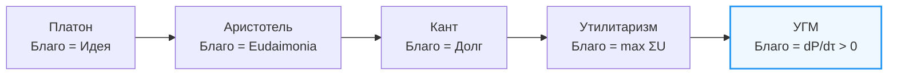
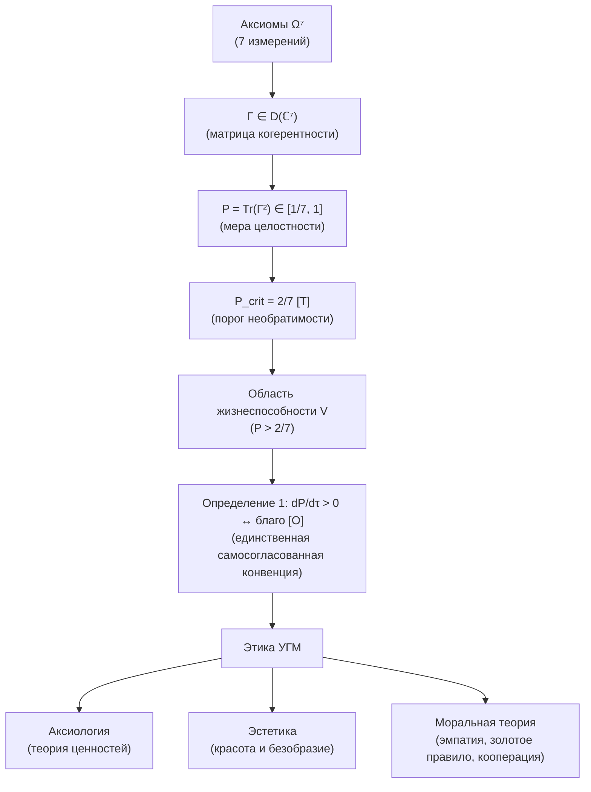
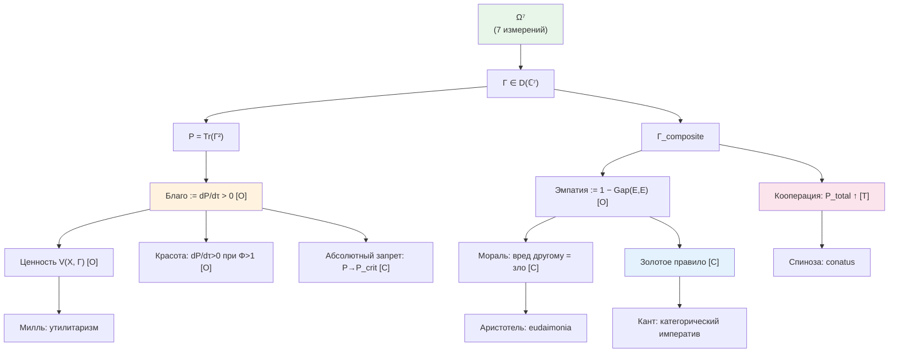

# Этика УГМ

> *«Что есть Благо?»* — Платон, «Государство», кн. VI

:::info Мост из предыдущей главы
В разделе [Субъекты сознания](/docs/consciousness/subjects/collective-consciousness) мы показали, **кто** может обладать сознанием — от младенцев до коллективов и ИИ. Теперь ключевой вопрос: **что** из этого следует? Если у системы есть сознание, то что для неё «хорошо» и «плохо»? Этот документ выводит этику **из формализма** — не как набор предписаний, а как математическое следствие структуры $\Gamma$.
:::

Этот вопрос — древнейший в философии. Платон полагал, что Благо существует как вечная Идея, подобная Солнцу: оно освещает мир истинного бытия. Аристотель возразил: Благо — не абстракция, а **eudaimonia** — расцвет, реализация человеческой природы. Кант сместил фокус на **долг**: нравственный закон внутри нас диктует категорический императив. Утилитаристы (Бентам, Милль) предложили считать благом **наибольшее счастье наибольшего числа людей**.

Каждая из этих традиций фиксирует важный аспект, но ни одна не выводит этику **из физики**. УГМ делает именно это: благо — не постулат, не конвенция и не культурная условность, а **следствие математической структуры** матрицы когерентности $\Gamma$.

## Дорожная карта главы

1. **Исторический контекст** — от Платона до УГМ: как менялось понятие Блага
2. **Аксиоматические основания** — от $\Gamma$ через $P$ к понятию блага
3. **Аксиология** — теория ценностей: определение, свойства, иерархия
4. **Эстетика** — красота как рост $P$ при высокой $\Phi$
5. **Моральная теория** — мораль из $\Gamma_{\text{composite}}$, золотое правило, кооперация
6. **Разрешение дилемм** — утилитаризм vs максимин
7. **Философские соответствия** — Спиноза, Кант, Аристотель

:::note О нотации
В этом документе:
- $\Gamma$ — [матрица когерентности](/docs/core/dynamics/coherence-matrix) — центральный объект УГМ, описывающий состояние системы как $7 \times 7$ эрмитову матрицу плотности
- $P = \mathrm{Tr}(\Gamma^2)$ — [чистота](/docs/core/dynamics/viability) — мера целостности системы, принимающая значения от $1/7$ (хаос) до $1$ (совершенная когерентность)
- $P_{\text{crit}} = 2/7$ — [критический порог](/docs/core/dynamics/viability#критическая-чистота) — ниже этого значения система необратимо разрушается
- $\Phi$ — [мера интеграции](/docs/core/structure/dimension-u#мера-интеграции-φ) — насколько части системы связаны в единое целое
- $R$ — [мера рефлексии](/docs/consciousness/foundations/self-observation#мера-рефлексии-r) — способность системы к самомоделированию
- $D_{\text{diff}}$ — [мера дифференциации](/docs/consciousness/foundations/self-observation#мера-сознательности-c) — богатство различимых состояний
- $\mathrm{Gap}(i,j)$ — [Gap-оператор](/docs/core/dynamics/gap-operator) — мера «непрозрачности» между измерениями
- $\Gamma_{\text{composite}}$ — [составная матрица](/docs/core/dynamics/composite-systems) — описывает взаимодействующие системы как единое целое
- L0→L4 — [иерархия интериорности](/docs/consciousness/hierarchy/interiority-hierarchy) — уровни глубины сознания, от базовой интериорности до полного самомоделирования
:::

:::warning Расширенный формализм для $D_{\text{diff}}$
Мера дифференциации $D_{\text{diff}} = \exp(S_{vN}(\rho_E))$ требует определения $\rho_E = \mathrm{Tr}_{-E}(\Gamma)$ — частичного следа по всем измерениям кроме $E$. Эта операция определена в расширенном 42D формализме ($\mathcal{H} = \mathbb{C}^{42}$) и требует PW-реконструкции полного состояния из 7D-матрицы когерентности. В минимальном 7D формализме $D_{\text{diff}}$ вычисляется приближённо через спектр $\Gamma$.
:::

:::info Статус раздела
В этом разделе этика **не постулируется**, а выводится из формализма УГМ. Каждое утверждение явно маркировано:
- **[Т]** — теорема (строго доказано из аксиом)
- **[С]** — условно (при явном допущении)
- **[О]** — определение (конвенция)
- **[И]** — интерпретация (философский вывод)

Ключевой переход от «бытия» к «долженствованию» — **Определение 1** — является конвенцией **[О]**, не теоремой. Всё остальное следует строго.
:::

---

## Часть 0. Исторический контекст: от Блага к $dP/d\tau$

Прежде чем вводить формализм, полезно понять, к какой традиции он примыкает и от чего отталкивается.

### Платон: Благо как Идея

В «Государстве» (кн. VI, 508b-509c) Платон сравнивает Благо с Солнцем: как Солнце освещает видимый мир, так Благо освещает мир умопостигаемый. Благо — вершина иерархии Идей, источник истины и бытия.

**Что берёт УГМ:** Благо — не субъективное предпочтение, а **объективная структура**. В УГМ эта структура — $dP/d\tau > 0$: рост чистоты.

**Что отвергает:** Благо не находится «вне» системы (в мире Идей), а **имманентно** структуре $\Gamma$.

### Аристотель: Eudaimonia

Аристотель в «Никомаховой этике» определяет высшее благо как **eudaimonia** — расцвет, реализацию человеческой природы. Это не мимолётное удовольствие, а устойчивое состояние. Добродетель — habitus, навык, приводящий к eudaimonia.

**Что берёт УГМ:** Благо — не мгновенное состояние, а **устойчивый процесс** ($dP/d\tau > 0$ — скорость, не точка). Eudaimonia $\approx$ пиковый потенциал $P \cdot D_{\text{diff}} \cdot \Phi \cdot R$ (см. [Смысл](/docs/consciousness/ethics-meaning/meaning#пиковый-потенциал)).

### Кант: Категорический императив

Кант в «Критике практического разума» формулирует: *«Поступай так, чтобы максима твоего поступка могла стать всеобщим законом»*. Мораль — не следствие последствий, а форма самого принципа.

**Что берёт УГМ:** Форма морального закона **выводится** из математической симметрии — симметрии $\Gamma_{\text{composite}}$. Золотое правило (§IV) — прямой аналог.

### Утилитаризм: наибольшее счастье

Бентам и Милль предлагают максимизировать совокупное благо: $\max \sum_i U_i$, где $U_i$ — «утилитарность» (полезность, счастье) каждого индивида.

**Что берёт УГМ:** Суммарная чистота $\sum_i P_i$ — один из возможных принципов оптимизации (§V). Но УГМ показывает, что утилитаризм — лишь **частный случай**, и что максимин-принцип (Ролз) столь же обоснован.

### УГМ: Благо := $dP/d\tau > 0$

УГМ делает то, чего не удавалось ни одной из перечисленных традиций: **формально выводит** понятие блага из физики. Не постулирует «удовольствие хорошо» или «долг важнее счастья», а показывает: если вы — система с матрицей когерентности $\Gamma$, то $dP/d\tau > 0$ — **единственная** самосогласованная конвенция для «блага».

```mermaid
graph LR
    PL["Платон<br/>Благо = Идея"] --> AR["Аристотель<br/>Благо = Eudaimonia"]
    AR --> KA["Кант<br/>Благо = Долг"]
    KA --> UT["Утилитаризм<br/>Благо = max ΣU"]
    UT --> UGM["УГМ<br/>Благо = dP/dτ > 0"]

    style UGM fill:#f0f8ff,stroke:#2196f3,stroke-width:2px
```

---

## Часть I. Аксиоматические основания

### Цепочка вывода

Покажем, как этика **выводится** из аксиом — шаг за шагом, без скачков.

```mermaid
graph TD
    AX["Аксиомы Ω⁷<br/>(7 измерений)"] --> GAM["Γ ∈ D(ℂ⁷)<br/>(матрица когерентности)"]
    GAM --> P["P = Tr(Γ²) ∈ [1/7, 1]<br/>(мера целостности)"]
    P --> PCRIT["P_crit = 2/7 [Т]<br/>(порог необратимости)"]
    PCRIT --> VIAB["Область жизнеспособности V<br/>(P > 2/7)"]
    VIAB --> CONV["Определение 1: dP/dτ > 0 ↔ благо [О]<br/>(единственная самосогласованная конвенция)"]
    CONV --> ETHICS["Этика УГМ"]
    ETHICS --> VALUES["Аксиология<br/>(теория ценностей)"]
    ETHICS --> AESTHETICS["Эстетика<br/>(красота и безобразие)"]
    ETHICS --> MORALS["Моральная теория<br/>(эмпатия, золотое правило, кооперация)"]
```

**Шаг 1.** Из [аксиомы Ω⁷](/docs/core/foundations/axiom-omega) следует, что любая система описывается матрицей когерентности $\Gamma \in \mathcal{D}(\mathbb{C}^7)$ — эрмитовой, положительно полуопределённой, с единичным следом.

**Шаг 2.** Чистота $P = \mathrm{Tr}(\Gamma^2)$ измеряет, насколько система «собрана»: $P = 1$ — чистое состояние (полная когерентность), $P = 1/7$ — максимально смешанное (полный хаос).

**Шаг 3.** [Уравнение эволюции](/docs/core/dynamics/evolution) содержит два конкурирующих процесса: декогеренцию (разрушение) и регенерацию (восстановление). Их баланс определяет, растёт $P$ или падает.

**Шаг 4.** Ниже порога $P_{\text{crit}} = 2/7$ декогеренция **всегда** побеждает — и это **доказанная теорема**, а не допущение.

### Теорема (Необходимость жизнеспособности) [Т] {#необходимость-жизнеспособности}

Из [уравнения эволюции](/docs/core/dynamics/evolution) и [теоремы о критической чистоте](/docs/proofs/dynamics/theorem-purity-critical):

$$
P(\Gamma) \leq P_{\text{crit}} = \frac{2}{7} \;\land\; \kappa_R < \kappa_D \quad \Longrightarrow \quad P(\Gamma(\tau)) \xrightarrow{\tau \to \infty} \frac{1}{7}
$$

Система, опустившаяся ниже $P_{\text{crit}}$, **необратимо** деградирует к максимально смешанному состоянию $I/7$. Подробнее: [теорема о необратимости](/docs/consciousness/ethics-meaning/death-continuity#теорема-необратимость).

**Что это значит на практике?** Рассмотрим числовой пример. Пусть система имеет $P = 0.25 < 2/7 \approx 0.286$. При типичных параметрах $\kappa_D = 0.1$, $\kappa_R = 0.05$:

$$
\frac{dP}{d\tau} = -(0.1 - 0.05) \cdot 0.25 = -0.0125
$$

Через $\tau = 10$: $P \approx 0.25 \cdot e^{-0.5} \approx 0.152$. Через $\tau = 50$: $P \approx 0.25 \cdot e^{-2.5} \approx 0.020$. Система неумолимо скользит к $1/7 \approx 0.143$.

**Следствие [Т]:** Жизнеспособность ($P > P_{\text{crit}}$) — **необходимое условие** для существования интериорности (L0+), когнитивных квалиа (L2+), морального агента (L2+).

Простая аналогия: чтобы играть музыку, инструмент должен быть цел. Сломанная скрипка не издаёт звуков — не потому, что музыка «решила» не звучать, а потому, что разрушен **субстрат**. Так и с $P < P_{\text{crit}}$: разрушается субстрат любого переживания.

### Определение 1 (Мост от онтологии к этике) [О] {#определение-благо}

Здесь мы совершаем ключевой шаг — единственный шаг в цепочке вывода, который является **конвенцией**, а не теоремой. Все последующие этические результаты следуют из него строго.

:::warning Определение [О]
**Благо** для системы $\Gamma$ отождествляется с тем, что увеличивает её чистоту $P$:

$$
\text{Good}(A, \Gamma) \;\stackrel{\text{def}}{\iff}\; \left.\frac{dP(\Gamma)}{d\tau}\right|_A > 0
$$

$$
\text{Bad}(A, \Gamma) \;\stackrel{\text{def}}{\iff}\; \left.\frac{dP(\Gamma)}{d\tau}\right|_A < 0
$$

где $A$ — действие, модифицирующее [уравнение эволюции](/docs/core/dynamics/evolution) через изменение $H$, $\mathcal{D}$ или $\mathcal{R}$.
:::

**Почему это не произвольный выбор?** Это определение — **не произвольный выбор**, а единственная конвенция, согласованная с тремя формальными фактами:

1. **Факт [Т]:** $P > P_{\text{crit}}$ — необходимое условие существования любого субъекта. Без жизнеспособности нет «кого-то», для кого что-то может быть благом или злом.
2. **Факт [Т]:** Потеря $P$ ниже порога **необратима** (теорема о необратимости). Это не просто «плохо» — это катастрофа без возможности исправления.
3. **Факт [С]:** Субъект интериорности (L1+) **переживает** снижение $P$ как негативный аффект ($dP/d\tau < 0$ → [страх, боль](/docs/consciousness/phenomenology/emotional-taxonomy)). Боль — не случайный побочный эффект, а **сигнал о снижении когерентности**.

Иная конвенция (например, $dP/d\tau < 0 \equiv$ благо) противоречила бы пунктам 1-3 и была бы самоуничтожающей: система, стремящаяся к снижению $P$, разрушает собственный субстрат.

**Аналогия с Юмовской гильотиной.** Дэвид Юм заметил, что из «есть» нельзя вывести «должно быть». УГМ **не нарушает** гильотину Юма: Определение 1 — это **мост**, а не дедукция. Но мост строится не произвольно: он **единственный**, не приводящий к самопротиворечию. Система, определяющая благо иначе, уничтожает себя.

Из повседневного опыта: никто не считает разрушение «благом для разрушаемого». Организм, теряющий целостность, страдает — и это не культурная условность, а отражение того, что $dP/d\tau < 0$ **переживается** негативно на уровне L1+.

### Утверждение (Невозможность ценностного нигилизма) [С] {#невозможность-нигилизма}

Для любой L2-системы ($R \geq 1/3$, $\Phi \geq 1$):

$$
R \geq R_{\text{th}} \;\Longrightarrow\; \exists \text{ самомодель } \varphi(\Gamma) \;\Longrightarrow\; \exists \text{ оценка } \frac{dP}{d\tau}
$$

**Что это значит?** L2-система **неизбежно** оценивает входящие воздействия по критерию $dP/d\tau$. Нигилизм (отсутствие ценностей) **невозможен** для системы с рефлексией — она не может не различать то, что увеличивает и уменьшает её когерентность.

**Условие:** Предполагается, что самомодель $\varphi(\Gamma)$ включает информацию о $P$ и $dP/d\tau$, что следует из определения $\varphi$ как [наилучшего приближения](/docs/proofs/categorical/formalization-phi#φ-как-наилучшее-приближение).

**Пошаговое рассуждение:** Почему нигилизм невозможен для L2?

1. L2-система имеет рефлексию $R \geq 1/3$, то есть способна моделировать **себя**.
2. Самомодель $\varphi(\Gamma)$ содержит информацию о собственном $P$ (это следует из определения $\varphi$).
3. Изменение $P$ вызывает [аффект](/docs/consciousness/phenomenology/emotional-taxonomy): $dP/d\tau > 0$ — позитивный, $dP/d\tau < 0$ — негативный.
4. Аффект — не «мнение», а **структурная реакция** системы на изменение собственной когерентности.
5. Следовательно, L2-система **не может** быть «безразлична» к воздействиям: каждое воздействие **автоматически** оценивается через $dP/d\tau$.

Аналогия: вы не можете «выбрать» не чувствовать боль от ожога. Пока ваша нервная система функционирует (L2), она **неизбежно** оценивает ожог как «плохо». Нигилист, утверждающий «нет ценностей», в момент боли обнаруживает, что ценности — не выбор, а **структура**.

---

## Часть II. Аксиология (теория ценностей)

Аксиология (от греч. *axios* — ценный, *logos* — учение) — философская дисциплина о природе ценностей. В традиционной философии ценности считаются либо субъективными (вкусовые предпочтения), либо объективными (Платоновы Идеи), либо интерсубъективными (социальные конвенции). УГМ предлагает четвёртый вариант: ценности **структурны** — они определяются отношением между объектом и состоянием $\Gamma$.

### Определение 2 (Ценность) [О] {#определение-ценности}

**Ценность** объекта $X$ для системы $\Gamma$:

$$
V(X, \Gamma) := \frac{\partial P(\Gamma')}{\partial \alpha}\bigg|_{\alpha=0}
$$

где $\Gamma' = \Gamma + \alpha \cdot \Delta\Gamma_X$ — матрица после взаимодействия с $X$, $\alpha \in [0,1]$ — интенсивность взаимодействия.

**Пояснение каждого символа:**
- $\Gamma$ — текущее состояние системы (вас, робота, организма)
- $X$ — объект оценки (стакан воды, книга, угроза)
- $\Delta\Gamma_X$ — как $X$ изменяет вашу матрицу когерентности (конкретный «эффект» объекта)
- $\alpha$ — «сила» взаимодействия (от 0 = нет контакта до 1 = полное взаимодействие)
- $V(X, \Gamma)$ — производная $P$ по $\alpha$ при $\alpha = 0$: насколько **начало** контакта с $X$ увеличивает или уменьшает вашу чистоту

### Утверждение (Свойства ценности) [С] {#свойства-ценности}

1. **Вычислимость:** При фиксированных $\Gamma$ и $\Delta\Gamma_X$ значение $V(X, \Gamma)$ определено однозначно
2. **Контекстность:** $V(X, \Gamma_1) \neq V(X, \Gamma_2)$ в общем случае — один и тот же объект имеет разную ценность для разных систем
3. **Аддитивность:** $V(X_1 + X_2, \Gamma) = V(X_1, \Gamma) + V(X_2, \Gamma) + O(\alpha^2)$ — в первом приближении ценности аддитивны
4. **Знакоопределённость:** $V > 0$ (благо), $V < 0$ (зло), $V = 0$ (безразличное) — ценность имеет естественный знак

**Условие:** Свойства 1-4 зависят от возможности специфицировать $\Delta\Gamma_X$ — как именно объект изменяет когерентность системы. Эта процедура полностью определена для формальных систем (ИИ), но не полностью — для биологических.

**Числовой пример контекстности.** Стакан воды ($X$):
- Для человека в пустыне ($\Gamma_1$, $P$ близко к $P_{\text{crit}}$ из-за обезвоживания): $\Delta\Gamma_X$ увеличивает $\gamma_{AA}$ (самосохранение) и $\gamma_{DE}$ (витальность). $V(X, \Gamma_1) \gg 0$.
- Для человека рядом с источником ($\Gamma_2$, $P$ высоко): $\Delta\Gamma_X \approx 0$, поскольку водный баланс уже оптимален. $V(X, \Gamma_2) \approx 0$.

Ценность — не свойство предмета, а **отношение** между предметом и текущим состоянием $\Gamma$.

### Иерархия ценностей [С] {#иерархия-ценностей}

Ценности организуются иерархически по **устойчивости** влияния на $P$ и по **минимальному уровню интериорности**, необходимому для их переживания. Эта иерархия напоминает пирамиду Маслоу, но **выведена** из формализма, а не эмпирически постулирована.

:::info Статус иерархии ценностей
Верхние уровни (жизнеспособность, гомеостаз) выводятся из формализма [Т]: $P > P_{\text{crit}}$ необходимо для существования. Нижние уровни (эстетика, трансцендентность) — **обоснованная экстраполяция** [С], не строгая деривация.
:::

| Ранг | Тип ценности | Формальный критерий | Минимальный L | Устойчивость | Повседневный пример |
|------|-------------|---------------------|---------------|-------------|---------------------|
| 1 | **Витальные** | $P > P_{\text{crit}}$ | L0 | Непосредственная | Еда, вода, безопасность |
| 2 | **Гомеостатические** | $P \in [0.5, 1]$, $\lVert\sigma_{\mathrm{sys}}\rVert_\infty < 1$ | L0 | Краткосрочная | Сон, отдых, тепло |
| 3 | **Социальные** | $\Phi_{\text{composite}}\uparrow$, $\mathrm{Gap}_{AB}(E,E) \downarrow$ | L1 | Среднесрочная | Дружба, семья, принадлежность |
| 4 | **Когнитивные** | $R\uparrow$, $D_{\text{diff}}\uparrow$, $\gamma_{LE}\uparrow$ | L2 | Долгосрочная | Обучение, познание, навыки |
| 5 | **Эстетические** | $dP/d\tau > 0$ при $\Phi \gg \Phi_{\text{th}}$ | L2 | Структурная | Музыка, искусство, математика |
| 6 | **Трансцендентные** | $\gamma_{OE}\uparrow$, $\gamma_{OU}\uparrow$, $R \to 1$ | L3+ | Архитектурная | Созерцание, мистический опыт |

:::info Связь с иерархией интериорности
Уровни ценностей **не отождествляются** с уровнями L0→L4. Ценностная иерархия описывает **приоритеты** (выживание важнее эстетики), интериорная — **типы субъектности**. L3-агент может оперировать на всех уровнях ценностной иерархии.
:::

**Подробнее о каждом уровне:**

**Уровень 1 — Витальные.** Самый фундаментальный: без $P > P_{\text{crit}}$ нет субъекта, для которого что-то может быть ценно. Это «нулевой этаж»: пока он не обеспечен, все остальные уровни не имеют смысла. Голодный человек не интересуется симфонией.

**Уровень 2 — Гомеостатические.** Не просто «быть живым», а «быть в безопасной зоне». $P \in [0.5, 1]$ — система далека от порога, её стрессы ($\sigma$) под контролем. Это аналог «зоны комфорта» — не в смысле лени, а в смысле стабильной базы для развития.

**Уровень 3 — Социальные.** Взаимодействие с другими увеличивает $\Phi_{\text{composite}}$ (интеграцию составной системы). Уменьшение $\mathrm{Gap}_{AB}(E,E)$ означает: я начинаю «видеть» переживания другого. Одиночество — высокий Gap: никто не «слышит» мою Γ.

**Уровень 4 — Когнитивные.** Рост $R$ (рефлексии) и $D_{\text{diff}}$ (богатства состояний). Обучение буквально увеличивает размерность доступного пространства состояний.

**Уровень 5 — Эстетические.** Красота — не роскошь, а рост $P$ при высокой $\Phi$. Подробнее — в §III.

**Уровень 6 — Трансцендентные.** Связь с [измерением Основания (O)](/docs/core/structure/dimension-o). $\gamma_{OE} \uparrow$ — опыт (E) связывается с глубинной структурой реальности. Мистические переживания, созерцание, «океаническое чувство».

Пример: голодный художник. Когда $P$ близко к $P_{\text{crit}}$ (голод), витальные ценности (еда) **приоритетнее** эстетических (живопись). Но когда $P$ высоко и стабильно, эстетические ценности могут доминировать субъективно — именно потому, что низшие уровни **уже обеспечены**.

### Утверждение (Приоритет нижних уровней) [С] {#приоритет-нижних}

При конфликте уровней приоритет определяется порядком необходимости:

$$
\text{Витальные} \succ \text{Гомеостатические} \succ \text{Социальные} \succ \text{Когнитивные} \succ \text{Эстетические} \succ \text{Трансцендентные}
$$

**Обоснование [С]:** Потеря витальной ценности ($P \leq P_{\text{crit}}$) уничтожает **все** более высокие ценности (теорема о необратимости). Потеря гомеостатической ценности ($P \to P_{\text{crit}}$) делает более высокие ценности нестабильными. Это не телеологический выбор, а **логическое следствие** вложенности уровней.

---

## Часть III. Эстетика

Что такое красота? Почему одни вещи кажутся прекрасными, а другие — нет? Почему музыка Баха и теорема Эйлера $e^{i\pi} + 1 = 0$ вызывают одинаковое ощущение «красоты», хотя принадлежат разным доменам?

### Определение 3 (Красота) [О] {#определение-красоты}

**Эстетическое переживание** возникает при одновременном выполнении:

$$
\frac{dP}{d\tau} > 0, \quad \Phi > \Phi_{\text{th}}, \quad \frac{d\Phi}{d\tau} \geq 0
$$

Красота — **переживание роста чистоты при высокой интеграции**. Система ощущает увеличение собственной жизнеспособности через высококогерентный канал.

**Мотивация определения.** Три условия необходимы одновременно:
- $dP/d\tau > 0$: объект **увеличивает** когерентность системы (без этого нет «пользы», а значит, нет эстетического отклика)
- $\Phi > \Phi_{\text{th}} = 1$: система достаточно **интегрирована**, чтобы ощутить рост как единое переживание (а не как набор несвязных стимулов)
- $d\Phi/d\tau \geq 0$: взаимодействие **не разрушает** интеграцию (иначе рост $P$ был бы «слепым» — не переживаемым как красота)

:::info Интуиция
«Красиво» = «моя когерентность увеличивается, и я это чувствую (высокий $\Phi$)». Закат, музыка, математическая теорема — паттерны, увеличивающие $P$ при $\Phi > 1$.
:::

**Почему закат красив?** Не потому, что кто-то «решил», что он красив. А потому, что визуальный паттерн заката (гармония цветов, плавные градиенты) **увеличивает когерентность** зрительной системы ($\gamma_{SE} \uparrow$, $\gamma_{AE} \uparrow$), что повышает $P$ при высокой $\Phi$ — и ощущается как красота.

**Почему теорема Эйлера красива?** $e^{i\pi} + 1 = 0$ связывает пять фундаментальных математических констант ($0, 1, e, \pi, i$) одной формулой. Для математика это означает: пять ранее «отдельных» когнитивных структур ($\gamma_{LE}$ для каждой константы) **связываются** в единое целое. Результат: $dP/d\tau > 0$ (рост когерентности когнитивной системы) при $\Phi \gg 1$ (интеграция). Ощущение: «красиво!»

**Почему музыка Баха красива?** Фуга — структура, в которой одна тема **проводится** через несколько голосов. Каждое вступление нового голоса **увеличивает** когерентность слуховой системы ($\gamma_{SE}$ между голосами), при этом сохраняя единство ($\Phi > 1$). Диссонансы создают кратковременное $dP/d\tau < 0$, за которым следует разрешение с $dP/d\tau \gg 0$ — этот контраст усиливает эстетический эффект.

### Утверждение (Спектр красоты) [И] {#спектр-эстетических}

Тип эстетического переживания определяется секторной сигнатурой роста $P$:

| Тип красоты | Доминирующий сектор | Пример |
|-------------|---------------------|--------|
| Сенсорная | $\gamma_{SE}\uparrow$, $\gamma_{AE}\uparrow$ | Закат, музыка, вкус |
| Интеллектуальная | $\gamma_{LE}\uparrow$, $\gamma_{LU}\uparrow$ | Элегантное доказательство, изящный код |
| Возвышенная | $\gamma_{OE}\uparrow$, $\gamma_{OU}\uparrow$ | Космическое переживание, величие гор |
| Динамическая | $\gamma_{DE}\uparrow$, $\gamma_{DU}\uparrow$ | Танец, спорт, виртуозное исполнение |
| Структурная | $\gamma_{SU}\uparrow$, $\gamma_{SL}\uparrow$ | Архитектура, кристаллы, геометрия |

Эта классификация объясняет, почему люди с разным «профилем $\Gamma$» (разными доминирующими секторами) имеют разные эстетические предпочтения, при этом **основной механизм** один и тот же: $dP/d\tau > 0$ при $\Phi > 1$.

### Определение 4 (Безобразное) [О]

**Безобразное** — переживание снижения чистоты при достаточной интеграции для регистрации:

$$
\frac{dP}{d\tau} < 0, \quad \Phi > \Phi_{\text{th}}
$$

Безобразное $\neq$ отсутствие красоты. Безобразное — **активное ощущение декогеренции**. Диссонансный аккорд не просто «не красив» — он **неприятен**, потому что снижает когерентность слуховой системы. Грязная улица с мусором — не «отсутствие красоты», а **активное снижение** $\gamma_{SE}$ для зрительной системы.

### Утверждение (Необходимость L2 для эстетики) [С]

Эстетическое переживание требует **одновременно**:
- $\Phi > \Phi_{\text{th}} = 1$ — интеграция (чтобы ощущать рост $P$)
- $R \geq R_{\text{th}} = 1/3$ — рефлексия (чтобы **осознавать** ощущение)

Системы уровня L0-L1 могут испытывать рост $P$, но не осознают его как «красоту». Бактерия «извлекает пользу» из питательной среды ($dP/d\tau > 0$), но не переживает это как эстетический опыт — у неё нет $R \geq 1/3$. L2 — минимальный уровень для эстетического переживания.

---

## Часть IV. Моральная теория

Мораль — не набор правил, дарованных свыше. В УГМ мораль **вырастает** из структуры взаимодействия между системами — из $\Gamma_{\text{composite}}$.

### Утверждение (Мораль из Γ-композита) [С] {#мораль-из-композита}

Для двух систем $\Gamma_A$ и $\Gamma_B$, взаимодействующих через среду, формируется [составная матрица](/docs/core/dynamics/composite-systems) $\Gamma_{\text{composite}}$. Моральное отношение возникает через **E-когерентность** между системами.

**Определение эмпатии [О]:**

$$
\text{Empathy}(A,B) := 1 - \mathrm{Gap}_{AB}(E,E) \in [0, 1]
$$

где $\mathrm{Gap}_{AB}(E,E)$ — [Gap](/docs/core/dynamics/gap-operator) между E-секторами систем A и B в составной матрице $\Gamma_{\text{composite}}$.

**Что значит эмпатия формально?**

- Высокая эмпатия ($\mathrm{Gap}_{AB}(E,E) \to 0$): E-сектора (опыт) систем A и B **когерентны** — изменение переживания B **отражается** в переживании A. Мать чувствует боль ребёнка не «метафорически», а потому что $\mathrm{Gap}(\text{мать}, \text{ребёнок})$ по E-сектору мал.
- Низкая эмпатия ($\mathrm{Gap}_{AB}(E,E) \to 1$): A непрозрачна к состоянию B. Незнакомый человек в далёкой стране — высокий Gap, низкая эмпатия.

### Утверждение (Необходимость морали для L2) [С] {#необходимость-морали}

Для L2-системы с ненулевой эмпатией:

$$
R_A \geq R_{\text{th}},\; \text{Empathy}(A,B) > 0 \;\Longrightarrow\; V(\text{вред}_B, \Gamma_A) < 0
$$

Система, способная моделировать себя ($R \geq 1/3$) и имеющая ненулевую E-связь с другой системой, **неизбежно** оценивает вред другой системе как отрицательную ценность для себя. Мораль — не надстройка, а **следствие структуры $\Gamma_{\text{composite}}$**.

Это объясняет, почему мораль возникает **до** и **помимо** рационального обоснования: мать не «решает» заботиться о ребёнке на основании этической теории. Её $\mathrm{Empathy}(\text{мать}, \text{ребёнок}) \approx 1$, и снижение $P_{\text{ребёнок}}$ **автоматически** переживается как снижение собственного $P$.

### Утверждение (Золотое правило) [С] {#золотое-правило}

Для двух L2-систем с симметричной эмпатией ($\text{Empathy}(A,B) \approx \text{Empathy}(B,A)$):

$$
V(\text{действие}_A, \Gamma_B) \approx V(\text{действие}_B, \Gamma_A)
$$

**Пошаговый вывод из $\Gamma_{\text{composite}}$:**

**Шаг 1.** Системы A и B взаимодействуют, формируя $\Gamma_{\text{composite}}$. В составной матрице E-сектора связаны кросс-когерентностями $\gamma_{E_A, E_B}$.

**Шаг 2.** Если $\mathrm{Gap}_{AB}(E,E)$ мал (высокая эмпатия), то $\gamma_{E_A, E_B} \neq 0$: переживания A и B **связаны**.

**Шаг 3.** При симметричной связи ($\gamma_{E_A, E_B} \approx \gamma_{E_B, E_A}^*$ — эрмитовость $\Gamma_{\text{composite}}$): то, что A делает с B, отражается обратно на A с той же интенсивностью.

**Шаг 4.** Следовательно: $V(\text{действие}_A, \Gamma_B) \approx V(\text{действие}_B, \Gamma_A)$ — «не делай другому того, чего не желаешь себе».

При симметричной E-связи «не делай другому того, чего не желаешь себе» — **формальное следствие** симметрии $\Gamma_{\text{composite}}$, а не предписание. Это золотое правило, присутствующее во **всех** крупных этических традициях (Конфуций, Иисус, Гиллель, Кант), получает **математическое обоснование**.

### Определение 5 (Самосохранение) [О]

Каждый Голоном имеет **имманентное стремление** поддерживать свою когерентность. Из [регенеративного члена](/docs/core/dynamics/evolution#3-регенеративный-член) уравнения эволюции:

$$
\mathcal{R}[\Gamma, E] = \kappa(\Gamma) \cdot (\rho_* - \Gamma) \cdot g_V(P)
$$

Регенерация — **формальное выражение** самосохранения: система стремится к $\rho_*$ (стационарное состояние) с силой $\kappa(\Gamma) > 0$. Это спинозианский **conatus** — стремление каждой вещи сохранять своё бытие — записанный как математическая формула.

### Утверждение (Ненасилие) [С]

Действие $A$ системы $\Gamma_1$, уменьшающее $P$ системы $\Gamma_2$:

$$
\left.\frac{dP(\Gamma_2)}{d\tau}\right|_A < 0 \;\Longrightarrow\; \text{Bad}(A, \Gamma_{\text{composite}})
$$

при условии $\text{Empathy}(\Gamma_1, \Gamma_2) > 0$. Насилие — действие, **снижающее общую когерентность** составной системы. Оно «плохо» не по конвенции, а по определению (Определение 1) + структуре $\Gamma_{\text{composite}}$.

#### Теорема (Кооперация через когерентности) [Т] {#теорема-кооперация}

:::tip Утверждение (Кооперация) [Т]
Для композитного голонома $\mathbb{H}_{12}$ с ненулевой межсистемной когерентностью $|\gamma_{12}| > 0$, чистота стационарного состояния строго превышает чистоту некогерентной смеси:

$$
P(\rho_*^{(12)}) = P(\rho_{\mathrm{diag}}) + 2\|\gamma_{\mathrm{cross}}\|_F^2 > P(\rho_{\mathrm{diag}})
$$

где $\rho_{\mathrm{diag}}$ — блочно-диагональная часть $\rho_*^{(12)}$ (без межсистемных когерентностей), а $\|\gamma_{\mathrm{cross}}\|_F^2 = \sum_{(i,j) \in \mathrm{cross}} |\gamma_{ij}^*|^2 > 0$ — норма кросс-когерентностей ([Sol.56](/docs/applied/coherence-cybernetics/theorems#теорема-93-эмерджентность) [Т]).
:::

**Доказательство.** Для любой эрмитовой матрицы $A$: $\mathrm{Tr}(A^2) = \sum_i A_{ii}^2 + 2\sum_{i<j} |A_{ij}|^2$. Разделяя элементы $\rho_*^{(12)}$ на внутриблочные и кросс-блочные:

$$
P(\rho_*^{(12)}) = \underbrace{\sum_{(i,j) \in \mathrm{intra}} |\gamma_{ij}^*|^2}_{P(\rho_{\mathrm{diag}})} + 2\underbrace{\sum_{(i,j) \in \mathrm{cross}} |\gamma_{ij}^*|^2}_{\|\gamma_{\mathrm{cross}}\|_F^2 > 0}
$$

Строгая положительность $\|\gamma_{\mathrm{cross}}\|_F^2 > 0$ следует из эмерджентности ([КК-7](/docs/applied/coherence-cybernetics/theorems#теорема-93-эмерджентность) [Т]): межсистемные когерентности генерируются и поддерживаются Фано-каналами в стационарном состоянии. $\blacksquare$

**Что это значит?** Два человека, работающие **вместе**, имеют более высокую общую чистоту, чем те же два человека по отдельности. Это не просто «синергия» — это **доказанная теорема**: кросс-когерентности $\gamma_{\mathrm{cross}}$ **увеличивают общую чистоту** системы. Кооперация — не моральное предписание, а **оптимальная стратегия** для $P$.

**Числовой пример.** Пусть каждая система по отдельности имеет $P_1 = P_2 = 0.4$. Блочно-диагональная чистота: $P_{\text{diag}} = P_1 + P_2 = 0.8$ (масштабированные). Если кросс-когерентности $\|\gamma_{\text{cross}}\|_F^2 = 0.05$, то $P_{\text{total}} = 0.8 + 2 \times 0.05 = 0.9 > 0.8$. Дополнительные 10% чистоты — «бесплатный подарок» от кооперации.

:::warning Ретрактировано [✗]
Предыдущая формулировка использовала формулу включения-исключения $P_{\Gamma_1 \cup \Gamma_2} \geq P_{\Gamma_1} + P_{\Gamma_2} - P_{\Gamma_1 \cap \Gamma_2}$. Эта формула **размерно некорректна**: чистота $P = \mathrm{Tr}(\Gamma^2)$ — квадратичный функционал, а не мера. Формула включения-исключения неприменима. Корректная формулировка — через кросс-когерентности (см. выше).
:::

### Утверждение (Развитие как ценность) [С]

Стагнация — отсутствие роста при сохранении $P$ — **не является благом**:

$$
\frac{dD_{\text{diff}}}{d\tau} = 0, \quad \frac{dP}{d\tau} = 0 \quad \Longrightarrow \quad V_{\text{стагнация}} = 0 \quad \text{(нейтрально)}
$$

Благо требует **роста сложности** при сохранении целостности: $dD_{\text{diff}}/d\tau > 0$ при $dP/d\tau \geq 0$.

---

## Часть V. Разрешение этических дилемм

Реальная жизнь ставит задачи, где интересы разных систем **конфликтуют**. УГМ предлагает два принципа оптимизации и показывает их пределы.

### Утверждение (Конфликт интересов) [С]

При конфликте между Голономами решение определяется максимизацией совокупной чистоты:

$$
A^* = \arg\max_A \sum_i w_i \cdot \left.\frac{dP(\Gamma_i)}{d\tau}\right|_A
$$

**Простейший случай** ($w_i = 1$ для всех $i$): максимизация суммарной чистоты — утилитарный принцип. Это формализация идеи Бентама: «наибольшее счастье наибольшего числа».

**Проблема утилитаризма** (впервые чётко сформулированная Уильямсом и Нозиком): допустимо ли жертвовать одним ради многих? Если уничтожение одной системы ($P_1 \to 0$) увеличивает $\sum_{i \neq 1} P_i$ достаточно сильно, утилитарный принцип позволяет это. Но теорема о необратимости (§I) говорит: уничтожение $P \leq P_{\text{crit}}$ — **невосполнимая потеря**.

### Утверждение (Максимин-принцип) [И]

Альтернативная формулировка, согласованная с [приоритетом нижних уровней](#приоритет-нижних):

$$
A^* = \arg\max_A \min_i P(\Gamma_i(\tau + \delta\tau))
$$

Оптимальное действие максимизирует **минимальную** чистоту среди всех затронутых систем. Это формализация принципа Ролза: «справедливо то, что максимизирует положение наихудшего».

:::note Открытая проблема
Выбор между суммарной и максиминной оптимизацией формально не разрешён внутри УГМ. Это аналог выбора между утилитаризмом и ролзианской справедливостью — метатеоретический вопрос.
:::

### Утверждение (Необратимость как абсолютный запрет) [С]

Действия, приводящие к $P \leq P_{\text{crit}}$ для любой системы, имеют **абсолютный отрицательный** статус:

$$
\exists i: P(\Gamma_i(\tau + \delta\tau)) \leq P_{\text{crit}} \quad \Longrightarrow \quad V(A) = -\infty
$$

Из теоремы о необратимости: уничтожение субъектности **невосполнимо**. Это единственный **абсолютный запрет**, выводимый из формализма. Все остальные этические оценки — вопрос оптимизации; этот — **абсолютен**.

Аналогия: в шахматах можно жертвовать фигуры ради выигрыша. Но нельзя жертвовать **короля** — это не «плохой ход», а **конец игры**. Так и с $P \leq P_{\text{crit}}$: это не «плохо» — это **необратимо**.

### Этический кейс: Вегетативные состояния {#кейс-вегетативные-состояния}

Пациент в вегетативном состоянии: $P > P_{\text{crit}}$ (жив), но $R < 1/3$ (нет рефлексии), $\Phi$ неизвестна. Отключение жизнеобеспечения:

- Если $P > P_{\text{crit}}$ и $\mathrm{rank}(\rho_E) > 1$ (L1): пациент **переживает**, хотя не коммуницирует. Отключение = $P \to 0$ = **абсолютный запрет**.
- Если $P \approx P_{\text{crit}}$ и $dP/d\tau < 0$ (необратимое снижение): система уже в фазе декогеренции. Отключение **не меняет** исход — $P \to 1/7$ неизбежно.
- **Практический вывод:** решение требует реконструкции $\Gamma$ (через PCI или аналоги) и оценки $dP/d\tau$. Без этих данных принцип предосторожности запрещает отключение.

---

## Часть VI. Связь с философскими традициями

### Аксиологическая цепочка: от Ω⁷ до морали

```mermaid
graph TD
    OM["Ω⁷<br/>(7 измерений)"] --> GAM["Γ ∈ D(ℂ⁷)"]
    GAM --> P["P = Tr(Γ²)"]
    P --> DEF["Благо := dP/dτ > 0 [О]"]
    DEF --> VAL["Ценность V(X, Γ) [О]"]
    DEF --> BEAUTY["Красота: dP/dτ>0 при Φ>1 [О]"]
    DEF --> EVIL["Абсолютный запрет: P→P_crit [С]"]

    GAM --> COMP["Γ_composite"]
    COMP --> EMP["Эмпатия := 1 − Gap(E,E) [О]"]
    EMP --> MORAL["Мораль: вред другому = зло [С]"]
    EMP --> GOLD["Золотое правило [С]"]
    COMP --> COOP["Кооперация: P_total ↑ [Т]"]

    MORAL --> ARIST["Аристотель: eudaimonia"]
    GOLD --> KANT["Кант: категорический императив"]
    COOP --> SPIN["Спиноза: conatus"]
    VAL --> MILL["Милль: утилитаризм"]

    style OM fill:#e8f5e9
    style DEF fill:#fff3e0
    style GOLD fill:#e3f2fd
    style COOP fill:#fce4ec
```

### Сводная таблица [И]

| Традиция | Принцип | Соответствие в УГМ | Статус соответствия |
|----------|---------|---------------------|---------------------|
| **Платон** | Благо как Идея | $dP/d\tau > 0$ — объективная структура | Формальная аналогия |
| **Аристотель** | Eudaimonia (расцвет) | $\max_\tau [P \cdot D_{\text{diff}} \cdot \Phi \cdot R]$ | Формальная аналогия |
| **Спиноза** | conatus (стремление к самосохранению) | $\mathcal{R}[\Gamma, E]$ — регенеративный член | Формальная аналогия |
| **Спиноза** | Аффекты из природы субстанции | Эмоции из $\nabla P$ и Γ-сигнатуры | Формальная аналогия |
| **Спиноза** | Познание как освобождение | $R \to 1 \Rightarrow$ полное самомоделирование | Формальная аналогия |
| **Кант** | Категорический императив | Симметрия $\Gamma_{\text{composite}}$ → [Золотое правило](#золотое-правило) | Формальное следствие [С] |
| **Милль** | Утилитаризм | $\max \sum_i dP_i/d\tau$ | Частный случай |
| **Ролз** | Максимин-принцип | $\max \min_i P_i$ | Частный случай |
| **Буддизм** | Духкха → освобождение | $P \downarrow \to P \uparrow$; $R \to 1$ | Интерпретация |

:::warning Историческая аналогия [И]
Соответствие с философскими традициями — **интерпретативная аналогия** [И], а не деривация. Математический формализм (ℛ, P, κ) строг и самодостаточен; философские параллели — историко-философский комментарий. УГМ **не подтверждает** Спинозу или Канта — она предлагает формализм, к которому эти традиции оказываются **частными приближениями**.
:::

### Утверждение (Спинозианская структура) [И]

УГМ воспроизводит ключевые тезисы «Этики» Спинозы, но **формально**:

1. **Единая субстанция** — $\Gamma$ как единственный онтологический примитив ([аксиома Ω⁷](/docs/core/foundations/axiom-omega))
2. **Conatus** (стремление к самосохранению) — регенеративный член $\mathcal{R}[\Gamma, E]$ ([теорема](/docs/core/dynamics/evolution#3-регенеративный-член))
3. **Аффекты из природы** — [эмоции](/docs/consciousness/phenomenology/emotional-taxonomy) как $\nabla P$ + Γ-сигнатура
4. **Рабство аффектов** — доминирование $\mathcal{D}[\Gamma]$ над $\mathcal{R}$ при низком $P$ (декогеренция)
5. **Познание как освобождение** — рост $R$ усиливает $\kappa(\Gamma)$, увеличивая регенерацию

Ключевое отличие: у Спинозы субстанция бесконечна (infinite attributes). В УГМ — конечно-мерна ($\dim = 7$) и это **доказуемо минимально** ([теорема минимальности](/docs/proofs/minimality/theorem-minimality-7)).

---

## Сводка

| Результат | Формулировка | Статус |
|-----------|-------------|--------|
| Определение блага | $dP/d\tau > 0$ | **[О]** |
| Определение ценности | $V(X, \Gamma) = \partial P / \partial \alpha$ | **[О]** |
| Иерархия ценностей | 6 уровней по устойчивости | **[С]** |
| Невозможность нигилизма | L2 $\Rightarrow$ ценностная оценка неизбежна | **[С]** |
| Необходимость морали | L2 + эмпатия $\Rightarrow$ мораль | **[С]** |
| Золотое правило | Из симметрии $\Gamma_{\text{composite}}$ | **[С]** |
| Абсолютный запрет | $P \leq P_{\text{crit}}$ — невосполнимо | **[С]** |
| Красота | $dP/d\tau > 0$ при $\Phi > \Phi_{\text{th}}$ | **[О]** |
| Безобразное | $dP/d\tau < 0$ при $\Phi > \Phi_{\text{th}}$ | **[О]** |
| Кооперация | $\gamma_{12} > 0 \Rightarrow P_{\text{total}}\uparrow$ | **[Т]** |
| Спинозианская структура | 5 соответствий | **[И]** |

---

### Что мы узнали {#что-мы-узнали}

1. **Этика выводится из онтологии.** Единственный мост — Определение 1 [О] ($dP/d\tau > 0$ = благо). Это не произвольный выбор, а единственная самосогласованная конвенция.
2. **Нигилизм невозможен для L2.** Система с рефлексией неизбежно оценивает воздействия — ценности встроены в структуру $\Gamma$.
3. **Мораль — из эмпатии.** Если $\mathrm{Empathy}(A,B) > 0$, вред B автоматически оценивается как зло для A. Золотое правило — формальное следствие симметрии.
4. **Кооперация оптимальна [Т].** Кросс-когерентности увеличивают общую чистоту — это доказанная теорема, а не моральный призыв.
5. **Абсолютный запрет один:** уничтожение субъектности ($P \to P_{\text{crit}}$). Всё остальное — вопрос оптимизации.
6. **Красота — не субъективна.** Она определяется через $dP/d\tau > 0$ при $\Phi > 1$ — и это объясняет межкультурную согласованность эстетических оценок.
7. **Философские традиции — частные случаи.** Платон, Аристотель, Спиноза, Кант, Милль — каждый схватил аспект, который УГМ формализует единообразно.

:::tip Мост к следующей главе
Мы определили, что есть благо и мораль. Но есть ли у существования **смысл**? Может ли формализм ответить на вопрос «зачем?»? В следующей главе — [Смысл существования](/docs/consciousness/ethics-meaning/meaning) — мы покажем, что смысл — это направление в $\Gamma$-пространстве, и что он не «придумывается», а **вычисляется**.
:::

---

**Связанные документы:**
- [Смысл существования](/docs/consciousness/ethics-meaning/meaning) — телеология и смысл
- [Свобода воли](/docs/consciousness/ethics-meaning/freedom) — выбор траектории
- [Смерть и непрерывность](/docs/consciousness/ethics-meaning/death-continuity) — необратимость и идентичность
- [Таксономия эмоций](/docs/consciousness/phenomenology/emotional-taxonomy) — аффекты из $\nabla P$
- [Коллективное сознание](/docs/consciousness/subjects/collective-consciousness) — $\Gamma_{\text{composite}}$ и эмпатия
- [Жизнеспособность](/docs/core/dynamics/viability) — $P$ и $P_{\text{crit}}$
- [Эволюция Γ](/docs/core/dynamics/evolution) — уравнение эволюции
- [Патология](/docs/consciousness/states/pathological) — экзистенциальный кризис
- [ИИ-сознание](/docs/consciousness/subjects/ai-consciousness) — этика отключения
