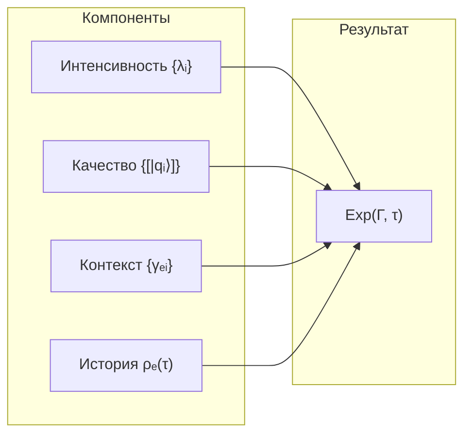

# Теория Интериорности

## Редуцированная матрица опыта

**Матрица плотности измерения Интериорности** $\rho_E$ получается частичным следом [матрицы когерентности](/docs/core/dynamics/coherence-matrix) $\Gamma$ по всем измерениям, кроме $E$:

$$
\rho_E := \mathrm{Tr}_{-E}(\Gamma)
$$

где $\mathrm{Tr}_{-E}$ — частичный след по измерениям $\{A, S, D, L, O, U\}$.

:::warning Требуется расширенный формализм
Частичный след $\mathrm{Tr}_{-E}$ определён только при **тензорной структуре** гильбертова пространства (расширенный формализм: $\mathcal{H} = \bigotimes_i \mathcal{H}_i$).

В **минимальном 7D-формализме** ($\mathcal{H} = \mathbb{C}^7$, где 7 — простое число) частичный след **не определён** — нет тензорной факторизации. Определения в этом документе предполагают расширенный формализм.

См. [Два уровня формализации](/docs/core/dynamics/coherence-matrix#два-уровня-формализации).
:::

## Базовое уравнение

Экспериенциальное содержание связано со спектральным разложением $\rho_E$:

$$
\rho_E |q_i\rangle = \lambda_i |q_i\rangle
$$

где:
- $\lambda_i \in [0, 1]$ — **интенсивность** $i$-го компонента, $\sum_i \lambda_i = 1$
- $|q_i\rangle \in \mathcal{H}_E$ — **качество** $i$-го компонента
- $\mathcal{H}_E$ — гильбертово пространство [измерения Интериорности](/docs/core/structure/dimension-e)

:::warning Терминология
Термин **«квалиа»** используется ТОЛЬКО для L2 (когнитивные квалиа при $R \geq R_{\text{th}} = 1/3$, $\Phi \geq \Phi_{\text{th}} = 1$, $D_{\text{diff}} \geq D_{\min} = 2$). Для общего случая (L0-L2) используется термин **«экспериенциальное содержание»**.

См. [Иерархию интериорности](/docs/proofs/consciousness/interiority-hierarchy) для формальных определений уровней.
:::

## Экспериенциальное содержание

Экспериенциальное содержание (для всех уровней L0-L2) определяется четырьмя компонентами:

$$
\mathrm{Exp}(\Gamma, \tau) := (\mathrm{Intensity}, \mathrm{Quality}, \mathrm{Context}, \mathrm{History})
$$

### Компонент 1: Интенсивность

Спектр собственных значений $\rho_E$:

$$
\mathrm{Intensity}(\rho_E) := \{\lambda_i\}_{i=1}^{n}, \quad \text{где } \rho_E|q_i\rangle = \lambda_i|q_i\rangle
$$

Интенсивность определяет амплитуду интериорного состояния (при L2+: **громкость**, **яркость**, **силу** переживания).

### Компонент 2: Качество

Собственные векторы в проективном пространстве:

$$
\mathrm{Quality}(\rho_E) := \{[|q_i\rangle] \in \mathbb{P}(\mathcal{H}_E)\}_{i=1}^{n}
$$

Качество определяет характер интериорного состояния (при L2+: **тембр**, **цвет**, **характер** переживания).

### Компонент 3: Контекст

Когерентности между измерением $E$ и остальными:

$$
\mathrm{Context}(\Gamma) := \{\gamma_{EA}, \gamma_{ES}, \gamma_{ED}, \gamma_{EL}, \gamma_{EO}, \gamma_{EU}\}
$$

Контекст модулирует опыт через [когерентности](/docs/core/dynamics/coherence-matrix#недиагональные-элементы-когерентности): внимание ($\gamma_{EA}$), настроение, модальность.

### Компонент 4: История

Траектория эволюции $\rho_E$ в окне времени $T_{\mathrm{mem}}$:

$$
\mathrm{History}(\tau, T_{\mathrm{mem}}) := \{\rho_E(\tau') : \tau' \in [\tau - T_{\mathrm{mem}}, \tau]\}
$$

где $T_{\mathrm{mem}} > 0$ — характерное время памяти системы. История определяет адаптацию, привыкание, ожидания.

## Проективное пространство качеств

Качества живут в **проективном пространстве**:

$$
\mathbb{P}(\mathcal{H}_E) := (\mathcal{H}_E \setminus \{0\}) / \sim
$$

где отношение эквивалентности:

$$
|\psi\rangle \sim |\phi\rangle \quad \Leftrightarrow \quad \exists c \in \mathbb{C}^*: |\psi\rangle = c|\phi\rangle
$$

**Топология** (для $\dim(\mathcal{H}_E) = n$):

| Свойство | Описание |
|----------|----------|
| Компактность | $\mathbb{P}(\mathbb{C}^n)$ компактно |
| Связность | $\mathbb{P}(\mathbb{C}^n)$ связно |
| Изоморфизм | $\mathbb{P}(\mathbb{C}^n) \cong S^{2n-1} / U(1)$ |
| Размерность | $\dim_{\mathbb{R}}(\mathbb{P}(\mathbb{C}^n)) = 2n - 2$ |

## Метрика Фубини-Штуди

**Расстояние между качествами:**

$$
d_{FS}([|\psi\rangle], [|\phi\rangle]) := \arccos(|\langle\psi|\phi\rangle|) \in [0, \pi/2]
$$

где $[|\psi\rangle]$ — класс эквивалентности вектора $|\psi\rangle$ в $\mathbb{P}(\mathcal{H}_E)$.

**Свойства:**

| Условие | Значение | Интерпретация |
|---------|----------|---------------|
| $d_{FS} = 0$ | $\vert\psi\rangle = e^{i\theta}\vert\phi\rangle$ | Одинаковые качества |
| $d_{FS} = \pi/2$ | $\langle\psi\vert\phi\rangle = 0$ | Максимально различные качества |

**Инфинитезимальная форма** (риманова метрика):

$$
ds^2 = \langle d\psi|d\psi\rangle - |\langle\psi|d\psi\rangle|^2
$$

## Полная метрика на экспериенциальном пространстве

Расстояние между двумя экспериенциальными состояниями $E_1$, $E_2$:

$$
d_{\mathcal{E}}(E_1, E_2) := \sqrt{d_{\lambda}^2 + \alpha \cdot d_{FS}^2 + \beta \cdot d_C^2 + \gamma \cdot d_H^2}
$$

где компоненты метрики:

| Компонент | Определение | Описание |
|-----------|-------------|----------|
| $d_{\lambda}$ | $\|\boldsymbol{\lambda}_1 - \boldsymbol{\lambda}_2\|_2$ | Евклидово расстояние между спектрами |
| $d_{FS}$ | $\sum_i d_{FS}([\lvert q_i^{(1)}\rangle], [\lvert q_i^{(2)}\rangle])$ | Сумма расстояний Фубини-Штуди |
| $d_C$ | $\|\mathrm{Context}_1 - \mathrm{Context}_2\|_F$ | Норма Фробениуса для контекстов |
| $d_H$ | $\int_{\tau-T_{\mathrm{mem}}}^{\tau} \|\rho_E^{(1)}(\tau') - \rho_E^{(2)}(\tau')\|_F \, d\tau'$ | Интеграл различия историй |

Веса $\alpha, \beta, \gamma > 0$ — параметры модели.

:::warning Эмпирический статус
Веса $\alpha$, $\beta$, $\gamma$ имеют **эмпирический статус** — не выводятся из аксиом УГМ и требуют калибровки для конкретных систем.
:::

## Уровни полноты описания

:::info Примечание
Это иерархия **полноты описания** одного состояния. Не путать с [иерархией интериорности](/docs/proofs/consciousness/interiority-hierarchy) (L0→L1→L2→L3→L4), которая описывает **типы систем**.
:::

| Полнота | Компоненты | Применимость |
|---------|------------|--------------|
| Спектральное | $\{\lambda_i\}$ | Только интенсивности (недостаточно для различения качеств) |
| Геометрическое | $(\{\lambda_i\}, \{[\lvert q_i\rangle]\})$ | Интенсивность + качество |
| Контекстное | $(\{\lambda_i\}, \{[\lvert q_i\rangle]\}, C)$ | + когерентности с другими измерениями |
| Полное | $(\{\lambda_i\}, \{[\lvert q_i\rangle]\}, C, H)$ | + история эволюции |

## Проблема изоспектральности

**Проблема:** Существуют матрицы $\rho_1 \neq \rho_2$ с $\text{Spectrum}(\rho_1) = \text{Spectrum}(\rho_2)$, но разными собственными векторами.

**Решение:** Качества различаются через собственные векторы:

$$
\text{Spectrum}(\rho_1) = \text{Spectrum}(\rho_2), \text{ но } \text{Quality}(\rho_1) \neq \text{Quality}(\rho_2)
$$

$$
\Rightarrow \text{Exp}(\rho_1) \neq \text{Exp}(\rho_2)
$$

Изоспектральные состояния могут иметь **одинаковую интенсивность**, но **разное качество** опыта.

## Примеры когнитивных квалиа (L2)

При выполнении условий L2: $R \geq 1/3$ [С], $\Phi \geq 1$ [О], $D_{\text{diff}} \geq 2$ [С] ([пороги L2](/docs/core/foundations/axiom-septicity#пороги-l2-строгий-вывод)) компоненты опыта становятся рефлексивно доступными.

### Красный цвет

| Компонент | Математическое представление | Феноменальная интерпретация |
|-----------|------------------------------|---------------------------|
| Интенсивность | $\lambda_{\text{red}} \in [0, 1]$ | Яркость |
| Качество | $[\vert q_{\text{red}}\rangle] \in \mathbb{P}(\mathcal{H}_E)$ | Оттенок красного |
| Контекст | $\gamma_{EA}$ (внимание), $\gamma_{EL}$ | Освещение, фон |
| История | $\rho_E(\tau - T_{\mathrm{mem}}) \to \rho_E(\tau)$ | Адаптация сетчатки |

### Боль

| Компонент | Математическое представление | Феноменальная интерпретация |
|-----------|------------------------------|---------------------------|
| Интенсивность | $\lambda_{\text{pain}} \in [0, 1]$ | Сила боли |
| Качество | $[\vert q_{\text{pain}}\rangle] \in \mathbb{P}(\mathcal{H}_E)$ | Острая/тупая/пульсирующая |
| Контекст | $\gamma_{ES}$ (структура), $\gamma_{EO}$ | Локализация, эмоции |
| История | $\{\rho_E(\tau')\}_{\tau' \in [\tau - T_{\mathrm{mem}}, \tau]}$ | Сенситизация/десенситизация |

## Единство опыта

Субъективное единство опыта («Я») обеспечивается [измерением Единства (U)](/docs/core/structure/dimension-u) через когерентности $\gamma_{EU}$:

$$
\Phi_E := \frac{\sum_{i \neq j} |\gamma_{E_i E_j}|^2}{\sum_i \gamma_{E_i E_i}^2}
$$

где $\Phi_E$ — **мера интеграции экспериенциального подпространства** (не путать с глобальной [мерой интеграции $\Phi$](/docs/core/structure/dimension-u#мера-интеграции-φ), которая вычисляется по всей матрице $\Gamma$).

**Условие единого опыта:**

$$
\gamma_{EU} > 0 \quad \land \quad \Phi_E > \Phi_{th}
$$

При $\gamma_{EU} \to 0$ или $\Phi_E < \Phi_{th}$ возникает **диссоциация** — ощущение разделённости сознания.

:::note Связь с мерой сознательности
Единство опыта входит в [меру сознательности](./self-observation#мера-сознательности-c) $C = \Phi \times D_{\text{diff}} \times R$ через компонент $\Phi$.
:::

## Структура экспериенциального пространства

**Пространство интенсивностей:** $(n-1)$-симплекс $\Delta^{n-1} = \{\boldsymbol{\lambda} : \lambda_i \geq 0, \sum_i \lambda_i = 1\}$

**Пространство качеств:** проективное пространство $\mathbb{P}(\mathcal{H}_E)$

## Для разных аудиторий

### Для инженеров

**Вычислительная сложность:**

| Операция | Сложность | Примечание |
|----------|-----------|------------|
| Собственные значения $\rho_E$ | $O(n^3)$ | Стандартная диагонализация |
| Метрика Фубини-Штуди | $O(n)$ | Скалярное произведение |
| Полная метрика $d_{\mathcal{E}}$ | $O(n^3 + T_{\mathrm{mem}}/\Delta\tau)$ | Зависит от длины истории |

**Практическая дискретизация истории:** Храните $T_{\mathrm{mem}} / \Delta\tau$ состояний с шагом $\Delta\tau$. Типичное значение: 100-1000 временных точек.

### Для психологов

Теория интериорности предоставляет **математический язык для описания феноменологии**:

- **Спектр $\rho_E$** — количественная характеристика «палитры» интериорных состояний (при L2+: переживаний)
- **Метрика Фубини-Штуди** — мера «расстояния» между качествами (насколько красный отличается от синего)
- **Контекст** — как внимание, настроение и телесность модулируют опыт
- **История** — механизм адаптации, привыкания, сенситизации

### Для исследователей внутренних ландшафтов

Экспериенциальное содержание — это **карта внутреннего пространства**:

- **Интенсивность** отвечает на вопрос «насколько сильно?»
- **Качество** отвечает на вопрос «что именно?» (цвет, звук, эмоция, телесное ощущение)
- **Контекст** отвечает на вопрос «при каких условиях?» (фокус внимания, эмоциональный фон)
- **История** отвечает на вопрос «откуда пришло и куда движется?»

Изменённые состояния сознания характеризуются изменением **геометрии** этого пространства — расстояния между качествами могут сжиматься (синестезия) или расширяться (обострённое восприятие).

---

**Связанные документы:**
- [Самонаблюдение](./self-observation) — оператор φ и мера рефлексии R
- [Трудная проблема](./two-aspect-monism) — философский анализ
- [Измерение E](/docs/core/structure/dimension-e) — измерение опыта
- [Измерение U](/docs/core/structure/dimension-u) — измерение единства и мера Φ
- [Иерархия интериорности](/docs/proofs/consciousness/interiority-hierarchy) — формальные определения L0→L1→L2→L3→L4
- [Матрица когерентности](/docs/core/dynamics/coherence-matrix) — определение Γ и ρ_E
