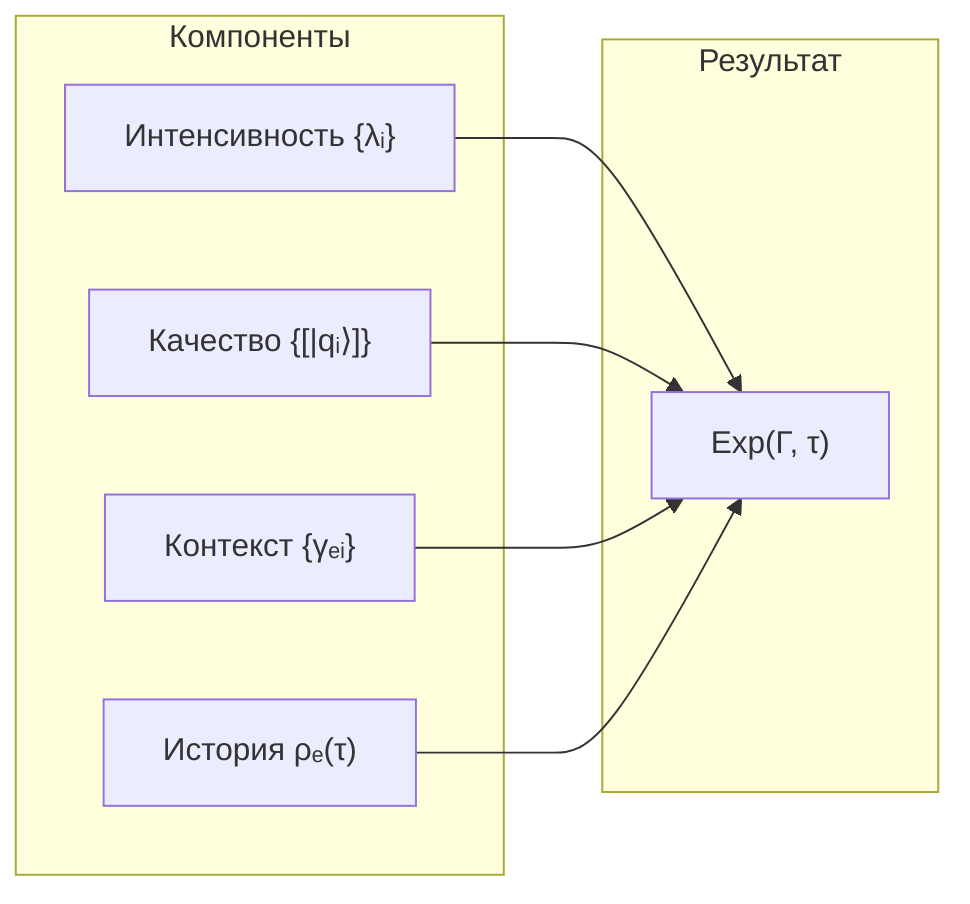

# Теория Интериорности

## «Каково быть летучей мышью?»

В 1974 году философ Томас Нагель опубликовал эссе, ставшее одним из самых цитируемых в философии сознания: *«What Is It Like to Be a Bat?»*. Его аргумент прост и разрушителен:

Летучая мышь воспринимает мир через эхолокацию. У неё есть **субъективный опыт** — «каково это быть» летучей мышью. Но никакое количество нейрофизиологических знаний о мозге летучей мыши не позволит нам **пережить** её опыт. Мы можем описать частоту ультразвука, нейронные паттерны обработки эхо — но между объективным описанием и субъективным переживанием остаётся пропасть.

Нагель поставил вопрос. Дэниэл Деннетт (1991) попытался его обойти, утверждая, что никакого «каково» не существует. Майкл Левин (2019) предположил, что субъективность распространена шире, чем мы думаем, — вплоть до клеточных агрегатов. Но ни один из подходов не дал **математического языка** для описания содержания опыта.

**УГМ даёт этот язык.** Вопрос «каково это быть системой $\Gamma$?» получает точный ответ: содержание опыта определяется спектральным разложением **редуцированной матрицы** $\rho_E = \mathrm{Tr}_{-E}(\Gamma)$.

:::info Откуда мы пришли
В [предыдущей главе](./two-aspect-monism) мы установили, что $\Gamma$ имеет внутреннюю сторону (интериорность) как неотъемлемый аспект, а не надстройку. Теперь мы формализуем: **что именно** эта внутренняя сторона содержит? Ответ — спектральное разложение редуцированной матрицы $\rho_E$.
:::

### Дорожная карта главы

1. **Редуцированная матрица $\rho_E$** — как из полной $\Gamma$ извлекается «проекция на опыт»
2. **Четыре компонента опыта** — интенсивность, качество, контекст, история
3. **Проективное пространство качеств** — геометрия, в которой живут ощущения
4. **Метрика Фубини-Штуди** — расстояние между качествами (насколько красный отличается от синего)
5. **Единство опыта** — как измерение $U$ обеспечивает целостность «Я»
6. **Примеры** — красный цвет и боль в терминах формализма

## Редуцированная матрица опыта

### Мотивация: как извлечь «опытную» часть из полного описания

$\Gamma$ — полная матрица когерентности $7 \times 7$, описывающая **все** аспекты системы: активность, структуру, динамику, логику, интериорность, основание, единство. Но нас интересует конкретно **интериорность** — измерение $E$. Как выделить именно эту часть?

**Аналогия.** Представьте симфонический оркестр из семи секций (7 измерений $\Gamma$). Одна секция — деревянные духовые (измерение $E$, интериорность). Чтобы понять, что «слышит» эта секция, мы можем «заглушить» остальные шесть секций и послушать только её партию — это и есть $\rho_E = \mathrm{Tr}_{-E}(\Gamma)$. Но полная картина звучания требует знания о том, как духовые взаимодействуют с другими секциями — это контекст $\{\gamma_{Ek}\}$.

### Определение

**Матрица плотности измерения Интериорности** $\rho_E$ получается частичным следом [матрицы когерентности](/docs/core/dynamics/coherence-matrix) $\Gamma$ по всем измерениям, кроме $E$:

$$
\rho_E := \mathrm{Tr}_{-E}(\Gamma)
$$

где $\mathrm{Tr}_{-E}$ — частичный след по измерениям $\{A, S, D, L, O, U\}$.

**Что такое частичный след?** Если полная система описывается матрицей $\Gamma$ в пространстве $\mathcal{H}_E \otimes \mathcal{H}_{\text{rest}}$, то частичный след — это операция «суммирования» по всем степеням свободы, кроме интересующего нас измерения $E$. Результат — матрица $\rho_E$, которая содержит всю информацию о $E$-компоненте, доступную без знания остальных измерений.

**Числовой пример.** Пусть $\Gamma$ — состояние с $\gamma_{EE} = 0.20$ (20% ресурса в интериорности). Тогда $\rho_E$ будет иметь след 1 (нормировка), но основной вклад в её спектр будет определяться $\gamma_{EE}$ и когерентностями $\gamma_{Ek}$.

:::tip Морита-эквивалентность 7D и 42D формализмов [Т]
Частичный след $\mathrm{Tr}_{-E}$ формально определён в расширенном формализме ($\mathcal{H} = \mathbb{C}^{42}$). **Однако** 7D и 42D формализмы **Морита-эквивалентны** [Т]: сайты $(\mathcal{C}_7, J_{\text{Bures}})$ и $(\mathcal{C}_{42}^{\text{PW}}, J_{\text{Bures}})$ индуцируют эквивалентные категории пучков $\mathbf{Sh}_\infty(\mathcal{C}_7) \simeq \mathbf{Sh}_\infty(\mathcal{C}_{42}^{\text{PW}})$.

Следовательно, $\rho_E$ однозначно определяется через $\Gamma \in \mathcal{D}(\mathbb{C}^7)$ как E-блок PW-реконструкции. Все определения в этом документе **точны** в 7D-формализме.

См. [Два уровня формализации](/docs/core/dynamics/coherence-matrix#два-уровня-формализации).
:::

:::warning Информационная полнота [О]
$\rho_E = \mathrm{Tr}_{-E}(\Gamma)$ теряет кросс-секторные когерентности $\gamma_{ij}$ при $i,j \notin \{E\}$. Полное экспериенциальное содержание восстанавливается через **контекст**: $\mathrm{Exp}_k = (\lambda_k, [|q_k\rangle], \mathrm{Context}_k, \mathrm{Hist}_k)$, где $\mathrm{Context}_k = \{\gamma_{Ek} : k \neq E\}$ берётся из **полной** матрицы $\Gamma$, а не из $\rho_E$. Таким образом: $\rho_E$ определяет интенсивности и качества; $\Gamma$ определяет контекст и связи.
:::

## Базовое уравнение

Экспериенциальное содержание связано со спектральным разложением $\rho_E$:

$$
\rho_E |q_i\rangle = \lambda_i |q_i\rangle
$$

Это стандартная задача на собственные значения. $\rho_E$ — эрмитова матрица, поэтому по спектральной теореме она диагонализуема, и все собственные значения вещественны:

- $\lambda_i \in [0, 1]$ — **интенсивность** $i$-го компонента, $\sum_i \lambda_i = 1$
- $|q_i\rangle \in \mathcal{H}_E$ — **качество** $i$-го компонента
- $\mathcal{H}_E$ — гильбертово пространство [измерения Интериорности](/docs/core/structure/dimension-e)

**Интерпретация:** Каждое собственное значение $\lambda_i$ показывает, **насколько сильно** присутствует данный компонент опыта. Каждый собственный вектор $|q_i\rangle$ определяет, **какой именно** это компонент — его качественный характер.

:::warning Терминология
Термин **«квалиа»** используется ТОЛЬКО для L2 (когнитивные квалиа при $R \geq R_{\text{th}} = 1/3$, $\Phi \geq \Phi_{\text{th}} = 1$, $D_{\text{diff}} \geq D_{\min} = 2$). Для общего случая (L0-L2) используется термин **«экспериенциальное содержание»**.

См. [Иерархию интериорности](/docs/proofs/consciousness/interiority-hierarchy) для формальных определений уровней.
:::

## Экспериенциальное содержание: четыре компонента

Что конкретно переживает система? УГМ даёт ответ через четыре компонента, каждый из которых вычислим из $\Gamma$:

$$
\mathrm{Exp}(\Gamma, \tau) := (\mathrm{Intensity}, \mathrm{Quality}, \mathrm{Context}, \mathrm{History})
$$

**Аналогия с палитрой художника.** Представьте палитру с красками. **Интенсивность** — сколько краски каждого цвета на палитре (много красного, мало синего). **Качество** — сами цвета (красный, синий, зелёный). **Контекст** — освещение в мастерской, которое меняет восприятие цветов. **История** — как палитра выглядела минуту назад (художник только что добавил жёлтый).

### Компонент 1: Интенсивность

Спектр собственных значений $\rho_E$:

$$
\mathrm{Intensity}(\rho_E) := \{\lambda_i\}_{i=1}^{n}, \quad \text{где } \rho_E|q_i\rangle = \lambda_i|q_i\rangle
$$

Интенсивность определяет амплитуду интериорного состояния (при L2+: **громкость**, **яркость**, **силу** переживания).

**Числовой пример.** Пусть $\rho_E$ имеет спектр $\{0.6, 0.3, 0.1\}$. Это означает: доминирующий компонент опыта занимает 60% «ширины полосы», второй — 30%, третий — 10%. Как яркая красная роза на фоне приглушённого зелёного сада с едва заметным жужжанием пчелы.

### Компонент 2: Качество

Собственные векторы в проективном пространстве:

$$
\mathrm{Quality}(\rho_E) := \{[|q_i\rangle] \in \mathbb{P}(\mathcal{H}_E)\}_{i=1}^{n}
$$

Качество определяет характер интериорного состояния (при L2+: **тембр**, **цвет**, **характер** переживания).

Квадратные скобки $[\cdot]$ обозначают **класс эквивалентности**: вектор и его умножение на комплексное число дают одно и то же качество. Это физически осмыслено: глобальная фаза ненаблюдаема.

### Компонент 3: Контекст

Когерентности между измерением $E$ и остальными:

$$
\mathrm{Context}(\Gamma) := \{\gamma_{EA}, \gamma_{ES}, \gamma_{ED}, \gamma_{EL}, \gamma_{EO}, \gamma_{EU}\}
$$

Контекст модулирует опыт через [когерентности](/docs/core/dynamics/coherence-matrix#недиагональные-элементы-когерентности):

| Когерентность | Описание модуляции |
|---------------|-------------------|
| $\gamma_{EA}$ | Внимание — насколько активно система обрабатывает интериорное содержание |
| $\gamma_{ES}$ | Структурный контекст — телесные ощущения, пространственная привязка |
| $\gamma_{ED}$ | Динамический контекст — временная развёртка, ритм переживания |
| $\gamma_{EL}$ | Логический контекст — концептуальное оформление (при L2) |
| $\gamma_{EO}$ | Эмоциональный тон — связь с базовыми установками |
| $\gamma_{EU}$ | Единство — насколько опыт интегрирован в целостное «Я» |

### Компонент 4: История

Траектория эволюции $\rho_E$ в окне времени $T_{\mathrm{mem}}$:

$$
\mathrm{History}(\tau, T_{\mathrm{mem}}) := \{\rho_E(\tau') : \tau' \in [\tau - T_{\mathrm{mem}}, \tau]\}
$$

где $T_{\mathrm{mem}} > 0$ — характерное время памяти системы. История определяет адаптацию, привыкание, ожидания. Без истории невозможны **ожидание** (предсказание будущего $\rho_E$ на основе прошлого), **привыкание** (снижение интенсивности при повторном воздействии) и **удивление** (расхождение между ожидаемым и реальным $\rho_E$).

## Проективное пространство качеств

### Мотивация: почему качества живут в проективном пространстве

Качества опыта — не просто набор чисел. Они образуют **геометрическое пространство** со своей метрикой. Это пространство — проективное пространство $\mathbb{P}(\mathcal{H}_E)$.

Почему проективное, а не обычное? Потому что **глобальная фаза ненаблюдаема**: вектор $|q\rangle$ и $e^{i\theta}|q\rangle$ описывают одно и то же качество. Поэтому мы работаем не с векторами, а с **лучами** — классами эквивалентности:

$$
\mathbb{P}(\mathcal{H}_E) := (\mathcal{H}_E \setminus \{0\}) / \sim
$$

где отношение эквивалентности:

$$
|\psi\rangle \sim |\phi\rangle \quad \Leftrightarrow \quad \exists c \in \mathbb{C}^*: |\psi\rangle = c|\phi\rangle
$$

**Аналогия.** Подумайте о направлениях на компасе. Северо-восток — это направление, не точка. Удвоение стрелки компаса не меняет направления. Точно так же удвоение вектора $|q\rangle$ не меняет качества — направление то же.

**Топология** (для $\dim(\mathcal{H}_E) = n$):

| Свойство | Описание |
|----------|----------|
| Компактность | $\mathbb{P}(\mathbb{C}^n)$ компактно |
| Связность | $\mathbb{P}(\mathbb{C}^n)$ связно |
| Изоморфизм | $\mathbb{P}(\mathbb{C}^n) \cong S^{2n-1} / U(1)$ |
| Размерность | $\dim_{\mathbb{R}}(\mathbb{P}(\mathbb{C}^n)) = 2n - 2$ |

**Связность** означает, что от любого качества можно непрерывно перейти к любому другому — нет «изолированных островов» в пространстве переживаний. **Компактность** гарантирует, что пространство качеств конечно — нет «бесконечных далей».

## Метрика Фубини-Штуди

### Мотивация: как измерить расстояние между переживаниями

Интуитивно, красный «ближе» к оранжевому, чем к синему. Боль в пальце «ближе» к боли в руке, чем к запаху розы. Но можно ли это формализовать?

Метрика Фубини-Штуди — единственная (с точностью до константы) монотонная риманова метрика на проективном пространстве (теорема Ченцова-Пеца). Это не произвольный выбор, а **вынужденная структура**.

**Расстояние между качествами:**

$$
d_{FS}([|\psi\rangle], [|\phi\rangle]) := \arccos(|\langle\psi|\phi\rangle|) \in [0, \pi/2]
$$

где $[|\psi\rangle]$ — класс эквивалентности вектора $|\psi\rangle$ в $\mathbb{P}(\mathcal{H}_E)$.

**На пальцах:** Возьмите два вектора $|q_1\rangle$ и $|q_2\rangle$, представляющие два качества. Вычислите их скалярное произведение (по модулю). Если оно равно 1 — качества совпадают. Если 0 — максимально различны. Расстояние Фубини-Штуди — арккосинус этого модуля.

**Числовой пример.** Пусть $|q_{\text{red}}\rangle = \begin{pmatrix}1\\0\end{pmatrix}$ и $|q_{\text{orange}}\rangle = \begin{pmatrix}\cos 15°\\\sin 15°\end{pmatrix}$. Тогда:

$$d_{FS} = \arccos(|\cos 15°|) = 15° \approx 0.26 \text{ рад}$$

А для $|q_{\text{blue}}\rangle = \begin{pmatrix}0\\1\end{pmatrix}$:

$$d_{FS}(\text{red}, \text{blue}) = \arccos(0) = \pi/2 \approx 1.57 \text{ рад}$$

Красный действительно ближе к оранжевому, чем к синему.

**Свойства:**

| Условие | Значение | Интерпретация |
|---------|----------|---------------|
| $d_{FS} = 0$ | $\vert\psi\rangle = e^{i\theta}\vert\phi\rangle$ | Одинаковые качества |
| $d_{FS} = \pi/2$ | $\langle\psi\vert\phi\rangle = 0$ | Максимально различные качества |

**Инфинитезимальная форма** (риманова метрика):

$$
ds^2 = \langle d\psi|d\psi\rangle - |\langle\psi|d\psi\rangle|^2
$$

## Полная метрика на экспериенциальном пространстве

Расстояние между двумя экспериенциальными состояниями $E_1$, $E_2$:

$$
d_{\mathcal{E}}(E_1, E_2) := \sqrt{d_{\lambda}^2 + \alpha \cdot d_{FS}^2 + \beta \cdot d_C^2 + \gamma \cdot d_H^2}
$$

где компоненты метрики:

| Компонент | Определение | Описание |
|-----------|-------------|----------|
| $d_{\lambda}$ | $\|\boldsymbol{\lambda}_1 - \boldsymbol{\lambda}_2\|_2$ | Евклидово расстояние между спектрами |
| $d_{FS}$ | $\sum_i d_{FS}([\lvert q_i^{(1)}\rangle], [\lvert q_i^{(2)}\rangle])$ | Сумма расстояний Фубини-Штуди |
| $d_C$ | $\|\mathrm{Context}_1 - \mathrm{Context}_2\|_F$ | Норма Фробениуса для контекстов |
| $d_H$ | $\int_{\tau-T_{\mathrm{mem}}}^{\tau} \|\rho_E^{(1)}(\tau') - \rho_E^{(2)}(\tau')\|_F \, d\tau'$ | Интеграл различия историй |

Веса $\alpha, \beta, \gamma > 0$ — параметры модели.

:::warning Эмпирический статус
Веса $\alpha$, $\beta$, $\gamma$ имеют **эмпирический статус** — не выводятся из аксиом УГМ и требуют калибровки для конкретных систем.
:::

:::info $G_2$-инвариантность экспериенциальной метрики [Т]
Все компоненты метрики $d_{\mathcal{E}}$ — **$G_2$-инвариантны**: для $U \in G_2$ выполнено $d_{\mathcal{E}}(E_1, E_2) = d_{\mathcal{E}}(UE_1 U^\dagger, UE_2 U^\dagger)$. Это следует из:
- $d_\lambda$: спектр $\rho_E$ не меняется при унитарном сопряжении (в частности, при $G_2 \subset U(7)$)
- $d_{FS}$: метрика Фубини-Штуди инвариантна при $U(n)$-преобразованиях (теорема Ченцова-Пеца)
- $d_C$, $d_H$: контекст и история определяются через матричные элементы $\Gamma$, преобразуемые ковариантно

Следовательно, **геометрия экспериенциального пространства объективна** — не зависит от выбора калибровки ($G_2$-фрейма). [Теорема $G_2$-ригидности](/docs/proofs/categorical/uniqueness-theorem#инварианты) [Т] гарантирует: различные наблюдатели измеряют одну и ту же феноменальную геометрию.
:::

## Уровни полноты описания

:::info Примечание
Это иерархия **полноты описания** одного состояния. Не путать с [иерархией интериорности](/docs/proofs/consciousness/interiority-hierarchy) (L0→L1→L2→L3→L4), которая описывает **типы систем**.
:::

| Полнота | Компоненты | Применимость |
|---------|------------|--------------|
| Спектральное | $\{\lambda_i\}$ | Только интенсивности (недостаточно для различения качеств) |
| Геометрическое | $(\{\lambda_i\}, \{[\lvert q_i\rangle]\})$ | Интенсивность + качество |
| Контекстное | $(\{\lambda_i\}, \{[\lvert q_i\rangle]\}, C)$ | + когерентности с другими измерениями |
| Полное | $(\{\lambda_i\}, \{[\lvert q_i\rangle]\}, C, H)$ | + история эволюции |

## Проблема изоспектральности

**Проблема:** Существуют матрицы $\rho_1 \neq \rho_2$ с $\text{Spectrum}(\rho_1) = \text{Spectrum}(\rho_2)$, но разными собственными векторами. Могут ли два совершенно разных переживания иметь одинаковую «громкость»?

**Ответ: да, и формализм это различает.** Качества различаются через собственные векторы:

$$
\text{Spectrum}(\rho_1) = \text{Spectrum}(\rho_2), \text{ но } \text{Quality}(\rho_1) \neq \text{Quality}(\rho_2)
$$

$$
\Rightarrow \text{Exp}(\rho_1) \neq \text{Exp}(\rho_2)
$$

Изоспектральные состояния могут иметь **одинаковую интенсивность**, но **разное качество** опыта.

**Аналогия.** Два аккорда могут иметь одинаковую громкость (интенсивность), но звучать совершенно по-разному (качество): мажор и минор — изоспектральны по амплитуде, но различны по тембру.

## Примеры когнитивных квалиа (L2)

При выполнении условий L2: $R \geq 1/3$ [Т], $\Phi \geq 1$ [Т] (T-129), $D_{\text{diff}} \geq 2$ [Т] (T-151) ([пороги L2](/docs/core/foundations/axiom-septicity#пороги-l2-строгий-вывод)) компоненты опыта становятся рефлексивно доступными — система не просто «переживает», но **знает, что переживает**.

### Красный цвет

| Компонент | Математическое представление | Феноменальная интерпретация |
|-----------|------------------------------|---------------------------|
| Интенсивность | $\lambda_{\text{red}} \in [0, 1]$ | Яркость |
| Качество | $[\vert q_{\text{red}}\rangle] \in \mathbb{P}(\mathcal{H}_E)$ | Оттенок красного |
| Контекст | $\gamma_{EA}$ (внимание), $\gamma_{EL}$ | Освещение, фон |
| История | $\rho_E(\tau - T_{\mathrm{mem}}) \to \rho_E(\tau)$ | Адаптация сетчатки |

Когда вы смотрите на красную розу: $\lambda_{\text{red}} \approx 0.7$ (доминирующий компонент), $|q_{\text{red}}\rangle$ определяет конкретный оттенок, $\gamma_{EA}$ высокое (вы обращаете внимание), $\gamma_{EO}$ задаёт эмоциональный тон (красота, радость). Через минуту адаптации $\lambda_{\text{red}}$ слегка снижается — история.

### Боль

| Компонент | Математическое представление | Феноменальная интерпретация |
|-----------|------------------------------|---------------------------|
| Интенсивность | $\lambda_{\text{pain}} \in [0, 1]$ | Сила боли |
| Качество | $[\vert q_{\text{pain}}\rangle] \in \mathbb{P}(\mathcal{H}_E)$ | Острая/тупая/пульсирующая |
| Контекст | $\gamma_{ES}$ (структура), $\gamma_{EO}$ | Локализация, эмоции |
| История | $\{\rho_E(\tau')\}_{\tau' \in [\tau - T_{\mathrm{mem}}, \tau]}$ | Сенситизация/десенситизация |

Различие между острой и тупой болью — это различие в $|q_{\text{pain}}\rangle$, а не в $\lambda_{\text{pain}}$. Сильная тупая боль ($\lambda = 0.8$, $|q_{\text{dull}}\rangle$) и слабая острая боль ($\lambda = 0.3$, $|q_{\text{sharp}}\rangle$) различаются по обоим компонентам.

## Связь с нейронаукой

Как $\rho_E$ соотносится с нейрокоррелятами сознания (NCC)?

В нейронауке NCC — это минимальный нейронный механизм, достаточный для конкретного переживания. В УГМ:

| Нейронаучный термин | Соответствие в УГМ |
|--------------------|--------------------|
| NCC (нейрокоррелят сознания) | Проекция $\Gamma$ на нейронный базис |
| Содержание сознания | $\rho_E$ (редуцированная матрица) |
| Уровень возбуждения | $\lambda_{\max}(\rho_E)$ (доминирующая интенсивность) |
| Связность (functional connectivity) | $\Phi$ (мера интеграции) |
| Нейронная дифференциация | $D_{\text{diff}}$ |

УГМ не конкурирует с нейронаукой, а предоставляет **математический язык**, на котором нейронные данные могут быть интерпретированы. Предсказание: нейронные паттерны, соответствующие сознательному восприятию, должны удовлетворять $P > 2/7$, $R \geq 1/3$, $\Phi \geq 1$ (если корректно отображены в $\Gamma$-формализм).

## Единство опыта

### Проблема связывания (binding problem)

Нейронаука знает, что цвет обрабатывается в зоне V4, форма — в зоне IT, движение — в MT. Но мы видим **единый** объект: красный мяч, летящий вправо. Как разнесённые по коре представления объединяются в целостный опыт?

### Решение УГМ

Субъективное единство опыта («Я») обеспечивается [измерением Единства (U)](/docs/core/structure/dimension-u) через когерентности $\gamma_{EU}$:

$$
\Phi_E := \frac{\sum_{i \neq j} |\gamma_{E_i E_j}|^2}{\sum_i \gamma_{E_i E_i}^2}
$$

где $\Phi_E$ — **мера интеграции экспериенциального подпространства** (не путать с глобальной [мерой интеграции $\Phi$](/docs/core/structure/dimension-u#мера-интеграции-φ), которая вычисляется по всей матрице $\Gamma$).

**Условие единого опыта:**

$$
\gamma_{EU} > 0 \quad \land \quad \Phi_E > \Phi_{th}
$$

При $\gamma_{EU} \to 0$ или $\Phi_E < \Phi_{th}$ возникает **диссоциация** — ощущение разделённости сознания. Это наблюдается клинически: при диссоциативных расстройствах пациенты описывают опыт как «не мой», «наблюдаю со стороны» — что соответствует снижению $\gamma_{EU}$.

:::note Связь с мерой сознательности
Единство опыта входит в [меру сознательности](./self-observation#мера-сознательности-c) $C = \Phi \times R$ **[Т T-140]** через компонент $\Phi$. Дифференциация $D_{\text{diff}} \geq 2$ — отдельное условие жизнеспособности ([T-128](/docs/proofs/consciousness/operationalization#t-128)).
:::

## Структура экспериенциального пространства

```mermaid
graph LR
    subgraph Input["Компоненты"]
        I["Интенсивность {λᵢ}"]
        Q["Качество {[|qᵢ⟩]}"]
        C["Контекст {γₑᵢ}"]
        H["История ρₑ#40;τ#41;"]
    end
    subgraph Output["Результат"]
        Exp["Exp#40;Γ, τ#41;"]
    end
    I --> Exp
    Q --> Exp
    C --> Exp
    H --> Exp
```

**Пространство интенсивностей:** $(n-1)$-симплекс $\Delta^{n-1} = \{\boldsymbol{\lambda} : \lambda_i \geq 0, \sum_i \lambda_i = 1\}$

**Пространство качеств:** проективное пространство $\mathbb{P}(\mathcal{H}_E)$

## Для разных аудиторий

### Для инженеров

**Вычислительная сложность:**

| Операция | Сложность | Примечание |
|----------|-----------|------------|
| Собственные значения $\rho_E$ | $O(n^3)$ | Стандартная диагонализация |
| Метрика Фубини-Штуди | $O(n)$ | Скалярное произведение |
| Полная метрика $d_{\mathcal{E}}$ | $O(n^3 + T_{\mathrm{mem}}/\Delta\tau)$ | Зависит от длины истории |

**Практическая дискретизация истории:** Храните $T_{\mathrm{mem}} / \Delta\tau$ состояний с шагом $\Delta\tau$. Типичное значение: 100-1000 временных точек.

### Для психологов

Теория интериорности предоставляет **математический язык для описания феноменологии**:

- **Спектр $\rho_E$** — количественная характеристика «палитры» интериорных состояний (при L2+: переживаний)
- **Метрика Фубини-Штуди** — мера «расстояния» между качествами (насколько красный отличается от синего)
- **Контекст** — как внимание, настроение и телесность модулируют опыт
- **История** — механизм адаптации, привыкания, сенситизации

### Для исследователей внутренних ландшафтов

Экспериенциальное содержание — это **карта внутреннего пространства**:

- **Интенсивность** отвечает на вопрос «насколько сильно?»
- **Качество** отвечает на вопрос «что именно?» (цвет, звук, эмоция, телесное ощущение)
- **Контекст** отвечает на вопрос «при каких условиях?» (фокус внимания, эмоциональный фон)
- **История** отвечает на вопрос «откуда пришло и куда движется?»

Изменённые состояния сознания характеризуются изменением **геометрии** этого пространства — расстояния между качествами могут сжиматься (синестезия) или расширяться (обострённое восприятие).

### Что мы узнали

- **Экспериенциальное содержание** полностью определяется четырьмя компонентами: интенсивность ($\lambda_i$), качество ($[|q_i\rangle]$), контекст ($\gamma_{Ek}$), история ($\rho_E(\tau')$).
- **Качества живут в проективном пространстве** $\mathbb{P}(\mathcal{H}_E)$, наделённом метрикой Фубини-Штуди — единственной монотонной метрикой (теорема Ченцова-Пеца).
- **Геометрия опыта объективна** — $G_2$-инвариантность метрики $d_{\mathcal{E}}$ гарантирует, что разные наблюдатели измеряют одну и ту же феноменальную геометрию.
- **Изоспектральные состояния** могут иметь одинаковую интенсивность, но разное качество — формализм различает оба аспекта.
- **Единство опыта** обеспечивается когерентностью $\gamma_{EU} > 0$ и мерой интеграции $\Phi_E > \Phi_{\mathrm{th}}$.
- Термин «квалиа» корректен **только для L2** ($R \geq 1/3$, $\Phi \geq 1$, $D_{\mathrm{diff}} \geq 2$); для L0--L1 используется «экспериенциальное содержание».

:::tip Куда дальше
Теория интериорности описала **что** переживается. Следующий вопрос: **как** система может наблюдать собственное содержание? Ответ дает [Самонаблюдение](./self-observation) — оператор $\varphi$, мера рефлексии $R$ и мера сознательности $C = \Phi \times R$.

Для количественных определений стресса, капы и свободной энергии см. [определения Когерентной кибернетики](/docs/applied/coherence-cybernetics/definitions).
:::

---

**Связанные документы:**
- [Самонаблюдение](./self-observation) — оператор $\varphi$ и мера рефлексии R
- [Трудная проблема](./two-aspect-monism) — философский анализ
- [Измерение E](/docs/core/structure/dimension-e) — измерение опыта
- [Измерение U](/docs/core/structure/dimension-u) — измерение единства и мера $\Phi$
- [Иерархия интериорности](/docs/proofs/consciousness/interiority-hierarchy) — формальные определения L0→L1→L2→L3→L4
- [Матрица когерентности](/docs/core/dynamics/coherence-matrix) — определение $\Gamma$ и $\rho_E$
- [Определения КК](/docs/applied/coherence-cybernetics/definitions) — операциональные формулы для инженеров
