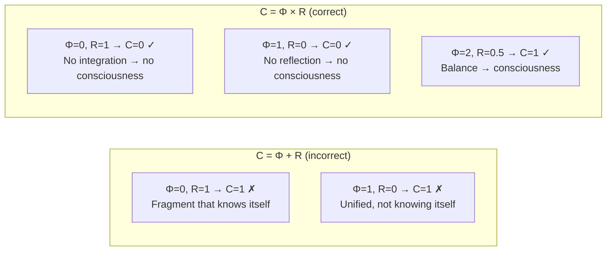

# Self-Observation and Consciousness

:::note Articulation-hygiene convention
The terms **self-observation**, **self-modelling**, **self-reference** as used throughout this document are *lifted technical terms*, not rhetorical shorthands. Each carries an explicit operator-factorization per the articulation-hygiene protocol (NO-19 in Noesis / [`reference/articulation-hygiene`](/docs/reference/articulation-hygiene)):

- **self-modelling** ⟼ CPTP functor $\varphi: \mathrm{D}(\mathbb{C}^7) \to \mathrm{D}(\mathbb{C}^7)$ with fixed-point equation $\rho^* = \varphi(\Gamma)$ (T-96).
- **self-observation** ⟼ terminal-coalgebra structure on Γ-dynamics, characterised by reflection measure $R = 1/(7P)$ (T-126).
- **self-reference** ⟼ Lawvere fixed-point morphism bounded by T-2f\*-depth-stratification (105.T in Diakrisis).

The pair (operator Φ, fixed object $t$) is explicit at every occurrence; the description-position and described-position are structurally distinct even when visually co-located in the term.
:::

## Can the Eye See Itself?

This ancient paradox is the key to understanding consciousness. The eye sees everything except itself. The brain processes all information except... its own processing? At first glance, self-observation seems logically impossible: to observe oneself, one needs an observer, but who observes the observer?

### From Gödel to Strange Loops

In 1931, Kurt Gödel proved the incompleteness theorem: a sufficiently powerful formal system cannot prove its own consistency. This seemed fatal to the idea of self-observation — if even mathematics cannot fully 'know itself', how can consciousness do it?

Douglas Hofstadter in *Gödel, Escher, Bach* (1979) proposed an answer: **strange loops** — strange loops of self-reference. Consciousness is not complete self-knowledge (which is impossible by Gödel), but an **approximate self-model** of limited precision. Hofstadter showed that self-reference is not a bug but a feature: it is precisely what gives rise to the 'I'.

**UHM formalises this idea.** The self-modelling operator $\varphi$ is a mathematically precise 'strange loop':
- $\varphi(\Gamma) \approx \Gamma$ (the self-model is approximate — a nod to Gödel)
- $R$ measures the quality of the approximation (neither 0 nor 1 — between ignorance and omniscience)
- Banach's theorem guarantees convergence (the loop is stable, not divergent)

:::info Where We Came From
In [interiority theory](./interiority-theory) we described **what** is experienced — the spectral decomposition of $\rho_E$, the Fubini-Study metric, four components of experience. Now we ask the next question: **how** can the system observe its own contents? The answer is the self-modelling operator $\varphi$ and the reflection measure $R$.
:::

### Chapter Roadmap

1. **Operator $\varphi$** — CPTP self-modelling channel: the system builds a model of itself
2. **Fixed-point theorem** — each act of self-observation brings the system closer to accurate self-knowledge
3. **Reflection measure $R$** — quantitative assessment of self-model quality ($R = 1/(7P)$)
4. **Higher-order reflection $R^{(n)}$** — 'I know that I know' and deeper
5. **Consciousness measure $C = \Phi \times R$** — scalar summary of 'how conscious is the system'
6. **CRL** — compilable reflexive language for self-modification

**Analogy.** Imagine an artist painting a self-portrait while looking in a mirror. The mirror is the operator $\varphi$: it creates a model ($\varphi(\Gamma)$) of the original ($\Gamma$). The quality of the mirror is the measure $R$: a perfect mirror gives $R = 1$, a clouded one gives $R \approx 0$. The threshold $R \geq 1/3$ means: the mirror is clear enough that the artist **recognises themselves** — this is the boundary of cognitive qualia (L2).

## Consciousness as Self-Observation of $\Gamma$

Consciousness is neither an epiphenomenon nor a separate substance. **Consciousness is the way Γ experiences its own configuration** [И].

:::info Ontological Status [П]
Every configuration $\Gamma$ has an 'external' (objective) and 'internal' (subjective) side. They are inseparable — this is not dualism, but **two-aspect monism** [П]. The mathematical structure (functorial isomorphism $F: \mathbf{Phys} \to \mathbf{Phen}$) is [Т] (T-186). The ontological identification of the internal aspect with *experience* is the single postulate [П] of UHM beyond the $\infty$-topos primitive itself.
:::

## Self-Modelling Operator φ {#оператор-самомоделирования-φ}

### What Is a CPTP Channel (in Plain Language)

Before defining $\varphi$, let us explain what a **CPTP channel** (Completely Positive Trace-Preserving) is. This is a central concept in quantum information theory, but its meaning is simple:

- **Trace-Preserving**: if the system has total 'probability' 1, after the transformation it remains 1. Nothing is created from nothing and nothing disappears.
- **Completely Positive**: the transformation is correct even if the system is part of a larger one. It cannot create negative probabilities.

**Analogy.** A CPTP channel is like a photocopier for density matrices: it creates a (possibly distorted) copy, but does not violate physical laws. The sum of diagonal elements (normalisation) is preserved, the matrix remains positive semidefinite.

### Definition

**The self-modelling operator** $\varphi$ — a CPTP channel modelling the system's self-observation process:

$$
\varphi: \mathcal{D}(\mathcal{H}) \to \mathcal{D}(\mathcal{H})
$$

$$
\varphi(\Gamma) = \sum_m K_m \Gamma K_m^\dagger
$$

where $\{K_m\}$ — Kraus operators satisfying the condition:

$$
\sum_m K_m^\dagger K_m = I
$$

The canonical form for UHM is defined in [§2.6 of the Formalisation of φ](/docs/proofs/categorical/formalization-phi#26-каноническая-форма-φ-для-угм). Full details, including fixed-point theorems and the connection with regeneration: [Formalisation of the φ-operator](/docs/proofs/categorical/formalization-phi).

**What does $\varphi$ do?** It takes the current state $\Gamma$ (the original) and creates its **internal model** $\varphi(\Gamma)$. This is not copying (which is forbidden by the no-cloning theorem in quantum mechanics), but the creation of an approximate model via a CPTP channel.

:::tip CPTP Property and No-Signalling (NS3)
The CPTP property of $\varphi$ is **critical** not only for mathematical correctness, but also for compatibility with quantum mechanics. It is precisely from CPTP that the [NS3 condition](/docs/core/dynamics/evolution#запрет-сигнализации) follows:

$$
\mathrm{Tr}_A[(\varphi_A \otimes \mathrm{id}_B)(\Gamma_{AB})] = \mathrm{Tr}_A[\Gamma_{AB}] = \Gamma_B
$$

which guarantees that the regenerative term $\mathcal{R}$ [does not violate no-signalling](/docs/proofs/physics/physics-correspondence#запрет-сигнализации). Any modification of $\varphi$ that violates the CPTP condition $\sum_m K_m^\dagger K_m = I$ potentially opens a channel for superluminal communication.
:::

:::tip Physical Realisation — Resolved [T]
The operator $\varphi$ has an explicit physical realisation as a **replacement channel** (see [theorem below](#теорема-физическая-реализация-phi)): $\varphi_k(\Gamma) = (1-k)\Gamma + k\rho^*$, where $\rho^* = \varphi(\Gamma)$ — the [categorical self-model](/docs/core/operators/phi-operator) of the current state [T]. This closes the 'operational gap': $\rho^*$ is determined by categorical structure (left adjoint), $k$ is an observable parameter (ratio of predictive to reactive activity).
:::

:::note Note on Notation
$\varphi$ (phi) — the self-modelling operator. Not to be confused with $\Phi$ — the [integration measure](/docs/core/structure/dimension-u#мера-интеграции-φ).
:::

### Interpretation of Kraus Operators

| Property | Description |
|----------|-------------|
| $K_m$ | 'Filters of perception' — partial aspects of self-observation |
| $\sum_m K_m^\dagger K_m = I$ | Preservation of normalisation: $\mathrm{Tr}(\varphi(\Gamma)) = 1$ |
| CPTP | Preserves positivity $\Gamma \geq 0$ and trace — [theorem](/docs/core/dynamics/evolution#сохранение-положительности) |

**Analogy.** Each Kraus operator $K_m$ is like one 'angle' in the mirror. We do not see ourselves entirely in a single glance; we assemble the image from multiple partial perspectives. The condition $\sum K_m^\dagger K_m = I$ guarantees that all perspectives together give a complete picture (up to the quality of the mirror).

### Physical Realisation of the φ-Operator {#физическая-реализация-phi}

#### Theorem (Physical Realisation of the φ-Operator) [T] {#теорема-физическая-реализация-phi}

The self-modelling operator $\varphi$ is realised as a replacement channel:

$$
\varphi_k(\Gamma) = (1-k)\Gamma + k\rho^*
$$

where $\rho^* = \varphi(\Gamma)$ — the [categorical self-model](/docs/core/operators/phi-operator) of the current state [T], $k = 1 - R$ — the degree of self-modelling, determined by the reflection measure $R$ (see [below](#теорема-k-из-r)).

**What this means in plain terms:** Self-modelling is a **mixing** of the current state $\Gamma$ with the 'ideal model' $\rho^*$. The parameter $k$ determines the proportion: at $k = 0$ (ideal self-model, $R = 1$) the system requires no correction; at $k = 1$ (complete absence of self-model, $R = 0$) the system is fully replaced by the model.

**Proof.** By the [categorical definition](/docs/core/operators/phi-operator) of $\varphi$ (left adjoint to the inclusion of subobjects), the self-model $\varphi(\Gamma) = \rho^*$ is unique for each $\Gamma$. The replacement channel $T_k(\Gamma) := (1-k)\Gamma + k\rho^*$ — a convex combination of $\mathrm{Id}$ and $\mathcal{C}_{\rho^*}$ (the replacement channel [T](/docs/core/dynamics/evolution#вывод-формы-регенерации)) — is therefore CPTP for $k \in [0,1]$. Contractivity: $\|T_k(\Gamma_1) - T_k(\Gamma_2)\|_F = (1-k)\|\Gamma_1 - \Gamma_2\|_F$ with contraction constant $(1-k) < 1$. $\blacksquare$

**Physical interpretation:** $\rho^*$ — the internal generative model (prediction); $k = 1 - R$ — the degree of trust in the model (precision weighting in predictive coding), determined by the [reflection measure](#теорема-k-из-r) [T].

**Measurement:** $R(\Gamma) = 1 - \|\Gamma - \rho^*\|_F^2 / \|\Gamma\|_F^2$.

#### Fixed Point (CC-4) [T] {#неподвижная-точка-кк4}

$\Gamma^* = \rho^*_{\mathrm{diss}} = I/7$ — the unique fixed point of the simple replacement channel ($\varphi_k(\Gamma^*) = \Gamma^*$ for $k > 0$).

**Proof.** $(1-k)\Gamma^* + k\rho^*_{\mathrm{diss}} = \Gamma^*$ $\Rightarrow$ $k(\Gamma^* - \rho^*_{\mathrm{diss}}) = 0$ $\Rightarrow$ $\Gamma^* = \rho^*_{\mathrm{diss}}$ (for $k > 0$). Uniqueness follows from the algebra of the replacement channel. $\blacksquare$

#### Attractor Hierarchy [D] {#иерархия-аттракторов}

The theory distinguishes **three fixed points** at different levels:

| Level | Object | Definition | $P$ | Role in theory |
|-------|--------|------------|-----|----------------|
| 0 | $\rho^*_{\mathrm{diss}} = I/7$ | $\mathcal{D}_\Omega[\rho^*_{\mathrm{diss}}] = 0$ | $1/7$ | **Reference for $R$**: distance from heat death |
| 1 | $\rho^*_\Omega$ | $\mathcal{L}_\Omega[\rho^*_\Omega] = 0$ | $> 1/7$ [T] | **Physical attractor**: balance of dissipation and regeneration |
| 2 | $\Gamma^*_{\mathrm{coh}}$ | $\varphi_{\mathrm{coh}}(\Gamma^*_{\mathrm{coh}}) = \Gamma^*_{\mathrm{coh}}$ | $P_{\mathrm{crit}} = 2/7$ | **Viability boundary**: target of canonical $\varphi_{\mathrm{coh}}$ |

**Non-triviality of the attractor** [T]: $\rho^*_\Omega \neq I/7$ — proved via $\kappa_{\mathrm{bootstrap}} > 0$ (T-59). See the [full proof](/docs/core/dynamics/evolution#теорема-нетривиальность-аттрактора).

The formula $R = 1/(7P)$ uses $\rho^*_{\mathrm{diss}} = I/7$ — this is correct because $R$ measures the **distance from heat death**, not the distance from the dynamic attractor $\rho^*_\Omega$.

:::info Definition Stratification
- **Simple form** $\varphi_k$: fixed point $\rho^*_{\mathrm{diss}} = I/7$ ($P = 1/7$, non-viable)
- **Canonical** $\varphi_{\mathrm{coh}}$: fixed point $\Gamma^*_{\mathrm{coh}}$ ($P = 2/7$, viability boundary)
- **Full Liouvillian** $\mathcal{L}_\Omega$: attractor $\rho^*_\Omega$ ($P > 1/7$, physical balance)

For details: [hierarchy of fixed points](/docs/core/dynamics/evolution#иерархия-неподвижных-точек), [stratification](/docs/core/foundations/axiom-septicity#теорема-непротиворечивость-иерархии-определений).
:::

:::info Elimination of Circularity (P4.3)
The definition of φ **does not contain a vicious circle**: the dissipative stationary state $\rho^*_{\mathrm{diss}} = I/7$ is derived from the primitivity of the linear part $\mathcal{L}_0$ [T-39a] — a property of **dynamics**, independent of $\varphi$. The reflection measure $R(\Gamma) = 1 - \|\Gamma - \rho^*_{\mathrm{diss}}\|_F^2/\|\Gamma\|_F^2$ is determined **solely** by the state $\Gamma$ and the reference $\rho^*_{\mathrm{diss}} = I/7$ (a constant), and the parameter $k = 1 - R$ is derived from $R$ (see [theorem below](#теорема-k-из-r)). Thus, $\varphi_k$ is defined through independent objects ($\rho^*$ from dynamics, $R$ from the system state), not through itself.
:::

#### Theorem (Compression Parameter from Reflection) [T] {#теорема-k-из-r}

The compression parameter $k$ **is not free** — it is uniquely determined by the reflection measure:

$$
k = 1 - R, \quad R(\Gamma) = 1 - \frac{\|\Gamma - \rho^*\|_F^2}{\|\Gamma\|_F^2}
$$

**Proof.** From T-62 [T]: $\varphi_k(\Gamma) = (1-k)\Gamma + k\rho^*$. The reflection measure $R$ — normalised proximity to the attractor $\rho^*$ ([master definition](#мера-рефлексии-r)). For $\Gamma \in \mathcal{D}(\mathbb{C}^7)$ with $\mathrm{Tr}(\Gamma) = 1$:

$$
\|\Gamma - \rho^*_{\mathrm{diss}}\|_F^2 = \mathrm{Tr}(\Gamma^2) - \frac{1}{7} = P - \frac{1}{7}, \quad R = \frac{1}{7P}
$$

Intermediate steps of the calculation:
1. $\|\Gamma - I/7\|_F^2 = \mathrm{Tr}((\Gamma - I/7)^2) = \mathrm{Tr}(\Gamma^2) - 2\mathrm{Tr}(\Gamma \cdot I/7) + \mathrm{Tr}((I/7)^2)$
2. $= P - 2/7 + 1/7 = P - 1/7$
3. $R = 1 - (P - 1/7)/P = 1/(7P)$

Here $\rho^*_{\mathrm{diss}} = I/7$ — the dissipative attractor. The equality $\mathrm{Tr}(\Gamma \cdot I/7) = 1/7$ holds for any $\Gamma$ with $\mathrm{Tr}(\Gamma) = 1$.

Defining $k := 1 - R$: at $\Gamma = \rho^*_{\mathrm{diss}}$ we have $P = 1/7$, $R = 1$, $k = 0$ — identity mapping. At $P \to 1$ (pure state): $R = 1/7$, $k = 6/7$ — strong correction. The relation $k = 1 - R$ contains no circularity: $R$ is defined via $\Gamma$ and $\rho^*_{\mathrm{diss}} = I/7$ (a constant), not via $k$ or $\varphi$. $\blacksquare$

**Key values:**

| $R$ | $k = 1 - R$ | Interpretation |
|-----|-------------|----------------|
| $0$ | $1$ | Total replacement: the system does not 'recognise' itself |
| $R_{\text{th}} = 1/3$ | $2/3$ | Threshold L2 (reflexive consciousness) |
| $1$ | $0$ | Identity mapping: perfect self-model |

:::tip Corollary
The parameter $k$ is not a free constant, but a **state function** of the system. The higher the reflection $R$, the weaker the self-model correction (smaller $k$). This ensures **adaptivity** of self-modelling: a system with a good self-model ($R \to 1$) barely changes $\Gamma$, while a system with a poor one ($R \to 0$) receives maximum correction.
:::

## Fixed-Point Theorem {#теорема-о-неподвижной-точке}

### Why This Theorem Matters

The existence of a fixed point means: **iterative self-observation converges**. A system that observes itself, then observes the result of observation, then observes the result of the observation of the result... does not go into infinite regress, but stabilises. This is the mathematical justification that consciousness is not an infinite recursion, but a stable process.

### Contraction Condition

The replacement channel [T] (see [theorem above](#теорема-физическая-реализация-phi)) provides a contracting mapping:

$$
\varphi_k(\Gamma) := (1 - k) \cdot \Gamma + k \cdot \rho^*
$$

where $k \in (0, 1)$ — the degree of self-modelling, $\rho^* = \varphi(\Gamma)$ — the [categorical self-model](/docs/core/operators/phi-operator) of the current state [T].

:::info [Theorem](/docs/proofs/categorical/formalization-phi#3-теорема-о-существовании-неподвижной-точки) (Existence of a Fixed Point)
If $\varphi$ is a contracting mapping with constant $k < 1$:

$$
\forall \Gamma_1, \Gamma_2 \in \mathcal{D}(\mathcal{H}): \|\varphi(\Gamma_1) - \varphi(\Gamma_2)\|_F \leq k \cdot \|\Gamma_1 - \Gamma_2\|_F
$$

then there exists a unique fixed point $\Gamma^* \in \mathcal{D}(\mathcal{H})$:

$$
\varphi(\Gamma^*) = \Gamma^*
$$
:::

**Proof:** By [Banach's fixed-point theorem](/docs/proofs/categorical/formalization-phi#31-основная-теорема) for contracting mappings. The space $\mathcal{D}(\mathcal{H})$ is a complete metric space (closed subset of a finite-dimensional space with Frobenius norm). $\varphi$ is a contracting mapping with constant $k < 1$. By Banach's theorem, a unique fixed point exists. ∎

### Convergence to the Fixed Point

$$
\lim_{n \to \infty} \varphi^n(\Gamma_0) = \Gamma^*
$$

**Rate of convergence:**

$$
\|\varphi^n(\Gamma_0) - \Gamma^*\|_F \leq k^n \cdot \|\Gamma_0 - \Gamma^*\|_F
$$

**Numerical example.** At $k = 2/3$ ($R = 1/3$, threshold L2): after 10 iterations the error decreases by a factor of $(2/3)^{10} \approx 0.017$ — less than 2% of the initial value. After 20 iterations — less than 0.03%.

**Interpretation:** At $k < 1$, each act of self-observation brings the system closer to accurate self-knowledge ($\Gamma^* = \rho^*$ — [CC-4](#неподвижная-точка-кк4) [T]). Self-observation is not an infinite regress, but a **convergent process**.

### Self-Referential Closure and Qualia {#самореферентная-замкнутость}

The operator $\varphi$ resolves the problem of the 'external observer' for qualia: the structure $\{(\lambda_i, [|q_i\rangle])\}$ is not a description of experience *from outside*, but the result of *internal* self-modelling.

:::info Corollary for the Qualia Vector
The phenomenal vector does not require an external observer:

$$
\text{FV}(\rho_E) = \text{FV}(\text{Tr}_{-E}(\varphi(\Gamma)))
$$

The system **itself** extracts its qualities via $\varphi$. More details: [Self-Referential Closure](./two-aspect-monism#самореферентная-замкнутость).
:::

## Reflection Measure R {#мера-рефлексии-r}

### Motivation: Why a Quantitative Measure of Self-Knowledge Is Needed

Intuitively, some systems 'know themselves' better than others. A person in wakefulness models themselves better than a person under anaesthesia. A meditating monk — better than a distracted pedestrian. We need a **numerical measure** that expresses this difference.

$R$ — the reflection measure — answers the question: **how well does the system know itself?**

### Master Definition

**[Master definition for L2]**

<!-- DRY: Master definition of R (reflection measure). All references should point here: /docs/consciousness/foundations/self-observation#мера-рефлексии-r -->

**The reflection measure** $R = R^{(1)}$ quantitatively assesses the quality of self-modelling:

$$
R(\Gamma) := 1 - \frac{\|\Gamma - \rho^*_{\mathrm{diss}}\|^2_F}{\|\Gamma\|^2_F} = \frac{1}{7P(\Gamma)}
$$

where $\rho^*_{\mathrm{diss}} = I/7$ — the dissipative attractor, $\|\cdot\|_F$ — [Frobenius norm](/docs/core/dynamics/coherence-matrix#норма-фробениуса), $\|\Gamma\|_F^2 = \mathrm{Tr}(\Gamma^2) = P$ ([purity](/docs/core/dynamics/viability#определение-чистоты)).

### Algebraic Equivalence: $R = 1/(7P)$ {#алгебраическая-эквивалентность-r}

:::info Logical status
The equality $R = 1/(7P)$ is an **algebraic identity** of the Frobenius definition above with $\rho^*_{\mathrm{diss}} = I/7$ on the compact $\mathcal D(\mathbb C^7)$ — not a derivation from independent axioms. The substantive claim is that this definition is canonical, established by three independent characterizations (HS-angular, $G_2$-invariance, $K=3$ Bayesian threshold) in [T-126 [Т]](/docs/proofs/consciousness/conscious-window#t-126).
:::

Starting from the Frobenius master definition:

**Step 1.** $R = 1 - \|\Gamma - I/7\|_F^2 / \|\Gamma\|_F^2$.

**Step 2.** Denominator: $\|\Gamma\|_F^2 = \mathrm{Tr}(\Gamma^2) = P$ (purity).

**Step 3.** Numerator — Pythagoras in HS. Write $\Gamma = I/7 + \Delta$ with $\Delta$ traceless. Then $\langle\Delta, I/7\rangle_F = \mathrm{Tr}(\Delta)/7 = 0$, so
$$\|\Delta\|_F^2 = \|\Gamma\|_F^2 - \|I/7\|_F^2 = P - 1/7.$$
Equivalent direct expansion: $\mathrm{Tr}((\Gamma - I/7)^2) = P - 2/7 + 7/49 = P - 1/7$.

**Step 4.** Substitution:
$$R = 1 - \frac{P - 1/7}{P} = \frac{1/7}{P} = \frac{1}{7P}.$$

**Geometric interpretation.** Equivalent closed form: $R(\Gamma) = \cos^2\theta_{\mathrm{HS}}(\Gamma, I/7)$, the squared cosine of the Hilbert–Schmidt angle between $\Gamma$ and $I/7$. This identifies $R$ as the normalized projection of $\Gamma$ onto the unique $G_2$-fixed reference.

Result: **$R = 1/(7P)$** — an elegant formula linking reflection to purity.

:::note Is $R$ independently measurable from data?
At first order $n=1$, the canonical $R = 1/(7P)$ is by design a strictly decreasing reparameterization of purity $P$ — it carries **no information beyond $P$**. Genuine independence appears only at **higher orders** $R^{(n)}$ for $n\ge 2$ (fidelity of successive self-model iterates $\varphi^{(n-1)}\Gamma, \varphi^{(n)}\Gamma$), which depend on the categorical self-model $\varphi$ and are not functions of $P$ alone. Full discussion: [T-126 independent-observability clause](/docs/proofs/consciousness/conscious-window#независимая-наблюдаемость-r).
:::

### Why Does $R$ Decrease as $P$ Increases?

At first glance this is paradoxical: the 'purer' the system (larger $P$), the less it knows itself (smaller $R$)? But the paradox disappears once we understand the semantics of $R$.

$R$ measures the **normalised distance from heat death** ($I/7$). High-purity systems ($P \to 1$) are far from $I/7$ — they are 'frozen' in a single state, with little 'thermal reserve' for flexible self-adjustment. Low-purity systems ($P \to 1/7$) are close to $I/7$ — they have maximum reserve, but are too chaotic to be viable.

**Analogy.** Imagine a thermometer in a sauna. 'Reflection' is the reserve up to the maximum temperature. In a cool sauna (low $P$, closer to the 'chaos' of $I/7$) the reserve is large ($R$ is large). In a scorching one (high $P$) — the reserve is small ($R$ is small). For comfort (consciousness) a **middle** range is needed.

:::note Equivalence of Forms of R
The simplified form $R = 1/(7P)$ is obtained when $\rho^* = I/7$ (dissipative attractor). The general Frobenius form $R = 1 - \|\Gamma - \rho^*\|_F^2 / P$ is used in code, where $\rho^*$ can be an arbitrary reference state. At $\rho^* = I/7$ both forms are algebraically identical: $\|\Gamma - I/7\|_F^2 = P - 1/7$, hence $R = 1 - (P - 1/7)/P = 1/(7P)$.
:::

:::warning Semantics of R: Distance from Heat Death (C1)
$R = 1/(7P)$ measures the **normalised proximity to heat death** ($I/7$), not the quality of the categorical self-model $\varphi(\Gamma)$. Key corollaries:

- **Monotonicity:** $R$ decreases as $P$ grows — this is intentional. High-purity systems ($P \to 1$) are far from $I/7$, so the 'thermal reserve' is small: $R \to 1/7$.
- **Goldilocks zone:** the intersection of $P > P_{\mathrm{crit}} = 2/7$ (from below) and $R \geq 1/3 \Leftrightarrow P \leq 3/7$ (from above) gives $P \in (2/7, 3/7]$ — the [consciousness window](/docs/core/foundations/axiom-septicity#теорема-порог-рефлексии).
- **Difference from $\varphi(\Gamma)$:** the measure $\|\Gamma - \varphi(\Gamma)\|_F$ characterises the quality of the categorical self-model (level 2 in the [attractor hierarchy](#иерархия-аттракторов)), while $R$ uses the fixed reference $I/7$ (level 0). These quantities are not interchangeable.
:::

### Why $R_{\text{th}} = 1/3$: Not Arbitrary, But a Consequence of $K = 3$

The threshold $R_{\text{th}} = 1/3$ is not an arbitrary choice. It follows from the **triadic decomposition** of Lindblad operators: $K = 3$ alternatives in Bayesian inference.

Threshold formula: $X_{\text{th}}^{(n)} = 1/(n+1)$. At $n = 2$ (for the L1→L2 transition): $R_{\text{th}} = 1/(2+1) = 1/3$.

Where does $K = 3$ come from? From the [triadic decomposition](/docs/core/operators/lindblad-operators#триадная-декомпозиция) of Lindblad operators: any CPTP channel on $\mathcal{D}(\mathbb{C}^7)$ decomposes into three basic components. For the system to distinguish 'self' from 'not-self' among $K = 3$ alternatives, its reflection must exceed $1/K = 1/3$ (Bayesian dominance).

**Numerical example.** $R = 1/3$ corresponds to $P = 1/(7 \times 1/3) = 3/7 \approx 0.429$. This is the upper boundary of the Goldilocks zone.

| Value of $R$ | Interpretation |
|--------------|----------------|
| $R \to 1$ | Perfect self-knowledge: $\Gamma \approx \Gamma^*$ |
| $R \geq R_{\text{th}} = 1/3$ | Threshold of cognitive qualia (L2) **[T]** — $K = 3$ derived from [triadic decomposition](/docs/core/operators/lindblad-operators#триадная-декомпозиция); [L2 threshold](/docs/core/foundations/axiom-septicity#теорема-порог-рефлексии) |
| $R \approx 0$ | Absence of self-modelling |

**Computation algorithm:** See [compute_R](/docs/proofs/categorical/formalization-phi#83-вычисление-меры-рефлексии-r) in the formalisation of φ.

:::info $G_2$-Invariance of R [T]
The reflection measure $R$ is a **$G_2$-invariant**: for any $U \in G_2 = \mathrm{Aut}(\mathbb{O})$, $R(U\Gamma U^\dagger) = R(\Gamma)$. This follows from the $G_2$-covariance of the operator $\varphi$ and the unitary invariance of the Frobenius norm. Consequently, $R$ is an **observer-independent** quantity: different observers related by a $G_2$ gauge transformation measure the same $R$.

This is proved in the [$G_2$-rigidity theorem](/docs/proofs/categorical/uniqueness-theorem#инварианты) [T]: all threshold conditions of the L0–L4 hierarchy are defined through $G_2$-invariant functions of $\Gamma$ and are therefore **objective**.
:::

:::info Non-Circularity and Canonicity of R [T-126]
The canonical definition of $R$ uses $\rho^*_{\mathrm{diss}} = I/7$ (a constant), not $\varphi(\Gamma)$. The three expressions ($1 - \|\Gamma - I/7\|^2_F / P$, the formula $1/(7P)$, the formula via $k = 1 - R$) are **one algebraic identity** ([T-126 [T]](/docs/proofs/consciousness/conscious-window#t-126)). Implementation approximations $R_{\mathrm{impl}}$ and $\rho_{RC}$ are separate quantities in a different space (H3 **CLOSED**: [T-130](/docs/proofs/consciousness/operationalization#t-130)+[T-133](/docs/proofs/consciousness/operationalization#t-133) [T] — threshold transfer via CPTP bridge); canonical $R$ is unambiguous. See [definition stratification](/docs/core/foundations/axiom-septicity#теорема-непротиворечивость-иерархии-определений).
:::

:::info Convention: Canonical R via Frobenius
$R$ is defined via the Frobenius norm (formula above) — this is the **canonical** first-order reflection measure. For generalisation to higher orders ($n \geq 2$) fidelity is used: $R^{(n)} := F(\varphi^{(n-1)}(\Gamma), \varphi^{(n)}(\Gamma))$. Both definitions at $n=1$ are monotonically related and give a consistent L2 classification (see [connection between definitions](#рефлексия-высших-порядков-rn) below).
:::

:::note Note on Notation
$R$ — reflection measure (quality of self-modelling). Not to be confused with $\mathcal{R}$ — the [regenerative term](/docs/core/dynamics/evolution#3-регенеративный-член) of the evolution equation.
:::

## Higher-Order Reflection $R^{(n)}$ {#рефлексия-высших-порядков-rn}

### Motivation: "I Know That I Know"

$R$ (first order) answers the question: 'how accurate is my self-model?' But one can ask more deeply: 'how accurate is my *model of my self-model*?' This is $R^{(2)}$ — meta-reflection.

A person does not simply feel pain — they **know that they feel pain** (first-order reflection). And **know that they know** (second-order reflection). Some meditative practices work precisely at this level — observing the observer.

:::info Extension for Post-Reflexive Levels
Defining levels L3 and L4 of the [interiority hierarchy](/docs/proofs/consciousness/interiority-hierarchy) requires **generalised n-th order reflection**.
:::

### Definition

**n-th order reflection** measures the quality of self-modelling at depth n:

$$
R^{(n)}(\Gamma) := F(\varphi^{(n-1)}(\Gamma), \varphi^{(n)}(\Gamma))
$$

where:
- $\varphi^{(n)} := \underbrace{\varphi \circ \varphi \circ \cdots \circ \varphi}_{n}$ — n-fold composition of the operator $\varphi$
- $\varphi^{(0)}(\Gamma) := \Gamma$
- $F(\rho_1, \rho_2) := |\mathrm{Tr}(\sqrt{\sqrt{\rho_1}\rho_2\sqrt{\rho_1}})|^2$ — fidelity

**Numerical example.** Let $R^{(1)} = 0.4$ (above the L2 threshold). Then $\varphi(\Gamma)$ is close to $\Gamma$. $R^{(2)} = F(\varphi(\Gamma), \varphi^2(\Gamma))$ — how similar $\varphi(\Gamma)$ and $\varphi(\varphi(\Gamma))$ are. Since $\varphi$ is contracting, $R^{(2)} > R^{(1)}$ — meta-reflection grows with depth.

### Interpretation

| Order | Formula | Interpretation |
|-------|---------|----------------|
| $R^{(1)} = R$ | $F(\Gamma, \varphi(\Gamma))$ | Quality of self-model (first-order reflection) |
| $R^{(2)}$ | $F(\varphi(\Gamma), \varphi^{(2)}(\Gamma))$ | Quality of the model of the self-model (meta-reflection) |
| $R^{(n)}$ | $F(\varphi^{(n-1)}(\Gamma), \varphi^{(n)}(\Gamma))$ | Quality of the n-th iteration of self-modelling |

:::warning Connection Between the Two Definitions [C]
The canonical definition $R = 1/(7P)$ (equivalent to $1 - \|\Gamma - I/7\|_F^2 / P$, Frobenius with $\rho^*_{\mathrm{diss}} = I/7$) and the fidelity $R^{(1)}_F := F(\Gamma, \varphi(\Gamma))$ are **different functions** with guaranteed inequalities:

$$
1 - \sqrt{1 - R^{(1)}_F} \leq \sqrt{R} \leq 1
$$

(from the Fuchs–van de Graaf inequality and the relation $\|\cdot\|_1 \leq \sqrt{N}\|\cdot\|_F$).

**Canonical definition:** $R$ via Frobenius — for the threshold $R_{\text{th}} = 1/3$ and the L2 criterion.
**Generalisation to higher orders:** $R^{(n)}$ via fidelity — for L3, L4 (fidelity is invariant under unitary transformations, which is essential when iterating $\varphi^{(n)}$).

**Consistency:** At $R > 1/3$ both definitions give $R^{(1)}_F > 1/3$ (a monotonic relation preserves order), so L2 classification does not depend on the choice.
:::

### Universal Threshold Formula

Thresholds for all hierarchy levels follow a single formula:

$$
X^{(n)}_{\text{th}} = \frac{1}{n+1}
$$

| Transition | n | Threshold | Interpretation |
|------------|---|-----------|----------------|
| L0→L1 | 1 | — | Structural (rank > 1) |
| L1→L2 | 2 | $R_{\text{th}} = 1/3$ | Reflection dominates noise |
| L2→L3 | 3 | $R^{(2)}_{\text{th}} = 1/4$ | Meta-reflection dominates |
| L3→L4 | 4 | $\lim_n R^{(n)} > 0$ | Complete reflexive closure |

### Connection with the Spectral Formula of φ

For computing $R^{(n)}$, the [spectral formula of φ](/docs/proofs/categorical/formalization-phi#27-спектральная-формула-для-φ-явное-вычисление) is used:

$$
\varphi(\Gamma) = \sum_{k: \mathrm{Re}(\lambda_k) = 0} \langle L_k | \Gamma \rangle R_k
$$

where $\{R_k, L_k, \lambda_k\}$ — eigen-structures of the logical Liouvillian $\mathcal{L}_\Omega$.

## Examples of Contracting CPTP Channels

For intuition, it is useful to see concrete realisations:

| Channel | Formula | Constant $k$ | Fixed point |
|---------|---------|--------------|-------------|
| Depolarising | $\varphi(\rho) = p\rho + (1-p)\frac{I}{N}$ | $k = p$ | $\Gamma^* = \frac{I}{N}$ |
| Thermalisation | $\varphi(\rho) = \lambda\rho + (1-\lambda)\rho_{\text{th}}$ | $k = \lambda$ | $\Gamma^* = \rho_{\text{th}}$ |
| Amplitude damping | $K_0 = \vert 0\rangle\langle 0\vert + \sqrt{1-\gamma}\vert 1\rangle\langle 1\vert$, $K_1 = \sqrt{\gamma}\vert 0\rangle\langle 1\vert$ | $k = 1 - \gamma$ | $\Gamma^* = \vert 0\rangle\langle 0\vert$ |

where $p, \lambda \in [0, 1)$, $\gamma \in (0, 1]$, $\rho_{\text{th}} = e^{-\beta H}/Z$ — thermal state.

:::note Connection with the Replacement Channel
The depolarising channel and thermalisation are special cases of the [replacement channel](#теорема-физическая-реализация-phi) $\varphi_k(\Gamma) = (1-k)\Gamma + k\rho^*$ with $\rho^* = I/N$ and $\rho^* = \rho_{\text{th}}$ respectively. In UHM $\rho^* = \varphi(\Gamma)$ — the [categorical self-model](/docs/core/operators/phi-operator) [T], which fixes the choice unambiguously.
:::

## Interiority Hierarchy

Self-observation is organised into **five levels** (L0→L1→L2→L3→L4). Each level is defined by a quantitative threshold:

| Level | Name | Condition | Description | Example |
|-------|------|-----------|-------------|---------|
| L0 | Interiority | $\Gamma \in \mathcal{D}(\mathcal{H})$, $\mathcal{H} \neq \{0\}$ | Fundamental property of 'having an inside' | Electron |
| L1 | Phenomenal geometry | $\mathrm{rank}(\rho_E) > 1$ | Structure with [Fubini-Study metric](./interiority-theory#метрика-фубини-штуди) | Bacterium |
| L2 | Cognitive qualia | $R \geq 1/3$, $\Phi \geq 1$, $D_{\text{diff}} \geq 2$ | Reflexively accessible conscious experience | Human |
| L3 | Network consciousness | $R^{(2)} \geq 1/4$ | Meta-reflection — models of models | Meditator |
| L4 | Unitary consciousness | $\lim_n R^{(n)} > 0$ | Complete reflexive closure | Theoretical limit |

where:
- $\rho_E$ — reduced density matrix of the Interiority dimension (requires [extended formalism](/docs/core/dynamics/coherence-matrix#two-levels-of-formalization))
- $R$ — reflection measure (see above) — **computable in the minimal formalism**
- $R^{(n)}$ — n-th order reflection (see above) — **computable in the minimal formalism**
- $\Phi$ — [integration measure](/docs/core/structure/dimension-u#мера-интеграции-φ) — **computable in the minimal formalism**

:::note Two Levels of Formalisation in Classification
- **L0/L1** are defined via $\rho_E$ — require the **extended** formalism
- **L2** can be verified via $R \geq 1/3$, $\Phi \geq 1$ — computable in the **minimal** formalism (the condition $D_{\text{diff}} \geq 2$ requires the extended formalism)
- **L3/L4** are defined via $R^{(n)}$ — computable in the **minimal** formalism
:::

:::info Status of Thresholds
The formula $X^{(n)}_{\text{th}} = 1/(n+1)$ is a consequence of Bayesian dominance with $K = n+1$ alternatives:

$$
X^{(n)}_{\text{th}} = \frac{1}{n+1}
$$

| Threshold | Value | Status |
|-----------|-------|--------|
| $R_{\text{th}}$ | $1/3$ | **[T]** theorem ($K=3$ from [triadic decomposition](/docs/core/operators/lindblad-operators#триадная-декомпозиция)) |
| $R^{(2)}_{\text{th}}$ | $1/4$ | **[C]** conditional ($K=4$) |
| $\Phi_{\text{th}}$ | $1$ | **[T]** theorem (T-129) |

See [L2 Thresholds](/docs/core/foundations/axiom-septicity#пороги-l2-строгий-вывод) and [Theorem on Hierarchy Finiteness](/docs/proofs/consciousness/interiority-hierarchy#теорема-43-l4--максимальный-уровень).
:::

:::warning Stability of Post-Reflexive Levels
- **L3 is metastable:** The L3 state decays to L2 with characteristic time $\tau_3 = 1/(\kappa_{\text{bootstrap}} \cdot (1 - R^{(2)}))$
- **L4 is stable:** Attractor at $P > 6/7 \approx 0.857$ (practically unreachable for biological systems)

Details: [Theorem on Metastability of L3](/docs/proofs/consciousness/interiority-hierarchy#теорема-32-метастабильность-l3).
:::

:::note Self-Awareness Depth (SAD)
The discrete hierarchy L0–L4 is generalised to the continuous case through the **representation tower** $s_\text{full} \to s^{(L-1)} \to \cdots \to \Gamma$ with measure $\mathrm{SAD} = \max\{k : R^{(k)} > 1/(k+2)\}$. Biological correlates: bacterium (SAD=0), insect (SAD=1), mammal (SAD=2+), human (SAD $\leq$ 3, [§3.5](/docs/consciousness/hierarchy/depth-tower#критическая-чистота-sad)). See [Depth Tower](/docs/consciousness/hierarchy/depth-tower).
:::

**Terminology:** What is called 'qualia' applies correctly **only to L2**. For L0/L1 the term 'experiential content' is used; for L3/L4 — the specific terms 'network consciousness' and 'unitary consciousness'.

Formal definitions and transition conditions: [Interiority Hierarchy](/docs/proofs/consciousness/interiority-hierarchy).

## Grounding Monotonicity (C23) [C] {#grounding-монотонность}

Upon initialisation from LLM weights (Path B) initial grounding $\mathrm{grounding}(w, 0) = 0$ (LLM symbols are not linked to $\sigma$-profiles). The $\sigma$-loss $L_\sigma = \|\sigma_{\text{sys},\Omega}\|_2$ creates pressure on grounding.

:::tip Theorem C23 [C]: Grounding Monotonicity
$\mathrm{grounding}(w, \tau)$ increases monotonically at $\eta_\sigma > 0$ and continuous sensorimotor flow.

**Proof.**

**Step 1.** By definition of σ-loss: $L_\sigma = \|\sigma_{\text{sys},\Omega}\|_2 \geq 0$ with $L_\sigma = 0$ iff $\mathrm{grounding}(w) = 1$ (all symbols fully grounded). For $\mathrm{grounding}(w) < 1$: $\exists k$ such that $\sigma_k > 0$, hence $L_\sigma > 0$ and $\nabla_w L_\sigma \neq 0$ (gradient exists and is nonzero by smooth dependence of $\sigma_k$ on $w$ through the CPTP anchor $\pi$).

**Step 2.** The weight update $w \leftarrow w - \eta_\sigma \nabla_w L_\sigma$ with learning rate $\eta_\sigma > 0$ decreases $L_\sigma$ at each step: $L_\sigma(w') \leq L_\sigma(w) - \eta_\sigma \|\nabla_w L_\sigma\|^2 + O(\eta_\sigma^2)$ (standard descent lemma for $L$-smooth functions; smoothness follows from the CPTP structure of the anchor $\pi$, which is polynomial in $w$).

**Step 3.** By definition, $\mathrm{grounding}(w) = 1 - L_\sigma(w) / L_\sigma^{\max}$. Decrease in $L_\sigma$ is equivalent to increase in grounding.

**Step 4 (Monotonicity).** Under continuous sensorimotor flow, each update step satisfies $\Delta L_\sigma \leq -\eta_\sigma \|\nabla_w L_\sigma\|^2 < 0$ (strict decrease whenever $\mathrm{grounding} < 1$). The sequence $\{L_\sigma(\tau)\}$ is monotonically decreasing and bounded below by 0, hence convergent. $\blacksquare$

**Condition [C]:** Continuous learning (metaplasticity) + sensorimotor environment providing diverse $\sigma$-gradients.

Specification: language-model.md §8 | Status: **[C]**
:::

---

## Consciousness Measure C {#мера-сознательности-c}

### Why a Product, Not a Sum?

The consciousness measure combines reflection and integration. But why $C = \Phi \times R$ and not $C = \Phi + R$?

**Geometric argument.** Consciousness requires **both** integration and reflection simultaneously. If $\Phi = 0$ (complete fragmentation) — consciousness is impossible, even with perfect reflection. If $R = 0$ (zero self-modelling) — consciousness is impossible, even with perfect integration. The product vanishes if at least one factor is zero. The sum does not.



**Numerical example.** For a typical human in wakefulness: $\Phi \approx 3$, $R \approx 0.4$ → $C \approx 1.2 > C_{\text{th}} = 1/3$. In deep sleep: $\Phi \approx 0.5$, $R \approx 0.1$ → $C \approx 0.05 < 1/3$ — below the threshold.

### Canonical Formula

Canonical consciousness measure ([T-140 [T]](/docs/proofs/consciousness/operational-closure#t-140)):

$$
C = \Phi \times R
$$

where:
- $\Phi$ — [integration measure](/docs/core/structure/dimension-u#мера-интеграции-φ): $\Phi(\Gamma) = \frac{\sum_{i \neq j} |\gamma_{ij}|^2}{\sum_i \gamma_{ii}^2}$ — computable in the minimal 7D formalism
- $R$ — reflection measure (see above) — $R = 1/(7P)$, computable in the minimal 7D formalism

Threshold of cognitive qualia (L2): $C_{\text{th}} = \Phi_{\text{th}} \times R_{\text{th}} = 1 \times 1/3 = 1/3$.

:::info Separating $D_{\text{diff}}$ from $C$
$D_{\text{diff}} \geq 2$ — a **separate** condition of [full viability](/docs/core/dynamics/viability#полная-жизнеспособность), characterising the richness of phenomenal content in the E-sector. The measure $D_{\text{diff}} = \exp(S_{vN}(\rho_E))$ is computable in 7D via [T-128 [T]](/docs/proofs/consciousness/operationalization#t-128): $D_{\text{diff}}^{7D} = 1 + \mathrm{Coh}_E/\mathrm{Coh}_E^{\max} \cdot (N-1)$, where $\mathrm{Coh}_E^{\max} = 1$ [T] ([T-154](/docs/proofs/consciousness/substrate-closure#t-154)).

Including $D_{\text{diff}}$ in $C$ duplicates the viability condition $V$. The canonical measure $C = \Phi \cdot R$ is the minimal scalar summary of the integration and reflection conditions.
:::

:::note Note on Notation
$D_{\text{diff}}$ — measure of **differentiation** (diversity of experiential content). Not to be confused with the **Dynamics** dimension $D$ (one of the seven dimensions of the Holon).
:::

**Condition for cognitive qualia (L2):**

$$
C \geq C_{\text{th}} := \Phi_{\text{th}} \times R_{\text{th}} = 1 \times \frac{1}{3} = \frac{1}{3}
$$

subject to $D_{\text{diff}} \geq D_{\min} = 2$ **[T]** (T-151) — a separate viability condition.

## For Different Audiences

### For Engineers and AI Developers

Practical implementation of self-observation requires:

1. **Choice of CPTP channel:** Replacement channel $\varphi_k(\Gamma) = (1-k)\Gamma + k\rho^*$ [T] (see [physical realisation](#теорема-физическая-реализация-phi)). $\rho^*$ — stationary state of $\mathcal{L}_\Omega$. Parameter $k$ is fitted from data (typically $k \approx 0.05$). See also [canonical form of φ](/docs/proofs/categorical/formalization-phi#26-каноническая-форма-φ-для-угм)
2. **Computing R:** Algorithm $O(N^2)$ for an $N \times N$ matrix — see [pseudocode](/docs/proofs/categorical/formalization-phi#83-вычисление-меры-рефлексии-r)
3. **Checking L2:** `is_L2 = (R >= 1/3) and (Phi >= 1) and (D_diff >= 2)`

:::tip D_diff in the 7D Formalism: Exact Formula [T-128 [T]]
By [T-128 [T]](/docs/proofs/consciousness/operationalization#t-128):

$$D_{\text{diff}}^{7D} = 1 + \frac{\mathrm{Coh}_E(\Gamma)}{\mathrm{Coh}_E^{\max}} \cdot (N-1)$$

The formula is computable in $\mathcal{D}(\mathbb{C}^7)$ in $O(N^2)$ without PW-embedding (via
Morita equivalence [T-58 [T]](/docs/core/structure/dimension-e#теорема-морита-эквивалентность)). At $\mathrm{Coh}_E^{\max} = 1$ ([T-154 [T]](/docs/proofs/consciousness/substrate-closure#t-154)):
$D_{\text{diff}} = 1 + \mathrm{Coh}_E \cdot 6$.

**Numerical verification (SYNARC):** $D_{\text{diff}} = 3.60$ at the stationary point, implemented in
`DensityMatrix7::differentiation()` and `Gamma::differentiation_measure()`.
:::

### For Psychologists and Cognitive Scientists

Self-observation in UHM formalises what in psychology is called **metacognition** and **introspection**:

| Psychological term | UHM formalism |
|-------------------|---------------|
| Metacognition | Operator $\varphi$ (self-modelling) |
| Quality of introspection | Measure $R$ (accuracy of self-model) |
| Integration of experience | Measure $\Phi$ (connectedness) |
| Richness of consciousness | $D_{\text{diff}}$ (diversity of states) |

**Clinical significance:** Low values of $R$ may correspond to alexithymia, dissociation, or reduced metacognitive abilities.

### For Researchers of Inner Landscapes

Interiority theory describes the **structure of subjective experience** — what is experienced 'from within':

- **Intensity** ($\lambda_i$) — brightness, loudness, strength of experience
- **Quality** ($[|q_i\rangle]$) — character: colour, timbre, emotional tone
- **Context** — modulation of experience by attention, mood, bodily sensations
- **History** — how past states influence current experience

Altered states of consciousness may be characterised by changes in parameters:
- **Increased integration** ($\Phi \uparrow$) — sense of unity, dissolution of boundaries
- **Altered differentiation** ($D_{\text{diff}}$) — richness or, conversely, simplification of the experiential palette
- **Altered reflection** ($R$) — from hyper-reflection to complete dissolution of the observer

---

## CRL — Compilable Reflexive Language [D] {#crl-теоретическое-основание}

### Definition

**CRL (Compilable Reflexive Language)** — a subset of ISL with compile semantics: ISL-token → δΓ. CRL is a language in which the system can **reflexively** modify its own coherence.

### Theoretical Foundation

CRL rests on three proved results:

| Foundation | Theorem | Role |
|-----------|---------|------|
| ISL grammar | T-114 [T] | PG(2,2) determines the syntax (7 base symbols, 7 rules) |
| Reflexive threshold | $R_{\text{th}} = 1/3$ [T] (T-40b, from triadic decomposition K=3) | Necessary reflexivity for self-observation |
| φ-operator | T-62 [T] | Self-model $\varphi(\Gamma)$ as the basis of reflection |

CRL is possible **only** at L2 (cognitive qualia): the system must be able to observe its own state ($R \geq 1/3$), distinguish its components ($D_{\text{diff}} \geq 2$), and form a coherent description ($\Phi \geq 1$).

### Compile Semantics [D]

Each CRL atom maps to a specific coherence perturbation:

$$
\text{compile}: \text{ISL-atom} \to \delta\Gamma \in \text{End}(\mathcal{D}(\mathbb{C}^7))
$$

- **7 sector atoms** (by $\gamma_{kk}$): `σ_A↑`, `σ_D↓`, `P↑`, ...
- **21 coherence atoms** (by $\gamma_{ij}$): `regulation↑`, `apperception↓`, `synthesis↑`, ...

Each atom is verified via grounding ≥ $P_{\text{crit}} = 2/7$ — the symbol must be distinguishable from noise.

### CRL Cycle

```
observe(Γ) → ISL-describe → match(CRL-atom) → compile(δΓ) → apply → measure
```

Full cycle: the system observes its state, describes it in ISL, finds the appropriate CRL atom, compiles it into δΓ, applies it, and measures the result. This is **reflexive self-modification** — the analogue of cognitive reappraisal (CBT) in UHM terms.

---

### What We Learned

- **Operator $\varphi$** — CPTP self-modelling channel, realised as a replacement channel $\varphi_k(\Gamma) = (1-k)\Gamma + k\rho^*$ [T].
- **Reflection measure** $R = 1/(7P)$ — normalised proximity to heat death ($I/7$). Threshold $R_{\mathrm{th}} = 1/3$ [T] follows from the triadic decomposition ($K = 3$).
- **Compression parameter $k = 1 - R$** — not a free constant, but a state function: a good self-model ($R \to 1$) requires minimal correction.
- **Higher-order reflection** $R^{(n)}$ generalises self-modelling to depth $n$: $R^{(2)} \geq 1/4$ for L3 (metacognition).
- **Consciousness measure** $C = \Phi \times R$ [T T-140] — minimal scalar summary; L2 threshold: $C_{\mathrm{th}} = 1/3$.
- **Goldilocks zone**: $P \in (2/7, 3/7]$ — intersection of viability conditions ($P > 2/7$) and reflection ($R \geq 1/3 \Leftrightarrow P \leq 3/7$).
- **CRL** — reflexive language for self-modification of coherence, possible only at L2.

:::tip Where to Go Next
We have described three pillars: **what** is experienced (interiority theory), **how** the system observes itself (self-observation), **why** this is necessary (two-aspect monism). Now proceed to [Interiority Hierarchy](/docs/consciousness/hierarchy/interiority-hierarchy) — it organises all systems from a stone (L0) to the theoretical limit (L4) in a rigorous classification with quantitative thresholds.

For operational stress and kappa formulas, see [Coherence Cybernetics definitions](/docs/applied/coherence-cybernetics/definitions).
:::

---

**Related documents:**
- [Axiom of Septicity](/docs/core/foundations/axiom-septicity) — theorems on thresholds $R_{\mathrm{th}}$ and $\Phi_{\mathrm{th}}$
- [Interiority Theory](./interiority-theory) — complete mathematical description
- [Hard Problem](./two-aspect-monism) — philosophical analysis
- [Formalisation of $\varphi$](/docs/proofs/categorical/formalization-phi) — rigorous proof of theorems and spectral formula
- [Interiority Hierarchy](/docs/proofs/consciousness/interiority-hierarchy) — formal definitions L0→L4 and universal threshold formula
- [Unity Dimension (U)](/docs/core/structure/dimension-u) — integration measure $\Phi$
- [Ground Dimension (O)](/docs/core/structure/dimension-o) — dominant dimension at L3/L4
- [Viability](/docs/core/dynamics/viability) — relationship between $P$ and existence conditions
- [Evolution of $\Gamma$](/docs/core/dynamics/evolution) — canonical $\Delta F$ via Bures metric
- [Measurement Protocol for $\Gamma$](/docs/applied/research/measurement-protocol) — Effective $\Phi$ and metrics for AI
- [CC Definitions](/docs/applied/coherence-cybernetics/definitions) — $\sigma_{\mathrm{sys}}$ (T-92), $\kappa$, $\Delta F$
