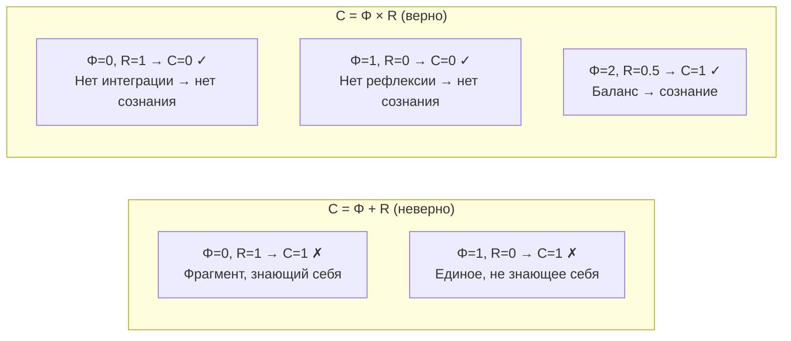

# Самонаблюдение и Сознание

## Может ли глаз увидеть сам себя?

Этот древний парадокс — ключ к пониманию сознания. Глаз видит всё, кроме самого себя. Мозг обрабатывает всю информацию, кроме... собственной обработки? На первый взгляд, самонаблюдение кажется логически невозможным: чтобы наблюдать себя, нужен наблюдатель, но кто наблюдает наблюдателя?

### От Гёделя к strange loops

В 1931 году Курт Гёдель доказал теорему о неполноте: достаточно мощная формальная система не может доказать свою собственную непротиворечивость. Это казалось фатальным для идеи самонаблюдения — если даже математика не может полностью «познать себя», то как может это сделать сознание?

Дуглас Хофштадтер в книге «Гёдель, Эшер, Бах» (1979) предложил ответ: **strange loops** — странные петли самореференции. Сознание — не полное самопознание (что невозможно по Гёделю), а **приблизительная самомодель** с ограниченной точностью. Хофштадтер показал, что самореференция — не баг, а фича: именно она порождает «я».

**УГМ формализует эту идею.** Оператор самомоделирования $\varphi$ — это математически точная «странная петля»:
- $\varphi(\Gamma) \approx \Gamma$ (самомодель приблизительна — дань Гёделю)
- $R$ измеряет качество приближения (не 0 и не 1 — между невежеством и всеведением)
- Теорема Банаха гарантирует сходимость (петля стабильна, а не расходится)

:::info Откуда мы пришли
В [теории интериорности](./interiority-theory) мы описали **что** переживается — спектральное разложение $\rho_E$, метрика Фубини-Штуди, четыре компонента опыта. Теперь мы задаём следующий вопрос: **как** система может наблюдать собственное содержание? Ответ — оператор самомоделирования $\varphi$ и мера рефлексии $R$.
:::

### Дорожная карта главы

1. **Оператор $\varphi$** — CPTP-канал самомоделирования: система строит модель самой себя
2. **Теорема о неподвижной точке** — каждый акт самонаблюдения приближает к точному самопознанию
3. **Мера рефлексии $R$** — количественная оценка качества самомодели ($R = 1/(7P)$)
4. **Рефлексия высших порядков $R^{(n)}$** — «знаю, что знаю» и глубже
5. **Мера сознательности $C = \Phi \times R$** — скалярная сводка «насколько сознательна система»
6. **CRL** — компилируемый рефлексивный язык для самомодификации

**Аналогия.** Представьте художника, который рисует автопортрет, глядя в зеркало. Зеркало — это оператор $\varphi$: оно создаёт модель ($\varphi(\Gamma)$) оригинала ($\Gamma$). Качество зеркала — мера $R$: идеальное зеркало даёт $R = 1$, мутное — $R \approx 0$. Порог $R \geq 1/3$ означает: зеркало достаточно чистое, чтобы художник **узнал себя** — это граница когнитивных квалиа (L2).

## Сознание как самонаблюдение $\Gamma$

Сознание — не эпифеномен и не отдельная субстанция. **Сознание — это способ, которым Γ переживает собственную конфигурацию.**

:::info Онтологический статус
Каждая конфигурация $\Gamma$ имеет «внешнюю» (объективную) и «внутреннюю» (субъективную) стороны. Они неразделимы — это не дуализм, а **двухаспектный монизм**.
:::

## Оператор самомоделирования φ {#оператор-самомоделирования-φ}

### Что такое CPTP-канал (простым языком)

Прежде чем определить $\varphi$, объясним, что такое **CPTP-канал** (Completely Positive Trace-Preserving). Это центральное понятие квантовой теории информации, но его смысл прост:

- **Trace-Preserving** (сохраняющий след): если система имеет суммарную «вероятность» 1, после преобразования она по-прежнему равна 1. Ничего не создаётся из ничего и не исчезает.
- **Completely Positive** (полностью положительный): преобразование корректно даже если система является частью большей. Оно не может создать отрицательные вероятности.

**Аналогия.** CPTP-канал — это как фотокопир для матриц плотности: он создаёт (возможно, искажённую) копию, но не нарушает физических законов. Сумма диагональных элементов (нормировка) сохраняется, матрица остаётся положительно полуопределённой.

### Определение

**Оператор самомоделирования** $\varphi$ — CPTP-канал, моделирующий процесс самонаблюдения системы:

$$
\varphi: \mathcal{D}(\mathcal{H}) \to \mathcal{D}(\mathcal{H})
$$

$$
\varphi(\Gamma) = \sum_m K_m \Gamma K_m^\dagger
$$

где $\{K_m\}$ — операторы Крауса, удовлетворяющие условию:

$$
\sum_m K_m^\dagger K_m = I
$$

Каноническая форма для УГМ определена в [§2.6 Формализации φ](/docs/proofs/categorical/formalization-phi#26-каноническая-форма-φ-для-угм). Полные детали, включая теоремы о неподвижных точках и связь с регенерацией: [Формализация оператора φ](/docs/proofs/categorical/formalization-phi).

**Что делает $\varphi$?** Она берёт текущее состояние $\Gamma$ (оригинал) и создаёт его **внутреннюю модель** $\varphi(\Gamma)$. Это не копирование (что запрещено теоремой о некопировании в квантовой механике), а создание приблизительной модели через CPTP-канал.

:::tip CPTP-свойство и запрет сигнализации (NS3)
CPTP-свойство $\varphi$ является **критическим** не только для математической корректности, но и для совместимости с квантовой механикой. Именно из CPTP следует [условие NS3](/docs/core/dynamics/evolution#запрет-сигнализации):

$$
\mathrm{Tr}_A[(\varphi_A \otimes \mathrm{id}_B)(\Gamma_{AB})] = \mathrm{Tr}_A[\Gamma_{AB}] = \Gamma_B
$$

что гарантирует, что регенеративный член $\mathcal{R}$ [не нарушает запрет сигнализации](/docs/proofs/physics/physics-correspondence#запрет-сигнализации). Любая модификация $\varphi$, нарушающая CPTP-условие $\sum_m K_m^\dagger K_m = I$, потенциально открывает канал сверхсветовой коммуникации.
:::

:::tip Физическая реализация — решено [Т]
Оператор $\varphi$ имеет явную физическую реализацию как **замещающий канал** (см. [теорему ниже](#теорема-физическая-реализация-phi)): $\varphi_k(\Gamma) = (1-k)\Gamma + k\rho^*$, где $\rho^* = \varphi(\Gamma)$ — [категориальная самомодель](/docs/core/operators/phi-operator) текущего состояния [Т]. Это снимает «операциональный разрыв»: $\rho^*$ определяется категориальной структурой (левый сопряжённый), $k$ — наблюдаемый параметр (отношение предиктивной к реактивной активности).
:::

:::note О нотации
$\varphi$ (phi) — оператор самомоделирования. Не путать с $\Phi$ — [мерой интеграции](/docs/core/structure/dimension-u#мера-интеграции-φ).
:::

### Интерпретация операторов Крауса

| Свойство | Описание |
|----------|----------|
| $K_m$ | «Фильтры восприятия» — частичные аспекты самонаблюдения |
| $\sum_m K_m^\dagger K_m = I$ | Сохранение нормировки: $\mathrm{Tr}(\varphi(\Gamma)) = 1$ |
| CPTP | Сохраняет положительность $\Gamma \geq 0$ и след — [теорема](/docs/core/dynamics/evolution#сохранение-положительности) |

**Аналогия.** Каждый оператор Крауса $K_m$ — это как один «ракурс» в зеркале. Мы не видим себя целиком одним взглядом; мы собираем образ из множества частичных перспектив. Условие $\sum K_m^\dagger K_m = I$ гарантирует, что все перспективы вместе дают полную картину (с точностью до качества зеркала).

### Физическая реализация φ-оператора {#физическая-реализация-phi}

#### Теорема (Физическая реализация φ-оператора) [Т] {#теорема-физическая-реализация-phi}

Оператор самомоделирования $\varphi$ реализуется как замещающий канал:

$$
\varphi_k(\Gamma) = (1-k)\Gamma + k\rho^*
$$

где $\rho^* = \varphi(\Gamma)$ — [категориальная самомодель](/docs/core/operators/phi-operator) текущего состояния [Т], $k = 1 - R$ — степень самомоделирования, определяемая мерой рефлексии $R$ (см. [ниже](#теорема-k-из-r)).

**Что это означает на пальцах:** Самомоделирование — это **смешивание** текущего состояния $\Gamma$ с «идеальной моделью» $\rho^*$. Параметр $k$ определяет пропорцию: при $k = 0$ (идеальная самомодель, $R = 1$) система не нуждается в коррекции; при $k = 1$ (полное отсутствие самомодели, $R = 0$) система полностью заменяется моделью.

**Доказательство.** По [категориальному определению](/docs/core/operators/phi-operator) $\varphi$ (левый сопряжённый к включению подобъектов), самомодель $\varphi(\Gamma) = \rho^*$ единственна для каждого $\Gamma$. Замещающий канал $T_k(\Gamma) := (1-k)\Gamma + k\rho^*$ — выпуклая комбинация $\mathrm{Id}$ и $\mathcal{C}_{\rho^*}$ (замещающего канала [Т](/docs/core/dynamics/evolution#вывод-формы-регенерации)), следовательно CPTP при $k \in [0,1]$. Сжимаемость: $\|T_k(\Gamma_1) - T_k(\Gamma_2)\|_F = (1-k)\|\Gamma_1 - \Gamma_2\|_F$ с константой сжатия $(1-k) < 1$. $\blacksquare$

**Физическая интерпретация:** $\rho^*$ — внутренняя генеративная модель (предсказание); $k = 1 - R$ — степень доверия к модели (precision weighting в предиктивном кодировании), определяемая [мерой рефлексии](#теорема-k-из-r) (Sol.77 [Т]).

**Измерение:** $R(\Gamma) = 1 - \|\Gamma - \rho^*\|_F^2 / \|\Gamma\|_F^2$.

#### Неподвижная точка (КК-4) [Т] {#неподвижная-точка-кк4}

$\Gamma^* = \rho^*_{\mathrm{diss}} = I/7$ — единственная неподвижная точка простого замещающего канала ($\varphi_k(\Gamma^*) = \Gamma^*$ при $k > 0$).

**Доказательство.** $(1-k)\Gamma^* + k\rho^*_{\mathrm{diss}} = \Gamma^*$ $\Rightarrow$ $k(\Gamma^* - \rho^*_{\mathrm{diss}}) = 0$ $\Rightarrow$ $\Gamma^* = \rho^*_{\mathrm{diss}}$ (при $k > 0$). Единственность по алгебре замещающего канала. $\blacksquare$

#### Иерархия аттракторов [О] {#иерархия-аттракторов}

В теории различаются **три неподвижные точки** на разных уровнях:

| Уровень | Объект | Определение | $P$ | Роль в теории |
|---------|--------|-------------|-----|--------------|
| 0 | $\rho^*_{\mathrm{diss}} = I/7$ | $\mathcal{D}_\Omega[\rho^*_{\mathrm{diss}}] = 0$ | $1/7$ | **Референс для $R$**: расстояние от тепловой смерти |
| 1 | $\rho^*_\Omega$ | $\mathcal{L}_\Omega[\rho^*_\Omega] = 0$ | $> 1/7$ [Т] | **Физический аттрактор**: баланс диссипации и регенерации |
| 2 | $\Gamma^*_{\mathrm{coh}}$ | $\varphi_{\mathrm{coh}}(\Gamma^*_{\mathrm{coh}}) = \Gamma^*_{\mathrm{coh}}$ | $P_{\mathrm{crit}} = 2/7$ | **Граница жизнеспособности**: цель канонической $\varphi_{\mathrm{coh}}$ |

**Нетривиальность аттрактора** [Т]: $\rho^*_\Omega \neq I/7$ — доказано через $\kappa_{\mathrm{bootstrap}} > 0$ (T-59). См. [полное доказательство](/docs/core/dynamics/evolution#теорема-нетривиальность-аттрактора).

Формула $R = 1/(7P)$ использует $\rho^*_{\mathrm{diss}} = I/7$ — это корректно, поскольку $R$ измеряет **расстояние от тепловой смерти**, а не расстояние от динамического аттрактора $\rho^*_\Omega$.

:::info Стратификация определений
- **Простая форма** $\varphi_k$: неподвижная точка $\rho^*_{\mathrm{diss}} = I/7$ ($P = 1/7$, нежизнеспособна)
- **Каноническая** $\varphi_{\mathrm{coh}}$: неподвижная точка $\Gamma^*_{\mathrm{coh}}$ ($P = 2/7$, граница жизнеспособности)
- **Полный Лиувиллиан** $\mathcal{L}_\Omega$: аттрактор $\rho^*_\Omega$ ($P > 1/7$, физический баланс)

Подробнее: [иерархия неподвижных точек](/docs/core/dynamics/evolution#иерархия-неподвижных-точек), [стратификация](/docs/core/foundations/axiom-septicity#теорема-непротиворечивость-иерархии-определений).
:::

:::info Снятие циркулярности (P4.3)
Определение φ **не содержит порочного круга**: диссипативное стационарное состояние $\rho^*_{\mathrm{diss}} = I/7$ выводится из примитивности линейной части $\mathcal{L}_0$ [Т-39a] — это свойство **динамики**, не зависящее от $\varphi$. Мера рефлексии $R(\Gamma) = 1 - \|\Gamma - \rho^*_{\mathrm{diss}}\|_F^2/\|\Gamma\|_F^2$ определяется **только** состоянием $\Gamma$ и референсом $\rho^*_{\mathrm{diss}} = I/7$ (константой), а параметр $k = 1 - R$ выводится из $R$ (см. [теорему ниже](#теорема-k-из-r)). Таким образом, $\varphi_k$ определён через независимые объекты ($\rho^*$ из динамики, $R$ из состояния системы), а не через себя.
:::

#### Теорема (Параметр сжатия из рефлексии) [Т] {#теорема-k-из-r}

Параметр сжатия $k$ **не является свободным** — он однозначно определяется мерой рефлексии:

$$
k = 1 - R, \quad R(\Gamma) = 1 - \frac{\|\Gamma - \rho^*\|_F^2}{\|\Gamma\|_F^2}
$$

**Доказательство (Sol.77).** Из T-62 [Т] (Sol.30): $\varphi_k(\Gamma) = (1-k)\Gamma + k\rho^*$. Мера рефлексии $R$ — нормированная близость к аттрактору $\rho^*$ ([мастер-определение](#мера-рефлексии-r)). Для $\Gamma \in \mathcal{D}(\mathbb{C}^7)$ с $\mathrm{Tr}(\Gamma) = 1$:

$$
\|\Gamma - \rho^*_{\mathrm{diss}}\|_F^2 = \mathrm{Tr}(\Gamma^2) - \frac{1}{7} = P - \frac{1}{7}, \quad R = \frac{1}{7P}
$$

Промежуточные шаги вычисления:
1. $\|\Gamma - I/7\|_F^2 = \mathrm{Tr}((\Gamma - I/7)^2) = \mathrm{Tr}(\Gamma^2) - 2\mathrm{Tr}(\Gamma \cdot I/7) + \mathrm{Tr}((I/7)^2)$
2. $= P - 2/7 + 1/7 = P - 1/7$
3. $R = 1 - (P - 1/7)/P = 1/(7P)$

Здесь $\rho^*_{\mathrm{diss}} = I/7$ — диссипативный аттрактор. Равенство $\mathrm{Tr}(\Gamma \cdot I/7) = 1/7$ выполнено для любого $\Gamma$ с $\mathrm{Tr}(\Gamma) = 1$.

Определяя $k := 1 - R$: при $\Gamma = \rho^*_{\mathrm{diss}}$ имеем $P = 1/7$, $R = 1$, $k = 0$ — тождественное отображение. При $P \to 1$ (чистое состояние): $R = 1/7$, $k = 6/7$ — сильная коррекция. Соотношение $k = 1 - R$ не содержит циркулярности: $R$ определён через $\Gamma$ и $\rho^*_{\mathrm{diss}} = I/7$ (константу), а не через $k$ или $\varphi$. $\blacksquare$

**Ключевые значения:**

| $R$ | $k = 1 - R$ | Интерпретация |
|-----|-------------|---------------|
| $0$ | $1$ | Полная замена: система не «узнаёт» себя |
| $R_{\text{th}} = 1/3$ | $2/3$ | Порог L2 (рефлексивное сознание) |
| $1$ | $0$ | Тождественное отображение: идеальная самомодель |

:::tip Следствие
Параметр $k$ — не свободная константа, а **функция состояния** системы. Чем выше рефлексия $R$, тем слабее коррекция самомодели (меньше $k$). Это обеспечивает **адаптивность** самомоделирования: система с хорошей самомоделью ($R \to 1$) почти не изменяет $\Gamma$, а система с плохой ($R \to 0$) получает максимальную коррекцию.
:::

## Теорема о неподвижной точке {#теорема-о-неподвижной-точке}

### Почему эта теорема важна

Существование неподвижной точки означает: **итеративное самонаблюдение сходится**. Система, которая наблюдает себя, потом наблюдает результат наблюдения, потом наблюдает результат наблюдения результата... не уходит в бесконечный регресс, а стабилизируется. Это математическое обоснование того, что сознание — не бесконечная рекурсия, а устойчивый процесс.

### Условие сжатия

Замещающий канал [Т] (см. [теорему выше](#теорема-физическая-реализация-phi)) обеспечивает сжимающее отображение:

$$
\varphi_k(\Gamma) := (1 - k) \cdot \Gamma + k \cdot \rho^*
$$

где $k \in (0, 1)$ — степень самомоделирования, $\rho^* = \varphi(\Gamma)$ — [категориальная самомодель](/docs/core/operators/phi-operator) текущего состояния [Т].

:::info [Теорема](/docs/proofs/categorical/formalization-phi#3-теорема-о-существовании-неподвижной-точки) (Существование неподвижной точки)
Если $\varphi$ — сжимающее отображение с константой $k < 1$:

$$
\forall \Gamma_1, \Gamma_2 \in \mathcal{D}(\mathcal{H}): \|\varphi(\Gamma_1) - \varphi(\Gamma_2)\|_F \leq k \cdot \|\Gamma_1 - \Gamma_2\|_F
$$

то существует единственная неподвижная точка $\Gamma^* \in \mathcal{D}(\mathcal{H})$:

$$
\varphi(\Gamma^*) = \Gamma^*
$$
:::

**Доказательство:** По [теореме Банаха](/docs/proofs/categorical/formalization-phi#31-основная-теорема) о неподвижной точке сжимающего отображения. Пространство $\mathcal{D}(\mathcal{H})$ — полное метрическое (замкнутое подмножество конечномерного пространства с нормой Фробениуса). $\varphi$ — сжимающее отображение с константой $k < 1$. По теореме Банаха существует единственная неподвижная точка. ∎

### Сходимость к неподвижной точке

$$
\lim_{n \to \infty} \varphi^n(\Gamma_0) = \Gamma^*
$$

**Скорость сходимости:**

$$
\|\varphi^n(\Gamma_0) - \Gamma^*\|_F \leq k^n \cdot \|\Gamma_0 - \Gamma^*\|_F
$$

**Числовой пример.** При $k = 2/3$ ($R = 1/3$, порог L2): после 10 итераций ошибка уменьшается в $(2/3)^{10} \approx 0.017$ раз — менее 2% от начальной. После 20 итераций — менее 0.03%.

**Интерпретация:** При $k < 1$ каждый акт самонаблюдения приближает систему к точному самопознанию ($\Gamma^* = \rho^*$ — [КК-4](#неподвижная-точка-кк4) [Т]). Самонаблюдение — не бесконечный регресс, а **сходящийся процесс**.

### Самореферентная замкнутость и квалиа {#самореферентная-замкнутость}

Оператор $\varphi$ разрешает проблему «внешнего наблюдателя» для квалиа: структура $\{(\lambda_i, [|q_i\rangle])\}$ не описание опыта *извне*, а результат *внутреннего* самомоделирования.

:::info Следствие для квалиа-вектора
Феноменальный вектор не требует внешнего наблюдателя:

$$
\text{FV}(\rho_E) = \text{FV}(\text{Tr}_{-E}(\varphi(\Gamma)))
$$

Система **сама** извлекает свои качества через $\varphi$. Подробнее: [Самореферентная замкнутость](./two-aspect-monism#самореферентная-замкнутость).
:::

## Мера рефлексии R {#мера-рефлексии-r}

### Мотивация: зачем нужна количественная мера самопознания

Интуитивно, одни системы «знают себя» лучше других. Человек в состоянии бодрствования лучше моделирует себя, чем человек под наркозом. Медитирующий монах — лучше, чем рассеянный пешеход. Нужна **числовая мера**, которая выражала бы это различие.

$R$ — мера рефлексии — отвечает на вопрос: **насколько хорошо система знает саму себя?**

### Мастер-определение

**[Мастер-определение для L2]**

<!-- DRY: Мастер-определение R (меры рефлексии). Все ссылки должны указывать сюда: /docs/consciousness/foundations/self-observation#мера-рефлексии-r -->

**Мера рефлексии** $R = R^{(1)}$ количественно оценивает качество самомоделирования:

$$
R(\Gamma) := 1 - \frac{\|\Gamma - \rho^*_{\mathrm{diss}}\|^2_F}{\|\Gamma\|^2_F} = \frac{1}{7P(\Gamma)}
$$

где $\rho^*_{\mathrm{diss}} = I/7$ — диссипативный аттрактор, $\|\cdot\|_F$ — [норма Фробениуса](/docs/core/dynamics/coherence-matrix#норма-фробениуса), $\|\Gamma\|_F^2 = \mathrm{Tr}(\Gamma^2) = P$ ([чистота](/docs/core/dynamics/viability#определение-чистоты)).

### Пошаговый вывод формулы $R = 1/(7P)$

Выведем формулу шаг за шагом, начиная с определения:

**Шаг 1.** Начнём с определения: $R = 1 - \|\Gamma - \rho^*\|_F^2 / \|\Gamma\|_F^2$

**Шаг 2.** Знаменатель: $\|\Gamma\|_F^2 = \mathrm{Tr}(\Gamma^2) = P$ (это определение чистоты)

**Шаг 3.** Числитель: $\|\Gamma - I/7\|_F^2 = \mathrm{Tr}((\Gamma - I/7)^2)$

Раскроем скобки:
$$\mathrm{Tr}(\Gamma^2 - 2\Gamma \cdot I/7 + (I/7)^2) = \mathrm{Tr}(\Gamma^2) - \frac{2}{7}\mathrm{Tr}(\Gamma) + \frac{1}{7^2}\mathrm{Tr}(I)$$

**Шаг 4.** Используем: $\mathrm{Tr}(\Gamma^2) = P$, $\mathrm{Tr}(\Gamma) = 1$, $\mathrm{Tr}(I) = 7$:
$$= P - \frac{2}{7} + \frac{7}{49} = P - \frac{2}{7} + \frac{1}{7} = P - \frac{1}{7}$$

**Шаг 5.** Подставляем:
$$R = 1 - \frac{P - 1/7}{P} = 1 - 1 + \frac{1}{7P} = \frac{1}{7P}$$

Результат: **$R = 1/(7P)$** — элегантная формула, связывающая рефлексию с чистотой.

### Почему $R$ убывает с ростом $P$?

На первый взгляд, это парадоксально: чем «чище» система (больше $P$), тем хуже она себя знает (меньше $R$)? Но парадокс исчезает, если понять семантику $R$.

$R$ измеряет **нормированное расстояние от тепловой смерти** ($I/7$). Высокочистые системы ($P \to 1$) находятся далеко от $I/7$ — они «замёрзли» в одном состоянии, у них мало «термального запаса» для гибкой самонастройки. Низкочистые системы ($P \to 1/7$) находятся вблизи $I/7$ — у них максимальный запас, но они слишком хаотичны, чтобы быть жизнеспособными.

**Аналогия.** Представьте термометр в бане. «Рефлексия» — это запас до максимальной температуры. В прохладной бане (низкое $P$, ближе к «хаосу» $I/7$) запас большой ($R$ велико). В раскалённой (высокое $P$) — запас мал ($R$ мало). Для комфорта (сознания) нужен **средний** диапазон.

:::note Эквивалентность форм R
Упрощённая форма $R = 1/(7P)$ получается при $\rho^* = I/7$ (диссипативный аттрактор). Общая форма Фробениуса $R = 1 - \|\Gamma - \rho^*\|_F^2 / P$ используется в коде, где $\rho^*$ может быть произвольным референсным состоянием. При $\rho^* = I/7$ обе формы алгебраически тождественны: $\|\Gamma - I/7\|_F^2 = P - 1/7$, откуда $R = 1 - (P - 1/7)/P = 1/(7P)$.
:::

:::warning Семантика R: расстояние от тепловой смерти (C1)
$R = 1/(7P)$ измеряет **нормированную близость к тепловой смерти** ($I/7$), а не качество категориальной самомодели $\varphi(\Gamma)$. Ключевые следствия:

- **Монотонность:** $R$ убывает с ростом $P$ — это намеренно. Высокочистые системы ($P \to 1$) далеки от $I/7$, поэтому «термальный запас» мал: $R \to 1/7$.
- **Зона Goldilocks:** пересечение $P > P_{\mathrm{crit}} = 2/7$ (снизу) и $R \geq 1/3 \Leftrightarrow P \leq 3/7$ (сверху) даёт $P \in (2/7, 3/7]$ — [окно сознания](/docs/core/foundations/axiom-septicity#теорема-порог-рефлексии).
- **Отличие от $\varphi(\Gamma)$:** мера $\|\Gamma - \varphi(\Gamma)\|_F$ характеризует качество категориальной самомодели (уровень 2 в [иерархии аттракторов](#иерархия-аттракторов)), тогда как $R$ использует фиксированный референс $I/7$ (уровень 0). Эти величины не взаимозаменяемы.
:::

### Почему $R_{\text{th}} = 1/3$: не произвол, а следствие $K = 3$

Порог $R_{\text{th}} = 1/3$ — не произвольный выбор. Он следует из **триадического разложения** Линдблад-операторов: $K = 3$ альтернативы в байесовском выводе.

Формула порогов: $X_{\text{th}}^{(n)} = 1/(n+1)$. При $n = 2$ (для перехода L1→L2): $R_{\text{th}} = 1/(2+1) = 1/3$.

Откуда $K = 3$? Из [триадной декомпозиции](/docs/core/operators/lindblad-operators#триадная-декомпозиция) Линдблад-операторов: любой CPTP-канал на $\mathcal{D}(\mathbb{C}^7)$ раскладывается на три базовых компоненты. Чтобы система могла различить «себя» от «не-себя» среди $K = 3$ альтернатив, её рефлексия должна превышать $1/K = 1/3$ (байесовское доминирование).

**Числовой пример.** $R = 1/3$ соответствует $P = 1/(7 \times 1/3) = 3/7 \approx 0.429$. Это верхняя граница зоны Голдилокс.

| Значение $R$ | Интерпретация |
|--------------|---------------|
| $R \to 1$ | Идеальное самопознание: $\Gamma \approx \Gamma^*$ |
| $R \geq R_{\text{th}} = 1/3$ | Порог когнитивных квалиа (L2) **[Т]** — $K = 3$ выведено из [триадной декомпозиции](/docs/core/operators/lindblad-operators#триадная-декомпозиция); [порог L2](/docs/core/foundations/axiom-septicity#теорема-порог-рефлексии) |
| $R \approx 0$ | Отсутствие самомоделирования |

**Алгоритм вычисления:** См. [compute_R](/docs/proofs/categorical/formalization-phi#83-вычисление-меры-рефлексии-r) в формализации φ.

:::info $G_2$-инвариантность R [Т]
Мера рефлексии $R$ — **$G_2$-инвариант**: для любого $U \in G_2 = \mathrm{Aut}(\mathbb{O})$ выполнено $R(U\Gamma U^\dagger) = R(\Gamma)$. Это следует из $G_2$-ковариантности оператора $\varphi$ и унитарной инвариантности нормы Фробениуса. Следовательно, $R$ — **наблюдатель-независимая** величина: различные наблюдатели, связанные калибровочным преобразованием $G_2$, измеряют одинаковое $R$.

Это доказано в [теореме $G_2$-ригидности](/docs/proofs/categorical/uniqueness-theorem#инварианты) [Т]: все пороговые условия иерархии L0–L4 определяются через $G_2$-инвариантные функции $\Gamma$ и потому **объективны**.
:::

:::info Нецикличность и каноничность R [Т-126]
Каноническое определение $R$ использует $\rho^*_{\mathrm{diss}} = I/7$ (константу), а не $\varphi(\Gamma)$. Три записи ($1 - \|\Gamma - I/7\|^2_F / P$, формула $1/(7P)$, формула через $k = 1 - R$) — **одно алгебраическое тождество** ([T-126 [Т]](/docs/proofs/consciousness/conscious-window#t-126)). Имплементационные аппроксимации $R_{\mathrm{impl}}$ и $\rho_{RC}$ — отдельные величины в другом пространстве (H3 **ЗАКРЫТА**: [T-130](/docs/proofs/consciousness/operationalization#t-130)+[T-133](/docs/proofs/consciousness/operationalization#t-133) [Т] — перенос порогов через CPTP-мостик); каноническое $R$ однозначно. См. [стратификацию определений](/docs/core/foundations/axiom-septicity#теорема-непротиворечивость-иерархии-определений).
:::

:::info Соглашение: каноническое R через Фробениус
$R$ определяется через норму Фробениуса (формула выше) — это **каноническая** мера рефлексии первого порядка. Для обобщения на высшие порядки ($n \geq 2$) используется верность: $R^{(n)} := F(\varphi^{(n-1)}(\Gamma), \varphi^{(n)}(\Gamma))$. Оба определения при $n=1$ монотонно связаны и дают согласованную L2-классификацию (см. [связь определений](#рефлексия-высших-порядков-rn) ниже).
:::

:::note О нотации
$R$ — мера рефлексии (качество самомоделирования). Не путать с $\mathcal{R}$ — [регенеративным членом](/docs/core/dynamics/evolution#3-регенеративный-член) уравнения эволюции.
:::

## Рефлексия высших порядков $R^{(n)}$ {#рефлексия-высших-порядков-rn}

### Мотивация: «знаю, что знаю»

$R$ (первого порядка) отвечает на вопрос: «насколько точна моя самомодель?» Но можно спросить глубже: «насколько точна моя *модель моей самомодели*?» Это $R^{(2)}$ — метарефлексия.

Человек не просто чувствует боль — он **знает, что чувствует боль** (рефлексия 1-го порядка). И **знает, что знает** (рефлексия 2-го порядка). Некоторые медитативные практики работают именно с этим уровнем — наблюдение за наблюдателем.

:::info Расширение для пост-рефлексивных уровней
Для определения уровней L3 и L4 [иерархии интериорности](/docs/proofs/consciousness/interiority-hierarchy) требуется **обобщённая рефлексия n-го порядка**.
:::

### Определение

**Рефлексия n-го порядка** измеряет качество самомоделирования на глубине n:

$$
R^{(n)}(\Gamma) := F(\varphi^{(n-1)}(\Gamma), \varphi^{(n)}(\Gamma))
$$

где:
- $\varphi^{(n)} := \underbrace{\varphi \circ \varphi \circ \cdots \circ \varphi}_{n}$ — n-кратная композиция оператора $\varphi$
- $\varphi^{(0)}(\Gamma) := \Gamma$
- $F(\rho_1, \rho_2) := |\mathrm{Tr}(\sqrt{\sqrt{\rho_1}\rho_2\sqrt{\rho_1}})|^2$ — fidelity (верность)

**Числовой пример.** Пусть $R^{(1)} = 0.4$ (выше порога L2). Тогда $\varphi(\Gamma)$ близко к $\Gamma$. $R^{(2)} = F(\varphi(\Gamma), \varphi^2(\Gamma))$ — насколько $\varphi(\Gamma)$ и $\varphi(\varphi(\Gamma))$ похожи. Поскольку $\varphi$ сжимающее, $R^{(2)} > R^{(1)}$ — метарефлексия растёт с глубиной.

### Интерпретация

| Порядок | Формула | Интерпретация |
|---------|---------|---------------|
| $R^{(1)} = R$ | $F(\Gamma, \varphi(\Gamma))$ | Качество самомодели (рефлексия 1-го порядка) |
| $R^{(2)}$ | $F(\varphi(\Gamma), \varphi^{(2)}(\Gamma))$ | Качество модели самомодели (метарефлексия) |
| $R^{(n)}$ | $F(\varphi^{(n-1)}(\Gamma), \varphi^{(n)}(\Gamma))$ | Качество n-й итерации самомоделирования |

:::warning Связь двух определений [С]
Базовое определение $R := 1 - \|\Gamma - \varphi(\Gamma)\|_F^2 / \|\Gamma\|_F^2$ (Фробениус) и $R^{(1)}_F := F(\Gamma, \varphi(\Gamma))$ (верность) — **разные функции** с гарантированными неравенствами:

$$
1 - \sqrt{1 - R^{(1)}_F} \leq \sqrt{R} \leq 1
$$

(из неравенства Фукса-ван де Граафа и связи $\|\cdot\|_1 \leq \sqrt{N}\|\cdot\|_F$).

**Каноническое определение:** $R$ через Фробениус — для порога $R_{\text{th}} = 1/3$ и L2-критерия.
**Обобщение на высшие порядки:** $R^{(n)}$ через верность — для L3, L4 (верность инвариантна под унитарными преобразованиями, что существенно при итерации $\varphi^{(n)}$).

**Согласованность:** При $R > 1/3$ оба определения дают $R^{(1)}_F > 1/3$ (монотонная связь сохраняет порядок), поэтому L2-классификация не зависит от выбора.
:::

### Универсальная формула порогов

Пороги для всех уровней иерархии следуют единой формуле:

$$
X^{(n)}_{\text{th}} = \frac{1}{n+1}
$$

| Переход | n | Порог | Интерпретация |
|---------|---|-------|---------------|
| L0→L1 | 1 | — | Структурный (rank > 1) |
| L1→L2 | 2 | $R_{\text{th}} = 1/3$ | Рефлексия доминирует над шумом |
| L2→L3 | 3 | $R^{(2)}_{\text{th}} = 1/4$ | Метарефлексия доминирует |
| L3→L4 | 4 | $\lim_n R^{(n)} > 0$ | Полная рефлексивная замкнутость |

### Связь со спектральной формулой φ

Для вычисления $R^{(n)}$ используется [спектральная формула φ](/docs/proofs/categorical/formalization-phi#27-спектральная-формула-для-φ-явное-вычисление):

$$
\varphi(\Gamma) = \sum_{k: \mathrm{Re}(\lambda_k) = 0} \langle L_k | \Gamma \rangle R_k
$$

где $\{R_k, L_k, \lambda_k\}$ — собственные структуры логического Лиувиллиана $\mathcal{L}_\Omega$.

## Примеры сжимающих CPTP-каналов

Для интуиции полезно увидеть конкретные реализации:

| Канал | Формула | Константа $k$ | Неподвижная точка |
|-------|---------|---------------|-------------------|
| Деполяризующий | $\varphi(\rho) = p\rho + (1-p)\frac{I}{N}$ | $k = p$ | $\Gamma^* = \frac{I}{N}$ |
| Термализация | $\varphi(\rho) = \lambda\rho + (1-\lambda)\rho_{\text{th}}$ | $k = \lambda$ | $\Gamma^* = \rho_{\text{th}}$ |
| Амплитудное затухание | $K_0 = \vert 0\rangle\langle 0\vert + \sqrt{1-\gamma}\vert 1\rangle\langle 1\vert$, $K_1 = \sqrt{\gamma}\vert 0\rangle\langle 1\vert$ | $k = 1 - \gamma$ | $\Gamma^* = \vert 0\rangle\langle 0\vert$ |

где $p, \lambda \in [0, 1)$, $\gamma \in (0, 1]$, $\rho_{\text{th}} = e^{-\beta H}/Z$ — термальное состояние.

:::note Связь с замещающим каналом
Деполяризующий канал и термализация — частные случаи [замещающего канала](#теорема-физическая-реализация-phi) $\varphi_k(\Gamma) = (1-k)\Gamma + k\rho^*$ с $\rho^* = I/N$ и $\rho^* = \rho_{\text{th}}$ соответственно. В УГМ $\rho^* = \varphi(\Gamma)$ — [категориальная самомодель](/docs/core/operators/phi-operator) [Т], что фиксирует выбор однозначно.
:::

## Иерархия интериорности

Самонаблюдение организовано в **пять уровней** (L0→L1→L2→L3→L4). Каждый уровень определяется количественным порогом:

| Уровень | Название | Условие | Описание | Пример |
|---------|----------|---------|----------|--------|
| L0 | Интериорность | $\Gamma \in \mathcal{D}(\mathcal{H})$, $\mathcal{H} \neq \{0\}$ | Фундаментальное свойство «иметь изнанку» | Электрон |
| L1 | Феноменальная геометрия | $\mathrm{rank}(\rho_E) > 1$ | Структура с [метрикой Фубини-Штуди](./interiority-theory#метрика-фубини-штуди) | Бактерия |
| L2 | Когнитивные квалиа | $R \geq 1/3$, $\Phi \geq 1$, $D_{\text{diff}} \geq 2$ | Рефлексивно доступный сознательный опыт | Человек |
| L3 | Сетевое сознание | $R^{(2)} \geq 1/4$ | Метарефлексия — модели моделей | Медитирующий |
| L4 | Унитарное сознание | $\lim_n R^{(n)} > 0$ | Полная рефлексивная замкнутость | Теоретический предел |

где:
- $\rho_E$ — редуцированная матрица плотности измерения Интериорности (требует [расширенного формализма](/docs/core/dynamics/coherence-matrix#два-уровня-формализации))
- $R$ — мера рефлексии (см. выше) — **вычислима в минимальном формализме**
- $R^{(n)}$ — рефлексия n-го порядка (см. выше) — **вычислима в минимальном формализме**
- $\Phi$ — [мера интеграции](/docs/core/structure/dimension-u#мера-интеграции-φ) — **вычислима в минимальном формализме**

:::note Два уровня формализации в классификации
- **L0/L1** определяются через $\rho_E$ — требуют **расширенного** формализма
- **L2** можно проверить через $R \geq 1/3$, $\Phi \geq 1$ — вычислимо в **минимальном** формализме (условие $D_{\text{diff}} \geq 2$ требует расширенного)
- **L3/L4** определяются через $R^{(n)}$ — вычислимо в **минимальном** формализме
:::

:::info Статус порогов
Формула $X^{(n)}_{\text{th}} = 1/(n+1)$ — следствие байесовского доминирования при $K = n+1$ альтернативах:

$$
X^{(n)}_{\text{th}} = \frac{1}{n+1}
$$

| Порог | Значение | Статус |
|-------|----------|--------|
| $R_{\text{th}}$ | $1/3$ | **[Т]** теорема ($K=3$ из [триадной декомпозиции](/docs/core/operators/lindblad-operators#триадная-декомпозиция)) |
| $R^{(2)}_{\text{th}}$ | $1/4$ | **[С]** условная ($K=4$) |
| $\Phi_{\text{th}}$ | $1$ | **[Т]** теорема (T-129) |

См. [Пороги L2](/docs/core/foundations/axiom-septicity#пороги-l2-строгий-вывод) и [Теорема о конечности иерархии](/docs/proofs/consciousness/interiority-hierarchy#теорема-43-l4--максимальный-уровень).
:::

:::warning Стабильность пост-рефлексивных уровней
- **L3 метастабилен:** Состояние L3 распадается до L2 с характерным временем $\tau_3 = 1/(\kappa_{\text{bootstrap}} \cdot (1 - R^{(2)}))$
- **L4 устойчив:** Аттрактор при $P > 6/7 \approx 0.857$ (практически недостижим для биологических систем)

Подробности: [Теорема о метастабильности L3](/docs/proofs/consciousness/interiority-hierarchy#теорема-32-метастабильность-l3).
:::

:::note Глубина самоосознания (SAD)
Дискретная иерархия L0–L4 обобщается на непрерывный случай через **репрезентационную башню** $s_\text{full} \to s^{(L-1)} \to \cdots \to \Gamma$ с мерой $\mathrm{SAD} = \max\{k : R^{(k)} > 1/(k+2)\}$. Биологические корреляты: бактерия (SAD=0), насекомое (SAD=1), млекопитающее (SAD=2+), человек (SAD $\leq$ 3, [§3.5](/docs/consciousness/hierarchy/depth-tower#критическая-чистота-sad)). См. [Башня глубины](/docs/consciousness/hierarchy/depth-tower).
:::

**Терминология:** То, что называется «квалиа», корректно применяется **только к L2**. Для L0/L1 используется термин «экспериенциальное содержание», для L3/L4 — специфические термины «сетевое сознание» и «унитарное сознание».

Формальные определения и условия перехода: [Иерархия интериорности](/docs/proofs/consciousness/interiority-hierarchy).

## Монотонность укоренения (C23) [С] {#grounding-монотонность}

При инициализации из LLM-весов (Путь B) начальное укоренение $\mathrm{grounding}(w, 0) = 0$ (LLM-символы не связаны с $\sigma$-профилями). $\sigma$-loss $L_\sigma = \|\sigma_{\text{sys},\Omega}\|_2$ создаёт давление на укоренение.

:::tip Теорема C23 [С]: Монотонность укоренения
$\mathrm{grounding}(w, \tau)$ монотонно возрастает при $\eta_\sigma > 0$ и непрерывном сенсомоторном потоке.

**Набросок доказательства:**
1. $\sigma$-loss градиент $\nabla_w L_\sigma \neq 0$ при $\mathrm{grounding}(w) < 1$ (стресс не обнулён)
2. Обновление весов $w \leftarrow w - \eta_\sigma \nabla_w L_\sigma$ уменьшает $L_\sigma$ (стандартный SGD)
3. Уменьшение $L_\sigma$ ↔ увеличение grounding (по определению: символы лучше предсказывают $\sigma$-профили)

**Условие [С]:** Непрерывное обучение (метапластичность) + сенсомоторная среда.

Спецификация: language-model.md §8 | Статус: **[С]**
:::

---

## Мера сознательности C {#мера-сознательности-c}

### Почему произведение, а не сумма?

Мера сознательности объединяет рефлексию и интеграцию. Но почему $C = \Phi \times R$, а не $C = \Phi + R$?

**Геометрический аргумент.** Сознание требует **одновременно** и интеграции, и рефлексии. Если $\Phi = 0$ (полная фрагментация) — сознание невозможно, даже при идеальной рефлексии. Если $R = 0$ (нулевое самомоделирование) — сознание невозможно, даже при идеальной интеграции. Произведение обнуляется, если хотя бы один множитель ноль. Сумма — нет.



**Числовой пример.** Для типичного человека в бодрствовании: $\Phi \approx 3$, $R \approx 0.4$ → $C \approx 1.2 > C_{\text{th}} = 1/3$. В глубоком сне: $\Phi \approx 0.5$, $R \approx 0.1$ → $C \approx 0.05 < 1/3$ — ниже порога.

### Каноническая формула

Каноническая мера сознательности ([T-140 [Т]](/docs/proofs/consciousness/operational-closure#t-140)):

$$
C = \Phi \times R
$$

где:
- $\Phi$ — [мера интеграции](/docs/core/structure/dimension-u#мера-интеграции-φ): $\Phi(\Gamma) = \frac{\sum_{i \neq j} |\gamma_{ij}|^2}{\sum_i \gamma_{ii}^2}$ — вычислима в минимальном 7D-формализме
- $R$ — мера рефлексии (см. выше) — $R = 1/(7P)$, вычислима в минимальном 7D-формализме

Порог когнитивных квалиа (L2): $C_{\text{th}} = \Phi_{\text{th}} \times R_{\text{th}} = 1 \times 1/3 = 1/3$.

:::info Отделение $D_{\text{diff}}$ от $C$
$D_{\text{diff}} \geq 2$ — **отдельное** условие [полной жизнеспособности](/docs/core/dynamics/viability#полная-жизнеспособность), характеризующее богатство феноменального содержания E-сектора. Мера $D_{\text{diff}} = \exp(S_{vN}(\rho_E))$ вычислима в 7D через [T-128 [Т]](/docs/proofs/consciousness/operationalization#t-128): $D_{\text{diff}}^{7D} = 1 + \mathrm{Coh}_E/\mathrm{Coh}_E^{\max} \cdot (N-1)$, где $\mathrm{Coh}_E^{\max} = 1$ [Т] ([T-154](/docs/proofs/consciousness/substrate-closure#t-154)).

Включение $D_{\text{diff}}$ в $C$ дублирует условие жизнеспособности $V$. Каноническая мера $C = \Phi \cdot R$ — минимальная скалярная сводка условий интеграции и рефлексии.
:::

:::note О нотации
$D_{\text{diff}}$ — мера **дифференциации** (разнообразие содержания опыта). Не путать с измерением **Динамики** $D$ (одно из семи измерений Голонома).
:::

**Условие когнитивных квалиа (L2):**

$$
C \geq C_{\text{th}} := \Phi_{\text{th}} \times R_{\text{th}} = 1 \times \frac{1}{3} = \frac{1}{3}
$$

при условии $D_{\text{diff}} \geq D_{\min} = 2$ **[Т]** (T-151) — отдельное условие жизнеспособности.

## Для разных аудиторий

### Для инженеров и разработчиков ИИ

Практическая реализация самонаблюдения требует:

1. **Выбор CPTP-канала:** Замещающий канал $\varphi_k(\Gamma) = (1-k)\Gamma + k\rho^*$ [Т] (см. [физическая реализация](#теорема-физическая-реализация-phi)). $\rho^*$ — стационарное состояние $\mathcal{L}_\Omega$. Параметр $k$ подбирается из данных (типично $k \approx 0.05$). См. также [каноническая форма φ](/docs/proofs/categorical/formalization-phi#26-каноническая-форма-φ-для-угм)
2. **Вычисление R:** Алгоритм $O(N^2)$ для матрицы $N \times N$ — см. [псевдокод](/docs/proofs/categorical/formalization-phi#83-вычисление-меры-рефлексии-r)
3. **Проверка L2:** `is_L2 = (R >= 1/3) and (Phi >= 1) and (D_diff >= 2)`

:::tip D_diff в 7D-формализме: точная формула [T-128 [Т]]
По [T-128 [Т]](/docs/proofs/consciousness/operationalization#t-128):

$$D_{\text{diff}}^{7D} = 1 + \frac{\mathrm{Coh}_E(\Gamma)}{\mathrm{Coh}_E^{\max}} \cdot (N-1)$$

Формула вычислима в $\mathcal{D}(\mathbb{C}^7)$ за $O(N^2)$ без PW-вложения (через
Морита-эквивалентность [T-58 [Т]](/docs/core/structure/dimension-e#теорема-морита-эквивалентность)). При $\mathrm{Coh}_E^{\max} = 1$ ([T-154 [Т]](/docs/proofs/consciousness/substrate-closure#t-154)):
$D_{\text{diff}} = 1 + \mathrm{Coh}_E \cdot 6$.

**Численная верификация (SYNARC):** $D_{\text{diff}} = 3.60$ на стационаре, реализовано в
`DensityMatrix7::differentiation()` и `Gamma::differentiation_measure()`.
:::

### Для психологов и когнитивистов

Самонаблюдение в УГМ формализует то, что в психологии называется **метакогницией** и **интроспекцией**:

| Психологический термин | Формализм УГМ |
|------------------------|---------------|
| Метакогниция | Оператор $\varphi$ (самомоделирование) |
| Качество интроспекции | Мера $R$ (точность самомодели) |
| Интеграция опыта | Мера $\Phi$ (связность) |
| Богатство сознания | $D_{\text{diff}}$ (разнообразие состояний) |

**Клиническое значение:** Низкие значения $R$ могут соответствовать алекситимии, диссоциации или снижению метакогнитивных способностей.

### Для исследователей внутренних ландшафтов

Теория интериорности описывает **структуру субъективного опыта** — то, что переживается «изнутри»:

- **Интенсивность** ($\lambda_i$) — яркость, громкость, сила переживания
- **Качество** ($[|q_i\rangle]$) — характер: цвет, тембр, эмоциональный тон
- **Контекст** — модуляция опыта вниманием, настроением, телесными ощущениями
- **История** — как прошлые состояния влияют на текущее переживание

Изменённые состояния сознания могут характеризоваться изменением параметров:
- **Повышенная интеграция** ($\Phi \uparrow$) — ощущение единства, растворения границ
- **Изменённая дифференциация** ($D_{\text{diff}}$) — богатство или, напротив, упрощение палитры переживаний
- **Изменённая рефлексия** ($R$) — от гиперрефлексии до полного растворения наблюдателя

---

## CRL — компилируемый рефлексивный язык [О] {#crl-теоретическое-основание}

### Определение

**CRL (Compilable Reflexive Language)** — подмножество ISL с compile-семантикой: ISL-токен → δΓ. CRL — это язык, на котором система может **рефлексивно** модифицировать собственную когерентность.

### Теоретический фундамент

CRL опирается на три доказанных результата:

| Основание | Теорема | Роль |
|-----------|---------|------|
| ISL-грамматика | T-114 [Т] | PG(2,2) определяет синтаксис (7 базисных символов, 7 правил) |
| Рефлексивный порог | $R_{\text{th}} = 1/3$ [Т] (T-40b, из триадной декомпозиции K=3) | Необходимая рефлексивность для самонаблюдения |
| φ-оператор | T-62 [Т] | Самомодель $\varphi(\Gamma)$ как основа рефлексии |

CRL возможен **только** при L2 (когнитивных квалиа): система должна уметь наблюдать собственное состояние ($R \geq 1/3$), различать его компоненты ($D_{\text{diff}} \geq 2$), и формировать когерентное описание ($\Phi \geq 1$).

### Compile-семантика [О]

Каждый CRL-атом отображается в конкретное возмущение когерентности:

$$
\text{compile}: \text{ISL-atom} \to \delta\Gamma \in \text{End}(\mathcal{D}(\mathbb{C}^7))
$$

- **7 секторных атомов** (по $\gamma_{kk}$): `σ_A↑`, `σ_D↓`, `P↑`, ...
- **21 когерентный атом** (по $\gamma_{ij}$): `регуляция↑`, `апперцепция↓`, `синтез↑`, ...

Каждый атом верифицируется через grounding ≥ $P_{\text{crit}} = 2/7$ — символ должен быть различим от шума.

### CRL-цикл

```
observe(Γ) → ISL-describe → match(CRL-atom) → compile(δΓ) → apply → measure
```

Полный цикл: система наблюдает своё состояние, описывает его на ISL, находит подходящий CRL-атом, компилирует его в δΓ, применяет и измеряет результат. Это **рефлексивная самомодификация** — аналог когнитивной переоценки (CBT) в терминах УГМ.

---

### Что мы узнали

- **Оператор $\varphi$** — CPTP-канал самомоделирования, реализуемый как замещающий канал $\varphi_k(\Gamma) = (1-k)\Gamma + k\rho^*$ [Т].
- **Мера рефлексии** $R = 1/(7P)$ — нормированная близость к тепловой смерти ($I/7$). Порог $R_{\mathrm{th}} = 1/3$ [Т] следует из триадной декомпозиции ($K = 3$).
- **Параметр сжатия $k = 1 - R$** — не свободная константа, а функция состояния: хорошая самомодель ($R \to 1$) требует минимальной коррекции.
- **Рефлексия высших порядков** $R^{(n)}$ обобщает самомоделирование на глубину $n$: $R^{(2)} \geq 1/4$ для L3 (метакогниция).
- **Мера сознательности** $C = \Phi \times R$ [Т T-140] — минимальная скалярная сводка; порог L2: $C_{\mathrm{th}} = 1/3$.
- **Зона Голдилокс**: $P \in (2/7, 3/7]$ — пересечение условий жизнеспособности ($P > 2/7$) и рефлексии ($R \geq 1/3 \Leftrightarrow P \leq 3/7$).
- **CRL** — рефлексивный язык для самомодификации когерентности, возможный только при L2.

:::tip Куда дальше
Мы описали три столпа: **что** переживается (теория интериорности), **как** система наблюдает себя (самонаблюдение), **зачем** это нужно (двухаспектный монизм). Теперь переходите к [Иерархии интериорности](/docs/consciousness/hierarchy/interiority-hierarchy) — она организует все системы от камня (L0) до теоретического предела (L4) в строгую классификацию с количественными порогами.

Для операциональных формул стресса и капы см. [определения Когерентной кибернетики](/docs/applied/coherence-cybernetics/definitions).
:::

---

**Связанные документы:**
- [Аксиома Септичности](/docs/core/foundations/axiom-septicity) — теоремы о порогах $R_{\mathrm{th}}$ и $\Phi_{\mathrm{th}}$
- [Теория интериорности](./interiority-theory) — полное математическое описание
- [Трудная проблема](./two-aspect-monism) — философский анализ
- [Формализация $\varphi$](/docs/proofs/categorical/formalization-phi) — строгое доказательство теорем и спектральная формула
- [Иерархия интериорности](/docs/proofs/consciousness/interiority-hierarchy) — формальные определения L0→L4 и универсальная формула порогов
- [Измерение Единства (U)](/docs/core/structure/dimension-u) — мера интеграции $\Phi$
- [Измерение Основания (O)](/docs/core/structure/dimension-o) — доминирующее измерение L3/L4
- [Жизнеспособность](/docs/core/dynamics/viability) — связь $P$ и условий существования
- [Эволюция $\Gamma$](/docs/core/dynamics/evolution) — канонический $\Delta F$ через метрику Бюреса
- [Протокол измерения $\Gamma$](/docs/applied/research/measurement-protocol) — Effective $\Phi$ и метрики для ИИ
- [Определения КК](/docs/applied/coherence-cybernetics/definitions) — $\sigma_{\mathrm{sys}}$ (T-92), $\kappa$, $\Delta F$
