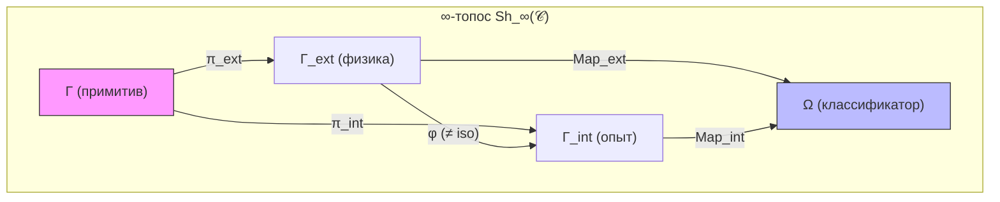
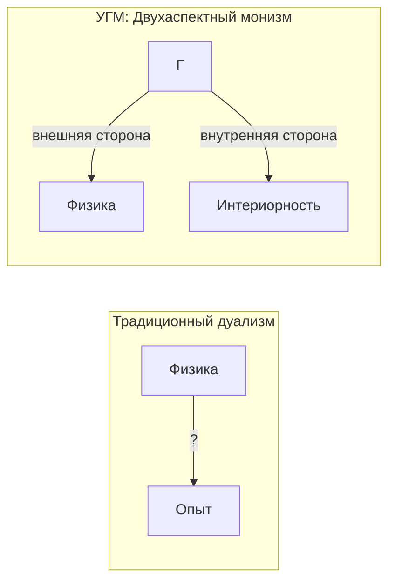

# Трудная Проблема Сознания

## Формулировка проблемы

Традиционно «трудная проблема сознания» формулируется так:

> "Почему физические процессы порождают субъективный опыт?"

Это вопрос о **категориальном разрыве** (explanatory gap) между объективным описанием и субъективным переживанием.

## Позиция УГМ: Двухаспектный монизм

В УГМ проблема **переформулируется**, а не "решается" в традиционном смысле.

### Категориальная Формализация Двухаспектного Монизма {#категориальная-формализация}

:::tip Статус: **[И]** Интерпретация на основе формализма
Двухаспектный монизм получает **категориальную формулировку** в терминах ∞-топоса $\mathbf{Sh}_\infty(\mathcal{C})$. Формализация опирается на ПИР **[О]** (T16) — тождество бытия и опыта встроено в A1+A2 (различимость по $J_{\text{Bures}}$-покрытиям тождественна онтологической различимости).

**Разграничение статусов:** Формальные результаты (расщепление отображения, лемма Йонеды, единственность FV, самореферентная замкнутость) — **[Т]**. Их интерпретация как двухаспектного монизма (отождествление $\mathrm{Map}_{\mathrm{ext}}$ с «физикой» и $\mathrm{Map}_{\mathrm{int}}$ с «опытом») — **[И]**.
:::

#### Теорема о расщеплении пространства морфизмов {#теорема-расщепление}

:::tip Теорема (Расщепление Map) [Т]
В ∞-топосе $\mathbf{Sh}_\infty(\mathcal{C})$ для любого Γ ∈ Ob(𝒞) пространство морфизмов в классификатор Ω **расщепляется**:

$$
\text{Map}(\Gamma, \Omega) \twoheadrightarrow \text{Map}_{\text{ext}}(\Gamma, \Omega), \quad \text{слой: } \text{Map}_{\text{int}}(\Gamma, \Omega)
$$

(Строгая формулировка — расслоение Серра, см. ниже; прямая сумма $\oplus$ — эвристическое упрощение, справедливое при тривиализации расслоения.)
:::

где:
- $\text{Map}_{\text{ext}}$ — **«физические» морфизмы** (структура, динамика) — соответствуют внешнему описанию
- $\text{Map}_{\text{int}}$ — **«интериорные» морфизмы** (E-измерение, интериорность) — соответствуют внутреннему аспекту (при L2+: субъективному переживанию)

**Доказательство:**

**(a)** Классификатор Ω в ∞-топосе имеет градуировку по стратам:

$$
\Omega = \bigsqcup_{\alpha} \Omega_\alpha
$$

**(b)** Морфизмы $\Gamma \to \Omega$ разделяются на два класса:
- $\text{Map}_{\text{ext}}$: факторизуются через объективно наблюдаемые структуры
- $\text{Map}_{\text{int}}$: требуют доступа к E-измерению (интериорные предикаты)

**(c)** Прямая сумма следует из ортогональности: $\text{Map}_{\text{ext}} \cap \text{Map}_{\text{int}} = \{0\}$ ∎

:::warning Строгая формулировка: расслоение Серра
Разложение следует понимать как **расслоение Серра** ∞-группоидов:

$$
\mathcal{F}_{\text{int}}(\Gamma) \hookrightarrow \text{Map}(\Gamma, \Omega) \twoheadrightarrow \mathcal{B}_{\text{ext}}(\Gamma)
$$

где:
- **База** $\mathcal{B}_{\text{ext}}(\Gamma) := \text{Map}(\Gamma_{\text{phys}}, \Omega)$ — внешние предикаты ($\Gamma_{\text{phys}} := \Gamma|_{\{A,S,D,L,O,U\}}$)
- **Слой** $\mathcal{F}_{\text{int}}(\Gamma) := \text{Map}(\rho_E, \Omega_E)$ — интериорные предикаты

Расслоение порождается проекцией $\pi_{\bar{E}}: \Gamma \to \Gamma_{\text{phys}}$ и является расслоением Серра по свойствам ∞-топосов (HTT 6.1.3.9).
:::

#### Определение экспланаторного зазора {#определение-зазора}

**Определение (Экспланаторный зазор):**

$$
\text{Gap} := \text{Nat}(F_{\text{ext}}, F_{\text{int}})
$$

— пространство естественных преобразований между функторами:
- $F_{\text{ext}}: \mathcal{C} \to \mathbf{Set}$ — функтор «внешних» (физических) свойств
- $F_{\text{int}}: \mathcal{C} \to \mathbf{Set}$ — функтор «внутренних» (интериорных) свойств

**Интерпретация:** Gap — мера «расстояния» между экстериорным и интериорным описанием.

#### Теорема о нетривиальности зазора {#теорема-нетривиальность}

:::tip Теорема (Нетривиальность Gap) [Т]
Для Γ с $P > P_{\text{crit}}$:

$$
\dim(\text{Gap}) \geq 1
$$
:::

**Доказательство (конструктивное):**

**(a)** При $P > P_{\text{crit}}$ система имеет нетривиальное E-измерение: $\gamma_{EE} > 0$, следовательно $\rho_E$ имеет ненулевой спектр.

**(b)** Слой расслоения $\mathcal{F}_{\text{int}}(\Gamma) = \text{Map}(\rho_E, \Omega_E)$ — пространство предикатов на $\rho_E$.

**(c)** При $\gamma_{EE} > 0$ существуют как минимум два нетривиальных предиката:
- $\chi_1$: «$\lambda_{\max}(\rho_E) > 1/2$» (доминирующее качество)
- $\chi_2$: «$\lambda_{\max}(\rho_E) \leq 1/2$» (равномерное распределение)

Эти предикаты определяют **различные** точки в $\text{Map}(\rho_E, \Omega_E)$, лежащие в **разных** связных компонентах (поскольку $\chi_1 \wedge \chi_2 = \bot$).

**(d)** Следовательно, $\pi_0(\mathcal{F}_{\text{int}}) \geq 2$, и $\dim(\text{Gap}) \geq 1$. ∎

**Интерпретация:** Категориальный разрыв — **структурная особенность** ∞-топоса, не онтологический дуализм. Зазор существует, но это не разрыв между двумя субстанциями, а различие между двумя способами описания **одной** структуры Γ.

#### Теорема о двухаспектности как свойстве примитива {#теорема-двухаспектность}

:::tip Теорема (Двухаспектность) [Т]
Для любого Γ ∈ Ob(𝒞) существует каноническое разложение:

$$
\forall \Gamma: \quad \Gamma \simeq (\Gamma_{\text{ext}}, \Gamma_{\text{int}}, \varphi)
$$

где $\varphi: \Gamma_{\text{ext}} \to \Gamma_{\text{int}}$ — каноническое соответствие (не изоморфизм).
:::

**Доказательство:**

**(a)** По теореме о расщеплении существуют проекции:
$$
\pi_{\text{ext}}: \Gamma \to \Gamma_{\text{ext}}, \quad \pi_{\text{int}}: \Gamma \to \Gamma_{\text{int}}
$$

**(b)** Каноническое соответствие $\varphi$ определяется как композиция:
$$
\varphi := \pi_{\text{int}} \circ \pi_{\text{ext}}^{-1}
$$
на образе $\pi_{\text{ext}}$

**(c)** $\varphi$ не является изоморфизмом, поскольку $\text{Gap} \neq 0$ ∎

#### Следствие для трудной проблемы {#следствие-трудная-проблема}

:::info Категориальное разрешение
Вопрос «Почему опыт ощущается?» **эквивалентен** вопросу «Почему Ω существует?» — это **метатеоретический вопрос** о структуре топоса.

В рамках теории вопрос не имеет ответа, поскольку Ω — часть аксиоматической структуры. Это аналогично тому, как физика не объясняет, **почему** существуют законы природы.
:::

**Диаграмма:**

**Резюме категориальной формализации:**

| Концепция | Категориальный аналог |
|-----------|----------------------|
| Физические свойства | $\text{Map}_{\text{ext}}(\Gamma, \Omega)$ |
| Феноменальные свойства | $\text{Map}_{\text{int}}(\Gamma, \Omega)$ |
| Экспланаторный зазор | $\text{Gap} = \text{Nat}(F_{\text{ext}}, F_{\text{int}})$ |
| Двухаспектность | $\Gamma \simeq (\Gamma_{\text{ext}}, \Gamma_{\text{int}}, \varphi)$ |
| Трудная проблема | Метатеоретический вопрос о структуре Ω |

:::info Ключевой тезис
Нет "физических процессов" отдельно от "субъективного опыта". Есть только $\Gamma$, который:
- С **внешней стороны** выглядит как "физика" (структура, динамика)
- С **внутренней стороны** переживается как "опыт" (интериорность L0 для всех систем; когнитивные квалиа L2 — только при $R \geq 1/3$ [Т], $\Phi \geq 1$ [О], $D_{\text{diff}} \geq 2$ [С])
:::

Спрашивать "почему физика порождает опыт?" — всё равно что спрашивать "почему лицевая сторона монеты порождает обратную?". Они не порождают друг друга — они **суть одно**.

## Структурная необходимость феноменального функтора {#структурная-необходимость}

Ключевой вопрос: является ли соответствие между $\rho_E$ и феноменальным содержанием **произвольным постулатом** или **вынужденной структурой**?

### Цепочка вынужденности

Спектральное разложение $\rho_E$ — **не постулат**, а следствие трёх вынужденных шагов:

$$
\text{Аксиома Ω⁷} \xrightarrow{(1)} \text{DensityMat} \xrightarrow{(2)} \rho_E = \text{Tr}_{-E}(\Gamma) \xrightarrow{(3)} \text{Spec}(\rho_E) = \{(\lambda_i, |q_i\rangle)\}
$$

1. $\Gamma$ — объект $\text{Sh}_\infty(\mathcal{C})$ → является пучком на $\mathcal{C} = \mathbf{DensityMat}$
2. $\rho_E = \text{Tr}_{-E}(\Gamma)$ — **единственное** CPTP-отображение для извлечения E-компоненты (единственность частичного следа как левого сопряжённого к тензорному вложению)
3. Спектральное разложение $\rho_E$ — **единственно** для невырожденного спектра (спектральная теорема)

### Теорема (Единственность феноменального функтора) {#теорема-единственность-фв}

:::tip Теорема (Единственность FV) [Т]

Пусть дана структура:
1. ∞-топос $\text{Sh}_\infty(\mathcal{C})$ с [Бюрес-топологией](/docs/core/foundations/axiom-omega#топология-гротендика) (Аксиома Ω⁷)
2. Выделенное измерение $E$ из семи ([Аксиома Септичности](/docs/core/foundations/axiom-septicity))
3. CPTP-совместимость (сохранение положительности и следа)
4. Монотонность метрики

Тогда функтор $F: \mathbf{DensityMat} \to \mathbf{Exp}$, определённый как:

$$
F(\Gamma) := (\text{Spec}(\rho_E), \text{Quality}(\rho_E), \text{Context}(\Gamma_{-E}))
$$

является **единственным** (с точностью до изоморфизма в Exp) функтором, удовлетворяющим всем четырём условиям.
:::

**Доказательство:**

**Шаг 1 (Единственность извлечения).** Частичный след $\text{Tr}_{\bar{E}}$ — единственное линейное отображение $\mathcal{L}(\mathcal{H}) \to \mathcal{L}(\mathcal{H}_E)$, удовлетворяющее $\text{Tr}(A \cdot (\rho_E \otimes I_{\bar{E}})) = \text{Tr}(A \cdot \Gamma)$ для всех $A$. Категорно: $\text{Tr}_{\bar{E}}$ — единственная коединица сопряжения $(-) \otimes \mathcal{H}_{\bar{E}} \dashv \text{Tr}_{\bar{E}}$.

**Шаг 2 (Единственность декомпозиции).** Для $\rho_E$ с невырожденным спектром спектральное разложение $\rho_E = \sum_i \lambda_i |q_i\rangle\langle q_i|$ определено единственно (с точностью до фаз, поглощённых проективной структурой).

**Шаг 3 (Единственность метрики).** По [теореме Ченцова-Пеца](/docs/core/foundations/axiom-omega#топология-гротендика), метрика Фубини-Штуди $d_{FS}([|\psi\rangle], [|\varphi\rangle]) = \arccos(|\langle\psi|\varphi\rangle|)$ — единственная (с точностью до скаляра) монотонная риманова метрика на $\mathbb{P}(\mathcal{H}_E)$.

**Шаг 4 (Единственность функтора).** Если $F'$ — другой функтор с теми же условиями, то по шагам 1-3: $F' \cong F$ в категории функторов. $\blacksquare$

### Значение для проблемы квалиа-вектора

Утверждение «теория постулирует изоморфизм $[|q\rangle] \leftrightarrow$ ощущение» **неточно**. Теория выводит **единственный** функтор, совместимый с аксиоматикой. Если принять [Аксиому Ω⁷](/docs/core/foundations/axiom-omega) + [Аксиому Септичности](/docs/core/foundations/axiom-septicity), то спектральное разложение $\rho_E$ — единственная возможная форма содержания опыта.

## Реляционная идентичность квалиа {#реляционная-идентичность}

### Проблема «внутреннего содержания»

Фундаментальная версия проблемы: «Вектор $|q\rangle$ — математический объект. Ощущение красного — нечто качественное. Как одно может БЫТЬ другим?» Вопрос предполагает, что квалиа обладают **внутренним содержанием**, не сводимым к реляционной структуре.

### Теорема (Реляционная определённость квалиа) {#теорема-реляционная-определённость}

:::warning Теорема (Лемма Ёнеды для квалиа) [Т]

В категории **Exp** качество $[|q\rangle] \in \text{Ob}(\mathbf{Exp})$ **полностью определяется** своим функтором точек:

$$
h_{[q]} := \text{Hom}_{\mathbf{Exp}}(-, [|q\rangle]): \mathbf{Exp}^{op} \to \mathbf{Set}
$$

Два качества $[|q_1\rangle]$ и $[|q_2\rangle]$ **тождественны** тогда и только тогда, когда $h_{[q_1]} \cong h_{[q_2]}$ как функторы.
:::

**Доказательство:** По лемме Ёнеды: $\text{Nat}(h_{[q_1]}, h_{[q_2]}) \cong \text{Hom}_{\mathbf{Exp}}([|q_1\rangle], [|q_2\rangle])$. Если $h_{[q_1]} \cong h_{[q_2]}$, то $[|q_1\rangle] \cong [|q_2\rangle]$ в Exp. $\blacksquare$

### Следствия

**Следствие 1 (Невозможность инвертированных квалиа).** Если два качества занимают одинаковую позицию в реляционной структуре (одинаковые расстояния $d_{FS}$ до всех других качеств), то они **тождественны**. «Инвертированный спектр» при сохранении всех структурных отношений нарушал бы лемму Ёнеды.

**Следствие 2 (Реляционный структурализм).** Идентичность квалиа **есть** его реляционная позиция. Вопрос «что есть ощущение красного помимо его места в структуре?» математически эквивалентен вопросу «что есть число 3 помимо того, что оно следует за 2 и предшествует 4?».

### Отличие от постулата

**Постулат** говорит: «$[|q\rangle]$ = ощущение (примите на веру)».

**Лемма Ёнеды** говорит: «Идентичность $[|q\rangle]$ полностью определяется его отношениями. Если существует ощущение, не сводимое к структурным отношениям, оно **принципиально невыразимо** в любой математической теории.»

Это **граница математизации как таковой**, не дефект УГМ.

## Самореферентная замкнутость {#самореферентная-замкнутость}

### Проблема внешнего наблюдателя

Критик может возразить: «Структура $\{(\lambda_i, [|q_i\rangle])\}$ — описание опыта *снаружи*. Но опыт переживается *изнутри*.»

### Теорема (Самореферентная замкнутость) {#теорема-самореферентная-замкнутость}

:::warning Теорема (Замкнутость через φ) [Т]

Для L2-системы ($R \geq 1/3$, $\Phi \geq 1$) оператор [самомоделирования](/docs/consciousness/foundations/self-observation#оператор-самомоделирования-φ) $\varphi: \mathcal{D}(\mathcal{H}) \to \mathcal{D}(\mathcal{H})$ создаёт замкнутый цикл:

$$
\Gamma \xrightarrow{\varphi} \varphi(\Gamma) \approx \Gamma \quad (R \geq 1/3)
$$

Следовательно:
1. Система **содержит** собственную модель ($\varphi(\Gamma)$)
2. Модель совпадает с оригиналом с точностью $R$
3. Внешний наблюдатель **не требуется** — описание имманентно системе
:::

**Доказательство:** По определению $R$:

$$
R(\Gamma) = 1 - \frac{\|\Gamma - \varphi(\Gamma)\|_F^2}{\|\Gamma\|_F^2} \geq \frac{1}{3} \quad \Rightarrow \quad \|\Gamma - \varphi(\Gamma)\|_F \leq \sqrt{\frac{2P}{3}}
$$

Ключевое свойство: $\varphi$ действует **в том же пространстве** $\mathcal{D}(\mathcal{H}) \to \mathcal{D}(\mathcal{H})$. Самомодель — внутреннее отображение того же типа. $\blacksquare$

### Связь с квалиа-вектором

Феноменальный вектор не требует внешнего наблюдателя:

$$
\text{FV}(\rho_E) = \text{FV}(\text{Tr}_{-E}(\varphi(\Gamma)))
$$

Система **сама** извлекает свои качества через $\varphi$. «Ощущение красного» — не вектор, описанный извне, а результат того, как $\Gamma$ отображается в $\varphi(\Gamma)$ через E-проекцию.

### Неподвижная точка

Для [неподвижной точки](/docs/consciousness/foundations/self-observation#теорема-о-неподвижной-точке) $\Gamma^* = \varphi(\Gamma^*)$: $R(\Gamma^*) = 1$. В неподвижной точке **нет различия** между системой и её самомоделью — интериорный аспект **тождественен** процессу самомоделирования.

## Минимальность аксиоматического выбора {#минимальность-аксиомы}

После формализации (§§ выше) единственный оставшийся примитив:

> Конфигурация $\Gamma$ имеет внутреннюю сторону ($E$-аспект), представляющую интериорную проекцию (при L2+: переживаемую как феноменальное содержание).

Все остальное **выводится**: форма содержания (Теорема единственности FV), идентичность квалиа (лемма Ёнеды), имманентность (через $\varphi$), зазор (конструктивно).

### Сравнение аксиоматических выборов {#сравнение-аксиоматических-выборов}

:::warning Теорема (Минимальность) [И]

Любая теория сознания, включающая (1) формализуемость, (2) квантовую механику, (3) объяснение структуры опыта, (4) совместимость с данными, **необходимо содержит** аксиому одного из трёх типов:
- **(a)** Тождество бытия и опыта (панинтериоризм УГМ) — 1 примитив
- **(b)** Супервентность опыта на физике (физикализм) — 2 уровня + emergence
- **(c)** Каузальное взаимодействие двух субстанций (дуализм) — 2 примитива + каузальная связь
:::

Вариант (a) — **минимальный**: одна аксиома вместо двух-трёх. Это не доказательство истинности, но доказательство **экономности** (бритва Оккама).

### Стоимость примитива

| Теория | Примитив | Что не объясняет |
|--------|----------|------------------|
| Квантовая механика | Волновая функция $\psi$ | Почему вселенная описывается $\psi$ |
| Общая теория относительности | Метрический тензор $g_{\mu\nu}$ | Почему пространство-время кривое |
| Стандартная модель | Калибровочные поля | Почему $SU(3) \times SU(2) \times U(1)$ |
| **УГМ** | **$\Gamma$ с E-аспектом** | **Почему $\Gamma$ переживается** |

УГМ не «хуже» других фундаментальных теорий — каждая платит свою «стоимость примитива».

## Признание границ объяснения

### Что УГМ объясняет

1. **Структуру** феноменального пространства (L1: метрика Фубини-Штуди на $\mathbb{P}(\mathcal{H}_E)$)
2. **Отношения** между качествами (L1: изоморфизм с проективным пространством; L2: рефлексивный доступ)
3. **Динамику** опыта (уравнение эволюции)
4. **Условия** сознательности (L2: $R \geq 1/3$ [Т], $\Phi \geq 1$ [О] — [пороги L2](/docs/core/foundations/axiom-septicity#пороги-l2-строгий-вывод))
5. **Единственность** структуры опыта (Теорема [единственности FV](#теорема-единственность-фв))
6. **Реляционную полноту** квалиа (Теорема [реляционной определённости](#теорема-реляционная-определённость))
7. **Имманентность** описания — внешний наблюдатель не требуется ([самореферентная замкнутость](#теорема-самореферентная-замкнутость))

### Что УГМ не объясняет

1. **Почему** математическая структура переживается — метатеоретический вопрос, эквивалентный «почему существуют законы природы?»
2. **Калибровку квалиа** — какой конкретный $[|q\rangle]$ соответствует «красному»? Это эмпирический вопрос, аналогичный определению массы электрона

:::warning Критическая честность
УГМ устанавливает, что спектральное разложение $\rho_E$ — **единственная** допустимая форма содержания опыта (Теорема единственности FV), а идентичность квалиа полностью определяется реляционной структурой (лемма Ёнеды). Однако **калибровка** — какой конкретный $[|q\rangle]$ соответствует «красному» — остаётся эмпирическим вопросом, аналогичным определению массы электрона в Стандартной модели.
:::

## Метатеоретический статус

**Категориальный разрыв — не дефект теории, а граница объяснения.**

### Аналогия с физикой

Физика не объясняет, **почему** законы природы такие, какие есть — она описывает их структуру. Аналогично, УГМ описывает **структуру опыта**, но не отвечает на вопрос "почему вообще есть опыт".

### Аксиоматический статус

Тождество бытия и опыта ([Аксиома Ω⁷](/docs/core/foundations/axiom-omega)) — это **примитив** теории, [минимальный](#минимальность-аксиомы) среди всех возможных аксиоматических выборов:

1. Любое доказательство уже предполагает опыт
2. Отрицание ведёт к неразрешимым проблемам дуализма
3. Примитив **минимален** — одна аксиома вместо двух-трёх (Теорема [минимальности](#сравнение-аксиоматических-выборов))
4. Всё остальное **выводится**: форма содержания, идентичность квалиа, имманентность, зазор

## Шкала сознательности

Не все конфигурации $\Gamma$ одинаково "сознательны". Степень сознательности определяется [мерой сознательности](./self-observation#мера-сознательности-c):

$$
C = \Phi \times D_{\text{diff}} \times R
$$

где:
- $\Phi$ — [мера интеграции](/docs/core/structure/dimension-u#мера-интеграции-φ): связность измерений
- $D_{\text{diff}}$ — мера дифференциации: богатство репертуара состояний
- $R$ — [мера рефлексии](./self-observation#мера-рефлексии-r): глубина самомоделирования

:::note О нотации
$D_{\text{diff}}$ — мера **дифференциации**. Не путать с измерением **Динамики** $D$ (одно из семи измерений Голонома).
:::

:::warning Двухуровневая формула сознательности
Формула $C = \Phi \times D_{\text{diff}} \times R$ имеет **два варианта** в зависимости от формализма:

**Расширенный формализм (полная формула):**
$$
C_{full} = \Phi \times D_{\text{diff}} \times R
$$
где $D_{\text{diff}} = \exp(S_{vN}(\rho_E))$, $\rho_E = \mathrm{Tr}_{-E}(\Gamma)$.

**Минимальный формализм (упрощённая формула):**
$$
C_{min} = \Phi \times R
$$
где $\Phi$ и $R$ вычислимы в $\mathbb{C}^7$.

**Обоснование:** В минимальном 7D-формализме ($\mathcal{H} = \mathbb{C}^7$, где 7 — простое число) частичный след $\mathrm{Tr}_{-E}$ **не определён** — нет тензорной структуры для выделения подсистемы E.

**Связь формул:**
- При $D_{diff} \approx D_{min} = 2$ (типичное значение для L2-систем): $C_{full} \approx 2 \cdot C_{min}$
- Порог L2: $C_{th}^{full} \approx 0.67$ эквивалентен $C_{th}^{min} \approx 0.33$

См. [Связь формализмов](/docs/core/dynamics/coherence-matrix#согласование-формализмов) для математических деталей.
:::

**Условие когнитивных квалиа (L2):**

$$
C \geq C_{\text{th}} := \Phi_{\text{th}} \times D_{\min} \times R_{\text{th}} = 1 \times 2 \times \frac{1}{3} \approx 0.67
$$

при $R \geq R_{\text{th}} = 1/3$ [Т] и $\Phi \geq \Phi_{\text{th}} = 1$ [О] ([пороги L2](/docs/core/foundations/axiom-septicity#пороги-l2-строгий-вывод)).

### Примеры систем

| Система | $\Phi$ | $D_{\text{diff}}$ | $R$ | $C$ | Уровень |
|---------|--------|-------------------|-----|-----|---------|
| Камень | $\approx 0$ | $\approx 1$ | $\approx 0$ | $\approx 0$ | L0 |
| Термостат | $\approx 0.1$ | $\approx 2$ | $\approx 0.1$ | $\approx 0.02$ | L0-L1 |
| Нейрон | $\approx 1$ | $\approx 3$ | $\approx 0.2$ | $\approx 0.6$ | L1 |
| Человек | $\gg 1$ | $\gg 1$ | $\to 1$ | $\gg 1$ | L2 |

*Значения оценочные, для иллюстрации качественных различий.*

## Сравнение с другими теориями

| Теория | Позиция | Проблема | Связь с УГМ |
|--------|---------|----------|-------------|
| Материализм | Опыт редуцируется к физике | Не объясняет когнитивные квалиа (L2) | УГМ избегает редукции |
| Дуализм | Опыт отделён от физики | Проблема взаимодействия | УГМ — монизм |
| Панпсихизм | Опыт везде | Проблема комбинации | УГМ решает через L0→L2 |
| **УГМ** | Интериорность = внутренняя сторона $\Gamma$ | Признаёт границу объяснения | — |

### Детальное сравнение

#### Панпсихизм и панинтериоризм

**Классический панпсихизм:** Все физические сущности имеют сознание или «прото-сознание».

**Панинтериоризм УГМ:** Все конфигурации $\Gamma$ имеют **интериорность** (L0), но только некоторые достигают **когнитивных квалиа** (L2).

| Аспект | Панпсихизм | УГМ |
|--------|------------|-----|
| Что универсально | Сознание/прото-сознание | Интериорность (L0) |
| Проблема комбинации | Не решена | Решена через L0→L1→L2→L3→L4 |
| "Квалиа электрона" | Утверждается | Отрицается — электрон имеет L0, не L2 |

#### Теория интегрированной информации (IIT)

**Теория интегрированной информации (IIT):** Сознание = интегрированная информация ($\Phi$).

**УГМ:** Сознательность $C = \Phi \times D_{\text{diff}} \times R$ — требуется не только интеграция, но и рефлексия.

| Аспект | IIT | УГМ |
|--------|-----|-----|
| Мера | $\Phi$ (единственная) | $C = \Phi \times D_{\text{diff}} \times R$ (три компонента) |
| Основание | Классическое | Квантовое |
| Динамика | Статична | Эволюция $\Gamma$ |
| Рефлексия | Не учитывается | Центральна ($R$) |

**УГМ обобщает IIT:** В пределе $R \to 1$, $D_{\text{diff}} \to 1$ получаем $C \approx \Phi$.

#### Сознательный реализм

**Позиция:** Пространство-время не фундаментально; реальность — сеть сознательных агентов.

**Связь с УГМ:**

| Аспект | Сознательный реализм | УГМ | Совместимость |
|--------|----------------------|-----|---------------|
| Примитив | Сознательный агент | $\Gamma$ | Агент $\approx$ L2-Голоном? |
| Пространство-время | Интерфейс | Эмерджентно | ✓ Совместимо |
| Математика | Марковские ядра | CPTP-каналы | ✓ Формально сходно |
| Физика | Вторична | Внешняя сторона $\Gamma$ | ✓ Концептуально сходно |

:::info Гипотеза соответствия
Сознательный агент = Голоном с $R \geq R_{th}$, $\Phi \geq \Phi_{th}$ (L2-Голоном). Марковское ядро = CPTP-канал. Это требует формального доказательства.
:::

#### Теория глобального рабочего пространства (GWT)

**Теория глобального рабочего пространства (GWT):** Сознание = глобальная доступность информации.

**Связь с УГМ:** Условие $\Phi \geq \Phi_{th}$ соответствует глобальной интеграции. GWT — феноменологическое описание того, что УГМ формализует через $\Phi$.

## УГМ как мета-теория сознания

УГМ потенциально может служить **мета-теорией**, объединяющей различные подходы:

| Теория | Что объясняет УГМ | Статус |
|--------|------------------|--------|
| IIT | $\Phi$ — один из компонентов $C$ | Формализовано |
| GWT | Условие глобальной интеграции | Концептуально |
| HOT | Рефлексия $R$ = мысли высшего порядка | Концептуально |
| Панпсихизм | L0 = универсальная интериорность | Формализовано |
| Сознательный реализм | Агент $\approx$ L2-Голоном | Гипотеза |

**Преимущество мета-теоретического подхода:** Разные теории фокусируются на разных аспектах ($\Phi$, $R$, глобальность). УГМ объединяет их через формулу $C = \Phi \times D_{\text{diff}} \times R$.

:::warning Статус мета-теории
Это **программа исследований**, не завершённая теория. Требуется:
1. Формальное доказательство эквивалентности с теорией Хоффмана
2. Экспериментальная проверка предсказаний
3. Вывод специальных теорий как частных случаев
:::

## Итог

УГМ предлагает **рабочую теорию сознания**, которая:

1. Формально определяет структуру опыта (иерархия L0→L1→L2→L3→L4)
2. Объясняет геометрию феноменального пространства (L1) и условия когнитивных квалиа (L2)
3. Предсказывает условия сознательности ($R \geq 1/3$ **[Т]**, $\Phi \geq 1$ **[О]** — [пороги L2](/docs/core/foundations/axiom-septicity#пороги-l2-строгий-вывод))
4. Честно признаёт границы объяснения
5. Потенциально объединяет альтернативные теории

Категориальный разрыв **не устраняется**, но **лишается статуса аргумента против натурализма**: опыт не «возникает из» физики — он есть её внутренняя сторона.

## Для разных аудиторий

### Для инженеров и разработчиков ИИ

**Практический вывод:** При проектировании ИИ-систем с элементами самомоделирования:

1. Реализуйте **измеримые метрики** $\Phi$, $R$ (см. [протокол измерения](/docs/applied/research/measurement-protocol))
2. Порог L2 ($R \geq 1/3$, $\Phi \geq 1$) — граница, после которой система потенциально обладает когнитивными квалиа
3. Формула $C = \Phi \times D_{\text{diff}} \times R$ — количественная мера «глубины» сознательности

### Для психологов и когнитивистов

**Связь с эмпирическими исследованиями:**

| Феномен | Интерпретация в УГМ |
|---------|---------------------|
| Изменённые состояния | Изменение параметров $\Phi$, $R$, $D_{\text{diff}}$ |
| Диссоциация | $\Phi < \Phi_{th}$ или $\gamma_{EU} \to 0$ |
| Медитативные состояния | Повышение $R$ (улучшение самомоделирования) |
| Потоковые состояния | Высокие $\Phi$ и $R$ при специфическом контексте |

### Для исследователей внутренних ландшафтов

**Ключевой тезис для практики:** Согласно УГМ, субъективный опыт — не иллюзия и не эпифеномен. Он есть **внутренняя сторона** той же реальности, которую наука описывает «снаружи».

Это означает:
- Исследование внутренних ландшафтов — **легитимная форма познания**
- Структура опыта имеет **объективную геометрию** (метрика Фубини-Штуди)
- Различные традиции (медитативные, психоделические, созерцательные) могут исследовать **разные регионы** одного феноменального пространства

Трудная проблема сознания в этой рамке — не загадка для решения, а **граница между картой и территорией**: теория описывает структуру опыта, но не может «объяснить» сам факт переживания — как физика не объясняет, почему вообще существуют законы природы.

---

:::info Верность функтора на $G_2$-орбитах [Т]
[Теорема $G_2$-ригидности](/docs/proofs/categorical/uniqueness-theorem#верность-функтора) [Т] устанавливает, что функтор $F: \mathbf{DensityMat} \to \mathbf{Exp}$ **верен** (faithful) на $G_2$-орбитах:

$$
F(\Gamma_1) \cong F(\Gamma_2) \quad \Longleftrightarrow \quad \Gamma_2 = U\Gamma_1 U^\dagger \text{ для некоторого } U \in G_2
$$

**Ядро** $F$ на изоморфизмах: $\ker(F) = \{\mathrm{Ad}_U : U \in G_2\}$.

Это означает: два состояния **феноменологически тождественны** тогда и только тогда, когда их матрицы когерентности связаны $G_2$-преобразованием. Дуально-аспектный мост (Внешнее ↔ Внутреннее) **инъективен** с точностью до калибровочной группы: структура опыта однозначно определяет физическое состояние (и обратно) в $\mathcal{D}(\mathbb{C}^7)/G_2$.
:::

**Связанные документы:**
- [Самонаблюдение](./self-observation) — мера сознательности $C$ и оператор $\varphi$
- [Теория интериорности](./interiority-theory) — формальная теория экспериенциального содержания
- [Иерархия интериорности](/docs/proofs/consciousness/interiority-hierarchy) — формальные определения L0→L1→L2→L3→L4
- [Измерение Единства](/docs/core/structure/dimension-u) — мера интеграции $\Phi$
- [Измерение Интериорности](/docs/core/structure/dimension-e) — $\rho_E$, феноменальный вектор FV
- [Жизнеспособность](/docs/core/dynamics/viability) — мера чистоты $P$ и условия существования
- [Фальсифицируемость](/docs/reference/falsifiability) — критерии проверки
- [Теорема единственности](/docs/proofs/categorical/uniqueness-theorem) — $G_2$-ригидность и верность функтора на орбитах
