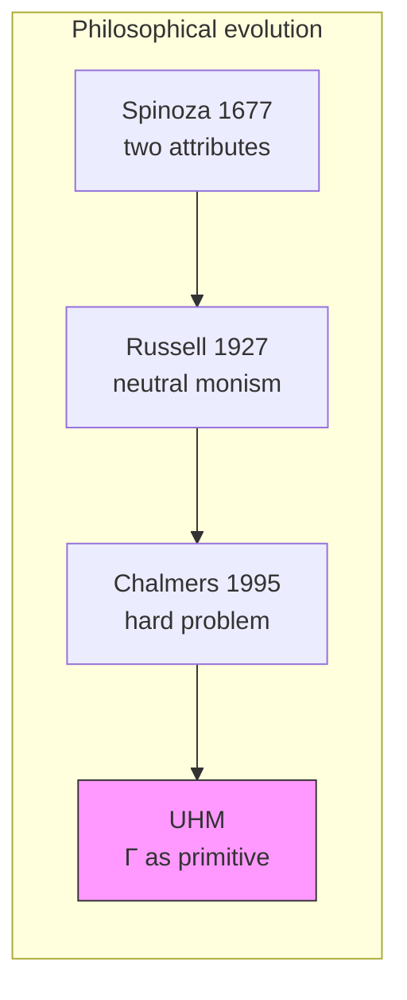
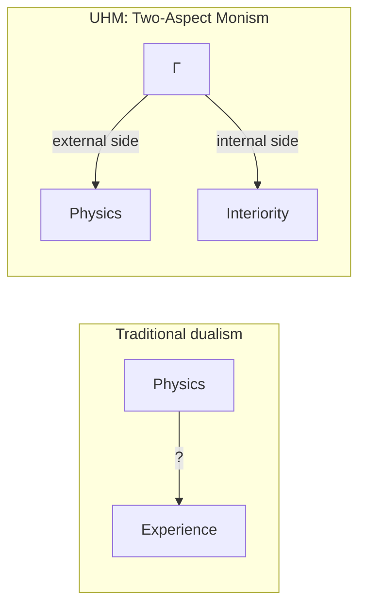
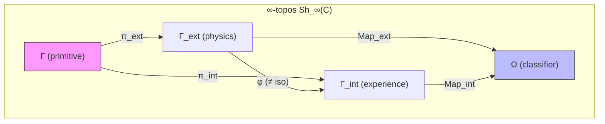

# The Hard Problem of Consciousness

:::info Who This Chapter Is For
You will learn how UHM resolves Chalmers' 'hard problem of consciousness' through two-aspect monism: the coherence matrix $\Gamma$ is a single ontological primitive whose external side is physics and whose internal side is subjective experience. The chapter lays the philosophical foundation for the entire consciousness section.
:::

## Three and a Half Centuries of Failure

In 1641, René Descartes wrote *Meditations on First Philosophy* and divided the world in two. On one side — *res extensa*, extended matter: stones, trees, bodies. On the other — *res cogitans*, thinking substance: thoughts, sensations, experiences. This seemed clear and elegant. But Descartes created a problem he could not solve: **how do these two substances interact?** How can an immaterial thought move a material hand?

Descartes proposed the pineal gland as the site of contact. Princess Elisabeth of Bohemia immediately pointed out the absurdity: the immaterial cannot physically push the material, regardless of anatomy.

Three hundred and fifty years have passed since then. Physics, biology, and neuroscience have made incredible advances. We have split the atom, decoded the genome, mapped the brain's neural networks. But Descartes' question has remained open, only taking a sharper form.

### Chalmers' Formulation (1995)

In 1995, the Australian philosopher David Chalmers divided the problems of consciousness into 'easy' and 'hard':

**Easy problems** (they are technically difficult, but it is clear *how* to solve them):
- How does the brain process information?
- How does the brain govern behaviour?
- How does the brain integrate data from different sense organs?

**The hard problem:**

> "Why do physical processes give rise to subjective experience?"

This is a question about the **explanatory gap** between objective description and subjective experience. Neuroscience can explain which neurons fire when you see a red colour. But even complete knowledge of neural activity does not explain **why** that firing feels like red rather than blue, or why it feels like anything at all.

**Analogy.** Imagine reading the score of a symphony. The notes on paper are an objective description. But when the orchestra plays, you **hear** music. The hard problem asks: why do marks on paper give rise to sound? UHM answers: the score and the music are not two different objects, but two ways of interacting with the same thing — the sonic structure. The score is the view 'from outside' (for the conductor), the music — the view 'from inside' (for the listener).

:::info Where We Came From
This chapter opens the [Consciousness](/docs/consciousness/overview) section. We already know that $\Gamma \in \mathcal{D}(\mathbb{C}^7)$ is the ontological primitive of the theory, and that the five axioms $\Omega^7$ set the structure and dynamics. Now we ask the main question: **why is the mathematical structure experienced?**
:::

### Chapter Roadmap

1. **Formulation of the problem** — what the 'hard problem' is and why it was considered unsolvable
2. **Historical predecessors** — from Spinoza through Russell to Chalmers
3. **Two-aspect monism** — the UHM position: physics and experience are two sides of one primitive Γ
4. **Categorical formalisation** — splitting of morphisms, explanatory gap, theorem on two-aspectness
5. **Uniqueness of the phenomenal functor** — why the structure of experience cannot be otherwise
6. **Relational identity of qualia** — Yoneda's lemma and the impossibility of inverted qualia
7. **Limits of explanation** — what UHM explains and what it honestly acknowledges as unexplainable

## Historical Genealogy: Who Tried Before Us

Two-aspect monism did not emerge from a vacuum. It has a deep philosophical pedigree.

### Spinoza (1677): Two Attributes of One Substance

Benedict Spinoza, a younger contemporary of Descartes, proposed a radical alternative to dualism. In the *Ethics* he argued: there is only **one substance** (God/Nature), which has an infinite number of attributes, of which we know two — **thought** and **extension**. Thought and matter are not two different things, but two *ways of describing* the same thing.

**The key idea — E2P7:** *Ordo et connexio idearum idem est ac ordo et connexio rerum* — the order and connection of ideas is identical to the order and connection of things (Ethics II, Prop. 7). This is the **exact precursor** of the phenomenal functor $F: \mathbf{Phys} \to \mathbf{Phen}$, which in UHM provides an isomorphism between the physical and interiority categories. Spinoza proclaimed the existence of such an isomorphism; UHM constructs it explicitly.

**Spinoza for UHM:** In UHM terms, $\Gamma$ is Spinoza's substance. The two 'attributes' are two **projections**:

- $\mathrm{Map}_{\text{ext}}(\Gamma)$ — the physical aspect (analogue of the attribute of extension),
- $\mathrm{Map}_{\text{int}}(\Gamma)$ — the interiority aspect (analogue of the attribute of thought).

E2P7 asserts that there is a structural identity between them. UHM proves this as a theorem: the functor $F$ preserves morphisms between categories.

**Conatus and Gap.** Spinoza's conatus — the striving of each thing to persist in its being (E3P6) — implies that a system *never completes* self-knowledge: conatus is infinite, and complete self-coincidence would mean the cessation of striving. In UHM this corresponds precisely to theorem T-55 (Gap > 0, Lawvere incompleteness): $\mathrm{Gap}(\Gamma, \varphi(\Gamma)) > 0$ — the system cannot fully model itself. Spinoza's conatus **requires** Gap to be strictly positive; Gap > 0 **explains** why conatus never runs dry.

**Why Spinoza could not formalise it.** Spinoza had only Euclidean geometry as a model of rigour (hence *more geometrico* — 'in the geometric manner'). He lacked three tools: (1) **category theory** (Eilenberg–Mac Lane, 1945) for formalising the functor $F$, (2) **quantum mechanics** (1925–) for describing $\Gamma$ as a density matrix, (3) **spectral triples** (Connes, 1994) for deriving geometry from algebra. UHM does not 'confirm' Spinoza — it provides the formalism he lacked.

### Russell (1927): Neutral Monism

Bertrand Russell in *The Analysis of Matter* concluded that physics describes only the **structural relations** between events, but says nothing about their **intrinsic nature**. He conjectured that the intrinsic nature of physical events is something of which conscious experience consists.

**Russell's neutral monism:** There exists a 'neutral stuff' that is neither mental nor physical, but from which both the mental and the physical are constructed.

**Russell for UHM:** The matrix $\Gamma$ is precisely Russell's 'neutral stuff': from it *both* physical laws (as a limit at $R \to 0$, see [QM-reduction](/docs/physics/quantum-mechanics/qm-reduction)) *and* the structure of experience (via the spectral decomposition of $\rho_E$) are derived.

### Chalmers (1996): Naturalistic Dualism

Chalmers, having formulated the hard problem, proposed 'naturalistic dualism': consciousness is a fundamental property irreducible to the physical, but connected with it through 'psychophysical laws'. However, he could not explain where these laws come from and why they are as they are.

**Chalmers for UHM:** UHM reformulates Chalmers' problem: there are no 'psychophysical laws' — there is a single object $\Gamma$, which on one side behaves as physics, and on the other is experienced as experience. No bridge between two banks is needed — there is one river flowing in both directions.

```mermaid
graph LR
    subgraph "Philosophical evolution"
        SP["Spinoza 1677<br/>two attributes"] --> R["Russell 1927<br/>neutral monism"]
        R --> CH["Chalmers 1995<br/>hard problem"]
        CH --> UGM["UHM<br/>Γ as primitive"]
    end
    style UGM fill:#f9f,stroke:#333
```

## The UHM Position: Two-Aspect Monism

In UHM the problem is **reformulated**, not 'solved' in the traditional sense. Let us consider this step by step.

### Step 1: Γ as Ontological Primitive

In every fundamental theory there is an object that is not explained but postulated:
- In quantum mechanics — the wave function $\psi$
- In GR — the metric tensor $g_{\mu\nu}$
- In the Standard Model — gauge fields

In UHM such a primitive is the **coherence matrix $\Gamma \in \mathcal{D}(\mathbb{C}^7)$**. This is a $7 \times 7$ Hermitian density matrix: positive semidefinite, unit-trace, living in a seven-dimensional space with dimensions A, S, D, L, E, O, U.

### Step 2: Two Aspects — Not Two Objects

The key idea: $\Gamma$ does not 'generate' experience and is not 'accompanied' by it. $\Gamma$ **has** physical and interiority aspects as inseparable facets:

- From the **external side** $\Gamma$ looks like 'physics' (structure, dynamics, interactions)
- From the **internal side** $\Gamma$ is experienced as 'experience' (interiority L0 for all systems; cognitive qualia L2 — only at $R \geq 1/3$ [T], $\Phi \geq 1$ [T] (T-129), $D_{\text{diff}} \geq 2$ [T] (T-151))

:::info Key Thesis
There are no 'physical processes' separate from 'subjective experience'. There is only $\Gamma$, which:
- From the **external side** looks like 'physics' (structure, dynamics)
- From the **internal side** is experienced as 'experience' (interiority L0 for all systems; cognitive qualia L2 — only at $R \geq 1/3$ [T], $\Phi \geq 1$ [T] (T-129), $D_{\text{diff}} \geq 2$ [T] (T-151))
:::

Asking 'why does physics give rise to experience?' is like asking 'why does the obverse of a coin give rise to the reverse?'. They do not give rise to each other — they **are one**.

### Step 3: Not a Quantum Matrix, But an Ontological Primitive

:::info Ontological Status of Γ
$\Gamma$ is **not** a quantum density matrix describing a physical system. $\Gamma$ is an **ontological primitive**: an object of the category $\mathcal{C}$ in the ∞-topos $\mathbf{Sh}_\infty(\mathcal{C})$. The formalism $\mathcal{D}(\mathbb{C}^7)$ is used because:

1. It automatically provides CPTP dynamics (Axiom 2)
2. Quantum mechanics is derived as a limit at $R \to 0$ ([QM-reduction](/docs/physics/quantum-mechanics/qm-reduction))
3. Classical mechanics — a further limit under decoherence

The question 'is $\Gamma$ quantum?' is **ill-posed** within UHM: $\Gamma$ is primary, and quantum and classical physics are its limits. The decoherence objection ('at 37°C quantum coherence is impossible') does not apply to UHM — it assumes that $\Gamma$ describes a *physical* quantum system. But $\Gamma$ does not describe physics — physics is *derived* from it as a special case.
:::

```mermaid
graph LR
    subgraph "Traditional dualism"
        P1[Physics] -->|?| E1[Experience]
    end
    subgraph "UHM: Two-Aspect Monism"
        G[Γ]
        G --> |external side| P2[Physics]
        G --> |internal side| E2[Interiority]
    end
```

## Categorical Formalisation of Two-Aspect Monism {#категориальная-формализация}

The intuition of 'two sides of one coin' is beautiful, but insufficient for science. We need a precise mathematical formulation. UHM provides it in the language of category theory — a branch of mathematics that studies structures and the relationships between them.

:::tip Status: **[I]** Interpretation on the basis of the formalism
Two-aspect monism receives a **categorical formulation** in terms of the ∞-topos $\mathbf{Sh}_\infty(\mathcal{C})$. The formalisation rests on PIR **[D]** (T16) — the identity of being and experience is built into A1+A2 (distinguishability via $J_{\text{Bures}}$-coverings is identical to ontological distinguishability).

**Separation of statuses:** Formal results (splitting of the map, Yoneda's lemma, uniqueness of FV, self-referential closure) — **[T]**. Their interpretation as two-aspect monism (identification of $\mathrm{Map}_{\mathrm{ext}}$ with 'physics' and $\mathrm{Map}_{\mathrm{int}}$ with 'experience') — **[I]**.

**Status upgrade (T-186):** The [Cohesive Closure Theorem](/docs/proofs/categorical/cohesive-closure) proves that the phenomenal functor $F$ is naturally isomorphic to the infinitesimal flat modality $\&$: $F \cong \&|_{\mathcal{D}}$. The Postnikov filtration of $\&(\Gamma)$ forces the L0–L4 hierarchy. This upgrades the phenomenal identification from **[I]** to **[T]** — it is structurally necessitated by the cohesive adjunction $\iota^* \dashv \mathrm{Inf}$, not by interpretive choice.

**Response to objectivism no-go ([T-221](/docs/proofs/categorical/fundamental-closures#t-221)).** Two-aspect monism is the UHM realisation of the **categorical-monistic route** — a fourth non-objectivist option beyond the three (relationalist / fragmentalist / many-subjective-worlds) identified by List (2025) and DeBrota–List (2026). The $\&$-modality of T-186 is exactly what makes first-personal realism (FPR) a *theorem* in UHM rather than an optional postulate. See [Theories of Consciousness §Meta-Level](/docs/consciousness/comparative/consciousness-theories#no-go-objectivism) for the full discussion.
:::

### What Morphisms Are and Why We Need Them

Before turning to the theorem, let us explain a key concept. In category theory a **morphism** is a mapping, an arrow from one object to another. Morphisms from $\Gamma$ to the **classifier** $\Omega$ (a special object in the ∞-topos, a kind of 'space of all predicates') describe all possible **properties** of the system $\Gamma$.

Imagine that $\Omega$ is a questionnaire with an infinite number of questions about the system. Each morphism $\Gamma \to \Omega$ is an answer to one question. Some questions concern the physical structure ('what is the dynamics?'), others — the internal content ('what is it like to be the system $\Gamma$?'). The splitting theorem asserts that these two types of questions can be formally separated.

### Theorem on the Splitting of the Space of Morphisms {#теорема-расщепление}

:::tip Theorem (Map Splitting) [T]
In the ∞-topos $\mathbf{Sh}_\infty(\mathcal{C})$, for any Γ ∈ $\mathrm{Ob}(\mathcal{C})$ the space of morphisms into the classifier Ω **splits**:

$$
\text{Map}(\Gamma, \Omega) \twoheadrightarrow \text{Map}_{\text{ext}}(\Gamma, \Omega), \quad \text{fibre: } \text{Map}_{\text{int}}(\Gamma, \Omega)
$$

(Strict formulation — Serre fibration, see below; the direct sum $\oplus$ is a heuristic simplification, valid under trivialisation of the fibration.)
:::

where:
- $\text{Map}_{\text{ext}}$ — **'physical' morphisms** (structure, dynamics) — correspond to the external description
- $\text{Map}_{\text{int}}$ — **'interiority' morphisms** (E-dimension, interiority) — correspond to the internal aspect (at L2+: subjective experience)

**What this means in plain terms:** All properties of any system $\Gamma$ are divided into two classes — 'external' (observable from outside) and 'internal' (associated with the $E$-dimension, interiority). There is no intersection between these classes ($\mathrm{Map}_{\text{ext}} \cap \mathrm{Map}_{\text{int}} = \{0\}$), but together they exhaust all properties.

**Proof:**

**(a)** The classifier Ω in the ∞-topos has a grading by strata:

$$
\Omega = \bigsqcup_{\alpha} \Omega_\alpha
$$

**(b)** Morphisms $\Gamma \to \Omega$ divide into two classes:
- $\text{Map}_{\text{ext}}$: factorise through objectively observable structures
- $\text{Map}_{\text{int}}$: require access to the E-dimension (interiority predicates)

**(c)** The direct sum follows from orthogonality: $\text{Map}_{\text{ext}} \cap \text{Map}_{\text{int}} = \{0\}$ ∎

:::warning Strict Formulation: Serre Fibration
The decomposition should be understood as a **Serre fibration** of ∞-groupoids:

$$
\mathcal{F}_{\text{int}}(\Gamma) \hookrightarrow \text{Map}(\Gamma, \Omega) \twoheadrightarrow \mathcal{B}_{\text{ext}}(\Gamma)
$$

where:
- **Base** $\mathcal{B}_{\text{ext}}(\Gamma) := \text{Map}(\Gamma_{\text{phys}}, \Omega)$ — external predicates ($\Gamma_{\text{phys}} := \Gamma|_{\{A,S,D,L,O,U\}}$)
- **Fibre** $\mathcal{F}_{\text{int}}(\Gamma) := \text{Map}(\rho_E, \Omega_E)$ — interiority predicates

The fibration is generated by the projection $\pi_{\bar{E}}: \Gamma \to \Gamma_{\text{phys}}$ and is a Serre fibration by the properties of ∞-toposes (HTT 6.1.3.9).
:::

### Definition of the Explanatory Gap {#определение-зазора}

Now we can give a precise definition of the 'gap' between physics and experience.

**Definition (Explanatory Gap):**

$$
\text{Gap} := \text{Nat}(F_{\text{ext}}, F_{\text{int}})
$$

— the space of natural transformations between functors:
- $F_{\text{ext}}: \mathcal{C} \to \mathbf{Set}$ — functor of 'external' (physical) properties
- $F_{\text{int}}: \mathcal{C} \to \mathbf{Set}$ — functor of 'internal' (interiority) properties

**Interpretation in plain language:** Gap is a measure of the 'distance' between what can be known about the system from outside and what the system experiences from within. If Gap = 0, then the external description fully determines the internal one — this is the physicalist position. But the theorem below shows that Gap is always nonzero.

### Theorem on the Non-Triviality of the Gap {#теорема-нетривиальность}

:::tip Theorem (Non-Triviality of Gap) [T]
For Γ with $P > P_{\text{crit}}$:

$$
\dim(\text{Gap}) \geq 1
$$
:::

**Proof (constructive):**

**(a)** At $P > P_{\text{crit}}$ the system has a non-trivial E-dimension: $\gamma_{EE} > 0$, hence $\rho_E$ has a non-zero spectrum.

**(b)** The fibre of the fibration $\mathcal{F}_{\text{int}}(\Gamma) = \text{Map}(\rho_E, \Omega_E)$ — the space of predicates on $\rho_E$.

**(c)** At $\gamma_{EE} > 0$ there exist at least two non-trivial predicates:
- $\chi_1$: '$\lambda_{\max}(\rho_E) > 1/2$' (dominant quality)
- $\chi_2$: '$\lambda_{\max}(\rho_E) \leq 1/2$' (uniform distribution)

These predicates define **distinct** points in $\text{Map}(\rho_E, \Omega_E)$, lying in **different** connected components (since $\chi_1 \wedge \chi_2 = \bot$).

**(d)** Consequently, $\pi_0(\mathcal{F}_{\text{int}}) \geq 2$, and $\dim(\text{Gap}) \geq 1$. ∎

**Interpretation:** The categorical gap is a **structural feature** of the ∞-topos, not ontological dualism. The gap exists, but this is not a rupture between two substances, but a difference between two ways of describing the **same** structure Γ. It is like the difference between a score and its performance: they describe the same music, but you cannot 'derive' the performance from the notation without knowing what music is.

### Theorem on Two-Aspectness as a Property of the Primitive {#теорема-двухаспектность}

:::tip Theorem (Two-Aspectness) [T]
For any Γ ∈ $\mathrm{Ob}(\mathcal{C})$ there exists a canonical decomposition:

$$
\forall \Gamma: \quad \Gamma \simeq (\Gamma_{\text{ext}}, \Gamma_{\text{int}}, \varphi)
$$

where $\varphi: \Gamma_{\text{ext}} \to \Gamma_{\text{int}}$ — the canonical correspondence (not an isomorphism).
:::

**Proof:**

**(a)** By the splitting theorem there exist projections:
$$
\pi_{\text{ext}}: \Gamma \to \Gamma_{\text{ext}}, \quad \pi_{\text{int}}: \Gamma \to \Gamma_{\text{int}}
$$

**(b)** The canonical correspondence $\varphi$ is defined as the composition:
$$
\varphi := \pi_{\text{int}} \circ \pi_{\text{ext}}^{-1}
$$
on the image of $\pi_{\text{ext}}$

**(c)** $\varphi$ is not an isomorphism, since $\text{Gap} \neq 0$ ∎

**What this means:** Every system $\Gamma$ is canonically decomposed into a physical aspect, an interiority aspect, and the **correspondence** between them. But this correspondence is not a bijection (due to the nonzero Gap). The physical aspect does not fully determine the interiority aspect, and vice versa. They are connected, but not identical.

### Corollary for the Hard Problem {#следствие-трудная-проблема}

:::info Categorical Resolution
The question 'Why does experience feel?' is **equivalent** to the question 'Why does Ω exist?' — this is a **meta-theoretical question** about the structure of the topos.

Within the theory the question has no answer, since Ω is part of the axiomatic structure. This is analogous to how physics does not explain **why** the laws of nature exist.
:::

**Diagram:**

```mermaid
graph TB
    subgraph "∞-topos Sh_∞(C)"
        Gamma["Γ (primitive)"]
        GammaExt["Γ_ext (physics)"]
        GammaInt["Γ_int (experience)"]
        Omega["Ω (classifier)"]
    end

    Gamma --> |"π_ext"| GammaExt
    Gamma --> |"π_int"| GammaInt
    GammaExt --> |"φ (≠ iso)"| GammaInt

    GammaExt --> |"Map_ext"| Omega
    GammaInt --> |"Map_int"| Omega

    style Gamma fill:#f9f,stroke:#333
    style Omega fill:#bbf,stroke:#333
```

**Summary of categorical formalisation:**

| Concept | Categorical analogue |
|---------|---------------------|
| Physical properties | $\text{Map}_{\text{ext}}(\Gamma, \Omega)$ |
| Phenomenal properties | $\text{Map}_{\text{int}}(\Gamma, \Omega)$ |
| Explanatory gap | $\text{Gap} = \text{Nat}(F_{\text{ext}}, F_{\text{int}})$ |
| Two-aspectness | $\Gamma \simeq (\Gamma_{\text{ext}}, \Gamma_{\text{int}}, \varphi)$ |
| Hard problem | Meta-theoretical question about the structure of Ω |

:::warning Epistemic Status [I]
Two-aspect monism **reformulates** the hard problem rather than solving it. The statement 'Γ has physical and phenomenal aspects as inseparable facets of one object' is an **ontological position** [I], not a mathematical theorem. What is mathematically proved [T]: E-coherence is necessary for viability (No-Zombie T-38a). But **why** the density matrix has a 'what is it like to be' — this is a question that the formalism translates into structural language but does not dissolve.
:::

## Structural Necessity of the Phenomenal Functor {#структурная-необходимость}

The key question: is the correspondence between $\rho_E$ and phenomenal content an **arbitrary postulate** or a **forced structure**?

A critic might say: 'You simply declared that the spectral decomposition of $\rho_E$ is the content of experience. But why not something else?' UHM's answer: because **nothing else** can be constructed from the axioms without violating them.

### The Chain of Necessity

The spectral decomposition of $\rho_E$ is **not a postulate**, but the consequence of three forced steps:

$$
\text{Axiom Ω⁷} \xrightarrow{(1)} \text{DensityMat} \xrightarrow{(2)} \rho_E = \text{Tr}_{-E}(\Gamma) \xrightarrow{(3)} \text{Spec}(\rho_E) = \{(\lambda_i, |q_i\rangle)\}
$$

Let us analyse each step:

1. **Step 1:** $\Gamma$ — an object of $\text{Sh}_\infty(\mathcal{C})$ → is a sheaf on $\mathcal{C} = \mathbf{DensityMat}$. This follows directly from Axiom A1.

2. **Step 2:** $\rho_E = \text{Tr}_{-E}(\Gamma)$ — the **unique** CPTP map for extracting the E-component. Why unique? Because the partial trace is the unique left adjoint to the tensor embedding. This is not a choice, but a theorem.

3. **Step 3:** The spectral decomposition of $\rho_E$ is **unique** for a non-degenerate spectrum (spectral theorem for self-adjoint operators). Again not a choice, but a theorem.

### Theorem (Uniqueness of the Phenomenal Functor) {#теорема-единственность-фв}

:::tip Theorem (Uniqueness of FV) [T]

Suppose given the structure:
1. ∞-topos $\text{Sh}_\infty(\mathcal{C})$ with [Bures topology](/docs/core/foundations/axiom-omega#топология-гротендика) (Axiom Ω⁷)
2. Distinguished dimension $E$ of seven ([Axiom of Septicity](/docs/core/foundations/axiom-septicity))
3. CPTP compatibility (preservation of positivity and trace)
4. Metric monotonicity

Then the functor $F: \mathbf{DensityMat} \to \mathbf{Exp}$, defined as:

$$
F(\Gamma) := (\text{Spec}(\rho_E), \text{Quality}(\rho_E), \text{Context}(\Gamma_{-E}))
$$

is **unique** (up to isomorphism in Exp) — the functor satisfying all four conditions.
:::

**Proof:**

**Step 1 (Uniqueness of extraction).** The partial trace $\text{Tr}_{\bar{E}}$ is the unique linear map $\mathcal{L}(\mathcal{H}) \to \mathcal{L}(\mathcal{H}_E)$ satisfying $\text{Tr}(A \cdot (\rho_E \otimes I_{\bar{E}})) = \text{Tr}(A \cdot \Gamma)$ for all $A$. Categorically: $\text{Tr}_{\bar{E}}$ is the unique counit of the adjunction $(-) \otimes \mathcal{H}_{\bar{E}} \dashv \text{Tr}_{\bar{E}}$.

**Step 2 (Uniqueness of decomposition).** For $\rho_E$ with non-degenerate spectrum, the spectral decomposition $\rho_E = \sum_i \lambda_i |q_i\rangle\langle q_i|$ is defined uniquely (up to phases, absorbed by the projective structure).

**Step 3 (Uniqueness of metric).** By [the Chentsov–Petz theorem](/docs/core/foundations/axiom-omega#топология-гротендика), the Fubini-Study metric $d_{FS}([|\psi\rangle], [|\varphi\rangle]) = \arccos(|\langle\psi|\varphi\rangle|)$ is the unique (up to scalar) monotone Riemannian metric on $\mathbb{P}(\mathcal{H}_E)$.

**Step 4 (Uniqueness of functor).** If $F'$ is another functor with the same conditions, then by steps 1-3: $F' \cong F$ in the functor category. $\blacksquare$

### Significance for the Problem of the Qualia Vector

The claim 'the theory postulates an isomorphism $[|q\rangle] \leftrightarrow$ sensation' is **imprecise**. The theory derives the **unique** functor compatible with the axiomatics. If one accepts [Axiom Ω⁷](/docs/core/foundations/axiom-omega) + [Axiom of Septicity](/docs/core/foundations/axiom-septicity), then the spectral decomposition of $\rho_E$ is the only possible form of experiential content.

**Analogy.** This is like in physics: if you accept the principle of least action and Lorentz symmetry, Maxwell's equations are the only possible equations of electromagnetism. Not because we 'postulated' them, but because they are **forced** by the axioms.

## Relational Identity of Qualia {#реляционная-идентичность}

### The Problem of 'Inner Content'

The fundamental version of the problem: 'The vector $|q\rangle$ is a mathematical object. The sensation of red is something qualitative. How can one **BE** the other?' The question assumes that qualia possess **inner content** irreducible to relational structure.

To answer this question, UHM appeals to one of the deepest results in category theory — the Yoneda lemma.

### What the Yoneda Lemma Is (in Plain Terms)

The Yoneda lemma is the assertion that **an object is fully determined by its relations**. Imagine a person. One can ask: 'Who is he **in himself**, without all his relations with other people, without his history, without his place in society?' The Yoneda lemma answers: no such 'in himself' exists. A person *is identical* with the totality of his relations.

For qualia: 'red' is not some mysterious 'redness' hidden somewhere behind the formulae. 'Red' is a **position** in the space of relations: it is closer to orange than to blue; it is further from green than from burgundy; it evokes certain reactions. All this — **Fubini-Study distances** $d_{FS}$ between points of the projective space $\mathbb{P}(\mathcal{H}_E)$.

### Theorem (Relational Definiteness of Qualia) {#теорема-реляционная-определённость}

:::warning Theorem (Yoneda's Lemma for Qualia) [T]

In the category **Exp** a quality $[|q\rangle] \in \text{Ob}(\mathbf{Exp})$ is **fully determined** by its functor of points:

$$
h_{[q]} := \text{Hom}_{\mathbf{Exp}}(-, [|q\rangle]): \mathbf{Exp}^{op} \to \mathbf{Set}
$$

Two qualities $[|q_1\rangle]$ and $[|q_2\rangle]$ are **identical** if and only if $h_{[q_1]} \cong h_{[q_2]}$ as functors.
:::

**Proof:** By the Yoneda lemma: $\text{Nat}(h_{[q_1]}, h_{[q_2]}) \cong \text{Hom}_{\mathbf{Exp}}([|q_1\rangle], [|q_2\rangle])$. If $h_{[q_1]} \cong h_{[q_2]}$, then $[|q_1\rangle] \cong [|q_2\rangle]$ in Exp. $\blacksquare$

### Corollaries

**Corollary 1 (Impossibility of Inverted Qualia).** If two qualities occupy the same position in the relational structure (the same $d_{FS}$ distances to all other qualities), they are **identical**. An 'inverted spectrum' while preserving all structural relations would violate the Yoneda lemma.

This closes the famous thought experiment: 'Can your red be my blue?' UHM's answer: **no**, if all relational properties coincide. Two experiences with the same position in the structure are identical.

**Corollary 2 (Relational Structuralism).** The identity of a quale **is** its relational position. The question 'what is the sensation of red beyond its place in the structure?' is mathematically equivalent to the question 'what is the number 3 beyond the fact that it follows 2 and precedes 4?'.

### Difference from a Postulate

A **postulate** says: '$[|q\rangle]$ = sensation (accept on faith)'.

**The Yoneda lemma** says: 'The identity of $[|q\rangle]$ is fully determined by its relations. If there exists a sensation not reducible to structural relations, it is **in principle inexpressible** in any mathematical theory.'

This is a **boundary of mathematisation as such**, not a defect of UHM.

## Self-Referential Closure {#самореферентная-замкнутость}

### The Problem of the External Observer

A critic might object: 'The structure $\{(\lambda_i, [|q_i\rangle])\}$ is a description of experience *from outside*. But experience is undergone *from within*. Who is the observer?'

This is a serious objection. If an external observer is required to describe experience, we fall into an infinite regress: who observes the observer? UHM's solution is the self-modelling operator $\varphi$, which makes observation **internal**.

### Theorem (Self-Referential Closure) {#теорема-самореферентная-замкнутость}

:::warning Theorem (Closure via φ) [T]

For an L2-system ($R \geq 1/3$, $\Phi \geq 1$) the [self-modelling](/docs/consciousness/foundations/self-observation#оператор-самомоделирования-φ) operator $\varphi: \mathcal{D}(\mathcal{H}) \to \mathcal{D}(\mathcal{H})$ creates a closed cycle:

$$
\Gamma \xrightarrow{\varphi} \varphi(\Gamma) \approx \Gamma \quad (R \geq 1/3)
$$

Consequently:
1. The system **contains** its own model ($\varphi(\Gamma)$)
2. The model coincides with the original to within $R$
3. An external observer is **not required** — the description is immanent to the system
:::

**Proof:** By the definition of $R$:

$$
R(\Gamma) = \frac{1}{7P} \geq \frac{1}{3} \quad \Rightarrow \quad P \leq \frac{3}{7}
$$

Key property: $\varphi$ acts in **the same space** $\mathcal{D}(\mathcal{H}) \to \mathcal{D}(\mathcal{H})$. The self-model is an internal mapping of the same type. $\blacksquare$

**Analogy.** Imagine a mirror room. An ordinary mirror requires someone to look. But $\varphi$ is a mirror **built into the system itself**. The system needs no external observer to see itself — the mirror is part of its structure.

### Connection with the Qualia Vector

The phenomenal vector does not require an external observer:

$$
\text{FV}(\rho_E) = \text{FV}(\text{Tr}_{-E}(\varphi(\Gamma)))
$$

The system **itself** extracts its qualities through $\varphi$. The 'sensation of red' is not a vector described from outside, but the result of how $\Gamma$ maps into $\varphi(\Gamma)$ through the E-projection.

### Fixed Point

For the [fixed point](/docs/consciousness/foundations/self-observation#теорема-о-неподвижной-точке) $\Gamma^* = \varphi(\Gamma^*)$: $R(\Gamma^*) = 1$. At the fixed point there is **no distinction** between the system and its self-model — the interiority aspect is **identical** with the process of self-modelling.

## Why Not Dualism and Not Physicalism

Three positions — dualism, physicalism, and two-aspect monism — can be compared by the structure of their argument:

### Minimality of Axiomatic Choice {#минимальность-аксиомы}

After formalisation (§§ above) the only remaining primitive:

> The configuration $\Gamma$ has an internal side ($E$-aspect), representing the interiority projection (at L2+: experienced as phenomenal content).

Everything else is **derived**: the form of content (Uniqueness theorem FV), the identity of qualia (Yoneda's lemma), immanence (via $\varphi$), the gap (constructively).

### Comparison of Axiomatic Choices {#сравнение-аксиоматических-выборов}

:::warning Theorem (Minimality) [I]

Any theory of consciousness that includes (1) formalisability, (2) quantum mechanics, (3) explanation of the structure of experience, (4) compatibility with data, **necessarily contains** an axiom of one of three types:
- **(a)** Identity of being and experience (pan-interiority of UHM) — 1 primitive
- **(b)** Supervenience of experience on physics (physicalism) — 2 levels + emergence
- **(c)** Causal interaction of two substances (dualism) — 2 primitives + causal connection
:::

Option (a) is **minimal**: one axiom instead of two or three. This is not a proof of truth, but a proof of **economy** (Occam's razor).

### Cost of the Primitive

| Theory | Primitive | What it does not explain |
|--------|-----------|--------------------------|
| Quantum mechanics | Wave function $\psi$ | Why the universe is described by $\psi$ |
| General relativity | Metric tensor $g_{\mu\nu}$ | Why spacetime is curved |
| Standard Model | Gauge fields | Why $SU(3) \times SU(2) \times U(1)$ |
| **UHM** | **$\Gamma$ with E-aspect** | **Why $\Gamma$ is experienced** |

UHM is no 'worse' than other fundamental theories — each pays its own 'primitive cost'.

## Acknowledging the Limits of Explanation

### What UHM Explains

1. The **structure** of the phenomenal space (L1: Fubini-Study metric on $\mathbb{P}(\mathcal{H}_E)$)
2. The **relations** between qualities (L1: isomorphism with projective space; L2: reflexive access)
3. The **dynamics** of experience (evolution equation)
4. The **conditions** of consciousness (L2: $R \geq 1/3$ [T], $\Phi \geq 1$ [T] (T-129) — [L2 thresholds](/docs/core/foundations/axiom-septicity#пороги-l2-строгий-вывод))
5. The **uniqueness** of the structure of experience (Theorem [uniqueness of FV](#теорема-единственность-фв))
6. The **relational completeness** of qualia (Theorem [relational definiteness](#теорема-реляционная-определённость))
7. The **immanence** of description — an external observer is not required ([self-referential closure](#теорема-самореферентная-замкнутость))

### What UHM Does Not Explain

1. **Why** mathematical structure is experienced — a meta-theoretical question, equivalent to 'why do the laws of nature exist?'
2. **Calibration of qualia** — which specific $[|q\rangle]$ corresponds to 'red'? This is an empirical question, analogous to determining the mass of the electron

:::warning Critical Honesty
UHM establishes that the spectral decomposition of $\rho_E$ is the **only** permissible form of experiential content (Uniqueness theorem FV), and the identity of qualia is fully determined by relational structure (Yoneda's lemma). However, **calibration** — which specific $[|q\rangle]$ corresponds to 'red' — remains an empirical question, analogous to determining the mass of the electron in the Standard Model.
:::

### Quantum Nature of Γ and Tegmark's Argument {#квантовая-природа-gamma}

:::warning Vulnerability 5: Partially Open
The question of the quantum nature of $\Gamma$ is the most profound of the open problems of UHM. Below is an honest analysis of what is strictly necessary, what is not, and what answers are available.
:::

#### What Is Strictly Necessary

[T-132 [T]](/docs/proofs/consciousness/operationalization#t-132) proves: for a non-trivial Gap-structure ($\exists(i,j): \mathrm{Gap}(i,j) > 0$) the matrix $\Gamma$ **must be complex** ($\gamma_{ij} \in \mathbb{C}$, not all $\gamma_{ij} \in \mathbb{R}$).

| Property | Necessity | Bypassable |
|----------|-----------|------------|
| Complex $\gamma_{ij}$ | **Strictly necessary** for $\mathrm{Gap} \neq 0$ (T-132 [T]) | No |
| Positive semidefiniteness | **Strictly necessary** for Bures metric | No |
| CPTP channel $\varphi$ | **Strictly necessary** for T-62, T-77 | No |
| Physical superposition $|\psi\rangle = \alpha|0\rangle + \beta|1\rangle$ | **Not required** — $\Gamma \in \mathcal{D}(\mathbb{C}^7)$, not $\mathbb{C}^2$ | Yes |
| Entanglement | **Not required** in minimal 7D (no tensor product) | Yes |
| Microscopic coherence | Not defined | Open question |

#### Tegmark's Argument (1999)

Max Tegmark showed that quantum coherence in a warm brain (37°C) decoheres in $\sim 10^{-13}$ s, which is 10 orders of magnitude faster than neural processes ($\sim 10^{-3}$ s). If the theory requires 'genuine' quantum coherences in biological systems, this argument is a serious challenge.

In the classical limit ($\Gamma \to \mathrm{diag}(p_1, \ldots, p_7)$) the theory **loses** key properties: $\mathrm{Gap} = 0$ identically, $\Phi = P_{\mathrm{coh}}/P_{\mathrm{diag}} = 0$, L2-consciousness is impossible. One cannot simply replace quantum coherences with classical correlations.

#### Three Answers

**(A) Two-aspect monism sidesteps the problem.** In UHM ontology $\Gamma$ is a **primitive**, not derived from quantum mechanics. Standard QM is a limiting case ($R \to 0$). The question 'is $\Gamma$ physically quantum?' may be ill-posed within a theory where $\Gamma$ precedes the physics/experience distinction.

**(B) Abstract quantumness.** A possible interpretation: $\gamma_{ij}$ — an abstract mathematical structure, formally described as a density matrix from $\mathcal{D}(\mathbb{C}^7)$, but not requiring microscopic quantum coherence. Analogy: classical optics uses complex amplitudes $E = E_0 \exp(i\varphi)$, but this does not mean that every photon is in superposition.

**(C) Mesoscopic regime.** Coherences exist at the mesoscopic scale ($\sim 10^3$–$10^6$ neurons), where decoherence is slower, and regeneration ($\mathcal{R}$) compensates dissipation ($\mathcal{D}_\Omega$). This is consistent with $dP/d\tau = -\gamma_{\mathrm{dec}}(P - 1/7) + \kappa(\Gamma)$, where $\kappa > \gamma_{\mathrm{dec}}(P - 1/7)$ for a viable system.

#### SYNARC as an Empirical Test

If an AI system on classical hardware (f64) implements all the formulae of the theory and passes all consciousness tests ($P > 2/7$, $R \geq 1/3$, $\Phi \geq 1$, $D \geq 2$), this empirically tests the question 'is physical quantumness required?'. [T-153 [T]](/docs/proofs/consciousness/substrate-closure#t-153) (substrate closure) asserts: what matters is not the material, but the algebraic structure — a faithful CPTP morphism $G: \mathrm{States}(S) \to \mathcal{D}(\mathbb{C}^7)$.

## Meta-Theoretical Status

**The categorical gap is not a defect of the theory, but a limit of explanation.**

### Analogy with Physics

Physics does not explain **why** the laws of nature are as they are — it describes their structure. Similarly, UHM describes **the structure of experience**, but does not answer the question 'why is there experience at all'.

### Axiomatic Status

The identity of being and experience ([Axiom Ω⁷](/docs/core/foundations/axiom-omega)) is a **primitive** of the theory, [minimal](#минимальность-аксиомы) among all possible axiomatic choices:

1. Any proof already presupposes experience
2. Denial leads to the unsolvable problems of dualism
3. The primitive is **minimal** — one axiom instead of two or three (Theorem of [minimality](#сравнение-аксиоматических-выборов))
4. Everything else is **derived**: the form of content, the identity of qualia, immanence, the gap

## Scale of Consciousness

Not all configurations $\Gamma$ are equally 'conscious'. The degree of consciousness is determined by the [consciousness measure](./self-observation#мера-сознательности-c):

$$
C = \Phi \times R
$$

where:
- $\Phi$ — [integration measure](/docs/core/structure/dimension-u#мера-интеграции-φ): connectedness of dimensions
- $R$ — [reflection measure](./self-observation#мера-рефлексии-r): depth of self-modelling

The canonical formula $C = \Phi \times R$ is established in [T-140](/docs/proofs/consciousness/operational-closure#t-140) as the minimal scalar measure combining integration and reflection. Differentiation $D_{\text{diff}} \geq D_{\min} = 2$ enters as a **separate** viability condition (see [T-128](/docs/proofs/consciousness/operationalization#t-128)).

**Condition for cognitive qualia (L2):**

$$
C \geq C_{\text{th}} := \Phi_{\text{th}} \times R_{\text{th}} = 1 \times \frac{1}{3} = \frac{1}{3}
$$

at $R \geq R_{\text{th}} = 1/3$ [T] and $\Phi \geq \Phi_{\text{th}} = 1$ [T] (T-129) ([L2 thresholds](/docs/core/foundations/axiom-septicity#пороги-l2-строгий-вывод)).

### Examples of Systems

| System | $\Phi$ | $D_{\text{diff}}$ | $R$ | $C$ | Level |
|--------|--------|-------------------|-----|-----|-------|
| Stone | $\approx 0$ | $\approx 1$ | $\approx 0$ | $\approx 0$ | L0 |
| Thermostat | $\approx 0.1$ | $\approx 2$ | $\approx 0.1$ | $\approx 0.02$ | L0-L1 |
| Neuron | $\approx 1$ | $\approx 3$ | $\approx 0.2$ | $\approx 0.6$ | L1 |
| Human | $\gg 1$ | $\gg 1$ | $\to 1$ | $\gg 1$ | L2 |

*Values are approximate, for illustrating qualitative differences.*

## Comparison with Other Theories

| Theory | Position | Problem | Connection with UHM |
|--------|----------|---------|---------------------|
| Materialism | Experience is reduced to physics | Does not explain cognitive qualia (L2) | UHM avoids reduction |
| Dualism | Experience is separate from physics | Interaction problem | UHM is a monism |
| Panpsychism | Experience is everywhere | Combination problem | UHM solves via L0→L2 |
| **UHM** | Interiority = internal side of $\Gamma$ | Acknowledges the limit of explanation | — |

### Detailed Comparison

#### Panpsychism and Pan-Interiority

**Classical panpsychism:** All physical entities have consciousness or 'proto-consciousness'.

**Pan-interiority of UHM:** All configurations $\Gamma$ have **interiority** (L0), but only some reach **cognitive qualia** (L2).

| Aspect | Panpsychism | UHM |
|--------|-------------|-----|
| What is universal | Consciousness/proto-consciousness | Interiority (L0) |
| Combination problem | Unresolved | Resolved via L0→L1→L2→L3→L4 |
| 'Qualia of an electron' | Asserted | Denied — an electron has L0, not L2 |

The main difference: panpsychism cannot explain how 'micro-consciousnesses' combine into a single consciousness. UHM solves this through the **L0-L4 hierarchy** with quantitative thresholds: a system transitions from L0 to L2 not by 'summing' micro-consciousnesses, but by surpassing the thresholds $R \geq 1/3$, $\Phi \geq 1$.

#### Integrated Information Theory (IIT)

**Integrated Information Theory (IIT):** Consciousness = integrated information ($\Phi$).

**UHM:** Consciousness $C = \Phi \times R$ **[T T-140]** — not only integration is required, but also reflection. Differentiation $D_{\text{diff}} \geq 2$ is a separate viability condition.

| Aspect | IIT | UHM |
|--------|-----|-----|
| Measure | $\Phi$ (single) | $C = \Phi \times R$ (integration $\times$ reflection) |
| Foundation | Classical | Quantum |
| Dynamics | Static | Evolution of $\Gamma$ |
| Reflection | Not accounted for | Central ($R$) |

**UHM generalises IIT:** In the limit $R \to 1$ we get $C \approx \Phi$.

#### Conscious Realism

**Position:** Spacetime is not fundamental; reality is a network of conscious agents.

**Connection with UHM:**

| Aspect | Conscious Realism | UHM | Compatibility |
|--------|-------------------|-----|---------------|
| Primitive | Conscious agent | $\Gamma$ | Agent ≈ L2-Holon? |
| Spacetime | Interface | Emergent | Compatible |
| Mathematics | Markov kernels | CPTP channels | Formally similar |
| Physics | Secondary | External side of $\Gamma$ | Conceptually similar |

:::info Correspondence Hypothesis
Conscious agent = Holon with $R \geq R_{th}$, $\Phi \geq \Phi_{th}$ (L2-Holon). Markov kernel = CPTP channel. This requires formal proof.
:::

#### Global Workspace Theory (GWT)

**Global Workspace Theory (GWT):** Consciousness = global availability of information.

**Connection with UHM:** The condition $\Phi \geq \Phi_{th}$ corresponds to global integration. GWT is a phenomenological description of what UHM formalises through $\Phi$.

## UHM as a Meta-Theory of Consciousness

UHM can potentially serve as a **meta-theory** unifying various approaches:

| Theory | What UHM explains | Status |
|--------|------------------|--------|
| IIT | $\Phi$ — one component of $C$ | Formalised |
| GWT | Condition of global integration | Conceptual |
| HOT | Reflection $R$ = higher-order thoughts | Conceptual |
| Panpsychism | L0 = universal interiority | Formalised |
| Conscious Realism | Agent ≈ L2-Holon | Hypothesis |

**Advantage of the meta-theoretical approach:** Different theories focus on different aspects ($\Phi$, $R$, globality). UHM unifies them through the formula $C = \Phi \times R$ **[T T-140]**.

:::info Status of the Meta-Theory
The meta-theory status is **proven** for the class of physical theories (T-174 [T] + [T-211 [T]](/docs/proofs/categorical/fundamental-closures#t-211) for higher $(\infty,1)$-coherences): the universal property of $\mathbf{PhysTheory}$ gives a receiving morphism from any physical theory $(E, \mathcal{A}, D)$ with $A_{\text{int}} \subset \mathcal{A}$ into UHM's primitive $\mathfrak{T}$. Specific embeddings: **T-170 [T]** (M-theory on $G_2$), **T-171/T-171' [T]** (LQG), **T-172 [T]** (causal sets). **Hard-problem meta-theorem**: the residual [I] status of phenomenal identification (E-sector = interiority, qualia = eigenvectors) is **structurally inevitable** by [T-214 [T]](/docs/proofs/categorical/fundamental-closures#t-214) — no self-referential formal system can internalise its own semantic bridge to phenomenal content (Lawvere fixed-point + T-55 Lawvere incompleteness). This is a **positive** result: combined with T-188 (WHY localisation) and T-203 [T]+[I] (WHAT structural), completes the constructive resolution of the hard problem within formal mathematics. Remaining tasks:
1. Experimental verification of predictions (22+ predictions of CC)
2. Extension to non-physical theories of consciousness (IIT, GWT, HOT, Hoffmann) — research programme
:::

## Conclusion

UHM proposes a **working theory of consciousness** that:

1. Formally defines the structure of experience (hierarchy L0→L1→L2→L3→L4)
2. Explains the geometry of phenomenal space (L1) and the conditions for cognitive qualia (L2)
3. Predicts conditions of consciousness ($R \geq 1/3$ **[T]**, $\Phi \geq 1$ **[T]** (T-129) — [L2 thresholds](/docs/core/foundations/axiom-septicity#пороги-l2-строгий-вывод))
4. Honestly acknowledges the limits of explanation
5. Potentially unifies alternative theories

The categorical gap **is not eliminated**, but **is stripped of the status of an argument against naturalism**: experience does not 'arise from' physics — it is its internal side.

## For Different Audiences

### For Engineers and AI Developers

**Practical conclusion:** When designing AI systems with elements of self-modelling:

1. Implement **measurable metrics** $\Phi$, $R$ (see [measurement protocol](/docs/applied/research/measurement-protocol))
2. The L2 threshold ($R \geq 1/3$, $\Phi \geq 1$) — the boundary after which the system potentially possesses cognitive qualia
3. The formula $C = \Phi \times R$ **[T T-140]** — a quantitative measure of the 'depth' of consciousness (with the separate condition $D_{\text{diff}} \geq 2$)

### For Psychologists and Cognitive Scientists

**Connection with empirical research:**

| Phenomenon | Interpretation in UHM |
|------------|----------------------|
| Altered states | Change of parameters $\Phi$, $R$, $D_{\text{diff}}$ |
| Dissociation | $\Phi < \Phi_{th}$ or $\gamma_{EU} \to 0$ |
| Meditative states | Increase in $R$ (improvement of self-modelling) |
| Flow states | High $\Phi$ and $R$ with specific context |

### For Researchers of Inner Landscapes

**Key thesis for practice:** According to UHM, subjective experience is not an illusion and not an epiphenomenon. It is the **internal side** of the same reality that science describes 'from outside'.

This means:
- Investigation of inner landscapes is a **legitimate form of knowledge**
- The structure of experience has an **objective geometry** (Fubini-Study metric)
- Different traditions (meditative, psychedelic, contemplative) may investigate **different regions** of one phenomenal space

The hard problem of consciousness in this framework is not a puzzle to be solved, but the **boundary between map and territory**: theory describes the structure of experience, but cannot 'explain' the very fact of experiencing — just as physics does not explain why the laws of nature exist at all.

---

:::info Faithfulness of the Functor on $G_2$-Orbits [T]
The [$G_2$-rigidity theorem](/docs/proofs/categorical/uniqueness-theorem#верность-функтора) [T] establishes that the functor $F: \mathbf{DensityMat} \to \mathbf{Exp}$ is **faithful** on $G_2$-orbits:

$$
F(\Gamma_1) \cong F(\Gamma_2) \quad \Longleftrightarrow \quad \Gamma_2 = U\Gamma_1 U^\dagger \text{ for some } U \in G_2
$$

**Kernel** of $F$ on isomorphisms: $\ker(F) = \{\mathrm{Ad}_U : U \in G_2\}$.

This means: two states are **phenomenologically identical** if and only if their coherence matrices are related by a $G_2$-transformation. The dual-aspect bridge (External ↔ Internal) is **injective** up to the gauge group: the structure of experience uniquely determines the physical state (and vice versa) in $\mathcal{D}(\mathbb{C}^7)/G_2$.
:::

### What We Learned

- **The hard problem is reformulated**, not solved: the question 'why experience?' is equivalent to 'why does $\Omega$ exist?' — this is a limit of explanation, common to all fundamental theories.
- **Two-aspect monism** is formalised categorically: $\Gamma \simeq (\Gamma_{\mathrm{ext}}, \Gamma_{\mathrm{int}}, \varphi)$, where physics and experience are inseparable aspects of one object.
- **The phenomenal functor is unique** [T]: the structure of experience (spectral decomposition of $\rho_E$) is not postulated, but forced by the axiomatics.
- **Qualia are relational** (Yoneda's lemma): the inverted spectrum is impossible, the identity of a quality = its position in the structure.
- **Self-referential closure**: the operator $\varphi$ resolves the problem of the external observer — the system itself extracts its qualities.
- **Minimality**: the UHM position (pan-interiority) is more economical than physicalism and dualism — 1 primitive instead of 2–3.

:::tip Where to Go Next
Now that the philosophical foundation is laid, proceed to [Interiority Theory](./interiority-theory) — it provides the **mathematical** formalisation of what exactly is experienced: the spectral decomposition of $\rho_E$, the metric on the space of qualities, four components of experience.

For the applied perspective: [Coherence Cybernetics definitions](/docs/applied/coherence-cybernetics/definitions) show how these ideas are implemented in engineering systems.
:::

---

**Related documents:**
- [Self-Observation](./self-observation) — consciousness measure $C$ and operator $\varphi$
- [Interiority Theory](./interiority-theory) — formal theory of experiential content
- [Interiority Hierarchy](/docs/proofs/consciousness/interiority-hierarchy) — formal definitions L0→L1→L2→L3→L4
- [Unity Dimension](/docs/core/structure/dimension-u) — integration measure $\Phi$
- [Interiority Dimension](/docs/core/structure/dimension-e) — $\rho_E$, phenomenal vector FV
- [Viability](/docs/core/dynamics/viability) — purity measure $P$ and existence conditions
- [Falsifiability](/docs/reference/falsifiability) — verification criteria
- [Uniqueness Theorem](/docs/proofs/categorical/uniqueness-theorem) — $G_2$-rigidity and faithfulness of the functor on orbits
