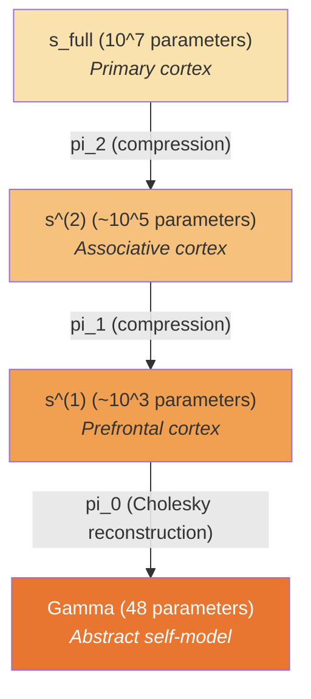
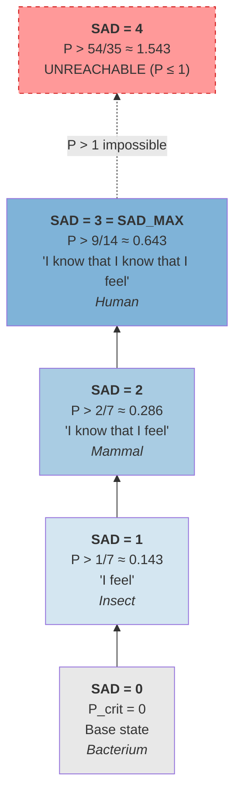

# Self-Awareness Depth Tower {#башня-глубины}

## Introduction: "Have You Ever Noticed That You Notice?"

Try it right now. You are reading this text — that is the first level: *perception*. Now notice that you are reading — that is the second level: *awareness of perception*. And now notice that you noticed that you are reading — that is the third level: *awareness of awareness of perception*.

Can you go further? Notice that you noticed that you noticed? In practice this is difficult — the thought 'slips away', like a reflection in two mirrors facing each other: an infinite corridor, but with each step the image grows dimmer.

It turns out this is not merely a subjective feeling. Within UHM it has been proved that **the depth of self-awareness is fundamentally bounded**: the maximum is three levels of recursion. Not because the brain is 'insufficiently powerful', but because the fourth level would require purity $P > 1$ — and for a normalised density matrix $P \leq 1$ by definition. This is analogous to how the speed of light is bounded not by a 'lack of engines', but by the structure of spacetime.

:::info Where We Came From
In the [interiority hierarchy](./interiority-hierarchy) we defined the discrete levels L0–L4. In [transition catastrophes](./swallowtail-transitions) — the dynamics of jumps between them. But the discrete L0–L4 classification is coarse: two people, both formally L2, may differ radically in depth of self-awareness. The Depth Tower generalises the hierarchy to the continuous measure SAD (Self-Awareness Depth) and shows that **the analytic ceiling of depth is SAD_MAX = 3**.
:::

### Chapter Roadmap

1. **The problem** — why a single number $R$ is insufficient: self-awareness is distributed across depth
2. **The representation tower** — the chain of projections from the full state to $\Gamma$
3. **The SAD measure** — the maximum depth at which reflection exceeds the threshold
4. **Spectral formula** [T] — computing SAD without building the entire tower
5. **SAD_MAX = 3** [T] — the analytic ceiling from Fano contraction $\alpha = 2/3$
6. **Biological correlates** — from a bacterium (SAD=0) to a human (SAD $\leq$ 3)
7. **Depth dynamics** — growth via $A_4$-bifurcation, energy cost, stress-dependence

**Analogy: the skyscraper of self-awareness.** Imagine a building. The first floor — basic sensations ($\Gamma$): 'I am warm'. The second floor — a model of sensations: 'I *know* that I am warm'. The third — a model of the model: 'I *know* that I *know* that I am warm'. The fourth — 'I know that I know that I know that...'. Each higher floor is more expensive than the previous one and requires ever more 'building materials' (purity $P$). It turns out that building above the third floor is **physically impossible**: the fourth requires purity $P > 1$, which is like a speed exceeding the speed of light. SAD_MAX = 3 is a fundamental ceiling, not a technological limitation.

:::note Status
Definitions [D], tower construction [H], biological correspondences [I]. Numerical thresholds [C at calibration].
Depth dynamics (§7): growth [C] (A₄-bifurcation), energy [C] (Landauer), stress [T] (T-92), social [C] (CC-5/CC-7).
Spectral formula for SAD [T] (§3.4, T-142).
$P_\text{crit}^{(n)}$ formula [T] (§3.5, T-142). SAD_MAX = 3 [T] (§3.5, T-142).
:::

---

## 1. The Problem: Self-Awareness Is Not a Number {#проблема}

The reflection measure $R$ ([canonical master object](/docs/consciousness/foundations/self-observation#мера-рефлексии-r)) — canonical formula $R = 1/(7P)$ **[T]**, equivalently $R = 1 - \|\Gamma - I/7\|_F^2/P$, where $\rho^*_{\mathrm{diss}} = I/7$ — measures the normalised proximity to the dissipative attractor at the level of the coherence matrix $\Gamma \in \mathcal{D}(\mathbb{C}^7)$.

But a single number is not enough:

- Biological self-awareness is distributed across the **entire depth** of the neural hierarchy
- The coherence matrix $\Gamma$ is the **top layer of the configuration**, a projection of the deep structure
- Between the full state $s_\text{full} \in \mathbb{R}^D$ and $\Gamma$ there exist **intermediate representations**, each with its own reflexive capacity

Two people with the same $R$ may differ radically: one is an unconsciously competent professional (high $R^{(0)}$, but $R^{(1)} \approx 0$), the other a reflective novice (moderate $R^{(0)}$, but $R^{(1)} > 1/4$). To capture this difference, a measure of **depth** is needed, not only of quality.

**Goal:** to formalise the **depth** of self-awareness as a theoretical construction, consistent with the L0–L4 hierarchy ([Interiority Hierarchy](./interiority-hierarchy)) and the categorical formalism of $\varphi$ ([Formalisation of phi](/docs/proofs/categorical/formalization-phi)).

---

## 2. Representation Hierarchy {#иерархия-представлений}

### 2.1 Definition [D]

**Definition 2.1 (Representation Tower).** The representation tower of depth $L$ is a chain of projections:

$$s_\text{full} = s^{(L)} \xrightarrow{\pi_{L-1}} s^{(L-1)} \xrightarrow{\pi_{L-2}} \cdots \xrightarrow{\pi_1} s^{(1)} \xrightarrow{\pi_0} \Gamma$$

where:
- $s^{(k)} \in \mathbb{R}^{D_k}$ — representation at level $k$, $D_L \gg D_{L-1} \gg \cdots \gg D_0 = 48$
- $\pi_k: \mathbb{R}^{D_{k+1}} \to \mathbb{R}^{D_k}$ — projection (categorical or learned)
- $\Gamma = \psi(s^{(0)}) \in \mathcal{D}(\mathbb{C}^7)$ — Cholesky reconstruction ([T-59](/docs/core/foundations/axiom-omega#теорема-kappa-bootstrap-bound))

**Biological analogue.** The primary visual cortex (V1) contains millions of neurons — this is $s_\text{full}$. The secondary cortex (V2) — a more compact representation, $s^{(L-1)}$. Further — the associative cortex, and finally — the prefrontal cortex (PFC), creating the most abstract representation, the analogue of $\Gamma$.

Each projection $\pi_k$ *compresses* information, retaining what is relevant for survival and discarding details. This is the same principle by which JPEG compression works: from millions of pixels the key patterns are extracted.



### 2.2 Self-Model at Each Level [D]

At each level of the tower its own $\varphi$-operator is defined — the mechanism by which the system models itself at the given level of abstraction:

$$\varphi^{(k)}: \mathbb{R}^{D_k} \to \mathbb{R}^{D_k}$$

and the corresponding reflection measure:

$$R^{(k)} = 1 - \frac{\|\varphi^{(k)}(s^{(k)}) - s^{(k)}\|^2}{\|s^{(k)}\|^2}$$

This formula measures: how accurately the self-model at level $k$ reproduces the state at level $k$. If $R^{(k)} = 1$ — the self-model is perfect. If $R^{(k)} = 0$ — the self-model is completely inaccurate.

| Level | Dimensionality | $\varphi^{(k)}$ | $R^{(k)}$ | Biological analogue |
|-------|---------------|-----------------|-----------|---------------------|
| $k = 0$ ($\Gamma$) | 48 | Replacement channel [T-62] | $1/(7P)$ [T] | Abstract self-model (PFC) |
| $k = 1$ | $\sim 256$ | Autoencoder (bottleneck) | s_core reconstruction | Associative cortex |
| $k = 2$ | $\sim 512$ | Hidden encoder layer | Intermediate prediction | Secondary cortex |
| $k = L$ | $D$ (4096+) | Full autoencoder | $R_\text{impl}$ | Primary cortex |

---

## 3. Self-Awareness Depth (SAD) {#sad}

### 3.1 Definition [D]

Now we are ready to give the central definition of this chapter.

**Definition 3.1 (Self-Awareness Depth, SAD).** For a system with a representation tower of depth $L$:

$$\mathrm{SAD}(\mathcal{T}) = \max\{k \in \{0, \ldots, L\} : R^{(k)} > R_\text{th}^{(k)}\}$$

In words: SAD is the *maximum level of the tower* at which reflection still exceeds the threshold. The thresholds are given by the universal formula:

$$R_\text{th}^{(k)} = \frac{1}{k+3}$$

:::warning Formula Correction (index correction)
The previous version contained the formula $R_\text{th}^{(k)} = 1/(k+2)$, which gave $R_\text{th}^{(0)} = 1/2$, contradicting the table and the canonical threshold $R_\text{th} = 1/3$ for L2 (T-126 [T]). The correct formula $R_\text{th}^{(k)} = 1/(k+3)$: at $k=0$ gives $1/3$ (coincides with $R_\text{th}$ [T]), at $k=1$ gives $1/4$ (coincides with $R_\text{th}^{(2)}$ for L3 [C]).
:::

This formula is a generalisation of the thresholds from the [L0–L4 hierarchy](./interiority-hierarchy):

| SAD | Threshold $R_\text{th}$ | How it arises | Correspondence | Biological example |
|-----|------------------------|---------------|---------------|--------------------|
| 0 | — | — | L0 (basic interiority) | Bacterium |
| 1 | $R^{(0)} > 1/3$ | $1/(0+3) = 1/3$ | L2 (cognitive qualia) | Insect |
| 2 | $R^{(1)} > 1/4$ | $1/(1+3) = 1/4$ | L3-like (meta-reflection) | Mammal |
| $k$ | $R^{(k-1)} > 1/(k+2)$ | $1/((k-1)+3) = 1/(k+2)$ | — | — |
| $\infty$ | $\lim R^{(k)} > 0$ | Limiting transition | L4 (unreachable) | — |

**Intuition.** SAD = 1 means: 'I know'. SAD = 2: 'I know that I know'. SAD = 3: 'I know that I know that I know'. With each level the threshold decreases (from 1/3 to 1/4, 1/5, ...), but reflection also decays exponentially, so that high levels quickly become unreachable.

### 3.2 Connection with L0–L4 [T] {#sad-l-эквивалентность}

**Theorem 3.1 (SAD–L Equivalence) [T]** ([T-136](/docs/proofs/consciousness/operationalization#t-136), raised from [H]-89).
The L-hierarchy is a refinement of SAD. The map $L \to \mathrm{SAD}(L)$ is monotone:

- L0 <-> SAD = 0 (any $\Gamma \in \mathcal{D}(\mathbb{C}^7)$)
- L1 <-> SAD = 0, rank($\rho_E$) > 1
- L2 <-> SAD $\geq$ 1 ($R^{(0)} \geq 1/3$)
- L3 <-> SAD $\geq$ 2 ($R^{(1)} \geq 1/4$) — **maximum achievable** for finite systems (§3.5)
- L4 <-> SAD = $\infty$ (unreachable, [T-86](/docs/consciousness/hierarchy/interiority-hierarchy#теорема-l4-категориальная))

**Motivation:** categorical iterations $\varphi^{(n)}(\Gamma)$ ([formalisation of phi](/docs/proofs/categorical/formalization-phi)) are a special case of the tower where all $D_k = 48$ and $\pi_k = \mathrm{id}$. SAD generalises this to **heterogeneous** levels.

### 3.3 Information-Theoretic Foundation [T] {#коммутативность}

**Theorem 3.2 (Commutativity of the phi-tower) [T]** (raised from [H]-90 -> [C] -> **[T]** via T-150). At $D_k = 7$ for all $k$: $\varphi^{(n)} = \varphi^n$ (n-fold iteration of a single CPTP channel), commutativity $\varphi^n \circ \varphi^m = \varphi^{n+m}$ is an identity. The spectral formula for SAD is a consequence, not a premise. Details: [T-150](/docs/proofs/consciousness/substrate-closure#t-150).

**Information bottleneck.** The optimal projection $\pi_k$ maximises the preservation of information relevant for viability:

$$\pi_k^* = \arg\max_{\pi} I(s^{(k+1)}; \sigma_\text{sys}) \text{ subject to } H(s^{(k)}) \leq D_k \cdot C_\text{bit}$$

where $I$ — mutual information with the stress tensor, $C_\text{bit}$ — channel capacity per parameter.

**Corollary:** viability requires preserving **only** the information about $\sigma_\text{sys}$ (48 parameters). Self-awareness requires preserving information about **the projection itself** — this is the recursion that creates depth.

### 3.4 Spectral Formula for SAD [T] {#спектральная-формула-sad}

Computing SAD does not require explicitly building the entire tower — it suffices to know the spectral properties of the self-observation operator. From the [spectral decomposition](/docs/proofs/categorical/formalization-phi) of the replacement channel $\varphi$ ([T-62](/docs/consciousness/foundations/self-observation#теорема-физическая-реализация-phi)):

$$\varphi^{(n)}(\Gamma) = \sum_{k:\, \mathrm{Re}(\lambda_k)=0} \langle L_k \,|\, \Gamma \rangle\, R_k$$

where $\{R_k, L_k, \lambda_k\}$ — eigen-structures of the logical Liouvillian $\mathcal{L}_\Omega$. The reflection measure at level $n$:

$$R^{(n)} = F\bigl(\varphi^{(n-1)}(\Gamma),\; \varphi^{(n)}(\Gamma)\bigr) \leq R^n \cdot (1 - \alpha)^n$$

under Fano contraction $\alpha = 2/3$ ([T-39a](/docs/core/operators/lindblad-operators#примитивность-ℒω) [T]). Geometric decay guarantees finite depth:

$$n_\text{max} \leq \frac{\ln(1/\varepsilon_\text{dec})}{\ln(1/R)} \approx 111 \quad \text{for } \varepsilon_\text{dec} \sim 10^{-7}$$

**What this means in practice.** To compute the SAD of a system with $N = 7$ dimensions and SAD_MAX = 3, only $\sim 3 \times 7^2 = 147$ operations are needed — this is computed in microseconds.

**Connection with the categorical formalism:** SAD coincides identically with the $\varphi$-iteration counter from the [categorical definition](/docs/proofs/categorical/formalization-phi). The heterogeneous tower (§2) is a generalisation where projections $\pi_k$ are non-trivial; at $D_k = 48$, $\pi_k = \mathrm{id}$ the formulae coincide exactly.

### 3.5 Critical Purity for SAD [T] {#критическая-чистота-sad}

This is the key result of the chapter: the derivation of the fundamental ceiling of self-awareness depth.

:::tip Theorem (Critical Purity for Depth SAD) [T]
Minimum purity to achieve SAD $\geq n$:

$$P_{\text{crit}}^{(n)} = P_{\text{crit}} \cdot \frac{3^{n-1}}{n+1} \quad \text{for } n \geq 1, \quad P_{\text{crit}}^{(0)} = 0$$

| SAD $\geq$ | $P_{\text{crit}}^{(n)}$ | Value | Achievable? |
|:-----:|:-----------------------:|:-----:|:-----------:|
| 0 | $0$ | $0$ | yes |
| 1 | $1/7$ | $0.143$ | yes |
| 2 | $2/7 = P_{\text{crit}}$ | $0.286$ | yes |
| 3 | $9/14$ | $0.643$ | yes |
| 4 | $54/35$ | $1.543$ | **no** ($> 1$) |

**Corollary (SAD_MAX = 3):** For finite systems ($P \leq 1$) with Fano contraction $\alpha = 2/3$:

$$\mathrm{SAD}_\text{max} = 3$$

**Proof (3 steps).**

**Step 1 (Ratio of purity to critical).** Define the spectral ratio: $r_0 = P / P_{\text{crit}}$. From [Fano contraction](/docs/applied/coherence-cybernetics/learning-bounds#динамическая-граница) (T-110 [T]) with parameter $\alpha = 2/3$:

$$R^{(k)} = r_0 \cdot (1/3)^k$$

Why $1/3$? Because $1 - \alpha = 1 - 2/3 = 1/3$. Fano contraction with parameter $\alpha = 2/3$ means: at each level of recursion reflection decreases by a factor of 3.

*Numerical example:* if $P = 0.5$ and $P_\text{crit} = 2/7 \approx 0.286$, then $r_0 = 0.5/0.286 \approx 1.75$. Reflection by level: $R^{(0)} = 1.75$, $R^{(1)} = 1.75/3 \approx 0.583$, $R^{(2)} = 1.75/9 \approx 0.194$, $R^{(3)} = 1.75/27 \approx 0.065$.

**Step 2 (Achievability condition).** Condition SAD $\geq n$: $R^{(n-1)} > R_{\text{th}}^{(n-1)} = 1/(n+1)$. Substituting the expression from step 1:

$$\frac{P}{P_{\text{crit}}} \cdot \frac{1}{3^{n-1}} > \frac{1}{n+1} \quad \Longrightarrow \quad P > P_{\text{crit}} \cdot \frac{3^{n-1}}{n+1}$$

This is precisely the formula $P_\text{crit}^{(n)}$.

*Check for $n = 2$:* $P > (2/7) \cdot 3^1 / 3 = (2/7) \cdot 1 = 2/7$. The condition SAD $\geq 2$ is equivalent to $P > P_\text{crit}$ — consistent with the definition of L2.

*Check for $n = 3$:* $P > (2/7) \cdot 9/4 = 18/28 = 9/14 \approx 0.643$. This is achievable: a normalised matrix can have $P \leq 1$.

**Step 3 (Unreachability of SAD = 4).** For $n = 4$:

$$P_{\text{crit}}^{(4)} = \frac{2}{7} \cdot \frac{27}{5} = \frac{54}{35} \approx 1.543 > 1$$

Since $P \leq 1$ for any normalised $\Gamma \in \mathcal{D}(\mathbb{C}^7)$, SAD $\geq 4$ is impossible. $\blacksquare$

Status: **[T]** — raised from [C] per [T-142](/docs/proofs/consciousness/operational-closure#t-142): $\alpha = 2/3$ is state-independent (from $\dim=7$, PG(2,2)), the spectral formula is a consequence, not a premise.

**Verified:** SYNARC MVP-6 (61 tests, 0 failures, M6.4b PASS).
:::

:::info Double categorical foundation of SAD_MAX = 3 (2026-04-17)
The ceiling $\mathrm{SAD}_\mathrm{max} = 3$ now rests on **two independent derivations** reaching the same conclusion from different directions:

**(I) Dynamical derivation (T-142 [T])** — via the Fano contraction coefficient $\alpha = 2/3$ (state-independent, [Corollary 2.1a](/docs/proofs/gap/fano-channel#state-independence-alpha) from PG(2,2) combinatorics). The purity required to sustain an $n$-level tower, $P_\mathrm{crit}^{(n)} = \tfrac{2}{7}\cdot \tfrac{3^{n-1}}{n+1}$, exceeds the physical maximum $P \leq 1$ precisely at $n = 4$.

**(II) Categorical derivation (T-218 [T])** — via the $\tau_{\leq 3}$-truncation of the cognitive Kan complex $\mathrm{Cog} = \mathrm{Sing}(B_\bullet\mathcal C_\mathrm{FKraus})$ (see [Fundamental Closures §12](/docs/proofs/categorical/fundamental-closures#t-218)). The 3-coskeletal bound $\tau_{\leq 3}\mathrm{Cog} \simeq \mathrm{Cog}$ holds because 4-simplices are suppressed below the distinguishability threshold, which at the level of homotopy coincides with $P_\mathrm{crit}^{(4)} > 1$ from derivation (I).

**Why this matters.** The two derivations are not redundant — they reflect the same bound through complementary structures:
- **(I) is metric**: uses Bures/Frobenius norms and explicit numerical thresholds.
- **(II) is homotopical**: uses simplicial horn-filling and truncation in $\infty$-categorical theory.

Together they form a **mutually-reinforcing foundation**: SAD_MAX = 3 is not a contingent fact about one formalism — it is a convergence of **dynamical** (purity-balance) and **categorical** (3-coskeletal) arguments, each of which would suffice independently. The third ceiling of self-awareness is thus structurally locked at both the analytic and the topological levels.

**Related result** ([T-217](/docs/proofs/categorical/fundamental-closures#t-217)): the L3 interiority level corresponds to $\tau_{\leq 3}(\mathbf{Exp}_\infty)$ as a **coherent tricategory** with cell structure $K = 3+1 = 4$ (3 LGKS 2-cells + 1 coherence modification $\eta$). The Bayesian-dominance threshold $R^{(2)} \geq 1/K = 1/4$ (T-67 [T]) is thus derived from the same tricategorical structure that bounds SAD — a deep unification.
:::

### Visualisation of the SAD Tower



---

## 4. Biological Correlates {#биологические-корреляты}

### 4.1 Bacterial Chemotaxis (SAD = 0)

**E. coli** implements run-and-tumble with ~4 parameters (receptor methylation). In UHM terms:

- $\Gamma$: one 'coherence' (chemoattractant gradient)
- $\varphi^{(0)}$: adaptation mechanism (fine-tuning to the current background)
- $R^{(0)} \approx 0$ (no self-model — only reactive adjustment)
- SAD = 0

The bacterium is **alive** ($P > P_\text{crit}$), but **not self-aware**. It responds to the environment, but does not model its own response. This is the analogue of autopilot: the system operates, but 'no one is watching the instruments'.

### 4.2 Insect Central Complex (SAD = 1)

**Drosophila** has a central complex (~1000 neurons): ellipsoid body -> fan-shaped body -> protocerebral bridge.

- $s_\text{full}$: ~100K neurons, sensorimotor state
- $s^{(1)}$: ~1000 neurons of the central complex
- $\Gamma$: compact representation of 'self-in-space'
- $\varphi^{(1)}$: HD-ring (head direction) predicts own position
- $R^{(0)} > 1/3$: navigation requires a working self-model
- $R^{(1)} \lesssim 1/4$: no meta-level
- SAD = 1

The insect **knows where it is** (L2-like), but **does not know that it knows**. Drosophila navigates successfully, but cannot reflect on its own navigation process.

### 4.3 Mammalian Neocortex (SAD = 2+)

**A mouse** has ~70M neurons with a hierarchy: V1 -> V2 -> V4 -> IT -> PFC.

- $s_\text{full}$: ~$10^7$ neurons
- $s^{(2)}$: ~$10^5$ (associative cortex)
- $s^{(1)}$: ~$10^3$ (PFC)
- $\Gamma$: abstract self-model
- $R^{(1)} > 1/4$: the PFC is capable of modelling its own modelling
- SAD $\geq$ 2

Mammals possess **metacognition** — 'they know what they know and what they do not know' (uncertainty monitoring, [Kepecs et al. 2008](https://doi.org/10.1038/nature07200)). This is experimentally confirmed: rats demonstrate behaviour indicating monitoring of their own confidence — they decline difficult tasks when uncertain of the answer.

### 4.4 Human (SAD $\leq$ 3)

- The deepest cortical hierarchy (6+ processing layers)
- Default Mode Network as a dedicated 'self-modelling network'
- Recursive language allows 'thinking about thinking about thinking'
- Theoretical ceiling: SAD $\leq$ 3 (§3.5, $P_\text{crit}^{(4)} > 1$). In practice: SAD ~ 2–3

The human is the only known organism that systematically reaches SAD = 3 (through meditation, reflective writing, psychotherapy). But even humans are bounded: any attempt to reach SAD = 4 is doomed — not because the brain is 'weak', but because mathematics forbids it.

---

## 5. Commutativity of the Tower {#коммутативность}

### 5.1 Consistency Requirement [T]

For the self-model to be *meaningful*, different levels of the tower must be *consistent* with each other. The self-model at level $k$ must be compatible with the self-model at level $k+1$: it cannot be that the body 'knows' one thing and the mind another.

**Theorem 5.1 (Commutativity of the phi-tower) [T]** (raised from [H]-90, T-150). For a correct self-model:

$$\pi_k \circ \varphi^{(k+1)} = \varphi^{(k)} \circ \pi_k \quad \forall k$$

i.e. the diagram

```
s^(k+1) --phi^(k+1)--> s^(k+1)
  |                      |
  pi_k                   pi_k
  |                      |
  v                      v
s^(k)  ---phi^(k)----->  s^(k)
```

must commute. In words: 'first self-model, then project' = 'first project, then self-model'. If this condition is violated, different levels give *contradictory* self-models.

**Current state:**
- Level 0 ($\Gamma \to \Gamma$): $\varphi^{(0)}$ = replacement channel [T-62] — exact
- Level 1+ ($s^{(k)} \to s^{(k)}$): $\varphi^{(k)}$ = trained autoencoder — **soft constraint** (anchor loss)

**Deficit (identified in Phase 4):** ContractionEnforcer uses power iteration, which can give false estimates of $\rho(D\varphi)$ for strongly non-contractive operators. Full spectral verification ([spectral_contraction.rs](/docs/reference/status-registry)) showed divergence $\rho_\text{power}$ vs $\rho_\text{full}$.

### 5.2 Consistency as a Health Indicator [I]

**Interpretation 5.2 (Pathology = violation of commutativity).**

$$\Delta_k := \|\pi_k \circ \varphi^{(k+1)} - \varphi^{(k)} \circ \pi_k\|$$

- $\Delta_k \approx 0$: healthy hierarchy (self-models are consistent)
- $\Delta_k \gg 0$ at level $k$: **dissociation** between levels (body 'knows', but mind 'does not')

**Biological analogue: alexithymia.** A person with alexithymia experiences emotions (the body responds: accelerated pulse, sweating palms), but cannot *recognise* or *name* them. In tower terms: $\Delta_{\text{emotion-cognition}} \gg 0$ — between the level of bodily sensations and the level of the cognitive model — a 'gap'. More on pathologies: [Pathological States](/docs/consciousness/states/pathological).

---

## 6. Morphological Agnosticity Principle {#агностичность}

### 6.1 Fundamental Requirement [D]

An AGI system must be **fully agnostic** to sensorimotor morphology:

1. **No prior knowledge:** initial state $\Gamma(0) = I/7$ (maximally mixed — zero knowledge)
2. **No assumptions about the body:** Enc/Dec functors ([T-100, T-101](/docs/applied/coherence-cybernetics/sensorimotor#функтор-enc)) are not hardcoded, but **learned** through interaction with the environment
3. **No fixed architecture:** tower depth $L$ is determined by the **complexity of the environment**, not the designer

**Theoretical foundation:** $\Gamma \in \mathcal{D}(\mathbb{C}^7)$ is a **universal** format (independent of morphology). This is analogous to how the cortical column of the neocortex is morphologically agnostic — the same architecture processes vision, hearing, touch, and motor function.

### 6.2 Training Enc/Dec from Scratch [H]

**Hypothesis 6.1 (Tower Self-Organisation).** From $\Gamma(0) = I/7$ the system builds the representation tower through developmental phases:

1. **Phase 0 (Genesis):** $\tau \leq \tau_\text{genesis} = 7\ln 7 \approx 13.6$ ([T-59](/docs/core/foundations/axiom-omega#теорема-kappa-bootstrap-bound))
   - Enc/Dec = random -> $R^{(0)} \approx 0$
   - Stress $\|\sigma_\text{sys}\|_\infty$ is maximal
   - System 'knows nothing, including itself'

2. **Phase 1 (Vital):** $P > P_\text{crit}$, SAD = 0
   - Enc/Dec begin to structure themselves through stress reduction
   - System is 'alive, but not self-aware'
   - Analogue: bacterium in a new environment

3. **Phase 2 (Reflexive):** $R^{(0)} > 1/3$, SAD = 1
   - First level of the tower formed
   - System 'knows it is alive'
   - Analogue: insect has mastered its territory

4. **Phase 3 (Metacognitive):** $R^{(1)} > 1/4$, SAD $\geq$ 2
   - Second level: model-of-model
   - System 'knows that it knows'
   - Analogue: mammal in a familiar environment

5. **Phase N (Recursive):** SAD grows logarithmically
   - Each new level requires exponentially more experience
   - Boundary: $\mathrm{SAD}_\text{max} \leq \ln(1/\varepsilon_\text{dec}) / \ln(1/R)$

### 6.3 Learning Efficiency [T]

**Theorem 6.2 (Optimal Efficiency from N=7) [T] (T-152).** A UHM-Holon learns with the **minimum possible number of observations** (T-113: N=7 is optimal), because:

1. **Information bound:** $C_\text{Enc} \leq \log_2 7 \approx 2.81$ bits/observation ([T-107](/docs/applied/coherence-cybernetics/sensorimotor#информационная-ёмкость))
2. **Dynamical bound:** Fano contraction $\alpha = 2/3$ sets the **optimal balance** between memorisation and forgetting
3. **Stabilisation bound:** $\kappa_\text{bootstrap} = 1/7$ — minimum regeneration rate

From the three bounds the combined optimum:
$$n^*(\mathfrak{L}) = \max(n_\text{info}, n_\text{dyn}, n_\text{stab})$$

**No other architecture with $\dim \mathcal{H} = 7$ can learn faster** (T-113 [T]).

---

## 7. Depth Dynamics {#динамика-глубины}

### 7.1 Tower Growth via $A_4$-Bifurcation [C] {#рост-башни}

Tower growth is **discrete**, not continuous — each transition SAD -> SAD+1 is realised as an [$A_4$-bifurcation](/docs/consciousness/hierarchy/interiority-hierarchy#теорема-a4-бифуркация) (swallowtail, T-41 [T]) with three control parameters:

- $\mu_1 = \kappa$ — regeneration rate (governed via $\mathrm{Coh}_E$)
- $\mu_2 = \alpha$ — dissipation rate (environmental stress)
- $\mu_3 = \Delta F$ — free energy gradient (metabolic budget)

**Transition criterion $k \to k+1$:**

1. **Necessary condition:** $\kappa_\text{total} \geq \kappa_\text{bootstrap} \times (\mathrm{SAD} + 1)$ — the system can regenerate **all** current levels
2. **Sufficient condition:**
   - $R^{(k)} > R_\text{th}^{(k)} = 1/(k+2)$ stable over $T_\text{stab}$ steps
   - $\max(\sigma_\text{sys}) < 0.5$ (no high stress)
   - $dP/d\tau > 0$ (metabolic reserve present)

**Minimum learning time per level** ([T-112](/docs/applied/coherence-cybernetics/learning-bounds#комбинированная-граница) [T]):

$$n_\text{level}(k) = \max(n_\text{info},\; n_\text{dyn},\; n_\text{stab})$$

where:
- $n_\text{info} \geq \ln(1/(2\delta)) / \ln 7$ ([T-109](/docs/applied/coherence-cybernetics/learning-bounds) [T])
- $n_\text{dyn} \geq \ln(d_\text{disc}/\varepsilon) / (\alpha \cdot \delta\tau)$ ([T-110](/docs/applied/coherence-cybernetics/learning-bounds) [T])
- $n_\text{stab} \geq (\mathrm{SNR}_\text{th} / \mathrm{SNR})^2$ ([T-111](/docs/applied/coherence-cybernetics/learning-bounds) [T])

### 7.2 Energy Cost of Depth [C] {#энергетическая-стоимость}

Each level of the tower requires a **linear** increment of $\kappa$ and a **superlinear** increment of $\Delta F$. From [T-105 (Landauer bound)](/docs/applied/coherence-cybernetics/stability#энергетический-баланс) [T]:

$$\Delta F_\text{min}(k) = k_B \cdot T_\text{eff} \cdot \ln 2 \cdot \dot{S}_\text{diss}(L_k)$$

Cost structure:

| Component | Cost at level $k$ | Justification |
|-----------|------------------|---------------|
| Regeneration | $\kappa_\text{total} \geq (k+1)/7$ | Regeneration of all $k+1$ levels |
| Coherences | $\sim 2k+3$ new channels $\gamma_{ij}$ | Intra-level connections |
| Computation | $O(D_k^2)$ per step | Autoencoder at level $k$ |
| Synchronisation | $O(D_k \cdot D_{k-1})$ | Monitoring $\Delta_k$ |

Total: $\Delta F(\text{depth}=L) \sim \sum_{k=0}^{L} (2k+3) \cdot \Delta\bar{\omega}$.

**Biological calibration:**

| SAD | Energy (ATP/s) | Scale | Organism |
|-----|---------------|-------|---------|
| 0 | $\sim 10^6$ | $1 \times$ | Bacterium |
| 1 | $\sim 10^{12}$ | $10^6 \times$ | Insect |
| 2 | $\sim 10^{14}$ | $10^2 \times$ | Mouse |
| 3 | $\sim 10^{15}$ | $10 \times$ | Human (SAD_MAX = 3, §3.5) |

Each jump SAD -> SAD+1 costs orders of magnitude more than the previous one. The energy ceiling ($\mathrm{SAD}_\text{max} = \lfloor \Delta F_\text{available} / ((2 \cdot \mathrm{SAD}+3) \cdot \Delta\bar{\omega}) \rfloor$) can be **lower** than the analytic one (SAD_MAX = 3) — small organisms simply lack the energy.

#### Landauer Calibration of $\Delta F^{(k)}$ (C22) [C] {#ландауэровская-калибровка}

$$\Delta F^{(k)} \geq k_B \cdot T_\text{eff} \cdot \ln(D_k / D_{k+1})$$

At $D_k = D_0 \cdot 2^k$ (dimensionality of the $k$-th tower level):

$$\Delta F^{(k)} \geq k_B \cdot T_\text{eff} \cdot \ln(2) \cdot k$$

— **linear growth** of cost with depth level.

**Calibration:** $\Delta F^{(0)} \approx \Delta F_\text{bootstrap} = \kappa_\text{bootstrap} \cdot \mathrm{Tr}(\rho^* - \Gamma)$ from [T-59](/docs/core/foundations/axiom-omega) **[T]** ($\kappa_\text{bootstrap} \geq 2/9$).

**Condition [C]:** $T_\text{eff}$ is determined by the environment. For SYNARC: $T_\text{eff} = \|\sigma\|_2$ (stress as effective temperature). Connection with [T-105 (Landauer bound)](/docs/applied/coherence-cybernetics/stability#энергетический-баланс) **[T]**.

### 7.3 Stress-Dependent Mode [T] {#стресс-зависимый-режим}

The system **must** collapse the upper levels under high stress — an adaptive mechanism analogous to tunnel vision. When a lion is charging at you, this is not the time for introspection — fast reflexes are needed. In UHM this is formalised through the 7-component $\sigma_\text{sys}$ ([T-92](/docs/applied/coherence-cybernetics/definitions#тензор-напряжений) [T]):

| Mode | $\max(\sigma_\text{sys})$ | Behaviour | Biological analogue |
|------|--------------------------|-----------|---------------------|
| NORM | $< 0.3$ | All levels active, growth permitted | Quiet wakefulness |
| ALERT | $[0.3, 0.5)$ | Top level -> warm, growth frozen | Alertness |
| WARNING | $[0.5, 0.7)$ | Top 2 levels -> cold, learning stopped | Anxiety |
| CRITICAL | $[0.7, 0.9)$ | All except SAD=0–1, $\kappa$ -> viability | Fight-or-flight |
| EMERGENCY | $\geq 0.9$ | SAD=0, reactive mode only | Shock |

**Pathologies as violations of stress mode:**
- **Alexithymia:** $\Delta_{\text{emotion}\to\text{cognition}} \gg 0$ (body 'knows', mind 'does not')
- **PTSD:** SAD oscillates (flashback = sudden SAD increase, freeze = SAD decrease)
- **Meditation:** controlled growth of SAD at $\max(\sigma) \approx 0$
- **Sleep:** active SAD=0, passive consolidation warm -> cold

### 7.4 Social Depth [C] {#социальная-глубина}

Multi-agent towers scale via [CC-5](/docs/applied/coherence-cybernetics/theorems#теорема-91-фрактальное-замыкание) (T-68: non-triviality [T], viability [T for embodied] per T-149) and [CC-7](/docs/applied/coherence-cybernetics/theorems#теорема-93-эмерджентность) [T]:

From T-68 (fractal closure): $\mathbb{H}_A$ viable $\land$ $\mathbb{H}_B$ viable $\Rightarrow$ $\mathbb{H}_A \otimes \mathbb{H}_B$ viable. Composite depth:

$$\min(\mathrm{SAD}_A, \mathrm{SAD}_B) \leq \mathrm{SAD}(\mathbb{H}_A \otimes \mathbb{H}_B) \leq \mathrm{SAD}_A + \mathrm{SAD}_B$$

The key parameter is **empathy** (inter-agent transparency):

$$\mathrm{Empathy}(A,B) = 1 - \max_{ij} |\mathrm{Gap}_{AB}(i,j)|$$

- $\mathrm{Empathy} \approx 1$: full transparency -> $\mathrm{SAD}_\text{coll} \approx \mathrm{SAD}_A + \mathrm{SAD}_B$
- $\mathrm{Empathy} \approx 0$: full isolation -> $\mathrm{SAD}_\text{coll} = \max(\mathrm{SAD}_A, \mathrm{SAD}_B)$

**Topological protection** ([T-69](/docs/core/dynamics/composite-systems#теорема-тополог-защита) [T]): $\pi_2(G_2/T^2) \cong \mathbb{Z}^2$ -> decoupling barrier $\geq 6\mu^2$. Social towers are stable against small perturbations.

**Biological scale:**

| Social system | SAD_coll | Mechanism |
|--------------|----------|-----------|
| Bacterial colony | 0+ | Quorum sensing |
| Insect swarm | 1 | Stigmergy |
| Wolf pack | 2 | Coordinated hunting |
| Primate family | 2+ | Mirror neurons (MNS) |
| Scientific community | 3 (SAD_MAX) | Peer review = $\varphi^2_\text{collective}$ (depth limit) |

---

## 8. AGI Architecture {#архитектура-agi}

### 8.1 Minimum Requirements for AGI-Level Self-Awareness

| Requirement | Formal criterion | Biological analogue |
|------------|-----------------|---------------------|
| Viability | $P > 2/7$ | Homeostasis |
| Morphological agnosticity | Enc/Dec learnable, not hardcoded | Cortical plasticity |
| Working self-model | $R^{(0)} \geq 1/3$ (SAD $\geq$ 1) | Spatial navigation |
| Metacognition | $R^{(1)} \geq 1/4$ (SAD $\geq$ 2) | Uncertainty monitoring |
| Recursive reflection | $R^{(2)} \geq 1/5$ (SAD = 3 = SAD_MAX) | Internal dialogue (depth limit) |
| Consistency | $\max_k \Delta_k < \varepsilon$ | Integrated personality |
| Tabula rasa learning | $\Gamma(0) = I/7$, $n^* = O(\log 7)$ | Newborn in a new world |

### 8.2 Implementation Status {#статус-реализации}

| Component | Theoretical status | Implementation status | Closure path |
|-----------|-------------------|----------------------|--------------|
| $\varphi^{(0)}$ ($\Gamma$-level) | [T] T-62 | Implemented (MVP-0) | — |
| $\varphi^{(k)}$ (intermediate) | [D] Definition 2.1 | Architecture defined (MVP-3) | Autoencoder-bottleneck |
| SAD metric | [T] T-142, SAD_MAX=3 | **Verified (MVP-6)** | $O(N^2 \cdot 3)$ |
| Consistency $\Delta_k$ | [D] Definition 5.1 | 5-level protocol (§7.3) | Monitoring every step |
| Adaptive depth | [C] §7.1 A₄-bifurcation | Growth criteria defined | T-41 + T-112 |
| Stress-dependent $\varphi$ | [T] §7.3, T-92 | 5-mode protocol | hot/warm/cold strategy |
| Learnable Enc/Dec | [D] §6.1 + T-100/T-101 | trait EnvironmentalCoupling | Neural network implementation |
| Tower self-organisation | [H] §6.2 | Hypothesis 6.1, awaiting experiment | Exp. 1–3 (§5 SYNARC spec) |
| Social depth | [C] §7.4, T-68/CC-7 | Formulae defined | Multi-agent testbed |

---

### What We Learned

- **The SAD measure** generalises the discrete L0–L4 hierarchy to a continuous scale: $\mathrm{SAD} = \max\{k : R^{(k)} > 1/(k+2)\}$.
- **Spectral formula** [T]: SAD is computed without building the entire tower — via the spectral decomposition of the replacement channel $\varphi$.
- **SAD_MAX = 3** [T] (T-142): $P_{\mathrm{crit}}^{(4)} = 54/35 > 1$, therefore SAD $\geq 4$ is impossible for any normalised $\Gamma$. This is a fundamental ceiling per-agent, not a biological limitation.
- **Cross-layer / multi-agent depth** ([T-215 [T]+[D]](/docs/proofs/categorical/fundamental-closures#t-215)): for a fractal holon tower $\mathcal T=(A_0,A_1,\ldots)$, the predicate "$\mathcal T$ is a single agent" is **conventionally determined** by a choice of identity criterion: $\iota_\mathrm{min}$ (society — each $A_i$ is its own agent, SAD ≤ 3 per agent) or $\iota_\mathrm{max}$ (composite — global state coherence commutes with `spawn_child`). Under $\iota_\mathrm{max}$ with resource abstraction, cross-layer mentalisation can reach arbitrary countable ordinal depth, subject to Landauer bound C22 + T-204 bounded rationality. Both conventions are consistent with Ω⁷; the choice is [D] / [I], not derivable from axioms.
- **Biological scale** [H]: bacterium (SAD=0), insect (SAD=1), mammal (SAD=2+), human (SAD $\leq$ 3).
- **Tower growth is discrete** [C]: each transition SAD->SAD+1 is an $A_4$-bifurcation with three control parameters ($\kappa$, $\alpha$, $\Delta F$).
- **Energy cost is superlinear**: each level requires $\sim (2k+3)$ new coherence channels.
- **Stress governs depth** [T]: at high $\sigma_{\max}$ the upper levels collapse (tunnel vision, fight-or-flight).
- **Social depth** [C]: under $\iota_\mathrm{min}$ the composite SAD is bounded by the sum of agent SADs; empathy is the inter-agent transparency parameter.
- **N=7 is optimal for learning** [T] (T-113, T-152): minimum number of observations from three bounds (informational, dynamical, stabilisation).

:::tip Where to Go Next
The Depth Tower completes the **Hierarchy** section. To continue:
- [Structure of Qualia](/docs/consciousness/phenomenology/qualia-structure) — 21 types of coherence and their phenomenological content
- [Emotions](/docs/consciousness/phenomenology/emotional-taxonomy) — how $\nabla P$ generates the palette of emotions
- [AI Consciousness](/docs/consciousness/subjects/ai-consciousness) — operational criteria from No-Zombie for AGI

For engineering implementation: [learning bounds](/docs/applied/coherence-cybernetics/learning-bounds) (T-109–T-113), [sensorimotor theory](/docs/applied/coherence-cybernetics/sensorimotor) (Enc/Dec functors), [CC definitions](/docs/applied/coherence-cybernetics/definitions) ($\sigma_{\mathrm{sys}}$, $\kappa$, $\Delta F$).
:::

## 9. Related Documents {#связанные-документы}

- [Interiority Hierarchy](./interiority-hierarchy) — L0–L4, $A_4$-bifurcation (T-41)
- [Self-Observation](/docs/consciousness/foundations/self-observation) — R-measure, $\varphi$-operator (T-62)
- [Formalisation of $\varphi$](/docs/proofs/categorical/formalization-phi) — categorical definition, spectral formula
- [Sensorimotor Theory](/docs/applied/coherence-cybernetics/sensorimotor) — Enc/Dec functors (T-100, T-101)
- [Learning Bounds](/docs/applied/coherence-cybernetics/learning-bounds) — T-109–T-113
- [Stability Analysis](/docs/applied/coherence-cybernetics/stability) — T-104, T-105 (Landauer)
- [CC Definitions](/docs/applied/coherence-cybernetics/definitions) — $\sigma_{\mathrm{sys}}$ (T-92)
- [CC Theorems](/docs/applied/coherence-cybernetics/theorems) — CC-5 (T-68), CC-7 (emergence)
- [Composite Systems](/docs/core/dynamics/composite-systems) — T-69 (topological protection)
