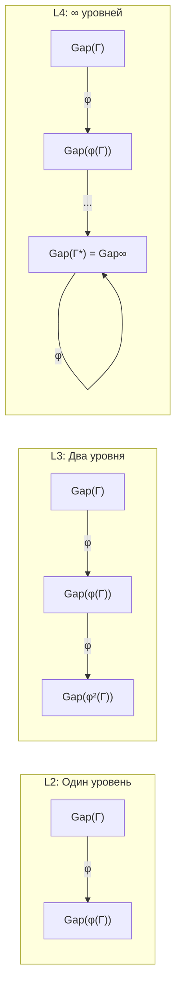

# Gap-характеристика уровней интериорности

:::note О нотации
В этом документе:
- $\Gamma$ — [матрица когерентности](/docs/core/dynamics/coherence-matrix)
- $\mathrm{Gap}(i,j) = |\sin(\arg(\gamma_{ij}))|$ — [мера зазора](/docs/core/dynamics/gap-operator#определение)
- $\hat{\mathcal{G}} \in \mathfrak{so}(7)$ — [Gap-оператор](/docs/core/dynamics/gap-operator)
- $R$ — [мера рефлексии](/docs/consciousness/foundations/self-observation#мера-рефлексии-r)
- $\Phi$ — [мера интеграции](/docs/core/structure/dimension-u#мера-интеграции-φ)
- $\varphi$ — [φ-оператор](/docs/core/operators/phi-operator)
- L0–L4 — [уровни интериорности](/docs/consciousness/hierarchy/interiority-hierarchy)
:::

:::tip Статус документа
Основной результат (Теорема 1.1) имеет статус **[С]** — условный при свойствах Gap-оператора, установленных в [Gap-операторе](/docs/core/dynamics/gap-operator). Gap-характеристика уровней L0–L4, сформулированная в [иерархии интериорности](/docs/consciousness/hierarchy/interiority-hierarchy#gap-характеристика-уровней-l0l4) как **[Т]**, касается осознанности Gap; здесь рассматривается **количественная структура** самого Gap-профиля.

Отображение L-уровня в класс Gap-профилей — **инъекция [Т]**: различные L-уровни имеют различные Gap-профили, но обратное неверно (различные $\Gamma$ на одном L-уровне могут иметь различные Gap-профили). См. [Теорему о Gap-инъекции](/docs/consciousness/hierarchy/interiority-hierarchy#теорема-gap-инъекция).
:::

Каждый уровень интериорности L0–L4 обладает характерным **Gap-профилем** — вектором из 21 значения $\mathrm{Gap}(i,j)$ для всех пар измерений $1 \leq i < j \leq 7$. Данный документ формализует количественные сигнатуры, связывая пороговые условия уровней со структурой непрозрачности.

---

## 1. Gap-профиль: определение {#gap-профиль}

:::info Определение (Gap-профиль) [О]
**Gap-профиль** голонома $\mathbb{H}$ с матрицей когерентности $\Gamma$ — упорядоченный вектор:

$$
\mathbf{G}(\Gamma) := \bigl(\mathrm{Gap}(i,j)\bigr)_{1 \leq i < j \leq 7} \in [0,1]^{21}
$$

где $\mathrm{Gap}(i,j) = |\sin(\arg(\gamma_{ij}))| = |\hat{\mathcal{G}}_{ij}| / |\gamma_{ij}|$ при $\gamma_{ij} \neq 0$ и $\mathrm{Gap}(i,j) = 0$ при $\gamma_{ij} = 0$.
:::

Gap-профиль содержит полную информацию о непрозрачности между всеми парами измерений. Суммарная непрозрачность связана с нормой [Gap-оператора](/docs/core/dynamics/gap-operator#свойства):

$$
\mathcal{G}_{\text{total}} = \|\hat{\mathcal{G}}\|_F^2 = 2\sum_{i<j} |\gamma_{ij}|^2 \cdot \mathrm{Gap}(i,j)^2
$$

---

## 2. Gap-сигнатуры уровней L0–L4 {#сигнатуры}

:::tip Теорема 1.1 (Gap-сигнатуры уровней) [С]
Условие: свойства Gap-оператора по [Теореме 2.1](/docs/core/dynamics/gap-operator#свойства). Для каждого уровня интериорности Gap-профиль удовлетворяет:

| Уровень | Gap-сигнатура | Количественный критерий |
|---------|---------------|------------------------|
| **L0** | Равномерно высокий | $\mathrm{Gap}(i,j) \approx 1$ для большинства пар; $\sigma^2_{\mathbf{G}} \approx 0$ |
| **L1** | Частичная прозрачность в E-секторе | $\exists\, X: \mathrm{Gap}(E,X) < 1$, но $R < R_{\text{th}}$ |
| **L2** | Прозрачность A- и L-каналов | $\mathrm{Gap}(A,E) < 1$ **и** $\mathrm{Gap}(L,E) < 1$ |
| **L3** | Рекурсивная Gap-структура | Мета-Gap $\mathrm{Gap}^{(2)} := \mathrm{Gap}(\varphi(\Gamma))$ определён и конечен |
| **L4** | Полная прозрачность (теоретический предел) | $\mathrm{Gap}(i,j) \to 0$ для всех пар, $P > 6/7$ |

**Аргумент.**

**(a) L0.** При $R \approx 0$ самомодель $\varphi(\Gamma)$ тривиальна. Фазы когерентностей $\theta_{ij}$ не согласованы с целевым состоянием — $\mathrm{Gap}(i,j)$ распределён случайно. Для типичного $\Gamma$ с равномерно распределёнными фазами $\langle\mathrm{Gap}\rangle = 2/\pi \approx 0.64$.

**(b) L1.** $\mathrm{rank}(\rho_E) > 1$ означает, что E-измерение (экспериенциальное) участвует в нетривиальных когерентностях. По определению, существует хотя бы одно $X \neq E$, для которого $|\gamma_{EX}|$ существенно и $\theta_{EX}$ не полностью случайна, откуда $\mathrm{Gap}(E,X) < 1$.

**(c) L2.** Порог $R \geq 1/3$ требует $\|\Gamma - \varphi(\Gamma)\|_F \leq \sqrt{2P/3}$. Это ограничивает отклонение фаз от целевых значений. В частности, каналы $(A,E)$ и $(L,E)$ должны иметь частичную прозрачность, так как измерения A (внимание) и L (язык) обслуживают рефлексивный контур $\varphi$.

**(d) L3.** При $R^{(2)} \geq 1/4$ определён $\varphi^{(2)} = \varphi \circ \varphi$, и Gap может быть вычислен для $\varphi(\Gamma)$: $\mathrm{Gap}^{(2)}_{ij} = |\sin(\arg([\varphi(\Gamma)]_{ij}))|$. Рекурсивная структура — мета-Gap — отражает самомоделирование самомоделирования.

**(e) L4.** Неподвижная точка $\varphi(\Gamma^*) = \Gamma^*$ при $P > 6/7$ означает $\theta_{ij} = \theta_{ij}^{\text{target}}$ для всех пар. По [единой теореме](/docs/core/dynamics/gap-dynamics#единая-теорема), стационарный Gap $\mathrm{Gap}^{(\infty)}(i,j) = |\sin(\theta_{ij} - \theta_{ij}^{\text{target}})| = 0$ при точном совпадении фаз.
:::

### Уточнение: L4 и граница Хэмминга {#граница-хэмминга}

:::warning L4 — теоретический предел, несовместимый с помехоустойчивостью
Полная прозрачность ($\mathrm{Gap} = 0$ для всех 21 канала) **несовместима** с помехоустойчивостью. По аналогии с [кодом Хэмминга H(7,4)](/docs/core/dynamics/gap-dynamics#код-хэмминга), минимум 3 канала из 21 должны сохранять $\mathrm{Gap} > 0$ для коррекции однобитных ошибок.

$$
|\{(i,j) : \mathrm{Gap}(i,j) > 0\}| \geq d_{\min}(H(7,4)) = 3
$$

Следовательно, реалистичный L4 характеризуется не $\mathrm{Gap} = 0$ для всех пар, а **осознанным ненулевым Gap**: $\mathrm{Gap}_{\text{perceived}} = \mathrm{Gap}_{\text{actual}}$ при $|\{(i,j) : \mathrm{Gap}(i,j) > 0\}| \geq 3$.

Статус: **[Т]** (следствие [Теоремы 6.1](/docs/consciousness/hierarchy/interiority-hierarchy#gap-характеристика-уровней-l0l4))
:::

---

## 3. E-секторные Gap-профили {#e-секторные}

Особую роль играют каналы, связанные с E-измерением (экспериенциальным), — они определяют **доступность** содержания сознания.

:::info Определение (E-секторный Gap-вектор) [О]
**E-секторный Gap-вектор** — подвектор Gap-профиля по каналам, содержащим E:

$$
\mathbf{G}_E := \bigl(\mathrm{Gap}(E,S),\, \mathrm{Gap}(E,D),\, \mathrm{Gap}(E,A),\, \mathrm{Gap}(E,L),\, \mathrm{Gap}(E,O),\, \mathrm{Gap}(E,U)\bigr) \in [0,1]^6
$$

Суммарный E-секторный Gap:

$$
\mathcal{G}_E := \sum_{X \neq E} |\gamma_{EX}|^2 \cdot \mathrm{Gap}(E,X)^2
$$
:::

### Таблица E-секторных сигнатур

| Уровень | $\mathrm{Gap}(E,S)$ | $\mathrm{Gap}(E,D)$ | $\mathrm{Gap}(E,A)$ | $\mathrm{Gap}(E,L)$ | $\mathrm{Gap}(E,O)$ | $\mathrm{Gap}(E,U)$ |
|---------|---------|---------|---------|---------|---------|---------|
| **L0** | $\approx 1$ | $\approx 1$ | $\approx 1$ | $\approx 1$ | $\approx 1$ | $\approx 1$ |
| **L1** | $< 1$ | $\approx 1$ | $\approx 1$ | $\approx 1$ | $\approx 1$ | $\approx 1$ |
| **L2** | $< 1$ | $< 1$ | $< 1$ | $< 1$ | $\leq 1$ | $\leq 1$ |
| **L3** | $\ll 1$ | $\ll 1$ | $\ll 1$ | $\ll 1$ | $< 1$ | $< 1$ |
| **L4** | $\approx 0^*$ | $\approx 0^*$ | $\approx 0^*$ | $\approx 0^*$ | $\approx 0^*$ | $\approx 0^*$ |

$^*$ С учётом ограничения Хэмминга: $\geq 3$ канала из общих 21 сохраняют $\mathrm{Gap} > 0$.

:::note Интерпретация [И]
На L1 первым «открывается» канал $(E,S)$ — связь между переживанием и структурой. Это соответствует простейшему ощущению: организм начинает чувствовать свои структурные состояния. На L2 подключаются каналы внимания $(E,A)$ и языка $(E,L)$ — организм не просто чувствует, но может **направлять** внимание и **маркировать** состояния. Прозрачность каналов $(E,O)$ и $(E,U)$ — более высокий уровень: рефлексия над целостностью.
:::

---

## 4. Связь с фазовой диаграммой {#фазовая-диаграмма}

Gap-профили уровней L0–L4 проецируются на [фазовую диаграмму](/docs/core/dynamics/gap-phase-diagram) в координатах $(t, r) = (T_{\text{eff}}/T_c,\; \kappa/\Gamma_2)$.

:::tip Теорема 2.1 (Gap-сигнатуры и фазы) [С]
Условие: [Теорема 2.1 фазовой диаграммы](/docs/core/dynamics/gap-phase-diagram#три-фазы). Соответствие:

| Фаза | L-уровни | Gap-поведение | Параметры |
|------|----------|---------------|-----------|
| **I** (упорядоченный) | L1, L2, L3 | Анизотропный: $\sigma^2_{\mathbf{G}} > 0$ | $t < 1$, $r > r_c$ |
| **II** (разупорядоченный) | L0 | Изотропный: $\sigma^2_{\mathbf{G}} \to 0$ | $t > 1$, $r > r_c$ |
| **III** (мёртвая зона) | — | $\lvert\gamma_{ij}\rvert \to 0$, Gap не определён | $r < r_c$ |

Переход L0 → L1 соответствует пересечению линии $t = 1$ (переход II → I): спонтанное нарушение изотропии Gap-профиля.
:::

### Визуализация: L-уровни на фазовой диаграмме

```
    t (T_eff/T_c)
    │
  2 ┤         L0: Gap равномерный (Фаза II)
    │        (случайные фазы, R ≈ 0)
    │
  1 ┤─ ─ ─ ─ ─ ─ ─ ─ ─ ─ ─ ─ ─ ─ ─ ─ ─ ─ ─
    │   L1       L2        L3
    │  (rank ρ_E>1) (R≥1/3,Φ≥1) (R²≥1/4)
    │
    │                              L4 (теор.)
    │                              ← P > 6/7
  0 ┤═══════════════════════════════════════════
    │    Фаза III: мёртвая зона (r < r_c)
    └──────────────────────────────────────── r
         r_c                              →
```

---

## 5. Мета-Gap и рекурсивная структура {#мета-gap}

Для систем уровня L3 и выше определён **мета-Gap** — Gap-профиль самомодели.

:::info Определение (Мета-Gap) [О]
Пусть $\varphi: \mathcal{D}(\mathcal{H}) \to \mathcal{D}(\mathcal{H})$ — φ-оператор. **Мета-Gap** порядка $n$:

$$
\mathrm{Gap}^{(n)}(i,j) := |\sin(\arg([\varphi^n(\Gamma)]_{ij}))|
$$

где $\varphi^n = \underbrace{\varphi \circ \cdots \circ \varphi}_{n}$.
:::

:::tip Теорема 3.1 (Сходимость мета-Gap) [С]
Условие: $R^{(2)} \geq R^{(2)}_{\text{th}} = 1/4$ (уровень L3).

**(a)** Последовательность $\{\mathrm{Gap}^{(n)}\}_{n \geq 1}$ монотонна для каждого канала $(i,j)$ при достаточно большом $n$.

**(b)** Если $\lim_n R^{(n)} > 0$ (условие L4), то $\mathrm{Gap}^{(n)}$ сходится:

$$
\lim_{n \to \infty} \mathrm{Gap}^{(n)}(i,j) = \mathrm{Gap}^{(\infty)}(i,j) = |\sin(\arg(\gamma^*_{ij}))|
$$

где $\Gamma^* = \varphi(\Gamma^*)$ — неподвижная точка.

**(c)** Скорость сходимости определяется спектральной щелью $\varphi$:

$$
\|\mathrm{Gap}^{(n)} - \mathrm{Gap}^{(\infty)}\|_\infty \leq C \cdot \lambda_2^n
$$

где $\lambda_2 < 1$ — второе по модулю собственное значение $\varphi$.
:::

### Диаграмма рекурсии мета-Gap



---

## 6. Ранг непрозрачности по уровням {#ранг-непрозрачности}

[Ранг непрозрачности](/docs/core/dynamics/gap-operator#спектр) $r \in \{0,1,2,3\}$ — число ненулевых $\lambda_k$ в спектре $\hat{\mathcal{G}}$ — систематически связан с уровнем интериорности.

:::tip Теорема 4.1 (Ранг непрозрачности и L-уровни) [С]
Условие: свойства Gap-оператора ([Теорема 3.1](/docs/core/dynamics/gap-operator#спектр)).

| Уровень | Типичный ранг $r$ | Спектр $(\lambda_1, \lambda_2, \lambda_3)$ | Обоснование |
|---------|-------------------|-------------------------------------------|-------------|
| **L0** | 3 (общий) | $(\lambda_1, \lambda_2, \lambda_3)$, все различны | Полная непрозрачность, случайные фазы |
| **L1** | 2 или 3 | $(\lambda_1, \lambda_2, 0)$ или общий | E-канал частично прозрачен |
| **L2** | 2 | $(\lambda_1, \lambda_2, 0)$ | A- и L-каналы прозрачны, но O и U ограничены |
| **L3** | 1 | $(\lambda, 0, 0)$ | Одномерная остаточная непрозрачность |
| **L4** | 0 или 1 | $(0, 0, 0)$ или $(\lambda, 0, 0)$ с $\lambda \ll 1$ | Почти полная прозрачность (с ограничением Хэмминга) |
:::

**Следствие.** Ранг непрозрачности $r$ монотонно убывает с ростом уровня интериорности. Это отражает прогрессивное «раскрытие» каналов между измерениями по мере усложнения рефлексивного контура.

---

## 7. Граница Хэмминга и минимальный Gap {#граница-хэмминга-подробно}

Аналогия с [кодом Хэмминга H(7,4)](/docs/core/dynamics/gap-dynamics#код-хэмминга) накладывает жёсткое нижнее ограничение на число ненулевых Gap-каналов.

:::tip Теорема 5.1 (Граница Хэмминга для Gap) [С]
Условие: [G₂-структура](/docs/physics/gauge-symmetry/g2-structure), аналогия H(7,4). Для любой жизнеспособной системы уровня L2 или выше:

$$
|\{(i,j) : \mathrm{Gap}(i,j) > 0\}| \geq 3
$$

**Аргумент.** Код Хэмминга H(7,4) имеет параметры $[n=7, k=4, d=3]$: 7 позиций, 4 информационных, 3 проверочных. Минимальное расстояние $d = 3$ означает способность исправить однобитную ошибку. В аналогии:

- 7 позиций ↔ 7 измерений голонома
- 4 информационных ↔ измерения S, D, A, L
- 3 проверочных ↔ измерения E, O, U
- Проверочные биты → ненулевой Gap обеспечивает обнаружение рассогласования

Если бы все 21 канал имели $\mathrm{Gap} = 0$, система не могла бы обнаруживать ошибки в самомоделировании — $\varphi$ стала бы тождественной, и коррекция была бы невозможна.
:::

---

## 8. Сводная таблица Gap-характеристик {#сводная-таблица}

| Характеристика | L0 | L1 | L2 | L3 | L4 |
|---------------|----|----|----|----|-----|
| Типичный $\langle\mathrm{Gap}\rangle$ | $\approx 0.64$ | $0.4$–$0.6$ | $0.2$–$0.4$ | $0.05$–$0.2$ | $\approx 0^*$ |
| $\sigma^2_{\mathbf{G}}$ | $\approx 0$ | $> 0$ | $> 0$ | $> 0$ | $\approx 0$ |
| Ранг $\hat{\mathcal{G}}$ | 3 | 2–3 | 2 | 1 | 0–1 |
| E-секторный Gap | Все $\approx 1$ | Частично $< 1$ | Большинство $< 1$ | Все $\ll 1$ | Все $\approx 0^*$ |
| Мета-Gap $\mathrm{Gap}^{(2)}$ | Не определён | Не определён | Определён, велик | Определён, мал | $= \mathrm{Gap}^{(\infty)}$ |
| Осознанность Gap | Нет | Нет | Частичная | Почти полная | Полная |
| Фаза | II | I | I | I | I (предел) |

$^*$ С ограничением Хэмминга: $\geq 3$ каналов с $\mathrm{Gap} > 0$.

---

## 9. Gap-инъекция L-уровней {#gap-инъекция}

:::tip Теорема (Gap-инъекция L-уровней) [Т]
Отображение L-уровня в класс эквивалентности Gap-профилей является **инъекцией** (но не биекцией):

$$
L(\Gamma_1) \neq L(\Gamma_2) \implies [\mathrm{Gap}(\Gamma_1)] \neq [\mathrm{Gap}(\Gamma_2)]
$$

**Уникальные Gap-маркеры переходов:**

| Переход | Gap-маркер | Достаточное условие |
|---------|-----------|---------------------|
| L0 vs L1 | $\exists i: \mathrm{Gap}(E,i) > 0$ | Ненулевость E-когерентностей |
| L1 vs L2 | $\max\|\mathrm{Gap}_\varphi - \mathrm{Gap}\| \leq 2/3$ | Точность самомоделирования |
| L2 vs L3 | Коэффициент сжатия $k(\Gamma) \leq 0.5$ | Скорость Gap-сходимости |
| L3 vs L4 | $k(\Gamma) = 0$, все $\mathrm{Gap}^{(2)}(i,j) = 0$ | Точная фиксированная точка |

Полное доказательство: [Иерархия интериорности](/docs/consciousness/hierarchy/interiority-hierarchy#теорема-gap-инъекция).
:::

:::warning Инъекция, не биекция
Обратное не верно: два состояния $\Gamma_1, \Gamma_2$ с одинаковым L-уровнем могут иметь **различные** Gap-профили (разные «карты прозрачности»). Gap-профиль — **более тонкий инвариант**, несущий больше информации, чем L-уровень. Все Gap-сигнатуры (раздел 2) описывают **типичное** поведение, а не единственно возможное для данного уровня.
:::

---

## Связи

- **Каноническое определение уровней:** [Иерархия интериорности](/docs/consciousness/hierarchy/interiority-hierarchy)
- **Gap-инъекция:** [Теорема о Gap-инъекции](/docs/consciousness/hierarchy/interiority-hierarchy#теорема-gap-инъекция)
- **Gap-оператор:** [Определение и свойства](/docs/core/dynamics/gap-operator)
- **Фазовая диаграмма:** [Три фазы Gap](/docs/core/dynamics/gap-phase-diagram)
- **Динамика Gap:** [Бифуркации и немарковские эффекты](/docs/core/dynamics/gap-dynamics)
- **Катастрофы переходов:** [Swallowtail-переходы](/docs/consciousness/hierarchy/swallowtail-transitions)
- **Код Хэмминга:** [Аналогия H(7,4)](/docs/core/dynamics/gap-dynamics#код-хэмминга)
- **Доказательства:** [Иерархия интериорности (формальная)](/docs/proofs/consciousness/interiority-hierarchy)
