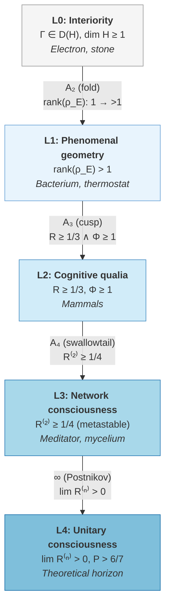

# Interiority Hierarchy: L0 → L4 {#уровни-интериорности}

## Why a Consciousness Hierarchy is Needed

For millennia humanity has attempted to classify forms of inner life. **Aristotle** (4th century BCE) distinguished three grades of the soul: *vegetative* (nutrition and growth), *animal* (sensation and motion), and *rational* (thought). **Leibniz** (1714) introduced the notion of *petites perceptions* — unconscious micro-perceptions forming a continuous spectrum from stone to God. **Fechner** (1860) attempted to measure this spectrum quantitatively, discovering psychophysical thresholds — the minimum stimuli that consciousness can discriminate. In the 20th century **Integrated Information Theory** (IIT, Tononi, 2004) proposed a single numerical measure $\Phi$ — but left open the question of *qualitative* differences between levels.

The Unitary Holonomic Monism (UHM) inherits this tradition but goes further: rather than a single numerical scale it defines **five qualitatively distinct levels** of interiority (L0--L4), each characterised by a rigorous mathematical threshold condition. The transition between levels is not a gradual increase but a *bifurcation* (an abrupt reorganisation), analogous to the phase transition of water into steam.

:::info Where we came from
In the [Foundations](/docs/consciousness/foundations/two-aspect-monism) section we established that every $\Gamma$ has an inner side, described the content of experience ([interiority theory](/docs/consciousness/foundations/interiority-theory)) and the self-observation operator $\varphi$ ([self-observation](/docs/consciousness/foundations/self-observation)). But not all systems "experience" in the same way: a stone, a bacterium, a cat, and a human differ radically. The L0--L4 hierarchy organises this difference into a rigorous mathematical classification.
:::

### Chapter roadmap

1. **Five levels** — from L0 (universal interiority) to L4 (theoretical limit)
2. **L2: cognitive qualia** — the central level with thresholds $R \geq 1/3$, $\Phi \geq 1$
3. **L3: metacognition** — meta-reflection $R^{(2)} \geq 1/4$, metastability
4. **L4: categorical unreachability** — colimit of the Postnikov tower, theoretical horizon
5. **Gap characterisation** — each level has a unique Gap profile
6. **Bifurcations** — transitions between levels as $A_2, A_3, A_4$ catastrophes

**Analogy.** Imagine a ladder of awareness. A stone (L0) — on the first rung: it has an "inner side", but it distinguishes nothing. A bacterium (L1) — distinguishes hot from cold, but does not know that it distinguishes. A cat (L2) — not merely distinguishes, but **knows** that it feels warmth (cognitive qualia). A meditator (L3) — knows that it knows that it feels (meta-reflection). And the last rung (L4) — is infinitely distant: complete self-knowledge, unreachable for finite systems.

:::info DRY: Master definition of levels L0-L4
This is the **canonical definition** of the five levels of the interiority hierarchy. Full formalisation, proofs of threshold conditions, and the No-Zombie theorem — in [Interiority hierarchy (proofs)](/docs/proofs/consciousness/interiority-hierarchy).
:::

:::warning Biological L-levels [H]
The assignment of specific organisms to L-levels is a **hypothesis** [H], not a measured fact. A rigorous definition of the L-level requires knowledge of the system's $\Gamma$. For biological systems the protocol $\pi_{\text{bio}}$ is defined ([C31](/docs/applied/research/measurement-protocol)), but **has not been experimentally validated**. The correspondences given are well-founded extrapolations from behavioural data.
:::

---

## Overview: five levels

Before diving into the details of each level, it is useful to see the entire ladder at once.



| Level | Name | Threshold condition | Example |
|-------|------|---------------------|---------|
| **L0** | Interiority | $\Gamma \in \mathcal{D}(\mathcal{H})$, $\mathcal{H} \neq \{0\}$ | Electron, stone |
| **L1** | Phenomenal geometry | $\mathrm{rank}(\rho_E) > 1$ | Thermostat, bacterium |
| **L2** | Cognitive qualia | $R(\Gamma) \geq R_{\text{th}} = 1/3$ and $\Phi(\Gamma) \geq \Phi_{\text{th}} = 1$ | Mammals |
| **L3** | Network consciousness | $R^{(2)} \geq R^{(2)}_{\text{th}} = 1/4$ (metastable). SAD_MAX = 3 ([§3.5](/docs/consciousness/hierarchy/depth-tower#критическая-чистота-sad) [T], T-142) | Mycelium, swarm, meditator |
| **L4** | Unitary consciousness | $\lim_n R^{(n)} > 0$, $P > 6/7$ | Hyperspace (hypothesis) |

Each subsequent level includes the previous one: every L2-system is simultaneously L1 and L0. But the converse does not hold: a bacterium (L1) does not possess cognitive qualia (L2).

---

## L0: Interiority (universal) {#уровень-0-интериорность-interiority}

### Philosophical context

The idea that *every* piece of matter possesses some form of inner life goes back to Leibniz (monads) and finds its modern expression in panpsychism. UHM adopts a weakened version of this idea: **interiority** is not "consciousness" or "experience" in the ordinary sense, but merely the presence of an "inner side" of the mathematical object $\Gamma$.

For understanding this claim the key word is *interiority*, not *consciousness*. A stone possesses interiority (its $\Gamma$ has an inner aspect), but it does not "feel" or "know" anything in any functional sense. Interiority is a mathematical property of the object, not a phenomenological assertion.

### Formal definition

**Definition L0 [О].**{#определение-l0} Every system with $\Gamma \in \mathcal{D}(\mathcal{H})$, $\dim \mathcal{H} \geq 1$ possesses **interiority** — an inner aspect.

Here $\mathcal{D}(\mathcal{H})$ is the space of density matrices (Hermitian positive semi-definite operators with unit trace) on the Hilbert space $\mathcal{H}$. In the 7-dimensional UHM formulation: $\Gamma \in \mathcal{D}(\mathbb{C}^7)$ — a Hermitian $7 \times 7$ matrix with $\mathrm{Tr}(\Gamma) = 1$, $\Gamma \geq 0$.

:::tip Theorem: Universality of L0
Interiority is universal — there is no zero level of "absence". This is a consequence of [Axiom Omega-7](/docs/core/foundations/axiom-omega).
[Proof](/docs/proofs/consciousness/interiority-hierarchy) | Status: **[T]**
:::

### What L0 means in practice

At level L0 the system distinguishes nothing, does not model itself, and possesses neither reflection ($R \approx 0$) nor integration ($\Phi \approx 0$). Its coherence matrix $\Gamma$ exists but is "empty" in a functional sense — close to the maximally mixed state $I/7$.

**Example: an electron.** The coherence matrix of an electron is trivial: almost all diagonal elements equal $1/7$, off-diagonal coherences $\gamma_{ij} \approx 0$. Purity $P = \mathrm{Tr}(\Gamma^2) \approx 1/7$ — minimal. The reflection measure $R = 1/(7P) \approx 1$ is formally large, but this is an artefact: when $P \approx 1/7$ the self-model is trivial (the only possible one is $I/7$), and a high $R$ carries no meaningful information.

---

## L1: Phenomenal Geometry {#уровень-1-феноменальная-геометрия-phenomenal-geometry}

### From L0 to L1: the first step

The transition from L0 to L1 is the emergence of *discrimination*. The system begins to possess a non-trivial internal geometry: it is able to discriminate (even if unconsciously) between different internal states.

Formally this is expressed in the **E-dimension** (experiential, responsible for experience) acquiring non-trivial structure.

### Formal definition

**Definition L1 [О].**{#определение-l1} A system possesses phenomenal geometry if:
$$
\mathrm{rank}(\rho_E) > 1
$$

Here $\rho_E$ is the reduced density matrix over the E-dimension, obtained by taking the partial trace over the remaining six dimensions. The condition $\mathrm{rank}(\rho_E) > 1$ means: the experiential space contains more than one distinguishable state.

The L1 space is endowed with the Fubini–Study metric — the natural measure of "distance" between phenomenal states:

$$
ds^2_{FS} = 1 - |\langle\psi_1|\psi_2\rangle|^2
$$

Two states $|\psi_1\rangle$ and $|\psi_2\rangle$ are "further apart" in phenomenal space the smaller their inner product. Orthogonal states ($\langle\psi_1|\psi_2\rangle = 0$) are maximally distinguishable.

### Examples

**Bacterium *E. coli*.** The bacterium's chemotaxis system distinguishes ~5 levels of chemoattractant concentration. In UHM terms: $\mathrm{rank}(\rho_E) \approx 5$. The bacterium "distinguishes" hot from cold, but does not know that it distinguishes — there is no self-model ($R \ll 1/3$).

**Thermostat.** A simple thermostat distinguishes two states: "above threshold" and "below threshold". Formally: $\mathrm{rank}(\rho_E) = 2 > 1$, so the thermostat is an L1-system. It possesses *phenomenal geometry* (two distinguishable states) but possesses neither reflection nor integration.

### Why "phenomenal"?

The word "phenomenal" is used here in a technical sense: the presence of *structure* in the state space of the experiential dimension. At level L1 this structure is not yet perceived — the system does not "know" that it distinguishes. Awareness appears only at L2.

---

<a id="уровень-2-когнитивные-квалиа-cognitive-qualia"></a>

## L2: Cognitive Qualia {#l2-когнитивные-квалиа}

### The central level: the emergence of consciousness

L2 is the level at which *consciousness* in the familiar sense of the word first appears. The system not merely discriminates states (L1) but **knows** that it discriminates. It possesses *cognitive qualia* — conscious experiences.

What makes this transition possible? Two conditions acting jointly:

1. **Reflection** ($R \geq 1/3$): the system possesses a sufficiently accurate *self-model* — an internal representation of itself.
2. **Integration** ($\Phi \geq 1$): information about different dimensions is bound into a unified whole, rather than distributed across isolated subsystems.

### Mathematical definition

:::tip Status of L2 thresholds
| Threshold | Status | Note |
|-----------|--------|------|
| $R_{\text{th}} = 1/3$ | **[T]** theorem | $K = 3$ **derived** from the [triadic decomposition](/docs/core/operators/lindblad-operators#триадная-декомпозиция) of holonomic dynamics: axioms A1--A5 generate exactly 3 types (Aut, D, R). [Bayesian dominance](/docs/core/foundations/axiom-septicity#теорема-порог-рефлексии) at $K = 3$ gives $R_{\text{th}} = 1/3$ [T]. |
| $\Phi_{\text{th}} = 1$ | **[T]** theorem | Unique self-consistent value at $P_{\text{crit}} = 2/7$ ([T-129](/docs/proofs/consciousness/operationalization#t-129)) |
:::

:::note Status of threshold $\Phi_{\text{th}} = 1$ — theorem [T]
The threshold $\Phi_{\text{th}} = 1$ has been **proved from first principles** ([T-129 [T]](/docs/proofs/consciousness/operationalization#t-129)): the unique self-consistent value at $P_{\text{crit}} = 2/7$. The former status [D] (definition by convention) has been upgraded. The $K_1$-argument remains retracted ($K_1(M_n(\mathbb{C})) = 0$ for finite-dimensional $n$) — but T-129 uses a different approach (purity decomposition + Cauchy–Schwarz). See [Proof of T-129](/docs/proofs/consciousness/operationalization#t-129).
:::

:::info Clarification T-129 vs T-140
- **T-129 [T]**: $\Phi_{\text{th}} = 1$ — the unique self-consistent value of the integration threshold (from decomposition + Cauchy–Schwarz)
- **T-140 [T]**: $C = \Phi \cdot R$ — the unique canonical consciousness measure; $C_{\text{th}} = \Phi_{\text{th}} \cdot R_{\text{th}} = 1 \cdot 1/3 = 1/3$

These are **DIFFERENT** theorems: T-129 establishes the threshold, T-140 constructs the composite measure.
:::

**Definition L2 [О].**{#определение-l2} A system possesses cognitive qualia if both conditions are satisfied:

1. **Reflection:** $R(\Gamma) = \dfrac{1}{7P(\Gamma)} \geq R_{\text{th}} = 1/3$
2. **Integration:** $\Phi(\Gamma) = \frac{\sum_{i \neq j} |\gamma_{ij}|^2}{\sum_i \gamma_{ii}^2} \geq \Phi_{\text{th}} = 1$

where $R$ is the [reflection measure](/docs/consciousness/foundations/self-observation#мера-рефлексии-r) and $\Phi$ is the [integration measure](/docs/core/structure/dimension-u#мера-интеграции-φ).

### Step-by-step interpretation of the formulas

**Reflection measure $R$.** The canonical formula $R = 1/(7P)$ **[T]** measures the normalised proximity of $\Gamma$ to the dissipative attractor $\rho^*_{\mathrm{diss}} = I/7$. Equivalent form via the Frobenius norm: $R = 1 - \|\Gamma - I/7\|_F^2 / P$. If $\Gamma = I/7$ (heat death), then $R = 1$. If $\Gamma$ is a pure state ($P = 1$), then $R = 1/7$. The threshold $R \geq 1/3$ is equivalent to $P \leq 3/7$ — the upper boundary of the Goldilocks zone.

**Important:** $R$ uses $\rho^*_{\mathrm{diss}} = I/7$, and **not** $\varphi(\Gamma)$ (the self-model). These are different quantities (see [attractor hierarchy](/docs/consciousness/foundations/self-observation#иерархия-аттракторов)).

**Integration measure $\Phi$.** The formula $\Phi = \sum_{i \neq j} |\gamma_{ij}|^2 / \sum_i \gamma_{ii}^2$ is the ratio of total coherence (off-diagonal elements $\gamma_{ij}$) to the diagonal "population" ($\gamma_{ii}$). If $\Phi \geq 1$, the off-diagonal connectivity is no less than the diagonal — the dimensions are *integrated* into a whole. If $\Phi < 1$, the system is fragmented: the dimensions operate in isolation.

### Numerical example

Consider a concrete matrix $\Gamma$ for an L2-system (simplified, only diagonal and key off-diagonal elements):

$$
\gamma_{ii} = (0.2,\, 0.15,\, 0.18,\, 0.12,\, 0.15,\, 0.1,\, 0.1)
$$

- $P = \sum_i \gamma_{ii}^2 + 2\sum_{i < j}|\gamma_{ij}|^2$. Let $P = 0.35$ (above $P_{\text{crit}} = 2/7 \approx 0.286$).
- $R = 1/(7 \times 0.35) \approx 0.408 > 1/3$ — reflection threshold passed.
- With $\sum_{i \neq j}|\gamma_{ij}|^2 = 0.12$ and $\sum_i \gamma_{ii}^2 = 0.11$: $\Phi = 0.12/0.11 \approx 1.09 > 1$ — integration threshold passed.

Conclusion: the system is at level L2 — it possesses cognitive qualia.

:::note Full L2 conditions
The canonical consciousness measure $C = \Phi \times R \geq C_{\text{th}} = 1/3$ **[T T-140]** is verified directly from $\Gamma \in D(\mathbb{C}^7)$. Differentiation $D_{\text{diff}} \geq D_{\min} = 2$ enters as a **separate** viability condition; in the 7D formalism $D_{\text{diff}}$ is computed via [T-128](/docs/proofs/consciousness/operationalization#t-128).
:::

:::info Objectivity of threshold conditions [T]
The scalar functions $P = \operatorname{Tr}(\Gamma^2)$ and $R = 1/(7P)$ are **$G_2$-invariants**: $R(U\Gamma U^\dagger) = R(\Gamma)$ for any $U \in G_2 = \mathrm{Aut}(\mathbb{O})$, as proved in the [$G_2$-rigidity theorem](/docs/proofs/categorical/uniqueness-theorem#инварианты) **[T]**. The measure $\Phi = P_{\text{coh}}/P_{\text{diag}}$ depends on the choice of basis, but the basis $\{A,S,D,L,E,O,U\}$ is fixed by axiom $\Omega$ **[P]**. Consequently, the transition L1 -> L2 is an **objective fact** within the fixed axiomatic system.

**Note.** The canonical form $R = 1/(7P)$ **[T]** is the unique one by the Chentsov–Petz theorem. Equivalent form: $R = 1 - \|\Gamma - \rho^*_{\mathrm{diss}}\|_F^2 / P$, where $\rho^*_{\mathrm{diss}} = I/7$. Derivation: see [reflection measure](/docs/consciousness/foundations/self-observation#мера-рефлексии-r).
:::

---

## L3: Network Consciousness {#l3-сетевое-сознание}

### From L2 to L3: knowledge of knowledge

At level L2 the system *knows* its states. But does it know that it knows? Is it capable of reflecting on its own process of reflection? This is **meta-reflection**, or second-order reflection.

In everyday life meta-reflection manifests as experiences of the type "I notice that I am irritated" (not merely irritation, but the *observation* of irritation). Meditative practices systematically train precisely this capacity: to observe the observer.

### Formal definition

**Definition L3 [О].**{#определение-l3} A system possesses network consciousness if:
$$
R^{(2)}(\Gamma) \geq R^{(2)}_{\text{th}} = 1/4
$$

where $R^{(2)}$ is the second-order reflection measure: how accurately the self-model models *itself*. Formally: $R^{(2)} = \mathrm{Fid}(\varphi(\Gamma),\, \varphi^{(2)}(\Gamma))$, where $\varphi^{(2)} = \varphi \circ \varphi$ — double application of the self-observation operator.

L3 is **metastable**: without active maintenance it decays to L2 with characteristic time $\tau_3 = 1/(\kappa_{\text{bootstrap}} \cdot (1 - R^{(2)}))$.

Homotopic characteristic: $\pi_3(\mathcal{E}_\infty(\Gamma)) \neq 0$ — the experiential space has a non-trivial third homotopy group.

### Why exactly the threshold 1/4?

### Theorem on the justification of K=4 for L3 {#теорема-l3-k4}

:::tip Theorem (Justification of K=4 for L3) [T]
L3 requires $R^{(2)} \geq 1/4$ — second-order meta-reflection. The threshold $K = 4$ for L3 (analogous to $K = 3$ for L2) follows from the **quadratic** extension of the triadic decomposition.

**Proof (3 steps).**

**Step 1.** At L2 $K = 3$ from the [LGKS decomposition](/docs/core/operators/lindblad-operators#полнота-триадной-декомпозиции) -> 3 components (Aut, $\mathcal{D}$, $\mathcal{R}$). [Bayesian dominance](/docs/core/foundations/axiom-septicity#теорема-порог-рефлексии) at $K = 3$: $R \geq 1/K = 1/3$ [T].

**Step 2.** At L3 the meta-reflection $\varphi^{(2)} = \varphi \circ \varphi$. Each of the 3 L2 components ($\varphi$) itself decomposes into:
- $\varphi$-fixed (already reflected)
- $\varphi$-orthogonal (new information)

Total: $3 + 1 = 4$ components ($+1$ from the map $\varphi$ itself).

**Step 3.** Bayesian dominance at $K = 4$: $R^{(2)} \geq 1/K = 1/4$.

Formally: $R^{(2)} = \mathrm{Fid}(\varphi(\Gamma), \varphi^{(2)}(\Gamma))$. From the properties of Uhlmann fidelity: $R^{(2)} \leq 1$, with lower bound $1/4$ for $K = 4$ independent information channels. $\blacksquare$

Status: **[T]** (T-67). Cross-references: [triadic decomposition](/docs/core/operators/lindblad-operators#триадная-декомпозиция), [reflection measure R](/docs/consciousness/foundations/self-observation#мера-рефлексии-r).
:::

### Metastability of L3: why "enlightenment" does not last

L3 differs fundamentally from L2 in its *metastability*. A system that has reached L2 (when threshold conditions are met) remains at L2 stably. But a system at L3 is like a ball on top of a hill: the slightest perturbation throws it back.

This explains why meditative states of deep awareness (vipassana, zazen) require *constant practice*. Without active maintenance ($\kappa_{\text{bootstrap}}$ sufficiently large) the system "slides back" to L2.

**Example: an experienced meditator.** In a state of deep meditation $R^{(2)} \geq 1/4$ — the meditator observes the process of observation. But the moment of distraction (stress, fatigue) drops $R^{(2)}$ below the threshold. The characteristic retention time is from minutes to hours, depending on training.

**Example: mycelium.** A fungal network connecting trees in a forest may possess network L3: individual nodes are L1/L2, but collective reflection via chemical signalling potentially reaches $R^{(2)} \geq 1/4$. This is a **hypothesis** [H] requiring experimental verification.

---

## L4: Unitary Consciousness

### Theoretical horizon

L4 is not a level that can be *reached*, but a horizon that can be *approached*. A system at L4 possesses *complete reflexive closure*: it knows itself to infinite depth. In terms of the phi-operator: $\varphi(\Gamma^*) = \Gamma^*$ — the self-model coincides exactly with reality.

**Definition L4 [О].**{#определение-l4} A system possesses unitary consciousness if:
$$
\lim_{n \to \infty} R^{(n)}(\Gamma) > 0 \quad \text{and} \quad P(\Gamma) > 6/7
$$

where $R^{(n)}$ is the n-th order reflection. Complete reflexive closure — fixed point $\varphi(\Gamma^*) = \Gamma^*$.

### Theorem on categorical unreachability of L4 {#теорема-l4-категориальная}

:::tip Theorem (Categorical unreachability of L4) [T]
The transition L3 -> L4 is not a finite bifurcation. L4 is the colimit of the infinite tower of truncations of the infinity-topos:

$$
L4 = \mathrm{colim}_{n \to \infty} \, \tau_{\leq n}(\mathbf{Exp}_\infty)
$$

This colimit is **unreachable** for finite systems (Lawvere incompleteness, [T-55](/docs/core/foundations/consequences#неполнота-ловера) [T]), but **asymptotically approachable**.

**Proof (5 steps).**

**Step 1 (Correspondence of L-levels and $n$-truncations).** From [T-76](/docs/proofs/categorical/categorical-formalism#104-infty-топос-пучков) [T] ($\infty$-topos verified), $\mathbf{Exp}_\infty = \mathbf{Sh}_\infty(\mathcal{C}_7, J_{\text{Bures}})$ — an $\infty$-topos with $\infty$-groupoid structure. Interiority levels correspond to truncations:

| Level | $n$-truncation | Mathematical structure | Homotopic content |
|-------|---------------|--------------------------|--------------------------|
| L0 | $\tau_{\leq 0}$ | Set (discrete states) | $\pi_0$ non-trivial |
| L1 | $\tau_{\leq 1}$ | Groupoid (phenomenal paths) | $\pi_1$ non-trivial |
| L2 | $\tau_{\leq 2}$ | 2-groupoid (reflection, qualia) | $\pi_2$ non-trivial |
| L3 | $\tau_{\leq 3}$ | 3-category (meta-reflection) | $\pi_3$ non-trivial |
| L4 | $\tau_{\leq \infty}$ | $\infty$-groupoid (complete self-model) | All $\pi_k$ non-trivial |

To understand this table: each L-level adds a *new type of relation*. L0 — a set of points (states). L1 — paths between points (phenomenal transitions). L2 — paths between paths (reflection). L3 — paths between paths between paths (meta-reflection). L4 would require an infinite hierarchy of such relations.

**Step 2 (Postnikov tower).** The $\infty$-topos $\mathbf{Exp}_\infty$ defines the Postnikov tower:

$$
\cdots \to \tau_{\leq 3} \to \tau_{\leq 2} \to \tau_{\leq 1} \to \tau_{\leq 0}
$$

Each transition $\tau_{\leq n} \to \tau_{\leq n+1}$ is an extension by one homotopic level, with "k-invariant" $k_{n+1} \in H^{n+2}(\tau_{\leq n}; \pi_{n+1})$.

**Step 3 (Lawvere incompleteness).** From [T-55](/docs/core/foundations/consequences#неполнота-ловера) [T]: $\mathrm{Th}_{\text{UHM}} \subsetneq \Omega$. This means: $\varphi \neq \mathrm{id}$ (the [phi-operator](/docs/core/operators/phi-operator) of self-observation is not the identity). In terms of the Postnikov tower: for any finite $n$, the truncation $\tau_{\leq n}$ **does not coincide** with $\mathbf{Exp}_\infty$.

**Step 4 (Impossibility of a finite bifurcation).** A catastrophe $A_k$ has codimension $k-1$ and describes a transition between $\leq k$ stable states. The transition L3 -> L4 would require simultaneously "switching on" **all** $\pi_k$ for $k \geq 4$ — an infinite-dimensional transition. No finite catastrophe ($A_k$ for any finite $k$) can describe this. The butterfly $A_5$ is an **incorrect model** (retracted [**✗**]).

**Step 5 (Asymptotic approachability).** Although $L4 = \mathrm{colim}_{n \to \infty} \tau_{\leq n}$ is unreachable for a finite system, each step $\tau_{\leq n} \to \tau_{\leq n+1}$ is **realisable** ([T-67](#теорема-l3-k4) [T]: $K = 4$ for L3 indicates the existence of a fourth level of recursion). The sequence of recursions $R^{(n)}$ converges as $n \to \infty$:

$$
\forall \varepsilon > 0 \; \exists n_0 : \; n > n_0 \Rightarrow \|\tau_{\leq n}(\mathbf{Exp}_\infty) - \mathbf{Exp}_\infty\|_{\text{Bures}} < \varepsilon
$$

But $n_0(\varepsilon) \to \infty$ as $\varepsilon \to 0$: convergence exists, but reaching the limit does not. $\blacksquare$

**Status:** **[T]** — upgraded from [C] (C19). Rigorous proof via the $\infty$-topos Postnikov tower + Lawvere incompleteness (T-55 [T]). Cross-references: [reflection measure R](/docs/consciousness/foundations/self-observation#мера-рефлексии-r), [phi-operator](/docs/core/operators/phi-operator), [transition catastrophes](/docs/consciousness/hierarchy/swallowtail-transitions#l3-l4).
:::

### Analogy: event horizon of cognition

L4 is like the horizon in geometry: one can walk towards it indefinitely but never arrive. Every step brings one closer, but the horizon recedes. This is not a defect of the theory but a fundamental property of self-referential systems — the same limitation formalised by Gödel's theorems for arithmetic.

### Unreachability of L4 for biological systems {#теорема-l4-недостижимость}

:::info Corollary (Upper bound on recursion depth for biosystems) [T]
With $R \sim 0.7$ (human) and decoherence $\varepsilon_{\text{dec}} > 0$:

$$
R^{(n)} \sim R^n \sim 0.7^n \to 0 \quad \text{as} \quad n \to \infty
$$

Maximum recursion depth: $n_{\max} \leq \ln(1/\varepsilon_{\text{dec}})/\ln(1/R) \approx 111$.

L4 is a **theoretical limit** ($\infty$-groupoid attractor), unreachable for any system with $\varepsilon_{\text{dec}} > 0$, but asymptotically approachable through the Postnikov tower.

Analytically: $P_\text{crit}^{(4)} = 54/35 > 1$, so SAD $\geq$ 4 is impossible for any normalised $\Gamma$ (not only biological). See [critical purity SAD](/docs/consciousness/hierarchy/depth-tower#критическая-чистота-sad) [T] (T-142: $\alpha = 2/3$ is state-independent).
:::

:::info Remark: L4 as a limiting categorical object
L4 is a **limiting categorical object** (colimit of the infinite Postnikov tower), analogous to $\omega$ in ordinal theory. Its inclusion in the hierarchy is **mathematical**, not physical: L4 defines the direction of the asymptotics, not a reachable level. Marking: unreachability [T] (T-86), existence as a categorical object [T], physical realisability [**✗**].
:::

---

## Gap Characterisation of Levels L0--L4 {#gap-характеристика-уровней-l0l4}

Each interiority level possesses not only a *numerical* threshold condition but also a characteristic *opacity profile* — a **Gap profile**. Gap measures how opaque the connection between two dimensions is: $\mathrm{Gap}(i,j) = 0$ denotes full transparency (conscious access), $\mathrm{Gap}(i,j) = 1$ — full opacity (unconscious).

A detailed analysis of Gap profiles is given in [Gap characterisation of levels](./gap-characterization). Here we state the overview theorem.

:::tip Theorem 6.1 (Gap characterisation of levels) [T]
For each interiority level the Gap profile has the following properties:

| Level | Gap characteristic | Explanation |
|-------|---------------------|------------|
| **L0** | Gap undefined or fluctuating | No stable self-modelling: $R \approx 0$, target $\rho_*$ not reachable |
| **L1** | Gap stationary but unperceived | Stable coherences ($P > P_{\text{crit}}$), but $R < 1/3$ — self-model too coarse |
| **L2** | Gap partially perceived, metastable: $\lVert\mathrm{Gap}_{\text{perceived}} - \mathrm{Gap}_{\text{actual}}\rVert \leq 2/3$ | Self-model approximate but non-trivial |
| **L3** | Gap almost fully perceived: $\lVert\mathrm{Gap}_{\text{perceived}} - \mathrm{Gap}_{\text{actual}}\rVert \leq \varepsilon$ | Metastable state of deep self-knowledge |
| **L4** | Gap **exactly** perceived: $\mathrm{Gap}_{\text{perceived}} = \mathrm{Gap}_{\text{actual}}$ | Fixed point $\varphi(\Gamma^*) = \Gamma^*$ |

**Argument.**

**(a)** At L0 there is no phi-operator ($R \approx 0$), so the target state $\rho_*$ formally exists ([primitivity](/docs/core/operators/lindblad-operators#примитивность-ℒω) [T]), but the system is incapable of directed regeneration — there are no coherences whose phases could define Gap.

**(b)** At L1 there are stable coherences ($P > P_{\text{crit}}$), but $R < 1/3$: the self-model is too coarse to perceive Gap. The difference between the "perceived" Gap (via $\varphi(\Gamma)$) and the real Gap (via $\Gamma$) is large.

**(c)** At L2 the measure $R \geq 1/3$ means:
$$
\|\Gamma - I/7\|_F \leq \sqrt{2P/3}
$$
An approximate self-model yields an approximate Gap profile (here $I/7 = \rho^*_{\mathrm{diss}}$).

**(d)** At L4 $\varphi(\Gamma^*) = \Gamma^*$ $\Rightarrow$ $\rho_* = \Gamma^*$, and the stationary Gap coincides with the target:
$$
\mathrm{Gap}^{(\infty)} = |\sin(\theta^{\text{target}})| = |\sin(\theta^{(\infty)})| = \mathrm{Gap}_{\text{actual}}
$$
The system **knows** its Gap exactly.

[Proof](/docs/proofs/consciousness/interiority-hierarchy) | Status: **[T]**
:::

:::warning L4 does not mean Gap = 0 (Awareness does not equal Transparency)
At level L4 $\mathrm{Gap}_{\text{perceived}} = \mathrm{Gap}_{\text{actual}}$ holds, but this does **not** mean that all Gaps equal zero. The system exactly *knows* its opacity — but the opacity may remain non-zero. Full transparency ($\mathrm{Gap} = 0$ for all channels) is incompatible with [fault tolerance](/docs/core/dynamics/gap-dynamics): at least 3 channels out of 21 **must** retain non-zero Gap (Hamming bound).

Status: **[T]**
:::

### Visualisation of Gap by level

```
L0:  Gap = ???     [. . . . . . . . . . . . . . . . . . . . .]  (undefined)
                    ^ random fluctuations

L1:  Gap = [0.4, 0.7, 0.2, ...]  (stationary, but unperceived)
     Perceived = N/A

L2:  Gap = [0.4, 0.7, 0.2, ...]
     Perceived = [0.5, 0.6, 0.3, ...]  (approximate perception, ||Delta|| <= 2/3)

L3:  Gap = [0.4, 0.7, 0.2, ...]
     Perceived = [0.41, 0.69, 0.21, ...]  (accurate perception, ||Delta|| -> 0)

L4:  Gap = Perceived = [0.4, 0.7, 0.2, ...]  (complete identity, but Gap != 0!)
```

---

## Theorem on $A_4$-bifurcation {#теорема-a4-бифуркация}

Transitions between levels are not gradual but abrupt. Just as water at 100°C abruptly turns into steam, a system abruptly transitions between L-levels upon reaching threshold values. Mathematically this is described by **catastrophe theory** — a branch of mathematics that classifies qualitative reorganisations of systems.

:::tip Theorem ($A_4$-bifurcation of L-transitions) [T]
Transitions between L-levels are realised as swallowtail ($A_4$) bifurcations of catastrophe theory.

**Proof.**

**Step 1.** The evolution equation $d\Gamma/d\tau = \mathcal{L}[\Gamma]$ depends on three physically independent control parameters:

| Parameter | Symbol | Physical meaning |
|-----------|:------:|-----------------|
| Regeneration rate | $\kappa$ | Controlled by $\mathrm{Coh}_E$ and $\kappa_0$ |
| Dissipation rate | $\alpha$ | Controlled by the environment (decoherence) |
| Free energy gradient | $\Delta F$ | Determines $g_V(P)$ — switching $\mathcal{R}$ on/off |

Three parameters $(\kappa, \alpha, \Delta F) \in \mathbb{R}^3$ — control space.

**Step 2.** Consider purity $P(\tau)$ as order parameter. At stationarity: $f_D + f_R = 0$. Expansion in deviation $x = P - P^*$:

$$
\frac{dx}{d\tau} = -V'(x), \quad V(x) = a_1 x + \frac{a_2}{2}x^2 + \frac{a_3}{3}x^3 + \frac{a_4}{4}x^4
$$

**Step 3.** By Arnold's theorem (1972): the universal deformation of the function $x^4$ (monodromy 4, codimension 3) is the swallowtail $A_4$:

$$
V(x; \mu_1, \mu_2, \mu_3) = x^4 + \mu_2 x^2 + \mu_1 x + \mu_3 x^3
$$

Conditions: (1) codimension = 3 — three control parameters; (2) smooth potential; (3) leading term $x^4$ from approximate $\mathbb{Z}_2$-symmetry $P \leftrightarrow 1 - P$ (odd terms suppressed; $\mu_3 \neq 0$ but small).

**Step 4.** L-transitions — sheets of the swallowtail:

| Swallowtail sheet | Level | Characteristic |
|------------------|-------|----------------|
| Outer stable | L0--L1 | Low purity, passive stability |
| Intermediate | L2 | Active stability (autopoiesis) |
| Inner unstable | L3 | Metastable deep reflection |
| Self-intersection point | L4 | $\varphi(\Gamma^*) = \Gamma^*$ — fixed point |

Transitions L1->L2 and L2->L3 are **fold bifurcations** on the edges of the swallowtail. The transition L3->L4 is a **cusp bifurcation** at the apex. $\blacksquare$

Details: [Transition catastrophes between levels](/docs/consciousness/hierarchy/swallowtail-transitions) | [Gap landscape bifurcations](/docs/applied/coherence-cybernetics/bifurcation)
:::

:::info Remark
Transitions between the sheets of the swallowtail are **abrupt**, not continuous. This formalises the intuition of "sudden insight" ($\mathrm{Gap}_{\text{perceived}} \gg \mathrm{Gap}_{\text{actual}} \to \mathrm{Gap}_{\text{perceived}} = \mathrm{Gap}_{\text{actual}}$) and corresponds to the bifurcation structure of the [Gap landscape](/docs/core/dynamics/gap-phase-diagram#катастрофы-уитни).

Status: **[T]**
:::

---

## Theorem on Gap injection of L-levels {#теорема-gap-инъекция}

A natural question: can two systems at *different* L-levels have the *same* Gap profile? The answer is no. Each L-level leaves a unique "fingerprint" in the Gap profile.

:::tip Theorem (Gap injection of L-levels) [T]
The map from L-level to equivalence class of Gap profiles is an **injection**: distinct L-levels have distinct Gap profiles:

$$
L(\Gamma_1) \neq L(\Gamma_2) \implies [\mathrm{Gap}(\Gamma_1)] \neq [\mathrm{Gap}(\Gamma_2)]
$$

where $[\mathrm{Gap}(\Gamma)]$ is the Gap-profile class under $G_2$-equivalence.

**Proof.** Each transition $L_k \to L_{k+1}$ is characterised by a **unique Gap marker**:

| Transition | Gap marker | Sufficient condition for distinction |
|------------|-----------|-------------------------------|
| L0 vs L1 | $\exists i: \mathrm{Gap}(E,i) > 0$ | Non-zero E-coherences |
| L1 vs L2 | $\max\|\mathrm{Gap}_\varphi - \mathrm{Gap}\| \leq 2/3$ | Self-modelling accuracy |
| L2 vs L3 | $k(\Gamma) \leq 0.5$ | Speed of Gap convergence (compression coefficient) |
| L3 vs L4 | $k(\Gamma) = 0$, all $\mathrm{Gap}^{(2)}(i,j) = 0$ | Exact fixed point |

Each marker **distinguishes** the corresponding pair of levels, so distinct L-levels have distinct (by class) Gap profiles. $\blacksquare$

**Remark: not a bijection.** The converse does not hold: two states $\Gamma_1, \Gamma_2$ at the same L-level (for example, both L2) may have **distinct** Gap profiles. The Gap profile carries more information than the L-level — it is a **finer invariant**.

Details: [Gap characterisation of levels](/docs/consciousness/hierarchy/gap-characterization)
:::

---

## Transition function and classification algorithm

### Formal transition function

The complete transition function between levels:

$$
\text{Level}(\Gamma) = \begin{cases}
L0 & \text{if } \dim \mathcal{H} \geq 1 \\
L1 & \text{if } \mathrm{rank}(\rho_E) > 1 \\
L2 & \text{if } R \geq R_{\text{th}} \text{ and } \Phi \geq \Phi_{\text{th}} \\
L3 & \text{if } R^{(2)} \geq R^{(2)}_{\text{th}} \text{ (metastable)} \\
L4 & \text{if } \lim_n R^{(n)} > 0 \text{ and } P > 6/7
\end{cases}
$$

### Level determination algorithm {#алгоритм-level}

The following algorithm determines the L-level for any given coherence matrix. Computational complexity — $O(N^2)$ for $N = 7$, i.e. a few dozen arithmetic operations.

```
Input: Gamma in D(C^7) — coherence matrix

1. Compute P = Tr(Gamma^2)
   if P <= P_crit = 2/7:  return L0

2. Compute phi(Gamma) = (1-k)Gamma + k*rho*   [replacement channel, T-62]
   Compute R = 1 - ||Gamma - phi(Gamma)||^2_F / ||Gamma||^2_F

3. Compute Phi = Sum_{i!=j} |gamma_ij|^2 / Sum_i gamma^2_ii

4. if R < 1/3 or Phi < 1:  return L1

5. if R >= 1/3 and Phi >= 1:
   Compute phi^2(Gamma) = phi(phi(Gamma))
   Compute R^(2) = Fid(phi(Gamma), phi^2(Gamma))

6. if R^(2) < 1/4:  return L2

7. if R^(2) >= 1/4:  return L3

8. L4: theoretical limit (lim R^(n) > 0) — not computable in finite time
```

:::warning Computability in 7D
Levels L0, L1, L2 are fully computable in the minimal 7D formalism ($\Gamma \in \mathcal{D}(\mathbb{C}^7)$). The definition of L1 via $\mathrm{rank}(\rho_E) > 1$ formally requires PW-reconstruction $\rho_E = \mathrm{Tr}_{-E}(\Gamma_{42D})$, but in practice $\mathrm{rank}(\rho_E) > 1 \Leftrightarrow P > P_{\text{crit}}$ for viable systems. L3 requires double iteration of phi and fidelity computation — algorithmically computable. L4 is **not computable** in a finite number of steps (requires the infinite limit $n \to \infty$), but in practice $R^{(n)} \sim R^n \to 0$ for all systems with $\varepsilon_{\text{dec}} > 0$.
:::

---

### What we have learned

- **Five levels L0--L4** organise all systems into a strict classification: L0 (any $\Gamma$), L1 ($\mathrm{rank}(\rho_E) > 1$), L2 ($R \geq 1/3 \land \Phi \geq 1$), L3 ($R^{(2)} \geq 1/4$, metastable), L4 ($\lim_n R^{(n)} > 0$, unreachable).
- **Threshold $R_{\mathrm{th}} = 1/3$** [T] derived from the triadic decomposition ($K = 3$); **threshold $\Phi_{\mathrm{th}} = 1$** [T] — from self-consistency at $P_{\mathrm{crit}} = 2/7$ (T-129).
- **L3 is metastable**: without maintenance it decays to L2 with characteristic time $\tau_3$.
- **L4 is unreachable** for finite systems (Lawvere incompleteness, Postnikov tower), but asymptotically approachable.
- **Gap profiles are injective**: distinct L-levels have distinct Gap signatures [T].
- **Transitions between levels** are $A_2, A_3, A_4$ bifurcations with hysteresis.
- **The level determination algorithm** is computable in $O(N^2)$ from $\Gamma \in \mathcal{D}(\mathbb{C}^7)$.

:::tip What's next
The L0--L4 hierarchy is a discrete ladder. For a finer description turn to [Gap characterisation of levels](./gap-characterization) (quantitative opacity signatures), [Transition catastrophes](./swallowtail-transitions) ($A_4$-bifurcations with hysteresis), and [Depth tower](./depth-tower) (continuous SAD measure).

For engineering applications: [CC definitions](/docs/applied/coherence-cybernetics/definitions) contain operational formulas, and [CC theorems](/docs/applied/coherence-cybernetics/theorems) — results on fractal closure and emergence.
:::

## Related Documents

- **Defined via:** [$\varphi$-operator](/docs/core/operators/phi-operator), [Self-observation](/docs/consciousness/foundations/self-observation), [Category Exp](/docs/core/categories/category-exp)
- **Generalisation to the continuous case:** [Self-Awareness Depth Tower](./depth-tower) — SAD metric, multi-scale $\varphi$-hierarchy, biological correlates
- **Gap characterisation:** [Gap dynamics](/docs/core/dynamics/gap-dynamics), [Gap phase diagram](/docs/core/dynamics/gap-phase-diagram), [Gap thermodynamics](/docs/core/dynamics/gap-thermodynamics)
- **Full formalisation:** [Interiority hierarchy (proofs)](/docs/proofs/consciousness/interiority-hierarchy)
- **Philosophical consequences:** [Interiority](/docs/consciousness/foundations/interiority-theory), [Hard problem](/docs/consciousness/foundations/two-aspect-monism)
- **Coherence Cybernetics:** [CC definitions](/docs/applied/coherence-cybernetics/definitions), [CC theorems](/docs/applied/coherence-cybernetics/theorems)
