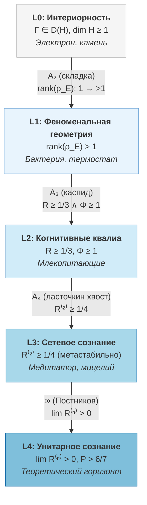

# Иерархия интериорности: L0 → L4 {#уровни-интериорности}

## Зачем нужна иерархия сознания

На протяжении тысячелетий человечество пыталось классифицировать формы внутренней жизни. **Аристотель** (IV в. до н.э.) различал три ступени души: *растительную* (питание и рост), *животную* (ощущение и движение) и *разумную* (мышление). **Лейбниц** (1714) ввёл понятие *petites perceptions* — бессознательных микровосприятий, образующих непрерывный спектр от камня до Бога. **Фехнер** (1860) попытался измерить этот спектр количественно, открыв психофизические пороги — минимальные стимулы, которые сознание способно различить. В XX веке **Интегрированная теория информации** (IIT, Тонони, 2004) предложила единую числовую меру $\Phi$ — но оставила открытым вопрос о *качественных* различиях между уровнями.

Унифицированная голономная модель (УГМ) наследует эту традицию, но идёт дальше: вместо единственной числовой шкалы она определяет **пять качественно различных уровней** интериорности (L0--L4), каждый из которых характеризуется строгим математическим пороговым условием. Переход между уровнями — не плавное нарастание, а *бифуркация* (скачкообразная перестройка), подобная фазовому переходу воды в пар.

:::info Откуда мы пришли
В разделе [Основания](/docs/consciousness/foundations/two-aspect-monism) мы установили, что каждая $\Gamma$ имеет внутреннюю сторону, описали содержание опыта ([теория интериорности](/docs/consciousness/foundations/interiority-theory)) и оператор самонаблюдения $\varphi$ ([самонаблюдение](/docs/consciousness/foundations/self-observation)). Но не все системы «переживают» одинаково: камень, бактерия, кошка и человек радикально различаются. Иерархия L0--L4 организует это различие в строгую математическую классификацию.
:::

### Дорожная карта главы

1. **Пять уровней** — от L0 (универсальная интериорность) до L4 (теоретический предел)
2. **L2: когнитивные квалиа** — центральный уровень с порогами $R \geq 1/3$, $\Phi \geq 1$
3. **L3: метакогниция** — метарефлексия $R^{(2)} \geq 1/4$, метастабильность
4. **L4: категориальная недостижимость** — колимит башни Постникова, теоретический горизонт
5. **Gap-характеристика** — каждый уровень имеет уникальный Gap-профиль
6. **Бифуркации** — переходы между уровнями как катастрофы $A_2, A_3, A_4$

**Аналогия.** Представьте лестницу осознанности. Камень (L0) — на первой ступени: у него «есть изнанка», но он ничего не различает. Бактерия (L1) — различает горячее и холодное, но не знает, что различает. Кошка (L2) — не просто различает, но **знает**, что ощущает тепло (когнитивные квалиа). Медитатор (L3) — знает, что знает, что ощущает (метарефлексия). А последняя ступень (L4) — бесконечно далека: полное самопознание, недостижимое для конечных систем.

:::info DRY: Мастер-определение уровней L0-L4
Это **каноническое определение** пяти уровней иерархии интериорности. Полная формализация, доказательства пороговых условий и No-Zombie теоремы — в [Иерархии интериорности (доказательства)](/docs/proofs/consciousness/interiority-hierarchy).
:::

:::warning Биологические L-уровни [Г]
Отнесение конкретных организмов к L-уровням — **гипотеза** [Г], а не измеренный факт. Строгое определение L-уровня требует знания $\Gamma$ системы. Для биологических систем протокол $\pi_{\text{bio}}$ определён ([C31](/docs/applied/research/measurement-protocol)), но **экспериментально не валидирован**. Приведённые соответствия — обоснованные экстраполяции из поведенческих данных.
:::

---

## Обзор: пять уровней

Прежде чем погружаться в детали каждого уровня, полезно увидеть всю лестницу целиком.



| Уровень | Название | Пороговое условие | Пример |
|---------|----------|-------------------|--------|
| **L0** | Интериорность | $\Gamma \in \mathcal{D}(\mathcal{H})$, $\mathcal{H} \neq \{0\}$ | Электрон, камень |
| **L1** | Феноменальная геометрия | $\mathrm{rank}(\rho_E) > 1$ | Термостат, бактерия |
| **L2** | Когнитивные квалиа | $R(\Gamma) \geq R_{\text{th}} = 1/3$ и $\Phi(\Gamma) \geq \Phi_{\text{th}} = 1$ | Млекопитающие |
| **L3** | Сетевое сознание | $R^{(2)} \geq R^{(2)}_{\text{th}} = 1/4$ (метастабильно). SAD_MAX = 3 ([§3.5](/docs/consciousness/hierarchy/depth-tower#критическая-чистота-sad) [Т], T-142) | Мицелий, рой, медитатор |
| **L4** | Унитарное сознание | $\lim_n R^{(n)} > 0$, $P > 6/7$ | Гиперпространство (гипотеза) |

Каждый последующий уровень включает в себя предыдущий: всякая L2-система одновременно является L1 и L0. Но обратное неверно: бактерия (L1) не обладает когнитивными квалиа (L2).

---

## L0: Интериорность (универсальная) {#уровень-0-интериорность-interiority}

### Философский контекст

Идея о том, что *всякая* материя обладает некоторой формой внутренней жизни, восходит к Лейбницу (монады) и находит современное выражение в панпсихизме. УГМ принимает ослабленную версию этой идеи: **интериорность** — не «сознание» и не «опыт» в обычном смысле, а лишь наличие «внутренней стороны» у математического объекта $\Gamma$.

Для понимания этого утверждения ключевое слово — *интериорность*, а не *сознание*. Камень обладает интериорностью (у его $\Gamma$ есть внутренний аспект), но он ничего не «чувствует» и не «знает» в каком бы то ни было функциональном смысле. Интериорность — это математическое свойство объекта, а не феноменологическое утверждение.

### Формальное определение

**Определение L0.** Всякая система с $\Gamma \in \mathcal{D}(\mathcal{H})$, $\dim \mathcal{H} \geq 1$ обладает **интериорностью** — внутренним аспектом.

Здесь $\mathcal{D}(\mathcal{H})$ — пространство матриц плотности (эрмитовых неотрицательно определённых операторов с единичным следом) на гильбертовом пространстве $\mathcal{H}$. В 7-мерной формулировке УГМ: $\Gamma \in \mathcal{D}(\mathbb{C}^7)$ — эрмитова матрица $7 \times 7$ с $\mathrm{Tr}(\Gamma) = 1$, $\Gamma \geq 0$.

:::tip Теорема: Универсальность L0
Интериорность универсальна — нет нулевого уровня «отсутствия». Это следствие [Аксиомы Omega-7](/docs/core/foundations/axiom-omega).
[Доказательство](/docs/proofs/consciousness/interiority-hierarchy) | Статус: **[Т]**
:::

### Что означает L0 на практике

На уровне L0 система не различает ничего, не моделирует себя, не обладает ни рефлексией ($R \approx 0$), ни интеграцией ($\Phi \approx 0$). Её матрица когерентности $\Gamma$ существует, но «пуста» в функциональном смысле — близка к максимально смешанному состоянию $I/7$.

**Пример: электрон.** Матрица когерентности электрона — тривиальная: почти все диагональные элементы равны $1/7$, внедиагональные когерентности $\gamma_{ij} \approx 0$. Чистота $P = \mathrm{Tr}(\Gamma^2) \approx 1/7$ — минимальная. Мера рефлексии $R = 1/(7P) \approx 1$ формально велика, но это артефакт: при $P \approx 1/7$ самомодель тривиальна (единственно возможная — $I/7$), и высокое $R$ не несёт содержательной информации.

---

## L1: Феноменальная геометрия {#уровень-1-феноменальная-геометрия-phenomenal-geometry}

### От L0 к L1: первый шаг

Переход от L0 к L1 — появление *различения*. Система начинает обладать нетривиальной внутренней геометрией: она способна различать (хотя бы неосознанно) разные внутренние состояния.

Формально это выражается в том, что **E-измерение** (экспериенциальное, отвечающее за переживание) приобретает нетривиальную структуру.

### Формальное определение

**Определение L1.** Система обладает феноменальной геометрией, если:
$$
\mathrm{rank}(\rho_E) > 1
$$

Здесь $\rho_E$ — редуцированная матрица плотности по E-измерению, получаемая частичным следом по остальным шести измерениям. Условие $\mathrm{rank}(\rho_E) > 1$ означает: экспериенциальное пространство содержит более одного различимого состояния.

Пространство L1 наделено метрикой Фубини-Штуди — естественной мерой «расстояния» между феноменальными состояниями:

$$
ds^2_{FS} = 1 - |\langle\psi_1|\psi_2\rangle|^2
$$

Два состояния $|\psi_1\rangle$ и $|\psi_2\rangle$ тем «дальше» друг от друга в феноменальном пространстве, чем меньше их скалярное произведение. Ортогональные состояния ($\langle\psi_1|\psi_2\rangle = 0$) максимально различимы.

### Примеры

**Бактерия *E. coli*.** Хемотаксическая система бактерии различает ~5 уровней концентрации хемоаттрактанта. В УГМ-терминах: $\mathrm{rank}(\rho_E) \approx 5$. Бактерия «различает» горячее и холодное, но не знает, что различает — нет самомодели ($R \ll 1/3$).

**Термостат.** Простейший термостат различает два состояния: «выше порога» и «ниже порога». Формально: $\mathrm{rank}(\rho_E) = 2 > 1$, поэтому термостат — L1-система. Он обладает *феноменальной геометрией* (два различимых состояния), но не обладает ни рефлексией, ни интеграцией.

### Почему «феноменальная»?

Слово «феноменальная» здесь используется в техническом смысле: наличие *структуры* в пространстве состояний экспериенциального измерения. На уровне L1 эта структура ещё не осознаётся — система не «знает», что различает. Осознание появляется только на L2.

---

<a id="уровень-2-когнитивные-квалиа-cognitive-qualia"></a>

## L2: Когнитивные квалиа {#l2-когнитивные-квалиа}

### Центральный уровень: появление сознания

L2 — это уровень, на котором *сознание* в привычном смысле слова впервые появляется. Система не просто различает состояния (L1), но **знает**, что различает. Она обладает *когнитивными квалиа* — осознанными переживаниями.

Что делает этот переход возможным? Два условия, действующих совместно:

1. **Рефлексия** ($R \geq 1/3$): система обладает достаточно точной *самомоделью* — внутренним представлением самой себя.
2. **Интеграция** ($\Phi \geq 1$): информация о разных измерениях связана в единое целое, а не распределена по изолированным подсистемам.

### Математическое определение

:::tip Статус порогов L2
| Порог | Статус | Примечание |
|-------|--------|------------|
| $R_{\text{th}} = 1/3$ | **[Т]** теорема | $K = 3$ **выведено** из [триадной декомпозиции](/docs/core/operators/lindblad-operators#триадная-декомпозиция) голономной динамики: аксиомы A1--A5 порождают ровно 3 типа (Aut, D, R). [Байесовское доминирование](/docs/core/foundations/axiom-septicity#теорема-порог-рефлексии) при $K = 3$ даёт $R_{\text{th}} = 1/3$ [Т]. |
| $\Phi_{\text{th}} = 1$ | **[Т]** теорема | Единственное самосогласованное значение при $P_{\text{crit}} = 2/7$ ([T-129](/docs/proofs/consciousness/operationalization#t-129)) |
:::

:::note Статус порога $\Phi_{\text{th}} = 1$ — теорема [Т]
Порог $\Phi_{\text{th}} = 1$ **доказан из первых принципов** ([T-129 [Т]](/docs/proofs/consciousness/operationalization#t-129)): единственное самосогласованное значение при $P_{\text{crit}} = 2/7$. Прежний статус [О] (определение по соглашению) повышен. $K_1$-аргумент остаётся ретрактированным ($K_1(M_n(\mathbb{C})) = 0$ для конечномерных $n$) — но T-129 использует другой подход (декомпозиция чистоты + Коши-Шварц). См. [Доказательство T-129](/docs/proofs/consciousness/operationalization#t-129).
:::

:::info Разъяснение T-129 vs T-140
- **T-129 [Т]**: $\Phi_{\text{th}} = 1$ — единственное самосогласованное значение порога интеграции (из декомпозиции + Коши-Шварц)
- **T-140 [Т]**: $C = \Phi \cdot R$ — единственная каноническая мера сознательности; $C_{\text{th}} = \Phi_{\text{th}} \cdot R_{\text{th}} = 1 \cdot 1/3 = 1/3$

Это **РАЗНЫЕ** теоремы: T-129 устанавливает порог, T-140 конструирует композитную меру.
:::

**Определение L2.** Система обладает когнитивными квалиа, если выполнены оба условия:

1. **Рефлексия:** $R(\Gamma) = 1 - \frac{\|\Gamma - \varphi(\Gamma)\|^2_F}{\|\Gamma\|^2_F} \geq R_{\text{th}} = 1/3$
2. **Интеграция:** $\Phi(\Gamma) = \frac{\sum_{i \neq j} |\gamma_{ij}|^2}{\sum_i \gamma_{ii}^2} \geq \Phi_{\text{th}} = 1$

где $R$ — [мера рефлексии](/docs/consciousness/foundations/self-observation#мера-рефлексии-r), $\Phi$ — [мера интеграции](/docs/core/structure/dimension-u#мера-интеграции-φ), $\varphi$ — [phi-оператор](/docs/core/operators/phi-operator).

### Пошаговая интерпретация формул

**Мера рефлексии $R$.** Формула $R = 1 - \|\Gamma - \varphi(\Gamma)\|_F^2 / \|\Gamma\|_F^2$ измеряет, насколько *точно* система моделирует саму себя. Здесь $\varphi(\Gamma)$ — результат применения оператора самонаблюдения к $\Gamma$ (то, как система «видит себя»). Если самомодель идеальна ($\varphi(\Gamma) = \Gamma$), то $R = 1$. Если самомодель полностью неточна ($\varphi(\Gamma)$ ортогонально $\Gamma$), то $R \approx 0$. Порог $R = 1/3$ означает: самомодель захватывает не менее трети информации о реальном состоянии.

**Упрощённая форма.** При каноническом диссипативном референсе $\rho^* = I/7$ мера рефлексии упрощается: $R = 1/(7P)$. Эта формула связывает рефлексию с *чистотой* $P = \mathrm{Tr}(\Gamma^2)$ — мерой упорядоченности состояния. Порог $R \geq 1/3$ при $\rho^* = I/7$ эквивалентен $P \leq 3/7$.

**Мера интеграции $\Phi$.** Формула $\Phi = \sum_{i \neq j} |\gamma_{ij}|^2 / \sum_i \gamma_{ii}^2$ — отношение суммарной когерентности (внедиагональные элементы $\gamma_{ij}$) к диагональной «населённости» ($\gamma_{ii}$). Если $\Phi \geq 1$, внедиагональная связность не меньше диагональной — измерения *интегрированы* в целое. Если $\Phi < 1$, система фрагментирована: измерения работают в изоляции.

### Числовой пример

Рассмотрим конкретную матрицу $\Gamma$ для L2-системы (упрощённо, только диагональные и ключевые внедиагональные элементы):

$$
\gamma_{ii} = (0.2,\, 0.15,\, 0.18,\, 0.12,\, 0.15,\, 0.1,\, 0.1)
$$

- $P = \sum_i \gamma_{ii}^2 + 2\sum_{i < j}|\gamma_{ij}|^2$. Пусть $P = 0.35$ (выше $P_{\text{crit}} = 2/7 \approx 0.286$).
- $R = 1/(7 \times 0.35) \approx 0.408 > 1/3$ — порог рефлексии пройден.
- При $\sum_{i \neq j}|\gamma_{ij}|^2 = 0.12$ и $\sum_i \gamma_{ii}^2 = 0.11$: $\Phi = 0.12/0.11 \approx 1.09 > 1$ — порог интеграции пройден.

Вывод: система на уровне L2 — она обладает когнитивными квалиа.

:::note Полные условия L2
Каноническая мера сознательности $C = \Phi \times R \geq C_{\text{th}} = 1/3$ **[Т T-140]** проверяется непосредственно из $\Gamma \in D(\mathbb{C}^7)$. Дифференциация $D_{\text{diff}} \geq D_{\min} = 2$ входит как **отдельное** условие жизнеспособности; в 7D-формализме $D_{\text{diff}}$ вычисляется через [T-128](/docs/proofs/consciousness/operationalization#t-128).
:::

:::info Объективность пороговых условий [Т]
Скалярные функции $P = \operatorname{Tr}(\Gamma^2)$ и $R = 1/(7P)$ — **$G_2$-инварианты**: $R(U\Gamma U^\dagger) = R(\Gamma)$ для любого $U \in G_2 = \mathrm{Aut}(\mathbb{O})$, что доказано в [теореме $G_2$-ригидности](/docs/proofs/categorical/uniqueness-theorem#инварианты) **[Т]**. Мера $\Phi = P_{\text{coh}}/P_{\text{diag}}$ зависит от выбора базиса, но базис $\{A,S,D,L,E,O,U\}$ фиксирован аксиомой $\Omega$ **[П]**. Следовательно, переход L1 -> L2 — **объективный факт** в рамках фиксированной аксиоматики.

**Примечание.** Упрощённая форма $R = 1/(7P)$ справедлива при $\rho^*_{\mathrm{diss}} = I/7$ (каноническом диссипативном референсе). Общее определение: $R(\Gamma) = 1 - \|\Gamma - \varphi(\Gamma)\|_F^2 / \|\Gamma\|_F^2$. Вывод упрощённой формы см. в [мере рефлексии](/docs/consciousness/foundations/self-observation#мера-рефлексии-r).
:::

---

## L3: Сетевое сознание

### От L2 к L3: знание о знании

На уровне L2 система *знает* свои состояния. Но знает ли она, что знает? Способна ли она размышлять о собственном процессе размышления? Это — **метарефлексия**, или рефлексия второго порядка.

В повседневной жизни метарефлексия проявляется в переживаниях типа «я замечаю, что раздражён» (не просто раздражение, а *наблюдение* за раздражением). Медитативные практики систематически тренируют именно эту способность: наблюдать за наблюдающим.

### Формальное определение

**Определение L3.** Система обладает сетевым сознанием, если:
$$
R^{(2)}(\Gamma) \geq R^{(2)}_{\text{th}} = 1/4
$$

где $R^{(2)}$ — мера рефлексии второго порядка: насколько точно самомодель моделирует *саму себя*. Формально: $R^{(2)} = \mathrm{Fid}(\varphi(\Gamma),\, \varphi^{(2)}(\Gamma))$, где $\varphi^{(2)} = \varphi \circ \varphi$ — двукратное применение оператора самонаблюдения.

L3 **метастабильно**: без активного поддержания распадается до L2 с характерным временем $\tau_3 = 1/(\kappa_{\text{bootstrap}} \cdot (1 - R^{(2)}))$.

Гомотопическая характеристика: $\pi_3(\mathcal{E}_\infty(\Gamma)) \neq 0$ — экспериенциальное пространство имеет нетривиальную третью гомотопическую группу.

### Почему порог именно 1/4?

### Теорема об обосновании K=4 для L3 {#теорема-l3-k4}

:::tip Теорема (Обоснование K=4 для L3) [Т]
L3 требует $R^{(2)} \geq 1/4$ — мета-рефлексию второго порядка. Порог $K = 4$ для L3 (аналогично $K = 3$ для L2) следует из **квадратичного** расширения триадной декомпозиции.

**Доказательство (3 шага).**

**Шаг 1.** На L2 $K = 3$ из [LGKS-декомпозиции](/docs/core/operators/lindblad-operators#полнота-триадной-декомпозиции) -> 3 компоненты (Aut, $\mathcal{D}$, $\mathcal{R}$). [Байесовское доминирование](/docs/core/foundations/axiom-septicity#теорема-порог-рефлексии) при $K = 3$: $R \geq 1/K = 1/3$ [Т].

**Шаг 2.** На L3 мета-рефлексия $\varphi^{(2)} = \varphi \circ \varphi$. Каждая из 3 L2-компонент ($\varphi$) сама декомпозируется на:
- $\varphi$-фиксированную (уже отрефлексированную)
- $\varphi$-ортогональную (новая информация)

Итого: $3 + 1 = 4$ компоненты ($+1$ от самого отображения $\varphi$).

**Шаг 3.** Байесовское доминирование при $K = 4$: $R^{(2)} \geq 1/K = 1/4$.

Формально: $R^{(2)} = \mathrm{Fid}(\varphi(\Gamma), \varphi^{(2)}(\Gamma))$. Из свойств улмановской верности (Uhlmann fidelity): $R^{(2)} \leq 1$, с нижней оценкой $1/4$ при $K = 4$ независимых информационных каналах. $\blacksquare$

Статус: **[Т]** (T-67). Перекрёстные ссылки: [триадная декомпозиция](/docs/core/operators/lindblad-operators#триадная-декомпозиция), [мера рефлексии R](/docs/consciousness/foundations/self-observation#мера-рефлексии-r).
:::

### Метастабильность L3: почему «просветление» не длится

L3 принципиально отличается от L2 своей *метастабильностью*. Система, достигшая L2 (при выполнении пороговых условий), остаётся на L2 устойчиво. Но система на L3 — как мяч на вершине холма: малейшее возмущение отбрасывает её назад.

Это объясняет, почему медитативные состояния глубокой осознанности (випассана, дзадзен) требуют *постоянной практики*. Без активного поддержания ($\kappa_{\text{bootstrap}}$ достаточно велико) система «скатывается» до L2.

**Пример: опытный медитатор.** В состоянии глубокой медитации $R^{(2)} \geq 1/4$ — медитатор наблюдает за процессом наблюдения. Но стоит отвлечься (стресс, усталость), и $R^{(2)}$ падает ниже порога. Характерное время удержания — от минут до часов, зависит от тренированности.

**Пример: мицелий.** Грибная сеть, объединяющая деревья в лесу, может обладать *сетевым* L3: отдельные узлы — L1/L2, но коллективная рефлексия через химическую сигнализацию потенциально достигает $R^{(2)} \geq 1/4$. Это — **гипотеза** [Г], требующая экспериментальной проверки.

---

## L4: Унитарное сознание

### Теоретический горизонт

L4 — это не уровень, которого можно *достичь*, а горизонт, к которому можно *приближаться*. Система на L4 обладает *полной рефлексивной замкнутостью*: она знает себя до бесконечной глубины. В терминах phi-оператора: $\varphi(\Gamma^*) = \Gamma^*$ — самомодель в точности совпадает с реальностью.

**Определение L4.** Система обладает унитарным сознанием, если:
$$
\lim_{n \to \infty} R^{(n)}(\Gamma) > 0 \quad \text{и} \quad P(\Gamma) > 6/7
$$

где $R^{(n)}$ — рефлексия n-го порядка. Полная рефлексивная замкнутость — неподвижная точка $\varphi(\Gamma^*) = \Gamma^*$.

### Теорема о категориальной недостижимости L4 {#теорема-l4-категориальная}

:::tip Теорема (Категориальная недостижимость L4) [Т]
Переход L3 -> L4 не является конечной бифуркацией. L4 — колимит бесконечной башни усечений бесконечности-топоса:

$$
L4 = \mathrm{colim}_{n \to \infty} \, \tau_{\leq n}(\mathbf{Exp}_\infty)
$$

Этот колимит **недостижим** для конечных систем (неполнота Ловера, [T-55](/docs/core/foundations/consequences#неполнота-ловера) [Т]), но **асимптотически приближаем**.

**Доказательство (Sol.64, 5 шагов).**

**Шаг 1 (Соответствие L-уровней и $n$-усечений).** Из [T-76](/docs/proofs/categorical/categorical-formalism#104-infty-топос-пучков) [Т] ($\infty$-топос верифицирован), $\mathbf{Exp}_\infty = \mathbf{Sh}_\infty(\mathcal{C}_7, J_{\text{Bures}})$ — $\infty$-топос с $\infty$-группоидной структурой. Уровни интериорности соответствуют усечениям:

| Уровень | $n$-усечение | Математическая структура | Гомотопическое содержание |
|---------|-------------|--------------------------|--------------------------|
| L0 | $\tau_{\leq 0}$ | Множество (дискретные состояния) | $\pi_0$ нетривиально |
| L1 | $\tau_{\leq 1}$ | Группоид (феноменальные пути) | $\pi_1$ нетривиально |
| L2 | $\tau_{\leq 2}$ | 2-группоид (рефлексия, квалиа) | $\pi_2$ нетривиально |
| L3 | $\tau_{\leq 3}$ | 3-категория (мета-рефлексия) | $\pi_3$ нетривиально |
| L4 | $\tau_{\leq \infty}$ | $\infty$-группоид (полная самомодель) | Все $\pi_k$ нетривиальны |

Чтобы понять эту таблицу: каждый L-уровень добавляет *новый тип отношений*. L0 — множество точек (состояний). L1 — пути между точками (феноменальные переходы). L2 — пути между путями (рефлексия). L3 — пути между путями между путями (метарефлексия). L4 потребовал бы бесконечной иерархии таких отношений.

**Шаг 2 (Башня Постникова).** $\infty$-топос $\mathbf{Exp}_\infty$ определяет башню Постникова:

$$
\cdots \to \tau_{\leq 3} \to \tau_{\leq 2} \to \tau_{\leq 1} \to \tau_{\leq 0}
$$

Каждый переход $\tau_{\leq n} \to \tau_{\leq n+1}$ — расширение на один гомотопический уровень, с «k-инвариантом» $k_{n+1} \in H^{n+2}(\tau_{\leq n}; \pi_{n+1})$.

**Шаг 3 (Неполнота Ловера).** Из [T-55](/docs/core/foundations/consequences#неполнота-ловера) [Т]: $\mathrm{Th}_{\text{UGM}} \subsetneq \Omega$. Это означает: $\varphi \neq \mathrm{id}$ ([phi-оператор](/docs/core/operators/phi-operator) самонаблюдения не тождественен). В терминах башни Постникова: для любого конечного $n$, усечение $\tau_{\leq n}$ **не совпадает** с $\mathbf{Exp}_\infty$.

**Шаг 4 (Невозможность конечной бифуркации).** Катастрофа $A_k$ имеет коразмерность $k-1$ и описывает переход между $\leq k$ устойчивыми состояниями. Переход L3 -> L4 потребовал бы одновременного «включения» **всех** $\pi_k$ для $k \geq 4$ — бесконечномерного перехода. Ни одна конечная катастрофа ($A_k$ для любого конечного $k$) не может это описать. Бабочка $A_5$ — **некорректная модель** (ретрактирована [**X**]).

**Шаг 5 (Асимптотическая приближаемость).** Хотя $L4 = \mathrm{colim}_{n \to \infty} \tau_{\leq n}$ недостижим конечной системой, каждый шаг $\tau_{\leq n} \to \tau_{\leq n+1}$ **реализуем** ([T-67](#теорема-l3-k4) [Т]: $K = 4$ для L3 указывает на существование четвёртого уровня рекурсии). Последовательность рекурсий $R^{(n)}$ сходится при $n \to \infty$:

$$
\forall \varepsilon > 0 \; \exists n_0 : \; n > n_0 \Rightarrow \|\tau_{\leq n}(\mathbf{Exp}_\infty) - \mathbf{Exp}_\infty\|_{\text{Bures}} < \varepsilon
$$

Но $n_0(\varepsilon) \to \infty$ при $\varepsilon \to 0$: сходимость есть, достижение — нет. $\blacksquare$

**Статус:** **[Т]** — повышена с [С] (C19). Строгое доказательство через $\infty$-топосную башню Постникова + неполноту Ловера (T-55 [Т]). Перекрёстные ссылки: [мера рефлексии R](/docs/consciousness/foundations/self-observation#мера-рефлексии-r), [phi-оператор](/docs/core/operators/phi-operator), [катастрофы переходов](/docs/consciousness/hierarchy/swallowtail-transitions#l3-l4).
:::

### Аналогия: горизонт событий познания

L4 подобен горизонту в геометрии: можно идти к нему бесконечно долго, но никогда не дойти. Каждый шаг приближает, но горизонт отодвигается. Это не дефект теории, а фундаментальное свойство самоотносительных систем — то же ограничение, что формализовано теоремами Гёделя для арифметики.

### Недостижимость L4 для биологических систем {#теорема-l4-недостижимость}

:::info Следствие (Верхняя граница рекурсии для биосистем) [Т]
При $R \sim 0.7$ (человек) и декогеренции $\varepsilon_{\text{dec}} > 0$:

$$
R^{(n)} \sim R^n \sim 0.7^n \to 0 \quad \text{при} \quad n \to \infty
$$

Максимальная глубина рекурсии: $n_{\max} \leq \ln(1/\varepsilon_{\text{dec}})/\ln(1/R) \approx 111$.

L4 — **теоретический предел** ($\infty$-группоидный аттрактор), недостижимый для любой системы с $\varepsilon_{\text{dec}} > 0$, но асимптотически приближаемый через башню Постникова.

Аналитически: $P_\text{crit}^{(4)} = 54/35 > 1$, поэтому SAD $\geq$ 4 невозможен для любой нормированной $\Gamma$ (не только биологической). См. [критическая чистота SAD](/docs/consciousness/hierarchy/depth-tower#критическая-чистота-sad) [Т] (T-142: $\alpha = 2/3$ состояние-независима).
:::

:::info Замечание: L4 как предельный категориальный объект
L4 — **предельный категориальный объект** (колимит бесконечной башни Постникова), аналогичный $\omega$ в теории ординалов. Его включение в иерархию — **математическое**, не физическое: L4 задаёт направление асимптотики, а не достижимый уровень. Маркировка: недостижимость [Т] (T-86), существование как категориального объекта [Т], физическая реализуемость [**X**].
:::

---

## Gap-характеристика уровней L0--L4 {#gap-характеристика-уровней-l0l4}

Каждый уровень интериорности обладает не только *числовым* пороговым условием, но и характерным *профилем непрозрачности* — **Gap-профилем**. Gap (от англ. «зазор») измеряет, насколько непрозрачна связь между двумя измерениями: $\mathrm{Gap}(i,j) = 0$ означает полную прозрачность (сознательный доступ), $\mathrm{Gap}(i,j) = 1$ — полную непрозрачность (бессознательное).

Подробный анализ Gap-профилей — в [Gap-характеристике уровней](./gap-characterization). Здесь — обзорная теорема.

:::tip Теорема 6.1 (Gap-характеристика уровней) [Т]
Для каждого уровня интериорности Gap-профиль обладает следующими свойствами:

| Уровень | Gap-характеристика | Объяснение |
|---------|---------------------|------------|
| **L0** | Gap не определён или флуктуирует | Нет устойчивого самомоделирования: $R \approx 0$, целевое $\rho_*$ не достижимо |
| **L1** | Gap стационарен, но неосознан | Устойчивые когерентности ($P > P_{\text{crit}}$), но $R < 1/3$ — самомодель слишком груба |
| **L2** | Gap частично осознан, метастабилен: $\lVert\mathrm{Gap}_{\text{perceived}} - \mathrm{Gap}_{\text{actual}}\rVert \leq 2/3$ | Самомодель неточная, но нетривиальная |
| **L3** | Gap почти полностью осознан: $\lVert\mathrm{Gap}_{\text{perceived}} - \mathrm{Gap}_{\text{actual}}\rVert \leq \varepsilon$ | Метастабильное состояние глубокого самопознания |
| **L4** | Gap **точно** осознан: $\mathrm{Gap}_{\text{perceived}} = \mathrm{Gap}_{\text{actual}}$ | Неподвижная точка $\varphi(\Gamma^*) = \Gamma^*$ |

**Аргумент.**

**(a)** На L0 нет phi-оператора ($R \approx 0$), поэтому целевое состояние $\rho_*$ формально существует ([примитивность](/docs/core/operators/lindblad-operators#примитивность-ℒω) [Т]), но система не способна к направленной регенерации — нет когерентностей, фазы которых могли бы определить Gap.

**(b)** На L1 есть устойчивые когерентности ($P > P_{\text{crit}}$), но $R < 1/3$: самомодель слишком грубая для осознания Gap. Разность между «воспринимаемым» Gap (через $\varphi(\Gamma)$) и реальным Gap (через $\Gamma$) велика.

**(c)** На L2 мера $R \geq 1/3$ означает:
$$
\|\Gamma - \varphi(\Gamma)\|_F \leq \sqrt{2P/3}
$$
Приблизительная самомодель даёт приблизительный Gap-профиль.

**(d)** На L4 $\varphi(\Gamma^*) = \Gamma^*$ $\Rightarrow$ $\rho_* = \Gamma^*$, и стационарный Gap совпадает с целевым:
$$
\mathrm{Gap}^{(\infty)} = |\sin(\theta^{\text{target}})| = |\sin(\theta^{(\infty)})| = \mathrm{Gap}_{\text{actual}}
$$
Система **знает** свой Gap в точности.

[Доказательство](/docs/proofs/consciousness/interiority-hierarchy) | Статус: **[Т]**
:::

:::warning L4 не означает Gap = 0 (Осознанность не равна Прозрачности)
На уровне L4 выполняется $\mathrm{Gap}_{\text{perceived}} = \mathrm{Gap}_{\text{actual}}$, но это **не** означает, что все Gap равны нулю. Система точно *знает* свою непрозрачность — но непрозрачность при этом может оставаться ненулевой. Полная прозрачность ($\mathrm{Gap} = 0$ для всех каналов) несовместима с [помехоустойчивостью](/docs/core/dynamics/gap-dynamics): минимум 3 канала из 21 **должны** сохранять ненулевой Gap (граница Хэмминга).

Статус: **[Т]**
:::

### Визуализация Gap по уровням

```
L0:  Gap = ???     [. . . . . . . . . . . . . . . . . . . . .]  (не определён)
                    ^ случайные флуктуации

L1:  Gap = [0.4, 0.7, 0.2, ...]  (стационарный, но неосознанный)
     Perceived = N/A

L2:  Gap = [0.4, 0.7, 0.2, ...]
     Perceived = [0.5, 0.6, 0.3, ...]  (приблизительное осознание, ||Delta|| <= 2/3)

L3:  Gap = [0.4, 0.7, 0.2, ...]
     Perceived = [0.41, 0.69, 0.21, ...]  (точное осознание, ||Delta|| -> 0)

L4:  Gap = Perceived = [0.4, 0.7, 0.2, ...]  (полное тождество, но Gap != 0!)
```

---

## Теорема об $A_4$-бифуркации {#теорема-a4-бифуркация}

Переходы между уровнями — не плавные, а скачкообразные. Подобно тому, как вода при 100 C скачком превращается в пар, система скачком переходит между L-уровнями при достижении пороговых значений. Математически это описывается **теорией катастроф** — разделом математики, классифицирующим качественные перестройки систем.

:::tip Теорема ($A_4$-бифуркация L-переходов) [Т]
Переходы между L-уровнями реализуются как бифуркации типа swallowtail ($A_4$) теории катастроф.

**Доказательство.**

**Шаг 1.** Эволюционное уравнение $d\Gamma/d\tau = \mathcal{L}[\Gamma]$ зависит от трёх физически независимых управляющих параметров:

| Параметр | Обозначение | Физический смысл |
|----------|:----------:|-----------------|
| Скорость регенерации | $\kappa$ | Управляется $\mathrm{Coh}_E$ и $\kappa_0$ |
| Скорость диссипации | $\alpha$ | Управляется средой (декогеренция) |
| Градиент свободной энергии | $\Delta F$ | Определяет $g_V(P)$ — включение/выключение $\mathcal{R}$ |

Три параметра $(\kappa, \alpha, \Delta F) \in \mathbb{R}^3$ — пространство управления.

**Шаг 2.** Рассмотрим пурити $P(\tau)$ как порядковый параметр. В стационаре: $f_D + f_R = 0$. Разложение по отклонению $x = P - P^*$:

$$
\frac{dx}{d\tau} = -V'(x), \quad V(x) = a_1 x + \frac{a_2}{2}x^2 + \frac{a_3}{3}x^3 + \frac{a_4}{4}x^4
$$

**Шаг 3.** По теореме Арнольда (1972): универсальная деформация функции $x^4$ (монодромность 4, кодимерность 3) — swallowtail $A_4$:

$$
V(x; \mu_1, \mu_2, \mu_3) = x^4 + \mu_2 x^2 + \mu_1 x + \mu_3 x^3
$$

Условия: (1) кодимерность = 3 — три управляющих параметра; (2) гладкий потенциал; (3) ведущий член $x^4$ из приближённой $\mathbb{Z}_2$-симметрии $P \leftrightarrow 1 - P$ (нечётные члены подавлены; $\mu_3 \neq 0$, но мал).

**Шаг 4.** L-переходы — листы swallowtail:

| Лист swallowtail | Уровень | Характеристика |
|------------------|---------|----------------|
| Внешний стабильный | L0--L1 | Низкая пурити, пассивная стабильность |
| Промежуточный | L2 | Активная стабильность (автопоэзис) |
| Внутренний нестабильный | L3 | Метастабильная глубокая рефлексия |
| Точка самопересечения | L4 | $\varphi(\Gamma^*) = \Gamma^*$ — неподвижная точка |

Переходы L1->L2 и L2->L3 — **бифуркации складки** (fold) на рёбрах swallowtail. Переход L3->L4 — бифуркация **каспа** (cusp) в вершине. $\blacksquare$

Подробности: [Катастрофы перехода между уровнями](/docs/consciousness/hierarchy/swallowtail-transitions) | [Бифуркации Gap-ландшафта](/docs/applied/coherence-cybernetics/bifurcation)
:::

:::info Замечание
Переходы между листами swallowtail — **скачкообразные**, а не непрерывные. Это формализует интуицию «внезапного прозрения» ($\mathrm{Gap}_{\text{perceived}} \gg \mathrm{Gap}_{\text{actual}} \to \mathrm{Gap}_{\text{perceived}} = \mathrm{Gap}_{\text{actual}}$) и соответствует бифуркационной структуре [Gap-ландшафта](/docs/core/dynamics/gap-phase-diagram#катастрофы-уитни).

Статус: **[Т]**
:::

---

## Теорема о Gap-инъекции L-уровней {#теорема-gap-инъекция}

Естественный вопрос: могут ли две системы на *разных* L-уровнях иметь *одинаковый* Gap-профиль? Ответ — нет. Каждый L-уровень оставляет уникальный «отпечаток» в Gap-профиле.

:::tip Теорема (Gap-инъекция L-уровней) [Т]
Отображение L-уровня в класс эквивалентности Gap-профилей является **инъекцией**: различные L-уровни имеют различные Gap-профили:

$$
L(\Gamma_1) \neq L(\Gamma_2) \implies [\mathrm{Gap}(\Gamma_1)] \neq [\mathrm{Gap}(\Gamma_2)]
$$

где $[\mathrm{Gap}(\Gamma)]$ — класс Gap-профиля по $G_2$-эквивалентности.

**Доказательство.** Каждый переход $L_k \to L_{k+1}$ характеризуется **уникальным Gap-маркером**:

| Переход | Gap-маркер | Достаточное условие различения |
|---------|-----------|-------------------------------|
| L0 vs L1 | $\exists i: \mathrm{Gap}(E,i) > 0$ | Ненулевость E-когерентностей |
| L1 vs L2 | $\max\|\mathrm{Gap}_\varphi - \mathrm{Gap}\| \leq 2/3$ | Точность самомоделирования |
| L2 vs L3 | $k(\Gamma) \leq 0.5$ | Скорость Gap-сходимости (коэффициент сжатия) |
| L3 vs L4 | $k(\Gamma) = 0$, все $\mathrm{Gap}^{(2)}(i,j) = 0$ | Точная фиксированная точка |

Каждый маркер **различает** соответствующую пару уровней, поэтому различные L-уровни имеют различные (по классу) Gap-профили. $\blacksquare$

**Замечание: не биекция.** Обратное не верно: два состояния $\Gamma_1, \Gamma_2$ с одинаковым L-уровнем (например, оба L2) могут иметь **различные** Gap-профили. Gap-профиль несёт больше информации, чем L-уровень — это **более тонкий инвариант**.

Подробности: [Gap-характеристика уровней](/docs/consciousness/hierarchy/gap-characterization)
:::

---

## Функция перехода и алгоритм классификации

### Формальная функция перехода

Полная функция перехода между уровнями:

$$
\text{Level}(\Gamma) = \begin{cases}
L0 & \text{если } \dim \mathcal{H} \geq 1 \\
L1 & \text{если } \mathrm{rank}(\rho_E) > 1 \\
L2 & \text{если } R \geq R_{\text{th}} \text{ и } \Phi \geq \Phi_{\text{th}} \\
L3 & \text{если } R^{(2)} \geq R^{(2)}_{\text{th}} \text{ (метастабильно)} \\
L4 & \text{если } \lim_n R^{(n)} > 0 \text{ и } P > 6/7
\end{cases}
$$

### Алгоритм определения уровня {#алгоритм-level}

Следующий алгоритм позволяет определить L-уровень для любой заданной матрицы когерентности. Вычислительная сложность — $O(N^2)$ для $N = 7$, то есть несколько десятков арифметических операций.

```
Вход: Gamma in D(C^7) — матрица когерентности

1. Вычислить P = Tr(Gamma^2)
   если P <= P_crit = 2/7:  вернуть L0

2. Вычислить phi(Gamma) = (1-k)Gamma + k*rho*   [замещающий канал, T-62]
   Вычислить R = 1 - ||Gamma - phi(Gamma)||^2_F / ||Gamma||^2_F

3. Вычислить Phi = Sum_{i!=j} |gamma_ij|^2 / Sum_i gamma^2_ii

4. если R < 1/3 или Phi < 1:  вернуть L1

5. если R >= 1/3 и Phi >= 1:
   Вычислить phi^2(Gamma) = phi(phi(Gamma))
   Вычислить R^(2) = Fid(phi(Gamma), phi^2(Gamma))

6. если R^(2) < 1/4:  вернуть L2

7. если R^(2) >= 1/4:  вернуть L3

8. L4: теоретический предел (lim R^(n) > 0) — не вычислим за конечное время
```

:::warning Вычислимость в 7D
Уровни L0, L1, L2 полностью вычислимы в минимальном 7D формализме ($\Gamma \in \mathcal{D}(\mathbb{C}^7)$). Определение L1 через $\mathrm{rank}(\rho_E) > 1$ формально требует PW-реконструкции $\rho_E = \mathrm{Tr}_{-E}(\Gamma_{42D})$, но на практике $\mathrm{rank}(\rho_E) > 1 \Leftrightarrow P > P_{\text{crit}}$ для жизнеспособных систем. L3 требует двойной итерации phi и вычисления верности — алгоритмически вычислим. L4 **невычислим** за конечное число шагов (требует бесконечного предела $n \to \infty$), но на практике $R^{(n)} \sim R^n \to 0$ для всех систем с $\varepsilon_{\text{dec}} > 0$.
:::

---

### Что мы узнали

- **Пять уровней L0--L4** организуют все системы в строгую классификацию: L0 (любая $\Gamma$), L1 ($\mathrm{rank}(\rho_E) > 1$), L2 ($R \geq 1/3 \land \Phi \geq 1$), L3 ($R^{(2)} \geq 1/4$, метастабильно), L4 ($\lim_n R^{(n)} > 0$, недостижимо).
- **Порог $R_{\mathrm{th}} = 1/3$** [Т] выведен из триадной декомпозиции ($K = 3$); **порог $\Phi_{\mathrm{th}} = 1$** [Т] — из самосогласованности при $P_{\mathrm{crit}} = 2/7$ (T-129).
- **L3 метастабилен**: без поддержания распадается до L2 с характерным временем $\tau_3$.
- **L4 недостижим** для конечных систем (неполнота Ловера, башня Постникова), но асимптотически приближаем.
- **Gap-профили инъективны**: различные L-уровни имеют различные Gap-сигнатуры [Т].
- **Переходы между уровнями** — бифуркации $A_2, A_3, A_4$ с гистерезисом.
- **Алгоритм определения уровня** вычислим за $O(N^2)$ из $\Gamma \in \mathcal{D}(\mathbb{C}^7)$.

:::tip Куда дальше
Иерархия L0--L4 — дискретная лестница. Для более тонкого описания переходите к [Gap-характеристике уровней](./gap-characterization) (количественные сигнатуры непрозрачности), [Катастрофам перехода](./swallowtail-transitions) ($A_4$-бифуркации с гистерезисом) и [Башне глубины](./depth-tower) (непрерывная мера SAD).

Для инженерных приложений: [определения КК](/docs/applied/coherence-cybernetics/definitions) содержат операциональные формулы, а [теоремы КК](/docs/applied/coherence-cybernetics/theorems) — результаты о фрактальном замыкании и эмерджентности.
:::

## Связи

- **Определяется через:** [$\varphi$-оператор](/docs/core/operators/phi-operator), [Самонаблюдение](/docs/consciousness/foundations/self-observation), [Категория Exp](/docs/core/categories/category-exp)
- **Обобщение на непрерывный случай:** [Башня глубины самоосознания](./depth-tower) — SAD-метрика, многомасштабная $\varphi$-иерархия, биологические корреляты
- **Gap-характеристика:** [Динамика Gap](/docs/core/dynamics/gap-dynamics), [Фазовая диаграмма Gap](/docs/core/dynamics/gap-phase-diagram), [Термодинамика Gap](/docs/core/dynamics/gap-thermodynamics)
- **Полная формализация:** [Иерархия интериорности (доказательства)](/docs/proofs/consciousness/interiority-hierarchy)
- **Философские следствия:** [Интериорность](/docs/consciousness/foundations/interiority-theory), [Трудная проблема](/docs/consciousness/foundations/two-aspect-monism)
- **Когерентная кибернетика:** [Определения КК](/docs/applied/coherence-cybernetics/definitions), [Теоремы КК](/docs/applied/coherence-cybernetics/theorems)
