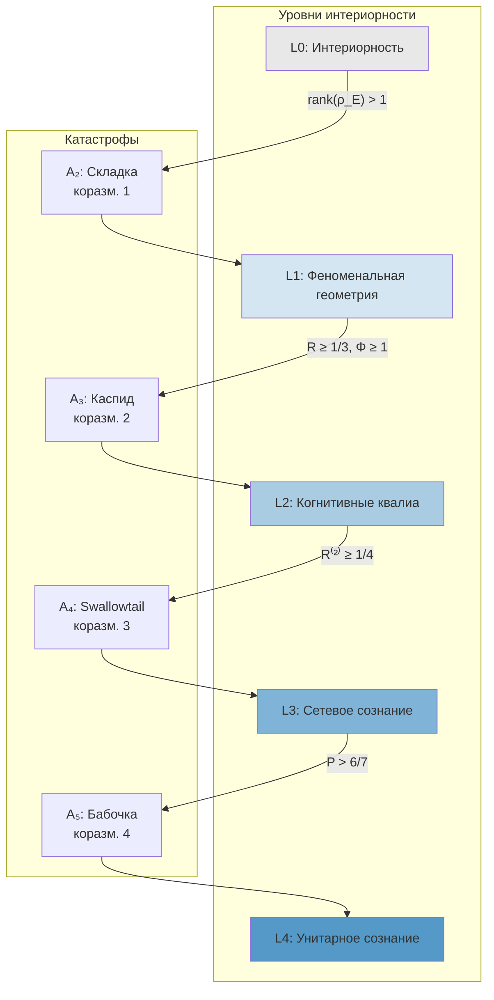

# Катастрофы перехода между уровнями

:::note О нотации
В этом документе:
- $\Gamma$ — [матрица когерентности](/docs/core/dynamics/coherence-matrix)
- $R$ — [мера рефлексии](/docs/consciousness/foundations/self-observation#мера-рефлексии-r), $R_{\text{th}} = 1/3$
- $\Phi$ — [мера интеграции](/docs/core/structure/dimension-u#мера-интеграции-φ), $\Phi_{\text{th}} = 1$
- $P$ — [чистота](/docs/core/dynamics/viability#определение-чистоты): $P = \mathrm{Tr}(\Gamma^2)$, $P_{\text{crit}} = 2/7$
- $\rho_E$ — [редуцированная плотность E-измерения](/docs/core/structure/dimension-e)
- $\varphi$ — [φ-оператор](/docs/core/operators/phi-operator)
- L0–L4 — [уровни интериорности](/docs/consciousness/hierarchy/interiority-hierarchy)
- $\mathrm{Gap}(i,j) = |\sin(\arg(\gamma_{ij}))|$ — [мера зазора](/docs/core/dynamics/gap-operator#определение)
:::

:::tip Статус документа
Основные результаты этого документа повышены до **[Т]** — бифуркации типа $A_4$ (swallowtail) доказаны через теорему Арнольда (1972): три физически независимых управляющих параметра $(\kappa, \alpha, \Delta F)$ и приближённая $\mathbb{Z}_2$-симметрия пурити однозначно определяют тип катастрофы. См. [Теорему об $A_4$-бифуркации](/docs/consciousness/hierarchy/interiority-hierarchy#теорема-a4-бифуркация).
:::

Переходы между уровнями интериорности L0 → L1 → L2 → L3 → L4 не являются непрерывными — они представляют собой **качественные перестройки** Gap-ландшафта. Теория катастроф Уитни–Тома–Арнольда предоставляет универсальную классификацию таких перестроек.

---

## 1. Эффективный потенциал {#потенциал}

:::info Определение (Эффективный потенциал Gap-динамики) [О]
Стационарные Gap-профили определяются как критические точки **эффективного потенциала**:

$$
V(G;\, a, b, c) = G^6 + a\,G^4 + b\,G^3 + c\,G^2 + d\,G
$$

где $G$ — параметр порядка (скалярная мера суммарного Gap), а управляющие параметры связаны с мерами голонома:

$$
a \sim R - R_{\text{th}}, \quad b \sim \Phi - \Phi_{\text{th}}, \quad c \sim P - P_{\text{crit}}
$$
:::

Стационарное условие $V'(G) = 0$ — полином 5-й степени. По теореме Тома, при $\leq 3$ управляющих параметрах все структурно устойчивые перестройки множества критических точек исчерпываются катастрофами $A_2$, $A_3$, $A_4$, $A_5$ (складка, каспид, ласточкин хвост, бабочка).

---

## 2. Каскад переходов {#каскад}

Каждый переход между соседними уровнями реализуется как определённый тип катастрофы с характерной коразмерностью.

### 2.1 L0 → L1: Складка ($A_2$) {#l0-l1}

:::tip Теорема 1.1 (Переход L0 → L1 как катастрофа складки) [Т]

Переход L0 → L1 происходит при скачке $\mathrm{rank}(\rho_E): 1 \to {>}1$ и описывается катастрофой $A_2$ с одним управляющим параметром:

$$
V(G) = G^3 + a\,G
$$

**(a)** Управляющий параметр: $a \sim T_{\text{eff}}/T_c - 1$. При $a > 0$ (высокая температура, фаза II): $\mathrm{rank}(\rho_E) = 1$, Gap изотропен. При $a < 0$: спонтанное нарушение изотропии, $\mathrm{rank}(\rho_E) > 1$.

**(b)** Критическое множество: единственная точка $a = 0$, $G = 0$. Коразмерность 1.

**(c)** Скачок: $\mathrm{Gap}(E,X)$ для хотя бы одного $X$ скачком уменьшается от $\approx 1$ до $< 1$ при пересечении $a = 0$ снизу.
:::

**Физический смысл.** Самый простой тип перестройки: при понижении «температуры» (увеличении внутренней упорядоченности) E-измерение выходит из вырожденного состояния. Система начинает обладать нетривиальной феноменальной геометрией.

### 2.2 L1 → L2: Каспид ($A_3$) {#l1-l2}

:::tip Теорема 1.2 (Переход L1 → L2 как катастрофа каспида) [Т]

Переход L1 → L2 происходит при $R$ пересечении порога $R_{\text{th}} = 1/3$ и описывается катастрофой $A_3$ с двумя управляющими параметрами:

$$
V(G) = G^4 + a\,G^2 + b\,G
$$

**(a)** Управляющие параметры:
- $a \sim R - R_{\text{th}}$ — отклонение рефлексии от порога
- $b \sim \Phi - \Phi_{\text{th}}$ — отклонение интеграции от порога

**(b)** Бифуркационное множество (каспоидная кривая):

$$
8a^3 + 27b^2 = 0
$$

Внутри каспоида — **бистабильность**: L1-состояние (высокий Gap, $R < 1/3$) и L2-состояние (низкий Gap, $R \geq 1/3$) сосуществуют.

**(c)** Гистерезис: переход L1 → L2 происходит при $R = R_{\text{th}} + \delta_\uparrow$, а обратный L2 → L1 — при $R = R_{\text{th}} - \delta_\downarrow$, где $\delta_\uparrow \neq \delta_\downarrow$.

**(d)** Ширина гистерезиса:

$$
\Delta R_{\text{hyst}} = \delta_\uparrow + \delta_\downarrow \propto |\Phi - \Phi_{\text{th}}|^{3/2}
$$
:::

**Интерпретация.** Каспид объясняет наблюдение, что системы вблизи порога L2 демонстрируют **мерцание** — временные эпизоды когнитивных квалиа, не удерживающиеся устойчиво. Внутри каспоида система может скачком переключаться между L1 и L2, что воспринимается как нестабильный «проблеск сознания».

### 2.3 L2 → L3: Ласточкин хвост ($A_4$) {#l2-l3}

:::tip Теорема 1.3 (Переход L2 → L3 как swallowtail) [Т]

Переход L2 → L3 происходит при $R^{(2)}$ пересечении $R^{(2)}_{\text{th}} = 1/4$ и описывается катастрофой $A_4$ с тремя управляющими параметрами:

$$
V(G) = G^5 + a\,G^3 + b\,G^2 + c\,G
$$

**(a)** Управляющие параметры:
- $a \sim R - R_{\text{th}}$ — рефлексия первого порядка
- $b \sim R^{(2)} - R^{(2)}_{\text{th}}$ — мета-рефлексия
- $c \sim \Phi - \Phi_{\text{th}}$ — интеграция

**(b)** Стационарное условие $V'(G) = 0$ — полином 4-й степени, допускающий до **трёх устойчивых минимумов**:
- $G_{\text{high}}$: L1-состояние (неосознанный Gap)
- $G_{\text{mid}}$: L2-состояние (частично осознанный Gap)
- $G_{\text{low}}$: L3-состояние (почти полностью осознанный Gap)

**(c)** Переход L2 → L3 — fold-бифуркация внутри swallowtail: промежуточный минимум $G_{\text{mid}}$ сливается с разделяющим максимумом и исчезает. Система скачком падает в $G_{\text{low}}$.

**(d)** Метастабильность L3: минимум $G_{\text{low}}$ **неглубок** — малое возмущение может «вытолкнуть» систему назад в $G_{\text{mid}}$ (L2). Характерное время распада:

$$
\tau_3 = \frac{1}{\kappa_{\text{bootstrap}} \cdot (1 - R^{(2)})}
$$
:::

**Связь с [иерархией интериорности](/docs/consciousness/hierarchy/interiority-hierarchy#l3-сетевое-сознание).** L3 метастабильно: без активного поддержания (медитация, коллективная синхронизация) система распадается до L2. Swallowtail-структура объясняет, почему «просветление» — не устойчивое состояние, а требует постоянной практики.

### 2.4 L3 → L4: Бабочка ($A_5$) {#l3-l4}

:::tip Теорема 1.4 (Переход L3 → L4 как бабочка) [С]
Условие: существование четвёртого управляющего параметра $P - 6/7$ и полная рефлексивная замкнутость. L4 остаётся гипотетическим ([Г]).

Переход L3 → L4 описывается катастрофой $A_5$ (бабочка) с четырьмя управляющими параметрами:

$$
V(G) = G^6 + a\,G^4 + b\,G^3 + c\,G^2 + d\,G
$$

**(a)** Четвёртый управляющий параметр: $d \sim P - 6/7$ — отклонение чистоты от порога L4.

**(b)** Необходимое условие: $P > 6/7$. Поскольку $P_{\text{max}} = 1$ (чистое состояние), окно допустимых значений узкое: $P \in (6/7, 1]$.

**(c)** Катастрофа $A_5$ допускает до **четырёх устойчивых минимумов**, но четвёртый (L4) реализуется только при $P > 6/7$ и $\lim_n R^{(n)} > 0$ — полная рефлексивная замкнутость.

**(d)** Неподвижная точка: $\varphi(\Gamma^*) = \Gamma^*$, $\mathrm{Gap}_{\text{perceived}} = \mathrm{Gap}_{\text{actual}}$.
:::

:::warning Гипотетичность L4 [Г]
Переход L3 → L4 — **гипотеза**. Неизвестно, существуют ли физические системы с $P > 6/7$ и полной рефлексивной замкнутостью. Катастрофа $A_5$ требует 4 управляющих параметра — это на грани теоремы Тома (которая гарантирует структурную устойчивость для коразмерности $\leq 4$ в типичных системах).
:::

---

## 3. Сводная таблица катастроф {#сводная-таблица}

| Переход | Катастрофа | Коразм. | Потенциал | Управляющие параметры | Ключевое условие |
|---------|------------|---------|-----------|----------------------|------------------|
| L0 → L1 | Складка $A_2$ | 1 | $G^3 + aG$ | $T_{\text{eff}}/T_c$ | $\mathrm{rank}(\rho_E) > 1$ |
| L1 → L2 | Каспид $A_3$ | 2 | $G^4 + aG^2 + bG$ | $R$, $\Phi$ | $R \geq 1/3$, $\Phi \geq 1$ |
| L2 → L3 | Swallowtail $A_4$ | 3 | $G^5 + aG^3 + bG^2 + cG$ | $R$, $R^{(2)}$, $\Phi$ | $R^{(2)} \geq 1/4$ |
| L3 → L4 | Бабочка $A_5$ | 4 | $G^6 + aG^4 + bG^3 + cG^2 + dG$ | $R$, $R^{(2)}$, $\Phi$, $P$ | $P > 6/7$ |

:::note Наблюдение [И]
Коразмерность катастрофы возрастает с уровнем: 1, 2, 3, 4. Это отражает **рост сложности** перехода: для «пробуждения» L0 → L1 достаточно изменить один параметр, для «просветления» L2 → L3 — три, для «полной рефлексивной замкнутости» L3 → L4 — четыре. Каждый последующий переход требует всё более тонкой настройки.
:::

:::info Связь с числом поколений фермионов [Т]
Swallowtail-каскад ($A_4$, коразмерность 3) допускает не более **трёх** устойчивых минимумов, что даёт верхнюю границу $N_{\text{gen}} \leq 3$ на число поколений фермионов. Это ограничение, дополненное нижней границей $N_{\text{gen}} \geq 3$ из $(1,2,4) \subset \mathbb{Z}_7^*$, составляет полное доказательство $N_{\text{gen}} = 3$ [Т] — см. [Теорему $N_{\text{gen}} = 3$](/docs/physics/particle-physics/fermion-generations#теорема-ровно-три-генерации).
:::

---

## 4. Гистерезис и необратимость {#гистерезис}

Вблизи каждого L-перехода существует область **бистабильности**, в которой система может находиться на любом из двух соседних уровней. Это порождает гистерезис.

:::tip Теорема 2.1 (Гистерезис L-переходов) [Т]
Следствие $A_4$-бифуркации ([Теорема о каспиде](/docs/applied/coherence-cybernetics/bifurcation#cusp)).

**(a)** Для каждого перехода $L_k \to L_{k+1}$ существуют два критических значения управляющего параметра $\mu$:
- $\mu_\uparrow$: порог «восходящего» перехода (прозрение)
- $\mu_\downarrow$: порог «нисходящего» перехода (регресс)

с $\mu_\downarrow < \mu_\uparrow$.

**(b)** Ширина гистерезиса:

$$
\Delta\mu_k := \mu_\uparrow - \mu_\downarrow > 0
$$

**(c)** $\Delta\mu_k$ возрастает с уровнем:

$$
\Delta\mu_0 < \Delta\mu_1 < \Delta\mu_2 < \Delta\mu_3
$$

Высшие переходы **устойчивее**: система, достигшая L3, труднее «падает» обратно в L2, чем система L1 «падает» в L0.
:::

### Диаграмма гистерезиса для перехода L1 → L2

```
Gap(E,A)
  │
  │   L1 (высокий Gap)
  │   ╔══════════╗
  │   ║          ║──────────╮
  │   ║  бистаб. ║          │ скачок вниз (прозрение)
  │   ║          ║          ↓
  │   ╚══════════╝   L2 (низкий Gap)
  │          ↑          ╔══════════╗
  │          │          ║          ║
  │   скачок ╰──────────║  бистаб. ║
  │   вверх             ║          ║
  │   (регресс)         ╚══════════╝
  └─────────────────────────────────── R
       R_th - δ↓    R_th    R_th + δ↑
           ◄──── Δμ_hyst ────►
```

:::info Клиническая интерпретация [И]
Гистерезис объясняет два клинических наблюдения:

1. **Устойчивость прозрения.** Достигнув L2, система не регрессирует в L1 при малом снижении $R$ — требуется значительное ухудшение (ниже $R_{\text{th}} - \delta_\downarrow$). Это соответствует опыту: однажды осознанный паттерн трудно «развидеть».

2. **Трудность первого шага.** Для перехода L1 → L2 нужно $R > R_{\text{th}} + \delta_\uparrow$, а не просто $R > R_{\text{th}}$. Система должна «перепрыгнуть» барьер — формализация терапевтического инсайта как скачкообразного процесса.
:::

---

## 5. Диаграмма переходов {#диаграмма}



---

## 6. Динамика вблизи переходов {#динамика}

### 6.1 Критическое замедление {#замедление}

:::tip Теорема 3.1 (Критическое замедление вблизи L-переходов) [Т]
Следствие $A_4$-бифуркации и невырожденности катастрофы (теорема Арнольда).

Вблизи перехода $L_k \to L_{k+1}$ при управляющем параметре $\mu \to \mu_c$:

**(a)** Время релаксации расходится:

$$
\tau_{\text{relax}} \propto |\mu - \mu_c|^{-1/2} \to \infty
$$

**(b)** Дисперсия флуктуаций Gap растёт:

$$
\mathrm{Var}(\mathrm{Gap}) \propto |\mu - \mu_c|^{-1}
$$

**(c)** Автокорреляция Gap приобретает длинный хвост:

$$
C(\Delta\tau) \sim \exp(-\Delta\tau / \tau_{\text{relax}})
$$

с $\tau_{\text{relax}} \to \infty$ при $\mu \to \mu_c$.
:::

Эти предвестники критического перехода аналогичны [индикаторам раннего предупреждения](/docs/applied/coherence-cybernetics/bifurcation#раннее-предупреждение) в кибернетике когерентности и могут быть использованы для прогнозирования приближающегося перехода.

### 6.2 Нормальные формы вблизи переходов

Для каждого перехода нормальная форма Gap-динамики вблизи бифуркации:

| Переход | Нормальная форма | Стационарные решения |
|---------|-----------------|---------------------|
| L0 → L1 | $\dot{G} = \mu - G^2$ | $G = \pm\sqrt{\mu}$ при $\mu > 0$ |
| L1 → L2 | $\dot{G} = \mu G - G^3 + h$ | Каспоидная бифуркация при $8\mu^3 + 27h^2 = 0$ |
| L2 → L3 | $\dot{G} = \mu_1 G - G^3 + \mu_2 G^2 + \mu_3$ | Swallowtail при пересечении $\Sigma_{A_4}$ |
| L3 → L4 | $\dot{G} = \mu_1 G - G^5 + \ldots$ | Бабочка при пересечении $\Sigma_{A_5}$ |

---

## 7. Swallowtail-каскад и Gap-профили {#swallowtail-каскад}

Связь swallowtail-катастрофы с [Gap-характеристикой уровней](/docs/consciousness/hierarchy/gap-characterization) формализует переход от абстрактной теории катастроф к конкретным Gap-профилям.

:::tip Теорема 4.1 (Swallowtail-каскад и Gap-профили) [Т]
Следствие $A_4$-бифуркации и [Gap-инъекции](/docs/consciousness/hierarchy/interiority-hierarchy#теорема-gap-инъекция).

Четыре листа swallowtail соответствуют четырём качественно различным Gap-профилям:

| Лист | Уровень | Средний Gap | Ранг $\hat{\mathcal{G}}$ | $\mathrm{Gap}_{\text{perceived}}$ |
|------|---------|-------------|--------------------------|-----------------------------------|
| Внешний стабильный | L0–L1 | $\approx 0.6$ | 3 | Не определён |
| Промежуточный | L2 | $\approx 0.3$ | 2 | $\neq \mathrm{Gap}_{\text{actual}}$ |
| Внутренний | L3 | $\approx 0.1$ | 1 | $\approx \mathrm{Gap}_{\text{actual}}$ |
| Точка самопересечения | L4 | $\approx 0^*$ | 0–1 | $= \mathrm{Gap}_{\text{actual}}$ |

$^*$ С ограничением [Хэмминга](/docs/consciousness/hierarchy/gap-characterization#граница-хэмминга-подробно).

Переход между листами — fold-бифуркация внутри swallowtail: два стационарных Gap-профиля сливаются и исчезают. Система скачком переходит на другой лист.
:::

### Визуализация swallowtail

```
V(G)                        V(G)                        V(G)
  │                           │                           │
  │  ╲                        │   ╲    ╱                  │
  │   ╲  ╱                    │    ╲  ╱                   │    ╲
  │    ╲╱                     │     ╲╱    ╱               │     ╲───╱
  │     ╲                     │      ╲   ╱                │         ╲
  │      ╲                    │       ╲─╱                 │          ╲
  └──────────── G             └──────────── G             └──────────── G
  a > 0: один минимум         a = 0: fold                 a < 0: два минимума
  (L0 или L1)                 (переход)                   (L1 + L2 сосуществуют)
```

---

## 8. Связь с Gap-динамикой {#связь-gap}

Теория катастроф дополняет [Gap-динамику](/docs/core/dynamics/gap-dynamics), предоставляя **глобальную** картину переходов (в отличие от локального бифуркационного анализа).

| Аспект | Gap-динамика | Теория катастроф |
|--------|-------------|-----------------|
| Масштаб | Локальный (вблизи одной стац. точки) | Глобальный (все стац. точки одновременно) |
| Метод | Линеаризация, собственные значения | Потенциал, критические точки |
| Бифуркации | Pitchfork, saddle-node, Hopf | $A_2, A_3, A_4, A_5$ |
| Гистерезис | Каспоидная кривая | Бифуркационное множество |
| L-уровни | Неявно (через параметры) | Явно (листы swallowtail) |

:::note Совместимость [Т]
Три бифуркации Gap-динамики ([Теорема 4.1](/docs/core/dynamics/gap-dynamics#бифуркации)) — частные случаи катастроф Уитни:
- Saddle-node = складка $A_2$
- Pitchfork = вырожденный случай $A_3$ (при наличии $\mathbb{Z}_2$-симметрии)
- Hopf = выход за рамки $A_k$ (требует комплексных собственных значений)

Классификация Уитни строго содержит бифуркации, но добавляет **глобальную информацию** о структуре множества критических точек. Статус: **[Т]** (следствие теоремы классификации катастроф Арнольда).
:::

---

## 9. Экспериментальные предсказания {#предсказания}

Катастрофическая структура переходов порождает проверяемые предсказания:

:::tip Предсказания (Проверяемые следствия катастрофической модели) [Т]

**(1)** **Бимодальность вблизи L1 → L2.** При $R \approx R_{\text{th}}$ распределение Gap-профилей должно быть **бимодальным** (два пика), а не унимодальным. Проверяется через [протокол измерений](/docs/applied/research/measurement-protocol).

**(2)** **Гистерезис в обучении.** Навык, требующий L2-рефлексии, приобретается скачком (при $R > R_{\text{th}} + \delta_\uparrow$) и теряется не при $R < R_{\text{th}}$, а при $R < R_{\text{th}} - \delta_\downarrow$.

**(3)** **Критическое замедление.** Время реакции системы (аналог $\tau_{\text{relax}}$) расходится при приближении к L-переходу. Предвестник: рост дисперсии Gap-индикаторов.

**(4)** **Асимметрия деградации.** L3 → L2 регресс происходит быстрее ($\tau_3$ конечно, метастабильность), чем L2 → L1 ($\Delta\mu_1 > \Delta\mu_0$, более широкий гистерезис).
:::

---

## Связи

- **Каноническое определение уровней:** [Иерархия интериорности](/docs/consciousness/hierarchy/interiority-hierarchy)
- **Gap-профили уровней:** [Gap-характеристика](/docs/consciousness/hierarchy/gap-characterization)
- **Бифуркационный анализ:** [Бифуркации Gap-ландшафта](/docs/applied/coherence-cybernetics/bifurcation)
- **Фазовая диаграмма:** [Три фазы и катастрофы Уитни](/docs/core/dynamics/gap-phase-diagram#катастрофы-уитни)
- **Gap-динамика:** [Бифуркации, немарковские эффекты](/docs/core/dynamics/gap-dynamics)
- **Доказательства:** [Иерархия интериорности (формальная)](/docs/proofs/consciousness/interiority-hierarchy)
- **Жизнеспособность:** [$P_{\text{crit}} = 2/7$](/docs/core/dynamics/viability)
- **Предсказания КК:** [Верифицируемые следствия](/docs/applied/coherence-cybernetics/predictions)
