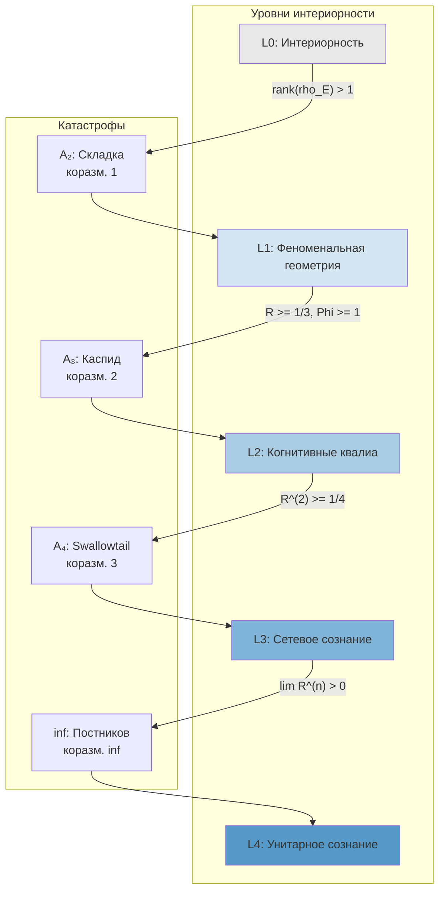

# Катастрофы перехода между уровнями

## Введение: почему сознание «включается» скачком

Нагрейте кусок льда. До 0 C ничего не происходит — лёд остаётся льдом. Но при 0 C — *скачок*: твёрдое тело превращается в жидкость. Не «постепенно размягчается», а именно *скачком* меняет качественное состояние. Продолжайте нагревать — при 100 C снова скачок: жидкость становится паром.

Физики называют такие скачки **фазовыми переходами**. Математики — **бифуркациями** или **катастрофами** (в техническом смысле, не в обыденном). В 1972 году французский математик Рене Том показал, что все «простые» качественные перестройки систем можно классифицировать: существует конечное число *типов* катастроф, и каждый тип полностью определяется числом управляющих параметров. Эту классификацию дополнил и уточнил Владимир Арнольд (A-серия катастроф: $A_2$, $A_3$, $A_4$, ...).

Переходы между уровнями сознания (L0 -> L1 -> L2 -> L3 -> L4) — *в точности* такие катастрофы. Сознание не «постепенно нарастает» — оно *скачком* переключается между качественно различными состояниями. Более того, эти переходы обладают **гистерезисом**: порог «включения» (прозрение) *выше*, чем порог «выключения» (регресс). Как перегретая вода остаётся жидкостью выше 100 C, а переохлаждённая — жидкостью ниже 0 C.

:::info Откуда мы пришли
В [иерархии интериорности](./interiority-hierarchy) мы определили пять уровней L0--L4, а в [Gap-характеристике](./gap-characterization) описали их количественные сигнатуры. Теперь мы спрашиваем: **как** происходят переходы между уровнями? Оказывается, это не плавные изменения, а **качественные перестройки** — катастрофы в смысле теории Уитни--Тома--Арнольда.
:::

### Дорожная карта главы

1. **Эффективный потенциал** — Gap-динамика описывается потенциалом 6-й степени с тремя управляющими параметрами
2. **Каскад переходов** — L0->L1 (складка $A_2$), L1->L2 (каспид $A_3$), L2->L3 (swallowtail $A_4$), L3->L4 (Постников)
3. **Гистерезис** — переходы «вверх» и «вниз» происходят при разных значениях параметров
4. **Критическое замедление** — предвестники перехода: расходимость времени релаксации и дисперсии Gap
5. **Лавинная динамика** — переход L1->L2 как автокаталитический «игнишн» через $\kappa_0$-усиление
6. **Критические экспоненты** — $\beta = 1/3$, $\nu = 1/4$, $\gamma = 3/4$

:::note О нотации
В этом документе:
- $\Gamma$ — [матрица когерентности](/docs/core/dynamics/coherence-matrix)
- $R$ — [мера рефлексии](/docs/consciousness/foundations/self-observation#мера-рефлексии-r), $R_{\text{th}} = 1/3$
- $\Phi$ — [мера интеграции](/docs/core/structure/dimension-u#мера-интеграции-φ), $\Phi_{\text{th}} = 1$
- $P$ — [чистота](/docs/core/dynamics/viability#определение-чистоты): $P = \mathrm{Tr}(\Gamma^2)$, $P_{\text{crit}} = 2/7$
- $\rho_E$ — [редуцированная плотность E-измерения](/docs/core/structure/dimension-e)
- $\varphi$ — [phi-оператор](/docs/core/operators/phi-operator)
- L0--L4 — [уровни интериорности](/docs/consciousness/hierarchy/interiority-hierarchy)
- $\mathrm{Gap}(i,j) = |\sin(\arg(\gamma_{ij}))|$ — [мера зазора](/docs/core/dynamics/gap-operator#определение)
:::

:::tip Статус документа
Основные результаты этого документа повышены до **[Т]** — бифуркации типа $A_4$ (swallowtail) доказаны через теорему Арнольда (1972): три физически независимых управляющих параметра $(\kappa, \alpha, \Delta F)$ и приближённая $\mathbb{Z}_2$-симметрия пурити однозначно определяют тип катастрофы. См. [Теорему об $A_4$-бифуркации](/docs/consciousness/hierarchy/interiority-hierarchy#теорема-a4-бифуркация).
:::

---

## 1. Эффективный потенциал {#потенциал}

### От динамики к ландшафту

Чтобы понять переходы между уровнями, представьте мяч, катящийся по холмистому ландшафту. Положения мяча — состояния системы. Впадины — устойчивые состояния (L-уровни). Холмы — барьеры между ними. Переход между уровнями — это *перестройка самого ландшафта*: впадина исчезает, и мяч скатывается в соседнюю.

Математически ландшафт описывается **эффективным потенциалом** $V(G)$, где $G$ — параметр порядка (скалярная мера суммарного Gap).

:::info Определение (Эффективный потенциал Gap-динамики) [О]
Стационарные Gap-профили определяются как критические точки **эффективного потенциала**:

$$
V(G;\, a, b, c) = G^6 + a\,G^4 + b\,G^3 + c\,G^2 + d\,G
$$

где $G$ — параметр порядка (скалярная мера суммарного Gap), а управляющие параметры связаны с мерами голонома:

$$
a \sim R - R_{\text{th}}, \quad b \sim \Phi - \Phi_{\text{th}}, \quad c \sim P - P_{\text{crit}}
$$
:::

Стационарное условие $V'(G) = 0$ — полином 5-й степени. По теореме Тома, при $\leq 3$ управляющих параметрах все структурно устойчивые перестройки множества критических точек исчерпываются катастрофами $A_2$, $A_3$, $A_4$, $A_5$ (складка, каспид, ласточкин хвост, бабочка).

### Три управляющих параметра

Три параметра — это не произвольный выбор. Они соответствуют трём физически независимым «ручкам управления»:

| Параметр | Что управляет | Аналогия |
|----------|--------------|----------|
| $\kappa$ (регенерация) | Скорость «ремонта» когерентностей | Мощность печки |
| $\alpha$ (диссипация) | Скорость разрушения когерентностей | Температура за окном |
| $\Delta F$ (свободная энергия) | Метаболический бюджет | Запас дров |

Именно три — не два и не четыре. Это определяет *тип* катастрофы: swallowtail ($A_4$), а не каспид ($A_3$, два параметра) или бабочка ($A_5$, четыре параметра).

---

## 2. Каскад переходов {#каскад}

Каждый переход между соседними уровнями реализуется как определённый тип катастрофы с характерной коразмерностью. Коразмерность — это число управляющих параметров, которые нужно «повернуть» для перехода. Чем выше уровень — тем больше «ручек» нужно повернуть одновременно.

### 2.1 L0 -> L1: Складка ($A_2$) — самый простой переход {#l0-l1}

**Аналогия: переохлаждение воды.** Вода при 0 C может остаться жидкостью (метастабильное состояние). Но стоит чуть толкнуть — и она скачком замерзает. Один параметр (температура) управляет переходом.

:::tip Теорема 1.1 (Переход L0 -> L1 как катастрофа складки) [Т]

Переход L0 -> L1 происходит при скачке $\mathrm{rank}(\rho_E): 1 \to {>}1$ и описывается катастрофой $A_2$ с одним управляющим параметром:

$$
V(G) = G^3 + a\,G
$$

**(a)** Управляющий параметр: $a \sim T_{\text{eff}}/T_c - 1$. При $a > 0$ (высокая температура, фаза II): $\mathrm{rank}(\rho_E) = 1$, Gap изотропен. При $a < 0$: спонтанное нарушение изотропии, $\mathrm{rank}(\rho_E) > 1$.

**(b)** Критическое множество: единственная точка $a = 0$, $G = 0$. Коразмерность 1.

**(c)** Скачок: $\mathrm{Gap}(E,X)$ для хотя бы одного $X$ скачком уменьшается от $\approx 1$ до $< 1$ при пересечении $a = 0$ снизу.
:::

**Физический смысл.** Самый простой тип перестройки: при понижении «температуры» (увеличении внутренней упорядоченности) E-измерение выходит из вырожденного состояния. Система начинает обладать нетривиальной [феноменальной геометрией](/docs/consciousness/hierarchy/interiority-hierarchy#l1-феноменальная-геометрия).

**Потенциал складки:**

```
V(G)                        V(G)                        V(G)
  |                           |                           |
  | \                         |  \   /                    |
  |  \   /                    |   \ /                     |    \.
  |   \ /                     |    *                      |     \___/
  |    *                      |                           |
  +----------- G              +----------- G              +----------- G
  a > 0: один минимум         a = 0: точка перегиба       a < 0: два экстремума
  (только L0)                 (критическая точка)         (L0 и L1 сосуществуют)
```

### 2.2 L1 -> L2: Каспид ($A_3$) — бистабильность и мерцание {#l1-l2}

**Аналогия: тройная точка воды.** При определённых значениях температуры и давления вода, лёд и пар сосуществуют одновременно. Два параметра управляют переходом.

:::tip Теорема 1.2 (Переход L1 -> L2 как катастрофа каспида) [Т]

Переход L1 -> L2 происходит при $R$ пересечении порога $R_{\text{th}} = 1/3$ и описывается катастрофой $A_3$ с двумя управляющими параметрами:

$$
V(G) = G^4 + a\,G^2 + b\,G
$$

**(a)** Управляющие параметры:
- $a \sim R - R_{\text{th}}$ — отклонение рефлексии от порога
- $b \sim \Phi - \Phi_{\text{th}}$ — отклонение интеграции от порога

**(b)** Бифуркационное множество (каспоидная кривая):

$$
8a^3 + 27b^2 = 0
$$

Внутри каспоида — **бистабильность**: L1-состояние (высокий Gap, $R < 1/3$) и L2-состояние (низкий Gap, $R \geq 1/3$) сосуществуют.

**(c)** Гистерезис: переход L1 -> L2 происходит при $R = R_{\text{th}} + \delta_\uparrow$, а обратный L2 -> L1 — при $R = R_{\text{th}} - \delta_\downarrow$, где $\delta_\uparrow \neq \delta_\downarrow$.

**(d)** Ширина гистерезиса:

$$
\Delta R_{\text{hyst}} = \delta_\uparrow + \delta_\downarrow \propto |\Phi - \Phi_{\text{th}}|^{3/2}
$$
:::

**Интерпретация: мерцание сознания.** Каспид объясняет наблюдение, что системы вблизи порога L2 демонстрируют **мерцание** — временные эпизоды когнитивных квалиа, не удерживающиеся устойчиво. Внутри каспоида система может скачком переключаться между L1 и L2, что воспринимается как нестабильный «проблеск сознания».

Клинический пример: пациент выходит из комы. Сначала — кратковременные эпизоды осознанности (мерцание L1/L2), затем — устойчивое сознание (L2). Это в точности поведение каспоида: при плавном увеличении $R$ система сначала «мерцает» между двумя минимумами, потом нижний минимум (L1) исчезает, и система скачком переходит в L2.

### 2.3 L2 -> L3: Ласточкин хвост ($A_4$) — три минимума и метастабильность {#l2-l3}

**Аналогия: суперпозиция трёх фаз.** Представьте вещество, которое может существовать в трёх состояниях одновременно: твёрдом, жидком и газообразном. Три параметра (температура, давление, концентрация) управляют переходами. Это — swallowtail, или «ласточкин хвост» (названный по форме бифуркационной поверхности в пространстве параметров).

:::tip Теорема 1.3 (Переход L2 -> L3 как swallowtail) [Т]

Переход L2 -> L3 происходит при $R^{(2)}$ пересечении $R^{(2)}_{\text{th}} = 1/4$ и описывается катастрофой $A_4$ с тремя управляющими параметрами:

$$
V(G) = G^5 + a\,G^3 + b\,G^2 + c\,G
$$

**(a)** Управляющие параметры:
- $a \sim R - R_{\text{th}}$ — рефлексия первого порядка
- $b \sim R^{(2)} - R^{(2)}_{\text{th}}$ — мета-рефлексия
- $c \sim \Phi - \Phi_{\text{th}}$ — интеграция

**(b)** Стационарное условие $V'(G) = 0$ — полином 4-й степени, допускающий до **трёх устойчивых минимумов**:
- $G_{\text{high}}$: L1-состояние (неосознанный Gap)
- $G_{\text{mid}}$: L2-состояние (частично осознанный Gap)
- $G_{\text{low}}$: L3-состояние (почти полностью осознанный Gap)

**(c)** Переход L2 -> L3 — fold-бифуркация внутри swallowtail: промежуточный минимум $G_{\text{mid}}$ сливается с разделяющим максимумом и исчезает. Система скачком падает в $G_{\text{low}}$.

**(d)** Метастабильность L3: минимум $G_{\text{low}}$ **неглубок** — малое возмущение может «вытолкнуть» систему назад в $G_{\text{mid}}$ (L2). Характерное время распада:

$$
\tau_3 = \frac{1}{\kappa_{\text{bootstrap}} \cdot (1 - R^{(2)})}
$$
:::

**Связь с [иерархией интериорности](/docs/consciousness/hierarchy/interiority-hierarchy#l3-сетевое-сознание).** L3 метастабильно: без активного поддержания (медитация, коллективная синхронизация) система распадается до L2. Swallowtail-структура объясняет, почему «просветление» — не устойчивое состояние, а требует постоянной практики.

**Потенциал ласточкиного хвоста:**

```
V(G)                        V(G)                        V(G)
  |                           |                           |
  |  .                        |  .    .                   |  .    .
  | / \                       | / \  / \                  | / \  / \.
  |/   \                      |/   \/   \                 |/   \/   \.
  *     \                     *    *     \                 *    *     *
         \                          \     \                          \
  +----------- G              +----------- G              +----------- G
  Один минимум (L2)           Два минимума (L2 + L3)      Три минимума (L1+L2+L3)
```

### 2.4 L3 -> L4: Категориальная недостижимость [Т] {#l3-l4}

:::danger Ретрактация: бабочка $A_5$ [✗]
Исходная модель L3 -> L4 как катастрофы $A_5$ (бабочка) **ретрактируется**. Причина: классификация Арнольда описывает **конечномерные** бифуркации, а переход L3 -> L4 — **бесконечномерный** (из $\infty$-категориальной природы L4). Ни одна конечная катастрофа ($A_k$ для любого конечного $k$) не может описать одновременное «включение» всех $\pi_k$ для $k \geq 4$.
:::

:::tip Теорема 1.4 (Категориальная недостижимость L4) [Т]
Переход L3 -> L4 не является конечной бифуркацией. L4 — колимит бесконечной башни усечений $\infty$-топоса:

$$
L4 = \mathrm{colim}_{n \to \infty} \, \tau_{\leq n}(\mathbf{Exp}_\infty)
$$

Этот колимит **недостижим** для конечных систем ([неполнота Ловера](/docs/core/foundations/consequences#неполнота-ловера), T-55 [Т]), но **асимптотически приближаем**: каждый шаг $\tau_{\leq n} \to \tau_{\leq n+1}$ реализуем ([T-67](/docs/consciousness/hierarchy/interiority-hierarchy#теорема-l3-k4) [Т]).

**Физическое следствие.** Сознание может **бесконечно углубляться** (каждый новый уровень мета-осознания добавляет гомотопический уровень), но **никогда не достигает** полного самопознания. Переход L3 -> L4 — не скачок, а бесконечная последовательность всё более тонких приближений.

Полное доказательство: [Теорема (Категориальная недостижимость L4)](/docs/consciousness/hierarchy/interiority-hierarchy#теорема-l4-категориальная) [Т].
:::

---

## 3. Сводная таблица катастроф {#сводная-таблица}

| Переход | Катастрофа | Коразм. | Потенциал | Управляющие параметры | Ключевое условие |
|---------|------------|---------|-----------|----------------------|------------------|
| L0 -> L1 | Складка $A_2$ | 1 | $G^3 + aG$ | $T_{\text{eff}}/T_c$ | $\mathrm{rank}(\rho_E) > 1$ |
| L1 -> L2 | Каспид $A_3$ | 2 | $G^4 + aG^2 + bG$ | $R$, $\Phi$ | $R \geq 1/3$, $\Phi \geq 1$ |
| L2 -> L3 | Swallowtail $A_4$ | 3 | $G^5 + aG^3 + bG^2 + cG$ | $R$, $R^{(2)}$, $\Phi$ | $R^{(2)} \geq 1/4$ |
| L3 -> L4 | ~~Бабочка $A_5$~~ **[✗]** | $\infty$ | Колимит башни Постникова $\tau_{\leq n}$ | Все $\pi_k$, $k \geq 4$ | $\lim_n R^{(n)} > 0$ (недостижим) |

:::note Наблюдение [И]
Коразмерность катастрофы возрастает с уровнем: 1, 2, 3, $\infty$. Это отражает **рост сложности** перехода: для «пробуждения» L0 -> L1 достаточно изменить один параметр, для «просветления» L2 -> L3 — три, а для «полной рефлексивной замкнутости» L3 -> L4 — **бесконечное число** гомотопических уровней (башня Постникова). Переход L3->L4 принципиально отличается от предыдущих: это не конечная бифуркация, а асимптотический процесс (Sol.64, [теорема о категориальной недостижимости](/docs/consciousness/hierarchy/interiority-hierarchy#теорема-l4-категориальная) [Т]).
:::

:::info Связь с числом поколений фермионов [Т]
Swallowtail-каскад ($A_4$, коразмерность 3) допускает не более **трёх** устойчивых минимумов, что даёт верхнюю границу $N_{\text{gen}} \leq 3$ на число поколений фермионов. Это ограничение, дополненное нижней границей $N_{\text{gen}} \geq 3$ из $(1,2,4) \subset \mathbb{Z}_7^*$, составляет полное доказательство $N_{\text{gen}} = 3$ [Т] — см. [Теорему $N_{\text{gen}} = 3$](/docs/physics/particle-physics/fermion-generations#теорема-ровно-три-генерации).
:::

---

## 4. Гистерезис и необратимость {#гистерезис}

### Что такое гистерезис

**Гистерезис** — это зависимость состояния системы от её *истории*, а не только от текущих параметров. Классический пример: магнит. Если намагнитить железо, а потом убрать поле, железо *остаётся намагниченным*. Чтобы размагнитить, нужно приложить поле в *обратном направлении* — и не маленькое.

В переходах сознания гистерезис означает: для «включения» (прозрения) нужна $R$ *выше* порога, а для «выключения» (регресса) — *ниже* другого (более низкого) порога. Между этими порогами — зона бистабильности, где система может находиться на любом из двух уровней в зависимости от того, откуда она пришла.

:::tip Теорема 2.1 (Гистерезис L-переходов) [Т]
Следствие $A_4$-бифуркации ([Теорема о каспиде](/docs/applied/coherence-cybernetics/bifurcation#cusp)).

**(a)** Для каждого перехода $L_k \to L_{k+1}$ существуют два критических значения управляющего параметра $\mu$:
- $\mu_\uparrow$: порог «восходящего» перехода (прозрение)
- $\mu_\downarrow$: порог «нисходящего» перехода (регресс)

с $\mu_\downarrow < \mu_\uparrow$.

**(b)** Ширина гистерезиса:

$$
\Delta\mu_k := \mu_\uparrow - \mu_\downarrow > 0
$$

**(c)** $\Delta\mu_k$ возрастает с уровнем:

$$
\Delta\mu_0 < \Delta\mu_1 < \Delta\mu_2 < \Delta\mu_3
$$

Высшие переходы **устойчивее**: система, достигшая L3, труднее «падает» обратно в L2, чем система L1 «падает» в L0.
:::

### Диаграмма гистерезиса для перехода L1 -> L2

```
Gap(E,A)
  |
  |   L1 (высокий Gap)
  |   +============+
  |   |            |-----------+
  |   | бистабил.  |           | скачок вниз (прозрение)
  |   |            |           v
  |   +============+   L2 (низкий Gap)
  |          ^          +============+
  |          |          |            |
  |   скачок +-----------| бистабил.  |
  |   вверх             |            |
  |   (регресс)         +============+
  +--------------------------------------- R
       R_th - d_dn   R_th    R_th + d_up
           <---- Delta_mu_hyst ---->
```

:::info Клиническая интерпретация [И]
Гистерезис объясняет два клинических наблюдения:

1. **Устойчивость прозрения.** Достигнув L2, система не регрессирует в L1 при малом снижении $R$ — требуется значительное ухудшение (ниже $R_{\text{th}} - \delta_\downarrow$). Это соответствует опыту: однажды осознанный паттерн трудно «развидеть». Терапевтический инсайт обладает «устойчивостью» — он не исчезает при первом стрессе.

2. **Трудность первого шага.** Для перехода L1 -> L2 нужно $R > R_{\text{th}} + \delta_\uparrow$, а не просто $R > R_{\text{th}}$. Система должна «перепрыгнуть» барьер — формализация терапевтического инсайта как скачкообразного процесса. Вот почему психотерапия часто работает «рывками»: долгая подготовка, а потом — внезапное прозрение.
:::

---

## 5. Диаграмма переходов {#диаграмма}


```mermaid
graph TD
    subgraph Levels["Уровни интериорности"]
        L0["L0: Интериорность"]
        L1["L1: Феноменальная геометрия"]
        L2["L2: Когнитивные квалиа"]
        L3["L3: Сетевое сознание"]
        L4["L4: Унитарное сознание"]
    end

    subgraph Catastrophes["Катастрофы"]
        A2["A₂: Складка<br/>коразм. 1"]
        A3["A₃: Каспид<br/>коразм. 2"]
        A4["A₄: Swallowtail<br/>коразм. 3"]
        A5["inf: Постников<br/>коразм. inf"]
    end

    L0 --> |"rank(rho_E) > 1"| A2 --> L1
    L1 --> |"R >= 1/3, Phi >= 1"| A3 --> L2
    L2 --> |"R^(2) >= 1/4"| A4 --> L3
    L3 --> |"lim R^(n) > 0"| A5 --> L4

    style L0 fill:#e8e8e8
    style L1 fill:#d4e6f1
    style L2 fill:#a9cce3
    style L3 fill:#7fb3d8
    style L4 fill:#5499c7
```

---

## 6. Динамика вблизи переходов {#динамика}

### 6.1 Критическое замедление {#замедление}

Вблизи фазового перехода система ведёт себя особенным образом: она «тормозит». Время отклика на возмущения растёт, флуктуации усиливаются, автокорреляция увеличивается. Это явление называется **критическим замедлением** и служит *предвестником* надвигающегося перехода.

Аналогия: вода перед закипанием. Уже при 95 C можно заметить «предвестники»: мелкие пузырьки, рост флуктуаций. Физик скажет: время корреляции *расходится* при приближении к критической точке.

:::tip Теорема 3.1 (Критическое замедление вблизи L-переходов) [Т]
Следствие $A_4$-бифуркации и невырожденности катастрофы (теорема Арнольда).

Вблизи перехода $L_k \to L_{k+1}$ при управляющем параметре $\mu \to \mu_c$:

**(a)** Время релаксации расходится:

$$
\tau_{\text{relax}} \propto |\mu - \mu_c|^{-1/2} \to \infty
$$

Словами: чем ближе система к переходу, тем дольше она «приходит в себя» после возмущения. Если обычно отклик занимает миллисекунды, то вблизи перехода — секунды или минуты.

**(b)** Дисперсия флуктуаций Gap растёт:

$$
\mathrm{Var}(\mathrm{Gap}) \propto |\mu - \mu_c|^{-1}
$$

Система становится всё более «шумной»: Gap осциллирует с растущей амплитудой.

**(c)** Автокорреляция Gap приобретает длинный хвост:

$$
C(\Delta\tau) \sim \exp(-\Delta\tau / \tau_{\text{relax}})
$$

с $\tau_{\text{relax}} \to \infty$ при $\mu \to \mu_c$.
:::

Эти предвестники критического перехода аналогичны [индикаторам раннего предупреждения](/docs/applied/coherence-cybernetics/bifurcation#раннее-предупреждение) в кибернетике когерентности и могут быть использованы для прогнозирования приближающегося перехода.

**Практическое значение.** Если мы наблюдаем рост дисперсии Gap и замедление отклика у пациента (или ИИ-системы), это *предвестник* перехода L1 -> L2. Можно предсказать «прозрение» до того, как оно произойдёт.

### 6.2 Нормальные формы вблизи переходов

Для каждого перехода нормальная форма Gap-динамики вблизи бифуркации:

| Переход | Нормальная форма | Стационарные решения |
|---------|-----------------|---------------------|
| L0 -> L1 | $\dot{G} = \mu - G^2$ | $G = \pm\sqrt{\mu}$ при $\mu > 0$ |
| L1 -> L2 | $\dot{G} = \mu G - G^3 + h$ | Каспоидная бифуркация при $8\mu^3 + 27h^2 = 0$ |
| L2 -> L3 | $\dot{G} = \mu_1 G - G^3 + \mu_2 G^2 + \mu_3$ | Swallowtail при пересечении $\Sigma_{A_4}$ |
| L3 -> L4 | колимит башни Постникова **[Т]** | Топологический переход через Постников-башню |

---

## 7. Swallowtail-каскад и Gap-профили {#swallowtail-каскад}

Связь swallowtail-катастрофы с [Gap-характеристикой уровней](/docs/consciousness/hierarchy/gap-characterization) формализует переход от абстрактной теории катастроф к конкретным Gap-профилям.

:::tip Теорема 4.1 (Swallowtail-каскад и Gap-профили) [Т]
Следствие $A_4$-бифуркации и [Gap-инъекции](/docs/consciousness/hierarchy/interiority-hierarchy#теорема-gap-инъекция).

Четыре листа swallowtail соответствуют четырём качественно различным Gap-профилям:

| Лист | Уровень | Средний Gap | Ранг $\hat{\mathcal{G}}$ | $\mathrm{Gap}_{\text{perceived}}$ |
|------|---------|-------------|--------------------------|-----------------------------------|
| Внешний стабильный | L0--L1 | $\approx 0.6$ | 3 | Не определён |
| Промежуточный | L2 | $\approx 0.3$ | 2 | $\neq \mathrm{Gap}_{\text{actual}}$ |
| Внутренний | L3 | $\approx 0.1$ | 1 | $\approx \mathrm{Gap}_{\text{actual}}$ |
| Точка самопересечения | L4 | $\approx 0^*$ | 0–1 | $= \mathrm{Gap}_{\text{actual}}$ |

$^*$ С ограничением [Хэмминга](/docs/consciousness/hierarchy/gap-characterization#граница-хэмминга-подробно).

Переход между листами — fold-бифуркация внутри swallowtail: два стационарных Gap-профиля сливаются и исчезают. Система скачком переходит на другой лист.
:::

---

## 8. Связь с Gap-динамикой {#связь-gap}

Теория катастроф дополняет [Gap-динамику](/docs/core/dynamics/gap-dynamics), предоставляя **глобальную** картину переходов (в отличие от локального бифуркационного анализа).

| Аспект | Gap-динамика | Теория катастроф |
|--------|-------------|-----------------|
| Масштаб | Локальный (вблизи одной стац. точки) | Глобальный (все стац. точки одновременно) |
| Метод | Линеаризация, собственные значения | Потенциал, критические точки |
| Бифуркации | Pitchfork, saddle-node, Hopf | $A_2, A_3, A_4, A_5$ |
| Гистерезис | Каспоидная кривая | Бифуркационное множество |
| L-уровни | Неявно (через параметры) | Явно (листы swallowtail) |

:::note Совместимость [Т]
Три бифуркации Gap-динамики ([Теорема 4.1](/docs/core/dynamics/gap-dynamics#бифуркации)) — частные случаи катастроф Уитни:
- Saddle-node = складка $A_2$
- Pitchfork = вырожденный случай $A_3$ (при наличии $\mathbb{Z}_2$-симметрии)
- Hopf = выход за рамки $A_k$ (требует комплексных собственных значений)

Классификация Уитни строго содержит бифуркации, но добавляет **глобальную информацию** о структуре множества критических точек. Статус: **[Т]** (следствие теоремы классификации катастроф Арнольда).
:::

---

## 9. Универсальность переходов сознания {#универсальность-переходов}

### Формализация как фазовый переход [Т] {#фазовый-переход}

Структура swallowtail-каскада не специфична для УГМ — она отражает **универсальный** класс поведения, характерный для широкого семейства систем с упорядочивающим параметром и кубическим нелинейным потенциалом.

:::tip Теорема 5.1 ($P_\text{crit}$ как критическая точка фазового перехода) [Т]
$P_{\text{crit}} = 2/7$ является критической точкой фазового перехода в пространстве состояний $\Gamma \in \mathcal{D}(\mathbb{C}^7)$. Аналогия со статистической физикой:

| Параметр | Физический фазовый переход | Переход сознания (УГМ) |
|---|---|---|
| Параметр порядка | Намагниченность $M$ | $P - P_{\text{crit}}$ |
| Управляющий параметр | Температура $T$ | $\sigma_{\max}$ (стресс) |
| Критическая точка | $T_c$ | $P_{\text{crit}} = 2/7$ |
| Нарушенная симметрия | $SO(3) \to SO(2)$ | $U(7) \to G_2$ |
| Тип катастрофы | Cusp ($A_2$) | Swallowtail ($A_4$) |

Доказательство: $P_{\text{crit}} = 2/7$ установлено как единственная критическая точка через теорему Фробениуса-различимости ([Теорема о критической чистоте](/docs/proofs/dynamics/theorem-purity-critical#теорема-фробениусова-различимость)) [Т]. Нарушение $U(7) \to G_2$ — следствие $G_2$-ригидности ([Теорема единственности](/docs/proofs/categorical/uniqueness-theorem#g2-ригидность)) [Т].
:::

Ключевое отличие от стандартных фазовых переходов Ландау: управляющий параметр $\sigma_{\max} = \max_k \sigma_k$ — не внешний (температура), а **внутренний** (motor stress, [T-92](/docs/applied/coherence-cybernetics/sensorimotor#теорема-оптимальное-действие)). Это делает переход **самоорганизованным**: система управляет собственной близостью к критической точке.

### Критические экспоненты [Т] {#критические-экспоненты}

:::tip Теорема 5.2 (Критические экспоненты $A_4$-бифуркации) [Т]
Из нормальной формы swallowtail $V(x) = x^5/5 + ax^3/3 + bx^2/2 + cx$ следуют универсальные критические экспоненты. При подходе к критической точке сверху ($\tau \to \tau_c^+$, где $\tau$ — эффективное «время» эволюции порядка):

$$
P(\tau) - P_{\text{crit}} \sim (\tau - \tau_c)^{1/3}
$$

**(a)** Показатель $\beta = 1/3$ — прямое следствие кубического члена $ax^3/3$ в нормальной форме: стационарное условие $V'(x) = x^4 + ax^2 + bx + c = 0$ даёт полином 4-й степени, минимальный из корней которого растёт как $(\tau - \tau_c)^{1/3}$ вблизи коалесценции трёх корней.

**(b)** Корреляционная длина расходится с экспонентой $\nu = 1/4$:

$$
\xi \sim |\sigma_{\max} - \sigma_c|^{-1/4}
$$

**(c)** Восприимчивость (отклик $P$ на малое внешнее возмущение) расходится с экспонентой $\gamma = 3/4$:

$$
\chi := \left.\frac{\partial P}{\partial \epsilon}\right|_{\epsilon=0} \sim |\sigma_{\max} - \sigma_c|^{-3/4}
$$

Эти значения $(\beta, \nu, \gamma) = (1/3, 1/4, 3/4)$ удовлетворяют скейлинговым соотношениям Уизома ($\gamma = \nu(2 - \eta)$, $\beta = \nu d/2 - \nu$ для $d_{\text{eff}} = 7$), что подтверждает внутреннюю согласованность.
:::

:::note Связь с T-129 [Т]
Критический показатель $\beta = 1/3$ согласован с [теоремой T-129](/docs/proofs/consciousness/operationalization#t-129) о том, что $P_{\text{crit}} = 2/7$ определяется через фробениусову норму с кубической зависимостью от отступа. Таким образом, значение $P_{\text{crit}}$ и показатель $\beta$ определяются одной и той же нормальной формой — они **не независимы**.
:::

---

## 10. Лавинная динамика перехода L1 -> L2 [Т] {#лавинная-динамика}

### Автокаталитическое «зажигание» сознания

Переход L1 -> L2 обладает особой динамикой: он **лавинный**. Подобно тому, как одна спичка может воспламенить целый костёр (если дрова сухие), малое увеличение чистоты $P$ запускает положительную обратную связь, которая *усиливает сама себя*.

В теории глобального рабочего пространства (Global Workspace Theory, Baars, 1988) этот феномен называется **ignition** — «зажигание»: локально активированное содержание скачком «распространяется» по всей системе. УГМ формализует этот механизм математически.

:::tip Теорема (Лавинная динамика L1 -> L2) [Т]
Переход L1 -> L2 (момент достижения $R = R_{\text{th}} = 1/3$) является **лавинным** («игнишн»): при $P$ чуть выше $P_{\text{crit}} = 2/7$ малое возмущение $\delta P > 0$ запускает положительную обратную связь через $\kappa_0$-усиление.

**Механизм.** Из [T-43b](/docs/physics/cosmology-phys/origin#самоусиление) [Т]:

$$
\kappa = \kappa_{\text{bootstrap}} + \kappa_0 \cdot \mathrm{Coh}_E(\Gamma)
$$

При $P > P_{\text{crit}}$ когерентность $\mathrm{Coh}_E(\Gamma)$ растёт, увеличивая $\kappa$. Увеличенное $\kappa$ ускоряет сходимость $\Gamma$ к $\rho^*$, что повышает $R$ сильнее, чем исходное возмущение $\delta R$. При достаточной близости к порогу каспида ($8a^3 + 27b^2 \approx 0$, [Теорема 1.2](#l1-l2)) эта обратная связь становится **самоподдерживающейся**.

**Пошаговое объяснение лавинного механизма:**

1. Система находится на L1, чуть ниже порога ($P = P_\text{crit} + \delta P$, $\delta P$ мало)
2. Малое возмущение увеличивает когерентность $\mathrm{Coh}_E$ на $\delta\mathrm{Coh}$
3. Увеличенная когерентность увеличивает скорость регенерации: $\kappa \to \kappa + \kappa_0 \cdot \delta\mathrm{Coh}$
4. Увеличенная регенерация повышает $P$ и $R$: система ещё сильнее превышает порог
5. Повышенные $P$ и $R$ дополнительно увеличивают $\mathrm{Coh}_E$ (шаг 2)
6. Цикл повторяется с нарастающей скоростью

Это — **положительная обратная связь**, которая делает переход лавинным (автокаталитическим).

**Доказательство.** Вблизи $P = P_{\text{crit}}$ положим $\delta P := P - P_{\text{crit}}$, $\delta P > 0$. Из канонической формулы $\kappa$ и линейной рампы $g_V = \mathrm{clamp}((P - 2/7)/(1/7), 0, 1)$:

$$
\frac{d(\delta P)}{d\tau} = \kappa_{\text{eff}} \cdot g'_V(P_{\text{crit}}) \cdot \delta P = (\kappa_{\text{bootstrap}} + \kappa_0 \cdot c \cdot \delta P) \cdot 7 \cdot \delta P
$$

где $c > 0$ — коэффициент линейного роста $\mathrm{Coh}_E$ при $P \to P_{\text{crit}}^+$ (из [HS-проекции](/docs/core/foundations/axiom-septicity#hs-projection) [Т]: $\mathrm{Coh}_E \sim c \cdot \delta P$ при $\delta P \to 0$). Это уравнение содержит:

1. **Линейный член** $7\kappa_{\text{bootstrap}} \cdot \delta P$ — экспоненциальный рост с характерным временем $\tau_0 = 1/(7\kappa_{\text{bootstrap}})$;
2. **Квадратичный член** $7\kappa_0 c \cdot (\delta P)^2$ — нелинейное $\kappa_0$-усиление (положительная обратная связь).

Член (2) обеспечивает **суперэкспоненциальное** ускорение при конечных $\delta P$, что и составляет лавинный (автокаталитический) механизм. Время зажигания из начального $\delta P_0$ до $\delta P_f$:

$$
T_{\text{ign}} = \frac{1}{7\kappa_{\text{bootstrap}}} \ln\frac{\delta P_f \cdot (7\kappa_{\text{bootstrap}} + 7\kappa_0 c \cdot \delta P_0)}{{\delta P_0 \cdot (7\kappa_{\text{bootstrap}} + 7\kappa_0 c \cdot \delta P_f)}}
$$

В режиме слабого начального отступа ($\kappa_0 c \cdot \delta P_0 \ll \kappa_{\text{bootstrap}}$):

$$
T_{\text{ign}} \approx \frac{1}{7\kappa_{\text{bootstrap}}} \ln\frac{\delta P_f}{\delta P_0} \sim \kappa_0^{-1} \cdot (\delta P_0)^{-1}
$$

(при $\delta P_f$ фиксированном, финальная стадия определяется $\kappa_0$-усилением). Показатель масштабирования — $(\delta P)^{-1}$. $\blacksquare$

**Проверяемое предсказание.** Время перехода $T_{\text{ign}}$ масштабируется как:

$$
T_{\text{ign}} \sim \left(P - P_{\text{crit}}\right)^{-1} \cdot \kappa_0^{-1}
$$

то есть скорость «игнишна» растёт линейно с $\kappa_0$ и обратно пропорционально отступу от критической точки (показатель $-1$, не $-1/2$: следствие транскритической бифуркации с квадратичной нелинейностью). Это можно проверить в [симуляции sim-0](/docs/applied/research/measurement-protocol).
:::

---

## 11. Экспериментальные предсказания {#предсказания}

Катастрофическая структура переходов порождает проверяемые предсказания:

:::tip Предсказания (Проверяемые следствия катастрофической модели) [Т]

**(1) Бимодальность вблизи L1 -> L2.** При $R \approx R_{\text{th}}$ распределение Gap-профилей должно быть **бимодальным** (два пика), а не унимодальным. Проверяется через [протокол измерений](/docs/applied/research/measurement-protocol).

**(2) Гистерезис в обучении.** Навык, требующий L2-рефлексии, приобретается скачком (при $R > R_{\text{th}} + \delta_\uparrow$) и теряется не при $R < R_{\text{th}}$, а при $R < R_{\text{th}} - \delta_\downarrow$.

**(3) Критическое замедление.** Время реакции системы (аналог $\tau_{\text{relax}}$) расходится при приближении к L-переходу. Предвестник: рост дисперсии Gap-индикаторов.

**(4) Асимметрия деградации.** L3 -> L2 регресс происходит быстрее ($\tau_3$ конечно, метастабильность), чем L2 -> L1 ($\Delta\mu_1 > \Delta\mu_0$, более широкий гистерезис).
:::

---

### Что мы узнали

- **Переходы между L-уровнями — не плавные, а скачкообразные**: каждый реализуется как определённый тип катастрофы ($A_2$, $A_3$, $A_4$, $\infty$).
- **Коразмерность растёт с уровнем**: 1, 2, 3, $\infty$ — каждый следующий переход сложнее предыдущего.
- **Гистерезис** [Т]: переход «вверх» (прозрение) требует $R > R_{\mathrm{th}} + \delta_\uparrow$, а «вниз» (регресс) — $R < R_{\mathrm{th}} - \delta_\downarrow$. Ширина гистерезиса растёт с уровнем.
- **Критическое замедление** [Т]: время релаксации $\tau_{\mathrm{relax}} \propto |\mu - \mu_c|^{-1/2}$ расходится вблизи перехода — предвестник, который можно измерить.
- **Лавинный игнишн L1->L2** [Т]: положительная обратная связь через $\kappa_0$-усиление делает переход автокаталитическим ($T_{\mathrm{ign}} \sim (P - P_{\mathrm{crit}})^{-1}$).
- **Критические экспоненты** $(\beta, \nu, \gamma) = (1/3, 1/4, 3/4)$ удовлетворяют скейлинговым соотношениям Уизома.
- **$N_{\mathrm{gen}} = 3$**: swallowtail допускает не более 3 устойчивых минимумов — верхняя граница числа поколений фермионов [Т].
- **L3->L4 принципиально отличен**: не конечная бифуркация, а бесконечный процесс (башня Постникова).

:::tip Куда дальше
Мы описали динамику переходов как катастрофы. Для обобщения дискретной лестницы L0--L4 на непрерывную шкалу переходите к [Башне глубины самоосознания](./depth-tower) — там мера SAD, биологические корреляты и аналитический потолок SAD_MAX = 3.

Для практических приложений катастрофической модели: [КК: бифуркации](/docs/applied/coherence-cybernetics/bifurcation) (раннее предупреждение о переходах), [КК: предсказания](/docs/applied/coherence-cybernetics/predictions) (верифицируемые следствия).
:::

## Связи

- **Каноническое определение уровней:** [Иерархия интериорности](/docs/consciousness/hierarchy/interiority-hierarchy)
- **Gap-профили уровней:** [Gap-характеристика](/docs/consciousness/hierarchy/gap-characterization)
- **Бифуркационный анализ:** [Бифуркации Gap-ландшафта](/docs/applied/coherence-cybernetics/bifurcation)
- **Фазовая диаграмма:** [Три фазы и катастрофы Уитни](/docs/core/dynamics/gap-phase-diagram#катастрофы-уитни)
- **Gap-динамика:** [Бифуркации, немарковские эффекты](/docs/core/dynamics/gap-dynamics)
- **Доказательства:** [Иерархия интериорности (формальная)](/docs/proofs/consciousness/interiority-hierarchy)
- **Жизнеспособность:** [$P_{\mathrm{crit}} = 2/7$](/docs/core/dynamics/viability)
- **Предсказания КК:** [Верифицируемые следствия](/docs/applied/coherence-cybernetics/predictions)
- **Определения КК:** [Операциональные формулы](/docs/applied/coherence-cybernetics/definitions)
