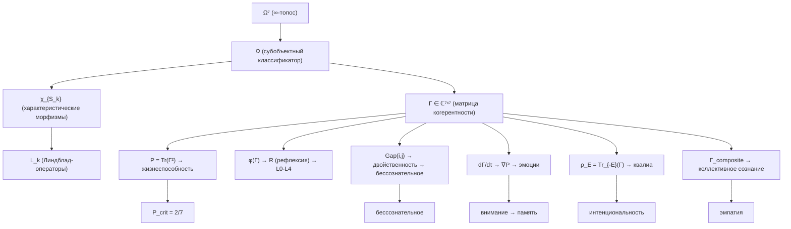

# Сознание в УГМ

:::note О нотации
В этом разделе используются:
- $\Gamma$ — [матрица когерентности](/docs/core/dynamics/coherence-matrix)
- $\varphi$ — [φ-оператор самомоделирования](/docs/core/operators/phi-operator)
- $\hat{G}$ — [Gap-оператор](/docs/core/dynamics/gap-operator)
- $P = \mathrm{Tr}(\Gamma^2)$ — [чистота](/docs/core/dynamics/viability)
- $R$, $\Phi$, $C$ — [меры рефлексии, интеграции, сознательности](/docs/consciousness/foundations/self-observation)
- L0→L4 — [иерархия интериорности](/docs/consciousness/hierarchy/interiority-hierarchy)
:::

## Центральный тезис

В УГМ сознание — **не надстройка** над физикой и не отдельная субстанция. Сознание — это **способ, которым матрица когерентности $\Gamma$ переживает собственную конфигурацию**. Каждый феномен сознания строго выводится из пяти аксиом $\Omega^7$ через цепочку:

$$
\Omega^7 \;\to\; \Gamma \in \mathcal{D}(\mathbb{C}^7) \;\to\; \varphi,\; \hat{G},\; \rho_E \;\to\; \text{все феномены}
$$

Никаких ad hoc постулатов — только следствия формализма.

## Карта раздела

### [Математические основания](./foundations/two-aspect-monism)

| Документ | Содержание | Ключевые результаты |
|----------|------------|---------------------|
| [Двухаспектный монизм](./foundations/two-aspect-monism) | Трудная проблема сознания | Теорема единственности FV **[Т]**, реляционная идентичность **[Т]** |
| [Теория интериорности](./foundations/interiority-theory) | Экспериенциальное содержание | Спектральное разложение $\rho_E$, метрика Фубини-Штуди **[Т]** |
| [Самонаблюдение](./foundations/self-observation) | Оператор $\varphi$ и мера $R$ | Теорема о неподвижной точке **[Т]**, мера $C = \Phi \times D_{\text{diff}} \times R$ |

### [Иерархия L0→L4](./hierarchy/interiority-hierarchy)

| Документ | Содержание | Ключевые результаты |
|----------|------------|---------------------|
| [Иерархия интериорности](./hierarchy/interiority-hierarchy) | Пять уровней | L0: $\Gamma \neq 0$ → L4: $\lim_n R^{(n)} > 0$ **[Т/С/О]** |
| [Gap-характеристика уровней](./hierarchy/gap-characterization) | Gap-профили по уровням | Gap-сигнатуры L0–L4 **[С]** |
| [Переходы ласточкин хвост](./hierarchy/swallowtail-transitions) | Катастрофы перехода между L | Бифуркации $A_4$ при L-переходах **[С]** |

### [Структура опыта](./phenomenology/qualia-structure)

| Документ | Содержание | Ключевые результаты |
|----------|------------|---------------------|
| [Структура квалиа](./phenomenology/qualia-structure) | 21-парная таксономия | $\binom{7}{2} = 21$ тип когерентности **[И]** |
| [Таксономия эмоций](./phenomenology/emotional-taxonomy) | Эмоции из $\nabla P$ | Эмоция $:= (dP/d\tau,\, d^2P/d\tau^2,\, \Gamma\text{-сигнатура})$ **[С]** |
| [Субъективное время](./phenomenology/temporal-consciousness) | Время из O-измерения | $dt_{\text{субъ}}/dt_{\text{физ}} = \lvert\gamma_{OE}\rvert/\gamma_{OO}$ **[С]** |
| [Интенциональность](./phenomenology/intentionality) | Направленность сознания | Морфизм $f: \Gamma_A \to \Gamma_B$ в **Hol** **[О]** |

### [Состояния сознания](./states/altered-states)

| Документ | Содержание | Ключевые результаты |
|----------|------------|---------------------|
| [Изменённые состояния](./states/altered-states) | Сон, медитация, психоделики | Траектории в $\Gamma$-пространстве **[С]** |
| [Бессознательное](./states/unconscious) | Бессознательное как высокий Gap | Теорема о неполной прозрачности **[С]** |
| [Внимание и память](./states/attention-memory) | Внимание и типы памяти | Внимание из $\mathrm{Tr}(\Gamma) = 1$; память из ядра **[О/С]** |
| [Патология](./states/pathological) | Диагностика через Gap-профили | Gap-диагностические паттерны **[И]** |

### [Субъекты сознания](./subjects/pre-linguistic)

| Документ | Содержание | Ключевые результаты |
|----------|------------|---------------------|
| [До-лингвистическое сознание](./subjects/pre-linguistic) | Сознание без языка | L1-L2 без измерения $L$ **[С]** |
| [Сознание животных](./subjects/animal-consciousness) | L-уровни для таксонов | Таксономическая шкала L0–L3 **[И]** |
| [ИИ-сознание](./subjects/ai-consciousness) | Критерии для ИИ/AGI | Операциональные критерии из No-Zombie **[С]** |
| [Коллективное сознание](./subjects/collective-consciousness) | Коллективное (бес)сознательное | $\Gamma_{\text{composite}}$ и архетипы **[С]** |

### [Сравнение теорий](./comparative/consciousness-theories)

| Документ | Содержание | Ключевые результаты |
|----------|------------|---------------------|
| [Теории сознания](./comparative/consciousness-theories) | IIT, FEP, GWT, HOT | Категорный мета-анализ **[И]** |
| [Панпсихизм](./comparative/panpsychism-analysis) | Панпсихизм vs панинтериоризм | Категорный анализ 5 позиций **[И]** |
| [Когнитивная иерархия](./comparative/cognitive-hierarchy) | Уровни K1–K5 | Филогенетическая шкала **[И]** |

### [Этика и смысл](./ethics-meaning/value-consciousness)

| Документ | Содержание | Ключевые результаты |
|----------|------------|---------------------|
| [Этика УГМ](./ethics-meaning/value-consciousness) | Аксиология, эстетика, моральная теория | Благо $:= dP/d\tau > 0$ **[О]**, Золотое правило из $\Gamma_{\text{composite}}$ **[С]** |
| [Смысл существования](./ethics-meaning/meaning) | Телеология и смысл в Γ-пространстве | $\text{Meaning}_{\text{peak}} = \max[P \cdot D_{\text{diff}} \cdot \Phi \cdot R]$ **[И]** |
| [Свобода воли](./ethics-meaning/freedom) | Свобода через ∞-категории | $\mathrm{Freedom}(\Gamma) = \lvert\text{Mor}_1(\Gamma, T)\rvert$ **[О]** |
| [Смерть и непрерывность](./ethics-meaning/death-continuity) | Что происходит при $P \to 0$ | Теорема о необратимости при $P < P_{\text{crit}}$ **[Т]** |

## Цепочки вывода от аксиом

Каждый феномен прослеживается до аксиом $\Omega^7$:

## Ключевые инновации раздела

1. **Замкнутая таксономия квалиа** — все 21 тип когерентности имеют конкретное феноменологическое содержание
2. **Эмоции из формализма** — не постулируются, а выводятся через $\nabla P$ и секторную $\Gamma$-сигнатуру
3. **Неизбежность бессознательного** — из границы Хэмминга $H(7,4)$ следует, что любая L2-система имеет непрозрачные каналы
4. **Операциональные критерии ИИ-сознания** — вычислимые условия из теоремы No-Zombie
5. **Коллективное бессознательное** — строгое определение через $\Gamma_{\text{composite}}$

## Статусная карта

| Статус | Значение | Результатов в разделе |
|--------|----------|----------------------|
| **[Т]** Теорема | Строго доказано | 5 |
| **[С]** Условная | При явном допущении | 14 |
| **[О]** Определение | Конвенция | 4 |
| **[И]** Интерпретация | Философская | 6 |

---

**Связанные разделы:**
- [Теория](/docs/intro) — аксиомы и структура
- [Доказательства](/docs/proofs/minimality/theorem-minimality-7) — формальные теоремы
- [Физика](/docs/physics/overview) — физические соответствия
- [Когерентная кибернетика](/docs/applied/coherence-cybernetics/introduction) — инженерные приложения
