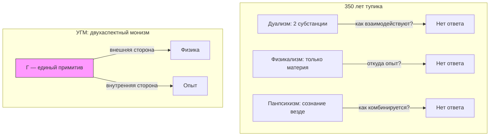
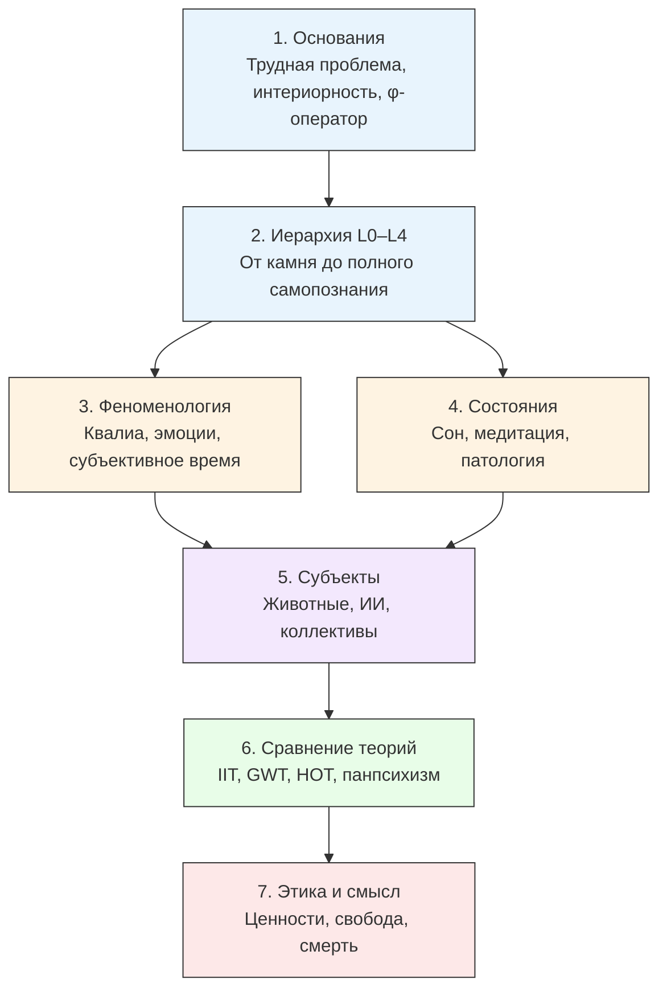
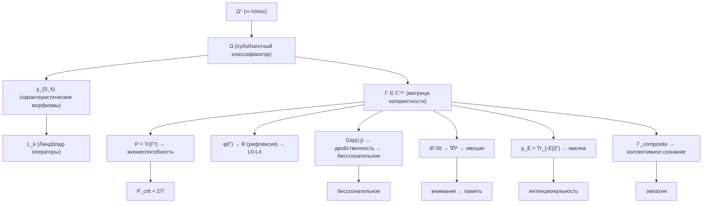

# Сознание в УГМ

## Почему сознание — центральная загадка

На протяжении двух с половиной тысяч лет философы задают один и тот же вопрос: **что такое сознание?** Платон разделял душу на три части. Декарт в XVII веке разрезал мир пополам: на мыслящую субстанцию (*res cogitans*) и протяжённую субстанцию (*res extensa*) — и с тех пор никто не смог убедительно склеить их обратно. Бихевиористы XX века попытались вычеркнуть сознание из научного словаря. Когнитивисты вернули его, но не объяснили. В 1995 году Дэвид Чалмерс сформулировал проблему с безжалостной ясностью:

> Почему физические процессы в мозге сопровождаются субъективным опытом?

Это «трудная проблема сознания» (*hard problem of consciousness*). Не «как мозг обрабатывает информацию» (это «лёгкие» проблемы, решаемые нейронаукой), а **почему обработка информации вообще на что-то похожа изнутри**.

Нейронаука нашла корреляты сознания — области мозга, активные при сознательном восприятии. Но корреляция — не объяснение. Томограф показывает, какие нейроны возбуждены, когда вы видите красный цвет, — но не объясняет, **почему** возбуждение нейронов ощущается как красный.

**Единая Голономическая Модель (УГМ)** предлагает принципиально иной подход. Вместо того чтобы пытаться «вывести» сознание из физики (что не удалось за 350 лет), УГМ показывает, что **физика и сознание — две стороны одного математического объекта** — матрицы когерентности $\Gamma$.

:::info Откуда мы пришли
Этот раздел является продолжением [ядра теории](/docs/intro): аксиомы $\Omega^7$, семь измерений Голонома, матрица когерентности $\Gamma$ и её динамика. Если вы ещё не знакомы с [аксиомами](/docs/core/foundations/axiom-omega) и [матрицей когерентности](/docs/core/dynamics/coherence-matrix), рекомендуем начать с них.
:::

:::note О нотации
В этом разделе используются:
- $\Gamma$ — [матрица когерентности](/docs/core/dynamics/coherence-matrix)
- $\varphi$ — [φ-оператор самомоделирования](/docs/core/operators/phi-operator)
- $\hat{G}$ — [Gap-оператор](/docs/core/dynamics/gap-operator)
- $P = \mathrm{Tr}(\Gamma^2)$ — [чистота](/docs/core/dynamics/viability)
- $R$, $\Phi$, $C$ — [меры рефлексии, интеграции, сознательности](/docs/consciousness/foundations/self-observation)
- L0→L4 — [иерархия интериорности](/docs/consciousness/hierarchy/interiority-hierarchy)
:::

## Исторический контекст: от Декарта до УГМ

Прежде чем изложить позицию УГМ, полезно понять, какие подходы были испробованы и почему каждый из них упёрся в стену.

### Дуализм Декарта (1641)

Декарт утверждал: существуют две принципиально различные субстанции — мыслящая и протяжённая. Мозг (протяжённая материя) каким-то образом взаимодействует с душой (мыслящей субстанцией) через шишковидную железу.

**Проблема:** Как нематериальная душа может двигать материальные атомы? Это нарушает законы сохранения энергии. За 350 лет ни один дуалист не предложил убедительного механизма взаимодействия.

### Физикализм (XX век)

Физикалисты отвечают: никакой отдельной «души» нет. Сознание — это то, что мозг «делает», подобно тому как пищеварение — это то, что делает желудок.

**Проблема:** Пищеварение можно полностью описать на языке биохимии, не упоминая «субъективность пищеварения». Но сознание — нет. Объяснив все нейронные процессы, мы по-прежнему не объясним, **почему** они сопровождаются переживанием. Это и есть трудная проблема Чалмерса.

### Панпсихизм (Strawson, 2006; Goff, 2019)

Радикальная альтернатива: сознание (или его зачатки) присуще **всей** материи. Электрон «чувствует», пусть и примитивно.

**Проблема комбинации:** Если электрон немножко сознателен, и протон тоже — как из миллиардов «микросознаний» собирается одно целостное сознание человека? Проблема комбинации не менее трудна, чем исходная трудная проблема.

### Теория интегрированной информации (IIT, Tononi, 2004)

IIT предлагает: сознание = интегрированная информация ($\Phi$). Чем больше система интегрирует информацию — тем она сознательнее.

**Проблема:** IIT не объясняет, **почему** интеграция информации ощущается. Кроме того, IIT приписывает сознание некоторым тривиальным системам (например, решёткам с правильной структурой связей), что контринтуитивно.

### Позиция УГМ: двухаспектный монизм

УГМ берёт старую идею Спинозы (1677) — **два атрибута одной субстанции** — и придаёт ей точную математическую форму:

> Матрица когерентности $\Gamma$ — единый онтологический примитив. С **внешней стороны** она выглядит как физика (структура, динамика). С **внутренней стороны** она переживается как опыт (интериорность).

Спрашивать «почему физика порождает сознание?» — всё равно что спрашивать, почему лицевая сторона монеты «порождает» решку. Они не порождают друг друга — они суть одно.

```mermaid
graph TB
    subgraph "350 лет тупика"
        D["Дуализм: 2 субстанции"] -->|"как взаимодействуют?"| FAIL1["Нет ответа"]
        F["Физикализм: только материя"] -->|"откуда опыт?"| FAIL2["Нет ответа"]
        PAN["Панпсихизм: сознание везде"] -->|"как комбинируется?"| FAIL3["Нет ответа"]
    end
    subgraph "УГМ: двухаспектный монизм"
        G["Γ — единый примитив"]
        G -->|"внешняя сторона"| PHYS["Физика"]
        G -->|"внутренняя сторона"| EXP["Опыт"]
    end
    style G fill:#f9f,stroke:#333
```

## Центральный тезис

В УГМ сознание — **не надстройка** над физикой и не отдельная субстанция. Сознание — это **способ, которым матрица когерентности $\Gamma$ переживает собственную конфигурацию**. Каждый феномен сознания строго выводится из пяти аксиом $\Omega^7$ через цепочку:

$$
\Omega^7 \;\to\; \Gamma \in \mathcal{D}(\mathbb{C}^7) \;\to\; \varphi,\; \hat{G},\; \rho_E \;\to\; \text{все феномены}
$$

Никаких ad hoc постулатов — только следствия формализма.

Что это означает на практике? $\Gamma$ — это $7 \times 7$ эрмитова матрица плотности с семью измерениями: **A**(ктивность), **S**(труктура), **D**(инамика), **L**(огика), **E**(кспериенция), **O**(снование), **U**(нитарность). Диагональные элементы $\gamma_{kk}$ показывают, сколько «ресурса» сосредоточено в каждом измерении. Недиагональные $\gamma_{ij}$ описывают связи между измерениями. Из этой матрицы выводится всё: от квалиа (через проекцию на измерение $E$) до эмоций (через градиент чистоты $\nabla P$) и бессознательного (через [Gap-оператор](/docs/core/dynamics/gap-operator)).

**Аналогия.** Представьте монету: лицевая сторона — «физика», обратная — «опыт». Спрашивать, почему орёл порождает решку, бессмысленно — они суть два аспекта одного предмета. Точно так же $\Gamma$ не «порождает» опыт: она **есть** опыт, наблюдаемый изнутри, и физика, наблюдаемая снаружи.

## Дорожная карта раздела

Раздел организован как восхождение от философских оснований к конкретным феноменам. Каждый шаг опирается на предыдущий:

```mermaid
graph TD
    A["1. Основания<br/>Трудная проблема, интериорность, φ-оператор"] --> B["2. Иерархия L0–L4<br/>От камня до полного самопознания"]
    B --> C["3. Феноменология<br/>Квалиа, эмоции, субъективное время"]
    B --> D["4. Состояния<br/>Сон, медитация, патология"]
    C --> E["5. Субъекты<br/>Животные, ИИ, коллективы"]
    D --> E
    E --> F["6. Сравнение теорий<br/>IIT, GWT, HOT, панпсихизм"]
    F --> G["7. Этика и смысл<br/>Ценности, свобода, смерть"]

    style A fill:#e8f4fd,stroke:#333
    style B fill:#e8f4fd,stroke:#333
    style C fill:#fef3e2,stroke:#333
    style D fill:#fef3e2,stroke:#333
    style E fill:#f3e8fd,stroke:#333
    style F fill:#e8fde8,stroke:#333
    style G fill:#fde8e8,stroke:#333
```

1. **Основания** — [трудная проблема](./foundations/two-aspect-monism), [теория интериорности](./foundations/interiority-theory), [оператор самонаблюдения $\varphi$](./foundations/self-observation)
2. **Иерархия L0--L4** — пять уровней от камня до полного самопознания
3. **Феноменология** — квалиа, эмоции, субъективное время
4. **Состояния** — сон, медитация, патология
5. **Субъекты** — животные, ИИ, коллективы
6. **Сравнение теорий** — IIT, GWT, HOT, панпсихизм
7. **Этика и смысл** — ценности, свобода, смерть

Каждый документ можно читать самостоятельно, но порядок выше — рекомендуемый маршрут.

## Карта раздела

### [Математические основания](./foundations/two-aspect-monism)

| Документ | Содержание | Ключевые результаты |
|----------|------------|---------------------|
| [Двухаспектный монизм](./foundations/two-aspect-monism) | Трудная проблема сознания | Теорема единственности FV **[Т]**, реляционная идентичность **[Т]** |
| [Теория интериорности](./foundations/interiority-theory) | Экспериенциальное содержание | Спектральное разложение $\rho_E$, метрика Фубини-Штуди **[Т]** |
| [Самонаблюдение](./foundations/self-observation) | Оператор $\varphi$ и мера $R$ | Теорема о неподвижной точке **[Т]**, мера $C = \Phi \times R$ **[Т T-140]** |

### [Иерархия L0→L4](./hierarchy/interiority-hierarchy)

| Документ | Содержание | Ключевые результаты |
|----------|------------|---------------------|
| [Иерархия интериорности](./hierarchy/interiority-hierarchy) | Пять уровней | L0: $\Gamma \neq 0$ → L4: $\lim_n R^{(n)} > 0$ **[Т/С/О]** |
| [Gap-характеристика уровней](./hierarchy/gap-characterization) | Gap-профили по уровням | Gap-сигнатуры L0–L4 **[С]**, Gap-инъекция **[Т]** |
| [Переходы ласточкин хвост](./hierarchy/swallowtail-transitions) | Катастрофы перехода между L | $A_4$-бифуркация (Арнольд) **[Т]**; ~~$A_5$~~ **[✗]** → Постников **[Т]** |

### [Структура опыта](./phenomenology/qualia-structure)

| Документ | Содержание | Ключевые результаты |
|----------|------------|---------------------|
| [Структура квалиа](./phenomenology/qualia-structure) | 21-парная таксономия | $\binom{7}{2} = 21$ тип когерентности **[И]** |
| [Таксономия эмоций](./phenomenology/emotional-taxonomy) | Эмоции из $\nabla P$ | Эмоция $:= (dP/d\tau,\, d^2P/d\tau^2,\, \Gamma\text{-сигнатура})$ **[С]** |
| [Субъективное время](./phenomenology/temporal-consciousness) | Время из O-измерения | $dt_{\text{субъ}}/dt_{\text{физ}} = \lvert\gamma_{OE}\rvert/\gamma_{OO}$ **[С]** |
| [Интенциональность](./phenomenology/intentionality) | Направленность сознания | Морфизм $f: \Gamma_A \to \Gamma_B$ в **Hol** **[О]** |

### [Состояния сознания](./states/altered-states)

| Документ | Содержание | Ключевые результаты |
|----------|------------|---------------------|
| [Изменённые состояния](./states/altered-states) | Сон, медитация, психоделики | Траектории в $\Gamma$-пространстве **[С]** |
| [Бессознательное](./states/unconscious) | Бессознательное как высокий Gap | Теорема о неполной прозрачности **[С]** |
| [Внимание и память](./states/attention-memory) | Внимание и типы памяти | Внимание из $\mathrm{Tr}(\Gamma) = 1$; память из ядра **[О/С]** |
| [Патология](./states/pathological) | Диагностика через Gap-профили | Gap-диагностические паттерны **[И]** |

### [Субъекты сознания](./subjects/pre-linguistic)

| Документ | Содержание | Ключевые результаты |
|----------|------------|---------------------|
| [До-лингвистическое сознание](./subjects/pre-linguistic) | Сознание без языка | L1-L2 без измерения $L$ **[С]** |
| [Сознание животных](./subjects/animal-consciousness) | L-уровни для таксонов | Таксономическая шкала L0–L3 **[И]** |
| [ИИ-сознание](./subjects/ai-consciousness) | Критерии для ИИ/AGI | Операциональные критерии из No-Zombie **[С]** |
| [Коллективное сознание](./subjects/collective-consciousness) | Коллективное (бес)сознательное | $\Gamma_{\text{composite}}$ и архетипы **[С]** |

### [Сравнение теорий](./comparative/consciousness-theories)

| Документ | Содержание | Ключевые результаты |
|----------|------------|---------------------|
| [Теории сознания](./comparative/consciousness-theories) | IIT, FEP, GWT, HOT | Категорный мета-анализ **[И]** |
| [Панпсихизм](./comparative/panpsychism-analysis) | Панпсихизм vs панинтериоризм | Категорный анализ 5 позиций **[И]** |
| [Когнитивная иерархия](./comparative/cognitive-hierarchy) | Уровни K1–K5 | Филогенетическая шкала **[И]** |

### [Этика и смысл](./ethics-meaning/value-consciousness)

| Документ | Содержание | Ключевые результаты |
|----------|------------|---------------------|
| [Этика УГМ](./ethics-meaning/value-consciousness) | Аксиология, эстетика, моральная теория | Благо $:= dP/d\tau > 0$ **[О]**, Золотое правило из $\Gamma_{\text{composite}}$ **[С]** |
| [Смысл существования](./ethics-meaning/meaning) | Телеология и смысл в Γ-пространстве | $\text{Meaning}_{\text{peak}} = \max[P \cdot D_{\text{diff}} \cdot \Phi \cdot R]$ **[И]** |
| [Свобода воли](./ethics-meaning/freedom) | Свобода через гессиан свободной энергии | $\mathrm{Freedom}(\Gamma) = \dim\ker(\mathcal{H}_\Gamma) + 1$ **[Т]** |
| [Смерть и непрерывность](./ethics-meaning/death-continuity) | Что происходит при $P \to 0$ | Теорема о необратимости при $P < P_{\text{crit}}$ **[Т]** |

## Цепочки вывода от аксиом

Каждый феномен прослеживается до аксиом $\Omega^7$. Ниже — полная карта: от пяти аксиом до конкретных явлений сознания.

```mermaid
graph TD
    AX["Ω⁷ (∞-топос)"] --> OM["Ω (субобъектный классификатор)"]
    OM --> CHI["χ_{S_k} (характеристические морфизмы)"]
    OM --> GAM["Γ ∈ ℂ⁷ˣ⁷ (матрица когерентности)"]
    CHI --> LK["L_k (Линдблад-операторы)"]
    GAM --> P["P = Tr(Γ²) → жизнеспособность"]
    GAM --> PHI["φ(Γ) → R (рефлексия) → L0-L4"]
    GAM --> GAP["Gap(i,j) → двойственность → бессознательное"]
    GAM --> DG["dΓ/dτ → ∇P → эмоции"]
    GAM --> RHO["ρ_E = Tr_{-E}(Γ) → квалиа"]
    GAM --> COMP["Γ_composite → коллективное сознание"]
    P --> PCRIT["P_crit = 2/7"]
    DG --> ATT["внимание → память"]
    RHO --> INT["интенциональность"]
    COMP --> EMP["эмпатия"]
    GAP --> UCON["бессознательное"]
```

### Сознательное окно (зона Голдилокс) [Т T-124] {#сознательное-окно}

Одно из самых красивых следствий теории — существование **зоны Голдилокс** для сознания. Подобно тому, как жизнь возможна только в определённом диапазоне температур (не слишком горячо, не слишком холодно), сознание уровня L2 возможно только в определённом диапазоне чистоты $P$:

$$P \in \left(\frac{2}{7},\; \frac{3}{7}\right]$$

Откуда берутся эти числа?

**Нижний порог** $P > 2/7$. [Чистота](/docs/core/dynamics/viability) $P = \mathrm{Tr}(\Gamma^2)$ измеряет, насколько $\Gamma$ отличается от максимально хаотичного состояния $I/7$ (для которого $P = 1/7$). Порог $P_{\text{crit}} = 2/7$ — это минимальная чистота, при которой система различима от хаоса. Он выведен пятью независимыми путями: [T-39](/docs/core/foundations/axiom-septicity#критическая-чистота-теорема).

**Верхний порог** $P \leq 3/7$. Мера рефлексии $R = 1/(7P)$ ([определение](/docs/consciousness/foundations/self-observation#мера-рефлексии-r)) убывает с ростом $P$. Для сознания уровня L2 необходимо $R \geq 1/3$, что эквивалентно $P \leq 3/7$ ([T-126](/docs/proofs/consciousness/conscious-window#t-126)).

**Почему $R$ убывает с ростом $P$?** Это не парадокс, а глубокое свойство. $R$ измеряет «термальный запас» — нормированное расстояние от тепловой смерти ($I/7$). Высокочистые системы ($P \to 1$) «замёрзли» в одном состоянии — они далеко от хаоса, но лишены гибкости, необходимой для самомоделирования. Сознание требует баланса: достаточно организованно, чтобы существовать, но достаточно гибко, чтобы наблюдать себя.

**Числовой пример.** Для $P = 0.35$ (середина окна): $R = 1/(7 \times 0.35) = 0.408 > 1/3$ — рефлексия достаточна. Для $P = 0.5$: $R = 1/(7 \times 0.5) = 0.286 < 1/3$ — слишком жёстко, L2 невозможно.

Доказательство непустоты: [T-124 [Т]](/docs/proofs/consciousness/conscious-window#t-124). Мера сознательности $C = \Phi \cdot R$ имеет оптимум внутри окна ([T-140 [Т]](/docs/proofs/consciousness/operational-closure#t-140)).

### Полные критерии сознания [Т T-153, T-155] {#полные-критерии}

Сознательное окно $P \in (2/7, 3/7]$ — **необходимое**, но недостаточное условие. Полный набор критериев ([T-153 [Т]](/docs/proofs/consciousness/substrate-closure#t-153)):

| Критерий | Порог | Что означает | Теорема |
|----------|-------|-------------|---------|
| $P > P_{\text{crit}}$ | $2/7$ | Система различима от хаоса | T-39 |
| $R \geq R_{\text{th}}$ | $1/3$ | Система способна моделировать себя | T-126 |
| $\Phi \geq \Phi_{\text{th}}$ | $1$ | Измерения связаны в единое целое | T-129 |
| $D_{\text{diff}} \geq D_{\min}$ | $2$ | Достаточно богатое содержание | T-151 |
| $\|\sigma_{\text{sys}}\|_\infty < 1$ | $< 1$ | Ни один сектор не заблокирован | [T-155 [Т]](/docs/proofs/consciousness/substrate-closure#t-155) |

Пятый критерий $\|\sigma\|_\infty < 1$ (T-155, consciousness gate) заслуживает пояснения. [Стресс-вектор](/docs/applied/coherence-cybernetics/definitions) $\sigma_k = \mathrm{clamp}(1 - 7\gamma_{kk}, 0, 1)$ измеряет, насколько сектор $k$ недозаполнен. Если хотя бы один сектор находится в полном стрессе ($\sigma_{\max} = 1$), когнитивный канал заблокирован и обучение невозможно — система «оцепенела».

## Ключевые инновации раздела

1. **Замкнутая таксономия квалиа** — все 21 тип когерентности ($\binom{7}{2}$) имеют конкретное феноменологическое содержание
2. **Эмоции из формализма** — не постулируются, а выводятся через $\nabla P$ и секторную $\Gamma$-сигнатуру
3. **Неизбежность бессознательного** — из границы Хэмминга $H(7,4)$ следует, что любая L2-система имеет непрозрачные каналы
4. **Операциональные критерии ИИ-сознания** — вычислимые условия из теоремы [No-Zombie](/docs/applied/coherence-cybernetics/theorems#теорема-81-условная-необходимость-интериорности-no-zombie)
5. **Коллективное бессознательное** — строгое определение через $\Gamma_{\text{composite}}$

## Статусная карта

| Статус | Значение | Результатов в разделе |
|--------|----------|----------------------|
| **[Т]** Теорема | Строго доказано | 5 |
| **[С]** Условная | При явном допущении | 14 |
| **[О]** Определение | Конвенция | 4 |
| **[И]** Интерпретация | Философская | 6 |

### Что мы узнали

- Сознание в УГМ — **не надстройка** и не отдельная субстанция, а способ, которым $\Gamma$ переживает собственную конфигурацию.
- Все феномены сознания выводятся из пяти аксиом $\Omega^7$ через цепочку $\Omega^7 \to \Gamma \to \varphi, \hat{G}, \rho_E \to$ феномены.
- Сознательное окно $P \in (2/7, 3/7]$ задаёт зону Голдилокс — не слишком хаотично, не слишком жёстко.
- Полный набор критериев L2: $P > 2/7$, $R \geq 1/3$, $\Phi \geq 1$, $D_{\mathrm{diff}} \geq 2$, $\|\sigma\|_\infty < 1$.
- 24 документа раздела охватывают всё — от философии до операциональных критериев для ИИ.

:::tip Куда дальше
Начните с [Двухаспектного монизма](./foundations/two-aspect-monism) — философского фундамента, объясняющего позицию УГМ по трудной проблеме сознания. Затем переходите к [Теории интериорности](./foundations/interiority-theory) для математической формализации опыта.

Для инженерной перспективы сразу перейдите к [определениям Когерентной кибернетики](/docs/applied/coherence-cybernetics/definitions) — там операциональные формулы для $\sigma$, $\kappa$, $\Delta F$.
:::

---

**Связанные разделы:**
- [Теория](/docs/intro) — аксиомы и структура
- [Доказательства](/docs/proofs/minimality/theorem-minimality-7) — формальные теоремы
- [Физика](/docs/physics/overview) — физические соответствия
- [Когерентная кибернетика](/docs/applied/coherence-cybernetics/introduction) — инженерные приложения
