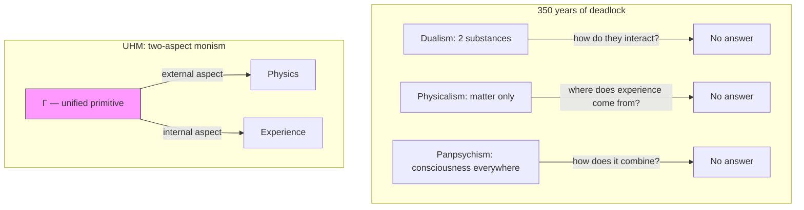
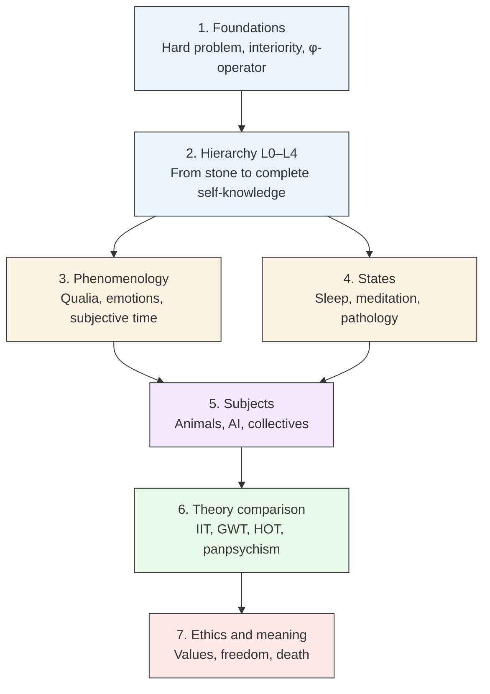
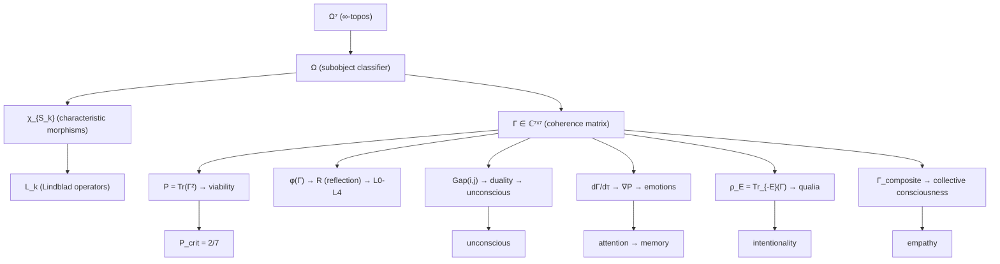

# Consciousness in UHM

## Why Consciousness Is the Central Puzzle

For two and a half thousand years philosophers have been asking the same question: **what is consciousness?** Plato divided the soul into three parts. In the 17th century Descartes split the world in two: into thinking substance (*res cogitans*) and extended substance (*res extensa*) — and since then no one has managed to convincingly glue them back together. 20th-century behaviorists tried to strike consciousness from the scientific vocabulary. Cognitivists brought it back, but did not explain it. In 1995 David Chalmers formulated the problem with ruthless clarity:

> Why are physical processes in the brain accompanied by subjective experience?

This is the "hard problem of consciousness." Not "how does the brain process information" (those are "easy" problems, solvable by neuroscience), but **why information processing feels like something from the inside at all**.

Neuroscience has found correlates of consciousness — brain regions active during conscious perception. But correlation is not explanation. A scanner shows which neurons are excited when you see red — but does not explain **why** neural excitation is experienced as red.

**Unitary Holonomic Monism (UHM)** offers a fundamentally different approach. Instead of trying to "derive" consciousness from physics (which has failed for 350 years), UHM shows that **physics and consciousness are two sides of a single mathematical object** — the coherence matrix $\Gamma$.

:::info Where We Come From
This section is a continuation of the [core theory](/docs/intro): the axioms $\Omega^7$, the seven dimensions of the Holon, the coherence matrix $\Gamma$ and its dynamics. If you are not yet familiar with the [axioms](/docs/core/foundations/axiom-omega) and the [coherence matrix](/docs/core/dynamics/coherence-matrix), we recommend starting with them.
:::

:::note About Notation
This section uses:
- $\Gamma$ — [coherence matrix](/docs/core/dynamics/coherence-matrix)
- $\varphi$ — [φ-self-modeling operator](/docs/core/operators/phi-operator)
- $\hat{G}$ — [Gap operator](/docs/core/dynamics/gap-operator)
- $P = \mathrm{Tr}(\Gamma^2)$ — [purity](/docs/core/dynamics/viability)
- $R$, $\Phi$, $C$ — [measures of reflection, integration, consciousness](/docs/consciousness/foundations/self-observation)
- L0→L4 — [interiority hierarchy](/docs/consciousness/hierarchy/interiority-hierarchy)
:::

## Historical Context: From Descartes to UHM

Before presenting UHM's position, it is useful to understand which approaches have been tried and why each of them hit a wall.

### Cartesian Dualism (1641)

Descartes claimed: there exist two fundamentally different substances — thinking and extended. The brain (extended matter) somehow interacts with the soul (thinking substance) via the pineal gland.

**Problem:** How can an immaterial soul move material atoms? This violates the laws of conservation of energy. In 350 years, not a single dualist has proposed a convincing mechanism of interaction.

### Physicalism (20th century)

Physicalists answer: there is no separate "soul." Consciousness is what the brain "does," just as digestion is what the stomach does.

**Problem:** Digestion can be fully described in the language of biochemistry, without mentioning the "subjectivity of digestion." But consciousness cannot. Having explained all neural processes, we still do not explain **why** they are accompanied by experience. This is Chalmers's hard problem.

### Panpsychism (Strawson, 2006; Goff, 2019)

A radical alternative: consciousness (or its rudiments) is inherent in **all** matter. An electron "feels," however primitively.

**Combination problem:** If an electron is slightly conscious, and a proton is too — how does one unified human consciousness assemble from billions of "micro-consciousnesses"? The combination problem is no less difficult than the original hard problem.

### Integrated Information Theory (IIT, Tononi, 2004)

IIT proposes: consciousness = integrated information ($\Phi$). The more a system integrates information, the more conscious it is.

**Problem:** IIT does not explain **why** information integration feels like something. Moreover, IIT attributes consciousness to some trivial systems (e.g., grids with the right connectivity structure), which is counterintuitive.

### UHM's Position: Two-Aspect Monism

UHM takes Spinoza's old idea (1677) — **two attributes of one substance** — and gives it a precise mathematical form:

> The coherence matrix $\Gamma$ is a unified ontological primitive. From the **external side** it appears as physics (structure, dynamics). From the **internal side** it is experienced as experience (interiority).

To ask "why does physics give rise to consciousness?" is like asking why the obverse of a coin "gives rise" to the reverse. They do not give rise to each other — they are one.

**Why is Spinoza the closest predecessor?** Of all philosophers, Spinoza most precisely anticipated the structure of UHM: single substance (E1P14) → $\Gamma$; *ordo et connexio* (E2P7) → functor $F$; conatus (E3P6) → $\mathcal{R}$; three kinds of knowledge (E5P25–28) → levels L1/L2/L3; necessitas (E1P33) → primitivity of $\mathcal{L}_0$ (T-39a). What Spinoza lacked was formalism: category theory, quantum mechanics, and computability. UHM provides precisely this formalism, turning a 17th-century philosophical program into a testable mathematical theory. A detailed analysis is in the sections [two-aspect monism](/docs/consciousness/foundations/two-aspect-monism) and [Spinozian structure](/docs/consciousness/ethics-meaning/value-consciousness#спинозианская-структура).

```mermaid
graph TB
    subgraph "350 years of deadlock"
        D["Dualism: 2 substances"] -->|"how do they interact?"| FAIL1["No answer"]
        F["Physicalism: matter only"] -->|"where does experience come from?"| FAIL2["No answer"]
        PAN["Panpsychism: consciousness everywhere"] -->|"how does it combine?"| FAIL3["No answer"]
    end
    subgraph "UHM: two-aspect monism"
        G["Γ — unified primitive"]
        G -->|"external aspect"| PHYS["Physics"]
        G -->|"internal aspect"| EXP["Experience"]
    end
    style G fill:#f9f,stroke:#333
```

## Central Thesis

In UHM, consciousness is **not a superstructure** over physics and not a separate substance. Consciousness is the **way the coherence matrix $\Gamma$ experiences its own configuration**. Every phenomenon of consciousness is strictly derived from the five axioms $\Omega^7$ via the chain:

$$
\Omega^7 \;\to\; \Gamma \in \mathcal{D}(\mathbb{C}^7) \;\to\; \varphi,\; \hat{G},\; \rho_E \;\to\; \text{all phenomena}
$$

No ad hoc postulates — only consequences of the formalism.

What does this mean in practice? $\Gamma$ is a $7 \times 7$ Hermitian density matrix with seven dimensions: **A**(rticulation), **S**(tructure), **D**(ynamics), **L**(ogic), **E**(xperience), **O**(ground), **U**(nity). The diagonal elements $\gamma_{kk}$ show how much "resource" is concentrated in each dimension. The off-diagonal $\gamma_{ij}$ describe connections between dimensions. Everything is derived from this matrix: from qualia (via projection onto dimension $E$) to emotions (via the purity gradient $\nabla P$) and the unconscious (via the [Gap operator](/docs/core/dynamics/gap-operator)).

**Analogy.** Imagine a coin: the obverse is "physics," the reverse is "experience." To ask why heads "gives rise to" tails is meaningless — they are two aspects of one object. Likewise, $\Gamma$ does not "give rise to" experience: it **is** experience, observed from within, and physics, observed from without.

## Section Roadmap

The section is organized as an ascent from philosophical foundations to concrete phenomena. Each step rests on the previous one:

```mermaid
graph TD
    A["1. Foundations<br/>Hard problem, interiority, φ-operator"] --> B["2. Hierarchy L0–L4<br/>From stone to complete self-knowledge"]
    B --> C["3. Phenomenology<br/>Qualia, emotions, subjective time"]
    B --> D["4. States<br/>Sleep, meditation, pathology"]
    C --> E["5. Subjects<br/>Animals, AI, collectives"]
    D --> E
    E --> F["6. Theory comparison<br/>IIT, GWT, HOT, panpsychism"]
    F --> G["7. Ethics and meaning<br/>Values, freedom, death"]

    style A fill:#e8f4fd,stroke:#333
    style B fill:#e8f4fd,stroke:#333
    style C fill:#fef3e2,stroke:#333
    style D fill:#fef3e2,stroke:#333
    style E fill:#f3e8fd,stroke:#333
    style F fill:#e8fde8,stroke:#333
    style G fill:#fde8e8,stroke:#333
```

1. **Foundations** — [hard problem](./foundations/two-aspect-monism), [interiority theory](./foundations/interiority-theory), [self-observation operator $\varphi$](./foundations/self-observation)
2. **Hierarchy L0--L4** — five levels from stone to complete self-knowledge
3. **Phenomenology** — qualia, emotions, subjective time
4. **States** — sleep, meditation, pathology
5. **Subjects** — animals, AI, collectives
6. **Theory comparison** — IIT, GWT, HOT, panpsychism
7. **Ethics and meaning** — values, freedom, death

Each document can be read independently, but the order above is the recommended route.

## Section Map

### [Mathematical Foundations](./foundations/two-aspect-monism)

| Document | Content | Key results |
|----------|---------|-------------|
| [Two-aspect monism](./foundations/two-aspect-monism) | Hard problem of consciousness | FV uniqueness theorem **[T]**, relational identity **[T]** |
| [Interiority theory](./foundations/interiority-theory) | Experiential content | Spectral decomposition of $\rho_E$, Fubini-Study metric **[T]** |
| [Self-observation](./foundations/self-observation) | Operator $\varphi$ and measure $R$ | Fixed-point theorem **[T]**, measure $C = \Phi \times R$ **[T T-140]** |

### [Hierarchy L0→L4](./hierarchy/interiority-hierarchy)

| Document | Content | Key results |
|----------|---------|-------------|
| [Interiority hierarchy](./hierarchy/interiority-hierarchy) | Five levels | L0: $\Gamma \neq 0$ → L4: $\lim_n R^{(n)} > 0$ **[T/C/D]** |
| [Gap characterization of levels](./hierarchy/gap-characterization) | Gap profiles by level | Gap signatures L0–L4 **[C]**, Gap injection **[T]** |
| [Swallowtail transitions](./hierarchy/swallowtail-transitions) | Transition catastrophes between L levels | $A_4$-bifurcation (Arnold) **[T]**; Postnikov **[T]** |

### [Structure of Experience](./phenomenology/qualia-structure)

| Document | Content | Key results |
|----------|---------|-------------|
| [Qualia structure](./phenomenology/qualia-structure) | 21-pair taxonomy | $\binom{7}{2} = 21$ coherence types **[I]** |
| [Emotional taxonomy](./phenomenology/emotional-taxonomy) | Emotions from $\nabla P$ | Emotion $:= (dP/d\tau,\, d^2P/d\tau^2,\, \Gamma\text{-signature})$ **[C]** |
| [Temporal consciousness](./phenomenology/temporal-consciousness) | Time from O-dimension | $dt_{\text{subj}}/dt_{\text{phys}} = \lvert\gamma_{OE}\rvert/\gamma_{OO}$ **[C]** |
| [Intentionality](./phenomenology/intentionality) | Directionality of consciousness | Morphism $f: \Gamma_A \to \Gamma_B$ in **Hol** **[D]** |

### [States of Consciousness](./states/altered-states)

| Document | Content | Key results |
|----------|---------|-------------|
| [Altered states](./states/altered-states) | Sleep, meditation, psychedelics | Trajectories in $\Gamma$-space **[C]** |
| [Unconscious](./states/unconscious) | Unconscious as high Gap | Theorem on incomplete transparency **[C]** |
| [Attention and memory](./states/attention-memory) | Attention and memory types | Attention from $\mathrm{Tr}(\Gamma) = 1$; memory from kernel **[D/C]** |
| [Pathology](./states/pathological) | Diagnostics via Gap profiles | Gap diagnostic patterns **[I]** |

### [Subjects of Consciousness](./subjects/pre-linguistic)

| Document | Content | Key results |
|----------|---------|-------------|
| [Pre-linguistic consciousness](./subjects/pre-linguistic) | Consciousness without language | L1-L2 without dimension $L$ **[C]** |
| [Animal consciousness](./subjects/animal-consciousness) | L-levels for taxa | Taxonomic scale L0–L3 **[I]** |
| [AI consciousness](./subjects/ai-consciousness) | Criteria for AI/AGI | Operational criteria from No-Zombie **[C]** |
| [Collective consciousness](./subjects/collective-consciousness) | Collective (un)conscious | $\Gamma_{\text{composite}}$ and archetypes **[C]** |

### [Theory Comparison](./comparative/consciousness-theories)

| Document | Content | Key results |
|----------|---------|-------------|
| [Theories of consciousness](./comparative/consciousness-theories) | IIT, FEP, GWT, HOT | Categorical meta-analysis **[I]** |
| [Panpsychism](./comparative/panpsychism-analysis) | Panpsychism vs pan-interiority | Categorical analysis of 5 positions **[I]** |
| [Cognitive hierarchy](./comparative/cognitive-hierarchy) | K1–K5 levels | Phylogenetic scale **[I]** |

### [Ethics and Meaning](./ethics-meaning/value-consciousness)

| Document | Content | Key results |
|----------|---------|-------------|
| [UHM ethics](./ethics-meaning/value-consciousness) | Axiology, aesthetics, moral theory | Good $:= dP/d\tau > 0$ **[D]**, Golden Rule from $\Gamma_{\text{composite}}$ **[C]** |
| [Meaning of existence](./ethics-meaning/meaning) | Teleology and meaning in Γ-space | $\text{Meaning}_{\text{peak}} = \max[P \cdot D_{\text{diff}} \cdot \Phi \cdot R]$ **[I]** |
| [Freedom of will](./ethics-meaning/freedom) | Freedom via the Hessian of free energy | $\mathrm{Freedom}(\Gamma) = \dim\ker(\mathcal{H}_\Gamma) + 1$ **[T]** |
| [Death and continuity](./ethics-meaning/death-continuity) | What happens as $P \to 0$ | Theorem on irreversibility at $P < P_{\text{crit}}$ **[T]** |

## Derivation Chains from Axioms

Every phenomenon is traced back to the axioms $\Omega^7$. Below is the complete map: from five axioms to specific consciousness phenomena.

```mermaid
graph TD
    AX["Ω⁷ (∞-topos)"] --> OM["Ω (subobject classifier)"]
    OM --> CHI["χ_{S_k} (characteristic morphisms)"]
    OM --> GAM["Γ ∈ ℂ⁷ˣ⁷ (coherence matrix)"]
    CHI --> LK["L_k (Lindblad operators)"]
    GAM --> P["P = Tr(Γ²) → viability"]
    GAM --> PHI["φ(Γ) → R (reflection) → L0-L4"]
    GAM --> GAP["Gap(i,j) → duality → unconscious"]
    GAM --> DG["dΓ/dτ → ∇P → emotions"]
    GAM --> RHO["ρ_E = Tr_{-E}(Γ) → qualia"]
    GAM --> COMP["Γ_composite → collective consciousness"]
    P --> PCRIT["P_crit = 2/7"]
    DG --> ATT["attention → memory"]
    RHO --> INT["intentionality"]
    COMP --> EMP["empathy"]
    GAP --> UCON["unconscious"]
```

### Conscious Window (Goldilocks Zone) [T T-124] {#сознательное-окно}

One of the most elegant consequences of the theory is the existence of a **Goldilocks zone** for consciousness. Just as life is possible only within a certain temperature range (not too hot, not too cold), L2-level consciousness is possible only within a certain range of purity $P$:

$$P \in \left(\frac{2}{7},\; \frac{3}{7}\right]$$

Where do these numbers come from?

**Lower threshold** $P > 2/7$. [Purity](/docs/core/dynamics/viability) $P = \mathrm{Tr}(\Gamma^2)$ measures how much $\Gamma$ differs from the maximally chaotic state $I/7$ (for which $P = 1/7$). The threshold $P_{\text{crit}} = 2/7$ is the minimal purity at which a system is distinguishable from chaos. It is derived via five independent routes: [T-39](/docs/core/foundations/axiom-septicity#критическая-чистота-теорема).

**Upper threshold** $P \leq 3/7$. The reflection measure $R = 1/(7P)$ ([definition](/docs/consciousness/foundations/self-observation#мера-рефлексии-r)) decreases as $P$ grows. For L2-level consciousness, $R \geq 1/3$ is required, which is equivalent to $P \leq 3/7$ ([T-126](/docs/proofs/consciousness/conscious-window#t-126)).

**Why does $R$ decrease as $P$ grows?** This is not a paradox, but a deep property. $R$ measures the "thermal reserve" — the normalized distance from thermal death ($I/7$). High-purity systems ($P \to 1$) are "frozen" in one state — they are far from chaos, but lack the flexibility needed for self-modeling. Consciousness requires balance: organized enough to exist, but flexible enough to observe itself.

**Numerical example.** For $P = 0.35$ (midpoint of the window): $R = 1/(7 \times 0.35) = 0.408 > 1/3$ — reflection is sufficient. For $P = 0.5$: $R = 1/(7 \times 0.5) = 0.286 < 1/3$ — too rigid, L2 is impossible.

Non-emptiness proof: [T-124 [T]](/docs/proofs/consciousness/conscious-window#t-124). The consciousness measure $C = \Phi \cdot R$ has its optimum inside the window ([T-140 [T]](/docs/proofs/consciousness/operational-closure#t-140)).

### Complete Consciousness Criteria [T T-153, T-155] {#полные-критерии}

The conscious window $P \in (2/7, 3/7]$ is a **necessary** but not sufficient condition. The full set of criteria ([T-153 [T]](/docs/proofs/consciousness/substrate-closure#t-153)):

| Criterion | Threshold | Meaning | Theorem |
|-----------|-----------|---------|---------|
| $P > P_{\text{crit}}$ | $2/7$ | System is distinguishable from chaos | T-39 |
| $R \geq R_{\text{th}}$ | $1/3$ | System is capable of modeling itself | T-126 |
| $\Phi \geq \Phi_{\text{th}}$ | $1$ | Dimensions are connected into a unified whole | T-129 |
| $D_{\text{diff}} \geq D_{\min}$ | $2$ | Sufficiently rich content | T-151 |
| $\|\sigma_{\text{sys}}\|_\infty < 1$ | $< 1$ | No sector is blocked | [T-155 [T]](/docs/proofs/consciousness/substrate-closure#t-155) |

The fifth criterion $\|\sigma\|_\infty < 1$ (T-155, consciousness gate) deserves explanation. The [stress vector](/docs/applied/coherence-cybernetics/definitions) $\sigma_k = \mathrm{clamp}(1 - 7\gamma_{kk}, 0, 1)$ measures how much sector $k$ is underpopulated. If even one sector is in full stress ($\sigma_{\max} = 1$), the cognitive channel is blocked and learning is impossible — the system has "frozen."

## Section Roadmap (24 Documents)

The section is organized into 7 subsections, each revealing a specific aspect of consciousness:

### Foundations (foundations/)

| # | Document | Topic | Key result |
|---|----------|-------|------------|
| 1 | [Two-aspect monism](./foundations/two-aspect-monism) | Philosophical foundation | Hard problem — a category error |
| 2 | [Interiority theory](./foundations/interiority-theory) | Mathematical formalization | E-dimension and $\rho_E$ |
| 3 | [Self-observation](./foundations/self-observation) | Operators $\varphi$, $R$, $C$ | L2 thresholds: $R \geq 1/3$, $\Phi \geq 1$ |
| 4 | [Learning](/docs/applied/coherence-cybernetics/learning-bounds) | Learning bounds | T-109 — T-113 [T] |

### Hierarchy (hierarchy/)

| # | Document | Topic | Key result |
|---|----------|-------|------------|
| 5 | [Interiority hierarchy](./hierarchy/interiority-hierarchy) | Levels L0→L4 | Formal definitions of 5 levels |
| 6 | [Gap characterization](./hierarchy/gap-characterization) | Gap at each level | Quantitative profiles |
| 7 | [Depth tower](./hierarchy/depth-tower) | SAD and recursion | SAD_MAX = 3 [C] |

### Phenomenology (phenomenology/)

| # | Document | Topic | Key result |
|---|----------|-------|------------|
| 8 | [Qualia structure](./phenomenology/qualia-structure) | 21 types of qualia | Taxonomy from Fano geometry |
| 9 | [Intentionality](./phenomenology/intentionality) | Directionality of consciousness | Morphisms in Exp |
| 10 | [Emotional taxonomy](./phenomenology/emotional-taxonomy) | Emotions from $\nabla P$ | 7 basic + 21 composite emotions |
| 11 | [Temporal consciousness](./phenomenology/temporal-consciousness) | Consciousness time | Chronon and subjective duration |
| 12 | [Attention and memory](./states/attention-memory) | Cognitive mechanisms | Sectoral $\Gamma$-signature |
| 13 | [Pre-linguistic](./subjects/pre-linguistic) | Pre-linguistic experience | L1 structures |

### States (states/)

| # | Document | Topic | Key result |
|---|----------|-------|------------|
| 14 | [Altered states](./states/altered-states) | ASC, meditation, psychedelics | Gap profiles of ASC |
| 15 | [Unconscious](./states/unconscious) | Opaque channels | Hamming bound H(7,4) |
| 16 | [Pathology](./states/pathological) | Consciousness disorders | Dissociation, coma, delirium |
| 17 | [Swallowtail](./hierarchy/swallowtail-transitions) | Phase transitions | Thom catastrophe |

### Subjects (subjects/)

| # | Document | Topic | Key result |
|---|----------|-------|------------|
| 18 | [AI consciousness](./subjects/ai-consciousness) | Criteria for AI | No-Zombie theorem |
| 19 | [Animal consciousness](./subjects/animal-consciousness) | Animal consciousness | Threshold by species |
| 20 | [Collective consciousness](./subjects/collective-consciousness) | Groups, swarms, networks | $\Gamma_{\text{composite}}$ |

### Comparative Analysis (comparative/)

| # | Document | Topic | Key result |
|---|----------|-------|------------|
| 21 | [36 theories of consciousness](./comparative/consciousness-theories) | Meta-analysis | UHM vs IIT, GNW, HOT, PWT, etc. |
| 22 | [Panpsychism](./comparative/panpsychism-analysis) | Critical analysis | Solution to the combination problem |
| 23 | [Cognitive hierarchy](./comparative/cognitive-hierarchy) | K1–K5 levels | Operationalization |

### Ethics and Meaning (ethics-meaning/)

| # | Document | Topic | Key result |
|---|----------|-------|------------|
| 24 | [Value and freedom](./ethics-meaning/value-consciousness) | Ethics of consciousness | Freedom = dim ker(H) + 1 |

## Key Innovations of the Section

1. **Closed taxonomy of qualia** — all 21 coherence types ($\binom{7}{2}$) have specific phenomenological content
2. **Emotions from formalism** — not postulated, but derived via $\nabla P$ and the sectoral $\Gamma$-signature
3. **Inevitability of the unconscious** — from the Hamming bound $H(7,4)$ it follows that any L2-system has opaque channels
4. **Operational criteria for AI consciousness** — computable conditions from the [No-Zombie](/docs/applied/coherence-cybernetics/theorems#теорема-81-условная-необходимость-интериорности-no-zombie) theorem
5. **Collective unconscious** — rigorous definition via $\Gamma_{\text{composite}}$

## Status Map

| Status | Meaning | Results in section |
|--------|---------|-------------------|
| **[T]** Theorem | Strictly proven | 5 |
| **[C]** Conditional | Under explicit assumption | 14 |
| **[D]** Definition | Convention | 4 |
| **[I]** Interpretation | Philosophical | 6 |

### What We Learned

- Consciousness in UHM is **not a superstructure** and not a separate substance, but the way in which $\Gamma$ experiences its own configuration.
- All consciousness phenomena are derived from the five axioms $\Omega^7$ via the chain $\Omega^7 \to \Gamma \to \varphi, \hat{G}, \rho_E \to$ phenomena.
- The conscious window $P \in (2/7, 3/7]$ defines the Goldilocks zone — not too chaotic, not too rigid.
- Full set of L2 criteria: $P > 2/7$, $R \geq 1/3$, $\Phi \geq 1$, $D_{\mathrm{diff}} \geq 2$, $\|\sigma\|_\infty < 1$.
- The section's 24 documents cover everything — from philosophy to operational criteria for AI.

:::tip Where to Go Next
Start with [Two-Aspect Monism](./foundations/two-aspect-monism) — the philosophical foundation explaining UHM's position on the hard problem of consciousness. Then proceed to [Interiority Theory](./foundations/interiority-theory) for the mathematical formalization of experience.

For an engineering perspective, go directly to [Coherence Cybernetics definitions](/docs/applied/coherence-cybernetics/definitions) — operational formulas for $\sigma$, $\kappa$, $\Delta F$ are there.
:::

---

**Related sections:**
- [Theory](/docs/intro) — axioms and structure
- [Proofs](/docs/proofs/minimality/theorem-minimality-7) — formal theorems
- [Physics](/docs/physics/overview) — physical correspondences
- [Coherence Cybernetics](/docs/applied/coherence-cybernetics/introduction) — engineering applications
