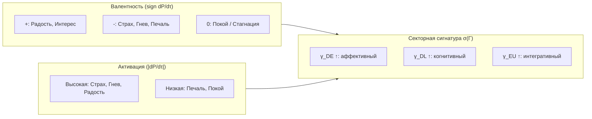

# Таксономия Эмоций из $\nabla P$

:::note О нотации
- $P = \mathrm{Tr}(\Gamma^2)$ — [чистота (жизнеспособность)](/docs/core/dynamics/viability#определение-чистоты)
- $P_{\text{crit}} = 2/7$ — [критическая чистота](/docs/core/dynamics/viability#критическая-чистота), статус **[Т]**
- $\Gamma$ — [матрица когерентности](/docs/core/dynamics/coherence-matrix), $\gamma_{ij}$ — её элементы
- $\tau$ — [внутреннее (эмерджентное) время](/docs/core/operators/emergent-time)
- $R$ — [мера рефлексии](/docs/consciousness/foundations/self-observation#мера-рефлексии-r)
- $\mathrm{Gap}(i,j)$ — [мера зазора](/docs/core/dynamics/coherence-matrix#мера-зазора)
- Полная таблица нотации — в [Нотации](/docs/reference/notation)
:::

## Мотивация

Эмоции в УГМ — не примитивы и не эпифеномены. Они **выводятся** из динамики [жизнеспособности](/docs/core/dynamics/viability) $P(\tau)$ и секторной структуры [матрицы когерентности](/docs/core/dynamics/coherence-matrix) $\Gamma(\tau)$. Эмоция — это «интериорная проекция» изменения состояния системы.

## Определение эмоции (О.1) {#определение-эмоции}

:::tip Определение О.1 (Эмоция) [О]
**Эмоция** — тройка, характеризующая текущую динамику жизнеспособности и секторный профиль когерентности:

$$
\mathrm{Emotion}(\Gamma, \tau) := \left(\frac{dP}{d\tau},\; \frac{d^2P}{d\tau^2},\; \sigma(\Gamma)\right)
$$

где:
- $\frac{dP}{d\tau} = \frac{d}{d\tau}\mathrm{Tr}(\Gamma^2)$ — скорость изменения жизнеспособности
- $\frac{d^2P}{d\tau^2}$ — ускорение изменения жизнеспособности
- $\sigma(\Gamma) = \{\gamma_{ii}, |\gamma_{ij}|\}$ — секторная Γ-сигнатура (набор населённостей и модулей когерентностей)
:::

### Производная чистоты

Скорость изменения чистоты вычисляется через [уравнение эволюции](/docs/core/dynamics/evolution):

$$
\frac{dP}{d\tau} = 2\,\mathrm{Tr}\!\left(\Gamma \cdot \frac{d\Gamma}{d\tau}\right) = 2\,\mathrm{Tr}\!\left(\Gamma \cdot \mathcal{L}_\Omega[\Gamma]\right)
$$

где $\mathcal{L}_\Omega[\Gamma] = -i[H_{\text{eff}}, \Gamma] + \mathcal{D}_\Omega[\Gamma] + \mathcal{R}[\Gamma, E]$ — логический Лиувиллиан.

**Вклады трёх членов:**

| Член | Вклад в $dP/d\tau$ | Интерпретация |
|------|---------------------|---------------|
| $-i[H_{\text{eff}}, \Gamma]$ | $0$ (унитарная часть) | Не меняет чистоту |
| $\mathcal{D}_\Omega[\Gamma]$ | $\leq 0$ (декогеренция) | Потеря жизнеспособности |
| $\mathcal{R}[\Gamma, E]$ | $\geq 0$ (регенерация) | Восстановление жизнеспособности |

Таким образом:

$$
\frac{dP}{d\tau} = \underbrace{2\,\mathrm{Tr}(\Gamma \cdot \mathcal{D}_\Omega[\Gamma])}_{\leq 0,\;\text{декогеренция}} + \underbrace{2\,\mathrm{Tr}(\Gamma \cdot \mathcal{R}[\Gamma, E])}_{\geq 0,\;\text{регенерация}}
$$

## Базовые аффективные координаты (С.1) {#базовые-координаты}

:::tip Утверждение С.1 (Базовые аффективные координаты) [С]
**Условие:** Определение О.1 корректно определяет эмоциональный профиль; интерпретация $dP/d\tau$ как «сигнала жизнеспособности» — семантический постулат.

**Валентность** и **активация** определяются как:

$$
\mathrm{Valence}(\tau) := \mathrm{sign}\!\left(\frac{dP}{d\tau}\right) \in \{-1, 0, +1\}
$$

$$
\mathrm{Arousal}(\tau) := \left|\frac{dP}{d\tau}\right| \geq 0
$$

Положительная валентность ($dP/d\tau > 0$) соответствует «позитивным» эмоциям (жизнеспособность растёт). Отрицательная — «негативным» (жизнеспособность убывает).
:::

Координаты $(V, A)$ определяют положение в **аффективном пространстве Рассела** (circumplex model), которое в УГМ получает формальное обоснование.

## Карта базовых эмоций {#карта-эмоций}

Базовые эмоции — характерные области в пространстве $\left(\frac{dP}{d\tau}, \frac{d^2P}{d\tau^2}, \sigma(\Gamma)\right)$.

### Таблица базовых эмоций

| Эмоция | Условие на $dP/d\tau$ | Условие на $d^2P/d\tau^2$ | Секторная сигнатура | Интерпретация |
|--------|----------------------|--------------------------|---------------------|---------------|
| **Страх** | $< 0$, приближение к $P_{\text{crit}}$ | $< 0$ или $\approx 0$ | $\gamma_{DD}$ ↑, $\gamma_{DE}$ ↑ | Угроза жизнеспособности детектирована |
| **Радость** | $> 0$, удаление от $P_{\text{crit}}$ | $\geq 0$ | $\gamma_{EU}$ ↑, $\gamma_{SE}$ ↑ | Жизнеспособность нарастает |
| **Гнев** | $< 0$ | $\approx 0$ | $\gamma_{DD}$ ↑↑, $\gamma_{LL}$ ↓ | Высокая динамика без логической когерентности |
| **Удивление** | любой | $\left\lvert d^2P/d\tau^2\right\rvert \gg 0$ | Резкое $\delta\sigma$ | Внезапное изменение скорости |
| **Печаль** | $\approx 0$, $P$ низкое | $\approx 0$ | $\gamma_{DU}$ ↓, $\gamma_{EO}$ ↓ | Стагнация при низкой жизнеспособности |
| **Отвращение** | $< 0$ | — | $\mathrm{Gap}(S,E)$ ↑↑ | Резкое расхождение структуры и опыта |

### Фазовая диаграмма эмоций

## Страх: формальный анализ {#страх}

Страх — наиболее «фундаментальная» эмоция в УГМ, поскольку она непосредственно связана с угрозой существования.

$$
\text{Страх:} \quad \frac{dP}{d\tau} < 0, \quad P(\tau) \to P_{\text{crit}} = \frac{2}{7}
$$

Интенсивность страха:

$$
I_{\text{страх}} \propto \frac{|dP/d\tau|}{P - P_{\text{crit}}}
$$

При $P \to P_{\text{crit}}$ интенсивность расходится — система «переживает» экзистенциальную угрозу. Если $P$ пересекает $P_{\text{crit}}$ — начинается необратимая декогеренция (смерть системы).

:::warning Условность количественных оценок [С]
Конкретная формула $I_{\text{страх}} \propto |dP/d\tau| / (P - P_{\text{crit}})$ — **условное утверждение**. Форма расходимости при $P \to P_{\text{crit}}$ зависит от деталей регенеративного члена $\mathcal{R}[\Gamma, E]$ и диссипатора $\mathcal{D}_\Omega[\Gamma]$.
:::

## Сложные эмоции как суперпозиции {#сложные-эмоции}

Сложные эмоции возникают при одновременной активации нескольких секторов:

| Сложная эмоция | Базовые компоненты | Секторная характеристика |
|----------------|-------------------|--------------------------|
| **Тревога** | Страх + Удивление | $dP/d\tau < 0$, $\lvert d^2P/d\tau^2\rvert$ нестабильно |
| **Благоговение** | Радость + Удивление | $dP/d\tau > 0$, $\gamma_{EO}$ ↑, $\gamma_{OU}$ ↑ |
| **Ностальгия** | Радость + Печаль | $dP/d\tau \approx 0$, высокая $\gamma_{SE}$ при $\gamma_{SD}$ ↓ |
| **Вдохновение** | Радость + Удивление + Гнев | $dP/d\tau > 0$, $\gamma_{DO}$ ↑, $\gamma_{AE}$ ↑, $\gamma_{DD}$ ↑ |

## Условия рефлексивного доступа к эмоциям {#рефлексивный-доступ}

:::tip Утверждение С.2 (Порог эмоциональной рефлексии) [С]
**Условие:** Порог $R_{\text{th}} = 1/3$ — теорема [Т] ($K = 3$ из [триадной декомпозиции](/docs/core/operators/lindblad-operators#триадная-декомпозиция)).

Рефлексивный доступ к собственным эмоциям (способность «осознать, что я чувствую страх») требует уровня L2:

$$
R(\Gamma) \geq R_{\text{th}} = \frac{1}{3}
$$

При $R < R_{\text{th}}$ эмоции **переживаются**, но не **рефлексируются**. Система действует «эмоционально», но не имеет модели собственных эмоций.
:::

Это объясняет различие между эмоциональным поведением (L1) и эмоциональным самосознанием (L2). Подробнее — в [иерархии интериорности](/docs/consciousness/hierarchy/interiority-hierarchy).

## Эволюционный смысл {#эволюционный-смысл}

Связь эмоций с $dP/d\tau$ имеет прямой эволюционный смысл:

- **Негативные эмоции** ($dP/d\tau < 0$) сигнализируют о потере когерентности → мотивируют активное противодействие
- **Позитивные эмоции** ($dP/d\tau > 0$) сигнализируют о нарастании когерентности → подкрепляют текущее поведение
- **Удивление** ($|d^2P/d\tau^2| \gg 0$) сигнализирует о непредсказуемости → переключает внимание

В терминах [уравнения эволюции](/docs/core/dynamics/evolution), эмоции — это «интериорная проекция» баланса между декогеренцией $\mathcal{D}_\Omega$ и регенерацией $\mathcal{R}$.

## Связи

- [Жизнеспособность](/docs/core/dynamics/viability) — каноническое определение $P$ и $P_{\text{crit}}$
- [Уравнение эволюции](/docs/core/dynamics/evolution) — динамика $\Gamma(\tau)$ и логический Лиувиллиан $\mathcal{L}_\Omega$
- [Иерархия интериорности](/docs/consciousness/hierarchy/interiority-hierarchy) — уровни L0–L4, условия для L2
- [Структура квалиа](/docs/consciousness/phenomenology/qualia-structure) — 21-парная таксономия и $\gamma_{DE}$ как «аффекция»
- [Gap-семантика](/docs/physics/dual-aspect/gap-semantics) — Gap(S,E) и фазовая диагностика
