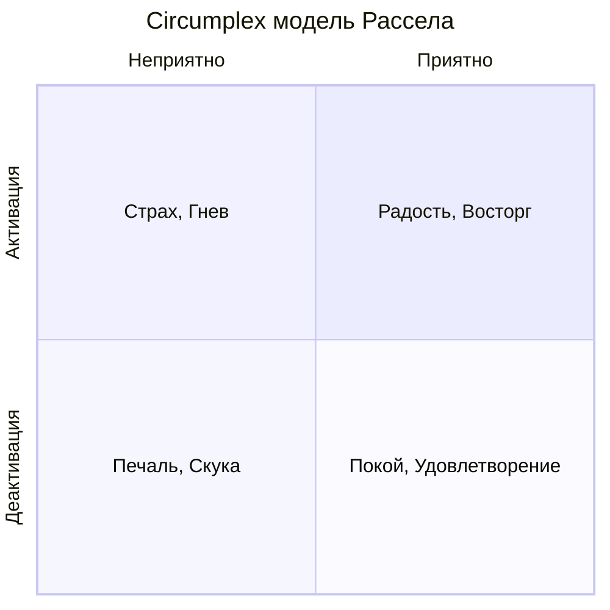
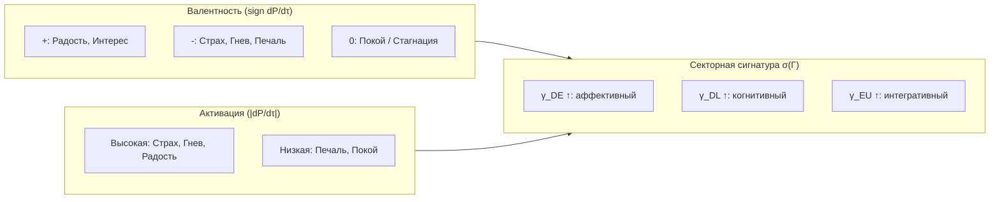

# Таксономия Эмоций из $\nabla P$

:::info Мост из предыдущей главы
В [Структуре квалиа](/docs/consciousness/phenomenology/qualia-structure) мы установили, что 21 когерентность $\gamma_{ij}$ исчерпывает все типы переживаний. Среди них особую роль играет $\gamma_{DE}$ (Аффекция) — связь Динамики и Интериорности, переживание «эмоции». Теперь мы покажем, что **все** эмоции выводятся из одной величины — скорости изменения жизнеспособности $dP/d\tau$ — и секторной сигнатуры $\sigma(\Gamma)$. Эмоции не постулируются, а **вычисляются**.
:::

:::note О нотации
- $P = \mathrm{Tr}(\Gamma^2)$ — [чистота (жизнеспособность)](/docs/core/dynamics/viability#определение-чистоты)
- $P_{\text{crit}} = 2/7$ — [критическая чистота](/docs/core/dynamics/viability#критическая-чистота), статус **[Т]**
- $\Gamma$ — [матрица когерентности](/docs/core/dynamics/coherence-matrix), $\gamma_{ij}$ — её элементы
- $\tau$ — [внутреннее (эмерджентное) время](/docs/core/operators/emergent-time)
- $R$ — [мера рефлексии](/docs/consciousness/foundations/self-observation#мера-рефлексии-r)
- $\mathrm{Gap}(i,j)$ — [мера зазора](/docs/core/dynamics/coherence-matrix#мера-зазора)
- Полная таблица нотации — в [Нотации](/docs/reference/notation)
:::

### Дорожная карта главы

1. **История проблемы** — от Дарвина до Рассела и Фельдман Барретт
2. **Мотивация: почему $dP/d\tau$** — эволюционная логика
3. **Определение эмоции** — тройка $(dP/d\tau,\; d^2P/d\tau^2,\; \sigma(\Gamma))$
4. **Базовые координаты** — валентность и активация как проекции $dP/d\tau$
5. **Карта базовых эмоций** — страх, радость, гнев, удивление, печаль, отвращение
6. **Страх: формальный анализ** — расходимость при $P \to P_{\text{crit}}$
7. **Сложные эмоции** — суперпозиции базовых паттернов
8. **Сравнение с другими таксономиями** — Экман, Рассел, Плутчик
9. **Условия рефлексивного доступа** — порог осознания собственных эмоций
10. **Эволюционный смысл** — зачем нужен $dP/d\tau$ как внутренний сигнал

---

## История проблемы: как понимали эмоции до УГМ {#история}

### Дарвин (1872): универсальность выражения

**Чарлз Дарвин** в книге «Выражение эмоций у человека и животных» (1872) впервые показал, что эмоции — не культурная условность, а **биологический феномен**: улыбка радости и гримаса страха узнаваемы у всех народов и даже у приматов. Дарвин поставил вопрос: если эмоции универсальны, значит они выполняют какую-то **функцию** для выживания. Какую?

### Джеймс-Ланге (1884): тело первично

**Уильям Джеймс** (1884) и **Карл Ланге** (независимо) предложили радикальную идею: мы не плачем, потому что грустим — мы грустим, потому что плачем. Эмоция — это *восприятие* телесных изменений. Вы видите медведя, ваше тело реагирует (сердцебиение, пот), и лишь затем вы ощущаете «страх».

### Кэннон-Бард (1927): мозг первичен

**Уолтер Кэннон** возразил: телесные реакции слишком медленны и неспецифичны, чтобы объяснить быстрые и разнообразные эмоции. Мозг (таламус) одновременно порождает и телесную реакцию, и субъективное переживание.

### Шахтер-Зингер (1962): когнитивная оценка

**Стэнли Шахтер** и **Джером Зингер** показали, что одно и то же физиологическое возбуждение может восприниматься как радость или гнев — в зависимости от **когнитивной оценки** ситуации. Эмоция = возбуждение + интерпретация.

### Экман (1971): шесть базовых эмоций

**Пол Экман** выделил **6 базовых эмоций**, распознаваемых по выражению лица во всех культурах: **радость, печаль, страх, гнев, удивление, отвращение**. Каждой соответствует уникальный паттерн мимики.

### Рассел (1980): circumplex model

**Джеймс Рассел** предложил **круговую модель** (circumplex): все эмоции располагаются на плоскости с двумя осями — **валентность** (приятно/неприятно) и **возбуждение** (активация/деактивация). Радость — высокая валентность, высокое возбуждение. Печаль — низкая валентность, низкое возбуждение. Модель Рассела показала, что «базовые эмоции» Экмана — не фундаментальные кирпичики, а области в непрерывном двумерном пространстве.

```mermaid
quadrantChart
    title Circumplex модель Рассела
    x-axis Неприятно --> Приятно
    y-axis Деактивация --> Активация
    quadrant-1 "Радость, Восторг"
    quadrant-2 "Страх, Гнев"
    quadrant-3 "Печаль, Скука"
    quadrant-4 "Покой, Удовлетворение"
```

### Фельдман Барретт (2017): конструируемые эмоции

**Лиза Фельдман Барретт** в книге «How Emotions Are Made» (2017) аргументировала, что эмоции **конструируются** мозгом, а не «обнаруживаются» в теле. Нет фиксированных «центров страха» или «центров радости» — мозг активно создаёт эмоциональные категории на основе прошлого опыта и текущего контекста.

### Позиция УГМ: эмоции из $\nabla P$

УГМ синтезирует эти подходы:

- **Дарвин прав:** эмоции универсальны, потому что связаны с *жизнеспособностью* $P$ — фундаментальной величиной для любой когерентной системы
- **Джеймс-Ланге частично прав:** эмоция действительно связана с телесной динамикой (компонент $\sigma(\Gamma)$)
- **Рассел прав:** эмоции образуют непрерывное пространство (валентность = $\mathrm{sign}(dP/d\tau)$, возбуждение = $|dP/d\tau|$)
- **Фельдман Барретт частично права:** конкретные *названия* эмоций — культурные конструкты, но лежащие за ними *паттерны $dP/d\tau$ и $\sigma(\Gamma)$* — объективны
- **УГМ добавляет:** полная модель — не 2D (Рассел), а **30D** (T-147 [Т])

---

## Мотивация: почему эмоции связаны с $dP/d\tau$ {#мотивация-dp}

Эмоции в УГМ — не примитивы и не эпифеномены. Они **выводятся** из динамики [жизнеспособности](/docs/core/dynamics/viability) $P(\tau)$ и секторной структуры [матрицы когерентности](/docs/core/dynamics/coherence-matrix) $\Gamma(\tau)$.

Почему именно $dP/d\tau$? Потому что $P$ — это **единственная скалярная величина**, от которой зависит выживание системы. Если $P > P_{\text{crit}} = 2/7$ — система жива (когерентна). Если $P < P_{\text{crit}}$ — система необратимо декогерирует (умирает). Следовательно, любой «датчик выживания» должен отслеживать именно $P$.

Но для эффективной навигации недостаточно знать текущее значение $P$ — нужна **скорость изменения** $dP/d\tau$:
- $dP/d\tau > 0$ — дела улучшаются, текущее поведение работает, продолжай
- $dP/d\tau < 0$ — дела ухудшаются, нужно что-то менять, действуй
- $dP/d\tau \approx 0$ — стабильность, можно расслабиться (или застрял и нужна перемена)

Это и есть **валентность** — знак производной жизнеспособности. Эмоция — «интериорная проекция» изменения состояния системы.

**Аналогия из повседневной жизни.** Представьте термометр здоровья. Когда температура (жизнеспособность $P$) растёт — вы чувствуете себя лучше (положительные эмоции). Когда падает — хуже (отрицательные). Но эмоция — не просто «хорошо/плохо»: важно, *какой именно орган* (сектор) меняется и *с какой скоростью*. Головная боль и боль в животе — обе «плохо» ($dP/d\tau < 0$), но переживаются по-разному из-за разной секторной сигнатуры.

## Определение эмоции (О.1) {#определение-эмоции}

:::tip Определение О.1 (Эмоция) [О]
**Эмоция** — тройка, характеризующая текущую динамику жизнеспособности и секторный профиль когерентности:

$$
\mathrm{Emotion}(\Gamma, \tau) := \left(\frac{dP}{d\tau},\; \frac{d^2P}{d\tau^2},\; \sigma(\Gamma)\right)
$$

где:
- $\frac{dP}{d\tau} = \frac{d}{d\tau}\mathrm{Tr}(\Gamma^2)$ — скорость изменения жизнеспособности
- $\frac{d^2P}{d\tau^2}$ — ускорение изменения жизнеспособности
- $\sigma(\Gamma) = \{\gamma_{ii}, |\gamma_{ij}|\}$ — секторная Γ-сигнатура (набор населённостей и модулей когерентностей)
:::

Разберём каждый компонент:

1. **$dP/d\tau$** — первая производная. Определяет валентность (хорошо/плохо) и интенсивность (сильно/слабо). Это «основной сигнал».

2. **$d^2P/d\tau^2$** — вторая производная. Определяет *тренд*: ситуация улучшается ($d^2P/d\tau^2 > 0$) или ухудшается ($d^2P/d\tau^2 < 0$)? Именно вторая производная отличает «надежду» ($dP/d\tau < 0$, но $d^2P/d\tau^2 > 0$: плохо, но улучшается) от «отчаяния» ($dP/d\tau < 0$, $d^2P/d\tau^2 < 0$: плохо и становится хуже).

3. **$\sigma(\Gamma)$** — секторная сигнатура. Определяет *качественный* характер эмоции: какие измерения вовлечены? Страх ($\gamma_{DD}$ высока) и печаль ($\gamma_{DU}$ низка) оба имеют $dP/d\tau < 0$, но переживаются совершенно по-разному.

### Производная чистоты: откуда берётся $dP/d\tau$

Скорость изменения чистоты вычисляется через [уравнение эволюции](/docs/core/dynamics/evolution):

$$
\frac{dP}{d\tau} = 2\,\mathrm{Tr}\!\left(\Gamma \cdot \frac{d\Gamma}{d\tau}\right) = 2\,\mathrm{Tr}\!\left(\Gamma \cdot \mathcal{L}_\Omega[\Gamma]\right)
$$

где $\mathcal{L}_\Omega[\Gamma] = -i[H_{\text{eff}}, \Gamma] + \mathcal{D}_\Omega[\Gamma] + \mathcal{R}[\Gamma, E]$ — логический Лиувиллиан.

Разберём вклад каждого члена:

**Вклады трёх членов:**

| Член | Вклад в $dP/d\tau$ | Почему? | Интерпретация |
|------|---------------------|---------|---------------|
| $-i[H_{\text{eff}}, \Gamma]$ | $0$ (унитарная часть) | $\mathrm{Tr}(\Gamma[H,\Gamma]) = 0$ для любого эрмитова $H$ | Когерентная эволюция не меняет чистоту |
| $\mathcal{D}_\Omega[\Gamma]$ | $\leq 0$ (декогеренция) | Взаимодействие со средой разрушает когерентность | Потеря жизнеспособности |
| $\mathcal{R}[\Gamma, E]$ | $\geq 0$ (регенерация) | Восстановление когерентности из среды | Восстановление жизнеспособности |

Таким образом:

$$
\frac{dP}{d\tau} = \underbrace{2\,\mathrm{Tr}(\Gamma \cdot \mathcal{D}_\Omega[\Gamma])}_{\leq 0,\;\text{декогеренция}} + \underbrace{2\,\mathrm{Tr}(\Gamma \cdot \mathcal{R}[\Gamma, E])}_{\geq 0,\;\text{регенерация}}
$$

**Числовой пример.** Пусть система в зоне Голдилокс: $P = 0.35$ (выше $P_{\text{crit}} = 2/7 \approx 0.286$). Декогеренция вносит $-0.02$ за такт, регенерация $+0.015$. Итого $dP/d\tau = -0.005$ — медленное убывание, что переживается как лёгкая тревога. Если регенерация усиливается до $+0.03$, то $dP/d\tau = +0.01$ — переживание облегчения, улучшения. Баланс между этими двумя членами и есть «эмоциональное самочувствие» системы.

## Базовые аффективные координаты (С.1) {#базовые-координаты}

:::tip Утверждение С.1 (Базовые аффективные координаты) [С]
**Условие:** Определение О.1 корректно определяет эмоциональный профиль; интерпретация $dP/d\tau$ как «сигнала жизнеспособности» — семантический постулат.

**Валентность** и **активация** определяются как:

$$
\mathrm{Valence}(\tau) := \mathrm{sign}\!\left(\frac{dP}{d\tau}\right) \in \{-1, 0, +1\}
$$

$$
\mathrm{Arousal}(\tau) := \left|\frac{dP}{d\tau}\right| \geq 0
$$

Положительная валентность ($dP/d\tau > 0$) соответствует «позитивным» эмоциям (жизнеспособность растёт). Отрицательная — «негативным» (жизнеспособность убывает).
:::

Координаты $(V, A)$ определяют положение в **аффективном пространстве Рассела** (circumplex model), которое в УГМ получает формальное обоснование.

**Аналогия.** Валентность — стрелка компаса: показывает, в какую сторону «дует ветер» жизнеспособности (к лучшему или к худшему). Активация — сила ветра. Штиль ($A \approx 0$) — спокойствие или стагнация. Шторм ($A \gg 0$) — интенсивное переживание (радость или ужас). Но компас и сила ветра ещё не описывают погоду целиком — нужна секторная сигнатура $\sigma(\Gamma)$, чтобы отличить грозу от метели.

## Карта базовых эмоций {#карта-эмоций}

Базовые эмоции — характерные области в пространстве $\left(\frac{dP}{d\tau}, \frac{d^2P}{d\tau^2}, \sigma(\Gamma)\right)$.

### Таблица базовых эмоций

:::warning Эпистемическое разделение
**Математический слой [Т]:** 30D-эмоциональное пространство (T-147 [Т]): $\mathbf{e}(\Gamma) \in \mathbb{R}^{30}$ — формально определённый вектор из скоростей, ускорений и стрессов. Валентность $\mathrm{sign}(dP/d\tau)$ — вычислимая величина [Т].

**Семантический слой [И]:** Отождествление конкретных паттернов 30D-вектора с названиями эмоций (страх, радость, гнев...) — интерпретация [И]. Реальные эмоции значительно сложнее одномерной проекции $dP/d\tau$. Таблица ниже — эвристическая, а не строго выведенная.
:::

| Эмоция | Условие на $dP/d\tau$ | Условие на $d^2P/d\tau^2$ | Секторная сигнатура | Интерпретация |
|--------|----------------------|--------------------------|---------------------|---------------|
| **Страх** | $< 0$, приближение к $P_{\text{crit}}$ | $< 0$ или $\approx 0$ | $\gamma_{DD}$ ↑, $\gamma_{DE}$ ↑ | Угроза жизнеспособности детектирована |
| **Радость** | $> 0$, удаление от $P_{\text{crit}}$ | $\geq 0$ | $\gamma_{EU}$ ↑, $\gamma_{SE}$ ↑ | Жизнеспособность нарастает |
| **Гнев** | $< 0$ | $\approx 0$ | $\gamma_{DD}$ ↑↑, $\gamma_{LL}$ ↓ | Высокая динамика без логической когерентности |
| **Удивление** | любой | $\left\lvert d^2P/d\tau^2\right\rvert \gg 0$ | Резкое $\delta\sigma$ | Внезапное изменение скорости |
| **Печаль** | $\approx 0$, $P$ низкое | $\approx 0$ | $\gamma_{DU}$ ↓, $\gamma_{EO}$ ↓ | Стагнация при низкой жизнеспособности |
| **Отвращение** | $< 0$ | — | $\mathrm{Gap}(S,E)$ ↑↑ | Резкое расхождение структуры и опыта |

### Подробные числовые примеры для каждой базовой эмоции {#числовые-примеры}

Для каждой эмоции приведём конкретный $\Gamma$-профиль. Жизненная ситуация, значения ключевых параметров и интерпретация.

#### Радость

**Ситуация:** студент узнал, что сдал трудный экзамен.

| Параметр | Значение | Пояснение |
|----------|----------|-----------|
| $P$ | $0.38$ | Выше $P_{\text{crit}} = 0.286$, в безопасной зоне |
| $dP/d\tau$ | $+0.025$ | Жизнеспособность быстро растёт |
| $d^2P/d\tau^2$ | $+0.008$ | Рост ускоряется |
| $\gamma_{EU}$ | $0.28$ (высокая) | Синтез — переживание единства, «всё складывается» |
| $\gamma_{SE}$ | $0.22$ (высокая) | Репрезентация — целостная картина «я справился» |
| $\gamma_{DD}$ | $0.12$ (нормальная) | Динамика не доминирует — действовать не нужно |

Валентность: $+1$. Активация: $0.025$ (высокая). Секторная сигнатура указывает на интегративный паттерн (синтез + репрезентация).

#### Страх

**Ситуация:** человек идёт по тёмному переулку и слышит шаги за спиной.

| Параметр | Значение | Пояснение |
|----------|----------|-----------|
| $P$ | $0.31$ | Опасно близко к $P_{\text{crit}} = 0.286$ |
| $dP/d\tau$ | $-0.020$ | Быстрое падение жизнеспособности |
| $d^2P/d\tau^2$ | $-0.008$ | Падение ускоряется |
| $\gamma_{DD}$ | $0.22$ (высокая) | Динамика доминирует — тело готово к действию |
| $\gamma_{DE}$ | $0.25$ (высокая) | Аффекция — процесс сильно действует на переживание |
| $\gamma_{LE}$ | $0.05$ (низкая) | Логика отключена — «думать некогда» |

Валентность: $-1$. Активация: $0.020$ (высокая). Секторная сигнатура указывает на динамический/аффективный паттерн.

#### Гнев

**Ситуация:** водитель подрезан на дороге.

| Параметр | Значение | Пояснение |
|----------|----------|-----------|
| $P$ | $0.34$ | Не критично, но жизнеспособность снижается |
| $dP/d\tau$ | $-0.015$ | Умеренное падение |
| $d^2P/d\tau^2$ | $\approx 0$ | Стабильное падение без тренда |
| $\gamma_{DD}$ | $0.25$ (очень высокая) | Динамика максимальна — энергия для действия |
| $\gamma_{LL}$ | $0.05$ (низкая) | Логика подавлена — «не до рассуждений» |
| $\gamma_{DU}$ | $0.18$ (высокая) | Телеология — направленное действие, «я хочу ответить» |

Ключевое отличие от страха: при гневе $\gamma_{DD}$ ещё выше, а $\gamma_{LL}$ ещё ниже. Энергия направлена *наружу* ($\gamma_{DU}$), а не *внутрь* ($\gamma_{DE}$).

#### Удивление

**Ситуация:** неожиданная встреча со старым другом.

| Параметр | Значение | Пояснение |
|----------|----------|-----------|
| $P$ | $0.36$ | Нормальное значение |
| $dP/d\tau$ | $+0.005$ (до) $\to +0.030$ (после) | Резкий скачок |
| $d^2P/d\tau^2$ | $+0.050$ (очень высокое) | Именно ускорение делает удивление |
| $\delta\sigma$ | Резкое изменение | Секторная сигнатура скачкообразно перестраивается |

Удивление определяется прежде всего **второй производной**: не столько «хорошо» или «плохо», сколько «внезапно». Это единственная базовая эмоция, валентность которой может быть любой.

#### Печаль

**Ситуация:** человек вспоминает утраченного друга.

| Параметр | Значение | Пояснение |
|----------|----------|-----------|
| $P$ | $0.30$ | Низкое, но выше $P_{\text{crit}}$ |
| $dP/d\tau$ | $\approx 0$ | Жизнеспособность не меняется — стагнация |
| $d^2P/d\tau^2$ | $\approx 0$ | Нет тренда |
| $\gamma_{DU}$ | $0.03$ (очень низкая) | Телеология отсутствует — «нет цели, некуда идти» |
| $\gamma_{EO}$ | $0.04$ (низкая) | Имманентность ослаблена — «пустота внутри» |
| $\gamma_{SE}$ | $0.20$ (высокая) | Репрезентация — «помню его ясно» |

Печаль отличается от страха: при страхе $P$ активно падает, при печали — застыла на низком уровне. Нет ни угрозы, ни надежды — только тихая стагнация.

#### Отвращение

**Ситуация:** человек видит испорченную еду.

| Параметр | Значение | Пояснение |
|----------|----------|-----------|
| $P$ | $0.33$ | Нормальное |
| $dP/d\tau$ | $-0.010$ | Умеренное падение |
| $d^2P/d\tau^2$ | $-0.003$ | Слабый отрицательный тренд |
| $\mathrm{Gap}(S,E)$ | $0.85$ (очень высокий) | Резкое расхождение структуры и опыта |
| $\gamma_{AD}$ | $0.18$ (высокая) | Актуализация — «восприятие сфокусировано» |

Ключевая особенность отвращения: высокий $\mathrm{Gap}(S,E)$. Это означает, что *структура объекта* (испорченная еда как физическая форма) резко расходится с *переживанием* (отторжение). Gap — мера «неправильности», «несовпадения того, что видишь, с тем, что должно быть».

### Фазовая диаграмма эмоций

```mermaid
graph LR
    subgraph Валентность["Валентность (sign dP/dτ)"]
        direction TB
        Pos["+: Радость, Интерес"]
        Neg["-: Страх, Гнев, Печаль"]
        Zero["0: Покой / Стагнация"]
    end
    subgraph Активация["Активация (|dP/dτ|)"]
        direction TB
        High["Высокая: Страх, Гнев, Радость"]
        Low["Низкая: Печаль, Покой"]
    end
    subgraph Секторы["Секторная сигнатура σ(Γ)"]
        direction TB
        DE["γ_DE ↑: аффективный"]
        DL["γ_DL ↑: когнитивный"]
        EU["γ_EU ↑: интегративный"]
    end
    Валентность --> Секторы
    Активация --> Секторы
```

## Страх: формальный анализ {#страх}

Страх — наиболее «фундаментальная» эмоция в УГМ, поскольку она непосредственно связана с угрозой существования. Рассмотрим его подробно.

### Условия возникновения

$$
\text{Страх:} \quad \frac{dP}{d\tau} < 0, \quad P(\tau) \to P_{\text{crit}} = \frac{2}{7}
$$

### Интенсивность страха

Интенсивность страха определяется не только скоростью падения $|dP/d\tau|$, но и **близостью к порогу**:

$$
I_{\text{страх}} \propto \frac{|dP/d\tau|}{P - P_{\text{crit}}}
$$

Почему именно такая формула? Потому что одно и то же $dP/d\tau = -0.01$ переживается совершенно по-разному при $P = 0.40$ (далеко от порога, запас $0.114$) и при $P = 0.29$ (рядом с порогом, запас $0.004$). При $P \to P_{\text{crit}}$ интенсивность **расходится** — система «переживает» экзистенциальную угрозу. Если $P$ пересекает $P_{\text{crit}}$ — начинается необратимая декогеренция (смерть системы).

:::warning Условность количественных оценок [С]
Конкретная формула $I_{\text{страх}} \propto |dP/d\tau| / (P - P_{\text{crit}})$ — **условное утверждение**. Форма расходимости при $P \to P_{\text{crit}}$ зависит от деталей регенеративного члена $\mathcal{R}[\Gamma, E]$ и диссипатора $\mathcal{D}_\Omega[\Gamma]$.
:::

### Числовой пример: нарастание страха

Покажем, как интенсивность растёт по мере приближения к порогу при фиксированной скорости $dP/d\tau = -0.01$:

| $P$ | $P - P_{\text{crit}}$ | $I_{\text{страх}} \propto$ | Субъективное переживание |
|-----|----------------------|---------------------------|--------------------------|
| $0.40$ | $0.114$ | $0.01/0.114 \approx 0.09$ | Лёгкий дискомфорт: «что-то не так» |
| $0.35$ | $0.064$ | $0.01/0.064 \approx 0.16$ | Беспокойство: «нужно что-то предпринять» |
| $0.32$ | $0.034$ | $0.01/0.034 \approx 0.29$ | Тревога: «ситуация ухудшается» |
| $0.30$ | $0.014$ | $0.01/0.014 \approx 0.71$ | Выраженный страх: «опасность реальна» |
| $0.29$ | $0.004$ | $0.01/0.004 \approx 2.50$ | Паника: «я на грани» |

Одна и та же скорость снижения $dP/d\tau = -0.01$ переживается всё интенсивнее по мере приближения к порогу — эффект, хорошо знакомый каждому, кто когда-либо ожидал результатов медицинского обследования: за неделю до — лёгкая тревога; за час — сильное волнение; в момент открытия конверта — паника.

## Сложные эмоции как суперпозиции {#сложные-эмоции}

Базовые эмоции — это *области* в 30D-пространстве эмоций. Но большинство реальных эмоций — не «чистые» базовые, а **суперпозиции** нескольких паттернов. Подобно тому, как в квантовой механике состояние может быть суперпозицией базисных состояний, эмоция может совмещать несколько базовых паттернов одновременно.

| Сложная эмоция | Базовые компоненты | Секторная характеристика | Жизненный пример |
|----------------|-------------------|--------------------------|------------------|
| **Тревога** | Страх + Удивление | $dP/d\tau < 0$, $\lvert d^2P/d\tau^2\rvert$ нестабильно | Ожидание результатов анализов |
| **Благоговение** | Радость + Удивление | $dP/d\tau > 0$, $\gamma_{EO}$ ↑, $\gamma_{OU}$ ↑ | Вид на горы с вершины |
| **Ностальгия** | Радость + Печаль | $dP/d\tau \approx 0$, высокая $\gamma_{SE}$ при $\gamma_{SD}$ ↓ | Воспоминание о детстве |
| **Вдохновение** | Радость + Удивление + Гнев | $dP/d\tau > 0$, $\gamma_{DO}$ ↑, $\gamma_{AE}$ ↑, $\gamma_{DD}$ ↑ | Начало творческого проекта |
| **Стыд** | Печаль + Страх + Гнев (на себя) | $dP/d\tau < 0$, $R$ высокая, $\gamma_{LE}$ ↑ | Осознание своей ошибки |
| **Умиление** | Радость + Печаль (слабая) | $dP/d\tau > 0$, $\gamma_{EO}$ ↑, $\gamma_{SE}$ ↑ | Наблюдение за ребёнком |

**Числовой пример: ностальгия.** Человек смотрит фотографии из юности.

| Параметр | Значение | Компонент |
|----------|----------|-----------|
| $dP/d\tau$ | $+0.002$ | Слабо положительный (приятное воспоминание) |
| $\gamma_{SE}$ | $0.25$ | Высокая Репрезентация — «ясно помню» |
| $\gamma_{SD}$ | $0.03$ | Низкая Персистенция — «этого больше нет» |
| $\gamma_{EU}$ | $0.15$ | Средний Синтез — «это было частью моей жизни» |

Ностальгия — это одновременно $dP/d\tau > 0$ (радость воспоминания) и $\gamma_{SD} \approx 0$ (осознание невозвратимости). Два противоположных сигнала создают уникальный «горько-сладкий» вкус.

**Аналогия.** Базовые эмоции — как основные цвета (красный, синий, жёлтый). Сложные эмоции — смешанные цвета: ностальгия — сиреневый (радость + печаль), благоговение — золотой (радость + удивление + глубина). 30D-эмоциональное пространство (T-147 [Т]) позволяет описать весь «спектр» эмоций, а не только именованные цвета. Подробности — в [теоремах КК](/docs/applied/coherence-cybernetics/theorems).

## Сравнение с другими таксономиями {#сравнение}

Как соотносится таксономия УГМ с классическими моделями эмоций?

| Модель | Число базовых | Структура | Механизм | Статус в УГМ |
|--------|:---:|-----------|----------|--------------|
| **Экман** (1971) | 6 | Дискретные категории | Лицевая экспрессия | 6 областей в 30D-пространстве [И] |
| **Рассел** (1980) | 2 оси | Непрерывный circumplex | Валентность + возбуждение | Проекция на $(V, A)$ = $(\mathrm{sign}(dP/d\tau), |dP/d\tau|)$ [Т] |
| **Плутчик** (1980) | 8 | Колесо с интенсивностью | Эволюционные функции | 8 областей, интенсивность = $|dP/d\tau|/(P - P_{\text{crit}})$ [И] |
| **Фельдман Барретт** (2017) | 0 (конструируемые) | Нет базовых | Предиктивное кодирование | $\sigma(\Gamma)$ — «конструкция», $(dP/d\tau)$ — «аффективный корень» [С] |
| **УГМ** | 30D | Непрерывное пространство | $dP/d\tau + \sigma(\Gamma)$ | Полная модель T-147 [Т] |

Главное отличие УГМ от всех предшествующих моделей: эмоция — не **примитив** (как у Экмана), не чисто **телесная** (как у Джеймса), не чисто **когнитивная** (как у Шахтера), а **производная величина** — она вычисляется из динамики единственной фундаментальной переменной $P$, обогащённой секторной информацией $\sigma(\Gamma)$.

## Условия рефлексивного доступа к эмоциям {#рефлексивный-доступ}

:::tip Утверждение С.2 (Порог эмоциональной рефлексии) [С]
**Условие:** Порог $R_{\text{th}} = 1/3$ — теорема [Т] ($K = 3$ из [триадной декомпозиции](/docs/core/operators/lindblad-operators#триадная-декомпозиция)).

Рефлексивный доступ к собственным эмоциям (способность «осознать, что я чувствую страх») требует уровня L2:

$$
R(\Gamma) \geq R_{\text{th}} = \frac{1}{3}
$$

При $R < R_{\text{th}}$ эмоции **переживаются**, но не **рефлексируются**. Система действует «эмоционально», но не имеет модели собственных эмоций.
:::

### Различие между переживанием и осознанием

Это различие фундаментально и часто путается в обыденном языке:

| | Переживание эмоции (L1) | Осознание эмоции (L2) |
|---|---|---|
| **Условие** | $\gamma_{DE} \neq 0$ | $R \geq 1/3$, $\Phi \geq 1$ |
| **Пример** | Собака скулит от страха | Человек говорит «я боюсь» |
| **Поведение** | Автоматическая реакция | Осознанный выбор реакции |
| **Словесное описание** | Невозможно | Возможно |
| **Управление** | Только рефлекторное | Рефлексивное (в принципе) |

Это объясняет различие между эмоциональным поведением (L1) и эмоциональным самосознанием (L2). Подробнее — в [иерархии интериорности](/docs/consciousness/hierarchy/interiority-hierarchy).

**Аналогия.** Собака испытывает страх ($dP/d\tau < 0$ при приближении $P$ к $P_{\text{crit}}$) — это L1, эмоциональное поведение: она убегает. Человек тоже испытывает страх, но сверх того **знает**, что испытывает страх ($R \geq 1/3$, уровень L2): «Я боюсь, и я замечаю, что боюсь». Это различие имеет практическое значение для [патологии сознания](/docs/consciousness/states/pathological#алекситимия): при алекситимии ($\mathrm{Gap}(L,E) \to 1$) эмоции переживаются, но не осознаются — формально L2, но с «заблокированным» каналом рефлексии.

## Эволюционный смысл {#эволюционный-смысл}

Связь эмоций с $dP/d\tau$ имеет прямой эволюционный смысл. Вернёмся к Дарвину: эмоции универсальны, потому что выполняют **функцию выживания**. В терминах УГМ эта функция — мониторинг жизнеспособности:

| Эмоция | Сигнал | Функция | Адаптивное поведение |
|--------|--------|---------|---------------------|
| **Страх** | $dP/d\tau < 0$, $P \to P_{\text{crit}}$ | Детекция угрозы | Бегство, замирание |
| **Гнев** | $dP/d\tau < 0$, $\gamma_{DD}$ ↑↑ | Мобилизация энергии | Борьба, защита территории |
| **Радость** | $dP/d\tau > 0$ | Подкрепление успешного поведения | Продолжение текущей стратегии |
| **Печаль** | $dP/d\tau \approx 0$, $P$ низкое | Сигнал к пересмотру стратегии | Социальная поддержка, перестройка |
| **Удивление** | $|d^2P/d\tau^2| \gg 0$ | Переключение внимания | Ориентировочная реакция |
| **Отвращение** | $\mathrm{Gap}(S,E)$ ↑↑ | Избегание «токсичного» | Отталкивание, рвотный рефлекс |

- **Негативные эмоции** ($dP/d\tau < 0$) сигнализируют о потере когерентности — мотивируют активное противодействие
- **Позитивные эмоции** ($dP/d\tau > 0$) сигнализируют о нарастании когерентности — подкрепляют текущее поведение
- **Удивление** ($|d^2P/d\tau^2| \gg 0$) сигнализирует о непредсказуемости — переключает внимание

В терминах [уравнения эволюции](/docs/core/dynamics/evolution), эмоции — это «интериорная проекция» баланса между декогеренцией $\mathcal{D}_\Omega$ и регенерацией $\mathcal{R}$. Именно этот баланс формализован в [Когерентной Кибернетике](/docs/applied/coherence-cybernetics/theorems) как гедонический вектор $V_{\text{hed}} = dP/d\tau$ (T-103 [Т]).

---

### Что мы узнали {#итоги}

1. **История эмоций** — от Дарвина до Фельдман Барретт — подготавливает позицию УГМ: эмоции не примитивы, не иллюзии, а производные от динамики жизнеспособности
2. **Эмоция** = тройка $(dP/d\tau, d^2P/d\tau^2, \sigma(\Gamma))$ — полностью определена динамикой матрицы когерентности
3. **Валентность** = знак $dP/d\tau$, **активация** = модуль $|dP/d\tau|$ — воспроизводят модель Рассела
4. **6 базовых эмоций** (Экман) получают числовое описание через $P$, $dP/d\tau$, $d^2P/d\tau^2$ и секторную сигнатуру
5. **Страх** — фундаментальная эмоция: интенсивность расходится при $P \to P_{\text{crit}} = 2/7$
6. **Сложные эмоции** — суперпозиции базовых секторных паттернов в 30D-пространстве (T-147 [Т])
7. **Рефлексия эмоций** требует $R \geq 1/3$ (L2) — ниже этого порога эмоции переживаются, но не осознаются

:::tip Мост к следующей главе
Эмоции разворачиваются **во времени** — переживание «страха» занимает время, «радость» длится. Но как субъект переживает *само* время? Почему оно то «летит», то «тянется»? В следующей главе — [Субъективное время](/docs/consciousness/phenomenology/temporal-consciousness) — мы покажем, что субъективный темп определяется когерентностью $\gamma_{OE}$ между Основанием (внутренние часы) и Интериорностью (опыт).
:::

## Связи

- [Жизнеспособность](/docs/core/dynamics/viability) — каноническое определение $P$ и $P_{\text{crit}}$
- [Уравнение эволюции](/docs/core/dynamics/evolution) — динамика $\Gamma(\tau)$ и логический Лиувиллиан $\mathcal{L}_\Omega$
- [Иерархия интериорности](/docs/consciousness/hierarchy/interiority-hierarchy) — уровни L0–L4, условия для L2
- [Структура квалиа](/docs/consciousness/phenomenology/qualia-structure) — 21-парная таксономия и $\gamma_{DE}$ как «аффекция»
- [Gap-семантика](/docs/physics/dual-aspect/gap-semantics) — Gap(S,E) и фазовая диагностика
- [Теоремы Когерентной Кибернетики](/docs/applied/coherence-cybernetics/theorems) — 30D-эмоциональное пространство, гедонический вектор $V_{\text{hed}}$
- [T-147 [Т]: 30D-эмоциональное пространство](/docs/proofs/consciousness/operational-closure#t-147) — полная модель $\mathbf{e}(\Gamma) \in \mathbb{R}^{30}$, заменяющая скалярный $dP/d\tau$
