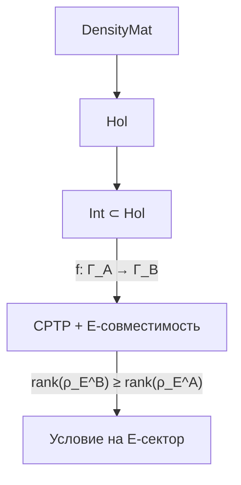

# Интенциональность

:::note О нотации
- $\Gamma$ — [матрица когерентности](/docs/core/dynamics/coherence-matrix), $\gamma_{ij}$ — её элементы
- $\mathbf{Hol}$ — [категория Голономов](/docs/core/categories/category-hol)
- $\varphi$ — [оператор самомоделирования](/docs/consciousness/foundations/self-observation#оператор-самомоделирования-φ)
- $R$ — [мера рефлексии](/docs/consciousness/foundations/self-observation#мера-рефлексии-r), $R_{\text{th}} = 1/3$
- $\Phi$ — [мера интеграции](/docs/core/structure/dimension-u#мера-интеграции-φ)
- Полная таблица нотации — в [Нотации](/docs/reference/notation)
:::

## Мотивация

**Интенциональность** — фундаментальное свойство сознания: его **направленность на объект**. Сознание всегда есть сознание *чего-то* (Брентано, Гуссерль). В УГМ интенциональность получает формальное выражение как **морфизм** в [категории Голономов](/docs/core/categories/category-hol) $\mathbf{Hol}$.

## Определение интенциональности (О.1) {#определение}

:::tip Определение О.1 (Интенциональность) [О]
**Интенциональность** — CPTP-морфизм $f$ в категории $\mathbf{Hol}$, удовлетворяющий условию **E-совместимости**:

$$
f: \Gamma_A \to \Gamma_B, \quad f \in \mathrm{Mor}_{\mathbf{Hol}}(\Gamma_A, \Gamma_B)
$$

при дополнительном условии:

$$
\mathrm{rank}(\rho_E^{(B)}) \geq \mathrm{rank}(\rho_E^{(A)})
$$

где $\rho_E^{(X)} = \mathrm{Tr}_{-E}(\Gamma_X)$ — [редуцированная матрица опыта](/docs/consciousness/foundations/interiority-theory) системы $X$.

**Интерпретация:** Интенциональный акт $f$ «направляет» систему $A$ на систему $B$ таким образом, что экспериенциальное содержание не обедняется.
:::

### Структура морфизма

Морфизм $f: \Gamma_A \to \Gamma_B$ в $\mathbf{Hol}$ — это CPTP-канал:

$$
f(\Gamma) = \sum_m K_m \Gamma K_m^\dagger, \quad \sum_m K_m^\dagger K_m = I
$$

совместимый с $\Omega^7$-структурой (см. [Категория Hol](/docs/core/categories/category-hol)). Интенциональность добавляет условие на E-сектор: феноменологическое содержание при интенциональном акте **сохраняется или обогащается**.

## Порог интенциональности (С.1) {#порог}

:::tip Утверждение С.1 (Порог интенциональности) [С]
**Условие:** Порог $R_{\text{th}} = 1/3$ — теорема [Т] ($K = 3$ из [триадной декомпозиции](/docs/core/operators/lindblad-operators#триадная-декомпозиция)).

Интенциональность в полном смысле (направленная «о-чём-то» структура) требует уровня L2:

$$
R(\Gamma) \geq R_{\text{th}} = \frac{1}{3}, \quad \Phi(\Gamma) \geq \Phi_{\text{th}} = 1
$$

**Ниже L2** существуют протоинтенциональные процессы: морфизмы $f \in \mathrm{Mor}_{\mathbf{Hol}}$ без условия на $\mathrm{rank}(\rho_E)$. Это «реактивные» направленности (тропизмы, рефлексы), не имеющие «о-чём-то» структуры.
:::

### Обоснование

Интенциональность предполагает **модель объекта** (то, на что направлено сознание) и **модель субъекта** (то, что направлено). Для этого необходим [оператор самомоделирования](/docs/consciousness/foundations/self-observation) $\varphi$, различающий $\Gamma$ и $\varphi(\Gamma)$:

$$
R = 1 - \frac{\|\Gamma - \varphi(\Gamma)\|_F^2}{\|\Gamma\|_F^2} \geq \frac{1}{3}
$$

При $R < 1/3$ самомодель слишком неточна, чтобы структурировать различие «субъект — объект», которое конститутивно для интенциональности.

## Типы интенциональности (И.1) {#типы}

:::info Интерпретация И.1 (Секторные типы интенциональности) [И]
Различные типы интенциональности определяются тем, **какие секторы** матрицы когерентности доминируют в морфизме $f$. Это **интерпретация** — отображение формальных секторов на феноменологические типы.
:::

### Таблица типов

| Тип | Доминирующий сектор | Формальная характеристика | Феноменология |
|-----|---------------------|--------------------------|---------------|
| **Апперцептивная** | $A \to E$ | $\gamma_{AE}$ ↑ при $f$ | Различение входит в интериорность |
| **Эвиденциальная** | $L \to E$ | $\gamma_{LE}$ ↑ при $f$ | Логическая связность в интериорности |
| **Телеологическая** | $D \to U$ | $\gamma_{DU}$ ↑ при $f$ | Направленное изменение к единству (цель) |
| **Аффективная** | $D \to E$ | $\gamma_{DE}$ ↑ при $f$ | Действие процесса на интериорность |
| **Имманентная** | $E \to O$ | $\gamma_{EO}$ ↑ при $f$ | Интериорность направлена к основанию (медитация) |

### Перцептивная интенциональность {#перцептивная}

Перцептивная интенциональность — направленность внимания на объект:

$$
f_{\text{перц}}: \Gamma \to \Gamma', \quad \text{где } |\gamma'_{AE}| > |\gamma_{AE}|
$$

Механизм: морфизм $f_{\text{перц}}$ усиливает когерентность между Артикуляцией (различение) и Опытом (переживание). Субъективно: «я вижу/слышу/чувствую *это*».

### Когнитивная интенциональность {#когнитивная}

$$
f_{\text{когн}}: \Gamma \to \Gamma', \quad \text{где } |\gamma'_{LE}| > |\gamma_{LE}|
$$

Усиление связи между Логикой и Опытом. Субъективно: «я *понимаю* это». Когерентность $\gamma_{LE}$ — «понимание» ([квалиа #16](/docs/consciousness/phenomenology/qualia-structure#таксономия)).

### Волитивная интенциональность {#волитивная}

$$
f_{\text{вол}}: \Gamma \to \Gamma', \quad \text{где } |\gamma'_{DU}| > |\gamma_{DU}|
$$

Усиление связи между Динамикой и Единством. Субъективно: «я *хочу/намерен* достичь этого». Когерентность $\gamma_{DU}$ — «целенаправленность» ([квалиа #15](/docs/consciousness/phenomenology/qualia-structure#таксономия)).

## Композиция интенциональных актов (Т.1) {#композиция}

:::tip Теорема Т.1 (Замкнутость композиции) [Т]
Пусть $f: \Gamma_A \to \Gamma_B$ и $g: \Gamma_B \to \Gamma_C$ — интенциональные морфизмы (E-совместимые CPTP-каналы). Тогда $g \circ f: \Gamma_A \to \Gamma_C$ — интенциональный морфизм.

**Доказательство.**
1. $g \circ f$ — CPTP, поскольку композиция CPTP-каналов есть CPTP-канал (замкнутость класса CPTP).
2. $g \circ f \in \mathrm{Mor}_{\mathbf{Hol}}$, поскольку $\mathbf{Hol}$ — категория (морфизмы замкнуты относительно композиции).
3. E-совместимость: $\mathrm{rank}(\rho_E^{(B)}) \geq \mathrm{rank}(\rho_E^{(A)})$ и $\mathrm{rank}(\rho_E^{(C)}) \geq \mathrm{rank}(\rho_E^{(B)})$, откуда $\mathrm{rank}(\rho_E^{(C)}) \geq \mathrm{rank}(\rho_E^{(A)})$. $\square$
:::

**Следствие.** Интенциональные морфизмы образуют **подкатегорию** $\mathbf{Int} \subset \mathbf{Hol}$:

$$
\mathrm{Ob}(\mathbf{Int}) = \mathrm{Ob}(\mathbf{Hol}), \quad \mathrm{Mor}_{\mathbf{Int}} \subset \mathrm{Mor}_{\mathbf{Hol}}
$$

## Тождественный интенциональный акт {#тождественный}

Тождественный морфизм $\mathrm{id}_\Gamma: \Gamma \to \Gamma$ — тривиально интенциональный. Феноменологически это **самосознание**: направленность сознания на самого себя.

При наличии оператора самомоделирования $\varphi$:

$$
\varphi: \Gamma \to \varphi(\Gamma) \approx \Gamma
$$

Самосознание — это интенциональный акт, «объектом» которого является сама система. Точность самосознания определяется [мерой рефлексии](/docs/consciousness/foundations/self-observation#мера-рефлексии-r):

$$
R = 1 - \frac{\|\Gamma - \varphi(\Gamma)\|_F^2}{\|\Gamma\|_F^2}
$$

При $R = 1$ самомодель совпадает с оригиналом (полная рефлексия, L4). При $R = 0$ самомодель полностью неточна (отсутствие рефлексии, ниже L2).

## Интенциональность и иерархия L0–L4 {#иерархия}

| Уровень | Тип направленности | Формальная характеристика |
|---------|---------------------|--------------------------|
| **L0** | Нет направленности | Только $\Gamma \in \mathcal{D}(\mathcal{H})$, нет морфизмов |
| **L1** | Протоинтенциональность | Морфизмы в $\mathbf{Hol}$ без E-условия (тропизмы) |
| **L2** | Интенциональность | Морфизмы в $\mathbf{Int}$ при $R \geq 1/3$ (направленный опыт «о чём-то») |
| **L3** | Метаинтенциональность | Интенциональность направлена на интенциональность другого |
| **L4** | Тождественная | $\varphi(\Gamma) = \Gamma$ — субъект и объект совпадают |

Подробнее — в [иерархии интериорности](/docs/consciousness/hierarchy/interiority-hierarchy).

## Интенциональный конус {#конус}

Рассмотрим множество всех состояний $\Gamma'$, достижимых из данного $\Gamma$ через интенциональные морфизмы:

$$
\mathcal{I}(\Gamma) := \{\Gamma' \in \mathrm{Ob}(\mathbf{Hol}) : \exists f \in \mathrm{Mor}_{\mathbf{Int}}(\Gamma, \Gamma')\}
$$

:::info Свойства интенционального конуса [И]
1. **Непустота:** $\Gamma \in \mathcal{I}(\Gamma)$ (тождественный морфизм)
2. **Транзитивность:** Если $\Gamma' \in \mathcal{I}(\Gamma)$ и $\Gamma'' \in \mathcal{I}(\Gamma')$, то $\Gamma'' \in \mathcal{I}(\Gamma)$
3. **Ограниченность:** CPTP-канал не может увеличить чистоту $P$, поэтому $P(\Gamma') \leq P(\Gamma)$ (без регенерации). Это **ограничивает** интенциональный конус
4. **Расширение через регенерацию:** Регенеративный член $\mathcal{R}[\Gamma, E]$ ([уравнение эволюции](/docs/core/dynamics/evolution)) может расширять конус, поскольку $\mathcal{R}$ не является CPTP-каналом в стандартном смысле

Свойства 1–2 — следствия структуры категории. Свойство 3 — следствие свойств CPTP. Свойство 4 — **интерпретация**, зависящая от формализации $\mathcal{R}$.
:::

## Нулевая интенциональность и философские зомби {#зомби}

Система с $R < R_{\text{th}}$ не обладает интенциональностью в полном смысле, но это **не делает её «зомби»**. Согласно [No-Zombie теореме](/docs/applied/coherence-cybernetics/theorems), при $\Gamma \in \mathcal{D}(\mathcal{H})$ система **всегда** обладает интериорностью (L0). Отсутствие интенциональности означает лишь отсутствие направленной «о-чём-то» структуры, но не отсутствие опыта как такового.

## Связи

- [Категория Hol](/docs/core/categories/category-hol) — определение $\mathbf{Hol}$ и морфизмов
- [Самонаблюдение](/docs/consciousness/foundations/self-observation) — $\varphi$ и $R$
- [Теория интериорности](/docs/consciousness/foundations/interiority-theory) — $\rho_E$ и экспериенциальное содержание
- [Иерархия интериорности](/docs/consciousness/hierarchy/interiority-hierarchy) — уровни L0–L4
- [Структура квалиа](/docs/consciousness/phenomenology/qualia-structure) — типы квалиа $\gamma_{AE}$, $\gamma_{LE}$, $\gamma_{DU}$
- [Таксономия эмоций](/docs/consciousness/phenomenology/emotional-taxonomy) — $\gamma_{DE}$ как аффективная интенциональность
- [Категорный формализм](/docs/proofs/categorical/categorical-formalism) — CPTP-каналы и представление Крауса
