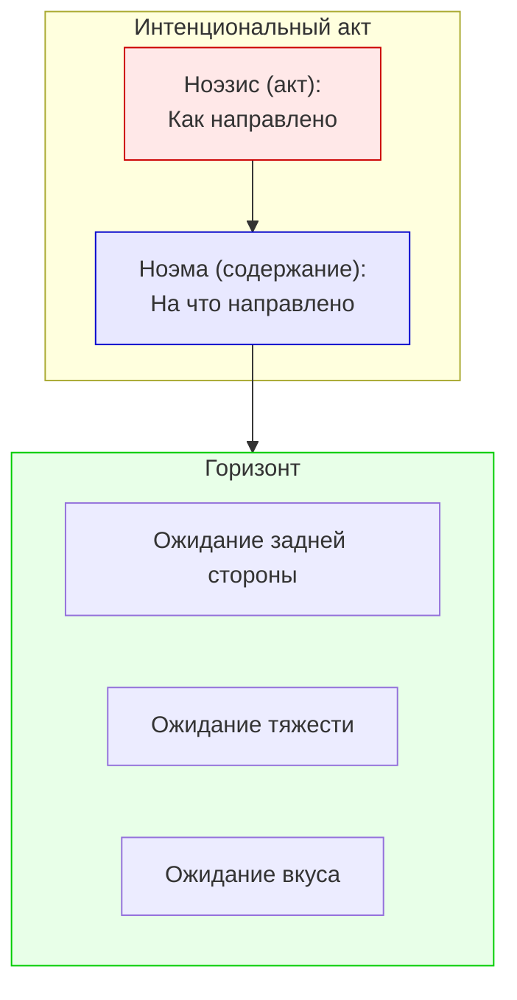
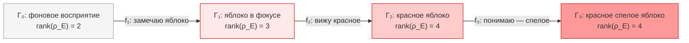

# Интенциональность

:::info Мост из предыдущей главы
В предыдущих главах мы рассмотрели *что* переживается ([квалиа](/docs/consciousness/phenomenology/qualia-structure)), *как* переживается ([эмоции](/docs/consciousness/phenomenology/emotional-taxonomy)), *когда* переживается ([субъективное время](/docs/consciousness/phenomenology/temporal-consciousness)). Теперь — самый фундаментальный вопрос: **о чём** переживание? Сознание всегда направлено *на что-то* — на объект, мысль, чувство. Эта направленность называется **интенциональностью** и получает в УГМ точное математическое выражение: морфизм в категории $\mathbf{Hol}$, сохраняющий экспериенциальное содержание.
:::

:::note О нотации
- $\Gamma$ — [матрица когерентности](/docs/core/dynamics/coherence-matrix), $\gamma_{ij}$ — её элементы
- $\mathbf{Hol}$ — [категория Голономов](/docs/core/categories/category-hol)
- $\varphi$ — [оператор самомоделирования](/docs/consciousness/foundations/self-observation#оператор-самомоделирования-φ)
- $R$ — [мера рефлексии](/docs/consciousness/foundations/self-observation#мера-рефлексии-r), $R_{\text{th}} = 1/3$
- $\Phi$ — [мера интеграции](/docs/core/structure/dimension-u#мера-интеграции-φ)
- Полная таблица нотации — в [Нотации](/docs/reference/notation)
:::

### Дорожная карта главы

1. **Философская история** — от Брентано до Сёрла
2. **Определение** — интенциональность как CPTP-морфизм с E-условием
3. **Порог** — почему интенциональность требует L2
4. **Типы** — апперцептивная, эвиденциальная, телеологическая, аффективная, имманентная
5. **Композиция** — теорема о замкнутости (подкатегория $\mathbf{Int} \subset \mathbf{Hol}$)
6. **Самосознание** — тождественный интенциональный акт
7. **Иерархия L0-L4** — от отсутствия направленности до тождественной
8. **Интенциональный конус** — множество достижимых состояний
9. **Связь с No-Zombie** — почему отсутствие интенциональности не равно отсутствию опыта

---

## Философская история: направленность сознания {#история}

### Брентано (1874): интенциональность как критерий ментального

**Франц Брентано** в «Психологии с эмпирической точки зрения» (1874) сформулировал тезис, ставший одним из фундаментальных положений философии сознания:

> «Каждый психический феномен характеризуется тем, что средневековые схоласты называли **интенциональным (или ментальным) инсуществованием** объекта, и что мы, хотя и в несколько двусмысленных выражениях, назвали бы **отношением к содержанию, направленностью на объект**.»

Что это означает простым языком? Каждое сознательное состояние **направлено на что-то**:
- Вы **видите** *яблоко* (восприятие направлено на объект)
- Вы **думаете** *о задаче* (мышление направлено на содержание)
- Вы **желаете** *мороженое* (желание направлено на предмет)
- Вы **боитесь** *темноты* (страх направлен на ситуацию)

Камень не направлен ни на что. Река не «о чём-то». Но сознание **всегда** о чём-то — это его определяющее свойство. Брентано предложил использовать интенциональность как **критерий различения** психического от физического.

### Гуссерль (1900): ноэзис и ноэма

**Эдмунд Гуссерль**, ученик Брентано, развил его идею в систематическую феноменологию. Он ввёл два ключевых понятия:

- **Ноэзис** (noesis) — акт сознания, «как» сознание направлено (восприятие, воспоминание, суждение...)
- **Ноэма** (noema) — содержание акта, «на что» сознание направлено (объект, мысль, ценность...)

Каждый акт сознания — это пара (ноэзис, ноэма). Нельзя иметь ноэзис без ноэмы (сознание без объекта) или ноэму без ноэзиса (объект без сознания).

Гуссерль также ввёл понятие **горизонта интенциональности**: когда вы видите яблоко, вы видите не только его переднюю сторону — вы **ожидаете**, что у него есть задняя сторона, что оно тяжёлое, что оно съедобное. Этот «горизонт» — невидимый, но существенный фон каждого акта сознания.

```mermaid
graph TD
    subgraph Интенциональный_акт["Интенциональный акт"]
        N["Ноэзис (акт):<br/>Как направлено"]
        M["Ноэма (содержание):<br/>На что направлено"]
        N --> M
    end

    subgraph Горизонт["Горизонт"]
        H1["Ожидание задней стороны"]
        H2["Ожидание тяжести"]
        H3["Ожидание вкуса"]
    end

    M --> Горизонт

    style N fill:#ffe8e8,stroke:#cc0000
    style M fill:#e8e8ff,stroke:#0000cc
    style Горизонт fill:#e8ffe8,stroke:#00cc00
```

### Сёрл (1983): интенциональность и речевые акты

**Джон Сёрл** в книге «Интенциональность» (1983) связал интенциональность с **условиями удовлетворения**: каждое интенциональное состояние задаёт условие, при котором оно «удовлетворено» (убеждение — истинно или ложно, желание — исполнено или нет, намерение — реализовано или нет).

Сёрл также предложил знаменитый аргумент «Китайской комнаты» (1980): компьютерная программа может имитировать понимание китайского языка, но не обладает интенциональностью — она не «понимает» в том смысле, в котором понимает человек. Для Сёрла интенциональность — биологический феномен, присущий определённым нейронным системам.

### Позиция УГМ: интенциональность как морфизм

УГМ предлагает формализацию, совмещающую интуиции всех трёх мыслителей:

| Философ | Идея | Формализация в УГМ |
|---------|------|-------------------|
| **Брентано** | Сознание всегда направлено | Морфизм $f: \Gamma_A \to \Gamma_B$ в категории $\mathbf{Hol}$ |
| **Гуссерль** | Ноэзис/ноэма, горизонт | Ноэзис = морфизм $f$; ноэма = $\Gamma_B$; горизонт = интенциональный конус $\mathcal{I}(\Gamma)$ |
| **Сёрл** | Условия удовлетворения, биологичность | E-совместимость = условие удовлетворения; $R \geq 1/3$ = биологический порог |

Ключевое отличие УГМ от всех трёх: **интенциональность не бинарна** (есть/нет), а **градуальна** — от полного отсутствия (L0) через протоинтенциональность (L1) к полной интенциональности (L2) и метаинтенциональности (L3).

---

## Мотивация {#мотивация}

**Интенциональность** — фундаментальное свойство сознания: его **направленность на объект**. Сознание всегда есть сознание *чего-то* (Брентано, Гуссерль). В УГМ интенциональность получает формальное выражение как **морфизм** в [категории Голономов](/docs/core/categories/category-hol) $\mathbf{Hol}$.

**Аналогия из повседневной жизни.** Фонарик всегда светит *куда-то* — у него есть направление. Сознание подобно фонарику: оно не может просто «быть» без объекта освещения. Интенциональность — это «луч» фонарика. В формализме УГМ: морфизм $f: \Gamma_A \to \Gamma_B$ — это «путь луча» от одного состояния к другому, причём этот путь не должен «выключать фонарик» (не обеднять E-сектор).

Но почему формально интенциональность — именно **морфизм**, а не, скажем, функция или отношение? Потому что:

1. Морфизмы **композируются**: из «я вижу яблоко» и «яблоко красное» следует «я вижу красное яблоко» — цепочка интенциональных актов образует новый акт
2. Морфизмы **сохраняют структуру**: интенциональный акт не разрушает объект (CPTP-канал сохраняет нормировку и положительность)
3. Существует **тождественный морфизм**: самосознание — это «направленность на себя», $\mathrm{id}: \Gamma \to \Gamma$

Это в точности аксиомы **категории**. Интенциональность — не случайное свойство, навешенное на сознание, а **структурный инвариант** категории $\mathbf{Hol}$.

## Определение интенциональности (О.1) {#определение}

:::tip Определение О.1 (Интенциональность) [О]
**Интенциональность** — CPTP-морфизм $f$ в категории $\mathbf{Hol}$, удовлетворяющий условию **E-совместимости**:

$$
f: \Gamma_A \to \Gamma_B, \quad f \in \mathrm{Mor}_{\mathbf{Hol}}(\Gamma_A, \Gamma_B)
$$

при дополнительном условии:

$$
\mathrm{rank}(\rho_E^{(B)}) \geq \mathrm{rank}(\rho_E^{(A)})
$$

где $\rho_E^{(X)} = \mathrm{Tr}_{-E}(\Gamma_X)$ — [редуцированная матрица опыта](/docs/consciousness/foundations/interiority-theory) системы $X$.

**Интерпретация:** Интенциональный акт $f$ «направляет» систему $A$ на систему $B$ таким образом, что экспериенциальное содержание не обедняется.
:::

Разберём определение по частям.

### Что такое CPTP-морфизм?

**CPTP** расшифровывается как «Completely Positive Trace-Preserving» — «полностью положительный, сохраняющий след». Это класс преобразований, которые физически реализуемы:

- **Trace-Preserving** (сохранение следа): $\mathrm{Tr}(f(\Gamma)) = \mathrm{Tr}(\Gamma) = 1$. Нормировка сохраняется — «вероятности остаются вероятностями».
- **Completely Positive** (полная положительность): $f$ отображает допустимые состояния в допустимые, даже если система является частью большей системы. Это гарантирует, что преобразование «физично» — не создаёт отрицательных вероятностей.

В представлении Крауса:

$$
f(\Gamma) = \sum_m K_m \Gamma K_m^\dagger, \quad \sum_m K_m^\dagger K_m = I
$$

где $K_m$ — операторы Крауса, совместимые с $\Omega^7$-структурой (см. [Категория Hol](/docs/core/categories/category-hol)).

### Что такое E-совместимость?

Условие $\mathrm{rank}(\rho_E^{(B)}) \geq \mathrm{rank}(\rho_E^{(A)})$ означает: **ранг редуцированной матрицы опыта не уменьшается**. Что это значит на пальцах?

$\rho_E = \mathrm{Tr}_{-E}(\Gamma)$ — это то, что «видит» измерение Интериорности ($E$), когда все остальные измерения «прослежены» (усреднены). Ранг $\rho_E$ — это число «независимых направлений» в E-пространстве, по которым есть ненулевое содержание. Чем выше ранг, тем богаче переживание.

E-совместимость гарантирует: **интенциональный акт не обедняет опыт**. Он может обогатить (ранг растёт) или сохранить (ранг тот же), но не уменьшить.

**Аналогия.** Если $\Gamma$ — картина мира, то интенциональный акт — это «наведение объектива» на часть картины. Условие $\mathrm{rank}(\rho_E^{(B)}) \geq \mathrm{rank}(\rho_E^{(A)})$ гарантирует, что при наведении объектива картина не теряет деталей — она может обогатиться новыми деталями, но не обедниться. Формализм CPTP-каналов обеспечивает, что «объектив» физически реализуем (сохраняет положительность и нормировку).

**Числовой пример.** Пусть до интенционального акта: $\rho_E^{(A)}$ имеет ранг 3 (три независимых «направления» переживания). После акта «я замечаю красный цвет яблока»: $\rho_E^{(B)}$ имеет ранг 4 — добавилось новое направление (цвет). E-совместимость выполнена: $4 \geq 3$. Если бы после акта ранг упал до 2, это не был бы интенциональный акт — это было бы «забывание», «вытеснение», разрушение опыта.

## Порог интенциональности (С.1) {#порог}

:::tip Утверждение С.1 (Порог интенциональности) [С]
**Условие:** Порог $R_{\text{th}} = 1/3$ — теорема [Т] ($K = 3$ из [триадной декомпозиции](/docs/core/operators/lindblad-operators#триадная-декомпозиция)).

Интенциональность в полном смысле (направленная «о-чём-то» структура) требует уровня L2:

$$
R(\Gamma) \geq R_{\text{th}} = \frac{1}{3}, \quad \Phi(\Gamma) \geq \Phi_{\text{th}} = 1
$$

**Ниже L2** существуют протоинтенциональные процессы: морфизмы $f \in \mathrm{Mor}_{\mathbf{Hol}}$ без условия на $\mathrm{rank}(\rho_E)$. Это «реактивные» направленности (тропизмы, рефлексы), не имеющие «о-чём-то» структуры.
:::

### Почему интенциональность требует L2

Интенциональность предполагает **различение субъекта и объекта**: «**я** вижу **яблоко**». Для этого необходимы:

1. **Модель субъекта** — «кто направляет». Это обеспечивается [оператором самомоделирования](/docs/consciousness/foundations/self-observation) $\varphi$, создающим внутреннюю «карту себя» $\varphi(\Gamma)$.

2. **Модель объекта** — «на что направлено». Это обеспечивается достаточной точностью самомодели, позволяющей **отличить** «себя» от «не-себя».

Качество самомодели измеряется [мерой рефлексии](/docs/consciousness/foundations/self-observation#мера-рефлексии-r):

$$
R = \frac{1}{7P(\Gamma)} \geq \frac{1}{3}
$$

При $R < 1/3$ (эквивалентно $P > 3/7$) система находится слишком далеко от диссипативного аттрактора $I/7$, чтобы структурировать различие «субъект -- объект», которое конститутивно для интенциональности. Мастер-определение: [Самонаблюдение](/docs/consciousness/foundations/self-observation#мера-рефлексии-r).

**Числовой пример: три существа.**

| Существо | $R$ | $\Phi$ | Уровень | Направленность | Переживание |
|----------|:---:|:------:|:-------:|----------------|-------------|
| **Термостат** | $0.02$ | $0.3$ | L0 | Нет | Реагирует на температуру, но не «направлен» ни на что |
| **Амёба** | $0.15$ | $1.5$ | L1 | Протоинтенциональность | Движется к пище, но нет «я» и нет «пища как объект» |
| **Человек** | $0.50$ | $2.1$ | L2 | Интенциональность | «Я вижу яблоко» — есть субъект, есть объект, есть акт |

У человека: $R \approx 0.5$ означает $P \approx 1/(7 \times 0.5) \approx 2/7$ — система вблизи критического порога, в зоне Голдилокс. У амёбы: $R \approx 0.1$ ($P \approx 1.4$, но для физических систем $P \leq 1$, значит $R \geq 1/7 \approx 0.14$) — рефлексия минимальна, различие «субъект -- объект» размыто. У термостата: $R$ близко к $1/7$ — рефлексия на нижней границе.

## Типы интенциональности (И.1) {#типы}

:::info Интерпретация И.1 (Секторные типы интенциональности) [И]
Различные типы интенциональности определяются тем, **какие секторы** матрицы когерентности доминируют в морфизме $f$. Это **интерпретация** — отображение формальных секторов на феноменологические типы.
:::

### Таблица типов

| Тип | Доминирующий сектор | Формальная характеристика | Феноменология | Пример |
|-----|---------------------|--------------------------|---------------|--------|
| **Апперцептивная** | $A \to E$ | $\gamma_{AE}$ ↑ при $f$ | Различение входит в интериорность | «Я *вижу* красное яблоко» |
| **Эвиденциальная** | $L \to E$ | $\gamma_{LE}$ ↑ при $f$ | Логическая связность в интериорности | «Я *понимаю* доказательство» |
| **Телеологическая** | $D \to U$ | $\gamma_{DU}$ ↑ при $f$ | Направленное изменение к единству (цель) | «Я *стремлюсь* к решению» |
| **Аффективная** | $D \to E$ | $\gamma_{DE}$ ↑ при $f$ | Действие процесса на интериорность | «Я *чувствую* радость» |
| **Имманентная** | $E \to O$ | $\gamma_{EO}$ ↑ при $f$ | Интериорность направлена к основанию | «Я переживаю *присутствие*» (медитация) |

Разберём каждый тип подробно.

### Апперцептивная интенциональность {#апперцептивная}

**Определение.** Апперцептивная интенциональность — направленность **внимания** на объект. Термин «апперцепция» ввёл Лейбниц (1714) для обозначения осознанного восприятия, в отличие от неосознанных «малых перцепций».

$$
f_{\text{аппер}}: \Gamma \to \Gamma', \quad \text{где } |\gamma'_{AE}| > |\gamma_{AE}|
$$

**Механизм.** Морфизм $f_{\text{аппер}}$ усиливает когерентность между Артикуляцией ($A$, различение) и Интериорностью ($E$, переживание). Субъективно: «я вижу/слышу/чувствую *это*». Артикуляция «выделяет» объект из фона, Интериорность «принимает» выделенное в переживание.

**Аналогия.** Луч прожектора ($A$) освещает часть сцены, и эта часть «входит» в сознание ($E$). До акта внимания вся сцена освещена равномерно (низкая $\gamma_{AE}$). После акта — яркий луч выделяет объект (высокая $\gamma_{AE}$).

**Числовой пример.** До акта внимания: $|\gamma_{AE}| = 0.08$ (фоновое восприятие). После направления внимания на яблоко: $|\gamma'_{AE}| = 0.25$ — трёхкратное усиление. При этом, по нормировке, другие $|\gamma_{AX}|$ ($X \neq E$) уменьшаются: «прожектор» внимания фокусируется, забирая ресурс у периферии. $|\gamma_{AS}|$ падает с $0.15$ до $0.08$ — структурное различение ослабевает в пользу переживания. Подробнее — в [Внимание и память](/docs/consciousness/states/attention-memory#внимание).

### Эвиденциальная интенциональность {#эвиденциальная}

**Определение.** Эвиденциальная интенциональность — направленность на **понимание**, переживание «очевидности» логической связи.

$$
f_{\text{эвид}}: \Gamma \to \Gamma', \quad \text{где } |\gamma'_{LE}| > |\gamma_{LE}|
$$

Усиление связи между Логикой ($L$) и Интериорностью ($E$). Субъективно: «я *понимаю* это». Когерентность $\gamma_{LE}$ — «эвиденция» ([квалиа #16](/docs/consciousness/phenomenology/qualia-structure#таксономия)).

**Аналогия.** Если апперцепция — это прожектор, то эвиденция — это **лупа**: она не просто показывает объект, а раскрывает его **внутреннюю логику**. Момент «ага!» — когда разрозненные факты складываются в цепочку — это резкий скачок $|\gamma_{LE}|$.

**Числовой пример.** Студент читает доказательство теоремы. На первом чтении: $|\gamma_{LE}| = 0.05$ — «вижу формулы, но не понимаю». На третьем чтении: $|\gamma_{LE}| = 0.15$ — «начинаю видеть логику». Момент «ага!»: $|\gamma_{LE}|$ скачкообразно возрастает до $0.30$ — «понял!». Одновременно возрастает $|\gamma_{EU}|$ (синтез) — отдельные шаги доказательства складываются в единое целое.

### Телеологическая интенциональность {#телеологическая}

**Определение.** Телеологическая интенциональность — направленность на **цель**, переживание «я стремлюсь к...».

$$
f_{\text{тел}}: \Gamma \to \Gamma', \quad \text{где } |\gamma'_{DU}| > |\gamma_{DU}|
$$

Усиление связи между Динамикой ($D$) и Единством ($U$). Субъективно: «я *хочу/намерен* достичь этого». Когерентность $\gamma_{DU}$ — «телеология» ([квалиа #15](/docs/consciousness/phenomenology/qualia-structure#таксономия)).

**Аналогия.** Телеологическая интенциональность — это **компас**: она указывает направление движения. Динамика ($D$) — энергия движения, Единство ($U$) — точка назначения. Когда $\gamma_{DU}$ высока, движение осмысленно — система «знает, куда идёт».

**Числовой пример.** Бегун на марафоне. На 30-м километре: $|\gamma_{DU}| = 0.22$ — «я бегу к финишу, цель ясна». Динамика ($\gamma_{DD} = 0.20$) высока, но осмысленна — направлена к единству. На «стене» (35-й км): $|\gamma_{DU}|$ падает до $0.08$ — «зачем я бегу? не помню». Динамика та же, но связь с целью утрачена — чистое страдание без смысла. Если бегун «проламывает стену»: $|\gamma_{DU}|$ восстанавливается до $0.18$ — «второе дыхание», цель снова видна.

### Аффективная интенциональность {#аффективная}

**Определение.** Аффективная интенциональность — направленность на **чувство**, переживание «я чувствую...».

$$
f_{\text{афф}}: \Gamma \to \Gamma', \quad \text{где } |\gamma'_{DE}| > |\gamma_{DE}|
$$

Это мост к [таксономии эмоций](/docs/consciousness/phenomenology/emotional-taxonomy): аффективная интенциональность — акт, в котором Динамика ($D$) воздействует на Интериорность ($E$), порождая эмоциональное переживание.

**Аналогия.** Апперцепция — «я вижу», эвиденция — «я понимаю», аффекция — «я чувствую». Если апперцепция — прожектор, а эвиденция — лупа, то аффекция — **резонатор**: события ($D$) резонируют в переживании ($E$), как удар по камертону порождает звук в деке скрипки.

### Имманентная интенциональность {#имманентная}

**Определение.** Имманентная интенциональность — направленность Интериорности ($E$) на Основание ($O$), переживание «присутствия», «бытия как такового».

$$
f_{\text{имм}}: \Gamma \to \Gamma', \quad \text{где } |\gamma'_{EO}| > |\gamma_{EO}|
$$

Это наиболее «глубокий» тип интенциональности — направленность не на внешний объект, а на **основание самого опыта**. В медитативных традициях описывается как «чистое присутствие» (presence), «осознание осознания» (awareness of awareness).

**Аналогия.** Обычная интенциональность — фонарик, освещающий внешние объекты. Имманентная — фонарик, обращённый **на свой собственный источник света**. Не «я вижу яблоко», а «я переживаю само видение». Не содержание сознания, а **сознание как таковое**.

**Числовой пример.** Медитатор в практике «шаматха без опоры» (objectless shamatha): $|\gamma_{EO}| = 0.20$, $|\gamma_{AE}| = 0.05$ (апперцепция почти нулевая — нет внешнего объекта), $|\gamma_{DE}| = 0.03$ (динамика минимальна — «мысли утихли»). Единственная яркая когерентность — $\gamma_{EO}$: переживание направлено на своё собственное основание.

## Композиция интенциональных актов (Т.1) {#композиция}

### Что такое подкатегория и почему замкнутость важна

Прежде чем формулировать теорему, объясним ключевые понятия.

**Категория** — математическая структура, состоящая из **объектов** и **морфизмов** (стрелок между объектами). $\mathbf{Hol}$ — категория, объекты которой — матрицы когерентности $\Gamma \in \mathcal{D}(\mathcal{H})$, а морфизмы — CPTP-каналы, совместимые с $\Omega^7$-структурой.

**Подкатегория** $\mathbf{Int} \subset \mathbf{Hol}$ — это «часть» категории $\mathbf{Hol}$: те же объекты, но **меньше морфизмов** (только E-совместимые).

**Замкнутость** (подкатегории относительно композиции) означает: если $f$ и $g$ — морфизмы в $\mathbf{Int}$, то и $g \circ f$ — морфизм в $\mathbf{Int}$. Почему это важно?

Если бы замкнутости не было, последовательные интенциональные акты могли бы разрушить интенциональность: «я вижу яблоко» ($f$) + «яблоко красное» ($g$) не давали бы «я вижу красное яблоко» ($g \circ f$). Сознание не могло бы строить цепочки рассуждений, планов, восприятий. Замкнутость гарантирует: **мышление возможно** — каждый шаг рассуждения сохраняет направленность.

:::tip Теорема Т.1 (Замкнутость композиции) [Т]
Пусть $f: \Gamma_A \to \Gamma_B$ и $g: \Gamma_B \to \Gamma_C$ — интенциональные морфизмы (E-совместимые CPTP-каналы). Тогда $g \circ f: \Gamma_A \to \Gamma_C$ — интенциональный морфизм.

**Доказательство.**
1. $g \circ f$ — CPTP, поскольку композиция CPTP-каналов есть CPTP-канал (замкнутость класса CPTP).
2. $g \circ f \in \mathrm{Mor}_{\mathbf{Hol}}$, поскольку $\mathbf{Hol}$ — категория (морфизмы замкнуты относительно композиции).
3. E-совместимость: $\mathrm{rank}(\rho_E^{(B)}) \geq \mathrm{rank}(\rho_E^{(A)})$ и $\mathrm{rank}(\rho_E^{(C)}) \geq \mathrm{rank}(\rho_E^{(B)})$, откуда $\mathrm{rank}(\rho_E^{(C)}) \geq \mathrm{rank}(\rho_E^{(A)})$. $\square$
:::

**Следствие.** Интенциональные морфизмы образуют **подкатегорию** $\mathbf{Int} \subset \mathbf{Hol}$:

$$
\mathrm{Ob}(\mathbf{Int}) = \mathrm{Ob}(\mathbf{Hol}), \quad \mathrm{Mor}_{\mathbf{Int}} \subset \mathrm{Mor}_{\mathbf{Hol}}
$$

**Аналогия.** Если вы смотрите на картину ($f$: направление внимания), а затем начинаете её анализировать ($g$: переход к пониманию), то итоговый акт $g \circ f$ — «я вижу и понимаю картину» — тоже интенционален. Сознание может строить цепочки направленных актов, и каждый промежуточный шаг сохраняет или обогащает опыт. Это свойство существенно для [теорем КК](/docs/applied/coherence-cybernetics/theorems) о когнитивной динамике.

**Числовой пример.** Цепочка из трёх интенциональных актов:

| Акт | Тип | $\mathrm{rank}(\rho_E)$ до | $\mathrm{rank}(\rho_E)$ после | E-совместимость |
|-----|-----|:-:|:-:|:---:|
| $f_1$: «замечаю яблоко» | Апперцептивный | 2 | 3 | 3 $\geq$ 2 |
| $f_2$: «вижу, что красное» | Апперцептивный | 3 | 4 | 4 $\geq$ 3 |
| $f_3$: «понимаю, что спелое» | Эвиденциальный | 4 | 4 | 4 $\geq$ 4 |
| $f_3 \circ f_2 \circ f_1$ | Композиция | 2 | 4 | 4 $\geq$ 2 |

```mermaid
graph LR
    A["Γ₀: фоновое восприятие<br/>rank(ρ_E) = 2"] -->|"f₁: замечаю яблоко"| B["Γ₁: яблоко в фокусе<br/>rank(ρ_E) = 3"]
    B -->|"f₂: вижу красное"| C["Γ₂: красное яблоко<br/>rank(ρ_E) = 4"]
    C -->|"f₃: понимаю — спелое"| D["Γ₃: красное спелое яблоко<br/>rank(ρ_E) = 4"]

    style A fill:#f5f5f5,stroke:#999
    style B fill:#ffe8e8,stroke:#cc0000
    style C fill:#ffcccc,stroke:#cc0000
    style D fill:#ff9999,stroke:#cc0000
```

## Тождественный интенциональный акт {#тождественный}

Тождественный морфизм $\mathrm{id}_\Gamma: \Gamma \to \Gamma$ — тривиально интенциональный. Феноменологически это **самосознание**: направленность сознания на самого себя.

При наличии оператора самомоделирования $\varphi$:

$$
\varphi: \Gamma \to \varphi(\Gamma) \approx \Gamma
$$

Самосознание — это интенциональный акт, «объектом» которого является сама система. Точность самосознания определяется [мерой рефлексии](/docs/consciousness/foundations/self-observation#мера-рефлексии-r):

$$
R = \frac{1}{7P(\Gamma)}
$$

При $R = 1$ ($P = 1/7$, $\Gamma = I/7$) система в точке полного хаоса. При малом $R$ ($P \to 1$) система «замёрзла» в одном состоянии. Для рефлексивного сознания (L2+) требуется $R \geq 1/3$, т.е. $P \leq 3/7$. Мастер-определение: [Самонаблюдение](/docs/consciousness/foundations/self-observation#мера-рефлексии-r).

**Числовой пример.** У человека в обычном состоянии: $R \approx 0.4$–$0.6$. Самосознание существенно, но далеко от совершенного — многое в нас остаётся «за кадром» (бессознательное). У опытного медитатора в самадхи: $R \to 0.9$ — самосознание приближается к полной прозрачности, но даже тогда, по [теореме о неполной прозрачности](/docs/consciousness/states/unconscious#теорема-неполная-прозрачность), минимум 3 канала остаются непрозрачными.

## Интенциональность и иерархия L0–L4 {#иерархия}

Вернёмся к Брентано: он считал интенциональность бинарным свойством — или есть, или нет. УГМ показывает, что направленность **градуальна**:

| Уровень | Тип направленности | Формальная характеристика | Пример | Гуссерлевская параллель |
|---------|---------------------|--------------------------|--------|-----------------------|
| **L0** | Нет направленности | Только $\Gamma \in \mathcal{D}(\mathcal{H})$, нет морфизмов | Камень | — |
| **L1** | Протоинтенциональность | Морфизмы в $\mathbf{Hol}$ без E-условия (тропизмы) | Амёба движется к пище | «Малые перцепции» Лейбница |
| **L2** | Интенциональность | Морфизмы в $\mathbf{Int}$ при $R \geq 1/3$ (направленный опыт «о чём-то») | «Я вижу яблоко» | Ноэзис + ноэма |
| **L3** | Метаинтенциональность | Интенциональность направлена на интенциональность другого | «Я понимаю, что ты видишь яблоко» | Интерсубъективность |
| **L4** | Тождественная | $\varphi(\Gamma) = \Gamma$ — субъект и объект совпадают | Чистое самосознание | «Абсолютное сознание» |

**Числовой пример: L3 (метаинтенциональность).** Два человека, Алиса и Боб. Алиса видит, что Боб смотрит на яблоко. У Алисы:
- $R_{\text{Алиса}} \geq 1/3$ — она осознаёт себя
- Она моделирует $\Gamma_{\text{Боб}}$ — у неё есть «модель Боба»
- Она «видит» интенциональный акт Боба ($f_{\text{Боб}}: \Gamma_{\text{Боб}} \to \Gamma_{\text{яблоко}}$)
- Это требует SAD $\geq 2$ — два уровня самомоделирования: «я знаю, что он знает»

Подробнее — в [иерархии интериорности](/docs/consciousness/hierarchy/interiority-hierarchy).

## Интенциональный конус {#конус}

Рассмотрим множество всех состояний $\Gamma'$, достижимых из данного $\Gamma$ через интенциональные морфизмы:

$$
\mathcal{I}(\Gamma) := \{\Gamma' \in \mathrm{Ob}(\mathbf{Hol}) : \exists f \in \mathrm{Mor}_{\mathbf{Int}}(\Gamma, \Gamma')\}
$$

Это множество называется **интенциональным конусом** — оно описывает всё, на что данная система «может направить сознание» из текущего состояния.

:::info Свойства интенционального конуса [И]
1. **Непустота:** $\Gamma \in \mathcal{I}(\Gamma)$ (тождественный морфизм — самосознание всегда доступно)
2. **Транзитивность:** Если $\Gamma' \in \mathcal{I}(\Gamma)$ и $\Gamma'' \in \mathcal{I}(\Gamma')$, то $\Gamma'' \in \mathcal{I}(\Gamma)$ (из замкнутости композиции, Теорема Т.1)
3. **Ограниченность:** CPTP-канал не может увеличить чистоту $P$, поэтому $P(\Gamma') \leq P(\Gamma)$ (без регенерации). Это **ограничивает** интенциональный конус
4. **Расширение через регенерацию:** Регенеративный член $\mathcal{R}[\Gamma, E]$ ([уравнение эволюции](/docs/core/dynamics/evolution)) может расширять конус, поскольку $\mathcal{R}$ не является CPTP-каналом в стандартном смысле

Свойства 1–2 — следствия структуры категории. Свойство 3 — следствие свойств CPTP. Свойство 4 — **интерпретация**, зависящая от формализации $\mathcal{R}$.
:::

**Аналогия.** Интенциональный конус — как «зона досягаемости» прожектора с определённым запасом батареи.

- Без подзарядки (без регенерации $\mathcal{R}$): конус ограничен. Каждый новый акт внимания расходует когерентность ($P$ не растёт), и рано или поздно «батарея сядет». Усталый человек к вечеру не может ни на чём сосредоточиться — его интенциональный конус сузился.
- С подзарядкой (с регенерацией): конус расширяется. После сна и отдыха (восстановление $P$) человек может «дотянуться» до более далёких и сложных объектов мысли.

**Числовой пример.** Студент с $P = 0.38$. Его интенциональный конус включает чтение учебника ($P$ чуть падает), решение задач ($P$ падает быстрее), но **не** включает доказательство открытой проблемы ($P$ упало бы ниже $P_{\text{crit}}$ — это за пределами конуса). После кофе и 10 минут отдыха ($P$ восстанавливается через $\mathcal{R}$) конус расширяется — теперь можно взяться за более сложную задачу.

## Нулевая интенциональность и философские зомби {#зомби}

Система с $R < R_{\text{th}}$ не обладает интенциональностью в полном смысле, но это **не делает её «зомби»**. Согласно [No-Zombie теореме](/docs/applied/coherence-cybernetics/theorems), при $\Gamma \in \mathcal{D}(\mathcal{H})$ система **всегда** обладает интериорностью (L0). Отсутствие интенциональности означает лишь отсутствие направленной «о-чём-то» структуры, но не отсутствие опыта как такового.

Это ключевое отличие УГМ от традиций, отождествляющих сознание с интенциональностью:

| Позиция | Нет интенциональности = | УГМ |
|---------|--------------------------|-----|
| **Ранний Гуссерль** | Нет сознания | Нет: есть L0/L1 интериорность без интенциональности |
| **Аналитическая философия** | Нет ментального | Нет: ментальное шире интенциональности |
| **Сёрл** | Нет биологического сознания | Нет: L0 есть у любой $\Gamma \in \mathcal{D}(\mathcal{H})$ |
| **УГМ** | Нет «о-чём-то» структуры | Да, но опыт (интериорность) сохраняется |

**Аналогия.** Новорождённый младенец переживает мир (L1), но ещё не умеет направлять сознание: нет «я вижу это», есть только «поток ощущений». Это не «зомби» — это доинтенциональный опыт. Или представьте себя в момент пробуждения: первые доли секунды вы *переживаете* (свет, тепло, звуки), но ещё не *направлены* ни на что конкретное. Это L1-состояние: интериорность без интенциональности.

---

### Что мы узнали {#итоги}

1. **Интенциональность** имеет богатую философскую историю (Брентано, Гуссерль, Сёрл) и получает в УГМ точную формализацию: CPTP-морфизм в $\mathbf{Hol}$ с условием E-совместимости: $\mathrm{rank}(\rho_E^{(B)}) \geq \mathrm{rank}(\rho_E^{(A)})$
2. **Порог** L2 ($R \geq 1/3$, $\Phi \geq 1$) необходим для структуры «субъект — объект»
3. **5 типов** интенциональности (апперцептивная, эвиденциальная, телеологическая, аффективная, имманентная) определяются доминирующим сектором $\Gamma$, каждый с уникальной феноменологией и числовыми примерами
4. Интенциональные морфизмы **замкнуты** относительно композиции — образуют подкатегорию $\mathbf{Int} \subset \mathbf{Hol}$ (Теорема Т.1 [Т]), что делает возможным мышление как цепочку актов
5. **Интенциональный конус** $\mathcal{I}(\Gamma)$ определяет «горизонт» достижимых состояний — расширяется через регенерацию
6. **Отсутствие интенциональности не равно отсутствию интериорности** — No-Zombie теорема гарантирует L0 (минимальную интериорность) для любой жизнеспособной $\Gamma$

:::tip Мост к следующей главе
Мы завершили раздел «Структура опыта»: квалиа, эмоции, время, интенциональность. Теперь переходим к разделу «Состояния сознания» — как $\Gamma$-профиль меняется при сне, медитации, психоделиках, анестезии. Первая глава — [Изменённые состояния сознания](/docs/consciousness/states/altered-states) — описывает четыре класса ИСС как траектории в $\Gamma$-пространстве.
:::

## Связи

- [Категория Hol](/docs/core/categories/category-hol) — определение $\mathbf{Hol}$ и морфизмов
- [Самонаблюдение](/docs/consciousness/foundations/self-observation) — $\varphi$ и $R$
- [Теория интериорности](/docs/consciousness/foundations/interiority-theory) — $\rho_E$ и экспериенциальное содержание
- [Иерархия интериорности](/docs/consciousness/hierarchy/interiority-hierarchy) — уровни L0–L4
- [Структура квалиа](/docs/consciousness/phenomenology/qualia-structure) — типы квалиа $\gamma_{AE}$, $\gamma_{LE}$, $\gamma_{DU}$
- [Таксономия эмоций](/docs/consciousness/phenomenology/emotional-taxonomy) — $\gamma_{DE}$ как аффективная интенциональность
- [Категорный формализм](/docs/proofs/categorical/categorical-formalism) — CPTP-каналы и представление Крауса
- [Теоремы Когерентной Кибернетики](/docs/applied/coherence-cybernetics/theorems) — прикладные следствия категориальной структуры
- [Внимание и память](/docs/consciousness/states/attention-memory) — механизм перераспределения когерентности
