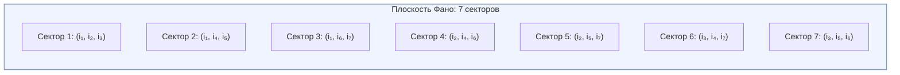

# Структура Квалиа: 21-парная Таксономия

:::note О нотации
- $\Gamma$ — [матрица когерентности](/docs/core/dynamics/coherence-matrix), $\gamma_{ij}$ — её элементы
- $P = \mathrm{Tr}(\Gamma^2)$ — [чистота (жизнеспособность)](/docs/core/dynamics/viability#определение-чистоты)
- $\rho_E = \mathrm{Tr}_{-E}(\Gamma)$ — [редуцированная матрица опыта](/docs/consciousness/foundations/interiority-theory)
- $\Phi$ — [мера интеграции](/docs/core/structure/dimension-u#мера-интеграции-φ)
- $R$ — [мера рефлексии](/docs/consciousness/foundations/self-observation#мера-рефлексии-r)
- Полная таблица нотации — в [Нотации](/docs/reference/notation)
:::

## Мотивация

Матрица когерентности $\Gamma$ — $7 \times 7$ эрмитова матрица на пространстве [семи измерений](/docs/core/structure/dimensions) $\{A, S, D, L, E, O, U\}$. Она содержит:

- **7 диагональных элементов** $\gamma_{ii}$ — населённости измерений
- **21 недиагональную пару** $(\gamma_{ij}, \gamma_{ji})$ при $i < j$ — когерентности

Число пар:

$$
\binom{7}{2} = \frac{7 \cdot 6}{2} = 21
$$

Каждая когерентность $\gamma_{ij}$ несёт феноменологическое содержание, определяемое семантикой пары измерений $(i, j)$.

## Интерпретация: 21-парная таксономия квалиа (И.1) {#таксономия}

:::info Интерпретация И.1 (Таксономия квалиа) [И]
Каждая когерентность $\gamma_{ij}$ ($i \neq j$) матрицы $\Gamma$ задаёт **тип квалиа** — качественно определённый модус экспериенциального содержания. 21 пара исчерпывает все возможные типы, поскольку $\binom{7}{2} = 21$ — полный набор связей в 7-мерной системе.

Это **интерпретация** (отображение формального в феноменальное), а не математическая теорема. Математическое содержание — тривиальная комбинаторика; феноменологическое приписывание — семантический постулат.
:::

### Полная таблица 21 типа квалиа {#полная-таблица-21-типа-квалиа}

| # | Пара | Когерентность | Имя | Феноменологическое содержание |
|---|------|---------------|-----|-------------------------------|
| 1 | $(A,S)$ | $\gamma_{AS}$ | **Морфогенез** | Кристаллизация различий в устойчивые формы — переживание «оформления» |
| 2 | $(A,D)$ | $\gamma_{AD}$ | **Актуализация** | Актуализация различения в процессе — переживание «восприятия» |
| 3 | $(A,L)$ | $\gamma_{AL}$ | **Предикация** | Различение, ставшее предикатом — переживание «суждения» |
| 4 | $(A,E)$ | $\gamma_{AE}$ | **Апперцепция** | Различение, вошедшее в интериорность — переживание «осознания» |
| 5 | $(A,O)$ | $\gamma_{AO}$ | **Спонтанность** | Возникновение различений без внешней причины — переживание «инсайта» |
| 6 | $(A,U)$ | $\gamma_{AU}$ | **Дифференциация** | Различение внутри целого — переживание «анализа» |
| 7 | $(S,D)$ | $\gamma_{SD}$ | **Персистенция** | Форма, сохраняющаяся через процесс — переживание «устойчивости» |
| 8 | $(S,L)$ | $\gamma_{SL}$ | **Номос** | Структура с логической необходимостью — переживание «порядка» |
| 9 | $(S,E)$ | $\gamma_{SE}$ | **Репрезентация** | Структура, представленная в интериорности — переживание «целостной формы» |
| 10 | $(S,O)$ | $\gamma_{SO}$ | **Архетип** | Формы из основания — переживание «глубинного паттерна» |
| 11 | $(S,U)$ | $\gamma_{SU}$ | **Симметрия** | Структурное единство — переживание «гармонии» |
| 12 | $(D,L)$ | $\gamma_{DL}$ | **Регуляция** | Логически управляемый процесс — переживание «контроля» |
| 13 | $(D,E)$ | $\gamma_{DE}$ | **Аффекция** | Действие процесса на интериорность — переживание «эмоции» |
| 14 | $(D,O)$ | $\gamma_{DO}$ | **Генезис** | Порождение из основания — переживание «творчества» |
| 15 | $(D,U)$ | $\gamma_{DU}$ | **Телеология** | Интегрированное направленное изменение — переживание «волевого усилия» |
| 16 | $(L,E)$ | $\gamma_{LE}$ | **Эвиденция** | Логическая связность в интериорности — переживание «очевидности» |
| 17 | $(L,O)$ | $\gamma_{LO}$ | **Фундирование** | Логика, укоренённая в основании — переживание «самоочевидности» |
| 18 | $(L,U)$ | $\gamma_{LU}$ | **Консистентность** | Логическая непротиворечивость целого — переживание «согласованности» |
| 19 | $(E,O)$ | $\gamma_{EO}$ | **Имманентность** | Основание, присутствующее внутри интериорности — переживание «присутствия» |
| 20 | $(E,U)$ | $\gamma_{EU}$ | **Синтез** | Интеграция интериорного содержания в целое — переживание «единства» |
| 21 | $(O,U)$ | $\gamma_{OU}$ | **Полнота** | Тождество источника и целого — переживание «завершённости» |

### Параметрическая структура квалиа

Каждый квалитативный тип $\gamma_{ij}$ характеризуется тремя параметрами:

$$
\gamma_{ij} = |\gamma_{ij}| \cdot e^{i\theta_{ij}}
$$

| Параметр | Диапазон | Феноменологическое значение |
|----------|----------|---------------------------|
| $\lvert\gamma_{ij}\rvert$ | $[0, \sqrt{\gamma_{ii}\gamma_{jj}}]$ | **Интенсивность** квалиа данного типа |
| $\theta_{ij} = \arg(\gamma_{ij})$ | $[0, 2\pi)$ | **Перспектива** — «угол зрения» на связь |
| $\mathrm{Gap}(i,j) = \lvert\sin\theta_{ij}\rvert$ | $[0, 1]$ | **Непрозрачность** — мера несовпадения внешнего и внутреннего |

Интенсивность ограничена неравенством Коши-Шварца:

$$
|\gamma_{ij}|^2 \leq \gamma_{ii} \cdot \gamma_{jj}
$$

Подробности — в [дуально-аспектной семантике матрицы когерентности](/docs/core/dynamics/coherence-matrix#дуально-аспектная-семантика).

## Теорема о замкнутости таксономии (Т.1) {#замкнутость}

:::tip Теорема Т.1 (Замкнутость таксономии квалиа) [Т]
Таксономия из 21 типа квалиа **исчерпывающа**: никакой дополнительный тип квалиа невозможен в системе с $\dim(\mathcal{H}) = 7$.

**Доказательство.** Число различных (неупорядоченных) пар из $N$ элементов равно $\binom{N}{2}$. При $N = 7$ получаем $\binom{7}{2} = 21$. Каждая пара $(i,j)$ задаёт ровно одну когерентность $\gamma_{ij}$ (с учётом $\gamma_{ji} = \gamma_{ij}^*$). Новый тип квалиа потребовал бы либо нового измерения ($N > 7$, что противоречит [минимальности](/docs/proofs/minimality/theorem-minimality-7)), либо новой связи между существующими измерениями (невозможно — все $\binom{7}{2}$ пар учтены). $\square$
:::

**Следствие.** При $N < 7$ таксономия **обеднена**: $\binom{6}{2} = 15$ (нет квалиа, связанных с удалённым измерением). Это формальное выражение «бедности» феноменологии при нарушении минимальности.

:::info $G_2$-орбитальная стабильность таксономии [Т]
Множество из 21 типа квалиа **$G_2$-инвариантно**: группа $G_2 = \mathrm{Aut}(\mathbb{O})$ переставляет 7 измерений (сохраняя Фано-структуру), индуцируя перестановку 21 когерентности $\gamma_{ij}$. При этом **множество** $\{\gamma_{ij}\}_{i<j}$ сохраняется, хотя конкретные элементы могут переставляться. Это означает: таксономия квалиа **универсальна** — не зависит от выбора базиса ($G_2$-калибровки) и потому объективна.

Формально: $G_2$ действует на $\binom{[7]}{2}$ через индуцированное действие на пары, сохраняя число $\binom{7}{2} = 21$. [Теорема $G_2$-ригидности](/docs/proofs/categorical/uniqueness-theorem#лемма-g4) [Т] гарантирует, что $G_2$ — **максимальная** группа с этим свойством.
:::

## Фановская структура квалиа {#фано}

[Плоскость Фано](/docs/proofs/minimality/theorem-octonionic-derivation#плоскость-фано) $\mathrm{PG}(2,2)$ — проективная плоскость над $\mathbb{F}_2$ — содержит 7 точек и 7 линий. Каждая линия проходит через 3 точки. Если отождествить 7 точек с 7 измерениями $\{A, S, D, L, E, O, U\}$, то 7 линий Фано определяют **7 секторов когерентности**.

### Секторная структура когерентностей

Каждый Фано-триплет $(e_a, e_b, e_c)$ определяет ассоциативную подалгебру $\mathrm{Im}(\mathbb{H}) \subset \mathrm{Im}(\mathbb{O})$. Три когерентности внутри триплета:

$$
\{\gamma_{ab}, \gamma_{bc}, \gamma_{ac}\} \quad \text{— «Фано-тройка»}
$$

удовлетворяют (гипотетически) усиленным корреляционным ограничениям, отсутствующим у пар между триплетами.

:::tip Теорема [Т]
Секторное усиление — **теорема** [Т]: мост от аксиом к октонионной структуре полностью закрыт (T15), условие (МП) доказано (T11–T13). Из структуры $\mathbb{O}$ следует алгебраическое замыкание когерентностей внутри Фано-триплетов. Эмпирическая проверка секторной корреляции — [открытый вопрос](/docs/reference/falsifiability).
:::

### Покрытие 21 пары Фано-триплетами

Каждая из 21 пар принадлежит ровно $\lambda = 1$ линии Фано (свойство проективной плоскости):

$$
\text{21 пар} = 7 \text{ линий} \times 3 \text{ пары на линию}
$$

Это означает, что таксономия квалиа **не содержит «осиротевших» пар** — каждый тип квалиа включён в секторную организацию.

## Диагональные элементы: 7 модусов населённости {#населённости}

Помимо 21 когерентности, 7 диагональных элементов $\gamma_{ii}$ определяют **интенсивность присутствия** каждого измерения:

| Элемент | Феноменологическое содержание |
|---------|-------------------------------|
| $\gamma_{AA}$ | Степень активности различения |
| $\gamma_{SS}$ | Степень устойчивости формы |
| $\gamma_{DD}$ | Степень активности процессов |
| $\gamma_{LL}$ | Степень логической согласованности |
| $\gamma_{EE}$ | Интенсивность интериорных состояний |
| $\gamma_{OO}$ | Степень связи с источником |
| $\gamma_{UU}$ | Степень интегрированности |

Диагональные элементы не образуют квалиа в узком смысле (нет «связи» между разными аспектами), но задают **фон**, на котором разворачиваются когерентности.

## Итого: 28 = 7 + 21 параметров содержания

:::info Полная структура
| Компонента | Количество | Тип |
|------------|-----------|------|
| Населённости $\gamma_{ii}$ | 7 | Вещественные, $\sum_i \gamma_{ii} = 1$ |
| Когерентности $\gamma_{ij}$ | 21 | Комплексные, $\gamma_{ji} = \gamma_{ij}^*$ |
| **Итого вещественных параметров** | $6 + 2 \times 21 = 48$ | С учётом нормировки |

Подробный анализ 49-клеточной структуры (с разделением на $\mathrm{Map}_{\mathrm{ext}}$ и $\mathrm{Map}_{\mathrm{int}}$) — в [Gap-семантике](/docs/physics/dual-aspect/gap-semantics#полная-49-клеточная-карта).
:::

## Условия доступа к квалиа {#условия-доступа}

Наличие когерентности $\gamma_{ij} \neq 0$ — **необходимое**, но не достаточное условие для квалиа. Рефлексивный доступ к квалиа требует уровня L2:

$$
\text{Квалиа (L2):} \quad R(\Gamma) \geq R_{\text{th}} = \frac{1}{3}, \quad \Phi(\Gamma) \geq \Phi_{\text{th}} = 1
$$

На уровнях L0–L1 когерентности присутствуют, но переживаются как **доквалитативное экспериенциальное содержание** (термин из [теории интериорности](/docs/consciousness/foundations/interiority-theory)).

## Связи

- [Матрица когерентности](/docs/core/dynamics/coherence-matrix) — каноническое определение $\Gamma$ и $\gamma_{ij}$
- [Теорема о минимальности 7D](/docs/proofs/minimality/theorem-minimality-7) — обоснование $N = 7$ и замкнутости
- [Иерархия интериорности](/docs/consciousness/hierarchy/interiority-hierarchy) — уровни L0–L4
- [Gap-семантика](/docs/physics/dual-aspect/gap-semantics) — 49-клеточная карта
- [Теория интериорности](/docs/consciousness/foundations/interiority-theory) — экспериенциальное содержание
