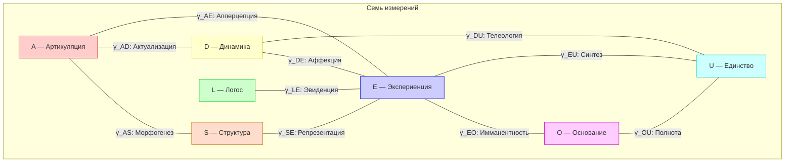
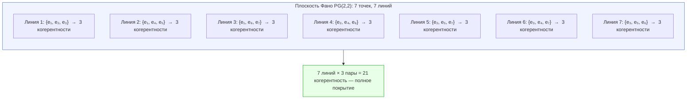

# Структура Квалиа: 21-парная Таксономия

:::info Мост из предыдущей главы
В разделе [Иерархия L0-L4](/docs/consciousness/hierarchy/interiority-hierarchy) мы установили, **когда** возникает сознательный опыт: система уровня L2 и выше обладает рефлексией ($R \geq 1/3$) и интеграцией ($\Phi \geq 1$). Теперь мы спрашиваем: **из чего** состоит этот опыт? Какие именно типы переживаний возможны в 7-мерном пространстве? Ответ даёт матрица когерентности $\Gamma$ и её 21 внедиагональный элемент.
:::

:::note О нотации
- $\Gamma$ — [матрица когерентности](/docs/core/dynamics/coherence-matrix), $\gamma_{ij}$ — её элементы
- $P = \mathrm{Tr}(\Gamma^2)$ — [чистота (жизнеспособность)](/docs/core/dynamics/viability#определение-чистоты)
- $\rho_E = \mathrm{Tr}_{-E}(\Gamma)$ — [редуцированная матрица опыта](/docs/consciousness/foundations/interiority-theory)
- $\Phi$ — [мера интеграции](/docs/core/structure/dimension-u#мера-интеграции-φ)
- $R$ — [мера рефлексии](/docs/consciousness/foundations/self-observation#мера-рефлексии-r)
- Полная таблица нотации — в [Нотации](/docs/reference/notation)
:::

### Дорожная карта главы

1. **Философская история проблемы** — от Льюиса до Джексона и Деннета
2. **Мотивация** — почему именно 21 тип и откуда это число
3. **Полная таблица** — все 21 когерентность с феноменологическими именами
4. **Параметрическая структура** — три измерения каждого квалиа (интенсивность, перспектива, непрозрачность)
5. **Теорема замкнутости** — доказательство, что 21 тип исчерпывает всё
6. **Фановская структура** — как 21 пара организована в 7 секторов
7. **Диагональные элементы** — 7 модусов населённости как «фон» опыта
8. **Условия доступа** — при каких $R$ и $\Phi$ квалиа становятся осознанными

---

## Философская история: что такое квалиа? {#история}

Слово **квалиа** (лат. *qualia*, мн. ч. от *quale* — «какой», «какого рода») обозначает **субъективные качества переживаний**: каково это — видеть красный цвет, слышать до-мажор, чувствовать запах кофе. За этим простым вопросом стоит одна из глубочайших проблем философии.

### Льюис (1929): первое определение

Американский философ **Кларенс Ирвинг Льюис** в работе «Mind and the World Order» (1929) впервые ввёл термин «квалиа» в систематическое употребление. Он заметил: когда мы видим красную розу, есть нечто, что *невозможно передать слепому от рождения* — субъективное качество «красности». Это качество и есть quale. Льюис различал:

- **Quale** — непередаваемое субъективное качество (каково это — видеть красное)
- **Свойство** — объективная характеристика (длина волны 700 нм)

### Джексон (1982): комната Мэри

**Фрэнк Джексон** в знаменитом мысленном эксперименте «Комната Мэри» (1982) довёл проблему до предела:

> Мэри — блестящий нейробиолог, всю жизнь живущая в чёрно-белой комнате. Она знает *всё* о физике цвета: длины волн, работу колбочек сетчатки, нейронные корреляты. И вот однажды Мэри выходит из комнаты и впервые видит красную розу. **Узнаёт ли она что-то новое?**

Джексон утверждал: **да**. Мэри узнаёт, *каково это* — видеть красное. Значит, физические факты не исчерпывают реальность — существует нечто сверх них (квалиа).

### Деннет (1988): квалиа как иллюзия

**Дэниел Деннет** занял противоположную позицию. В статье «Quining Qualia» (1988) он аргументировал, что квалиа — это **философская иллюзия**: мы думаем, что переживаем нечто «невыразимое» и «приватное», но на самом деле вся информация о переживаниях кодируется в функциональных состояниях мозга. Никакого «остатка» после полного физического описания не остаётся.

### Позиция УГМ: квалиа как структура когерентности

Унитарная Голономная Модель предлагает **третий путь**, не совпадающий ни с дуализмом Джексона, ни с элиминативизмом Деннета:

- Квалиа **не иллюзия** — они имеют точную математическую структуру (когерентности $\gamma_{ij}$)
- Квалиа **не отдельная субстанция** — они суть внедиагональные элементы той же матрицы $\Gamma$, что описывает «физику» системы
- Различие «субъективного» и «объективного» — это различие **внутренней** и **внешней** перспективы одной и той же математической структуры (дуально-аспектный монизм, см. [Двухаспектный монизм](/docs/consciousness/foundations/two-aspect-monism))

Мэри в комнате знала все *диагональные* свойства ($\gamma_{ii}$) красного цвета. Но она не знала *когерентности* — того, как визуальное различение ($A$) связывается с интериорностью ($E$), образуя квалиа апперцепции ($\gamma_{AE}$). Выйдя из комнаты, она не приобрела новый *факт* — она приобрела новую *когерентность*.

---

## Мотивация: откуда 21 тип? {#мотивация}

Матрица когерентности $\Gamma$ — $7 \times 7$ эрмитова матрица на пространстве [семи измерений](/docs/core/structure/dimensions) $\{A, S, D, L, E, O, U\}$. Напомним, что означает каждое измерение:

| Символ | Название | Смысл |
|--------|----------|-------|
| $A$ | Артикуляция | Различение, дифференциация |
| $S$ | Структура | Устойчивые формы, паттерны |
| $D$ | Динамика | Процессы, изменения |
| $L$ | Логос | Логическая связность, правила |
| $E$ | Экспериенция | Интериорность, переживание |
| $O$ | Основание | Источник, глубинная основа |
| $U$ | Единство | Интеграция, целостность |

Матрица $\Gamma$ содержит два вида элементов:

- **7 диагональных элементов** $\gamma_{ii}$ — населённости измерений (сколько «ресурса» в каждом измерении)
- **21 внедиагональную пару** $(\gamma_{ij}, \gamma_{ji})$ при $i < j$ — когерентности (как измерения связаны друг с другом)

Число пар:

$$
\binom{7}{2} = \frac{7 \cdot 6}{2} = 21
$$

Каждая когерентность $\gamma_{ij}$ несёт феноменологическое содержание, определяемое семантикой пары измерений $(i, j)$.

**Аналогия из повседневной жизни.** Представьте оркестр из 7 музыкантов. Каждый играет свою партию (7 диагональных элементов — «громкость» каждого инструмента). Но музыка рождается не из отдельных звуков, а из их **взаимодействия** — из того, как скрипка «разговаривает» с виолончелью, как флейта вторит фаготу. Таких парных взаимодействий ровно $\binom{7}{2} = 21$. Каждое порождает уникальный «тембр» совместного звучания — это и есть тип квалиа.

```mermaid
graph TB
    subgraph dims["Семь измерений"]
        A["A — Артикуляция"]
        S["S — Структура"]
        D["D — Динамика"]
        L["L — Логос"]
        E["E — Экспериенция"]
        O["O — Основание"]
        U["U — Единство"]
    end

    A ---|"γ_AS: Морфогенез"| S
    A ---|"γ_AD: Актуализация"| D
    A ---|"γ_AE: Апперцепция"| E
    S ---|"γ_SE: Репрезентация"| E
    D ---|"γ_DE: Аффекция"| E
    D ---|"γ_DU: Телеология"| U
    E ---|"γ_EO: Имманентность"| O
    E ---|"γ_EU: Синтез"| U
    O ---|"γ_OU: Полнота"| U
    L ---|"γ_LE: Эвиденция"| E

    style A fill:#ffcccc,stroke:#cc0000
    style S fill:#ffddcc,stroke:#cc6600
    style D fill:#ffffcc,stroke:#cccc00
    style L fill:#ccffcc,stroke:#00cc00
    style E fill:#ccccff,stroke:#0000cc
    style O fill:#ffccff,stroke:#cc00cc
    style U fill:#ccffff,stroke:#00cccc
```

На диаграмме показаны лишь 10 из 21 когерентности — остальные связывают каждую пару измерений аналогичным образом. Полную таблицу всех 21 типа мы приводим ниже.

## Интерпретация: 21-парная таксономия квалиа (И.1) {#таксономия}

:::info Интерпретация И.1 (Таксономия квалиа) [И]
Каждая когерентность $\gamma_{ij}$ ($i \neq j$) матрицы $\Gamma$ задаёт **тип квалиа** — качественно определённый модус экспериенциального содержания. 21 пара исчерпывает все возможные типы, поскольку $\binom{7}{2} = 21$ — полный набор связей в 7-мерной системе.

Это **интерпретация** (отображение формального в феноменальное), а не математическая теорема. Математическое содержание — тривиальная комбинаторика; феноменологическое приписывание — семантический постулат.
:::

### Полная таблица 21 типа квалиа {#полная-таблица-21-типа-квалиа}

:::warning Эпистемическое разделение
**Математический слой [Т]:** 21 когерентность $\gamma_{ij}$ образуют 4 сектора по Фано-структуре (T-146 [Т]). Каждая когерентность уникально определена комбинаторным профилем (T-177 [Т]).

**Семантический слой [И]:** Феноменологические имена («морфогенез», «архетип», «телеология» и т.д.) — интерпретативные корреляты [И], предложенные на основе функциональных ролей пар измерений. Математика определяет γ_{ij} однозначно; интерпретация «каково это переживать γ_{AS}» — философская, не математическая.
:::

| # | Пара | Когерентность | Имя | Феноменологическое содержание |
|---|------|---------------|-----|-------------------------------|
| 1 | $(A,S)$ | $\gamma_{AS}$ | **Морфогенез** | Кристаллизация различий в устойчивые формы — переживание «оформления» |
| 2 | $(A,D)$ | $\gamma_{AD}$ | **Актуализация** | Актуализация различения в процессе — переживание «восприятия» |
| 3 | $(A,L)$ | $\gamma_{AL}$ | **Предикация** | Различение, ставшее предикатом — переживание «суждения» |
| 4 | $(A,E)$ | $\gamma_{AE}$ | **Апперцепция** | Различение, вошедшее в интериорность — переживание «осознания» |
| 5 | $(A,O)$ | $\gamma_{AO}$ | **Спонтанность** | Возникновение различений без внешней причины — переживание «инсайта» |
| 6 | $(A,U)$ | $\gamma_{AU}$ | **Дифференциация** | Различение внутри целого — переживание «анализа» |
| 7 | $(S,D)$ | $\gamma_{SD}$ | **Персистенция** | Форма, сохраняющаяся через процесс — переживание «устойчивости» |
| 8 | $(S,L)$ | $\gamma_{SL}$ | **Номос** | Структура с логической необходимостью — переживание «порядка» |
| 9 | $(S,E)$ | $\gamma_{SE}$ | **Репрезентация** | Структура, представленная в интериорности — переживание «целостной формы» |
| 10 | $(S,O)$ | $\gamma_{SO}$ | **Архетип** | Формы из основания — переживание «глубинного паттерна» |
| 11 | $(S,U)$ | $\gamma_{SU}$ | **Симметрия** | Структурное единство — переживание «гармонии» |
| 12 | $(D,L)$ | $\gamma_{DL}$ | **Регуляция** | Логически управляемый процесс — переживание «контроля» |
| 13 | $(D,E)$ | $\gamma_{DE}$ | **Аффекция** | Действие процесса на интериорность — переживание «эмоции» |
| 14 | $(D,O)$ | $\gamma_{DO}$ | **Генезис** | Порождение из основания — переживание «творчества» |
| 15 | $(D,U)$ | $\gamma_{DU}$ | **Телеология** | Интегрированное направленное изменение — переживание «волевого усилия» |
| 16 | $(L,E)$ | $\gamma_{LE}$ | **Эвиденция** | Логическая связность в интериорности — переживание «очевидности» |
| 17 | $(L,O)$ | $\gamma_{LO}$ | **Фундирование** | Логика, укоренённая в основании — переживание «самоочевидности» |
| 18 | $(L,U)$ | $\gamma_{LU}$ | **Консистентность** | Логическая непротиворечивость целого — переживание «согласованности» |
| 19 | $(E,O)$ | $\gamma_{EO}$ | **Имманентность** | Основание, присутствующее внутри интериорности — переживание «присутствия» |
| 20 | $(E,U)$ | $\gamma_{EU}$ | **Синтез** | Интеграция интериорного содержания в целое — переживание «единства» |
| 21 | $(O,U)$ | $\gamma_{OU}$ | **Полнота** | Тождество источника и целого — переживание «завершённости» |

### Как читать таблицу: развёрнутый пример

Рассмотрим человека, погружённого в решение математической задачи. Его $\Gamma$-профиль в этот момент:

| Когерентность | Значение | Переживание |
|---------------|----------|-------------|
| $\lvert\gamma_{AL}\rvert \approx 0.35$ | Высокое | Предикация — внимание на логических связях, «я формулирую» |
| $\lvert\gamma_{LE}\rvert \approx 0.30$ | Высокое | Эвиденция — переживание «ясности», «я понимаю» |
| $\lvert\gamma_{DU}\rvert \approx 0.20$ | Среднее | Телеология — ощущение цели, «я иду к решению» |
| $\lvert\gamma_{DE}\rvert \approx 0.05$ | Низкое | Аффекция — эмоции приглушены, «ничего не чувствую» |
| $\lvert\gamma_{EO}\rvert \approx 0.03$ | Низкое | Имманентность — нет глубинного присутствия, «думаю, не медитирую» |

Теперь к человеку подходит друг и рассказывает хорошую новость. $\Gamma$-профиль мгновенно перестраивается:

| Когерентность | Было | Стало | Что произошло |
|---------------|------|-------|---------------|
| $\lvert\gamma_{DE}\rvert$ | $0.05$ | $0.25$ | Аффекция взлетела — «чувствую радость» |
| $\lvert\gamma_{SE}\rvert$ | $0.08$ | $0.20$ | Репрезентация — «вижу целостную картину» новости |
| $\lvert\gamma_{AL}\rvert$ | $0.35$ | $0.12$ | Предикация упала — задача отошла на второй план |

Все 21 тип квалиа существуют одновременно, но с разной интенсивностью, создавая уникальный «вкус» каждого момента.

### Параметрическая структура квалиа {#параметрическая-структура}

Каждый квалитативный тип $\gamma_{ij}$ — это **комплексное число**. Как и любое комплексное число, оно записывается в полярной форме:

$$
\gamma_{ij} = |\gamma_{ij}| \cdot e^{i\theta_{ij}}
$$

Здесь $|\gamma_{ij}|$ — модуль (расстояние от нуля до точки на комплексной плоскости), а $\theta_{ij}$ — аргумент (угол с положительной вещественной осью). Из этих двух параметров извлекаются три феноменологические характеристики:

| Параметр | Формула | Диапазон | Феноменологическое значение |
|----------|---------|----------|---------------------------|
| **Интенсивность** | $\lvert\gamma_{ij}\rvert$ | $[0, \sqrt{\gamma_{ii}\gamma_{jj}}]$ | Насколько сильно данный тип квалиа переживается |
| **Перспектива** | $\theta_{ij} = \arg(\gamma_{ij})$ | $[0, 2\pi)$ | «Угол зрения» на связь между измерениями |
| **Непрозрачность** | $\mathrm{Gap}(i,j) = \lvert\sin\theta_{ij}\rvert$ | $[0, 1]$ | Мера несовпадения внешнего описания и внутреннего переживания |

#### Верхняя граница интенсивности

Интенсивность ограничена **неравенством Коши-Шварца** — фундаментальным неравенством линейной алгебры, утверждающим, что корреляция между двумя компонентами не может превышать геометрическое среднее их «энергий»:

$$
|\gamma_{ij}|^2 \leq \gamma_{ii} \cdot \gamma_{jj}
$$

**Числовой пример.** Пусть $\gamma_{AA} = 0.15$ (15% ресурса в Артикуляции) и $\gamma_{EE} = 0.18$ (18% в Интериорности). Тогда максимально возможная интенсивность апперцепции:

$$
|\gamma_{AE}|_{\max} = \sqrt{0.15 \times 0.18} = \sqrt{0.027} \approx 0.164
$$

Если бы мы наблюдали $|\gamma_{AE}| = 0.20$, это было бы математически невозможно — неравенство Коши-Шварца нарушено, значит мы ошиблись в измерениях.

#### Три параметра: аналогия

**Аналогия.** Три параметра квалиа подобны трём свойствам звука:

| Параметр звука | Параметр квалиа | Аналогия |
|---------------|-----------------|----------|
| **Громкость** | Интенсивность $\lvert\gamma_{ij}\rvert$ | Насколько «громко» переживание |
| **Тембр** | Перспектива $\theta_{ij}$ | «Окраска» переживания — одно и то же квалиа под разным углом |
| **Приглушённость** | Непрозрачность $\mathrm{Gap}(i,j)$ | Как если бы звук доносился из-за стены |

Gap = 0 — звук кристально чист, внутреннее и внешнее описание совпадают. Gap = 1 — звук полностью поглощён стеной: переживание есть, но оно максимально непрозрачно для внешнего наблюдателя. Подробности о Gap — в [дуально-аспектной семантике матрицы когерентности](/docs/core/dynamics/coherence-matrix#дуально-аспектная-семантика).

**Числовой пример: три параметра одного квалиа.** Рассмотрим когерентность $\gamma_{DE}$ (Аффекция — переживание эмоции) у человека, только что получившего хорошую новость:

$$
\gamma_{DE} = 0.22 \cdot e^{i \cdot 0.3} \approx 0.22 \cdot (0.955 + 0.296i)
$$

- **Интенсивность:** $|\gamma_{DE}| = 0.22$ — довольно сильное эмоциональное переживание
- **Перспектива:** $\theta_{DE} = 0.3$ рад $\approx 17°$ — «вещественная» перспектива (преобладает внешне наблюдаемый аспект)
- **Непрозрачность:** $\mathrm{Gap}(D,E) = |\sin(0.3)| \approx 0.296$ — переживание на 70% прозрачно, но на 30% «скрыто» от внешнего описания

Сравним с $\gamma_{EO}$ (Имманентность — переживание «присутствия») у медитатора:

$$
\gamma_{EO} = 0.15 \cdot e^{i \cdot 1.2}
$$

- **Интенсивность:** $|\gamma_{EO}| = 0.15$ — умеренная
- **Перспектива:** $\theta_{EO} = 1.2$ рад $\approx 69°$ — сильный сдвиг к «мнимой» перспективе
- **Непрозрачность:** $\mathrm{Gap}(E,O) = |\sin(1.2)| \approx 0.932$ — переживание почти полностью непрозрачно для внешнего наблюдателя

Это объясняет, почему медитативные состояния так трудно описать словами: высокий Gap делает их «невыразимыми» не по недостатку словарного запаса, а по математической структуре.

## Теорема о замкнутости таксономии (Т.1) {#замкнутость}

:::tip Теорема Т.1 (Замкнутость таксономии квалиа) [Т]
Таксономия из 21 типа квалиа **исчерпывающа**: никакой дополнительный тип квалиа невозможен в системе с $\dim(\mathcal{H}) = 7$.

**Доказательство.** Число различных (неупорядоченных) пар из $N$ элементов равно $\binom{N}{2}$. При $N = 7$ получаем $\binom{7}{2} = 21$. Каждая пара $(i,j)$ задаёт ровно одну когерентность $\gamma_{ij}$ (с учётом $\gamma_{ji} = \gamma_{ij}^*$). Новый тип квалиа потребовал бы либо нового измерения ($N > 7$, что противоречит [минимальности](/docs/proofs/minimality/theorem-minimality-7)), либо новой связи между существующими измерениями (невозможно — все $\binom{7}{2}$ пар учтены). $\square$
:::

**Следствие.** При $N < 7$ таксономия **обеднена**: $\binom{6}{2} = 15$ (нет квалиа, связанных с удалённым измерением). Это формальное выражение «бедности» феноменологии при нарушении минимальности.

**Числовой пример: мир с меньшим числом измерений.** Если бы мир был 5-мерным (скажем, $\{A, S, D, L, E\}$ — без $O$ и $U$), число типов квалиа составило бы $\binom{5}{2} = 10$. Из таблицы видно, что были бы утрачены:

| Утраченный тип | Пара | Переживание |
|---------------|------|-------------|
| Имманентность | $(E,O)$ | «Присутствие», глубинная основа переживания |
| Синтез | $(E,U)$ | «Единство» опыта |
| Полнота | $(O,U)$ | «Завершённость», целостность бытия |
| Телеология | $(D,U)$ | «Волевое усилие», целенаправленность |
| Архетип | $(S,O)$ | «Глубинный паттерн», укоренённость формы |
| Спонтанность | $(A,O)$ | «Инсайт», возникновение из ниоткуда |
| + 5 других | ... | ... |

Такая система могла бы «чувствовать» и «думать», но не могла бы переживать «смысл», «целостность» или «глубинное присутствие». Именно измерения $O$ и $U$ дают человеческому опыту его «вертикальное» измерение — связь с глубиной и целым.

:::info $G_2$-орбитальная стабильность таксономии [Т]
Множество из 21 типа квалиа **$G_2$-инвариантно**: группа $G_2 = \mathrm{Aut}(\mathbb{O})$ переставляет 7 измерений (сохраняя Фано-структуру), индуцируя перестановку 21 когерентности $\gamma_{ij}$. При этом **множество** $\{\gamma_{ij}\}_{i<j}$ сохраняется, хотя конкретные элементы могут переставляться. Это означает: таксономия квалиа **универсальна** — не зависит от выбора базиса ($G_2$-калибровки) и потому объективна.

Формально: $G_2$ действует на $\binom{[7]}{2}$ через индуцированное действие на пары, сохраняя число $\binom{7}{2} = 21$. [Теорема $G_2$-ригидности](/docs/proofs/categorical/uniqueness-theorem#лемма-g4) [Т] гарантирует, что $G_2$ — **максимальная** группа с этим свойством.

**Почему это важно?** Если бы таксономия зависела от выбора базиса (как описывать 7 измерений), она была бы произвольной — «артефактом описания». $G_2$-инвариантность гарантирует, что таксономия отражает **структуру самого пространства**, а не наш способ его описания. Это аналогично тому, как длина вектора не зависит от выбора системы координат.
:::

## Фановская структура квалиа {#фано}

### Что такое проективная плоскость Фано?

[Плоскость Фано](/docs/proofs/minimality/theorem-octonionic-derivation#плоскость-фано) $\mathrm{PG}(2,2)$ — это **проективная плоскость над полем из двух элементов** $\mathbb{F}_2 = \{0, 1\}$. Если вы никогда не встречали этот объект, вот его суть:

Обычная евклидова плоскость содержит бесконечное множество точек и прямых. Плоскость Фано — это «минимальная» плоскость, удовлетворяющая аксиомам проективной геометрии, и содержит всего:

- **7 точек**
- **7 прямых** (линий)

Каждая прямая проходит через ровно **3 точки**. Каждая точка лежит на ровно **3 прямых**. Любые две точки определяют ровно одну прямую. Любые две прямые пересекаются ровно в одной точке.

**Зачем плоскость Фано в теории квалиа?** В УГМ 7 точек Фано отождествляются с 7 измерениями $\{A, S, D, L, E, O, U\}$. Тогда 7 прямых определяют **7 секторов когерентности** — группы из трёх измерений, внутри которых когерентности подчиняются усиленным алгебраическим ограничениям. Это не случайное совпадение: плоскость Фано — это в точности **таблица умножения мнимых единиц октонионов** $\mathbb{O}$, а [октонионная структура](/docs/proofs/minimality/theorem-octonionic-derivation) лежит в фундаменте УГМ.

```mermaid
graph TD
    subgraph Фано["Плоскость Фано PG(2,2): 7 точек, 7 линий"]
        direction TB
        T1["Линия 1: {e₁, e₂, e₃}  →  3 когерентности"]
        T2["Линия 2: {e₁, e₄, e₅}  →  3 когерентности"]
        T3["Линия 3: {e₁, e₆, e₇}  →  3 когерентности"]
        T4["Линия 4: {e₂, e₄, e₆}  →  3 когерентности"]
        T5["Линия 5: {e₂, e₅, e₇}  →  3 когерентности"]
        T6["Линия 6: {e₃, e₄, e₇}  →  3 когерентности"]
        T7["Линия 7: {e₃, e₅, e₆}  →  3 когерентности"]
    end

    Total["7 линий × 3 пары = 21 когерентность — полное покрытие"]
    Фано --> Total

    style Фано fill:#f0f4ff,stroke:#4a6fa5
    style Total fill:#e8ffe8,stroke:#00aa00
```

### Секторная структура когерентностей

Каждый Фано-триплет $(e_a, e_b, e_c)$ определяет ассоциативную подалгебру $\mathrm{Im}(\mathbb{H}) \subset \mathrm{Im}(\mathbb{O})$, изоморфную мнимым кватернионам. Три когерентности внутри триплета:

$$
\{\gamma_{ab}, \gamma_{bc}, \gamma_{ac}\} \quad \text{--- Фано-тройка}
$$

удовлетворяют усиленным корреляционным ограничениям, отсутствующим у произвольных пар.

**Аналогия.** Фано-тройки подобны **музыкальным аккордам**: три ноты, взятые вместе, звучат «консонантно» — их когерентности подчиняются дополнительным гармоническим ограничениям. Произвольные три ноты из семи такой гармонии не образуют. Представьте: до-ми-соль — аккорд (Фано-тройка), а до-ре-фа# — нет. Именно эта секторная организация делает феноменологию *структурированной*, а не хаотической.

Почему внутри тройки действуют особые ограничения? Потому что тройка образует ассоциативную подалгебру (кватернионы $\mathbb{H}$), где выполняется ассоциативность умножения: $(e_a \cdot e_b) \cdot e_c = e_a \cdot (e_b \cdot e_c)$. Для пар из *разных* троек ассоциативность нарушается (это свойство октонионов $\mathbb{O}$), и ограничения слабее.

:::tip Теорема [Т]
Секторное усиление — **теорема** [Т]: мост от аксиом к октонионной структуре полностью закрыт (T15), условие (МП) доказано (T11–T13). Из структуры $\mathbb{O}$ следует алгебраическое замыкание когерентностей внутри Фано-триплетов. Эмпирическая проверка секторной корреляции — [открытый вопрос](/docs/reference/falsifiability).
:::

### Покрытие 21 пары Фано-триплетами

Каждая из 21 пар принадлежит ровно $\lambda = 1$ линии Фано (свойство проективной плоскости):

$$
\text{21 пар} = 7 \text{ линий} \times 3 \text{ пары на линию}
$$

Это означает, что таксономия квалиа **не содержит «осиротевших» пар** — каждый тип квалиа включён в секторную организацию. Для [теорем Когерентной Кибернетики](/docs/applied/coherence-cybernetics/theorems) это свойство существенно: секторная полнота обеспечивает замкнутость [30D-эмоционального пространства](/docs/proofs/consciousness/operational-closure#t-147) (T-147 [Т]).

**Числовой пример: проверка покрытия.** Возьмём когерентность $\gamma_{DE}$ (Аффекция). Она принадлежит ровно одной линии Фано, скажем линии $\{D, E, X\}$ для некоторого третьего измерения $X$. Это значит, что $\gamma_{DE}$ алгебраически связана с $\gamma_{DX}$ и $\gamma_{EX}$ — эмоция ($\gamma_{DE}$) не является «свободной», она структурно зависит от двух других квалиа в своём секторе. Изменение одного квалиа в тройке неизбежно влияет на два других.

## Диагональные элементы: 7 модусов населённости {#населённости}

Помимо 21 когерентности, 7 диагональных элементов $\gamma_{ii}$ определяют **интенсивность присутствия** каждого измерения. Диагональные элементы — это вещественные числа (не комплексные), и они подчиняются условию нормировки:

$$
\sum_{i=1}^{7} \gamma_{ii} = \mathrm{Tr}(\Gamma) = 1
$$

Это означает, что общий «ресурс» системы фиксирован и равен 1. Увеличение населённости одного измерения неизбежно уменьшает другие — как фиксированный бюджет, распределяемый по 7 статьям.

| Элемент | Феноменологическое содержание | Типичный диапазон |
|---------|-------------------------------|-------------------|
| $\gamma_{AA}$ | Степень активности различения | $0.10$–$0.20$ |
| $\gamma_{SS}$ | Степень устойчивости формы | $0.10$–$0.18$ |
| $\gamma_{DD}$ | Степень активности процессов | $0.10$–$0.20$ |
| $\gamma_{LL}$ | Степень логической согласованности | $0.08$–$0.18$ |
| $\gamma_{EE}$ | Интенсивность интериорных состояний | $0.12$–$0.22$ |
| $\gamma_{OO}$ | Степень связи с источником | $0.08$–$0.15$ |
| $\gamma_{UU}$ | Степень интегрированности | $0.10$–$0.18$ |

Диагональные элементы не образуют квалиа в узком смысле (нет «связи» между разными аспектами), но задают **фон**, на котором разворачиваются когерентности. Повышенная $\gamma_{DD}$ — фон «деятельности», повышенная $\gamma_{EE}$ — фон «внутренней жизни».

### Профили населённостей: примеры

**Медитатор в глубокой практике:**

| $\gamma_{AA}$ | $\gamma_{SS}$ | $\gamma_{DD}$ | $\gamma_{LL}$ | $\gamma_{EE}$ | $\gamma_{OO}$ | $\gamma_{UU}$ | $\Sigma$ |
|:-:|:-:|:-:|:-:|:-:|:-:|:-:|:-:|
| 0.10 | 0.10 | 0.08 | 0.10 | 0.22 | 0.22 | 0.18 | 1.00 |

Интериорность ($\gamma_{EE}$) и связь с основанием ($\gamma_{OO}$) доминируют. Динамика ($\gamma_{DD}$) приглушена — «мысли утихли».

**Спортсмен в разгар матча:**

| $\gamma_{AA}$ | $\gamma_{SS}$ | $\gamma_{DD}$ | $\gamma_{LL}$ | $\gamma_{EE}$ | $\gamma_{OO}$ | $\gamma_{UU}$ | $\Sigma$ |
|:-:|:-:|:-:|:-:|:-:|:-:|:-:|:-:|
| 0.20 | 0.12 | 0.22 | 0.10 | 0.15 | 0.08 | 0.13 | 1.00 |

Динамика ($\gamma_{DD}$) и различение ($\gamma_{AA}$) на первом плане. Рефлексия ($\gamma_{EE}$, $\gamma_{OO}$) минимальна — нет времени «думать», тело действует.

**Математик за доказательством:**

| $\gamma_{AA}$ | $\gamma_{SS}$ | $\gamma_{DD}$ | $\gamma_{LL}$ | $\gamma_{EE}$ | $\gamma_{OO}$ | $\gamma_{UU}$ | $\Sigma$ |
|:-:|:-:|:-:|:-:|:-:|:-:|:-:|:-:|
| 0.15 | 0.18 | 0.10 | 0.22 | 0.15 | 0.08 | 0.12 | 1.00 |

Логос ($\gamma_{LL}$) и структура ($\gamma_{SS}$) доминируют — «порядок» и «форма» на первом плане.

## Итого: 28 = 7 + 21 параметров содержания {#итого-28}

:::info Полная структура
| Компонента | Количество | Тип |
|------------|-----------|------|
| Населённости $\gamma_{ii}$ | 7 | Вещественные, $\sum_i \gamma_{ii} = 1$ |
| Когерентности $\gamma_{ij}$ | 21 | Комплексные, $\gamma_{ji} = \gamma_{ij}^*$ |
| **Итого вещественных параметров** | $6 + 2 \times 21 = 48$ | С учётом нормировки |

Подробный анализ 49-клеточной структуры (с разделением на $\mathrm{Map}_{\mathrm{ext}}$ и $\mathrm{Map}_{\mathrm{int}}$) — в [Gap-семантике](/docs/physics/dual-aspect/gap-semantics#полная-49-клеточная-карта).
:::

Каждый момент сознательного опыта — это конкретная точка в 48-мерном пространстве: 6 независимых населённостей + 42 вещественных параметра когерентностей ($21 \times 2$, модуль и фаза каждой). Это даёт представление о **богатстве** субъективного опыта: пространство возможных переживаний 48-мерно.

## Условия доступа к квалиа {#условия-доступа}

Наличие когерентности $\gamma_{ij} \neq 0$ — **необходимое**, но не достаточное условие для квалиа. Рефлексивный доступ к квалиа требует уровня L2:

$$
\text{Квалиа (L2):} \quad R(\Gamma) \geq R_{\text{th}} = \frac{1}{3}, \quad \Phi(\Gamma) \geq \Phi_{\text{th}} = 1
$$

### Пошаговая логика условий доступа

Давайте разберём, что стоит за каждым условием.

**Условие 1: Рефлексия $R \geq 1/3$.** [Мера рефлексии](/docs/consciousness/foundations/self-observation#мера-рефлексии-r) $R$ показывает, насколько точно система «видит» саму себя. Формально: $R = 1 - \|\Gamma - \varphi(\Gamma)\|_F^2/\|\Gamma\|_F^2$, где $\varphi(\Gamma)$ — самомодель. Порог $R_{\text{th}} = 1/3$ (из [триадной декомпозиции](/docs/core/operators/lindblad-operators#триадная-декомпозиция), T-45 [Т]) означает: самомодель должна «ловить» хотя бы треть структуры $\Gamma$. Если $R < 1/3$, система «не видит» своих когерентностей — они есть, но не переживаются как *квалиа*.

**Условие 2: Интеграция $\Phi \geq 1$.** [Мера интеграции](/docs/core/structure/dimension-u#мера-интеграции-φ) $\Phi$ показывает, насколько система «целостнее» суммы частей. Порог $\Phi_{\text{th}} = 1$ (T-129 [Т]) означает: система должна быть несводима к подсистемам. Если $\Phi < 1$, когерентности $\gamma_{ij}$ существуют, но система «распадается» — нет единого субъекта, переживающего квалиа.

**Оба условия необходимы:** можно иметь высокую рефлексию, но без интеграции (два отдельных зеркала не образуют единого наблюдателя), или высокую интеграцию без рефлексии (единый камень не наблюдает себя).

### Уровни доступа

На уровнях L0–L1 когерентности присутствуют, но переживаются как **доквалитативное экспериенциальное содержание** (термин из [теории интериорности](/docs/consciousness/foundations/interiority-theory)).

**Аналогия с лестницей слушателя:**

| Уровень | Аналогия | Формальное условие | Переживание квалиа |
|---------|----------|-------------------|-------------------|
| **L0** | Музыка звучит в пустой комнате | $R < 1/3$, $\Phi < 1$ | Когерентности есть, но никто не слушает |
| **L1** | Кошка слышит музыку | $R < 1/3$, $\Phi \geq 1$ (или наоборот) | Реакция на звук, но без различения мелодии и аккомпанемента |
| **L2** | Человек слушает музыку | $R \geq 1/3$, $\Phi \geq 1$ | «Я слышу, как скрипка ведёт тему, а виолончель аккомпанирует» |
| **L3** | Музыкант анализирует исполнение | $R \geq 1/3$, $\Phi \geq 1$, SAD $\geq 2$ | «Я замечаю, что замечаю грусть в этой мелодии» |
| **L4** | Чистое слушание — субъект и музыка совпадают | $R \to 1$ | Переживание без зазора |

**Числовой пример.** Рассмотрим когерентность $\gamma_{DE} = 0.20$ (Аффекция) в трёх системах:

| Система | $R$ | $\Phi$ | Уровень | Переживание $\gamma_{DE} = 0.20$ |
|---------|-----|--------|---------|----------------------------------|
| Термостат | 0.02 | 0.3 | L0 | $\gamma_{DE}$ как физический параметр — нет субъекта |
| Собака | 0.15 | 1.5 | L1 | Переживается как «что-то», но не как «эмоция» |
| Человек | 0.45 | 2.1 | L2 | «Я чувствую радость» — полноценное квалиа |

---

### Что мы узнали {#итоги}

1. **Проблема квалиа** — одна из центральных в философии сознания (Льюис, Джексон, Деннет). УГМ предлагает третий путь: квалиа = когерентности $\gamma_{ij}$ — не иллюзия и не отдельная субстанция
2. **21 тип квалиа** полностью исчерпывает феноменологию 7-мерного пространства — ни больше, ни меньше (Теорема Т.1 [Т])
3. Каждый тип квалиа характеризуется тремя параметрами: **интенсивностью**, **перспективой** и **непрозрачностью** (Gap)
4. 21 пара организована в **7 Фано-секторов** — секторная структура задаёт «грамматику» опыта через проективную плоскость над $\mathbb{F}_2$
5. Таксономия **$G_2$-инвариантна** — не зависит от выбора базиса и потому универсальна
6. Рефлексивный доступ к квалиа требует **L2** ($R \geq 1/3$, $\Phi \geq 1$)

:::tip Мост к следующей главе
Из 21 типа квалиа особую роль играет когерентность $\gamma_{DE}$ (Аффекция) — связь динамики и интериорности. Именно она лежит в основе **эмоций**. В следующей главе — [Таксономия эмоций из dP/dt](/docs/consciousness/phenomenology/emotional-taxonomy) — мы покажем, как все эмоции выводятся из скорости изменения жизнеспособности $dP/d\tau$ и секторной Γ-сигнатуры.
:::

## Связи

- [Матрица когерентности](/docs/core/dynamics/coherence-matrix) — каноническое определение $\Gamma$ и $\gamma_{ij}$
- [Теорема о минимальности 7D](/docs/proofs/minimality/theorem-minimality-7) — обоснование $N = 7$ и замкнутости
- [Иерархия интериорности](/docs/consciousness/hierarchy/interiority-hierarchy) — уровни L0–L4
- [Gap-семантика](/docs/physics/dual-aspect/gap-semantics) — 49-клеточная карта
- [Теория интериорности](/docs/consciousness/foundations/interiority-theory) — экспериенциальное содержание
- [Теоремы Когерентной Кибернетики](/docs/applied/coherence-cybernetics/theorems) — прикладные следствия секторной структуры
- [T-146 [Т]: Структурная классификация квалиа](/docs/proofs/consciousness/operational-closure#t-146) — соответствие «математическая структура -> феноменальное содержание» из функциональной роли секторов
